::: {.cell}

```{.r .cell-code}
# hide this code chunk
#| echo: false
#| message: false

# defines the se function
se <- function(x) {
  sd(x, na.rm = TRUE) / sqrt(length(x))
}

#load these packages, nearly always needed
library(tidyverse)

# sets maize and blue color scheme
color_scheme <- c("#00274c", "#ffcb05")
```
:::


## Purpose

This script analyses the results from a DESeq2 and MEME analysis of GSE236575.  The purpose of this analysis is to identify differentially expressed regions and enriched motifs in that dataset.  See the README.md file in this folder for details on the generation of these files

## Raw Data

Describe your raw data files, including what the columns mean (and what units they are in).


::: {.cell}

```{.r .cell-code}
library(readr) #loads the readr package
deseq.filename <- "results/deseq2/deseq2_results.txt" #input file(s)
deseq.counts.filename <- "results/deseq2/deseq2_normalized_counts.txt"

deseq.results <- read_tsv(deseq.filename) #reads in the data
```
:::


These data can be found in /Users/davebrid/Documents/GitHub/CushingAcromegalyStudy/external-datasets/snATACseq/GSE236575 in a file named results/deseq2/deseq2_results.txt.  This input file was most recently updated on 2026-05-20.  This script was most recently updated on Wed May 27 17:42:09 2026.

## Analysis

There were 61619 regions analyzed in this dataset.  Of these, 14872 (24.1354128%) were found to be significantly differentially accessible comparing the NCD to HFD adipocytes at an FDR of 0.05.  Of those significant regions, 8612 (57.9074771%) were upregulated in HFD adipocytes and (42.0925229%) were more accessible in NCD adipocytes.

Out of the differentially regulated subset, the HFD adipocytes had an average log2 fold change of 1.5394525 +/- 0.0065426, while the NCD adipocytes had an average log2 fold change of -0.817636 +/- 0.0037877.

> **Note on peak cutoffs.** The counts above use the volcano-narrative cutoff
> `padj < 0.05` (no log2FC magnitude threshold): 8612 HFD-up
> and 6260 CHD-up peaks. The motif-scanned
> *canonical* peak sets (`results/deseq2/HFD_specific_peaks.bed` / `CHD_specific_peaks.bed`
> and everything downstream — AME, HOMER, composite scan, full motif scan) use the
> stricter pipeline cutoff `padj < 0.05 & |log2FC| > 1`, giving
> 6900 HFD-specific and
> 1322 CHD-specific peaks.
> The composite/AME enrichment ORs reported in `SUMMARY.md` use these stricter sets as
> denominators; the volcano below classifies the full padj < 0.05 set so that peaks with
> 0 < |log2FC| ≤ 1 (which sit in the `shared` BED but are still nominally significant)
> are not silently excluded from the AP-1/GRE display.


### Annotation to known genes


::: {.cell}

```{.r .cell-code}
library(ChIPseeker)
library(GenomicRanges)
library(TxDb.Mmusculus.UCSC.mm10.knownGene)
library(org.Mm.eg.db)

# BED files from main.nf use UCSC-style chr-prefixed naming (chr1, chrM, ...)
# so deseq.results$chr is already "chr1" etc. — no extra prefixing needed.
hfd.peaks <- deseq.results |> filter(padj<0.05, log2FoldChange>0)
hfd.gr <- with(hfd.peaks, GRanges(seqnames=chr, ranges=IRanges(start+1, end))) # 0-based BED -> 1-based GRanges
txdb <- TxDb.Mmusculus.UCSC.mm10.knownGene

hfd.annot <- annotatePeak(hfd.gr, TxDb=txdb, tssRegion=c(-2000, 500), annoDb="org.Mm.eg.db")
```

::: {.cell-output .cell-output-stdout}

```
>> preparing features information...		 2026-05-27 17:42:14 
>> Using Genome: mm10 ...
>> identifying nearest features...		 2026-05-27 17:42:14 
>> calculating distance from peak to TSS...	 2026-05-27 17:42:15 
>> assigning genomic annotation...		 2026-05-27 17:42:15 
>> Using Genome: mm10 ...
>> Using Genome: mm10 ...
>> adding gene annotation...			 2026-05-27 17:42:23 
```


:::

::: {.cell-output .cell-output-stdout}

```
>> assigning chromosome lengths			 2026-05-27 17:42:24 
>> done...					 2026-05-27 17:42:24 
```


:::

```{.r .cell-code}
hfd.ann_df <- as.data.frame(hfd.annot)

ncd.peaks <- deseq.results |> filter(padj<0.05, log2FoldChange<0)
ncd.gr <- with(ncd.peaks, GRanges(seqnames=chr, ranges=IRanges(start+1, end)))

ncd.annot <- annotatePeak(ncd.gr, TxDb=txdb, tssRegion=c(-2000, 500), annoDb="org.Mm.eg.db")
```

::: {.cell-output .cell-output-stdout}

```
>> preparing features information...		 2026-05-27 17:42:24 
>> Using Genome: mm10 ...
>> identifying nearest features...		 2026-05-27 17:42:24 
>> calculating distance from peak to TSS...	 2026-05-27 17:42:24 
>> assigning genomic annotation...		 2026-05-27 17:42:24 
>> Using Genome: mm10 ...
>> Using Genome: mm10 ...
>> adding gene annotation...			 2026-05-27 17:42:25 
```


:::

::: {.cell-output .cell-output-stdout}

```
>> assigning chromosome lengths			 2026-05-27 17:42:25 
>> done...					 2026-05-27 17:42:25 
```


:::

```{.r .cell-code}
ncd.ann_df <- as.data.frame(ncd.annot)

all.gr <- with(deseq.results, GRanges(seqnames=chr, ranges=IRanges(start+1, end)))
all.ann_df <- as.data.frame(annotatePeak(all.gr, TxDb=txdb, tssRegion=c(-2000, 500), annoDb="org.Mm.eg.db"))
```

::: {.cell-output .cell-output-stdout}

```
>> preparing features information...		 2026-05-27 17:42:25 
>> Using Genome: mm10 ...
>> identifying nearest features...		 2026-05-27 17:42:25 
>> calculating distance from peak to TSS...	 2026-05-27 17:42:26 
>> assigning genomic annotation...		 2026-05-27 17:42:26 
>> Using Genome: mm10 ...
>> Using Genome: mm10 ...
>> adding gene annotation...			 2026-05-27 17:42:27 
```


:::

::: {.cell-output .cell-output-stdout}

```
>> assigning chromosome lengths			 2026-05-27 17:42:27 
>> done...					 2026-05-27 17:42:27 
```


:::
:::


These 8612 chromatin regions that were differentially opened by HFD were annotated as closest to 4632 unique genes, whereas the 6260 regions more accessible in NCD were annotated as closest to 3560 unique genes.  

### Volcano Plots of Regions

Each HFD-opened peak (padj < 0.05, log2FC > 0) is classified by motif content of
its 500 bp summit window: AP-1 family (35 JASPAR 2024 bZIP motifs; JUN/JUNB/JUND,
FOS/FOSL1/FOSL2, BATF/BATF3, ATF3 and all Jun·Fos heterodimers), and GRE
(NR3C1 MA0113.4 + Pgr/PGR IR3 proxies MA2323.1/MA2327.1). AP-1 calls come from
the full-motif FIMO scan for HFD/CHD-specific peaks and from
`shared_ap1_per_peak.tsv` for shared peaks; GR calls come from the composite scan.


::: {.cell}

```{.r .cell-code}
library(readr)
library(dplyr)
library(stringr)

ap1_ids <- c(
  "MA0099.4","MA0462.3","MA0476.2","MA0477.3","MA0478.2",
  "MA0488.2","MA0489.3","MA0490.3","MA0491.3","MA0492.2",
  "MA0605.3","MA1126.2","MA1127.1","MA1128.2","MA1129.1",
  "MA1130.2","MA1131.2","MA1132.2","MA1133.2","MA1134.2",
  "MA1135.2","MA1136.1","MA1137.2","MA1138.2","MA1139.2",
  "MA1140.3","MA1141.2","MA1142.2","MA1143.2","MA1144.2",
  "MA1145.2","MA1634.2","MA0835.3","MA1951.2","MA1988.2"
)

gr_ids <- c("MA0113.4", "MA2323.1", "MA2327.1")

ap1_from_full_scan <- function(path) {
  read_tsv(path, show_col_types = FALSE) |>
    mutate(has_ap1 = rowSums(across(any_of(ap1_ids))) > 0) |>
    dplyr::select(peak, has_ap1)
}

gr_from_composite <- function(path) {
  read_tsv(path, show_col_types = FALSE) |>
    mutate(has_gr = rowSums(across(any_of(gr_ids))) > 0) |>
    dplyr::select(peak, has_gr)
}

ap1_all <- bind_rows(
  ap1_from_full_scan("results/motif_analysis/full_motif_scan/HFD_specific/HFD_specific_per_peak_all_motifs.tsv"),
  ap1_from_full_scan("results/motif_analysis/full_motif_scan/CHD_specific/CHD_specific_per_peak_all_motifs.tsv"),
  read_tsv("results/motif_analysis/composite_scan/shared/shared_ap1_per_peak.tsv",
           show_col_types = FALSE)
)

gr_all <- bind_rows(
  gr_from_composite("results/motif_analysis/composite_scan/HFD_specific/HFD_specific_per_peak_motifs.tsv"),
  gr_from_composite("results/motif_analysis/composite_scan/CHD_specific/CHD_specific_per_peak_motifs.tsv"),
  gr_from_composite("results/motif_analysis/composite_scan/shared/shared_per_peak_motifs.tsv")
)
```
:::


::: {.cell}

```{.r .cell-code}
library(ggplot2)
# Compute 500-bp peak window + motif joins BEFORE merging in all.ann_df
# (all.ann_df also has a `start` column, which would otherwise rename
# deseq.results$start to start.x and break the mid calculation).
deseq.results.annot <- deseq.results |>
  mutate(
    mid      = (start + end) %/% 2L,
    peak_500 = paste0(chr, ":", mid - 250L, "-", mid + 250L)
  ) |>
  left_join(ap1_all, by = c("peak_500" = "peak")) |>
  left_join(gr_all,  by = c("peak_500" = "peak")) |>
  left_join(all.ann_df, by = c("chr" = "seqnames", "end" = "end")) |>
  mutate(
    has_ap1 = coalesce(has_ap1, FALSE),
    has_gr  = coalesce(has_gr,  FALSE),
    motif_class = case_when(
      padj < 0.05 &  has_ap1 &  has_gr ~ "AP-1 and GRE",
      padj < 0.05 &  has_ap1 & !has_gr ~ "AP-1 only",
      padj < 0.05 & !has_ap1 &  has_gr ~ "GRE only",
      padj < 0.05                      ~ "Neither",
      TRUE                              ~ "Not significant"
    ),
    # Factor order = drawing z-order (first = bottom). guide_legend(reverse=TRUE)
    # then renders the legend top-to-bottom as: AP-1 only, GRE only,
    # AP-1 and GRE, Neither, Not significant.
    motif_class = factor(
      motif_class,
      levels = c("Not significant", "Neither", "AP-1 and GRE", "GRE only", "AP-1 only")
    )
  )

class_colors <- c(
  "AP-1 only"       = "#1f77b4",
  "GRE only"        = "#2ca02c",
  "AP-1 and GRE"    = "#d62728",
  "Neither"         = "#9467bd",
  "Not significant" = "grey75"
)

# Compose legend labels with (% increased, % decreased) within each direction.
sig_peaks <- deseq.results.annot |> filter(padj < 0.05)
n_up <- sum(sig_peaks$log2FoldChange > 0)
n_dn <- sum(sig_peaks$log2FoldChange < 0)

class_summary <- sig_peaks |>
  count(motif_class, direction = ifelse(log2FoldChange > 0, "up", "dn")) |>
  tidyr::pivot_wider(names_from = direction, values_from = n, values_fill = 0L) |>
  mutate(
    pct_up = 100 * up / n_up,
    pct_dn = 100 * dn / n_dn
  )

class_labels <- setNames(levels(deseq.results.annot$motif_class),
                         levels(deseq.results.annot$motif_class))
for (cls in class_summary$motif_class) {
  row <- class_summary |> filter(motif_class == cls)
  class_labels[as.character(cls)] <- sprintf("%s (%.1f%% ↑, %.1f%% ↓)",
                                             cls, row$pct_up, row$pct_dn)
}

ggplot(deseq.results.annot |> arrange(motif_class),
       aes(x = log2FoldChange, y = -log10(pvalue), color = motif_class)) +
  geom_point(alpha = 0.6, size = 1.1) +
  scale_color_manual(values = class_colors, labels = class_labels,
                     name = "Motif content") +
  xlab("Log2 Fold Change (HFD vs NCD)") +
  ylab("-Log10 P-value") +
  ggtitle("Differentially Accessible Regions") +
  geom_hline(yintercept = -log10(0.05), linetype = "dashed", color = "red") +
  geom_vline(xintercept = c(-1, 1),    linetype = "dashed", color = "blue") +
  theme_classic(base_size = 16) +
  guides(color = guide_legend(reverse = TRUE,
                              override.aes = list(alpha = 1, size = 3))) +
  theme(legend.position=c(0.26,0.8))
```

::: {.cell-output-display}
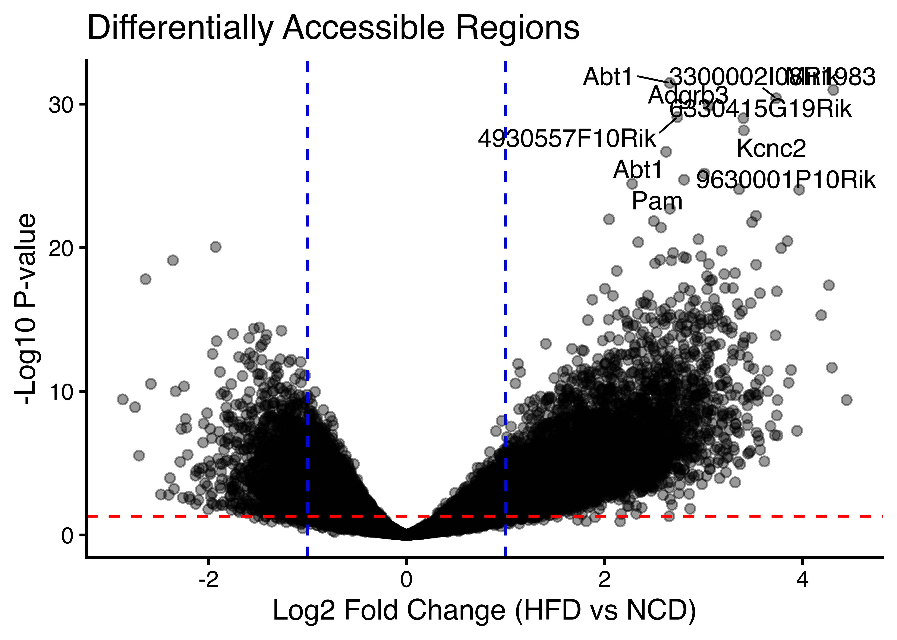{width=2100}
:::
:::


::: {.cell}

```{.r .cell-code}
deseq.results.annot |>
  filter(padj < 0.05) |>
  mutate(direction = ifelse(log2FoldChange > 0, "increased (HFD)", "decreased (HFD)")) |>
  count(direction, motif_class, name = "n_peaks") |>
  group_by(direction) |>
  mutate(pct = round(100 * n_peaks / sum(n_peaks), 1)) |>
  ungroup() |>
  tidyr::pivot_wider(names_from = direction,
                     values_from = c(n_peaks, pct),
                     values_fill = 0) |>
  knitr::kable(caption = "Motif content of differentially accessible peaks by direction (padj < 0.05)")
```

::: {.cell-output-display}


Table: Motif content of differentially accessible peaks by direction (padj < 0.05)

|motif_class  | n_peaks_decreased (HFD)| n_peaks_increased (HFD)| pct_decreased (HFD)| pct_increased (HFD)|
|:------------|-----------------------:|-----------------------:|-------------------:|-------------------:|
|Neither      |                    3268|                    3925|                52.2|                45.6|
|AP-1 and GRE |                     499|                     834|                 8.0|                 9.7|
|GRE only     |                     862|                    1091|                13.8|                12.7|
|AP-1 only    |                    1631|                    2762|                26.1|                32.1|


:::
:::


### Composition of significant peaks across log2FC

Stacked histogram (left) of significant peaks (padj < 0.05) by log2FC bin,
coloured by motif class — equivalent information to the volcano but without
overplotting, so the density of AP-1 / AP-1+GRE peaks is directly comparable
between HFD-up (right) and CHD-up (left). The right panel re-normalises each
bin to 100% so the motif-class *fraction* at each fold-change is visible
independent of how many peaks fall in that bin.


::: {.cell}

```{.r .cell-code}
library(ggplot2)
library(patchwork)

lfc_breaks <- seq(-6, 6, by = 0.25)
lfc_mid    <- (lfc_breaks[-1] + lfc_breaks[-length(lfc_breaks)]) / 2

comp_data <- deseq.results.annot |>
  filter(padj < 0.05, motif_class != "Not significant") |>
  mutate(motif_class = droplevels(motif_class),
         bin_idx     = cut(log2FoldChange, breaks = lfc_breaks,
                           include.lowest = TRUE, labels = FALSE),
         bin_mid     = lfc_mid[bin_idx]) |>
  filter(!is.na(bin_mid)) |>
  count(bin_mid, motif_class, name = "n_peaks") |>
  group_by(bin_mid) |>
  mutate(pct = 100 * n_peaks / sum(n_peaks)) |>
  ungroup()

p_counts <- ggplot(comp_data,
                   aes(x = bin_mid, y = n_peaks, fill = motif_class)) +
  geom_col(width = 0.25) +
  scale_fill_manual(values = class_colors, name = "Motif content",
                    breaks = c("AP-1 only", "GRE only", "AP-1 and GRE", "Neither")) +
  geom_vline(xintercept = 0, linetype = "dashed", color = "grey50") +
  geom_vline(xintercept = c(-1, 1), linetype = "dashed", color = "blue") +
  xlab("Log2 Fold Change (HFD vs NCD)") +
  ylab("Significant peaks (n)") +
  ggtitle("Peak count by log2FC bin") +
  theme_classic(base_size = 14)

p_frac <- ggplot(comp_data,
                 aes(x = bin_mid, y = pct, fill = motif_class)) +
  geom_col(width = 0.25, position = "stack") +
  scale_fill_manual(values = class_colors, guide = "none") +
  geom_vline(xintercept = 0, linetype = "dashed", color = "grey50") +
  geom_vline(xintercept = c(-1, 1), linetype = "dashed", color = "blue") +
  xlab("Log2 Fold Change (HFD vs NCD)") +
  ylab("% of significant peaks in bin") +
  ggtitle("Motif-class composition (100% stacked)") +
  theme_classic(base_size = 14)

p_counts + p_frac + plot_layout(guides = "collect") &
  theme(legend.position = "right")
```

::: {.cell-output-display}
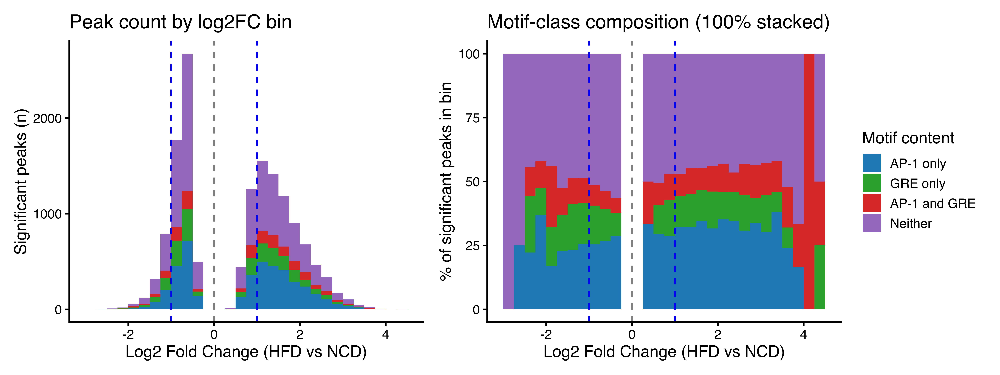{width=3600}
:::
:::


### GSEA Analysis of nearest genes


::: {.cell}

```{.r .cell-code}
library(clusterProfiler)

hfd.gobp <- enrichGO(gene          = bitr(unique(hfd.ann_df$SYMBOL), 
                 fromType = "SYMBOL",
                 toType = "ENTREZID",
                 OrgDb = org.Mm.eg.db)$ENTREZID,
                OrgDb         = org.Mm.eg.db,
                keyType       = "ENTREZID",
                ont           = "BP",
                pAdjustMethod = "BH",
                pvalueCutoff  = 0.05,
                qvalueCutoff  = 0.05,
                readable      = TRUE)

dotplot(hfd.gobp, showCategory=20) + ggtitle("GO-BP Enrichment")
```

::: {.cell-output-display}
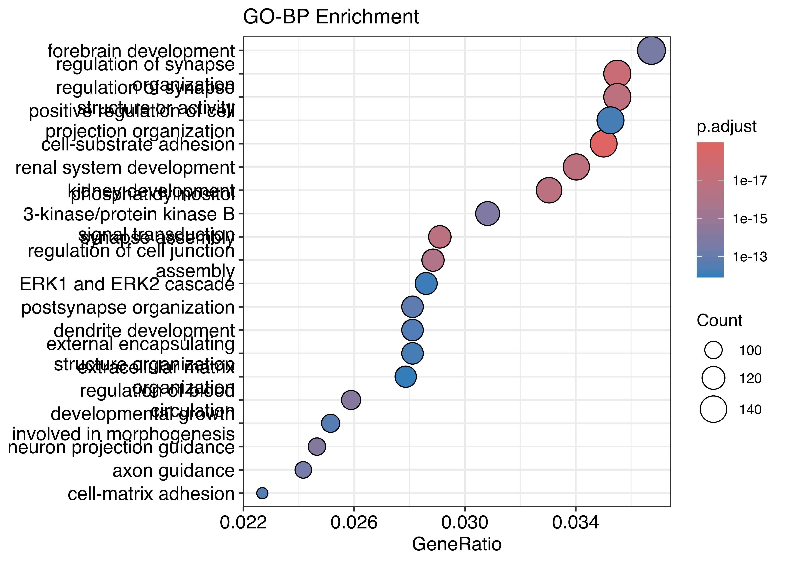{width=2100}
:::

```{.r .cell-code}
barplot(hfd.gobp, showCategory=20) + ggtitle("GO-BP Enrichment")
```

::: {.cell-output-display}
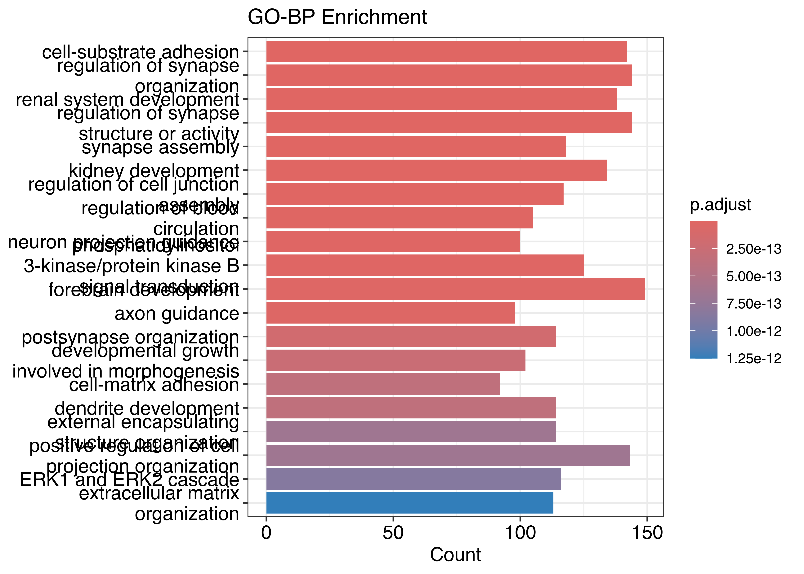{width=2100}
:::

```{.r .cell-code}
library(enrichplot)
emapplot(pairwise_termsim(hfd.gobp))
```

::: {.cell-output-display}
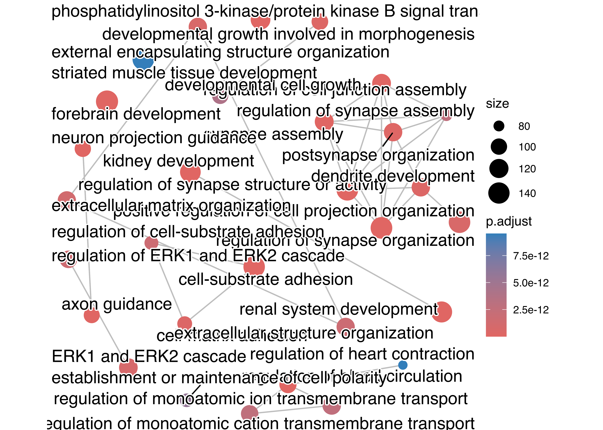{width=2100}
:::

```{.r .cell-code}
#transfac
library(msigdbr)
```
:::


#### Gene Transcription Regulation Database 


::: {.cell}

```{.r .cell-code}
gtrd <- msigdbr(
    db_species="MM",
    species = "Mus musculus",
    subcollection="GTRD"
)


hfd.gobp.gtrd <- enricher(
    unique(hfd.ann_df$SYMBOL),                              # your ENTREZ or SYMBOL list
    TERM2GENE = gtrd[, c("gs_name", "gene_symbol")]
)
dotplot(hfd.gobp.gtrd, showCategory=20) + ggtitle("GO-BP Enrichment")
```

::: {.cell-output-display}
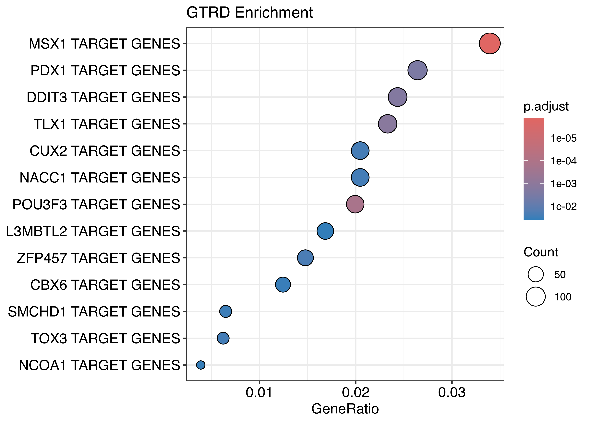{width=2100}
:::

```{.r .cell-code}
barplot(hfd.gobp.gtrd, showCategory=20) + ggtitle("GO-BP Enrichment")
```

::: {.cell-output-display}
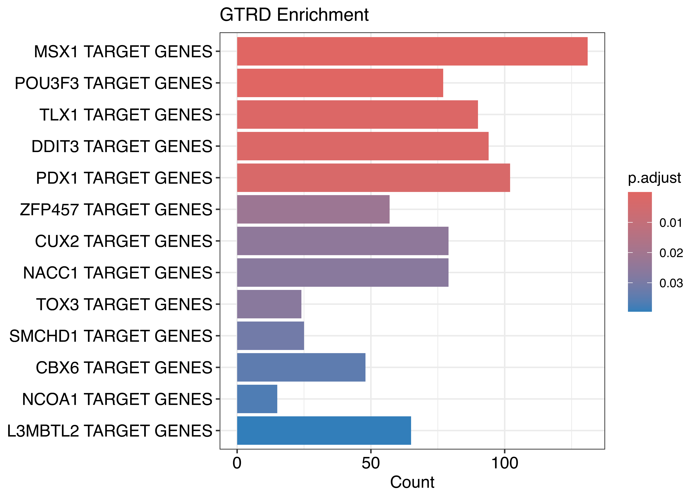{width=2100}
:::

```{.r .cell-code}
#emapplot(pairwise_termsim(hfd.gobp.gtrd))
```
:::


::: {.cell}

```{.r .cell-code}
ncd.gobp <- enrichGO(gene          = bitr(unique(ncd.ann_df$SYMBOL), 
                 fromType = "SYMBOL",
                 toType = "ENTREZID",
                 OrgDb = org.Mm.eg.db)$ENTREZID,
                OrgDb         = org.Mm.eg.db,
                keyType       = "ENTREZID",
                ont           = "BP",
                pAdjustMethod = "BH",
                pvalueCutoff  = 0.05,
                qvalueCutoff  = 0.05,
                readable      = TRUE)

dotplot(ncd.gobp, showCategory=20) + ggtitle("GO-BP Enrichment")
```

::: {.cell-output-display}
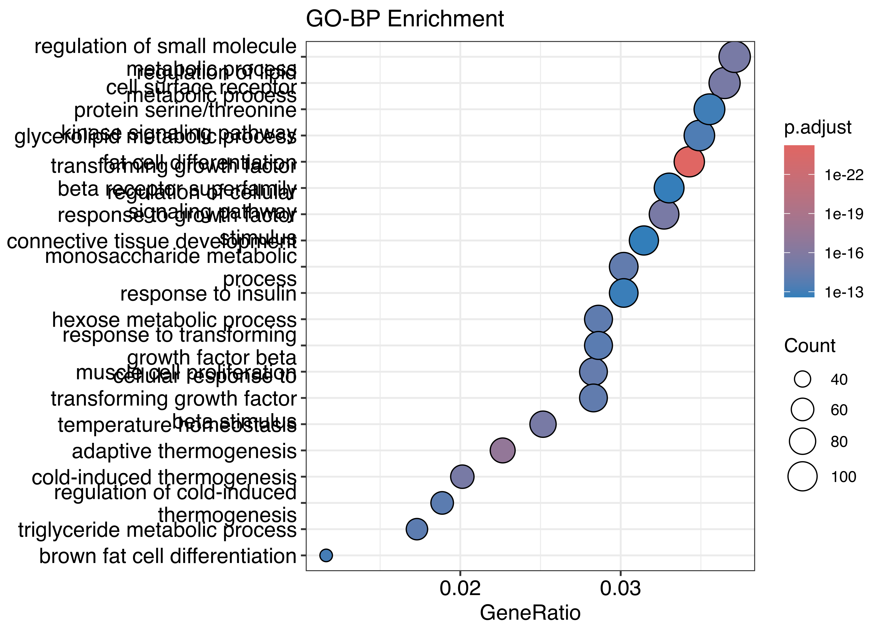{width=2100}
:::

```{.r .cell-code}
barplot(ncd.gobp, showCategory=20) + ggtitle("GO-BP Enrichment")
```

::: {.cell-output-display}
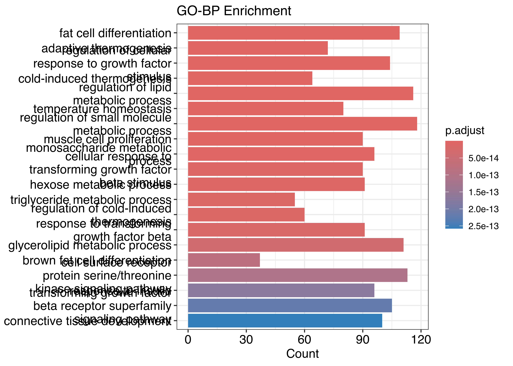{width=2100}
:::

```{.r .cell-code}
emapplot(pairwise_termsim(ncd.gobp))
```

::: {.cell-output-display}
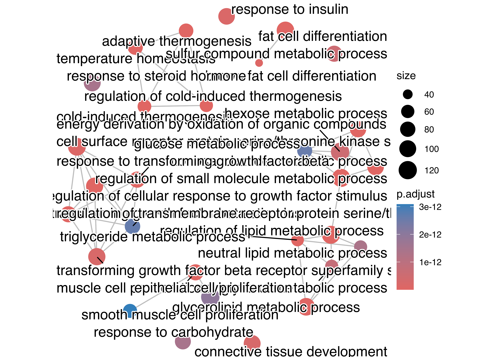{width=2100}
:::
:::


## Pioneer + GR Composite Motif Analysis

Tests the sensitization hypothesis from `results/motif_analysis/SUMMARY.md`:
do HFD-opened peaks contain an enriched fraction of pioneer-factor + GR composite enhancers? These would be candidate sites where HFD-driven chromatin remodeling licenses GR binding that would otherwise be inaccessible.

Inputs come from the `COMPOSITE_MOTIF_SCAN` Nextflow process, which uses FIMO to scan HFD-specific and shared peak FASTAs against JASPAR 2024 motifs for FOXA1, FOXA2, CEBPA, CEBPB, FOXO1, and NR3C1.


::: {.cell}

```{.r .cell-code}
library(readr)
library(dplyr)
library(stringr)

hfd.motifs    <- read_tsv("results/motif_analysis/composite_scan/HFD_specific/HFD_specific_per_peak_motifs.tsv")
shared.motifs <- read_tsv("results/motif_analysis/composite_scan/shared/shared_per_peak_motifs.tsv")

# JASPAR ID -> friendly TF name. PGR motifs are included as GR-class proxies
# because NR3C1 (MA0113.4) is often pruned from JASPAR's non-redundant subset
# due to motif similarity with PGR/AR. PGR's IR3 motif is biochemically
# essentially identical to GR's, so we treat PGR signal as has_gr.
motif_map <- c(
  "MA0148.5" = "FOXA1",
  "MA0047.5" = "FOXA2",
  "MA0466.4" = "CEBPB",
  "MA0102.5" = "CEBPA",
  "MA0480.3" = "FOXO1",
  "MA0113.4" = "NR3C1",
  "MA2327.1" = "PGR_h",
  "MA2323.1" = "PGR_m"
)
rename_motif_cols <- function(df) {
  names(df) <- ifelse(names(df) %in% names(motif_map), motif_map[names(df)], names(df))
  df
}
hfd    <- rename_motif_cols(hfd.motifs)
shared <- rename_motif_cols(shared.motifs)

# Classify peaks by presence of pioneer/cooperator and GR motifs.
# A motif is "present" if FIMO found >= 1 occurrence within the 500-bp peak window.
classify_peaks <- function(df) {
  cols <- names(df)
  has <- function(tf) if (tf %in% cols) df[[tf]] > 0 else rep(FALSE, nrow(df))
  df$has_foxa <- has("FOXA1") | has("FOXA2")
  df$has_cebp <- has("CEBPA") | has("CEBPB")
  df$has_foxo <- has("FOXO1")
  # GR-class: NR3C1 directly, or PGR (human/mouse) as IR3 proxy
  df$has_gr   <- has("NR3C1") | has("PGR_h") | has("PGR_m")
  df$foxa_gr  <- df$has_foxa & df$has_gr
  df$cebp_gr  <- df$has_cebp & df$has_gr
  df$foxo_gr  <- df$has_foxo & df$has_gr
  df$any_pioneer    <- df$has_foxa | df$has_cebp | df$has_foxo
  df$any_pioneer_gr <- df$any_pioneer & df$has_gr
  df
}
hfd.c    <- classify_peaks(hfd)
shared.c <- classify_peaks(shared)
```
:::


### Co-occurrence Fisher tests

Is the rate of pioneer+GR co-occurrence enriched in HFD-opened peaks vs the shared background? A significant odds ratio > 1 means HFD-opened chromatin disproportionately contains composite enhancers — the direct prediction of the pioneer-mediated sensitization model.


::: {.cell}

```{.r .cell-code}
fisher_2x2 <- function(label, hfd_pos, hfd_n, sh_pos, sh_n) {
  tab <- matrix(c(hfd_pos, hfd_n - hfd_pos,
                  sh_pos,  sh_n  - sh_pos), nrow = 2)
  ft <- fisher.test(tab, alternative = "greater")
  tibble(
    comparison    = label,
    hfd_with      = hfd_pos,
    hfd_total     = hfd_n,
    hfd_pct       = round(100 * hfd_pos / hfd_n, 2),
    shared_with   = sh_pos,
    shared_total  = sh_n,
    shared_pct    = round(100 * sh_pos / sh_n, 2),
    odds_ratio    = unname(ft$estimate),
    p_value       = ft$p.value
  )
}

cooc <- bind_rows(
  fisher_2x2("FoxA + GR",  sum(hfd.c$foxa_gr), nrow(hfd.c), sum(shared.c$foxa_gr), nrow(shared.c)),
  fisher_2x2("C/EBP + GR", sum(hfd.c$cebp_gr), nrow(hfd.c), sum(shared.c$cebp_gr), nrow(shared.c)),
  fisher_2x2("FoxO + GR",  sum(hfd.c$foxo_gr), nrow(hfd.c), sum(shared.c$foxo_gr), nrow(shared.c)),
  fisher_2x2("Any pioneer + GR", sum(hfd.c$any_pioneer_gr), nrow(hfd.c), sum(shared.c$any_pioneer_gr), nrow(shared.c))
)
knitr::kable(cooc, digits = c(0,0,0,2,0,0,2,3,4))
```

::: {.cell-output-display}


|comparison       | hfd_with| hfd_total| hfd_pct| shared_with| shared_total| shared_pct| odds_ratio| p_value|
|:----------------|--------:|---------:|-------:|-----------:|------------:|----------:|----------:|-------:|
|FoxA + GR        |      115|      6900|    1.67|         833|        53397|       1.56|      1.070|  0.2654|
|C/EBP + GR       |      310|      6900|    4.49|        1718|        53397|       3.22|      1.415|  0.0000|
|FoxO + GR        |      115|      6900|    1.67|         834|        53397|       1.56|      1.068|  0.2694|
|Any pioneer + GR |      400|      6900|    5.80|        2412|        53397|       4.52|      1.301|  0.0000|


:::
:::


### Gene annotation of candidate sensitizing enhancers

For HFD-opened peaks containing both a pioneer motif and a GR motif, annotate to the nearest TSS — these are candidate genes whose chromatin opening under HFD may license potentiated GR binding.


::: {.cell}

```{.r .cell-code}
parse_peaks_to_gr <- function(peak_ids) {
  m <- str_match(peak_ids, "^(.+):(\\d+)-(\\d+)$")
  GRanges(
    seqnames = m[, 2],
    ranges = IRanges(start = as.integer(m[, 3]) + 1, end = as.integer(m[, 4]))
  )
}

annotate_composite <- function(df, field, label) {
  peaks <- df %>% filter(.data[[field]]) %>% pull(peak)
  if (length(peaks) == 0) return(tibble())
  gr <- parse_peaks_to_gr(peaks)
  ann <- annotatePeak(
    gr,
    TxDb = TxDb.Mmusculus.UCSC.mm10.knownGene,
    tssRegion = c(-2000, 500),
    annoDb = "org.Mm.eg.db",
    verbose = FALSE
  )
  as.data.frame(ann) %>%
    mutate(composite = label) %>%
    arrange(abs(distanceToTSS))
}

foxa_gr.ann <- annotate_composite(hfd.c, "foxa_gr",  "FoxA + GR")
```

::: {.cell-output .cell-output-stdout}

```
>> Using Genome: mm10 ...
>> Using Genome: mm10 ...
>> Using Genome: mm10 ...
```


:::

```{.r .cell-code}
cebp_gr.ann <- annotate_composite(hfd.c, "cebp_gr",  "C/EBP + GR")
```

::: {.cell-output .cell-output-stdout}

```
>> Using Genome: mm10 ...
>> Using Genome: mm10 ...
>> Using Genome: mm10 ...
```


:::

```{.r .cell-code}
foxo_gr.ann <- annotate_composite(hfd.c, "foxo_gr",  "FoxO + GR")
```

::: {.cell-output .cell-output-stdout}

```
>> Using Genome: mm10 ...
>> Using Genome: mm10 ...
>> Using Genome: mm10 ...
```


:::
:::


#### Top candidate genes — FoxA + GR composite peaks

FoxA1 is the canonical GR pioneer in steroid-responsive tissues. Genes near FoxA+GR composite enhancers in HFD-opened chromatin are the highest-priority candidates for HFD-driven GR sensitization.


::: {.cell}

```{.r .cell-code}
foxa_gr.top <- foxa_gr.ann %>%
  filter(!is.na(SYMBOL)) %>%
  distinct(SYMBOL, .keep_all = TRUE) %>%
  arrange(abs(distanceToTSS)) %>%
  dplyr::select(SYMBOL, distanceToTSS, annotation, seqnames, start, end) %>%
  head(40)
knitr::kable(foxa_gr.top)
```

::: {.cell-output-display}


|SYMBOL        | distanceToTSS|annotation                                                        |seqnames |     start|       end|
|:-------------|-------------:|:-----------------------------------------------------------------|:--------|---------:|---------:|
|Med27         |             0|Promoter (<=1kb)                                                  |chr2     |  29391051|  29391550|
|Actr3         |            84|Promoter (<=1kb)                                                  |chr1     | 125397029| 125397528|
|Hmcn1         |           680|Intron (ENSMUST00000074783.11/545370, intron 1 of 106)            |chr1     | 150991872| 150992371|
|D16Ertd472e   |          1299|Exon (ENSMUST00000232329.1/67102, exon 2 of 3)                    |chr16    |  78558446|  78558945|
|Trim16        |         -1676|Promoter (1-2kb)                                                  |chr11    |  62831625|  62832124|
|Tsg101        |          1811|Intron (ENSMUST00000014546.14/22088, intron 2 of 9)               |chr7     |  46912100|  46912599|
|Gcfc2         |          1884|3' UTR                                                            |chr6     |  81943238|  81943737|
|Sgip1         |          2155|Exon (ENSMUST00000066824.13/73094, exon 20 of 24)                 |chr4     | 102964511| 102965010|
|Pcdh1         |         -2297|Intron (ENSMUST00000160721.7/75599, intron 1 of 4)                |chr18    |  38206137|  38206636|
|Oas3          |         -2435|Intron (ENSMUST00000201006.1/ENSMUST00000201006.1, intron 1 of 2) |chr5     | 120780096| 120780595|
|A630001G21Rik |          2847|Intron (ENSMUST00000159320.7/319997, intron 1 of 5)               |chr1     |  85733208|  85733707|
|Popdc1        |         -3007|Intron (ENSMUST00000095715.4/23828, intron 5 of 7)                |chr10    |  45350002|  45350501|
|Arhgap1       |         -3107|Intron (ENSMUST00000111329.7/228359, intron 5 of 13)              |chr2     |  91664910|  91665409|
|Ezr           |         -3248|Intron (ENSMUST00000064234.6/22350, intron 7 of 12)               |chr17    |   6746069|   6746568|
|Ankfn1        |         -3574|Intron (ENSMUST00000238273.2/382543, intron 2 of 21)              |chr11    |  89781227|  89781726|
|Cntn1         |          4487|Intron (ENSMUST00000141187.7/12805, intron 1 of 8)                |chr15    |  92165844|  92166343|
|Ankrd44       |          5026|Intron (ENSMUST00000179030.7/329154, intron 26 of 27)             |chr1     |  54652162|  54652661|
|Hipk1         |         -6169|Intron (ENSMUST00000118317.7/15257, intron 8 of 15)               |chr3     | 103757183| 103757682|
|Ctsl          |          7367|3' UTR                                                            |chr13    |  64359189|  64359688|
|Crim1         |          7576|Intron (ENSMUST00000112498.2/50766, intron 4 of 16)               |chr17    |  78287759|  78288258|
|Prdm2         |         -7779|Distal Intergenic                                                 |chr4     | 143220774| 143221273|
|4930519L02Rik |          9943|Exon (ENSMUST00000200254.1/102636203, exon 5 of 5)                |chr3     | 143040557| 143041056|
|Pcca          |        -10036|Intron (ENSMUST00000148172.1/110821, intron 4 of 4)               |chr14    | 122572149| 122572648|
|Efcab2        |         10090|Intron (ENSMUST00000194861.1/68226, intron 1 of 2)                |chr1     | 178416193| 178416692|
|Tmem17        |        -11080|Distal Intergenic                                                 |chr11    |  22500509|  22501008|
|Cyp4b1        |        -11280|Distal Intergenic                                                 |chr4     | 115659003| 115659502|
|Ccdc141       |        -11605|3' UTR                                                            |chr2     |  77182241|  77182740|
|Qrfprl        |         12241|Intron (ENSMUST00000170608.7/243407, intron 4 of 5)               |chr6     |  65453545|  65454044|
|Baalc         |        -12589|Distal Intergenic                                                 |chr15    |  38920056|  38920555|
|Lrp2bp        |         14142|Intron (ENSMUST00000170416.7/102141, intron 15 of 17)             |chr8     |  46036622|  46037121|
|Gm10421       |        -14781|Intron (ENSMUST00000190247.6/19276, intron 13 of 22)              |chr12    | 117166050| 117166549|
|Il34          |         15840|Intron (ENSMUST00000150680.1/76527, intron 1 of 7)                |chr8     | 110774549| 110775048|
|Pam           |         16510|Intron (ENSMUST00000058762.14/18484, intron 3 of 25)              |chr1     |  97960059|  97960558|
|1700001G01Rik |        -16533|Intron (ENSMUST00000147119.7/75433, intron 1 of 2)                |chr18    |  17108755|  17109254|
|Spats2l       |        -16741|Intron (ENSMUST00000172287.7/67198, intron 6 of 6)                |chr1     |  57884831|  57885330|
|Trim24        |        -17436|Distal Intergenic                                                 |chr6     |  37852876|  37853375|
|Gm5089        |        -17517|Distal Intergenic                                                 |chr14    | 122424260| 122424759|
|Dcbld2        |        -18589|Distal Intergenic                                                 |chr16    |  58389355|  58389854|
|Lnx1          |         19339|Intron (ENSMUST00000113531.8/16924, intron 3 of 12)               |chr5     |  74657791|  74658290|
|Ldlrad4       |        -19614|Intron (ENSMUST00000063775.4/52662, intron 3 of 5)                |chr18    |  68207954|  68208453|


:::
:::


#### Top candidate genes — C/EBP + GR composite peaks

C/EBPβ is the established adipocyte GR pioneer (Madsen 2014; Siersbæk 2011).


::: {.cell}

```{.r .cell-code}
cebp_gr.top <- cebp_gr.ann %>%
  filter(!is.na(SYMBOL)) %>%
  distinct(SYMBOL, .keep_all = TRUE) %>%
  arrange(abs(distanceToTSS)) %>%
  select(SYMBOL, distanceToTSS, annotation, seqnames, start, end) %>%
  head(40)
knitr::kable(cebp_gr.top)
```

::: {.cell-output-display}


|SYMBOL        | distanceToTSS|annotation                                                        |seqnames |     start|       end|
|:-------------|-------------:|:-----------------------------------------------------------------|:--------|---------:|---------:|
|1700003L19Rik |           -20|Promoter (<=1kb)                                                  |chr16    |  12810871|  12811370|
|Vmn1r180      |          -419|Promoter (<=1kb)                                                  |chr7     |  23949714|  23950213|
|Palb2         |           495|Promoter (<=1kb)                                                  |chr7     | 122123451| 122123950|
|Pdlim1        |          -559|Promoter (<=1kb)                                                  |chr19    |  40231364|  40231863|
|Rab23         |           628|3' UTR                                                            |chr1     |  33738765|  33739264|
|Cyp4a10       |           882|Exon (ENSMUST00000058785.9/13117, exon 2 of 13)                   |chr4     | 115519170| 115519669|
|Or1ab2        |         -1151|Promoter (1-2kb)                                                  |chr8     |  72105390|  72105889|
|Obsl1         |         -1869|Promoter (1-2kb)                                                  |chr1     |  75494936|  75495435|
|Gcfc2         |          1884|3' UTR                                                            |chr6     |  81943238|  81943737|
|Fpr2          |          1984|Intron (ENSMUST00000149944.1/14289, intron 1 of 2)                |chr17    |  17889872|  17890371|
|Kncn          |         -2031|Distal Intergenic                                                 |chr4     | 115881870| 115882369|
|2310002D06Rik |         -2080|Distal Intergenic                                                 |chr12    |  80504627|  80505126|
|Tsen15        |          2191|Distal Intergenic                                                 |chr1     | 152369392| 152369891|
|Dnajc6        |         -2852|Intron (ENSMUST00000154120.8/72685, intron 1 of 11)               |chr4     | 101504520| 101505019|
|Pde4d         |         -3005|Intron (ENSMUST00000122041.7/238871, intron 3 of 16)              |chr13    | 109577901| 109578400|
|Cobl          |         -3102|Intron (ENSMUST00000172919.7/12808, intron 2 of 7)                |chr11    |  12381380|  12381879|
|Ms4a15        |         -3164|Distal Intergenic                                                 |chr19    |  10996414|  10996913|
|Il16          |         -3352|Intron (ENSMUST00000001792.11/16170, intron 12 of 18)             |chr7     |  83658847|  83659346|
|Setd3         |          3516|Intron (ENSMUST00000071095.13/52690, intron 4 of 12)              |chr12    | 108158994| 108159493|
|Zfp1003       |          3522|Intron (ENSMUST00000108935.7/665205, intron 1 of 2)               |chr2     | 177900618| 177901117|
|Gm36283       |         -4133|Intron (ENSMUST00000217857.1/102640148, intron 1 of 2)            |chr10    | 108432033| 108432532|
|Cntn1         |          4487|Intron (ENSMUST00000141187.7/12805, intron 1 of 8)                |chr15    |  92165844|  92166343|
|Acbd3         |          5114|Intron (ENSMUST00000027780.5/170760, intron 3 of 7)               |chr1     | 180734971| 180735470|
|Psd3          |          5448|Intron (ENSMUST00000127631.1/ENSMUST00000127631.1, intron 2 of 3) |chr8     |  67968627|  67969126|
|Cul5          |          5461|Intron (ENSMUST00000166367.7/75717, intron 6 of 17)               |chr9     |  53640852|  53641351|
|Impact        |         -5521|Intron (ENSMUST00000234763.1/16210, intron 1 of 5)                |chr18    |  12965903|  12966402|
|Rmnd5a        |         -5658|Distal Intergenic                                                 |chr6     |  71446295|  71446794|
|Tbl1xr1       |         -5927|Intron (ENSMUST00000193734.5/81004, intron 11 of 16)              |chr3     |  22196766|  22197265|
|Hipk1         |         -6169|Intron (ENSMUST00000118317.7/15257, intron 8 of 15)               |chr3     | 103757183| 103757682|
|Ggta1         |         -6419|Intron (ENSMUST00000113002.8/14594, intron 1 of 7)                |chr2     |  35452252|  35452751|
|Stim2         |          6798|Intron (ENSMUST00000117661.8/116873, intron 1 of 11)              |chr5     |  54005363|  54005862|
|Stxbp6        |          6995|Intron (ENSMUST00000053768.13/217517, intron 2 of 5)              |chr12    |  45005470|  45005969|
|Dhx15         |          7050|3' UTR                                                            |chr5     |  52150254|  52150753|
|Snapc1        |          7145|Intron (ENSMUST00000021532.5/75627, intron 8 of 9)                |chr12    |  73979041|  73979540|
|Hivep3        |          7262|Intron (ENSMUST00000106307.8/16656, intron 4 of 8)                |chr4     | 120101751| 120102250|
|Emilin2       |         -7534|Intron (ENSMUST00000233188.1/ENSMUST00000233188.1, intron 1 of 2) |chr17    |  71319090|  71319589|
|Smap2         |          7589|Intron (ENSMUST00000043200.7/69780, intron 1 of 9)                |chr4     | 121009159| 121009658|
|Prdm2         |         -7779|Distal Intergenic                                                 |chr4     | 143220774| 143221273|
|Sh2d4a        |         -7986|Distal Intergenic                                                 |chr8     |  68268082|  68268581|
|Fmn1          |          8410|Intron (ENSMUST00000099576.8/14260, intron 4 of 18)               |chr2     | 113449474| 113449973|


:::
:::


#### Pathway enrichment of FoxA + GR composite genes


::: {.cell}

```{.r .cell-code}
foxa_gr.symbols <- foxa_gr.ann %>%
  filter(!is.na(SYMBOL)) %>%
  pull(SYMBOL) %>%
  unique()

if (length(foxa_gr.symbols) >= 10) {
  foxa_gr.entrez <- bitr(foxa_gr.symbols,
                         fromType = "SYMBOL",
                         toType   = "ENTREZID",
                         OrgDb    = org.Mm.eg.db)$ENTREZID
  foxa_gr.gobp <- enrichGO(gene          = foxa_gr.entrez,
                           OrgDb         = org.Mm.eg.db,
                           keyType       = "ENTREZID",
                           ont           = "BP",
                           pAdjustMethod = "BH",
                           pvalueCutoff  = 0.05,
                           qvalueCutoff  = 0.05,
                           readable      = TRUE)
  if (!is.null(foxa_gr.gobp) && nrow(as.data.frame(foxa_gr.gobp)) > 0) {
    dotplot(foxa_gr.gobp, showCategory = 20) + ggtitle("FoxA + GR composite genes — GO-BP")
  }
}
```
:::


### Pathway enrichment of C/EBP + GR composite genes

GO Biological Process enrichment for the 310 nearest-TSS genes of HFD-specific C/EBP + GR composite peaks. These are the candidate sensitizing enhancers' target genes — the pathways they regulate should reflect HFD-induced glucocorticoid-responsive biology.


::: {.cell}

```{.r .cell-code}
cebp_gr.symbols <- cebp_gr.ann %>%
  filter(!is.na(SYMBOL)) %>%
  pull(SYMBOL) %>%
  unique()

if (length(cebp_gr.symbols) >= 10) {
  cebp_gr.entrez <- bitr(cebp_gr.symbols,
                         fromType = "SYMBOL",
                         toType   = "ENTREZID",
                         OrgDb    = org.Mm.eg.db)$ENTREZID
  cebp_gr.gobp <- enrichGO(gene          = cebp_gr.entrez,
                           OrgDb         = org.Mm.eg.db,
                           keyType       = "ENTREZID",
                           ont           = "BP",
                           pAdjustMethod = "BH",
                           pvalueCutoff  = 0.05,
                           qvalueCutoff  = 0.05,
                           readable      = TRUE)
  if (!is.null(cebp_gr.gobp) && nrow(as.data.frame(cebp_gr.gobp)) > 0) {
    dotplot(cebp_gr.gobp, showCategory = 20) +
      ggtitle("GO-BP: C/EBP + GR composite genes (HFD-specific)")
  } else {
    cat("No significant GO-BP terms at FDR < 0.05.\n")
  }
}
```

::: {.cell-output-display}
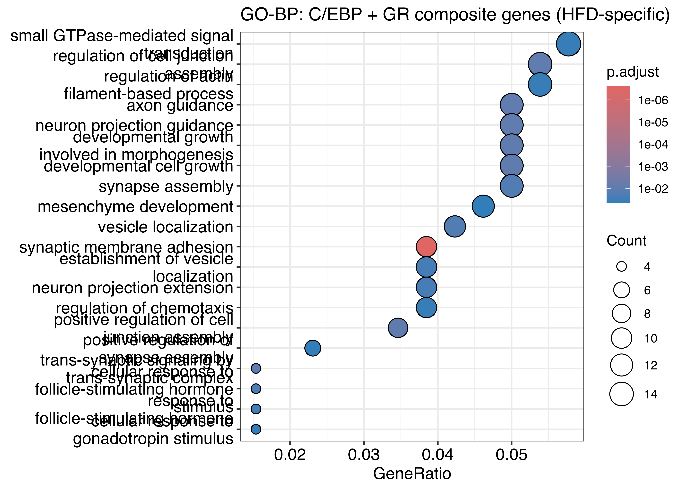{width=2100}
:::
:::


### Full list of C/EBP + GR composite genes

All unique nearest genes for the 310 HFD-specific C/EBP + GR composite peaks, sorted by distance to TSS. Also written to a TSV for downstream use.


::: {.cell}

```{.r .cell-code}
cebp_gr_list <- cebp_gr.ann %>%
  filter(!is.na(SYMBOL)) %>%
  distinct(SYMBOL, .keep_all = TRUE) %>%
  arrange(abs(distanceToTSS)) %>%
  dplyr::select(SYMBOL, distanceToTSS, annotation, seqnames, start, end)

dir.create("results/motif_analysis/composite_scan", recursive = TRUE, showWarnings = FALSE)
write_tsv(cebp_gr_list, "results/motif_analysis/composite_scan/HFD_specific_cebp_gr_genes.tsv")
cat("Unique nearest genes:", nrow(cebp_gr_list), "\n")
```

::: {.cell-output .cell-output-stdout}

```
Unique nearest genes: 296 
```


:::

```{.r .cell-code}
knitr::kable(cebp_gr_list,
             caption = "All C/EBP + GR composite-peak nearest genes (HFD-specific)")
```

::: {.cell-output-display}


Table: All C/EBP + GR composite-peak nearest genes (HFD-specific)

|SYMBOL        | distanceToTSS|annotation                                                         |seqnames       |     start|       end|
|:-------------|-------------:|:------------------------------------------------------------------|:--------------|---------:|---------:|
|1700003L19Rik |           -20|Promoter (<=1kb)                                                   |chr16          |  12810871|  12811370|
|Vmn1r180      |          -419|Promoter (<=1kb)                                                   |chr7           |  23949714|  23950213|
|Palb2         |           495|Promoter (<=1kb)                                                   |chr7           | 122123451| 122123950|
|Pdlim1        |          -559|Promoter (<=1kb)                                                   |chr19          |  40231364|  40231863|
|Rab23         |           628|3' UTR                                                             |chr1           |  33738765|  33739264|
|Cyp4a10       |           882|Exon (ENSMUST00000058785.9/13117, exon 2 of 13)                    |chr4           | 115519170| 115519669|
|Or1ab2        |         -1151|Promoter (1-2kb)                                                   |chr8           |  72105390|  72105889|
|Obsl1         |         -1869|Promoter (1-2kb)                                                   |chr1           |  75494936|  75495435|
|Gcfc2         |          1884|3' UTR                                                             |chr6           |  81943238|  81943737|
|Fpr2          |          1984|Intron (ENSMUST00000149944.1/14289, intron 1 of 2)                 |chr17          |  17889872|  17890371|
|Kncn          |         -2031|Distal Intergenic                                                  |chr4           | 115881870| 115882369|
|2310002D06Rik |         -2080|Distal Intergenic                                                  |chr12          |  80504627|  80505126|
|Tsen15        |          2191|Distal Intergenic                                                  |chr1           | 152369392| 152369891|
|Dnajc6        |         -2852|Intron (ENSMUST00000154120.8/72685, intron 1 of 11)                |chr4           | 101504520| 101505019|
|Pde4d         |         -3005|Intron (ENSMUST00000122041.7/238871, intron 3 of 16)               |chr13          | 109577901| 109578400|
|Cobl          |         -3102|Intron (ENSMUST00000172919.7/12808, intron 2 of 7)                 |chr11          |  12381380|  12381879|
|Ms4a15        |         -3164|Distal Intergenic                                                  |chr19          |  10996414|  10996913|
|Il16          |         -3352|Intron (ENSMUST00000001792.11/16170, intron 12 of 18)              |chr7           |  83658847|  83659346|
|Setd3         |          3516|Intron (ENSMUST00000071095.13/52690, intron 4 of 12)               |chr12          | 108158994| 108159493|
|Zfp1003       |          3522|Intron (ENSMUST00000108935.7/665205, intron 1 of 2)                |chr2           | 177900618| 177901117|
|Gm36283       |         -4133|Intron (ENSMUST00000217857.1/102640148, intron 1 of 2)             |chr10          | 108432033| 108432532|
|Cntn1         |          4487|Intron (ENSMUST00000141187.7/12805, intron 1 of 8)                 |chr15          |  92165844|  92166343|
|Acbd3         |          5114|Intron (ENSMUST00000027780.5/170760, intron 3 of 7)                |chr1           | 180734971| 180735470|
|Psd3          |          5448|Intron (ENSMUST00000127631.1/ENSMUST00000127631.1, intron 2 of 3)  |chr8           |  67968627|  67969126|
|Cul5          |          5461|Intron (ENSMUST00000166367.7/75717, intron 6 of 17)                |chr9           |  53640852|  53641351|
|Impact        |         -5521|Intron (ENSMUST00000234763.1/16210, intron 1 of 5)                 |chr18          |  12965903|  12966402|
|Rmnd5a        |         -5658|Distal Intergenic                                                  |chr6           |  71446295|  71446794|
|Tbl1xr1       |         -5927|Intron (ENSMUST00000193734.5/81004, intron 11 of 16)               |chr3           |  22196766|  22197265|
|Hipk1         |         -6169|Intron (ENSMUST00000118317.7/15257, intron 8 of 15)                |chr3           | 103757183| 103757682|
|Ggta1         |         -6419|Intron (ENSMUST00000113002.8/14594, intron 1 of 7)                 |chr2           |  35452252|  35452751|
|Stim2         |          6798|Intron (ENSMUST00000117661.8/116873, intron 1 of 11)               |chr5           |  54005363|  54005862|
|Stxbp6        |          6995|Intron (ENSMUST00000053768.13/217517, intron 2 of 5)               |chr12          |  45005470|  45005969|
|Dhx15         |          7050|3' UTR                                                             |chr5           |  52150254|  52150753|
|Snapc1        |          7145|Intron (ENSMUST00000021532.5/75627, intron 8 of 9)                 |chr12          |  73979041|  73979540|
|Hivep3        |          7262|Intron (ENSMUST00000106307.8/16656, intron 4 of 8)                 |chr4           | 120101751| 120102250|
|Emilin2       |         -7534|Intron (ENSMUST00000233188.1/ENSMUST00000233188.1, intron 1 of 2)  |chr17          |  71319090|  71319589|
|Smap2         |          7589|Intron (ENSMUST00000043200.7/69780, intron 1 of 9)                 |chr4           | 121009159| 121009658|
|Prdm2         |         -7779|Distal Intergenic                                                  |chr4           | 143220774| 143221273|
|Sh2d4a        |         -7986|Distal Intergenic                                                  |chr8           |  68268082|  68268581|
|Fmn1          |          8410|Intron (ENSMUST00000099576.8/14260, intron 4 of 18)                |chr2           | 113449474| 113449973|
|Palld         |         -8433|Intron (ENSMUST00000133752.1/ENSMUST00000133752.1, intron 2 of 2)  |chr8           |  61911123|  61911622|
|Cntln         |          8473|Intron (ENSMUST00000047023.12/338349, intron 2 of 25)              |chr4           |  84892938|  84893437|
|Exoc1l        |          8564|Intron (ENSMUST00000191515.7/639545, intron 2 of 3)                |chr5           |  76492895|  76493394|
|Adgra2        |         -8571|Intron (ENSMUST00000178514.7/78560, intron 2 of 15)                |chr8           |  27105063|  27105562|
|Grid1         |         -8742|Intron (ENSMUST00000043349.6/14803, intron 13 of 15)               |chr14          |  35560753|  35561252|
|Myo18a        |          8819|5' UTR                                                             |chr11          |  77786135|  77786634|
|Gng4          |         -8825|Intron (ENSMUST00000110559.2/17101, intron 50 of 52)               |chr13          |  13774735|  13775234|
|Serpinb2      |         -8898|Distal Intergenic                                                  |chr1           | 107502026| 107502525|
|Hdac9         |         -8939|Distal Intergenic                                                  |chr12          |  34926034|  34926533|
|Ppp1r1c       |         -9297|Distal Intergenic                                                  |chr2           |  79697984|  79698483|
|Nucb2         |         -9463|Distal Intergenic                                                  |chr7           | 116494407| 116494906|
|Kcnv2         |         -9490|Distal Intergenic                                                  |chr19          |  27312599|  27313098|
|Tns3          |         -9670|Distal Intergenic                                                  |chr11          |   8674351|   8674850|
|Nmu           |         -9693|Distal Intergenic                                                  |chr5           |  76373481|  76373980|
|Stox2         |         -9761|Intron (ENSMUST00000079195.5/71069, intron 1 of 3)                 |chr8           |  47229996|  47230495|
|Lrrc1         |         -9798|Exon (ENSMUST00000183873.7/214345, exon 9 of 14)                   |chr9           |  77452289|  77452788|
|Acta2         |          9811|Intron (ENSMUST00000039631.9/11475, intron 7 of 8)                 |chr19          |  34243920|  34244419|
|4930519L02Rik |          9943|Exon (ENSMUST00000200254.1/102636203, exon 5 of 5)                 |chr3           | 143040557| 143041056|
|Pcca          |        -10036|Intron (ENSMUST00000148172.1/110821, intron 4 of 4)                |chr14          | 122572149| 122572648|
|Gatm          |         10159|Distal Intergenic                                                  |chr2           | 122587876| 122588375|
|Cerk          |        -10294|Intron (ENSMUST00000044332.15/223753, intron 1 of 12)              |chr15          |  86169762|  86170261|
|Mir1983       |        -10405|Distal Intergenic                                                  |chr13          |  21907454|  21907953|
|Sec24d        |        -10618|Distal Intergenic                                                  |chr3           | 123256338| 123256837|
|Il20rb        |         10666|Intron (ENSMUST00000187637.1/ENSMUST00000187637.1, intron 1 of 1)  |chr9           | 100450570| 100451069|
|Tram2         |        -10915|Distal Intergenic                                                  |chr1           |  21090144|  21090643|
|Erich3        |         10935|Intron (ENSMUST00000098496.8/209601, intron 8 of 13)               |chr3           | 154722800| 154723299|
|Cyp4b1        |        -11280|Distal Intergenic                                                  |chr4           | 115659003| 115659502|
|Mgmt          |        -11618|Distal Intergenic                                                  |chr7           | 136882497| 136882996|
|Mak           |        -11655|Exon (ENSMUST00000225084.1/17152, exon 5 of 14)                    |chr13          |  41051426|  41051925|
|Ap4s1         |        -12014|Intron (ENSMUST00000013130.14/94186, intron 1 of 17)               |chr12          |  51678520|  51679019|
|Catsperb      |         12844|Exon (ENSMUST00000221965.1/271036, exon 3 of 5)                    |chr12          | 101417596| 101418095|
|Parp14        |         13379|Exon (ENSMUST00000042665.8/547253, exon 6 of 17)                   |chr16          |  35857504|  35858003|
|Gm5893        |        -13654|Distal Intergenic                                                  |chr7           |  24804642|  24805141|
|AU022793      |         13920|Distal Intergenic                                                  |chr15          |  39976569|  39977068|
|Rab38         |         13982|Intron (ENSMUST00000107256.3/72433, intron 1 of 2)                 |chr7           |  88444376|  88444875|
|Rbm26         |         14071|Intron (ENSMUST00000163545.7/74213, intron 1 of 21)                |chr14          | 105162290| 105162789|
|Lrp2bp        |         14142|Intron (ENSMUST00000170416.7/102141, intron 15 of 17)              |chr8           |  46036622|  46037121|
|4930555K19Rik |        -14160|Distal Intergenic                                                  |chr15          |  41158828|  41159327|
|Rab1a         |        -14231|Distal Intergenic                                                  |chr11          |  20186702|  20187201|
|Arhgap15      |         14611|Intron (ENSMUST00000112824.7/76117, intron 1 of 14)                |chr2           |  43763481|  43763980|
|Gm10421       |        -14781|Intron (ENSMUST00000190247.6/19276, intron 13 of 22)               |chr12          | 117166050| 117166549|
|Mir100hg      |         14997|Intron (ENSMUST00000233562.1/73144, intron 6 of 6)                 |chr9           |  41490057|  41490556|
|Trim9         |         15051|Intron (ENSMUST00000110522.9/94090, intron 1 of 13)                |chr12          |  70300705|  70301204|
|Eapp          |         15464|Intron (ENSMUST00000161592.7/66266, intron 4 of 5)                 |chr12          |  54679858|  54680357|
|Shroom3       |        -15547|Intron (ENSMUST00000113055.8/27428, intron 2 of 10)                |chr5           |  92881947|  92882446|
|Fhip1a        |        -15782|Intron (ENSMUST00000154148.7/99889, intron 1 of 9)                 |chr3           |  85833073|  85833572|
|Vav3          |        -16143|Intron (ENSMUST00000046864.13/57257, intron 2 of 26)               |chr3           | 109478142| 109478641|
|4930528H21Rik |         16373|Distal Intergenic                                                  |chr6           |   4030713|   4031212|
|Pam           |         16510|Intron (ENSMUST00000058762.14/18484, intron 3 of 25)               |chr1           |  97960059|  97960558|
|Bst1          |        -16562|Intron (ENSMUST00000114047.9/242960, intron 1 of 10)               |chr5           |  43801824|  43802323|
|Nvl           |         17047|Exon (ENSMUST00000027797.8/67459, exon 10 of 23)                   |chr1           | 181126658| 181127157|
|Arhgap18      |        -17306|Intron (ENSMUST00000176060.7/73910, intron 1 of 4)                 |chr10          |  26804797|  26805296|
|Ctsc          |        -17575|Distal Intergenic                                                  |chr7           |  88260011|  88260510|
|Zbtb14        |        -17799|Distal Intergenic                                                  |chr17          |  69364752|  69365251|
|2610203C22Rik |        -17971|Distal Intergenic                                                  |chr1           |   9649146|   9649645|
|Scel          |        -18185|Intron (ENSMUST00000227693.1/ENSMUST00000227693.1, intron 1 of 2)  |chr14          | 103494658| 103495157|
|Mir6337       |        -18185|Distal Intergenic                                                  |chr2           |  65382585|  65383084|
|Hhip          |         18216|3' UTR                                                             |chr8           |  79971634|  79972133|
|Zfp507        |        -18219|Intron (ENSMUST00000187873.1/78547, intron 2 of 2)                 |chr7           |  35821208|  35821707|
|Paqr9         |         18519|Distal Intergenic                                                  |chr9           |  95578176|  95578675|
|Ehmt1         |         18552|Distal Intergenic                                                  |chr2           |  24787304|  24787803|
|Ddx3x         |         18648|Distal Intergenic                                                  |chrX           |  13306433|  13306932|
|Cnot2         |         19040|Intron (ENSMUST00000220305.1/ENSMUST00000220305.1, intron 2 of 2)  |chr10          | 116529624| 116530123|
|Sfmbt2        |        -19189|Intron (ENSMUST00000137351.1/ENSMUST00000137351.1, intron 1 of 3)  |chr2           |  10350822|  10351321|
|Nyap2         |         19380|Intron (ENSMUST00000137862.7/241134, intron 3 of 6)                |chr1           |  81096963|  81097462|
|Ldlrad4       |        -19614|Intron (ENSMUST00000063775.4/52662, intron 3 of 5)                 |chr18          |  68207954|  68208453|
|Wincr1        |         19709|Intron (ENSMUST00000146678.1/100040617, intron 2 of 2)             |chr4           |  89078505|  89079004|
|Chst4         |         20211|Distal Intergenic                                                  |chr8           | 110018644| 110019143|
|Tbc1d23       |        -20377|Distal Intergenic                                                  |chr16          |  57251881|  57252380|
|Myo9b         |        -20728|Intron (ENSMUST00000212935.1/17925, intron 2 of 39)                |chr8           |  71312590|  71313089|
|Pisd-ps3      |         20882|Distal Intergenic                                                  |chrUn_JH584304 |     38286|     38785|
|Gm13043       |        -21263|Distal Intergenic                                                  |chr4           | 143489581| 143490080|
|Mir101b       |         21398|Distal Intergenic                                                  |chr19          |  29156677|  29157176|
|Prcp          |         21584|Intron (ENSMUST00000076052.7/72461, intron 1 of 8)                 |chr7           |  92896884|  92897383|
|Ppp1r36dn     |         22269|Distal Intergenic                                                  |chr12          |  76466829|  76467328|
|4930554I06Rik |         22431|Intron (ENSMUST00000237231.1/ENSMUST00000237231.1, intron 2 of 4)  |chr19          |  21127141|  21127640|
|AI115009      |        -22606|Intron (ENSMUST00000045262.10/229949, intron 5 of 13)              |chr3           | 152643808| 152644307|
|Arfgef1       |        -22685|Distal Intergenic                                                  |chr1           |  10255355|  10255854|
|Insyn2b       |         22807|Intron (ENSMUST00000165963.8/574403, intron 1 of 3)                |chr11          |  34337629|  34338128|
|Rapgef4       |         23056|Intron (ENSMUST00000090826.11/56508, intron 4 of 30)               |chr2           |  72078041|  72078540|
|Niban1        |        -23282|Intron (ENSMUST00000148810.7/63913, intron 5 of 13)                |chr1           | 151653386| 151653885|
|Wrn           |        -23828|Intron (ENSMUST00000033991.12/22427, intron 1 of 33)               |chr8           |  33354378|  33354877|
|Tenm3         |         24246|Intron (ENSMUST00000211812.1/23965, intron 1 of 2)                 |chr8           |  48819206|  48819705|
|Ank2          |         24574|Intron (ENSMUST00000182078.8/109676, intron 3 of 45)               |chr3           | 127099789| 127100288|
|Rybp          |        -24692|Exon (ENSMUST00000204906.1/ENSMUST00000204906.1, exon 1 of 1)      |chr6           | 100257823| 100258322|
|Tex13b        |        -24756|Distal Intergenic                                                  |chrX           | 140838189| 140838688|
|Pde1c         |         25945|Intron (ENSMUST00000044505.13/18575, intron 16 of 18)              |chr6           |  56096564|  56097063|
|Usp13         |         26601|Intron (ENSMUST00000072312.11/72607, intron 2 of 20)               |chr3           |  32844312|  32844811|
|Pawr          |         27544|Intron (ENSMUST00000095313.4/114774, intron 2 of 6)                |chr10          | 108360361| 108360860|
|Gpbp1         |        -27986|Intron (ENSMUST00000231096.1/73274, intron 1 of 7)                 |chr13          | 111518097| 111518596|
|Pex5l         |        -28113|Intron (ENSMUST00000108226.7/58869, intron 1 of 12)                |chr3           |  33111173|  33111672|
|Epb41l4aos    |        -28234|Distal Intergenic                                                  |chr18          |  33766159|  33766658|
|Gm8013        |         28606|Distal Intergenic                                                  |chr5           |  96949878|  96950377|
|Cd200         |         28854|Distal Intergenic                                                  |chr16          |  45370959|  45371458|
|Ctnnd2        |        -28954|Intron (ENSMUST00000081728.6/18163, intron 19 of 22)               |chr15          |  30975343|  30975842|
|Slc5a7        |        -30102|Distal Intergenic                                                  |chr17          |  54329136|  54329635|
|Dusp6         |        -30134|Exon (ENSMUST00000220253.1/ENSMUST00000220253.1, exon 3 of 3)      |chr10          |  99232598|  99233097|
|Zbtb10        |        -32475|Distal Intergenic                                                  |chr3           |   9217628|   9218127|
|Cdh9          |         32685|Intron (ENSMUST00000228307.1/12565, intron 2 of 11)                |chr15          |  16810786|  16811285|
|Chl1          |         33006|Intron (ENSMUST00000203912.2/12661, intron 1 of 26)                |chr6           | 103544336| 103544835|
|Anxa3         |        -33113|Exon (ENSMUST00000036019.4/231470, exon 63 of 74)                  |chr5           |  96759727|  96760226|
|Cdh2          |         33560|Exon (ENSMUST00000025166.13/12558, exon 2 of 16)                   |chr18          |  16774403|  16774902|
|Macroh2a1     |         33566|Intron (ENSMUST00000237678.1/ENSMUST00000237678.1, intron 5 of 5)  |chr13          |  56050456|  56050955|
|Tasl2         |         34951|Distal Intergenic                                                  |chrX           | 109231709| 109232208|
|Cd2ap         |        -35121|Distal Intergenic                                                  |chr17          |  42911786|  42912285|
|H2ap          |        -36874|Distal Intergenic                                                  |chrX           |   9809555|   9810054|
|Ednra         |        -38638|Intron (ENSMUST00000153937.1/ENSMUST00000153937.1, intron 7 of 7)  |chr8           |  77763102|  77763601|
|Marchf4       |         38905|Intron (ENSMUST00000047786.5/381270, intron 1 of 3)                |chr1           |  72497526|  72498025|
|Tjp1          |        -39442|Intron (ENSMUST00000206228.1/21872, intron 2 of 4)                 |chr7           |  65410681|  65411180|
|Gm26579       |        -40722|Distal Intergenic                                                  |chr10          | 116633370| 116633869|
|Celf4         |        -41546|Distal Intergenic                                                  |chr18          |  25795703|  25796202|
|Ptprj         |        -42911|Intron (ENSMUST00000168621.2/19271, intron 1 of 23)                |chr2           |  90522081|  90522580|
|Marchf1       |        -43100|Intron (ENSMUST00000152320.7/72925, intron 5 of 8)                 |chr8           |  66342695|  66343194|
|Slc25a26      |        -43776|Distal Intergenic                                                  |chr6           |  94456056|  94456555|
|Abhd2         |         44664|Intron (ENSMUST00000037315.12/54608, intron 3 of 10)               |chr7           |  79317918|  79318417|
|Resf1         |        -48009|Distal Intergenic                                                  |chr6           | 149260906| 149261405|
|Itga4         |        -48927|Distal Intergenic                                                  |chr2           |  79206000|  79206499|
|Etaa1os       |         49012|Distal Intergenic                                                  |chr11          |  18003016|  18003515|
|Pde7b         |         50561|Intron (ENSMUST00000020165.13/29863, intron 1 of 12)               |chr10          |  20673636|  20674135|
|Pir           |         50654|Intron (ENSMUST00000145412.7/69656, intron 5 of 8)                 |chrX           | 164320227| 164320726|
|Serpinb8      |         51830|Distal Intergenic                                                  |chr1           | 107657710| 107658209|
|Ube2e3        |         51859|Distal Intergenic                                                  |chr2           |  78970252|  78970751|
|Limch1        |         52528|Intron (ENSMUST00000201852.3/77569, intron 1 of 7)                 |chr5           |  66798417|  66798916|
|4930448C13Rik |         52888|Intron (ENSMUST00000221439.1/73972, intron 3 of 3)                 |chr12          |  14997002|  14997501|
|Arid5b        |        -53894|Intron (ENSMUST00000219238.1/71371, intron 3 of 9)                 |chr10          |  68190520|  68191019|
|Mir28b        |        -56861|Intron (ENSMUST00000004497.10/16795, intron 6 of 14)               |chr8           |  72959152|  72959651|
|9430014N10Rik |        -58307|Distal Intergenic                                                  |chr15          |  93985418|  93985917|
|Lsm14a        |        -59365|Intron (ENSMUST00000140298.1/ENSMUST00000140298.1, intron 1 of 2)  |chr7           |  34452680|  34453179|
|Aff2          |        -60258|Intron (ENSMUST00000033532.6/14266, intron 8 of 19)                |chrX           |  69795938|  69796437|
|Arl14ep       |         60448|Distal Intergenic                                                  |chr2           | 106908330| 106908829|
|Dera          |         60660|Distal Intergenic                                                  |chr6           | 137897512| 137898011|
|4930474N05Rik |         60945|Distal Intergenic                                                  |chr14          |  36155914|  36156413|
|Rnf217        |         62367|Intron (ENSMUST00000081989.7/268291, intron 1 of 5)                |chr10          |  31546318|  31546817|
|Sema6a        |         64612|Intron (ENSMUST00000234124.1/69456, intron 6 of 6)                 |chr18          |  47216084|  47216583|
|Nfkbiz        |         64701|Distal Intergenic                                                  |chr16          |  55756938|  55757437|
|1110015O18Rik |         66552|Distal Intergenic                                                  |chr3           |   4866045|   4866544|
|Itprid2       |        -67528|Distal Intergenic                                                  |chr2           |  79567325|  79567824|
|Exoc4         |        -67597|Intron (ENSMUST00000052266.14/20336, intron 11 of 17)              |chr6           |  33794004|  33794503|
|D030045P18Rik |         68624|Distal Intergenic                                                  |chr10          |  45906504|  45907003|
|Ttc27         |         69673|Distal Intergenic                                                  |chr17          |  74931594|  74932093|
|Abtb2         |        -70511|Intron (ENSMUST00000076212.3/99382, intron 1 of 16)                |chr2           | 103644025| 103644524|
|Bckdhb        |         71223|Distal Intergenic                                                  |chr9           |  84178730|  84179229|
|5730522E02Rik |         71402|Intron (ENSMUST00000125773.7/70626, intron 1 of 5)                 |chr11          |  26009699|  26010198|
|Zbtb18        |         72108|Distal Intergenic                                                  |chr1           | 177517929| 177518428|
|Nuak1         |         72376|Distal Intergenic                                                  |chr10          |  84319513|  84320012|
|Atp8b4        |         72402|Intron (ENSMUST00000040128.11/241633, intron 9 of 27)              |chr2           | 126418652| 126419151|
|Smc2os        |         72808|Distal Intergenic                                                  |chr4           |  52365658|  52366157|
|Spata6        |        -73956|Intron (ENSMUST00000106592.7/78933, intron 11 of 12)               |chr4           | 111645529| 111646028|
|Ttc39b        |         78465|Distal Intergenic                                                  |chr4           |  83154206|  83154705|
|Irf2          |         78837|Distal Intergenic                                                  |chr8           |  46886067|  46886566|
|Klf3          |        -80865|Intron (ENSMUST00000180912.5/ENSMUST00000180912.5, intron 1 of 4)  |chr5           |  64722024|  64722523|
|Runx2         |         80895|Intron (ENSMUST00000162816.7/12393, intron 3 of 5)                 |chr17          |  44653299|  44653798|
|CK137956      |         81478|Distal Intergenic                                                  |chr4           | 127888974| 127889473|
|Adgrg2        |        -82642|Distal Intergenic                                                  |chrX           | 160307549| 160308048|
|Hira          |         83891|Distal Intergenic                                                  |chr16          |  19025437|  19025936|
|Gm31592       |        -86003|Distal Intergenic                                                  |chr10          |  91802327|  91802826|
|Mroh9         |        -86098|Distal Intergenic                                                  |chr1           | 163171768| 163172267|
|Cntnap5c      |         88615|Intron (ENSMUST00000076038.6/620292, intron 1 of 23)               |chr17          |  57858185|  57858684|
|Aoah          |        -89984|Intron (ENSMUST00000021757.4/27052, intron 11 of 20)               |chr13          |  20920150|  20920649|
|L3mbtl4       |        -90092|Exon (ENSMUST00000233387.1/ENSMUST00000233387.1, exon 3 of 5)      |chr17          |  68183206|  68183705|
|Eya1          |         91571|Distal Intergenic                                                  |chr1           |  14139422|  14139921|
|Mettl4        |         92882|Distal Intergenic                                                  |chr17          |  94656511|  94657010|
|Fhod3         |         92970|Intron (ENSMUST00000037097.8/225288, intron 3 of 26)               |chr18          |  24802415|  24802914|
|Epha3         |        -94093|Distal Intergenic                                                  |chr16          |  63958268|  63958767|
|Lurap1l       |         95271|Distal Intergenic                                                  |chr4           |  81005917|  81006416|
|Gm17399       |         95439|Distal Intergenic                                                  |chr9           | 118245670| 118246169|
|Syt1          |         96144|Intron (ENSMUST00000105276.7/20979, intron 2 of 11)                |chr10          | 108912457| 108912956|
|Fam204a       |        -98941|Distal Intergenic                                                  |chr19          |  60325642|  60326141|
|Tdrd3         |         98954|Distal Intergenic                                                  |chr14          |  87638053|  87638552|
|Aebp2         |        101857|Intron (ENSMUST00000111844.1/ENSMUST00000111844.1, intron 1 of 1)  |chr6           | 140748674| 140749173|
|Mrps30        |        105882|Distal Intergenic                                                  |chr13          | 118280871| 118281370|
|Large1        |        108077|Intron (ENSMUST00000004497.10/16795, intron 1 of 14)               |chr8           |  73243980|  73244479|
|Hmgn3         |       -111513|Distal Intergenic                                                  |chr9           |  83258198|  83258697|
|Epha5         |        118588|Intron (ENSMUST00000053733.14/13839, intron 3 of 15)               |chr5           |  84297719|  84298218|
|Cldn34b3      |       -122598|Distal Intergenic                                                  |chrX           |  76141207|  76141706|
|Rprm          |       -129961|Distal Intergenic                                                  |chr2           |  54215513|  54216012|
|Atp10a        |        131338|Intron (ENSMUST00000168747.2/11982, intron 7 of 20)                |chr7           |  58789584|  58790083|
|G6pd2         |        131571|Distal Intergenic                                                  |chr5           |  61940387|  61940886|
|Gm5524        |        135827|Distal Intergenic                                                  |chr1           |  28019873|  28020372|
|4930520P13Rik |        136738|Distal Intergenic                                                  |chr13          |  70369560|  70370059|
|Plscr5        |       -136810|Distal Intergenic                                                  |chr9           |  92055627|  92056126|
|2900079G21Rik |        137466|Intron (ENSMUST00000216779.1/ENSMUST00000216779.1, intron 1 of 1)  |chr9           | 112394040| 112394539|
|Nrxn3         |        138513|Intron (ENSMUST00000190626.6/18191, intron 5 of 18)                |chr12          |  89331619|  89332118|
|1700010I02Rik |        138672|Distal Intergenic                                                  |chr3           |   7815711|   7816210|
|Ptprd         |       -141422|Intron (ENSMUST00000107287.8/19266, intron 9 of 14)                |chr4           |  76735721|  76736220|
|4930533P14Rik |        142978|Distal Intergenic                                                  |chr1           |  96519096|  96519595|
|4930567K20Rik |        143449|Intron (ENSMUST00000044306.12/14816, intron 3 of 8)                |chr10          |  10894529|  10895028|
|Hs6st2        |        152832|Intron (ENSMUST00000088172.11/50786, intron 2 of 4)                |chrX           |  51527234|  51527733|
|Rims1         |        153292|Intron (ENSMUST00000081544.12/116837, intron 2 of 31)              |chr1           |  22651933|  22652432|
|Snx7          |       -155405|Distal Intergenic                                                  |chr3           | 118024341| 118024840|
|Sstr4         |       -158357|Distal Intergenic                                                  |chr2           | 148236488| 148236987|
|Platr4        |        160376|Distal Intergenic                                                  |chr3           |  41332315|  41332814|
|Unc13c        |        175592|Exon (ENSMUST00000184666.7/208898, exon 6 of 33)                   |chr9           |  73757476|  73757975|
|Hrh4          |        179264|Distal Intergenic                                                  |chr18          |  13186301|  13186800|
|Mnd1-ps       |        184595|Intron (ENSMUST00000161302.7/14198, intron 2 of 6)                 |chr14          |  10070621|  10071120|
|Tpbg          |        187362|Distal Intergenic                                                  |chr9           |  86030723|  86031222|
|Prep          |       -189681|Distal Intergenic                                                  |chr10          |  44877023|  44877522|
|Adcy2         |        191367|Intron (ENSMUST00000022013.7/210044, intron 3 of 24)               |chr13          |  68807675|  68808174|
|Sec61b        |        195601|Distal Intergenic                                                  |chr4           |  47670549|  47671048|
|Kcne4         |        199680|Intron (ENSMUST00000189296.1/102636764, intron 2 of 3)             |chr1           |  79016607|  79017106|
|Ipo5          |       -205256|Distal Intergenic                                                  |chr14          | 120705469| 120705968|
|Snora33       |        210172|Intron (ENSMUST00000219823.1/ENSMUST00000219823.1, intron 3 of 4)  |chr10          |  23574804|  23575303|
|Speer2        |       -215438|Intron (ENSMUST00000231343.1/ENSMUST00000231343.1, intron 1 of 4)  |chr16          |  70079182|  70079681|
|Nmbr          |        217635|Distal Intergenic                                                  |chr10          |  14977854|  14978353|
|Nlgn1         |        230198|Intron (ENSMUST00000193603.5/192167, intron 5 of 7)                |chr3           |  25903037|  25903536|
|Rack1         |       -236715|Distal Intergenic                                                  |chr11          |  48563118|  48563617|
|Oca2          |        236875|Distal Intergenic                                                  |chr7           |  56543113|  56543612|
|Pcdh20        |        237700|Distal Intergenic                                                  |chr14          |  88233147|  88233646|
|Gm12381       |       -243300|Distal Intergenic                                                  |chr4           |  39098783|  39099282|
|Tram1l1       |       -244073|Distal Intergenic                                                  |chr3           | 124076283| 124076782|
|Plxdc2        |        246017|Distal Intergenic                                                  |chr2           |  16884713|  16885212|
|Gria1         |       -248185|Distal Intergenic                                                  |chr11          |  56762703|  56763202|
|Mir6378       |       -261604|Distal Intergenic                                                  |chr3           |  35184255|  35184754|
|Mir466f-4     |        266037|Distal Intergenic                                                  |chr13          |  71373126|  71373625|
|Dync2h1       |        273087|Distal Intergenic                                                  |chr9           |   6683103|   6683602|
|Tpk1          |       -274526|Distal Intergenic                                                  |chr6           |  43940804|  43941303|
|Gpat3         |        274613|Distal Intergenic                                                  |chr5           | 101121030| 101121529|
|1700066C05Rik |       -278139|Distal Intergenic                                                  |chr16          |  79720738|  79721237|
|4930486I03Rik |       -286308|Intron (ENSMUST00000088448.11/241035, intron 66 of 66)             |chr1           |  20069645|  20070144|
|Abca13        |        288317|Intron (ENSMUST00000042740.12/268379, intron 41 of 61)             |chr11          |   9481768|   9482267|
|Robo1         |        310856|Intron (ENSMUST00000232549.1/ENSMUST00000232549.1, intron 3 of 5)  |chr16          |  73294611|  73295110|
|Cnbd1         |        346955|Intron (ENSMUST00000133363.1/ENSMUST00000133363.1, intron 4 of 10) |chr4           |  18775072|  18775571|
|Iftap         |        369452|Distal Intergenic                                                  |chr2           | 101206174| 101206673|
|Lrrc4c        |       -378005|Intron (ENSMUST00000135431.7/241568, intron 3 of 6)                |chr2           |  97089153|  97089652|
|D3Ertd751e    |        380421|Distal Intergenic                                                  |chr3           |  42131617|  42132116|
|Aga           |       -380926|Distal Intergenic                                                  |chr8           |  53130302|  53130801|
|Robo2         |        386814|Distal Intergenic                                                  |chr16          |  73512572|  73513071|
|S100a7l2      |       -392454|Distal Intergenic                                                  |chr3           |  91483257|  91483756|
|Otol1         |        397139|Distal Intergenic                                                  |chr3           |  70404752|  70405251|
|1700101O22Rik |        411902|Distal Intergenic                                                  |chr12          |   6967929|   6968428|
|Caap1         |        417591|Intron (ENSMUST00000126270.1/ENSMUST00000126270.1, intron 4 of 5)  |chr4           |  94138676|  94139175|
|Ccng1         |       -447100|Distal Intergenic                                                  |chr11          |  41202411|  41202910|
|Ccser1        |        459653|Distal Intergenic                                                  |chr6           |  62416342|  62416841|
|Unc5d         |        479990|Intron (ENSMUST00000168630.3/210801, intron 8 of 17)               |chr8           |  28738938|  28739437|
|Slitrk5       |        481350|Distal Intergenic                                                  |chr14          | 112157199| 112157698|
|4930474G06Rik |       -494432|Distal Intergenic                                                  |chr18          |  28367919|  28368418|
|Zfp960        |       -519834|Distal Intergenic                                                  |chr17          |  16543780|  16544279|
|Brinp3        |       -521845|Distal Intergenic                                                  |chr1           | 145972416| 145972915|
|Sorcs3        |        559661|Distal Intergenic                                                  |chr19          |  49263877|  49264376|
|Slit2         |       -562080|Distal Intergenic                                                  |chr5           |  47420559|  47421058|
|Got2          |       -564553|Distal Intergenic                                                  |chr8           |  96453100|  96453599|
|Dipk2a        |        567998|Distal Intergenic                                                  |chr9           |  93969584|  93970083|
|Crim1         |       -570351|Distal Intergenic                                                  |chr17          |  77629398|  77629897|
|Rab28         |        582388|Distal Intergenic                                                  |chr5           |  41044615|  41045114|
|Celf2         |       -669085|Distal Intergenic                                                  |chr2           |   8178648|   8179147|
|Cbln2         |        686564|Distal Intergenic                                                  |chr18          |  87399612|  87400111|
|Slitrk1       |       -696500|Distal Intergenic                                                  |chr14          | 109610658| 109611157|
|Mms22l        |       -722828|Distal Intergenic                                                  |chr4           |  23773124|  23773623|
|Cadm2         |       -818314|Distal Intergenic                                                  |chr16          |  68439222|  68439721|
|Gm2516        |        828432|Distal Intergenic                                                  |chr8           |  51196544|  51197043|
|Chordc1       |       -840320|Distal Intergenic                                                  |chr9           |  17451306|  17451805|
|Mdga2         |       -855791|Distal Intergenic                                                  |chr12          |  68078340|  68078839|
|Zpld1         |       1018285|Distal Intergenic                                                  |chr16          |  54264453|  54264952|
|Acvr2a        |      -1057639|Distal Intergenic                                                  |chr2           |  47755971|  47756470|
|Ncam2         |       1107078|Distal Intergenic                                                  |chr16          |  82572701|  82573200|
|Gm10440       |       1420473|Distal Intergenic                                                  |chr5           |  55770464|  55770963|


:::
:::


### CHD-specific negative control

The pioneer-mediated sensitization hypothesis predicts that C/EBP+GR composite enrichment is specific to HFD-driven chromatin remodeling. If the same enrichment also appears in CHD-specific peaks, the signal isn't HFD-induced — it's a property of any condition-specific peak. Run the same Fisher tests on the 776 CHD-specific peaks vs shared background.


::: {.cell}

```{.r .cell-code}
chd.motifs <- read_tsv("results/motif_analysis/composite_scan/CHD_specific/CHD_specific_per_peak_motifs.tsv",
                       show_col_types = FALSE)
chd    <- rename_motif_cols(chd.motifs)
chd.c  <- classify_peaks(chd)

cooc.chd <- bind_rows(
  fisher_2x2("FoxA + GR",        sum(chd.c$foxa_gr),        nrow(chd.c), sum(shared.c$foxa_gr),        nrow(shared.c)),
  fisher_2x2("C/EBP + GR",       sum(chd.c$cebp_gr),        nrow(chd.c), sum(shared.c$cebp_gr),        nrow(shared.c)),
  fisher_2x2("FoxO + GR",        sum(chd.c$foxo_gr),        nrow(chd.c), sum(shared.c$foxo_gr),        nrow(shared.c)),
  fisher_2x2("Any pioneer + GR", sum(chd.c$any_pioneer_gr), nrow(chd.c), sum(shared.c$any_pioneer_gr), nrow(shared.c))
)
knitr::kable(cooc.chd, digits = c(0,0,0,2,0,0,2,3,4),
             caption = "Composite motif co-occurrence: CHD-specific vs shared")
```

::: {.cell-output-display}


Table: Composite motif co-occurrence: CHD-specific vs shared

|comparison       | hfd_with| hfd_total| hfd_pct| shared_with| shared_total| shared_pct| odds_ratio| p_value|
|:----------------|--------:|---------:|-------:|-----------:|------------:|----------:|----------:|-------:|
|FoxA + GR        |       26|      1322|    1.97|         833|        53397|       1.56|      1.266|  0.1444|
|C/EBP + GR       |       60|      1322|    4.54|        1718|        53397|       3.22|      1.430|  0.0065|
|FoxO + GR        |       26|      1322|    1.97|         834|        53397|       1.56|      1.264|  0.1457|
|Any pioneer + GR |       79|      1322|    5.98|        2412|        53397|       4.52|      1.343|  0.0091|


:::

```{.r .cell-code}
cooc.compare <- bind_rows(
  cooc     |> mutate(direction = "HFD-specific"),
  cooc.chd |> mutate(direction = "CHD-specific")
) |>
  dplyr::select(direction, comparison, fg_pct = hfd_pct, shared_pct, odds_ratio, p_value)
knitr::kable(cooc.compare, digits = c(0, 0, 2, 2, 3, 4),
             caption = "HFD vs CHD enrichment side by side")
```

::: {.cell-output-display}


Table: HFD vs CHD enrichment side by side

|direction    |comparison       | fg_pct| shared_pct| odds_ratio| p_value|
|:------------|:----------------|------:|----------:|----------:|-------:|
|HFD-specific |FoxA + GR        |   1.67|       1.56|      1.070|  0.2654|
|HFD-specific |C/EBP + GR       |   4.49|       3.22|      1.415|  0.0000|
|HFD-specific |FoxO + GR        |   1.67|       1.56|      1.068|  0.2694|
|HFD-specific |Any pioneer + GR |   5.80|       4.52|      1.301|  0.0000|
|CHD-specific |FoxA + GR        |   1.97|       1.56|      1.266|  0.1444|
|CHD-specific |C/EBP + GR       |   4.54|       3.22|      1.430|  0.0065|
|CHD-specific |FoxO + GR        |   1.97|       1.56|      1.264|  0.1457|
|CHD-specific |Any pioneer + GR |   5.98|       4.52|      1.343|  0.0091|


:::
:::


### Sanity check (wider ±50 kb window) on key GR-pathway genes

The earlier nearest-TSS sanity check was too strict — composite enhancers often act tens of kilobases from their target gene. This wider check counts how many HFD-specific composite peaks fall within ±50 kb of each gene's transcriptional unit. Useful for asking "does this gene have a candidate sensitizing enhancer in its regulatory landscape?" rather than "is this gene the closest TSS to a composite peak?"


::: {.cell}

```{.r .cell-code}
library(TxDb.Mmusculus.UCSC.mm10.knownGene)

gr_pathway_genes <- c("Hsd11b1", "Nr3c1", "Ncoa1", "Ncoa2", "Fkbp5",
                      "Foxa1", "Foxa2", "Cebpb", "Cebpa", "Foxo1",
                      "Pnpla2", "Tsc22d3", "Per1", "Zbtb16", "Klf15", "Angptl4")

sym2entrez <- bitr(gr_pathway_genes,
                   fromType = "SYMBOL",
                   toType   = "ENTREZID",
                   OrgDb    = org.Mm.eg.db)

txdb       <- TxDb.Mmusculus.UCSC.mm10.knownGene
gene_gr    <- genes(txdb, single.strand.genes.only = FALSE)
gene_gr    <- gene_gr[names(gene_gr) %in% sym2entrez$ENTREZID]

# Map ENTREZID -> SYMBOL
entrez2sym <- setNames(sym2entrez$SYMBOL, sym2entrez$ENTREZID)
names(gene_gr) <- entrez2sym[names(gene_gr)]

# Extend each gene's locus by ±50 kb
gene_windows <- resize(gene_gr,
                       width = width(gene_gr) + 100000,
                       fix   = "center")

# Build per-composite peak GRanges (HFD-specific)
foxa_hfd_gr <- parse_peaks_to_gr(hfd.c |> filter(foxa_gr) |> pull(peak))
cebp_hfd_gr <- parse_peaks_to_gr(hfd.c |> filter(cebp_gr) |> pull(peak))
foxo_hfd_gr <- parse_peaks_to_gr(hfd.c |> filter(foxo_gr) |> pull(peak))

count_overlaps_safe <- function(windows, peaks) {
  if (length(peaks) == 0) return(rep(0L, length(windows)))
  as.integer(countOverlaps(windows, peaks))
}

sanity_wide <- tibble(
  gene                = names(gene_windows),
  foxa_gr_within_50kb = count_overlaps_safe(gene_windows, foxa_hfd_gr),
  cebp_gr_within_50kb = count_overlaps_safe(gene_windows, cebp_hfd_gr),
  foxo_gr_within_50kb = count_overlaps_safe(gene_windows, foxo_hfd_gr)
) |>
  arrange(desc(cebp_gr_within_50kb + foxa_gr_within_50kb + foxo_gr_within_50kb))

knitr::kable(sanity_wide,
             caption = "HFD-specific composite peaks within ±50 kb of GR-pathway gene loci")
```

::: {.cell-output-display}


Table: HFD-specific composite peaks within ±50 kb of GR-pathway gene loci

|gene    | foxa_gr_within_50kb| cebp_gr_within_50kb| foxo_gr_within_50kb|
|:-------|-------------------:|-------------------:|-------------------:|
|Cebpa   |                   0|                   0|                   0|
|Cebpb   |                   0|                   0|                   0|
|Fkbp5   |                   0|                   0|                   0|
|Tsc22d3 |                   0|                   0|                   0|
|Nr3c1   |                   0|                   0|                   0|
|Foxa1   |                   0|                   0|                   0|
|Foxa2   |                   0|                   0|                   0|
|Hsd11b1 |                   0|                   0|                   0|
|Ncoa1   |                   0|                   0|                   0|
|Ncoa2   |                   0|                   0|                   0|
|Per1    |                   0|                   0|                   0|
|Zbtb16  |                   0|                   0|                   0|
|Foxo1   |                   0|                   0|                   0|
|Angptl4 |                   0|                   0|                   0|
|Klf15   |                   0|                   0|                   0|
|Pnpla2  |                   0|                   0|                   0|


:::
:::


### TF motif enrichment volcano

Visualization of the broader AME enrichment landscape (HFD-specific vs shared). Each point is one JASPAR motif. Highlighting the four TF families relevant to the sensitization hypothesis — FoxA, FoxO, C/EBP, and GR/PGR — shows where they sit in significance and fold enrichment relative to all other tested motifs.


::: {.cell}

```{.r .cell-code}
library(ggrepel)

ame <- read_tsv("results/motif_analysis/ame_results/HFD_vs_shared/ame.tsv",
                comment = "#",
                show_col_types = FALSE) |>
  filter(!is.na(rank))

ame <- ame |>
  mutate(
    log2_enrich     = log2((`%TP` + 0.5) / (`%FP` + 0.5)),
    neg_log10_padj  = -log10(pmax(`adj_p-value`, 1e-300)),
    tf_family = case_when(
      grepl("^FOXA", motif_alt_ID, ignore.case = TRUE) ~ "FoxA",
      grepl("^FOXO", motif_alt_ID, ignore.case = TRUE) ~ "FoxO",
      grepl("^CEBP", motif_alt_ID, ignore.case = TRUE) ~ "C/EBP",
      grepl("^NR3C1$|^Pgr$|^PGR$", motif_alt_ID)       ~ "GR/PGR",
      TRUE                                              ~ "Other"
    )
  )

ggplot(ame, aes(x = log2_enrich, y = neg_log10_padj)) +
  geom_point(data = filter(ame, tf_family == "Other"),
             alpha = 0.3, size = 0.8, color = "grey70") +
  geom_point(data = filter(ame, tf_family != "Other"),
             aes(color = tf_family), alpha = 0.9, size = 2.5) +
  ggrepel::geom_text_repel(
    data = filter(ame, tf_family != "Other"),
    aes(label = motif_alt_ID, color = tf_family),
    size = 3, max.overlaps = 50,
    show.legend = FALSE
  ) +
  scale_color_manual(values = c(
    "FoxA"   = "#1f77b4",
    "FoxO"   = "#2ca02c",
    "C/EBP"  = "#d62728",
    "GR/PGR" = "#ff7f0e"
  )) +
  geom_hline(yintercept = -log10(0.05), linetype = "dashed", color = "grey50") +
  geom_vline(xintercept = 0, linetype = "dashed", color = "grey50") +
  theme_classic(base_size = 14) +
  labs(
    x     = "log2(% foreground / % background)",
    y     = "-log10(adj. p-value)",
    title = "TF motif enrichment in HFD-opened peaks (AME, JASPAR 2024)",
    color = "TF family"
  )
```

::: {.cell-output-display}
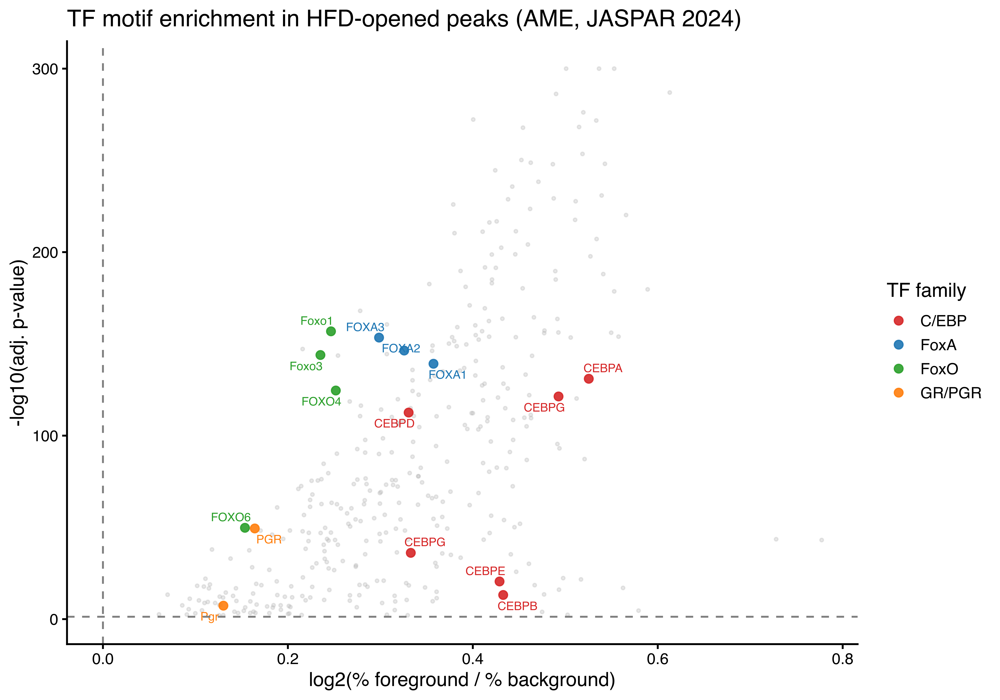{width=3000}
:::
:::


## Data-driven sensitizer-TF discovery

The candidate-driven approach (FoxA, FoxO, C/EBP — picked from the GR-pioneer literature) failed: C/EBP+GR composite enrichment was the same in HFD-specific (OR=1.42) and CHD-specific (OR=1.43) peaks, so the signal isn't HFD-induced — it's a generic "condition-specific peak vs constitutive" signal. FoxA and FoxO weren't enriched at all.

Pivoting to a fully data-driven approach: find TFs that score on **two independent axes**.

- **Axis 1**: Motif enrichment in HFD-specific vs CHD-specific peaks (from `RUN_AME(HFD_vs_CHD)`). This identifies TFs whose binding sites distinguish HFD-driven from CHD-driven chromatin remodeling, controlling for "condition-specific peak" being enhancer-biased.
- **Axis 2**: Motif co-occurrence with GR-class motifs (NR3C1, PGR) within HFD-specific peaks. For each motif M, test whether GR-motif presence rate is higher in M-containing HFD peaks than in non-M-containing HFD peaks (Fisher exact, conditional on being HFD-specific).

A TF scoring on both axes is a candidate sensitizer pioneer chosen by the data rather than priors.


::: {.cell}

```{.r .cell-code}
library(readr)
library(dplyr)
library(stringr)
library(tidyr)

# Axis 1: HFD vs CHD AME results
ame.hvc <- read_tsv("results/motif_analysis/ame_results/HFD_vs_CHD/ame.tsv",
                    comment = "#",
                    show_col_types = FALSE) |>
  filter(!is.na(rank)) |>
  mutate(
    log2_enrich_hvc    = log2((`%TP` + 0.5) / (`%FP` + 0.5)),
    neg_log10_padj_hvc = -log10(pmax(`adj_p-value`, 1e-300)),
    motif_id           = motif_ID
  ) |>
  dplyr::select(motif_id, motif_alt_ID, log2_enrich_hvc, neg_log10_padj_hvc,
         pct_HFD = `%TP`, pct_CHD = `%FP`, adj_p_hvc = `adj_p-value`)

# Axis 2: full per-peak motif occurrence matrix in HFD-specific peaks
hfd.all <- read_tsv("results/motif_analysis/full_motif_scan/HFD_specific/HFD_specific_per_peak_all_motifs.tsv",
                    show_col_types = FALSE)
cat("HFD-specific peaks scanned:", nrow(hfd.all),
    "; motifs with >=1 hit somewhere:", ncol(hfd.all) - 1, "\n")
```

::: {.cell-output .cell-output-stdout}

```
HFD-specific peaks scanned: 6900 ; motifs with >=1 hit somewhere: 775 
```


:::
:::


### GR co-occurrence within HFD-specific peaks (axis 2)


::: {.cell}

```{.r .cell-code}
# GR-class motif IDs (NR3C1 plus PGR human/mouse as IR3 proxies)
gr_motif_ids <- c("MA0113.4", "MA2327.1", "MA2323.1")
gr_cols      <- intersect(gr_motif_ids, names(hfd.all))
hfd.all$has_gr <- if (length(gr_cols) > 0) {
  rowSums(hfd.all[, gr_cols, drop = FALSE]) > 0
} else {
  rep(FALSE, nrow(hfd.all))
}
cat("HFD peaks with at least one GR-class motif:", sum(hfd.all$has_gr),
    "/", nrow(hfd.all),
    sprintf("(%.1f%%)\n", 100 * mean(hfd.all$has_gr)))
```

::: {.cell-output .cell-output-stdout}

```
HFD peaks with at least one GR-class motif: 1526 / 6900 (22.1%)
```


:::

```{.r .cell-code}
# Fisher test for GR enrichment
# You need the GR motif count in your background (shared/non-HFD) peaks
n_hfd      <- nrow(hfd.all)
n_hfd_gr   <- sum(hfd.all$has_gr)
n_bg       <- nrow(shared.motifs)   # shared peaks — adjust if different
n_bg_gr    <- shared.motifs |>
  mutate(has_gr = if_any(all_of(gr_motif_ids), ~ . > 0)) |>
  summarise(sum(has_gr)) |>
  pull()     # GR motif count in background peaks 

gr.hfd.mat <- matrix(
  c(n_hfd_gr,        n_hfd - n_hfd_gr,
    n_bg_gr,         n_bg - n_bg_gr),
  nrow = 2, byrow = TRUE,
  dimnames = list(c("GR+", "GR-"), c("HFD", "Background"))
)

library(knitr)
library(broom)
kable(gr.hfd.mat, caption="GR motifs vs HFD background")
```

::: {.cell-output-display}


Table: GR motifs vs HFD background

|    |   HFD| Background|
|:---|-----:|----------:|
|GR+ |  1526|       5374|
|GR- | 10920|      42477|


:::

```{.r .cell-code}
hfd.gr.ft <- fisher.test(gr.hfd.mat) 

with(hfd.gr.ft,tibble(
  OR      = estimate,
  ci_low  = conf.int[1],
  ci_high = conf.int[2],
  p_value = p.value
)) |> kable(caption="Fisher test for GR enrichment in HFD")
```

::: {.cell-output-display}


Table: Fisher test for GR enrichment in HFD

|       OR|   ci_low|  ci_high|   p_value|
|--------:|--------:|--------:|---------:|
| 1.104569| 1.038888| 1.173921| 0.0014089|


:::

```{.r .cell-code}
# For each non-GR motif M: Fisher exact for GR present | M present vs M absent.
# Restricted to HFD-specific peaks (so we're testing co-occurrence within
# HFD-opened chromatin, not the marginal enrichment of M itself).
motif_cols <- setdiff(names(hfd.all), c("peak", "has_gr", gr_cols))

gr_cooc <- lapply(motif_cols, function(m) {
  m_pres <- hfd.all[[m]] > 0
  a <- sum(m_pres &  hfd.all$has_gr)   # M+ GR+
  b <- sum(m_pres & !hfd.all$has_gr)   # M+ GR-
  c <- sum(!m_pres &  hfd.all$has_gr)  # M- GR+
  d <- sum(!m_pres & !hfd.all$has_gr)  # M- GR-
  if (a + b < 30 || c + d < 30) {
    return(tibble(motif_id = m, n_with_m = a+b, n_m_and_gr = a,
                  cooc_or = NA_real_, cooc_p = NA_real_))
  }
  ft <- fisher.test(matrix(c(a, b, c, d), nrow = 2), alternative = "greater")
  tibble(motif_id = m, n_with_m = a+b, n_m_and_gr = a,
         cooc_or = unname(ft$estimate),
         cooc_p  = ft$p.value)
}) |> bind_rows() |>
  filter(!is.na(cooc_or)) |>
  mutate(cooc_q   = p.adjust(cooc_p, method = "BH"),
         log2_or  = log2(pmax(cooc_or, 1e-3)),
         neg_log10_q = -log10(pmax(cooc_q, 1e-300)))

cat("Motifs tested for GR co-occurrence:", nrow(gr_cooc), "\n")
```

::: {.cell-output .cell-output-stdout}

```
Motifs tested for GR co-occurrence: 772 
```


:::

```{.r .cell-code}
cat("Significant at q<0.05:", sum(gr_cooc$cooc_q < 0.05, na.rm=TRUE), "\n")
```

::: {.cell-output .cell-output-stdout}

```
Significant at q<0.05: 5 
```


:::
:::


### Two-axis ranking — HFD enrichment × GR co-occurrence


::: {.cell}

```{.r .cell-code}
two_axis <- gr_cooc |>
  left_join(ame.hvc, by = "motif_id") |>
  filter(!is.na(log2_enrich_hvc))

# Combined score: only meaningful when BOTH axes are positive
two_axis <- two_axis |>
  mutate(
    combined_score = pmax(log2_enrich_hvc, 0) * pmax(log2_or, 0),
    in_quadrant_TR = log2_enrich_hvc > 0 & log2_or > 0  # top-right quadrant
  ) |>
  arrange(desc(combined_score))

# Strict pass: both axes individually significant. Bonferroni-strength
# correction across ~770 motifs makes this very harsh - typically only
# 0-5 motifs pass. Kept for completeness.
top_strict <- two_axis |>
  filter(in_quadrant_TR, cooc_q < 0.05, adj_p_hvc < 0.05) |>
  arrange(desc(combined_score)) |>
  dplyr::select(motif_id, motif_alt_ID,
         pct_HFD, pct_CHD, log2_enrich_hvc, adj_p_hvc,
         n_with_m, n_m_and_gr, cooc_or, cooc_q,
         combined_score) |>
  head(40)
knitr::kable(top_strict, digits = c(0,0,2,2,3,4,0,0,3,4,3),
             caption = "Strict: HFD-enriched (adj_p<0.05) AND GR-coenriched (q<0.05)")
```

::: {.cell-output-display}


Table: Strict: HFD-enriched (adj_p<0.05) AND GR-coenriched (q<0.05)

|motif_id |motif_alt_ID | pct_HFD| pct_CHD| log2_enrich_hvc| adj_p_hvc| n_with_m| n_m_and_gr| cooc_or| cooc_q| combined_score|
|:--------|:------------|-------:|-------:|---------------:|---------:|--------:|----------:|-------:|------:|--------------:|
|MA1603.2 |Dmrt1        |      60|   42.89|            0.48|         0|      773|        215|   1.415| 0.0116|           0.24|


:::

```{.r .cell-code}
# Relaxed pass: top-right quadrant, ranked by combined score. No strict
# q thresholds - the q-value distribution is dominated by multiple-testing
# burden across ~770 motifs. Combined-score ranking surfaces the
# biologically meaningful cloud the user can see in the scatter plot.
top_relaxed <- two_axis |>
  filter(in_quadrant_TR) |>
  arrange(desc(combined_score)) |>
  dplyr::select(motif_id, motif_alt_ID,
         pct_HFD, pct_CHD, log2_enrich_hvc, adj_p_hvc,
         n_with_m, n_m_and_gr, cooc_or, cooc_p, cooc_q,
         combined_score) |>
  head(40)
knitr::kable(top_relaxed, digits = c(0,0,2,2,3,4,0,0,3,4,4,3),
             caption = "Relaxed: top 40 in top-right quadrant by combined score (no strict q thresholds)")
```

::: {.cell-output-display}


Table: Relaxed: top 40 in top-right quadrant by combined score (no strict q thresholds)

|motif_id |motif_alt_ID | pct_HFD| pct_CHD| log2_enrich_hvc| adj_p_hvc| n_with_m| n_m_and_gr| cooc_or| cooc_p| cooc_q| combined_score|
|:--------|:------------|-------:|-------:|---------------:|---------:|--------:|----------:|-------:|------:|------:|--------------:|
|MA1603.2 |Dmrt1        |   60.00|   42.89|           0.480|    0.0000|      773|        215|   1.415| 0.0000| 0.0116|          0.240|
|MA0896.2 |Hmx1         |   42.49|   29.95|           0.498|    0.0000|      486|        133|   1.358| 0.0027| 0.1753|          0.220|
|MA0713.1 |PHOX2A       |   38.91|   23.07|           0.742|    0.0000|      475|        121|   1.221| 0.0399| 0.5703|          0.214|
|MA2095.1 |Sox7         |   25.14|   15.13|           0.714|    0.0000|      929|        235|   1.228| 0.0073| 0.2694|          0.211|
|MA0911.2 |Hoxa11       |   50.90|   33.81|           0.583|    0.0000|      283|         75|   1.284| 0.0428| 0.6004|          0.210|
|MA1500.2 |HOXB6        |   63.58|   43.19|           0.553|    0.0000|      359|         95|   1.285| 0.0259| 0.4899|          0.200|
|MA1640.2 |MEIS2        |   52.97|   36.23|           0.542|    0.0000|      617|        160|   1.260| 0.0104| 0.3200|          0.181|
|MA0594.3 |HOXA9        |   71.29|   50.91|           0.482|    0.0000|       41|         11|   1.293| 0.2861| 1.0000|          0.179|
|MA1502.2 |HOXB8        |   61.00|   43.34|           0.488|    0.0000|      359|         95|   1.285| 0.0259| 0.4899|          0.177|
|MA0084.2 |SRY          |   70.71|   46.75|           0.592|    0.0000|      792|        200|   1.218| 0.0142| 0.3428|          0.169|
|MA0793.2 |POU6F2       |   58.03|   45.16|           0.358|    0.0000|      512|        141|   1.373| 0.0016| 0.1233|          0.164|
|MA0898.2 |Hmx3         |   50.84|   36.61|           0.468|    0.0000|      409|        107|   1.266| 0.0259| 0.4899|          0.160|
|MA1549.2 |POU6F1       |   60.20|   47.28|           0.345|    0.0000|      526|        145|   1.376| 0.0013| 0.1233|          0.159|
|MA0873.2 |HOXD12       |   27.65|   20.73|           0.407|    0.0001|      212|         57|   1.306| 0.0554| 0.6361|          0.157|
|MA0681.3 |PHOX2B       |   60.52|   42.97|           0.489|    0.0000|      697|        178|   1.235| 0.0132| 0.3390|          0.149|
|MA0693.4 |Vdr          |   26.28|   19.36|           0.431|    0.0003|      751|        194|   1.260| 0.0059| 0.2562|          0.144|
|MA0485.3 |HOXC9        |   16.78|   12.10|           0.456|    0.0099|      309|         80|   1.243| 0.0606| 0.6683|          0.143|
|MA1113.3 |PBX2         |   50.49|   34.87|           0.528|    0.0000|      576|        145|   1.204| 0.0377| 0.5532|          0.141|
|MA1978.2 |ZNF354A      |   57.25|   35.93|           0.665|    0.0000|     1187|        288|   1.158| 0.0282| 0.4899|          0.141|
|MA1518.3 |Lhx1         |   35.96|   27.91|           0.360|    0.0000|      193|         52|   1.309| 0.0628| 0.6743|          0.140|
|MA1476.3 |Dlx5         |   51.19|   35.85|           0.508|    0.0000|      347|         88|   1.209| 0.0782| 0.7193|          0.139|
|MA0908.2 |HOXD11       |   61.17|   46.97|           0.378|    0.0000|      275|         73|   1.286| 0.0437| 0.6024|          0.137|
|MA1580.1 |ZBTB32       |   27.13|   21.33|           0.340|    0.0100|      617|        164|   1.308| 0.0034| 0.1767|          0.132|
|MA1503.2 |HOXB9        |   29.91|   22.62|           0.395|    0.0001|      308|         80|   1.249| 0.0568| 0.6361|          0.127|
|MA0885.3 |Dlx2         |   56.32|   41.15|           0.448|    0.0000|      347|         88|   1.209| 0.0782| 0.7193|          0.122|
|MA0780.1 |PAX3         |   19.77|   14.07|           0.476|    0.0006|      207|         52|   1.188| 0.1651| 0.9156|          0.118|
|MA0868.3 |SOX8         |   71.00|   47.88|           0.564|    0.0000|      640|        156|   1.150| 0.0824| 0.7465|          0.114|
|MA0078.3 |Sox17        |   51.88|   36.91|           0.486|    0.0000|      918|        226|   1.176| 0.0284| 0.4899|          0.114|
|MA1974.2 |ZNF211       |   44.96|   34.11|           0.393|    0.0000|      392|        100|   1.220| 0.0559| 0.6361|          0.113|
|MA0036.4 |GATA2        |   35.58|   26.40|           0.424|    0.0000|      389|         98|   1.199| 0.0761| 0.7193|          0.111|
|MA0757.2 |ONECUT3      |   25.77|   19.82|           0.371|    0.0035|      551|        140|   1.220| 0.0309| 0.4967|          0.106|
|MA1562.2 |SOX14        |   45.55|   33.66|           0.431|    0.0000|      385|         96|   1.181| 0.0965| 0.7682|          0.104|
|MA0906.2 |HOXC12       |   31.67|   24.05|           0.390|    0.0000|      269|         68|   1.200| 0.1160| 0.8450|          0.103|
|MA0135.2 |Lhx3         |   33.01|   21.94|           0.579|    0.0000|      632|        152|   1.128| 0.1197| 0.8453|          0.100|
|MA0790.2 |POU4F1       |   74.43|   56.81|           0.387|    0.0000|      734|        183|   1.193| 0.0300| 0.4928|          0.098|
|MA0627.3 |POU2F3       |   62.48|   44.86|           0.473|    0.0000|      921|        224|   1.154| 0.0465| 0.6111|          0.098|
|MA0724.1 |VENTX        |   45.16|   33.28|           0.435|    0.0000|      275|         68|   1.164| 0.1608| 0.9156|          0.095|
|MA1128.2 |FOSL1::JUN   |   18.26|   10.97|           0.710|    0.0000|      923|        217|   1.096| 0.1461| 0.8878|          0.094|
|MA0754.3 |CUX1         |   50.91|   41.75|           0.283|    0.0000|      195|         51|   1.256| 0.1000| 0.7805|          0.093|
|MA0152.3 |Nfatc2       |   32.48|   21.18|           0.605|    0.0000|     1263|        298|   1.109| 0.0870| 0.7538|          0.090|


:::

```{.r .cell-code}
# Save full ranked table
dir.create("results/motif_analysis/full_motif_scan", recursive = TRUE, showWarnings = FALSE)
write_tsv(two_axis |> arrange(desc(combined_score)),
          "results/motif_analysis/full_motif_scan/data_driven_sensitizer_ranking.tsv")
```
:::


### TF family aggregation

Looking at family-level signal — even if no single member is significant, multiple members clustering in the top-right is meaningful.


::: {.cell}

```{.r .cell-code}
# Family classification (broadened to capture more TFs in "Other")
classify_family <- function(name) {
  case_when(
    grepl("^FOXA",  name, ignore.case = TRUE) ~ "FoxA",
    grepl("^FOXO",  name, ignore.case = TRUE) ~ "FoxO",
    grepl("^FOX",   name, ignore.case = TRUE) ~ "Fox (other)",
    grepl("^CEBP",  name, ignore.case = TRUE) ~ "C/EBP",
    grepl("^NR3C1$|^Pgr$|^PGR$|^AR$|^MR$",   name)             ~ "GR/PGR/AR",
    grepl("^MEF2",  name, ignore.case = TRUE) ~ "MEF2",
    grepl("^FOS|^JUN|^BATF|^FRA[0-9]?",  name, ignore.case = TRUE) ~ "AP-1",
    grepl("^ATF[0-9]?$|^ATF$",       name, ignore.case = TRUE) ~ "ATF",
    grepl("^CREB",  name, ignore.case = TRUE) ~ "CREB",
    grepl("^DDIT3$|^CHOP$",          name, ignore.case = TRUE) ~ "DDIT3/CHOP",
    grepl("^NFE2|^NRF|^MAF",         name, ignore.case = TRUE) ~ "NRF/NFE2/MAF",
    grepl("^KLF",   name, ignore.case = TRUE) ~ "KLF",
    grepl("^SP[0-9]$",               name)             ~ "SP",
    grepl("^STAT",  name, ignore.case = TRUE) ~ "STAT",
    grepl("^IRF",   name, ignore.case = TRUE) ~ "IRF",
    grepl("^HIF",   name, ignore.case = TRUE) ~ "HIF",
    grepl("^NF.?KB|^REL",            name, ignore.case = TRUE) ~ "NF-kB",
    grepl("^RXR|^PPAR|^LXR|^NR[0-9]|^HNF4|^ESR|^ERR|^THR",  name, ignore.case = TRUE) ~ "Nuclear receptor",
    grepl("^TEAD",  name, ignore.case = TRUE) ~ "TEAD/Hippo",
    grepl("^SREBF|^SREBP",           name, ignore.case = TRUE) ~ "SREBP",
    grepl("^DMRT",  name, ignore.case = TRUE) ~ "DMRT",
    grepl("^ZNF|^Zfp|^ZFP",          name)             ~ "Zinc finger",
    grepl("^HOX|^DLX|^MSX|^NKX|^LBX|^VAX|^EVX|^PHOX|^PITX|^OTX|^LHX|^EMX|^GBX|^ALX|^ARX|^ISL|^MEIS|^PBX|^CDX|^GSX|^HMX|^GSC|^MIXL|^NOTO|^RAX|^SHOX|^TLX|^UNCX|^VSX|^BARX|^BARHL|^EN[0-9]|^ESX|^PAX|^POU|^PRRX|^SATB|^BSX|^DRGX|^ARID|^BARH",
         name, ignore.case = TRUE) ~ "Homeobox/AT-rich",
    grepl("^SOX",   name, ignore.case = TRUE) ~ "SOX",
    grepl("^GATA",  name, ignore.case = TRUE) ~ "GATA",
    grepl("^TCF|^LEF",               name, ignore.case = TRUE) ~ "TCF/LEF",
    grepl("^CTCF",  name, ignore.case = TRUE) ~ "CTCF",
    grepl("^E2F",   name, ignore.case = TRUE) ~ "E2F",
    grepl("^ETV|^ELF|^ELK|^GABP|^EHF|^FEV|^ERF|^SPDEF|^FLI1|^ERG|^ETS",
         name, ignore.case = TRUE) ~ "ETS",
    TRUE                                                ~ "Other"
  )
}

family_summary <- two_axis |>
  mutate(family = classify_family(motif_alt_ID)) |>
  filter(family != "Other") |>
  group_by(family) |>
  summarize(
    n_motifs        = n(),
    n_top_right     = sum(log2_enrich_hvc > 0 & log2_or > 0, na.rm = TRUE),
    pct_top_right   = round(100 * n_top_right / n_motifs, 1),
    median_axis1    = round(median(log2_enrich_hvc, na.rm = TRUE), 3),
    median_axis2    = round(median(log2_or,        na.rm = TRUE), 3),
    best_axis1      = round(max(log2_enrich_hvc, na.rm = TRUE),   3),
    best_axis2      = round(max(log2_or,        na.rm = TRUE),   3),
    best_combined   = round(max(combined_score, na.rm = TRUE),   3),
    .groups = "drop"
  ) |>
  arrange(desc(best_combined))

knitr::kable(family_summary, caption = "TF family aggregation: how many family members land in the top-right quadrant, and best within-family scores")
```

::: {.cell-output-display}


Table: TF family aggregation: how many family members land in the top-right quadrant, and best within-family scores

|family           | n_motifs| n_top_right| pct_top_right| median_axis1| median_axis2| best_axis1| best_axis2| best_combined|
|:----------------|--------:|-----------:|-------------:|------------:|------------:|----------:|----------:|-------------:|
|DMRT             |        4|           4|         100.0|        0.254|        0.221|      0.480|      0.501|         0.240|
|Homeobox/AT-rich |       86|          64|          74.4|        0.457|        0.106|      0.742|      0.460|         0.220|
|SOX              |       12|           7|          58.3|        0.441|        0.090|      0.760|      0.296|         0.211|
|Zinc finger      |        6|           5|          83.3|        0.522|        0.187|      0.799|      0.287|         0.141|
|GATA             |        4|           3|          75.0|        0.412|        0.126|      0.522|      0.262|         0.111|
|AP-1             |       21|          19|          90.5|        0.325|        0.080|      0.710|      0.193|         0.094|
|C/EBP            |        3|           2|          66.7|        0.492|        0.037|      0.678|      0.211|         0.082|
|NRF/NFE2/MAF     |        2|           1|          50.0|        0.557|        0.002|      0.709|      0.107|         0.076|
|Fox (other)      |       25|          14|          56.0|        0.414|        0.043|      0.675|      0.133|         0.056|
|ATF              |        2|           2|         100.0|        0.292|        0.146|      0.390|      0.275|         0.054|
|Nuclear receptor |        2|           1|          50.0|        0.583|        0.009|      0.806|      0.131|         0.047|
|MEF2             |        4|           2|          50.0|        0.760|        0.001|      1.052|      0.082|         0.039|
|FoxA             |        3|           3|         100.0|        0.415|        0.043|      0.439|      0.077|         0.034|
|STAT             |        2|           2|         100.0|        0.342|        0.090|      0.342|      0.099|         0.034|
|TCF/LEF          |        3|           1|          33.3|        0.343|       -0.062|      0.511|      0.126|         0.034|
|FoxO             |        4|           4|         100.0|        0.366|        0.043|      0.457|      0.043|         0.020|
|TEAD/Hippo       |        3|           1|          33.3|        0.249|       -0.013|      0.271|      0.072|         0.018|
|IRF              |        2|           2|         100.0|        0.375|        0.028|      0.414|      0.035|         0.015|
|CREB             |        1|           1|         100.0|        0.170|        0.064|      0.170|      0.064|         0.011|


:::
:::


### Two-axis scatter plot


::: {.cell}

```{.r .cell-code}
library(ggrepel)

# Label top hits in top-right quadrant by combined score, regardless of strict
# q thresholds. Multiple-testing correction across 770 motifs is too punishing
# to drive labeling - the user can see structured signal in the scatter that
# the strict filter hides.
label_set <- two_axis |>
  filter(in_quadrant_TR) |>
  arrange(desc(combined_score)) |>
  head(30) |>
  pull(motif_id)

two_axis_plot <- two_axis |>
  mutate(
    label_flag = motif_id %in% label_set,
    family     = classify_family(motif_alt_ID)
  )

ggplot(two_axis_plot, aes(x = log2_enrich_hvc, y = log2_or)) +
  geom_point(data = filter(two_axis_plot, family == "Other"),
             alpha = 0.25, size = 0.8, color = "grey70") +
  geom_point(data = filter(two_axis_plot, family != "Other"),
             aes(color = family), alpha = 0.9, size = 2.2) +
  geom_text_repel(
    data = filter(two_axis_plot, label_flag),
    aes(label = motif_alt_ID, color = family),
    size = 3.2, max.overlaps = 50, show.legend = FALSE
  ) +
  geom_hline(yintercept = 0, linetype = "dashed", color = "grey50") +
  geom_vline(xintercept = 0, linetype = "dashed", color = "grey50") +
  theme_classic(base_size = 14) +
  labs(
    x     = "Axis 1: log2(%HFD-specific / %CHD-specific)  →  HFD-enriched",
    y     = "Axis 2: log2(odds ratio for GR co-occurrence in HFD peaks)  →  GR co-enriched",
    title = "Data-driven sensitizer-TF candidates",
    subtitle = "Top-right quadrant: HFD-enriched AND co-occurring with GR motifs in HFD-opened chromatin",
    color = "TF family"
  )
```

::: {.cell-output-display}
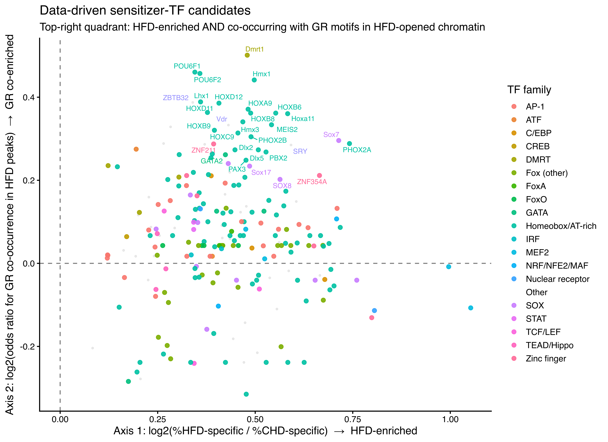{width=3300}
:::
:::


### Pathway enrichment of the top candidates

For the top 5 data-driven sensitizer TF candidates, list HFD-specific peaks containing both the candidate motif AND a GR motif, then annotate to nearest TSS.


::: {.cell}

```{.r .cell-code}
# Top 10 by combined score within the top-right quadrant. Loosened from the
# strict-pass filter (which usually returns only 0-1 motifs) so we annotate
# the structured cloud of HFD-enriched x GR-coenriched TFs.
top5 <- two_axis |>
  filter(in_quadrant_TR) |>
  arrange(desc(combined_score)) |>
  head(10) |>
  pull(motif_id)

#added candidate genes to top5
top5 <- c(top5,"MA0693.4",'MA1128.2') #added vdr and FOSL1/JUN

cat("Top 5 candidates by combined score:\n")
```

::: {.cell-output .cell-output-stdout}

```
Top 5 candidates by combined score:
```


:::

```{.r .cell-code}
print(two_axis |> filter(motif_id %in% top5) |>
        dplyr::select(motif_id, motif_alt_ID, log2_enrich_hvc, log2_or, combined_score))
```

::: {.cell-output .cell-output-stdout}

```
# A tibble: 12 × 5
   motif_id motif_alt_ID log2_enrich_hvc log2_or combined_score
   <chr>    <chr>                  <dbl>   <dbl>          <dbl>
 1 MA1603.2 Dmrt1                  0.480   0.501         0.240 
 2 MA0896.2 Hmx1                   0.498   0.441         0.220 
 3 MA0713.1 PHOX2A                 0.742   0.288         0.214 
 4 MA2095.1 Sox7                   0.714   0.296         0.211 
 5 MA0911.2 Hoxa11                 0.583   0.360         0.210 
 6 MA1500.2 HOXB6                  0.553   0.362         0.200 
 7 MA1640.2 MEIS2                  0.542   0.334         0.181 
 8 MA0594.3 HOXA9                  0.482   0.371         0.179 
 9 MA1502.2 HOXB8                  0.488   0.362         0.177 
10 MA0084.2 SRY                    0.592   0.285         0.169 
11 MA0693.4 Vdr                    0.431   0.333         0.144 
12 MA1128.2 FOSL1::JUN             0.710   0.132         0.0939
```


:::

```{.r .cell-code}
# For each top candidate, get the peaks containing both that motif and GR
for (mid in top5) {
  if (!mid %in% names(hfd.all)) next
  cand_peaks <- hfd.all |>
    filter(.data[[mid]] > 0 & has_gr) |>
    pull(peak)
  if (length(cand_peaks) < 10) {
    cat("\n", mid, ": only", length(cand_peaks), "composite peaks - skipping\n")
    next
  }
  cand_gr <- parse_peaks_to_gr(cand_peaks)
  cand_ann <- as.data.frame(annotatePeak(
    cand_gr,
    TxDb     = TxDb.Mmusculus.UCSC.mm10.knownGene,
    tssRegion = c(-2000, 500),
    annoDb    = "org.Mm.eg.db",
    verbose   = FALSE
  ))
  cand_genes <- cand_ann |>
    filter(!is.na(SYMBOL)) |>
    distinct(SYMBOL, .keep_all = TRUE) |>
    arrange(abs(distanceToTSS))
  alt_name <- two_axis$motif_alt_ID[two_axis$motif_id == mid][1]
  cat("\n=== ", mid, " (", alt_name, ") + GR composite peaks ===\n", sep = "")
  cat("  Composite peaks:", length(cand_peaks),
      "; unique nearest genes:", nrow(cand_genes), "\n")
  print(head(cand_genes |> dplyr::select(SYMBOL, distanceToTSS), 20))

  write_tsv(cand_genes,
            sprintf("results/motif_analysis/full_motif_scan/%s_GR_composite_genes.tsv",
                    gsub("[^A-Za-z0-9._-]", "_", paste0(alt_name, "_", mid))))
}
```

::: {.cell-output .cell-output-stdout}

```
>> Using Genome: mm10 ...
>> Using Genome: mm10 ...
>> Using Genome: mm10 ...
```


:::

::: {.cell-output .cell-output-stdout}

```

=== MA1603.2 (Dmrt1) + GR composite peaks ===
  Composite peaks: 215 ; unique nearest genes: 206 
          SYMBOL distanceToTSS
1        Dennd4b             0
2           Cnn3             0
3           Pltp           460
4        Tmem52b          -483
5          Strbp          -570
6        Rhobtb3          -717
7        Slco1b2           801
8           Ell2         -1080
9          Ephb3         -1549
10        Tsg101          1811
11         Gcfc2          1884
12 2310002D06Rik         -2080
13          Erc1          2082
14         Sgip1          2155
15        Tsen15          2191
16         Adam8         -2329
17        Drosha         -2600
18          Ssh1          2630
19 A630001G21Rik          2847
20        Popdc1         -3007
>> Using Genome: mm10 ...
>> Using Genome: mm10 ...
>> Using Genome: mm10 ...
```


:::

::: {.cell-output .cell-output-stdout}

```

=== MA0896.2 (Hmx1) + GR composite peaks ===
  Composite peaks: 133 ; unique nearest genes: 131 
          SYMBOL distanceToTSS
1  2210408F21Rik             0
2          Iftap         -1680
3           Trio          2269
4         Snhg14          2278
5           Wwp2         -3531
6        Commd10          3536
7          Fcho2         -3922
8         Osbpl8         -4232
9        Sostdc1         -4983
10         Atg2b          5214
11        Prss58          5242
12       Prpf38b         -5321
13         Gm826          5507
14       Tbl1xr1         -5927
15 D030068K23Rik          6099
16       Tmem247          6209
17       Pyroxd1         -6253
18           Pam          6430
19         Mcph1         -6625
20        Resp18         -6684
>> Using Genome: mm10 ...
>> Using Genome: mm10 ...
>> Using Genome: mm10 ...
```


:::

::: {.cell-output .cell-output-stdout}

```

=== MA0713.1 (PHOX2A) + GR composite peaks ===
  Composite peaks: 121 ; unique nearest genes: 118 
          SYMBOL distanceToTSS
1           Xpot             0
2  1700061I17Rik           -25
3         Tsen15           280
4        Tmem52b          -483
5         Ndfip2          -967
6           Tex9          1087
7         Trim16         -1676
8          Lims1         -1756
9           Kncn         -2031
10       Or52s19         -2892
11       Commd10          3536
12        Osbpl8         -4232
13       Ankrd44          5026
14         Fnip2          5807
15         Cadps          5930
16        Itprip         -6271
17         Elmo1          7339
18       Slc30a8          7564
19          Chd6         -8708
20         Hdac9         -8939
>> Using Genome: mm10 ...
>> Using Genome: mm10 ...
>> Using Genome: mm10 ...
```


:::

::: {.cell-output .cell-output-stdout}

```

=== MA2095.1 (Sox7) + GR composite peaks ===
  Composite peaks: 235 ; unique nearest genes: 223 
          SYMBOL distanceToTSS
1         Adgrg1          -170
2          Acbd5           416
3        Aldh3a1          -680
4          Cdk14           766
5          Cbln4           928
6    D16Ertd472e          1299
7  4933405E24Rik         -1347
8           Cux2          1370
9  2410137M14Rik          1724
10 2310002D06Rik         -2080
11        Snhg14          2278
12         Adam8         -2329
13          Oas3         -2435
14         Palld         -2862
15          Asb5         -2888
16        Ms4a15         -3164
17         Vstm4          3258
18          Il16         -3352
19         Resf1          3730
20         Fcho2         -3922
>> Using Genome: mm10 ...
>> Using Genome: mm10 ...
>> Using Genome: mm10 ...
```


:::

::: {.cell-output .cell-output-stdout}

```

=== MA0911.2 (Hoxa11) + GR composite peaks ===
  Composite peaks: 75 ; unique nearest genes: 74 
          SYMBOL distanceToTSS
1           Tcf4             0
2  1700003L19Rik           -20
3          Ccar1          -280
4         Ndfip2          -967
5         Dnajc6         -2852
6        Eif2ak4          3352
7          Samd4         -3858
8          Cntn1          4487
9        Ankrd44          5026
10          Siae         -5545
11         Resf1         -5549
12          Spic          6119
13         Sumf1          7545
14        Rabep1          7726
15       Tnfaip8         -8296
16       Morrbid         -8568
17         Prkcq         -8917
18 4930534H03Rik         -9350
19 4930402F06Rik         10535
20        Sec24d        -10618
>> Using Genome: mm10 ...
>> Using Genome: mm10 ...
>> Using Genome: mm10 ...
```


:::

::: {.cell-output .cell-output-stdout}

```

=== MA1500.2 (HOXB6) + GR composite peaks ===
  Composite peaks: 95 ; unique nearest genes: 93 
          SYMBOL distanceToTSS
1          Strbp          -570
2          Iftap         -1680
3           Kncn         -2031
4         Snhg14          2278
5          Palld         -2862
6         Ms4a15         -3164
7          Fcho2         -3922
8         Thnsl2         -4905
9           Sv2b         -4922
10       Sostdc1         -4983
11          Mylk         -5132
12         Atg2b          5214
13        Prss58          5242
14        Sacm1l         -5742
15 D030068K23Rik          6099
16         Mcph1         -6625
17        Resp18         -6684
18     Serpinb6b         -6805
19        Stxbp6          6995
20          Ctsl          7367
>> Using Genome: mm10 ...
>> Using Genome: mm10 ...
>> Using Genome: mm10 ...
```


:::

::: {.cell-output .cell-output-stdout}

```

=== MA1640.2 (MEIS2) + GR composite peaks ===
  Composite peaks: 160 ; unique nearest genes: 151 
          SYMBOL distanceToTSS
1          Plce1             0
2           Cnn3             0
3  2210408F21Rik             0
4         Tsen15           280
5           Pltp           460
6          Rab23          -989
7           Erc1          2082
8         Drosha         -2600
9  C730014E05Rik          2661
10          Asb5         -2888
11         Setd3          3516
12          Epg5         -4108
13       Gm36283         -4133
14         Hbegf          5081
15         Acbd3          5114
16        Sacm1l         -5742
17 1700123M08Rik          5901
18          Spic          6119
19        Osbpl3         -6139
20           Pam          6430
>> Using Genome: mm10 ...
>> Using Genome: mm10 ...
>> Using Genome: mm10 ...
```


:::

::: {.cell-output .cell-output-stdout}

```

=== MA0594.3 (HOXA9) + GR composite peaks ===
  Composite peaks: 11 ; unique nearest genes: 11 
          SYMBOL distanceToTSS
1         Mir759          4093
2        Tmem63c          4996
3        Dpy19l1         11366
4        Exoc3l2         11634
5         Map4k4        -16321
6        Ppp2r5e         20282
7          Cep44         25628
8          Man1a        -43812
9       Tbc1d22a         58590
10           Nnt        140216
11 4930405L22Rik       -293636
>> Using Genome: mm10 ...
>> Using Genome: mm10 ...
>> Using Genome: mm10 ...
```


:::

::: {.cell-output .cell-output-stdout}

```

=== MA1502.2 (HOXB8) + GR composite peaks ===
  Composite peaks: 95 ; unique nearest genes: 93 
          SYMBOL distanceToTSS
1          Strbp          -570
2          Iftap         -1680
3           Kncn         -2031
4         Snhg14          2278
5          Palld         -2862
6         Ms4a15         -3164
7          Fcho2         -3922
8         Thnsl2         -4905
9           Sv2b         -4922
10       Sostdc1         -4983
11          Mylk         -5132
12         Atg2b          5214
13        Prss58          5242
14        Sacm1l         -5742
15 D030068K23Rik          6099
16         Mcph1         -6625
17        Resp18         -6684
18     Serpinb6b         -6805
19        Stxbp6          6995
20          Ctsl          7367
>> Using Genome: mm10 ...
>> Using Genome: mm10 ...
>> Using Genome: mm10 ...
```


:::

::: {.cell-output .cell-output-stdout}

```

=== MA0084.2 (SRY) + GR composite peaks ===
  Composite peaks: 200 ; unique nearest genes: 189 
          SYMBOL distanceToTSS
1          Lrch1             0
2          Kif14          -401
3        Tmem52b          -483
4         Hivep3           658
5        Aldh3a1          -680
6  4933405E24Rik         -1347
7          Ephb3         -1549
8        Tmem192         -1708
9         Pla2r1         -2028
10          Erc1          2082
11         Pcdh1         -2297
12 A630001G21Rik          2847
13          Ttc3         -2996
14        Ms4a15         -3164
15          Tln2         -3358
16         Fcho2         -3922
17       Gm36283         -4133
18         Cntn1          4487
19          Ddi1          4571
20         Med30         -4658
>> Using Genome: mm10 ...
>> Using Genome: mm10 ...
>> Using Genome: mm10 ...
```


:::

::: {.cell-output .cell-output-stdout}

```

=== MA0693.4 (Vdr) + GR composite peaks ===
  Composite peaks: 194 ; unique nearest genes: 192 
    SYMBOL distanceToTSS
1  Fam186a             0
2    Tcp11             0
3     Pltp           460
4   Ccdc62          -605
5   Cep104           775
6   Vps35l           853
7    Atp9b           961
8    Rab23          -989
9     Tex9          1087
10   Ephb3         -1549
11 Tmem192         -1708
12   Lims1         -1756
13  Tsg101          1811
14  Dnaaf9          2028
15   Adam8         -2329
16   Palld         -2862
17  Popdc1         -3007
18 Zfp1003          3522
19   Manba          3671
20  Wrap73          3958
>> Using Genome: mm10 ...
>> Using Genome: mm10 ...
>> Using Genome: mm10 ...
```


:::

::: {.cell-output .cell-output-stdout}

```

=== MA1128.2 (FOSL1::JUN) + GR composite peaks ===
  Composite peaks: 217 ; unique nearest genes: 210 
          SYMBOL distanceToTSS
1           Cnn3             0
2          Fkbp9           -43
3        Aldh3a1           289
4           Ric3           358
5        Rhobtb3          -717
6          Cdk14           766
7  4933405E24Rik         -1347
8          Pcnx1         -1401
9           Elf2         -1421
10        Trim16         -1676
11         Gcfc2          1884
12          Fpr2          1984
13         Sgip1          2155
14         Pcdh1         -2297
15         Adam8         -2329
16 A630001G21Rik          2847
17         Hmgn2          3798
18          Epg5         -4108
19         Galns         -4520
20         Med30         -4658
```


:::
:::


## Session Information


::: {.cell}

```{.r .cell-code}
sessionInfo()
```

::: {.cell-output .cell-output-stdout}

```
R version 4.6.0 (2026-04-24)
Platform: aarch64-apple-darwin23
Running under: macOS Tahoe 26.5

Matrix products: default
BLAS:   /Library/Frameworks/R.framework/Versions/4.6/Resources/lib/libRblas.0.dylib 
LAPACK: /Library/Frameworks/R.framework/Versions/4.6/Resources/lib/libRlapack.dylib;  LAPACK version 3.12.1

locale:
[1] en_US.UTF-8/en_US.UTF-8/en_US.UTF-8/C/en_US.UTF-8/en_US.UTF-8

time zone: America/Detroit
tzcode source: internal

attached base packages:
[1] stats4    stats     graphics  grDevices utils     datasets  methods  
[8] base     

other attached packages:
 [1] broom_1.0.13                             
 [2] knitr_1.51                               
 [3] ggrepel_0.9.8                            
 [4] msigdbr_26.1.0                           
 [5] enrichplot_1.32.0                        
 [6] clusterProfiler_4.20.0                   
 [7] patchwork_1.3.2                          
 [8] org.Mm.eg.db_3.23.0                      
 [9] TxDb.Mmusculus.UCSC.mm10.knownGene_3.10.0
[10] GenomicFeatures_1.64.0                   
[11] AnnotationDbi_1.74.0                     
[12] Biobase_2.72.0                           
[13] GenomicRanges_1.64.0                     
[14] Seqinfo_1.2.0                            
[15] IRanges_2.46.0                           
[16] S4Vectors_0.50.1                         
[17] BiocGenerics_0.58.1                      
[18] generics_0.1.4                           
[19] ChIPseeker_1.48.0                        
[20] lubridate_1.9.5                          
[21] forcats_1.0.1                            
[22] stringr_1.6.0                            
[23] dplyr_1.2.1                              
[24] purrr_1.2.2                              
[25] readr_2.2.0                              
[26] tidyr_1.3.2                              
[27] tibble_3.3.1                             
[28] ggplot2_4.0.3                            
[29] tidyverse_2.0.0                          

loaded via a namespace (and not attached):
  [1] RColorBrewer_1.1-3                      
  [2] rstudioapi_0.18.0                       
  [3] jsonlite_2.0.0                          
  [4] tidydr_0.0.6                            
  [5] magrittr_2.0.5                          
  [6] ggtangle_0.1.2                          
  [7] farver_2.1.2                            
  [8] rmarkdown_2.31                          
  [9] fs_2.1.0                                
 [10] BiocIO_1.22.0                           
 [11] vctrs_0.7.3                             
 [12] memoise_2.0.1                           
 [13] Rsamtools_2.28.0                        
 [14] RCurl_1.98-1.18                         
 [15] ggtree_4.2.0                            
 [16] htmltools_0.5.9                         
 [17] S4Arrays_1.12.0                         
 [18] TxDb.Hsapiens.UCSC.hg19.knownGene_3.22.1
 [19] plotrix_3.8-14                          
 [20] curl_7.1.0                              
 [21] SparseArray_1.12.2                      
 [22] gridGraphics_0.5-1                      
 [23] KernSmooth_2.23-26                      
 [24] htmlwidgets_1.6.4                       
 [25] httr2_1.2.2                             
 [26] plyr_1.8.9                              
 [27] cachem_1.1.0                            
 [28] GenomicAlignments_1.48.0                
 [29] igraph_2.3.1                            
 [30] lifecycle_1.0.5                         
 [31] pkgconfig_2.0.3                         
 [32] gson_0.1.0                              
 [33] Matrix_1.7-5                            
 [34] R6_2.6.1                                
 [35] fastmap_1.2.0                           
 [36] MatrixGenerics_1.24.0                   
 [37] digest_0.6.39                           
 [38] aplot_0.2.9                             
 [39] ggnewscale_0.5.2                        
 [40] aisdk_1.1.0                             
 [41] RSQLite_3.53.1                          
 [42] labeling_0.4.3                          
 [43] timechange_0.4.0                        
 [44] polyclip_1.10-7                         
 [45] httr_1.4.8                              
 [46] abind_1.4-8                             
 [47] compiler_4.6.0                          
 [48] bit64_4.8.2                             
 [49] fontquiver_0.2.1                        
 [50] withr_3.0.2                             
 [51] backports_1.5.1                         
 [52] S7_0.2.2                                
 [53] BiocParallel_1.46.0                     
 [54] DBI_1.3.0                               
 [55] gplots_3.3.0                            
 [56] ggforce_0.5.0                           
 [57] MASS_7.3-65                             
 [58] rappdirs_0.3.4                          
 [59] DelayedArray_0.38.1                     
 [60] rjson_0.2.23                            
 [61] caTools_1.18.3                          
 [62] gtools_3.9.5                            
 [63] tools_4.6.0                             
 [64] otel_0.2.0                              
 [65] scatterpie_0.2.6                        
 [66] ape_5.8-1                               
 [67] glue_1.8.1                              
 [68] callr_3.7.6                             
 [69] restfulr_0.0.16                         
 [70] nlme_3.1-169                            
 [71] GOSemSim_2.38.0                         
 [72] grid_4.6.0                              
 [73] cluster_2.1.8.2                         
 [74] reshape2_1.4.5                          
 [75] gtable_0.3.6                            
 [76] tzdb_0.5.0                              
 [77] hms_1.1.4                               
 [78] utf8_1.2.6                              
 [79] XVector_0.52.0                          
 [80] pillar_1.11.1                           
 [81] babelgene_22.9                          
 [82] yulab.utils_0.2.4                       
 [83] vroom_1.7.1                             
 [84] splines_4.6.0                           
 [85] tweenr_2.0.3                            
 [86] treeio_1.36.1                           
 [87] lattice_0.22-9                          
 [88] rtracklayer_1.72.0                      
 [89] bit_4.6.0                               
 [90] tidyselect_1.2.1                        
 [91] fontLiberation_0.1.0                    
 [92] GO.db_3.23.1                            
 [93] Biostrings_2.80.0                       
 [94] fontBitstreamVera_0.1.1                 
 [95] SummarizedExperiment_1.42.0             
 [96] xfun_0.57                               
 [97] matrixStats_1.5.0                       
 [98] stringi_1.8.7                           
 [99] UCSC.utils_1.8.0                        
[100] lazyeval_0.2.3                          
[101] ggfun_0.2.0                             
[102] yaml_2.3.12                             
[103] boot_1.3-32                             
[104] evaluate_1.0.5                          
[105] codetools_0.2-20                        
[106] cigarillo_1.2.0                         
[107] qvalue_2.44.0                           
[108] gdtools_0.5.1                           
[109] ggplotify_0.1.3                         
[110] cli_3.6.6                               
[111] systemfonts_1.3.2                       
[112] processx_3.9.0                          
[113] Rcpp_1.1.1-1.1                          
[114] GenomeInfoDb_1.48.0                     
[115] png_0.1-9                               
[116] XML_3.99-0.23                           
[117] parallel_4.6.0                          
[118] assertthat_0.2.1                        
[119] blob_1.3.0                              
[120] DOSE_4.6.0                              
[121] bitops_1.0-9                            
[122] tidytree_0.4.7                          
[123] ggiraph_0.9.6                           
[124] enrichit_0.1.4                          
[125] scales_1.4.0                            
[126] crayon_1.5.3                            
[127] rlang_1.2.0                             
[128] KEGGREST_1.52.0                         
```


:::
:::

