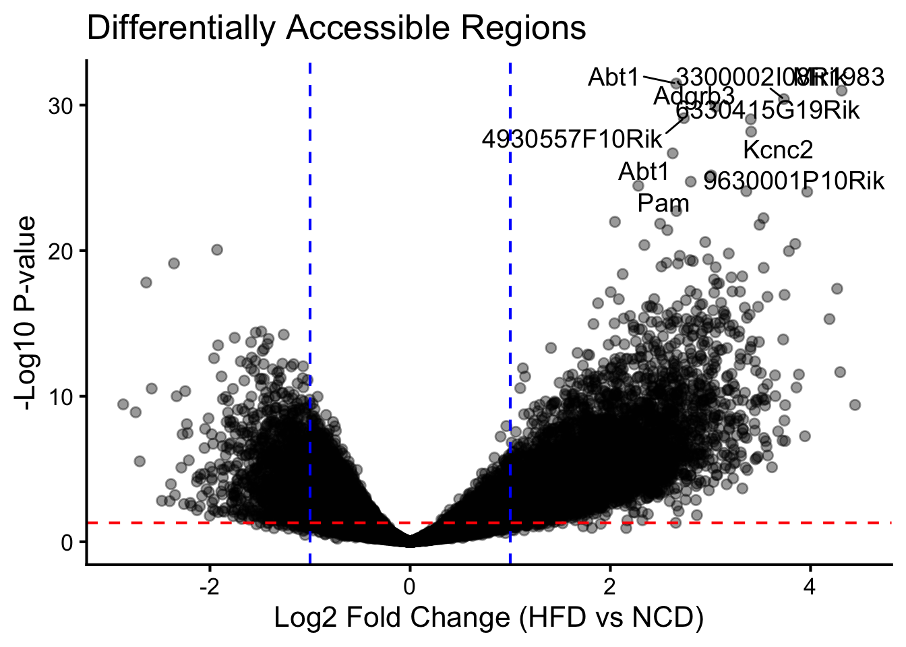
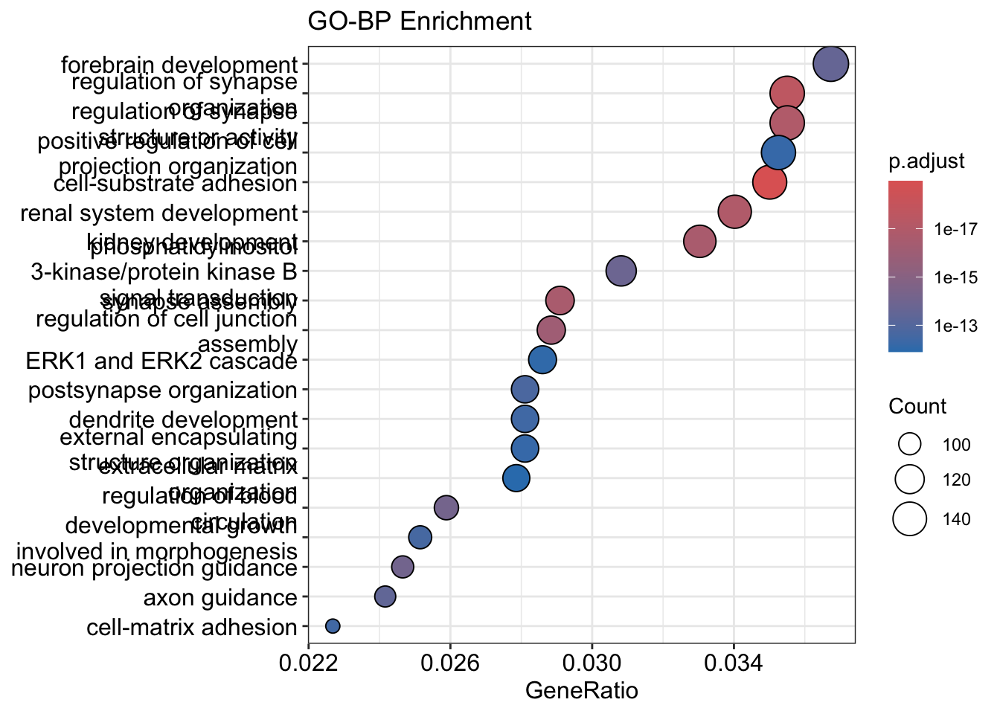
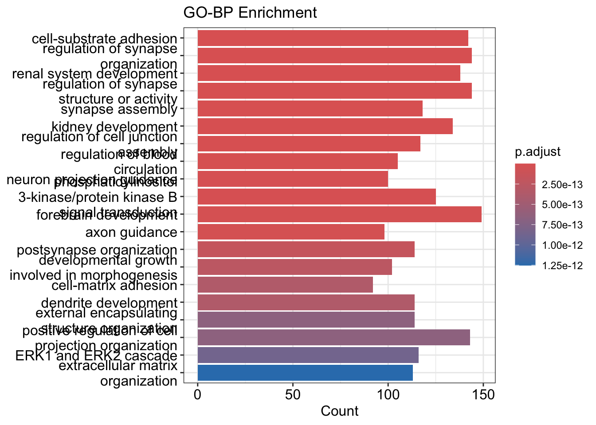
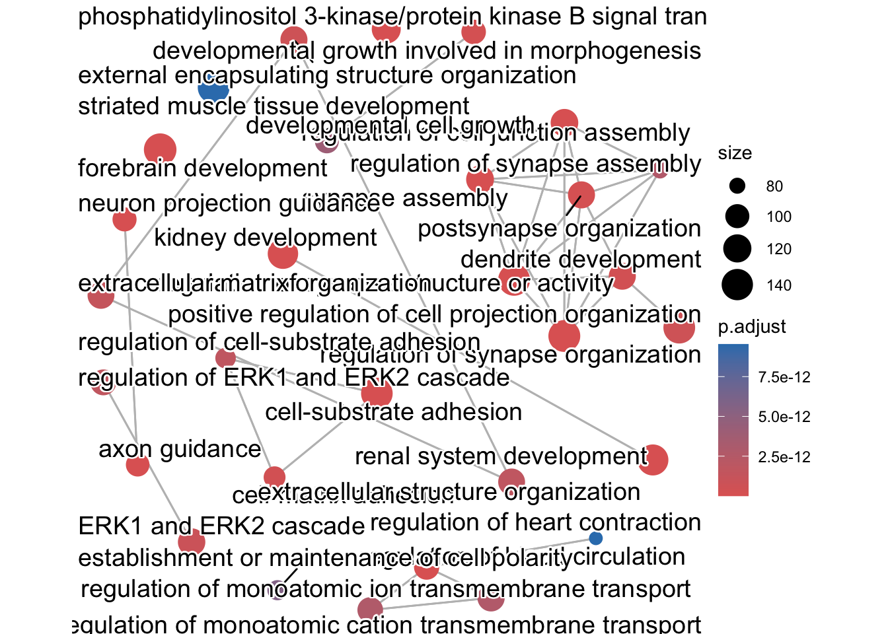
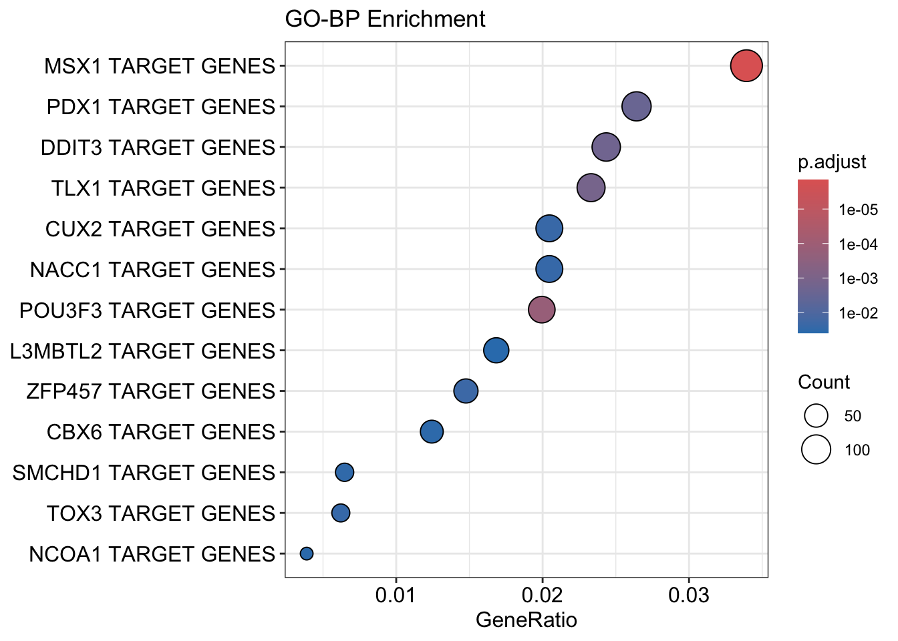
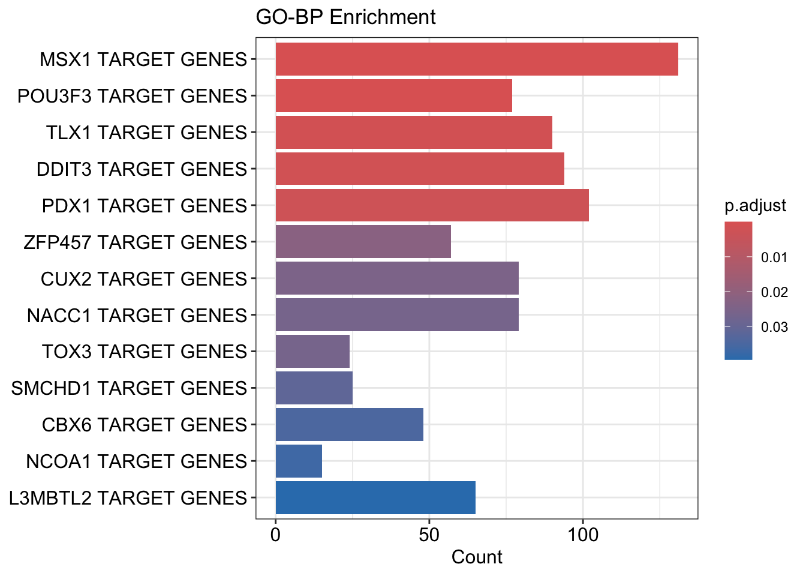
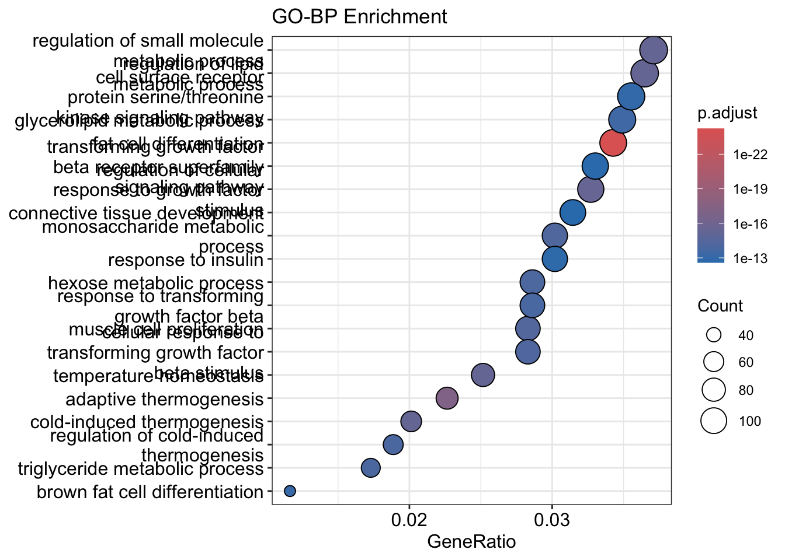
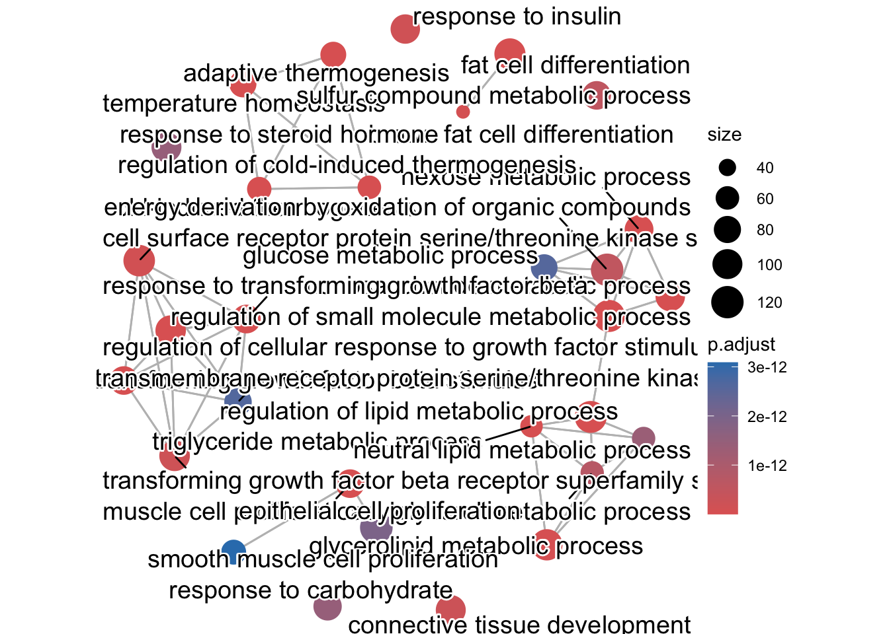

::: {.cell}

```{.r .cell-code}
# hide this code chunk
#| echo: false
#| message: false

# defines the se function
se <- function(x) {
  sd(x, na.rm = TRUE) / sqrt(length(x))
}

#load these packages, nearly always needed
library(tidyverse)

# sets maize and blue color scheme
color_scheme <- c("#00274c", "#ffcb05")
```
:::


## Purpose

This script analyses the results from a DESeq2 and MEME analysis of GSE236575.  The purpose of this analysis is to identify differentially expressed regions and enriched motifs in that dataset.  See the README.md file in this folder for details on the generation of these files

## Raw Data

The DESeq2 analysis was done on the remote server (see `main.nf` for commands).  This script loads in both those results and the raw counts that were used for that analysis.  


::: {.cell}

```{.r .cell-code}
library(readr) #loads the readr package
deseq.filename <- "results/deseq2/deseq2_results.txt" #input file(s)
deseq.counts.filename <- "results/deseq2/deseq2_normalized_counts.txt"

deseq.results <- read_tsv(deseq.filename) #reads in the data
```
:::


These data can be found in /Users/davebrid/Documents/GitHub/CushingAcromegalyStudy/external-datasets/snATACseq/GSE236575 in a file named results/deseq2/deseq2_results.txt.  This input file was most recently updated on 2026-05-06.  This script was most recently updated on Wed May  6 17:20:36 2026.

## Analysis

There were 61619 regions analyzed in this dataset.  Of these, 14872 (24.1354128%) were found to be significantly differentially accessible comparing the NCD to HFD adipocytes at an FDR of 0.05.  Of those significant regions, 8612 (57.9074771%) were upregulated in HFD adipocytes and (42.0925229%) were more accessible in NCD adipocytes.

Out of the differentially regulated subset, the HFD adipocytes had an average log2 fold change of 1.5394525 +/- 0.0065426, while the NCD adipocytes had an average log2 fold change of -0.817636 +/- 0.0037877.


### Annotation to known genes


::: {.cell}

```{.r .cell-code}
library(ChIPseeker)
library(GenomicRanges)
library(TxDb.Mmusculus.UCSC.mm10.knownGene)
library(org.Mm.eg.db)

# BED files from main.nf use UCSC-style chr-prefixed naming (chr1, chrM, ...)
# so deseq.results$chr is already "chr1" etc. — no extra prefixing needed.
hfd.peaks <- deseq.results |> filter(padj<0.05, log2FoldChange>0)
hfd.gr <- with(hfd.peaks, GRanges(seqnames=chr, ranges=IRanges(start+1, end))) # 0-based BED -> 1-based GRanges
txdb <- TxDb.Mmusculus.UCSC.mm10.knownGene

hfd.annot <- annotatePeak(hfd.gr, TxDb=txdb, tssRegion=c(-2000, 500), annoDb="org.Mm.eg.db")
```

::: {.cell-output .cell-output-stdout}

```
>> preparing features information...		 2026-05-06 17:20:41 
>> Using Genome: mm10 ...
>> identifying nearest features...		 2026-05-06 17:20:41 
>> calculating distance from peak to TSS...	 2026-05-06 17:20:42 
>> assigning genomic annotation...		 2026-05-06 17:20:42 
>> Using Genome: mm10 ...
>> Using Genome: mm10 ...
>> adding gene annotation...			 2026-05-06 17:20:51 
```


:::

::: {.cell-output .cell-output-stdout}

```
>> assigning chromosome lengths			 2026-05-06 17:20:51 
>> done...					 2026-05-06 17:20:51 
```


:::

```{.r .cell-code}
hfd.ann_df <- as.data.frame(hfd.annot)

ncd.peaks <- deseq.results |> filter(padj<0.05, log2FoldChange<0)
ncd.gr <- with(ncd.peaks, GRanges(seqnames=chr, ranges=IRanges(start+1, end)))

ncd.annot <- annotatePeak(ncd.gr, TxDb=txdb, tssRegion=c(-2000, 500), annoDb="org.Mm.eg.db")
```

::: {.cell-output .cell-output-stdout}

```
>> preparing features information...		 2026-05-06 17:20:51 
>> Using Genome: mm10 ...
>> identifying nearest features...		 2026-05-06 17:20:51 
>> calculating distance from peak to TSS...	 2026-05-06 17:20:52 
>> assigning genomic annotation...		 2026-05-06 17:20:52 
>> Using Genome: mm10 ...
>> Using Genome: mm10 ...
>> adding gene annotation...			 2026-05-06 17:20:53 
```


:::

::: {.cell-output .cell-output-stdout}

```
>> assigning chromosome lengths			 2026-05-06 17:20:53 
>> done...					 2026-05-06 17:20:53 
```


:::

```{.r .cell-code}
ncd.ann_df <- as.data.frame(ncd.annot)

all.gr <- with(deseq.results, GRanges(seqnames=chr, ranges=IRanges(start+1, end)))
all.ann_df <- as.data.frame(annotatePeak(all.gr, TxDb=txdb, tssRegion=c(-2000, 500), annoDb="org.Mm.eg.db"))
```

::: {.cell-output .cell-output-stdout}

```
>> preparing features information...		 2026-05-06 17:20:53 
>> Using Genome: mm10 ...
>> identifying nearest features...		 2026-05-06 17:20:53 
>> calculating distance from peak to TSS...	 2026-05-06 17:20:54 
>> assigning genomic annotation...		 2026-05-06 17:20:54 
>> Using Genome: mm10 ...
>> Using Genome: mm10 ...
>> adding gene annotation...			 2026-05-06 17:20:55 
```


:::

::: {.cell-output .cell-output-stdout}

```
>> assigning chromosome lengths			 2026-05-06 17:20:56 
>> done...					 2026-05-06 17:20:56 
```


:::
:::


These 8612 chromatin regions that were differentially opened by HFD were annotated as closest to 4632 unique genes, whereas the 6260 regions more accessible in NCD were annotated as closest to 3560 unique genes.  

### Volcano Plots of Regions


::: {.cell}

```{.r .cell-code}
library(ggplot2)
library(ggrepel)
# Join on chromosome AND end so peaks on different chromosomes can't collide.
# all.ann_df$seqnames == deseq.results$chr; all.ann_df$end == deseq.results$end.
deseq.results.annot <- deseq.results |>
  left_join(all.ann_df, by=c("chr"="seqnames", "end"="end"))

ggplot(deseq.results.annot, aes(x=log2FoldChange, y=-log10(pvalue))) +
  geom_point(alpha=0.4) +
  theme_minimal() +
  xlab("Log2 Fold Change (HFD vs NCD)") +
  ylab("-Log10 P-value") +
  ggtitle("Differentially Accessible Regions") +
  ggrepel::geom_text_repel(
    data = deseq.results.annot |>
      filter(padj < 0.05 & abs(log2FoldChange) > 0.5) |>
      arrange(padj) |> head(10),
    aes(label = SYMBOL), size = 5, max.overlaps = Inf) +
  geom_hline(yintercept=-log10(0.05), linetype="dashed", color="red") +
  geom_vline(xintercept=c(-1, 1), linetype="dashed", color="blue") +
  theme_classic(base_size=16)
```

::: {.cell-output-display}
{width=672}
:::
:::


### GSEA Analysis of nearest genes


::: {.cell}

```{.r .cell-code}
library(clusterProfiler)

hfd.gobp <- enrichGO(gene          = bitr(unique(hfd.ann_df$SYMBOL), 
                 fromType = "SYMBOL",
                 toType = "ENTREZID",
                 OrgDb = org.Mm.eg.db)$ENTREZID,
                OrgDb         = org.Mm.eg.db,
                keyType       = "ENTREZID",
                ont           = "BP",
                pAdjustMethod = "BH",
                pvalueCutoff  = 0.05,
                qvalueCutoff  = 0.05,
                readable      = TRUE)

dotplot(hfd.gobp, showCategory=20) + ggtitle("GO-BP Enrichment")
```

::: {.cell-output-display}
{width=672}
:::

```{.r .cell-code}
barplot(hfd.gobp, showCategory=20) + ggtitle("GO-BP Enrichment")
```

::: {.cell-output-display}
{width=672}
:::

```{.r .cell-code}
library(enrichplot)
emapplot(pairwise_termsim(hfd.gobp))
```

::: {.cell-output-display}
{width=672}
:::

```{.r .cell-code}
#transfac
library(msigdbr)
```
:::


#### Gene Transcription Regulation Database 


::: {.cell}

```{.r .cell-code}
gtrd <- msigdbr(
    db_species="MM",
    species = "Mus musculus",
    subcollection="GTRD"
)


hfd.gobp.gtrd <- enricher(
    unique(hfd.ann_df$SYMBOL),                              # your ENTREZ or SYMBOL list
    TERM2GENE = gtrd[, c("gs_name", "gene_symbol")]
)
dotplot(hfd.gobp.gtrd, showCategory=20) + ggtitle("GO-BP Enrichment")
```

::: {.cell-output-display}
{width=672}
:::

```{.r .cell-code}
barplot(hfd.gobp.gtrd, showCategory=20) + ggtitle("GO-BP Enrichment")
```

::: {.cell-output-display}
{width=672}
:::

```{.r .cell-code}
#emapplot(pairwise_termsim(hfd.gobp.gtrd))
```
:::


::: {.cell}

```{.r .cell-code}
ncd.gobp <- enrichGO(gene          = bitr(unique(ncd.ann_df$SYMBOL), 
                 fromType = "SYMBOL",
                 toType = "ENTREZID",
                 OrgDb = org.Mm.eg.db)$ENTREZID,
                OrgDb         = org.Mm.eg.db,
                keyType       = "ENTREZID",
                ont           = "BP",
                pAdjustMethod = "BH",
                pvalueCutoff  = 0.05,
                qvalueCutoff  = 0.05,
                readable      = TRUE)

dotplot(ncd.gobp, showCategory=20) + ggtitle("GO-BP Enrichment")
```

::: {.cell-output-display}
{width=672}
:::

```{.r .cell-code}
barplot(ncd.gobp, showCategory=20) + ggtitle("GO-BP Enrichment")
```

::: {.cell-output-display}
{width=672}
:::

```{.r .cell-code}
emapplot(pairwise_termsim(ncd.gobp))
```

::: {.cell-output-display}
{width=672}
:::
:::


## Interpretation

A brief summary of what the interpretation of these results were

## References

If needed you will need a *.bib file.  See the details at <https://quarto.org/docs/authoring/citations.html>

## Session Information


::: {.cell}

```{.r .cell-code}
sessionInfo()
```

::: {.cell-output .cell-output-stdout}

```
R version 4.6.0 (2026-04-24)
Platform: aarch64-apple-darwin23
Running under: macOS Tahoe 26.4.1

Matrix products: default
BLAS:   /Library/Frameworks/R.framework/Versions/4.6/Resources/lib/libRblas.0.dylib 
LAPACK: /Library/Frameworks/R.framework/Versions/4.6/Resources/lib/libRlapack.dylib;  LAPACK version 3.12.1

locale:
[1] en_US.UTF-8/en_US.UTF-8/en_US.UTF-8/C/en_US.UTF-8/en_US.UTF-8

time zone: America/Detroit
tzcode source: internal

attached base packages:
[1] stats4    stats     graphics  grDevices utils     datasets  methods  
[8] base     

other attached packages:
 [1] msigdbr_26.1.0                           
 [2] enrichplot_1.32.0                        
 [3] clusterProfiler_4.20.0                   
 [4] ggrepel_0.9.8                            
 [5] org.Mm.eg.db_3.23.0                      
 [6] TxDb.Mmusculus.UCSC.mm10.knownGene_3.10.0
 [7] GenomicFeatures_1.64.0                   
 [8] AnnotationDbi_1.74.0                     
 [9] Biobase_2.72.0                           
[10] GenomicRanges_1.64.0                     
[11] Seqinfo_1.2.0                            
[12] IRanges_2.46.0                           
[13] S4Vectors_0.50.0                         
[14] BiocGenerics_0.58.0                      
[15] generics_0.1.4                           
[16] ChIPseeker_1.48.0                        
[17] lubridate_1.9.5                          
[18] forcats_1.0.1                            
[19] stringr_1.6.0                            
[20] dplyr_1.2.1                              
[21] purrr_1.2.2                              
[22] readr_2.2.0                              
[23] tidyr_1.3.2                              
[24] tibble_3.3.1                             
[25] ggplot2_4.0.3                            
[26] tidyverse_2.0.0                          

loaded via a namespace (and not attached):
  [1] RColorBrewer_1.1-3                      
  [2] rstudioapi_0.18.0                       
  [3] jsonlite_2.0.0                          
  [4] tidydr_0.0.6                            
  [5] magrittr_2.0.5                          
  [6] ggtangle_0.1.2                          
  [7] farver_2.1.2                            
  [8] rmarkdown_2.31                          
  [9] fs_2.1.0                                
 [10] BiocIO_1.22.0                           
 [11] vctrs_0.7.3                             
 [12] memoise_2.0.1                           
 [13] Rsamtools_2.28.0                        
 [14] RCurl_1.98-1.18                         
 [15] ggtree_4.2.0                            
 [16] htmltools_0.5.9                         
 [17] S4Arrays_1.12.0                         
 [18] TxDb.Hsapiens.UCSC.hg19.knownGene_3.22.1
 [19] plotrix_3.8-14                          
 [20] curl_7.1.0                              
 [21] SparseArray_1.12.2                      
 [22] gridGraphics_0.5-1                      
 [23] KernSmooth_2.23-26                      
 [24] htmlwidgets_1.6.4                       
 [25] httr2_1.2.2                             
 [26] plyr_1.8.9                              
 [27] cachem_1.1.0                            
 [28] GenomicAlignments_1.48.0                
 [29] igraph_2.3.1                            
 [30] lifecycle_1.0.5                         
 [31] pkgconfig_2.0.3                         
 [32] gson_0.1.0                              
 [33] Matrix_1.7-5                            
 [34] R6_2.6.1                                
 [35] fastmap_1.2.0                           
 [36] MatrixGenerics_1.24.0                   
 [37] digest_0.6.39                           
 [38] aplot_0.2.9                             
 [39] ggnewscale_0.5.2                        
 [40] aisdk_1.1.0                             
 [41] patchwork_1.3.2                         
 [42] RSQLite_2.4.6                           
 [43] labeling_0.4.3                          
 [44] timechange_0.4.0                        
 [45] polyclip_1.10-7                         
 [46] httr_1.4.8                              
 [47] abind_1.4-8                             
 [48] compiler_4.6.0                          
 [49] bit64_4.8.0                             
 [50] fontquiver_0.2.1                        
 [51] withr_3.0.2                             
 [52] S7_0.2.2                                
 [53] BiocParallel_1.46.0                     
 [54] DBI_1.3.0                               
 [55] gplots_3.3.0                            
 [56] ggforce_0.5.0                           
 [57] MASS_7.3-65                             
 [58] rappdirs_0.3.4                          
 [59] DelayedArray_0.38.1                     
 [60] rjson_0.2.23                            
 [61] caTools_1.18.3                          
 [62] gtools_3.9.5                            
 [63] tools_4.6.0                             
 [64] scatterpie_0.2.6                        
 [65] ape_5.8-1                               
 [66] glue_1.8.1                              
 [67] callr_3.7.6                             
 [68] restfulr_0.0.16                         
 [69] nlme_3.1-169                            
 [70] GOSemSim_2.38.0                         
 [71] grid_4.6.0                              
 [72] cluster_2.1.8.2                         
 [73] reshape2_1.4.5                          
 [74] gtable_0.3.6                            
 [75] tzdb_0.5.0                              
 [76] hms_1.1.4                               
 [77] XVector_0.52.0                          
 [78] pillar_1.11.1                           
 [79] babelgene_22.9                          
 [80] yulab.utils_0.2.4                       
 [81] vroom_1.7.1                             
 [82] splines_4.6.0                           
 [83] tweenr_2.0.3                            
 [84] treeio_1.36.1                           
 [85] lattice_0.22-9                          
 [86] rtracklayer_1.72.0                      
 [87] bit_4.6.0                               
 [88] tidyselect_1.2.1                        
 [89] fontLiberation_0.1.0                    
 [90] GO.db_3.23.1                            
 [91] Biostrings_2.80.0                       
 [92] knitr_1.51                              
 [93] fontBitstreamVera_0.1.1                 
 [94] SummarizedExperiment_1.42.0             
 [95] xfun_0.57                               
 [96] matrixStats_1.5.0                       
 [97] stringi_1.8.7                           
 [98] UCSC.utils_1.8.0                        
 [99] lazyeval_0.2.3                          
[100] ggfun_0.2.0                             
[101] yaml_2.3.12                             
[102] boot_1.3-32                             
[103] evaluate_1.0.5                          
[104] codetools_0.2-20                        
[105] cigarillo_1.2.0                         
[106] qvalue_2.44.0                           
[107] gdtools_0.5.0                           
[108] ggplotify_0.1.3                         
[109] cli_3.6.6                               
[110] systemfonts_1.3.2                       
[111] processx_3.9.0                          
[112] Rcpp_1.1.1-1.1                          
[113] GenomeInfoDb_1.48.0                     
[114] png_0.1-9                               
[115] XML_3.99-0.23                           
[116] parallel_4.6.0                          
[117] assertthat_0.2.1                        
[118] blob_1.3.0                              
[119] DOSE_4.6.0                              
[120] bitops_1.0-9                            
[121] tidytree_0.4.7                          
[122] ggiraph_0.9.6                           
[123] enrichit_0.1.4                          
[124] scales_1.4.0                            
[125] crayon_1.5.3                            
[126] rlang_1.2.0                             
[127] KEGGREST_1.52.0                         
```


:::
:::

