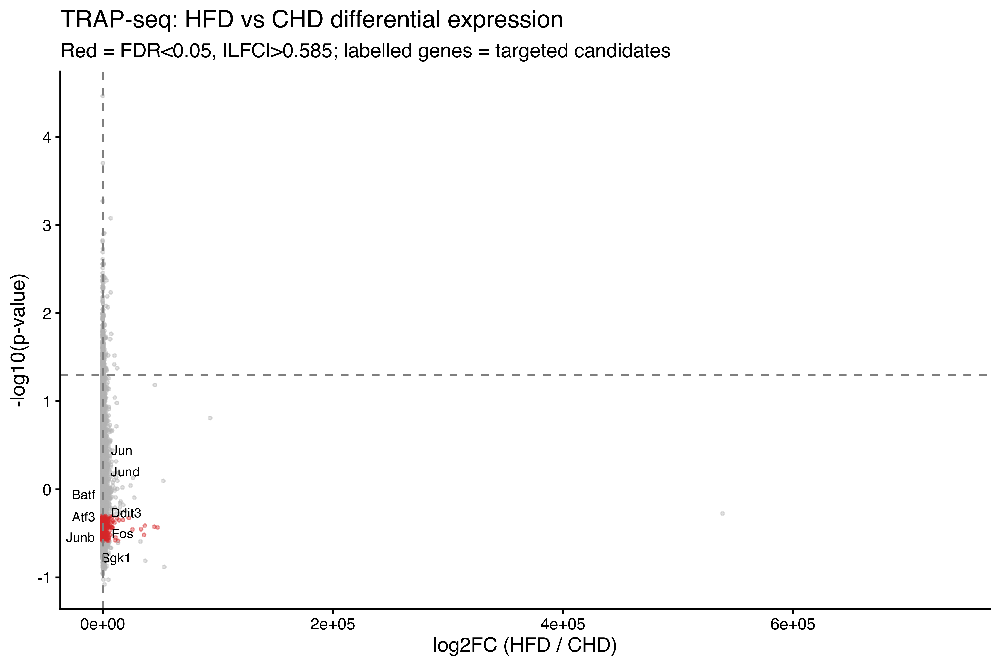
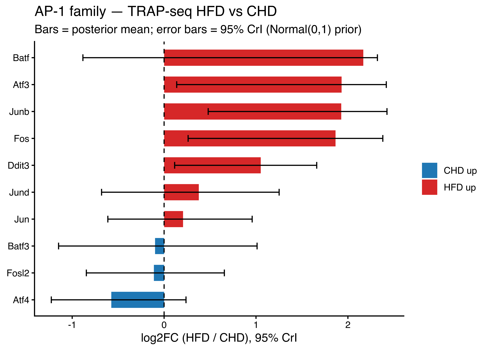

::: {.cell}

:::


## Dataset overview

### RNA-seq data source

The matched RNA-seq data are from **GSE236578 [TRAP]**, a sub-series of the
super-series GSE236580 ("Adipose tissue retains an epigenetic memory of obesity
after weight loss"; PMID 39558077).  The same AdipER-Cre/NuTRAP mice and eWAT
adipocyte preparations were used for both ATAC-seq (GSE236575) and TRAP-seq
(GSE236578).  TRAP-seq captures actively translated transcripts specifically
from adipocytes, avoiding contamination from stromal-vascular cells.

| Sample ID | GSM | SRR | Condition |
|-----------|-----|-----|-----------|
| CHD_1 | GSM7558266 | SRR25152278 | Chow diet |
| CHD_2 | GSM7558271 | SRR25152274 | Chow diet |
| CHD_3 | GSM7558276 | SRR25152266 | Chow diet |
| HFD_1 | GSM7558267 | SRR25152277 | High-fat diet |
| HFD_2 | GSM7558272 | SRR25152273 | High-fat diet |
| HFD_3 | GSM7558277 | SRR25152265 | High-fat diet |

Library: paired-end 150 bp, template switching (Maxima H Minus RT), unstranded.
Alignment: STAR → mm10/GENCODE vM25, unique mappers only.
Quantification: featureCounts, gene_name, unstranded (-s 0).

### Pipeline output files

All files are generated by the `RNASEQ_DESEQ2` Nextflow process.


::: {.cell}

```{.r .cell-code}
deseq_file    <- "results/rnaseq/deseq2/rnaseq_deseq2_results.txt"
targeted_file <- "results/rnaseq/deseq2/rnaseq_targeted_genes.tsv"
norm_file     <- "results/rnaseq/deseq2/rnaseq_normalized_counts.txt"
atac_deseq    <- "results/deseq2/deseq2_results.txt"
```
:::


---

## 1. DESeq2 differential expression — global summary


::: {.cell}

```{.r .cell-code}
library(readr)
library(dplyr)

deseq <- read_tsv(deseq_file, show_col_types=FALSE) |>
  rename(gene = 1)   # col 1 is the row-names field written by write.table

cat("Total genes tested:", nrow(deseq), "\n")
```

::: {.cell-output .cell-output-stdout}

```
Total genes tested: 22901 
```


:::

```{.r .cell-code}
cat("HFD-up   (padj<0.05, LFC>0.585):",
    sum(!is.na(deseq$padj) & deseq$padj < 0.05 & deseq$log2FoldChange > 0.585), "\n")
```

::: {.cell-output .cell-output-stdout}

```
HFD-up   (padj<0.05, LFC>0.585): 4466 
```


:::

```{.r .cell-code}
cat("HFD-down (padj<0.05, LFC< -0.585):",
    sum(!is.na(deseq$padj) & deseq$padj < 0.05 & deseq$log2FoldChange < -0.585), "\n")
```

::: {.cell-output .cell-output-stdout}

```
HFD-down (padj<0.05, LFC< -0.585): 0 
```


:::
:::


::: {.cell}

```{.r .cell-code}
library(ggrepel)
library(ggplot2)

tg_genes <- c("Fos","Jun","Junb","Jund","Fosl1","Fosl2","Batf","Batf3","Atf3","Atf4","Ddit3",
              "Vdr","Ncoa1","Ncoa2","Ncoa3","Med1",
              "Hsd11b1","Nr3c1","Fkbp5","Sgk1","Tsc22d3")

deseq_plot <- deseq |>
  mutate(
    sig = !is.na(padj) & padj < 0.05 & abs(log2FoldChange) > 0.585,
    label = ifelse(gene %in% tg_genes, gene, NA_character_)
  )

ggplot(deseq_plot, aes(log2FoldChange, -log10(pvalue))) +
  geom_point(aes(color=sig), alpha=0.4, size=0.7) +
  scale_color_manual(values=c("FALSE"="grey70","TRUE"="#d62728"), guide="none") +
  geom_text_repel(aes(label=label), size=3, max.overlaps=40,
                  segment.color="grey60") +
  geom_hline(yintercept=-log10(0.05), lty=2, color="grey50") +
  geom_vline(xintercept=c(-0.585, 0.585), lty=2, color="grey50") +
  labs(x="log2FC (HFD / CHD)", y="-log10(p-value)",
       title="TRAP-seq: HFD vs CHD differential expression",
       subtitle="Red = FDR<0.05, |LFC|>0.585; labelled genes = targeted candidates") +
  theme_classic(base_size=13)
```

::: {.cell-output-display}
{width=2700}
:::
:::


---

## 2. Targeted gene analysis

### Load and display results


::: {.cell}

```{.r .cell-code}
tg <- read_tsv(targeted_file, show_col_types=FALSE)

# Format for display
tg_display <- tg |>
  mutate(
    across(c(log2FoldChange, lfcSE, bayes_CrI_lo, bayes_CrI_hi), ~round(., 3)),
    across(c(pvalue, padj), ~signif(., 3)),
    across(c(bayes_P_HFD_gt_CHD, bayes_ER), ~round(., 3)),
    across(c(mean_norm_CHD, mean_norm_HFD), ~round(., 1))
  ) |>
  dplyr::select(category, gene, log2FoldChange, lfcSE, padj, pvalue,
         mean_norm_CHD, mean_norm_HFD, detected,
         bayes_P_HFD_gt_CHD, bayes_ER, bayes_CrI_lo, bayes_CrI_hi)

knitr::kable(tg_display,
  caption="Targeted gene-level TRAP-seq results (HFD vs CHD). Bayes stats use Normal(0,1) prior on log2FC (analytical conjugate update).",
  digits=c(0,0,3,3,3,3,1,1,0,3,2,3,3))
```

::: {.cell-output-display}


Table: Targeted gene-level TRAP-seq results (HFD vs CHD). Bayes stats use Normal(0,1) prior on log2FC (analytical conjugate update).

|category       |gene    | log2FoldChange| lfcSE|  padj| pvalue| mean_norm_CHD| mean_norm_HFD|detected | bayes_P_HFD_gt_CHD| bayes_ER| bayes_CrI_lo| bayes_CrI_hi|
|:--------------|:-------|--------------:|-----:|-----:|------:|-------------:|-------------:|:--------|------------------:|--------:|------------:|------------:|
|AP-1           |Atf3    |          1.931| 0.715| 0.053|  0.007|          67.2|         256.4|TRUE     |              0.986|    70.13|        0.137|        2.418|
|AP-1           |Atf4    |         -0.575| 0.403| 0.386|  0.154|        3406.8|        2287.6|TRUE     |              0.093|     0.10|       -1.227|        0.238|
|AP-1           |Batf    |          2.167| 1.420| 0.346|  0.127|           4.5|          20.1|TRUE     |              0.810|     4.27|       -0.883|        2.321|
|AP-1           |Batf3   |         -0.098| 0.660| 0.953|  0.882|         129.7|         121.1|TRUE     |              0.451|     0.82|       -1.148|        1.012|
|AP-1           |Ddit3   |          1.051| 0.429| 0.087|  0.014|         407.1|         843.8|TRUE     |              0.988|    81.05|        0.115|        1.661|
|AP-1           |Fos     |          1.866| 0.642| 0.034|  0.004|          80.8|         294.0|TRUE     |              0.993|   136.55|        0.261|        2.380|
|AP-1           |Fosl1   |             NA|    NA|    NA|     NA|            NA|            NA|FALSE    |                 NA|       NA|           NA|           NA|
|AP-1           |Fosl2   |         -0.112| 0.415| 0.910|  0.788|         945.9|         875.2|TRUE     |              0.402|     0.67|       -0.846|        0.656|
|AP-1           |Jun     |          0.206| 0.437| 0.827|  0.637|         637.0|         735.1|TRUE     |              0.667|     2.00|       -0.612|        0.958|
|AP-1           |Junb    |          1.927| 0.572| 0.012|  0.001|          36.3|         137.4|TRUE     |              0.998|   582.90|        0.480|        2.425|
|AP-1           |Jund    |          0.377| 0.567| 0.740|  0.505|         445.2|         578.8|TRUE     |              0.719|     2.56|       -0.680|        1.252|
|artifact_check |Dmrt1   |             NA|    NA|    NA|     NA|            NA|            NA|FALSE    |                 NA|       NA|           NA|           NA|
|artifact_check |Dmrt2   |         -1.699| 0.774| 0.135|  0.028|        1620.4|         499.5|TRUE     |              0.041|     0.04|       -2.262|        0.137|
|artifact_check |Dmrt3   |             NA|    NA|    NA|     NA|            NA|            NA|FALSE    |                 NA|       NA|           NA|           NA|
|artifact_check |Dmrt4   |             NA|    NA|    NA|     NA|            NA|            NA|FALSE    |                 NA|       NA|           NA|           NA|
|demoted        |Cebpa   |          0.348| 0.759| 0.833|  0.647|        2655.5|        3380.1|TRUE     |              0.643|     1.80|       -0.964|        1.406|
|demoted        |Cebpb   |         -0.503| 0.641| 0.684|  0.433|        1218.0|         860.0|TRUE     |              0.254|     0.34|       -1.414|        0.701|
|demoted        |Cebpd   |          0.909| 0.520| 0.263|  0.080|         167.3|         314.5|TRUE     |              0.940|    15.54|       -0.189|        1.620|
|demoted        |Foxa1   |         -2.635| 2.282|    NA|  0.248|           3.7|           0.6|FALSE    |              0.321|     0.47|       -2.220|        1.371|
|demoted        |Foxa2   |             NA|    NA|    NA|     NA|            NA|            NA|FALSE    |                 NA|       NA|           NA|           NA|
|demoted        |Foxo1   |         -0.060| 0.454| 0.959|  0.895|        1983.4|        1902.8|TRUE     |              0.452|     0.82|       -0.861|        0.761|
|demoted        |Foxo3   |          0.116| 0.313| 0.870|  0.711|         566.1|         613.4|TRUE     |              0.638|     1.76|       -0.480|        0.691|
|demoted        |Klf13   |          0.530| 0.347| 0.345|  0.127|        1193.4|        1723.5|TRUE     |              0.925|    12.42|       -0.169|        1.115|
|demoted        |Prrx1   |          0.991| 0.363| 0.050|  0.006|         499.2|         991.8|TRUE     |              0.995|   195.39|        0.208|        1.544|
|GR_target      |Angptl4 |          1.949| 0.482| 0.002|  0.000|        1978.5|        7638.5|TRUE     |              1.000|  7329.34|        0.730|        2.433|
|GR_target      |Fkbp5   |         -1.292| 0.376| 0.010|  0.001|        1414.6|         578.1|TRUE     |              0.001|     0.00|       -1.822|       -0.443|
|GR_target      |Hsd11b1 |         -0.933| 0.403| 0.110|  0.021|        1719.2|         900.1|TRUE     |              0.016|     0.02|       -1.535|       -0.070|
|GR_target      |Hsd11b2 |          0.914| 1.025| 0.634|  0.372|           7.2|          13.5|TRUE     |              0.733|     2.75|       -0.957|        1.849|
|GR_target      |Lep     |          2.009| 0.612| 0.014|  0.001|       14331.1|       57685.3|TRUE     |              0.997|   388.36|        0.438|        2.485|
|GR_target      |Nr3c1   |         -0.303| 0.449| 0.736|  0.499|        4396.3|        3563.4|TRUE     |              0.269|     0.37|       -1.055|        0.550|
|GR_target      |Pnpla2  |          0.319| 0.727| 0.842|  0.661|        3987.8|        4973.5|TRUE     |              0.639|     1.77|       -0.944|        1.361|
|GR_target      |Sgk1    |          1.770| 0.425| 0.001|  0.000|         323.4|        1103.2|TRUE     |              1.000| 16083.07|        0.734|        2.266|
|GR_target      |Tsc22d3 |         -0.034| 0.523| 0.981|  0.947|        5323.0|        5197.6|TRUE     |              0.477|     0.91|       -0.935|        0.881|
|VDR_pathway    |Med1    |         -0.426| 0.323| 0.433|  0.186|         636.9|         474.0|TRUE     |              0.104|     0.12|       -0.988|        0.216|
|VDR_pathway    |Ncoa1   |         -0.572| 0.411| 0.401|  0.164|         856.1|         575.9|TRUE     |              0.099|     0.11|       -1.235|        0.256|
|VDR_pathway    |Ncoa2   |         -0.471| 0.388| 0.483|  0.225|         688.8|         496.8|TRUE     |              0.129|     0.15|       -1.119|        0.300|
|VDR_pathway    |Ncoa3   |         -0.075| 0.389| 0.939|  0.848|         644.2|         611.4|TRUE     |              0.429|     0.75|       -0.775|        0.646|
|VDR_pathway    |Vdr     |         -0.115| 0.833| 0.956|  0.890|          15.2|          14.0|TRUE     |              0.458|     0.84|       -1.322|        1.186|


:::
:::


### AP-1 candidates — key comparison


::: {.cell}

```{.r .cell-code}
ap1 <- tg |> filter(category == "AP-1") |>
  arrange(desc(log2FoldChange))

knitr::kable(ap1 |> dplyr::select(gene, log2FoldChange, padj, pvalue,
                            mean_norm_CHD, mean_norm_HFD,
                            bayes_P_HFD_gt_CHD, bayes_ER),
  caption="AP-1 family members — ranked by HFD log2FC",
  digits=c(0,3,3,3,1,1,3,2))
```

::: {.cell-output-display}


Table: AP-1 family members — ranked by HFD log2FC

|gene  | log2FoldChange|  padj| pvalue| mean_norm_CHD| mean_norm_HFD| bayes_P_HFD_gt_CHD| bayes_ER|
|:-----|--------------:|-----:|------:|-------------:|-------------:|------------------:|--------:|
|Batf  |          2.167| 0.346|  0.127|           4.5|          20.1|              0.810|     4.27|
|Atf3  |          1.931| 0.053|  0.007|          67.2|         256.4|              0.986|    70.13|
|Junb  |          1.927| 0.012|  0.001|          36.3|         137.4|              0.998|   582.90|
|Fos   |          1.866| 0.034|  0.004|          80.8|         294.0|              0.993|   136.55|
|Ddit3 |          1.051| 0.087|  0.014|         407.1|         843.8|              0.988|    81.05|
|Jund  |          0.377| 0.740|  0.505|         445.2|         578.8|              0.719|     2.56|
|Jun   |          0.206| 0.827|  0.637|         637.0|         735.1|              0.667|     2.00|
|Batf3 |         -0.098| 0.953|  0.882|         129.7|         121.1|              0.451|     0.82|
|Fosl2 |         -0.112| 0.910|  0.788|         945.9|         875.2|              0.402|     0.67|
|Atf4  |         -0.575| 0.386|  0.154|        3406.8|        2287.6|              0.093|     0.10|
|Fosl1 |             NA|    NA|     NA|            NA|            NA|                 NA|       NA|


:::
:::


### AP-1 forest plot


::: {.cell}

```{.r .cell-code}
ap1_ok <- ap1 |> filter(!is.na(log2FoldChange))

ggplot(ap1_ok, aes(x=reorder(gene, log2FoldChange), y=log2FoldChange)) +
  geom_col(aes(fill=log2FoldChange > 0), width=0.6) +
  geom_errorbar(aes(ymin=bayes_CrI_lo, ymax=bayes_CrI_hi), width=0.25) +
  geom_hline(yintercept=0, lty=2) +
  coord_flip() +
  scale_fill_manual(values=c("TRUE"="#d62728","FALSE"="#1f77b4"),
                    labels=c("TRUE"="HFD up","FALSE"="CHD up"), name=NULL) +
  labs(x=NULL, y="log2FC (HFD / CHD), 95% CrI",
       title="AP-1 family — TRAP-seq HFD vs CHD",
       subtitle="Bars = posterior mean; error bars = 95% CrI (Normal(0,1) prior)") +
  theme_classic(base_size=12)
```

::: {.cell-output-display}
{width=2100}
:::
:::


### VDR pathway and GR coactivators


::: {.cell}

```{.r .cell-code}
vdr <- tg |> filter(category == "VDR_pathway") |> arrange(gene)

knitr::kable(vdr |> dplyr::select(gene, log2FoldChange, padj,
                            mean_norm_CHD, mean_norm_HFD,
                            bayes_P_HFD_gt_CHD, bayes_ER),
  caption="VDR pathway and coactivators",
  digits=c(0,3,3,1,1,3,2))
```

::: {.cell-output-display}


Table: VDR pathway and coactivators

|gene  | log2FoldChange|  padj| mean_norm_CHD| mean_norm_HFD| bayes_P_HFD_gt_CHD| bayes_ER|
|:-----|--------------:|-----:|-------------:|-------------:|------------------:|--------:|
|Med1  |         -0.426| 0.433|         636.9|         474.0|              0.104|     0.12|
|Ncoa1 |         -0.572| 0.401|         856.1|         575.9|              0.099|     0.11|
|Ncoa2 |         -0.471| 0.483|         688.8|         496.8|              0.129|     0.15|
|Ncoa3 |         -0.075| 0.939|         644.2|         611.4|              0.429|     0.75|
|Vdr   |         -0.115| 0.956|          15.2|          14.0|              0.458|     0.84|


:::
:::


### Demoted candidates (verification)


::: {.cell}

```{.r .cell-code}
dem <- tg |> filter(category == "demoted") |> arrange(gene)

knitr::kable(dem |> dplyr::select(gene, log2FoldChange, padj,
                            mean_norm_CHD, mean_norm_HFD,
                            bayes_P_HFD_gt_CHD, bayes_ER),
  caption="Demoted candidates — expected to show no significant HFD upregulation",
  digits=c(0,3,3,1,1,3,2))
```

::: {.cell-output-display}


Table: Demoted candidates — expected to show no significant HFD upregulation

|gene  | log2FoldChange|  padj| mean_norm_CHD| mean_norm_HFD| bayes_P_HFD_gt_CHD| bayes_ER|
|:-----|--------------:|-----:|-------------:|-------------:|------------------:|--------:|
|Cebpa |          0.348| 0.833|        2655.5|        3380.1|              0.643|     1.80|
|Cebpb |         -0.503| 0.684|        1218.0|         860.0|              0.254|     0.34|
|Cebpd |          0.909| 0.263|         167.3|         314.5|              0.940|    15.54|
|Foxa1 |         -2.635|    NA|           3.7|           0.6|              0.321|     0.47|
|Foxa2 |             NA|    NA|            NA|            NA|                 NA|       NA|
|Foxo1 |         -0.060| 0.959|        1983.4|        1902.8|              0.452|     0.82|
|Foxo3 |          0.116| 0.870|         566.1|         613.4|              0.638|     1.76|
|Klf13 |          0.530| 0.345|        1193.4|        1723.5|              0.925|    12.42|
|Prrx1 |          0.991| 0.050|         499.2|         991.8|              0.995|   195.39|


:::
:::


### Artifact check (DMRT family)


::: {.cell}

```{.r .cell-code}
dmrt <- tg |> filter(category == "artifact_check")

knitr::kable(dmrt |> dplyr::select(gene, log2FoldChange, padj,
                             mean_norm_CHD, mean_norm_HFD, detected),
  caption="DMRT family — expected to be undetected if motif enrichment was an AT-rich artifact",
  digits=c(0,3,3,1,1,0))
```

::: {.cell-output-display}


Table: DMRT family — expected to be undetected if motif enrichment was an AT-rich artifact

|gene  | log2FoldChange|  padj| mean_norm_CHD| mean_norm_HFD|detected |
|:-----|--------------:|-----:|-------------:|-------------:|:--------|
|Dmrt1 |             NA|    NA|            NA|            NA|FALSE    |
|Dmrt2 |         -1.699| 0.135|        1620.4|         499.5|TRUE     |
|Dmrt3 |             NA|    NA|            NA|            NA|FALSE    |
|Dmrt4 |             NA|    NA|            NA|            NA|FALSE    |


:::
:::


### Functional GR targets


::: {.cell}

```{.r .cell-code}
gr_tg <- tg |> filter(category == "GR_target") |> arrange(desc(log2FoldChange))

knitr::kable(gr_tg |> dplyr::select(gene, log2FoldChange, padj,
                              mean_norm_CHD, mean_norm_HFD,
                              bayes_P_HFD_gt_CHD, bayes_ER),
  caption="Functional GR targets — expected HFD upregulation if GR signalling is sensitized",
  digits=c(0,3,3,1,1,3,2))
```

::: {.cell-output-display}


Table: Functional GR targets — expected HFD upregulation if GR signalling is sensitized

|gene    | log2FoldChange|  padj| mean_norm_CHD| mean_norm_HFD| bayes_P_HFD_gt_CHD| bayes_ER|
|:-------|--------------:|-----:|-------------:|-------------:|------------------:|--------:|
|Lep     |          2.009| 0.014|       14331.1|       57685.3|              0.997|   388.36|
|Angptl4 |          1.949| 0.002|        1978.5|        7638.5|              1.000|  7329.34|
|Sgk1    |          1.770| 0.001|         323.4|        1103.2|              1.000| 16083.07|
|Hsd11b2 |          0.914| 0.634|           7.2|          13.5|              0.733|     2.75|
|Pnpla2  |          0.319| 0.842|        3987.8|        4973.5|              0.639|     1.77|
|Tsc22d3 |         -0.034| 0.981|        5323.0|        5197.6|              0.477|     0.91|
|Nr3c1   |         -0.303| 0.736|        4396.3|        3563.4|              0.269|     0.37|
|Hsd11b1 |         -0.933| 0.110|        1719.2|         900.1|              0.016|     0.02|
|Fkbp5   |         -1.292| 0.010|        1414.6|         578.1|              0.001|     0.00|


:::
:::


---

## 3. ATAC × RNA-seq integration

### Annotate ATAC peaks to nearest gene


::: {.cell}

```{.r .cell-code}
library(GenomicRanges)
library(ChIPseeker)
library(TxDb.Mmusculus.UCSC.mm10.knownGene)
library(org.Mm.eg.db)

atac <- read_tsv(atac_deseq, show_col_types=FALSE) |>
  mutate(.row = row_number())
txdb <- TxDb.Mmusculus.UCSC.mm10.knownGene

# Build GRanges; carry .row so we can left_join after annotation.
# annotatePeak drops peaks on non-standard contigs (chrUn_*, random) so
# positional bind_cols would fail — left_join on .row preserves all peaks
# and gives NA annotations for any that were silently dropped.
atac_gr <- GRanges(
  seqnames = atac$chr,
  ranges   = IRanges(atac$start + 1, atac$end),
  .row     = atac$.row
)

atac_ann <- annotatePeak(atac_gr, TxDb=txdb, tssRegion=c(-5000, 500),
                         annoDb="org.Mm.eg.db", verbose=FALSE)
```

::: {.cell-output .cell-output-stdout}

```
>> Using Genome: mm10 ...
>> Using Genome: mm10 ...
>> Using Genome: mm10 ...
```


:::

```{.r .cell-code}
atac_ann_df <- as.data.frame(atac_ann)

atac_full <- atac |>
  left_join(atac_ann_df |> dplyr::select(.row, SYMBOL, distanceToTSS, annotation),
            by = ".row") |>
  dplyr::select(-.row)
```
:::


### Classify ATAC peaks and merge with RNA-seq


::: {.cell}

```{.r .cell-code}
# Classify each ATAC peak by DESeq2 direction
atac_full <- atac_full |>
  mutate(
    atac_dir = case_when(
      !is.na(padj) & padj < 0.05 & log2FoldChange >  1 ~ "HFD_up",
      !is.na(padj) & padj < 0.05 & log2FoldChange < -1 ~ "CHD_up",
      TRUE                                              ~ "shared"
    )
  )

# Join nearest-gene RNA-seq results
deseq_slim <- deseq |>
  dplyr::select(gene, rna_lfc = log2FoldChange, rna_padj = padj) |>
  filter(!is.na(gene))

atac_rna <- atac_full |>
  left_join(deseq_slim, by=c("SYMBOL"="gene"))
```
:::


### Enrichment: are HFD-up ATAC peaks enriched near HFD-upregulated genes?


::: {.cell}

```{.r .cell-code}
# HFD-upregulated gene set.  With n=3, padj<0.05 may return 0 genes;
# fall back progressively so the table is always testable.
hfd_genes_strict  <- deseq |> filter(!is.na(padj) & padj < 0.05 & log2FoldChange > 0) |> pull(gene)
hfd_genes_relaxed <- deseq |> filter(!is.na(padj) & padj < 0.10 & log2FoldChange > 0) |> pull(gene)
hfd_genes_nominal <- deseq |> filter(!is.na(pvalue) & pvalue < 0.05 & log2FoldChange > 0) |> pull(gene)

if (length(hfd_genes_strict) >= 50) {
  hfd_genes  <- hfd_genes_strict;  hfd_label <- "FDR<0.05"
} else if (length(hfd_genes_relaxed) >= 50) {
  hfd_genes  <- hfd_genes_relaxed; hfd_label <- "FDR<0.10"
} else {
  hfd_genes  <- hfd_genes_nominal; hfd_label <- "nominal p<0.05"
}

cat(sprintf("Gene set threshold used: %s  (%d genes)\n", hfd_label, length(hfd_genes)))
```

::: {.cell-output .cell-output-stdout}

```
Gene set threshold used: FDR<0.05  (4466 genes)
```


:::

```{.r .cell-code}
peak_near_hfd_gene <- atac_rna |>
  mutate(near_hfd_gene = !is.na(SYMBOL) & SYMBOL %in% hfd_genes)

# Diagnostics
cat(sprintf("Peaks with SYMBOL annotated: %d / %d\n",
            sum(!is.na(peak_near_hfd_gene$SYMBOL)), nrow(peak_near_hfd_gene)))
```

::: {.cell-output .cell-output-stdout}

```
Peaks with SYMBOL annotated: 61573 / 61619
```


:::

```{.r .cell-code}
cat(sprintf("Peaks near an HFD-up gene  : %d\n", sum(peak_near_hfd_gene$near_hfd_gene)))
```

::: {.cell-output .cell-output-stdout}

```
Peaks near an HFD-up gene  : 11529
```


:::

```{.r .cell-code}
cat(sprintf("ATAC HFD_up peaks          : %d\n", sum(peak_near_hfd_gene$atac_dir == "HFD_up")))
```

::: {.cell-output .cell-output-stdout}

```
ATAC HFD_up peaks          : 6900
```


:::

```{.r .cell-code}
# 2×2 contingency: atac_dir (HFD_up vs rest) × near_hfd_gene (T/F)
tab <- with(peak_near_hfd_gene,
  table(
    atac   = ifelse(atac_dir == "HFD_up", "HFD_up", "other"),
    rna_up = near_hfd_gene
  )
)
cat("\nContingency table (ATAC direction × nearest gene HFD-up):\n")
```

::: {.cell-output .cell-output-stdout}

```

Contingency table (ATAC direction × nearest gene HFD-up):
```


:::

```{.r .cell-code}
print(tab)
```

::: {.cell-output .cell-output-stdout}

```
        rna_up
atac     FALSE  TRUE
  HFD_up  5697  1203
  other  44393 10326
```


:::

```{.r .cell-code}
if (all(dim(tab) >= 2)) {
  ft <- fisher.test(tab, alternative="greater")
  cat(sprintf("\nFisher OR=%.2f, p=%.2e\n", ft$estimate, ft$p.value))
  cat(sprintf("95%% CI: [%.2f, %.2f]\n", ft$conf.int[1], ft$conf.int[2]))
} else {
  cat("\nFisher test skipped: table is degenerate — see diagnostics above.\n")
}
```

::: {.cell-output .cell-output-stdout}

```

Fisher OR=1.10, p=1.95e-03
95% CI: [1.04, Inf]
```


:::
:::


### Motif stratification: which motif class best predicts paired gene upregulation?


::: {.cell}

```{.r .cell-code}
# Load composite motif counts from ATAC pipeline
motif_file <- "results/motif_analysis/composite_scan/HFD_specific/HFD_specific_per_peak_motifs.tsv"

if (file.exists(motif_file)) {
  motif_map <- c("MA0148.5"="FOXA1","MA0047.5"="FOXA2","MA0466.4"="CEBPB",
                 "MA0102.5"="CEBPA","MA0480.3"="FOXO1","MA0113.4"="NR3C1",
                 "MA2327.1"="PGR_h","MA2323.1"="PGR_m")

  hfd_motifs <- read_tsv(motif_file, show_col_types=FALSE)
  names(hfd_motifs) <- ifelse(names(hfd_motifs) %in% names(motif_map),
                              motif_map[names(hfd_motifs)], names(hfd_motifs))

  # Need to also load AP-1 and VDR motifs from the full-motif scan
  full_scan_file <- "results/motif_analysis/full_motif_scan/HFD_specific/HFD_specific_per_peak_all_motifs.tsv"

  if (file.exists(full_scan_file)) {
    full_motifs <- read_tsv(full_scan_file, show_col_types=FALSE)

    # AP-1 motifs in JASPAR 2024 (representative IDs; from FULL_MOTIF_SCAN output)
    ap1_ids  <- grep("^MA0(099|478|099|477|153|162|039|063|099)",
                     names(full_motifs), value=TRUE)
    # VDR motif
    vdr_ids  <- grep("MA0693", names(full_motifs), value=TRUE)

    hfd_motifs$has_ap1 <- if (length(ap1_ids)) rowSums(full_motifs[, ap1_ids, drop=FALSE]) > 0 else FALSE
    hfd_motifs$has_vdr <- if (length(vdr_ids)) rowSums(full_motifs[, vdr_ids, drop=FALSE]) > 0 else FALSE
  } else {
    hfd_motifs$has_ap1 <- FALSE
    hfd_motifs$has_vdr <- FALSE
    message("Full motif scan not found — AP-1/VDR stratification skipped")
  }

  # GR motif
  gr_cols <- intersect(c("NR3C1","PGR_h","PGR_m"), names(hfd_motifs))
  hfd_motifs$has_gr <- if (length(gr_cols)) rowSums(hfd_motifs[, gr_cols, drop=FALSE]) > 0 else FALSE

  # Motif class assignment
  hfd_motifs <- hfd_motifs |>
    mutate(
      motif_class = case_when(
        has_ap1 & has_gr & !has_vdr ~ "AP1_GR",
        has_vdr & has_gr & !has_ap1 ~ "VDR_GR",
        has_ap1 & has_vdr & has_gr  ~ "AP1_VDR_GR",
        has_gr  & !has_ap1 & !has_vdr ~ "GR_only",
        has_ap1 & !has_gr  ~ "AP1_only",
        has_vdr & !has_gr  ~ "VDR_only",
        TRUE                ~ "none"
      )
    )

  # Parse peak coordinates from FASTA-style peak IDs
  peak_coords <- hfd_motifs |>
    mutate(
      chr   = sub(":.*", "", peak),
      start = as.integer(sub(".*:(\\d+)-.*", "\\1", peak)),
      end   = as.integer(sub(".*-", "", peak))
    )

  # Join to ATAC+RNA table via chr/start/end overlap (nearest match by start)
  hfd_peaks_rna <- atac_rna |>
    filter(atac_dir == "HFD_up") |>
    left_join(peak_coords |> dplyr::select(chr, start, end, motif_class),
              by=c("chr","start","end"))

  # Per motif class: fraction with HFD-up nearest gene
  strat <- hfd_peaks_rna |>
    filter(!is.na(motif_class)) |>
    group_by(motif_class) |>
    summarise(
      n_peaks      = n(),
      n_near_hfd   = sum(SYMBOL %in% hfd_genes, na.rm=TRUE),
      pct_near_hfd = round(100 * n_near_hfd / n_peaks, 1),
      .groups="drop"
    ) |>
    arrange(desc(pct_near_hfd))

  knitr::kable(strat,
    caption="HFD-up ATAC peaks: fraction near HFD-upregulated genes, by motif class")

  # Fisher test: each motif class vs GR_only
  gr_only  <- hfd_peaks_rna |> filter(motif_class == "GR_only")
  gr_n_up  <- sum(gr_only$SYMBOL %in% hfd_genes, na.rm=TRUE)
  gr_n_tot <- nrow(gr_only)

  fisher_vs_gr <- function(class_label) {
    cl <- hfd_peaks_rna |> filter(motif_class == class_label)
    if (nrow(cl) < 5) return(NULL)
    tab <- matrix(c(sum(cl$SYMBOL %in% hfd_genes, na.rm=TRUE), nrow(cl),
                    gr_n_up, gr_n_tot), nrow=2)
    ft  <- fisher.test(tab)
    tibble(motif_class=class_label, n=nrow(cl),
           pct=round(100*tab[1,1]/nrow(cl),1),
           OR=round(ft$estimate,2), p=signif(ft$p.value,3))
  }

  classes <- setdiff(unique(hfd_peaks_rna$motif_class), c("GR_only",NA))
  fisher_res <- bind_rows(lapply(classes, fisher_vs_gr))
  knitr::kable(fisher_res,
    caption="Motif class vs GR-only: enrichment near HFD-up genes (Fisher exact)")
} else {
  cat("Composite motif scan output not found — run ATAC pipeline first.\n")
}
```

::: {.cell-output-display}


Table: Motif class vs GR-only: enrichment near HFD-up genes (Fisher exact)

|motif_class |  n| pct| OR|  p|
|:-----------|--:|---:|--:|--:|
|AP1_only    |  5|   0|  0|  1|


:::
:::


---

## 4. Locus tracks

BigWig files generated by `RNASEQ_BIGWIG` (CPM-normalised, 50bp bins) and
`ATAC_BIGWIG` (RPGC-normalised, 10bp bins) are at:

- RNA-seq: `results/rnaseq/bigwig/<sample_id>.CPM.bw`
- ATAC:    `results/bigwig/atac/<sample_id>.RPGC.bw`

Track ranges below are for mm10.  Visualisation uses pyGenomeTracks or IGV.


::: {.cell}

```{.r .cell-code}
loci <- tribble(
  ~gene,    ~chr,   ~start,     ~end,
  "Hsd11b1","chr1",  4819895,    4920000,
  "Fkbp5",  "chr4",  99948700,  100065000,
  "Vdr",    "chr15", 97844000,   97908000,
  "Junb",   "chr8",  84786000,   84800000,
  "Fosl2",  "chr5",  32356000,   32400000
)
knitr::kable(loci, caption="Locus coordinates for track visualisation (mm10)")
```

::: {.cell-output-display}


Table: Locus coordinates for track visualisation (mm10)

|gene    |chr   |    start|       end|
|:-------|:-----|--------:|---------:|
|Hsd11b1 |chr1  |  4819895|   4920000|
|Fkbp5   |chr4  | 99948700| 100065000|
|Vdr     |chr15 | 97844000|  97908000|
|Junb    |chr8  | 84786000|  84800000|
|Fosl2   |chr5  | 32356000|  32400000|


:::
:::


The following code renders condition-averaged normalised coverage using
`wiggletools` mean across replicates, then `bigWigToBedGraph` + summary
stats. For IGV batch rendering, load bigWigs directly from the paths above.


::: {.cell}

```{.r .cell-code}
# Shell commands to merge per-condition BigWigs (requires wiggletools + UCSC tools)
# Run from the GSE236575 directory.

conds <- c("CHD", "HFD")
types <- c(
  list(tag="atac", dir="results/bigwig/atac",    suffix=".RPGC.bw"),
  list(tag="rna",  dir="results/rnaseq/bigwig",  suffix=".CPM.bw")
)

for (cond in conds) {
  for (t in types) {
    bws <- paste(
      file.path(t$dir, paste0(cond, "_", 1:3, t$suffix)),
      collapse=" "
    )
    cmd <- sprintf(
      "wiggletools mean %s | wigToBigWig -fixedStep stdin results/genome/mm10.chrom.sizes %s/%s_%s_mean.bw",
      bws, t$dir, cond, t$tag
    )
    cat(cmd, "\n")
  }
}
```
:::


---

## 5. Decision outputs

### 5.1 AP-1 lead candidate (Junb vs Fosl2)


::: {.cell}

```{.r .cell-code}
ap1_key <- tg |>
  filter(gene %in% c("Junb","Fosl2")) |>
  dplyr::select(gene, log2FoldChange, padj, mean_norm_CHD, mean_norm_HFD,
         bayes_P_HFD_gt_CHD, bayes_ER, bayes_CrI_lo, bayes_CrI_hi)

knitr::kable(ap1_key, digits=c(0,3,3,1,1,3,2,3,3),
  caption="Junb vs Fosl2 — head-to-head comparison for AP-1 lead candidate selection")
```

::: {.cell-output-display}


Table: Junb vs Fosl2 — head-to-head comparison for AP-1 lead candidate selection

|gene  | log2FoldChange|  padj| mean_norm_CHD| mean_norm_HFD| bayes_P_HFD_gt_CHD| bayes_ER| bayes_CrI_lo| bayes_CrI_hi|
|:-----|--------------:|-----:|-------------:|-------------:|------------------:|--------:|------------:|------------:|
|Fosl2 |         -0.112| 0.910|         945.9|         875.2|              0.402|     0.67|       -0.846|        0.656|
|Junb  |          1.927| 0.012|          36.3|         137.4|              0.998|   582.90|        0.480|        2.425|


:::

```{.r .cell-code}
cat("\n--- AP-1 lead candidate verdict ---\n")
```

::: {.cell-output .cell-output-stdout}

```

--- AP-1 lead candidate verdict ---
```


:::

```{.r .cell-code}
junb  <- ap1_key |> filter(gene=="Junb")
fosl2 <- ap1_key |> filter(gene=="Fosl2")

if (nrow(junb) && nrow(fosl2) && !is.na(junb$log2FoldChange) && !is.na(fosl2$log2FoldChange)) {
  lead <- if (junb$log2FoldChange > fosl2$log2FoldChange) "Junb" else "Fosl2"
  cat(sprintf("Lead AP-1 candidate by HFD log2FC: %s (LFC=%.3f vs %.3f)\n",
              lead, junb$log2FoldChange, fosl2$log2FoldChange))
  cat(sprintf("Bayesian P(HFD>CHD): Junb=%.3f, Fosl2=%.3f\n",
              junb$bayes_P_HFD_gt_CHD, fosl2$bayes_P_HFD_gt_CHD))
} else {
  cat("One or both genes not detected — see targeted gene table.\n")
}
```

::: {.cell-output .cell-output-stdout}

```
Lead AP-1 candidate by HFD log2FC: Junb (LFC=1.927 vs -0.112)
Bayesian P(HFD>CHD): Junb=0.998, Fosl2=0.402
```


:::
:::


### 5.2 DMRT family expression status


::: {.cell}

```{.r .cell-code}
dmrt <- tg |> filter(category == "artifact_check") |>
  dplyr::select(gene, mean_norm_CHD, mean_norm_HFD, detected, log2FoldChange, padj)

knitr::kable(dmrt, caption="DMRT family expression status",
             digits=c(0,1,1,0,3,3))
```

::: {.cell-output-display}


Table: DMRT family expression status

|gene  | mean_norm_CHD| mean_norm_HFD|detected | log2FoldChange|  padj|
|:-----|-------------:|-------------:|:--------|--------------:|-----:|
|Dmrt1 |            NA|            NA|FALSE    |             NA|    NA|
|Dmrt2 |        1620.4|         499.5|TRUE     |         -1.699| 0.135|
|Dmrt3 |            NA|            NA|FALSE    |             NA|    NA|
|Dmrt4 |            NA|            NA|FALSE    |             NA|    NA|


:::

```{.r .cell-code}
cat("\n--- DMRT verdict ---\n")
```

::: {.cell-output .cell-output-stdout}

```

--- DMRT verdict ---
```


:::

```{.r .cell-code}
if (all(!dmrt$detected, na.rm=TRUE)) {
  cat("DMRT1-4 are undetected (mean normalised count < 5 in both conditions).\n")
  cat("Verdict: AT-rich motif enrichment is an artifact; DMRT family are not expressed in eWAT adipocytes.\n")
} else {
  detected_dmrts <- dmrt |> filter(detected) |> pull(gene)
  cat("DETECTED:", paste(detected_dmrts, collapse=", "), "\n")
  cat("Verdict: requires manual review — unexpected DMRT expression in adipocytes.\n")
}
```

::: {.cell-output .cell-output-stdout}

```
DETECTED: Dmrt2 
Verdict: requires manual review — unexpected DMRT expression in adipocytes.
```


:::
:::


### 5.3 Coactivator and HSD11B1 expression status


::: {.cell}

```{.r .cell-code}
coact <- tg |> filter(gene %in% c("Ncoa1","Ncoa2","Ncoa3","Med1","Hsd11b1","Hsd11b2")) |>
  dplyr::select(gene, log2FoldChange, padj, mean_norm_CHD, mean_norm_HFD,
         bayes_P_HFD_gt_CHD, bayes_ER)

knitr::kable(coact, digits=c(0,3,3,1,1,3,2),
  caption="Coactivators and HSD11B1 — expression and HFD regulation")
```

::: {.cell-output-display}


Table: Coactivators and HSD11B1 — expression and HFD regulation

|gene    | log2FoldChange|  padj| mean_norm_CHD| mean_norm_HFD| bayes_P_HFD_gt_CHD| bayes_ER|
|:-------|--------------:|-----:|-------------:|-------------:|------------------:|--------:|
|Hsd11b1 |         -0.933| 0.110|        1719.2|         900.1|              0.016|     0.02|
|Hsd11b2 |          0.914| 0.634|           7.2|          13.5|              0.733|     2.75|
|Med1    |         -0.426| 0.433|         636.9|         474.0|              0.104|     0.12|
|Ncoa1   |         -0.572| 0.401|         856.1|         575.9|              0.099|     0.11|
|Ncoa2   |         -0.471| 0.483|         688.8|         496.8|              0.129|     0.15|
|Ncoa3   |         -0.075| 0.939|         644.2|         611.4|              0.429|     0.75|


:::

```{.r .cell-code}
cat("\n--- Coactivator/HSD11B1 verdict ---\n")
```

::: {.cell-output .cell-output-stdout}

```

--- Coactivator/HSD11B1 verdict ---
```


:::

```{.r .cell-code}
for (g in c("Ncoa1","Ncoa2","Ncoa3","Med1","Hsd11b1","Hsd11b2")) {
  row <- tg |> filter(gene == g)
  if (nrow(row) == 0 || is.na(row$log2FoldChange)) {
    cat(sprintf("  %s: not detected\n", g))
  } else {
    direction <- if (row$log2FoldChange > 0) "HFD-up" else "HFD-down"
    sig       <- if (!is.na(row$padj) && row$padj < 0.05) "sig" else "ns"
    cat(sprintf("  %s: LFC=%.3f, padj=%.3f (%s %s), P(HFD>CHD)=%.3f\n",
                g, row$log2FoldChange, row$padj, direction, sig,
                row$bayes_P_HFD_gt_CHD))
  }
}
```

::: {.cell-output .cell-output-stdout}

```
  Ncoa1: LFC=-0.572, padj=0.401 (HFD-down ns), P(HFD>CHD)=0.099
  Ncoa2: LFC=-0.471, padj=0.483 (HFD-down ns), P(HFD>CHD)=0.129
  Ncoa3: LFC=-0.075, padj=0.939 (HFD-down ns), P(HFD>CHD)=0.429
  Med1: LFC=-0.426, padj=0.433 (HFD-down ns), P(HFD>CHD)=0.104
  Hsd11b1: LFC=-0.933, padj=0.110 (HFD-down ns), P(HFD>CHD)=0.016
  Hsd11b2: LFC=0.914, padj=0.634 (HFD-up ns), P(HFD>CHD)=0.733
```


:::
:::


---

## Session information


::: {.cell}

```{.r .cell-code}
sessionInfo()
```

::: {.cell-output .cell-output-stdout}

```
R version 4.6.0 (2026-04-24)
Platform: aarch64-apple-darwin23
Running under: macOS Tahoe 26.5

Matrix products: default
BLAS:   /Library/Frameworks/R.framework/Versions/4.6/Resources/lib/libRblas.0.dylib 
LAPACK: /Library/Frameworks/R.framework/Versions/4.6/Resources/lib/libRlapack.dylib;  LAPACK version 3.12.1

locale:
[1] en_US.UTF-8/en_US.UTF-8/en_US.UTF-8/C/en_US.UTF-8/en_US.UTF-8

time zone: America/Detroit
tzcode source: internal

attached base packages:
[1] stats4    stats     graphics  grDevices utils     datasets  methods  
[8] base     

other attached packages:
 [1] org.Mm.eg.db_3.23.0                      
 [2] TxDb.Mmusculus.UCSC.mm10.knownGene_3.10.0
 [3] GenomicFeatures_1.64.0                   
 [4] AnnotationDbi_1.74.0                     
 [5] Biobase_2.72.0                           
 [6] ChIPseeker_1.48.0                        
 [7] GenomicRanges_1.64.0                     
 [8] Seqinfo_1.2.0                            
 [9] IRanges_2.46.0                           
[10] S4Vectors_0.50.0                         
[11] BiocGenerics_0.58.0                      
[12] generics_0.1.4                           
[13] ggrepel_0.9.8                            
[14] lubridate_1.9.5                          
[15] forcats_1.0.1                            
[16] stringr_1.6.0                            
[17] dplyr_1.2.1                              
[18] purrr_1.2.2                              
[19] readr_2.2.0                              
[20] tidyr_1.3.2                              
[21] tibble_3.3.1                             
[22] ggplot2_4.0.3                            
[23] tidyverse_2.0.0                          

loaded via a namespace (and not attached):
  [1] RColorBrewer_1.1-3                      
  [2] rstudioapi_0.18.0                       
  [3] jsonlite_2.0.0                          
  [4] tidydr_0.0.6                            
  [5] magrittr_2.0.5                          
  [6] ggtangle_0.1.2                          
  [7] farver_2.1.2                            
  [8] rmarkdown_2.31                          
  [9] fs_2.1.0                                
 [10] BiocIO_1.22.0                           
 [11] vctrs_0.7.3                             
 [12] memoise_2.0.1                           
 [13] Rsamtools_2.28.0                        
 [14] RCurl_1.98-1.18                         
 [15] ggtree_4.2.0                            
 [16] htmltools_0.5.9                         
 [17] S4Arrays_1.12.0                         
 [18] TxDb.Hsapiens.UCSC.hg19.knownGene_3.22.1
 [19] plotrix_3.8-14                          
 [20] curl_7.1.0                              
 [21] SparseArray_1.12.2                      
 [22] gridGraphics_0.5-1                      
 [23] KernSmooth_2.23-26                      
 [24] htmlwidgets_1.6.4                       
 [25] plyr_1.8.9                              
 [26] cachem_1.1.0                            
 [27] GenomicAlignments_1.48.0                
 [28] igraph_2.3.1                            
 [29] lifecycle_1.0.5                         
 [30] pkgconfig_2.0.3                         
 [31] Matrix_1.7-5                            
 [32] R6_2.6.1                                
 [33] fastmap_1.2.0                           
 [34] MatrixGenerics_1.24.0                   
 [35] digest_0.6.39                           
 [36] aplot_0.2.9                             
 [37] enrichplot_1.32.0                       
 [38] ggnewscale_0.5.2                        
 [39] patchwork_1.3.2                         
 [40] RSQLite_3.52.0                          
 [41] labeling_0.4.3                          
 [42] timechange_0.4.0                        
 [43] polyclip_1.10-7                         
 [44] httr_1.4.8                              
 [45] abind_1.4-8                             
 [46] compiler_4.6.0                          
 [47] bit64_4.8.0                             
 [48] fontquiver_0.2.1                        
 [49] withr_3.0.2                             
 [50] S7_0.2.2                                
 [51] BiocParallel_1.46.0                     
 [52] DBI_1.3.0                               
 [53] gplots_3.3.0                            
 [54] ggforce_0.5.0                           
 [55] MASS_7.3-65                             
 [56] rappdirs_0.3.4                          
 [57] DelayedArray_0.38.1                     
 [58] rjson_0.2.23                            
 [59] caTools_1.18.3                          
 [60] gtools_3.9.5                            
 [61] tools_4.6.0                             
 [62] otel_0.2.0                              
 [63] scatterpie_0.2.6                        
 [64] ape_5.8-1                               
 [65] glue_1.8.1                              
 [66] restfulr_0.0.16                         
 [67] nlme_3.1-169                            
 [68] GOSemSim_2.38.0                         
 [69] grid_4.6.0                              
 [70] cluster_2.1.8.2                         
 [71] reshape2_1.4.5                          
 [72] gtable_0.3.6                            
 [73] tzdb_0.5.0                              
 [74] hms_1.1.4                               
 [75] XVector_0.52.0                          
 [76] pillar_1.11.1                           
 [77] yulab.utils_0.2.4                       
 [78] vroom_1.7.1                             
 [79] tweenr_2.0.3                            
 [80] treeio_1.36.1                           
 [81] lattice_0.22-9                          
 [82] rtracklayer_1.72.0                      
 [83] bit_4.6.0                               
 [84] tidyselect_1.2.1                        
 [85] fontLiberation_0.1.0                    
 [86] GO.db_3.23.1                            
 [87] Biostrings_2.80.0                       
 [88] knitr_1.51                              
 [89] fontBitstreamVera_0.1.1                 
 [90] SummarizedExperiment_1.42.0             
 [91] xfun_0.57                               
 [92] matrixStats_1.5.0                       
 [93] stringi_1.8.7                           
 [94] UCSC.utils_1.8.0                        
 [95] lazyeval_0.2.3                          
 [96] ggfun_0.2.0                             
 [97] yaml_2.3.12                             
 [98] boot_1.3-32                             
 [99] evaluate_1.0.5                          
[100] codetools_0.2-20                        
[101] cigarillo_1.2.0                         
[102] gdtools_0.5.0                           
[103] ggplotify_0.1.3                         
[104] cli_3.6.6                               
[105] systemfonts_1.3.2                       
[106] Rcpp_1.1.1-1.1                          
[107] GenomeInfoDb_1.48.0                     
[108] png_0.1-9                               
[109] XML_3.99-0.23                           
[110] parallel_4.6.0                          
[111] blob_1.3.0                              
[112] DOSE_4.6.0                              
[113] bitops_1.0-9                            
[114] tidytree_0.4.7                          
[115] ggiraph_0.9.6                           
[116] enrichit_0.1.4                          
[117] scales_1.4.0                            
[118] crayon_1.5.3                            
[119] rlang_1.2.0                             
[120] KEGGREST_1.52.0                         
```


:::
:::

