::: {.cell}

```{.r .cell-code}
# hide this code chunk
#| echo: false
#| message: false

# defines the se function
se <- function(x) {
  sd(x, na.rm = TRUE) / sqrt(length(x))
}

#load these packages, nearly always needed
library(tidyverse)

# sets maize and blue color scheme
color_scheme <- c("#00274c", "#ffcb05")
```
:::


## Purpose

To load in the participant data about their Cushing's diagnoses and the procedures.  

## Experimental Details


::: {.cell}

```{.r .cell-code}
encounter.datafile <- "EncounterAll.csv" 
encounter.bmi.datafile <- "EncounterAnthropometricsBMI.csv" 
diagnosis.datafile <- "DiagnosesComprehensiveAll.csv" 
charlson.datafile <- "ComorbiditiesCharlsonComprehensive.csv"
elixhauser.datafile <- "ComorbiditiesElixhauserComprehensive.csv"
LabResults.datafile <- "LabResults.csv"
cushings.datafile <- "CushingsDataClean.csv"

library(readr) #for loading csv files
library(dplyr) #for data cleaning
library(lubridate) #for date cleaning
library(knitr) #for kables
cushings.data <- read_csv(cushings.datafile) %>%
  rename(ProcedureDate = "DeID_AdmitDate_Clean_procedure")#loaded in data about when their cushings procedures were 
encounter.bmi.data <- read_csv(encounter.bmi.datafile)

encounter.data <- read_csv(encounter.datafile) |>
  mutate(DeID_AdmitDate_Clean = as_date(mdy_hm(DeID_AdmitDate))) %>% #clean and format into just dates not times
  left_join(encounter.bmi.data, ,by=c("DeID_PatientID","DeID_EncounterID")) %>% #add in BMI data for each encounter 
  left_join(cushings.data,by="DeID_PatientID") %>% # added in time of cushings diagnosis
  mutate(TimePoint = case_when(ProcedureDate <= DeID_AdmitDate_Clean ~ "Before",
                               ProcedureDate > DeID_AdmitDate_Clean ~ "After",
                               .default="Unknown")) %>% # defined each encounter as before or after
  mutate(ProcedureFollowUp = ProcedureDate - DeID_AdmitDate_Clean)

diagnosis.data <- read_csv(diagnosis.datafile) %>%
  left_join(encounter.data,by=c("DeID_PatientID","DeID_EncounterID"))
charlson.data <- read_csv(charlson.datafile) %>%
  left_join(encounter.data,by=c("DeID_PatientID","DeID_EncounterID"))
elixhauser.data <- read_csv(elixhauser.datafile) %>%
  left_join(encounter.data,by=c("DeID_PatientID","DeID_EncounterID"))
LabResults.data <- read_csv(LabResults.datafile) %>%
  left_join(encounter.data,by=c("DeID_PatientID","DeID_EncounterID"))

total.participants <-
  distinct(encounter.data, DeID_PatientID) %>%
  nrow()
```
:::


## Raw Data

Relevant patient data is in these files:

##Go back and describe each data file. Elixhauser, charlson, labresults

* **Diagnoses** are in DiagnosesComprehensiveAll.csv.  This includes patient ID, encouter ID, TermCodeMapped (ICD code).
* The EncounterAll.csv contains metadata about encounters including dates and BMIs


This files was most recently updated on 2025-09-29.  This script was most recently updated on Mon Sep 29 17:02:54 2025.

## Lab Results

There are 476 unique patients in this data set.


::: {.cell}

```{.r .cell-code}
LabResults.data |>
  count(RESULT_CODE) |>
  arrange(-n) |>
  kable(caption="Total number of lab results for cases.")
```

::: {.cell-output-display}


Table: Total number of lab results for cases.

|RESULT_CODE |    n|
|:-----------|----:|
|GLUC        | 4563|
|POT         | 4378|
|AST         |  714|
|ALT         |  709|
|KA          |  453|
|K+A         |  272|
|APOTA       |  244|
|TRIG        |   96|
|KV          |   75|
|K+V         |   58|
|POTU        |   51|
|A1C         |   35|
|CHOL        |   28|
|HDL         |   27|
|CHOL/HDL    |   26|
|LDLC        |   26|
|APOTV       |   17|
|DLDL        |    4|
|GLUC_WB     |    3|
|INS         |    3|
|FTRIG       |    2|
|TRIGF       |    2|
|GLYC        |    1|
|NHDL        |    1|
|POTUQ       |    1|
|WBPOT       |    1|


:::
:::


### Type 2 Diabetes Lab Results

#### Glucose Measurements


::: {.cell}

```{.r .cell-code}
glucose.data <-
  LabResults.data %>%
  filter(RESULT_CODE %in% c("GLUC","GLUC_WB")) %>%
  mutate(value = as.numeric(VALUE)) %>% #forced into numeric form  
  arrange(DeID_AdmitDate_Clean) %>% #sort by date
  distinct(DeID_PatientID,.keep_all = T) %>% #unique cases
  mutate(Obesity = if_else(BMI>30, "Obese","Non-Obese")) 

glucose.summary <-
  glucose.data %>%
  group_by(TimePoint) %>%
  summarize(mean=mean(value,na.rm=T),
            se=se(value),
            n=length(value))

glucose.summary %>% kable(caption="Summary of glucose levels before and after procedures")
```

::: {.cell-output-display}


Table: Summary of glucose levels before and after procedures

|TimePoint |     mean|       se|   n|
|:---------|--------:|--------:|---:|
|After     | 102.2368| 5.197566|  76|
|Before    | 133.1354| 2.410461| 347|
|Unknown   | 122.7647| 5.179519|  17|
|NA        | 115.0000| 1.000000|   2|


:::
:::


We found 442 patients that had a lab result for a HbA1c test. 

Now looking at the effect of BMI


::: {.cell}

```{.r .cell-code}
glucose.summary.bmi <-
  glucose.data %>%
  group_by(TimePoint,Obesity) %>%
  summarize(mean=mean(value,na.rm=T),
            se=se(value),
            n=length(value))

glucose.summary.bmi %>% 
  filter(TimePoint=="Before") %>%
  filter(!(is.na(Obesity))) %>%
  kable(caption="Summary of Hb1ac levels before and after procedures")
```

::: {.cell-output-display}


Table: Summary of Hb1ac levels before and after procedures

|TimePoint |Obesity   |     mean|       se|   n|
|:---------|:---------|--------:|--------:|---:|
|Before    |Non-Obese | 125.8308| 2.862609| 130|
|Before    |Obese     | 138.4131| 3.456081| 213|


:::

```{.r .cell-code}
library(ggplot2)
glucose.summary.bmi %>% 
  filter(TimePoint=="Before") %>%
  filter(!(is.na(Obesity))) %>%
  ggplot(aes(y=mean,
           ymin=mean-se,
           ymax=mean+se,
           x=Obesity)) +
  geom_bar(stat='identity') +
  geom_errorbar(width=0.5) +
  geom_hline(yintercept=126, lty="dashed") +
  labs(title="Cushing's Patients Only",
       y="Glucose (mg/dL)",
       x="") +
  theme_classic(base_size=16)
```

::: {.cell-output-display}
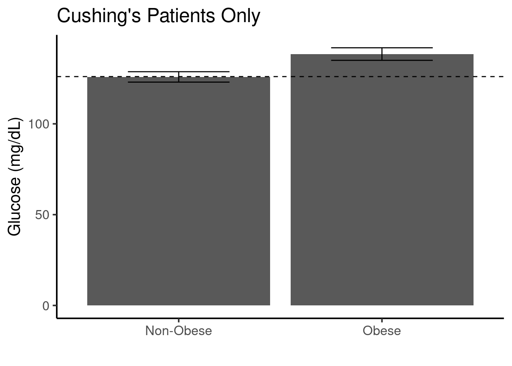{width=672}
:::

```{.r .cell-code}
glucose.data%>% 
  filter(TimePoint=="Before") %>%
  ggplot(aes(y=value,
           x=BMI)) +
  geom_point() +
  geom_smooth() +
  geom_hline(yintercept=126, lty="dashed") +
  labs(title="Cushing's Patients Only",
       y="Glucose (mg/dL)",
       x="") +
  theme_classic(base_size=16)
```

::: {.cell-output-display}
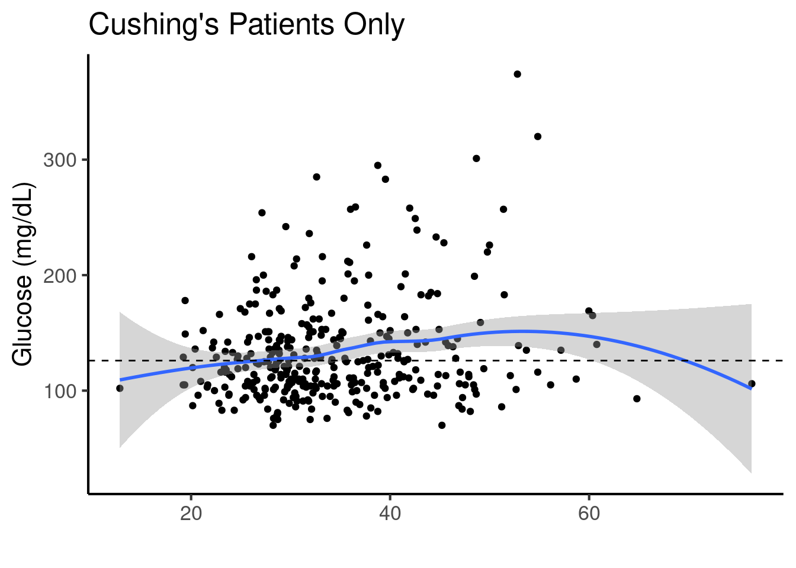{width=672}
:::

```{.r .cell-code}
library(broom)
library(mgcv)
gam(value~s(BMI),
   data=glucose.data %>% filter(TimePoint=="Before"),
   REML=TRUE) -> gam.glucose

lm(value~BMI,
   data=glucose.data %>% filter(TimePoint=="Before")) -> lm.glucose

AIC(lm.glucose, gam.glucose) %>% kable(caption="Glucose for linear and nonlinear models,lower AIC indicates better model fit")
```

::: {.cell-output-display}


Table: Glucose for linear and nonlinear models,lower AIC indicates better model fit

|            |       df|      AIC|
|:-----------|--------:|--------:|
|lm.glucose  | 3.000000| 3577.600|
|gam.glucose | 3.267101| 3577.559|


:::

```{.r .cell-code}
gam.glucose %>%
  tidy %>%
  kable()
```

::: {.cell-output-display}


|term   |      edf|   ref.df| statistic|   p.value|
|:------|--------:|--------:|---------:|---------:|
|s(BMI) | 1.267101| 1.494824|  6.581876| 0.0034267|


:::

```{.r .cell-code}
lm.glucose %>%
  tidy %>%
  kable(caption="Linear model for glucose prior to intervention")
```

::: {.cell-output-display}


Table: Linear model for glucose prior to intervention

|term        |    estimate| std.error| statistic|   p.value|
|:-----------|-----------:|---------:|---------:|---------:|
|(Intercept) | 103.6243701| 9.4480336| 10.967824| 0.0000000|
|BMI         |   0.8741101| 0.2661526|  3.284244| 0.0011286|


:::

```{.r .cell-code}
plot(gam.glucose, pages = 1, residuals = TRUE)
```

::: {.cell-output-display}
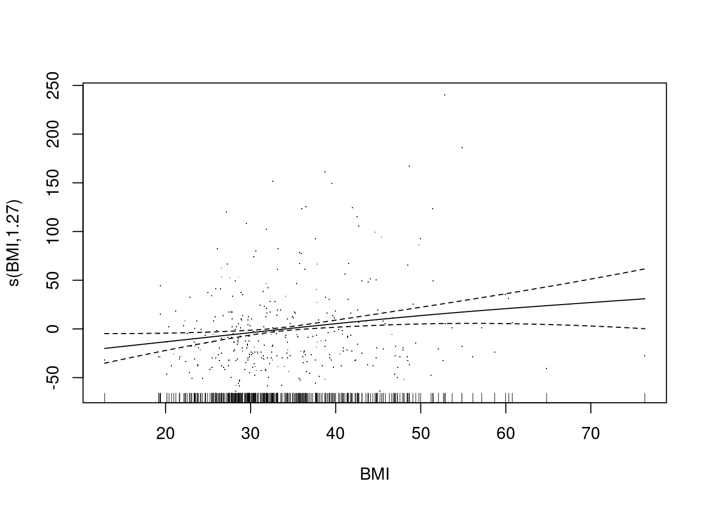{width=672}
:::
:::

::: {.cell}

```{.r .cell-code}
hba1c.data <-
  LabResults.data %>%
  filter(RESULT_CODE %in% c("A1C", "XXA1C", "A1C EX", "X0022")) %>%
  mutate(value = as.numeric(VALUE)) %>% #forced into numeric form  
  arrange(DeID_AdmitDate_Clean) %>% #sort by date
  distinct(DeID_PatientID,.keep_all = T) %>% #unique cases
  mutate(Obesity = if_else(BMI>30, "Obese","Non-Obese")) 

hba1c.summary <-
  hba1c.data %>%
  group_by(TimePoint) %>%
  summarize(mean=mean(value,na.rm=T),
            se=se(value),
            n=length(value))

hba1c.summary %>% kable(caption="Summary of Hb1ac levels before and after procedures")
```

::: {.cell-output-display}


Table: Summary of Hb1ac levels before and after procedures

|TimePoint |     mean|        se|  n|
|:---------|--------:|---------:|--:|
|After     | 6.180000| 0.5112729|  5|
|Before    | 6.854167| 0.3131756| 24|
|Unknown   | 5.300000|        NA|  1|
|NA        | 5.950000| 0.9500000|  2|


:::
:::


We found 32 patients that had a lab result for a HbA1c test. 

Now looking at the effect of BMI


::: {.cell}

```{.r .cell-code}
hba1c.summary.bmi <-
  hba1c.data %>%
  group_by(TimePoint,Obesity) %>%
  summarize(mean=mean(value,na.rm=T),
            se=se(value),
            n=length(value))

hba1c.summary.bmi %>% 
  filter(TimePoint=="Before") %>%
  filter(!(is.na(Obesity))) %>%
  kable(caption="Summary of Hb1ac levels before and after procedures")
```

::: {.cell-output-display}


Table: Summary of Hb1ac levels before and after procedures

|TimePoint |Obesity   |     mean|        se|  n|
|:---------|:---------|--------:|---------:|--:|
|Before    |Non-Obese | 6.514286| 0.3210315|  7|
|Before    |Obese     | 7.285714| 0.4725262| 14|


:::

```{.r .cell-code}
library(ggplot2)
hba1c.summary.bmi %>% 
  filter(TimePoint=="Before") %>%
  filter(!(is.na(Obesity))) %>%
  ggplot(aes(y=mean,
           ymin=mean-se,
           ymax=mean+se,
           x=Obesity)) +
  geom_bar(stat='identity') +
  geom_errorbar(width=0.5) +
  geom_hline(yintercept=6.5, lty="dashed") +
  labs(title="Cushing's Patients Only",
       y="HbA1c (%)",
       x="") +
  theme_classic(base_size=16)
```

::: {.cell-output-display}
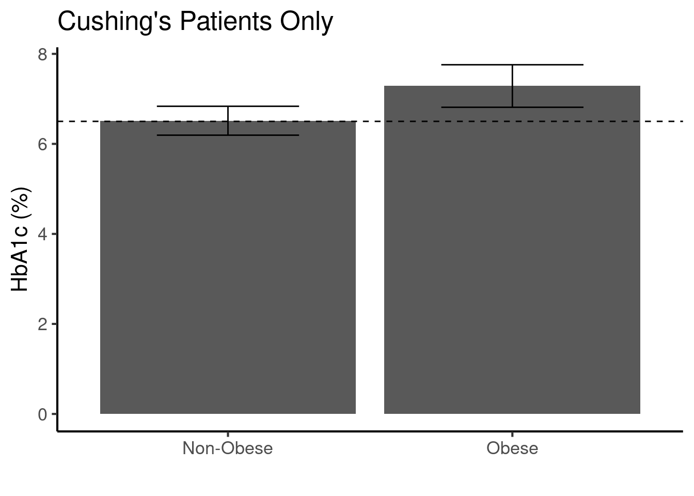{width=672}
:::

```{.r .cell-code}
hba1c.data%>% 
  filter(TimePoint=="Before") %>%
  ggplot(aes(y=value,
           x=BMI)) +
  geom_point() +
  geom_smooth() +
  geom_hline(yintercept=6.5, lty="dashed") +
  labs(title="Cushing's Patients Only",
       y="HbA1c (%)",
       x="") +
  theme_classic(base_size=16)
```

::: {.cell-output-display}
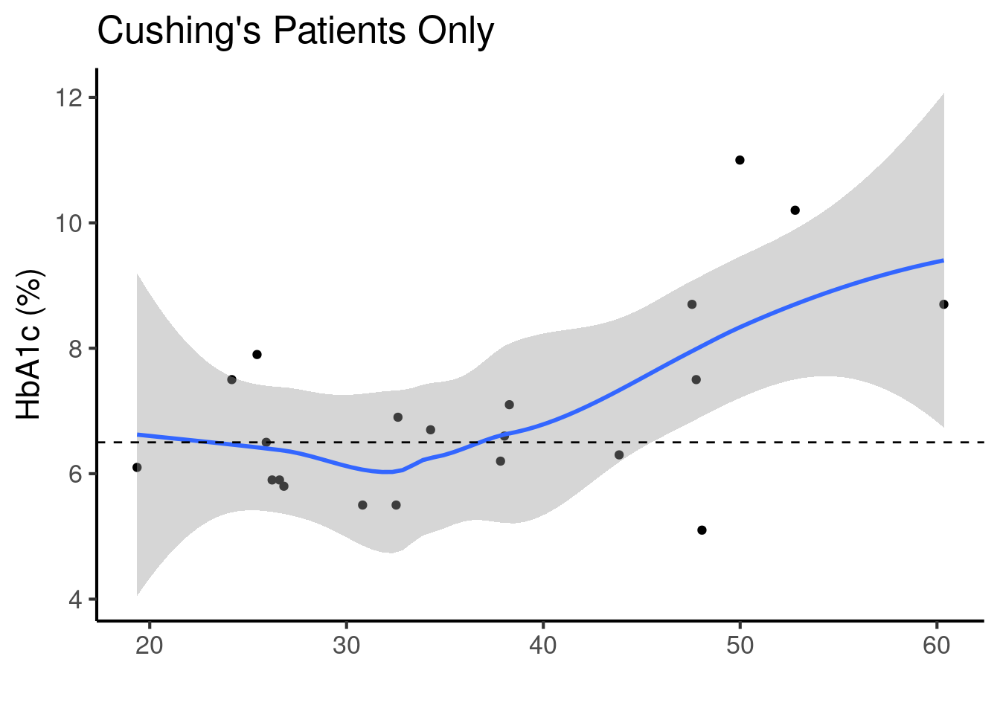{width=672}
:::

```{.r .cell-code}
library(broom)
library(mgcv)
gam(value~s(BMI)+AgeInYears,
   data=hba1c.data %>% filter(TimePoint=="Before"),
   REML=TRUE) -> gam.hba1c

lm(value~BMI+AgeInYears,
   data=hba1c.data %>% filter(TimePoint=="Before")) -> lm.hba1c

AIC(lm.hba1c, gam.hba1c) %>% kable(caption="AIC for linear and nonlinear models,lower AIC indicates better model fit")
```

::: {.cell-output-display}


Table: AIC for linear and nonlinear models,lower AIC indicates better model fit

|          |       df|      AIC|
|:---------|--------:|--------:|
|lm.hba1c  | 4.000000| 74.25328|
|gam.hba1c | 5.759355| 71.02013|


:::

```{.r .cell-code}
gam.hba1c %>%
  tidy %>%
  kable()
```

::: {.cell-output-display}


|term   |      edf|   ref.df| statistic|   p.value|
|:------|--------:|--------:|---------:|---------:|
|s(BMI) | 2.759355| 3.450598|  4.121414| 0.0190887|


:::

```{.r .cell-code}
plot(gam.hba1c, pages = 1, residuals = TRUE)
```

::: {.cell-output-display}
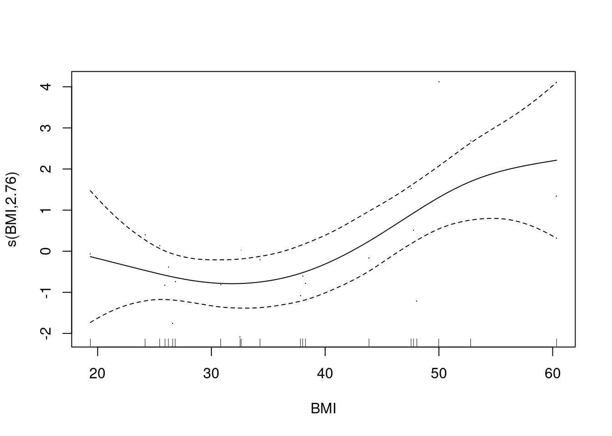{width=672}
:::
:::


Used a generalized additive model with a splined term for BMI. The EDF for this was 2.7593546, where $edf > 1$ suggests nonlinearity, this was a better model fit based on the AIC.

### ALT
 


::: {.cell}

```{.r .cell-code}
alt.data <-
  LabResults.data %>%
  filter(RESULT_CODE %in% c("ALT")) %>%
  mutate(value = as.numeric(VALUE)) %>% #forced into numeric form  
  arrange(DeID_AdmitDate_Clean) %>% #sort by date
  distinct(DeID_PatientID,.keep_all = T) %>% #unique cases
  mutate(Obesity = if_else(BMI>30, "Obese","Non-Obese")) 

alt.summary <-
  alt.data %>%
  group_by(TimePoint) %>%
  summarize(mean=mean(value,na.rm=T),
            se=se(value),
            n=length(value))

alt.summary %>% kable(caption="Summary of ALT levels before and after procedures")
```

::: {.cell-output-display}


Table: Summary of ALT levels before and after procedures

|TimePoint |      mean|        se|  n|
|:---------|---------:|---------:|--:|
|After     |  39.47692|  2.646488| 65|
|Before    | 104.60870| 21.066012| 92|
|Unknown   |  68.18182| 20.844366| 11|
|NA        |  27.33333|  9.938701|  3|


:::
:::


We found 171 patients that had a lab result for a ALT test. 


### AST
 


::: {.cell}

```{.r .cell-code}
ast.data <-
  LabResults.data %>%
  filter(RESULT_CODE %in% c("AST")) %>%
  mutate(value = as.numeric(VALUE)) %>% #forced into numeric form  
  arrange(DeID_AdmitDate_Clean) %>% #sort by date
  distinct(DeID_PatientID,.keep_all = T) %>% #unique cases
  mutate(Obesity = if_else(BMI>30, "Obese","Non-Obese")) 

ast.summary <-
  ast.data %>%
  group_by(TimePoint) %>%
  summarize(mean=mean(value,na.rm=T),
            se=se(value),
            n=length(value))

ast.summary %>% kable(caption="Summary of AST levels before and after procedures")
```

::: {.cell-output-display}


Table: Summary of AST levels before and after procedures

|TimePoint |     mean|        se|  n|
|:---------|--------:|---------:|--:|
|After     | 26.33846|  1.145282| 65|
|Before    | 73.26087| 19.732086| 92|
|Unknown   | 51.36364| 16.840575| 11|
|NA        | 50.00000| 33.005050|  3|


:::
:::


We found 171 patients that had a lab result for a AST test. 


Now looking at the effect of BMI


::: {.cell}

```{.r .cell-code}
alt.summary.bmi <-
  alt.data %>%
  group_by(TimePoint,Obesity) %>%
  summarize(mean=mean(value,na.rm=T),
            se=se(value),
            n=length(value))

alt.summary.bmi %>% 
  filter(TimePoint=="Before") %>%
  filter(!(is.na(Obesity))) %>%
  kable(caption="Summary of ALT levels before and after procedures")
```

::: {.cell-output-display}


Table: Summary of ALT levels before and after procedures

|TimePoint |Obesity   |      mean|        se|  n|
|:---------|:---------|---------:|---------:|--:|
|Before    |Non-Obese |  59.37838|  8.795162| 37|
|Before    |Obese     | 142.52941| 36.759412| 51|


:::

```{.r .cell-code}
alt.summary.bmi %>% 
  filter(TimePoint=="Before") %>%
  filter(!(is.na(Obesity))) %>%
  ggplot(aes(y=mean,
           ymin=mean-se,
           ymax=mean+se,
           x=Obesity)) +
  geom_bar(stat='identity') +
  geom_errorbar(width=0.5) +
  geom_hline(yintercept=30, lty="dashed") +
  labs(title="Cushing's Patients Only",
       y="ALT (IU/L)",
       x="") +
  theme_classic(base_size=16)
```

::: {.cell-output-display}
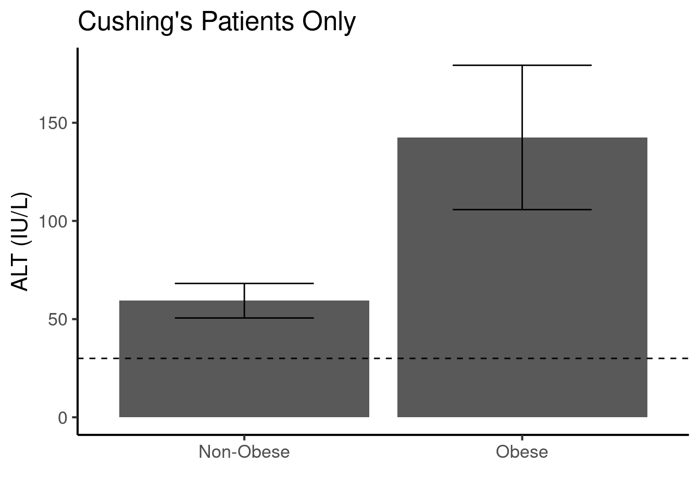{width=672}
:::

```{.r .cell-code}
alt.data%>% 
  filter(TimePoint=="Before") %>%
  ggplot(aes(y=value,
           x=BMI)) +
  geom_point() +
  geom_smooth() +
  geom_hline(yintercept=30, lty="dashed") +
  labs(title="Cushing's Patients Only",
       y="ALT (IU/L)",
       x="") +
  theme_classic(base_size=16)
```

::: {.cell-output-display}
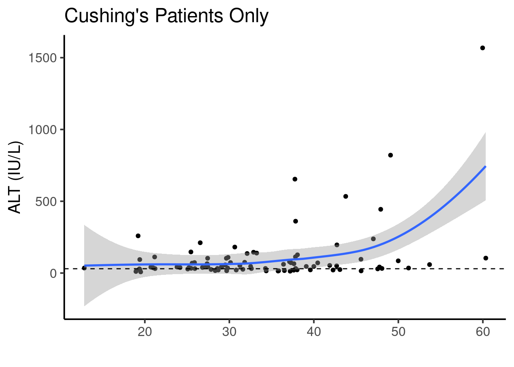{width=672}
:::

```{.r .cell-code}
library(broom)
library(mgcv)
gam(value~s(BMI)+AgeInYears,
   data=alt.data %>% filter(TimePoint=="Before"),
   REML=TRUE) -> gam.alt

lm(value~BMI+AgeInYears,
   data=alt.data %>% filter(TimePoint=="Before")) -> lm.alt

AIC(lm.alt, gam.alt) %>% kable(caption="AIC for linear and nonlinear models,lower AIC indicates better model fit for ALT levels")
```

::: {.cell-output-display}


Table: AIC for linear and nonlinear models,lower AIC indicates better model fit for ALT levels

|        |       df|      AIC|
|:-------|--------:|--------:|
|lm.alt  | 4.000000| 1174.292|
|gam.alt | 6.458279| 1166.152|


:::

```{.r .cell-code}
gam.alt %>%
  tidy %>%
  kable()
```

::: {.cell-output-display}


|term   |      edf|   ref.df| statistic|  p.value|
|:------|--------:|--------:|---------:|--------:|
|s(BMI) | 3.458279| 4.338225|  6.785832| 7.15e-05|


:::

```{.r .cell-code}
plot(gam.alt, pages = 1, residuals = TRUE)
```

::: {.cell-output-display}
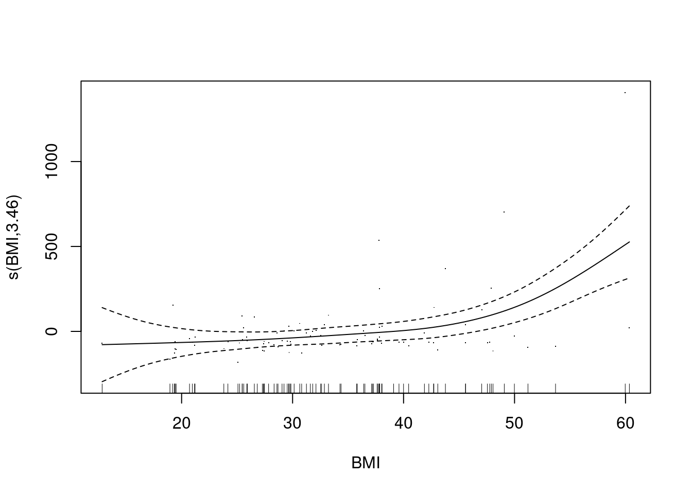{width=672}
:::
:::


Used a generalized additive model with a splined term for BMI. The EDF for this was 3.4582788, where $edf > 1$ suggests nonlinearity, this was a better model fit based on the AIC.

### LDL Cholesterol
 


::: {.cell}

```{.r .cell-code}
ldl.data <-
  LabResults.data %>%
  filter(RESULT_CODE %in% c("LDLC", "DLDL")) %>%
  mutate(value = as.numeric(VALUE)) %>% #forced into numeric form  
  arrange(DeID_AdmitDate_Clean) %>% #sort by date
  distinct(DeID_PatientID,.keep_all = T) %>% #unique cases
  mutate(Obesity = if_else(BMI>30, "Obese","Non-Obese")) 

ldl.summary <-
  ldl.data %>%
  group_by(TimePoint) %>%
  summarize(mean=mean(value,na.rm=T),
            se=se(value),
            n=length(value))

ldl.summary %>% kable(caption="Summary of LDL-C levels before and after procedures")
```

::: {.cell-output-display}


Table: Summary of LDL-C levels before and after procedures

|TimePoint |  mean|       se|  n|
|:---------|-----:|--------:|--:|
|After     | 101.5| 43.50000|  2|
|Before    | 123.5| 11.11807| 21|
|Unknown   |  79.5| 36.50000|  2|
|NA        | 104.0| 42.00000|  2|


:::
:::


We found 27 patients that had a lab result for a LDL-C test. 

Now looking at the effect of BMI


::: {.cell}

```{.r .cell-code}
ldl.summary.bmi <-
  ldl.data %>%
  group_by(TimePoint,Obesity) %>%
  summarize(mean=mean(value,na.rm=T),
            se=se(value),
            n=length(value))

ldl.summary.bmi %>% 
  filter(TimePoint=="Before") %>%
  filter(!(is.na(Obesity))) %>%
  kable(caption="Summary of Hb1ac levels before and after procedures")
```

::: {.cell-output-display}


Table: Summary of Hb1ac levels before and after procedures

|TimePoint |Obesity   |     mean|       se|  n|
|:---------|:---------|--------:|--------:|--:|
|Before    |Non-Obese | 132.6667| 31.15644|  7|
|Before    |Obese     | 122.5000| 12.05566| 10|


:::

```{.r .cell-code}
library(ggplot2)
ldl.summary.bmi %>% 
  filter(TimePoint=="Before") %>%
  filter(!(is.na(Obesity))) %>%
  ggplot(aes(y=mean,
           ymin=mean-se,
           ymax=mean+se,
           x=Obesity)) +
  geom_bar(stat='identity') +
  geom_errorbar(width=0.5) +
  geom_hline(yintercept=160, lty="dashed") +
  labs(title="Cushing's Patients Only",
       y="LDL (mg/dL)",
       x="") +
  theme_classic(base_size=16)
```

::: {.cell-output-display}
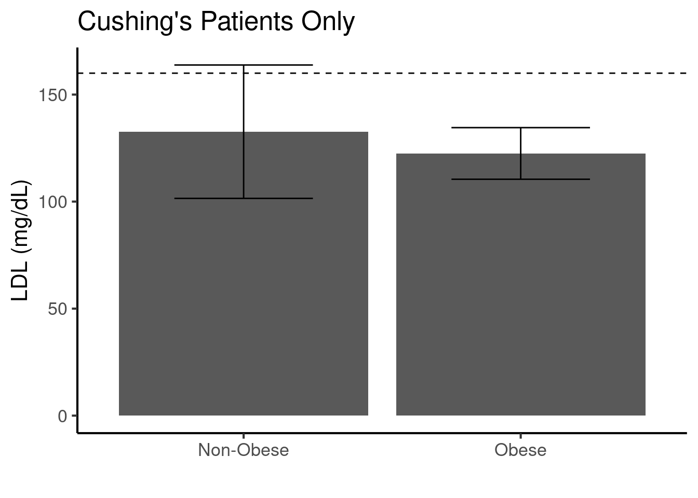{width=672}
:::

```{.r .cell-code}
ldl.data%>% 
  filter(TimePoint=="Before") %>%
  ggplot(aes(y=value,
           x=BMI)) +
  geom_point() +
  geom_smooth(method="lm") +
  geom_hline(yintercept=160, lty="dashed") +
  labs(title="Cushing's Patients Only",
       y="LDL (mg/dL)",
       x="") +
  theme_classic(base_size=16)
```

::: {.cell-output-display}
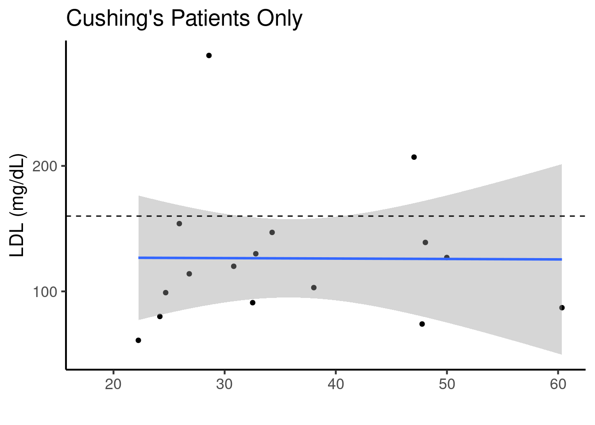{width=672}
:::

```{.r .cell-code}
library(broom)
library(mgcv)
gam(value~s(BMI)+AgeInYears,
   data=ldl.data %>% filter(TimePoint=="Before"),
   REML=TRUE) -> gam.ldl

lm(value~BMI+AgeInYears,
   data=ldl.data %>% filter(TimePoint=="Before")) -> lm.ldl

AIC(lm.ldl, gam.ldl) %>% kable(caption="AIC for linear and nonlinear models,lower AIC indicates better model fit")
```

::: {.cell-output-display}


Table: AIC for linear and nonlinear models,lower AIC indicates better model fit

|        |       df|      AIC|
|:-------|--------:|--------:|
|lm.ldl  | 4.000000| 180.8824|
|gam.ldl | 7.155128| 177.3442|


:::

```{.r .cell-code}
gam.ldl %>%
  tidy %>%
  kable()
```

::: {.cell-output-display}


|term   |      edf|   ref.df| statistic|   p.value|
|:------|--------:|--------:|---------:|---------:|
|s(BMI) | 4.155128| 4.980183|  1.239823| 0.3462161|


:::

```{.r .cell-code}
plot(gam.ldl, pages = 1, residuals = TRUE)
```

::: {.cell-output-display}
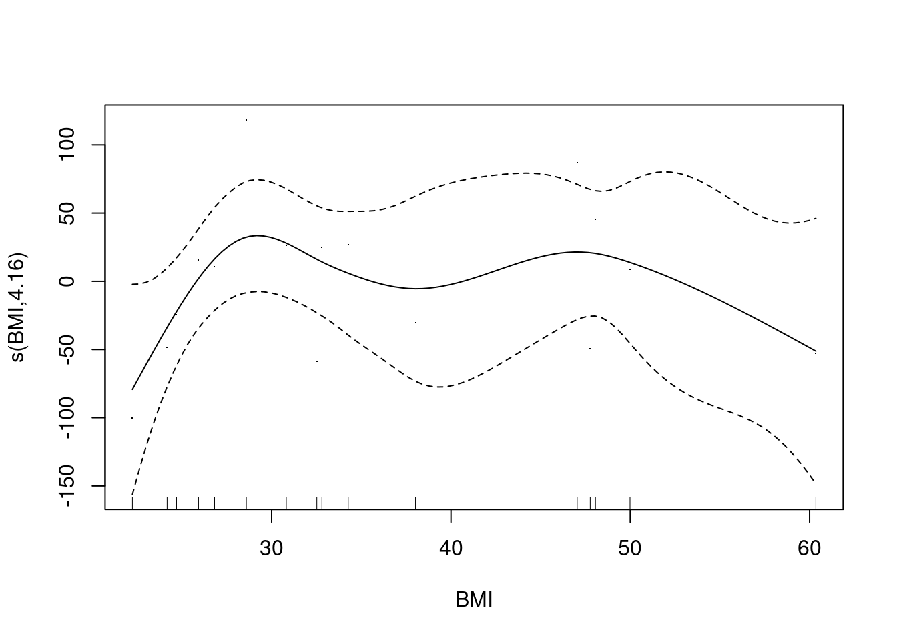{width=672}
:::
:::


Used a generalized additive model with a splined term for BMI. The EDF for this was 4.1551284, where $edf > 1$ suggests nonlinearity, this was a better model fit based on the AIC.


## Session Information


::: {.cell}

```{.r .cell-code}
sessionInfo()
```

::: {.cell-output .cell-output-stdout}

```
R version 4.4.3 (2025-02-28)
Platform: x86_64-pc-linux-gnu
Running under: Red Hat Enterprise Linux 8.10 (Ootpa)

Matrix products: default
BLAS:   /sw/pkgs/arc/stacks/gcc/13.2.0/R/4.4.3/lib64/R/lib/libRblas.so 
LAPACK: /sw/pkgs/arc/stacks/gcc/13.2.0/R/4.4.3/lib64/R/lib/libRlapack.so;  LAPACK version 3.12.0

locale:
 [1] LC_CTYPE=en_US.UTF-8       LC_NUMERIC=C              
 [3] LC_TIME=en_US.UTF-8        LC_COLLATE=en_US.UTF-8    
 [5] LC_MONETARY=en_US.UTF-8    LC_MESSAGES=en_US.UTF-8   
 [7] LC_PAPER=en_US.UTF-8       LC_NAME=C                 
 [9] LC_ADDRESS=C               LC_TELEPHONE=C            
[11] LC_MEASUREMENT=en_US.UTF-8 LC_IDENTIFICATION=C       

time zone: America/Detroit
tzcode source: system (glibc)

attached base packages:
[1] stats     graphics  grDevices utils     datasets  methods   base     

other attached packages:
 [1] mgcv_1.9-1      nlme_3.1-167    broom_1.0.6     knitr_1.48     
 [5] lubridate_1.9.3 forcats_1.0.0   stringr_1.5.1   dplyr_1.1.4    
 [9] purrr_1.0.2     readr_2.1.5     tidyr_1.3.1     tibble_3.2.1   
[13] ggplot2_3.5.1   tidyverse_2.0.0

loaded via a namespace (and not attached):
 [1] utf8_1.2.4        generics_0.1.3    lattice_0.22-6    stringi_1.8.4    
 [5] hms_1.1.3         digest_0.6.36     magrittr_2.0.3    evaluate_0.24.0  
 [9] grid_4.4.3        timechange_0.3.0  fastmap_1.2.0     Matrix_1.7-2     
[13] jsonlite_1.8.8    backports_1.5.0   fansi_1.0.6       scales_1.3.0     
[17] cli_3.6.3         rlang_1.1.4       crayon_1.5.3      bit64_4.0.5      
[21] munsell_0.5.1     splines_4.4.3     withr_3.0.0       yaml_2.3.9       
[25] tools_4.4.3       parallel_4.4.3    tzdb_0.4.0        colorspace_2.1-0 
[29] vctrs_0.6.5       R6_2.5.1          lifecycle_1.0.4   htmlwidgets_1.6.4
[33] bit_4.0.5         vroom_1.6.5       pkgconfig_2.0.3   pillar_1.9.0     
[37] gtable_0.3.6      glue_1.8.0        xfun_0.45         tidyselect_1.2.1 
[41] rstudioapi_0.16.0 farver_2.1.2      htmltools_0.5.8.1 rmarkdown_2.27   
[45] labeling_0.4.3    compiler_4.4.3   
```


:::
:::
