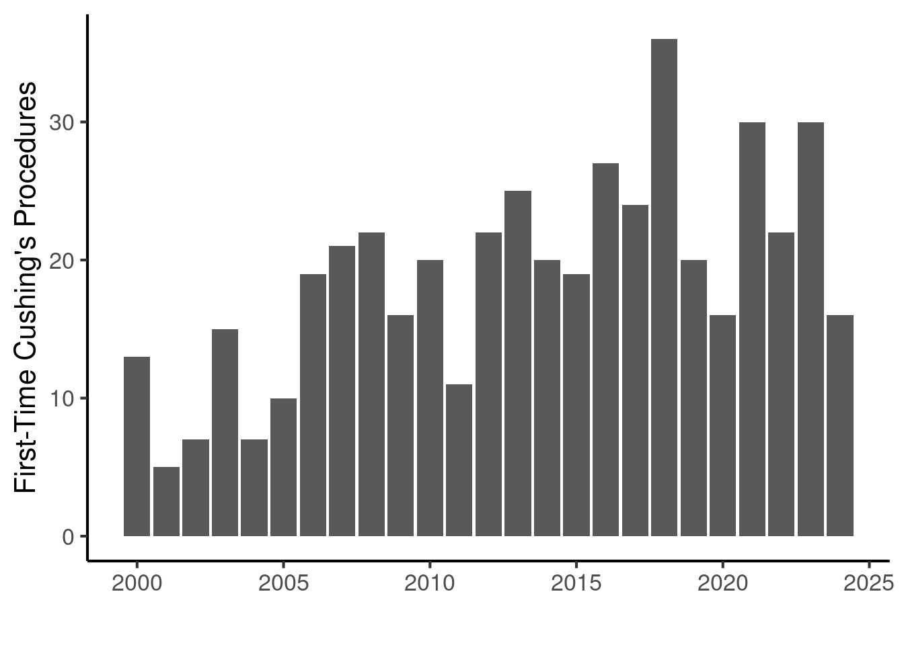
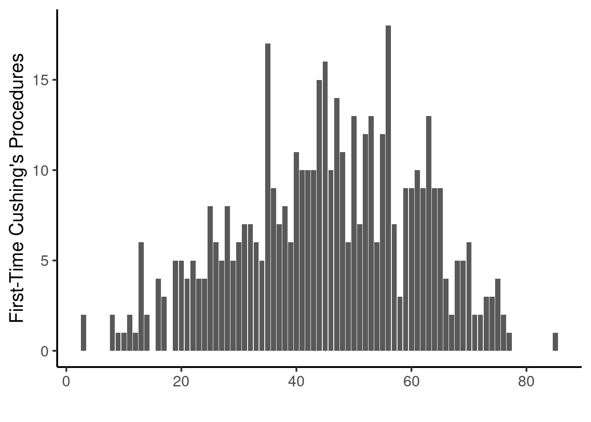
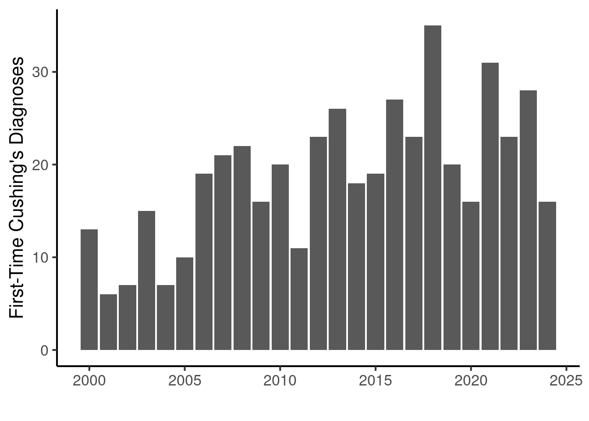
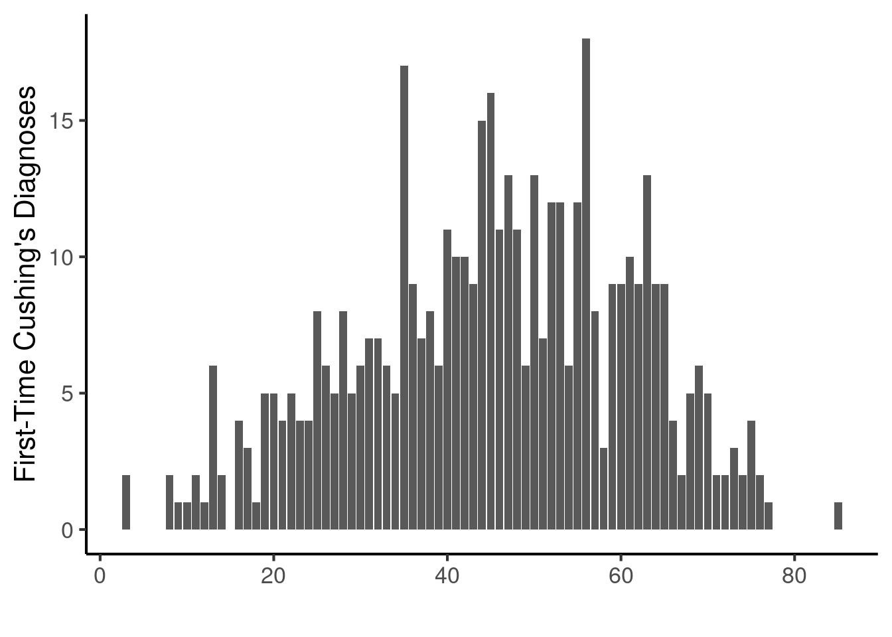
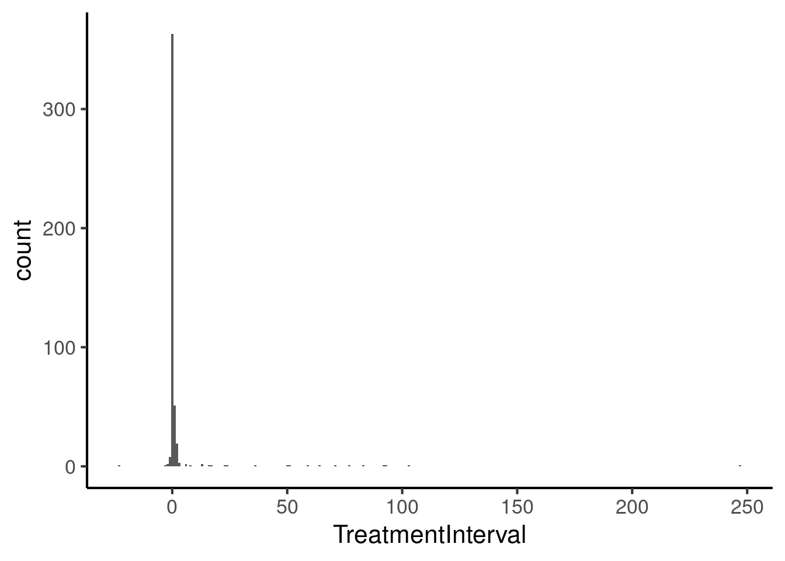

::: {.cell}

```{.r .cell-code}
# hide this code chunk
#| echo: false
#| message: false

# defines the se function
se <- function(x) {
  sd(x, na.rm = TRUE) / sqrt(length(x))
}

#load these packages, nearly always needed
library(tidyverse)

# sets maize and blue color scheme
color_scheme <- c("#00274c", "#ffcb05")
```
:::


## Purpose

To load in the participant data about their Cushing's diagnoses and the procedures.  This is an important landmark for defining effects before or after.

## Experimental Details


::: {.cell}

```{.r .cell-code}
encounter.datafile <- "EncounterAll.csv" 
procedure.datafile <- "ProceduresComprehensive.csv" 
diagnosis.datafile <- "DiagnosesComprehensiveAll.csv" 

library(readr) #for loading csv files
library(dplyr) #for data cleaning
library(lubridate) #for date cleaning
library(knitr) #for kables
encounter.data <- read_csv(encounter.datafile) |>
  mutate(DeID_AdmitDate_Clean = as_date(mdy_hm(DeID_AdmitDate))) #clean and format into just dates not times
procedure.data <- read_csv(procedure.datafile)
diagnosis.data <- read_csv(diagnosis.datafile)
```
:::


## Raw Data

Relevant patient data is in these files:

* **Procedures** are in ProceduresComprehensive.csv.  This includes patient ID, encouter ID, TermCodeMapped (ICD code).
* **Diagnoses** are in DiagnosesComprehensiveAll.csv.  This includes patient ID, encouter ID, TermCodeMapped (ICD code).
* The EncounterAll.csv contains metadata about encounters including dates and BMIs


Describe your raw data files, including what the columns mean (and what units they are in).


This files was most recently updated on 2025-09-29.  This script was most recently updated on Mon Sep 29 17:02:10 2025.

## Data Cleaning

### Procedures

Procedures are defined by ICD codes. 


::: {.cell}

```{.r .cell-code}
procedure_codes <- c("07.6", "07.61", "07.62", "07.63", "07.64", "07.65", "07.68", "07.69", "07.15", "07.72", "0GB00ZZ", "0GT00ZZ", "0GB03ZZ", "0GB04ZZ", "0GT04ZZ", "0GC00ZZ", "0GC03ZZ", "0GC04ZZ", "0GT00ZZ", "0GT04ZZ")
```
:::


We used these ICD codes to define the procedures 07.6,07.61,07.62,07.63,07.64,07.65,07.68,07.69,07.15,07.72,0GB00ZZ,0GT00ZZ,0GB03ZZ,0GB04ZZ,0GT04ZZ,0GC00ZZ,0GC03ZZ,0GC04ZZ,0GT00ZZ,0GT04ZZ.


::: {.cell}

```{.r .cell-code}
cushings.procedures <-
  procedure.data |>
  filter(TermCodeMapped %in% procedure_codes)

#several procedures are not in procedure codes
```
:::


#### Unmapped Procedures

Several procedures are not in our procedure codes. 


::: {.cell}

```{.r .cell-code}
procedure.data |>
  filter(!(TermCodeMapped %in% procedure_codes)) |>
  group_by(TermNameMapped) |>
  count() |>
  arrange(desc(n)) |>
  kable(caption="Unmapped procedures and number of times they occured")
```

::: {.cell-output-display}


Table: Unmapped procedures and number of times they occured

|TermNameMapped                      |   n|
|:-----------------------------------|---:|
|Laprscpy, adrenalectomy, ptl/compl  | 180|
|remove pituit tumor w/scope         | 175|
|Removal of pituitary gland or tumor | 128|
|Anesthesia, adrenal gland removal   |  77|
|Unilateral adrenalectomy            |  64|
|Explore/remove adrenal gland        |  36|
|Resection Lt Adrenal Gl, PEA        |  25|
|Resection Rt Adrenal Gl, PEA        |  23|
|Bilateral adrenalectomy             |  16|
|Explore/remove adrenal gland/tumor  |  13|
|Resection Rt Adrenal Gl, OA         |  13|
|laparoscopy adrenalectomy           |  13|
|Resection Bilat Adrenal Gls, PEA    |  10|
|Resection Lt Adrenal Gl, OA         |   8|
|Laprscpy w/remov adnexal structures |   3|
|Resection Bilat Adrenal Gls, OA     |   3|
|Adrenal gland lesion excision       |   2|
|Excision Pituitary Gland,PEA,Diagns |   2|
|Excision of BiLtr Adrenal Gland,PEA |   2|
|Excision of Left Adrenal Gland,PEA  |   2|
|explore adrenal gland               |   1|
|laparoscopy, remove adnexa          |   1|


:::
:::


These all seem like reasonable procedures so I am going to keep all of them in the dataset.

#### All Procedures


::: {.cell}

```{.r .cell-code}
procedure.data |>
  group_by(TermNameMapped) |>
  count() |>
  arrange(desc(n)) |>
  kable(caption="All procedures and number of times they occured")
```

::: {.cell-output-display}


Table: All procedures and number of times they occured

|TermNameMapped                      |   n|
|:-----------------------------------|---:|
|Laprscpy, adrenalectomy, ptl/compl  | 180|
|remove pituit tumor w/scope         | 175|
|Removal of pituitary gland or tumor | 128|
|Excision of Pituitary Gland,PEA     | 116|
|Part pituitary excise, transsphen   |  98|
|Anesthesia, adrenal gland removal   |  77|
|Unilateral adrenalectomy            |  64|
|Explore/remove adrenal gland        |  36|
|Resection Lt Adrenal Gl, PEA        |  25|
|Resection Rt Adrenal Gl, PEA        |  23|
|Total pituitary exc, transsphenoid  |  20|
|Bilateral adrenalectomy             |  16|
|Explore/remove adrenal gland/tumor  |  13|
|Resection Rt Adrenal Gl, OA         |  13|
|laparoscopy adrenalectomy           |  13|
|Resection Bilat Adrenal Gls, PEA    |  10|
|Resection Pituitary Gland, PEA      |  10|
|Resection Lt Adrenal Gl, OA         |   8|
|Excision of Pituitary Gland,OA      |   4|
|Laprscpy w/remov adnexal structures |   3|
|Resection Bilat Adrenal Gls, OA     |   3|
|Adrenal gland lesion excision       |   2|
|Excision Pituitary Gland,PEA,Diagns |   2|
|Excision of BiLtr Adrenal Gland,PEA |   2|
|Excision of Left Adrenal Gland,PEA  |   2|
|Excision of Pituitary Gland,PA      |   1|
|Total excision pituitary gland NEC  |   1|
|explore adrenal gland               |   1|
|laparoscopy, remove adnexa          |   1|


:::

```{.r .cell-code}
first.cushings.procedure <-
  procedure.data |>
    left_join(encounter.data, by=c("DeID_PatientID","DeID_EncounterID")) |> #added in data about encounters
  arrange(DeID_PatientID,DeID_AdmitDate_Clean) |>
  distinct(DeID_PatientID, .keep_all = T)
```
:::


#### Summary of Cushing's Procedures in the Dataset

First checked which year the procedure first occured.


::: {.cell}

```{.r .cell-code}
first.cushings.procedure |>
  summarize(Year = year(DeID_AdmitDate_Clean)) |>
  group_by(Year) |>
  count() -> procedures.by.year

procedures.by.year |>
  kable(caption="Diagnoses per year")
```

::: {.cell-output-display}


Table: Diagnoses per year

| Year|  n|
|----:|--:|
| 2000| 13|
| 2001|  5|
| 2002|  7|
| 2003| 15|
| 2004|  7|
| 2005| 10|
| 2006| 19|
| 2007| 21|
| 2008| 22|
| 2009| 16|
| 2010| 20|
| 2011| 11|
| 2012| 22|
| 2013| 25|
| 2014| 20|
| 2015| 19|
| 2016| 27|
| 2017| 24|
| 2018| 36|
| 2019| 20|
| 2020| 16|
| 2021| 30|
| 2022| 22|
| 2023| 30|
| 2024| 16|
|   NA|  1|


:::

```{.r .cell-code}
library(ggplot2)
procedures.by.year |>
  ggplot(aes(x=Year,
         y=n)) +
  geom_bar(stat='identity') +
  labs(y="First-Time Cushing's Procedures",
       x="") +
  theme_classic(base_size=16)
```

::: {.cell-output-display}
{width=672}
:::
:::


Next evaluated the age at first diagnosis


::: {.cell}

```{.r .cell-code}
first.cushings.procedure |>
  group_by(AgeInYears) |>
  count() -> procedures.by.age

#cushings.by.age |>
#  kable(caption="Diagnoses per age")

library(ggplot2)
procedures.by.age |>
  ggplot(aes(x=AgeInYears,
         y=n)) +
  geom_bar(stat='identity') +
  labs(y="First-Time Cushing's Procedures",
       x="") +
  theme_classic(base_size=16)
```

::: {.cell-output-display}
{width=672}
:::
:::


The average age of the first recorded diagnosis of Cushings is 45.255814 $\pm$ 15.7170456 (mean $\pm$ SD).

### Diagnoses

Procedures are defined by ICD codes.  We used E24.0  for ICD10 coding and 255.0  for ICD9 coding


::: {.cell}

```{.r .cell-code}
library(dplyr)
cushings.diagnosis.data <-
  diagnosis.data |>
  filter(TermCodeMapped %in% c('255.0','E24.0')) |>
  left_join(encounter.data, by=c("DeID_PatientID","DeID_EncounterID")) |> #added in data about encounters
  arrange(DeID_PatientID,DeID_AdmitDate_Clean) |>
  distinct(DeID_PatientID, .keep_all = T) #onbly take the first diagnosis date for each patient
```
:::


#### Summary of Cushing's Diagnoses in the Dataset

First checked which year the diagnoses first occured.


::: {.cell}

```{.r .cell-code}
library(knitr)
cushings.diagnosis.data |>
  summarize(Year = year(DeID_AdmitDate_Clean)) |>
  group_by(Year) |>
  count() -> cushings.by.year

cushings.by.year |>
  kable(caption="Diagnoses per year")
```

::: {.cell-output-display}


Table: Diagnoses per year

| Year|  n|
|----:|--:|
| 2000| 13|
| 2001|  6|
| 2002|  7|
| 2003| 15|
| 2004|  7|
| 2005| 10|
| 2006| 19|
| 2007| 21|
| 2008| 22|
| 2009| 16|
| 2010| 20|
| 2011| 11|
| 2012| 23|
| 2013| 26|
| 2014| 18|
| 2015| 19|
| 2016| 27|
| 2017| 23|
| 2018| 35|
| 2019| 20|
| 2020| 16|
| 2021| 31|
| 2022| 23|
| 2023| 28|
| 2024| 16|


:::

```{.r .cell-code}
library(ggplot2)
cushings.by.year |>
  ggplot(aes(x=Year,
         y=n)) +
  geom_bar(stat='identity') +
  labs(y="First-Time Cushing's Diagnoses",
       x="") +
  theme_classic(base_size=16)
```

::: {.cell-output-display}
{width=672}
:::
:::


Next evaluated the age at first diagnosis


::: {.cell}

```{.r .cell-code}
cushings.diagnosis.data |>
  group_by(AgeInYears) |>
  count() -> cushings.by.age

#cushings.by.age |>
#  kable(caption="Diagnoses per age")

library(ggplot2)
cushings.by.age |>
  ggplot(aes(x=AgeInYears,
         y=n)) +
  geom_bar(stat='identity') +
  labs(y="First-Time Cushing's Diagnoses",
       x="") +
  theme_classic(base_size=16)
```

::: {.cell-output-display}
{width=672}
:::
:::


The average age of the first recorded diagnosis of Cushings is 45.1461864 $\pm$ 15.7291913 (mean $\pm$ SD).

### Matching Procedures to Diagnoses


::: {.cell}

```{.r .cell-code}
combined.treatment.data <- left_join(first.cushings.procedure,cushings.diagnosis.data,
                                     by=c("DeID_PatientID"),
                                     suffix=c("_procedure","_diagnosis")) |>
  mutate(TreatmentInterval = DeID_AdmitDate_Clean_procedure - DeID_AdmitDate_Clean_diagnosis)

combined.treatment.data.clean <-
  combined.treatment.data |>
  filter(!is.na(TreatmentInterval)) |> #remove patients with missing dates
  filter(TreatmentInterval >=0 ) #remove patients with negative dates
```
:::


Out of 474 participants, there were 12 patients with errors in this data (treatment appears to have occured before diagnosis).  A few were missing procedure or diagnosis dates (n=5).  The remaining 457 were reasonable.  Surprisingly 363 patients had diagnoses and procedures on the same day.

The average treatment interval, excluding these was 2.73522975929978 $\pm$ 16.1830919 days


::: {.cell}

```{.r .cell-code}
combined.treatment.data |>
  ggplot(aes(x=TreatmentInterval)) +
  geom_histogram(binwidth=1) +
  theme_classic(base_size=16)
```

::: {.cell-output-display}
{width=672}
:::
:::

::: {.cell}

```{.r .cell-code}
output_file <- 'CushingsDataClean.csv'

combined.treatment.data.clean |>
  select(DeID_PatientID, 
         DeID_AdmitDate_Clean_procedure,
         DeID_AdmitDate_Clean_diagnosis,
         AgeInYears_procedure,
         TreatmentInterval) |>
  write_csv(output_file)
```
:::


A file containing diagnosis dates, age and treatment intervals were written into CushingsDataClean.csv.  This can be used to anchor other diagnoses and lab results to before or after their Cushing's treatments.

## Session Information


::: {.cell}

```{.r .cell-code}
sessionInfo()
```

::: {.cell-output .cell-output-stdout}

```
R version 4.4.3 (2025-02-28)
Platform: x86_64-pc-linux-gnu
Running under: Red Hat Enterprise Linux 8.10 (Ootpa)

Matrix products: default
BLAS:   /sw/pkgs/arc/stacks/gcc/13.2.0/R/4.4.3/lib64/R/lib/libRblas.so 
LAPACK: /sw/pkgs/arc/stacks/gcc/13.2.0/R/4.4.3/lib64/R/lib/libRlapack.so;  LAPACK version 3.12.0

locale:
 [1] LC_CTYPE=en_US.UTF-8       LC_NUMERIC=C              
 [3] LC_TIME=en_US.UTF-8        LC_COLLATE=en_US.UTF-8    
 [5] LC_MONETARY=en_US.UTF-8    LC_MESSAGES=en_US.UTF-8   
 [7] LC_PAPER=en_US.UTF-8       LC_NAME=C                 
 [9] LC_ADDRESS=C               LC_TELEPHONE=C            
[11] LC_MEASUREMENT=en_US.UTF-8 LC_IDENTIFICATION=C       

time zone: America/Detroit
tzcode source: system (glibc)

attached base packages:
[1] stats     graphics  grDevices utils     datasets  methods   base     

other attached packages:
 [1] knitr_1.48      lubridate_1.9.3 forcats_1.0.0   stringr_1.5.1  
 [5] dplyr_1.1.4     purrr_1.0.2     readr_2.1.5     tidyr_1.3.1    
 [9] tibble_3.2.1    ggplot2_3.5.1   tidyverse_2.0.0

loaded via a namespace (and not attached):
 [1] bit_4.0.5         gtable_0.3.6      jsonlite_1.8.8    crayon_1.5.3     
 [5] compiler_4.4.3    tidyselect_1.2.1  parallel_4.4.3    scales_1.3.0     
 [9] yaml_2.3.9        fastmap_1.2.0     R6_2.5.1          labeling_0.4.3   
[13] generics_0.1.3    htmlwidgets_1.6.4 munsell_0.5.1     pillar_1.9.0     
[17] tzdb_0.4.0        rlang_1.1.4       utf8_1.2.4        stringi_1.8.4    
[21] xfun_0.45         bit64_4.0.5       timechange_0.3.0  cli_3.6.3        
[25] withr_3.0.0       magrittr_2.0.3    digest_0.6.36     grid_4.4.3       
[29] vroom_1.6.5       rstudioapi_0.16.0 hms_1.1.3         lifecycle_1.0.4  
[33] vctrs_0.6.5       evaluate_0.24.0   glue_1.8.0        farver_2.1.2     
[37] fansi_1.0.6       colorspace_2.1-0  rmarkdown_2.27    tools_4.4.3      
[41] pkgconfig_2.0.3   htmltools_0.5.8.1
```


:::
:::
