::: {.cell}

```{.r .cell-code}
# hide this code chunk
#| echo: false
#| message: false

# defines the se function
se <- function(x) {
  sd(x, na.rm = TRUE) / sqrt(length(x))
}

#load these packages, nearly always needed
library(tidyverse)

# sets maize and blue color scheme
color_scheme <- c("#00274c", "#ffcb05")
```
:::


## Purpose

To create a propensity mapped subgroup for lab results.

## Data Entry


::: {.cell}

```{.r .cell-code}
case.demographics.filename <- 'CaseDemographics.csv'
control.demographics.filename <- 'ControlDemographics.csv'

case.lab.results.filename <- 'LabResults.csv'
control.lab.results.filename <- '../controls/LabResults.csv'

bp.filename.cases <- 'NursingStandardVitalSigns.csv'
bp.filename.controls <- '../controls/NursingStandardVitalSigns.csv'

case.encounter.datafile <- "EncounterAll.csv" 
case.encounter.bmi.datafile <- "EncounterAnthropometricsBMI.csv" 
control.encounter.datafile <- "../controls/EncounterAll.csv" 
control.encounter.bmi.datafile <- "../controls/EncounterAnthropometricsBMI.csv" 

library(readr)
library(dplyr)

#labs dont have dates/ages
case.encounters <- read_csv(case.encounter.datafile)
case.encounters.bmi <- read_csv(case.encounter.bmi.datafile)
case.encounters.all <- left_join(case.encounters,case.encounters.bmi,
                                 by = join_by(DeID_PatientID, DeID_EncounterID))

control.encounters <- read_csv(control.encounter.datafile)
control.encounters.bmi <- read_csv(control.encounter.bmi.datafile)
control.encounters.all <- left_join(control.encounters,control.encounters.bmi,
                                 by = join_by(DeID_PatientID, DeID_EncounterID))


case.demographics <- read_csv(case.demographics.filename)
control.demographics <- read_csv(control.demographics.filename)

case.labs <- read_csv(case.lab.results.filename) |>
  left_join(case.encounters.all, by = join_by(DeID_PatientID, DeID_EncounterID)) |> #added encounter info
    left_join(case.demographics, by="DeID_PatientID") # added demographic data
control.labs <- read_csv(control.lab.results.filename) |> 
  left_join(control.encounters.all, by = join_by(DeID_PatientID, DeID_EncounterID)) |> #added encounter info
  left_join(control.demographics, by="DeID_PatientID") # added demographic data
#remove large objects not needed further
#rm(control.encounters,control.encounters.all,control.encounters.bmi)

#combined into one dataset
library(lubridate)

#this is used to filter for the window between when a lab result is allowable relative to the procedure.
procedure.result.interval <- 365 #within a year

lab.results <- bind_rows(control.labs |> mutate(Cushings=0),
                         case.labs |> mutate(Cushings=1)) |>  #combined, new column indicating cushings
  mutate(cushings_procedure = ymd(cushings_procedure),
         DeID_AdmitDate = mdy_hm(DeID_AdmitDate)) |> 
  mutate(TimePoint = case_when(cushings_procedure<= DeID_AdmitDate ~ "Before",
                               cushings_procedure > DeID_AdmitDate ~ "After",
                               .default="Unknown")) %>% # defined each encounter as before or after
  mutate(ProcedureFollowUp = cushings_procedure - DeID_AdmitDate) #used to define point between the lab result and the procedure.

#filtered out lab results outside of our interval
lab.results.filtered <-
  lab.results |>
  filter(ProcedureFollowUp<procedure.result.interval | is.na(ProcedureFollowUp)) |>
  filter(TimePoint!="After")
  
#filtered out if the age, gender, race, ethnicity was NA for a patient.
complete.data.race.ethnicity.age <-
  lab.results.filtered |>
  filter(!if_any(c(AgeInYears, GenderCode, RaceCode, EthnicityCode), is.na)) #removed if they had missing data for age, gender, race or ethnicity

#this is the complete dataset  
complete.data  <-
  complete.data.race.ethnicity.age |>
  mutate(RaceEthnicity = case_when(EthnicityCode=="HL"~"Hispanic or Latino",
                                   RaceCode=="C"~"White",
                                   RaceCode=="AA"~"Black",
                                   RaceCode=="A"~"Asian",
                                   .default="Other")) #defined race/ethnicity categories

#number of controls per case
fold <- 10
```
:::


Note the controls dont have ages or BMIs because it depends on when the lab results were obtained, so had to merge in with encounter data.

### Participant Inclusion Data

We began with 69797 controls who had lab data, and **453** cases with Cushing's Disease.

* **Had Laboratory Results**: We also removed 329 lab results from Cushing's patients because they were outside of our acceptable window of 365 days before their procedure.  This eliminated a total of **1** Cushings patients from our dataset.

* **Missing Demographic Data** After filtering out missing demographic data we had 365 cases and 69273 controls with lab results.  The specific pieces of missing information are found here:


::: {.cell}

```{.r .cell-code}
lab.results.filtered |>
  filter(Cushings==1) |> #only for cushings data
  group_by(DeID_PatientID) %>%
  summarise(
    Age_na = sum(is.na(AgeInYears)),
    Gender_na = sum(is.na(GenderCode)),
    Race_na = sum(is.na(RaceCode)),
    Ethnicity_na = sum(is.na(EthnicityCode)),
    Any_na = any(is.na(AgeInYears) | is.na(GenderCode) | is.na(RaceCode) |is.na(EthnicityCode))) |>
  ungroup() |>
    pivot_longer(cols = ends_with("_na"),
                 names_to = "field",
                 values_to = "has_na") |>
  filter(has_na!=0) %>%
  count(field, name = "n_patients_with_NA")-> missing.demographic.summary

library(knitr)
missing.demographic.summary |> arrange(desc(n_patients_with_NA)) |> kable(caption="Summary of exclusions from Cushing's patient pool due to missing demographic data")
```

::: {.cell-output-display}


Table: Summary of exclusions from Cushing's patient pool due to missing demographic data

|field        | n_patients_with_NA|
|:------------|------------------:|
|Any_na       |                 90|
|Ethnicity_na |                 85|
|Gender_na    |                 18|
|Race_na      |                 18|
|Age_na       |                 12|


:::
:::


Our final dataset therefore included **365** Cushing's patients, and we had the ability to draw from **69273** Cushing's patients control patients.

## Propensity Mapping

Used the R package `mapit` to match based on Age, Gender, Race, and Ethnicity.  We wanted exact matches for everything except age, where we wanted the closest case that had a measurement.  We picked 10 matched controls for each case

### Total Population


::: {.cell}

```{.r .cell-code}
library(MatchIt)
m.out.all <- matchit(Cushings ~ AgeInYears + GenderCode + RaceEthnicity, 
                 data = complete.data,
                 method = "nearest", 
                 exact = c("GenderCode", "RaceEthnicity"),# Force exact matches
                 ratio=fold) 

summary(m.out.all, standardize = TRUE)  # Balance statistics[5]
```

::: {.cell-output .cell-output-stdout}

```

Call:
matchit(formula = Cushings ~ AgeInYears + GenderCode + RaceEthnicity, 
    data = complete.data, method = "nearest", exact = c("GenderCode", 
        "RaceEthnicity"), ratio = fold)

Summary of Balance for All Data:
                                Means Treated Means Control Std. Mean Diff.
distance                               0.0183        0.0069          0.6672
AgeInYears                            46.2443       59.9716         -0.8386
GenderCodeF                            0.8110        0.5496          0.6677
GenderCodeM                            0.1890        0.4504         -0.6677
RaceEthnicityAsian                     0.0145        0.0764         -0.5172
RaceEthnicityBlack                     0.0427        0.1028         -0.2976
RaceEthnicityHispanic or Latino        0.0482        0.0304          0.0832
RaceEthnicityOther                     0.0184        0.0322         -0.1025
RaceEthnicityWhite                     0.8761        0.7581          0.3582
                                Var. Ratio eCDF Mean eCDF Max
distance                            3.6746    0.2358   0.5026
AgeInYears                          0.9541    0.1684   0.3461
GenderCodeF                              .    0.2614   0.2614
GenderCodeM                              .    0.2614   0.2614
RaceEthnicityAsian                       .    0.0619   0.0619
RaceEthnicityBlack                       .    0.0602   0.0602
RaceEthnicityHispanic or Latino          .    0.0178   0.0178
RaceEthnicityOther                       .    0.0138   0.0138
RaceEthnicityWhite                       .    0.1180   0.1180

Summary of Balance for Matched Data:
                                Means Treated Means Control Std. Mean Diff.
distance                               0.0183        0.0175          0.0465
AgeInYears                            46.2443       46.6280         -0.0234
GenderCodeF                            0.8110        0.8110          0.0000
GenderCodeM                            0.1890        0.1890          0.0000
RaceEthnicityAsian                     0.0145        0.0145          0.0000
RaceEthnicityBlack                     0.0427        0.0427          0.0000
RaceEthnicityHispanic or Latino        0.0482        0.0482          0.0000
RaceEthnicityOther                     0.0184        0.0184          0.0000
RaceEthnicityWhite                     0.8761        0.8761          0.0000
                                Var. Ratio eCDF Mean eCDF Max Std. Pair Dist.
distance                            1.2964    0.0014   0.0372          0.0483
AgeInYears                          1.0980    0.0043   0.0569          0.0263
GenderCodeF                              .    0.0000   0.0000          0.0000
GenderCodeM                              .    0.0000   0.0000          0.0000
RaceEthnicityAsian                       .    0.0000   0.0000          0.0000
RaceEthnicityBlack                       .    0.0000   0.0000          0.0000
RaceEthnicityHispanic or Latino          .    0.0000   0.0000          0.0000
RaceEthnicityOther                       .    0.0000   0.0000          0.0000
RaceEthnicityWhite                       .    0.0000   0.0000          0.0000

Sample Sizes:
          Control Treated
All       1203585    8460
Matched     84600    8460
Unmatched 1118985       0
Discarded       0       0
```


:::

```{.r .cell-code}
plot(m.out.all, type = "jitter")         # Propensity score distribution[5]
```

::: {.cell-output-display}
{width=672}
:::

::: {.cell-output .cell-output-stdout}

```
To identify the units, use first mouse button; to stop, use second.
```


:::

```{.r .cell-code}
matched_data.all <- match.data(m.out.all)

master.data <- 
  matched_data.all |>
  mutate(value = as.numeric(VALUE)) %>% #forced into numeric form  
  arrange(desc(DeID_AdmitDate)) %>% #sort by date
  distinct(DeID_PatientID,.keep_all = T) %>% #unique cases
  mutate(Obesity = if_else(BMI>30, "Obese","Non-Obese"))  |>
  filter(!is.na(Obesity)) 
```
:::


#### Demographics of the Total Population


::: {.cell}

```{.r .cell-code}
library(janitor)
master.summary.gender <-
  master.data |>
  tabyl(GenderName,Cushings) |>
  adorn_percentages("col") %>%
  adorn_pct_formatting(digits = 2) %>%
  adorn_ns(position = "front") %>%
  mutate(across(starts_with("."), ~ paste0(.x))) %>%
  mutate(across(starts_with("."), ~ gsub("(.+)% \\((.+)\\)", "\\2 (\\1%)", .x))) |>
  rename(Controls=`0`,
         `Cushing's`=`1`,
         Group=GenderName)|>
  mutate(Cushings_count = as.numeric(str_extract(`Cushing's`, "^\\d+"))) |>
  arrange(desc(Cushings_count)) |>
  select(-Cushings_count)

master.summary.race.ethnicity <-
  master.data |>
  tabyl(RaceEthnicity,Cushings) |>
  adorn_percentages("col") %>%
  adorn_pct_formatting(digits = 2) %>%
  adorn_ns(position = "front") %>%
  mutate(across(starts_with("."), ~ paste0(.x))) %>%
  mutate(across(starts_with("."), ~ gsub("(.+)% \\((.+)\\)", "\\2 (\\1%)", .x))) |>
  rename(Controls=`0`,
         `Cushing's`=`1`,
         Group=RaceEthnicity) |>
  mutate(Cushings_count = as.numeric(str_extract(`Cushing's`, "^\\d+"))) |>
  arrange(desc(Cushings_count)) |>
  select(-Cushings_count)

master.summary.quant <-
  master.data |>
  group_by(Cushings) %>%
  summarise(
    Age_Mean = mean(AgeInYears, na.rm = TRUE),
    Age_SD = sd(AgeInYears),
    BMI_Mean = mean(BMI, na.rm = TRUE),
    BMI_SD = sd(BMI)
  ) %>%
  mutate(
    Age = sprintf("%.2f ± %.2f", Age_Mean, Age_SD),
    BMI = sprintf("%.2f ± %.2f", BMI_Mean, BMI_SD)
  ) %>%
  select(Cushings, Age, BMI)  |>
  pivot_longer(cols=c('Age','BMI')) |>
  pivot_wider(names_from=Cushings) |>
  rename(Controls=`0`,
         `Cushing's`=`1`,
         Group=name)


master.summary.table <-
  bind_rows(master.summary.quant,
          master.summary.gender,
          master.summary.race.ethnicity)

library(kableExtra)
master.summary.table |>
  kable(caption="Demographic Summary for Master List") |>
  kable_styling(full_width = FALSE, position = "center")
```

::: {.cell-output-display}

`````{=html}
<table class="table" style="width: auto !important; margin-left: auto; margin-right: auto;">
<caption>Demographic Summary for Master List</caption>
 <thead>
  <tr>
   <th style="text-align:left;"> Group </th>
   <th style="text-align:left;"> Controls </th>
   <th style="text-align:left;"> Cushing's </th>
  </tr>
 </thead>
<tbody>
  <tr>
   <td style="text-align:left;"> Age </td>
   <td style="text-align:left;"> 44.72 ± 15.73 </td>
   <td style="text-align:left;"> 46.26 ± 15.53 </td>
  </tr>
  <tr>
   <td style="text-align:left;"> BMI </td>
   <td style="text-align:left;"> 29.33 ± 7.52 </td>
   <td style="text-align:left;"> 34.72 ± 13.78 </td>
  </tr>
  <tr>
   <td style="text-align:left;"> Female </td>
   <td style="text-align:left;"> 6,079 (81.81%) </td>
   <td style="text-align:left;"> 287 (79.94%) </td>
  </tr>
  <tr>
   <td style="text-align:left;"> Male </td>
   <td style="text-align:left;"> 1,352 (18.19%) </td>
   <td style="text-align:left;"> 72 (20.06%) </td>
  </tr>
  <tr>
   <td style="text-align:left;"> White </td>
   <td style="text-align:left;"> 6,383 (85.90%) </td>
   <td style="text-align:left;"> 313 (87.19%) </td>
  </tr>
  <tr>
   <td style="text-align:left;"> Black </td>
   <td style="text-align:left;"> 372  (5.01%) </td>
   <td style="text-align:left;"> 19  (5.29%) </td>
  </tr>
  <tr>
   <td style="text-align:left;"> Hispanic or Latino </td>
   <td style="text-align:left;"> 354  (4.76%) </td>
   <td style="text-align:left;"> 10  (2.79%) </td>
  </tr>
  <tr>
   <td style="text-align:left;"> Other </td>
   <td style="text-align:left;"> 174  (2.34%) </td>
   <td style="text-align:left;"> 9  (2.51%) </td>
  </tr>
  <tr>
   <td style="text-align:left;"> Asian </td>
   <td style="text-align:left;"> 148  (1.99%) </td>
   <td style="text-align:left;"> 8  (2.23%) </td>
  </tr>
</tbody>
</table>

`````

:::

```{.r .cell-code}
write_csv(master.summary.table,"Demographic Summary - Master Sample.csv")

#statistics for BMI
master.data |>
  group_by(Cushings) |>
  summarize(shapiro.p=shapiro.test(sample(BMI,3000,replace=T))$p.value) |>
  kable(caption="Shapiro Wilk test for BMI for entire sample", digits=c(1,99)) |>
  kable_styling(full_width = FALSE, position = "center")
```

::: {.cell-output-display}

`````{=html}
<table class="table" style="width: auto !important; margin-left: auto; margin-right: auto;">
<caption>Shapiro Wilk test for BMI for entire sample</caption>
 <thead>
  <tr>
   <th style="text-align:right;"> Cushings </th>
   <th style="text-align:right;"> shapiro.p </th>
  </tr>
 </thead>
<tbody>
  <tr>
   <td style="text-align:right;"> 0 </td>
   <td style="text-align:right;"> 6.429486e-34 </td>
  </tr>
  <tr>
   <td style="text-align:right;"> 1 </td>
   <td style="text-align:right;"> 1.055081e-66 </td>
  </tr>
</tbody>
</table>

`````

:::

```{.r .cell-code}
library(broom)
wilcox.test(BMI~Cushings,master.data) |>
  tidy() |>
  kable(caption="Mann Whitney test for effect of Cushing's on BMI for entire sample",
        digits=c(1,99,1,1)) |>
  kable_styling(full_width = FALSE, position = "center")
```

::: {.cell-output-display}

`````{=html}
<table class="table" style="width: auto !important; margin-left: auto; margin-right: auto;">
<caption>Mann Whitney test for effect of Cushing's on BMI for entire sample</caption>
 <thead>
  <tr>
   <th style="text-align:right;"> statistic </th>
   <th style="text-align:right;"> p.value </th>
   <th style="text-align:left;"> method </th>
   <th style="text-align:left;"> alternative </th>
  </tr>
 </thead>
<tbody>
  <tr>
   <td style="text-align:right;"> 880763 </td>
   <td style="text-align:right;"> 1.325836e-27 </td>
   <td style="text-align:left;"> Wilcoxon rank sum test with continuity correction </td>
   <td style="text-align:left;"> two.sided </td>
  </tr>
</tbody>
</table>

`````

:::

```{.r .cell-code}
chisq.test(x=as.numeric(separate(master.summary.gender, `Cushing's`, sep=" ", into=c("n","Pct")) |>
                          pull(n)),p=c(0.5,0.5)) |>
  tidy() |>
  kable(caption="Chi-squared test for equal proportions of males and females in the master sample",
        digits=c(1,99,1,1)) |>
  kable_styling(full_width = FALSE, position = "center")
```

::: {.cell-output-display}

`````{=html}
<table class="table" style="width: auto !important; margin-left: auto; margin-right: auto;">
<caption>Chi-squared test for equal proportions of males and females in the master sample</caption>
 <thead>
  <tr>
   <th style="text-align:right;"> statistic </th>
   <th style="text-align:right;"> p.value </th>
   <th style="text-align:right;"> parameter </th>
   <th style="text-align:left;"> method </th>
  </tr>
 </thead>
<tbody>
  <tr>
   <td style="text-align:right;"> 128.8 </td>
   <td style="text-align:right;"> 7.651798e-30 </td>
   <td style="text-align:right;"> 1 </td>
   <td style="text-align:left;"> Chi-squared test for given probabilities </td>
  </tr>
</tbody>
</table>

`````

:::
:::


Specific points described in the manuscript:


::: {.cell}

```{.r .cell-code}
complete.data |> 
  distinct(DeID_PatientID, .keep_all=T) |>
  tabyl(RaceEthnicity,Cushings) |>
  adorn_totals() |>
  rename('Controls'=`0`,
         'Cases'=`1`) -> unmatched.totals.race
  
race.totals <- 
  filter(unmatched.totals.race, RaceEthnicity=="Total") |> 
  select(Cases,Controls) |>
  as.integer()
white.totals<- 
  filter(unmatched.totals.race, RaceEthnicity=="White") |> 
  select(Cases,Controls) |>
  as.integer()

asian.totals<- 
  filter(unmatched.totals.race, RaceEthnicity=="Asian") |> 
  select(Cases,Controls) |>
  as.integer()

black.totals<- 
  filter(unmatched.totals.race, RaceEthnicity=="Black") |> 
  select(Cases,Controls) |>
  as.integer()

hl.totals<- 
  filter(unmatched.totals.race, RaceEthnicity=="Hispanic or Latino") |> 
  select(Cases,Controls) |>
  as.integer()

nonwhite.totals <- race.totals-white.totals
nonasian.totals <- race.totals-asian.totals
nonblack.totals <- race.totals-black.totals
nonhl.totals <- race.totals-hl.totals

# for obesity status using matched data

master.data |> 
  tabyl(Obesity,Cushings) |>
  adorn_totals() |>
  rename('Controls'=`0`,
         'Cases'=`1`) -> totals.obesity

# for gender differences
complete.data |> 
  distinct(DeID_PatientID, .keep_all=T) |>
  tabyl(GenderCode,Cushings) |>
  adorn_totals() |>
  rename(`Total Population`=`0`,
         `Cushing's Disease`=`1`) -> unmatched.totals.gender

male.totals<- 
  filter(unmatched.totals.gender, GenderCode=="M") |> 
  select(`Cushing's Disease`,`Total Population`) |>
  as.integer()

female.totals<- 
  filter(unmatched.totals.gender, GenderCode=="F") |> 
  select(`Cushing's Disease`,`Total Population`) |>
  as.integer()
```
:::


- Prior to matching by Gender, we noted that participants with Cushing's disease were more likely to identify as Female (**80.4532578%** than the overall Michigan Medicine participant population (**57.0294343%** **p=1.1784135\times 10^{-18}**)


::: {.cell}

```{.r .cell-code}
unmatched.totals.gender |>
  mutate(Percent.Cases = `Cushing's Disease`/`Cushing's Disease`[GenderCode=="Total"]*100,
         Percent.Controls = `Total Population`/`Total Population`[GenderCode=="Total"]*100) |>
  pivot_longer(cols=starts_with('Percent'),
               names_to = 'Population',
               values_to = 'Percent') |>
  filter(GenderCode!="Total") -> gender.unmatched.summary

gender.unmatched.summary |>
  filter(Population=="Percent.Cases") |>
  mutate(Label= paste0(GenderCode, " - ", round(Percent,0), "%")) |>
  select(Label,GenderCode,`Cushing's Disease`) |>
  ggplot(aes(x = 2, y = `Cushing's Disease`, fill = GenderCode)) +
  geom_col(width = 1, color = "white") +
  coord_polar(theta = "y", start = 0) +
  geom_text(aes(label = Label),
            position = position_stack(vjust = 0.5),
            color = "white", size = 5) +
  xlim(0.5, 2.5) +
  scale_fill_grey() +
  theme_classic(base_size = 16) +
  theme(
    axis.line = element_blank(),
    axis.text = element_blank(),
    axis.ticks = element_blank(),
    axis.title = element_blank(),
    legend.position = "none",
    plot.background = element_rect(fill = "transparent", colour = NA)
  ) 
```

::: {.cell-output-display}
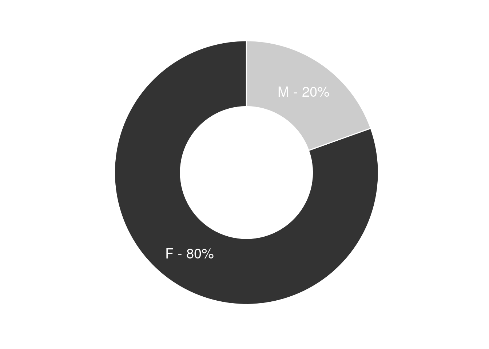{width=672}
:::

```{.r .cell-code}
gender.unmatched.summary |>
  filter(Population=="Percent.Cases") |>
  mutate(Label= paste0(GenderCode, " - ", round(Percent,0), "%")) |>
  select(Label,GenderCode,`Cushing's Disease`) |>
  ggplot(aes(x = 2, y = `Cushing's Disease`, fill = GenderCode)) +
  geom_col(width = 1, color = "white") +
  coord_polar(theta = "y", start = 0) +
  geom_text(aes(label = Label),
            position = position_stack(vjust = 0.5),
            color = "white", size = 5) +
  xlim(0.5, 2.5) +
  scale_fill_manual(values=color_scheme) +
  theme_classic(base_size = 16) +
  theme(
    axis.line = element_blank(),
    axis.text = element_blank(),
    axis.ticks = element_blank(),
    axis.title = element_blank(),
    legend.position = "none",
    plot.background = element_rect(fill = "transparent", colour = NA)
  ) 
```

::: {.cell-output-display}
{width=672}
:::

```{.r .cell-code}
gender.unmatched.summary |>
  ggplot(aes(y=Percent,
             x=reorder(as.factor(GenderCode),Percent),
             fill=Population)) +
  geom_bar(stat='identity',position="dodge") +
  theme_classic(base_size=16) +
  scale_fill_grey(labels=c("Cushing's Disease","Total Population")) +
  labs(y="Percent",x="",fill="") +
  theme(legend.position=c(0.15,0.95),
        legend.background = element_rect(fill = "transparent", colour = NA),
        legend.box.background = element_rect(fill = "transparent", colour = NA))
```

::: {.cell-output-display}
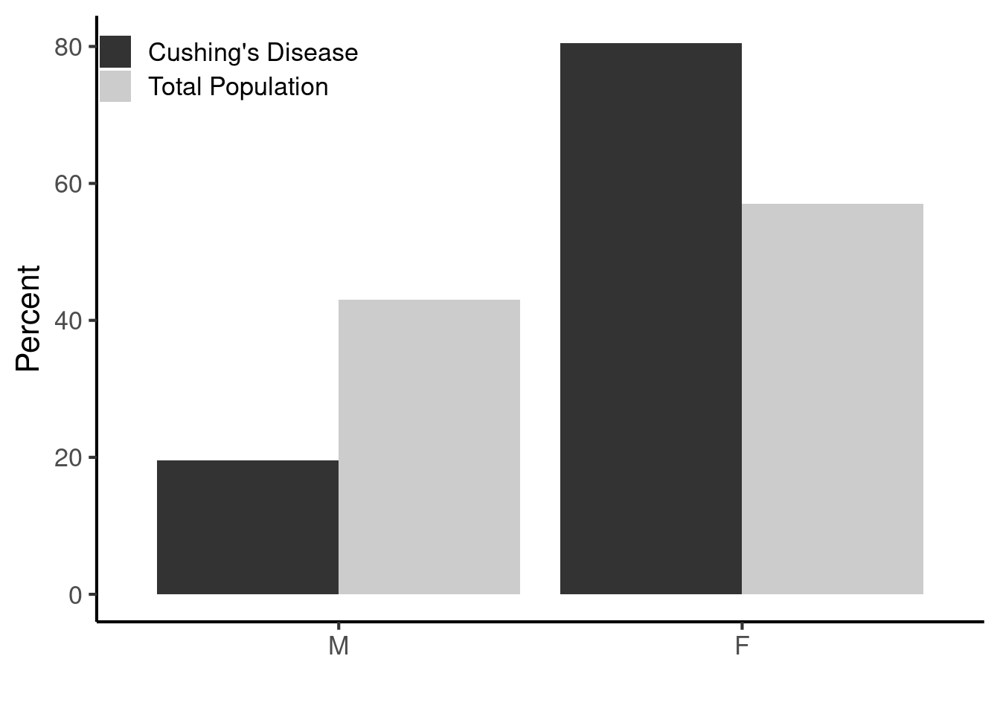{width=672}
:::

```{.r .cell-code}
gender.unmatched.summary |>
  ggplot(aes(y=Percent,
             x=reorder(as.factor(GenderCode),Percent),
             fill=Population)) +
  geom_bar(stat='identity',position="dodge") +
  theme_classic(base_size=16) +
  scale_fill_manual(labels=c("Cushing's Disease","Total Population"),values=color_scheme) +
  labs(y="Percent",x="",fill="") +
  theme(legend.position=c(0.15,0.95),
        legend.background = element_rect(fill = "transparent", colour = NA),
        legend.box.background = element_rect(fill = "transparent", colour = NA))
```

::: {.cell-output-display}
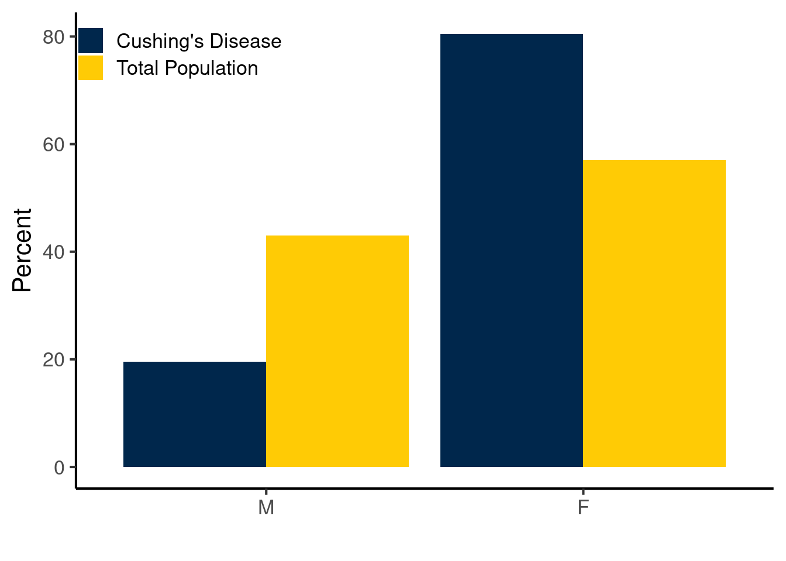{width=672}
:::
:::


- Prior to matching for Race and Ethnicity, we noted that participants with Cushing’s disease were more likely to identify as Non-Hispanic White (**87.2521246%** than the overall Michigan Medicine participant population (**75.6499646%** Non-Hispanic White, **p=5.5003748\times 10^{-7}**)
- Correspondingly, participants with Cushing’s disease were less likely to identify as Asian (**p=3.2806302\times 10^{-5}**) or Black. (**p=0.015338**).


::: {.cell}

```{.r .cell-code}
race.matching <- tibble(
  Race = c("White", "Black", "Asian","Hispanic or Latino"),
  `Total Population` = c(white.totals[2]/race.totals[2]*100,
                         black.totals[2]/race.totals[2]*100, 
                         asian.totals[2]/race.totals[2]*100,
                         hl.totals[2]/race.totals[2]*100),
  `Cushing's Disease` = c(white.totals[1]/race.totals[1]*100, 
              black.totals[1]/race.totals[1]*100, 
              asian.totals[1]/race.totals[1]*100,
              hl.totals[1]/race.totals[1]*100)) 

race.matching |>
  pivot_longer(cols=c(2:3), names_to = "Population", values_to = "Percent") |>
  mutate(Population=relevel(as.factor(Population),ref="Total Population")) |>
  ggplot(aes(y=Percent,
             x=reorder(as.factor(Race),-Percent),
             fill=Population)) +
  geom_bar(stat='identity',position="dodge") +
  theme_classic(base_size=16) +
  scale_fill_grey() +
  labs(y="Percent",x="",fill="") +
  theme(legend.position=c(0.75,0.75))
```

::: {.cell-output-display}
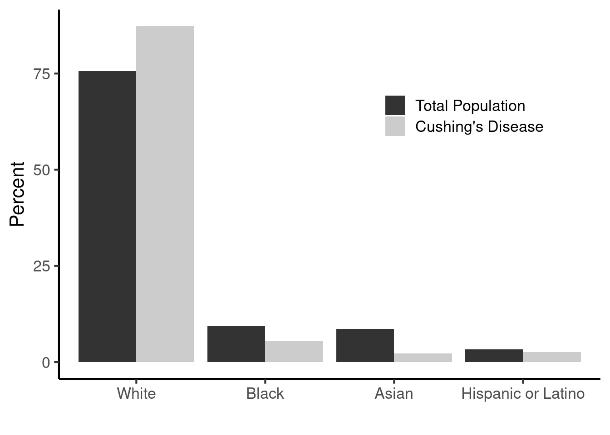{width=672}
:::

```{.r .cell-code}
race.matching |>
  pivot_longer(cols=c(2:3), names_to = "Population", values_to = "Percent") |>
  mutate(Population=relevel(as.factor(Population),ref="Total Population")) |>
  ggplot(aes(y=Percent,
             x=reorder(as.factor(Race),-Percent),
             fill=Population)) +
  geom_bar(stat='identity',position="dodge") +
  theme_classic(base_size=16) +
  scale_fill_manual(values=color_scheme) +
  labs(y="Percent",x="",fill="") +
  theme(legend.position=c(0.75,0.75))
```

::: {.cell-output-display}
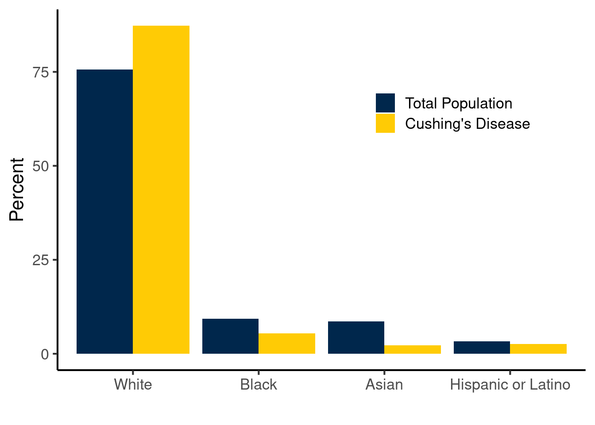{width=672}
:::
:::


- As we expected, participants with Cushing’s disease had a higher BMI than the controls, with **64.6239554**% of participants with Cushing’s disease having a BMI above 30 kg/m2, compared to only **39.8600458%** controls (p=**1.9950144\times 10^{-20}**).  


::: {.cell}

```{.r .cell-code}
totals.obesity |>
  mutate(Percent.Cases = Cases/Cases[Obesity=="Total"]*100,
         Percent.Controls = Controls/Controls[Obesity=="Total"]*100) |>
  pivot_longer(cols=starts_with('Percent'),
               names_to = 'Population',
               values_to = 'Percent') |>
  filter(Obesity!="Total") |>
  ggplot(aes(y=Percent,
             x=reorder(as.factor(Obesity),Percent),
             fill=Population)) +
  geom_bar(stat='identity',position="dodge") +
  theme_classic(base_size=16) +
  scale_fill_grey(labels=c("Cushing's Disease","Total Population")) +
  labs(y="Percent",x="",fill="") +
  theme(legend.position=c(0.15,0.95),
        legend.background = element_rect(fill = "transparent", colour = NA),
        legend.box.background = element_rect(fill = "transparent", colour = NA))
```

::: {.cell-output-display}
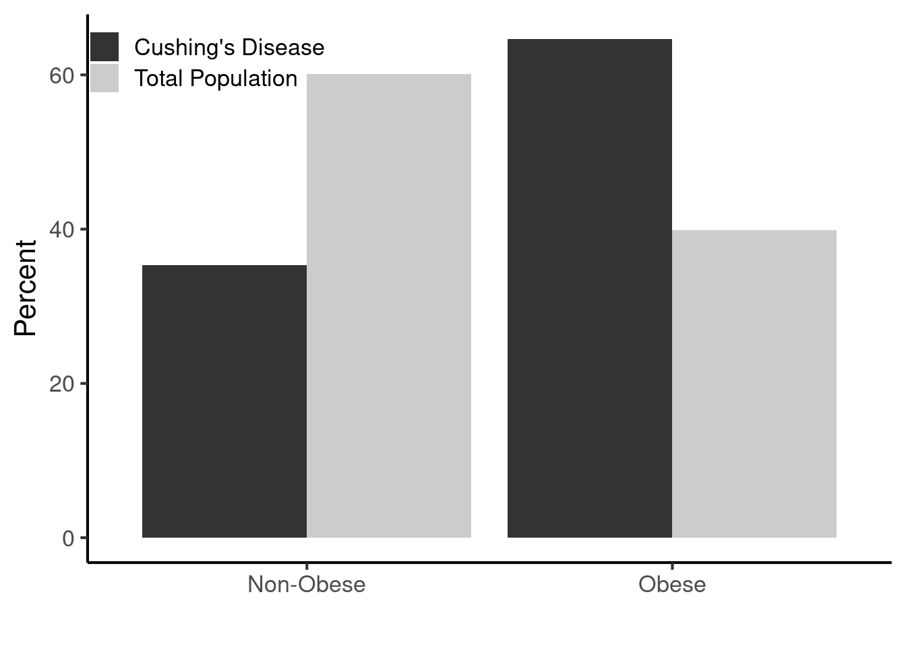{width=672}
:::

```{.r .cell-code}
totals.obesity |>
  mutate(Percent.Cases = Cases/Cases[Obesity=="Total"]*100,
         Percent.Controls = Controls/Controls[Obesity=="Total"]*100) |>
  pivot_longer(cols=starts_with('Percent'),
               names_to = 'Population',
               values_to = 'Percent') |>
  filter(Obesity!="Total") |>
  ggplot(aes(y=Percent,
             x=reorder(as.factor(Obesity),Percent),
             fill=Population)) +
  geom_bar(stat='identity',position="dodge") +
  theme_classic(base_size=16) +
  scale_fill_manual(labels=c("Cushing's Disease","Total Population"),values=color_scheme) +
  labs(y="Percent",x="",fill="") +
  theme(legend.position=c(0.15,0.95),
        legend.background = element_rect(fill = "transparent", colour = NA),
        legend.box.background = element_rect(fill = "transparent", colour = NA))
```

::: {.cell-output-display}
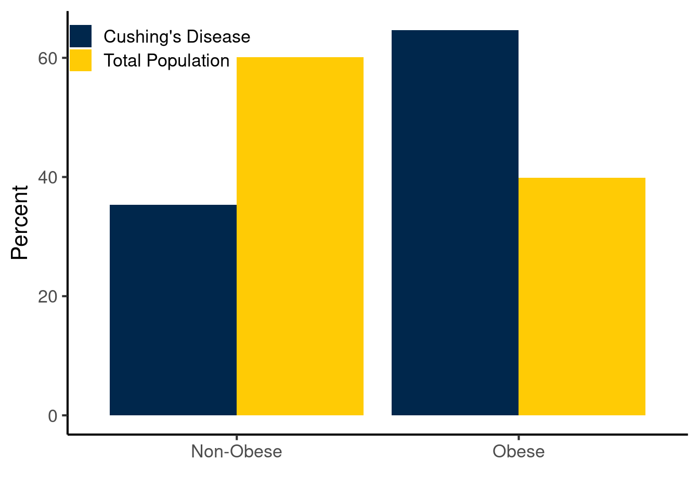{width=672}
:::
:::


#### Stratified Demographics for the Entire Population


::: {.cell}

```{.r .cell-code}
# first check for normality of Age and BMI
master.data |>
  group_by(Obesity,Cushings)|>
  summarize(Age = shapiro.test(sample(AgeInYears,3000,replace=T))$p.value,
            BMI = shapiro.test(sample(BMI,3000,replace=T))$p.value,
            n= length(Cushings)) -> master.data.dist

master.data.dist |>
  kable(caption="Shapiro-Wilk Tests for Distribution of Quantitative Variables",
        digits=c(1,1,99,99,1))|>
  kable_styling(full_width = FALSE, position = "center")
```

::: {.cell-output-display}

`````{=html}
<table class="table" style="width: auto !important; margin-left: auto; margin-right: auto;">
<caption>Shapiro-Wilk Tests for Distribution of Quantitative Variables</caption>
 <thead>
  <tr>
   <th style="text-align:left;"> Obesity </th>
   <th style="text-align:right;"> Cushings </th>
   <th style="text-align:right;"> Age </th>
   <th style="text-align:right;"> BMI </th>
   <th style="text-align:right;"> n </th>
  </tr>
 </thead>
<tbody>
  <tr>
   <td style="text-align:left;"> Non-Obese </td>
   <td style="text-align:right;"> 0 </td>
   <td style="text-align:right;"> 1.163841e-31 </td>
   <td style="text-align:right;"> 3.203758e-22 </td>
   <td style="text-align:right;"> 4469 </td>
  </tr>
  <tr>
   <td style="text-align:left;"> Non-Obese </td>
   <td style="text-align:right;"> 1 </td>
   <td style="text-align:right;"> 1.595271e-18 </td>
   <td style="text-align:right;"> 7.304873e-37 </td>
   <td style="text-align:right;"> 127 </td>
  </tr>
  <tr>
   <td style="text-align:left;"> Obese </td>
   <td style="text-align:right;"> 0 </td>
   <td style="text-align:right;"> 4.212054e-25 </td>
   <td style="text-align:right;"> 2.145011e-44 </td>
   <td style="text-align:right;"> 2962 </td>
  </tr>
  <tr>
   <td style="text-align:left;"> Obese </td>
   <td style="text-align:right;"> 1 </td>
   <td style="text-align:right;"> 1.170558e-15 </td>
   <td style="text-align:right;"> 3.662728e-72 </td>
   <td style="text-align:right;"> 232 </td>
  </tr>
</tbody>
</table>

`````

:::

```{.r .cell-code}
#kruskal wallis testst since they are not normally distributed

master.quant.kw <-
  master.data |> 
  mutate(ObesityCushings=paste0(Obesity,Cushings)) |>
  summarize(BMI.kw=kruskal.test(BMI~ObesityCushings)$p.value,
            Age.kw=kruskal.test(AgeInYears~ObesityCushings)$p.value)

master.2x2.quant.summary <- 
  master.data |>
  group_by(Obesity, Cushings) |>
  summarize_at(.vars = c('AgeInYears', 'BMI'),
               .funs = list(mean = mean, sd = sd,n=length)) |>
  mutate(Age = paste0(round(AgeInYears_mean, 2), " +/- ", round(AgeInYears_sd, 2)),
         BMI = paste0(round(BMI_mean, 2), " +/- ", round(BMI_sd, 2)),
         n = as.character(BMI_n)) |>
  select(Obesity, Cushings, BMI, Age,n) |>
  ungroup() |>
  pivot_longer(
    cols = c(n, BMI, Age),
    names_to = "Variable",
    values_to = "Value"
  ) %>%
  # Create group column combining Obesity and Cushings
  mutate(group = paste(Obesity, Cushings, sep = "_")) %>%
  # Pivot wider to spread group into columns, keeping Variable as row identifier
  pivot_wider(
    id_cols = Variable,  # Explicitly specify Variable as the row identifier
    names_from = group,
    values_from = Value,
    names_sort = TRUE
  ) |>
  mutate(p.value=c(NA,as.numeric(master.quant.kw))) |>
  rename("Control, BMI < 30"=`Non-Obese_0`,
         "Cushing's, BMI < 30"=`Non-Obese_1`,
         "Control, BMI > 30" = `Obese_0`,
         "Cushing's, BMI > 30" = Obese_1)


# Create the group column (replacing hyphen with underscore for clean column names)
master.data <- master.data %>%
  mutate(group = paste(gsub("-", "_", Obesity), Cushings, sep = "_"))

# Define the categorical variables to iterate over
cat_vars <- c("GenderName", "RaceEthnicity")

# Initialize an empty list to store tables for each variable
master.tables_list <- list()

# Loop over each categorical variable
for (var in cat_vars) {
  # Compute counts
  counts_df <- master.data %>%
    group_by(!!sym(var), group) %>%
    summarise(count = n(), .groups = "drop") %>%
    # Pivot to wide format
    pivot_wider(
      names_from = group,
      values_from = count,
      values_fill = 0,
      names_sort = TRUE
    ) %>%
    rename(Variable = !!sym(var))

  # Calculate group-wise (column-wise) percentages
  counts_df <- counts_df %>%
    mutate(across(c(Non_Obese_0, Non_Obese_1, Obese_0, Obese_1),
                  ~ sprintf("%d (%.1f%%)", .x, .x / sum(.x, na.rm = TRUE) * 100),
                  .names = "{.col}"))

  # Calculate total count for sorting (sum of numeric part of formatted strings)
  counts_df <- counts_df %>%
    mutate(total_count = rowSums(
      sapply(select(., Non_Obese_0, Non_Obese_1, Obese_0, Obese_1),
             function(x) as.numeric(gsub(" .*", "", x)))
    )) %>%
    # Sort by total count in descending order
    arrange(desc(total_count)) %>%
    # Select desired columns
    select(Variable, Non_Obese_0, Non_Obese_1, Obese_0, Obese_1)

  # Compute chi-squared test p-value
  cont_table <- table(master.data[[var]], master.data$group)
  chi_test <- chisq.test(cont_table)
  p_val <- chi_test$p.value

  # Add p-value to the first row
  counts_df <- counts_df %>%
    mutate(p.value = if_else(row_number() == 1, p_val, NA_real_))

  # Add to list
  master.tables_list[[var]] <- counts_df
}


# Combine all variable tables into one
master.2x2.counts.table <- bind_rows(master.tables_list) |>
  rename("Control, BMI < 30"=`Non_Obese_0`,
         "Cushing's, BMI < 30"=`Non_Obese_1`,
         "Control, BMI > 30" = `Obese_0`,
         "Cushing's, BMI > 30" = Obese_1)
  
master.2x2.table <-
  bind_rows(master.2x2.quant.summary,
            master.2x2.counts.table) 

kable(master.2x2.table,
      caption="Summary of stratified variables") |>
  kable_styling(full_width = FALSE, position = "center")
```

::: {.cell-output-display}

`````{=html}
<table class="table" style="width: auto !important; margin-left: auto; margin-right: auto;">
<caption>Summary of stratified variables</caption>
 <thead>
  <tr>
   <th style="text-align:left;"> Variable </th>
   <th style="text-align:left;"> Control, BMI &lt; 30 </th>
   <th style="text-align:left;"> Cushing's, BMI &lt; 30 </th>
   <th style="text-align:left;"> Control, BMI &gt; 30 </th>
   <th style="text-align:left;"> Cushing's, BMI &gt; 30 </th>
   <th style="text-align:right;"> p.value </th>
  </tr>
 </thead>
<tbody>
  <tr>
   <td style="text-align:left;"> n </td>
   <td style="text-align:left;"> 4469 </td>
   <td style="text-align:left;"> 127 </td>
   <td style="text-align:left;"> 2962 </td>
   <td style="text-align:left;"> 232 </td>
   <td style="text-align:right;"> NA </td>
  </tr>
  <tr>
   <td style="text-align:left;"> BMI </td>
   <td style="text-align:left;"> 24.47 +/- 3.26 </td>
   <td style="text-align:left;"> 25.91 +/- 3.16 </td>
   <td style="text-align:left;"> 36.67 +/- 6.02 </td>
   <td style="text-align:left;"> 39.54 +/- 14.92 </td>
   <td style="text-align:right;"> 0.0000000 </td>
  </tr>
  <tr>
   <td style="text-align:left;"> Age </td>
   <td style="text-align:left;"> 44.04 +/- 16.38 </td>
   <td style="text-align:left;"> 46.8 +/- 17.27 </td>
   <td style="text-align:left;"> 45.74 +/- 14.65 </td>
   <td style="text-align:left;"> 45.97 +/- 14.52 </td>
   <td style="text-align:right;"> 0.0001460 </td>
  </tr>
  <tr>
   <td style="text-align:left;"> Female </td>
   <td style="text-align:left;"> 3655 (81.8%) </td>
   <td style="text-align:left;"> 92 (72.4%) </td>
   <td style="text-align:left;"> 2424 (81.8%) </td>
   <td style="text-align:left;"> 195 (84.1%) </td>
   <td style="text-align:right;"> 0.0419747 </td>
  </tr>
  <tr>
   <td style="text-align:left;"> Male </td>
   <td style="text-align:left;"> 814 (18.2%) </td>
   <td style="text-align:left;"> 35 (27.6%) </td>
   <td style="text-align:left;"> 538 (18.2%) </td>
   <td style="text-align:left;"> 37 (15.9%) </td>
   <td style="text-align:right;"> NA </td>
  </tr>
  <tr>
   <td style="text-align:left;"> White </td>
   <td style="text-align:left;"> 3850 (86.1%) </td>
   <td style="text-align:left;"> 105 (82.7%) </td>
   <td style="text-align:left;"> 2533 (85.5%) </td>
   <td style="text-align:left;"> 208 (89.7%) </td>
   <td style="text-align:right;"> 0.0000000 </td>
  </tr>
  <tr>
   <td style="text-align:left;"> Black </td>
   <td style="text-align:left;"> 168 (3.8%) </td>
   <td style="text-align:left;"> 7 (5.5%) </td>
   <td style="text-align:left;"> 204 (6.9%) </td>
   <td style="text-align:left;"> 12 (5.2%) </td>
   <td style="text-align:right;"> NA </td>
  </tr>
  <tr>
   <td style="text-align:left;"> Hispanic or Latino </td>
   <td style="text-align:left;"> 200 (4.5%) </td>
   <td style="text-align:left;"> 6 (4.7%) </td>
   <td style="text-align:left;"> 154 (5.2%) </td>
   <td style="text-align:left;"> 4 (1.7%) </td>
   <td style="text-align:right;"> NA </td>
  </tr>
  <tr>
   <td style="text-align:left;"> Other </td>
   <td style="text-align:left;"> 120 (2.7%) </td>
   <td style="text-align:left;"> 3 (2.4%) </td>
   <td style="text-align:left;"> 54 (1.8%) </td>
   <td style="text-align:left;"> 6 (2.6%) </td>
   <td style="text-align:right;"> NA </td>
  </tr>
  <tr>
   <td style="text-align:left;"> Asian </td>
   <td style="text-align:left;"> 131 (2.9%) </td>
   <td style="text-align:left;"> 6 (4.7%) </td>
   <td style="text-align:left;"> 17 (0.6%) </td>
   <td style="text-align:left;"> 2 (0.9%) </td>
   <td style="text-align:right;"> NA </td>
  </tr>
</tbody>
</table>

`````

:::

```{.r .cell-code}
master.2x2.table |> write_csv(na="",file="Stratified Demographic Summary - Master Sample.csv")
```
:::

::: {.cell}

```{.r .cell-code}
master.data |>
  mutate(Obesity = fct_recode(Obesity, "NonObese"="Non-Obese")) |>
  tabyl(GenderName, Obesity, Cushings)  -> matched.table.gender

master.data |>
  mutate(Obesity = fct_recode(Obesity, "NonObese"="Non-Obese")) |>
  tabyl(RaceEthnicity, Obesity, Cushings)  -> matched.table.raceethnicity

matched.table.raceethnicity[[2]] |>
  adorn_totals() |>
  mutate(Pct=NonObese/(Obese+NonObese)*100)-> matched.table.raceethnicity.cushings

matched.table.raceethnicity.cushings |> filter(RaceEthnicity=="Asian") |> select(Obese,NonObese) -> matched.asian.cushings

matched.table.raceethnicity.cushings |> filter(RaceEthnicity=="Hispanic or Latino") |> select(Obese,NonObese) -> matched.hl.cushings

matched.table.raceethnicity.cushings |> filter(RaceEthnicity=="Total") |> select(Obese,NonObese) -> matched.total.cushings

matched.nonasian.cushings <- matched.total.cushings - matched.asian.cushings

matched.nonhl.cushings <- matched.total.cushings - matched.hl.cushings
```
:::


Details specified in the manuscript:

- For example, among participants with a $BMI > 30 mg/m^2$, participants with Cushing’s disease had a higher BMI than controls (p=5.426642\times 10^{-4}).


::: {.cell}

```{.r .cell-code}
master.data |>
  group_by(Cushings,Obesity) |>
  summarize(BMI.mean = mean(BMI,na.rm=T),
            BMI.se = se(BMI),
            BMI.n = length(!is.na(BMI))) -> matched.bmi.summary

matched.bmi.summary |>
  ggplot(aes(x=Obesity,
             y=BMI.mean,
             fill=as.factor(Cushings))) +
  geom_bar(stat='identity',position = position_dodge(width = 0.9)) +
  geom_errorbar(aes(ymin=BMI.mean - BMI.se,
                    ymax=BMI.mean + BMI.se),
                position = position_dodge(width = 0.9),
                width = 0.5) +
  theme_classic(base_size=16) +
  scale_fill_grey(name="",labels=c("Control","Cushing's Disease")) +
  labs(y="BMI (kg/m2)",x="")
```

::: {.cell-output-display}
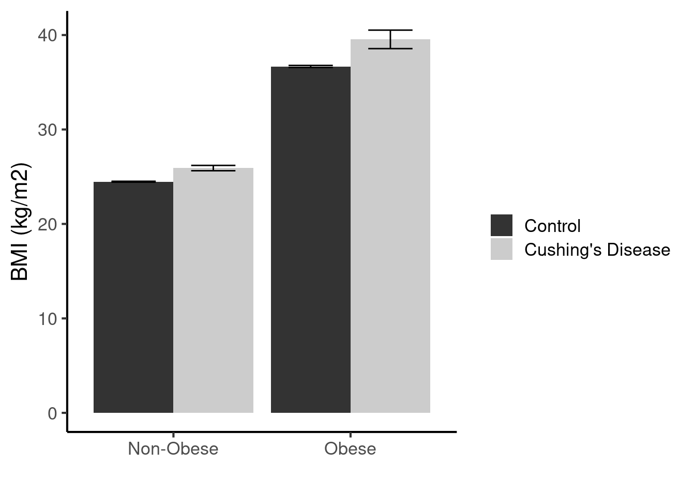{width=672}
:::

```{.r .cell-code}
matched.bmi.summary |>
  ggplot(aes(x=Obesity,
             y=BMI.mean,
             fill=as.factor(Cushings))) +
  geom_bar(stat='identity',position = position_dodge(width = 0.9)) +
  geom_errorbar(aes(ymin=BMI.mean - BMI.se,
                    ymax=BMI.mean + BMI.se),
                position = position_dodge(width = 0.9),
                width = 0.5) +
  theme_classic(base_size=16) +
  scale_fill_manual(name="",labels=c("Control","Cushing's Disease"),values = color_scheme) +
  labs(y="BMI (kg/m2)",x="")
```

::: {.cell-output-display}
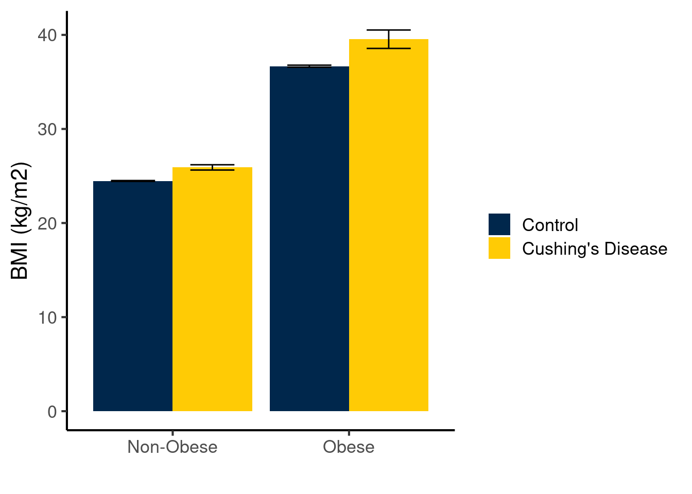{width=672}
:::
:::


- Females with Cushing’s disease were more likely to have a BMI over 30 kg/m2 (67.9442509% of females with Cushing's disease had a $BMI>30$) than males (51.3888889%), p=0.0128071).  


::: {.cell}

```{.r .cell-code}
matched.table.gender[[2]] |> 
  mutate(Pct = Obese/(NonObese+Obese)*100) |>
  ggplot(aes(x=GenderName,
             y=Pct,
             fill=GenderName)) +
  geom_bar(stat='identity') +
  theme_classic(base_size=16) +
  scale_fill_grey(name="") +
  labs(y="Percent with BMI > 30 kg/m2",x="") +
  theme(legend.position="none")
```

::: {.cell-output-display}
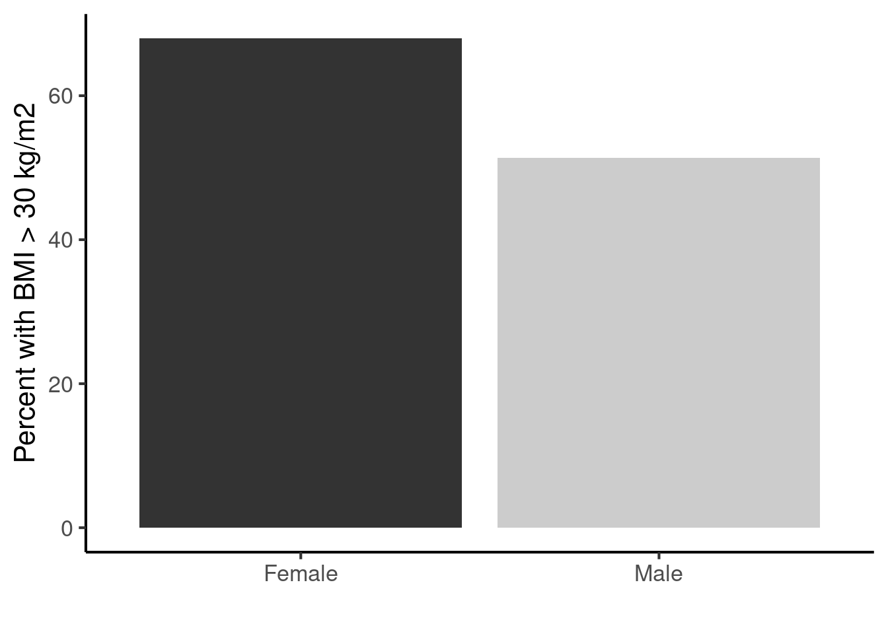{width=672}
:::

```{.r .cell-code}
matched.table.gender[[2]] |> 
  mutate(Pct = Obese/(NonObese+Obese)*100) |>
  ggplot(aes(x=GenderName,
             y=Pct,
             fill=GenderName)) +
  geom_bar(stat='identity') +
  theme_classic(base_size=16) +
  scale_fill_manual(name="",values = color_scheme)  +
  labs(y="Percent with BMI > 30 kg/m2",x="") +
  theme(legend.position="none")
```

::: {.cell-output-display}
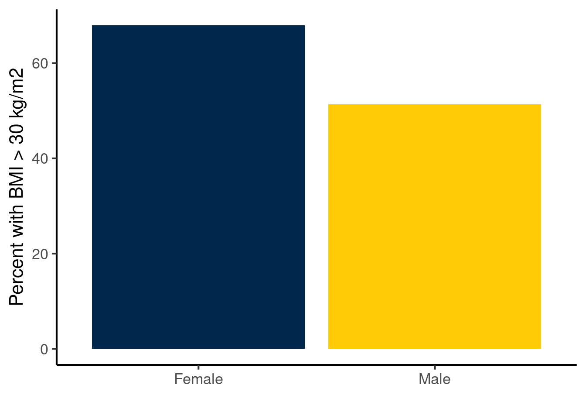{width=672}
:::
:::


- Among participants with Cushing’s disease, Asian (75%) and Hispanic or Latino (60%) participants were more likely have a BMI  under 30 kg/m2 compared to the overall average (35.3760446%, p=0.025386 and 0.175616 respectively).
- The average age of participants with Cushing’s disease with or without obesity was similar.


### Hba1c


::: {.cell}

```{.r .cell-code}
m.out.a1c <- matchit(Cushings ~ AgeInYears + GenderCode + RaceEthnicity, 
                 data = complete.data |> filter(RESULT_CODE %in% c("A1C", "XXA1C", "A1C EX", "X0022")), 
                 method = "nearest", 
                 exact = c("GenderCode", "RaceEthnicity"),# Force exact matches
                 ratio=fold) 

summary(m.out.a1c, standardize = TRUE)  # Balance statistics[5]
```

::: {.cell-output .cell-output-stdout}

```

Call:
matchit(formula = Cushings ~ AgeInYears + GenderCode + RaceEthnicity, 
    data = filter(complete.data, RESULT_CODE %in% c("A1C", "XXA1C", 
        "A1C EX", "X0022")), method = "nearest", exact = c("GenderCode", 
        "RaceEthnicity"), ratio = fold)

Summary of Balance for All Data:
                                Means Treated Means Control Std. Mean Diff.
distance                               0.0007        0.0003          0.7918
AgeInYears                            46.8000       58.8301         -0.8267
GenderCodeF                            0.8000        0.5533          0.6167
GenderCodeM                            0.2000        0.4467         -0.6167
RaceEthnicityAsian                     0.0000        0.0964         -0.3267
RaceEthnicityBlack                     0.0500        0.0959         -0.2107
RaceEthnicityHispanic or Latino        0.0500        0.0322          0.0817
RaceEthnicityOther                     0.0000        0.0331         -0.1850
RaceEthnicityWhite                     0.9000        0.7424          0.5254
                                Var. Ratio eCDF Mean eCDF Max
distance                            2.2566    0.2015   0.4956
AgeInYears                          0.8735    0.1676   0.3667
GenderCodeF                              .    0.2467   0.2467
GenderCodeM                              .    0.2467   0.2467
RaceEthnicityAsian                       .    0.0964   0.0964
RaceEthnicityBlack                       .    0.0459   0.0459
RaceEthnicityHispanic or Latino          .    0.0178   0.0178
RaceEthnicityOther                       .    0.0331   0.0331
RaceEthnicityWhite                       .    0.1576   0.1576

Summary of Balance for Matched Data:
                                Means Treated Means Control Std. Mean Diff.
distance                               0.0007        0.0007         -0.0003
AgeInYears                            46.8000       46.7950          0.0003
GenderCodeF                            0.8000        0.8000          0.0000
GenderCodeM                            0.2000        0.2000          0.0000
RaceEthnicityAsian                     0.0000        0.0000          0.0000
RaceEthnicityBlack                     0.0500        0.0500          0.0000
RaceEthnicityHispanic or Latino        0.0500        0.0500          0.0000
RaceEthnicityOther                     0.0000        0.0000          0.0000
RaceEthnicityWhite                     0.9000        0.9000          0.0000
                                Var. Ratio eCDF Mean eCDF Max Std. Pair Dist.
distance                            1.0475    0.0002     0.02          0.0016
AgeInYears                          1.0461    0.0005     0.02          0.0024
GenderCodeF                              .    0.0000     0.00          0.0000
GenderCodeM                              .    0.0000     0.00          0.0000
RaceEthnicityAsian                       .    0.0000     0.00          0.0000
RaceEthnicityBlack                       .    0.0000     0.00          0.0000
RaceEthnicityHispanic or Latino          .    0.0000     0.00          0.0000
RaceEthnicityOther                       .    0.0000     0.00          0.0000
RaceEthnicityWhite                       .    0.0000     0.00          0.0000

Sample Sizes:
          Control Treated
All         72884      20
Matched       200      20
Unmatched   72684       0
Discarded       0       0
```


:::

```{.r .cell-code}
plot(m.out.a1c, type = "jitter")         # Propensity score distribution[5]
```

::: {.cell-output-display}
{width=672}
:::

::: {.cell-output .cell-output-stdout}

```
To identify the units, use first mouse button; to stop, use second.
```


:::

```{.r .cell-code}
matched_data.a1c <- match.data(m.out.a1c)

hba1c.data <- 
  matched_data.a1c |>
  mutate(value = as.numeric(VALUE)) %>% #forced into numeric form  
  arrange(desc(DeID_AdmitDate)) %>% #sort by date
  distinct(DeID_PatientID,.keep_all = T) %>% #unique cases
  mutate(Obesity = if_else(BMI>30, "Obese","Non-Obese"))  |>
  mutate(ObesityIII = if_else(BMI>40, "Class III Obese","All Others"))  |>
  filter(!is.na(Obesity)) 
```
:::


#### Demographics of Participants with HbA1c Values


::: {.cell}

```{.r .cell-code}
hba1c.summary.gender <-
  hba1c.data |>
  tabyl(GenderName,Cushings) |>
  adorn_percentages("col") %>%
  adorn_pct_formatting(digits = 2) %>%
  adorn_ns(position = "front") %>%
  mutate(across(starts_with("."), ~ paste0(.x))) %>%
  mutate(across(starts_with("."), ~ gsub("(.+)% \\((.+)\\)", "\\2 (\\1%)", .x))) |>
  rename(Controls=`0`,
         `Cushing's`=`1`,
         Group=GenderName)|>
  mutate(Cushings_count = as.numeric(str_extract(`Cushing's`, "^\\d+"))) |>
  arrange(desc(Cushings_count)) |>
  select(-Cushings_count)

hba1c.summary.race.ethnicity <-
  hba1c.data |>
  tabyl(RaceEthnicity,Cushings) |>
  adorn_percentages("col") %>%
  adorn_pct_formatting(digits = 2) %>%
  adorn_ns(position = "front") %>%
  mutate(across(starts_with("."), ~ paste0(.x))) %>%
  mutate(across(starts_with("."), ~ gsub("(.+)% \\((.+)\\)", "\\2 (\\1%)", .x))) |>
  rename(Controls=`0`,
         `Cushing's`=`1`,
         Group=RaceEthnicity) |>
  mutate(Cushings_count = as.numeric(str_extract(`Cushing's`, "^\\d+"))) |>
  arrange(desc(Cushings_count)) |>
  select(-Cushings_count)

hba1c.summary.quant <-
  hba1c.data |>
  group_by(Cushings) %>%
  summarise(
    Age_Mean = mean(AgeInYears, na.rm = TRUE),
    Age_SD = sd(AgeInYears),
    BMI_Mean = mean(BMI, na.rm = TRUE),
    BMI_SD = sd(BMI)
  ) %>%
  mutate(
    Age = sprintf("%.2f ± %.2f", Age_Mean, Age_SD),
    BMI = sprintf("%.2f ± %.2f", BMI_Mean, BMI_SD)
  ) %>%
  select(Cushings, Age, BMI)  |>
  pivot_longer(cols=c('Age','BMI')) |>
  pivot_wider(names_from=Cushings) |>
  rename(Controls=`0`,
         `Cushing's`=`1`,
         Group=name)


hba1c.summary.table <-
  bind_rows(hba1c.summary.quant,
          hba1c.summary.gender,
          hba1c.summary.race.ethnicity)

hba1c.summary.table |>
  kable(caption="Demographic Summary for HbA1c List") |>
  kable_styling(full_width = FALSE, position = "center")
```

::: {.cell-output-display}

`````{=html}
<table class="table" style="width: auto !important; margin-left: auto; margin-right: auto;">
<caption>Demographic Summary for HbA1c List</caption>
 <thead>
  <tr>
   <th style="text-align:left;"> Group </th>
   <th style="text-align:left;"> Controls </th>
   <th style="text-align:left;"> Cushing's </th>
  </tr>
 </thead>
<tbody>
  <tr>
   <td style="text-align:left;"> Age </td>
   <td style="text-align:left;"> 47.30 ± 14.10 </td>
   <td style="text-align:left;"> 48.06 ± 15.15 </td>
  </tr>
  <tr>
   <td style="text-align:left;"> BMI </td>
   <td style="text-align:left;"> 31.01 ± 8.40 </td>
   <td style="text-align:left;"> 38.83 ± 11.35 </td>
  </tr>
  <tr>
   <td style="text-align:left;"> Female </td>
   <td style="text-align:left;"> 140 (78.65%) </td>
   <td style="text-align:left;"> 14 (82.35%) </td>
  </tr>
  <tr>
   <td style="text-align:left;"> Male </td>
   <td style="text-align:left;"> 38 (21.35%) </td>
   <td style="text-align:left;"> 3 (17.65%) </td>
  </tr>
  <tr>
   <td style="text-align:left;"> White </td>
   <td style="text-align:left;"> 162 (91.01%) </td>
   <td style="text-align:left;"> 15 (88.24%) </td>
  </tr>
  <tr>
   <td style="text-align:left;"> Black </td>
   <td style="text-align:left;"> 7  (3.93%) </td>
   <td style="text-align:left;"> 1  (5.88%) </td>
  </tr>
  <tr>
   <td style="text-align:left;"> Hispanic or Latino </td>
   <td style="text-align:left;"> 9  (5.06%) </td>
   <td style="text-align:left;"> 1  (5.88%) </td>
  </tr>
</tbody>
</table>

`````

:::

```{.r .cell-code}
write_csv(hba1c.summary.table,"Demographic Summary - HbA1c Sample.csv")

#statistics for BMI
hba1c.data |>
  group_by(Cushings) |>
  summarize(shapiro.p=shapiro.test(sample(BMI,3000,replace=T))$p.value) |>
  kable(caption="Shapiro Wilk test for BMI for HbA1c sample", digits=c(1,99)) |>
  kable_styling(full_width = FALSE, position = "center")
```

::: {.cell-output-display}

`````{=html}
<table class="table" style="width: auto !important; margin-left: auto; margin-right: auto;">
<caption>Shapiro Wilk test for BMI for HbA1c sample</caption>
 <thead>
  <tr>
   <th style="text-align:right;"> Cushings </th>
   <th style="text-align:right;"> shapiro.p </th>
  </tr>
 </thead>
<tbody>
  <tr>
   <td style="text-align:right;"> 0 </td>
   <td style="text-align:right;"> 7.815754e-39 </td>
  </tr>
  <tr>
   <td style="text-align:right;"> 1 </td>
   <td style="text-align:right;"> 3.267116e-29 </td>
  </tr>
</tbody>
</table>

`````

:::

```{.r .cell-code}
wilcox.test(BMI~Cushings,hba1c.data) |>
  tidy() |>
  kable(caption="Mann Whitney test for effect of Cushing's on BMI for HbA1c sample",
        digits=c(1,99,1,1)) |>
  kable_styling(full_width = FALSE, position = "center")
```

::: {.cell-output-display}

`````{=html}
<table class="table" style="width: auto !important; margin-left: auto; margin-right: auto;">
<caption>Mann Whitney test for effect of Cushing's on BMI for HbA1c sample</caption>
 <thead>
  <tr>
   <th style="text-align:right;"> statistic </th>
   <th style="text-align:right;"> p.value </th>
   <th style="text-align:left;"> method </th>
   <th style="text-align:left;"> alternative </th>
  </tr>
 </thead>
<tbody>
  <tr>
   <td style="text-align:right;"> 874 </td>
   <td style="text-align:right;"> 0.004078438 </td>
   <td style="text-align:left;"> Wilcoxon rank sum test with continuity correction </td>
   <td style="text-align:left;"> two.sided </td>
  </tr>
</tbody>
</table>

`````

:::

```{.r .cell-code}
chisq.test(x=as.numeric(separate(hba1c.summary.gender, `Cushing's`, sep=" ", into=c("n","Pct")) |>
                          pull(n)),p=c(0.5,0.5)) |>
  tidy() |>
  kable(caption="Chi-squared test for equal proportions of males and females in the HbA1c sample",
        digits=c(1,99,1,1)) |>
  kable_styling(full_width = FALSE, position = "center")
```

::: {.cell-output-display}

`````{=html}
<table class="table" style="width: auto !important; margin-left: auto; margin-right: auto;">
<caption>Chi-squared test for equal proportions of males and females in the HbA1c sample</caption>
 <thead>
  <tr>
   <th style="text-align:right;"> statistic </th>
   <th style="text-align:right;"> p.value </th>
   <th style="text-align:right;"> parameter </th>
   <th style="text-align:left;"> method </th>
  </tr>
 </thead>
<tbody>
  <tr>
   <td style="text-align:right;"> 7.1 </td>
   <td style="text-align:right;"> 0.007632882 </td>
   <td style="text-align:right;"> 1 </td>
   <td style="text-align:left;"> Chi-squared test for given probabilities </td>
  </tr>
</tbody>
</table>

`````

:::
:::

::: {.cell}

```{.r .cell-code}
hba1c.summary <-
  hba1c.data %>%
  group_by(Cushings,Obesity) |>
  summarize(mean=mean(value,na.rm=T),
            se=se(value),
            sd=sd(value,na.rm=T),
            n=length(value))

hba1c.summary.iii <-
  hba1c.data %>%
  group_by(Cushings,ObesityIII) |>
  summarize(mean=mean(value,na.rm=T),
            se=se(value),
            sd=sd(value,na.rm=T),
            n=length(value))

library(ggplot2)
ggplot(hba1c.summary,
       aes(y=mean,
           ymin=mean- se,
           ymax=mean+ se,
           x=Obesity,
           fill=as.factor(Cushings))) +
  geom_col(position = position_dodge(width = 0.9)) +
  geom_errorbar(
    position = position_dodge(width = 0.9), # must match geom_col
    width = 0.5
  ) +
  scale_fill_grey(labels=c("Controls","Cases"),name="") +
  labs(y="Hba1c (Percent)",x="") +
  theme_classic(base_size=16) +
  theme(legend.position=c(0.1,0.9))
```

::: {.cell-output-display}
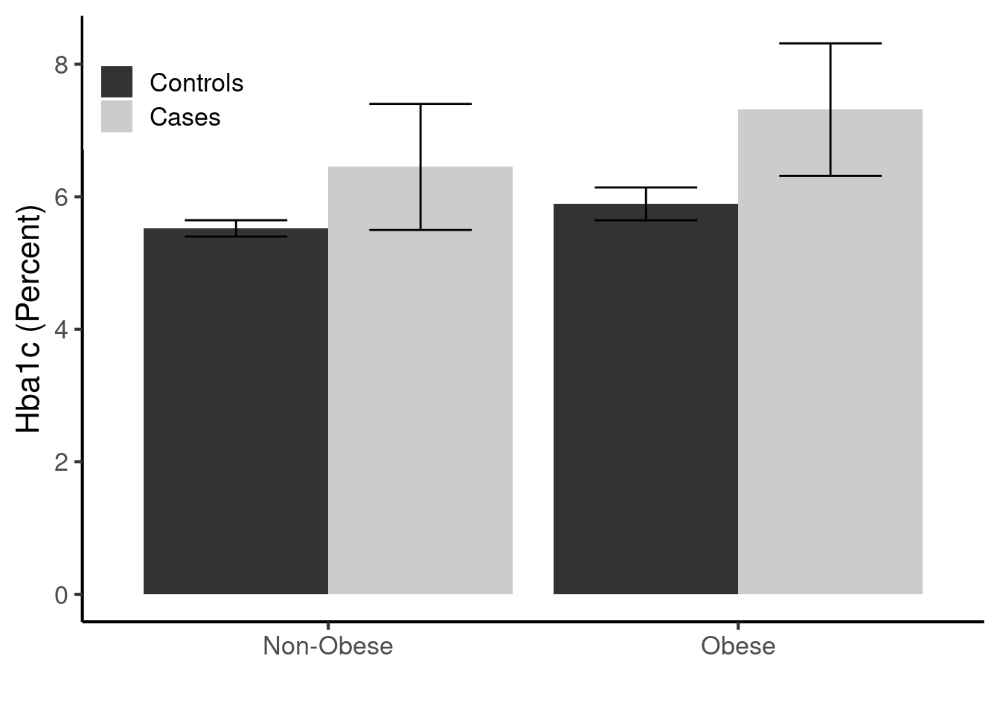{width=672}
:::

```{.r .cell-code}
ggplot(hba1c.summary,
       aes(y=mean,
           ymin=mean- se,
           ymax=mean+ se,
           x=Obesity,
           fill=as.factor(Cushings))) +
  geom_col(position = position_dodge(width = 0.9)) +
  geom_errorbar(
    position = position_dodge(width = 0.9), # must match geom_col
    width = 0.5
  ) +
  scale_fill_manual(labels=c("Controls","Cases"),name="",values=color_scheme) +
  labs(y="Hba1c (Percent)",x="") +
  theme_classic(base_size=16) +
  theme(legend.position=c(0.1,0.9))
```

::: {.cell-output-display}
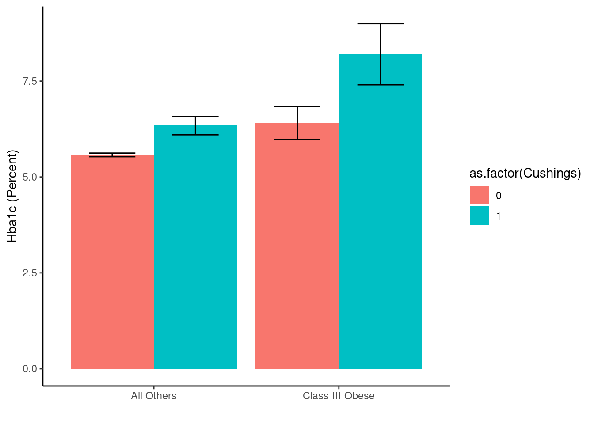{width=672}
:::

```{.r .cell-code}
ggplot(hba1c.summary.iii,
       aes(y=mean,
           ymin=mean- se,
           ymax=mean+ se,
           x=ObesityIII,
           fill=as.factor(Cushings))) +
  geom_col(position = position_dodge(width = 0.9)) +
  geom_errorbar(
    position = position_dodge(width = 0.9), # must match geom_col
    width = 0.5
  ) +
  labs(y="Hba1c (Percent)",x="") +
  theme_classic(base_size=16) +
  scale_fill_grey() +
  theme(legend.position="none")
```

::: {.cell-output-display}
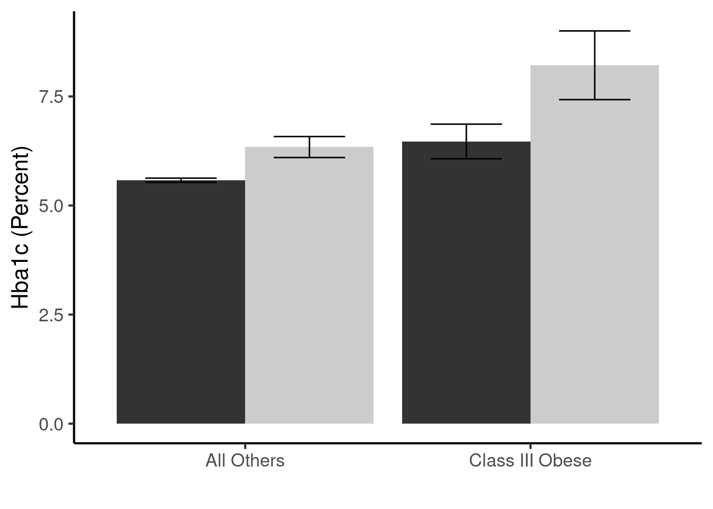{width=672}
:::

```{.r .cell-code}
ggplot(hba1c.summary.iii,
       aes(y=mean,
           ymin=mean- se,
           ymax=mean+ se,
           x=ObesityIII,
           fill=as.factor(Cushings))) +
  geom_col(position = position_dodge(width = 0.9)) +
  geom_errorbar(
    position = position_dodge(width = 0.9), # must match geom_col
    width = 0.5
  ) +
  labs(y="Hba1c (Percent)",x="") +
  theme_classic(base_size=16) +
  scale_fill_manual(values=color_scheme) +
  theme(legend.position="none")
```

::: {.cell-output-display}
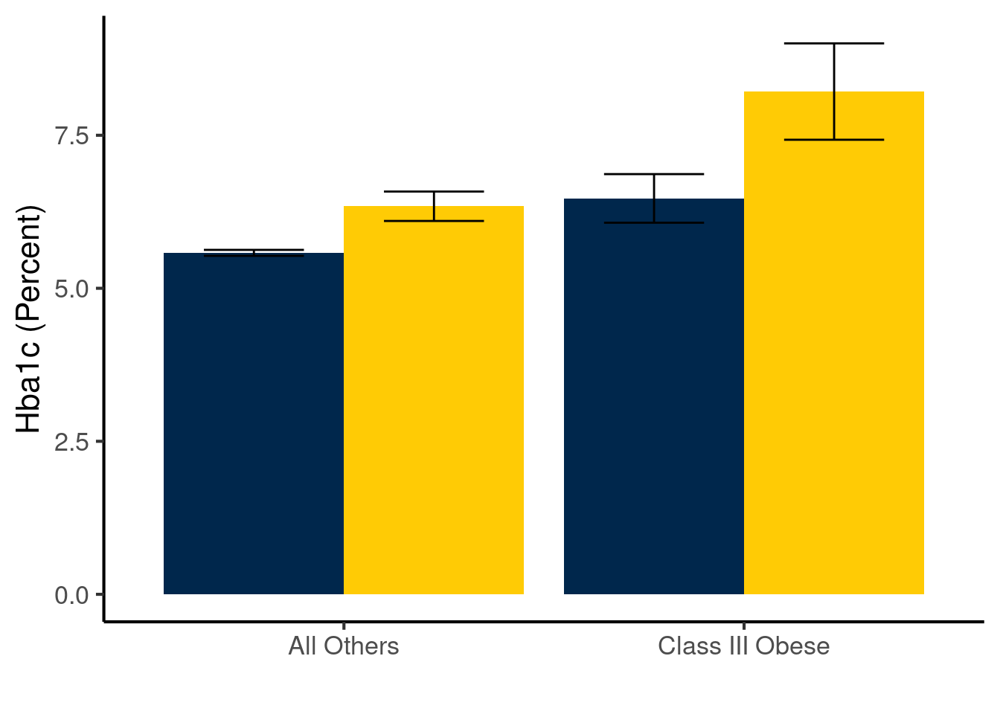{width=672}
:::

```{.r .cell-code}
ggplot(hba1c.data,
       aes(y=value,
           x=BMI,
           col=as.factor(Cushings))) +
  geom_point() +
  stat_smooth(method="loess", se=F) +
  labs(y="Hba1c (Percent)",x="") +
  scale_fill_grey() +
  theme_classic(base_size=16) +
  theme(legend.position="none")
```

::: {.cell-output-display}
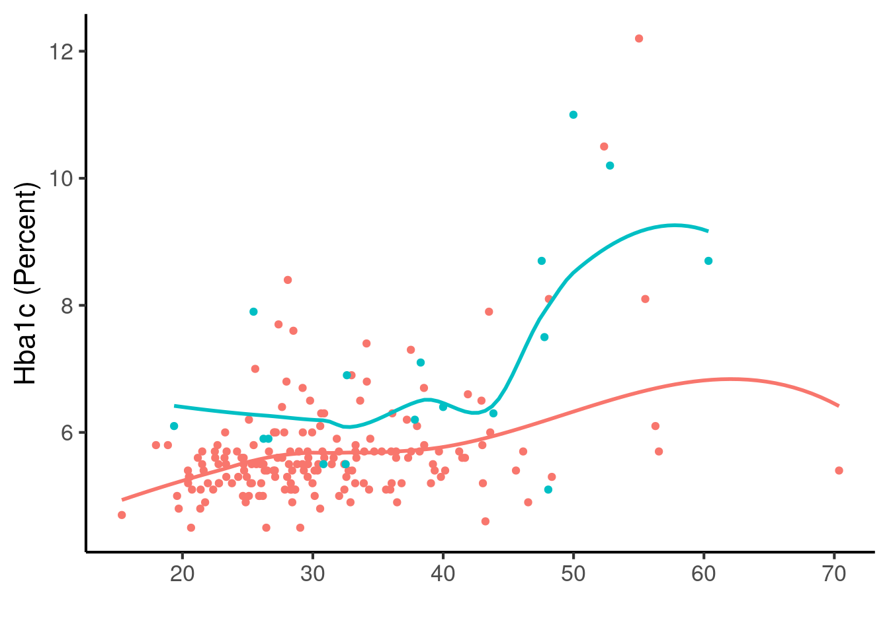{width=672}
:::

```{.r .cell-code}
ggplot(hba1c.data,
       aes(y=value,
           x=BMI,
           col=as.factor(Cushings))) +
  geom_point() +
  stat_smooth(method="loess", se=F) +
  labs(y="Hba1c (Percent)",x="") +
  scale_fill_manual(values=color_scheme) +
  theme_classic(base_size=16) +
  theme(legend.position="none")
```

::: {.cell-output-display}
{width=672}
:::

```{.r .cell-code}
library(knitr)
hba1c.summary %>% kable(caption="Summary of Hb1ac levels by obesity and pre-existing Cushing's")
```

::: {.cell-output-display}


Table: Summary of Hb1ac levels by obesity and pre-existing Cushing's

| Cushings|Obesity   |     mean|        se|        sd|  n|
|--------:|:---------|--------:|---------:|---------:|--:|
|        0|Non-Obese | 5.522449| 0.0628841| 0.6225208| 98|
|        0|Obese     | 5.892500| 0.1265508| 1.1319050| 80|
|        1|Non-Obese | 6.450000| 0.4856267| 0.9712535|  4|
|        1|Obese     | 7.315385| 0.5101340| 1.8393143| 13|


:::

```{.r .cell-code}
library(broom)
lm(value ~ Cushings + Obesity + Cushings:Obesity,data=hba1c.data) |> 
  tidy() |> 
  kable(caption="2x2 ANOVA with Interaction for effects of Obesity and Cushings on Hba1c")
```

::: {.cell-output-display}


Table: 2x2 ANOVA with Interaction for effects of Obesity and Cushings on Hba1c

|term                  |  estimate| std.error|  statistic|   p.value|
|:---------------------|---------:|---------:|----------:|---------:|
|(Intercept)           | 5.5224490| 0.0986697| 55.9690428| 0.0000000|
|Cushings              | 0.9275510| 0.4982576|  1.8615893| 0.0641974|
|ObesityObese          | 0.3700510| 0.1471800|  2.5142749| 0.0127534|
|Cushings:ObesityObese | 0.4953336| 0.5775631|  0.8576268| 0.3921734|


:::

```{.r .cell-code}
lm(value ~ Cushings + ObesityIII + Cushings:ObesityIII,data=hba1c.data) |> 
  tidy() |> 
  kable(caption="2x2 ANOVA with Interaction for effects of Class III Obesity and Cushings on Hba1c")
```

::: {.cell-output-display}


Table: 2x2 ANOVA with Interaction for effects of Class III Obesity and Cushings on Hba1c

|term                               |  estimate| std.error| statistic|   p.value|
|:----------------------------------|---------:|---------:|---------:|---------:|
|(Intercept)                        | 5.5788462| 0.0734715| 75.932146| 0.0000000|
|Cushings                           | 0.7611538| 0.2993455|  2.542727| 0.0117921|
|ObesityIIIClass III Obese          | 0.8893357| 0.2089861|  4.255478| 0.0000327|
|Cushings:ObesityIIIClass III Obese | 0.9849500| 0.4981811|  1.977092| 0.0494700|


:::

```{.r .cell-code}
lm(value ~ Cushings + BMI + Cushings:Obesity,data=hba1c.data) |> 
  tidy() |> 
  kable(caption="2x2 ANOVA with Interaction for effects of Obesity and BMI on Hba1c")
```

::: {.cell-output-display}


Table: 2x2 ANOVA with Interaction for effects of Obesity and BMI on Hba1c

|term                  |   estimate| std.error|  statistic|   p.value|
|:---------------------|----------:|---------:|----------:|---------:|
|(Intercept)           |  4.1945228| 0.2517809| 16.6594132| 0.0000000|
|Cushings              |  1.0794586| 0.4613284|  2.3398918| 0.0203221|
|BMI                   |  0.0481857| 0.0078180|  6.1634688| 0.0000000|
|Cushings:ObesityObese | -0.0432075| 0.5389931| -0.0801634| 0.9361912|


:::
:::


#### HbA1c Statistics

Used the fully adjusted model to test the interaction between Cushings's diagnoses and obesity.


::: {.cell}

```{.r .cell-code}
library(emmeans)
#used fully adjusted model
lm.hba1c <- lm(value ~ RaceEthnicity + AgeInYears + GenderName +                     Cushings * Obesity, data = hba1c.data)

## 1. Adjusted means
emm.hba1c <- emmeans(lm.hba1c, ~ Cushings | Obesity) %>%
  as.data.frame() %>%
  mutate(
    Outcome = "HbA1c",
    Mean_CI = sprintf("%.2f (%.2f–%.2f)", emmean, lower.CL, upper.CL)
  ) %>%
  select(Outcome, Obesity, Cushings, Mean_CI)

## 2. Within-stratum Cushing–Control difference
contrast.hba1c <- contrast(emmeans(lm.hba1c, ~ Cushings | Obesity),
                             method = "revpairwise") %>%
  summary(infer = TRUE) %>%
  as.data.frame() %>%
  mutate(
    Outcome = "HbA1c",
    Diff_CI = sprintf("%.2f (%.2f–%.2f)", estimate, lower.CL, upper.CL)
  ) %>%
  select(Outcome, Obesity, contrast, Diff_CI, p.value)

## 3. Interaction term
interaction_row.hba1c <- tidy(lm.hba1c) %>%
  filter(term == "Cushings:ObesityObese") %>%
  mutate(
    Outcome = "HbA1c",
    Interaction_CI = sprintf("%.2f (%.2f–%.2f)",
                             estimate,
                             estimate - 1.96 * std.error,
                             estimate + 1.96 * std.error)
  ) %>%
  select(Outcome, term, estimate, std.error, statistic, p.value, Interaction_CI)

## 4. Combine into one publication-style table:
# Pivot adjusted means to wide format (Control vs Cushing side by side)
means_wide <- emm.hba1c %>%
  mutate(Cushings = ifelse(Cushings == 1, "Cushing", "Control")) %>%
  pivot_wider(names_from = Cushings, values_from = Mean_CI)

# Merge means with differences
table.hba1c <- means_wide %>%
  left_join(contrast.hba1c, by = c("Outcome", "Obesity"))

hba1c.summary %>% kable(caption="Summary of HbA1c levels by obesity and pre-existing Cushing's")
```

::: {.cell-output-display}


Table: Summary of HbA1c levels by obesity and pre-existing Cushing's

| Cushings|Obesity   |     mean|        se|        sd|  n|
|--------:|:---------|--------:|---------:|---------:|--:|
|        0|Non-Obese | 5.522449| 0.0628841| 0.6225208| 98|
|        0|Obese     | 5.892500| 0.1265508| 1.1319050| 80|
|        1|Non-Obese | 6.450000| 0.4856267| 0.9712535|  4|
|        1|Obese     | 7.315385| 0.5101340| 1.8393143| 13|


:::

```{.r .cell-code}
lm(value ~ Cushings + Obesity + Cushings:Obesity,data=hba1c.data) |> 
  tidy() |> 
  kable(caption="2x2 ANOVA with Interaction for effects of Obesity and Cushings on HbA1c")
```

::: {.cell-output-display}


Table: 2x2 ANOVA with Interaction for effects of Obesity and Cushings on HbA1c

|term                  |  estimate| std.error|  statistic|   p.value|
|:---------------------|---------:|---------:|----------:|---------:|
|(Intercept)           | 5.5224490| 0.0986697| 55.9690428| 0.0000000|
|Cushings              | 0.9275510| 0.4982576|  1.8615893| 0.0641974|
|ObesityObese          | 0.3700510| 0.1471800|  2.5142749| 0.0127534|
|Cushings:ObesityObese | 0.4953336| 0.5775631|  0.8576268| 0.3921734|


:::

```{.r .cell-code}
lm(value ~ Cushings + BMI + Cushings:Obesity,data=hba1c.data) |> 
  tidy() |> 
  kable(caption="2x2 ANOVA with Interaction for effects of Obesity and BMI on HbA1c")
```

::: {.cell-output-display}


Table: 2x2 ANOVA with Interaction for effects of Obesity and BMI on HbA1c

|term                  |   estimate| std.error|  statistic|   p.value|
|:---------------------|----------:|---------:|----------:|---------:|
|(Intercept)           |  4.1945228| 0.2517809| 16.6594132| 0.0000000|
|Cushings              |  1.0794586| 0.4613284|  2.3398918| 0.0203221|
|BMI                   |  0.0481857| 0.0078180|  6.1634688| 0.0000000|
|Cushings:ObesityObese | -0.0432075| 0.5389931| -0.0801634| 0.9361912|


:::
:::


### Glucose


::: {.cell}

```{.r .cell-code}
m.out.glucose <- matchit(Cushings ~ AgeInYears + GenderCode + RaceEthnicity, 
                 data = complete.data |> filter(RESULT_CODE %in% c("GLUC","GLUC_WB")), 
                 method = "nearest", 
                 exact = c("GenderCode", "RaceEthnicity"),# Force exact matches
                 ratio=fold) 

summary(m.out.glucose, standardize = TRUE)  # Balance statistics[5]
```

::: {.cell-output .cell-output-stdout}

```

Call:
matchit(formula = Cushings ~ AgeInYears + GenderCode + RaceEthnicity, 
    data = filter(complete.data, RESULT_CODE %in% c("GLUC", "GLUC_WB")), 
    method = "nearest", exact = c("GenderCode", "RaceEthnicity"), 
    ratio = fold)

Summary of Balance for All Data:
                                Means Treated Means Control Std. Mean Diff.
distance                               0.0446        0.0157          0.7024
AgeInYears                            46.0291       61.9618         -0.9858
GenderCodeF                            0.8112        0.5517          0.6630
GenderCodeM                            0.1888        0.4483         -0.6630
RaceEthnicityAsian                     0.0179        0.0610         -0.3260
RaceEthnicityBlack                     0.0448        0.1166         -0.3473
RaceEthnicityHispanic or Latino        0.0459        0.0299          0.0766
RaceEthnicityOther                     0.0209        0.0323         -0.0800
RaceEthnicityWhite                     0.8706        0.7601          0.3290
                                Var. Ratio eCDF Mean eCDF Max
distance                            3.7215    0.2619   0.5278
AgeInYears                          0.8761    0.1958   0.4141
GenderCodeF                              .    0.2595   0.2595
GenderCodeM                              .    0.2595   0.2595
RaceEthnicityAsian                       .    0.0432   0.0432
RaceEthnicityBlack                       .    0.0718   0.0718
RaceEthnicityHispanic or Latino          .    0.0160   0.0160
RaceEthnicityOther                       .    0.0114   0.0114
RaceEthnicityWhite                       .    0.1104   0.1104

Summary of Balance for Matched Data:
                                Means Treated Means Control Std. Mean Diff.
distance                               0.0446        0.0420          0.0627
AgeInYears                            46.0291       46.6259         -0.0369
GenderCodeF                            0.8112        0.8112          0.0000
GenderCodeM                            0.1888        0.1888          0.0000
RaceEthnicityAsian                     0.0179        0.0179          0.0000
RaceEthnicityBlack                     0.0448        0.0448          0.0000
RaceEthnicityHispanic or Latino        0.0459        0.0459          0.0000
RaceEthnicityOther                     0.0209        0.0209          0.0000
RaceEthnicityWhite                     0.8706        0.8706          0.0000
                                Var. Ratio eCDF Mean eCDF Max Std. Pair Dist.
distance                            1.3580    0.0029   0.0345          0.0692
AgeInYears                          1.1233    0.0075   0.0498          0.0467
GenderCodeF                              .    0.0000   0.0000          0.0000
GenderCodeM                              .    0.0000   0.0000          0.0000
RaceEthnicityAsian                       .    0.0000   0.0000          0.0000
RaceEthnicityBlack                       .    0.0000   0.0000          0.0000
RaceEthnicityHispanic or Latino          .    0.0000   0.0000          0.0000
RaceEthnicityOther                       .    0.0000   0.0000          0.0000
RaceEthnicityWhite                       .    0.0000   0.0000          0.0000

Sample Sizes:
          Control Treated
All        221956    3639
Matched     36390    3639
Unmatched  185566       0
Discarded       0       0
```


:::

```{.r .cell-code}
plot(m.out.glucose, type = "jitter")         # Propensity score distribution[5]
```

::: {.cell-output-display}
{width=672}
:::

::: {.cell-output .cell-output-stdout}

```
To identify the units, use first mouse button; to stop, use second.
```


:::

```{.r .cell-code}
matched_data.glucose <- match.data(m.out.glucose)

glucose.data <- 
  matched_data.glucose |>
  mutate(value = as.numeric(VALUE)) %>% #forced into numeric form  
  arrange(desc(DeID_AdmitDate)) %>% #sort by date
  distinct(DeID_PatientID,.keep_all = T) %>% #unique cases
  mutate(Obesity = if_else(BMI>30, "Obese","Non-Obese"))  |>
  mutate(ObesityIII = if_else(BMI>40, "Class III Obese","All Others"))  |>
  filter(!is.na(Obesity)) 
```
:::


#### Demographics of Participants with Glucose Values


::: {.cell}

```{.r .cell-code}
glucose.summary.gender <-
  glucose.data |>
  tabyl(GenderName,Cushings) |>
  adorn_percentages("col") %>%
  adorn_pct_formatting(digits = 2) %>%
  adorn_ns(position = "front") %>%
  mutate(across(starts_with("."), ~ paste0(.x))) %>%
  mutate(across(starts_with("."), ~ gsub("(.+)% \\((.+)\\)", "\\2 (\\1%)", .x))) |>
  rename(Controls=`0`,
         `Cushing's`=`1`,
         Group=GenderName)|>
  mutate(Cushings_count = as.numeric(str_extract(`Cushing's`, "^\\d+"))) |>
  arrange(desc(Cushings_count)) |>
  select(-Cushings_count)

glucose.summary.race.ethnicity <-
  glucose.data |>
  tabyl(RaceEthnicity,Cushings) |>
  adorn_percentages("col") %>%
  adorn_pct_formatting(digits = 2) %>%
  adorn_ns(position = "front") %>%
  mutate(across(starts_with("."), ~ paste0(.x))) %>%
  mutate(across(starts_with("."), ~ gsub("(.+)% \\((.+)\\)", "\\2 (\\1%)", .x))) |>
  rename(Controls=`0`,
         `Cushing's`=`1`,
         Group=RaceEthnicity) |>
  mutate(Cushings_count = as.numeric(str_extract(`Cushing's`, "^\\d+"))) |>
  arrange(desc(Cushings_count)) |>
  select(-Cushings_count)

glucose.summary.quant <-
  glucose.data |>
  group_by(Cushings) %>%
  summarise(
    Age_Mean = mean(AgeInYears, na.rm = TRUE),
    Age_SD = sd(AgeInYears),
    BMI_Mean = mean(BMI, na.rm = TRUE),
    BMI_SD = sd(BMI)
  ) %>%
  mutate(
    Age = sprintf("%.2f ± %.2f", Age_Mean, Age_SD),
    BMI = sprintf("%.2f ± %.2f", BMI_Mean, BMI_SD)
  ) %>%
  select(Cushings, Age, BMI)  |>
  pivot_longer(cols=c('Age','BMI')) |>
  pivot_wider(names_from=Cushings) |>
  rename(Controls=`0`,
         `Cushing's`=`1`,
         Group=name)


glucose.summary.table <-
  bind_rows(glucose.summary.quant,
          glucose.summary.gender,
          glucose.summary.race.ethnicity)

glucose.summary.table |>
  kable(caption="Demographic Summary for Glucose List") |>
  kable_styling(full_width = FALSE, position = "center")
```

::: {.cell-output-display}

`````{=html}
<table class="table" style="width: auto !important; margin-left: auto; margin-right: auto;">
<caption>Demographic Summary for Glucose List</caption>
 <thead>
  <tr>
   <th style="text-align:left;"> Group </th>
   <th style="text-align:left;"> Controls </th>
   <th style="text-align:left;"> Cushing's </th>
  </tr>
 </thead>
<tbody>
  <tr>
   <td style="text-align:left;"> Age </td>
   <td style="text-align:left;"> 45.96 ± 14.85 </td>
   <td style="text-align:left;"> 46.24 ± 15.59 </td>
  </tr>
  <tr>
   <td style="text-align:left;"> BMI </td>
   <td style="text-align:left;"> 29.43 ± 7.46 </td>
   <td style="text-align:left;"> 34.65 ± 13.82 </td>
  </tr>
  <tr>
   <td style="text-align:left;"> Female </td>
   <td style="text-align:left;"> 12,858 (81.19%) </td>
   <td style="text-align:left;"> 284 (79.78%) </td>
  </tr>
  <tr>
   <td style="text-align:left;"> Male </td>
   <td style="text-align:left;"> 2,979 (18.81%) </td>
   <td style="text-align:left;"> 72 (20.22%) </td>
  </tr>
  <tr>
   <td style="text-align:left;"> White </td>
   <td style="text-align:left;"> 13,741 (86.77%) </td>
   <td style="text-align:left;"> 311 (87.36%) </td>
  </tr>
  <tr>
   <td style="text-align:left;"> Black </td>
   <td style="text-align:left;"> 583  (3.68%) </td>
   <td style="text-align:left;"> 19  (5.34%) </td>
  </tr>
  <tr>
   <td style="text-align:left;"> Hispanic or Latino </td>
   <td style="text-align:left;"> 706  (4.46%) </td>
   <td style="text-align:left;"> 9  (2.53%) </td>
  </tr>
  <tr>
   <td style="text-align:left;"> Other </td>
   <td style="text-align:left;"> 371  (2.34%) </td>
   <td style="text-align:left;"> 9  (2.53%) </td>
  </tr>
  <tr>
   <td style="text-align:left;"> Asian </td>
   <td style="text-align:left;"> 436  (2.75%) </td>
   <td style="text-align:left;"> 8  (2.25%) </td>
  </tr>
</tbody>
</table>

`````

:::

```{.r .cell-code}
write_csv(glucose.summary.table,"Demographic Summary - Glucose Sample.csv")

#statistics for BMI
glucose.data |>
  group_by(Cushings) |>
  summarize(shapiro.p=shapiro.test(sample(BMI,3000,replace=T))$p.value) |>
  kable(caption="Shapiro Wilk test for BMI for Glucose sample", digits=c(1,99)) |>
  kable_styling(full_width = FALSE, position = "center")
```

::: {.cell-output-display}

`````{=html}
<table class="table" style="width: auto !important; margin-left: auto; margin-right: auto;">
<caption>Shapiro Wilk test for BMI for Glucose sample</caption>
 <thead>
  <tr>
   <th style="text-align:right;"> Cushings </th>
   <th style="text-align:right;"> shapiro.p </th>
  </tr>
 </thead>
<tbody>
  <tr>
   <td style="text-align:right;"> 0 </td>
   <td style="text-align:right;"> 4.591861e-31 </td>
  </tr>
  <tr>
   <td style="text-align:right;"> 1 </td>
   <td style="text-align:right;"> 8.141123e-65 </td>
  </tr>
</tbody>
</table>

`````

:::

```{.r .cell-code}
wilcox.test(BMI~Cushings,glucose.data) |>
  tidy() |>
  kable(caption="Mann Whitney test for effect of Cushing's on BMI for Glucose sample",
        digits=c(1,99,1,1)) |>
  kable_styling(full_width = FALSE, position = "center")
```

::: {.cell-output-display}

`````{=html}
<table class="table" style="width: auto !important; margin-left: auto; margin-right: auto;">
<caption>Mann Whitney test for effect of Cushing's on BMI for Glucose sample</caption>
 <thead>
  <tr>
   <th style="text-align:right;"> statistic </th>
   <th style="text-align:right;"> p.value </th>
   <th style="text-align:left;"> method </th>
   <th style="text-align:left;"> alternative </th>
  </tr>
 </thead>
<tbody>
  <tr>
   <td style="text-align:right;"> 1892454 </td>
   <td style="text-align:right;"> 2.350919e-26 </td>
   <td style="text-align:left;"> Wilcoxon rank sum test with continuity correction </td>
   <td style="text-align:left;"> two.sided </td>
  </tr>
</tbody>
</table>

`````

:::

```{.r .cell-code}
chisq.test(x=as.numeric(separate(glucose.summary.gender, `Cushing's`, sep=" ", into=c("n","Pct")) |>
                          pull(n)),p=c(0.5,0.5)) |>
  tidy() |>
  kable(caption="Chi-squared test for equal proportions of males and females in the Glucose sample",
        digits=c(1,99,1,1)) |>
  kable_styling(full_width = FALSE, position = "center")
```

::: {.cell-output-display}

`````{=html}
<table class="table" style="width: auto !important; margin-left: auto; margin-right: auto;">
<caption>Chi-squared test for equal proportions of males and females in the Glucose sample</caption>
 <thead>
  <tr>
   <th style="text-align:right;"> statistic </th>
   <th style="text-align:right;"> p.value </th>
   <th style="text-align:right;"> parameter </th>
   <th style="text-align:left;"> method </th>
  </tr>
 </thead>
<tbody>
  <tr>
   <td style="text-align:right;"> 126.2 </td>
   <td style="text-align:right;"> 2.714723e-29 </td>
   <td style="text-align:right;"> 1 </td>
   <td style="text-align:left;"> Chi-squared test for given probabilities </td>
  </tr>
</tbody>
</table>

`````

:::
:::

::: {.cell}

```{.r .cell-code}
glucose.summary <-
  glucose.data %>%
  group_by(Cushings,Obesity) |>
  summarize(mean=mean(value,na.rm=T),
            se=se(value),
            sd=sd(value,na.rm=T),
            n=length(value))

ggplot(glucose.summary,
       aes(y=mean,
           ymin=mean- se,
           ymax=mean+ se,
           x=Obesity,
           fill=as.factor(Cushings))) +
  geom_col(position = position_dodge(width = 0.9)) +
  geom_errorbar(
    position = position_dodge(width = 0.9), # must match geom_col
    width = 0.5
  ) +
  labs(y="Glucose (mg/dL)",x="") +
  theme_classic(base_size=16) +
  scale_fill_grey() +
  theme(legend.position="none")
```

::: {.cell-output-display}
{width=672}
:::

```{.r .cell-code}
ggplot(glucose.summary,
       aes(y=mean,
           ymin=mean- se,
           ymax=mean+ se,
           x=Obesity,
           fill=as.factor(Cushings))) +
  geom_col(position = position_dodge(width = 0.9)) +
  geom_errorbar(
    position = position_dodge(width = 0.9), # must match geom_col
    width = 0.5
  ) +
  labs(y="Glucose (mg/dL)",x="") +
  theme_classic(base_size=16) +
  scale_fill_manual(values=color_scheme) +
  theme(legend.position="none")
```

::: {.cell-output-display}
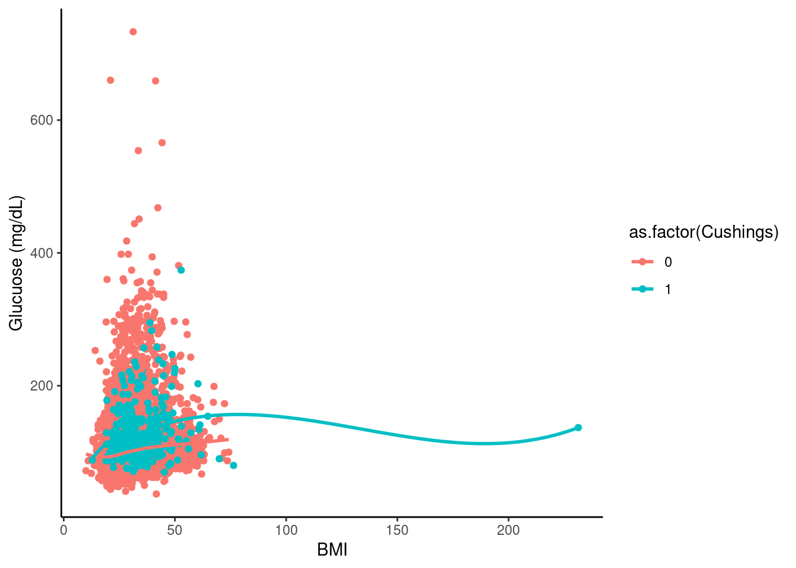{width=672}
:::

```{.r .cell-code}
ggplot(glucose.data,
       aes(y=value,
           x=BMI,
           col=as.factor(Cushings))) +
  geom_point() +
  stat_smooth(method="loess", se=F) +
  labs(y="Glucuose (mg/dL)",x="") +
  theme_classic(base_size=16) +
  scale_fill_grey() +
  theme(legend.position="none")
```

::: {.cell-output-display}
{width=672}
:::

```{.r .cell-code}
ggplot(glucose.data,
       aes(y=value,
           x=BMI,
           col=as.factor(Cushings))) +
  geom_point() +
  stat_smooth(method="loess", se=F) +
  labs(y="Glucuose (mg/dL)",x="") +
  theme_classic(base_size=16) +
  scale_fill_manual(values=color_scheme) +
  theme(legend.position="none")
```

::: {.cell-output-display}
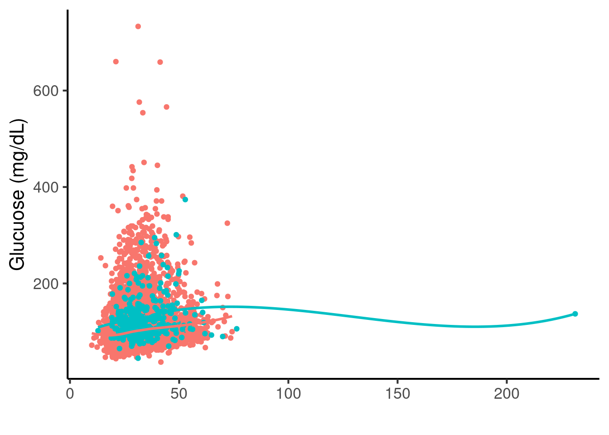{width=672}
:::
:::


#### Glucose Statistics

Used the fully adjusted model to test the interaction between Cushings's diagnoses and obesity.


::: {.cell}

```{.r .cell-code}
#used fully adjusted model
lm.glucose <- lm(value ~ RaceEthnicity + AgeInYears + GenderName +                     Cushings * Obesity, data = glucose.data)

## 1. Adjusted means
emm.glucose <- emmeans(lm.glucose, ~ Cushings | Obesity) %>%
  as.data.frame() %>%
  mutate(
    Outcome = "Glucose",
    Mean_CI = sprintf("%.2f (%.2f–%.2f)", emmean, lower.CL, upper.CL)
  ) %>%
  select(Outcome, Obesity, Cushings, Mean_CI)

## 2. Within-stratum Cushing–Control difference
contrast.glucose <- contrast(emmeans(lm.glucose, ~ Cushings | Obesity),
                             method = "revpairwise") %>%
  summary(infer = TRUE) %>%
  as.data.frame() %>%
  mutate(
    Outcome = "Glucose",
    Diff_CI = sprintf("%.2f (%.2f–%.2f)", estimate, lower.CL, upper.CL)
  ) %>%
  select(Outcome, Obesity, contrast, Diff_CI, p.value)

## 3. Interaction term
interaction_row.glucose <- tidy(lm.glucose) %>%
  filter(term == "Cushings:ObesityObese") %>%
  mutate(
    Outcome = "Glucose",
    Interaction_CI = sprintf("%.2f (%.2f–%.2f)",
                             estimate,
                             estimate - 1.96 * std.error,
                             estimate + 1.96 * std.error)
  ) %>%
  select(Outcome, term, estimate, std.error, statistic, p.value, Interaction_CI)

## 4. Combine into one publication-style table:
# Pivot adjusted means to wide format (Control vs Cushing side by side)
means_wide <- emm.glucose %>%
  mutate(Cushings = ifelse(Cushings == 1, "Cushing", "Control")) %>%
  pivot_wider(names_from = Cushings, values_from = Mean_CI)

# Merge means with differences
table.glucose <- means_wide %>%
  left_join(contrast.glucose, by = c("Outcome", "Obesity"))

glucose.summary %>% kable(caption="Summary of glucose levels by obesity and pre-existing Cushing's")
```

::: {.cell-output-display}


Table: Summary of glucose levels by obesity and pre-existing Cushing's

| Cushings|Obesity   |      mean|        se|       sd|    n|
|--------:|:---------|---------:|---------:|--------:|----:|
|        0|Non-Obese |  96.33601| 0.2609445| 25.40157| 9476|
|        0|Obese     | 104.98396| 0.4703304| 37.51162| 6361|
|        1|Non-Obese | 121.96875| 2.6870694| 30.40072|  128|
|        1|Obese     | 131.49561| 3.0886726| 46.63793|  228|


:::

```{.r .cell-code}
lm(value ~ Cushings + Obesity + Cushings:Obesity,data=glucose.data) |> 
  tidy() |> 
  kable(caption="2x2 ANOVA with Interaction for effects of Obesity and Cushings on Glucose")
```

::: {.cell-output-display}


Table: 2x2 ANOVA with Interaction for effects of Obesity and Cushings on Glucose

|term                  |   estimate| std.error|   statistic|   p.value|
|:---------------------|----------:|---------:|-----------:|---------:|
|(Intercept)           | 96.3360068| 0.3196407| 301.3883769| 0.0000000|
|Cushings              | 25.6327432| 2.7687467|   9.2578866| 0.0000000|
|ObesityObese          |  8.6479555| 0.5043782|  17.1457749| 0.0000000|
|Cushings:ObesityObese |  0.8789085| 3.4734022|   0.2530397| 0.8002408|


:::

```{.r .cell-code}
lm(value ~ Cushings + BMI + Cushings:Obesity,data=glucose.data) |> 
  tidy() |> 
  kable(caption="2x2 ANOVA with Interaction for effects of Obesity and BMI on Glucose")
```

::: {.cell-output-display}


Table: 2x2 ANOVA with Interaction for effects of Obesity and BMI on Glucose

|term                  |   estimate| std.error|  statistic|   p.value|
|:---------------------|----------:|---------:|----------:|---------:|
|(Intercept)           | 81.2331245| 0.9760673| 83.2249192| 0.0000000|
|Cushings              | 24.3684172| 2.7558656|  8.8423823| 0.0000000|
|BMI                   |  0.6312709| 0.0320940| 19.6694382| 0.0000000|
|Cushings:ObesityObese |  0.9259315| 3.4547262|  0.2680188| 0.7886883|


:::
:::


### Liver Enzymes

#### ALT


::: {.cell}

```{.r .cell-code}
m.out.alt <- matchit(Cushings ~ AgeInYears + GenderCode + RaceEthnicity, 
                 data = complete.data |> filter(RESULT_CODE %in% c("ALT")), 
                 method = "nearest", 
                 exact = c("GenderCode", "RaceEthnicity"),
                 ratio=fold) # Force exact matches

summary(m.out.alt, standardize = TRUE)  # Balance statistics[5]
```

::: {.cell-output .cell-output-stdout}

```

Call:
matchit(formula = Cushings ~ AgeInYears + GenderCode + RaceEthnicity, 
    data = filter(complete.data, RESULT_CODE %in% c("ALT")), 
    method = "nearest", exact = c("GenderCode", "RaceEthnicity"), 
    ratio = fold)

Summary of Balance for All Data:
                                Means Treated Means Control Std. Mean Diff.
distance                               0.0059        0.0024          0.7414
AgeInYears                            48.2730       59.8571         -0.7172
GenderCodeF                            0.8344        0.5607          0.7362
GenderCodeM                            0.1656        0.4393         -0.7362
RaceEthnicityAsian                     0.0031        0.0666         -1.1496
RaceEthnicityBlack                     0.0153        0.1129         -0.7935
RaceEthnicityHispanic or Latino        0.0337        0.0319          0.0099
RaceEthnicityOther                     0.0092        0.0328         -0.2475
RaceEthnicityWhite                     0.9387        0.7557          0.7623
                                Var. Ratio eCDF Mean eCDF Max
distance                            2.6613    0.2092   0.5223
AgeInYears                          0.8521    0.1460   0.3267
GenderCodeF                              .    0.2737   0.2737
GenderCodeM                              .    0.2737   0.2737
RaceEthnicityAsian                       .    0.0636   0.0636
RaceEthnicityBlack                       .    0.0975   0.0975
RaceEthnicityHispanic or Latino          .    0.0018   0.0018
RaceEthnicityOther                       .    0.0236   0.0236
RaceEthnicityWhite                       .    0.1829   0.1829

Summary of Balance for Matched Data:
                                Means Treated Means Control Std. Mean Diff.
distance                               0.0059        0.0057          0.0395
AgeInYears                            48.2730       48.6061         -0.0206
GenderCodeF                            0.8344        0.8344          0.0000
GenderCodeM                            0.1656        0.1656          0.0000
RaceEthnicityAsian                     0.0031        0.0031          0.0000
RaceEthnicityBlack                     0.0153        0.0153          0.0000
RaceEthnicityHispanic or Latino        0.0337        0.0337          0.0000
RaceEthnicityOther                     0.0092        0.0092          0.0000
RaceEthnicityWhite                     0.9387        0.9387          0.0000
                                Var. Ratio eCDF Mean eCDF Max Std. Pair Dist.
distance                            1.2478    0.0005   0.0399          0.0397
AgeInYears                          1.0985    0.0019   0.0543          0.0212
GenderCodeF                              .    0.0000   0.0000          0.0000
GenderCodeM                              .    0.0000   0.0000          0.0000
RaceEthnicityAsian                       .    0.0000   0.0000          0.0000
RaceEthnicityBlack                       .    0.0000   0.0000          0.0000
RaceEthnicityHispanic or Latino          .    0.0000   0.0000          0.0000
RaceEthnicityOther                       .    0.0000   0.0000          0.0000
RaceEthnicityWhite                       .    0.0000   0.0000          0.0000

Sample Sizes:
          Control Treated
All        136405     326
Matched      3260     326
Unmatched  133145       0
Discarded       0       0
```


:::

```{.r .cell-code}
plot(m.out.alt, type = "jitter")  
```

::: {.cell-output-display}
{width=672}
:::

::: {.cell-output .cell-output-stdout}

```
To identify the units, use first mouse button; to stop, use second.
```


:::

```{.r .cell-code}
matched_data.alt <- match.data(m.out.alt)

alt.data <- 
  matched_data.alt |>
  mutate(value = as.numeric(VALUE)) %>% #forced into numeric form  
  arrange(desc(DeID_AdmitDate)) %>% #sort by date
  distinct(DeID_PatientID,.keep_all = T) %>% #unique cases
  mutate(Obesity = if_else(BMI>30, "Obese","Non-Obese"))  |>
  filter(!is.na(Obesity))
```
:::


##### Demographics of Participants with ALT Values


::: {.cell}

```{.r .cell-code}
alt.summary.gender <-
  alt.data |>
  tabyl(GenderName,Cushings) |>
  adorn_percentages("col") %>%
  adorn_pct_formatting(digits = 2) %>%
  adorn_ns(position = "front") %>%
  mutate(across(starts_with("."), ~ paste0(.x))) %>%
  mutate(across(starts_with("."), ~ gsub("(.+)% \\((.+)\\)", "\\2 (\\1%)", .x))) |>
  rename(Controls=`0`,
         `Cushing's`=`1`,
         Group=GenderName)|>
  mutate(Cushings_count = as.numeric(str_extract(`Cushing's`, "^\\d+"))) |>
  arrange(desc(Cushings_count)) |>
  select(-Cushings_count)

alt.summary.race.ethnicity <-
  alt.data |>
  tabyl(RaceEthnicity,Cushings) |>
  adorn_percentages("col") %>%
  adorn_pct_formatting(digits = 2) %>%
  adorn_ns(position = "front") %>%
  mutate(across(starts_with("."), ~ paste0(.x))) %>%
  mutate(across(starts_with("."), ~ gsub("(.+)% \\((.+)\\)", "\\2 (\\1%)", .x))) |>
  rename(Controls=`0`,
         `Cushing's`=`1`,
         Group=RaceEthnicity) |>
  mutate(Cushings_count = as.numeric(str_extract(`Cushing's`, "^\\d+"))) |>
  arrange(desc(Cushings_count)) |>
  select(-Cushings_count)

alt.summary.quant <-
  alt.data |>
  group_by(Cushings) %>%
  summarise(
    Age_Mean = mean(AgeInYears, na.rm = TRUE),
    Age_SD = sd(AgeInYears),
    BMI_Mean = mean(BMI, na.rm = TRUE),
    BMI_SD = sd(BMI)
  ) %>%
  mutate(
    Age = sprintf("%.2f ± %.2f", Age_Mean, Age_SD),
    BMI = sprintf("%.2f ± %.2f", BMI_Mean, BMI_SD)
  ) %>%
  select(Cushings, Age, BMI)  |>
  pivot_longer(cols=c('Age','BMI')) |>
  pivot_wider(names_from=Cushings) |>
  rename(Controls=`0`,
         `Cushing's`=`1`,
         Group=name)


alt.summary.table <-
  bind_rows(alt.summary.quant,
          alt.summary.gender,
          alt.summary.race.ethnicity)

alt.summary.table |>
  kable(caption="Demographic Summary for ALT List") |>
  kable_styling(full_width = FALSE, position = "center")
```

::: {.cell-output-display}

`````{=html}
<table class="table" style="width: auto !important; margin-left: auto; margin-right: auto;">
<caption>Demographic Summary for ALT List</caption>
 <thead>
  <tr>
   <th style="text-align:left;"> Group </th>
   <th style="text-align:left;"> Controls </th>
   <th style="text-align:left;"> Cushing's </th>
  </tr>
 </thead>
<tbody>
  <tr>
   <td style="text-align:left;"> Age </td>
   <td style="text-align:left;"> 47.79 ± 15.04 </td>
   <td style="text-align:left;"> 45.74 ± 17.68 </td>
  </tr>
  <tr>
   <td style="text-align:left;"> BMI </td>
   <td style="text-align:left;"> 29.87 ± 7.66 </td>
   <td style="text-align:left;"> 33.53 ± 9.36 </td>
  </tr>
  <tr>
   <td style="text-align:left;"> Female </td>
   <td style="text-align:left;"> 1,628 (84.66%) </td>
   <td style="text-align:left;"> 67 (79.76%) </td>
  </tr>
  <tr>
   <td style="text-align:left;"> Male </td>
   <td style="text-align:left;"> 295 (15.34%) </td>
   <td style="text-align:left;"> 17 (20.24%) </td>
  </tr>
  <tr>
   <td style="text-align:left;"> White </td>
   <td style="text-align:left;"> 1,792 (93.19%) </td>
   <td style="text-align:left;"> 73 (86.90%) </td>
  </tr>
  <tr>
   <td style="text-align:left;"> Black </td>
   <td style="text-align:left;"> 42  (2.18%) </td>
   <td style="text-align:left;"> 4  (4.76%) </td>
  </tr>
  <tr>
   <td style="text-align:left;"> Hispanic or Latino </td>
   <td style="text-align:left;"> 61  (3.17%) </td>
   <td style="text-align:left;"> 4  (4.76%) </td>
  </tr>
  <tr>
   <td style="text-align:left;"> Other </td>
   <td style="text-align:left;"> 18  (0.94%) </td>
   <td style="text-align:left;"> 2  (2.38%) </td>
  </tr>
  <tr>
   <td style="text-align:left;"> Asian </td>
   <td style="text-align:left;"> 10  (0.52%) </td>
   <td style="text-align:left;"> 1  (1.19%) </td>
  </tr>
</tbody>
</table>

`````

:::

```{.r .cell-code}
write_csv(alt.summary.table,"Demographic Summary - ALT Sample.csv")

#statistics for BMI
alt.data |>
  group_by(Cushings) |>
  summarize(shapiro.p=shapiro.test(sample(BMI,3000,replace=T))$p.value) |>
  kable(caption="Shapiro Wilk test for BMI for ALT sample", digits=c(1,99)) |>
  kable_styling(full_width = FALSE, position = "center")
```

::: {.cell-output-display}

`````{=html}
<table class="table" style="width: auto !important; margin-left: auto; margin-right: auto;">
<caption>Shapiro Wilk test for BMI for ALT sample</caption>
 <thead>
  <tr>
   <th style="text-align:right;"> Cushings </th>
   <th style="text-align:right;"> shapiro.p </th>
  </tr>
 </thead>
<tbody>
  <tr>
   <td style="text-align:right;"> 0 </td>
   <td style="text-align:right;"> 2.049019e-31 </td>
  </tr>
  <tr>
   <td style="text-align:right;"> 1 </td>
   <td style="text-align:right;"> 3.635330e-19 </td>
  </tr>
</tbody>
</table>

`````

:::

```{.r .cell-code}
wilcox.test(BMI~Cushings,alt.data) |>
  tidy() |>
  kable(caption="Mann Whitney test for effect of Cushing's on BMI for ALT sample",
        digits=c(1,99,1,1)) |>
  kable_styling(full_width = FALSE, position = "center")
```

::: {.cell-output-display}

`````{=html}
<table class="table" style="width: auto !important; margin-left: auto; margin-right: auto;">
<caption>Mann Whitney test for effect of Cushing's on BMI for ALT sample</caption>
 <thead>
  <tr>
   <th style="text-align:right;"> statistic </th>
   <th style="text-align:right;"> p.value </th>
   <th style="text-align:left;"> method </th>
   <th style="text-align:left;"> alternative </th>
  </tr>
 </thead>
<tbody>
  <tr>
   <td style="text-align:right;"> 60871 </td>
   <td style="text-align:right;"> 0.0001299279 </td>
   <td style="text-align:left;"> Wilcoxon rank sum test with continuity correction </td>
   <td style="text-align:left;"> two.sided </td>
  </tr>
</tbody>
</table>

`````

:::

```{.r .cell-code}
chisq.test(x=as.numeric(separate(alt.summary.gender, `Cushing's`, sep=" ", into=c("n","Pct")) |>
                          pull(n)),p=c(0.5,0.5)) |>
  tidy() |>
  kable(caption="Chi-squared test for equal proportions of males and females in the ALT sample",
        digits=c(1,99,1,1)) |>
  kable_styling(full_width = FALSE, position = "center")
```

::: {.cell-output-display}

`````{=html}
<table class="table" style="width: auto !important; margin-left: auto; margin-right: auto;">
<caption>Chi-squared test for equal proportions of males and females in the ALT sample</caption>
 <thead>
  <tr>
   <th style="text-align:right;"> statistic </th>
   <th style="text-align:right;"> p.value </th>
   <th style="text-align:right;"> parameter </th>
   <th style="text-align:left;"> method </th>
  </tr>
 </thead>
<tbody>
  <tr>
   <td style="text-align:right;"> 29.8 </td>
   <td style="text-align:right;"> 4.884973e-08 </td>
   <td style="text-align:right;"> 1 </td>
   <td style="text-align:left;"> Chi-squared test for given probabilities </td>
  </tr>
</tbody>
</table>

`````

:::
:::

::: {.cell}

```{.r .cell-code}
alt.summary <-
  alt.data %>%
  group_by(Cushings,Obesity) |>
  summarize(mean=mean(value,na.rm=T),
            se=se(value),
            sd=sd(value,na.rm=T),
            n=length(value))

library(ggplot2)
ggplot(alt.summary,
       aes(y=mean,
           ymin=mean- se,
           ymax=mean+ se,
           x=Obesity,
           fill=as.factor(Cushings))) +
  geom_col(position = position_dodge(width = 0.9)) +
  geom_errorbar(
    position = position_dodge(width = 0.9), # must match geom_col
    width = 0.5
  ) +
  labs(y="ALT (mg/dL)",x="") +
  theme_classic(base_size=16) +
  scale_fill_grey() +
  theme(legend.position="none")
```

::: {.cell-output-display}
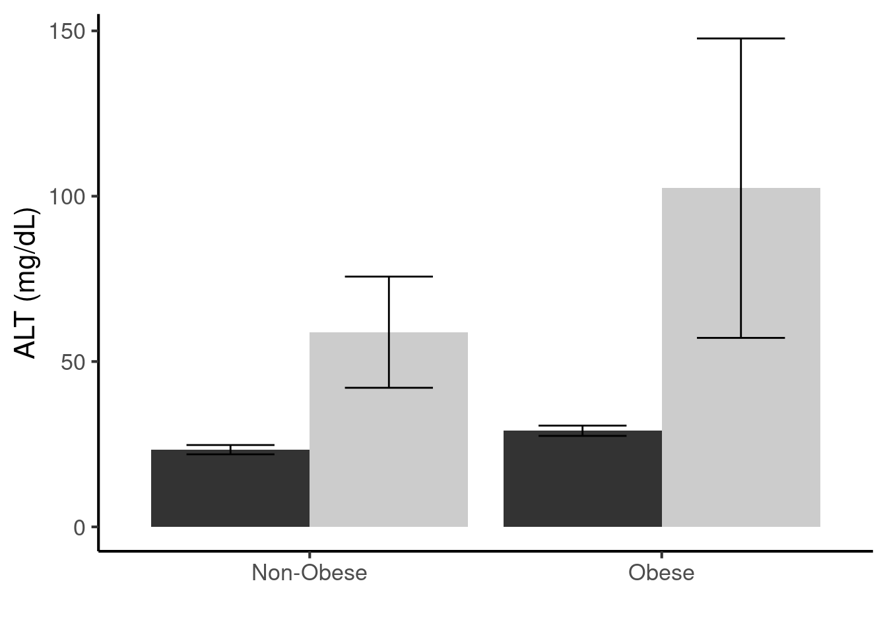{width=672}
:::

```{.r .cell-code}
ggplot(alt.summary,
       aes(y=mean,
           ymin=mean- se,
           ymax=mean+ se,
           x=Obesity,
           fill=as.factor(Cushings))) +
  geom_col(position = position_dodge(width = 0.9)) +
  geom_errorbar(
    position = position_dodge(width = 0.9), # must match geom_col
    width = 0.5
  ) +
  labs(y="ALT (mg/dL)",x="") +
  theme_classic(base_size=16) +
  scale_fill_manual(values=color_scheme) +
  theme(legend.position="none")
```

::: {.cell-output-display}
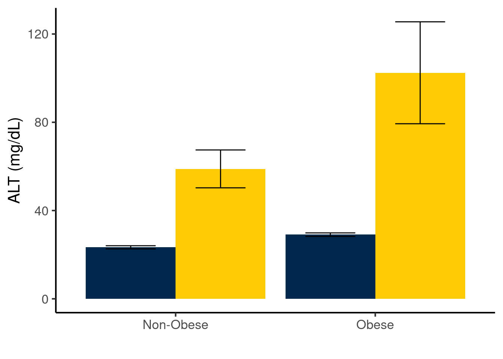{width=672}
:::

```{.r .cell-code}
ggplot(alt.data,
       aes(y=value,
           x=BMI,
           col=as.factor(Cushings))) +
  geom_point() +
  stat_smooth(method="loess", se=F) +
  labs(y="ALT (mg/dL)",x="") +
  theme_classic(base_size=16) +
  scale_fill_grey() +
  theme(legend.position="none")
```

::: {.cell-output-display}
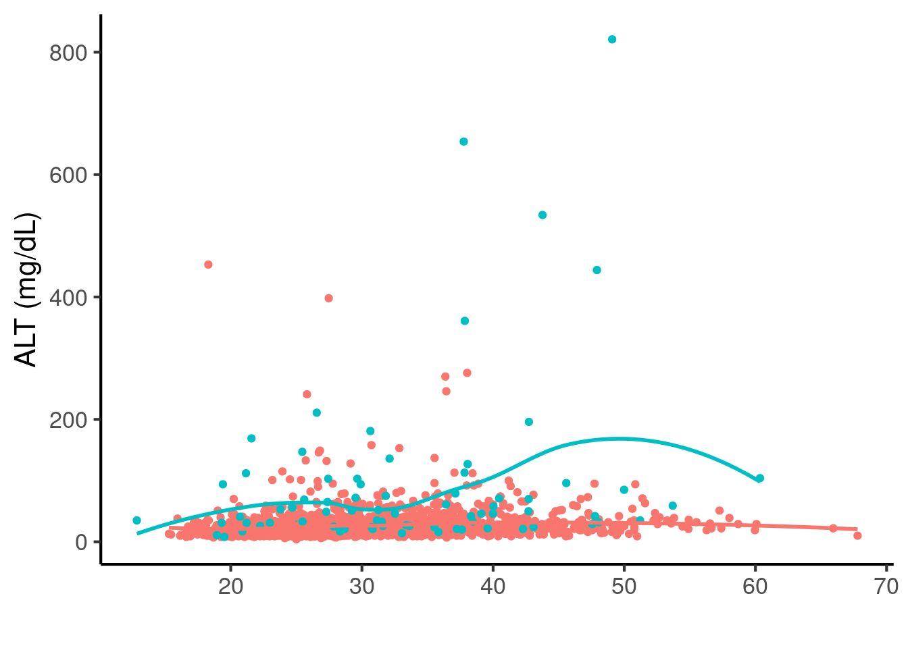{width=672}
:::

```{.r .cell-code}
ggplot(alt.data,
       aes(y=value,
           x=BMI,
           col=as.factor(Cushings))) +
  geom_point() +
  stat_smooth(method="loess", se=F) +
  labs(y="ALT (mg/dL)",x="") +
  theme_classic(base_size=16) +
  scale_fill_manual(values=color_scheme) +
  theme(legend.position="none")
```

::: {.cell-output-display}
{width=672}
:::

```{.r .cell-code}
library(knitr)
alt.summary %>% kable(caption="Summary of ALT levels by obesity and pre-existing Cushing's")
```

::: {.cell-output-display}


Table: Summary of ALT levels by obesity and pre-existing Cushing's

| Cushings|Obesity   |      mean|         se|        sd|    n|
|--------:|:---------|---------:|----------:|---------:|----:|
|        0|Non-Obese |  23.34622|  0.7163531|  23.74794| 1099|
|        0|Obese     |  29.07533|  0.7908937|  22.70292|  824|
|        1|Non-Obese |  58.87500|  8.5784743|  48.52718|   32|
|        1|Obese     | 102.43137| 23.1001707| 166.57770|   52|


:::

```{.r .cell-code}
library(broom)
lm(value ~ Cushings + Obesity + Cushings:Obesity,data=alt.data) |> 
  tidy() |> 
  kable(caption="2x2 ANOVA with Interaction for effects of Obesity and Cushings on ALT")
```

::: {.cell-output-display}


Table: 2x2 ANOVA with Interaction for effects of Obesity and Cushings on ALT

|term                  |  estimate| std.error| statistic|   p.value|
|:---------------------|---------:|---------:|---------:|---------:|
|(Intercept)           | 23.346225|  1.075222| 21.712938| 0.0000000|
|Cushings              | 35.528775|  6.355416|  5.590315| 0.0000000|
|ObesityObese          |  5.729109|  1.637575|  3.498533| 0.0004781|
|Cushings:ObesityObese | 37.827263|  8.156901|  4.637455| 0.0000038|


:::
:::


##### ALT Statistics

Used the fully adjusted model to test the interaction between Cushings's diagnoses and obesity.


::: {.cell}

```{.r .cell-code}
#used fully adjusted model
lm.alt <- lm(value ~ RaceEthnicity + AgeInYears + GenderName +                     Cushings * Obesity, data = alt.data)

## 1. Adjusted means
emm.alt <- emmeans(lm.alt, ~ Cushings | Obesity) %>%
  as.data.frame() %>%
  mutate(
    Outcome = "ALT",
    Mean_CI = sprintf("%.2f (%.2f–%.2f)", emmean, lower.CL, upper.CL)
  ) %>%
  select(Outcome, Obesity, Cushings, Mean_CI)

## 2. Within-stratum Cushing–Control difference
contrast.alt <- contrast(emmeans(lm.alt, ~ Cushings | Obesity),
                             method = "revpairwise") %>%
  summary(infer = TRUE) %>%
  as.data.frame() %>%
  mutate(
    Outcome = "ALT",
    Diff_CI = sprintf("%.2f (%.2f–%.2f)", estimate, lower.CL, upper.CL)
  ) %>%
  select(Outcome, Obesity, contrast, Diff_CI, p.value)

## 3. Interaction term
interaction_row.alt <- tidy(lm.alt) %>%
  filter(term == "Cushings:ObesityObese") %>%
  mutate(
    Outcome = "ALT",
    Interaction_CI = sprintf("%.2f (%.2f–%.2f)",
                             estimate,
                             estimate - 1.96 * std.error,
                             estimate + 1.96 * std.error)
  ) %>%
  select(Outcome, term, estimate, std.error, statistic, p.value, Interaction_CI)

## 4. Combine into one publication-style table:
# Pivot adjusted means to wide format (Control vs Cushing side by side)
means_wide <- emm.alt %>%
  mutate(Cushings = ifelse(Cushings == 1, "Cushing", "Control")) %>%
  pivot_wider(names_from = Cushings, values_from = Mean_CI)

# Merge means with differences
table.alt <- means_wide %>%
  left_join(contrast.alt, by = c("Outcome", "Obesity"))

alt.summary %>% kable(caption="Summary of ALT levels by obesity and pre-existing Cushing's")
```

::: {.cell-output-display}


Table: Summary of ALT levels by obesity and pre-existing Cushing's

| Cushings|Obesity   |      mean|         se|        sd|    n|
|--------:|:---------|---------:|----------:|---------:|----:|
|        0|Non-Obese |  23.34622|  0.7163531|  23.74794| 1099|
|        0|Obese     |  29.07533|  0.7908937|  22.70292|  824|
|        1|Non-Obese |  58.87500|  8.5784743|  48.52718|   32|
|        1|Obese     | 102.43137| 23.1001707| 166.57770|   52|


:::

```{.r .cell-code}
lm(value ~ Cushings + Obesity + Cushings:Obesity,data=alt.data) |> 
  tidy() |> 
  kable(caption="2x2 ANOVA with Interaction for effects of Obesity and Cushings on ALT")
```

::: {.cell-output-display}


Table: 2x2 ANOVA with Interaction for effects of Obesity and Cushings on ALT

|term                  |  estimate| std.error| statistic|   p.value|
|:---------------------|---------:|---------:|---------:|---------:|
|(Intercept)           | 23.346225|  1.075222| 21.712938| 0.0000000|
|Cushings              | 35.528775|  6.355416|  5.590315| 0.0000000|
|ObesityObese          |  5.729109|  1.637575|  3.498533| 0.0004781|
|Cushings:ObesityObese | 37.827263|  8.156901|  4.637455| 0.0000038|


:::

```{.r .cell-code}
lm(value ~ Cushings + BMI + Cushings:Obesity,data=alt.data) |> 
  tidy() |> 
  kable(caption="2x2 ANOVA with Interaction for effects of Obesity and BMI on ALT")
```

::: {.cell-output-display}


Table: 2x2 ANOVA with Interaction for effects of Obesity and BMI on ALT

|term                  |   estimate| std.error| statistic|   p.value|
|:---------------------|----------:|---------:|---------:|---------:|
|(Intercept)           |  9.5958441| 3.2222652|  2.977981| 0.0029366|
|Cushings              | 36.0507907| 6.3190946|  5.705056| 0.0000000|
|BMI                   |  0.5421501| 0.1042606|  5.199950| 0.0000002|
|Cushings:ObesityObese | 35.4740470| 8.1117369|  4.373175| 0.0000129|


:::
:::


#### AST


::: {.cell}

```{.r .cell-code}
m.out.ast <- matchit(Cushings ~ AgeInYears + GenderCode + RaceEthnicity, 
                 data = complete.data |> filter(RESULT_CODE %in% c("AST")), 
                 method = "nearest", 
                 exact = c("GenderCode", "RaceEthnicity"),
                 ratio=fold) # Force exact matches

summary(m.out.ast, standardize = TRUE)  # Balance statistics[5]
```

::: {.cell-output .cell-output-stdout}

```

Call:
matchit(formula = Cushings ~ AgeInYears + GenderCode + RaceEthnicity, 
    data = filter(complete.data, RESULT_CODE %in% c("AST")), 
    method = "nearest", exact = c("GenderCode", "RaceEthnicity"), 
    ratio = fold)

Summary of Balance for All Data:
                                Means Treated Means Control Std. Mean Diff.
distance                               0.0059        0.0024          0.7374
AgeInYears                            48.4756       59.8821         -0.7057
GenderCodeF                            0.8293        0.5606          0.7141
GenderCodeM                            0.1707        0.4394         -0.7141
RaceEthnicityAsian                     0.0030        0.0666         -1.1523
RaceEthnicityBlack                     0.0152        0.1128         -0.7962
RaceEthnicityHispanic or Latino        0.0335        0.0319          0.0093
RaceEthnicityOther                     0.0091        0.0328         -0.2490
RaceEthnicityWhite                     0.9390        0.7559          0.7653
                                Var. Ratio eCDF Mean eCDF Max
distance                            2.6234    0.2064   0.5181
AgeInYears                          0.8539    0.1438   0.3224
GenderCodeF                              .    0.2687   0.2687
GenderCodeM                              .    0.2687   0.2687
RaceEthnicityAsian                       .    0.0635   0.0635
RaceEthnicityBlack                       .    0.0976   0.0976
RaceEthnicityHispanic or Latino          .    0.0017   0.0017
RaceEthnicityOther                       .    0.0237   0.0237
RaceEthnicityWhite                       .    0.1831   0.1831

Summary of Balance for Matched Data:
                                Means Treated Means Control Std. Mean Diff.
distance                               0.0059        0.0057          0.0390
AgeInYears                            48.4756       48.8067         -0.0205
GenderCodeF                            0.8293        0.8293          0.0000
GenderCodeM                            0.1707        0.1707          0.0000
RaceEthnicityAsian                     0.0030        0.0030          0.0000
RaceEthnicityBlack                     0.0152        0.0152          0.0000
RaceEthnicityHispanic or Latino        0.0335        0.0335          0.0000
RaceEthnicityOther                     0.0091        0.0091          0.0000
RaceEthnicityWhite                     0.9390        0.9390          0.0000
                                Var. Ratio eCDF Mean eCDF Max Std. Pair Dist.
distance                            1.2444    0.0005   0.0396          0.0392
AgeInYears                          1.0983    0.0019   0.0540          0.0211
GenderCodeF                              .    0.0000   0.0000          0.0000
GenderCodeM                              .    0.0000   0.0000          0.0000
RaceEthnicityAsian                       .    0.0000   0.0000          0.0000
RaceEthnicityBlack                       .    0.0000   0.0000          0.0000
RaceEthnicityHispanic or Latino          .    0.0000   0.0000          0.0000
RaceEthnicityOther                       .    0.0000   0.0000          0.0000
RaceEthnicityWhite                       .    0.0000   0.0000          0.0000

Sample Sizes:
          Control Treated
All        136470     328
Matched      3280     328
Unmatched  133190       0
Discarded       0       0
```


:::

```{.r .cell-code}
plot(m.out.ast, type = "jitter")  
```

::: {.cell-output-display}
{width=672}
:::

::: {.cell-output .cell-output-stdout}

```
To identify the units, use first mouse button; to stop, use second.
```


:::

```{.r .cell-code}
matched_data.ast <- match.data(m.out.ast)

ast.data <- 
  matched_data.ast |>
  mutate(value = as.numeric(VALUE)) %>% #forced into numeric form  
  arrange(desc(DeID_AdmitDate)) %>% #sort by date
  distinct(DeID_PatientID,.keep_all = T) %>% #unique cases
  mutate(Obesity = if_else(BMI>30, "Obese","Non-Obese"))  |>
  filter(!is.na(Obesity))
```
:::


##### Demographics of Participants with AST Values


::: {.cell}

```{.r .cell-code}
ast.summary.gender <-
  ast.data |>
  tabyl(GenderName,Cushings) |>
  adorn_percentages("col") %>%
  adorn_pct_formatting(digits = 2) %>%
  adorn_ns(position = "front") %>%
  mutate(across(starts_with("."), ~ paste0(.x))) %>%
  mutate(across(starts_with("."), ~ gsub("(.+)% \\((.+)\\)", "\\2 (\\1%)", .x))) |>
  rename(Controls=`0`,
         `Cushing's`=`1`,
         Group=GenderName)|>
  mutate(Cushings_count = as.numeric(str_extract(`Cushing's`, "^\\d+"))) |>
  arrange(desc(Cushings_count)) |>
  select(-Cushings_count)

ast.summary.race.ethnicity <-
  ast.data |>
  tabyl(RaceEthnicity,Cushings) |>
  adorn_percentages("col") %>%
  adorn_pct_formatting(digits = 2) %>%
  adorn_ns(position = "front") %>%
  mutate(across(starts_with("."), ~ paste0(.x))) %>%
  mutate(across(starts_with("."), ~ gsub("(.+)% \\((.+)\\)", "\\2 (\\1%)", .x))) |>
  rename(Controls=`0`,
         `Cushing's`=`1`,
         Group=RaceEthnicity) |>
  mutate(Cushings_count = as.numeric(str_extract(`Cushing's`, "^\\d+"))) |>
  arrange(desc(Cushings_count)) |>
  select(-Cushings_count)

ast.summary.quant <-
  ast.data |>
  group_by(Cushings) %>%
  summarise(
    Age_Mean = mean(AgeInYears, na.rm = TRUE),
    Age_SD = sd(AgeInYears),
    BMI_Mean = mean(BMI, na.rm = TRUE),
    BMI_SD = sd(BMI)
  ) %>%
  mutate(
    Age = sprintf("%.2f ± %.2f", Age_Mean, Age_SD),
    BMI = sprintf("%.2f ± %.2f", BMI_Mean, BMI_SD)
  ) %>%
  select(Cushings, Age, BMI)  |>
  pivot_longer(cols=c('Age','BMI')) |>
  pivot_wider(names_from=Cushings) |>
  rename(Controls=`0`,
         `Cushing's`=`1`,
         Group=name)


ast.summary.table <-
  bind_rows(ast.summary.quant,
          ast.summary.gender,
          ast.summary.race.ethnicity)

ast.summary.table |>
  kable(caption="Demographic Summary for AST List") |>
  kable_styling(full_width = FALSE, position = "center")
```

::: {.cell-output-display}

`````{=html}
<table class="table" style="width: auto !important; margin-left: auto; margin-right: auto;">
<caption>Demographic Summary for AST List</caption>
 <thead>
  <tr>
   <th style="text-align:left;"> Group </th>
   <th style="text-align:left;"> Controls </th>
   <th style="text-align:left;"> Cushing's </th>
  </tr>
 </thead>
<tbody>
  <tr>
   <td style="text-align:left;"> Age </td>
   <td style="text-align:left;"> 47.94 ± 14.99 </td>
   <td style="text-align:left;"> 45.74 ± 17.68 </td>
  </tr>
  <tr>
   <td style="text-align:left;"> BMI </td>
   <td style="text-align:left;"> 29.89 ± 7.65 </td>
   <td style="text-align:left;"> 33.53 ± 9.36 </td>
  </tr>
  <tr>
   <td style="text-align:left;"> Female </td>
   <td style="text-align:left;"> 1,621 (84.47%) </td>
   <td style="text-align:left;"> 67 (79.76%) </td>
  </tr>
  <tr>
   <td style="text-align:left;"> Male </td>
   <td style="text-align:left;"> 298 (15.53%) </td>
   <td style="text-align:left;"> 17 (20.24%) </td>
  </tr>
  <tr>
   <td style="text-align:left;"> White </td>
   <td style="text-align:left;"> 1,788 (93.17%) </td>
   <td style="text-align:left;"> 73 (86.90%) </td>
  </tr>
  <tr>
   <td style="text-align:left;"> Black </td>
   <td style="text-align:left;"> 42  (2.19%) </td>
   <td style="text-align:left;"> 4  (4.76%) </td>
  </tr>
  <tr>
   <td style="text-align:left;"> Hispanic or Latino </td>
   <td style="text-align:left;"> 61  (3.18%) </td>
   <td style="text-align:left;"> 4  (4.76%) </td>
  </tr>
  <tr>
   <td style="text-align:left;"> Other </td>
   <td style="text-align:left;"> 18  (0.94%) </td>
   <td style="text-align:left;"> 2  (2.38%) </td>
  </tr>
  <tr>
   <td style="text-align:left;"> Asian </td>
   <td style="text-align:left;"> 10  (0.52%) </td>
   <td style="text-align:left;"> 1  (1.19%) </td>
  </tr>
</tbody>
</table>

`````

:::

```{.r .cell-code}
write_csv(ast.summary.table,"Demographic Summary - AST Sample.csv")

#statistics for BMI
ast.data |>
  group_by(Cushings) |>
  summarize(shapiro.p=shapiro.test(sample(BMI,3000,replace=T))$p.value) |>
  kable(caption="Shapiro Wilk test for BMI for AST sample", digits=c(1,99)) |>
  kable_styling(full_width = FALSE, position = "center")
```

::: {.cell-output-display}

`````{=html}
<table class="table" style="width: auto !important; margin-left: auto; margin-right: auto;">
<caption>Shapiro Wilk test for BMI for AST sample</caption>
 <thead>
  <tr>
   <th style="text-align:right;"> Cushings </th>
   <th style="text-align:right;"> shapiro.p </th>
  </tr>
 </thead>
<tbody>
  <tr>
   <td style="text-align:right;"> 0 </td>
   <td style="text-align:right;"> 2.029794e-30 </td>
  </tr>
  <tr>
   <td style="text-align:right;"> 1 </td>
   <td style="text-align:right;"> 4.815709e-19 </td>
  </tr>
</tbody>
</table>

`````

:::

```{.r .cell-code}
wilcox.test(BMI~Cushings,ast.data) |>
  tidy() |>
  kable(caption="Mann Whitney test for effect of Cushing's on BMI for AST sample",
        digits=c(1,99,1,1)) |>
  kable_styling(full_width = FALSE, position = "center")
```

::: {.cell-output-display}

`````{=html}
<table class="table" style="width: auto !important; margin-left: auto; margin-right: auto;">
<caption>Mann Whitney test for effect of Cushing's on BMI for AST sample</caption>
 <thead>
  <tr>
   <th style="text-align:right;"> statistic </th>
   <th style="text-align:right;"> p.value </th>
   <th style="text-align:left;"> method </th>
   <th style="text-align:left;"> alternative </th>
  </tr>
 </thead>
<tbody>
  <tr>
   <td style="text-align:right;"> 60855 </td>
   <td style="text-align:right;"> 0.0001417433 </td>
   <td style="text-align:left;"> Wilcoxon rank sum test with continuity correction </td>
   <td style="text-align:left;"> two.sided </td>
  </tr>
</tbody>
</table>

`````

:::

```{.r .cell-code}
chisq.test(x=as.numeric(separate(ast.summary.gender, `Cushing's`, sep=" ", into=c("n","Pct")) |>
                          pull(n)),p=c(0.5,0.5)) |>
  tidy() |>
  kable(caption="Chi-squared test for equal proportions of males and females in the AST sample",
        digits=c(1,99,1,1)) |>
  kable_styling(full_width = FALSE, position = "center")
```

::: {.cell-output-display}

`````{=html}
<table class="table" style="width: auto !important; margin-left: auto; margin-right: auto;">
<caption>Chi-squared test for equal proportions of males and females in the AST sample</caption>
 <thead>
  <tr>
   <th style="text-align:right;"> statistic </th>
   <th style="text-align:right;"> p.value </th>
   <th style="text-align:right;"> parameter </th>
   <th style="text-align:left;"> method </th>
  </tr>
 </thead>
<tbody>
  <tr>
   <td style="text-align:right;"> 29.8 </td>
   <td style="text-align:right;"> 4.884973e-08 </td>
   <td style="text-align:right;"> 1 </td>
   <td style="text-align:left;"> Chi-squared test for given probabilities </td>
  </tr>
</tbody>
</table>

`````

:::
:::

::: {.cell}

```{.r .cell-code}
ast.summary <-
  ast.data %>%
  group_by(Cushings,Obesity) |>
  summarize(mean=mean(value,na.rm=T),
            se=se(value),
            sd=sd(value,na.rm=T),
            n=length(value))

library(ggplot2)
ggplot(ast.summary,
       aes(y=mean,
           ymin=mean- se,
           ymax=mean+ se,
           x=Obesity,
           fill=as.factor(Cushings))) +
  geom_col(position = position_dodge(width = 0.9)) +
  geom_errorbar(
    position = position_dodge(width = 0.9), # must match geom_col
    width = 0.5
  ) +
  labs(y="AST (mg/dL)",x="") +
  theme_classic(base_size=16) +
  scale_fill_grey() +
  theme(legend.position="none")
```

::: {.cell-output-display}
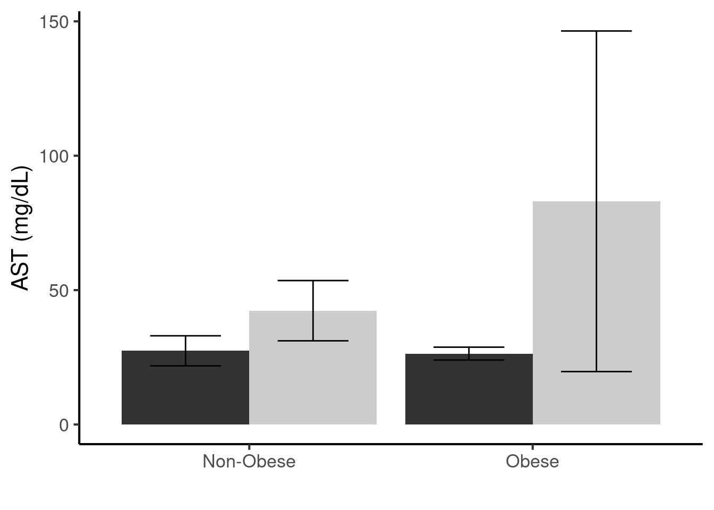{width=672}
:::

```{.r .cell-code}
ggplot(ast.summary,
       aes(y=mean,
           ymin=mean- se,
           ymax=mean+ se,
           x=Obesity,
           fill=as.factor(Cushings))) +
  geom_col(position = position_dodge(width = 0.9)) +
  geom_errorbar(
    position = position_dodge(width = 0.9), # must match geom_col
    width = 0.5
  ) +
  labs(y="AST (mg/dL)",x="") +
  theme_classic(base_size=16) +
  scale_fill_manual(values=color_scheme) +
  theme(legend.position="none")
```

::: {.cell-output-display}
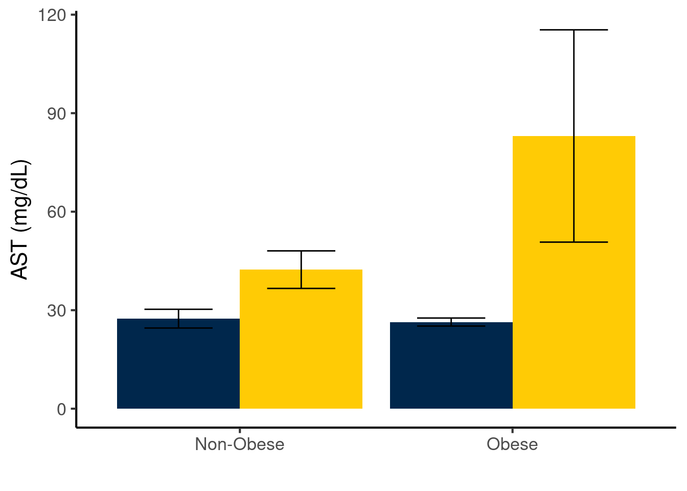{width=672}
:::

```{.r .cell-code}
ggplot(ast.data,
       aes(y=value,
           x=BMI,
           col=as.factor(Cushings))) +
  geom_point() +
  stat_smooth(method="loess", se=F) +
  labs(y="AST (mg/dL)",x="") +
  theme_classic(base_size=16) +
  scale_fill_grey() +
  theme(legend.position="none")
```

::: {.cell-output-display}
{width=672}
:::

```{.r .cell-code}
ggplot(ast.data,
       aes(y=value,
           x=BMI,
           col=as.factor(Cushings))) +
  geom_point() +
  stat_smooth(method="loess", se=F) +
  labs(y="AST (mg/dL)",x="") +
  theme_classic(base_size=16) +
  scale_fill_manual(values=color_scheme) +
  theme(legend.position="none")
```

::: {.cell-output-display}
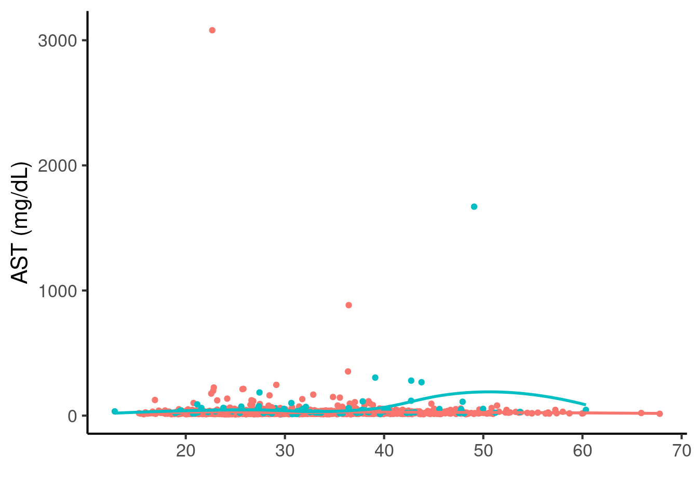{width=672}
:::

```{.r .cell-code}
library(knitr)
ast.summary %>% kable(caption="Summary of AST levels by obesity and pre-existing Cushing's")
```

::: {.cell-output-display}


Table: Summary of AST levels by obesity and pre-existing Cushing's

| Cushings|Obesity   |     mean|        se|        sd|    n|
|--------:|:---------|--------:|---------:|---------:|----:|
|        0|Non-Obese | 27.41903|  2.850992|  94.25535| 1093|
|        0|Obese     | 26.38257|  1.221533|  35.10713|  826|
|        1|Non-Obese | 42.34375|  5.719697|  32.35549|   32|
|        1|Obese     | 83.05769| 32.328517| 233.12425|   52|


:::

```{.r .cell-code}
library(broom)
lm(value ~ Cushings + Obesity + Cushings:Obesity,data=ast.data) |> 
  tidy() |> 
  kable(caption="2x2 ANOVA with Interaction for effects of Obesity and Cushings on AST")
```

::: {.cell-output-display}


Table: 2x2 ANOVA with Interaction for effects of Obesity and Cushings on AST

|term                  |  estimate| std.error|  statistic|   p.value|
|:---------------------|---------:|---------:|----------:|---------:|
|(Intercept)           | 27.419030|  2.487769| 11.0215356| 0.0000000|
|Cushings              | 14.924720| 14.750653|  1.0118006| 0.3117559|
|ObesityObese          | -1.036464|  3.791905| -0.2733359| 0.7846233|
|Cushings:ObesityObese | 41.750406| 18.864230|  2.2132048| 0.0269961|


:::
:::


##### AST Statistics

Used the fully adjusted model to test the interaction between Cushings's diagnoses and obesity.


::: {.cell}

```{.r .cell-code}
#used fully adjusted model
lm.ast <- lm(value ~ RaceEthnicity + AgeInYears + GenderName +                     Cushings * Obesity, data = ast.data)

## 1. Adjusted means
emm.ast <- emmeans(lm.ast, ~ Cushings | Obesity) %>%
  as.data.frame() %>%
  mutate(
    Outcome = "AST",
    Mean_CI = sprintf("%.2f (%.2f–%.2f)", emmean, lower.CL, upper.CL)
  ) %>%
  select(Outcome, Obesity, Cushings, Mean_CI)

## 2. Within-stratum Cushing–Control difference
contrast.ast <- contrast(emmeans(lm.ast, ~ Cushings | Obesity),
                             method = "revpairwise") %>%
  summary(infer = TRUE) %>%
  as.data.frame() %>%
  mutate(
    Outcome = "AST",
    Diff_CI = sprintf("%.2f (%.2f–%.2f)", estimate, lower.CL, upper.CL)
  ) %>%
  select(Outcome, Obesity, contrast, Diff_CI, p.value)

## 3. Interaction term
interaction_row.ast <- tidy(lm.ast) %>%
  filter(term == "Cushings:ObesityObese") %>%
  mutate(
    Outcome = "AST",
    Interaction_CI = sprintf("%.2f (%.2f–%.2f)",
                             estimate,
                             estimate - 1.96 * std.error,
                             estimate + 1.96 * std.error)
  ) %>%
  select(Outcome, term, estimate, std.error, statistic, p.value, Interaction_CI)

## 4. Combine into one publication-style table:
# Pivot adjusted means to wide format (Control vs Cushing side by side)
means_wide <- emm.ast %>%
  mutate(Cushings = ifelse(Cushings == 1, "Cushing", "Control")) %>%
  pivot_wider(names_from = Cushings, values_from = Mean_CI)

# Merge means with differences
table.ast <- means_wide %>%
  left_join(contrast.ast, by = c("Outcome", "Obesity"))

ast.summary %>% kable(caption="Summary of AST levels by obesity and pre-existing Cushing's")
```

::: {.cell-output-display}


Table: Summary of AST levels by obesity and pre-existing Cushing's

| Cushings|Obesity   |     mean|        se|        sd|    n|
|--------:|:---------|--------:|---------:|---------:|----:|
|        0|Non-Obese | 27.41903|  2.850992|  94.25535| 1093|
|        0|Obese     | 26.38257|  1.221533|  35.10713|  826|
|        1|Non-Obese | 42.34375|  5.719697|  32.35549|   32|
|        1|Obese     | 83.05769| 32.328517| 233.12425|   52|


:::

```{.r .cell-code}
lm(value ~ Cushings + Obesity + Cushings:Obesity,data=ast.data) |> 
  tidy() |> 
  kable(caption="2x2 ANOVA with Interaction for effects of Obesity and Cushings on AST")
```

::: {.cell-output-display}


Table: 2x2 ANOVA with Interaction for effects of Obesity and Cushings on AST

|term                  |  estimate| std.error|  statistic|   p.value|
|:---------------------|---------:|---------:|----------:|---------:|
|(Intercept)           | 27.419030|  2.487769| 11.0215356| 0.0000000|
|Cushings              | 14.924720| 14.750653|  1.0118006| 0.3117559|
|ObesityObese          | -1.036464|  3.791905| -0.2733359| 0.7846233|
|Cushings:ObesityObese | 41.750406| 18.864230|  2.2132048| 0.0269961|


:::

```{.r .cell-code}
lm(value ~ Cushings + BMI + Cushings:Obesity,data=ast.data) |> 
  tidy() |> 
  kable(caption="2x2 ANOVA with Interaction for effects of Obesity and BMI on AST")
```

::: {.cell-output-display}


Table: 2x2 ANOVA with Interaction for effects of Obesity and BMI on AST

|term                  |   estimate| std.error| statistic|   p.value|
|:---------------------|----------:|---------:|---------:|---------:|
|(Intercept)           | 24.0096571|  7.483368| 3.2084024| 0.0013559|
|Cushings              | 15.9148667| 14.719938| 1.0811776| 0.2797485|
|BMI                   |  0.0991493|  0.242383| 0.4090606| 0.6825390|
|Cushings:ObesityObese | 39.2513118| 18.821520| 2.0854485| 0.0371552|


:::
:::


### LDL Cholesterol


::: {.cell}

```{.r .cell-code}
m.out.ldl <- matchit(Cushings ~ AgeInYears + GenderCode + RaceEthnicity, 
                 data = complete.data |> filter(RESULT_CODE %in% c("LDLC","DLDL")), 
                 method = "nearest", 
                 exact = c("GenderCode", "RaceEthnicity"),
                 ratio=fold) # Force exact matches

summary(m.out.ldl, standardize = TRUE)  # Balance statistics[5]
```

::: {.cell-output .cell-output-stdout}

```

Call:
matchit(formula = Cushings ~ AgeInYears + GenderCode + RaceEthnicity, 
    data = filter(complete.data, RESULT_CODE %in% c("LDLC", "DLDL")), 
    method = "nearest", exact = c("GenderCode", "RaceEthnicity"), 
    ratio = fold)

Summary of Balance for All Data:
                                Means Treated Means Control Std. Mean Diff.
distance                               0.0013        0.0002          0.6649
AgeInYears                            40.8462       57.9223         -0.9733
GenderCodeF                            0.8462        0.5372          0.8563
GenderCodeM                            0.1538        0.4628         -0.8563
RaceEthnicityAsian                     0.0000        0.0971         -0.3280
RaceEthnicityBlack                     0.0000        0.0819         -0.2987
RaceEthnicityHispanic or Latino        0.0000        0.0301         -0.1761
RaceEthnicityOther                     0.0000        0.0319         -0.1814
RaceEthnicityWhite                     1.0000        0.7591          0.5634
                                Var. Ratio eCDF Mean eCDF Max
distance                           17.1672    0.1732   0.6282
AgeInYears                          1.2603    0.2255   0.5228
GenderCodeF                              .    0.3090   0.3090
GenderCodeM                              .    0.3090   0.3090
RaceEthnicityAsian                       .    0.0971   0.0971
RaceEthnicityBlack                       .    0.0819   0.0819
RaceEthnicityHispanic or Latino          .    0.0301   0.0301
RaceEthnicityOther                       .    0.0319   0.0319
RaceEthnicityWhite                       .    0.2409   0.2409

Summary of Balance for Matched Data:
                                Means Treated Means Control Std. Mean Diff.
distance                               0.0013        0.0011          0.1267
AgeInYears                            40.8462       41.6154         -0.0438
GenderCodeF                            0.8462        0.8462          0.0000
GenderCodeM                            0.1538        0.1538          0.0000
RaceEthnicityAsian                     0.0000        0.0000          0.0000
RaceEthnicityBlack                     0.0000        0.0000          0.0000
RaceEthnicityHispanic or Latino        0.0000        0.0000          0.0000
RaceEthnicityOther                     0.0000        0.0000          0.0000
RaceEthnicityWhite                     1.0000        1.0000          0.0000
                                Var. Ratio eCDF Mean eCDF Max Std. Pair Dist.
distance                            2.0766    0.0002   0.1538          0.1267
AgeInYears                          1.2490    0.0021   0.1538          0.0438
GenderCodeF                              .    0.0000   0.0000          0.0000
GenderCodeM                              .    0.0000   0.0000          0.0000
RaceEthnicityAsian                       .    0.0000   0.0000          0.0000
RaceEthnicityBlack                       .    0.0000   0.0000          0.0000
RaceEthnicityHispanic or Latino          .    0.0000   0.0000          0.0000
RaceEthnicityOther                       .    0.0000   0.0000          0.0000
RaceEthnicityWhite                       .    0.0000   0.0000          0.0000

Sample Sizes:
          Control Treated
All         68851      13
Matched       130      13
Unmatched   68721       0
Discarded       0       0
```


:::

```{.r .cell-code}
plot(m.out.ldl, type = "jitter")  
```

::: {.cell-output-display}
{width=672}
:::

::: {.cell-output .cell-output-stdout}

```
To identify the units, use first mouse button; to stop, use second.
```


:::

```{.r .cell-code}
matched_data.ldl <- match.data(m.out.ldl)

ldl.data <- 
  matched_data.ldl |>
  mutate(value = as.numeric(VALUE)) %>% #forced into numeric form  
  arrange(desc(DeID_AdmitDate)) %>% #sort by date
  distinct(DeID_PatientID,.keep_all = T) %>% #unique cases
  mutate(Obesity = if_else(BMI>30, "Obese","Non-Obese"))  |>
  filter(!is.na(Obesity)) 
```
:::


#### Demographics of Participants with LDL-C Values


::: {.cell}

```{.r .cell-code}
ldl.summary.gender <-
  ldl.data |>
  tabyl(GenderName,Cushings) |>
  adorn_percentages("col") %>%
  adorn_pct_formatting(digits = 2) %>%
  adorn_ns(position = "front") %>%
  mutate(across(starts_with("."), ~ paste0(.x))) %>%
  mutate(across(starts_with("."), ~ gsub("(.+)% \\((.+)\\)", "\\2 (\\1%)", .x))) |>
  rename(Controls=`0`,
         `Cushing's`=`1`,
         Group=GenderName)|>
  mutate(Cushings_count = as.numeric(str_extract(`Cushing's`, "^\\d+"))) |>
  arrange(desc(Cushings_count)) |>
  select(-Cushings_count)

ldl.summary.race.ethnicity <-
  ldl.data |>
  tabyl(RaceEthnicity,Cushings) |>
  adorn_percentages("col") %>%
  adorn_pct_formatting(digits = 2) %>%
  adorn_ns(position = "front") %>%
  mutate(across(starts_with("."), ~ paste0(.x))) %>%
  mutate(across(starts_with("."), ~ gsub("(.+)% \\((.+)\\)", "\\2 (\\1%)", .x))) |>
  rename(Controls=`0`,
         `Cushing's`=`1`,
         Group=RaceEthnicity) |>
  mutate(Cushings_count = as.numeric(str_extract(`Cushing's`, "^\\d+"))) |>
  arrange(desc(Cushings_count)) |>
  select(-Cushings_count)

ldl.summary.quant <-
  ldl.data |>
  group_by(Cushings) %>%
  summarise(
    Age_Mean = mean(AgeInYears, na.rm = TRUE),
    Age_SD = sd(AgeInYears),
    BMI_Mean = mean(BMI, na.rm = TRUE),
    BMI_SD = sd(BMI)
  ) %>%
  mutate(
    Age = sprintf("%.2f ± %.2f", Age_Mean, Age_SD),
    BMI = sprintf("%.2f ± %.2f", BMI_Mean, BMI_SD)
  ) %>%
  select(Cushings, Age, BMI)  |>
  pivot_longer(cols=c('Age','BMI')) |>
  pivot_wider(names_from=Cushings) |>
  rename(Controls=`0`,
         `Cushing's`=`1`,
         Group=name)


ldl.summary.table <-
  bind_rows(ldl.summary.quant,
          ldl.summary.gender,
          ldl.summary.race.ethnicity)

ldl.summary.table |>
  kable(caption="Demographic Summary for LDL-C List") |>
  kable_styling(full_width = FALSE, position = "center")
```

::: {.cell-output-display}

`````{=html}
<table class="table" style="width: auto !important; margin-left: auto; margin-right: auto;">
<caption>Demographic Summary for LDL-C List</caption>
 <thead>
  <tr>
   <th style="text-align:left;"> Group </th>
   <th style="text-align:left;"> Controls </th>
   <th style="text-align:left;"> Cushing's </th>
  </tr>
 </thead>
<tbody>
  <tr>
   <td style="text-align:left;"> Age </td>
   <td style="text-align:left;"> 41.78 ± 15.53 </td>
   <td style="text-align:left;"> 44.40 ± 17.11 </td>
  </tr>
  <tr>
   <td style="text-align:left;"> BMI </td>
   <td style="text-align:left;"> 29.95 ± 8.68 </td>
   <td style="text-align:left;"> 38.13 ± 14.28 </td>
  </tr>
  <tr>
   <td style="text-align:left;"> Female </td>
   <td style="text-align:left;"> 104 (83.87%) </td>
   <td style="text-align:left;"> 9 (90.00%) </td>
  </tr>
  <tr>
   <td style="text-align:left;"> Male </td>
   <td style="text-align:left;"> 20 (16.13%) </td>
   <td style="text-align:left;"> 1 (10.00%) </td>
  </tr>
  <tr>
   <td style="text-align:left;"> White </td>
   <td style="text-align:left;"> 124 (100.00%) </td>
   <td style="text-align:left;"> 10 (100.00%) </td>
  </tr>
</tbody>
</table>

`````

:::

```{.r .cell-code}
write_csv(ldl.summary.table,"Demographic Summary - LDL-C Sample.csv")

#statistics for BMI
ldl.data |>
  group_by(Cushings) |>
  summarize(shapiro.p=shapiro.test(sample(BMI,3000,replace=T))$p.value) |>
  kable(caption="Shapiro Wilk test for BMI for LDL-C sample", digits=c(1,99)) |>
  kable_styling(full_width = FALSE, position = "center")
```

::: {.cell-output-display}

`````{=html}
<table class="table" style="width: auto !important; margin-left: auto; margin-right: auto;">
<caption>Shapiro Wilk test for BMI for LDL-C sample</caption>
 <thead>
  <tr>
   <th style="text-align:right;"> Cushings </th>
   <th style="text-align:right;"> shapiro.p </th>
  </tr>
 </thead>
<tbody>
  <tr>
   <td style="text-align:right;"> 0 </td>
   <td style="text-align:right;"> 9.606608e-43 </td>
  </tr>
  <tr>
   <td style="text-align:right;"> 1 </td>
   <td style="text-align:right;"> 2.079814e-42 </td>
  </tr>
</tbody>
</table>

`````

:::

```{.r .cell-code}
wilcox.test(BMI~Cushings,ldl.data) |>
  tidy() |>
  kable(caption="Mann Whitney test for effect of Cushing's on BMI for LDL-C sample",
        digits=c(1,99,1,1)) |>
  kable_styling(full_width = FALSE, position = "center")
```

::: {.cell-output-display}

`````{=html}
<table class="table" style="width: auto !important; margin-left: auto; margin-right: auto;">
<caption>Mann Whitney test for effect of Cushing's on BMI for LDL-C sample</caption>
 <thead>
  <tr>
   <th style="text-align:right;"> statistic </th>
   <th style="text-align:right;"> p.value </th>
   <th style="text-align:left;"> method </th>
   <th style="text-align:left;"> alternative </th>
  </tr>
 </thead>
<tbody>
  <tr>
   <td style="text-align:right;"> 417 </td>
   <td style="text-align:right;"> 0.08643623 </td>
   <td style="text-align:left;"> Wilcoxon rank sum test with continuity correction </td>
   <td style="text-align:left;"> two.sided </td>
  </tr>
</tbody>
</table>

`````

:::

```{.r .cell-code}
chisq.test(x=as.numeric(separate(ldl.summary.gender, `Cushing's`, sep=" ", into=c("n","Pct")) |>
                          pull(n)),p=c(0.5,0.5)) |>
  tidy() |>
  kable(caption="Chi-squared test for equal proportions of males and females in the LDL-C sample",
        digits=c(1,99,1,1)) |>
  kable_styling(full_width = FALSE, position = "center")
```

::: {.cell-output-display}

`````{=html}
<table class="table" style="width: auto !important; margin-left: auto; margin-right: auto;">
<caption>Chi-squared test for equal proportions of males and females in the LDL-C sample</caption>
 <thead>
  <tr>
   <th style="text-align:right;"> statistic </th>
   <th style="text-align:right;"> p.value </th>
   <th style="text-align:right;"> parameter </th>
   <th style="text-align:left;"> method </th>
  </tr>
 </thead>
<tbody>
  <tr>
   <td style="text-align:right;"> 6.4 </td>
   <td style="text-align:right;"> 0.01141204 </td>
   <td style="text-align:right;"> 1 </td>
   <td style="text-align:left;"> Chi-squared test for given probabilities </td>
  </tr>
</tbody>
</table>

`````

:::
:::

::: {.cell}

```{.r .cell-code}
ldl.summary <-
  ldl.data %>%
  group_by(Cushings,Obesity) |>
  summarize(mean=mean(value,na.rm=T),
            se=se(value),
            sd=sd(value,na.rm=T),
            n=length(value))

ggplot(ldl.summary,
       aes(y=mean,
           ymin=mean- se,
           ymax=mean+ se,
           x=Obesity,
           fill=as.factor(Cushings))) +
  geom_col(position = position_dodge(width = 0.9)) +
  geom_errorbar(
    position = position_dodge(width = 0.9), # must match geom_col
    width = 0.5
  ) +
  labs(y="LDL Cholesterol (mg/dL)", x="") +
  theme_classic(base_size=16) +
  scale_fill_grey() +
  theme(legend.position="none")
```

::: {.cell-output-display}
{width=672}
:::

```{.r .cell-code}
ggplot(ldl.summary,
       aes(y=mean,
           ymin=mean- se,
           ymax=mean+ se,
           x=Obesity,
           fill=as.factor(Cushings))) +
  geom_col(position = position_dodge(width = 0.9)) +
  geom_errorbar(
    position = position_dodge(width = 0.9), # must match geom_col
    width = 0.5
  ) +
  labs(y="LDL Cholesterol (mg/dL)", x="") +
  theme_classic(base_size=16) +
  scale_fill_manual(values=color_scheme) +
  theme(legend.position="none")
```

::: {.cell-output-display}
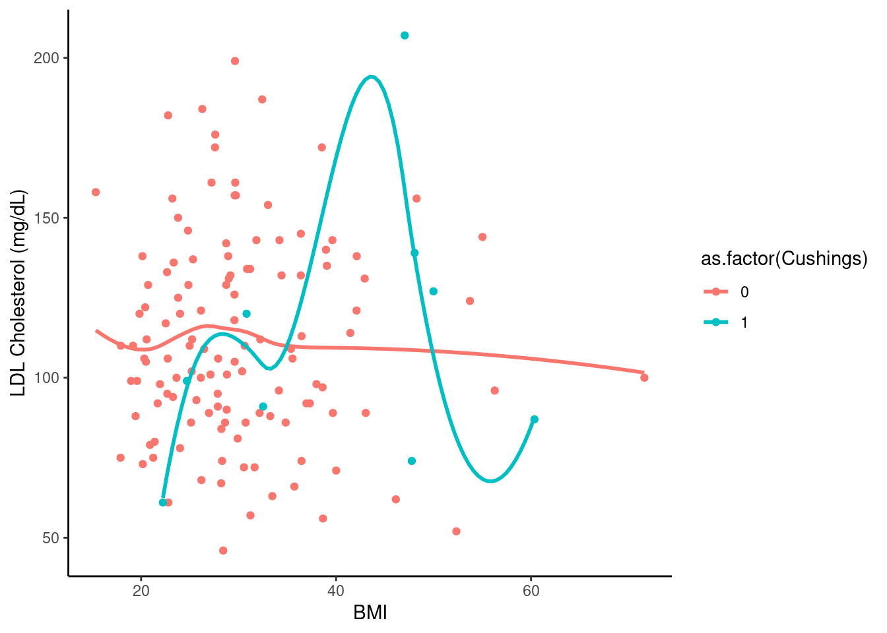{width=672}
:::

```{.r .cell-code}
ggplot(ldl.data,
       aes(y=value,
           x=BMI,
           col=as.factor(Cushings))) +
  geom_point() +
  stat_smooth(method="loess", se=F) +
  labs(y="LDL Cholesterol (mg/dL)",x="") +
  theme_classic(base_size=16) +
  scale_fill_grey() +
  theme(legend.position="none")
```

::: {.cell-output-display}
{width=672}
:::

```{.r .cell-code}
ggplot(ldl.data,
       aes(y=value,
           x=BMI,
           col=as.factor(Cushings))) +
  geom_point() +
  stat_smooth(method="loess", se=F) +
  labs(y="LDL Cholesterol (mg/dL)",x="") +
  theme_classic(base_size=16) +
  scale_fill_manual(values=color_scheme) +
  theme(legend.position="none")
```

::: {.cell-output-display}
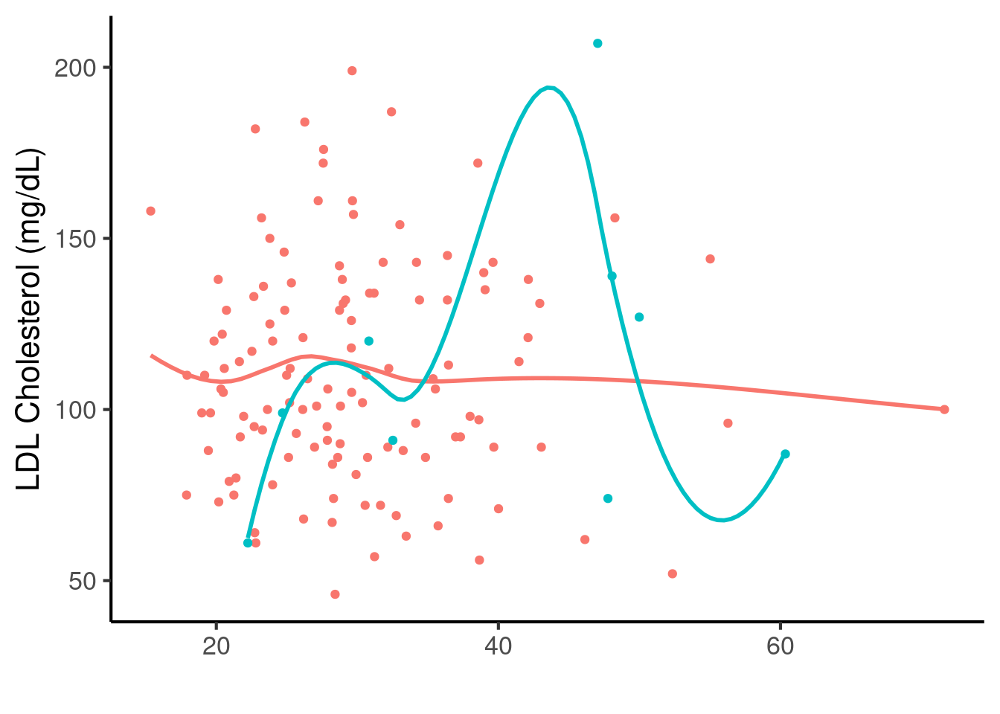{width=672}
:::

```{.r .cell-code}
ldl.summary %>% kable(caption="Summary of LDL-C levels by obesity and pre-existing Cushing's")
```

::: {.cell-output-display}


Table: Summary of LDL-C levels by obesity and pre-existing Cushing's

| Cushings|Obesity   |     mean|        se|       sd|  n|
|--------:|:---------|--------:|---------:|--------:|--:|
|        0|Non-Obese | 112.6400|  3.685796| 31.91993| 75|
|        0|Obese     | 107.3878|  4.682779| 32.77945| 49|
|        1|Non-Obese |  80.0000| 15.513435| 26.87006|  3|
|        1|Obese     | 120.7143| 16.918170| 44.76127|  7|


:::

```{.r .cell-code}
lm(value ~ Cushings + Obesity + Cushings:Obesity,data=ldl.data) |> 
  tidy() |> 
  kable(caption="2x2 ANOVA with Interaction for effects of Obesity and Cushings on LDL-C")
```

::: {.cell-output-display}


Table: 2x2 ANOVA with Interaction for effects of Obesity and Cushings on LDL-C

|term                  |   estimate| std.error|  statistic|   p.value|
|:---------------------|----------:|---------:|----------:|---------:|
|(Intercept)           | 112.640000|  3.800127| 29.6411143| 0.0000000|
|Cushings              | -32.640000| 23.579168| -1.3842728| 0.1686650|
|ObesityObese          |  -5.252245|  6.045203| -0.8688285| 0.3865545|
|Cushings:ObesityObese |  45.966531| 27.070377|  1.6980381| 0.0919115|


:::

```{.r .cell-code}
lm(value ~ Cushings + BMI + Cushings:Obesity,data=ldl.data) |> 
  tidy() |> 
  kable(caption="2x2 ANOVA with Interaction for effects of Obesity and BMI on LDL-C")
```

::: {.cell-output-display}


Table: 2x2 ANOVA with Interaction for effects of Obesity and BMI on LDL-C

|term                  |    estimate|  std.error|  statistic|   p.value|
|:---------------------|-----------:|----------:|----------:|---------:|
|(Intercept)           | 113.2012807| 10.3593764| 10.9274223| 0.0000000|
|Cushings              | -31.1355830| 23.6180023| -1.3182988| 0.1897396|
|BMI                   |  -0.0880325|  0.3314124| -0.2656281| 0.7909497|
|Cushings:ObesityObese |  42.6294120| 27.4214060|  1.5546034| 0.1224905|


:::
:::


#### LDL-C Statistics

Used the fully adjusted model to test the interaction between Cushings's diagnoses and obesity.  

**Important**: This model unlike all the otehrs was not adjusted for RaceEthnicity, as all participants with a LDL-C value were of the same Race/Ethnicity (White).


::: {.cell}

```{.r .cell-code}
#used fully adjusted model
lm.ldl <- lm(value ~ AgeInYears + GenderName + Cushings * Obesity, data = ldl.data)

## 1. Adjusted means
emm.ldl <- emmeans(lm.ldl, ~ Cushings | Obesity) %>%
  as.data.frame() %>%
  mutate(
    Outcome = "LDL-C",
    Mean_CI = sprintf("%.2f (%.2f–%.2f)", emmean, lower.CL, upper.CL)
  ) %>%
  select(Outcome, Obesity, Cushings, Mean_CI)

## 2. Within-stratum Cushing–Control difference
contrast.ldl <- contrast(emmeans(lm.ldl, ~ Cushings | Obesity),
                             method = "revpairwise") %>%
  summary(infer = TRUE) %>%
  as.data.frame() %>%
  mutate(
    Outcome = "LDL-C",
    Diff_CI = sprintf("%.2f (%.2f–%.2f)", estimate, lower.CL, upper.CL)
  ) %>%
  select(Outcome, Obesity, contrast, Diff_CI, p.value)

## 3. Interaction term
interaction_row.ldl <- tidy(lm.ldl) %>%
  filter(term == "Cushings:ObesityObese") %>%
  mutate(
    Outcome = "LDL-C",
    Interaction_CI = sprintf("%.2f (%.2f–%.2f)",
                             estimate,
                             estimate - 1.96 * std.error,
                             estimate + 1.96 * std.error)
  ) %>%
  select(Outcome, term, estimate, std.error, statistic, p.value, Interaction_CI)

## 4. Combine into one publication-style table:
# Pivot adjusted means to wide format (Control vs Cushing side by side)
means_wide <- emm.ldl %>%
  mutate(Cushings = ifelse(Cushings == 1, "Cushing", "Control")) %>%
  pivot_wider(names_from = Cushings, values_from = Mean_CI)

# Merge means with differences
table.ldl <- means_wide %>%
  left_join(contrast.ldl, by = c("Outcome", "Obesity"))

ldl.summary %>% kable(caption="Summary of LDL-C levels by obesity and pre-existing Cushing's")
```

::: {.cell-output-display}


Table: Summary of LDL-C levels by obesity and pre-existing Cushing's

| Cushings|Obesity   |     mean|        se|       sd|  n|
|--------:|:---------|--------:|---------:|--------:|--:|
|        0|Non-Obese | 112.6400|  3.685796| 31.91993| 75|
|        0|Obese     | 107.3878|  4.682779| 32.77945| 49|
|        1|Non-Obese |  80.0000| 15.513435| 26.87006|  3|
|        1|Obese     | 120.7143| 16.918170| 44.76127|  7|


:::

```{.r .cell-code}
lm(value ~ Cushings + Obesity + Cushings:Obesity,data=ldl.data) |> 
  tidy() |> 
  kable(caption="2x2 ANOVA with Interaction for effects of Obesity and Cushings on LDL-C")
```

::: {.cell-output-display}


Table: 2x2 ANOVA with Interaction for effects of Obesity and Cushings on LDL-C

|term                  |   estimate| std.error|  statistic|   p.value|
|:---------------------|----------:|---------:|----------:|---------:|
|(Intercept)           | 112.640000|  3.800127| 29.6411143| 0.0000000|
|Cushings              | -32.640000| 23.579168| -1.3842728| 0.1686650|
|ObesityObese          |  -5.252245|  6.045203| -0.8688285| 0.3865545|
|Cushings:ObesityObese |  45.966531| 27.070377|  1.6980381| 0.0919115|


:::

```{.r .cell-code}
lm(value ~ Cushings + BMI + Cushings:Obesity,data=ldl.data) |> 
  tidy() |> 
  kable(caption="2x2 ANOVA with Interaction for effects of Obesity and BMI on LDL-C")
```

::: {.cell-output-display}


Table: 2x2 ANOVA with Interaction for effects of Obesity and BMI on LDL-C

|term                  |    estimate|  std.error|  statistic|   p.value|
|:---------------------|-----------:|----------:|----------:|---------:|
|(Intercept)           | 113.2012807| 10.3593764| 10.9274223| 0.0000000|
|Cushings              | -31.1355830| 23.6180023| -1.3182988| 0.1897396|
|BMI                   |  -0.0880325|  0.3314124| -0.2656281| 0.7909497|
|Cushings:ObesityObese |  42.6294120| 27.4214060|  1.5546034| 0.1224905|


:::
:::


### Blood Pressure

Blood pressure data is in a separate file (NursingStandardVitalSigns.csv and ../controls/NursingStandardVitalSigns.csv).  We have mean noninvasive blood pressure, as well as systolic and diastolic.  These data, similar to lab results need to be mapped to encounter data 


::: {.cell}

```{.r .cell-code}
bp.data.cases <- read_csv(bp.filename.cases) |>
  left_join(case.encounters.all) |>
  left_join(case.demographics, by="DeID_PatientID") 

bp.data.controls <- read_csv(bp.filename.controls) |>
  left_join(control.encounters.all) |>
  left_join(control.demographics, by="DeID_PatientID") 

bp.results <- bind_rows(bp.data.controls |> mutate(Cushings=0),
          bp.data.cases |> mutate(Cushings=1)) |>  #combined, new column indicating cushings
  mutate(cushings_procedure = ymd(cushings_procedure),
         DeID_AdmitDate = mdy_hm(DeID_AdmitDate)) |> 
  mutate(TimePoint = case_when(cushings_procedure<= DeID_AdmitDate ~ "Before",
                               cushings_procedure > DeID_AdmitDate ~ "After",
                               .default="Unknown")) %>% # defined each encounter as before or after
  mutate(ProcedureFollowUp = cushings_procedure - DeID_AdmitDate) #used to define point between the lab result and the procedure.

#filtered out lab results outside of our interval
bp.results.filtered <-
  bp.results |>
  filter(ProcedureFollowUp<procedure.result.interval | is.na(ProcedureFollowUp)) |>
  filter(TimePoint!="After")
  
#filtered out if the age, gender, race, ethnicity was NA for a patient.
bp.data.race.ethnicity.age <-
  bp.results.filtered |>
  filter(!if_any(c(AgeInYears, GenderCode, RaceCode, EthnicityCode), is.na)) #removed if they had missing data for age, gender, race or ethnicity

#this is the complete dataset  
bp.data  <-
  bp.data.race.ethnicity.age |>
  mutate(RaceEthnicity = case_when(EthnicityCode=="HL"~"Hispanic or Latino",
                                   RaceCode=="C"~"White",
                                   RaceCode=="AA"~"Black",
                                   RaceCode=="A"~"Asian",
                                   .default="Other")) #defined race/ethnicity categories
```
:::


#### Inclusion and Exclusion for Blood Pressure Data

We began with 97442 controls who had lab data, and **339** cases with Cushing's Disease.

* **Had Laboratory Results**: We also removed 168 lab results from Cushing's patients because they were outside of our acceptable window of 365 days before their procedure.  This eliminated a total of **1** Cushings patients from our dataset.

* **Missing Demographic Data** After filtering out missing demographic data we had 311 cases and 96780 controls with lab results.  The specific pieces of missing information are found here:


::: {.cell}

```{.r .cell-code}
bp.results.filtered |>
  filter(Cushings==1) |> #only for cushings data
  group_by(DeID_PatientID) %>%
  summarise(
    Age_na = sum(is.na(AgeInYears)),
    Gender_na = sum(is.na(GenderCode)),
    Race_na = sum(is.na(RaceCode)),
    Ethnicity_na = sum(is.na(EthnicityCode)),
    Any_na = any(is.na(AgeInYears) | is.na(GenderCode) | is.na(RaceCode) |is.na(EthnicityCode))) |>
  ungroup() |>
    pivot_longer(cols = ends_with("_na"),
                 names_to = "field",
                 values_to = "has_na") |>
  filter(has_na!=0) %>%
  count(field, name = "n_patients_with_NA")-> missing.demographic.summary.bp

library(knitr)
missing.demographic.summary.bp |> arrange(desc(n_patients_with_NA)) |> kable(caption="Summary of exclusions from Cushing's patient pool due to missing demographic data, for blood pressure measures")
```

::: {.cell-output-display}


Table: Summary of exclusions from Cushing's patient pool due to missing demographic data, for blood pressure measures

|field        | n_patients_with_NA|
|:------------|------------------:|
|Any_na       |                 34|
|Ethnicity_na |                 24|
|Gender_na    |                 15|
|Race_na      |                 15|
|Age_na       |                 12|


:::
:::


Our final dataset for blood pressure therefore included **365** Cushing's patients, and we had the ability to draw from **69273** control patients.


#### Blood Pressure Propensity Mapping


::: {.cell}

```{.r .cell-code}
m.out.bp <- matchit(Cushings ~ AgeInYears + GenderCode + RaceEthnicity, 
                 data = bp.data, 
                 method = "nearest", 
                 exact = c("GenderCode", "RaceEthnicity"),# Force exact matches
                 ratio=fold) 

summary(m.out.bp, standardize = TRUE)  # Balance statistics[5]
```

::: {.cell-output .cell-output-stdout}

```

Call:
matchit(formula = Cushings ~ AgeInYears + GenderCode + RaceEthnicity, 
    data = bp.data, method = "nearest", exact = c("GenderCode", 
        "RaceEthnicity"), ratio = fold)

Summary of Balance for All Data:
                                Means Treated Means Control Std. Mean Diff.
distance                               0.0260        0.0113          0.6814
AgeInYears                            47.5079       61.0895         -0.8232
GenderCodeF                            0.8325        0.5786          0.6799
GenderCodeM                            0.1675        0.4214         -0.6799
RaceEthnicityAsian                     0.0133        0.0549         -0.3639
RaceEthnicityBlack                     0.0446        0.1204         -0.3670
RaceEthnicityHispanic or Latino        0.0327        0.0308          0.0107
RaceEthnicityOther                     0.0253        0.0319         -0.0417
RaceEthnicityWhite                     0.8841        0.7620          0.3813
                                Var. Ratio eCDF Mean eCDF Max
distance                            2.7058    0.2343   0.4892
AgeInYears                          0.8598    0.1671   0.3754
GenderCodeF                              .    0.2539   0.2539
GenderCodeM                              .    0.2539   0.2539
RaceEthnicityAsian                       .    0.0417   0.0417
RaceEthnicityBlack                       .    0.0758   0.0758
RaceEthnicityHispanic or Latino          .    0.0019   0.0019
RaceEthnicityOther                       .    0.0066   0.0066
RaceEthnicityWhite                       .    0.1221   0.1221

Summary of Balance for Matched Data:
                                Means Treated Means Control Std. Mean Diff.
distance                               0.0260        0.0250          0.0474
AgeInYears                            47.5079       47.9690         -0.0279
GenderCodeF                            0.8325        0.8325         -0.0000
GenderCodeM                            0.1675        0.1675         -0.0000
RaceEthnicityAsian                     0.0133        0.0133         -0.0000
RaceEthnicityBlack                     0.0446        0.0446         -0.0000
RaceEthnicityHispanic or Latino        0.0327        0.0327         -0.0000
RaceEthnicityOther                     0.0253        0.0253         -0.0000
RaceEthnicityWhite                     0.8841        0.8841         -0.0000
                                Var. Ratio eCDF Mean eCDF Max Std. Pair Dist.
distance                            1.2709    0.0022   0.0424          0.0516
AgeInYears                          1.1164    0.0063   0.0619          0.0351
GenderCodeF                              .    0.0000   0.0000          0.0000
GenderCodeM                              .    0.0000   0.0000          0.0000
RaceEthnicityAsian                       .    0.0000   0.0000          0.0000
RaceEthnicityBlack                       .    0.0000   0.0000          0.0000
RaceEthnicityHispanic or Latino          .    0.0000   0.0000          0.0000
RaceEthnicityOther                       .    0.0000   0.0000          0.0000
RaceEthnicityWhite                       .    0.0000   0.0000          0.0000

Sample Sizes:
          Control Treated
All       1640345   19054
Matched    190540   19054
Unmatched 1449805       0
Discarded       0       0
```


:::

```{.r .cell-code}
plot(m.out.bp, type = "jitter")         # Propensity score distribution[5]
```

::: {.cell-output-display}
{width=672}
:::

::: {.cell-output .cell-output-stdout}

```
To identify the units, use first mouse button; to stop, use second.
```


:::

```{.r .cell-code}
matched_data <- match.data(m.out.bp)

bp.data <- 
  matched_data |>
  arrange(desc(DeID_AdmitDate)) %>% #sort by date
  distinct(DeID_PatientID,.keep_all = T) %>% #unique cases
  mutate(Obesity = if_else(BMI>30, "Obese","Non-Obese"))  |>
  mutate(ObesityIII = if_else(BMI>40, "Class III Obese","All Others"))  |>
  filter(!is.na(Obesity)) |>
  mutate(MAP_imputed = if_else(
    is.na(BPMeanNonInvasive) & !is.na(BPSysNonInvasive) & !is.na(BPDiaNonInvasive),
    (BPSysNonInvasive + 2*BPDiaNonInvasive)/3,
    BPMeanNonInvasive
  ))

# Calculate agreement statistics
map_agreement <- bp.data %>%
  filter(!is.na(BPMeanNonInvasive) & !is.na(BPSysNonInvasive) & !is.na(BPDiaNonInvasive)) %>%
  mutate(MAP_calc = (BPSysNonInvasive + 2*BPDiaNonInvasive)/3,
         difference = BPMeanNonInvasive - MAP_calc) %>%
  summarise(
    mean_diff = round(mean(difference), 2),
    sd_diff = round(sd(difference), 2),
    correlation = round(cor(BPMeanNonInvasive, MAP_calc), 3)
  )

# Count how many will be imputed
n_imputed <- bp.data %>%
  filter(is.na(BPMeanNonInvasive) & !is.na(BPSysNonInvasive) & !is.na(BPDiaNonInvasive)) %>%
  nrow()
```
:::


Mean arterial pressure was directly measured in the majority of cases. When MAP was missing but systolic and diastolic BP were available (n=22873), MAP was calculated as (SBP + 2×DBP)/3. The calculated values showed high agreement with measured MAP (r=0.963, mean difference=1.32 ± 3.38 mmHg) in cases where both were available.


#### Demographics of Participants with Blood Pressure Values


::: {.cell}

```{.r .cell-code}
bp.summary.gender <-
  bp.data |>
  tabyl(GenderName,Cushings) |>
  adorn_percentages("col") %>%
  adorn_pct_formatting(digits = 2) %>%
  adorn_ns(position = "front") %>%
  mutate(across(starts_with("."), ~ paste0(.x))) %>%
  mutate(across(starts_with("."), ~ gsub("(.+)% \\((.+)\\)", "\\2 (\\1%)", .x))) |>
  rename(Controls=`0`,
         `Cushing's`=`1`,
         Group=GenderName)|>
  mutate(Cushings_count = as.numeric(str_extract(`Cushing's`, "^\\d+"))) |>
  arrange(desc(Cushings_count)) |>
  select(-Cushings_count)

bp.summary.race.ethnicity <-
  bp.data |>
  tabyl(RaceEthnicity,Cushings) |>
  adorn_percentages("col") %>%
  adorn_pct_formatting(digits = 2) %>%
  adorn_ns(position = "front") %>%
  mutate(across(starts_with("."), ~ paste0(.x))) %>%
  mutate(across(starts_with("."), ~ gsub("(.+)% \\((.+)\\)", "\\2 (\\1%)", .x))) |>
  rename(Controls=`0`,
         `Cushing's`=`1`,
         Group=RaceEthnicity) |>
  mutate(Cushings_count = as.numeric(str_extract(`Cushing's`, "^\\d+"))) |>
  arrange(desc(Cushings_count)) |>
  select(-Cushings_count)

bp.summary.quant <-
  bp.data |>
  group_by(Cushings) %>%
  summarise(
    Age_Mean = mean(AgeInYears, na.rm = TRUE),
    Age_SD = sd(AgeInYears),
    BMI_Mean = mean(BMI, na.rm = TRUE),
    BMI_SD = sd(BMI)
  ) %>%
  mutate(
    Age = sprintf("%.2f ± %.2f", Age_Mean, Age_SD),
    BMI = sprintf("%.2f ± %.2f", BMI_Mean, BMI_SD)
  ) %>%
  select(Cushings, Age, BMI)  |>
  pivot_longer(cols=c('Age','BMI')) |>
  pivot_wider(names_from=Cushings) |>
  rename(Controls=`0`,
         `Cushing's`=`1`,
         Group=name)


bp.summary.table <-
  bind_rows(bp.summary.quant,
          bp.summary.gender,
          bp.summary.race.ethnicity)

bp.summary.table |>
  kable(caption="Demographic Summary for Blood Pressure List") |>
  kable_styling(full_width = FALSE, position = "center")
```

::: {.cell-output-display}

`````{=html}
<table class="table" style="width: auto !important; margin-left: auto; margin-right: auto;">
<caption>Demographic Summary for Blood Pressure List</caption>
 <thead>
  <tr>
   <th style="text-align:left;"> Group </th>
   <th style="text-align:left;"> Controls </th>
   <th style="text-align:left;"> Cushing's </th>
  </tr>
 </thead>
<tbody>
  <tr>
   <td style="text-align:left;"> Age </td>
   <td style="text-align:left;"> 44.09 ± 16.08 </td>
   <td style="text-align:left;"> 46.26 ± 16.01 </td>
  </tr>
  <tr>
   <td style="text-align:left;"> BMI </td>
   <td style="text-align:left;"> 28.66 ± 7.19 </td>
   <td style="text-align:left;"> 34.96 ± 14.35 </td>
  </tr>
  <tr>
   <td style="text-align:left;"> Female </td>
   <td style="text-align:left;"> 18,774 (81.47%) </td>
   <td style="text-align:left;"> 248 (80.78%) </td>
  </tr>
  <tr>
   <td style="text-align:left;"> Male </td>
   <td style="text-align:left;"> 4,270 (18.53%) </td>
   <td style="text-align:left;"> 59 (19.22%) </td>
  </tr>
  <tr>
   <td style="text-align:left;"> White </td>
   <td style="text-align:left;"> 20,375 (88.42%) </td>
   <td style="text-align:left;"> 265 (86.32%) </td>
  </tr>
  <tr>
   <td style="text-align:left;"> Black </td>
   <td style="text-align:left;"> 799  (3.47%) </td>
   <td style="text-align:left;"> 18  (5.86%) </td>
  </tr>
  <tr>
   <td style="text-align:left;"> Hispanic or Latino </td>
   <td style="text-align:left;"> 755  (3.28%) </td>
   <td style="text-align:left;"> 9  (2.93%) </td>
  </tr>
  <tr>
   <td style="text-align:left;"> Other </td>
   <td style="text-align:left;"> 560  (2.43%) </td>
   <td style="text-align:left;"> 9  (2.93%) </td>
  </tr>
  <tr>
   <td style="text-align:left;"> Asian </td>
   <td style="text-align:left;"> 555  (2.41%) </td>
   <td style="text-align:left;"> 6  (1.95%) </td>
  </tr>
</tbody>
</table>

`````

:::

```{.r .cell-code}
write_csv(bp.summary.table,"Demographic Summary - Blood Pressure Sample.csv")

#statistics for BMI
bp.data |>
  group_by(Cushings) |>
  summarize(shapiro.p=shapiro.test(sample(BMI,3000,replace=T))$p.value) |>
  kable(caption="Shapiro Wilk test for BMI for Blood Pressure sample", digits=c(1,99)) |>
  kable_styling(full_width = FALSE, position = "center")
```

::: {.cell-output-display}

`````{=html}
<table class="table" style="width: auto !important; margin-left: auto; margin-right: auto;">
<caption>Shapiro Wilk test for BMI for Blood Pressure sample</caption>
 <thead>
  <tr>
   <th style="text-align:right;"> Cushings </th>
   <th style="text-align:right;"> shapiro.p </th>
  </tr>
 </thead>
<tbody>
  <tr>
   <td style="text-align:right;"> 0 </td>
   <td style="text-align:right;"> 4.090639e-37 </td>
  </tr>
  <tr>
   <td style="text-align:right;"> 1 </td>
   <td style="text-align:right;"> 6.079581e-69 </td>
  </tr>
</tbody>
</table>

`````

:::

```{.r .cell-code}
wilcox.test(BMI~Cushings,bp.data) |>
  tidy() |>
  kable(caption="Mann Whitney test for effect of Cushing's on BMI for Blood Pressure sample",
        digits=c(1,99,1,1)) |>
  kable_styling(full_width = FALSE, position = "center")
```

::: {.cell-output-display}

`````{=html}
<table class="table" style="width: auto !important; margin-left: auto; margin-right: auto;">
<caption>Mann Whitney test for effect of Cushing's on BMI for Blood Pressure sample</caption>
 <thead>
  <tr>
   <th style="text-align:right;"> statistic </th>
   <th style="text-align:right;"> p.value </th>
   <th style="text-align:left;"> method </th>
   <th style="text-align:left;"> alternative </th>
  </tr>
 </thead>
<tbody>
  <tr>
   <td style="text-align:right;"> 2080200 </td>
   <td style="text-align:right;"> 2.083931e-35 </td>
   <td style="text-align:left;"> Wilcoxon rank sum test with continuity correction </td>
   <td style="text-align:left;"> two.sided </td>
  </tr>
</tbody>
</table>

`````

:::

```{.r .cell-code}
chisq.test(x=as.numeric(separate(bp.summary.gender, `Cushing's`, sep=" ", into=c("n","Pct")) |>
                          pull(n)),p=c(0.5,0.5)) |>
  tidy() |>
  kable(caption="Chi-squared test for equal proportions of males and females in the Blood Pressure sample",
        digits=c(1,99,1,1)) |>
  kable_styling(full_width = FALSE, position = "center")
```

::: {.cell-output-display}

`````{=html}
<table class="table" style="width: auto !important; margin-left: auto; margin-right: auto;">
<caption>Chi-squared test for equal proportions of males and females in the Blood Pressure sample</caption>
 <thead>
  <tr>
   <th style="text-align:right;"> statistic </th>
   <th style="text-align:right;"> p.value </th>
   <th style="text-align:right;"> parameter </th>
   <th style="text-align:left;"> method </th>
  </tr>
 </thead>
<tbody>
  <tr>
   <td style="text-align:right;"> 116.4 </td>
   <td style="text-align:right;"> 3.973874e-27 </td>
   <td style="text-align:right;"> 1 </td>
   <td style="text-align:left;"> Chi-squared test for given probabilities </td>
  </tr>
</tbody>
</table>

`````

:::
:::


#### Mean Arterial Pressure


::: {.cell}

```{.r .cell-code}
#MAP
bp.summary.map <-
  bp.data %>%
  group_by(Cushings,Obesity) |>
  summarize(mean=mean(MAP_imputed,na.rm=T),
            se=se(MAP_imputed),
            sd=sd(MAP_imputed,na.rm=T),
            n=length(MAP_imputed))

ggplot(bp.summary.map,
       aes(y=mean,
           ymin=mean- se,
           ymax=mean+ se,
           x=Obesity,
           fill=as.factor(Cushings))) +
  geom_col(position = position_dodge(width = 0.9)) +
  geom_errorbar(
    position = position_dodge(width = 0.9), # must match geom_col
    width = 0.5
  ) +
  labs(y="Blood Pressure (Mean; mmHg)", x="") +
  geom_hline(yintercept = 60, linetype = "solid", color = "gray30") +
  coord_cartesian(ylim = c(60, NA)) +  # Use this instead of scale_y_continuous
  theme_classic(base_size=16) +
  scale_fill_grey() +
  theme(legend.position="none")
```

::: {.cell-output-display}
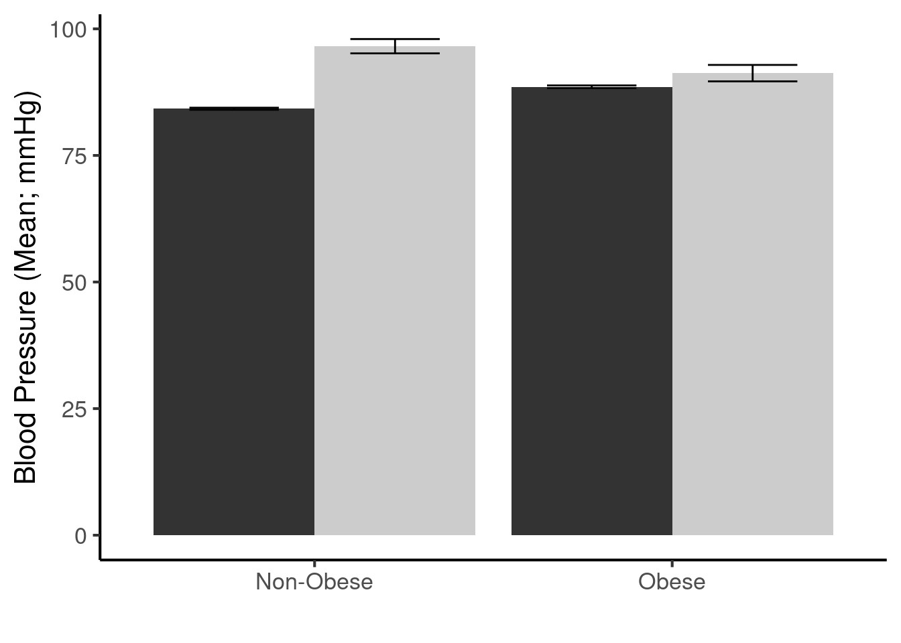{width=672}
:::

```{.r .cell-code}
ggplot(bp.summary.map,
       aes(y=mean,
           ymin=mean- se,
           ymax=mean+ se,
           x=Obesity,
           fill=as.factor(Cushings))) +
  geom_col(position = position_dodge(width = 0.9)) +
  geom_errorbar(
    position = position_dodge(width = 0.9), # must match geom_col
    width = 0.5
  ) +
  labs(y="Blood Pressure (Mean; mmHg)", x="") +
  geom_hline(yintercept = 60, linetype = "solid", color = "gray30") +
  coord_cartesian(ylim = c(60, NA)) +  # Use this instead of scale_y_continuous
  theme_classic(base_size=16) +
  scale_fill_manual(values=color_scheme) +
  theme(legend.position="none")
```

::: {.cell-output-display}
{width=672}
:::

```{.r .cell-code}
ggplot(bp.data,
       aes(y=MAP_imputed,
           x=BMI,
           col=as.factor(Cushings))) +
  geom_point() +
  stat_smooth(method="loess", se=F) +
  labs(y="Blood Pressure (Mean; mmHg)",x="") +
  geom_hline(yintercept = 60, linetype = "solid", color = "gray30") +
  coord_cartesian(ylim = c(60, NA)) +  # Use this instead of scale_y_continuous
  theme_classic(base_size=16) +
  scale_fill_grey() +
  theme(legend.position="none")
```

::: {.cell-output-display}
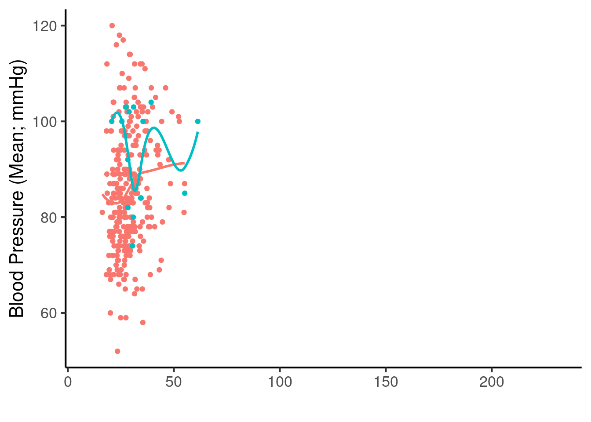{width=672}
:::

```{.r .cell-code}
ggplot(bp.data,
       aes(y=MAP_imputed,
           x=BMI,
           col=as.factor(Cushings))) +
  geom_point() +
  stat_smooth(method="loess", se=F) +
  labs(y="Blood Pressure (Mean; mmHg)",x="") +
  geom_hline(yintercept = 60, linetype = "solid", color = "gray30") +
  coord_cartesian(ylim = c(60, NA)) +  # Use this instead of scale_y_continuous
  theme_classic(base_size=16) +
  scale_fill_manual(values=color_scheme) +
  theme(legend.position="none")
```

::: {.cell-output-display}
{width=672}
:::

```{.r .cell-code}
bp.summary.map %>% kable(caption="Summary of blood pressure levels by obesity and pre-existing Cushing's (Mean)")
```

::: {.cell-output-display}


Table: Summary of blood pressure levels by obesity and pre-existing Cushing's (Mean)

| Cushings|Obesity   |     mean|        se|       sd|     n|
|--------:|:---------|--------:|---------:|--------:|-----:|
|        0|Non-Obese | 84.80288| 0.0864892| 10.56125| 14911|
|        0|Obese     | 89.76108| 0.1178169| 10.62509|  8133|
|        1|Non-Obese | 93.66228| 1.5800475| 16.19067|   105|
|        1|Obese     | 91.35088| 1.0858501| 15.43283|   202|


:::

```{.r .cell-code}
lm(MAP_imputed ~ Cushings + Obesity + Cushings:Obesity,data=bp.data) |> 
  tidy() |> 
  kable(caption="2x2 ANOVA with Interaction for effects of Obesity and Cushings on Blood Pressure (Mean)")
```

::: {.cell-output-display}


Table: 2x2 ANOVA with Interaction for effects of Obesity and Cushings on Blood Pressure (Mean)

|term                  |  estimate| std.error|  statistic| p.value|
|:---------------------|---------:|---------:|----------:|-------:|
|(Intercept)           | 84.802875| 0.0872824| 971.592267| 0.0e+00|
|Cushings              |  8.859405| 1.2236746|   7.240001| 0.0e+00|
|ObesityObese          |  4.958201| 0.1469389|  33.743279| 0.0e+00|
|Cushings:ObesityObese | -7.269604| 1.5370897|  -4.729460| 2.3e-06|


:::

```{.r .cell-code}
lm(MAP_imputed ~ Cushings + BMI + Cushings:Obesity,data=bp.data) |> 
  tidy() |> 
  kable(caption="2x2 ANOVA with Interaction for effects of Obesity and BMI on Blood Pressure (Mean)")
```

::: {.cell-output-display}


Table: 2x2 ANOVA with Interaction for effects of Obesity and BMI on Blood Pressure (Mean)

|term                  |   estimate| std.error|  statistic| p.value|
|:---------------------|----------:|---------:|----------:|-------:|
|(Intercept)           | 75.3560316| 0.2849814| 264.424357| 0.0e+00|
|Cushings              |  8.0652749| 1.2103610|   6.663528| 0.0e+00|
|BMI                   |  0.3907399| 0.0096453|  40.511018| 0.0e+00|
|Cushings:ObesityObese | -6.9517828| 1.5188015|  -4.577150| 4.7e-06|


:::
:::


##### MAP Statistics

Used the fully adjusted model to test the interaction between Cushings's diagnoses and obesity.


::: {.cell}

```{.r .cell-code}
#used fully adjusted model
lm.map <- lm(MAP_imputed ~ RaceEthnicity + AgeInYears + GenderName +                     Cushings * Obesity, data = bp.data)

## 1. Adjusted means
emm.map <- emmeans(lm.map, ~ Cushings | Obesity) %>%
  as.data.frame() %>%
  mutate(
    Outcome = "Mean Arterial Pressure",
    Mean_CI = sprintf("%.2f (%.2f–%.2f)", emmean, lower.CL, upper.CL)
  ) %>%
  select(Outcome, Obesity, Cushings, Mean_CI)

## 2. Within-stratum Cushing–Control difference
contrast.map <- contrast(emmeans(lm.map, ~ Cushings | Obesity),
                             method = "revpairwise") %>%
  summary(infer = TRUE) %>%
  as.data.frame() %>%
  mutate(
    Outcome = "Mean Arterial Pressure",
    Diff_CI = sprintf("%.2f (%.2f–%.2f)", estimate, lower.CL, upper.CL)
  ) %>%
  select(Outcome, Obesity, contrast, Diff_CI, p.value)

## 3. Interaction term
interaction_row.map <- tidy(lm.map) %>%
  filter(term == "Cushings:ObesityObese") %>%
  mutate(
    Outcome = "Mean Arterial Pressure",
    Interaction_CI = sprintf("%.2f (%.2f–%.2f)",
                             estimate,
                             estimate - 1.96 * std.error,
                             estimate + 1.96 * std.error)
  ) %>%
  select(Outcome, term, estimate, std.error, statistic, p.value, Interaction_CI)

## 4. Combine into one publication-style table:
# Pivot adjusted means to wide format (Control vs Cushing side by side)
means_wide <- emm.map %>%
  mutate(Cushings = ifelse(Cushings == 1, "Cushing", "Control")) %>%
  pivot_wider(names_from = Cushings, values_from = Mean_CI)

# Merge means with differences
table.map <- means_wide %>%
  left_join(contrast.map, by = c("Outcome", "Obesity"))
```
:::


#### Systolic Blood Pressure


::: {.cell}

```{.r .cell-code}
#systolic
bp.summary.sys <-
  bp.data %>%
  group_by(Cushings,Obesity) |>
  summarize(mean=mean(BPSysNonInvasive,na.rm=T),
            se=se(BPSysNonInvasive),
            sd=sd(BPSysNonInvasive,na.rm=T),
            n=length(BPSysNonInvasive))

ggplot(bp.summary.sys,
       aes(y=mean,
           ymin=mean- se,
           ymax=mean+ se,
           x=Obesity,
           fill=as.factor(Cushings))) +
  geom_col(position = position_dodge(width = 0.9)) +
  geom_errorbar(
    position = position_dodge(width = 0.9), # must match geom_col
    width = 0.5
  ) +
  labs(y="Blood Pressure (Systolic; mmHg)",x="") +
  geom_hline(yintercept = 60, linetype = "solid", color = "gray30") +
  coord_cartesian(ylim = c(60, NA)) +  # Use this instead of scale_y_continuous
  theme_classic(base_size=16) +
  scale_fill_grey() +
  theme(legend.position="none")
```

::: {.cell-output-display}
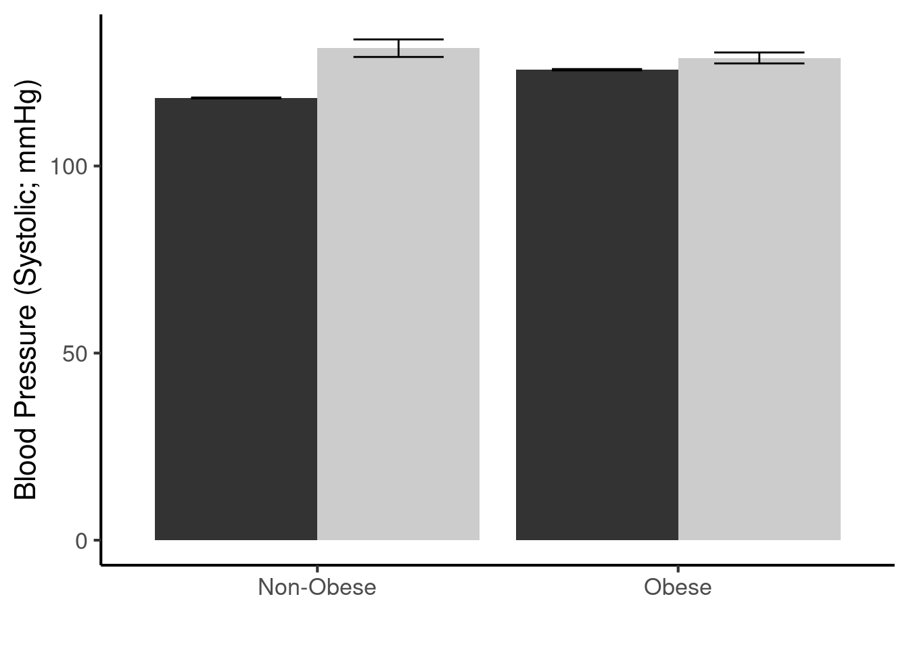{width=672}
:::

```{.r .cell-code}
ggplot(bp.summary.sys,
       aes(y=mean,
           ymin=mean- se,
           ymax=mean+ se,
           x=Obesity,
           fill=as.factor(Cushings))) +
  geom_col(position = position_dodge(width = 0.9)) +
  geom_errorbar(
    position = position_dodge(width = 0.9), # must match geom_col
    width = 0.5
  ) +
  labs(y="Blood Pressure (Systolic; mmHg)",x="") +
  geom_hline(yintercept = 60, linetype = "solid", color = "gray30") +
  coord_cartesian(ylim = c(60, NA)) +  # Use this instead of scale_y_continuous
  theme_classic(base_size=16) +
  scale_fill_manual(values=color_scheme) +
  theme(legend.position="none")
```

::: {.cell-output-display}
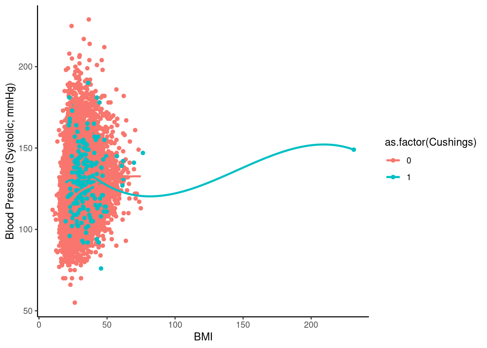{width=672}
:::

```{.r .cell-code}
ggplot(bp.data,
       aes(y=BPSysNonInvasive,
           x=BMI,
           col=as.factor(Cushings))) +
  geom_point() +
  stat_smooth(method="loess", se=F) +
  labs(y="Blood Pressure (Systolic; mmHg)",x="") +
  geom_hline(yintercept = 60, linetype = "solid", color = "gray30") +
  coord_cartesian(ylim = c(60, NA)) +  # Use this instead of scale_y_continuous
  theme_classic(base_size=16) +
  scale_fill_grey() +
  theme(legend.position="none")
```

::: {.cell-output-display}
{width=672}
:::

```{.r .cell-code}
ggplot(bp.data,
       aes(y=BPSysNonInvasive,
           x=BMI,
           col=as.factor(Cushings))) +
  geom_point() +
  stat_smooth(method="loess", se=F) +
  labs(y="Blood Pressure (Systolic; mmHg)",x="") +
  geom_hline(yintercept = 60, linetype = "solid", color = "gray30") +
  coord_cartesian(ylim = c(60, NA)) +  # Use this instead of scale_y_continuous
  theme_classic(base_size=16) +
  scale_fill_manual(values=color_scheme) +
  theme(legend.position="none")
```

::: {.cell-output-display}
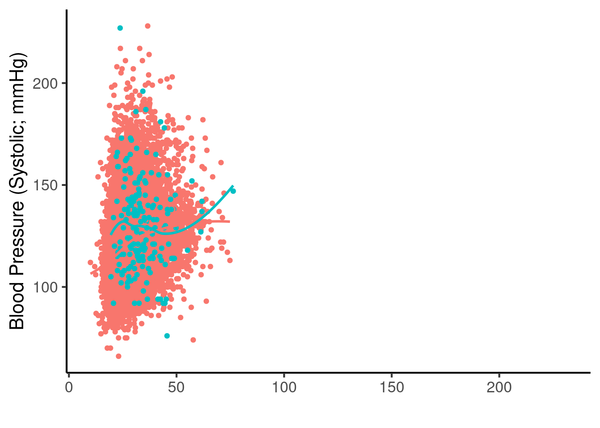{width=672}
:::

```{.r .cell-code}
bp.summary.sys %>% kable(caption="Summary of blood pressure levels by obesity and pre-existing Cushing's (Systolic)")
```

::: {.cell-output-display}


Table: Summary of blood pressure levels by obesity and pre-existing Cushing's (Systolic)

| Cushings|Obesity   |     mean|        se|       sd|     n|
|--------:|:---------|--------:|---------:|--------:|-----:|
|        0|Non-Obese | 118.1763| 0.1283828| 15.67690| 14911|
|        0|Obese     | 125.7222| 0.1768384| 15.94784|  8133|
|        1|Non-Obese | 131.4868| 2.3427832| 24.00638|   105|
|        1|Obese     | 128.8722| 1.4667638| 20.84663|   202|


:::

```{.r .cell-code}
lm(BPSysNonInvasive ~ Cushings + Obesity + Cushings:Obesity,data=bp.data) |> 
  tidy() |> 
  kable(caption="2x2 ANOVA with Interaction for effects of Obesity and Cushings on Blood Pressure (Systolic)")
```

::: {.cell-output-display}


Table: 2x2 ANOVA with Interaction for effects of Obesity and Cushings on Blood Pressure (Systolic)

|term                  |   estimate| std.error|  statistic| p.value|
|:---------------------|----------:|---------:|----------:|-------:|
|(Intercept)           | 118.176288| 0.1299325| 909.520663|   0e+00|
|Cushings              |  13.310554| 1.8216176|   7.306997|   0e+00|
|ObesityObese          |   7.545913| 0.2187399|  34.497190|   0e+00|
|Cushings:ObesityObese | -10.160575| 2.2881814|  -4.440459|   9e-06|


:::

```{.r .cell-code}
lm(BPSysNonInvasive ~ Cushings + BMI + Cushings:Obesity,data=bp.data) |> 
  tidy() |> 
  kable(caption="2x2 ANOVA with Interaction for effects of Obesity and BMI on Blood Pressure (Systolic)")
```

::: {.cell-output-display}


Table: 2x2 ANOVA with Interaction for effects of Obesity and BMI on Blood Pressure (Systolic)

|term                  |    estimate| std.error|  statistic|  p.value|
|:---------------------|-----------:|---------:|----------:|--------:|
|(Intercept)           | 103.5980708| 0.4236651| 244.528228| 0.00e+00|
|Cushings              |  12.1191136| 1.7993722|   6.735190| 0.00e+00|
|BMI                   |   0.6016843| 0.0143391|  41.961215| 0.00e+00|
|Cushings:ObesityObese |  -9.7601921| 2.2579125|  -4.322662| 1.55e-05|


:::
:::


##### Systolic Blood Pressure Statistics

Used the fully adjusted model to test the interaction between Cushings's diagnoses and obesity.


::: {.cell}

```{.r .cell-code}
#used fully adjusted model
lm.sbp <- lm(BPSysNonInvasive ~ RaceEthnicity + AgeInYears + GenderName +                     Cushings * Obesity, data = bp.data)

## 1. Adjusted means
emm.sbp <- emmeans(lm.sbp, ~ Cushings | Obesity) %>%
  as.data.frame() %>%
  mutate(
    Outcome = "Systolic Blood Pressure",
    Mean_CI = sprintf("%.2f (%.2f–%.2f)", emmean, lower.CL, upper.CL)
  ) %>%
  select(Outcome, Obesity, Cushings, Mean_CI)

## 2. Within-stratum Cushing–Control difference
contrast.sbp <- contrast(emmeans(lm.sbp, ~ Cushings | Obesity),
                             method = "revpairwise") %>%
  summary(infer = TRUE) %>%
  as.data.frame() %>%
  mutate(
    Outcome = "Systolic Blood Pressure",
    Diff_CI = sprintf("%.2f (%.2f–%.2f)", estimate, lower.CL, upper.CL)
  ) %>%
  select(Outcome, Obesity, contrast, Diff_CI, p.value)

## 3. Interaction term
interaction_row.sbp <- tidy(lm.sbp) %>%
  filter(term == "Cushings:ObesityObese") %>%
  mutate(
    Outcome = "Systolic Blood Pressure",
    Interaction_CI = sprintf("%.2f (%.2f–%.2f)",
                             estimate,
                             estimate - 1.96 * std.error,
                             estimate + 1.96 * std.error)
  ) %>%
  select(Outcome, term, estimate, std.error, statistic, p.value, Interaction_CI)

## 4. Combine into one publication-style table:
# Pivot adjusted means to wide format (Control vs Cushing side by side)
means_wide <- emm.sbp %>%
  mutate(Cushings = ifelse(Cushings == 1, "Cushing", "Control")) %>%
  pivot_wider(names_from = Cushings, values_from = Mean_CI)

# Merge means with differences
table.sbp <- means_wide %>%
  left_join(contrast.sbp, by = c("Outcome", "Obesity"))
```
:::


#### Diastolic Arterial Pressure


::: {.cell}

```{.r .cell-code}
#MAP
bp.summary.dia <-
  bp.data %>%
  group_by(Cushings,Obesity) |>
  summarize(mean=mean(BPDiaNonInvasive,na.rm=T),
            se=se(BPDiaNonInvasive),
            sd=sd(BPDiaNonInvasive,na.rm=T),
            n=length(BPDiaNonInvasive))

ggplot(bp.summary.dia,
       aes(y=mean,
           ymin=mean- se,
           ymax=mean+ se,
           x=Obesity,
           fill=as.factor(Cushings))) +
  geom_col(position = position_dodge(width = 0.9)) +
  geom_errorbar(
    position = position_dodge(width = 0.9), # must match geom_col
    width = 0.5
  ) +
  labs(y="Blood Pressure (Diastolic; mmHg)",x="") +
  geom_hline(yintercept = 60, linetype = "solid", color = "gray30") +
  coord_cartesian(ylim = c(60, NA)) +  # Use this instead of scale_y_continuous
  theme_classic(base_size=16) +
  scale_fill_grey() +
  theme(legend.position="none")
```

::: {.cell-output-display}
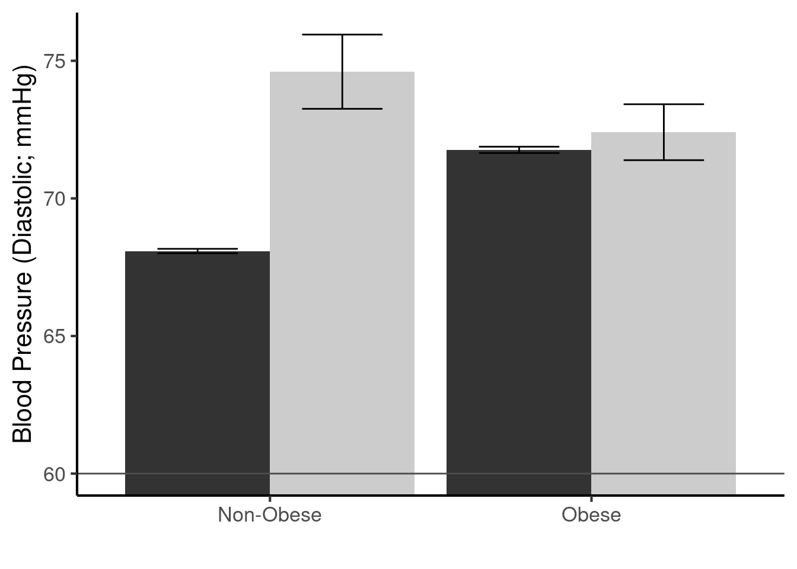{width=672}
:::

```{.r .cell-code}
ggplot(bp.summary.dia,
       aes(y=mean,
           ymin=mean- se,
           ymax=mean+ se,
           x=Obesity,
           fill=as.factor(Cushings))) +
  geom_col(position = position_dodge(width = 0.9)) +
  geom_errorbar(
    position = position_dodge(width = 0.9), # must match geom_col
    width = 0.5
  ) +
  labs(y="Blood Pressure (Diastolic; mmHg)",x="") +
  geom_hline(yintercept = 60, linetype = "solid", color = "gray30") +
  coord_cartesian(ylim = c(60, NA)) +  # Use this instead of scale_y_continuous
  theme_classic(base_size=16) +
  scale_fill_manual(values=color_scheme) +
  theme(legend.position="none")
```

::: {.cell-output-display}
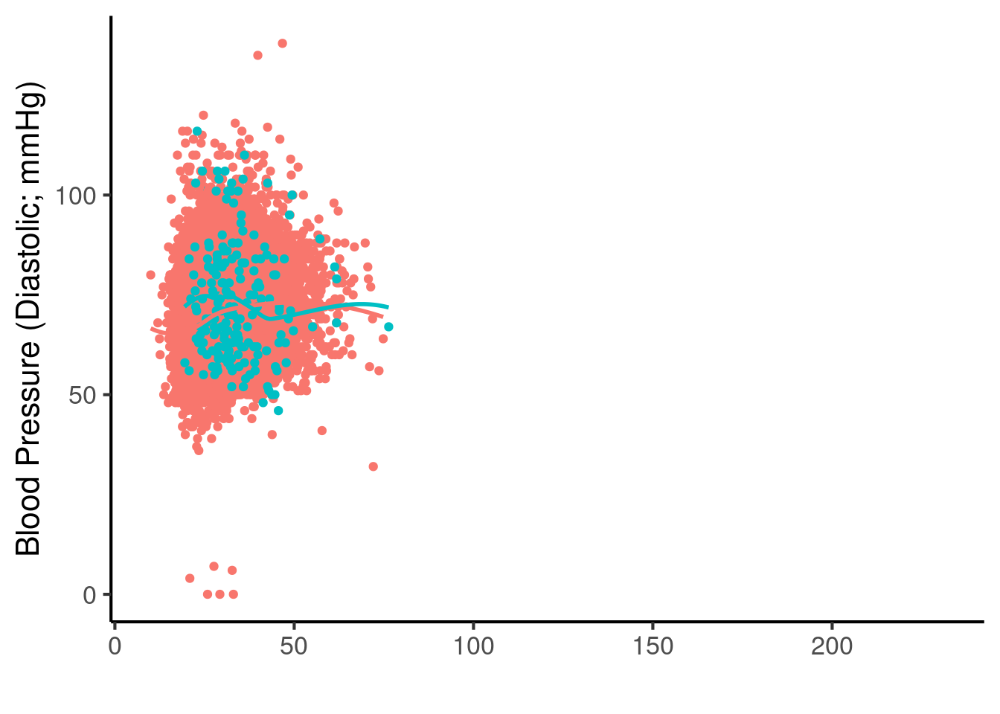{width=672}
:::

```{.r .cell-code}
ggplot(bp.data,
       aes(y=BPDiaNonInvasive,
           x=BMI,
           col=as.factor(Cushings))) +
  geom_point() +
  stat_smooth(method="loess", se=F) +
  labs(y="Blood Pressure (Diastolic; mmHg)",x="") +
  geom_hline(yintercept = 60, linetype = "solid", color = "gray30") +
  coord_cartesian(ylim = c(60, NA)) +  # Use this instead of scale_y_continuous
  theme_classic(base_size=16) +
  scale_fill_grey() +
  theme(legend.position="none")
```

::: {.cell-output-display}
{width=672}
:::

```{.r .cell-code}
ggplot(bp.data,
       aes(y=BPDiaNonInvasive,
           x=BMI,
           col=as.factor(Cushings))) +
  geom_point() +
  stat_smooth(method="loess", se=F) +
  labs(y="Blood Pressure (Diastolic; mmHg)",x="") +
  geom_hline(yintercept = 60, linetype = "solid", color = "gray30") +
  coord_cartesian(ylim = c(60, NA)) +  # Use this instead of scale_y_continuous
  theme_classic(base_size=16) +
  scale_fill_manual(values=color_scheme) +
  theme(legend.position="none")
```

::: {.cell-output-display}
{width=672}
:::

```{.r .cell-code}
bp.summary.dia %>% kable(caption="Summary of blood pressure levels by obesity and pre-existing Cushing's (Diastoic)")
```

::: {.cell-output-display}


Table: Summary of blood pressure levels by obesity and pre-existing Cushing's (Diastoic)

| Cushings|Obesity   |     mean|        se|        sd|     n|
|--------:|:---------|--------:|---------:|---------:|-----:|
|        0|Non-Obese | 68.08720| 0.0810886|  9.901782| 14911|
|        0|Obese     | 71.76428| 0.1150576| 10.376258|  8133|
|        1|Non-Obese | 74.60526| 1.3494341| 13.827585|   105|
|        1|Obese     | 72.40601| 1.0164429| 14.446368|   202|


:::

```{.r .cell-code}
lm(BPDiaNonInvasive ~ Cushings + Obesity + Cushings:Obesity,data=bp.data) |> 
  tidy() |> 
  kable(caption="2x2 ANOVA with Interaction for effects of Obesity and Cushings on Blood Pressure (Diastolic)")
```

::: {.cell-output-display}


Table: 2x2 ANOVA with Interaction for effects of Obesity and Cushings on Blood Pressure (Diastolic)

|term                  |  estimate| std.error|  statistic|  p.value|
|:---------------------|---------:|---------:|----------:|--------:|
|(Intercept)           | 68.087202| 0.0829827| 820.498902| 0.00e+00|
|Cushings              |  6.518061| 1.1633943|   5.602624| 0.00e+00|
|ObesityObese          |  3.677083| 0.1397004|  26.321194| 0.00e+00|
|Cushings:ObesityObese | -5.876331| 1.4613699|  -4.021111| 5.81e-05|


:::

```{.r .cell-code}
lm(BPDiaNonInvasive ~ Cushings + BMI + Cushings:Obesity,data=bp.data) |> 
  tidy() |> 
  kable(caption="2x2 ANOVA with Interaction for effects of Obesity and BMI on Blood Pressure (Diastolic)")
```

::: {.cell-output-display}


Table: 2x2 ANOVA with Interaction for effects of Obesity and BMI on Blood Pressure (Diastolic)

|term                  |   estimate| std.error|  statistic|   p.value|
|:---------------------|----------:|---------:|----------:|---------:|
|(Intercept)           | 61.1942195| 0.2721941| 224.818279| 0.0000000|
|Cushings              |  5.9194832| 1.1560514|   5.120433| 0.0000003|
|BMI                   |  0.2858372| 0.0092125|  31.027155| 0.0000000|
|Cushings:ObesityObese | -5.5938160| 1.4506520|  -3.856070| 0.0001155|


:::
:::


##### Diastolic Blood Pressure Statistics

Used the fully adjusted model to test the interaction between Cushings's diagnoses and obesity.


::: {.cell}

```{.r .cell-code}
#used fully adjusted model
lm.dbp <- lm(BPDiaNonInvasive ~ RaceEthnicity + AgeInYears + GenderName +                     Cushings * Obesity, data = bp.data)

## 1. Adjusted means
emm.dbp <- emmeans(lm.dbp, ~ Cushings | Obesity) %>%
  as.data.frame() %>%
  mutate(
    Outcome = "Diastolic Blood Pressure",
    Mean_CI = sprintf("%.2f (%.2f–%.2f)", emmean, lower.CL, upper.CL)
  ) %>%
  select(Outcome, Obesity, Cushings, Mean_CI)

## 2. Within-stratum Cushing–Control difference
contrast.dbp <- contrast(emmeans(lm.dbp, ~ Cushings | Obesity),
                             method = "revpairwise") %>%
  summary(infer = TRUE) %>%
  as.data.frame() %>%
  mutate(
    Outcome = "Diastolic Blood Pressure",
    Diff_CI = sprintf("%.2f (%.2f–%.2f)", estimate, lower.CL, upper.CL)
  ) %>%
  select(Outcome, Obesity, contrast, Diff_CI, p.value)

## 3. Interaction term
interaction_row.dbp <- tidy(lm.dbp) %>%
  filter(term == "Cushings:ObesityObese") %>%
  mutate(
    Outcome = "Diastolic Blood Pressure",
    Interaction_CI = sprintf("%.2f (%.2f–%.2f)",
                             estimate,
                             estimate - 1.96 * std.error,
                             estimate + 1.96 * std.error)
  ) %>%
  select(Outcome, term, estimate, std.error, statistic, p.value, Interaction_CI)

## 4. Combine into one publication-style table:
# Pivot adjusted means to wide format (Control vs Cushing side by side)
means_wide <- emm.dbp %>%
  mutate(Cushings = ifelse(Cushings == 1, "Cushing", "Control")) %>%
  pivot_wider(names_from = Cushings, values_from = Mean_CI)

# Merge means with differences
table.dbp <- means_wide %>%
  left_join(contrast.dbp, by = c("Outcome", "Obesity"))
```
:::


## Diagnostic Data on Propensity Mapping


::: {.cell}

```{.r .cell-code}
# List of matchit objects by outcome
outcomes <- list(
  `Any Outcome` = m.out.all,
  `Blood Pressure` = m.out.bp, 
  Glucose = m.out.glucose, 
  ALT = m.out.alt,
  AST = m.out.ast,
  HbA1c = m.out.a1c, 
  `LDL-C` = m.out.ldl
)

# Function to extract age means ± SE per group
extract_age_summary <- function(m.out, outcome_name) {
  matched_data <- match.data(m.out)
  
  # Pre-matching summary
  pre_summary <- m.out$model$data %>% 
    group_by(Cushings) %>% 
    summarise(
      Mean = mean(AgeInYears, na.rm = TRUE),
      SE = sd(AgeInYears, na.rm = TRUE)/sqrt(n())
    ) %>% 
    mutate(Stage = "Pre-matching")
  
  # Post-matching summary
  post_summary <- matched_data %>% 
    group_by(Cushings) %>% 
    summarise(
      Mean = mean(AgeInYears, na.rm = TRUE),
      SE = sd(AgeInYears, na.rm = TRUE)/sqrt(n())
    ) %>% 
    mutate(Stage = "Post-matching")
  
  bind_rows(pre_summary, post_summary) %>% 
    mutate(Outcome = outcome_name) %>%
    select(Outcome, Stage, Cushings, Mean, SE)
}

# Function to extract SMD for AgeInYears
extract_age_smd <- function(m.out, outcome_name){
  s <- summary(m.out, standardize = TRUE)
  
  bal_all <- s$sum.all      # pre-matching balance
  bal_matched <- s$sum.matched  # post-matching balance
  
  data.frame(
    Outcome = outcome_name,
    Stage = c("Pre-matching", "Post-matching"),
    SMD_Age = c(
      bal_all["AgeInYears","Std. Mean Diff."],
      bal_matched["AgeInYears","Std. Mean Diff."]
    )
  )
}

# Apply functions to all outcomes
age_table <- bind_rows(lapply(names(outcomes), function(x) extract_age_summary(outcomes[[x]], x)))
smd_table <- bind_rows(lapply(names(outcomes), function(x) extract_age_smd(outcomes[[x]], x)))

# Merge BEFORE pivot
full_table <- full_join(age_table, smd_table, by = c("Outcome", "Stage"))

# Format for display
full_table_formatted <- full_table %>%
  mutate(
    Cushings = case_when(Cushings == 0 ~ "Control",
                         Cushings == 1 ~ "Cushing"),
    Stage = factor(Stage, levels = c("Pre-matching", "Post-matching")),
    across(c(Mean, SE, SMD_Age), ~round(., 2))
  ) %>%
  pivot_wider(
    names_from = Cushings,
    values_from = c(Mean, SE)
  ) %>%
  arrange(Outcome, Stage)
library(kableExtra)

# Display table with kableExtra
full_table_formatted %>%
  kable(caption = "Propensity Matching Summary for Age (means ± SE and SMD).") %>%
  kable_styling(full_width = FALSE, position = "center")
```

::: {.cell-output-display}

`````{=html}
<table class="table" style="width: auto !important; margin-left: auto; margin-right: auto;">
<caption>Propensity Matching Summary for Age (means ± SE and SMD).</caption>
 <thead>
  <tr>
   <th style="text-align:left;"> Outcome </th>
   <th style="text-align:left;"> Stage </th>
   <th style="text-align:right;"> SMD_Age </th>
   <th style="text-align:right;"> Mean_Control </th>
   <th style="text-align:right;"> Mean_Cushing </th>
   <th style="text-align:right;"> SE_Control </th>
   <th style="text-align:right;"> SE_Cushing </th>
  </tr>
 </thead>
<tbody>
  <tr>
   <td style="text-align:left;"> ALT </td>
   <td style="text-align:left;"> Pre-matching </td>
   <td style="text-align:right;"> -0.72 </td>
   <td style="text-align:right;"> 59.86 </td>
   <td style="text-align:right;"> 48.27 </td>
   <td style="text-align:right;"> 0.05 </td>
   <td style="text-align:right;"> 0.89 </td>
  </tr>
  <tr>
   <td style="text-align:left;"> ALT </td>
   <td style="text-align:left;"> Post-matching </td>
   <td style="text-align:right;"> -0.02 </td>
   <td style="text-align:right;"> 48.61 </td>
   <td style="text-align:right;"> 48.27 </td>
   <td style="text-align:right;"> 0.27 </td>
   <td style="text-align:right;"> 0.89 </td>
  </tr>
  <tr>
   <td style="text-align:left;"> AST </td>
   <td style="text-align:left;"> Pre-matching </td>
   <td style="text-align:right;"> -0.71 </td>
   <td style="text-align:right;"> 59.88 </td>
   <td style="text-align:right;"> 48.48 </td>
   <td style="text-align:right;"> 0.05 </td>
   <td style="text-align:right;"> 0.89 </td>
  </tr>
  <tr>
   <td style="text-align:left;"> AST </td>
   <td style="text-align:left;"> Post-matching </td>
   <td style="text-align:right;"> -0.02 </td>
   <td style="text-align:right;"> 48.81 </td>
   <td style="text-align:right;"> 48.48 </td>
   <td style="text-align:right;"> 0.27 </td>
   <td style="text-align:right;"> 0.89 </td>
  </tr>
  <tr>
   <td style="text-align:left;"> Any Outcome </td>
   <td style="text-align:left;"> Pre-matching </td>
   <td style="text-align:right;"> -0.84 </td>
   <td style="text-align:right;"> 59.97 </td>
   <td style="text-align:right;"> 46.24 </td>
   <td style="text-align:right;"> 0.02 </td>
   <td style="text-align:right;"> 0.18 </td>
  </tr>
  <tr>
   <td style="text-align:left;"> Any Outcome </td>
   <td style="text-align:left;"> Post-matching </td>
   <td style="text-align:right;"> -0.02 </td>
   <td style="text-align:right;"> 46.63 </td>
   <td style="text-align:right;"> 46.24 </td>
   <td style="text-align:right;"> 0.05 </td>
   <td style="text-align:right;"> 0.18 </td>
  </tr>
  <tr>
   <td style="text-align:left;"> Blood Pressure </td>
   <td style="text-align:left;"> Pre-matching </td>
   <td style="text-align:right;"> -0.82 </td>
   <td style="text-align:right;"> 61.09 </td>
   <td style="text-align:right;"> 47.51 </td>
   <td style="text-align:right;"> 0.01 </td>
   <td style="text-align:right;"> 0.12 </td>
  </tr>
  <tr>
   <td style="text-align:left;"> Blood Pressure </td>
   <td style="text-align:left;"> Post-matching </td>
   <td style="text-align:right;"> -0.03 </td>
   <td style="text-align:right;"> 47.97 </td>
   <td style="text-align:right;"> 47.51 </td>
   <td style="text-align:right;"> 0.04 </td>
   <td style="text-align:right;"> 0.12 </td>
  </tr>
  <tr>
   <td style="text-align:left;"> Glucose </td>
   <td style="text-align:left;"> Pre-matching </td>
   <td style="text-align:right;"> -0.99 </td>
   <td style="text-align:right;"> 61.96 </td>
   <td style="text-align:right;"> 46.03 </td>
   <td style="text-align:right;"> 0.04 </td>
   <td style="text-align:right;"> 0.27 </td>
  </tr>
  <tr>
   <td style="text-align:left;"> Glucose </td>
   <td style="text-align:left;"> Post-matching </td>
   <td style="text-align:right;"> -0.04 </td>
   <td style="text-align:right;"> 46.63 </td>
   <td style="text-align:right;"> 46.03 </td>
   <td style="text-align:right;"> 0.08 </td>
   <td style="text-align:right;"> 0.27 </td>
  </tr>
  <tr>
   <td style="text-align:left;"> HbA1c </td>
   <td style="text-align:left;"> Pre-matching </td>
   <td style="text-align:right;"> -0.83 </td>
   <td style="text-align:right;"> 58.83 </td>
   <td style="text-align:right;"> 46.80 </td>
   <td style="text-align:right;"> 0.06 </td>
   <td style="text-align:right;"> 3.25 </td>
  </tr>
  <tr>
   <td style="text-align:left;"> HbA1c </td>
   <td style="text-align:left;"> Post-matching </td>
   <td style="text-align:right;"> 0.00 </td>
   <td style="text-align:right;"> 46.80 </td>
   <td style="text-align:right;"> 46.80 </td>
   <td style="text-align:right;"> 1.01 </td>
   <td style="text-align:right;"> 3.25 </td>
  </tr>
  <tr>
   <td style="text-align:left;"> LDL-C </td>
   <td style="text-align:left;"> Pre-matching </td>
   <td style="text-align:right;"> -0.97 </td>
   <td style="text-align:right;"> 57.92 </td>
   <td style="text-align:right;"> 40.85 </td>
   <td style="text-align:right;"> 0.06 </td>
   <td style="text-align:right;"> 4.87 </td>
  </tr>
  <tr>
   <td style="text-align:left;"> LDL-C </td>
   <td style="text-align:left;"> Post-matching </td>
   <td style="text-align:right;"> -0.04 </td>
   <td style="text-align:right;"> 41.62 </td>
   <td style="text-align:right;"> 40.85 </td>
   <td style="text-align:right;"> 1.38 </td>
   <td style="text-align:right;"> 4.87 </td>
  </tr>
</tbody>
</table>

`````

:::

```{.r .cell-code}
propensity.diagnostics.table.pub <-
  full_table_formatted |>
  mutate(Controls= paste0(round(Mean_Control,2)," +/- ",round(SE_Control,2)),
         `Cushing's`= paste0(round(Mean_Cushing,2)," +/- ",round(SE_Cushing,2))) |>
  rename(`Standardized Mean Difference`=SMD_Age) |>
  mutate(`Standardized Mean Difference`=round(`Standardized Mean Difference`,4)) |>
  select(Outcome,Stage,Controls,`Cushing's`,`Standardized Mean Difference`)

kable(propensity.diagnostics.table.pub,caption="Publication Version of Propensity Mapping Summary") |>
  kable_styling(full_width = FALSE, position = "center")
```

::: {.cell-output-display}

`````{=html}
<table class="table" style="width: auto !important; margin-left: auto; margin-right: auto;">
<caption>Publication Version of Propensity Mapping Summary</caption>
 <thead>
  <tr>
   <th style="text-align:left;"> Outcome </th>
   <th style="text-align:left;"> Stage </th>
   <th style="text-align:left;"> Controls </th>
   <th style="text-align:left;"> Cushing's </th>
   <th style="text-align:right;"> Standardized Mean Difference </th>
  </tr>
 </thead>
<tbody>
  <tr>
   <td style="text-align:left;"> ALT </td>
   <td style="text-align:left;"> Pre-matching </td>
   <td style="text-align:left;"> 59.86 +/- 0.05 </td>
   <td style="text-align:left;"> 48.27 +/- 0.89 </td>
   <td style="text-align:right;"> -0.72 </td>
  </tr>
  <tr>
   <td style="text-align:left;"> ALT </td>
   <td style="text-align:left;"> Post-matching </td>
   <td style="text-align:left;"> 48.61 +/- 0.27 </td>
   <td style="text-align:left;"> 48.27 +/- 0.89 </td>
   <td style="text-align:right;"> -0.02 </td>
  </tr>
  <tr>
   <td style="text-align:left;"> AST </td>
   <td style="text-align:left;"> Pre-matching </td>
   <td style="text-align:left;"> 59.88 +/- 0.05 </td>
   <td style="text-align:left;"> 48.48 +/- 0.89 </td>
   <td style="text-align:right;"> -0.71 </td>
  </tr>
  <tr>
   <td style="text-align:left;"> AST </td>
   <td style="text-align:left;"> Post-matching </td>
   <td style="text-align:left;"> 48.81 +/- 0.27 </td>
   <td style="text-align:left;"> 48.48 +/- 0.89 </td>
   <td style="text-align:right;"> -0.02 </td>
  </tr>
  <tr>
   <td style="text-align:left;"> Any Outcome </td>
   <td style="text-align:left;"> Pre-matching </td>
   <td style="text-align:left;"> 59.97 +/- 0.02 </td>
   <td style="text-align:left;"> 46.24 +/- 0.18 </td>
   <td style="text-align:right;"> -0.84 </td>
  </tr>
  <tr>
   <td style="text-align:left;"> Any Outcome </td>
   <td style="text-align:left;"> Post-matching </td>
   <td style="text-align:left;"> 46.63 +/- 0.05 </td>
   <td style="text-align:left;"> 46.24 +/- 0.18 </td>
   <td style="text-align:right;"> -0.02 </td>
  </tr>
  <tr>
   <td style="text-align:left;"> Blood Pressure </td>
   <td style="text-align:left;"> Pre-matching </td>
   <td style="text-align:left;"> 61.09 +/- 0.01 </td>
   <td style="text-align:left;"> 47.51 +/- 0.12 </td>
   <td style="text-align:right;"> -0.82 </td>
  </tr>
  <tr>
   <td style="text-align:left;"> Blood Pressure </td>
   <td style="text-align:left;"> Post-matching </td>
   <td style="text-align:left;"> 47.97 +/- 0.04 </td>
   <td style="text-align:left;"> 47.51 +/- 0.12 </td>
   <td style="text-align:right;"> -0.03 </td>
  </tr>
  <tr>
   <td style="text-align:left;"> Glucose </td>
   <td style="text-align:left;"> Pre-matching </td>
   <td style="text-align:left;"> 61.96 +/- 0.04 </td>
   <td style="text-align:left;"> 46.03 +/- 0.27 </td>
   <td style="text-align:right;"> -0.99 </td>
  </tr>
  <tr>
   <td style="text-align:left;"> Glucose </td>
   <td style="text-align:left;"> Post-matching </td>
   <td style="text-align:left;"> 46.63 +/- 0.08 </td>
   <td style="text-align:left;"> 46.03 +/- 0.27 </td>
   <td style="text-align:right;"> -0.04 </td>
  </tr>
  <tr>
   <td style="text-align:left;"> HbA1c </td>
   <td style="text-align:left;"> Pre-matching </td>
   <td style="text-align:left;"> 58.83 +/- 0.06 </td>
   <td style="text-align:left;"> 46.8 +/- 3.25 </td>
   <td style="text-align:right;"> -0.83 </td>
  </tr>
  <tr>
   <td style="text-align:left;"> HbA1c </td>
   <td style="text-align:left;"> Post-matching </td>
   <td style="text-align:left;"> 46.8 +/- 1.01 </td>
   <td style="text-align:left;"> 46.8 +/- 3.25 </td>
   <td style="text-align:right;"> 0.00 </td>
  </tr>
  <tr>
   <td style="text-align:left;"> LDL-C </td>
   <td style="text-align:left;"> Pre-matching </td>
   <td style="text-align:left;"> 57.92 +/- 0.06 </td>
   <td style="text-align:left;"> 40.85 +/- 4.87 </td>
   <td style="text-align:right;"> -0.97 </td>
  </tr>
  <tr>
   <td style="text-align:left;"> LDL-C </td>
   <td style="text-align:left;"> Post-matching </td>
   <td style="text-align:left;"> 41.62 +/- 1.38 </td>
   <td style="text-align:left;"> 40.85 +/- 4.87 </td>
   <td style="text-align:right;"> -0.04 </td>
  </tr>
</tbody>
</table>

`````

:::

```{.r .cell-code}
write_csv(propensity.diagnostics.table.pub,"Propensity Matching Summary - Age.csv")
```
:::


### Love Plots

Generated Love plots using ggplot for each outcome.


::: {.cell}

```{.r .cell-code}
library(cobalt)
library(ggplot2)

plots <- lapply(names(outcomes), function(name) {
  # Generate Love plot, force only SMDs
  gg <- love.plot(
    outcomes[[name]],
    stats = "mean.diffs",  # only standardized mean differences
    threshold = 0.1,
    abs = TRUE,
    stars = "none"         # avoids mixing with raw differences
  )
  
  # gg is now a ggplot object directly
  gg + 
    theme_classic(base_size=6) +
    labs(
      title = name,
      x = "Standardized Mean Difference",
      color = "Stage",
    ) +
    scale_color_grey() +
    theme(legend.position = c(0.75,0.5))
})

# Example: display HbA1c plot
plots[[1]]
```

::: {.cell-output-display}
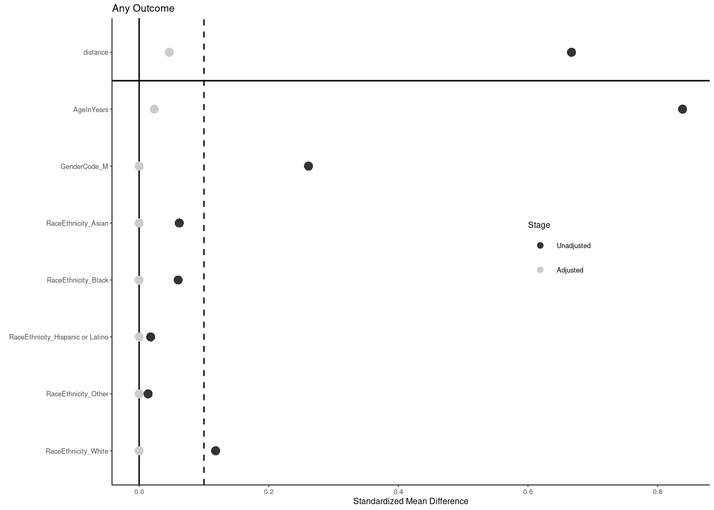{width=672}
:::

```{.r .cell-code}
library(cowplot)

combined_plot <- plot_grid(
  plotlist = plots,   # your list of ggplot objects
  ncol = 2,           # number of columns
  labels = names(plots)  # optional: label each subplot with the outcome name
)

# Display
combined_plot
```

::: {.cell-output-display}
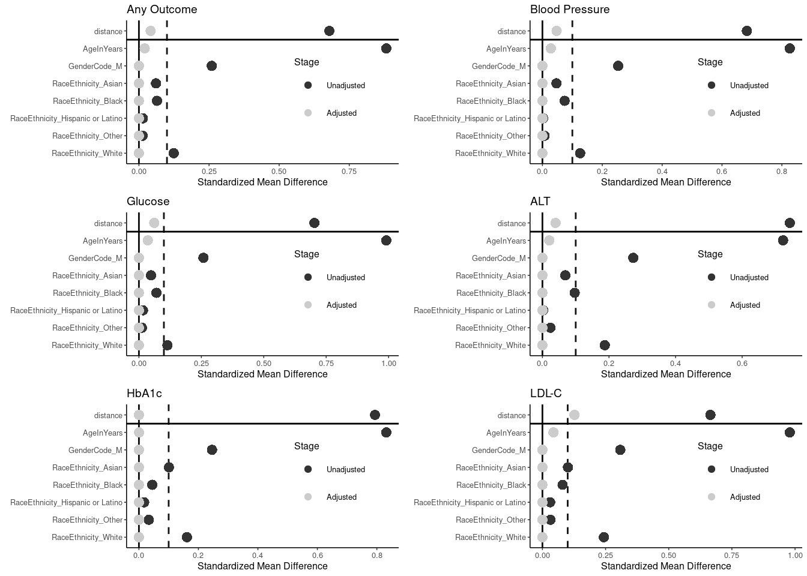{width=672}
:::

```{.r .cell-code}
plots <- lapply(names(outcomes), function(name) {
  # Generate Love plot, force only SMDs
  gg <- love.plot(
    outcomes[[name]],
    stats = "mean.diffs",  # only standardized mean differences
    threshold = 0.1,
    abs = TRUE,
    stars = "none"         # avoids mixing with raw differences
  )
  
  # gg is now a ggplot object directly
  gg + 
    theme_classic(base_size=6) +
    labs(
      title = name,
      x = "Standardized Mean Difference",
      color = "Stage",
    ) +
    scale_color_manual(values=color_scheme) +
    theme(legend.position = c(0.75,0.5))
})

# Example: display HbA1c plot
plots[[1]]
```

::: {.cell-output-display}
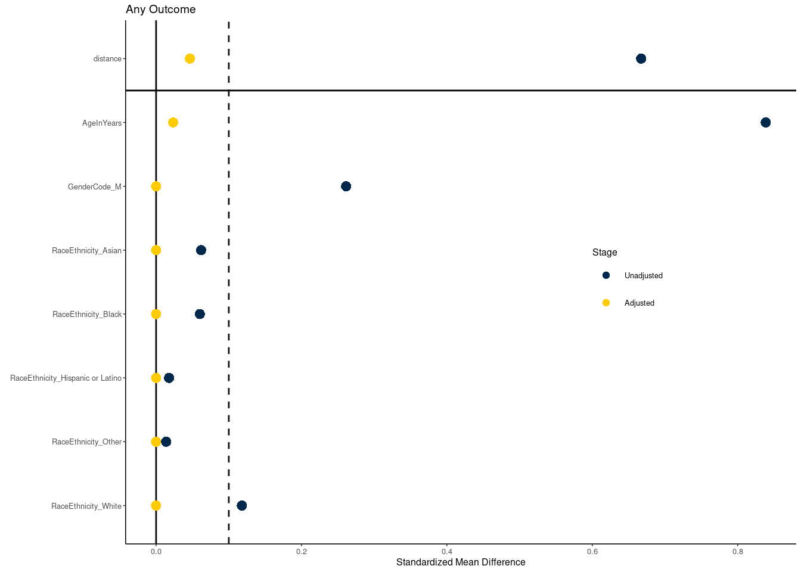{width=672}
:::

```{.r .cell-code}
library(cowplot)

combined_plot <- plot_grid(
  plotlist = plots,   # your list of ggplot objects
  ncol = 2,           # number of columns
  labels = names(plots)  # optional: label each subplot with the outcome name
)

# Display
combined_plot
```

::: {.cell-output-display}
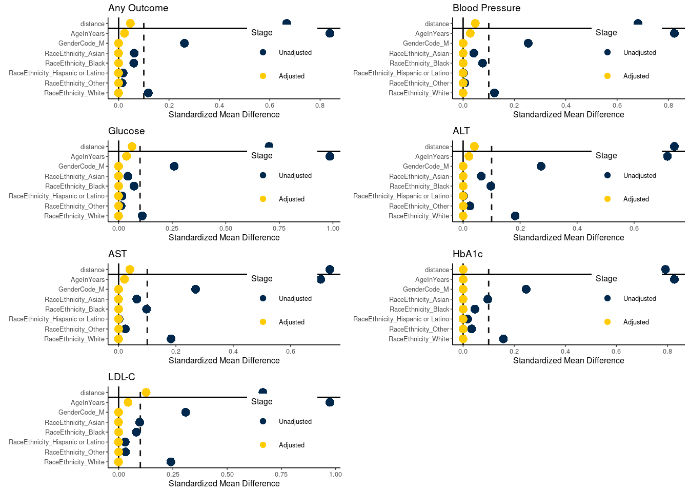{width=672}
:::
:::


## Summary of Interaction Effects


::: {.cell}

```{.r .cell-code}
table_summary <- bind_rows(
  table.glucose,
  table.hba1c,
  table.alt,
  table.ast,
  table.map,
  table.sbp,
  table.dbp
) |>
  select(-contrast)

table_summary |>
  kable(caption="Summary of contrasts for all outcomes") |>
  kable_styling(full_width = FALSE, position = "center")
```

::: {.cell-output-display}

`````{=html}
<table class="table" style="width: auto !important; margin-left: auto; margin-right: auto;">
<caption>Summary of contrasts for all outcomes</caption>
 <thead>
  <tr>
   <th style="text-align:left;"> Outcome </th>
   <th style="text-align:left;"> Obesity </th>
   <th style="text-align:left;"> Control </th>
   <th style="text-align:left;"> Cushing </th>
   <th style="text-align:left;"> Diff_CI </th>
   <th style="text-align:right;"> p.value </th>
  </tr>
 </thead>
<tbody>
  <tr>
   <td style="text-align:left;"> Glucose </td>
   <td style="text-align:left;"> Non-Obese </td>
   <td style="text-align:left;"> 99.50 (98.31–100.70) </td>
   <td style="text-align:left;"> 124.17 (118.78–129.57) </td>
   <td style="text-align:left;"> 24.67 (19.32–30.02) </td>
   <td style="text-align:right;"> 0.0000000 </td>
  </tr>
  <tr>
   <td style="text-align:left;"> Glucose </td>
   <td style="text-align:left;"> Obese </td>
   <td style="text-align:left;"> 107.67 (106.39–108.95) </td>
   <td style="text-align:left;"> 134.60 (130.48–138.73) </td>
   <td style="text-align:left;"> 26.93 (22.88–30.99) </td>
   <td style="text-align:right;"> 0.0000000 </td>
  </tr>
  <tr>
   <td style="text-align:left;"> HbA1c </td>
   <td style="text-align:left;"> Non-Obese </td>
   <td style="text-align:left;"> 5.60 (5.24–5.95) </td>
   <td style="text-align:left;"> 6.51 (5.54–7.48) </td>
   <td style="text-align:left;"> 0.91 (-0.06–1.89) </td>
   <td style="text-align:right;"> 0.0651583 </td>
  </tr>
  <tr>
   <td style="text-align:left;"> HbA1c </td>
   <td style="text-align:left;"> Obese </td>
   <td style="text-align:left;"> 6.02 (5.68–6.35) </td>
   <td style="text-align:left;"> 7.40 (6.80–8.00) </td>
   <td style="text-align:left;"> 1.38 (0.82–1.95) </td>
   <td style="text-align:right;"> 0.0000031 </td>
  </tr>
  <tr>
   <td style="text-align:left;"> ALT </td>
   <td style="text-align:left;"> Non-Obese </td>
   <td style="text-align:left;"> 23.40 (17.11–29.69) </td>
   <td style="text-align:left;"> 58.53 (45.27–71.79) </td>
   <td style="text-align:left;"> 35.13 (22.63–47.63) </td>
   <td style="text-align:right;"> 0.0000000 </td>
  </tr>
  <tr>
   <td style="text-align:left;"> ALT </td>
   <td style="text-align:left;"> Obese </td>
   <td style="text-align:left;"> 29.21 (22.80–35.62) </td>
   <td style="text-align:left;"> 102.59 (91.24–113.95) </td>
   <td style="text-align:left;"> 73.39 (63.37–83.40) </td>
   <td style="text-align:right;"> 0.0000000 </td>
  </tr>
  <tr>
   <td style="text-align:left;"> AST </td>
   <td style="text-align:left;"> Non-Obese </td>
   <td style="text-align:left;"> 23.00 (8.38–37.62) </td>
   <td style="text-align:left;"> 39.92 (9.06–70.77) </td>
   <td style="text-align:left;"> 16.91 (-12.16–45.99) </td>
   <td style="text-align:right;"> 0.2540227 </td>
  </tr>
  <tr>
   <td style="text-align:left;"> AST </td>
   <td style="text-align:left;"> Obese </td>
   <td style="text-align:left;"> 21.80 (6.90–36.69) </td>
   <td style="text-align:left;"> 78.73 (52.49–104.97) </td>
   <td style="text-align:left;"> 56.93 (33.85–80.02) </td>
   <td style="text-align:right;"> 0.0000014 </td>
  </tr>
  <tr>
   <td style="text-align:left;"> Mean Arterial Pressure </td>
   <td style="text-align:left;"> Non-Obese </td>
   <td style="text-align:left;"> 85.73 (85.39–86.08) </td>
   <td style="text-align:left;"> 93.84 (91.51–96.17) </td>
   <td style="text-align:left;"> 8.11 (5.78–10.43) </td>
   <td style="text-align:right;"> 0.0000000 </td>
  </tr>
  <tr>
   <td style="text-align:left;"> Mean Arterial Pressure </td>
   <td style="text-align:left;"> Obese </td>
   <td style="text-align:left;"> 90.04 (89.66–90.42) </td>
   <td style="text-align:left;"> 91.57 (89.79–93.34) </td>
   <td style="text-align:left;"> 1.53 (-0.24–3.29) </td>
   <td style="text-align:right;"> 0.0900073 </td>
  </tr>
  <tr>
   <td style="text-align:left;"> Systolic Blood Pressure </td>
   <td style="text-align:left;"> Non-Obese </td>
   <td style="text-align:left;"> 119.58 (119.07–120.09) </td>
   <td style="text-align:left;"> 131.55 (128.14–134.96) </td>
   <td style="text-align:left;"> 11.97 (8.57–15.36) </td>
   <td style="text-align:right;"> 0.0000000 </td>
  </tr>
  <tr>
   <td style="text-align:left;"> Systolic Blood Pressure </td>
   <td style="text-align:left;"> Obese </td>
   <td style="text-align:left;"> 125.92 (125.37–126.47) </td>
   <td style="text-align:left;"> 129.00 (126.40–131.60) </td>
   <td style="text-align:left;"> 3.08 (0.50–5.66) </td>
   <td style="text-align:right;"> 0.0193117 </td>
  </tr>
  <tr>
   <td style="text-align:left;"> Diastolic Blood Pressure </td>
   <td style="text-align:left;"> Non-Obese </td>
   <td style="text-align:left;"> 68.78 (68.44–69.11) </td>
   <td style="text-align:left;"> 74.85 (72.58–77.11) </td>
   <td style="text-align:left;"> 6.07 (3.81–8.32) </td>
   <td style="text-align:right;"> 0.0000001 </td>
  </tr>
  <tr>
   <td style="text-align:left;"> Diastolic Blood Pressure </td>
   <td style="text-align:left;"> Obese </td>
   <td style="text-align:left;"> 72.09 (71.72–72.45) </td>
   <td style="text-align:left;"> 72.67 (70.94–74.39) </td>
   <td style="text-align:left;"> 0.58 (-1.13–2.30) </td>
   <td style="text-align:right;"> 0.5050663 </td>
  </tr>
</tbody>
</table>

`````

:::

```{.r .cell-code}
write_csv(table_summary,"Summary of Contrasts - All Outcomes.csv")

interaction_summary <- bind_rows(
  interaction_row.glucose,
  interaction_row.hba1c,
  interaction_row.alt,
  interaction_row.ast,
  interaction_row.map,
  interaction_row.sbp,
  interaction_row.dbp
) |>
  select(Outcome,Interaction_CI,p.value) |>
  rename(`Interaction Estimate`=Interaction_CI)

interaction_summary |>
  kable(caption="Summary of interactions for all outcomes as mean with 95% confidence interval") |>
  kable_styling(full_width = FALSE, position = "center")
```

::: {.cell-output-display}

`````{=html}
<table class="table" style="width: auto !important; margin-left: auto; margin-right: auto;">
<caption>Summary of interactions for all outcomes as mean with 95% confidence interval</caption>
 <thead>
  <tr>
   <th style="text-align:left;"> Outcome </th>
   <th style="text-align:left;"> Interaction Estimate </th>
   <th style="text-align:right;"> p.value </th>
  </tr>
 </thead>
<tbody>
  <tr>
   <td style="text-align:left;"> Glucose </td>
   <td style="text-align:left;"> 2.26 (-4.45–8.98) </td>
   <td style="text-align:right;"> 0.5090256 </td>
  </tr>
  <tr>
   <td style="text-align:left;"> HbA1c </td>
   <td style="text-align:left;"> 0.47 (-0.65–1.59) </td>
   <td style="text-align:right;"> 0.4142720 </td>
  </tr>
  <tr>
   <td style="text-align:left;"> ALT </td>
   <td style="text-align:left;"> 38.26 (22.26–54.26) </td>
   <td style="text-align:right;"> 0.0000030 </td>
  </tr>
  <tr>
   <td style="text-align:left;"> AST </td>
   <td style="text-align:left;"> 40.02 (2.93–77.11) </td>
   <td style="text-align:right;"> 0.0345815 </td>
  </tr>
  <tr>
   <td style="text-align:left;"> Mean Arterial Pressure </td>
   <td style="text-align:left;"> -6.58 (-9.50–-3.66) </td>
   <td style="text-align:right;"> 0.0000099 </td>
  </tr>
  <tr>
   <td style="text-align:left;"> Systolic Blood Pressure </td>
   <td style="text-align:left;"> -8.89 (-13.15–-4.63) </td>
   <td style="text-align:right;"> 0.0000440 </td>
  </tr>
  <tr>
   <td style="text-align:left;"> Diastolic Blood Pressure </td>
   <td style="text-align:left;"> -5.48 (-8.32–-2.65) </td>
   <td style="text-align:right;"> 0.0001474 </td>
  </tr>
</tbody>
</table>

`````

:::

```{.r .cell-code}
write_csv(interaction_summary,"Summary of Interactions - All Outcomes.csv")
```
:::


## Session Information


::: {.cell}

```{.r .cell-code}
sessionInfo()
```

::: {.cell-output .cell-output-stdout}

```
R version 4.4.3 (2025-02-28)
Platform: x86_64-pc-linux-gnu
Running under: Red Hat Enterprise Linux 8.10 (Ootpa)

Matrix products: default
BLAS:   /sw/pkgs/arc/stacks/gcc/13.2.0/R/4.4.3/lib64/R/lib/libRblas.so 
LAPACK: /sw/pkgs/arc/stacks/gcc/13.2.0/R/4.4.3/lib64/R/lib/libRlapack.so;  LAPACK version 3.12.0

locale:
 [1] LC_CTYPE=en_US.UTF-8       LC_NUMERIC=C              
 [3] LC_TIME=en_US.UTF-8        LC_COLLATE=en_US.UTF-8    
 [5] LC_MONETARY=en_US.UTF-8    LC_MESSAGES=en_US.UTF-8   
 [7] LC_PAPER=en_US.UTF-8       LC_NAME=C                 
 [9] LC_ADDRESS=C               LC_TELEPHONE=C            
[11] LC_MEASUREMENT=en_US.UTF-8 LC_IDENTIFICATION=C       

time zone: America/Detroit
tzcode source: system (glibc)

attached base packages:
[1] stats     graphics  grDevices utils     datasets  methods   base     

other attached packages:
 [1] cowplot_1.1.3    cobalt_4.6.1     emmeans_1.11.2-8 broom_1.0.6     
 [5] kableExtra_1.4.0 janitor_2.2.1    MatchIt_4.7.1    knitr_1.48      
 [9] lubridate_1.9.3  forcats_1.0.0    stringr_1.5.1    dplyr_1.1.4     
[13] purrr_1.0.2      readr_2.1.5      tidyr_1.3.1      tibble_3.2.1    
[17] ggplot2_3.5.1    tidyverse_2.0.0 

loaded via a namespace (and not attached):
 [1] gtable_0.3.6       xfun_0.45          htmlwidgets_1.6.4  lattice_0.22-6    
 [5] tzdb_0.4.0         vctrs_0.6.5        tools_4.4.3        generics_0.1.3    
 [9] parallel_4.4.3     fansi_1.0.6        highr_0.11         pkgconfig_2.0.3   
[13] Matrix_1.7-2       lifecycle_1.0.4    compiler_4.4.3     farver_2.1.2      
[17] textshaping_0.4.0  munsell_0.5.1      snakecase_0.11.1   htmltools_0.5.8.1 
[21] yaml_2.3.9         pillar_1.9.0       crayon_1.5.3       nlme_3.1-167      
[25] tidyselect_1.2.1   digest_0.6.36      mvtnorm_1.3-1      stringi_1.8.4     
[29] labeling_0.4.3     splines_4.4.3      fastmap_1.2.0      grid_4.4.3        
[33] colorspace_2.1-0   cli_3.6.3          magrittr_2.0.3     utf8_1.2.4        
[37] withr_3.0.0        scales_1.3.0       backports_1.5.0    bit64_4.0.5       
[41] estimability_1.5.1 timechange_0.3.0   rmarkdown_2.27     bit_4.0.5         
[45] chk_0.10.0         hms_1.1.3          coda_0.19-4.1      evaluate_0.24.0   
[49] viridisLite_0.4.2  mgcv_1.9-1         rlang_1.1.4        Rcpp_1.0.14       
[53] xtable_1.8-4       glue_1.8.0         xml2_1.3.6         svglite_2.2.1     
[57] rstudioapi_0.16.0  vroom_1.6.5        jsonlite_1.8.8     R6_2.5.1          
[61] systemfonts_1.2.3 
```


:::
:::
