::: {.cell}

```{.r .cell-code}
# hide this code chunk
#| echo: false
#| message: false

# defines the se function
se <- function(x) {
  sd(x, na.rm = TRUE) / sqrt(length(x))
}

#load these packages, nearly always needed
library(tidyverse)

# sets maize and blue color scheme
color_scheme <- c("#00274c", "#ffcb05")
```
:::


## Purpose

To create a propensity mapped subgroup for lab results.

## Data Entry


::: {.cell}

```{.r .cell-code}
case.demographics.filename <- 'CaseDemographics.csv'
control.demographics.filename <- 'ControlDemographics.csv'

case.lab.results.filename <- 'LabResults.csv'
control.lab.results.filename <- '../controls/LabResults.csv'

bp.filename.cases <- 'NursingStandardVitalSigns.csv'
bp.filename.controls <- '../controls/NursingStandardVitalSigns.csv'

case.encounter.datafile <- "EncounterAll.csv" 
case.encounter.bmi.datafile <- "EncounterAnthropometricsBMI.csv" 
control.encounter.datafile <- "../controls/EncounterAll.csv" 
control.encounter.bmi.datafile <- "../controls/EncounterAnthropometricsBMI.csv" 

library(readr)
library(dplyr)

#labs dont have dates/ages
case.encounters <- read_csv(case.encounter.datafile)
case.encounters.bmi <- read_csv(case.encounter.bmi.datafile)
case.encounters.all <- left_join(case.encounters,case.encounters.bmi,
                                 by = join_by(DeID_PatientID, DeID_EncounterID))

control.encounters <- read_csv(control.encounter.datafile)
control.encounters.bmi <- read_csv(control.encounter.bmi.datafile)
control.encounters.all <- left_join(control.encounters,control.encounters.bmi,
                                 by = join_by(DeID_PatientID, DeID_EncounterID))


case.demographics <- read_csv(case.demographics.filename)
control.demographics <- read_csv(control.demographics.filename)

case.labs <- read_csv(case.lab.results.filename) |>
  left_join(case.encounters.all, by = join_by(DeID_PatientID, DeID_EncounterID)) |> #added encounter info
    left_join(case.demographics, by="DeID_PatientID") # added demographic data
control.labs <- read_csv(control.lab.results.filename) |> 
  left_join(control.encounters.all, by = join_by(DeID_PatientID, DeID_EncounterID)) |> #added encounter info
  left_join(control.demographics, by="DeID_PatientID") # added demographic data
#remove large objects not needed further
#rm(control.encounters,control.encounters.all,control.encounters.bmi)

#combined into one dataset
library(lubridate)

#this is used to filter for the window between when a lab result is allowable relative to the procedure.
procedure.result.interval <- 30

lab.results <- bind_rows(control.labs |> mutate(Cushings=0),
                         case.labs |> mutate(Cushings=1)) |>  #combined, new column indicating cushings
  mutate(cushings_procedure = ymd(cushings_procedure),
         DeID_AdmitDate = mdy_hm(DeID_AdmitDate)) |> 
  mutate(TimePoint = case_when(cushings_procedure<= DeID_AdmitDate ~ "Before",
                               cushings_procedure > DeID_AdmitDate ~ "After",
                               .default="Unknown")) %>% # defined each encounter as before or after
  mutate(ProcedureFollowUp = cushings_procedure - DeID_AdmitDate) #used to define point between the lab result and the procedure.

#filtered out lab results outside of our interval
lab.results.filtered <-
  lab.results |>
  filter(ProcedureFollowUp<procedure.result.interval | is.na(ProcedureFollowUp)) |>
  filter(TimePoint!="After")
  
#filtered out if the age, gender, race, ethnicity was NA for a patient.
complete.data.race.ethnicity.age <-
  lab.results.filtered |>
  filter(!if_any(c(AgeInYears, GenderCode, RaceCode, EthnicityCode), is.na)) #removed if they had missing data for age, gender, race or ethnicity

#this is the complete dataset  
complete.data  <-
  complete.data.race.ethnicity.age |>
  mutate(RaceEthnicity = case_when(EthnicityCode=="HL"~"Hispanic or Latino",
                                   RaceCode=="C"~"White",
                                   RaceCode=="AA"~"Black",
                                   RaceCode=="A"~"Asian",
                                   .default="Other")) #defined race/ethnicity categories

#number of controls per case
fold <- 10
```
:::


Note the controls dont have ages or BMIs because it depends on when the lab results were obtained, so had to merge in with encounter data.

### Participant Inclusion Data

We began with 70327 controls who had lab data, and **441** cases with Cushing's Disease.

* **Had Laboratory Results**: We also removed 162 lab results from Cushing's patients because they were outside of our acceptable window of 30 days before their procedure.  This eliminated a total of **2** Cushings patients from our dataset.

* **Missing Demographic Data** After filtering out missing demographic data we had 363 cases and 70070 controls with lab results.  The specific pieces of missing information are found here:


::: {.cell}

```{.r .cell-code}
lab.results.filtered |>
  filter(Cushings==1) |> #only for cushings data
  group_by(DeID_PatientID) %>%
  summarise(
    Age_na = sum(is.na(AgeInYears)),
    Gender_na = sum(is.na(GenderCode)),
    Race_na = sum(is.na(RaceCode)),
    Ethnicity_na = sum(is.na(EthnicityCode)),
    Any_na = any(is.na(AgeInYears) | is.na(GenderCode) | is.na(RaceCode) |is.na(EthnicityCode))) |>
  ungroup() |>
    pivot_longer(cols = ends_with("_na"),
                 names_to = "field",
                 values_to = "has_na") |>
  filter(has_na!=0) %>%
  count(field, name = "n_patients_with_NA")-> missing.demographic.summary

library(knitr)
missing.demographic.summary |> arrange(desc(n_patients_with_NA)) |> kable(caption="Summary of exclusions from Cushing's patient pool due to missing demographic data")
```

::: {.cell-output-display}


Table: Summary of exclusions from Cushing's patient pool due to missing demographic data

|field        | n_patients_with_NA|
|:------------|------------------:|
|Any_na       |                 78|
|Ethnicity_na |                 74|
|Gender_na    |                 16|
|Race_na      |                 16|
|Age_na       |                 10|


:::
:::


Our final dataset therefore included **363** Cushing's patients, and we had the ability to draw from **70070** Cushing's patients control patients.

## Propensity Mapping

Used the R package `mapit` to match based on Age, Gender, Race, and Ethnicity.  We wanted exact matches for everything except age, where we wanted the closest case that had a measurement.  We picked 10 matched controls for each case


### Hba1c


::: {.cell}

```{.r .cell-code}
library(MatchIt)
m.out.a1c <- matchit(Cushings ~ AgeInYears + GenderCode + RaceEthnicity, 
                 data = complete.data |> filter(RESULT_CODE %in% c("A1C", "XXA1C", "A1C EX", "X0022")), 
                 method = "nearest", 
                 exact = c("GenderCode", "RaceEthnicity"),# Force exact matches
                 ratio=fold) 

summary(m.out.a1c, standardize = TRUE)  # Balance statistics[5]
```

::: {.cell-output .cell-output-stdout}

```

Call:
matchit(formula = Cushings ~ AgeInYears + GenderCode + RaceEthnicity, 
    data = filter(complete.data, RESULT_CODE %in% c("A1C", "XXA1C", 
        "A1C EX", "X0022")), method = "nearest", exact = c("GenderCode", 
        "RaceEthnicity"), ratio = fold)

Summary of Balance for All Data:
                                Means Treated Means Control Std. Mean Diff.
distance                               0.0007        0.0003          0.7937
AgeInYears                            46.8000       58.9060         -0.8319
GenderCodeF                            0.8000        0.5541          0.6146
GenderCodeM                            0.2000        0.4459         -0.6146
RaceEthnicityAsian                     0.0000        0.1009         -0.3350
RaceEthnicityBlack                     0.0500        0.0948         -0.2058
RaceEthnicityHispanic or Latino        0.0500        0.0325          0.0805
RaceEthnicityOther                     0.0000        0.0333         -0.1855
RaceEthnicityWhite                     0.9000        0.7385          0.5382
                                Var. Ratio eCDF Mean eCDF Max
distance                            2.2793    0.2044   0.4971
AgeInYears                          0.8742    0.1686   0.3682
GenderCodeF                              .    0.2459   0.2459
GenderCodeM                              .    0.2459   0.2459
RaceEthnicityAsian                       .    0.1009   0.1009
RaceEthnicityBlack                       .    0.0448   0.0448
RaceEthnicityHispanic or Latino          .    0.0175   0.0175
RaceEthnicityOther                       .    0.0333   0.0333
RaceEthnicityWhite                       .    0.1615   0.1615

Summary of Balance for Matched Data:
                                Means Treated Means Control Std. Mean Diff.
distance                               0.0007        0.0007          0.0002
AgeInYears                            46.8000       46.8050         -0.0003
GenderCodeF                            0.8000        0.8000          0.0000
GenderCodeM                            0.2000        0.2000          0.0000
RaceEthnicityAsian                     0.0000        0.0000          0.0000
RaceEthnicityBlack                     0.0500        0.0500          0.0000
RaceEthnicityHispanic or Latino        0.0500        0.0500          0.0000
RaceEthnicityOther                     0.0000        0.0000          0.0000
RaceEthnicityWhite                     0.9000        0.9000          0.0000
                                Var. Ratio eCDF Mean eCDF Max Std. Pair Dist.
distance                            1.0471    0.0002     0.02          0.0015
AgeInYears                          1.0483    0.0005     0.02          0.0024
GenderCodeF                              .    0.0000     0.00          0.0000
GenderCodeM                              .    0.0000     0.00          0.0000
RaceEthnicityAsian                       .    0.0000     0.00          0.0000
RaceEthnicityBlack                       .    0.0000     0.00          0.0000
RaceEthnicityHispanic or Latino          .    0.0000     0.00          0.0000
RaceEthnicityOther                       .    0.0000     0.00          0.0000
RaceEthnicityWhite                       .    0.0000     0.00          0.0000

Sample Sizes:
          Control Treated
All         73898      20
Matched       200      20
Unmatched   73698       0
Discarded       0       0
```


:::

```{.r .cell-code}
plot(m.out.a1c, type = "jitter")         # Propensity score distribution[5]
```

::: {.cell-output-display}
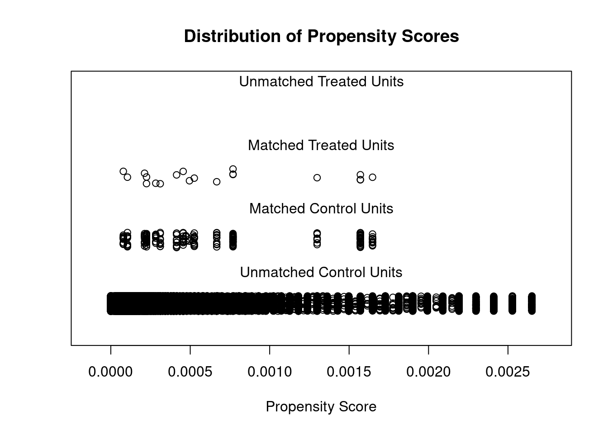{width=672}
:::

::: {.cell-output .cell-output-stdout}

```
To identify the units, use first mouse button; to stop, use second.
```


:::

```{.r .cell-code}
matched_data.a1c <- match.data(m.out.a1c)

hba1c.data <- 
  matched_data.a1c |>
  mutate(value = as.numeric(VALUE)) %>% #forced into numeric form  
  arrange(desc(DeID_AdmitDate)) %>% #sort by date
  distinct(DeID_PatientID,.keep_all = T) %>% #unique cases
  mutate(Obesity = if_else(BMI>30, "Obese","Non-Obese"))  |>
  mutate(ObesityIII = if_else(BMI>40, "Class III Obese","All Others"))  |>
  filter(!is.na(Obesity)) 

hba1c.summary <-
  hba1c.data %>%
  group_by(Cushings,Obesity) |>
  summarize(mean=mean(value,na.rm=T),
            se=se(value),
            sd=sd(value,na.rm=T),
            n=length(value))

hba1c.summary.iii <-
  hba1c.data %>%
  group_by(Cushings,ObesityIII) |>
  summarize(mean=mean(value,na.rm=T),
            se=se(value),
            sd=sd(value,na.rm=T),
            n=length(value))

library(ggplot2)
ggplot(hba1c.summary,
       aes(y=mean,
           ymin=mean-se,
           ymax=mean+se,
           x=Obesity,
           fill=as.factor(Cushings))) +
  geom_col(position = position_dodge(width = 0.9)) +
  geom_errorbar(
    position = position_dodge(width = 0.9), # must match geom_col
    width = 0.5
  ) +
  labs(y="Hba1c (Percent)") +
  theme_classic()
```

::: {.cell-output-display}
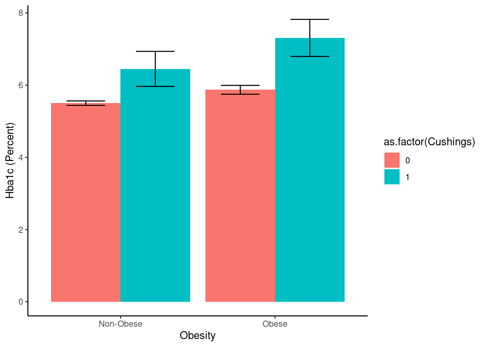{width=672}
:::

```{.r .cell-code}
ggplot(hba1c.summary.iii,
       aes(y=mean,
           ymin=mean-se,
           ymax=mean+se,
           x=ObesityIII,
           fill=as.factor(Cushings))) +
  geom_col(position = position_dodge(width = 0.9)) +
  geom_errorbar(
    position = position_dodge(width = 0.9), # must match geom_col
    width = 0.5
  ) +
  labs(y="Hba1c (Percent)",x="") +
  theme_classic()
```

::: {.cell-output-display}
{width=672}
:::

```{.r .cell-code}
ggplot(hba1c.data,
       aes(y=value,
           x=BMI,
           col=as.factor(Cushings))) +
  geom_point() +
  stat_smooth(method="loess", se=F) +
  labs(y="Hba1c (Percent)") +
  theme_classic()
```

::: {.cell-output-display}
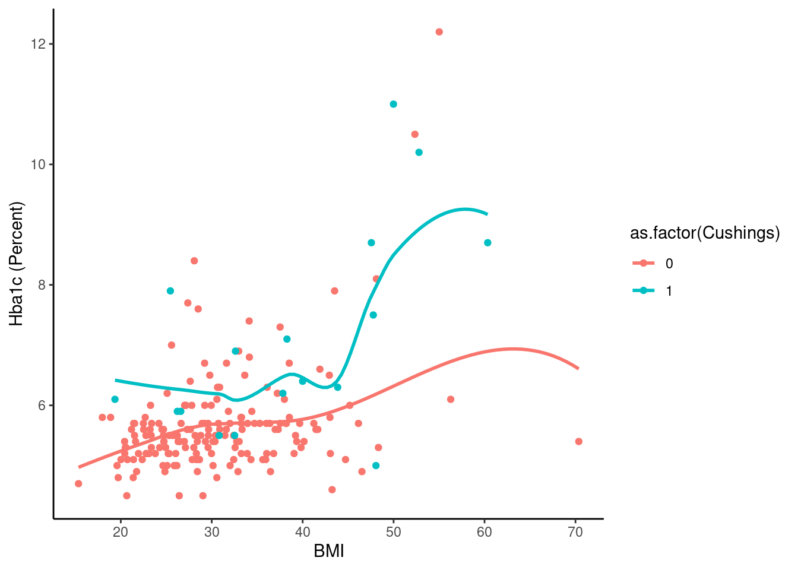{width=672}
:::

```{.r .cell-code}
library(knitr)
hba1c.summary %>% kable(caption="Summary of Hb1ac levels by obesity and pre-existing Cushing's")
```

::: {.cell-output-display}


Table: Summary of Hb1ac levels by obesity and pre-existing Cushing's

| Cushings|Obesity   |     mean|        se|        sd|  n|
|--------:|:---------|--------:|---------:|---------:|--:|
|        0|Non-Obese | 5.501020| 0.0616673| 0.6104747| 98|
|        0|Obese     | 5.870370| 0.1225683| 1.1031143| 81|
|        1|Non-Obese | 6.450000| 0.4856267| 0.9712535|  4|
|        1|Obese     | 7.307692| 0.5129679| 1.8495322| 13|


:::

```{.r .cell-code}
library(broom)
lm(value ~ Cushings + Obesity + Cushings:Obesity,data=hba1c.data) |> 
  tidy() |> 
  kable(caption="2x2 ANOVA with Interaction for effects of Obesity and Cushings on Hba1c")
```

::: {.cell-output-display}


Table: 2x2 ANOVA with Interaction for effects of Obesity and Cushings on Hba1c

|term                  |  estimate| std.error|  statistic|   p.value|
|:---------------------|---------:|---------:|----------:|---------:|
|(Intercept)           | 5.5010204| 0.0970926| 56.6574481| 0.0000000|
|Cushings              | 0.9489796| 0.4902937|  1.9355328| 0.0543938|
|ObesityObese          | 0.3693500| 0.1443345|  2.5589854| 0.0112683|
|Cushings:ObesityObese | 0.4883423| 0.5682062|  0.8594456| 0.3911665|


:::

```{.r .cell-code}
lm(value ~ Cushings + ObesityIII + Cushings:ObesityIII,data=hba1c.data) |> 
  tidy() |> 
  kable(caption="2x2 ANOVA with Interaction for effects of Class III Obesity and Cushings on Hba1c")
```

::: {.cell-output-display}


Table: 2x2 ANOVA with Interaction for effects of Class III Obesity and Cushings on Hba1c

|term                               |  estimate| std.error| statistic|   p.value|
|:----------------------------------|---------:|---------:|---------:|---------:|
|(Intercept)                        | 5.5748428| 0.0721782| 77.237240| 0.0000000|
|Cushings                           | 0.7651572| 0.2967216|  2.578704| 0.0106656|
|ObesityIIIClass III Obese          | 0.8351572| 0.2159322|  3.867683| 0.0001504|
|Cushings:ObesityIIIClass III Obese | 1.0248428| 0.4977902|  2.058784| 0.0408651|


:::

```{.r .cell-code}
lm(value ~ Cushings + BMI + Cushings:Obesity,data=hba1c.data) |> 
  tidy() |> 
  kable(caption="2x2 ANOVA with Interaction for effects of Obesity and BMI on Hba1c")
```

::: {.cell-output-display}


Table: 2x2 ANOVA with Interaction for effects of Obesity and BMI on Hba1c

|term                  |   estimate| std.error|  statistic|   p.value|
|:---------------------|----------:|---------:|----------:|---------:|
|(Intercept)           |  4.1987483| 0.2552271| 16.4510295| 0.0000000|
|Cushings              |  1.0825194| 0.4566348|  2.3706457| 0.0187476|
|BMI                   |  0.0478872| 0.0080251|  5.9671600| 0.0000000|
|Cushings:ObesityObese | -0.0452704| 0.5351304| -0.0845969| 0.9326700|


:::
:::


### Glucose


::: {.cell}

```{.r .cell-code}
m.out.glucose <- matchit(Cushings ~ AgeInYears + GenderCode + RaceEthnicity, 
                 data = complete.data |> filter(RESULT_CODE %in% c("GLUC","GLUC_WB")), 
                 method = "nearest", 
                 exact = c("GenderCode", "RaceEthnicity"),# Force exact matches
                 ratio=fold) 

summary(m.out.glucose, standardize = TRUE)  # Balance statistics[5]
```

::: {.cell-output .cell-output-stdout}

```

Call:
matchit(formula = Cushings ~ AgeInYears + GenderCode + RaceEthnicity, 
    data = filter(complete.data, RESULT_CODE %in% c("GLUC", "GLUC_WB")), 
    method = "nearest", exact = c("GenderCode", "RaceEthnicity"), 
    ratio = fold)

Summary of Balance for All Data:
                                Means Treated Means Control Std. Mean Diff.
distance                               0.0443        0.0154          0.7027
AgeInYears                            46.0291       62.0461         -0.9910
GenderCodeF                            0.8112        0.5527          0.6606
GenderCodeM                            0.1888        0.4473         -0.6606
RaceEthnicityAsian                     0.0179        0.0662         -0.3649
RaceEthnicityBlack                     0.0448        0.1151         -0.3398
RaceEthnicityHispanic or Latino        0.0459        0.0296          0.0777
RaceEthnicityOther                     0.0209        0.0328         -0.0836
RaceEthnicityWhite                     0.8706        0.7563          0.3405
                                Var. Ratio eCDF Mean eCDF Max
distance                            3.7615    0.2622   0.5267
AgeInYears                          0.8797    0.1969   0.4155
GenderCodeF                              .    0.2585   0.2585
GenderCodeM                              .    0.2585   0.2585
RaceEthnicityAsian                       .    0.0483   0.0483
RaceEthnicityBlack                       .    0.0703   0.0703
RaceEthnicityHispanic or Latino          .    0.0163   0.0163
RaceEthnicityOther                       .    0.0120   0.0120
RaceEthnicityWhite                       .    0.1143   0.1143

Summary of Balance for Matched Data:
                                Means Treated Means Control Std. Mean Diff.
distance                               0.0443        0.0417          0.0614
AgeInYears                            46.0291       46.6023         -0.0355
GenderCodeF                            0.8112        0.8112          0.0000
GenderCodeM                            0.1888        0.1888          0.0000
RaceEthnicityAsian                     0.0179        0.0179          0.0000
RaceEthnicityBlack                     0.0448        0.0448          0.0000
RaceEthnicityHispanic or Latino        0.0459        0.0459          0.0000
RaceEthnicityOther                     0.0209        0.0209          0.0000
RaceEthnicityWhite                     0.8706        0.8706          0.0000
                                Var. Ratio eCDF Mean eCDF Max Std. Pair Dist.
distance                            1.3567    0.0028   0.0345          0.0676
AgeInYears                          1.1203    0.0072   0.0498          0.0449
GenderCodeF                              .    0.0000   0.0000          0.0000
GenderCodeM                              .    0.0000   0.0000          0.0000
RaceEthnicityAsian                       .    0.0000   0.0000          0.0000
RaceEthnicityBlack                       .    0.0000   0.0000          0.0000
RaceEthnicityHispanic or Latino          .    0.0000   0.0000          0.0000
RaceEthnicityOther                       .    0.0000   0.0000          0.0000
RaceEthnicityWhite                       .    0.0000   0.0000          0.0000

Sample Sizes:
          Control Treated
All        225981    3639
Matched     36390    3639
Unmatched  189591       0
Discarded       0       0
```


:::

```{.r .cell-code}
plot(m.out.glucose, type = "jitter")         # Propensity score distribution[5]
```

::: {.cell-output-display}
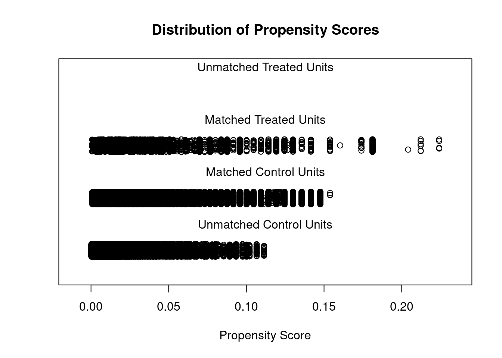{width=672}
:::

::: {.cell-output .cell-output-stdout}

```
To identify the units, use first mouse button; to stop, use second.
```


:::

```{.r .cell-code}
matched_data.glucose <- match.data(m.out.glucose)

glucose.data <- 
  matched_data.glucose |>
  mutate(value = as.numeric(VALUE)) %>% #forced into numeric form  
  arrange(desc(DeID_AdmitDate)) %>% #sort by date
  distinct(DeID_PatientID,.keep_all = T) %>% #unique cases
  mutate(Obesity = if_else(BMI>30, "Obese","Non-Obese"))  |>
  mutate(ObesityIII = if_else(BMI>40, "Class III Obese","All Others"))  |>
  filter(!is.na(Obesity)) 

glucose.summary <-
  glucose.data %>%
  group_by(Cushings,Obesity) |>
  summarize(mean=mean(value,na.rm=T),
            se=se(value),
            sd=sd(value,na.rm=T),
            n=length(value))

ggplot(glucose.summary,
       aes(y=mean,
           ymin=mean-se,
           ymax=mean+se,
           x=Obesity,
           fill=as.factor(Cushings))) +
  geom_col(position = position_dodge(width = 0.9)) +
  geom_errorbar(
    position = position_dodge(width = 0.9), # must match geom_col
    width = 0.5
  ) +
  labs(y="Glucose (mg/dL)") +
  theme_classic()
```

::: {.cell-output-display}
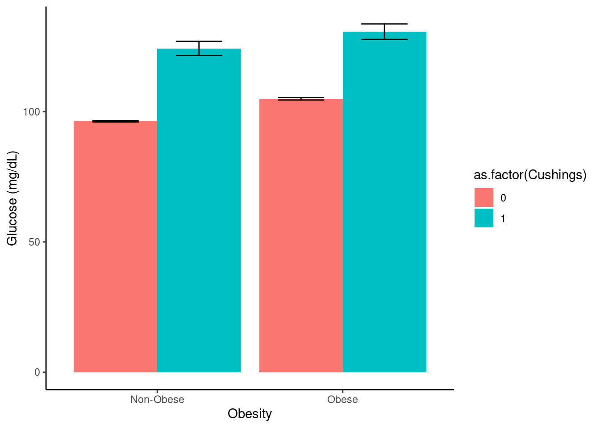{width=672}
:::

```{.r .cell-code}
ggplot(glucose.data,
       aes(y=value,
           x=BMI,
           col=as.factor(Cushings))) +
  geom_point() +
  stat_smooth(method="loess", se=F) +
  labs(y="Glucuose (mg/dL)") +
  theme_classic()
```

::: {.cell-output-display}
{width=672}
:::

```{.r .cell-code}
glucose.summary %>% kable(caption="Summary of glucose levels by obesity and pre-existing Cushing's")
```

::: {.cell-output-display}


Table: Summary of glucose levels by obesity and pre-existing Cushing's

| Cushings|Obesity   |      mean|       se|       sd|    n|
|--------:|:---------|---------:|--------:|--------:|----:|
|        0|Non-Obese |  96.34182| 0.256902| 24.98826| 9461|
|        0|Obese     | 104.97319| 0.465826| 37.20781| 6380|
|        1|Non-Obese | 124.30469| 2.707995| 30.63747|  128|
|        1|Obese     | 130.73246| 2.964935| 44.76954|  228|


:::

```{.r .cell-code}
lm(value ~ Cushings + Obesity + Cushings:Obesity,data=glucose.data) |> 
  tidy() |> 
  kable(caption="2x2 ANOVA with Interaction for effects of Obesity and Cushings on Glucose")
```

::: {.cell-output-display}


Table: 2x2 ANOVA with Interaction for effects of Obesity and Cushings on Glucose

|term                  |  estimate| std.error|   statistic|   p.value|
|:---------------------|---------:|---------:|-----------:|---------:|
|(Intercept)           | 96.341824| 0.3161423| 304.7419505| 0.0000000|
|Cushings              | 27.962863| 2.7363037|  10.2192104| 0.0000000|
|ObesityObese          |  8.631369| 0.4981773|  17.3258987| 0.0000000|
|Cushings:ObesityObese | -2.203600| 3.4326246|  -0.6419579| 0.5209096|


:::

```{.r .cell-code}
lm(value ~ Cushings + BMI + Cushings:Obesity,data=glucose.data) |> 
  tidy() |> 
  kable(caption="2x2 ANOVA with Interaction for effects of Obesity and BMI on Glucose")
```

::: {.cell-output-display}


Table: 2x2 ANOVA with Interaction for effects of Obesity and BMI on Glucose

|term                  |   estimate| std.error|  statistic|   p.value|
|:---------------------|----------:|---------:|----------:|---------:|
|(Intercept)           | 81.3955168| 0.9634177| 84.4862137| 0.0000000|
|Cushings              | 26.6838885| 2.7237561|  9.7967245| 0.0000000|
|BMI                   |  0.6257969| 0.0316629| 19.7643645| 0.0000000|
|Cushings:ObesityObese | -2.1180690| 3.4144952| -0.6203169| 0.5350579|


:::
:::


### ALT


::: {.cell}

```{.r .cell-code}
m.out.alt <- matchit(Cushings ~ AgeInYears + GenderCode + RaceEthnicity, 
                 data = complete.data |> filter(RESULT_CODE %in% c("ALT")), 
                 method = "nearest", 
                 exact = c("GenderCode", "RaceEthnicity"),
                 ratio=fold) # Force exact matches

summary(m.out.alt, standardize = TRUE)  # Balance statistics[5]
```

::: {.cell-output .cell-output-stdout}

```

Call:
matchit(formula = Cushings ~ AgeInYears + GenderCode + RaceEthnicity, 
    data = filter(complete.data, RESULT_CODE %in% c("ALT")), 
    method = "nearest", exact = c("GenderCode", "RaceEthnicity"), 
    ratio = fold)

Summary of Balance for All Data:
                                Means Treated Means Control Std. Mean Diff.
distance                               0.0059        0.0023          0.7433
AgeInYears                            48.2730       59.9481         -0.7229
GenderCodeF                            0.8344        0.5615          0.7341
GenderCodeM                            0.1656        0.4385         -0.7341
RaceEthnicityAsian                     0.0031        0.0717         -1.2412
RaceEthnicityBlack                     0.0153        0.1121         -0.7877
RaceEthnicityHispanic or Latino        0.0337        0.0316          0.0121
RaceEthnicityOther                     0.0092        0.0333         -0.2519
RaceEthnicityWhite                     0.9387        0.7513          0.7806
                                Var. Ratio eCDF Mean eCDF Max
distance                            2.6912    0.2117   0.5246
AgeInYears                          0.8548    0.1472   0.3284
GenderCodeF                              .    0.2729   0.2729
GenderCodeM                              .    0.2729   0.2729
RaceEthnicityAsian                       .    0.0686   0.0686
RaceEthnicityBlack                       .    0.0968   0.0968
RaceEthnicityHispanic or Latino          .    0.0022   0.0022
RaceEthnicityOther                       .    0.0241   0.0241
RaceEthnicityWhite                       .    0.1873   0.1873

Summary of Balance for Matched Data:
                                Means Treated Means Control Std. Mean Diff.
distance                               0.0059        0.0057          0.0397
AgeInYears                            48.2730       48.6061         -0.0206
GenderCodeF                            0.8344        0.8344          0.0000
GenderCodeM                            0.1656        0.1656          0.0000
RaceEthnicityAsian                     0.0031        0.0031          0.0000
RaceEthnicityBlack                     0.0153        0.0153          0.0000
RaceEthnicityHispanic or Latino        0.0337        0.0337          0.0000
RaceEthnicityOther                     0.0092        0.0092          0.0000
RaceEthnicityWhite                     0.9387        0.9387          0.0000
                                Var. Ratio eCDF Mean eCDF Max Std. Pair Dist.
distance                            1.2496    0.0005   0.0399          0.0398
AgeInYears                          1.0985    0.0019   0.0543          0.0212
GenderCodeF                              .    0.0000   0.0000          0.0000
GenderCodeM                              .    0.0000   0.0000          0.0000
RaceEthnicityAsian                       .    0.0000   0.0000          0.0000
RaceEthnicityBlack                       .    0.0000   0.0000          0.0000
RaceEthnicityHispanic or Latino          .    0.0000   0.0000          0.0000
RaceEthnicityOther                       .    0.0000   0.0000          0.0000
RaceEthnicityWhite                       .    0.0000   0.0000          0.0000

Sample Sizes:
          Control Treated
All        139025     326
Matched      3260     326
Unmatched  135765       0
Discarded       0       0
```


:::

```{.r .cell-code}
plot(m.out.alt, type = "jitter")  
```

::: {.cell-output-display}
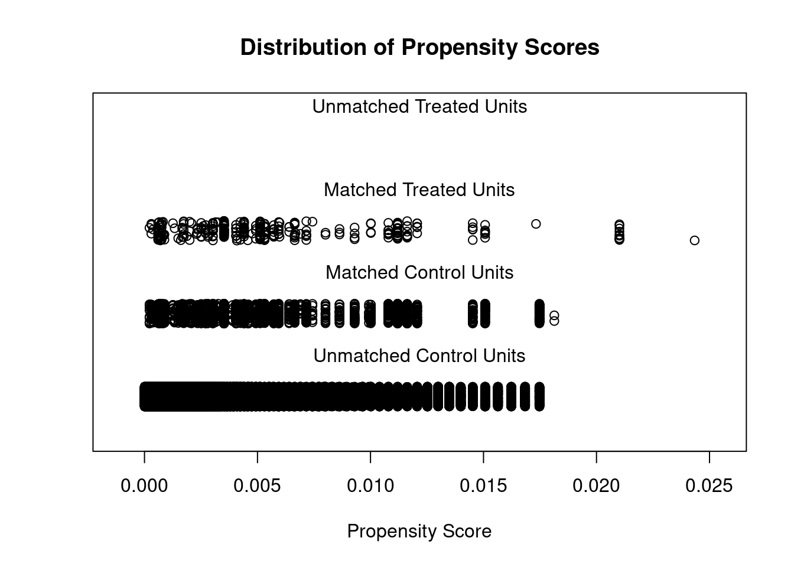{width=672}
:::

::: {.cell-output .cell-output-stdout}

```
To identify the units, use first mouse button; to stop, use second.
```


:::

```{.r .cell-code}
matched_data.alt <- match.data(m.out.alt)

alt.data <- 
  matched_data.alt |>
  mutate(value = as.numeric(VALUE)) %>% #forced into numeric form  
  arrange(desc(DeID_AdmitDate)) %>% #sort by date
  distinct(DeID_PatientID,.keep_all = T) %>% #unique cases
  mutate(Obesity = if_else(BMI>30, "Obese","Non-Obese"))  |>
  filter(!is.na(Obesity)) 

alt.summary <-
  alt.data %>%
  group_by(Cushings,Obesity) |>
  summarize(mean=mean(value,na.rm=T),
            se=se(value),
            sd=sd(value,na.rm=T),
            n=length(value))

library(ggplot2)
ggplot(alt.summary,
       aes(y=mean,
           ymin=mean-se,
           ymax=mean+se,
           x=Obesity,
           fill=as.factor(Cushings))) +
  geom_col(position = position_dodge(width = 0.9)) +
  geom_errorbar(
    position = position_dodge(width = 0.9), # must match geom_col
    width = 0.5
  ) +
  labs(y="ALT (mg/dL)") +
  theme_classic()
```

::: {.cell-output-display}
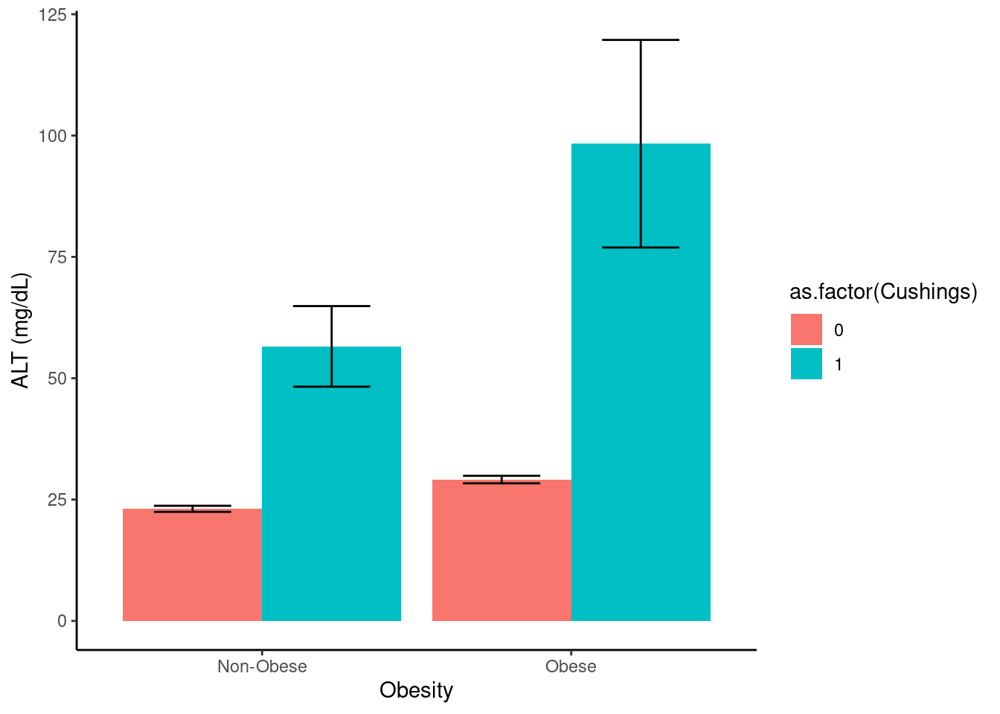{width=672}
:::

```{.r .cell-code}
ggplot(alt.data,
       aes(y=value,
           x=BMI,
           col=as.factor(Cushings))) +
  geom_point() +
  stat_smooth(method="loess", se=F) +
  labs(y="ALT (mg/dL)") +
  theme_classic()
```

::: {.cell-output-display}
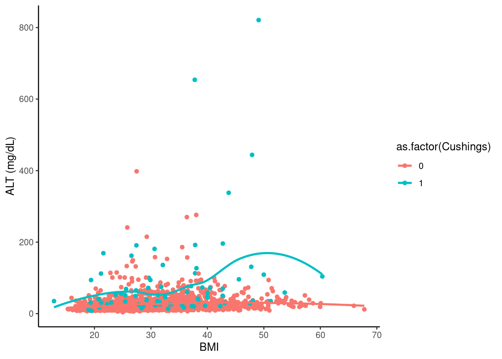{width=672}
:::

```{.r .cell-code}
library(knitr)
alt.summary %>% kable(caption="Summary of ALT levels by obesity and pre-existing Cushing's")
```

::: {.cell-output-display}


Table: Summary of ALT levels by obesity and pre-existing Cushing's

| Cushings|Obesity   |     mean|         se|        sd|    n|
|--------:|:---------|--------:|----------:|---------:|----:|
|        0|Non-Obese | 23.09761|  0.6252781|  20.72870| 1099|
|        0|Obese     | 29.12606|  0.7734031|  22.22777|  826|
|        1|Non-Obese | 56.56250|  8.3017606|  46.96185|   32|
|        1|Obese     | 98.31373| 21.3854640| 154.21277|   52|


:::

```{.r .cell-code}
library(broom)
lm(value ~ Cushings + Obesity + Cushings:Obesity,data=alt.data) |> 
  tidy() |> 
  kable(caption="2x2 ANOVA with Interaction for effects of Obesity and Cushings on ALT")
```

::: {.cell-output-display}


Table: 2x2 ANOVA with Interaction for effects of Obesity and Cushings on ALT

|term                  |  estimate| std.error| statistic|  p.value|
|:---------------------|---------:|---------:|---------:|--------:|
|(Intercept)           | 23.097606| 0.9929477| 23.261654| 0.00e+00|
|Cushings              | 33.464894| 5.8691104|  5.701868| 0.00e+00|
|ObesityObese          |  6.028455| 1.5112271|  3.989112| 6.87e-05|
|Cushings:ObesityObese | 35.722771| 7.5325394|  4.742460| 2.30e-06|


:::

```{.r .cell-code}
lm(value ~ Cushings + BMI + Cushings:Obesity,data=hba1c.data) |> 
  tidy() |> 
  kable(caption="2x2 ANOVA with Interaction for effects of Obesity and BMI on Hba1c")
```

::: {.cell-output-display}


Table: 2x2 ANOVA with Interaction for effects of Obesity and BMI on Hba1c

|term                  |   estimate| std.error|  statistic|   p.value|
|:---------------------|----------:|---------:|----------:|---------:|
|(Intercept)           |  4.1987483| 0.2552271| 16.4510295| 0.0000000|
|Cushings              |  1.0825194| 0.4566348|  2.3706457| 0.0187476|
|BMI                   |  0.0478872| 0.0080251|  5.9671600| 0.0000000|
|Cushings:ObesityObese | -0.0452704| 0.5351304| -0.0845969| 0.9326700|


:::
:::


### LDL Cholesterol


::: {.cell}

```{.r .cell-code}
m.out.ldl <- matchit(Cushings ~ AgeInYears + GenderCode + RaceEthnicity, 
                 data = complete.data |> filter(RESULT_CODE %in% c("LDLC","DLDL")), 
                 method = "nearest", 
                 exact = c("GenderCode", "RaceEthnicity"),
                 ratio=fold) # Force exact matches

summary(m.out.ldl, standardize = TRUE)  # Balance statistics[5]
```

::: {.cell-output .cell-output-stdout}

```

Call:
matchit(formula = Cushings ~ AgeInYears + GenderCode + RaceEthnicity, 
    data = filter(complete.data, RESULT_CODE %in% c("LDLC", "DLDL")), 
    method = "nearest", exact = c("GenderCode", "RaceEthnicity"), 
    ratio = fold)

Summary of Balance for All Data:
                                Means Treated Means Control Std. Mean Diff.
distance                               0.0013        0.0002          0.6651
AgeInYears                            40.8462       58.0291         -0.9794
GenderCodeF                            0.8462        0.5379          0.8543
GenderCodeM                            0.1538        0.4621         -0.8543
RaceEthnicityAsian                     0.0000        0.1011         -0.3353
RaceEthnicityBlack                     0.0000        0.0799         -0.2947
RaceEthnicityHispanic or Latino        0.0000        0.0304         -0.1770
RaceEthnicityOther                     0.0000        0.0318         -0.1814
RaceEthnicityWhite                     1.0000        0.7568          0.5669
                                Var. Ratio eCDF Mean eCDF Max
distance                           17.2444    0.1744   0.6303
AgeInYears                          1.2669    0.2270   0.5251
GenderCodeF                              .    0.3082   0.3082
GenderCodeM                              .    0.3082   0.3082
RaceEthnicityAsian                       .    0.1011   0.1011
RaceEthnicityBlack                       .    0.0799   0.0799
RaceEthnicityHispanic or Latino          .    0.0304   0.0304
RaceEthnicityOther                       .    0.0318   0.0318
RaceEthnicityWhite                       .    0.2432   0.2432

Summary of Balance for Matched Data:
                                Means Treated Means Control Std. Mean Diff.
distance                               0.0013        0.0011          0.1268
AgeInYears                            40.8462       41.6154         -0.0438
GenderCodeF                            0.8462        0.8462          0.0000
GenderCodeM                            0.1538        0.1538          0.0000
RaceEthnicityAsian                     0.0000        0.0000          0.0000
RaceEthnicityBlack                     0.0000        0.0000          0.0000
RaceEthnicityHispanic or Latino        0.0000        0.0000          0.0000
RaceEthnicityOther                     0.0000        0.0000          0.0000
RaceEthnicityWhite                     1.0000        1.0000          0.0000
                                Var. Ratio eCDF Mean eCDF Max Std. Pair Dist.
distance                            2.0785    0.0002   0.1538          0.1268
AgeInYears                          1.2490    0.0021   0.1538          0.0438
GenderCodeF                              .    0.0000   0.0000          0.0000
GenderCodeM                              .    0.0000   0.0000          0.0000
RaceEthnicityAsian                       .    0.0000   0.0000          0.0000
RaceEthnicityBlack                       .    0.0000   0.0000          0.0000
RaceEthnicityHispanic or Latino          .    0.0000   0.0000          0.0000
RaceEthnicityOther                       .    0.0000   0.0000          0.0000
RaceEthnicityWhite                       .    0.0000   0.0000          0.0000

Sample Sizes:
          Control Treated
All         69589      13
Matched       130      13
Unmatched   69459       0
Discarded       0       0
```


:::

```{.r .cell-code}
plot(m.out.ldl, type = "jitter")  
```

::: {.cell-output-display}
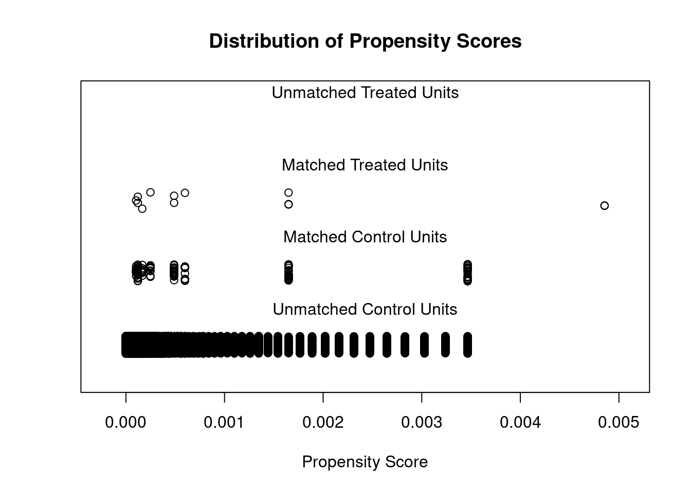{width=672}
:::

::: {.cell-output .cell-output-stdout}

```
To identify the units, use first mouse button; to stop, use second.
```


:::

```{.r .cell-code}
matched_data.ldl <- match.data(m.out.ldl)

ldl.data <- 
  matched_data.ldl |>
  mutate(value = as.numeric(VALUE)) %>% #forced into numeric form  
  arrange(desc(DeID_AdmitDate)) %>% #sort by date
  distinct(DeID_PatientID,.keep_all = T) %>% #unique cases
  mutate(Obesity = if_else(BMI>30, "Obese","Non-Obese"))  |>
  filter(!is.na(Obesity)) 

ldl.summary <-
  ldl.data %>%
  group_by(Cushings,Obesity) |>
  summarize(mean=mean(value,na.rm=T),
            se=se(value),
            sd=sd(value,na.rm=T),
            n=length(value))

ggplot(ldl.summary,
       aes(y=mean,
           ymin=mean-se,
           ymax=mean+se,
           x=Obesity,
           fill=as.factor(Cushings))) +
  geom_col(position = position_dodge(width = 0.9)) +
  geom_errorbar(
    position = position_dodge(width = 0.9), # must match geom_col
    width = 0.5
  ) +
  labs(y="LDL Cholesterol (mg/dL)") +
  theme_classic()
```

::: {.cell-output-display}
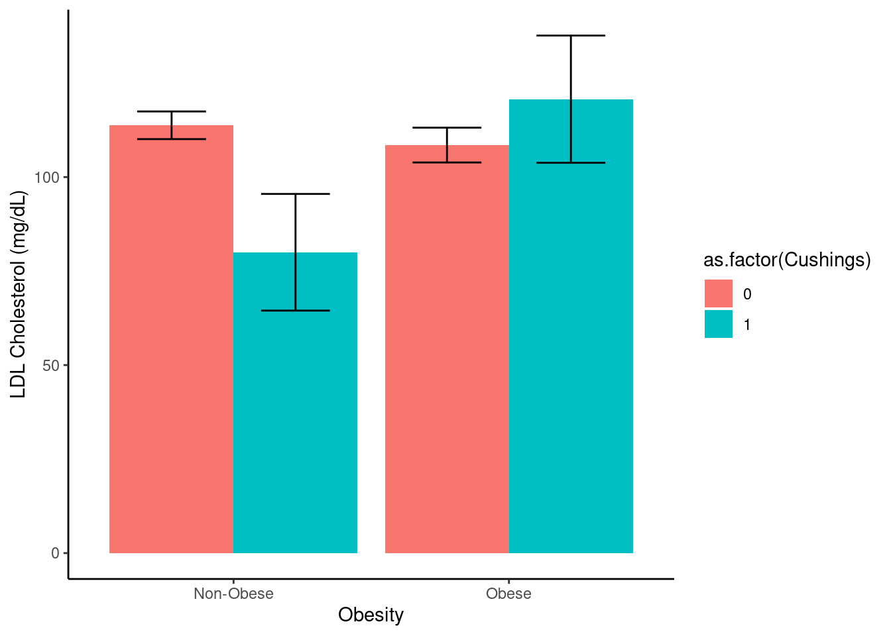{width=672}
:::

```{.r .cell-code}
ggplot(ldl.data,
       aes(y=value,
           x=BMI,
           col=as.factor(Cushings))) +
  geom_point() +
  stat_smooth(method="loess", se=F) +
  labs(y="LDL Cholesterol (mg/dL)") +
  theme_classic()
```

::: {.cell-output-display}
{width=672}
:::

```{.r .cell-code}
ldl.summary %>% kable(caption="Summary of LDL-C levels by obesity and pre-existing Cushing's")
```

::: {.cell-output-display}


Table: Summary of LDL-C levels by obesity and pre-existing Cushing's

| Cushings|Obesity   |     mean|        se|       sd|  n|
|--------:|:---------|--------:|---------:|--------:|--:|
|        0|Non-Obese | 113.7733|  3.674729| 31.82408| 75|
|        0|Obese     | 108.5102|  4.625253| 32.37677| 49|
|        1|Non-Obese |  80.0000| 15.513435| 26.87006|  3|
|        1|Obese     | 120.7143| 16.918170| 44.76127|  7|


:::

```{.r .cell-code}
lm(value ~ Cushings + Obesity + Cushings:Obesity,data=ldl.data) |> 
  tidy() |> 
  kable(caption="2x2 ANOVA with Interaction for effects of Obesity and Cushings on LDL-C")
```

::: {.cell-output-display}


Table: 2x2 ANOVA with Interaction for effects of Obesity and Cushings on LDL-C

|term                  |   estimate| std.error|  statistic|   p.value|
|:---------------------|----------:|---------:|----------:|---------:|
|(Intercept)           | 113.773333|  3.776780| 30.1244302| 0.0000000|
|Cushings              | -33.773333| 23.434301| -1.4411923| 0.1519534|
|ObesityObese          |  -5.263129|  6.008063| -0.8760111| 0.3826523|
|Cushings:ObesityObese |  45.977415| 26.904061|  1.7089396| 0.0898669|


:::

```{.r .cell-code}
lm(value ~ Cushings + BMI + Cushings:Obesity,data=ldl.data) |> 
  tidy() |> 
  kable(caption="2x2 ANOVA with Interaction for effects of Obesity and BMI on LDL-C")
```

::: {.cell-output-display}


Table: 2x2 ANOVA with Interaction for effects of Obesity and BMI on LDL-C

|term                  |    estimate|  std.error| statistic|   p.value|
|:---------------------|-----------:|----------:|---------:|---------:|
|(Intercept)           | 113.9022087| 10.1472758| 11.224905| 0.0000000|
|Cushings              | -32.1852793| 23.4780289| -1.370868| 0.1727965|
|BMI                   |  -0.0731692|  0.3216894| -0.227453| 0.8204316|
|Cushings:ObesityObese |  42.3060658| 27.2125234|  1.554654| 0.1224784|


:::
:::


## Blood Pressure

Blood pressure data is in a separate file (NursingStandardVitalSigns.csv and ../controls/NursingStandardVitalSigns.csv).  We have mean noninvasive blood pressure, as well as systolic and diastolic.  These data, similar to lab results need to be mapped to encounter data 


::: {.cell}

```{.r .cell-code}
bp.data.cases <- read_csv(bp.filename.cases) |>
  left_join(case.encounters.all) |>
  left_join(case.demographics, by="DeID_PatientID") 

bp.data.controls <- read_csv(bp.filename.controls) |>
  left_join(control.encounters.all) |>
  left_join(control.demographics, by="DeID_PatientID") 

bp.results <- bind_rows(bp.data.controls |> mutate(Cushings=0),
          bp.data.cases |> mutate(Cushings=1)) |>  #combined, new column indicating cushings
  mutate(cushings_procedure = ymd(cushings_procedure),
         DeID_AdmitDate = mdy_hm(DeID_AdmitDate)) |> 
  mutate(TimePoint = case_when(cushings_procedure<= DeID_AdmitDate ~ "Before",
                               cushings_procedure > DeID_AdmitDate ~ "After",
                               .default="Unknown")) %>% # defined each encounter as before or after
  mutate(ProcedureFollowUp = cushings_procedure - DeID_AdmitDate) #used to define point between the lab result and the procedure.

#filtered out lab results outside of our interval
bp.results.filtered <-
  bp.results |>
  filter(ProcedureFollowUp<procedure.result.interval | is.na(ProcedureFollowUp)) |>
  filter(TimePoint!="After")
  
#filtered out if the age, gender, race, ethnicity was NA for a patient.
bp.data.race.ethnicity.age <-
  bp.results.filtered |>
  filter(!if_any(c(AgeInYears, GenderCode, RaceCode, EthnicityCode), is.na)) #removed if they had missing data for age, gender, race or ethnicity

#this is the complete dataset  
bp.data  <-
  bp.data.race.ethnicity.age |>
  mutate(RaceEthnicity = case_when(EthnicityCode=="HL"~"Hispanic or Latino",
                                   RaceCode=="C"~"White",
                                   RaceCode=="AA"~"Black",
                                   RaceCode=="A"~"Asian",
                                   .default="Other")) #defined race/ethnicity categories
```
:::


### Inclusion and Exclusion for Blood Pressure Data

We began with 98302 controls who had lab data, and **338** cases with Cushing's Disease.

* **Had Laboratory Results**: We also removed 168 lab results from Cushing's patients because they were outside of our acceptable window of 30 days before their procedure.  This eliminated a total of **1** Cushings patients from our dataset.

* **Missing Demographic Data** After filtering out missing demographic data we had 311 cases and 97946 controls with lab results.  The specific pieces of missing information are found here:


::: {.cell}

```{.r .cell-code}
bp.results.filtered |>
  filter(Cushings==1) |> #only for cushings data
  group_by(DeID_PatientID) %>%
  summarise(
    Age_na = sum(is.na(AgeInYears)),
    Gender_na = sum(is.na(GenderCode)),
    Race_na = sum(is.na(RaceCode)),
    Ethnicity_na = sum(is.na(EthnicityCode)),
    Any_na = any(is.na(AgeInYears) | is.na(GenderCode) | is.na(RaceCode) |is.na(EthnicityCode))) |>
  ungroup() |>
    pivot_longer(cols = ends_with("_na"),
                 names_to = "field",
                 values_to = "has_na") |>
  filter(has_na!=0) %>%
  count(field, name = "n_patients_with_NA")-> missing.demographic.summary.bp

library(knitr)
missing.demographic.summary.bp |> arrange(desc(n_patients_with_NA)) |> kable(caption="Summary of exclusions from Cushing's patient pool due to missing demographic data, for blood pressure measures")
```

::: {.cell-output-display}


Table: Summary of exclusions from Cushing's patient pool due to missing demographic data, for blood pressure measures

|field        | n_patients_with_NA|
|:------------|------------------:|
|Any_na       |                 33|
|Ethnicity_na |                 23|
|Gender_na    |                 14|
|Race_na      |                 14|
|Age_na       |                 12|


:::
:::


Our final dataset for blood pressure therefore included **363** Cushing's patients, and we had the ability to draw from **70070** control patients.


### Blood Pressure 


::: {.cell}

```{.r .cell-code}
m.out.bp <- matchit(Cushings ~ AgeInYears + GenderCode + RaceEthnicity, 
                 data = bp.data, 
                 method = "nearest", 
                 exact = c("GenderCode", "RaceEthnicity"),# Force exact matches
                 ratio=fold) 

summary(m.out.bp, standardize = TRUE)  # Balance statistics[5]
```

::: {.cell-output .cell-output-stdout}

```

Call:
matchit(formula = Cushings ~ AgeInYears + GenderCode + RaceEthnicity, 
    data = bp.data, method = "nearest", exact = c("GenderCode", 
        "RaceEthnicity"), ratio = fold)

Summary of Balance for All Data:
                                Means Treated Means Control Std. Mean Diff.
distance                               0.0258        0.0111          0.6830
AgeInYears                            47.5079       61.1458         -0.8267
GenderCodeF                            0.8325        0.5795          0.6777
GenderCodeM                            0.1675        0.4205         -0.6777
RaceEthnicityAsian                     0.0133        0.0602         -0.4098
RaceEthnicityBlack                     0.0446        0.1187         -0.3588
RaceEthnicityHispanic or Latino        0.0327        0.0307          0.0114
RaceEthnicityOther                     0.0253        0.0325         -0.0453
RaceEthnicityWhite                     0.8841        0.7580          0.3938
                                Var. Ratio eCDF Mean eCDF Max
distance                            2.7215    0.2346   0.4920
AgeInYears                          0.8619    0.1678   0.3766
GenderCodeF                              .    0.2530   0.2530
GenderCodeM                              .    0.2530   0.2530
RaceEthnicityAsian                       .    0.0469   0.0469
RaceEthnicityBlack                       .    0.0741   0.0741
RaceEthnicityHispanic or Latino          .    0.0020   0.0020
RaceEthnicityOther                       .    0.0071   0.0071
RaceEthnicityWhite                       .    0.1261   0.1261

Summary of Balance for Matched Data:
                                Means Treated Means Control Std. Mean Diff.
distance                               0.0258        0.0248          0.0474
AgeInYears                            47.5079       47.9702         -0.0280
GenderCodeF                            0.8325        0.8325         -0.0000
GenderCodeM                            0.1675        0.1675         -0.0000
RaceEthnicityAsian                     0.0133        0.0133         -0.0000
RaceEthnicityBlack                     0.0446        0.0446         -0.0000
RaceEthnicityHispanic or Latino        0.0327        0.0327         -0.0000
RaceEthnicityOther                     0.0253        0.0253         -0.0000
RaceEthnicityWhite                     0.8841        0.8841         -0.0000
                                Var. Ratio eCDF Mean eCDF Max Std. Pair Dist.
distance                            1.2700    0.0021   0.0424          0.0513
AgeInYears                          1.1163    0.0062   0.0619          0.0348
GenderCodeF                              .    0.0000   0.0000          0.0000
GenderCodeM                              .    0.0000   0.0000          0.0000
RaceEthnicityAsian                       .    0.0000   0.0000          0.0000
RaceEthnicityBlack                       .    0.0000   0.0000          0.0000
RaceEthnicityHispanic or Latino          .    0.0000   0.0000          0.0000
RaceEthnicityOther                       .    0.0000   0.0000          0.0000
RaceEthnicityWhite                       .    0.0000   0.0000          0.0000

Sample Sizes:
          Control Treated
All       1666879   19054
Matched    190540   19054
Unmatched 1476339       0
Discarded       0       0
```


:::

```{.r .cell-code}
plot(m.out.bp, type = "jitter")         # Propensity score distribution[5]
```

::: {.cell-output-display}
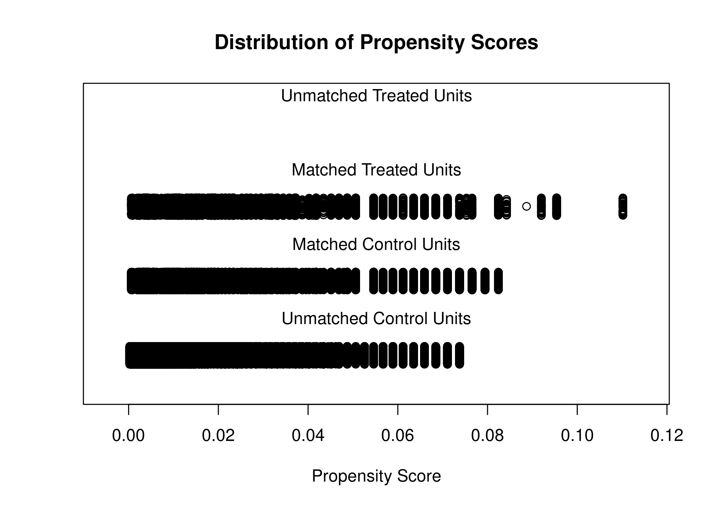{width=672}
:::

::: {.cell-output .cell-output-stdout}

```
To identify the units, use first mouse button; to stop, use second.
```


:::

```{.r .cell-code}
matched_data <- match.data(m.out.bp)

bp.data <- 
  matched_data |>
  arrange(desc(DeID_AdmitDate)) %>% #sort by date
  distinct(DeID_PatientID,.keep_all = T) %>% #unique cases
  mutate(Obesity = if_else(BMI>30, "Obese","Non-Obese"))  |>
  mutate(ObesityIII = if_else(BMI>40, "Class III Obese","All Others"))  |>
  filter(!is.na(Obesity)) 
```
:::


#### Mean Arterial Pressure


::: {.cell}

```{.r .cell-code}
#MAP
bp.summary.map <-
  bp.data %>%
  group_by(Cushings,Obesity) |>
  summarize(mean=mean(BPMeanNonInvasive,na.rm=T),
            se=se(BPMeanNonInvasive),
            sd=sd(BPMeanNonInvasive,na.rm=T),
            n=length(BPMeanNonInvasive))

ggplot(bp.summary.map,
       aes(y=mean,
           ymin=mean-se,
           ymax=mean+se,
           x=Obesity,
           fill=as.factor(Cushings))) +
  geom_col(position = position_dodge(width = 0.9)) +
  geom_errorbar(
    position = position_dodge(width = 0.9), # must match geom_col
    width = 0.5
  ) +
  labs(y="Blood Pressure (Mean; mmHg)") +
  theme_classic()
```

::: {.cell-output-display}
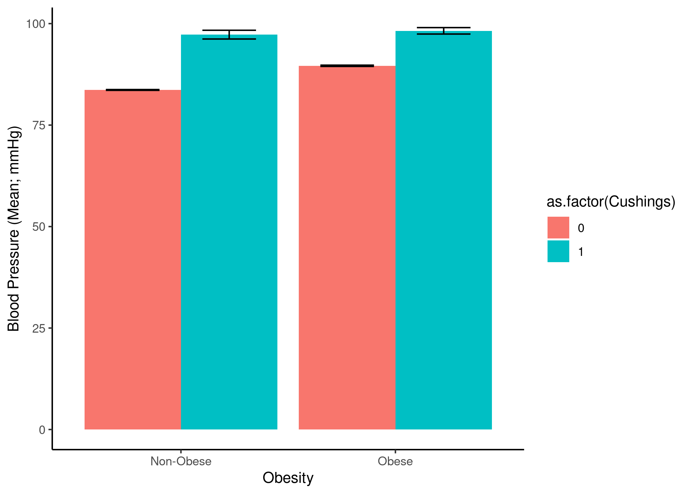{width=672}
:::

```{.r .cell-code}
ggplot(bp.data,
       aes(y=BPMeanNonInvasive,
           x=BMI,
           col=as.factor(Cushings))) +
  geom_point() +
  stat_smooth(method="loess", se=F) +
  labs(y="Blood Pressure (Mean; mmHg)") +
  theme_classic()
```

::: {.cell-output-display}
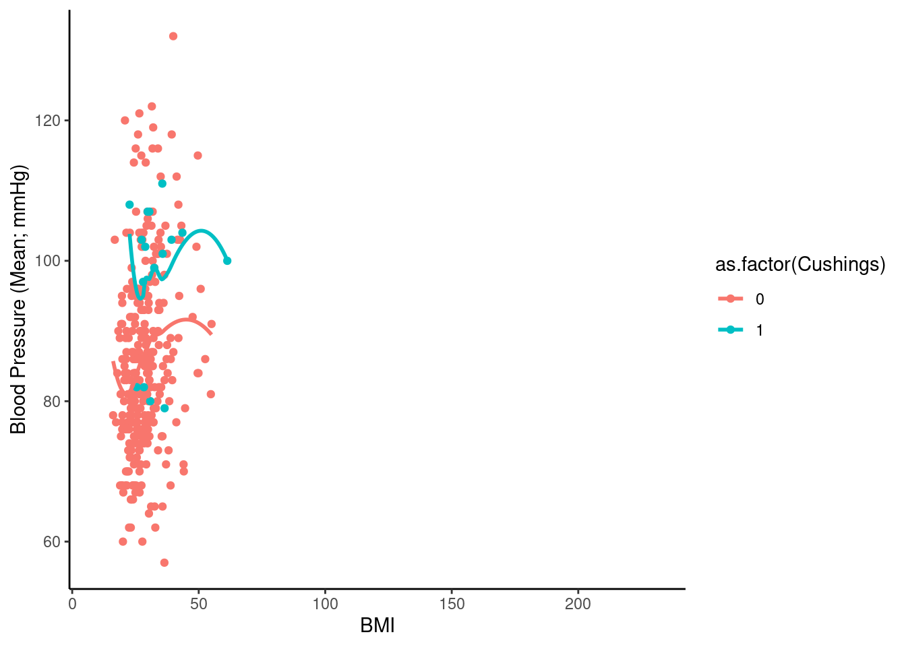{width=672}
:::

```{.r .cell-code}
bp.summary.map %>% kable(caption="Summary of blood pressure levels by obesity and pre-existing Cushing's (Mean)")
```

::: {.cell-output-display}


Table: Summary of blood pressure levels by obesity and pre-existing Cushing's (Mean)

| Cushings|Obesity   |     mean|        se|       sd|     n|
|--------:|:---------|--------:|---------:|--------:|-----:|
|        0|Non-Obese | 83.66184| 0.0981387| 11.97172| 14881|
|        0|Obese     | 89.60952| 0.1586487| 14.33292|  8162|
|        1|Non-Obese | 97.28571| 1.0774960| 11.04105|   105|
|        1|Obese     | 98.22222| 0.7923592| 11.23363|   201|


:::

```{.r .cell-code}
lm(BPMeanNonInvasive ~ Cushings + Obesity + Cushings:Obesity,data=bp.data) |> 
  tidy() |> 
  kable(caption="2x2 ANOVA with Interaction for effects of Obesity and Cushings on Blood Pressure (Mean)")
```

::: {.cell-output-display}


Table: 2x2 ANOVA with Interaction for effects of Obesity and Cushings on Blood Pressure (Mean)

|term                  |  estimate| std.error|  statistic|   p.value|
|:---------------------|---------:|---------:|----------:|---------:|
|(Intercept)           | 83.661836| 0.8858501| 94.4424255| 0.0000000|
|Cushings              | 13.623879| 4.8979926|  2.7815229| 0.0057273|
|ObesityObese          |  5.947688| 1.5270136|  3.8949804| 0.0001193|
|Cushings:ObesityObese | -5.011180| 6.6019825| -0.7590417| 0.4483794|


:::

```{.r .cell-code}
lm(BPMeanNonInvasive ~ Cushings + BMI + Cushings:Obesity,data=bp.data) |> 
  tidy() |> 
  kable(caption="2x2 ANOVA with Interaction for effects of Obesity and BMI on Blood Pressure (Mean)")
```

::: {.cell-output-display}


Table: 2x2 ANOVA with Interaction for effects of Obesity and BMI on Blood Pressure (Mean)

|term                  |   estimate| std.error|  statistic|   p.value|
|:---------------------|----------:|---------:|----------:|---------:|
|(Intercept)           | 73.2249926| 3.0144918| 24.2909908| 0.0000000|
|Cushings              | 12.2165876| 4.8524233|  2.5176261| 0.0122967|
|BMI                   |  0.4349916| 0.1023829|  4.2486754| 0.0000281|
|Cushings:ObesityObese | -3.9289726| 6.4975712| -0.6046833| 0.5458127|


:::
:::


#### Systolic Blood Pressure


::: {.cell}

```{.r .cell-code}
#systolic
bp.summary.sys <-
  bp.data %>%
  group_by(Cushings,Obesity) |>
  summarize(mean=mean(BPSysNonInvasive,na.rm=T),
            se=se(BPSysNonInvasive),
            sd=sd(BPSysNonInvasive,na.rm=T),
            n=length(BPSysNonInvasive))

ggplot(bp.summary.sys,
       aes(y=mean,
           ymin=mean-se,
           ymax=mean+se,
           x=Obesity,
           fill=as.factor(Cushings))) +
  geom_col(position = position_dodge(width = 0.9)) +
  geom_errorbar(
    position = position_dodge(width = 0.9), # must match geom_col
    width = 0.5
  ) +
  labs(y="Blood Pressure (Systolic; mmHg)") +
  theme_classic()
```

::: {.cell-output-display}
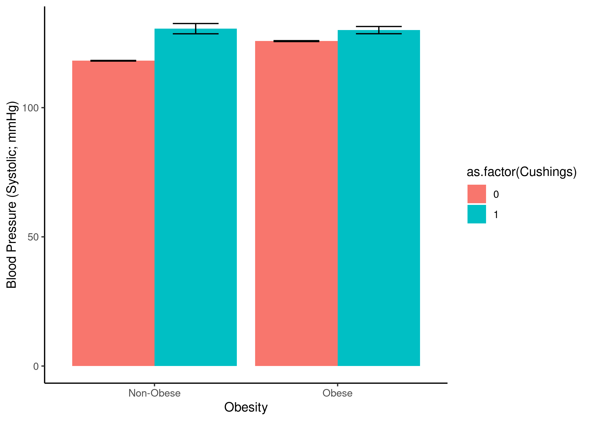{width=672}
:::

```{.r .cell-code}
ggplot(bp.data,
       aes(y=BPSysNonInvasive,
           x=BMI,
           col=as.factor(Cushings))) +
  geom_point() +
  stat_smooth(method="loess", se=F) +
  labs(y="Blood Pressure (Systolic; mmHg)") +
  theme_classic()
```

::: {.cell-output-display}
{width=672}
:::

```{.r .cell-code}
bp.summary.sys %>% kable(caption="Summary of blood pressure levels by obesity and pre-existing Cushing's (Systolic)")
```

::: {.cell-output-display}


Table: Summary of blood pressure levels by obesity and pre-existing Cushing's (Systolic)

| Cushings|Obesity   |     mean|        se|       sd|     n|
|--------:|:---------|--------:|---------:|--------:|-----:|
|        0|Non-Obese | 118.1498| 0.1288470| 15.71776| 14881|
|        0|Obese     | 125.7519| 0.1755628| 15.86101|  8162|
|        1|Non-Obese | 130.5694| 1.9840968| 20.33094|   105|
|        1|Obese     | 130.0080| 1.3993974| 19.83988|   201|


:::

```{.r .cell-code}
lm(BPSysNonInvasive ~ Cushings + Obesity + Cushings:Obesity,data=bp.data) |> 
  tidy() |> 
  kable(caption="2x2 ANOVA with Interaction for effects of Obesity and Cushings on Blood Pressure (Systolic)")
```

::: {.cell-output-display}


Table: 2x2 ANOVA with Interaction for effects of Obesity and Cushings on Blood Pressure (Systolic)

|term                  |   estimate| std.error|  statistic|   p.value|
|:---------------------|----------:|---------:|----------:|---------:|
|(Intercept)           | 118.149825| 0.1298459| 909.923075| 0.0000000|
|Cushings              |  12.419620| 1.8676564|   6.649842| 0.0000000|
|ObesityObese          |   7.602112| 0.2181354|  34.850429| 0.0000000|
|Cushings:ObesityObese |  -8.163556| 2.3491107|  -3.475169| 0.0005115|


:::

```{.r .cell-code}
lm(BPSysNonInvasive ~ Cushings + BMI + Cushings:Obesity,data=bp.data) |> 
  tidy() |> 
  kable(caption="2x2 ANOVA with Interaction for effects of Obesity and BMI on Blood Pressure (Systolic)")
```

::: {.cell-output-display}


Table: 2x2 ANOVA with Interaction for effects of Obesity and BMI on Blood Pressure (Systolic)

|term                  |    estimate| std.error|  statistic|   p.value|
|:---------------------|-----------:|---------:|----------:|---------:|
|(Intercept)           | 103.8820323| 0.4168589| 249.201924| 0.0000000|
|Cushings              |  11.0407379| 1.8456464|   5.982044| 0.0000000|
|BMI                   |   0.5913948| 0.0140824|  41.995417| 0.0000000|
|Cushings:ObesityObese |  -8.7486884| 2.3212470|  -3.768960| 0.0001643|


:::
:::


#### Diastolic Arterial Pressure


::: {.cell}

```{.r .cell-code}
#MAP
bp.summary.dia <-
  bp.data %>%
  group_by(Cushings,Obesity) |>
  summarize(mean=mean(BPDiaNonInvasive,na.rm=T),
            se=se(BPDiaNonInvasive),
            sd=sd(BPDiaNonInvasive,na.rm=T),
            n=length(BPDiaNonInvasive))

ggplot(bp.summary.dia,
       aes(y=mean,
           ymin=mean-se,
           ymax=mean+se,
           x=Obesity,
           fill=as.factor(Cushings))) +
  geom_col(position = position_dodge(width = 0.9)) +
  geom_errorbar(
    position = position_dodge(width = 0.9), # must match geom_col
    width = 0.5
  ) +
  labs(y="Blood Pressure (Diastolic; mmHg)") +
  theme_classic()
```

::: {.cell-output-display}
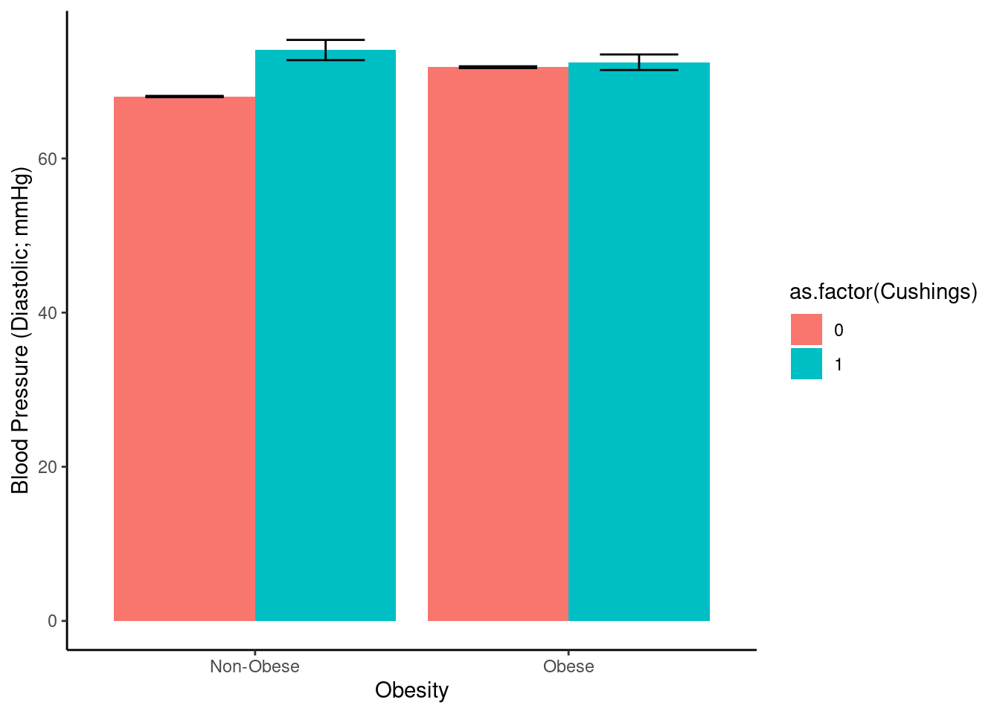{width=672}
:::

```{.r .cell-code}
ggplot(bp.data,
       aes(y=BPDiaNonInvasive,
           x=BMI,
           col=as.factor(Cushings))) +
  geom_point() +
  stat_smooth(method="loess", se=F) +
  labs(y="Blood Pressure (Diastolic; mmHg)") +
  theme_classic()
```

::: {.cell-output-display}
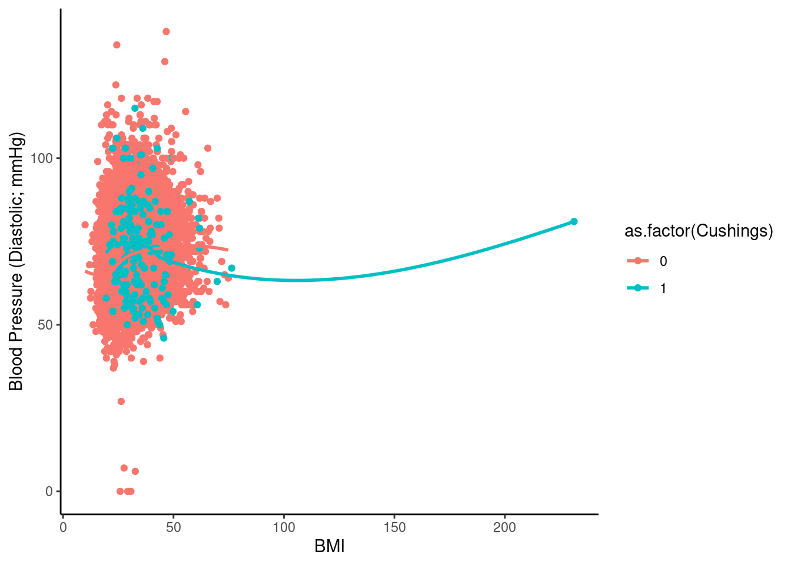{width=672}
:::

```{.r .cell-code}
bp.summary.dia %>% kable(caption="Summary of blood pressure levels by obesity and pre-existing Cushing's (Diastoic)")
```

::: {.cell-output-display}


Table: Summary of blood pressure levels by obesity and pre-existing Cushing's (Diastoic)

| Cushings|Obesity   |     mean|        se|        sd|     n|
|--------:|:---------|--------:|---------:|---------:|-----:|
|        0|Non-Obese | 68.03811| 0.0814139|  9.931498| 14881|
|        0|Obese     | 71.84179| 0.1155880| 10.442658|  8162|
|        1|Non-Obese | 74.06944| 1.3122062| 13.446112|   105|
|        1|Obese     | 72.48800| 1.0100449| 14.319858|   201|


:::

```{.r .cell-code}
lm(BPDiaNonInvasive ~ Cushings + Obesity + Cushings:Obesity,data=bp.data) |> 
  tidy() |> 
  kable(caption="2x2 ANOVA with Interaction for effects of Obesity and Cushings on Blood Pressure (Diastolic)")
```

::: {.cell-output-display}


Table: 2x2 ANOVA with Interaction for effects of Obesity and Cushings on Blood Pressure (Diastolic)

|term                  |  estimate| std.error|  statistic|   p.value|
|:---------------------|---------:|---------:|----------:|---------:|
|(Intercept)           | 68.038114| 0.0834026| 815.779769| 0.0000000|
|Cushings              |  6.031331| 1.1996317|   5.027652| 0.0000005|
|ObesityObese          |  3.803681| 0.1401126|  27.147324| 0.0000000|
|Cushings:ObesityObese | -5.385125| 1.5088790|  -3.568958| 0.0003591|


:::

```{.r .cell-code}
lm(BPDiaNonInvasive ~ Cushings + BMI + Cushings:Obesity,data=bp.data) |> 
  tidy() |> 
  kable(caption="2x2 ANOVA with Interaction for effects of Obesity and BMI on Blood Pressure (Diastolic)")
```

::: {.cell-output-display}


Table: 2x2 ANOVA with Interaction for effects of Obesity and BMI on Blood Pressure (Diastolic)

|term                  |   estimate| std.error|  statistic|   p.value|
|:---------------------|----------:|---------:|----------:|---------:|
|(Intercept)           | 61.1325310| 0.2692739| 227.027352| 0.0000000|
|Cushings              |  5.3233340| 1.1922124|   4.465089| 0.0000080|
|BMI                   |  0.2877692| 0.0090966|  31.634690| 0.0000000|
|Cushings:ObesityObese | -5.5653091| 1.4994311|  -3.711614| 0.0002064|


:::
:::


####PRISMA Diagram
Here we will graphically illustrate how we arrived at the listed n number of people for each lab result.


::: {.cell}

```{.r .cell-code}
labresult_name<- c("Glucose","Hba1c","ALT","LDL","Blood Pressure","Mean Arterial Pressure","Systolic Arterial Pressure","Diastolic Arterial Pressure")

n_people<- c(3639, 20, 326, 13, 19054, 23349, 23349, 23349 )

summary_table<- data.frame(Lab_name=labresult_name, N_people=n_people)

kable(summary_table)
```

::: {.cell-output-display}


|Lab_name                    | N_people|
|:---------------------------|--------:|
|Glucose                     |     3639|
|Hba1c                       |       20|
|ALT                         |      326|
|LDL                         |       13|
|Blood Pressure              |    19054|
|Mean Arterial Pressure      |    23349|
|Systolic Arterial Pressure  |    23349|
|Diastolic Arterial Pressure |    23349|


:::
:::


## Diagnostic Data on Propensity Mapping


::: {.cell}

```{.r .cell-code}
# List of matchit objects by outcome
outcomes <- list(
  `Blood Pressure` = m.out.bp, 
  Glucose = m.out.glucose, 
  HbA1c = m.out.a1c, 
  `LDL-C` = m.out.ldl
)

# Function to extract age means ± SE per group
extract_age_summary <- function(m.out, outcome_name) {
  matched_data <- match.data(m.out)
  
  # Pre-matching summary
  pre_summary <- m.out$model$data %>% 
    group_by(Cushings) %>% 
    summarise(
      Mean = mean(AgeInYears, na.rm = TRUE),
      SE = sd(AgeInYears, na.rm = TRUE)/sqrt(n())
    ) %>% 
    mutate(Stage = "Pre-matching")
  
  # Post-matching summary
  post_summary <- matched_data %>% 
    group_by(Cushings) %>% 
    summarise(
      Mean = mean(AgeInYears, na.rm = TRUE),
      SE = sd(AgeInYears, na.rm = TRUE)/sqrt(n())
    ) %>% 
    mutate(Stage = "Post-matching")
  
  bind_rows(pre_summary, post_summary) %>% 
    mutate(Outcome = outcome_name) %>%
    select(Outcome, Stage, Cushings, Mean, SE)
}

# Function to extract SMD for AgeInYears
extract_age_smd <- function(m.out, outcome_name){
  s <- summary(m.out, standardize = TRUE)
  
  bal_all <- s$sum.all      # pre-matching balance
  bal_matched <- s$sum.matched  # post-matching balance
  
  data.frame(
    Outcome = outcome_name,
    Stage = c("Pre-matching", "Post-matching"),
    SMD_Age = c(
      bal_all["AgeInYears","Std. Mean Diff."],
      bal_matched["AgeInYears","Std. Mean Diff."]
    )
  )
}

# Apply functions to all outcomes
age_table <- bind_rows(lapply(names(outcomes), function(x) extract_age_summary(outcomes[[x]], x)))
smd_table <- bind_rows(lapply(names(outcomes), function(x) extract_age_smd(outcomes[[x]], x)))

# Merge BEFORE pivot
full_table <- full_join(age_table, smd_table, by = c("Outcome", "Stage"))

# Format for display
full_table_formatted <- full_table %>%
  mutate(
    Cushings = case_when(Cushings == 0 ~ "Control",
                         Cushings == 1 ~ "Cushing"),
    Stage = factor(Stage, levels = c("Pre-matching", "Post-matching")),
    across(c(Mean, SE, SMD_Age), ~round(., 2))
  ) %>%
  pivot_wider(
    names_from = Cushings,
    values_from = c(Mean, SE)
  ) %>%
  arrange(Outcome, Stage)
library(kableExtra)

# Display table with kableExtra
full_table_formatted %>%
  kable(caption = "Propensity Matching Summary for Age (means ± SE and SMD).") %>%
  kable_styling(full_width = FALSE, position = "center")
```

::: {.cell-output-display}

`````{=html}
<table class="table" style="width: auto !important; margin-left: auto; margin-right: auto;">
<caption>Propensity Matching Summary for Age (means ± SE and SMD).</caption>
 <thead>
  <tr>
   <th style="text-align:left;"> Outcome </th>
   <th style="text-align:left;"> Stage </th>
   <th style="text-align:right;"> SMD_Age </th>
   <th style="text-align:right;"> Mean_Control </th>
   <th style="text-align:right;"> Mean_Cushing </th>
   <th style="text-align:right;"> SE_Control </th>
   <th style="text-align:right;"> SE_Cushing </th>
  </tr>
 </thead>
<tbody>
  <tr>
   <td style="text-align:left;"> Blood Pressure </td>
   <td style="text-align:left;"> Pre-matching </td>
   <td style="text-align:right;"> -0.83 </td>
   <td style="text-align:right;"> 61.15 </td>
   <td style="text-align:right;"> 47.51 </td>
   <td style="text-align:right;"> 0.01 </td>
   <td style="text-align:right;"> 0.12 </td>
  </tr>
  <tr>
   <td style="text-align:left;"> Blood Pressure </td>
   <td style="text-align:left;"> Post-matching </td>
   <td style="text-align:right;"> -0.03 </td>
   <td style="text-align:right;"> 47.97 </td>
   <td style="text-align:right;"> 47.51 </td>
   <td style="text-align:right;"> 0.04 </td>
   <td style="text-align:right;"> 0.12 </td>
  </tr>
  <tr>
   <td style="text-align:left;"> Glucose </td>
   <td style="text-align:left;"> Pre-matching </td>
   <td style="text-align:right;"> -0.99 </td>
   <td style="text-align:right;"> 62.05 </td>
   <td style="text-align:right;"> 46.03 </td>
   <td style="text-align:right;"> 0.04 </td>
   <td style="text-align:right;"> 0.27 </td>
  </tr>
  <tr>
   <td style="text-align:left;"> Glucose </td>
   <td style="text-align:left;"> Post-matching </td>
   <td style="text-align:right;"> -0.04 </td>
   <td style="text-align:right;"> 46.60 </td>
   <td style="text-align:right;"> 46.03 </td>
   <td style="text-align:right;"> 0.08 </td>
   <td style="text-align:right;"> 0.27 </td>
  </tr>
  <tr>
   <td style="text-align:left;"> HbA1c </td>
   <td style="text-align:left;"> Pre-matching </td>
   <td style="text-align:right;"> -0.83 </td>
   <td style="text-align:right;"> 58.91 </td>
   <td style="text-align:right;"> 46.80 </td>
   <td style="text-align:right;"> 0.06 </td>
   <td style="text-align:right;"> 3.25 </td>
  </tr>
  <tr>
   <td style="text-align:left;"> HbA1c </td>
   <td style="text-align:left;"> Post-matching </td>
   <td style="text-align:right;"> 0.00 </td>
   <td style="text-align:right;"> 46.80 </td>
   <td style="text-align:right;"> 46.80 </td>
   <td style="text-align:right;"> 1.00 </td>
   <td style="text-align:right;"> 3.25 </td>
  </tr>
  <tr>
   <td style="text-align:left;"> LDL-C </td>
   <td style="text-align:left;"> Pre-matching </td>
   <td style="text-align:right;"> -0.98 </td>
   <td style="text-align:right;"> 58.03 </td>
   <td style="text-align:right;"> 40.85 </td>
   <td style="text-align:right;"> 0.06 </td>
   <td style="text-align:right;"> 4.87 </td>
  </tr>
  <tr>
   <td style="text-align:left;"> LDL-C </td>
   <td style="text-align:left;"> Post-matching </td>
   <td style="text-align:right;"> -0.04 </td>
   <td style="text-align:right;"> 41.62 </td>
   <td style="text-align:right;"> 40.85 </td>
   <td style="text-align:right;"> 1.38 </td>
   <td style="text-align:right;"> 4.87 </td>
  </tr>
</tbody>
</table>

`````

:::

```{.r .cell-code}
propensity.diagnostics.table.pub <-
  full_table_formatted |>
  mutate(Controls= paste0(round(Mean_Control,2)," +/- ",round(SE_Control,2)),
         `Cushing's`= paste0(round(Mean_Cushing,2)," +/- ",round(SE_Cushing,2))) |>
  rename(`Standardized Mean Difference`=SMD_Age) |>
  mutate(`Standardized Mean Difference`=round(`Standardized Mean Difference`,4)) |>
  select(Outcome,Stage,Controls,`Cushing's`,`Standardized Mean Difference`)

kable(propensity.diagnostics.table.pub,caption="Publication Version of Propensity Mapping Summary") |>
  kable_styling(full_width = FALSE, position = "center")
```

::: {.cell-output-display}

`````{=html}
<table class="table" style="width: auto !important; margin-left: auto; margin-right: auto;">
<caption>Publication Version of Propensity Mapping Summary</caption>
 <thead>
  <tr>
   <th style="text-align:left;"> Outcome </th>
   <th style="text-align:left;"> Stage </th>
   <th style="text-align:left;"> Controls </th>
   <th style="text-align:left;"> Cushing's </th>
   <th style="text-align:right;"> Standardized Mean Difference </th>
  </tr>
 </thead>
<tbody>
  <tr>
   <td style="text-align:left;"> Blood Pressure </td>
   <td style="text-align:left;"> Pre-matching </td>
   <td style="text-align:left;"> 61.15 +/- 0.01 </td>
   <td style="text-align:left;"> 47.51 +/- 0.12 </td>
   <td style="text-align:right;"> -0.83 </td>
  </tr>
  <tr>
   <td style="text-align:left;"> Blood Pressure </td>
   <td style="text-align:left;"> Post-matching </td>
   <td style="text-align:left;"> 47.97 +/- 0.04 </td>
   <td style="text-align:left;"> 47.51 +/- 0.12 </td>
   <td style="text-align:right;"> -0.03 </td>
  </tr>
  <tr>
   <td style="text-align:left;"> Glucose </td>
   <td style="text-align:left;"> Pre-matching </td>
   <td style="text-align:left;"> 62.05 +/- 0.04 </td>
   <td style="text-align:left;"> 46.03 +/- 0.27 </td>
   <td style="text-align:right;"> -0.99 </td>
  </tr>
  <tr>
   <td style="text-align:left;"> Glucose </td>
   <td style="text-align:left;"> Post-matching </td>
   <td style="text-align:left;"> 46.6 +/- 0.08 </td>
   <td style="text-align:left;"> 46.03 +/- 0.27 </td>
   <td style="text-align:right;"> -0.04 </td>
  </tr>
  <tr>
   <td style="text-align:left;"> HbA1c </td>
   <td style="text-align:left;"> Pre-matching </td>
   <td style="text-align:left;"> 58.91 +/- 0.06 </td>
   <td style="text-align:left;"> 46.8 +/- 3.25 </td>
   <td style="text-align:right;"> -0.83 </td>
  </tr>
  <tr>
   <td style="text-align:left;"> HbA1c </td>
   <td style="text-align:left;"> Post-matching </td>
   <td style="text-align:left;"> 46.8 +/- 1 </td>
   <td style="text-align:left;"> 46.8 +/- 3.25 </td>
   <td style="text-align:right;"> 0.00 </td>
  </tr>
  <tr>
   <td style="text-align:left;"> LDL-C </td>
   <td style="text-align:left;"> Pre-matching </td>
   <td style="text-align:left;"> 58.03 +/- 0.06 </td>
   <td style="text-align:left;"> 40.85 +/- 4.87 </td>
   <td style="text-align:right;"> -0.98 </td>
  </tr>
  <tr>
   <td style="text-align:left;"> LDL-C </td>
   <td style="text-align:left;"> Post-matching </td>
   <td style="text-align:left;"> 41.62 +/- 1.38 </td>
   <td style="text-align:left;"> 40.85 +/- 4.87 </td>
   <td style="text-align:right;"> -0.04 </td>
  </tr>
</tbody>
</table>

`````

:::

```{.r .cell-code}
write_csv(propensity.diagnostics.table.pub,"Propensity Matching Summary - Age.csv")
```
:::


### Love Plots

Generated Love plots using ggplot for each outcome.


::: {.cell}

```{.r .cell-code}
library(cobalt)
library(ggplot2)

plots <- lapply(names(outcomes), function(name) {
  # Generate Love plot, force only SMDs
  gg <- love.plot(
    outcomes[[name]],
    stats = "mean.diffs",  # only standardized mean differences
    threshold = 0.1,
    abs = TRUE,
    stars = "none"         # avoids mixing with raw differences
  )
  
  # gg is now a ggplot object directly
  gg + 
    theme_classic(base_size=6) +
    labs(
      title = name,
      x = "Standardized Mean Difference",
      color = "Stage",
    ) +
    scale_color_grey() +
    theme(legend.position = c(0.75,0.5))
})

# Example: display HbA1c plot
plots[[1]]
```

::: {.cell-output-display}
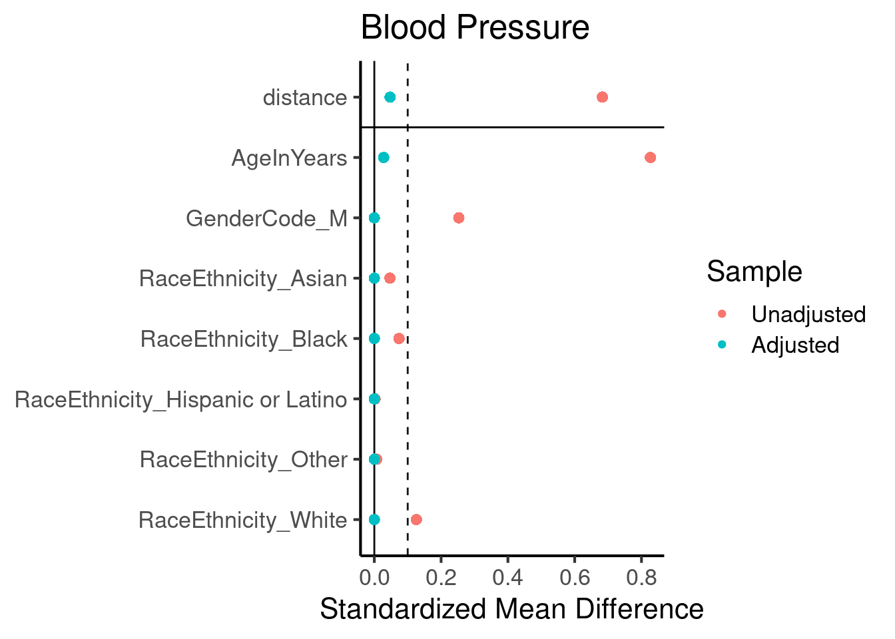{width=672}
:::

```{.r .cell-code}
library(cowplot)

combined_plot <- plot_grid(
  plotlist = plots,   # your list of ggplot objects
  ncol = 2,           # number of columns
  labels = names(plots)  # optional: label each subplot with the outcome name
)

# Display
combined_plot
```

::: {.cell-output-display}
{width=672}
:::
:::


## Session Information


::: {.cell}

```{.r .cell-code}
sessionInfo()
```

::: {.cell-output .cell-output-stdout}

```
R version 4.4.3 (2025-02-28)
Platform: x86_64-pc-linux-gnu
Running under: Red Hat Enterprise Linux 8.10 (Ootpa)

Matrix products: default
BLAS:   /sw/pkgs/arc/stacks/gcc/13.2.0/R/4.4.3/lib64/R/lib/libRblas.so 
LAPACK: /sw/pkgs/arc/stacks/gcc/13.2.0/R/4.4.3/lib64/R/lib/libRlapack.so;  LAPACK version 3.12.0

locale:
 [1] LC_CTYPE=en_US.UTF-8       LC_NUMERIC=C              
 [3] LC_TIME=en_US.UTF-8        LC_COLLATE=en_US.UTF-8    
 [5] LC_MONETARY=en_US.UTF-8    LC_MESSAGES=en_US.UTF-8   
 [7] LC_PAPER=en_US.UTF-8       LC_NAME=C                 
 [9] LC_ADDRESS=C               LC_TELEPHONE=C            
[11] LC_MEASUREMENT=en_US.UTF-8 LC_IDENTIFICATION=C       

time zone: America/Detroit
tzcode source: system (glibc)

attached base packages:
[1] stats     graphics  grDevices utils     datasets  methods   base     

other attached packages:
 [1] cowplot_1.1.3    cobalt_4.6.1     kableExtra_1.4.0 broom_1.0.6     
 [5] MatchIt_4.7.1    knitr_1.48       lubridate_1.9.3  forcats_1.0.0   
 [9] stringr_1.5.1    dplyr_1.1.4      purrr_1.0.2      readr_2.1.5     
[13] tidyr_1.3.1      tibble_3.2.1     ggplot2_3.5.1    tidyverse_2.0.0 

loaded via a namespace (and not attached):
 [1] gtable_0.3.6      xfun_0.45         htmlwidgets_1.6.4 lattice_0.22-6   
 [5] tzdb_0.4.0        vctrs_0.6.5       tools_4.4.3       generics_0.1.3   
 [9] parallel_4.4.3    fansi_1.0.6       highr_0.11        pkgconfig_2.0.3  
[13] Matrix_1.7-2      lifecycle_1.0.4   compiler_4.4.3    farver_2.1.2     
[17] textshaping_0.4.0 munsell_0.5.1     htmltools_0.5.8.1 yaml_2.3.9       
[21] pillar_1.9.0      crayon_1.5.3      nlme_3.1-167      tidyselect_1.2.1 
[25] digest_0.6.36     stringi_1.8.4     labeling_0.4.3    splines_4.4.3    
[29] fastmap_1.2.0     grid_4.4.3        colorspace_2.1-0  cli_3.6.3        
[33] magrittr_2.0.3    utf8_1.2.4        withr_3.0.0       scales_1.3.0     
[37] backports_1.5.0   bit64_4.0.5       timechange_0.3.0  rmarkdown_2.27   
[41] bit_4.0.5         chk_0.10.0        hms_1.1.3         evaluate_0.24.0  
[45] viridisLite_0.4.2 mgcv_1.9-1        rlang_1.1.4       Rcpp_1.0.14      
[49] glue_1.8.0        xml2_1.3.6        svglite_2.2.1     rstudioapi_0.16.0
[53] vroom_1.6.5       jsonlite_1.8.8    R6_2.5.1          systemfonts_1.2.3
```


:::
:::
