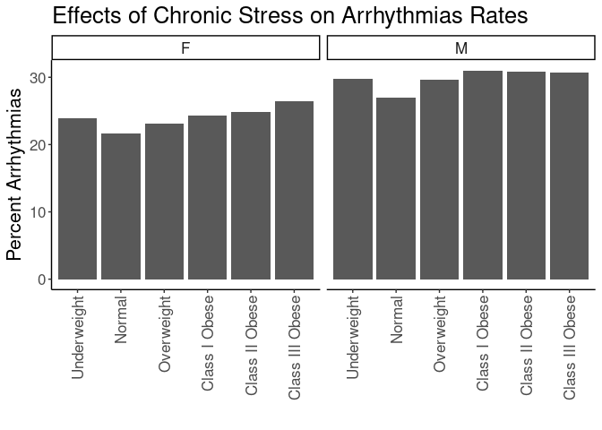
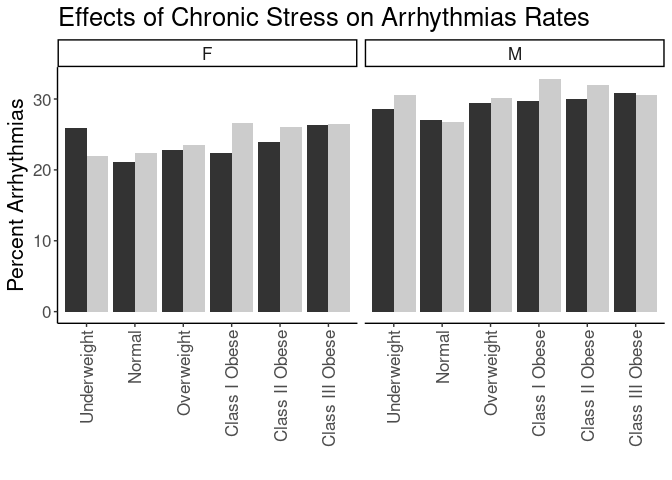
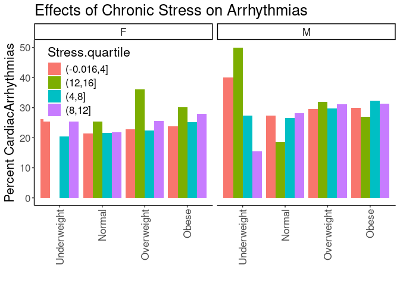
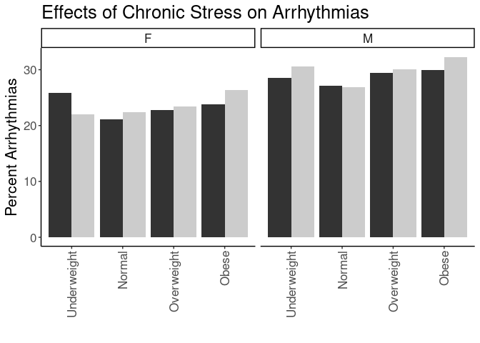
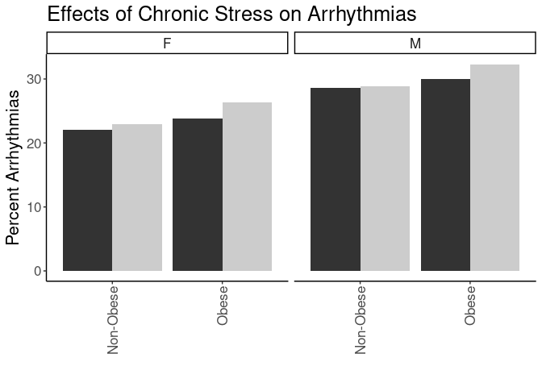

## Purpose

To test the effect modification of obesity on the stress-arrythmia relationships.


``` r
library(knitr)
#figures made will go to directory called figures, will make them as both png and pdf files 
opts_chunk$set(fig.path='figures/',
               echo=TRUE, warning=FALSE, message=FALSE,dev=c('png','pdf'))
options(scipen = 2, digits = 3)

library(readr)
library(dplyr)
```

```
## 
## Attaching package: 'dplyr'
```

```
## The following objects are masked from 'package:stats':
## 
##     filter, lag
```

```
## The following objects are masked from 'package:base':
## 
##     intersect, setdiff, setequal, union
```

``` r
library(tidyr)
library(knitr)

input.file <- 'data-combined.csv'
combined.data <- read_csv(input.file, na="-99")%>%
  filter(!(is.na(CardiacArrhythmias))) %>%
  filter(!(is.na(Stress))) %>%
  filter(Stress!="NA")
```

```
## Rows: 61793 Columns: 43
```

```
## ── Column specification ────────────────────────────────────────────────────────
## Delimiter: ","
## chr  (23): DeID_PatientID, Gender, Stress_d1, DeID_Survey_Date, DeID_Encount...
## dbl  (19): age, Survey.Year, CardiacArrhythmias, ChronicPulmonaryDisease, Co...
## dttm  (1): Survey.Date
## 
## ℹ Use `spec()` to retrieve the full column specification for this data.
## ℹ Specify the column types or set `show_col_types = FALSE` to quiet this message.
```

Loaded in the cleaned data from data-combined.csv. This script can be found in /nfs/turbo/precision-health/DataDirect/HUM00219435 - Obesity as a modifier of chronic psy/2023-03-14/2150 - Obesity and Stress - Cohort - DeID - 2023-03-14 and was most recently run on Mon Sep 30 14:02:30 2024. This dataset has 36690 values.


``` r
combined.data <- 
  combined.data %>%
  mutate(BMI_cat= factor(BMI_cat, 
                         levels=c("Underweight",
                                  "Normal",
                                  "Overweight",
                                  'Class I Obese',
                                  'Class II Obese',
                                  'Class III Obese'))) %>%
  mutate(BMI_cat.obese= factor(BMI_cat.obese, 
                               levels=c("Underweight",
                                        "Normal",
                                        "Overweight",
                                        'Obese'))) %>%
  mutate(BMI_cat.Ob.NonOb= factor(BMI_cat.Ob.NonOb, 
                                  levels=c("Non-Obese",
                                           'Obese'))) %>%
  mutate(Stress=relevel(as.factor(High.Stress),ref="Low"))  #set low as reference value
```

# Arrhythmias Rates by BMI

Stratified diagnoses by various BMI categories

## Arrhythmias by BMI Category


``` r
#calculating arrythmia rates by bmi category
with(combined.data, table(CardiacArrhythmias,BMI_cat,Gender)) %>% 
  data.frame %>%
  pivot_wider(names_from=CardiacArrhythmias,
              values_from = Freq) %>%
  rename(CardiacArrhythmias=`1`,
         NonDisease=`0`) %>%
  mutate(Total=CardiacArrhythmias+NonDisease) %>%
  mutate(Percent=CardiacArrhythmias/Total*100) -> arrythmia.bmi.counts

kable(arrythmia.bmi.counts, caption="Arrhythmias rates by BMI category")
```


Table: Arrhythmias rates by BMI category

|BMI_cat         |Gender | NonDisease| CardiacArrhythmias| Total| Percent|
|:---------------|:------|----------:|------------------:|-----:|-------:|
|Underweight     |F      |        137|                 43|   180|    23.9|
|Normal          |F      |       4283|               1181|  5464|    21.6|
|Overweight      |F      |       4124|               1239|  5363|    23.1|
|Class I Obese   |F      |       2947|                946|  3893|    24.3|
|Class II Obese  |F      |       1720|                570|  2290|    24.9|
|Class III Obese |F      |       1561|                560|  2121|    26.4|
|Underweight     |M      |         59|                 25|    84|    29.8|
|Normal          |M      |       2576|                952|  3528|    27.0|
|Overweight      |M      |       4614|               1948|  6562|    29.7|
|Class I Obese   |M      |       3021|               1357|  4378|    31.0|
|Class II Obese  |M      |       1272|                568|  1840|    30.9|
|Class III Obese |M      |        684|                303|   987|    30.7|

``` r
library(ggplot2)

ggplot(arrythmia.bmi.counts,
       aes(y=Percent,
           x=BMI_cat)) +
  geom_bar(stat='identity',position='dodge') +
  labs(y="Percent Arrhythmias",
       title="Effects of Chronic Stress on Arrhythmias Rates",
       x="") +
  theme_classic() +
  scale_fill_grey() +
  facet_grid(.~Gender) +
  theme(text=element_text(size=16),
        axis.text.x=element_text(angle=90,vjust=0.5,hjust=1),
        legend.position = 'none')
```

<!-- -->

## Arrhythmias Rate by BMI and Stress

This analysis uses all the BMI categories


``` r
#calculating arrythmia rates by bmi category and stress
with(combined.data, table(CardiacArrhythmias,BMI_cat,Stress,Gender)) %>% 
  data.frame %>%
  pivot_wider(names_from=CardiacArrhythmias,
              values_from = Freq) %>%
  rename(CardiacArrhythmias=`1`,
         NonCardiacArrhythmias=`0`) %>%
  mutate(Total=CardiacArrhythmias+NonCardiacArrhythmias) %>%
  mutate(Percent=CardiacArrhythmias/Total*100) -> arrythmia.bmi.stress.counts

library(ggplot2)

kable(arrythmia.bmi.stress.counts, caption="Arrhythmias rates by BMI category")
```


Table: Arrhythmias rates by BMI category

|BMI_cat         |Stress |Gender | NonCardiacArrhythmias| CardiacArrhythmias| Total| Percent|
|:---------------|:------|:------|---------------------:|------------------:|-----:|-------:|
|Underweight     |Low    |F      |                    66|                 23|    89|    25.8|
|Normal          |Low    |F      |                  2551|                681|  3232|    21.1|
|Overweight      |Low    |F      |                  2377|                703|  3080|    22.8|
|Class I Obese   |Low    |F      |                  1605|                461|  2066|    22.3|
|Class II Obese  |Low    |F      |                   926|                291|  1217|    23.9|
|Class III Obese |Low    |F      |                   787|                282|  1069|    26.4|
|Underweight     |High   |F      |                    71|                 20|    91|    22.0|
|Normal          |High   |F      |                  1732|                500|  2232|    22.4|
|Overweight      |High   |F      |                  1747|                536|  2283|    23.5|
|Class I Obese   |High   |F      |                  1342|                485|  1827|    26.5|
|Class II Obese  |High   |F      |                   794|                279|  1073|    26.0|
|Class III Obese |High   |F      |                   774|                278|  1052|    26.4|
|Underweight     |Low    |M      |                    25|                 10|    35|    28.6|
|Normal          |Low    |M      |                  1542|                573|  2115|    27.1|
|Overweight      |Low    |M      |                  2891|               1207|  4098|    29.5|
|Class I Obese   |Low    |M      |                  1854|                786|  2640|    29.8|
|Class II Obese  |Low    |M      |                   734|                315|  1049|    30.0|
|Class III Obese |Low    |M      |                   364|                162|   526|    30.8|
|Underweight     |High   |M      |                    34|                 15|    49|    30.6|
|Normal          |High   |M      |                  1034|                379|  1413|    26.8|
|Overweight      |High   |M      |                  1723|                741|  2464|    30.1|
|Class I Obese   |High   |M      |                  1167|                571|  1738|    32.9|
|Class II Obese  |High   |M      |                   538|                253|   791|    32.0|
|Class III Obese |High   |M      |                   320|                141|   461|    30.6|

``` r
ggplot(arrythmia.bmi.stress.counts,
       aes(y=Percent,
           x=BMI_cat,
           fill=Stress)) +
  geom_bar(stat='identity',position='dodge') +
  labs(y="Percent Arrhythmias",
       title="Effects of Chronic Stress on Arrhythmias Rates",
       x="") +
  theme_classic() +
  scale_fill_grey() +
  facet_grid(.~Gender) +
  theme(text=element_text(size=16),
        axis.text.x=element_text(angle=90,vjust=0.5,hjust=1),
        legend.position = 'none')
```

<!-- -->

### Logistic Regressions for All Obese Categories

Ran a series of stepwise logistic regressions testing for obesity as a modifier of the effects of stress.


``` r
library(broom)
glm(CardiacArrhythmias~BMI_cat, 
    family="binomial",
    data=combined.data) -> obesity.glm1

obesity.glm1 %>%
  tidy() %>%
  kable(caption="Logistic regression of obesity on arrythmia", digits =c(0,2,3,2,99))
```


Table: Logistic regression of obesity on arrythmia

|term                   | estimate| std.error| statistic|  p.value|
|:----------------------|--------:|---------:|---------:|--------:|
|(Intercept)            |    -1.06|     0.141|     -7.52| 5.41e-14|
|BMI_catNormal          |    -0.11|     0.143|     -0.77| 4.44e-01|
|BMI_catOverweight      |     0.05|     0.142|      0.35| 7.25e-01|
|BMI_catClass I Obese   |     0.11|     0.143|      0.74| 4.56e-01|
|BMI_catClass II Obese  |     0.09|     0.145|      0.63| 5.26e-01|
|BMI_catClass III Obese |     0.10|     0.146|      0.70| 4.83e-01|

``` r
anova(obesity.glm1,test="Chisq") %>% tidy %>%
  kable(caption="Logistic regression of obesity on arrythmia, ", digits =c(0,0,0,0,0,99))
```


Table: Logistic regression of obesity on arrythmia, 

|term    | df| deviance| df.residual| residual.deviance| p.value|
|:-------|--:|--------:|-----------:|-----------------:|-------:|
|NULL    | NA|       NA|       36689|             42367|      NA|
|BMI_cat |  5|       49|       36684|             42318|   2e-09|

``` r
#adding in stress as a modifier
glm(CardiacArrhythmias~BMI_cat+Stress+Stress:BMI_cat, 
    family="binomial",
    data=combined.data) -> obesity.glm2

obesity.glm2 %>%
  tidy() %>%
  kable(caption="Logistic regression of obesity on arrythmia, with stress as a modifier", digits =c(0,2,3,2,99))
```


Table: Logistic regression of obesity on arrythmia, with stress as a modifier

|term                              | estimate| std.error| statistic|  p.value|
|:---------------------------------|--------:|---------:|---------:|--------:|
|(Intercept)                       |    -1.01|     0.203|     -4.99| 5.98e-07|
|BMI_catNormal                     |    -0.17|     0.206|     -0.82| 4.13e-01|
|BMI_catOverweight                 |     0.00|     0.205|      0.00| 9.99e-01|
|BMI_catClass I Obese              |    -0.01|     0.206|     -0.03| 9.77e-01|
|BMI_catClass II Obese             |     0.01|     0.209|      0.03| 9.75e-01|
|BMI_catClass III Obese            |     0.06|     0.211|      0.29| 7.69e-01|
|StressHigh                        |    -0.08|     0.282|     -0.30| 7.65e-01|
|BMI_catNormal:StressHigh          |     0.12|     0.286|      0.42| 6.73e-01|
|BMI_catOverweight:StressHigh      |     0.10|     0.285|      0.35| 7.28e-01|
|BMI_catClass I Obese:StressHigh   |     0.24|     0.286|      0.84| 4.03e-01|
|BMI_catClass II Obese:StressHigh  |     0.17|     0.290|      0.60| 5.49e-01|
|BMI_catClass III Obese:StressHigh |     0.08|     0.293|      0.26| 7.92e-01|

``` r
anova(obesity.glm2,test="Chisq") %>% tidy %>%
  kable(caption="Logistic regression of obese vs non-obese on arrythmia, with stress as a modifier", digits =c(0,0,0,0,0,99))
```


Table: Logistic regression of obese vs non-obese on arrythmia, with stress as a modifier

|term           | df| deviance| df.residual| residual.deviance|  p.value|
|:--------------|--:|--------:|-----------:|-----------------:|--------:|
|NULL           | NA|       NA|       36689|             42367|       NA|
|BMI_cat        |  5|       49|       36684|             42318| 2.00e-09|
|Stress         |  1|        6|       36683|             42312| 1.41e-02|
|BMI_cat:Stress |  5|        6|       36678|             42305| 2.88e-01|

``` r
#adding in age and gender as covariates as a modifier
glm(CardiacArrhythmias~BMI_cat+Stress+Stress:BMI_cat+Gender+age, 
    family="binomial",
    data=combined.data) -> obesity.glm3

obesity.glm3 %>%
  tidy() %>%
  kable(caption="Logistic regression of obesity on arrythmia, with stress as a modifier and age and  gender as covarites", digits =c(0,2,3,2,99))
```


Table: Logistic regression of obesity on arrythmia, with stress as a modifier and age and  gender as covarites

|term                              | estimate| std.error| statistic|  p.value|
|:---------------------------------|--------:|---------:|---------:|--------:|
|(Intercept)                       |    -2.41|     0.212|    -11.35| 7.08e-30|
|BMI_catNormal                     |    -0.25|     0.211|     -1.17| 2.40e-01|
|BMI_catOverweight                 |    -0.24|     0.210|     -1.16| 2.46e-01|
|BMI_catClass I Obese              |    -0.25|     0.211|     -1.18| 2.40e-01|
|BMI_catClass II Obese             |    -0.17|     0.214|     -0.80| 4.24e-01|
|BMI_catClass III Obese            |     0.00|     0.216|     -0.01| 9.89e-01|
|StressHigh                        |    -0.06|     0.288|     -0.22| 8.28e-01|
|GenderM                           |     0.23|     0.025|      9.39| 6.01e-21|
|age                               |     0.03|     0.001|     33.20| 0.00e+00|
|BMI_catNormal:StressHigh          |     0.15|     0.293|      0.50| 6.17e-01|
|BMI_catOverweight:StressHigh      |     0.15|     0.291|      0.52| 6.04e-01|
|BMI_catClass I Obese:StressHigh   |     0.29|     0.292|      0.98| 3.28e-01|
|BMI_catClass II Obese:StressHigh  |     0.21|     0.297|      0.71| 4.81e-01|
|BMI_catClass III Obese:StressHigh |     0.12|     0.299|      0.40| 6.92e-01|

``` r
anova(obesity.glm3,test="Chisq") %>% tidy %>%
  kable(caption="Logistic regression of obesity on arrythmia, with stress as a modifier and age and gender as covarite", digits =c(0,0,0,0,0,99))
```


Table: Logistic regression of obesity on arrythmia, with stress as a modifier and age and gender as covarite

|term           | df| deviance| df.residual| residual.deviance|  p.value|
|:--------------|--:|--------:|-----------:|-----------------:|--------:|
|NULL           | NA|       NA|       36689|             42367|       NA|
|BMI_cat        |  5|       49|       36684|             42318| 2.00e-09|
|Stress         |  1|        6|       36683|             42312| 1.41e-02|
|Gender         |  1|      172|       36682|             42140| 2.79e-39|
|age            |  1|     1176|       36681|             40963| 0.00e+00|
|BMI_cat:Stress |  5|        6|       36676|             40957| 2.65e-01|

``` r
#adding in race and ethnicity
glm(CardiacArrhythmias~BMI_cat+Stress+Stress:BMI_cat+Gender+age+Race.Ethnicity, 
    family="binomial",
    data=combined.data) -> obesity.glm4

obesity.glm4 %>%
  tidy() %>%
  kable(caption="Logistic regression of obesity on arrythmia, with stress as a modifier and age, gender and race as covarites", digits =c(0,2,3,2,99))
```


Table: Logistic regression of obesity on arrythmia, with stress as a modifier and age, gender and race as covarites

|term                              | estimate| std.error| statistic|  p.value|
|:---------------------------------|--------:|---------:|---------:|--------:|
|(Intercept)                       |    -2.72|     0.240|    -11.30| 1.26e-29|
|BMI_catNormal                     |    -0.26|     0.211|     -1.21| 2.25e-01|
|BMI_catOverweight                 |    -0.26|     0.210|     -1.23| 2.19e-01|
|BMI_catClass I Obese              |    -0.27|     0.211|     -1.27| 2.06e-01|
|BMI_catClass II Obese             |    -0.19|     0.214|     -0.89| 3.72e-01|
|BMI_catClass III Obese            |    -0.03|     0.216|     -0.14| 8.87e-01|
|StressHigh                        |    -0.07|     0.289|     -0.25| 8.02e-01|
|GenderM                           |     0.23|     0.025|      9.48| 2.63e-21|
|age                               |     0.03|     0.001|     32.74| 0.00e+00|
|Race.EthnicityBlack               |     0.55|     0.133|      4.18| 2.93e-05|
|Race.EthnicityHispanic/Latino     |     0.09|     0.155|      0.57| 5.72e-01|
|Race.EthnicityOther               |     0.04|     0.141|      0.32| 7.52e-01|
|Race.EthnicityWhite               |     0.34|     0.121|      2.81| 4.92e-03|
|BMI_catNormal:StressHigh          |     0.15|     0.293|      0.52| 6.04e-01|
|BMI_catOverweight:StressHigh      |     0.16|     0.292|      0.54| 5.89e-01|
|BMI_catClass I Obese:StressHigh   |     0.29|     0.293|      1.00| 3.15e-01|
|BMI_catClass II Obese:StressHigh  |     0.21|     0.297|      0.72| 4.70e-01|
|BMI_catClass III Obese:StressHigh |     0.13|     0.300|      0.43| 6.69e-01|

``` r
anova(obesity.glm4,test="Chisq") %>% tidy %>%
  kable(caption="Logistic regression of obesity on arrythmia, with stress as a modifier and age, gender and race as covarite", digits =c(0,0,0,0,0,99))
```


Table: Logistic regression of obesity on arrythmia, with stress as a modifier and age, gender and race as covarite

|term           | df| deviance| df.residual| residual.deviance|  p.value|
|:--------------|--:|--------:|-----------:|-----------------:|--------:|
|NULL           | NA|       NA|       36689|             42367|       NA|
|BMI_cat        |  5|       49|       36684|             42318| 2.00e-09|
|Stress         |  1|        6|       36683|             42312| 1.41e-02|
|Gender         |  1|      172|       36682|             42140| 2.79e-39|
|age            |  1|     1176|       36681|             40963| 0.00e+00|
|Race.Ethnicity |  4|       47|       36677|             40917| 1.85e-09|
|BMI_cat:Stress |  5|        7|       36672|             40910| 2.59e-01|

### Arrhythmias Rates by Quartiles


``` r
with(combined.data, table(CardiacArrhythmias,BMI_cat.obese,Stress.quartile,Gender)) %>% 
  data.frame %>%
  pivot_wider(names_from=CardiacArrhythmias,
              values_from = Freq) %>%
  rename(CardiacArrhythmias=`1`,
         NonDisease=`0`) %>%
  mutate(Total=CardiacArrhythmias+NonDisease) %>%
  mutate(Percent=CardiacArrhythmias/Total*100) -> arrythmia.bmi.stress.quartile.counts

kable(arrythmia.bmi.stress.quartile.counts, caption="Arrhythmias Rates by BMI and Stress Quartile")
```


Table: Arrhythmias Rates by BMI and Stress Quartile

|BMI_cat.obese |Stress.quartile |Gender | NonDisease| CardiacArrhythmias| Total| Percent|
|:-------------|:---------------|:------|----------:|------------------:|-----:|-------:|
|Underweight   |(-0.016,4]      |F      |         51|                 18|    69|    26.1|
|Normal        |(-0.016,4]      |F      |       2125|                577|  2702|    21.4|
|Overweight    |(-0.016,4]      |F      |       1994|                586|  2580|    22.7|
|Obese         |(-0.016,4]      |F      |       2761|                858|  3619|    23.7|
|Underweight   |(12,16]         |F      |          2|                  0|     2|     0.0|
|Normal        |(12,16]         |F      |         53|                 21|    74|    28.4|
|Overweight    |(12,16]         |F      |         46|                 26|    72|    36.1|
|Obese         |(12,16]         |F      |         93|                 40|   133|    30.1|
|Underweight   |(4,8]           |F      |         62|                 16|    78|    20.5|
|Normal        |(4,8]           |F      |       1630|                450|  2080|    21.6|
|Overweight    |(4,8]           |F      |       1610|                464|  2074|    22.4|
|Obese         |(4,8]           |F      |       2515|                845|  3360|    25.1|
|Underweight   |(8,12]          |F      |         22|                  9|    31|    29.0|
|Normal        |(8,12]          |F      |        475|                133|   608|    21.9|
|Overweight    |(8,12]          |F      |        474|                163|   637|    25.6|
|Obese         |(8,12]          |F      |        859|                333|  1192|    27.9|
|Underweight   |(-0.016,4]      |M      |         15|                 10|    25|    40.0|
|Normal        |(-0.016,4]      |M      |       1324|                498|  1822|    27.3|
|Overweight    |(-0.016,4]      |M      |       2490|               1039|  3529|    29.4|
|Obese         |(-0.016,4]      |M      |       2521|               1073|  3594|    29.9|
|Underweight   |(12,16]         |M      |          1|                  1|     2|    50.0|
|Normal        |(12,16]         |M      |         35|                  8|    43|    18.6|
|Overweight    |(12,16]         |M      |         34|                 16|    50|    32.0|
|Obese         |(12,16]         |M      |         62|                 23|    85|    27.1|
|Underweight   |(4,8]           |M      |         32|                 12|    44|    27.3|
|Normal        |(4,8]           |M      |        972|                350|  1322|    26.5|
|Overweight    |(4,8]           |M      |       1723|                727|  2450|    29.7|
|Obese         |(4,8]           |M      |       1890|                903|  2793|    32.3|
|Underweight   |(8,12]          |M      |         11|                  2|    13|    15.4|
|Normal        |(8,12]          |M      |        245|                 96|   341|    28.2|
|Overweight    |(8,12]          |M      |        367|                166|   533|    31.1|
|Obese         |(8,12]          |M      |        504|                229|   733|    31.2|

``` r
ggplot(arrythmia.bmi.stress.quartile.counts,
       aes(y=Percent,
           x=BMI_cat.obese,
           fill=Stress.quartile)) +
  geom_bar(stat='identity',position='dodge') +
  labs(y="Percent CardiacArrhythmias",
       title="Effects of Chronic Stress on Arrhythmias",
       x="") +
  theme_classic() +
  facet_grid(.~Gender) +
  theme(text=element_text(size=16),
        axis.text.x=element_text(angle=90,vjust=0.5,hjust=1),
        legend.position = c(0.15,0.75))
```

<!-- -->

## Arrhythmias Rates by Normal Obesity and Stress


``` r
#calculating arrythmia rates by bmi category, stress and gender
with(combined.data, table(CardiacArrhythmias,BMI_cat.obese,Stress,Gender)) %>% 
  data.frame %>%
  pivot_wider(names_from=CardiacArrhythmias,
              values_from = Freq) %>%
  rename(CardiacArrhythmias=`1`,
         NonDisease=`0`) %>%
  mutate(Total=CardiacArrhythmias+NonDisease) %>%
  mutate(Percent=CardiacArrhythmias/Total*100) -> arrythmia.bmi.stress.gender.counts

kable(arrythmia.bmi.stress.gender.counts, caption="Arrhythmias Rates by BMI and Stress")
```


Table: Arrhythmias Rates by BMI and Stress

|BMI_cat.obese |Stress |Gender | NonDisease| CardiacArrhythmias| Total| Percent|
|:-------------|:------|:------|----------:|------------------:|-----:|-------:|
|Underweight   |Low    |F      |         66|                 23|    89|    25.8|
|Normal        |Low    |F      |       2551|                681|  3232|    21.1|
|Overweight    |Low    |F      |       2377|                703|  3080|    22.8|
|Obese         |Low    |F      |       3318|               1034|  4352|    23.8|
|Underweight   |High   |F      |         71|                 20|    91|    22.0|
|Normal        |High   |F      |       1732|                500|  2232|    22.4|
|Overweight    |High   |F      |       1747|                536|  2283|    23.5|
|Obese         |High   |F      |       2910|               1042|  3952|    26.4|
|Underweight   |Low    |M      |         25|                 10|    35|    28.6|
|Normal        |Low    |M      |       1542|                573|  2115|    27.1|
|Overweight    |Low    |M      |       2891|               1207|  4098|    29.5|
|Obese         |Low    |M      |       2952|               1263|  4215|    30.0|
|Underweight   |High   |M      |         34|                 15|    49|    30.6|
|Normal        |High   |M      |       1034|                379|  1413|    26.8|
|Overweight    |High   |M      |       1723|                741|  2464|    30.1|
|Obese         |High   |M      |       2025|                965|  2990|    32.3|

``` r
ggplot(arrythmia.bmi.stress.gender.counts,
       aes(y=Percent,
           x=BMI_cat.obese,
           fill=Stress)) +
  geom_bar(stat='identity',position='dodge') +
  labs(y="Percent Arrhythmias",
       title="Effects of Chronic Stress on Arrhythmias",
       x="") +
  facet_grid(.~Gender) +
  theme_classic() +
  scale_fill_grey() +
  theme(text=element_text(size=16),
        axis.text.x=element_text(angle=90,vjust=0.5,hjust=1),
        legend.position = 'none')
```

<!-- -->

## Logistic Regressions for Obese/Non-Obese

Ran a series of logistic regressions using the normal obesity categories not classes as the categorization


``` r
glm(CardiacArrhythmias~BMI_cat.obese, 
    family="binomial",
    data=combined.data) -> obesity.glm1

obesity.glm1 %>%
  tidy() %>%
  kable(caption="Logistic regression of obese vs non-obese on Arrhythmias", digits =c(0,2,3,2,99))
```


Table: Logistic regression of obese vs non-obese on Arrhythmias

|term                    | estimate| std.error| statistic|  p.value|
|:-----------------------|--------:|---------:|---------:|--------:|
|(Intercept)             |    -1.06|     0.141|     -7.52| 5.41e-14|
|BMI_cat.obeseNormal     |    -0.11|     0.143|     -0.77| 4.44e-01|
|BMI_cat.obeseOverweight |     0.05|     0.142|      0.35| 7.25e-01|
|BMI_cat.obeseObese      |     0.10|     0.142|      0.72| 4.73e-01|

``` r
anova(obesity.glm1,test="Chisq") %>% tidy %>%
  kable(caption="Logistic regression of obesity on Arrhythmias, ", digits =c(0,0,0,0,0,99))
```


Table: Logistic regression of obesity on Arrhythmias, 

|term          | df| deviance| df.residual| residual.deviance|  p.value|
|:-------------|--:|--------:|-----------:|-----------------:|--------:|
|NULL          | NA|       NA|       36689|             42367|       NA|
|BMI_cat.obese |  3|       49|       36686|             42318| 1.24e-10|

``` r
#adding in stress as a modifier
glm(CardiacArrhythmias~BMI_cat.obese+Stress+Stress:BMI_cat.obese, 
    family="binomial",
    data=combined.data) -> obesity.glm2

obesity.glm2 %>%
  tidy() %>%
  kable(caption="Logistic regression of obesity on Arrhythmias, with stress as a modifier", digits =c(0,2,3,2,99))
```


Table: Logistic regression of obesity on Arrhythmias, with stress as a modifier

|term                               | estimate| std.error| statistic|  p.value|
|:----------------------------------|--------:|---------:|---------:|--------:|
|(Intercept)                        |    -1.01|     0.203|     -4.99| 5.98e-07|
|BMI_cat.obeseNormal                |    -0.17|     0.206|     -0.82| 4.13e-01|
|BMI_cat.obeseOverweight            |     0.00|     0.205|      0.00| 9.99e-01|
|BMI_cat.obeseObese                 |     0.01|     0.205|      0.05| 9.60e-01|
|StressHigh                         |    -0.08|     0.282|     -0.30| 7.65e-01|
|BMI_cat.obeseNormal:StressHigh     |     0.12|     0.286|      0.42| 6.73e-01|
|BMI_cat.obeseOverweight:StressHigh |     0.10|     0.285|      0.35| 7.28e-01|
|BMI_cat.obeseObese:StressHigh      |     0.19|     0.284|      0.66| 5.06e-01|

``` r
anova(obesity.glm2,test="Chisq") %>% tidy %>%
  kable(caption="Logistic regression of obesity on Arrhythmias, with stress as a modifier", digits =c(0,0,0,0,0,99))
```


Table: Logistic regression of obesity on Arrhythmias, with stress as a modifier

|term                 | df| deviance| df.residual| residual.deviance|  p.value|
|:--------------------|--:|--------:|-----------:|-----------------:|--------:|
|NULL                 | NA|       NA|       36689|             42367|       NA|
|BMI_cat.obese        |  3|       49|       36686|             42318| 1.24e-10|
|Stress               |  1|        6|       36685|             42312| 1.42e-02|
|BMI_cat.obese:Stress |  3|        3|       36682|             42309| 3.70e-01|

``` r
#adding in age and gender as covariates as a modifier
glm(CardiacArrhythmias~BMI_cat.obese+Stress+Stress:BMI_cat.obese+Gender+age, 
    family="binomial",
    data=combined.data) -> obesity.glm3

obesity.glm3 %>%
  tidy() %>%
  kable(caption="Logistic regression of obesity on Arrhythmias, with stress as a modifier and age and  gender as covarites", digits =c(0,2,3,2,99))
```


Table: Logistic regression of obesity on Arrhythmias, with stress as a modifier and age and  gender as covarites

|term                               | estimate| std.error| statistic|  p.value|
|:----------------------------------|--------:|---------:|---------:|--------:|
|(Intercept)                        |    -2.40|     0.212|    -11.30| 1.27e-29|
|BMI_cat.obeseNormal                |    -0.25|     0.211|     -1.17| 2.44e-01|
|BMI_cat.obeseOverweight            |    -0.24|     0.210|     -1.14| 2.53e-01|
|BMI_cat.obeseObese                 |    -0.18|     0.210|     -0.86| 3.92e-01|
|StressHigh                         |    -0.06|     0.288|     -0.22| 8.29e-01|
|GenderM                            |     0.22|     0.025|      9.07| 1.16e-19|
|age                                |     0.03|     0.001|     33.08| 0.00e+00|
|BMI_cat.obeseNormal:StressHigh     |     0.15|     0.293|      0.50| 6.19e-01|
|BMI_cat.obeseOverweight:StressHigh |     0.15|     0.291|      0.51| 6.07e-01|
|BMI_cat.obeseObese:StressHigh      |     0.24|     0.290|      0.81| 4.17e-01|

``` r
anova(obesity.glm3,test="Chisq") %>% tidy %>%
  kable(caption="Logistic regression of obesity on Arrhythmias, with stress as a modifier and age and gender as covarite", digits =c(0,0,0,0,0,99))
```


Table: Logistic regression of obesity on Arrhythmias, with stress as a modifier and age and gender as covarite

|term                 | df| deviance| df.residual| residual.deviance|  p.value|
|:--------------------|--:|--------:|-----------:|-----------------:|--------:|
|NULL                 | NA|       NA|       36689|             42367|       NA|
|BMI_cat.obese        |  3|       49|       36686|             42318| 1.24e-10|
|Stress               |  1|        6|       36685|             42312| 1.42e-02|
|Gender               |  1|      170|       36684|             42141| 5.81e-39|
|age                  |  1|     1166|       36683|             40975| 0.00e+00|
|BMI_cat.obese:Stress |  3|        4|       36680|             40972| 3.09e-01|

``` r
#adding in race and ethnicity
glm(CardiacArrhythmias~BMI_cat.obese+Stress+Stress:BMI_cat.obese+Gender+age+Race.Ethnicity, 
    family="binomial",
    data=combined.data) -> obesity.glm4

obesity.glm4 %>%
  tidy() %>%
  kable(caption="Logistic regression of obesity on liver diesease, with stress as a modifier and age, gender and race as covarites", digits =c(0,2,3,2,99))
```


Table: Logistic regression of obesity on liver diesease, with stress as a modifier and age, gender and race as covarites

|term                               | estimate| std.error| statistic|  p.value|
|:----------------------------------|--------:|---------:|---------:|--------:|
|(Intercept)                        |    -2.71|     0.240|    -11.28| 1.60e-29|
|BMI_cat.obeseNormal                |    -0.25|     0.211|     -1.21| 2.28e-01|
|BMI_cat.obeseOverweight            |    -0.26|     0.210|     -1.21| 2.25e-01|
|BMI_cat.obeseObese                 |    -0.20|     0.210|     -0.96| 3.38e-01|
|StressHigh                         |    -0.07|     0.289|     -0.25| 8.03e-01|
|GenderM                            |     0.23|     0.025|      9.18| 4.49e-20|
|age                                |     0.03|     0.001|     32.62| 0.00e+00|
|Race.EthnicityBlack                |     0.57|     0.133|      4.26| 2.01e-05|
|Race.EthnicityHispanic/Latino      |     0.09|     0.155|      0.59| 5.53e-01|
|Race.EthnicityOther                |     0.05|     0.141|      0.36| 7.16e-01|
|Race.EthnicityWhite                |     0.35|     0.121|      2.86| 4.21e-03|
|BMI_cat.obeseNormal:StressHigh     |     0.15|     0.293|      0.52| 6.05e-01|
|BMI_cat.obeseOverweight:StressHigh |     0.16|     0.292|      0.54| 5.91e-01|
|BMI_cat.obeseObese:StressHigh      |     0.24|     0.291|      0.84| 4.03e-01|

``` r
anova(obesity.glm4,test="Chisq") %>% tidy %>%
  kable(caption="Logistic regression of obesity on Arrhythmias, with stress as a modifier and age, gender and race as covariates", digits =c(0,0,0,0,0,99))
```


Table: Logistic regression of obesity on Arrhythmias, with stress as a modifier and age, gender and race as covariates

|term                 | df| deviance| df.residual| residual.deviance|  p.value|
|:--------------------|--:|--------:|-----------:|-----------------:|--------:|
|NULL                 | NA|       NA|       36689|             42367|       NA|
|BMI_cat.obese        |  3|       49|       36686|             42318| 1.24e-10|
|Stress               |  1|        6|       36685|             42312| 1.42e-02|
|Gender               |  1|      170|       36684|             42141| 5.81e-39|
|age                  |  1|     1166|       36683|             40975| 0.00e+00|
|Race.Ethnicity       |  4|       48|       36679|             40928| 1.15e-09|
|BMI_cat.obese:Stress |  3|        4|       36676|             40924| 2.95e-01|

# Arrhythmias Rates by Obese/Not Obese and Stress


``` r
with(combined.data, table(CardiacArrhythmias,BMI_cat.Ob.NonOb,Stress,Gender)) %>% 
  data.frame %>%
  pivot_wider(names_from=CardiacArrhythmias,
              values_from = Freq) %>%
  rename(CardiacArrhythmias=`1`,
         NonDisease=`0`) %>%
  mutate(Total=CardiacArrhythmias+NonDisease) %>%
  mutate(Percent=CardiacArrhythmias/Total*100) -> arrythmia.BMI_cat.Ob.NonOb.stress.counts

kable(arrythmia.BMI_cat.Ob.NonOb.stress.counts, caption="Arrhythmias Rates by Obese or not and Stress")
```


Table: Arrhythmias Rates by Obese or not and Stress

|BMI_cat.Ob.NonOb |Stress |Gender | NonDisease| CardiacArrhythmias| Total| Percent|
|:----------------|:------|:------|----------:|------------------:|-----:|-------:|
|Non-Obese        |Low    |F      |       4994|               1407|  6401|    22.0|
|Obese            |Low    |F      |       3318|               1034|  4352|    23.8|
|Non-Obese        |High   |F      |       3550|               1056|  4606|    22.9|
|Obese            |High   |F      |       2910|               1042|  3952|    26.4|
|Non-Obese        |Low    |M      |       4458|               1790|  6248|    28.6|
|Obese            |Low    |M      |       2952|               1263|  4215|    30.0|
|Non-Obese        |High   |M      |       2791|               1135|  3926|    28.9|
|Obese            |High   |M      |       2025|                965|  2990|    32.3|

``` r
ggplot(arrythmia.BMI_cat.Ob.NonOb.stress.counts,
       aes(y=Percent,
           x=BMI_cat.Ob.NonOb,
           fill=Stress)) +
  geom_bar(stat='identity',position='dodge') +
  labs(y="Percent Arrhythmias",
       title="Effects of Chronic Stress on Arrhythmias",
       x="") +
  facet_grid(.~Gender) +
  theme_classic() +
  scale_fill_grey() +
  theme(text=element_text(size=16),
        axis.text.x=element_text(angle=90,vjust=0.5,hjust=1),
        legend.position = 'none')
```

<!-- -->

## Logistic Regressions for Obese/Non-Obese

Ran a series of logistic regressions using obese/non-obese as the categorization


``` r
glm(CardiacArrhythmias~BMI_cat.Ob.NonOb, 
    family="binomial",
    data=combined.data) -> obesity.glm1

obesity.glm1 %>%
  tidy() %>%
  kable(caption="Logistic regression of obese vs non-obese on arrythmia", digits =c(0,3,3,2,99))
```


Table: Logistic regression of obese vs non-obese on arrythmia

|term                  | estimate| std.error| statistic|  p.value|
|:---------------------|--------:|---------:|---------:|--------:|
|(Intercept)           |   -1.075|     0.016|    -68.16| 0.00e+00|
|BMI_cat.Ob.NonObObese |    0.119|     0.024|      4.96| 6.89e-07|

``` r
anova(obesity.glm1,test="Chisq") %>% tidy %>%
  kable(caption="Logistic regression of obese vs non-obese on arrythmia, ", digits =c(0,0,0,0,0,99))
```


Table: Logistic regression of obese vs non-obese on arrythmia, 

|term             | df| deviance| df.residual| residual.deviance|  p.value|
|:----------------|--:|--------:|-----------:|-----------------:|--------:|
|NULL             | NA|       NA|       36689|             42367|       NA|
|BMI_cat.Ob.NonOb |  1|       25|       36688|             42342| 7.08e-07|

``` r
#adding in stress as a modifier
glm(CardiacArrhythmias~BMI_cat.Ob.NonOb+Stress+Stress:BMI_cat.Ob.NonOb, 
    family="binomial",
    data=combined.data) -> obesity.glm2

obesity.glm2 %>%
  tidy() %>%
  kable(caption="Logistic regression of obese vs non-obese on arrythmia, with stress as a modifier", digits =c(0,3,3,2,99))
```


Table: Logistic regression of obese vs non-obese on arrythmia, with stress as a modifier

|term                             | estimate| std.error| statistic| p.value|
|:--------------------------------|--------:|---------:|---------:|-------:|
|(Intercept)                      |   -1.084|     0.020|    -52.98|  0.0000|
|BMI_cat.Ob.NonObObese            |    0.080|     0.032|      2.51|  0.0121|
|StressHigh                       |    0.021|     0.032|      0.66|  0.5068|
|BMI_cat.Ob.NonObObese:StressHigh |    0.083|     0.048|      1.72|  0.0849|

``` r
anova(obesity.glm2,test="Chisq") %>% tidy %>%
  kable(caption="Logistic regression of obese vs non-obese on arrythmia, with stress as a modifier", digits =c(0,0,0,0,0,99))
```


Table: Logistic regression of obese vs non-obese on arrythmia, with stress as a modifier

|term                    | df| deviance| df.residual| residual.deviance|  p.value|
|:-----------------------|--:|--------:|-----------:|-----------------:|--------:|
|NULL                    | NA|       NA|       36689|             42367|       NA|
|BMI_cat.Ob.NonOb        |  1|       25|       36688|             42342| 7.08e-07|
|Stress                  |  1|        6|       36687|             42336| 1.53e-02|
|BMI_cat.Ob.NonOb:Stress |  1|        3|       36686|             42333| 8.49e-02|

``` r
#adding in age and gender as covariates as a modifier
glm(CardiacArrhythmias~BMI_cat.Ob.NonOb+Stress+Stress:BMI_cat.Ob.NonOb+Gender+age, 
    family="binomial",
    data=combined.data) -> obesity.glm3

obesity.glm3 %>%
  tidy() %>%
  kable(caption="Logistic regression of obese vs non-obese on arrythmia, with stress as a modifier and age and  gender as covarites", digits =c(0,3,3,2,99))
```


Table: Logistic regression of obese vs non-obese on arrythmia, with stress as a modifier and age and  gender as covarites

|term                             | estimate| std.error| statistic|  p.value|
|:--------------------------------|--------:|---------:|---------:|--------:|
|(Intercept)                      |   -2.636|     0.050|    -52.90| 0.00e+00|
|BMI_cat.Ob.NonObObese            |    0.060|     0.032|      1.86| 6.26e-02|
|StressHigh                       |    0.085|     0.033|      2.59| 9.73e-03|
|GenderM                          |    0.222|     0.024|      9.12| 7.51e-20|
|age                              |    0.026|     0.001|     33.19| 0.00e+00|
|BMI_cat.Ob.NonObObese:StressHigh |    0.089|     0.049|      1.80| 7.12e-02|

``` r
anova(obesity.glm3,test="Chisq") %>% tidy %>%
  kable(caption="Logistic regression of obese vs non-obese on arrythmia, with stress as a modifier and age and gender as covarite", digits =c(0,0,0,0,0,99))
```


Table: Logistic regression of obese vs non-obese on arrythmia, with stress as a modifier and age and gender as covarite

|term                    | df| deviance| df.residual| residual.deviance|  p.value|
|:-----------------------|--:|--------:|-----------:|-----------------:|--------:|
|NULL                    | NA|       NA|       36689|             42367|       NA|
|BMI_cat.Ob.NonOb        |  1|       25|       36688|             42342| 7.08e-07|
|Stress                  |  1|        6|       36687|             42336| 1.53e-02|
|Gender                  |  1|      183|       36686|             42153| 9.49e-42|
|age                     |  1|     1177|       36685|             40977| 0.00e+00|
|BMI_cat.Ob.NonOb:Stress |  1|        3|       36684|             40973| 7.11e-02|

``` r
#adding in race and ethnicity
glm(CardiacArrhythmias~BMI_cat.Ob.NonOb+Stress+Stress:BMI_cat.Ob.NonOb+Gender+age+Race.Ethnicity, 
    family="binomial",
    data=combined.data) -> obesity.glm4

obesity.glm4 %>%
  tidy() %>%
  kable(caption="Logistic regression of obese vs non-obese on arrythmia, with stress as a modifier and age, gender and race as covarites", digits =c(0,3,3,2,99))
```


Table: Logistic regression of obese vs non-obese on arrythmia, with stress as a modifier and age, gender and race as covarites

|term                             | estimate| std.error| statistic|  p.value|
|:--------------------------------|--------:|---------:|---------:|--------:|
|(Intercept)                      |   -2.961|     0.126|    -23.51| 0.00e+00|
|BMI_cat.Ob.NonObObese            |    0.051|     0.032|      1.58| 1.14e-01|
|StressHigh                       |    0.082|     0.033|      2.48| 1.32e-02|
|GenderM                          |    0.224|     0.024|      9.20| 3.56e-20|
|age                              |    0.026|     0.001|     32.71| 0.00e+00|
|Race.EthnicityBlack              |    0.563|     0.133|      4.25| 2.17e-05|
|Race.EthnicityHispanic/Latino    |    0.089|     0.155|      0.58| 5.64e-01|
|Race.EthnicityOther              |    0.049|     0.140|      0.35| 7.29e-01|
|Race.EthnicityWhite              |    0.344|     0.121|      2.85| 4.44e-03|
|BMI_cat.Ob.NonObObese:StressHigh |    0.090|     0.049|      1.83| 6.80e-02|

``` r
anova(obesity.glm4,test="Chisq") %>% tidy %>%
  kable(caption="Logistic regression of obese vs non-obese on arrythmia, with stress as a modifier and age, gender and race as covarite", digits =c(0,0,0,0,0,99))
```


Table: Logistic regression of obese vs non-obese on arrythmia, with stress as a modifier and age, gender and race as covarite

|term                    | df| deviance| df.residual| residual.deviance|  p.value|
|:-----------------------|--:|--------:|-----------:|-----------------:|--------:|
|NULL                    | NA|       NA|       36689|             42367|       NA|
|BMI_cat.Ob.NonOb        |  1|       25|       36688|             42342| 7.08e-07|
|Stress                  |  1|        6|       36687|             42336| 1.53e-02|
|Gender                  |  1|      183|       36686|             42153| 9.49e-42|
|age                     |  1|     1177|       36685|             40977| 0.00e+00|
|Race.Ethnicity          |  4|       48|       36681|             40929| 1.20e-09|
|BMI_cat.Ob.NonOb:Stress |  1|        3|       36680|             40926| 6.79e-02|

``` r
#adding in ses
glm(CardiacArrhythmias~BMI_cat.Ob.NonOb+Stress+Stress:BMI_cat.Ob.NonOb+Gender+age+Race.Ethnicity+disadvantage13_17_qrtl, 
    family="binomial",
    data=combined.data) -> obesity.glm5

obesity.glm5 %>%
  tidy() %>%
  kable(caption="Logistic regression of obese vs non-obese on arrythmia, with stress as a modifier and age, gender, race and SES as covariates", digits =c(0,3,3,2,99))
```


Table: Logistic regression of obese vs non-obese on arrythmia, with stress as a modifier and age, gender, race and SES as covariates

|term                             | estimate| std.error| statistic|  p.value|
|:--------------------------------|--------:|---------:|---------:|--------:|
|(Intercept)                      |   -2.921|     0.127|    -23.05| 0.00e+00|
|BMI_cat.Ob.NonObObese            |    0.056|     0.033|      1.72| 8.47e-02|
|StressHigh                       |    0.087|     0.033|      2.65| 8.04e-03|
|GenderM                          |    0.224|     0.024|      9.18| 4.35e-20|
|age                              |    0.026|     0.001|     32.60| 0.00e+00|
|Race.EthnicityBlack              |    0.575|     0.134|      4.30| 1.74e-05|
|Race.EthnicityHispanic/Latino    |    0.097|     0.155|      0.62| 5.32e-01|
|Race.EthnicityOther              |    0.058|     0.141|      0.41| 6.82e-01|
|Race.EthnicityWhite              |    0.349|     0.121|      2.89| 3.88e-03|
|disadvantage13_17_qrtl2          |   -0.069|     0.031|     -2.23| 2.58e-02|
|disadvantage13_17_qrtl3          |   -0.112|     0.035|     -3.22| 1.28e-03|
|disadvantage13_17_qrtl4          |   -0.044|     0.044|     -0.99| 3.22e-01|
|disadvantage13_17_qrtlNA         |   -0.056|     0.047|     -1.18| 2.36e-01|
|BMI_cat.Ob.NonObObese:StressHigh |    0.088|     0.049|      1.80| 7.24e-02|

``` r
anova(obesity.glm5,test="Chisq") %>% tidy %>%
  kable(caption="Logistic regression of obese vs non-obese on arrythmia, with stress as a modifier and age, gender, race and SES as covariates", digits =c(0,0,0,0,0,99))
```


Table: Logistic regression of obese vs non-obese on arrythmia, with stress as a modifier and age, gender, race and SES as covariates

|term                    | df| deviance| df.residual| residual.deviance|  p.value|
|:-----------------------|--:|--------:|-----------:|-----------------:|--------:|
|NULL                    | NA|       NA|       36689|             42367|       NA|
|BMI_cat.Ob.NonOb        |  1|       25|       36688|             42342| 7.08e-07|
|Stress                  |  1|        6|       36687|             42336| 1.53e-02|
|Gender                  |  1|      183|       36686|             42153| 9.49e-42|
|age                     |  1|     1177|       36685|             40977| 0.00e+00|
|Race.Ethnicity          |  4|       48|       36681|             40929| 1.20e-09|
|disadvantage13_17_qrtl  |  4|       12|       36677|             40917| 1.94e-02|
|BMI_cat.Ob.NonOb:Stress |  1|        3|       36676|             40914| 7.23e-02|

# Summary of Covariates

Stratified data by stress and obesity status and summarized data


``` r
combined.data %>%
  group_by(Stress,BMI_cat.Ob.NonOb) %>%
  count %>%
  knitr::kable(caption="Number of participants by group")
```


Table: Number of participants by group

|Stress |BMI_cat.Ob.NonOb |     n|
|:------|:----------------|-----:|
|Low    |Non-Obese        | 12649|
|Low    |Obese            |  8567|
|High   |Non-Obese        |  8532|
|High   |Obese            |  6942|

``` r
combined.data %>%
  group_by(Stress,BMI_cat.Ob.NonOb,Gender) %>%
  count %>%
    filter(!(is.na(Stress))) %>%
  filter(!(is.na(BMI_cat.Ob.NonOb))) %>%
  knitr::kable(caption="Number of participants by group and gender")
```


Table: Number of participants by group and gender

|Stress |BMI_cat.Ob.NonOb |Gender |    n|
|:------|:----------------|:------|----:|
|Low    |Non-Obese        |F      | 6401|
|Low    |Non-Obese        |M      | 6248|
|Low    |Obese            |F      | 4352|
|Low    |Obese            |M      | 4215|
|High   |Non-Obese        |F      | 4606|
|High   |Non-Obese        |M      | 3926|
|High   |Obese            |F      | 3952|
|High   |Obese            |M      | 2990|

``` r
combined.data %>%
  group_by(Stress,BMI_cat.Ob.NonOb,Race.Ethnicity) %>%
  count %>%
    filter(!(is.na(Stress))) %>%
  filter(!(is.na(BMI_cat.Ob.NonOb))) %>%
  knitr::kable(caption="Number of participants by group and race/ethnicity")
```


Table: Number of participants by group and race/ethnicity

|Stress |BMI_cat.Ob.NonOb |Race.Ethnicity  |     n|
|:------|:----------------|:---------------|-----:|
|Low    |Non-Obese        |Asian           |   301|
|Low    |Non-Obese        |Black           |   362|
|Low    |Non-Obese        |Hispanic/Latino |   228|
|Low    |Non-Obese        |Other           |   399|
|Low    |Non-Obese        |White           | 11359|
|Low    |Obese            |Asian           |    35|
|Low    |Obese            |Black           |   457|
|Low    |Obese            |Hispanic/Latino |   172|
|Low    |Obese            |Other           |   281|
|Low    |Obese            |White           |  7622|
|High   |Non-Obese        |Asian           |   169|
|High   |Non-Obese        |Black           |   366|
|High   |Non-Obese        |Hispanic/Latino |   167|
|High   |Non-Obese        |Other           |   284|
|High   |Non-Obese        |White           |  7546|
|High   |Obese            |Asian           |    40|
|High   |Obese            |Black           |   449|
|High   |Obese            |Hispanic/Latino |   150|
|High   |Obese            |Other           |   217|
|High   |Obese            |White           |  6086|

``` r
combined.data %>%
  group_by(Stress,BMI_cat.Ob.NonOb) %>%
    filter(!(is.na(Stress))) %>%
  filter(!(is.na(BMI_cat.Ob.NonOb))) %>%
  summarize_at(c('BMI','age'), list(mean=~mean(.x,na.rm=T),
                                    sd=~sd(.x,na.rm=T),
                                    n=~length(.x)))%>%
  knitr::kable(caption="Average BMI and age of participants by group")
```


Table: Average BMI and age of participants by group

|Stress |BMI_cat.Ob.NonOb | BMI_mean| age_mean| BMI_sd| age_sd| BMI_n| age_n|
|:------|:----------------|--------:|--------:|------:|------:|-----:|-----:|
|Low    |Non-Obese        |     25.3|     53.2|   2.95|   17.6| 12649| 12649|
|Low    |Obese            |     36.0|     54.6|   5.71|   14.6|  8567|  8567|
|High   |Non-Obese        |     25.2|     51.1|   3.08|   17.8|  8532|  8532|
|High   |Obese            |     36.6|     52.7|   5.98|   14.6|  6942|  6942|

``` r
combined.data %>%
  group_by(Stress,BMI_cat.Ob.NonOb) %>%
  summarize_at(c('BMI','age'), list(mean=~mean(.x,na.rm=T),
                                    sd=~sd(.x,na.rm=T),
                                    n=~length(.x)))%>%
  filter(!(is.na(Stress))) %>%
  filter(!(is.na(BMI_cat.Ob.NonOb))) %>%
  knitr::kable(caption="Average BMI and age of participants by group,complete cases")
```


Table: Average BMI and age of participants by group,complete cases

|Stress |BMI_cat.Ob.NonOb | BMI_mean| age_mean| BMI_sd| age_sd| BMI_n| age_n|
|:------|:----------------|--------:|--------:|------:|------:|-----:|-----:|
|Low    |Non-Obese        |     25.3|     53.2|   2.95|   17.6| 12649| 12649|
|Low    |Obese            |     36.0|     54.6|   5.71|   14.6|  8567|  8567|
|High   |Non-Obese        |     25.2|     51.1|   3.08|   17.8|  8532|  8532|
|High   |Obese            |     36.6|     52.7|   5.98|   14.6|  6942|  6942|

# Session Information


``` r
sessionInfo()
```

```
## R version 4.4.0 (2024-04-24)
## Platform: x86_64-pc-linux-gnu
## Running under: Red Hat Enterprise Linux 8.8 (Ootpa)
## 
## Matrix products: default
## BLAS:   /sw/pkgs/arc/stacks/gcc/13.2.0/R/4.4.0/lib64/R/lib/libRblas.so 
## LAPACK: /sw/pkgs/arc/stacks/gcc/13.2.0/R/4.4.0/lib64/R/lib/libRlapack.so;  LAPACK version 3.12.0
## 
## locale:
##  [1] LC_CTYPE=en_US.UTF-8       LC_NUMERIC=C              
##  [3] LC_TIME=en_US.UTF-8        LC_COLLATE=en_US.UTF-8    
##  [5] LC_MONETARY=en_US.UTF-8    LC_MESSAGES=en_US.UTF-8   
##  [7] LC_PAPER=en_US.UTF-8       LC_NAME=C                 
##  [9] LC_ADDRESS=C               LC_TELEPHONE=C            
## [11] LC_MEASUREMENT=en_US.UTF-8 LC_IDENTIFICATION=C       
## 
## time zone: America/Detroit
## tzcode source: system (glibc)
## 
## attached base packages:
## [1] stats     graphics  grDevices utils     datasets  methods   base     
## 
## other attached packages:
## [1] broom_1.0.6   ggplot2_3.5.1 tidyr_1.3.1   dplyr_1.1.4   readr_2.1.5  
## [6] knitr_1.48   
## 
## loaded via a namespace (and not attached):
##  [1] bit_4.0.5         gtable_0.3.5      jsonlite_1.8.8    highr_0.11       
##  [5] compiler_4.4.0    crayon_1.5.3      tidyselect_1.2.1  stringr_1.5.1    
##  [9] parallel_4.4.0    jquerylib_0.1.4   scales_1.3.0      yaml_2.3.9       
## [13] fastmap_1.2.0     R6_2.5.1          labeling_0.4.3    generics_0.1.3   
## [17] backports_1.5.0   tibble_3.2.1      munsell_0.5.1     bslib_0.7.0      
## [21] pillar_1.9.0      tzdb_0.4.0        rlang_1.1.4       utf8_1.2.4       
## [25] stringi_1.8.4     cachem_1.1.0      xfun_0.45         sass_0.4.9       
## [29] bit64_4.0.5       cli_3.6.3         withr_3.0.0       magrittr_2.0.3   
## [33] digest_0.6.36     grid_4.4.0        vroom_1.6.5       hms_1.1.3        
## [37] lifecycle_1.0.4   vctrs_0.6.5       evaluate_0.24.0   glue_1.7.0       
## [41] farver_2.1.2      colorspace_2.1-0  fansi_1.0.6       rmarkdown_2.27   
## [45] purrr_1.0.2       tools_4.4.0       pkgconfig_2.0.3   htmltools_0.5.8.1
```
