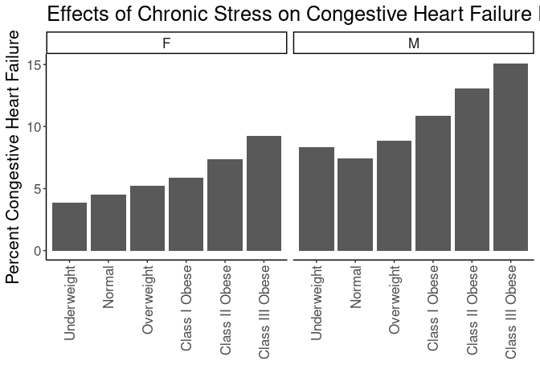
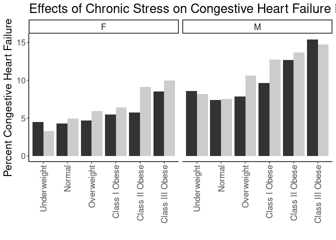
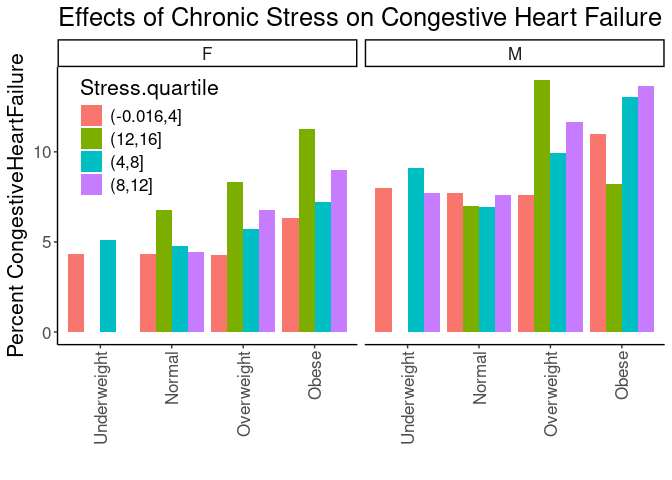
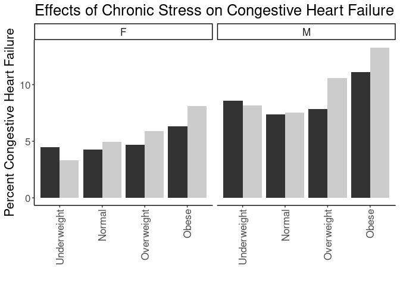
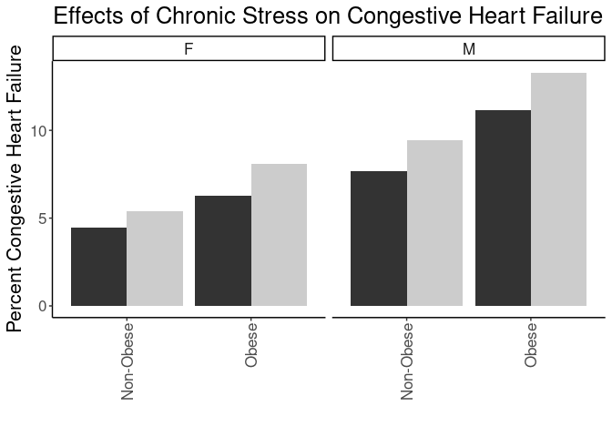

## Purpose

To test the effect modification of obesity on the stress-chf relationships.


``` r
library(knitr)
#figures made will go to directory called figures, will make them as both png and pdf files 
opts_chunk$set(fig.path='figures/',
               echo=TRUE, warning=FALSE, message=FALSE,dev=c('png','pdf'))
options(scipen = 2, digits = 3)

library(readr)
library(dplyr)
```

```
## 
## Attaching package: 'dplyr'
```

```
## The following objects are masked from 'package:stats':
## 
##     filter, lag
```

```
## The following objects are masked from 'package:base':
## 
##     intersect, setdiff, setequal, union
```

``` r
library(tidyr)
library(knitr)

input.file <- 'data-combined.csv'
combined.data <- read_csv(input.file, na="-99")%>%
  filter(!(is.na(CongestiveHeartFailure))) %>%
  filter(!(is.na(Stress))) %>%
  filter(Stress!="NA")
```

```
## Rows: 61793 Columns: 43
```

```
## ── Column specification ────────────────────────────────────────────────────────
## Delimiter: ","
## chr  (23): DeID_PatientID, Gender, Stress_d1, DeID_Survey_Date, DeID_Encount...
## dbl  (19): age, Survey.Year, CardiacArrhythmias, ChronicPulmonaryDisease, Co...
## dttm  (1): Survey.Date
## 
## ℹ Use `spec()` to retrieve the full column specification for this data.
## ℹ Specify the column types or set `show_col_types = FALSE` to quiet this message.
```

Loaded in the cleaned data from data-combined.csv. This script can be found in /nfs/turbo/precision-health/DataDirect/HUM00219435 - Obesity as a modifier of chronic psy/2023-03-14/2150 - Obesity and Stress - Cohort - DeID - 2023-03-14 and was most recently run on Mon Sep 30 14:02:03 2024. This dataset has 36690 values.


``` r
combined.data <- 
  combined.data %>%
  mutate(BMI_cat= factor(BMI_cat, 
                         levels=c("Underweight",
                                  "Normal",
                                  "Overweight",
                                  'Class I Obese',
                                  'Class II Obese',
                                  'Class III Obese'))) %>%
  mutate(BMI_cat.obese= factor(BMI_cat.obese, 
                               levels=c("Underweight",
                                        "Normal",
                                        "Overweight",
                                        'Obese'))) %>%
  mutate(BMI_cat.Ob.NonOb= factor(BMI_cat.Ob.NonOb, 
                                  levels=c("Non-Obese",
                                           'Obese'))) %>%
  mutate(Stress=relevel(as.factor(High.Stress),ref="Low"))  #set low as reference value
```

# Congestive Heart Failure Rates by BMI

Stratified diagnoses by various BMI categories

## Congestive Heart Failure by BMI Category


``` r
#calculating chf rates by bmi category
with(combined.data, table(CongestiveHeartFailure,BMI_cat,Gender)) %>% 
  data.frame %>%
  pivot_wider(names_from=CongestiveHeartFailure,
              values_from = Freq) %>%
  rename(CongestiveHeartFailure=`1`,
         NonDisease=`0`) %>%
  mutate(Total=CongestiveHeartFailure+NonDisease) %>%
  mutate(Percent=CongestiveHeartFailure/Total*100) -> chf.bmi.counts

kable(chf.bmi.counts, caption="Congestive Heart Failure rates by BMI category")
```


Table: Congestive Heart Failure rates by BMI category

|BMI_cat         |Gender | NonDisease| CongestiveHeartFailure| Total| Percent|
|:---------------|:------|----------:|----------------------:|-----:|-------:|
|Underweight     |F      |        173|                      7|   180|    3.89|
|Normal          |F      |       5216|                    248|  5464|    4.54|
|Overweight      |F      |       5084|                    279|  5363|    5.20|
|Class I Obese   |F      |       3663|                    230|  3893|    5.91|
|Class II Obese  |F      |       2122|                    168|  2290|    7.34|
|Class III Obese |F      |       1925|                    196|  2121|    9.24|
|Underweight     |M      |         77|                      7|    84|    8.33|
|Normal          |M      |       3266|                    262|  3528|    7.43|
|Overweight      |M      |       5980|                    582|  6562|    8.87|
|Class I Obese   |M      |       3902|                    476|  4378|   10.87|
|Class II Obese  |M      |       1599|                    241|  1840|   13.10|
|Class III Obese |M      |        838|                    149|   987|   15.10|

``` r
library(ggplot2)

ggplot(chf.bmi.counts,
       aes(y=Percent,
           x=BMI_cat)) +
  geom_bar(stat='identity',position='dodge') +
  labs(y="Percent Congestive Heart Failure",
       title="Effects of Chronic Stress on Congestive Heart Failure Rates",
       x="") +
  theme_classic() +
  scale_fill_grey() +
  facet_grid(.~Gender) +
  theme(text=element_text(size=16),
        axis.text.x=element_text(angle=90,vjust=0.5,hjust=1),
        legend.position = 'none')
```

<!-- -->

## Congestive Heart Failure Rate by BMI and Stress

This analysis uses all the BMI categories


``` r
#calculating chf rates by bmi category and stress
with(combined.data, table(CongestiveHeartFailure,BMI_cat,Stress,Gender)) %>% 
  data.frame %>%
  pivot_wider(names_from=CongestiveHeartFailure,
              values_from = Freq) %>%
  rename(CongestiveHeartFailure=`1`,
         NonCongestiveHeartFailure=`0`) %>%
  mutate(Total=CongestiveHeartFailure+NonCongestiveHeartFailure) %>%
  mutate(Percent=CongestiveHeartFailure/Total*100) -> chf.bmi.stress.counts

library(ggplot2)

kable(chf.bmi.stress.counts, caption="Congestive Heart Failure rates by BMI category")
```


Table: Congestive Heart Failure rates by BMI category

|BMI_cat         |Stress |Gender | NonCongestiveHeartFailure| CongestiveHeartFailure| Total| Percent|
|:---------------|:------|:------|-------------------------:|----------------------:|-----:|-------:|
|Underweight     |Low    |F      |                        85|                      4|    89|    4.49|
|Normal          |Low    |F      |                      3094|                    138|  3232|    4.27|
|Overweight      |Low    |F      |                      2936|                    144|  3080|    4.67|
|Class I Obese   |Low    |F      |                      1953|                    113|  2066|    5.47|
|Class II Obese  |Low    |F      |                      1147|                     70|  1217|    5.75|
|Class III Obese |Low    |F      |                       978|                     91|  1069|    8.51|
|Underweight     |High   |F      |                        88|                      3|    91|    3.30|
|Normal          |High   |F      |                      2122|                    110|  2232|    4.93|
|Overweight      |High   |F      |                      2148|                    135|  2283|    5.91|
|Class I Obese   |High   |F      |                      1710|                    117|  1827|    6.40|
|Class II Obese  |High   |F      |                       975|                     98|  1073|    9.13|
|Class III Obese |High   |F      |                       947|                    105|  1052|    9.98|
|Underweight     |Low    |M      |                        32|                      3|    35|    8.57|
|Normal          |Low    |M      |                      1959|                    156|  2115|    7.38|
|Overweight      |Low    |M      |                      3777|                    321|  4098|    7.83|
|Class I Obese   |Low    |M      |                      2385|                    255|  2640|    9.66|
|Class II Obese  |Low    |M      |                       916|                    133|  1049|   12.68|
|Class III Obese |Low    |M      |                       445|                     81|   526|   15.40|
|Underweight     |High   |M      |                        45|                      4|    49|    8.16|
|Normal          |High   |M      |                      1307|                    106|  1413|    7.50|
|Overweight      |High   |M      |                      2203|                    261|  2464|   10.59|
|Class I Obese   |High   |M      |                      1517|                    221|  1738|   12.72|
|Class II Obese  |High   |M      |                       683|                    108|   791|   13.65|
|Class III Obese |High   |M      |                       393|                     68|   461|   14.75|

``` r
ggplot(chf.bmi.stress.counts,
       aes(y=Percent,
           x=BMI_cat,
           fill=Stress)) +
  geom_bar(stat='identity',position='dodge') +
  labs(y="Percent Congestive Heart Failure",
       title="Effects of Chronic Stress on Congestive Heart Failure Rates",
       x="") +
  theme_classic() +
  scale_fill_grey() +
  facet_grid(.~Gender) +
  theme(text=element_text(size=16),
        axis.text.x=element_text(angle=90,vjust=0.5,hjust=1),
        legend.position = 'none')
```

<!-- -->

### Logistic Regressions for All Obese Categories

Ran a series of stepwise logistic regressions testing for obesity as a modifier of the effects of stress.


``` r
library(broom)
glm(CongestiveHeartFailure~BMI_cat, 
    family="binomial",
    data=combined.data) -> obesity.glm1

obesity.glm1 %>%
  tidy() %>%
  kable(caption="Logistic regression of obesity on chf", digits =c(0,2,3,2,99))
```


Table: Logistic regression of obesity on chf

|term                   | estimate| std.error| statistic|  p.value|
|:----------------------|--------:|---------:|---------:|--------:|
|(Intercept)            |    -2.88|     0.275|    -10.50| 9.07e-26|
|BMI_catNormal          |     0.07|     0.278|      0.26| 7.98e-01|
|BMI_catOverweight      |     0.33|     0.277|      1.19| 2.35e-01|
|BMI_catClass I Obese   |     0.51|     0.277|      1.84| 6.56e-02|
|BMI_catClass II Obese  |     0.67|     0.280|      2.41| 1.58e-02|
|BMI_catClass III Obese |     0.80|     0.281|      2.86| 4.25e-03|

``` r
anova(obesity.glm1,test="Chisq") %>% tidy %>%
  kable(caption="Logistic regression of obesity on chf, ", digits =c(0,0,0,0,0,99))
```


Table: Logistic regression of obesity on chf, 

|term    | df| deviance| df.residual| residual.deviance|  p.value|
|:-------|--:|--------:|-----------:|-----------------:|--------:|
|NULL    | NA|       NA|       36689|             20012|       NA|
|BMI_cat |  5|      142|       36684|             19871| 6.94e-29|

``` r
#adding in stress as a modifier
glm(CongestiveHeartFailure~BMI_cat+Stress+Stress:BMI_cat, 
    family="binomial",
    data=combined.data) -> obesity.glm2

obesity.glm2 %>%
  tidy() %>%
  kable(caption="Logistic regression of obesity on chf, with stress as a modifier", digits =c(0,2,3,2,99))
```


Table: Logistic regression of obesity on chf, with stress as a modifier

|term                              | estimate| std.error| statistic|  p.value|
|:---------------------------------|--------:|---------:|---------:|--------:|
|(Intercept)                       |    -2.82|     0.389|     -7.24| 4.56e-13|
|BMI_catNormal                     |    -0.03|     0.394|     -0.07| 9.44e-01|
|BMI_catOverweight                 |     0.15|     0.392|      0.37| 7.09e-01|
|BMI_catClass I Obese              |     0.35|     0.393|      0.89| 3.74e-01|
|BMI_catClass II Obese             |     0.50|     0.396|      1.26| 2.09e-01|
|BMI_catClass III Obese            |     0.70|     0.397|      1.77| 7.68e-02|
|StressHigh                        |    -0.13|     0.549|     -0.23| 8.16e-01|
|BMI_catNormal:StressHigh          |     0.21|     0.557|      0.37| 7.09e-01|
|BMI_catOverweight:StressHigh      |     0.40|     0.554|      0.72| 4.69e-01|
|BMI_catClass I Obese:StressHigh   |     0.34|     0.555|      0.61| 5.41e-01|
|BMI_catClass II Obese:StressHigh  |     0.36|     0.559|      0.65| 5.18e-01|
|BMI_catClass III Obese:StressHigh |     0.19|     0.561|      0.35| 7.29e-01|

``` r
anova(obesity.glm2,test="Chisq") %>% tidy %>%
  kable(caption="Logistic regression of obese vs non-obese on chf, with stress as a modifier", digits =c(0,0,0,0,0,99))
```


Table: Logistic regression of obese vs non-obese on chf, with stress as a modifier

|term           | df| deviance| df.residual| residual.deviance|  p.value|
|:--------------|--:|--------:|-----------:|-----------------:|--------:|
|NULL           | NA|       NA|       36689|             20012|       NA|
|BMI_cat        |  5|      142|       36684|             19871| 6.94e-29|
|Stress         |  1|       23|       36683|             19847| 1.38e-06|
|BMI_cat:Stress |  5|        5|       36678|             19843| 4.72e-01|

``` r
#adding in age and gender as covariates as a modifier
glm(CongestiveHeartFailure~BMI_cat+Stress+Stress:BMI_cat+Gender+age, 
    family="binomial",
    data=combined.data) -> obesity.glm3

obesity.glm3 %>%
  tidy() %>%
  kable(caption="Logistic regression of obesity on chf, with stress as a modifier and age and  gender as covarites", digits =c(0,2,3,2,99))
```


Table: Logistic regression of obesity on chf, with stress as a modifier and age and  gender as covarites

|term                              | estimate| std.error| statistic|  p.value|
|:---------------------------------|--------:|---------:|---------:|--------:|
|(Intercept)                       |    -5.45|     0.407|    -13.40| 6.11e-41|
|BMI_catNormal                     |    -0.17|     0.401|     -0.42| 6.75e-01|
|BMI_catOverweight                 |    -0.24|     0.400|     -0.61| 5.43e-01|
|BMI_catClass I Obese              |    -0.01|     0.401|     -0.02| 9.83e-01|
|BMI_catClass II Obese             |     0.27|     0.404|      0.66| 5.08e-01|
|BMI_catClass III Obese            |     0.69|     0.405|      1.70| 8.88e-02|
|StressHigh                        |    -0.08|     0.559|     -0.13| 8.93e-01|
|GenderM                           |     0.46|     0.041|     11.15| 6.97e-29|
|age                               |     0.05|     0.001|     30.56| 0.00e+00|
|BMI_catNormal:StressHigh          |     0.23|     0.567|      0.41| 6.85e-01|
|BMI_catOverweight:StressHigh      |     0.47|     0.564|      0.84| 4.00e-01|
|BMI_catClass I Obese:StressHigh   |     0.40|     0.565|      0.72| 4.73e-01|
|BMI_catClass II Obese:StressHigh  |     0.41|     0.569|      0.72| 4.71e-01|
|BMI_catClass III Obese:StressHigh |     0.25|     0.571|      0.44| 6.58e-01|

``` r
anova(obesity.glm3,test="Chisq") %>% tidy %>%
  kable(caption="Logistic regression of obesity on chf, with stress as a modifier and age and gender as covarite", digits =c(0,0,0,0,0,99))
```


Table: Logistic regression of obesity on chf, with stress as a modifier and age and gender as covarite

|term           | df| deviance| df.residual| residual.deviance|  p.value|
|:--------------|--:|--------:|-----------:|-----------------:|--------:|
|NULL           | NA|       NA|       36689|             20012|       NA|
|BMI_cat        |  5|      142|       36684|             19871| 6.94e-29|
|Stress         |  1|       23|       36683|             19847| 1.38e-06|
|Gender         |  1|      227|       36682|             19620| 2.37e-51|
|age            |  1|     1087|       36681|             18533| 0.00e+00|
|BMI_cat:Stress |  5|        6|       36676|             18527| 3.00e-01|

``` r
#adding in race and ethnicity
glm(CongestiveHeartFailure~BMI_cat+Stress+Stress:BMI_cat+Gender+age+Race.Ethnicity, 
    family="binomial",
    data=combined.data) -> obesity.glm4

obesity.glm4 %>%
  tidy() %>%
  kable(caption="Logistic regression of obesity on chf, with stress as a modifier and age, gender and race as covarites", digits =c(0,2,3,2,99))
```


Table: Logistic regression of obesity on chf, with stress as a modifier and age, gender and race as covarites

|term                              | estimate| std.error| statistic|  p.value|
|:---------------------------------|--------:|---------:|---------:|--------:|
|(Intercept)                       |    -5.63|     0.466|    -12.09| 1.25e-33|
|BMI_catNormal                     |    -0.18|     0.402|     -0.45| 6.50e-01|
|BMI_catOverweight                 |    -0.26|     0.400|     -0.66| 5.12e-01|
|BMI_catClass I Obese              |    -0.03|     0.401|     -0.09| 9.32e-01|
|BMI_catClass II Obese             |     0.24|     0.404|      0.60| 5.50e-01|
|BMI_catClass III Obese            |     0.65|     0.406|      1.61| 1.08e-01|
|StressHigh                        |    -0.09|     0.559|     -0.16| 8.73e-01|
|GenderM                           |     0.47|     0.042|     11.28| 1.57e-29|
|age                               |     0.05|     0.001|     30.64| 0.00e+00|
|Race.EthnicityBlack               |     0.67|     0.252|      2.68| 7.45e-03|
|Race.EthnicityHispanic/Latino     |     0.10|     0.293|      0.33| 7.42e-01|
|Race.EthnicityOther               |     0.10|     0.264|      0.38| 7.03e-01|
|Race.EthnicityWhite               |     0.14|     0.239|      0.58| 5.61e-01|
|BMI_catNormal:StressHigh          |     0.24|     0.567|      0.42| 6.71e-01|
|BMI_catOverweight:StressHigh      |     0.48|     0.564|      0.85| 3.93e-01|
|BMI_catClass I Obese:StressHigh   |     0.41|     0.565|      0.73| 4.64e-01|
|BMI_catClass II Obese:StressHigh  |     0.42|     0.569|      0.73| 4.66e-01|
|BMI_catClass III Obese:StressHigh |     0.27|     0.571|      0.47| 6.41e-01|

``` r
anova(obesity.glm4,test="Chisq") %>% tidy %>%
  kable(caption="Logistic regression of obesity on chf, with stress as a modifier and age, gender and race as covarite", digits =c(0,0,0,0,0,99))
```


Table: Logistic regression of obesity on chf, with stress as a modifier and age, gender and race as covarite

|term           | df| deviance| df.residual| residual.deviance|  p.value|
|:--------------|--:|--------:|-----------:|-----------------:|--------:|
|NULL           | NA|       NA|       36689|             20012|       NA|
|BMI_cat        |  5|      142|       36684|             19871| 6.94e-29|
|Stress         |  1|       23|       36683|             19847| 1.38e-06|
|Gender         |  1|      227|       36682|             19620| 2.37e-51|
|age            |  1|     1087|       36681|             18533| 0.00e+00|
|Race.Ethnicity |  4|       35|       36677|             18498| 4.60e-07|
|BMI_cat:Stress |  5|        6|       36672|             18493| 3.24e-01|

### Congestive Heart Failure Rates by Quartiles


``` r
with(combined.data, table(CongestiveHeartFailure,BMI_cat.obese,Stress.quartile,Gender)) %>% 
  data.frame %>%
  pivot_wider(names_from=CongestiveHeartFailure,
              values_from = Freq) %>%
  rename(CongestiveHeartFailure=`1`,
         NonDisease=`0`) %>%
  mutate(Total=CongestiveHeartFailure+NonDisease) %>%
  mutate(Percent=CongestiveHeartFailure/Total*100) -> chf.bmi.stress.quartile.counts

kable(chf.bmi.stress.quartile.counts, caption="Congestive Heart Failure Rates by BMI and Stress Quartile")
```


Table: Congestive Heart Failure Rates by BMI and Stress Quartile

|BMI_cat.obese |Stress.quartile |Gender | NonDisease| CongestiveHeartFailure| Total| Percent|
|:-------------|:---------------|:------|----------:|----------------------:|-----:|-------:|
|Underweight   |(-0.016,4]      |F      |         66|                      3|    69|    4.35|
|Normal        |(-0.016,4]      |F      |       2585|                    117|  2702|    4.33|
|Overweight    |(-0.016,4]      |F      |       2469|                    111|  2580|    4.30|
|Obese         |(-0.016,4]      |F      |       3390|                    229|  3619|    6.33|
|Underweight   |(12,16]         |F      |          2|                      0|     2|    0.00|
|Normal        |(12,16]         |F      |         69|                      5|    74|    6.76|
|Overweight    |(12,16]         |F      |         66|                      6|    72|    8.33|
|Obese         |(12,16]         |F      |        118|                     15|   133|   11.28|
|Underweight   |(4,8]           |F      |         74|                      4|    78|    5.13|
|Normal        |(4,8]           |F      |       1981|                     99|  2080|    4.76|
|Overweight    |(4,8]           |F      |       1955|                    119|  2074|    5.74|
|Obese         |(4,8]           |F      |       3117|                    243|  3360|    7.23|
|Underweight   |(8,12]          |F      |         31|                      0|    31|    0.00|
|Normal        |(8,12]          |F      |        581|                     27|   608|    4.44|
|Overweight    |(8,12]          |F      |        594|                     43|   637|    6.75|
|Obese         |(8,12]          |F      |       1085|                    107|  1192|    8.98|
|Underweight   |(-0.016,4]      |M      |         23|                      2|    25|    8.00|
|Normal        |(-0.016,4]      |M      |       1681|                    141|  1822|    7.74|
|Overweight    |(-0.016,4]      |M      |       3260|                    269|  3529|    7.62|
|Obese         |(-0.016,4]      |M      |       3199|                    395|  3594|   10.99|
|Underweight   |(12,16]         |M      |          2|                      0|     2|    0.00|
|Normal        |(12,16]         |M      |         40|                      3|    43|    6.98|
|Overweight    |(12,16]         |M      |         43|                      7|    50|   14.00|
|Obese         |(12,16]         |M      |         78|                      7|    85|    8.23|
|Underweight   |(4,8]           |M      |         40|                      4|    44|    9.09|
|Normal        |(4,8]           |M      |       1230|                     92|  1322|    6.96|
|Overweight    |(4,8]           |M      |       2206|                    244|  2450|    9.96|
|Obese         |(4,8]           |M      |       2429|                    364|  2793|   13.03|
|Underweight   |(8,12]          |M      |         12|                      1|    13|    7.69|
|Normal        |(8,12]          |M      |        315|                     26|   341|    7.62|
|Overweight    |(8,12]          |M      |        471|                     62|   533|   11.63|
|Obese         |(8,12]          |M      |        633|                    100|   733|   13.64|

``` r
ggplot(chf.bmi.stress.quartile.counts,
       aes(y=Percent,
           x=BMI_cat.obese,
           fill=Stress.quartile)) +
  geom_bar(stat='identity',position='dodge') +
  labs(y="Percent CongestiveHeartFailure",
       title="Effects of Chronic Stress on Congestive Heart Failure",
       x="") +
  theme_classic() +
  facet_grid(.~Gender) +
  theme(text=element_text(size=16),
        axis.text.x=element_text(angle=90,vjust=0.5,hjust=1),
        legend.position = c(0.15,0.75))
```

<!-- -->

## Congestive Heart Failure Rates by Normal Obesity and Stress


``` r
#calculating chf rates by bmi category, stress and gender
with(combined.data, table(CongestiveHeartFailure,BMI_cat.obese,Stress,Gender)) %>% 
  data.frame %>%
  pivot_wider(names_from=CongestiveHeartFailure,
              values_from = Freq) %>%
  rename(CongestiveHeartFailure=`1`,
         NonDisease=`0`) %>%
  mutate(Total=CongestiveHeartFailure+NonDisease) %>%
  mutate(Percent=CongestiveHeartFailure/Total*100) -> chf.bmi.stress.gender.counts

kable(chf.bmi.stress.gender.counts, caption="Congestive Heart Failure Rates by BMI and Stress")
```


Table: Congestive Heart Failure Rates by BMI and Stress

|BMI_cat.obese |Stress |Gender | NonDisease| CongestiveHeartFailure| Total| Percent|
|:-------------|:------|:------|----------:|----------------------:|-----:|-------:|
|Underweight   |Low    |F      |         85|                      4|    89|    4.49|
|Normal        |Low    |F      |       3094|                    138|  3232|    4.27|
|Overweight    |Low    |F      |       2936|                    144|  3080|    4.67|
|Obese         |Low    |F      |       4078|                    274|  4352|    6.30|
|Underweight   |High   |F      |         88|                      3|    91|    3.30|
|Normal        |High   |F      |       2122|                    110|  2232|    4.93|
|Overweight    |High   |F      |       2148|                    135|  2283|    5.91|
|Obese         |High   |F      |       3632|                    320|  3952|    8.10|
|Underweight   |Low    |M      |         32|                      3|    35|    8.57|
|Normal        |Low    |M      |       1959|                    156|  2115|    7.38|
|Overweight    |Low    |M      |       3777|                    321|  4098|    7.83|
|Obese         |Low    |M      |       3746|                    469|  4215|   11.13|
|Underweight   |High   |M      |         45|                      4|    49|    8.16|
|Normal        |High   |M      |       1307|                    106|  1413|    7.50|
|Overweight    |High   |M      |       2203|                    261|  2464|   10.59|
|Obese         |High   |M      |       2593|                    397|  2990|   13.28|

``` r
ggplot(chf.bmi.stress.gender.counts,
       aes(y=Percent,
           x=BMI_cat.obese,
           fill=Stress)) +
  geom_bar(stat='identity',position='dodge') +
  labs(y="Percent Congestive Heart Failure",
       title="Effects of Chronic Stress on Congestive Heart Failure",
       x="") +
  facet_grid(.~Gender) +
  theme_classic() +
  scale_fill_grey() +
  theme(text=element_text(size=16),
        axis.text.x=element_text(angle=90,vjust=0.5,hjust=1),
        legend.position = 'none')
```

<!-- -->

## Logistic Regressions for Obese/Non-Obese

Ran a series of logistic regressions using the normal obesity categories not classes as the categorization


``` r
glm(CongestiveHeartFailure~BMI_cat.obese, 
    family="binomial",
    data=combined.data) -> obesity.glm1

obesity.glm1 %>%
  tidy() %>%
  kable(caption="Logistic regression of obese vs non-obese on Congestive Heart Failure", digits =c(0,2,3,2,99))
```


Table: Logistic regression of obese vs non-obese on Congestive Heart Failure

|term                    | estimate| std.error| statistic|  p.value|
|:-----------------------|--------:|---------:|---------:|--------:|
|(Intercept)             |    -2.88|     0.275|    -10.50| 9.07e-26|
|BMI_cat.obeseNormal     |     0.07|     0.278|      0.26| 7.98e-01|
|BMI_cat.obeseOverweight |     0.33|     0.277|      1.19| 2.35e-01|
|BMI_cat.obeseObese      |     0.62|     0.276|      2.24| 2.51e-02|

``` r
anova(obesity.glm1,test="Chisq") %>% tidy %>%
  kable(caption="Logistic regression of obesity on Congestive Heart Failure, ", digits =c(0,0,0,0,0,99))
```


Table: Logistic regression of obesity on Congestive Heart Failure, 

|term          | df| deviance| df.residual| residual.deviance|  p.value|
|:-------------|--:|--------:|-----------:|-----------------:|--------:|
|NULL          | NA|       NA|       36689|             20012|       NA|
|BMI_cat.obese |  3|      123|       36686|             19889| 1.55e-26|

``` r
#adding in stress as a modifier
glm(CongestiveHeartFailure~BMI_cat.obese+Stress+Stress:BMI_cat.obese, 
    family="binomial",
    data=combined.data) -> obesity.glm2

obesity.glm2 %>%
  tidy() %>%
  kable(caption="Logistic regression of obesity on Congestive Heart Failure, with stress as a modifier", digits =c(0,2,3,2,99))
```


Table: Logistic regression of obesity on Congestive Heart Failure, with stress as a modifier

|term                               | estimate| std.error| statistic|  p.value|
|:----------------------------------|--------:|---------:|---------:|--------:|
|(Intercept)                        |    -2.82|     0.389|     -7.24| 4.56e-13|
|BMI_cat.obeseNormal                |    -0.03|     0.394|     -0.07| 9.44e-01|
|BMI_cat.obeseOverweight            |     0.15|     0.392|      0.37| 7.09e-01|
|BMI_cat.obeseObese                 |     0.46|     0.391|      1.18| 2.37e-01|
|StressHigh                         |    -0.13|     0.549|     -0.23| 8.16e-01|
|BMI_cat.obeseNormal:StressHigh     |     0.21|     0.557|      0.37| 7.09e-01|
|BMI_cat.obeseOverweight:StressHigh |     0.40|     0.554|      0.72| 4.69e-01|
|BMI_cat.obeseObese:StressHigh      |     0.32|     0.552|      0.58| 5.61e-01|

``` r
anova(obesity.glm2,test="Chisq") %>% tidy %>%
  kable(caption="Logistic regression of obesity on Congestive Heart Failure, with stress as a modifier", digits =c(0,0,0,0,0,99))
```


Table: Logistic regression of obesity on Congestive Heart Failure, with stress as a modifier

|term                 | df| deviance| df.residual| residual.deviance|  p.value|
|:--------------------|--:|--------:|-----------:|-----------------:|--------:|
|NULL                 | NA|       NA|       36689|             20012|       NA|
|BMI_cat.obese        |  3|      123|       36686|             19889| 1.55e-26|
|Stress               |  1|       25|       36685|             19865| 7.20e-07|
|BMI_cat.obese:Stress |  3|        3|       36682|             19862| 3.73e-01|

``` r
#adding in age and gender as covariates as a modifier
glm(CongestiveHeartFailure~BMI_cat.obese+Stress+Stress:BMI_cat.obese+Gender+age, 
    family="binomial",
    data=combined.data) -> obesity.glm3

obesity.glm3 %>%
  tidy() %>%
  kable(caption="Logistic regression of obesity on Congestive Heart Failure, with stress as a modifier and age and  gender as covarites", digits =c(0,2,3,2,99))
```


Table: Logistic regression of obesity on Congestive Heart Failure, with stress as a modifier and age and  gender as covarites

|term                               | estimate| std.error| statistic|  p.value|
|:----------------------------------|--------:|---------:|---------:|--------:|
|(Intercept)                        |    -5.37|     0.406|    -13.22| 6.93e-40|
|BMI_cat.obeseNormal                |    -0.16|     0.401|     -0.40| 6.93e-01|
|BMI_cat.obeseOverweight            |    -0.22|     0.400|     -0.56| 5.75e-01|
|BMI_cat.obeseObese                 |     0.21|     0.398|      0.53| 5.99e-01|
|StressHigh                         |    -0.07|     0.558|     -0.13| 8.94e-01|
|GenderM                            |     0.42|     0.041|     10.27| 9.35e-25|
|age                                |     0.04|     0.001|     30.10| 0.00e+00|
|BMI_cat.obeseNormal:StressHigh     |     0.23|     0.566|      0.40| 6.89e-01|
|BMI_cat.obeseOverweight:StressHigh |     0.47|     0.563|      0.83| 4.04e-01|
|BMI_cat.obeseObese:StressHigh      |     0.39|     0.561|      0.69| 4.91e-01|

``` r
anova(obesity.glm3,test="Chisq") %>% tidy %>%
  kable(caption="Logistic regression of obesity on Congestive Heart Failure, with stress as a modifier and age and gender as covarite", digits =c(0,0,0,0,0,99))
```


Table: Logistic regression of obesity on Congestive Heart Failure, with stress as a modifier and age and gender as covarite

|term                 | df| deviance| df.residual| residual.deviance|  p.value|
|:--------------------|--:|--------:|-----------:|-----------------:|--------:|
|NULL                 | NA|       NA|       36689|             20012|       NA|
|BMI_cat.obese        |  3|      123|       36686|             19889| 1.55e-26|
|Stress               |  1|       25|       36685|             19865| 7.20e-07|
|Gender               |  1|      210|       36684|             19655| 1.70e-47|
|age                  |  1|     1048|       36683|             18607| 0.00e+00|
|BMI_cat.obese:Stress |  3|        5|       36680|             18602| 1.99e-01|

``` r
#adding in race and ethnicity
glm(CongestiveHeartFailure~BMI_cat.obese+Stress+Stress:BMI_cat.obese+Gender+age+Race.Ethnicity, 
    family="binomial",
    data=combined.data) -> obesity.glm4

obesity.glm4 %>%
  tidy() %>%
  kable(caption="Logistic regression of obesity on liver diesease, with stress as a modifier and age, gender and race as covarites", digits =c(0,2,3,2,99))
```


Table: Logistic regression of obesity on liver diesease, with stress as a modifier and age, gender and race as covarites

|term                               | estimate| std.error| statistic|  p.value|
|:----------------------------------|--------:|---------:|---------:|--------:|
|(Intercept)                        |    -5.58|     0.465|    -11.99| 3.87e-33|
|BMI_cat.obeseNormal                |    -0.17|     0.401|     -0.43| 6.66e-01|
|BMI_cat.obeseOverweight            |    -0.24|     0.400|     -0.61| 5.40e-01|
|BMI_cat.obeseObese                 |     0.18|     0.399|      0.45| 6.52e-01|
|StressHigh                         |    -0.09|     0.559|     -0.16| 8.73e-01|
|GenderM                            |     0.43|     0.041|     10.42| 2.06e-25|
|age                                |     0.04|     0.001|     30.21| 0.00e+00|
|Race.EthnicityBlack                |     0.72|     0.252|      2.88| 4.02e-03|
|Race.EthnicityHispanic/Latino      |     0.12|     0.293|      0.41| 6.83e-01|
|Race.EthnicityOther                |     0.14|     0.264|      0.53| 5.94e-01|
|Race.EthnicityWhite                |     0.17|     0.238|      0.72| 4.74e-01|
|BMI_cat.obeseNormal:StressHigh     |     0.24|     0.567|      0.42| 6.74e-01|
|BMI_cat.obeseOverweight:StressHigh |     0.48|     0.564|      0.85| 3.98e-01|
|BMI_cat.obeseObese:StressHigh      |     0.40|     0.562|      0.70| 4.81e-01|

``` r
anova(obesity.glm4,test="Chisq") %>% tidy %>%
  kable(caption="Logistic regression of obesity on Congestive Heart Failure, with stress as a modifier and age, gender and race as covariates", digits =c(0,0,0,0,0,99))
```


Table: Logistic regression of obesity on Congestive Heart Failure, with stress as a modifier and age, gender and race as covariates

|term                 | df| deviance| df.residual| residual.deviance|  p.value|
|:--------------------|--:|--------:|-----------:|-----------------:|--------:|
|NULL                 | NA|       NA|       36689|             20012|       NA|
|BMI_cat.obese        |  3|      123|       36686|             19889| 1.55e-26|
|Stress               |  1|       25|       36685|             19865| 7.20e-07|
|Gender               |  1|      210|       36684|             19655| 1.70e-47|
|age                  |  1|     1048|       36683|             18607| 0.00e+00|
|Race.Ethnicity       |  4|       37|       36679|             18570| 1.52e-07|
|BMI_cat.obese:Stress |  3|        5|       36676|             18565| 2.10e-01|

# Congestive Heart Failure Rates by Obese/Not Obese and Stress


``` r
with(combined.data, table(CongestiveHeartFailure,BMI_cat.Ob.NonOb,Stress,Gender)) %>% 
  data.frame %>%
  pivot_wider(names_from=CongestiveHeartFailure,
              values_from = Freq) %>%
  rename(CongestiveHeartFailure=`1`,
         NonDisease=`0`) %>%
  mutate(Total=CongestiveHeartFailure+NonDisease) %>%
  mutate(Percent=CongestiveHeartFailure/Total*100) -> chf.BMI_cat.Ob.NonOb.stress.counts

kable(chf.BMI_cat.Ob.NonOb.stress.counts, caption="Congestive Heart Failure Rates by Obese or not and Stress")
```


Table: Congestive Heart Failure Rates by Obese or not and Stress

|BMI_cat.Ob.NonOb |Stress |Gender | NonDisease| CongestiveHeartFailure| Total| Percent|
|:----------------|:------|:------|----------:|----------------------:|-----:|-------:|
|Non-Obese        |Low    |F      |       6115|                    286|  6401|    4.47|
|Obese            |Low    |F      |       4078|                    274|  4352|    6.30|
|Non-Obese        |High   |F      |       4358|                    248|  4606|    5.38|
|Obese            |High   |F      |       3632|                    320|  3952|    8.10|
|Non-Obese        |Low    |M      |       5768|                    480|  6248|    7.68|
|Obese            |Low    |M      |       3746|                    469|  4215|   11.13|
|Non-Obese        |High   |M      |       3555|                    371|  3926|    9.45|
|Obese            |High   |M      |       2593|                    397|  2990|   13.28|

``` r
ggplot(chf.BMI_cat.Ob.NonOb.stress.counts,
       aes(y=Percent,
           x=BMI_cat.Ob.NonOb,
           fill=Stress)) +
  geom_bar(stat='identity',position='dodge') +
  labs(y="Percent Congestive Heart Failure",
       title="Effects of Chronic Stress on Congestive Heart Failure",
       x="") +
  facet_grid(.~Gender) +
  theme_classic() +
  scale_fill_grey() +
  theme(text=element_text(size=16),
        axis.text.x=element_text(angle=90,vjust=0.5,hjust=1),
        legend.position = 'none')
```

<!-- -->

## Logistic Regressions for Obese/Non-Obese

Ran a series of logistic regressions using obese/non-obese as the categorization


``` r
glm(CongestiveHeartFailure~BMI_cat.Ob.NonOb, 
    family="binomial",
    data=combined.data) -> obesity.glm1

obesity.glm1 %>%
  tidy() %>%
  kable(caption="Logistic regression of obese vs non-obese on chf", digits =c(0,3,3,2,99))
```


Table: Logistic regression of obese vs non-obese on chf

|term                  | estimate| std.error| statistic|  p.value|
|:---------------------|--------:|---------:|---------:|--------:|
|(Intercept)           |   -2.660|     0.028|     -95.7| 0.00e+00|
|BMI_cat.Ob.NonObObese |    0.396|     0.039|      10.1| 4.51e-24|

``` r
anova(obesity.glm1,test="Chisq") %>% tidy %>%
  kable(caption="Logistic regression of obese vs non-obese on chf, ", digits =c(0,0,0,0,0,99))
```


Table: Logistic regression of obese vs non-obese on chf, 

|term             | df| deviance| df.residual| residual.deviance| p.value|
|:----------------|--:|--------:|-----------:|-----------------:|-------:|
|NULL             | NA|       NA|       36689|             20012|      NA|
|BMI_cat.Ob.NonOb |  1|      102|       36688|             19910|   5e-24|

``` r
#adding in stress as a modifier
glm(CongestiveHeartFailure~BMI_cat.Ob.NonOb+Stress+Stress:BMI_cat.Ob.NonOb, 
    family="binomial",
    data=combined.data) -> obesity.glm2

obesity.glm2 %>%
  tidy() %>%
  kable(caption="Logistic regression of obese vs non-obese on chf, with stress as a modifier", digits =c(0,3,3,2,99))
```


Table: Logistic regression of obese vs non-obese on chf, with stress as a modifier

|term                             | estimate| std.error| statistic|  p.value|
|:--------------------------------|--------:|---------:|---------:|--------:|
|(Intercept)                      |   -2.742|     0.037|    -73.55| 0.00e+00|
|BMI_cat.Ob.NonObObese            |    0.387|     0.054|      7.24| 4.48e-13|
|StressHigh                       |    0.194|     0.056|      3.46| 5.44e-04|
|BMI_cat.Ob.NonObObese:StressHigh |   -0.001|     0.078|     -0.01| 9.95e-01|

``` r
anova(obesity.glm2,test="Chisq") %>% tidy %>%
  kable(caption="Logistic regression of obese vs non-obese on chf, with stress as a modifier", digits =c(0,0,0,0,0,99))
```


Table: Logistic regression of obese vs non-obese on chf, with stress as a modifier

|term                    | df| deviance| df.residual| residual.deviance|  p.value|
|:-----------------------|--:|--------:|-----------:|-----------------:|--------:|
|NULL                    | NA|       NA|       36689|             20012|       NA|
|BMI_cat.Ob.NonOb        |  1|      102|       36688|             19910| 5.00e-24|
|Stress                  |  1|       24|       36687|             19886| 8.92e-07|
|BMI_cat.Ob.NonOb:Stress |  1|        0|       36686|             19886| 9.95e-01|

``` r
#adding in age and gender as covariates as a modifier
glm(CongestiveHeartFailure~BMI_cat.Ob.NonOb+Stress+Stress:BMI_cat.Ob.NonOb+Gender+age, 
    family="binomial",
    data=combined.data) -> obesity.glm3

obesity.glm3 %>%
  tidy() %>%
  kable(caption="Logistic regression of obese vs non-obese on chf, with stress as a modifier and age and  gender as covarites", digits =c(0,3,3,2,99))
```


Table: Logistic regression of obese vs non-obese on chf, with stress as a modifier and age and  gender as covarites

|term                             | estimate| std.error| statistic|  p.value|
|:--------------------------------|--------:|---------:|---------:|--------:|
|(Intercept)                      |   -5.567|     0.101|    -55.19| 0.00e+00|
|BMI_cat.Ob.NonObObese            |    0.407|     0.054|      7.47| 8.27e-14|
|StressHigh                       |    0.300|     0.057|      5.25| 1.56e-07|
|GenderM                          |    0.424|     0.041|     10.38| 3.07e-25|
|age                              |    0.044|     0.001|     30.16| 0.00e+00|
|BMI_cat.Ob.NonObObese:StressHigh |    0.012|     0.080|      0.15| 8.78e-01|

``` r
anova(obesity.glm3,test="Chisq") %>% tidy %>%
  kable(caption="Logistic regression of obese vs non-obese on chf, with stress as a modifier and age and gender as covarite", digits =c(0,0,0,0,0,99))
```


Table: Logistic regression of obese vs non-obese on chf, with stress as a modifier and age and gender as covarite

|term                    | df| deviance| df.residual| residual.deviance|  p.value|
|:-----------------------|--:|--------:|-----------:|-----------------:|--------:|
|NULL                    | NA|       NA|       36689|             20012|       NA|
|BMI_cat.Ob.NonOb        |  1|      102|       36688|             19910| 5.00e-24|
|Stress                  |  1|       24|       36687|             19886| 8.92e-07|
|Gender                  |  1|      222|       36686|             19664| 3.49e-50|
|age                     |  1|     1057|       36685|             18608| 0.00e+00|
|BMI_cat.Ob.NonOb:Stress |  1|        0|       36684|             18608| 8.78e-01|

``` r
#adding in race and ethnicity
glm(CongestiveHeartFailure~BMI_cat.Ob.NonOb+Stress+Stress:BMI_cat.Ob.NonOb+Gender+age+Race.Ethnicity, 
    family="binomial",
    data=combined.data) -> obesity.glm4

obesity.glm4 %>%
  tidy() %>%
  kable(caption="Logistic regression of obese vs non-obese on chf, with stress as a modifier and age, gender and race as covarites", digits =c(0,3,3,2,99))
```


Table: Logistic regression of obese vs non-obese on chf, with stress as a modifier and age, gender and race as covarites

|term                             | estimate| std.error| statistic|  p.value|
|:--------------------------------|--------:|---------:|---------:|--------:|
|(Intercept)                      |   -5.797|     0.251|    -23.12| 0.00e+00|
|BMI_cat.Ob.NonObObese            |    0.395|     0.055|      7.24| 4.45e-13|
|StressHigh                       |    0.294|     0.057|      5.14| 2.75e-07|
|GenderM                          |    0.430|     0.041|     10.51| 7.97e-26|
|age                              |    0.045|     0.001|     30.25| 0.00e+00|
|Race.EthnicityBlack              |    0.727|     0.252|      2.89| 3.88e-03|
|Race.EthnicityHispanic/Latino    |    0.118|     0.293|      0.40| 6.86e-01|
|Race.EthnicityOther              |    0.142|     0.264|      0.54| 5.91e-01|
|Race.EthnicityWhite              |    0.171|     0.238|      0.72| 4.73e-01|
|BMI_cat.Ob.NonObObese:StressHigh |    0.012|     0.080|      0.16| 8.76e-01|

``` r
anova(obesity.glm4,test="Chisq") %>% tidy %>%
  kable(caption="Logistic regression of obese vs non-obese on chf, with stress as a modifier and age, gender and race as covarite", digits =c(0,0,0,0,0,99))
```


Table: Logistic regression of obese vs non-obese on chf, with stress as a modifier and age, gender and race as covarite

|term                    | df| deviance| df.residual| residual.deviance|  p.value|
|:-----------------------|--:|--------:|-----------:|-----------------:|--------:|
|NULL                    | NA|       NA|       36689|             20012|       NA|
|BMI_cat.Ob.NonOb        |  1|      102|       36688|             19910| 5.00e-24|
|Stress                  |  1|       24|       36687|             19886| 8.92e-07|
|Gender                  |  1|      222|       36686|             19664| 3.49e-50|
|age                     |  1|     1057|       36685|             18608| 0.00e+00|
|Race.Ethnicity          |  4|       38|       36681|             18570| 1.40e-07|
|BMI_cat.Ob.NonOb:Stress |  1|        0|       36680|             18570| 8.76e-01|

``` r
#adding in ses
glm(CongestiveHeartFailure~BMI_cat.Ob.NonOb+Stress+Stress:BMI_cat.Ob.NonOb+Gender+age+Race.Ethnicity+disadvantage13_17_qrtl, 
    family="binomial",
    data=combined.data) -> obesity.glm5

obesity.glm5 %>%
  tidy() %>%
  kable(caption="Logistic regression of obese vs non-obese on congestive heart failure, with stress as a modifier and age, gender, race and SES as covariates", digits =c(0,3,3,2,99))
```


Table: Logistic regression of obese vs non-obese on congestive heart failure, with stress as a modifier and age, gender, race and SES as covariates

|term                             | estimate| std.error| statistic|  p.value|
|:--------------------------------|--------:|---------:|---------:|--------:|
|(Intercept)                      |   -5.861|     0.252|    -23.26| 0.00e+00|
|BMI_cat.Ob.NonObObese            |    0.390|     0.055|      7.13| 9.85e-13|
|StressHigh                       |    0.285|     0.057|      4.97| 6.78e-07|
|GenderM                          |    0.434|     0.041|     10.60| 2.86e-26|
|age                              |    0.045|     0.001|     30.38| 0.00e+00|
|Race.EthnicityBlack              |    0.629|     0.254|      2.48| 1.31e-02|
|Race.EthnicityHispanic/Latino    |    0.085|     0.293|      0.29| 7.71e-01|
|Race.EthnicityOther              |    0.119|     0.264|      0.45| 6.52e-01|
|Race.EthnicityWhite              |    0.161|     0.239|      0.68| 4.99e-01|
|disadvantage13_17_qrtl2          |    0.069|     0.051|      1.34| 1.80e-01|
|disadvantage13_17_qrtl3          |    0.091|     0.057|      1.59| 1.12e-01|
|disadvantage13_17_qrtl4          |    0.239|     0.072|      3.34| 8.33e-04|
|disadvantage13_17_qrtlNA         |    0.032|     0.079|      0.40| 6.90e-01|
|BMI_cat.Ob.NonObObese:StressHigh |    0.013|     0.080|      0.17| 8.68e-01|

``` r
anova(obesity.glm5,test="Chisq") %>% tidy %>%
  kable(caption="Logistic regression of obese vs non-obese on congestive heart failure, with stress as a modifier and age, gender, race and SES as covariates", digits =c(0,0,0,0,0,99))
```


Table: Logistic regression of obese vs non-obese on congestive heart failure, with stress as a modifier and age, gender, race and SES as covariates

|term                    | df| deviance| df.residual| residual.deviance|  p.value|
|:-----------------------|--:|--------:|-----------:|-----------------:|--------:|
|NULL                    | NA|       NA|       36689|             20012|       NA|
|BMI_cat.Ob.NonOb        |  1|      102|       36688|             19910| 5.00e-24|
|Stress                  |  1|       24|       36687|             19886| 8.92e-07|
|Gender                  |  1|      222|       36686|             19664| 3.49e-50|
|age                     |  1|     1057|       36685|             18608| 0.00e+00|
|Race.Ethnicity          |  4|       38|       36681|             18570| 1.40e-07|
|disadvantage13_17_qrtl  |  4|       12|       36677|             18558| 2.14e-02|
|BMI_cat.Ob.NonOb:Stress |  1|        0|       36676|             18558| 8.68e-01|

# Summary of Covariates

Stratified data by stress and obesity status and summarized data


``` r
combined.data %>%
  group_by(Stress,BMI_cat.Ob.NonOb) %>%
  count %>%
  knitr::kable(caption="Number of participants by group")
```


Table: Number of participants by group

|Stress |BMI_cat.Ob.NonOb |     n|
|:------|:----------------|-----:|
|Low    |Non-Obese        | 12649|
|Low    |Obese            |  8567|
|High   |Non-Obese        |  8532|
|High   |Obese            |  6942|

``` r
combined.data %>%
  group_by(Stress,BMI_cat.Ob.NonOb,Gender) %>%
  count %>%
    filter(!(is.na(Stress))) %>%
  filter(!(is.na(BMI_cat.Ob.NonOb))) %>%
  knitr::kable(caption="Number of participants by group and gender")
```


Table: Number of participants by group and gender

|Stress |BMI_cat.Ob.NonOb |Gender |    n|
|:------|:----------------|:------|----:|
|Low    |Non-Obese        |F      | 6401|
|Low    |Non-Obese        |M      | 6248|
|Low    |Obese            |F      | 4352|
|Low    |Obese            |M      | 4215|
|High   |Non-Obese        |F      | 4606|
|High   |Non-Obese        |M      | 3926|
|High   |Obese            |F      | 3952|
|High   |Obese            |M      | 2990|

``` r
combined.data %>%
  group_by(Stress,BMI_cat.Ob.NonOb,Race.Ethnicity) %>%
  count %>%
    filter(!(is.na(Stress))) %>%
  filter(!(is.na(BMI_cat.Ob.NonOb))) %>%
  knitr::kable(caption="Number of participants by group and race/ethnicity")
```


Table: Number of participants by group and race/ethnicity

|Stress |BMI_cat.Ob.NonOb |Race.Ethnicity  |     n|
|:------|:----------------|:---------------|-----:|
|Low    |Non-Obese        |Asian           |   301|
|Low    |Non-Obese        |Black           |   362|
|Low    |Non-Obese        |Hispanic/Latino |   228|
|Low    |Non-Obese        |Other           |   399|
|Low    |Non-Obese        |White           | 11359|
|Low    |Obese            |Asian           |    35|
|Low    |Obese            |Black           |   457|
|Low    |Obese            |Hispanic/Latino |   172|
|Low    |Obese            |Other           |   281|
|Low    |Obese            |White           |  7622|
|High   |Non-Obese        |Asian           |   169|
|High   |Non-Obese        |Black           |   366|
|High   |Non-Obese        |Hispanic/Latino |   167|
|High   |Non-Obese        |Other           |   284|
|High   |Non-Obese        |White           |  7546|
|High   |Obese            |Asian           |    40|
|High   |Obese            |Black           |   449|
|High   |Obese            |Hispanic/Latino |   150|
|High   |Obese            |Other           |   217|
|High   |Obese            |White           |  6086|

``` r
combined.data %>%
  group_by(Stress,BMI_cat.Ob.NonOb) %>%
    filter(!(is.na(Stress))) %>%
  filter(!(is.na(BMI_cat.Ob.NonOb))) %>%
  summarize_at(c('BMI','age'), list(mean=~mean(.x,na.rm=T),
                                    sd=~sd(.x,na.rm=T),
                                    n=~length(.x)))%>%
  knitr::kable(caption="Average BMI and age of participants by group")
```


Table: Average BMI and age of participants by group

|Stress |BMI_cat.Ob.NonOb | BMI_mean| age_mean| BMI_sd| age_sd| BMI_n| age_n|
|:------|:----------------|--------:|--------:|------:|------:|-----:|-----:|
|Low    |Non-Obese        |     25.3|     53.2|   2.95|   17.6| 12649| 12649|
|Low    |Obese            |     36.0|     54.6|   5.71|   14.6|  8567|  8567|
|High   |Non-Obese        |     25.2|     51.1|   3.08|   17.8|  8532|  8532|
|High   |Obese            |     36.6|     52.7|   5.98|   14.6|  6942|  6942|

``` r
combined.data %>%
  group_by(Stress,BMI_cat.Ob.NonOb) %>%
  summarize_at(c('BMI','age'), list(mean=~mean(.x,na.rm=T),
                                    sd=~sd(.x,na.rm=T),
                                    n=~length(.x)))%>%
  filter(!(is.na(Stress))) %>%
  filter(!(is.na(BMI_cat.Ob.NonOb))) %>%
  knitr::kable(caption="Average BMI and age of participants by group,complete cases")
```


Table: Average BMI and age of participants by group,complete cases

|Stress |BMI_cat.Ob.NonOb | BMI_mean| age_mean| BMI_sd| age_sd| BMI_n| age_n|
|:------|:----------------|--------:|--------:|------:|------:|-----:|-----:|
|Low    |Non-Obese        |     25.3|     53.2|   2.95|   17.6| 12649| 12649|
|Low    |Obese            |     36.0|     54.6|   5.71|   14.6|  8567|  8567|
|High   |Non-Obese        |     25.2|     51.1|   3.08|   17.8|  8532|  8532|
|High   |Obese            |     36.6|     52.7|   5.98|   14.6|  6942|  6942|

# Session Information


``` r
sessionInfo()
```

```
## R version 4.4.0 (2024-04-24)
## Platform: x86_64-pc-linux-gnu
## Running under: Red Hat Enterprise Linux 8.8 (Ootpa)
## 
## Matrix products: default
## BLAS:   /sw/pkgs/arc/stacks/gcc/13.2.0/R/4.4.0/lib64/R/lib/libRblas.so 
## LAPACK: /sw/pkgs/arc/stacks/gcc/13.2.0/R/4.4.0/lib64/R/lib/libRlapack.so;  LAPACK version 3.12.0
## 
## locale:
##  [1] LC_CTYPE=en_US.UTF-8       LC_NUMERIC=C              
##  [3] LC_TIME=en_US.UTF-8        LC_COLLATE=en_US.UTF-8    
##  [5] LC_MONETARY=en_US.UTF-8    LC_MESSAGES=en_US.UTF-8   
##  [7] LC_PAPER=en_US.UTF-8       LC_NAME=C                 
##  [9] LC_ADDRESS=C               LC_TELEPHONE=C            
## [11] LC_MEASUREMENT=en_US.UTF-8 LC_IDENTIFICATION=C       
## 
## time zone: America/Detroit
## tzcode source: system (glibc)
## 
## attached base packages:
## [1] stats     graphics  grDevices utils     datasets  methods   base     
## 
## other attached packages:
## [1] broom_1.0.6   ggplot2_3.5.1 tidyr_1.3.1   dplyr_1.1.4   readr_2.1.5  
## [6] knitr_1.48   
## 
## loaded via a namespace (and not attached):
##  [1] bit_4.0.5         gtable_0.3.5      jsonlite_1.8.8    highr_0.11       
##  [5] compiler_4.4.0    crayon_1.5.3      tidyselect_1.2.1  stringr_1.5.1    
##  [9] parallel_4.4.0    jquerylib_0.1.4   scales_1.3.0      yaml_2.3.9       
## [13] fastmap_1.2.0     R6_2.5.1          labeling_0.4.3    generics_0.1.3   
## [17] backports_1.5.0   tibble_3.2.1      munsell_0.5.1     bslib_0.7.0      
## [21] pillar_1.9.0      tzdb_0.4.0        rlang_1.1.4       utf8_1.2.4       
## [25] stringi_1.8.4     cachem_1.1.0      xfun_0.45         sass_0.4.9       
## [29] bit64_4.0.5       cli_3.6.3         withr_3.0.0       magrittr_2.0.3   
## [33] digest_0.6.36     grid_4.4.0        vroom_1.6.5       hms_1.1.3        
## [37] lifecycle_1.0.4   vctrs_0.6.5       evaluate_0.24.0   glue_1.7.0       
## [41] farver_2.1.2      colorspace_2.1-0  fansi_1.0.6       rmarkdown_2.27   
## [45] purrr_1.0.2       tools_4.4.0       pkgconfig_2.0.3   htmltools_0.5.8.1
```
