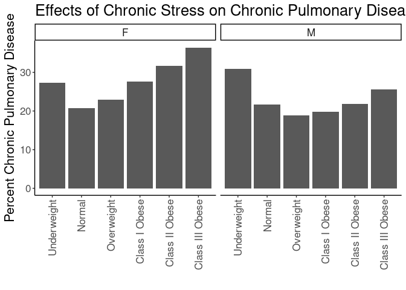
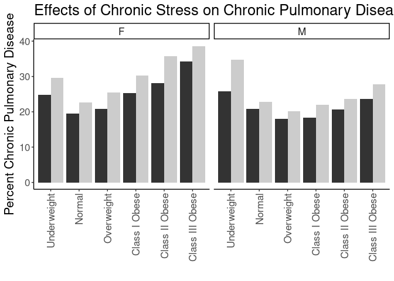
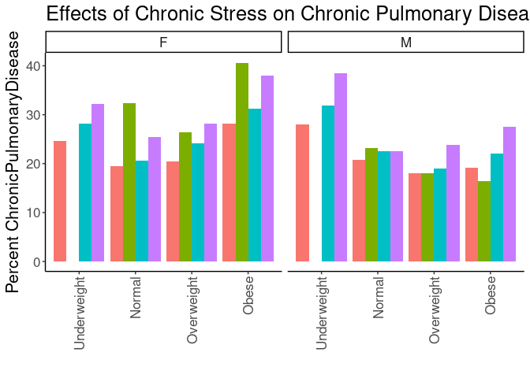
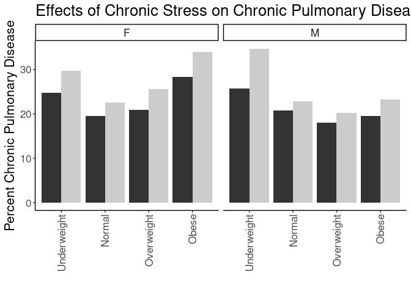
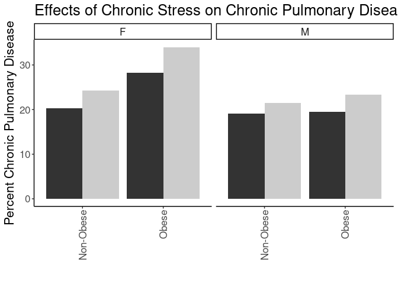

## Purpose

To test the effect modification of obesity on the stress-cpd relationships.


```r
library(knitr)
#figures made will go to directory called figures, will make them as both png and pdf files 
opts_chunk$set(fig.path='figures/',
               echo=TRUE, warning=FALSE, message=FALSE,dev=c('png','pdf'))
options(scipen = 2, digits = 3)

library(readr)
library(dplyr)
```

```
## 
## Attaching package: 'dplyr'
```

```
## The following objects are masked from 'package:stats':
## 
##     filter, lag
```

```
## The following objects are masked from 'package:base':
## 
##     intersect, setdiff, setequal, union
```

```r
library(tidyr)
library(knitr)

input.file <- 'data-combined.csv'
combined.data <- read_csv(input.file, na="-99")%>%
  filter(!(is.na(ChronicPulmonaryDisease))) %>%
  filter(!(is.na(Stress))) %>%
  filter(Stress!="NA")
```

```
## Rows: 62010 Columns: 39
```

```
## ── Column specification ────────────────────────────────────────────────────────
## Delimiter: ","
## chr (21): DeID_PatientID, Gender, Stress_d1, DeID_EncounterID, affluence13_1...
## dbl (18): age, CardiacArrhythmias, ChronicPulmonaryDisease, CongestiveHeartF...
## 
## ℹ Use `spec()` to retrieve the full column specification for this data.
## ℹ Specify the column types or set `show_col_types = FALSE` to quiet this message.
```

Loaded in the cleaned data from data-combined.csv. This script can be found in /nfs/turbo/precision-health/DataDirect/HUM00219435 - Obesity as a modifier of chronic psy/2023-03-14/2150 - Obesity and Stress - Cohort - DeID - 2023-03-14 and was most recently run on Sat Sep 30 11:22:19 2023. This dataset has 36813 values.


```r
combined.data <- 
  combined.data %>%
  mutate(BMI_cat= factor(BMI_cat, 
                         levels=c("Underweight",
                                  "Normal",
                                  "Overweight",
                                  'Class I Obese',
                                  'Class II Obese',
                                  'Class III Obese'))) %>%
  mutate(BMI_cat.obese= factor(BMI_cat.obese, 
                               levels=c("Underweight",
                                        "Normal",
                                        "Overweight",
                                        'Obese'))) %>%
  mutate(BMI_cat.Ob.NonOb= factor(BMI_cat.Ob.NonOb, 
                                  levels=c("Non-Obese",
                                           'Obese'))) %>%
  mutate(Stress=relevel(as.factor(High.Stress),ref="Low"))  #set low as reference value
```

# Chronic Pulmonary Disease Complication Rates by BMI

Stratified diagnoses by various BMI categories

## Chronic Pulmonary Disease by BMI Category


```r
#calculating cpd rates by bmi category
with(combined.data, table(ChronicPulmonaryDisease,BMI_cat,Gender)) %>% 
  data.frame %>%
  pivot_wider(names_from=ChronicPulmonaryDisease,
              values_from = Freq) %>%
  rename(ChronicPulmonaryDisease=`1`,
         NonDisease=`0`) %>%
  mutate(Total=ChronicPulmonaryDisease+NonDisease) %>%
  mutate(Percent=ChronicPulmonaryDisease/Total*100) -> cpd.bmi.counts

kable(cpd.bmi.counts, caption="Chronic pulmonary disease rates by BMI category")
```


Table: Chronic pulmonary disease rates by BMI category

|BMI_cat         |Gender | NonDisease| ChronicPulmonaryDisease| Total| Percent|
|:---------------|:------|----------:|-----------------------:|-----:|-------:|
|Underweight     |F      |        131|                      49|   180|    27.2|
|Normal          |F      |       4330|                    1134|  5464|    20.8|
|Overweight      |F      |       4137|                    1226|  5363|    22.9|
|Class I Obese   |F      |       2818|                    1075|  3893|    27.6|
|Class II Obese  |F      |       1564|                     726|  2290|    31.7|
|Class III Obese |F      |       1349|                     772|  2121|    36.4|
|Underweight     |M      |         58|                      26|    84|    31.0|
|Normal          |M      |       2766|                     762|  3528|    21.6|
|Overweight      |M      |       5325|                    1237|  6562|    18.9|
|Class I Obese   |M      |       3514|                     864|  4378|    19.7|
|Class II Obese  |M      |       1437|                     403|  1840|    21.9|
|Class III Obese |M      |        735|                     252|   987|    25.5|

```r
library(ggplot2)

ggplot(cpd.bmi.counts,
       aes(y=Percent,
           x=BMI_cat)) +
  geom_bar(stat='identity',position='dodge') +
  labs(y="Percent Chronic Pulmonary Disease",
       title="Effects of Chronic Stress on Chronic Pulmonary Disease Rates",
       x="") +
  theme_classic() +
  scale_fill_grey() +
  facet_grid(.~Gender) +
  theme(text=element_text(size=16),
        axis.text.x=element_text(angle=90,vjust=0.5,hjust=1),
        legend.position = 'none')
```

<!-- -->

## Chronic Pulmonary Disease Rate by BMI and Stress

This analysis uses all the BMI categories


```r
#calculating cpd rates by bmi category and stress
with(combined.data, table(ChronicPulmonaryDisease,BMI_cat,Stress,Gender)) %>% 
  data.frame %>%
  pivot_wider(names_from=ChronicPulmonaryDisease,
              values_from = Freq) %>%
  rename(ChronicPulmonaryDisease=`1`,
         NonChronicPulmonaryDisease=`0`) %>%
  mutate(Total=ChronicPulmonaryDisease+NonChronicPulmonaryDisease) %>%
  mutate(Percent=ChronicPulmonaryDisease/Total*100) -> cpd.bmi.stress.counts

library(ggplot2)

kable(cpd.bmi.stress.counts, caption="Chronic Pulmonary Disease rates by BMI category")
```


Table: Chronic Pulmonary Disease rates by BMI category

|BMI_cat         |Stress |Gender | NonChronicPulmonaryDisease| ChronicPulmonaryDisease| Total| Percent|
|:---------------|:------|:------|--------------------------:|-----------------------:|-----:|-------:|
|Underweight     |Low    |F      |                         67|                      22|    89|    24.7|
|Normal          |Low    |F      |                       2602|                     630|  3232|    19.5|
|Overweight      |Low    |F      |                       2437|                     643|  3080|    20.9|
|Class I Obese   |Low    |F      |                       1544|                     522|  2066|    25.3|
|Class II Obese  |Low    |F      |                        874|                     343|  1217|    28.2|
|Class III Obese |Low    |F      |                        703|                     366|  1069|    34.2|
|Underweight     |High   |F      |                         64|                      27|    91|    29.7|
|Normal          |High   |F      |                       1728|                     504|  2232|    22.6|
|Overweight      |High   |F      |                       1700|                     583|  2283|    25.5|
|Class I Obese   |High   |F      |                       1274|                     553|  1827|    30.3|
|Class II Obese  |High   |F      |                        690|                     383|  1073|    35.7|
|Class III Obese |High   |F      |                        646|                     406|  1052|    38.6|
|Underweight     |Low    |M      |                         26|                       9|    35|    25.7|
|Normal          |Low    |M      |                       1675|                     440|  2115|    20.8|
|Overweight      |Low    |M      |                       3359|                     739|  4098|    18.0|
|Class I Obese   |Low    |M      |                       2158|                     482|  2640|    18.3|
|Class II Obese  |Low    |M      |                        833|                     216|  1049|    20.6|
|Class III Obese |Low    |M      |                        402|                     124|   526|    23.6|
|Underweight     |High   |M      |                         32|                      17|    49|    34.7|
|Normal          |High   |M      |                       1091|                     322|  1413|    22.8|
|Overweight      |High   |M      |                       1966|                     498|  2464|    20.2|
|Class I Obese   |High   |M      |                       1356|                     382|  1738|    22.0|
|Class II Obese  |High   |M      |                        604|                     187|   791|    23.6|
|Class III Obese |High   |M      |                        333|                     128|   461|    27.8|

```r
ggplot(cpd.bmi.stress.counts,
       aes(y=Percent,
           x=BMI_cat,
           fill=Stress)) +
  geom_bar(stat='identity',position='dodge') +
  labs(y="Percent Chronic Pulmonary Disease",
       title="Effects of Chronic Stress on Chronic Pulmonary Disease Rates",
       x="") +
  theme_classic() +
  scale_fill_grey() +
  facet_grid(.~Gender) +
  theme(text=element_text(size=16),
        axis.text.x=element_text(angle=90,vjust=0.5,hjust=1),
        legend.position = 'none')
```

<!-- -->

### Logistic Regressions for All Obese Categories

Ran a series of stepwise logistic regressions testing for obesity as a modifier of the effects of stress.


```r
library(broom)
glm(ChronicPulmonaryDisease~BMI_cat, 
    family="binomial",
    data=combined.data) -> obesity.glm1

obesity.glm1 %>%
  tidy() %>%
  kable(caption="Logistic regression of obesity on cpd", digits =c(0,2,3,2,99))
```


Table: Logistic regression of obesity on cpd

|term                   | estimate| std.error| statistic|  p.value|
|:----------------------|--------:|---------:|---------:|--------:|
|(Intercept)            |    -0.92|     0.136|     -6.77| 1.27e-11|
|BMI_catNormal          |    -0.40|     0.139|     -2.85| 4.41e-03|
|BMI_catOverweight      |    -0.42|     0.138|     -3.05| 2.30e-03|
|BMI_catClass I Obese   |    -0.26|     0.139|     -1.87| 6.21e-02|
|BMI_catClass II Obese  |    -0.05|     0.141|     -0.38| 7.05e-01|
|BMI_catClass III Obese |     0.21|     0.142|      1.51| 1.32e-01|

```r
anova(obesity.glm1,test="Chisq") %>% tidy %>%
  kable(caption="Logistic regression of obesity on cpd, ", digits =c(0,0,0,0,0,99))
```


Table: Logistic regression of obesity on cpd, 

|term    | df| deviance| df.residual| residual.deviance|  p.value|
|:-------|--:|--------:|-----------:|-----------------:|--------:|
|NULL    | NA|       NA|       36689|             39782|       NA|
|BMI_cat |  5|      263|       36684|             39519| 1.13e-54|

```r
#adding in stress as a modifier
glm(ChronicPulmonaryDisease~BMI_cat+Stress+Stress:BMI_cat, 
    family="binomial",
    data=combined.data) -> obesity.glm2

obesity.glm2 %>%
  tidy() %>%
  kable(caption="Logistic regression of obesity on cpd, with stress as a modifier", digits =c(0,2,3,2,99))
```


Table: Logistic regression of obesity on cpd, with stress as a modifier

|term                              | estimate| std.error| statistic|  p.value|
|:---------------------------------|--------:|---------:|---------:|--------:|
|(Intercept)                       |    -1.10|     0.207|     -5.30| 1.18e-07|
|BMI_catNormal                     |    -0.29|     0.210|     -1.37| 1.72e-01|
|BMI_catOverweight                 |    -0.34|     0.210|     -1.60| 1.10e-01|
|BMI_catClass I Obese              |    -0.21|     0.210|     -0.98| 3.27e-01|
|BMI_catClass II Obese             |    -0.02|     0.213|     -0.08| 9.34e-01|
|BMI_catClass III Obese            |     0.29|     0.214|      1.33| 1.83e-01|
|StressHigh                        |     0.32|     0.276|      1.15| 2.49e-01|
|BMI_catNormal:StressHigh          |    -0.16|     0.281|     -0.57| 5.68e-01|
|BMI_catOverweight:StressHigh      |    -0.11|     0.280|     -0.38| 7.05e-01|
|BMI_catClass I Obese:StressHigh   |    -0.05|     0.281|     -0.17| 8.65e-01|
|BMI_catClass II Obese:StressHigh  |    -0.02|     0.285|     -0.08| 9.38e-01|
|BMI_catClass III Obese:StressHigh |    -0.11|     0.286|     -0.39| 6.97e-01|

```r
anova(obesity.glm2,test="Chisq") %>% tidy %>%
  kable(caption="Logistic regression of obese vs non-obese on cpd, with stress as a modifier", digits =c(0,0,0,0,0,99))
```


Table: Logistic regression of obese vs non-obese on cpd, with stress as a modifier

|term           | df| deviance| df.residual| residual.deviance|  p.value|
|:--------------|--:|--------:|-----------:|-----------------:|--------:|
|NULL           | NA|       NA|       36689|             39782|       NA|
|BMI_cat        |  5|      263|       36684|             39519| 1.13e-54|
|Stress         |  1|       80|       36683|             39439| 3.10e-19|
|BMI_cat:Stress |  5|        4|       36678|             39435| 5.94e-01|

```r
#adding in age and gender as covariates as a modifier
glm(ChronicPulmonaryDisease~BMI_cat+Stress+Stress:BMI_cat+Gender+age, 
    family="binomial",
    data=combined.data) -> obesity.glm3

obesity.glm3 %>%
  tidy() %>%
  kable(caption="Logistic regression of obesity on cpd, with stress as a modifier and age and  gender as covarites", digits =c(0,2,3,2,99))
```


Table: Logistic regression of obesity on cpd, with stress as a modifier and age and  gender as covarites

|term                              | estimate| std.error| statistic|  p.value|
|:---------------------------------|--------:|---------:|---------:|--------:|
|(Intercept)                       |    -1.40|     0.212|     -6.61| 3.78e-11|
|BMI_catNormal                     |    -0.27|     0.211|     -1.26| 2.08e-01|
|BMI_catOverweight                 |    -0.30|     0.211|     -1.44| 1.51e-01|
|BMI_catClass I Obese              |    -0.18|     0.211|     -0.84| 4.03e-01|
|BMI_catClass II Obese             |     0.00|     0.214|     -0.02| 9.82e-01|
|BMI_catClass III Obese            |     0.28|     0.215|      1.31| 1.89e-01|
|StressHigh                        |     0.35|     0.277|      1.27| 2.03e-01|
|GenderM                           |    -0.30|     0.026|    -11.55| 7.11e-31|
|age                               |     0.01|     0.001|      9.85| 6.92e-23|
|BMI_catNormal:StressHigh          |    -0.18|     0.282|     -0.65| 5.16e-01|
|BMI_catOverweight:StressHigh      |    -0.14|     0.281|     -0.49| 6.27e-01|
|BMI_catClass I Obese:StressHigh   |    -0.09|     0.282|     -0.32| 7.52e-01|
|BMI_catClass II Obese:StressHigh  |    -0.05|     0.286|     -0.19| 8.53e-01|
|BMI_catClass III Obese:StressHigh |    -0.13|     0.288|     -0.47| 6.39e-01|

```r
anova(obesity.glm3,test="Chisq") %>% tidy %>%
  kable(caption="Logistic regression of obesity on cpd, with stress as a modifier and age and gender as covarite", digits =c(0,0,0,0,0,99))
```


Table: Logistic regression of obesity on cpd, with stress as a modifier and age and gender as covarite

|term           | df| deviance| df.residual| residual.deviance|  p.value|
|:--------------|--:|--------:|-----------:|-----------------:|--------:|
|NULL           | NA|       NA|       36689|             39782|       NA|
|BMI_cat        |  5|      263|       36684|             39519| 1.13e-54|
|Stress         |  1|       80|       36683|             39439| 3.10e-19|
|Gender         |  1|      112|       36682|             39327| 3.03e-26|
|age            |  1|       98|       36681|             39229| 4.01e-23|
|BMI_cat:Stress |  5|        3|       36676|             39226| 6.93e-01|

```r
#adding in race and ethnicity
glm(ChronicPulmonaryDisease~BMI_cat+Stress+Stress:BMI_cat+Gender+age+Race.Ethnicity, 
    family="binomial",
    data=combined.data) -> obesity.glm4

obesity.glm4 %>%
  tidy() %>%
  kable(caption="Logistic regression of obesity on cpd, with stress as a modifier and age, gender and race as covarites", digits =c(0,2,3,2,99))
```


Table: Logistic regression of obesity on cpd, with stress as a modifier and age, gender and race as covarites

|term                              | estimate| std.error| statistic|  p.value|
|:---------------------------------|--------:|---------:|---------:|--------:|
|(Intercept)                       |    -1.63|     0.237|     -6.88| 6.09e-12|
|BMI_catNormal                     |    -0.28|     0.211|     -1.32| 1.85e-01|
|BMI_catOverweight                 |    -0.32|     0.211|     -1.54| 1.24e-01|
|BMI_catClass I Obese              |    -0.21|     0.212|     -0.97| 3.31e-01|
|BMI_catClass II Obese             |    -0.04|     0.214|     -0.17| 8.68e-01|
|BMI_catClass III Obese            |     0.24|     0.216|      1.13| 2.57e-01|
|StressHigh                        |     0.34|     0.277|      1.22| 2.22e-01|
|GenderM                           |    -0.29|     0.026|    -11.46| 2.00e-30|
|age                               |     0.01|     0.001|      9.96| 2.32e-23|
|Race.EthnicityBlack               |     0.57|     0.128|      4.43| 9.49e-06|
|Race.EthnicityHispanic/Latino     |     0.12|     0.149|      0.82| 4.14e-01|
|Race.EthnicityOther               |     0.33|     0.135|      2.45| 1.43e-02|
|Race.EthnicityWhite               |     0.23|     0.117|      2.01| 4.50e-02|
|BMI_catNormal:StressHigh          |    -0.17|     0.282|     -0.62| 5.36e-01|
|BMI_catOverweight:StressHigh      |    -0.13|     0.281|     -0.46| 6.48e-01|
|BMI_catClass I Obese:StressHigh   |    -0.08|     0.282|     -0.27| 7.83e-01|
|BMI_catClass II Obese:StressHigh  |    -0.04|     0.286|     -0.15| 8.84e-01|
|BMI_catClass III Obese:StressHigh |    -0.12|     0.288|     -0.43| 6.70e-01|

```r
anova(obesity.glm4,test="Chisq") %>% tidy %>%
  kable(caption="Logistic regression of obesity on cpd, with stress as a modifier and age, gender and race as covarite", digits =c(0,0,0,0,0,99))
```


Table: Logistic regression of obesity on cpd, with stress as a modifier and age, gender and race as covarite

|term           | df| deviance| df.residual| residual.deviance|  p.value|
|:--------------|--:|--------:|-----------:|-----------------:|--------:|
|NULL           | NA|       NA|       36689|             39782|       NA|
|BMI_cat        |  5|      263|       36684|             39519| 1.13e-54|
|Stress         |  1|       80|       36683|             39439| 3.10e-19|
|Gender         |  1|      112|       36682|             39327| 3.03e-26|
|age            |  1|       98|       36681|             39229| 4.01e-23|
|Race.Ethnicity |  4|       42|       36677|             39187| 1.76e-08|
|BMI_cat:Stress |  5|        3|       36672|             39184| 6.76e-01|

### Chronic Pulmonary Disease Rates by Quartiles


```r
with(combined.data, table(ChronicPulmonaryDisease,BMI_cat.obese,Stress.quartile,Gender)) %>% 
  data.frame %>%
  pivot_wider(names_from=ChronicPulmonaryDisease,
              values_from = Freq) %>%
  rename(ChronicPulmonaryDisease=`1`,
         NonDisease=`0`) %>%
  mutate(Total=ChronicPulmonaryDisease+NonDisease) %>%
  mutate(Percent=ChronicPulmonaryDisease/Total*100) -> cpd.bmi.stress.quartile.counts

kable(cpd.bmi.stress.quartile.counts, caption="Chronic Pulmonary Disease Rates by BMI and Stress Quartile")
```


Table: Chronic Pulmonary Disease Rates by BMI and Stress Quartile

|BMI_cat.obese |Stress.quartile |Gender | NonDisease| ChronicPulmonaryDisease| Total| Percent|
|:-------------|:---------------|:------|----------:|-----------------------:|-----:|-------:|
|Underweight   |(-0.016,4]      |F      |         52|                      17|    69|    24.6|
|Normal        |(-0.016,4]      |F      |       2175|                     527|  2702|    19.5|
|Overweight    |(-0.016,4]      |F      |       2054|                     526|  2580|    20.4|
|Obese         |(-0.016,4]      |F      |       2600|                    1019|  3619|    28.2|
|Underweight   |(12,16]         |F      |          2|                       0|     2|     0.0|
|Normal        |(12,16]         |F      |         50|                      24|    74|    32.4|
|Overweight    |(12,16]         |F      |         53|                      19|    72|    26.4|
|Obese         |(12,16]         |F      |         79|                      54|   133|    40.6|
|Underweight   |(4,8]           |F      |         56|                      22|    78|    28.2|
|Normal        |(4,8]           |F      |       1652|                     428|  2080|    20.6|
|Overweight    |(4,8]           |F      |       1572|                     502|  2074|    24.2|
|Obese         |(4,8]           |F      |       2313|                    1047|  3360|    31.2|
|Underweight   |(8,12]          |F      |         21|                      10|    31|    32.3|
|Normal        |(8,12]          |F      |        453|                     155|   608|    25.5|
|Overweight    |(8,12]          |F      |        458|                     179|   637|    28.1|
|Obese         |(8,12]          |F      |        739|                     453|  1192|    38.0|
|Underweight   |(-0.016,4]      |M      |         18|                       7|    25|    28.0|
|Normal        |(-0.016,4]      |M      |       1444|                     378|  1822|    20.7|
|Overweight    |(-0.016,4]      |M      |       2892|                     637|  3529|    18.1|
|Obese         |(-0.016,4]      |M      |       2905|                     689|  3594|    19.2|
|Underweight   |(12,16]         |M      |          2|                       0|     2|     0.0|
|Normal        |(12,16]         |M      |         33|                      10|    43|    23.3|
|Overweight    |(12,16]         |M      |         41|                       9|    50|    18.0|
|Obese         |(12,16]         |M      |         71|                      14|    85|    16.5|
|Underweight   |(4,8]           |M      |         30|                      14|    44|    31.8|
|Normal        |(4,8]           |M      |       1025|                     297|  1322|    22.5|
|Overweight    |(4,8]           |M      |       1986|                     464|  2450|    18.9|
|Obese         |(4,8]           |M      |       2179|                     614|  2793|    22.0|
|Underweight   |(8,12]          |M      |          8|                       5|    13|    38.5|
|Normal        |(8,12]          |M      |        264|                      77|   341|    22.6|
|Overweight    |(8,12]          |M      |        406|                     127|   533|    23.8|
|Obese         |(8,12]          |M      |        531|                     202|   733|    27.6|

```r
ggplot(cpd.bmi.stress.quartile.counts,
       aes(y=Percent,
           x=BMI_cat.obese,
           fill=Stress.quartile)) +
  geom_bar(stat='identity',position='dodge') +
  labs(y="Percent ChronicPulmonaryDisease",
       title="Effects of Chronic Stress on Chronic Pulmonary Disease",
       x="") +
  theme_classic() +
  facet_grid(.~Gender) +
  theme(text=element_text(size=16),
        axis.text.x=element_text(angle=90,vjust=0.5,hjust=1),
        legend.position = 'none')
```

<!-- -->

## Chronic Pulmonary Disease Rates by Normal Obesity and Stress


```r
#calculating cpd rates by bmi category, stress and gender
with(combined.data, table(ChronicPulmonaryDisease,BMI_cat.obese,Stress,Gender)) %>% 
  data.frame %>%
  pivot_wider(names_from=ChronicPulmonaryDisease,
              values_from = Freq) %>%
  rename(ChronicPulmonaryDisease=`1`,
         NonDisease=`0`) %>%
  mutate(Total=ChronicPulmonaryDisease+NonDisease) %>%
  mutate(Percent=ChronicPulmonaryDisease/Total*100) -> cpd.bmi.stress.gender.counts

kable(cpd.bmi.stress.gender.counts, caption="Chronic Pulmonary Disease Rates by BMI and Stress")
```


Table: Chronic Pulmonary Disease Rates by BMI and Stress

|BMI_cat.obese |Stress |Gender | NonDisease| ChronicPulmonaryDisease| Total| Percent|
|:-------------|:------|:------|----------:|-----------------------:|-----:|-------:|
|Underweight   |Low    |F      |         67|                      22|    89|    24.7|
|Normal        |Low    |F      |       2602|                     630|  3232|    19.5|
|Overweight    |Low    |F      |       2437|                     643|  3080|    20.9|
|Obese         |Low    |F      |       3121|                    1231|  4352|    28.3|
|Underweight   |High   |F      |         64|                      27|    91|    29.7|
|Normal        |High   |F      |       1728|                     504|  2232|    22.6|
|Overweight    |High   |F      |       1700|                     583|  2283|    25.5|
|Obese         |High   |F      |       2610|                    1342|  3952|    34.0|
|Underweight   |Low    |M      |         26|                       9|    35|    25.7|
|Normal        |Low    |M      |       1675|                     440|  2115|    20.8|
|Overweight    |Low    |M      |       3359|                     739|  4098|    18.0|
|Obese         |Low    |M      |       3393|                     822|  4215|    19.5|
|Underweight   |High   |M      |         32|                      17|    49|    34.7|
|Normal        |High   |M      |       1091|                     322|  1413|    22.8|
|Overweight    |High   |M      |       1966|                     498|  2464|    20.2|
|Obese         |High   |M      |       2293|                     697|  2990|    23.3|

```r
ggplot(cpd.bmi.stress.gender.counts,
       aes(y=Percent,
           x=BMI_cat.obese,
           fill=Stress)) +
  geom_bar(stat='identity',position='dodge') +
  labs(y="Percent Chronic Pulmonary Disease",
       title="Effects of Chronic Stress on Chronic Pulmonary Disease",
       x="") +
  facet_grid(.~Gender) +
  theme_classic() +
  scale_fill_grey() +
  theme(text=element_text(size=16),
        axis.text.x=element_text(angle=90,vjust=0.5,hjust=1),
        legend.position = 'none')
```

<!-- -->

## Logistic Regressions for Obese/Non-Obese

Ran a series of logistic regressions using the normal obesity categories not classes as the categorization


```r
glm(ChronicPulmonaryDisease~BMI_cat.obese, 
    family="binomial",
    data=combined.data) -> obesity.glm1

obesity.glm1 %>%
  tidy() %>%
  kable(caption="Logistic regression of obese vs non-obese on Chronic pulmonary disease", digits =c(0,2,3,2,99))
```


Table: Logistic regression of obese vs non-obese on Chronic pulmonary disease

|term                    | estimate| std.error| statistic|  p.value|
|:-----------------------|--------:|---------:|---------:|--------:|
|(Intercept)             |    -0.92|     0.136|     -6.77| 1.27e-11|
|BMI_cat.obeseNormal     |    -0.40|     0.139|     -2.85| 4.41e-03|
|BMI_cat.obeseOverweight |    -0.42|     0.138|     -3.05| 2.30e-03|
|BMI_cat.obeseObese      |    -0.10|     0.138|     -0.74| 4.60e-01|

```r
anova(obesity.glm1,test="Chisq") %>% tidy %>%
  kable(caption="Logistic regression of obesity on Chronic pulmonary disease, ", digits =c(0,0,0,0,0,99))
```


Table: Logistic regression of obesity on Chronic pulmonary disease, 

|term          | df| deviance| df.residual| residual.deviance|  p.value|
|:-------------|--:|--------:|-----------:|-----------------:|--------:|
|NULL          | NA|       NA|       36689|             39782|       NA|
|BMI_cat.obese |  3|      157|       36686|             39625| 7.74e-34|

```r
#adding in stress as a modifier
glm(ChronicPulmonaryDisease~BMI_cat.obese+Stress+Stress:BMI_cat.obese, 
    family="binomial",
    data=combined.data) -> obesity.glm2

obesity.glm2 %>%
  tidy() %>%
  kable(caption="Logistic regression of obesity on Chronic pulmonary disease, with stress as a modifier", digits =c(0,2,3,2,99))
```


Table: Logistic regression of obesity on Chronic pulmonary disease, with stress as a modifier

|term                               | estimate| std.error| statistic|  p.value|
|:----------------------------------|--------:|---------:|---------:|--------:|
|(Intercept)                        |    -1.10|     0.207|     -5.30| 1.18e-07|
|BMI_cat.obeseNormal                |    -0.29|     0.210|     -1.37| 1.72e-01|
|BMI_cat.obeseOverweight            |    -0.34|     0.210|     -1.60| 1.10e-01|
|BMI_cat.obeseObese                 |    -0.06|     0.209|     -0.27| 7.89e-01|
|StressHigh                         |     0.32|     0.276|      1.15| 2.49e-01|
|BMI_cat.obeseNormal:StressHigh     |    -0.16|     0.281|     -0.57| 5.68e-01|
|BMI_cat.obeseOverweight:StressHigh |    -0.11|     0.280|     -0.38| 7.05e-01|
|BMI_cat.obeseObese:StressHigh      |    -0.04|     0.278|     -0.15| 8.82e-01|

```r
anova(obesity.glm2,test="Chisq") %>% tidy %>%
  kable(caption="Logistic regression of obesity on Chronic pulmonary disease, with stress as a modifier", digits =c(0,0,0,0,0,99))
```


Table: Logistic regression of obesity on Chronic pulmonary disease, with stress as a modifier

|term                 | df| deviance| df.residual| residual.deviance|  p.value|
|:--------------------|--:|--------:|-----------:|-----------------:|--------:|
|NULL                 | NA|       NA|       36689|             39782|       NA|
|BMI_cat.obese        |  3|      157|       36686|             39625| 7.74e-34|
|Stress               |  1|       86|       36685|             39539| 2.20e-20|
|BMI_cat.obese:Stress |  3|        4|       36682|             39535| 2.82e-01|

```r
#adding in age and gender as covariates as a modifier
glm(ChronicPulmonaryDisease~BMI_cat.obese+Stress+Stress:BMI_cat.obese+Gender+age, 
    family="binomial",
    data=combined.data) -> obesity.glm3

obesity.glm3 %>%
  tidy() %>%
  kable(caption="Logistic regression of obesity on Chronic pulmonary disease, with stress as a modifier and age and  gender as covarites", digits =c(0,2,3,2,99))
```


Table: Logistic regression of obesity on Chronic pulmonary disease, with stress as a modifier and age and  gender as covarites

|term                               | estimate| std.error| statistic|  p.value|
|:----------------------------------|--------:|---------:|---------:|--------:|
|(Intercept)                        |    -1.37|     0.212|     -6.47| 9.60e-11|
|BMI_cat.obeseNormal                |    -0.26|     0.211|     -1.24| 2.13e-01|
|BMI_cat.obeseOverweight            |    -0.29|     0.211|     -1.39| 1.65e-01|
|BMI_cat.obeseObese                 |    -0.03|     0.210|     -0.14| 8.88e-01|
|StressHigh                         |     0.35|     0.277|      1.27| 2.02e-01|
|GenderM                            |    -0.32|     0.026|    -12.56| 3.55e-36|
|age                                |     0.01|     0.001|      9.28| 1.68e-20|
|BMI_cat.obeseNormal:StressHigh     |    -0.19|     0.282|     -0.66| 5.12e-01|
|BMI_cat.obeseOverweight:StressHigh |    -0.14|     0.281|     -0.50| 6.19e-01|
|BMI_cat.obeseObese:StressHigh      |    -0.08|     0.280|     -0.29| 7.75e-01|

```r
anova(obesity.glm3,test="Chisq") %>% tidy %>%
  kable(caption="Logistic regression of obesity on Chronic pulmonary disease, with stress as a modifier and age and gender as covarite", digits =c(0,0,0,0,0,99))
```


Table: Logistic regression of obesity on Chronic pulmonary disease, with stress as a modifier and age and gender as covarite

|term                 | df| deviance| df.residual| residual.deviance|  p.value|
|:--------------------|--:|--------:|-----------:|-----------------:|--------:|
|NULL                 | NA|       NA|       36689|             39782|       NA|
|BMI_cat.obese        |  3|      157|       36686|             39625| 7.74e-34|
|Stress               |  1|       86|       36685|             39539| 2.20e-20|
|Gender               |  1|      135|       36684|             39404| 2.91e-31|
|age                  |  1|       87|       36683|             39317| 1.12e-20|
|BMI_cat.obese:Stress |  3|        3|       36680|             39314| 3.76e-01|

```r
#adding in race and ethnicity
glm(ChronicPulmonaryDisease~BMI_cat.obese+Stress+Stress:BMI_cat.obese+Gender+age+Race.Ethnicity, 
    family="binomial",
    data=combined.data) -> obesity.glm4

obesity.glm4 %>%
  tidy() %>%
  kable(caption="Logistic regression of obesity on liver diesease, with stress as a modifier and age, gender and race as covarites", digits =c(0,2,3,2,99))
```


Table: Logistic regression of obesity on liver diesease, with stress as a modifier and age, gender and race as covarites

|term                               | estimate| std.error| statistic|  p.value|
|:----------------------------------|--------:|---------:|---------:|--------:|
|(Intercept)                        |    -1.62|     0.237|     -6.83| 8.29e-12|
|BMI_cat.obeseNormal                |    -0.28|     0.211|     -1.31| 1.89e-01|
|BMI_cat.obeseOverweight            |    -0.32|     0.211|     -1.50| 1.34e-01|
|BMI_cat.obeseObese                 |    -0.06|     0.210|     -0.30| 7.66e-01|
|StressHigh                         |     0.34|     0.277|      1.22| 2.22e-01|
|GenderM                            |    -0.32|     0.026|    -12.44| 1.50e-35|
|age                                |     0.01|     0.001|      9.41| 5.03e-21|
|Race.EthnicityBlack                |     0.60|     0.128|      4.69| 2.76e-06|
|Race.EthnicityHispanic/Latino      |     0.14|     0.149|      0.92| 3.59e-01|
|Race.EthnicityOther                |     0.35|     0.135|      2.61| 9.17e-03|
|Race.EthnicityWhite                |     0.25|     0.117|      2.18| 2.95e-02|
|BMI_cat.obeseNormal:StressHigh     |    -0.18|     0.282|     -0.62| 5.33e-01|
|BMI_cat.obeseOverweight:StressHigh |    -0.13|     0.281|     -0.47| 6.42e-01|
|BMI_cat.obeseObese:StressHigh      |    -0.07|     0.280|     -0.24| 8.08e-01|

```r
anova(obesity.glm4,test="Chisq") %>% tidy %>%
  kable(caption="Logistic regression of obesity on Chronic pulmonary disease, with stress as a modifier and age, gender and race as covariates", digits =c(0,0,0,0,0,99))
```


Table: Logistic regression of obesity on Chronic pulmonary disease, with stress as a modifier and age, gender and race as covariates

|term                 | df| deviance| df.residual| residual.deviance|  p.value|
|:--------------------|--:|--------:|-----------:|-----------------:|--------:|
|NULL                 | NA|       NA|       36689|             39782|       NA|
|BMI_cat.obese        |  3|      157|       36686|             39625| 7.74e-34|
|Stress               |  1|       86|       36685|             39539| 2.20e-20|
|Gender               |  1|      135|       36684|             39404| 2.91e-31|
|age                  |  1|       87|       36683|             39317| 1.12e-20|
|Race.Ethnicity       |  4|       46|       36679|             39271| 2.83e-09|
|BMI_cat.obese:Stress |  3|        3|       36676|             39268| 3.54e-01|

# Chronic Pulmonary Disease Rates by Obese/Not Obese and Stress


```r
with(combined.data, table(ChronicPulmonaryDisease,BMI_cat.Ob.NonOb,Stress,Gender)) %>% 
  data.frame %>%
  pivot_wider(names_from=ChronicPulmonaryDisease,
              values_from = Freq) %>%
  rename(ChronicPulmonaryDisease=`1`,
         NonDisease=`0`) %>%
  mutate(Total=ChronicPulmonaryDisease+NonDisease) %>%
  mutate(Percent=ChronicPulmonaryDisease/Total*100) -> cpd.BMI_cat.Ob.NonOb.stress.counts

kable(cpd.BMI_cat.Ob.NonOb.stress.counts, caption="Chronic Pulmonary Disease Rates by Obese or not and Stress")
```


Table: Chronic Pulmonary Disease Rates by Obese or not and Stress

|BMI_cat.Ob.NonOb |Stress |Gender | NonDisease| ChronicPulmonaryDisease| Total| Percent|
|:----------------|:------|:------|----------:|-----------------------:|-----:|-------:|
|Non-Obese        |Low    |F      |       5144|                    1306|  6450|    20.2|
|Obese            |Low    |F      |       3121|                    1231|  4352|    28.3|
|Non-Obese        |High   |F      |       3518|                    1124|  4642|    24.2|
|Obese            |High   |F      |       2610|                    1342|  3952|    34.0|
|Non-Obese        |Low    |M      |       5071|                    1194|  6265|    19.1|
|Obese            |Low    |M      |       3393|                     822|  4215|    19.5|
|Non-Obese        |High   |M      |       3101|                     846|  3947|    21.4|
|Obese            |High   |M      |       2293|                     697|  2990|    23.3|

```r
ggplot(cpd.BMI_cat.Ob.NonOb.stress.counts,
       aes(y=Percent,
           x=BMI_cat.Ob.NonOb,
           fill=Stress)) +
  geom_bar(stat='identity',position='dodge') +
  labs(y="Percent Chronic Pulmonary Disease",
       title="Effects of Chronic Stress on Chronic Pulmonary Disease",
       x="") +
  facet_grid(.~Gender) +
  theme_classic() +
  scale_fill_grey() +
  theme(text=element_text(size=16),
        axis.text.x=element_text(angle=90,vjust=0.5,hjust=1),
        legend.position = 'none')
```

<!-- -->

## Logistic Regressions for Obese/Non-Obese

Ran a series of logistic regressions using obese/non-obese as the categorization


```r
glm(ChronicPulmonaryDisease~BMI_cat.Ob.NonOb, 
    family="binomial",
    data=combined.data) -> obesity.glm1

obesity.glm1 %>%
  tidy() %>%
  kable(caption="Logistic regression of obese vs non-obese on cpd", digits =c(0,2,3,2,99))
```


Table: Logistic regression of obese vs non-obese on cpd

|term                  | estimate| std.error| statistic|  p.value|
|:---------------------|--------:|---------:|---------:|--------:|
|(Intercept)           |    -1.33|     0.017|     -78.8| 0.00e+00|
|BMI_cat.Ob.NonObObese |     0.30|     0.025|      12.1| 1.14e-33|

```r
anova(obesity.glm1,test="Chisq") %>% tidy %>%
  kable(caption="Logistic regression of obese vs non-obese on cpd, ", digits =c(0,0,0,0,0,99))
```


Table: Logistic regression of obese vs non-obese on cpd, 

|term             | df| deviance| df.residual| residual.deviance|  p.value|
|:----------------|--:|--------:|-----------:|-----------------:|--------:|
|NULL             | NA|       NA|       36812|             39933|       NA|
|BMI_cat.Ob.NonOb |  1|      146|       36811|             39787| 1.44e-33|

```r
#adding in stress as a modifier
glm(ChronicPulmonaryDisease~BMI_cat.Ob.NonOb+Stress+Stress:BMI_cat.Ob.NonOb, 
    family="binomial",
    data=combined.data) -> obesity.glm2

obesity.glm2 %>%
  tidy() %>%
  kable(caption="Logistic regression of obese vs non-obese on cpd, with stress as a modifier", digits =c(0,2,3,2,99))
```


Table: Logistic regression of obese vs non-obese on cpd, with stress as a modifier

|term                             | estimate| std.error| statistic|  p.value|
|:--------------------------------|--------:|---------:|---------:|--------:|
|(Intercept)                      |    -1.41|     0.022|    -63.08| 0.00e+00|
|BMI_cat.Ob.NonObObese            |     0.25|     0.034|      7.50| 6.60e-14|
|StressHigh                       |     0.20|     0.034|      5.75| 8.76e-09|
|BMI_cat.Ob.NonObObese:StressHigh |     0.08|     0.050|      1.63| 1.02e-01|

```r
anova(obesity.glm2,test="Chisq") %>% tidy %>%
  kable(caption="Logistic regression of obese vs non-obese on cpd, with stress as a modifier", digits =c(0,0,0,0,0,99))
```


Table: Logistic regression of obese vs non-obese on cpd, with stress as a modifier

|term                    | df| deviance| df.residual| residual.deviance|  p.value|
|:-----------------------|--:|--------:|-----------:|-----------------:|--------:|
|NULL                    | NA|       NA|       36812|             39933|       NA|
|BMI_cat.Ob.NonOb        |  1|      146|       36811|             39787| 1.44e-33|
|Stress                  |  1|       88|       36810|             39699| 7.19e-21|
|BMI_cat.Ob.NonOb:Stress |  1|        3|       36809|             39697| 1.02e-01|

```r
#adding in age and gender as covariates as a modifier
glm(ChronicPulmonaryDisease~BMI_cat.Ob.NonOb+Stress+Stress:BMI_cat.Ob.NonOb+Gender+age, 
    family="binomial",
    data=combined.data) -> obesity.glm3

obesity.glm3 %>%
  tidy() %>%
  kable(caption="Logistic regression of obese vs non-obese on cpd, with stress as a modifier and age and  gender as covarites", digits =c(0,2,3,2,99))
```


Table: Logistic regression of obese vs non-obese on cpd, with stress as a modifier and age and  gender as covarites

|term                             | estimate| std.error| statistic|  p.value|
|:--------------------------------|--------:|---------:|---------:|--------:|
|(Intercept)                      |    -1.64|     0.048|    -34.42| 0.00e+00|
|BMI_cat.Ob.NonObObese            |     0.25|     0.034|      7.25| 4.25e-13|
|StressHigh                       |     0.20|     0.034|      5.88| 4.17e-09|
|GenderM                          |    -0.32|     0.025|    -12.64| 1.29e-36|
|age                              |     0.01|     0.001|      9.19| 3.92e-20|
|BMI_cat.Ob.NonObObese:StressHigh |     0.07|     0.050|      1.45| 1.48e-01|

```r
anova(obesity.glm3,test="Chisq") %>% tidy %>%
  kable(caption="Logistic regression of obese vs non-obese on cpd, with stress as a modifier and age and gender as covarite", digits =c(0,0,0,0,0,99))
```


Table: Logistic regression of obese vs non-obese on cpd, with stress as a modifier and age and gender as covarite

|term                    | df| deviance| df.residual| residual.deviance|  p.value|
|:-----------------------|--:|--------:|-----------:|-----------------:|--------:|
|NULL                    | NA|       NA|       36812|             39933|       NA|
|BMI_cat.Ob.NonOb        |  1|      146|       36811|             39787| 1.44e-33|
|Stress                  |  1|       88|       36810|             39699| 7.19e-21|
|Gender                  |  1|      135|       36809|             39564| 3.06e-31|
|age                     |  1|       85|       36808|             39479| 2.49e-20|
|BMI_cat.Ob.NonOb:Stress |  1|        2|       36807|             39477| 1.48e-01|

```r
#adding in race and ethnicity
glm(ChronicPulmonaryDisease~BMI_cat.Ob.NonOb+Stress+Stress:BMI_cat.Ob.NonOb+Gender+age+Race.Ethnicity, 
    family="binomial",
    data=combined.data) -> obesity.glm4

obesity.glm4 %>%
  tidy() %>%
  kable(caption="Logistic regression of obese vs non-obese on cpd, with stress as a modifier and age, gender and race as covarites", digits =c(0,2,3,2,99))
```


Table: Logistic regression of obese vs non-obese on cpd, with stress as a modifier and age, gender and race as covarites

|term                             | estimate| std.error| statistic|  p.value|
|:--------------------------------|--------:|---------:|---------:|--------:|
|(Intercept)                      |    -1.91|     0.121|    -15.82| 2.15e-56|
|BMI_cat.Ob.NonObObese            |     0.23|     0.034|      6.82| 8.97e-12|
|StressHigh                       |     0.20|     0.034|      5.71| 1.11e-08|
|GenderM                          |    -0.32|     0.025|    -12.55| 3.93e-36|
|age                              |     0.01|     0.001|      9.28| 1.63e-20|
|Race.EthnicityBlack              |     0.60|     0.128|      4.71| 2.44e-06|
|Race.EthnicityHispanic/Latino    |     0.14|     0.148|      0.94| 3.45e-01|
|Race.EthnicityOther              |     0.35|     0.134|      2.61| 9.11e-03|
|Race.EthnicityWhite              |     0.26|     0.117|      2.23| 2.56e-02|
|BMI_cat.Ob.NonObObese:StressHigh |     0.08|     0.050|      1.50| 1.33e-01|

```r
anova(obesity.glm4,test="Chisq") %>% tidy %>%
  kable(caption="Logistic regression of obese vs non-obese on cpd, with stress as a modifier and age, gender and race as covarite", digits =c(0,0,0,0,0,99))
```


Table: Logistic regression of obese vs non-obese on cpd, with stress as a modifier and age, gender and race as covarite

|term                    | df| deviance| df.residual| residual.deviance|  p.value|
|:-----------------------|--:|--------:|-----------:|-----------------:|--------:|
|NULL                    | NA|       NA|       36812|             39933|       NA|
|BMI_cat.Ob.NonOb        |  1|      146|       36811|             39787| 1.44e-33|
|Stress                  |  1|       88|       36810|             39699| 7.19e-21|
|Gender                  |  1|      135|       36809|             39564| 3.06e-31|
|age                     |  1|       85|       36808|             39479| 2.49e-20|
|Race.Ethnicity          |  4|       45|       36804|             39434| 3.82e-09|
|BMI_cat.Ob.NonOb:Stress |  1|        2|       36803|             39432| 1.33e-01|

# Summary of Covariates

Stratified data by stress and obesity status and summarized data


```r
combined.data %>%
  group_by(Stress,BMI_cat.Ob.NonOb) %>%
  count %>%
  knitr::kable(caption="Number of participants by group")
```


Table: Number of participants by group

|Stress |BMI_cat.Ob.NonOb |     n|
|:------|:----------------|-----:|
|Low    |Non-Obese        | 12715|
|Low    |Obese            |  8567|
|High   |Non-Obese        |  8589|
|High   |Obese            |  6942|

```r
combined.data %>%
  group_by(Stress,BMI_cat.Ob.NonOb,Gender) %>%
  count %>%
    filter(!(is.na(Stress))) %>%
  filter(!(is.na(BMI_cat.Ob.NonOb))) %>%
  knitr::kable(caption="Number of participants by group and gender")
```


Table: Number of participants by group and gender

|Stress |BMI_cat.Ob.NonOb |Gender |    n|
|:------|:----------------|:------|----:|
|Low    |Non-Obese        |F      | 6450|
|Low    |Non-Obese        |M      | 6265|
|Low    |Obese            |F      | 4352|
|Low    |Obese            |M      | 4215|
|High   |Non-Obese        |F      | 4642|
|High   |Non-Obese        |M      | 3947|
|High   |Obese            |F      | 3952|
|High   |Obese            |M      | 2990|

```r
combined.data %>%
  group_by(Stress,BMI_cat.Ob.NonOb,Race.Ethnicity) %>%
  count %>%
    filter(!(is.na(Stress))) %>%
  filter(!(is.na(BMI_cat.Ob.NonOb))) %>%
  knitr::kable(caption="Number of participants by group and race/ethnicity")
```


Table: Number of participants by group and race/ethnicity

|Stress |BMI_cat.Ob.NonOb |Race.Ethnicity  |     n|
|:------|:----------------|:---------------|-----:|
|Low    |Non-Obese        |Asian           |   302|
|Low    |Non-Obese        |Black           |   362|
|Low    |Non-Obese        |Hispanic/Latino |   228|
|Low    |Non-Obese        |Other           |   401|
|Low    |Non-Obese        |White           | 11422|
|Low    |Obese            |Asian           |    35|
|Low    |Obese            |Black           |   457|
|Low    |Obese            |Hispanic/Latino |   172|
|Low    |Obese            |Other           |   281|
|Low    |Obese            |White           |  7622|
|High   |Non-Obese        |Asian           |   172|
|High   |Non-Obese        |Black           |   366|
|High   |Non-Obese        |Hispanic/Latino |   167|
|High   |Non-Obese        |Other           |   286|
|High   |Non-Obese        |White           |  7598|
|High   |Obese            |Asian           |    40|
|High   |Obese            |Black           |   449|
|High   |Obese            |Hispanic/Latino |   150|
|High   |Obese            |Other           |   217|
|High   |Obese            |White           |  6086|

```r
combined.data %>%
  group_by(Stress,BMI_cat.Ob.NonOb) %>%
    filter(!(is.na(Stress))) %>%
  filter(!(is.na(BMI_cat.Ob.NonOb))) %>%
  summarize_at(c('BMI','age'), list(mean=~mean(.x,na.rm=T),
                                    sd=~sd(.x,na.rm=T),
                                    n=~length(.x)))%>%
  knitr::kable(caption="Average BMI and age of participants by group")
```


Table: Average BMI and age of participants by group

|Stress |BMI_cat.Ob.NonOb | BMI_mean| age_mean| BMI_sd| age_sd| BMI_n| age_n|
|:------|:----------------|--------:|--------:|------:|------:|-----:|-----:|
|Low    |Non-Obese        |     25.3|     53.1|   2.98|   17.7| 12715| 12715|
|Low    |Obese            |     36.0|     54.6|   5.71|   14.6|  8567|  8567|
|High   |Non-Obese        |     25.1|     51.0|   3.12|   17.8|  8589|  8589|
|High   |Obese            |     36.6|     52.7|   5.98|   14.6|  6942|  6942|

```r
combined.data %>%
  group_by(Stress,BMI_cat.Ob.NonOb) %>%
  summarize_at(c('BMI','age'), list(mean=~mean(.x,na.rm=T),
                                    sd=~sd(.x,na.rm=T),
                                    n=~length(.x)))%>%
  filter(!(is.na(Stress))) %>%
  filter(!(is.na(BMI_cat.Ob.NonOb))) %>%
  knitr::kable(caption="Average BMI and age of participants by group,complete cases")
```


Table: Average BMI and age of participants by group,complete cases

|Stress |BMI_cat.Ob.NonOb | BMI_mean| age_mean| BMI_sd| age_sd| BMI_n| age_n|
|:------|:----------------|--------:|--------:|------:|------:|-----:|-----:|
|Low    |Non-Obese        |     25.3|     53.1|   2.98|   17.7| 12715| 12715|
|Low    |Obese            |     36.0|     54.6|   5.71|   14.6|  8567|  8567|
|High   |Non-Obese        |     25.1|     51.0|   3.12|   17.8|  8589|  8589|
|High   |Obese            |     36.6|     52.7|   5.98|   14.6|  6942|  6942|

# Session Information


```r
sessionInfo()
```

```
## R version 4.3.1 (2023-06-16)
## Platform: x86_64-pc-linux-gnu (64-bit)
## Running under: Red Hat Enterprise Linux 8.6 (Ootpa)
## 
## Matrix products: default
## BLAS:   /sw/pkgs/arc/stacks/gcc/10.3.0/R/4.3.1/lib64/R/lib/libRblas.so 
## LAPACK: /sw/pkgs/arc/stacks/gcc/10.3.0/R/4.3.1/lib64/R/lib/libRlapack.so;  LAPACK version 3.11.0
## 
## locale:
##  [1] LC_CTYPE=en_US.UTF-8       LC_NUMERIC=C              
##  [3] LC_TIME=en_US.UTF-8        LC_COLLATE=en_US.UTF-8    
##  [5] LC_MONETARY=en_US.UTF-8    LC_MESSAGES=en_US.UTF-8   
##  [7] LC_PAPER=en_US.UTF-8       LC_NAME=C                 
##  [9] LC_ADDRESS=C               LC_TELEPHONE=C            
## [11] LC_MEASUREMENT=en_US.UTF-8 LC_IDENTIFICATION=C       
## 
## time zone: America/Detroit
## tzcode source: system (glibc)
## 
## attached base packages:
## [1] stats     graphics  grDevices utils     datasets  methods   base     
## 
## other attached packages:
## [1] broom_1.0.5   ggplot2_3.4.3 tidyr_1.3.0   dplyr_1.1.3   readr_2.1.4  
## [6] knitr_1.44   
## 
## loaded via a namespace (and not attached):
##  [1] bit_4.0.5        gtable_0.3.4     jsonlite_1.8.7   compiler_4.3.1  
##  [5] crayon_1.5.2     tidyselect_1.2.0 stringr_1.5.0    parallel_4.3.1  
##  [9] jquerylib_0.1.4  scales_1.2.1     yaml_2.3.7       fastmap_1.1.1   
## [13] R6_2.5.1         labeling_0.4.3   generics_0.1.3   backports_1.4.1 
## [17] tibble_3.2.1     munsell_0.5.0    bslib_0.5.1      pillar_1.9.0    
## [21] tzdb_0.4.0       rlang_1.1.1      utf8_1.2.3       stringi_1.7.12  
## [25] cachem_1.0.8     xfun_0.40        sass_0.4.7       bit64_4.0.5     
## [29] cli_3.6.1        withr_2.5.0      magrittr_2.0.3   digest_0.6.33   
## [33] grid_4.3.1       vroom_1.6.3      rstudioapi_0.13  hms_1.1.3       
## [37] lifecycle_1.0.3  vctrs_0.6.3      evaluate_0.21    glue_1.6.2      
## [41] farver_2.1.1     colorspace_2.1-0 fansi_1.0.4      rmarkdown_2.25  
## [45] purrr_1.0.2      tools_4.3.1      pkgconfig_2.0.3  htmltools_0.5.6
```
