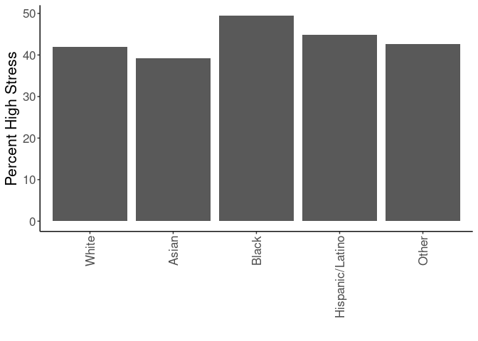
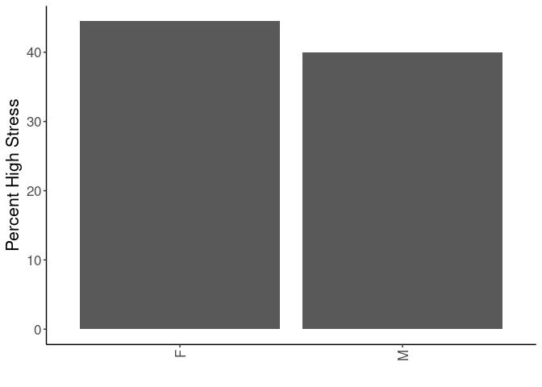
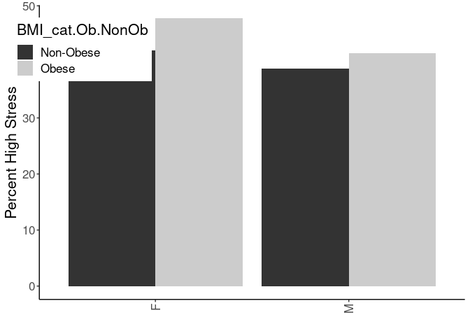
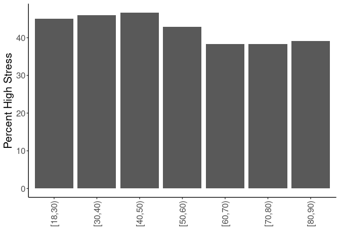
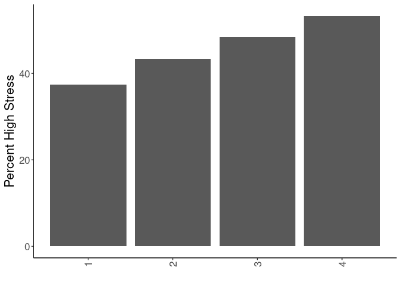
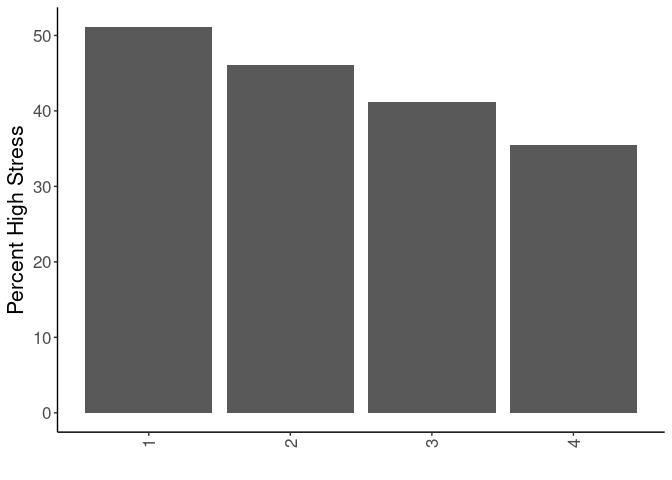
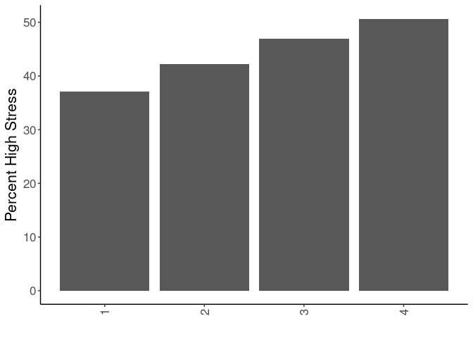
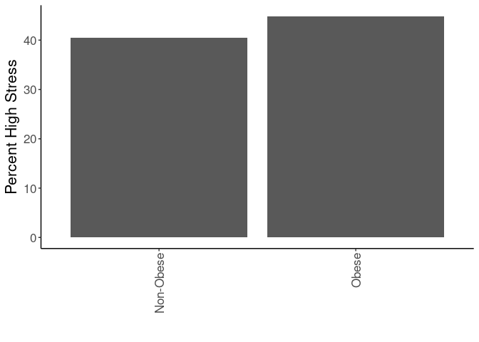
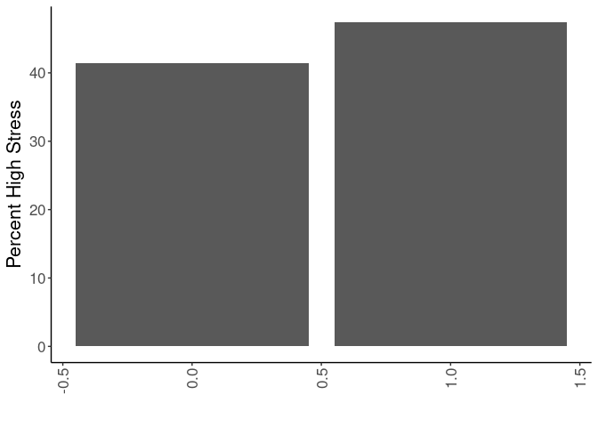

## Purpose

To define covariates for stress-obesity relationships, referring to associations with the exposure (stress).


``` r
library(knitr)
#figures made will go to directory called figures, will make them as both png and pdf files 
opts_chunk$set(fig.path='figures/',
               echo=TRUE, warning=FALSE, message=FALSE,dev=c('png','pdf'))
options(scipen = 2, digits = 3)

library(readr)
library(dplyr)
```

```
## 
## Attaching package: 'dplyr'
```

```
## The following objects are masked from 'package:stats':
## 
##     filter, lag
```

```
## The following objects are masked from 'package:base':
## 
##     intersect, setdiff, setequal, union
```

``` r
library(tidyr)
library(ggplot2)

input.file <- 'data-combined.csv'
combined.data <- read_csv(input.file) %>% #set reference values for each group
  mutate(Race.Ethnicity = relevel(as.factor(Race.Ethnicity),ref="White")) %>%
  mutate(Gender = relevel(as.factor(Gender),ref="F")) %>%
  mutate(BMI_cat = factor(as.factor(BMI_cat),levels=c("Underweight","Normal","Overweight","Class I Obese","Class II Obese","Class III Obese")))%>%
  filter(!(is.na(HypertensionAny))) %>%
  filter(!(is.na(Stress))) %>%
  filter(Stress!="NA") %>%
  mutate(Stress=case_when(Stress=="High"~1,
                          Stress=="Low"~0))
```

```
## Rows: 61793 Columns: 43
```

```
## ── Column specification ────────────────────────────────────────────────────────
## Delimiter: ","
## chr  (18): DeID_PatientID, Gender, DeID_Survey_Date, DeID_EncounterID, BMI_c...
## dbl  (23): age, Stress_d1, Survey.Year, CardiacArrhythmias, ChronicPulmonary...
## dttm  (2): Survey.Date, DeID_Diabetes_Diagnosis
## 
## ℹ Use `spec()` to retrieve the full column specification for this data.
## ℹ Specify the column types or set `show_col_types = FALSE` to quiet this message.
```

# Definition of Stress

Stress is defined as high or low, based on whether the participant is above or below the median value (5).


``` r
combined.data %>%
  group_by(Stress) %>%
  count %>%
  ungroup %>%
  mutate(Pct = n/sum(n)*100) %>%
  kable(caption="Number of participants by high or low stress")
```


Table: Number of participants by high or low stress

| Stress|     n|  Pct|
|------:|-----:|----:|
|      0| 22819| 57.7|
|      1| 16741| 42.3|

Loaded in the cleaned data from data-combined.csv. This script can be found in /nfs/turbo/precision-health/DataDirect/HUM00219435 - Obesity as a modifier of chronic psy/2023-03-14/2150 - Obesity and Stress - Cohort - DeID - 2023-03-14 and was most recently run on Mon Sep 30 13:58:52 2024. This dataset has 39560 values.

Performed univariate analyses on the categorical associations with stress incidence. Treated both age and BMI as both linear and categorical variables.

## By Race and Ethnicity


``` r
combined.data %>%
  filter(!(is.na(Stress))) %>%
  filter(!(is.na(BMI_cat.Ob.NonOb))) %>%
  group_by(Race.Ethnicity,Stress) %>%
  count %>%
  pivot_wider(id_cols=Race.Ethnicity,
              names_from=Stress,
              values_from = n,
              names_prefix='Stress') %>% 
  rename("Yes"="Stress1",
         "No"="Stress0")%>%
  mutate(Prevalence=Yes/(Yes+No)*100) -> stress.race

stress.race %>%
  ggplot(aes(y=Prevalence,x=Race.Ethnicity)) +
  geom_bar(stat='identity',position='dodge') +
  labs(y="Percent High Stress",
       x="") +
  theme_classic() +
  scale_fill_grey() +
  theme(text=element_text(size=16),
        axis.text.x=element_text(angle=90,vjust=0.5,hjust=1),
        legend.position = c(0.1,0.85))
```

<!-- -->

``` r
stress.race %>%
  knitr::kable(caption="Number of participants by stress and race/ethnicity",
               digits =c(0,2,3,2,99))
```


Table: Number of participants by stress and race/ethnicity

|Race.Ethnicity  |    No|   Yes| Prevalence|
|:---------------|-----:|-----:|----------:|
|White           | 20432| 14766|       42.0|
|Asian           |   350|   225|       39.1|
|Black           |   878|   861|       49.5|
|Hispanic/Latino |   429|   348|       44.8|
|Other           |   730|   541|       42.6|


``` r
library(broom)
glm(Stress~Race.Ethnicity, 
    family="binomial",
    data=combined.data) -> race.glm

race.glm %>% 
  anova(test="Chisq") %>% 
  tidy %>% 
  kable(caption="Binomial regression of ethicity on stress",
        digits =c(0,0,0,0,0,99))
```


Table: Binomial regression of ethicity on stress

|term           | df| deviance| df.residual| residual.deviance|  p.value|
|:--------------|--:|--------:|-----------:|-----------------:|--------:|
|NULL           | NA|       NA|       39559|             53904|       NA|
|Race.Ethnicity |  4|       43|       39555|             53862| 1.16e-08|

``` r
race.glm %>% 
  tidy(exponentiate=TRUE) %>% 
  kable(caption="Binomial regression estimates of ethicity on stress incidence, exponentiated", 
        digits =c(0,2,3,2,99))
```


Table: Binomial regression estimates of ethicity on stress incidence, exponentiated

|term                          | estimate| std.error| statistic|  p.value|
|:-----------------------------|--------:|---------:|---------:|--------:|
|(Intercept)                   |     0.72|     0.011|    -30.07| 0.00e+00|
|Race.EthnicityAsian           |     0.89|     0.086|     -1.36| 1.74e-01|
|Race.EthnicityBlack           |     1.36|     0.049|      6.21| 5.36e-10|
|Race.EthnicityHispanic/Latino |     1.12|     0.073|      1.58| 1.13e-01|
|Race.EthnicityOther           |     1.03|     0.058|      0.44| 6.63e-01|

## By Gender


``` r
combined.data %>%
  filter(!(is.na(Stress))) %>%
  filter(!(is.na(BMI_cat.Ob.NonOb))) %>%
  group_by(Gender,Stress) %>%
  count %>%
  pivot_wider(id_cols=Gender,
              names_from=Stress,
              values_from = n,
              names_prefix='Diabetes') %>%
  rename("Yes"="Diabetes1",
         "No"="Diabetes0") %>%
  mutate(Prevalence=Yes/(Yes+No)*100) -> 
  stress.gender

stress.gender %>%
  ggplot(aes(y=Prevalence,x=Gender)) +
  geom_bar(stat='identity',position='dodge') +
  labs(y="Percent High Stress",
       x="") +
  theme_classic() +
  scale_fill_grey() +
  theme(text=element_text(size=16),
        axis.text.x=element_text(angle=90,vjust=0.5,hjust=1),
        legend.position = c(0.1,0.85))
```

<!-- -->

``` r
stress.gender %>% 
  knitr::kable(caption="Number of participants by stress and gender",
               digits =c(0,2,3,2,99))
```


Table: Number of participants by stress and gender

|Gender |    No|  Yes| Prevalence|
|:------|-----:|----:|----------:|
|F      | 11534| 9238|       44.5|
|M      | 11285| 7503|       39.9|

## Interaction Between Gender and BMI

Modelling shows a significant interaction between BMI and gender with respect to stress risk


``` r
combined.data %>%
  filter(!(is.na(Stress))) %>%
  filter(!(is.na(BMI_cat.Ob.NonOb))) %>%
  group_by(Gender,Stress,BMI_cat.Ob.NonOb) %>%
  count %>%
  pivot_wider(id_cols=c(Gender,BMI_cat.Ob.NonOb),
              names_from=Stress,
              values_from = n,
              names_prefix='Diabetes') %>%
  rename("Yes"="Diabetes1",
         "No"="Diabetes0") %>%
  mutate(Prevalence=Yes/(Yes+No)*100) -> 
  stress.gender.bmi

glm(Stress~Gender+BMI_cat.Ob.NonOb+BMI_cat.Ob.NonOb:Gender, 
    family="binomial",
    data=combined.data) -> gender.bmi.glm

kable(stress.gender.bmi, caption="Prevalence of stress by obesity and gender")
```


Table: Prevalence of stress by obesity and gender

|Gender |BMI_cat.Ob.NonOb |   No|  Yes| Prevalence|
|:------|:----------------|----:|----:|----------:|
|F      |Non-Obese        | 6858| 4966|       42.0|
|F      |Obese            | 4676| 4272|       47.7|
|M      |Non-Obese        | 6738| 4279|       38.8|
|M      |Obese            | 4547| 3224|       41.5|

``` r
gender.bmi.glm %>% 
  anova(test="Chisq") %>% 
  tidy %>% 
  kable(caption="Binomial regression of gender:BMI interaction on stress incidence",
        digits =c(0,0,0,0,0,99))
```


Table: Binomial regression of gender:BMI interaction on stress incidence

|term                    | df| deviance| df.residual| residual.deviance|  p.value|
|:-----------------------|--:|--------:|-----------:|-----------------:|--------:|
|NULL                    | NA|       NA|       39559|             53904|       NA|
|Gender                  |  1|       83|       39558|             53821| 7.02e-20|
|BMI_cat.Ob.NonOb        |  1|       73|       39557|             53748| 1.64e-17|
|Gender:BMI_cat.Ob.NonOb |  1|        9|       39556|             53740| 3.09e-03|

``` r
gender.bmi.glm %>% 
  tidy(exponentiate=TRUE) %>% 
  kable(caption="Binomial regression estimates of gender:BMI on stress incidence, exponentiated", 
        digits =c(0,2,3,2,99))
```


Table: Binomial regression estimates of gender:BMI on stress incidence, exponentiated

|term                          | estimate| std.error| statistic|  p.value|
|:-----------------------------|--------:|---------:|---------:|--------:|
|(Intercept)                   |     0.72|     0.019|    -17.32| 3.09e-67|
|GenderM                       |     0.88|     0.027|     -4.86| 1.17e-06|
|BMI_cat.Ob.NonObObese         |     1.26|     0.028|      8.24| 1.68e-16|
|GenderM:BMI_cat.Ob.NonObObese |     0.88|     0.041|     -2.96| 3.09e-03|


``` r
stress.gender.bmi %>%
  ggplot(aes(y=Prevalence,x=Gender,fill=BMI_cat.Ob.NonOb)) +
  geom_bar(stat='identity',position='dodge') +
  labs(y="Percent High Stress",
       x="") +
  theme_classic() +
  scale_fill_grey() +
  theme(text=element_text(size=16),
        axis.text.x=element_text(angle=90,vjust=0.5,hjust=1),
        legend.position = c(0.1,0.85))
```

<!-- -->


``` r
library(broom)
glm(Stress~Gender, 
    family="binomial",
    data=combined.data) -> gender.glm

gender.glm %>% 
  anova(test="Chisq") %>% 
  tidy %>% 
  kable(caption="Binomial regression of gender on stress incidence",
        digits =c(0,0,0,0,0,99))
```


Table: Binomial regression of gender on stress incidence

|term   | df| deviance| df.residual| residual.deviance|  p.value|
|:------|--:|--------:|-----------:|-----------------:|--------:|
|NULL   | NA|       NA|       39559|             53904|       NA|
|Gender |  1|       83|       39558|             53821| 7.02e-20|

``` r
gender.glm %>% 
  tidy(exponentiate=TRUE) %>% 
  kable(caption="Binomial regression estimates of gender on stress incidence, exponentiated", 
        digits =c(0,2,3,2,99))
```


Table: Binomial regression estimates of gender on stress incidence, exponentiated

|term        | estimate| std.error| statistic|  p.value|
|:-----------|--------:|---------:|---------:|--------:|
|(Intercept) |     0.80|     0.014|    -15.90| 6.55e-57|
|GenderM     |     0.83|     0.020|     -9.12| 7.52e-20|

## By Age


``` r
combined.data %>%
  filter(!(is.na(Stress))) %>%
  filter(!(is.na(BMI_cat.Ob.NonOb))) %>%
  group_by(Age.group,Stress) %>%
  count %>%
  pivot_wider(id_cols=Age.group,
              names_from=Stress,
              values_from = n,
              names_prefix='Diabetes') %>%
  rename("Yes"="Diabetes1",
         "No"="Diabetes0")%>%
  mutate(Prevalence=Yes/(Yes+No)*100) -> stress.age


stress.age %>%
  ggplot(aes(y=Prevalence,x=Age.group)) +
  geom_bar(stat='identity',position='dodge') +
  labs(y="Percent High Stress",
       x="") +
  theme_classic() +
  scale_fill_grey() +
  theme(text=element_text(size=16),
        axis.text.x=element_text(angle=90,vjust=0.5,hjust=1),
        legend.position = c(0.1,0.85))  
```

<!-- -->

``` r
stress.age %>%
  knitr::kable(caption="Number of participants by stress diagnosis and age")
```


Table: Number of participants by stress diagnosis and age

|Age.group |   No|  Yes| Prevalence|
|:---------|----:|----:|----------:|
|[18,30)   | 2459| 2019|       45.1|
|[30,40)   | 2533| 2155|       46.0|
|[40,50)   | 3219| 2819|       46.7|
|[50,60)   | 5010| 3771|       42.9|
|[60,70)   | 5744| 3570|       38.3|
|[70,80)   | 3059| 1896|       38.3|
|[80,90)   |  795|  511|       39.1|


``` r
glm(Stress~Age.group, 
    family="binomial",
    data=combined.data) -> age.glm

age.glm %>% 
  anova(test="Chisq") %>% 
  tidy %>% 
  kable(caption="Binomial regression of age group on stress incidence",
        digits =c(0,0,0,0,0,99))
```


Table: Binomial regression of age group on stress incidence

|term      | df| deviance| df.residual| residual.deviance|  p.value|
|:---------|--:|--------:|-----------:|-----------------:|--------:|
|NULL      | NA|       NA|       39559|             53904|       NA|
|Age.group |  6|      188|       39553|             53716| 6.31e-38|

``` r
age.glm %>% 
  tidy(exponentiate=TRUE) %>% 
  kable(caption="Binomial regression estimates of age group on stress incidence, exponentiated", 
        digits =c(0,2,3,2,99))
```


Table: Binomial regression estimates of age group on stress incidence, exponentiated

|term             | estimate| std.error| statistic|  p.value|
|:----------------|--------:|---------:|---------:|--------:|
|(Intercept)      |     0.82|     0.030|     -6.56| 5.22e-11|
|Age.group[30,40) |     1.04|     0.042|      0.85| 3.97e-01|
|Age.group[40,50) |     1.07|     0.040|      1.63| 1.03e-01|
|Age.group[50,60) |     0.92|     0.037|     -2.35| 1.87e-02|
|Age.group[60,70) |     0.76|     0.037|     -7.56| 4.00e-14|
|Age.group[70,80) |     0.75|     0.042|     -6.71| 1.95e-11|
|Age.group[80,90) |     0.78|     0.064|     -3.82| 1.36e-04|

``` r
glm(Stress~age, data=combined.data) %>% 
  tidy(exponentiate=TRUE) %>%
  kable(caption="Binomial regression estimates of age (continuous) on stress incidence, exponentiated", 
        digits =c(0,2,3,2,99))
```


Table: Binomial regression estimates of age (continuous) on stress incidence, exponentiated

|term        | estimate| std.error| statistic|  p.value|
|:-----------|--------:|---------:|---------:|--------:|
|(Intercept) |     1.68|     0.008|      62.0| 0.00e+00|
|age         |     1.00|     0.000|     -11.7| 1.31e-31|

## By Neighborhood Disadvantage

### Neighborhood Education


``` r
combined.data %>%
  filter(!(is.na(Stress))) %>%
  filter(!(is.na(BMI_cat.Ob.NonOb))) %>%
  group_by(ped1_13_17_qrtl,Stress) %>%
  count %>%
  pivot_wider(id_cols=ped1_13_17_qrtl,
              names_from=Stress,
              values_from = n,
              names_prefix='Diabetes') %>%
  rename("Yes"="Diabetes1",
         "No"="Diabetes0")%>%
  mutate(Prevalence=Yes/(Yes+No)*100) -> stress.disadvantage


stress.disadvantage %>%
  ggplot(aes(y=Prevalence,x=ped1_13_17_qrtl)) +
  geom_bar(stat='identity',position='dodge') +
  labs(y="Percent High Stress",
       x="") +
  theme_classic() +
  scale_fill_grey() +
  theme(text=element_text(size=16),
        axis.text.x=element_text(angle=90,vjust=0.5,hjust=1),
        legend.position = c(0.1,0.85))  
```

<!-- -->

``` r
stress.disadvantage %>%
  knitr::kable(caption="Number of participants by stress neighborhood education")
```


Table: Number of participants by stress neighborhood education

| ped1_13_17_qrtl|   No|  Yes| Prevalence|
|---------------:|----:|----:|----------:|
|               1| 9672| 5786|       37.4|
|               2| 6770| 5165|       43.3|
|               3| 3914| 3677|       48.4|
|               4|  658|  751|       53.3|
|              NA| 1805| 1362|       43.0|


``` r
glm(Stress~ped1_13_17_qrtl, 
    family="binomial",
    data=combined.data) -> disadvantage.glm

disadvantage.glm %>% 
  anova(test="Chisq") %>% 
  tidy %>% 
  kable(caption="Binomial regression of neighborhood education group on stress incidence",
        digits =c(0,0,0,0,0,99))
```


Table: Binomial regression of neighborhood education group on stress incidence

|term            | df| deviance| df.residual| residual.deviance|  p.value|
|:---------------|--:|--------:|-----------:|-----------------:|--------:|
|NULL            | NA|       NA|       36392|             49575|       NA|
|ped1_13_17_qrtl |  1|      340|       36391|             49235| 5.06e-76|

``` r
disadvantage.glm %>% 
  tidy(exponentiate=TRUE) %>% 
  kable(caption="Binomial regression estimates of neighborhood education group on stress incidence, exponentiated", 
        digits =c(0,2,3,2,99))
```


Table: Binomial regression estimates of neighborhood education group on stress incidence, exponentiated

|term            | estimate| std.error| statistic| p.value|
|:---------------|--------:|---------:|---------:|-------:|
|(Intercept)     |     0.48|     0.025|     -29.0| 0.0e+00|
|ped1_13_17_qrtl |     1.25|     0.012|      18.4| 1.2e-75|

### Neighborhood Affluence


``` r
combined.data %>%
  filter(!(is.na(Stress))) %>%
  filter(!(is.na(BMI_cat.Ob.NonOb))) %>%
  group_by(affluence13_17_qrtl,Stress) %>%
  count %>%
  pivot_wider(id_cols=affluence13_17_qrtl,
              names_from=Stress,
              values_from = n,
              names_prefix='Diabetes') %>%
  rename("Yes"="Diabetes1",
         "No"="Diabetes0")%>%
  mutate(Prevalence=Yes/(Yes+No)*100) -> stress.disadvantage


stress.disadvantage %>%
  ggplot(aes(y=Prevalence,x=affluence13_17_qrtl)) +
  geom_bar(stat='identity',position='dodge') +
  labs(y="Percent High Stress",
       x="") +
  theme_classic() +
  scale_fill_grey() +
  theme(text=element_text(size=16),
        axis.text.x=element_text(angle=90,vjust=0.5,hjust=1),
        legend.position = c(0.1,0.85))  
```

<!-- -->

``` r
stress.disadvantage %>%
  knitr::kable(caption="Number of participants by stress neighborhood affluence")
```


Table: Number of participants by stress neighborhood affluence

| affluence13_17_qrtl|   No|  Yes| Prevalence|
|-------------------:|----:|----:|----------:|
|                   1| 3183| 3335|       51.2|
|                   2| 4619| 3950|       46.1|
|                   3| 5476| 3836|       41.2|
|                   4| 7736| 4258|       35.5|
|                  NA| 1805| 1362|       43.0|


``` r
glm(Stress~affluence13_17_qrtl, 
    family="binomial",
    data=combined.data) -> disadvantage.glm

disadvantage.glm %>% 
  anova(test="Chisq") %>% 
  tidy %>% 
  kable(caption="Binomial regression of neighborhood affluence group on stress incidence",
        digits =c(0,0,0,0,0,99))
```


Table: Binomial regression of neighborhood affluence group on stress incidence

|term                | df| deviance| df.residual| residual.deviance| p.value|
|:-------------------|--:|--------:|-----------:|-----------------:|-------:|
|NULL                | NA|       NA|       36392|             49575|      NA|
|affluence13_17_qrtl |  1|      492|       36391|             49083|       0|

``` r
disadvantage.glm %>% 
  tidy(exponentiate=TRUE) %>% 
  kable(caption="Binomial regression estimates of neighborhood affluence group on stress incidence, exponentiated", 
        digits =c(0,2,3,2,99))
```


Table: Binomial regression estimates of neighborhood affluence group on stress incidence, exponentiated

|term                | estimate| std.error| statistic|  p.value|
|:-------------------|--------:|---------:|---------:|--------:|
|(Intercept)         |     1.31|     0.028|      9.56| 1.19e-21|
|affluence13_17_qrtl |     0.81|     0.010|    -22.09| 0.00e+00|

### Disadvantage


``` r
combined.data %>%
  filter(!(is.na(Stress))) %>%
  filter(!(is.na(BMI_cat.Ob.NonOb))) %>%
  group_by(disadvantage13_17_qrtl,Stress) %>%
  count %>%
  pivot_wider(id_cols=disadvantage13_17_qrtl,
              names_from=Stress,
              values_from = n,
              names_prefix='Diabetes') %>%
  rename("Yes"="Diabetes1",
         "No"="Diabetes0")%>%
  mutate(Prevalence=Yes/(Yes+No)*100) -> stress.disadvantage


stress.disadvantage %>%
  ggplot(aes(y=Prevalence,x=disadvantage13_17_qrtl)) +
  geom_bar(stat='identity',position='dodge') +
  labs(y="Percent High Stress",
       x="") +
  theme_classic() +
  scale_fill_grey() +
  theme(text=element_text(size=16),
        axis.text.x=element_text(angle=90,vjust=0.5,hjust=1),
        legend.position = c(0.1,0.85))  
```

<!-- -->

``` r
stress.disadvantage %>%
  knitr::kable(caption="Number of participants by stress neighborhood disadvantage")
```


Table: Number of participants by stress neighborhood disadvantage

| disadvantage13_17_qrtl|   No|  Yes| Prevalence|
|----------------------:|----:|----:|----------:|
|                      1| 8767| 5183|       37.2|
|                      2| 6071| 4434|       42.2|
|                      3| 4037| 3566|       46.9|
|                      4| 2139| 2196|       50.7|
|                     NA| 1805| 1362|       43.0|


``` r
glm(Stress~disadvantage13_17_qrtl, 
    family="binomial",
    data=combined.data) -> disadvantage.glm

disadvantage.glm %>% 
  anova(test="Chisq") %>% 
  tidy %>% 
  kable(caption="Binomial regression of neighborhood disadvantage group on stress incidence",
        digits =c(0,0,0,0,0,99))
```


Table: Binomial regression of neighborhood disadvantage group on stress incidence

|term                   | df| deviance| df.residual| residual.deviance|  p.value|
|:----------------------|--:|--------:|-----------:|-----------------:|--------:|
|NULL                   | NA|       NA|       36392|             49575|       NA|
|disadvantage13_17_qrtl |  1|      340|       36391|             49236| 8.17e-76|

``` r
disadvantage.glm %>% 
  tidy(exponentiate=TRUE) %>% 
  kable(caption="Binomial regression estimates of neighborhood disadvantage group on stress incidence, exponentiated", 
        digits =c(0,2,3,2,99))
```


Table: Binomial regression estimates of neighborhood disadvantage group on stress incidence, exponentiated

|term                   | estimate| std.error| statistic|  p.value|
|:----------------------|--------:|---------:|---------:|--------:|
|(Intercept)            |     0.49|     0.024|     -29.4| 0.00e+00|
|disadvantage13_17_qrtl |     1.21|     0.010|      18.4| 1.78e-75|

## By Body Mass Index


``` r
combined.data %>%
  filter(!(is.na(Stress))) %>%
  filter(!(is.na(BMI_cat.Ob.NonOb))) %>%
  group_by(BMI_cat,Stress) %>%
  count %>%
  pivot_wider(id_cols=BMI_cat,
              names_from=Stress,
              values_from = n,
              names_prefix='Diabetes') %>%
  rename("Yes"="Diabetes1",
         "No"="Diabetes0") %>%
  mutate(Prevalence=Yes/(Yes+No)*100) -> stress.bmi

stress.bmi %>%
  ggplot(aes(y=Prevalence,x=BMI_cat)) +
  geom_bar(stat='identity',position='dodge') +
  labs(y="Percent High Stress",
       x="") +
  theme_classic() +
  scale_fill_grey() +
  theme(text=element_text(size=16),
        axis.text.x=element_text(angle=90,vjust=0.5,hjust=1),
        legend.position = c(0.1,0.85))  
```

<!-- -->

``` r
stress.bmi %>%
  knitr::kable(caption="Number of participants by stress diagnosis and BMI category")
```


Table: Number of participants by stress diagnosis and BMI category

|BMI_cat         |   No|  Yes| Prevalence|
|:---------------|----:|----:|----------:|
|Underweight     |  132|  151|       53.4|
|Normal          | 5727| 3921|       40.6|
|Overweight      | 7737| 5173|       40.1|
|Class I Obese   | 5045| 3825|       43.1|
|Class II Obese  | 2435| 2036|       45.5|
|Class III Obese | 1743| 1635|       48.4|

## By Type 2 Diabetes Diagnosis


``` r
combined.data %>%
  filter(!(is.na(Stress))) %>%
  filter(!(is.na(BMI_cat.Ob.NonOb))) %>%
  group_by(Type2Diabetes,Stress) %>%
  count %>%
  pivot_wider(id_cols=Type2Diabetes,
              names_from=Stress,
              values_from = n,
              names_prefix='Type2Diabetes') %>% 
  rename("Yes"="Type2Diabetes1",
         "No"="Type2Diabetes0") %>%
  mutate(Prevalence=Yes/(Yes+No)*100) -> stress.diabtes

stress.diabtes %>%
  ggplot(aes(y=Prevalence,x=Type2Diabetes)) +
  geom_bar(stat='identity',position='dodge') +
  labs(y="Percent High Stress",
       x="") +
  theme_classic() +
  scale_fill_grey() +
  theme(text=element_text(size=16),
        axis.text.x=element_text(angle=90,vjust=0.5,hjust=1),
        legend.position = c(0.1,0.85))  
```

<!-- -->

``` r
stress.diabtes %>%
  knitr::kable(caption="Number of participants by stress diagnosis and diabetes diagnosis")
```


Table: Number of participants by stress diagnosis and diabetes diagnosis

| Type2Diabetes|    No|   Yes| Prevalence|
|-------------:|-----:|-----:|----------:|
|             0| 19585| 13834|       41.4|
|             1|  3234|  2907|       47.3|


``` r
glm(Stress~Type2Diabetes, 
    family="binomial",
    data=combined.data) -> t2d.glm

t2d.glm %>% 
  anova(test="Chisq") %>% 
  tidy %>% 
  kable(caption="Binomial regression of type 2 diabetes diagnosis on stress incidence",
        digits =c(0,0,0,0,0,99))
```


Table: Binomial regression of type 2 diabetes diagnosis on stress incidence

|term          | df| deviance| df.residual| residual.deviance|  p.value|
|:-------------|--:|--------:|-----------:|-----------------:|--------:|
|NULL          | NA|       NA|       39559|             53904|       NA|
|Type2Diabetes |  1|       75|       39558|             53830| 6.04e-18|

``` r
t2d.glm %>% 
  tidy(exponentiate=TRUE) %>% 
  kable(caption="Binomial regression estimates of type 2 diabetes diagnosis on stress incidence, exponentiated", 
        digits =c(0,2,3,2,99))
```


Table: Binomial regression estimates of type 2 diabetes diagnosis on stress incidence, exponentiated

|term          | estimate| std.error| statistic|  p.value|
|:-------------|--------:|---------:|---------:|--------:|
|(Intercept)   |     0.71|     0.011|    -31.30| 0.00e+00|
|Type2Diabetes |     1.27|     0.028|      8.65| 5.17e-18|

``` r
glm(Stress~BMI, data=combined.data) %>% 
  tidy(exponentiate=TRUE) %>%
  kable(caption="Binomial regression estimates of BMI on stress incidence, exponentiated",
        digits =c(0,2,3,2,99))
```


Table: Binomial regression estimates of BMI on stress incidence, exponentiated

|term        | estimate| std.error| statistic|  p.value|
|:-----------|--------:|---------:|---------:|--------:|
|(Intercept) |     1.39|     0.011|     30.11| 0.00e+00|
|BMI         |     1.00|     0.000|      9.05| 1.52e-19|

# Summary Table


``` r
rbind(stress.race %>% rename("Group"="Race.Ethnicity") %>%
        mutate(Categoyr="Race.Ethnicity"),
      stress.gender %>% 
        rename("Group"="Gender") %>%
        mutate(Category="Gender"),
      stress.bmi %>% 
        rename("Group"="BMI_cat") %>%
        mutate(Category="BMI"),
      stress.disadvantage %>%
        rename("Group"="disadvantage13_17_qrtl") %>%
        mutate(Category="SES") %>%
      mutate(Group=as.factor(Group)),
      stress.age %>% rename("Group"="Age.group") %>%
        mutate(Category="Age Group"), 
      stress.diabtes %>% rename("Group"="Type2Diabetes") %>%
        mutate(Category = "Type 2 Diabetes") %>%
        mutate(Group=as.factor(Group))) %>%
  mutate(Total=No+Yes) %>%
  ungroup %>%
  group_by(Category) %>%
  mutate(Percent = Total/sum(Total)*100) %>%
  select(Category, Group,Total,Percent, No,Yes,Prevalence)-> summary.table

kable(summary.table, caption="Summary of demographic variables by stress incidence")
```


Table: Summary of demographic variables by stress incidence

|Category        |Group           | Total| Percent|    No|   Yes| Prevalence|
|:---------------|:---------------|-----:|-------:|-----:|-----:|----------:|
|NA              |White           | 35198|  88.974| 20432| 14766|       42.0|
|NA              |Asian           |   575|   1.453|   350|   225|       39.1|
|NA              |Black           |  1739|   4.396|   878|   861|       49.5|
|NA              |Hispanic/Latino |   777|   1.964|   429|   348|       44.8|
|NA              |Other           |  1271|   3.213|   730|   541|       42.6|
|Gender          |F               | 20772|  52.508| 11534|  9238|       44.5|
|Gender          |M               | 18788|  47.492| 11285|  7503|       39.9|
|BMI             |Underweight     |   283|   0.715|   132|   151|       53.4|
|BMI             |Normal          |  9648|  24.388|  5727|  3921|       40.6|
|BMI             |Overweight      | 12910|  32.634|  7737|  5173|       40.1|
|BMI             |Class I Obese   |  8870|  22.422|  5045|  3825|       43.1|
|BMI             |Class II Obese  |  4471|  11.302|  2435|  2036|       45.5|
|BMI             |Class III Obese |  3378|   8.539|  1743|  1635|       48.4|
|SES             |1               | 13950|  35.263|  8767|  5183|       37.2|
|SES             |2               | 10505|  26.555|  6071|  4434|       42.2|
|SES             |3               |  7603|  19.219|  4037|  3566|       46.9|
|SES             |4               |  4335|  10.958|  2139|  2196|       50.7|
|SES             |NA              |  3167|   8.006|  1805|  1362|       43.0|
|Age Group       |[18,30)         |  4478|  11.320|  2459|  2019|       45.1|
|Age Group       |[30,40)         |  4688|  11.850|  2533|  2155|       46.0|
|Age Group       |[40,50)         |  6038|  15.263|  3219|  2819|       46.7|
|Age Group       |[50,60)         |  8781|  22.197|  5010|  3771|       42.9|
|Age Group       |[60,70)         |  9314|  23.544|  5744|  3570|       38.3|
|Age Group       |[70,80)         |  4955|  12.525|  3059|  1896|       38.3|
|Age Group       |[80,90)         |  1306|   3.301|   795|   511|       39.1|
|Type 2 Diabetes |0               | 33419|  84.477| 19585| 13834|       41.4|
|Type 2 Diabetes |1               |  6141|  15.523|  3234|  2907|       47.3|

``` r
write_csv(summary.table, "Stress Demographics Table.csv")
```

# Session Information


``` r
sessionInfo()
```

```
## R version 4.4.0 (2024-04-24)
## Platform: x86_64-pc-linux-gnu
## Running under: Red Hat Enterprise Linux 8.8 (Ootpa)
## 
## Matrix products: default
## BLAS:   /sw/pkgs/arc/stacks/gcc/13.2.0/R/4.4.0/lib64/R/lib/libRblas.so 
## LAPACK: /sw/pkgs/arc/stacks/gcc/13.2.0/R/4.4.0/lib64/R/lib/libRlapack.so;  LAPACK version 3.12.0
## 
## locale:
##  [1] LC_CTYPE=en_US.UTF-8       LC_NUMERIC=C              
##  [3] LC_TIME=en_US.UTF-8        LC_COLLATE=en_US.UTF-8    
##  [5] LC_MONETARY=en_US.UTF-8    LC_MESSAGES=en_US.UTF-8   
##  [7] LC_PAPER=en_US.UTF-8       LC_NAME=C                 
##  [9] LC_ADDRESS=C               LC_TELEPHONE=C            
## [11] LC_MEASUREMENT=en_US.UTF-8 LC_IDENTIFICATION=C       
## 
## time zone: America/Detroit
## tzcode source: system (glibc)
## 
## attached base packages:
## [1] stats     graphics  grDevices utils     datasets  methods   base     
## 
## other attached packages:
## [1] broom_1.0.6   ggplot2_3.5.1 tidyr_1.3.1   dplyr_1.1.4   readr_2.1.5  
## [6] knitr_1.48   
## 
## loaded via a namespace (and not attached):
##  [1] bit_4.0.5         gtable_0.3.5      jsonlite_1.8.8    highr_0.11       
##  [5] crayon_1.5.3      compiler_4.4.0    tidyselect_1.2.1  stringr_1.5.1    
##  [9] parallel_4.4.0    jquerylib_0.1.4   scales_1.3.0      yaml_2.3.9       
## [13] fastmap_1.2.0     R6_2.5.1          labeling_0.4.3    generics_0.1.3   
## [17] backports_1.5.0   tibble_3.2.1      munsell_0.5.1     bslib_0.7.0      
## [21] pillar_1.9.0      tzdb_0.4.0        rlang_1.1.4       utf8_1.2.4       
## [25] stringi_1.8.4     cachem_1.1.0      xfun_0.45         sass_0.4.9       
## [29] bit64_4.0.5       cli_3.6.3         withr_3.0.0       magrittr_2.0.3   
## [33] digest_0.6.36     grid_4.4.0        vroom_1.6.5       hms_1.1.3        
## [37] lifecycle_1.0.4   vctrs_0.6.5       evaluate_0.24.0   glue_1.7.0       
## [41] farver_2.1.2      fansi_1.0.6       colorspace_2.1-0  rmarkdown_2.27   
## [45] purrr_1.0.2       tools_4.4.0       pkgconfig_2.0.3   htmltools_0.5.8.1
```
