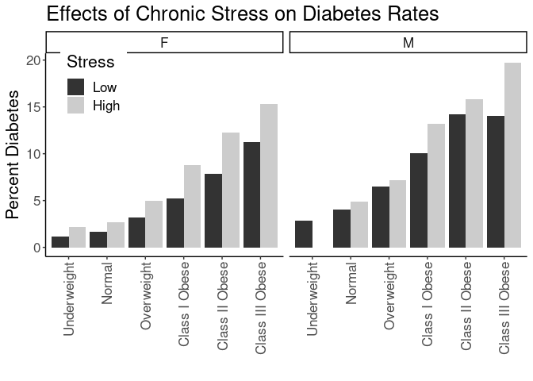
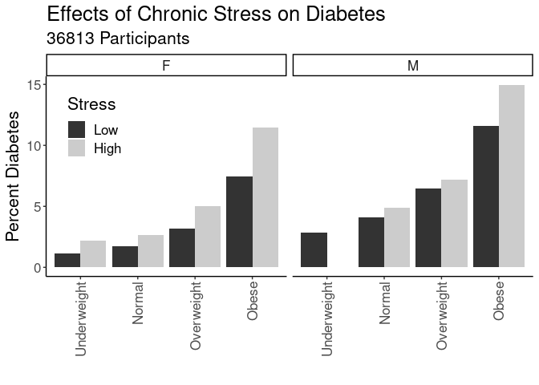

## Purpose

To test the effect modification of obesity on the stress-diabetes complications relationships.


```r
library(knitr)
#figures made will go to directory called figures, will make them as both png and pdf files 
opts_chunk$set(fig.path='figures/',
               echo=TRUE, warning=FALSE, message=FALSE,dev=c('png','pdf'))
options(scipen = 2, digits = 3)

library(readr)
library(dplyr)
```

```
## 
## Attaching package: 'dplyr'
```

```
## The following objects are masked from 'package:stats':
## 
##     filter, lag
```

```
## The following objects are masked from 'package:base':
## 
##     intersect, setdiff, setequal, union
```

```r
library(tidyr)

input.file <- 'data-combined.csv'
combined.data <- read_csv(input.file, na="-99") %>%
  filter(!(is.na(DiabetesComplicated))) %>%
  filter(!(is.na(Stress))) %>%
  filter(Stress!="NA")
```

```
## Rows: 62010 Columns: 39
```

```
## ── Column specification ────────────────────────────────────────────────────────
## Delimiter: ","
## chr (21): DeID_PatientID, Gender, Stress_d1, DeID_EncounterID, affluence13_1...
## dbl (18): age, CardiacArrhythmias, ChronicPulmonaryDisease, CongestiveHeartF...
## 
## ℹ Use `spec()` to retrieve the full column specification for this data.
## ℹ Specify the column types or set `show_col_types = FALSE` to quiet this message.
```

Loaded in the cleaned data from data-combined.csv. This script can be found in /nfs/turbo/precision-health/DataDirect/HUM00219435 - Obesity as a modifier of chronic psy/2023-03-14/2150 - Obesity and Stress - Cohort - DeID - 2023-03-14 and was most recently run on Mon Sep 25 15:04:19 2023. This dataset has 36813 values.


```r
combined.data <- 
  combined.data %>%
  mutate(BMI_cat= factor(BMI_cat, 
                         levels=c("Underweight",
                                  "Normal",
                                  "Overweight",
                                  'Class I Obese',
                                  'Class II Obese',
                                  'Class III Obese'))) %>%
  mutate(BMI_cat.obese= factor(BMI_cat.obese, 
                               levels=c("Underweight",
                                        "Normal",
                                        "Overweight",
                                        'Obese'))) %>%
  mutate(BMI_cat.Ob.NonOb= factor(BMI_cat.Ob.NonOb, 
                                  levels=c("Non-Obese",
                                           'Obese'))) %>%
  mutate(Stress=relevel(as.factor(High.Stress),ref="Low")) #set low as reference value
  
# need to clean race data
```

# Diabetes Complication Rates by BMI

Stratified diagnoses by various BMI categories

## Diabetes by BMI Category


```r
#calculating diabetes rates by bmi category
with(combined.data, table(DiabetesComplicated,BMI_cat,Gender)) %>% 
  data.frame %>%
  pivot_wider(names_from=DiabetesComplicated,
              values_from = Freq) %>%
  rename(DiabetesComplicated=`1`,
         NonDiabetes=`0`) %>%
  mutate(Total=DiabetesComplicated+NonDiabetes) %>%
  mutate(Percent=DiabetesComplicated/Total*100) -> diabetes.bmi.counts

kable(diabetes.bmi.counts, caption="Diabetes with complication rates by BMI category")
```


Table: Diabetes with complication rates by BMI category

|BMI_cat         |Gender | NonDiabetes| DiabetesComplicated| Total| Percent|
|:---------------|:------|-----------:|-------------------:|-----:|-------:|
|Underweight     |F      |         177|                   3|   180|    1.67|
|Normal          |F      |        5350|                 114|  5464|    2.09|
|Overweight      |F      |        5151|                 212|  5363|    3.95|
|Class I Obese   |F      |        3625|                 268|  3893|    6.88|
|Class II Obese  |F      |        2062|                 228|  2290|    9.96|
|Class III Obese |F      |        1840|                 281|  2121|   13.25|
|Underweight     |M      |          83|                   1|    84|    1.19|
|Normal          |M      |        3373|                 155|  3528|    4.39|
|Overweight      |M      |        6119|                 443|  6562|    6.75|
|Class I Obese   |M      |        3883|                 495|  4378|   11.31|
|Class II Obese  |M      |        1566|                 274|  1840|   14.89|
|Class III Obese |M      |         822|                 165|   987|   16.72|

```r
library(ggplot2)

ggplot(diabetes.bmi.counts,
       aes(y=Percent,
           x=BMI_cat)) +
  geom_bar(stat='identity',position='dodge') +
  labs(y="Percent Complicated Diabetes",
       title="Effects of Chronic Stress on Complicated Diabetes Rates",
       x="") +
  theme_classic() +
  scale_fill_grey() +
  facet_grid(.~Gender) +
  theme(text=element_text(size=16),
        axis.text.x=element_text(angle=90,vjust=0.5,hjust=1),
        legend.position = c(0.1,0.85))
```

<!-- -->

## Diabetes Rate by BMI and Stress

This analysis uses all the BMI categories


```r
#calculating diabetes rates by bmi category and stress
with(combined.data, table(DiabetesComplicated,BMI_cat,Stress,Gender)) %>% 
  data.frame %>%
  pivot_wider(names_from=DiabetesComplicated,
              values_from = Freq) %>%
  rename(DiabetesComplicated=`1`,
         NonDiabetes=`0`) %>%
  mutate(Total=DiabetesComplicated+NonDiabetes) %>%
  mutate(Percent=DiabetesComplicated/Total*100) -> diabetes.bmi.stress.counts

library(ggplot2)

kable(diabetes.bmi.stress.counts, caption="Diabetes with complications rates by BMI category")
```


Table: Diabetes with complications rates by BMI category

|BMI_cat         |Stress |Gender | NonDiabetes| DiabetesComplicated| Total| Percent|
|:---------------|:------|:------|-----------:|-------------------:|-----:|-------:|
|Underweight     |Low    |F      |          88|                   1|    89|    1.12|
|Normal          |Low    |F      |        3177|                  55|  3232|    1.70|
|Overweight      |Low    |F      |        2982|                  98|  3080|    3.18|
|Class I Obese   |Low    |F      |        1958|                 108|  2066|    5.23|
|Class II Obese  |Low    |F      |        1121|                  96|  1217|    7.89|
|Class III Obese |Low    |F      |         949|                 120|  1069|   11.22|
|Underweight     |High   |F      |          89|                   2|    91|    2.20|
|Normal          |High   |F      |        2173|                  59|  2232|    2.64|
|Overweight      |High   |F      |        2169|                 114|  2283|    4.99|
|Class I Obese   |High   |F      |        1667|                 160|  1827|    8.76|
|Class II Obese  |High   |F      |         941|                 132|  1073|   12.30|
|Class III Obese |High   |F      |         891|                 161|  1052|   15.30|
|Underweight     |Low    |M      |          34|                   1|    35|    2.86|
|Normal          |Low    |M      |        2029|                  86|  2115|    4.07|
|Overweight      |Low    |M      |        3832|                 266|  4098|    6.49|
|Class I Obese   |Low    |M      |        2375|                 265|  2640|   10.04|
|Class II Obese  |Low    |M      |         900|                 149|  1049|   14.20|
|Class III Obese |Low    |M      |         452|                  74|   526|   14.07|
|Underweight     |High   |M      |          49|                   0|    49|    0.00|
|Normal          |High   |M      |        1344|                  69|  1413|    4.88|
|Overweight      |High   |M      |        2287|                 177|  2464|    7.18|
|Class I Obese   |High   |M      |        1508|                 230|  1738|   13.23|
|Class II Obese  |High   |M      |         666|                 125|   791|   15.80|
|Class III Obese |High   |M      |         370|                  91|   461|   19.74|

```r
ggplot(diabetes.bmi.stress.counts,
       aes(y=Percent,
           x=BMI_cat,
           fill=Stress)) +
  geom_bar(stat='identity',position='dodge') +
  labs(y="Percent Diabetes",
       title="Effects of Chronic Stress on Diabetes Rates",
       x="") +
  theme_classic() +
  scale_fill_grey() +
  facet_grid(.~Gender) +
  theme(text=element_text(size=16),
        axis.text.x=element_text(angle=90,vjust=0.5,hjust=1),
        legend.position = c(0.1,0.85))
```

<!-- -->

### Logistic Regressions for All Obese Categories

Ran a series of stepwise logistic regressions testing for obesity as a modifier of the effects of stress.


```r
library(broom)
glm(DiabetesComplicated~BMI_cat, 
    family="binomial",
    data=combined.data) -> obesity.glm1

obesity.glm1 %>%
  tidy() %>%
  kable(caption="Logistic regression of obesity on diabetes", digits =c(0,2,3,2,99))
```


Table: Logistic regression of obesity on diabetes

|term                   | estimate| std.error| statistic|  p.value|
|:----------------------|--------:|---------:|---------:|--------:|
|(Intercept)            |    -4.17|     0.504|     -8.29| 1.15e-16|
|BMI_catNormal          |     0.70|     0.507|      1.37| 1.71e-01|
|BMI_catOverweight      |     1.33|     0.505|      2.63| 8.52e-03|
|BMI_catClass I Obese   |     1.89|     0.505|      3.74| 1.86e-04|
|BMI_catClass II Obese  |     2.20|     0.506|      4.34| 1.41e-05|
|BMI_catClass III Obese |     2.39|     0.506|      4.72| 2.39e-06|

```r
anova(obesity.glm1,test="Chisq") %>% tidy %>%
  kable(caption="Logistic regression of obesity on diabetes, ", digits =c(0,0,0,0,0,99))
```


Table: Logistic regression of obesity on diabetes, 

|term    | df| deviance| df.residual| residual.deviance| p.value|
|:-------|--:|--------:|-----------:|-----------------:|-------:|
|NULL    | NA|       NA|       36689|             18976|      NA|
|BMI_cat |  5|      739|       36684|             18237|       0|

```r
#adding in stress as a modifier
glm(DiabetesComplicated~BMI_cat+Stress+Stress:BMI_cat, 
    family="binomial",
    data=combined.data) -> obesity.glm2

obesity.glm2 %>%
  tidy() %>%
  kable(caption="Logistic regression of obesity on diabetes, with stress as a modifier", digits =c(0,2,3,2,99))
```


Table: Logistic regression of obesity on diabetes, with stress as a modifier

|term                              | estimate| std.error| statistic|  p.value|
|:---------------------------------|--------:|---------:|---------:|--------:|
|(Intercept)                       |    -4.11|     0.713|     -5.77| 8.02e-09|
|BMI_catNormal                     |     0.50|     0.718|      0.70| 4.84e-01|
|BMI_catOverweight                 |     1.18|     0.715|      1.65| 9.84e-02|
|BMI_catClass I Obese              |     1.66|     0.715|      2.32| 2.03e-02|
|BMI_catClass II Obese             |     2.00|     0.716|      2.79| 5.19e-03|
|BMI_catClass III Obese            |     2.13|     0.717|      2.98| 2.91e-03|
|StressHigh                        |    -0.12|     1.007|     -0.12| 9.03e-01|
|BMI_catNormal:StressHigh          |     0.42|     1.015|      0.41| 6.80e-01|
|BMI_catOverweight:StressHigh      |     0.32|     1.011|      0.32| 7.48e-01|
|BMI_catClass I Obese:StressHigh   |     0.48|     1.010|      0.47| 6.36e-01|
|BMI_catClass II Obese:StressHigh  |     0.40|     1.012|      0.40| 6.92e-01|
|BMI_catClass III Obese:StressHigh |     0.49|     1.013|      0.48| 6.28e-01|

```r
anova(obesity.glm2,test="Chisq") %>% tidy %>%
  kable(caption="Logistic regression of obese vs non-obese on diabetes, with stress as a modifier", digits =c(0,0,0,0,0,99))
```


Table: Logistic regression of obese vs non-obese on diabetes, with stress as a modifier

|term           | df| deviance| df.residual| residual.deviance|  p.value|
|:--------------|--:|--------:|-----------:|-----------------:|--------:|
|NULL           | NA|       NA|       36689|             18976|       NA|
|BMI_cat        |  5|      739|       36684|             18237| 0.00e+00|
|Stress         |  1|       52|       36683|             18185| 5.34e-13|
|BMI_cat:Stress |  5|        3|       36678|             18182| 7.49e-01|

```r
#adding in age and gender as covariates as a modifier
glm(DiabetesComplicated~BMI_cat+Stress+Stress:BMI_cat+Gender+age, 
    family="binomial",
    data=combined.data) -> obesity.glm3

obesity.glm3 %>%
  tidy() %>%
  kable(caption="Logistic regression of obesity on diabetes, with stress as a modifier and age and  gender as covarites", digits =c(0,2,3,2,99))
```


Table: Logistic regression of obesity on diabetes, with stress as a modifier and age and  gender as covarites

|term                              | estimate| std.error| statistic|  p.value|
|:---------------------------------|--------:|---------:|---------:|--------:|
|(Intercept)                       |    -6.09|     0.721|     -8.46| 2.75e-17|
|BMI_catNormal                     |     0.39|     0.720|      0.54| 5.88e-01|
|BMI_catOverweight                 |     0.86|     0.717|      1.21| 2.28e-01|
|BMI_catClass I Obese              |     1.36|     0.717|      1.90| 5.71e-02|
|BMI_catClass II Obese             |     1.81|     0.718|      2.52| 1.16e-02|
|BMI_catClass III Obese            |     2.11|     0.719|      2.94| 3.29e-03|
|StressHigh                        |    -0.09|     1.010|     -0.09| 9.30e-01|
|GenderM                           |     0.41|     0.043|      9.62| 6.67e-22|
|age                               |     0.03|     0.001|     22.86| 0.00e+00|
|BMI_catNormal:StressHigh          |     0.44|     1.018|      0.44| 6.62e-01|
|BMI_catOverweight:StressHigh      |     0.39|     1.014|      0.38| 7.03e-01|
|BMI_catClass I Obese:StressHigh   |     0.54|     1.013|      0.54| 5.92e-01|
|BMI_catClass II Obese:StressHigh  |     0.45|     1.015|      0.44| 6.59e-01|
|BMI_catClass III Obese:StressHigh |     0.55|     1.016|      0.54| 5.86e-01|

```r
anova(obesity.glm3,test="Chisq") %>% tidy %>%
  kable(caption="Logistic regression of obesity on diabetes, with stress as a modifier and age and gender as covarite", digits =c(0,0,0,0,0,99))
```


Table: Logistic regression of obesity on diabetes, with stress as a modifier and age and gender as covarite

|term           | df| deviance| df.residual| residual.deviance|  p.value|
|:--------------|--:|--------:|-----------:|-----------------:|--------:|
|NULL           | NA|       NA|       36689|             18976|       NA|
|BMI_cat        |  5|      739|       36684|             18237| 0.00e+00|
|Stress         |  1|       52|       36683|             18185| 5.34e-13|
|Gender         |  1|      161|       36682|             18024| 7.65e-37|
|age            |  1|      577|       36681|             17447| 0.00e+00|
|BMI_cat:Stress |  5|        3|       36676|             17445| 7.24e-01|

```r
#adding in race and ethnicity
glm(DiabetesComplicated~BMI_cat+Stress+Stress:BMI_cat+Gender+age+Race.Ethnicity, 
    family="binomial",
    data=combined.data) -> obesity.glm4

obesity.glm4 %>%
  tidy() %>%
  kable(caption="Logistic regression of obesity on diabetes, with stress as a modifier and age, gender and race as covarites", digits =c(0,2,3,2,99))
```


Table: Logistic regression of obesity on diabetes, with stress as a modifier and age, gender and race as covarites

|term                              | estimate| std.error| statistic|  p.value|
|:---------------------------------|--------:|---------:|---------:|--------:|
|(Intercept)                       |    -5.92|     0.750|     -7.90| 2.84e-15|
|BMI_catNormal                     |     0.37|     0.720|      0.52| 6.06e-01|
|BMI_catOverweight                 |     0.84|     0.717|      1.17| 2.41e-01|
|BMI_catClass I Obese              |     1.34|     0.717|      1.86| 6.26e-02|
|BMI_catClass II Obese             |     1.78|     0.719|      2.48| 1.30e-02|
|BMI_catClass III Obese            |     2.08|     0.720|      2.89| 3.91e-03|
|StressHigh                        |    -0.11|     1.010|     -0.11| 9.16e-01|
|GenderM                           |     0.42|     0.043|      9.86| 6.33e-23|
|age                               |     0.04|     0.002|     23.50| 0.00e+00|
|Race.EthnicityBlack               |     0.37|     0.236|      1.57| 1.15e-01|
|Race.EthnicityHispanic/Latino     |     0.20|     0.263|      0.75| 4.52e-01|
|Race.EthnicityOther               |    -0.40|     0.255|     -1.57| 1.16e-01|
|Race.EthnicityWhite               |    -0.28|     0.224|     -1.25| 2.12e-01|
|BMI_catNormal:StressHigh          |     0.46|     1.018|      0.45| 6.52e-01|
|BMI_catOverweight:StressHigh      |     0.40|     1.014|      0.39| 6.96e-01|
|BMI_catClass I Obese:StressHigh   |     0.55|     1.013|      0.55| 5.85e-01|
|BMI_catClass II Obese:StressHigh  |     0.46|     1.015|      0.45| 6.51e-01|
|BMI_catClass III Obese:StressHigh |     0.57|     1.016|      0.56| 5.74e-01|

```r
anova(obesity.glm4,test="Chisq") %>% tidy %>%
  kable(caption="Logistic regression of obesity on diabetes, with stress as a modifier and age, gender and race as covarite", digits =c(0,0,0,0,0,99))
```


Table: Logistic regression of obesity on diabetes, with stress as a modifier and age, gender and race as covarite

|term           | df| deviance| df.residual| residual.deviance|  p.value|
|:--------------|--:|--------:|-----------:|-----------------:|--------:|
|NULL           | NA|       NA|       36689|             18976|       NA|
|BMI_cat        |  5|      739|       36684|             18237| 0.00e+00|
|Stress         |  1|       52|       36683|             18185| 5.34e-13|
|Gender         |  1|      161|       36682|             18024| 7.65e-37|
|age            |  1|      577|       36681|             17447| 0.00e+00|
|Race.Ethnicity |  4|       65|       36677|             17382| 2.59e-13|
|BMI_cat:Stress |  5|        3|       36672|             17379| 7.00e-01|

### Diabetes Rates by Quartiles


```r
with(combined.data, table(DiabetesComplicated,BMI_cat.obese,Stress.quartile,Gender)) %>% 
  data.frame %>%
  pivot_wider(names_from=DiabetesComplicated,
              values_from = Freq) %>%
  rename(Diabetes=`1`,
         NonDiabetes=`0`) %>%
  mutate(Total=Diabetes+NonDiabetes) %>%
  mutate(Percent=Diabetes/Total*100) -> diabetes.bmi.stress.quartile.counts

kable(diabetes.bmi.stress.quartile.counts, caption="Diabetes Rates by BMI and Stress Quartile")
```


Table: Diabetes Rates by BMI and Stress Quartile

|BMI_cat.obese |Stress.quartile |Gender | NonDiabetes| Diabetes| Total| Percent|
|:-------------|:---------------|:------|-----------:|--------:|-----:|-------:|
|Underweight   |(-0.016,4]      |F      |          68|        1|    69|    1.45|
|Normal        |(-0.016,4]      |F      |        2657|       45|  2702|    1.67|
|Overweight    |(-0.016,4]      |F      |        2500|       80|  2580|    3.10|
|Obese         |(-0.016,4]      |F      |        3358|      261|  3619|    7.21|
|Underweight   |(12,16]         |F      |           2|        0|     2|    0.00|
|Normal        |(12,16]         |F      |          72|        2|    74|    2.70|
|Overweight    |(12,16]         |F      |          66|        6|    72|    8.33|
|Obese         |(12,16]         |F      |         118|       15|   133|   11.28|
|Underweight   |(4,8]           |F      |          76|        2|    78|    2.56|
|Normal        |(4,8]           |F      |        2025|       55|  2080|    2.64|
|Overweight    |(4,8]           |F      |        1977|       97|  2074|    4.68|
|Obese         |(4,8]           |F      |        3010|      350|  3360|   10.42|
|Underweight   |(8,12]          |F      |          31|        0|    31|    0.00|
|Normal        |(8,12]          |F      |         596|       12|   608|    1.97|
|Overweight    |(8,12]          |F      |         608|       29|   637|    4.55|
|Obese         |(8,12]          |F      |        1041|      151|  1192|   12.67|
|Underweight   |(-0.016,4]      |M      |          24|        1|    25|    4.00|
|Normal        |(-0.016,4]      |M      |        1744|       78|  1822|    4.28|
|Overweight    |(-0.016,4]      |M      |        3312|      217|  3529|    6.15|
|Obese         |(-0.016,4]      |M      |        3182|      412|  3594|   11.46|
|Underweight   |(12,16]         |M      |           2|        0|     2|    0.00|
|Normal        |(12,16]         |M      |          40|        3|    43|    6.98|
|Overweight    |(12,16]         |M      |          45|        5|    50|   10.00|
|Obese         |(12,16]         |M      |          68|       17|    85|   20.00|
|Underweight   |(4,8]           |M      |          44|        0|    44|    0.00|
|Normal        |(4,8]           |M      |        1266|       56|  1322|    4.24|
|Overweight    |(4,8]           |M      |        2274|      176|  2450|    7.18|
|Obese         |(4,8]           |M      |        2402|      391|  2793|   14.00|
|Underweight   |(8,12]          |M      |          13|        0|    13|    0.00|
|Normal        |(8,12]          |M      |         323|       18|   341|    5.28|
|Overweight    |(8,12]          |M      |         488|       45|   533|    8.44|
|Obese         |(8,12]          |M      |         619|      114|   733|   15.55|

```r
ggplot(diabetes.bmi.stress.quartile.counts,
       aes(y=Percent,
           x=BMI_cat.obese,
           fill=Stress.quartile)) +
  geom_bar(stat='identity',position='dodge') +
  labs(y="Percent Diabetes",
       title="Effects of Chronic Stress on Diabetes",
       subtitle=paste(c(length(combined.data$DeID_PatientID), "Participants"), collapse=" "),
       x="") +
  theme_classic() +
  facet_grid(.~Gender) +
  theme(text=element_text(size=16),
        axis.text.x=element_text(angle=90,vjust=0.5,hjust=1),
        legend.position = c(0.15,0.75))
```

<!-- -->

## Diabetes Rates by Normal Obesity and Stress


```r
#calculating diabetes rates by bmi category, stress and gender
with(combined.data, table(DiabetesComplicated,BMI_cat.obese,Stress,Gender)) %>% 
  data.frame %>%
  pivot_wider(names_from=DiabetesComplicated,
              values_from = Freq) %>%
  rename(Diabetes=`1`,
         NonDiabetes=`0`) %>%
  mutate(Total=Diabetes+NonDiabetes) %>%
  mutate(Percent=Diabetes/Total*100) -> diabetes.bmi.stress.gender.counts

kable(diabetes.bmi.stress.gender.counts, caption="Diabetes Rates by BMI and Stress")
```


Table: Diabetes Rates by BMI and Stress

|BMI_cat.obese |Stress |Gender | NonDiabetes| Diabetes| Total| Percent|
|:-------------|:------|:------|-----------:|--------:|-----:|-------:|
|Underweight   |Low    |F      |          88|        1|    89|    1.12|
|Normal        |Low    |F      |        3177|       55|  3232|    1.70|
|Overweight    |Low    |F      |        2982|       98|  3080|    3.18|
|Obese         |Low    |F      |        4028|      324|  4352|    7.45|
|Underweight   |High   |F      |          89|        2|    91|    2.20|
|Normal        |High   |F      |        2173|       59|  2232|    2.64|
|Overweight    |High   |F      |        2169|      114|  2283|    4.99|
|Obese         |High   |F      |        3499|      453|  3952|   11.46|
|Underweight   |Low    |M      |          34|        1|    35|    2.86|
|Normal        |Low    |M      |        2029|       86|  2115|    4.07|
|Overweight    |Low    |M      |        3832|      266|  4098|    6.49|
|Obese         |Low    |M      |        3727|      488|  4215|   11.58|
|Underweight   |High   |M      |          49|        0|    49|    0.00|
|Normal        |High   |M      |        1344|       69|  1413|    4.88|
|Overweight    |High   |M      |        2287|      177|  2464|    7.18|
|Obese         |High   |M      |        2544|      446|  2990|   14.92|

```r
ggplot(diabetes.bmi.stress.gender.counts,
       aes(y=Percent,
           x=BMI_cat.obese,
           fill=Stress)) +
  geom_bar(stat='identity',position='dodge') +
  labs(y="Percent Diabetes",
       title="Effects of Chronic Stress on Diabetes",
       subtitle=paste(c(length(combined.data$DeID_PatientID), "Participants"), collapse=" "),
       x="") +
  facet_grid(.~Gender) +
  theme_classic() +
  scale_fill_grey() +
  theme(text=element_text(size=16),
        axis.text.x=element_text(angle=90,vjust=0.5,hjust=1),
        legend.position = c(0.1,0.75))
```

<!-- -->

## Logistic Regressions for Obese/Non-Obese

Ran a series of logistic regressions using the normal obesity categories not classes as the categorization


```r
glm(DiabetesComplicated~BMI_cat.obese, 
    family="binomial",
    data=combined.data) -> obesity.glm1

obesity.glm1 %>%
  tidy() %>%
  kable(caption="Logistic regression of obese vs non-obese on diabetes", digits =c(0,2,3,2,99))
```


Table: Logistic regression of obese vs non-obese on diabetes

|term                    | estimate| std.error| statistic|  p.value|
|:-----------------------|--------:|---------:|---------:|--------:|
|(Intercept)             |    -4.17|     0.504|     -8.29| 1.15e-16|
|BMI_cat.obeseNormal     |     0.70|     0.507|      1.37| 1.71e-01|
|BMI_cat.obeseOverweight |     1.33|     0.505|      2.63| 8.52e-03|
|BMI_cat.obeseObese      |     2.09|     0.504|      4.14| 3.50e-05|

```r
anova(obesity.glm1,test="Chisq") %>% tidy %>%
  kable(caption="Logistic regression of obesity on diabetes, ", digits =c(0,0,0,0,0,99))
```


Table: Logistic regression of obesity on diabetes, 

|term          | df| deviance| df.residual| residual.deviance| p.value|
|:-------------|--:|--------:|-----------:|-----------------:|-------:|
|NULL          | NA|       NA|       36689|             18976|      NA|
|BMI_cat.obese |  3|      673|       36686|             18303|       0|

```r
#adding in stress as a modifier
glm(DiabetesComplicated~BMI_cat.obese+Stress+Stress:BMI_cat.obese, 
    family="binomial",
    data=combined.data) -> obesity.glm2

obesity.glm2 %>%
  tidy() %>%
  kable(caption="Logistic regression of obesity on diabetes, with stress as a modifier", digits =c(0,2,3,2,99))
```


Table: Logistic regression of obesity on diabetes, with stress as a modifier

|term                               | estimate| std.error| statistic|  p.value|
|:----------------------------------|--------:|---------:|---------:|--------:|
|(Intercept)                        |    -4.11|     0.713|     -5.77| 8.02e-09|
|BMI_cat.obeseNormal                |     0.50|     0.718|      0.70| 4.84e-01|
|BMI_cat.obeseOverweight            |     1.18|     0.715|      1.65| 9.84e-02|
|BMI_cat.obeseObese                 |     1.85|     0.714|      2.60| 9.37e-03|
|StressHigh                         |    -0.12|     1.007|     -0.12| 9.03e-01|
|BMI_cat.obeseNormal:StressHigh     |     0.42|     1.015|      0.41| 6.80e-01|
|BMI_cat.obeseOverweight:StressHigh |     0.32|     1.011|      0.32| 7.48e-01|
|BMI_cat.obeseObese:StressHigh      |     0.47|     1.009|      0.47| 6.38e-01|

```r
anova(obesity.glm2,test="Chisq") %>% tidy %>%
  kable(caption="Logistic regression of obesity on diabetes, with stress as a modifier", digits =c(0,0,0,0,0,99))
```


Table: Logistic regression of obesity on diabetes, with stress as a modifier

|term                 | df| deviance| df.residual| residual.deviance|  p.value|
|:--------------------|--:|--------:|-----------:|-----------------:|--------:|
|NULL                 | NA|       NA|       36689|             18976|       NA|
|BMI_cat.obese        |  3|      673|       36686|             18303| 0.00e+00|
|Stress               |  1|       56|       36685|             18247| 7.56e-14|
|BMI_cat.obese:Stress |  3|        3|       36682|             18245| 4.48e-01|

```r
#adding in age and gender as covariates as a modifier
glm(DiabetesComplicated~BMI_cat.obese+Stress+Stress:BMI_cat.obese+Gender+age, 
    family="binomial",
    data=combined.data) -> obesity.glm3

obesity.glm3 %>%
  tidy() %>%
  kable(caption="Logistic regression of obesity on diabetes, with stress as a modifier and age and  gender as covarites", digits =c(0,2,3,2,99))
```


Table: Logistic regression of obesity on diabetes, with stress as a modifier and age and  gender as covarites

|term                               | estimate| std.error| statistic|  p.value|
|:----------------------------------|--------:|---------:|---------:|--------:|
|(Intercept)                        |    -5.97|     0.720|     -8.29| 1.11e-16|
|BMI_cat.obeseNormal                |     0.40|     0.720|      0.56| 5.75e-01|
|BMI_cat.obeseOverweight            |     0.89|     0.717|      1.24| 2.13e-01|
|BMI_cat.obeseObese                 |     1.65|     0.716|      2.31| 2.08e-02|
|StressHigh                         |    -0.09|     1.010|     -0.09| 9.31e-01|
|GenderM                            |     0.35|     0.042|      8.30| 1.03e-16|
|age                                |     0.03|     0.001|     22.05| 0.00e+00|
|BMI_cat.obeseNormal:StressHigh     |     0.44|     1.018|      0.43| 6.65e-01|
|BMI_cat.obeseOverweight:StressHigh |     0.38|     1.013|      0.37| 7.08e-01|
|BMI_cat.obeseObese:StressHigh      |     0.53|     1.011|      0.53| 5.98e-01|

```r
anova(obesity.glm3,test="Chisq") %>% tidy %>%
  kable(caption="Logistic regression of obesity on diabetes, with stress as a modifier and age and gender as covarite", digits =c(0,0,0,0,0,99))
```


Table: Logistic regression of obesity on diabetes, with stress as a modifier and age and gender as covarite

|term                 | df| deviance| df.residual| residual.deviance|  p.value|
|:--------------------|--:|--------:|-----------:|-----------------:|--------:|
|NULL                 | NA|       NA|       36689|             18976|       NA|
|BMI_cat.obese        |  3|      673|       36686|             18303| 0.00e+00|
|Stress               |  1|       56|       36685|             18247| 7.56e-14|
|Gender               |  1|      133|       36684|             18114| 8.69e-31|
|age                  |  1|      532|       36683|             17582| 0.00e+00|
|BMI_cat.obese:Stress |  3|        3|       36680|             17579| 4.04e-01|

```r
#adding in race and ethnicity
glm(DiabetesComplicated~BMI_cat.obese+Stress+Stress:BMI_cat.obese+Gender+age+Race.Ethnicity, 
    family="binomial",
    data=combined.data) -> obesity.glm4

obesity.glm4 %>%
  tidy() %>%
  kable(caption="Logistic regression of obesity on diabetes, with stress as a modifier and age, gender and race as covarites", digits =c(0,2,3,2,99))
```


Table: Logistic regression of obesity on diabetes, with stress as a modifier and age, gender and race as covarites

|term                               | estimate| std.error| statistic|  p.value|
|:----------------------------------|--------:|---------:|---------:|--------:|
|(Intercept)                        |    -5.86|     0.749|     -7.82| 5.41e-15|
|BMI_cat.obeseNormal                |     0.38|     0.720|      0.53| 5.94e-01|
|BMI_cat.obeseOverweight            |     0.87|     0.717|      1.21| 2.27e-01|
|BMI_cat.obeseObese                 |     1.62|     0.716|      2.26| 2.36e-02|
|StressHigh                         |    -0.11|     1.010|     -0.11| 9.15e-01|
|GenderM                            |     0.36|     0.042|      8.55| 1.20e-17|
|age                                |     0.03|     0.001|     22.70| 0.00e+00|
|Race.EthnicityBlack                |     0.45|     0.236|      1.93| 5.42e-02|
|Race.EthnicityHispanic/Latino      |     0.24|     0.262|      0.93| 3.50e-01|
|Race.EthnicityOther                |    -0.33|     0.255|     -1.28| 1.99e-01|
|Race.EthnicityWhite                |    -0.22|     0.224|     -0.97| 3.30e-01|
|BMI_cat.obeseNormal:StressHigh     |     0.46|     1.018|      0.45| 6.55e-01|
|BMI_cat.obeseOverweight:StressHigh |     0.39|     1.013|      0.38| 7.01e-01|
|BMI_cat.obeseObese:StressHigh      |     0.55|     1.012|      0.54| 5.88e-01|

```r
anova(obesity.glm4,test="Chisq") %>% tidy %>%
  kable(caption="Logistic regression of obesity on diabetes, with stress as a modifier and age, gender and race as covariates", digits =c(0,0,0,0,0,99))
```


Table: Logistic regression of obesity on diabetes, with stress as a modifier and age, gender and race as covariates

|term                 | df| deviance| df.residual| residual.deviance|  p.value|
|:--------------------|--:|--------:|-----------:|-----------------:|--------:|
|NULL                 | NA|       NA|       36689|             18976|       NA|
|BMI_cat.obese        |  3|      673|       36686|             18303| 0.00e+00|
|Stress               |  1|       56|       36685|             18247| 7.56e-14|
|Gender               |  1|      133|       36684|             18114| 8.69e-31|
|age                  |  1|      532|       36683|             17582| 0.00e+00|
|Race.Ethnicity       |  4|       67|       36679|             17514| 8.20e-14|
|BMI_cat.obese:Stress |  3|        3|       36676|             17511| 3.85e-01|

# Diabetes Rates by Obese/Not Obese and Stress


```r
with(combined.data, table(DiabetesComplicated,BMI_cat.Ob.NonOb,Stress,Gender)) %>% 
  data.frame %>%
  pivot_wider(names_from=DiabetesComplicated,
              values_from = Freq) %>%
  rename(Diabetes=`1`,
         NonDiabetes=`0`) %>%
  mutate(Total=Diabetes+NonDiabetes) %>%
  mutate(Percent=Diabetes/Total*100) -> diabetes.BMI_cat.Ob.NonOb.stress.counts

kable(diabetes.BMI_cat.Ob.NonOb.stress.counts, caption="Diabetes Rates by Obese or not and Stress")
```


Table: Diabetes Rates by Obese or not and Stress

|BMI_cat.Ob.NonOb |Stress |Gender | NonDiabetes| Diabetes| Total| Percent|
|:----------------|:------|:------|-----------:|--------:|-----:|-------:|
|Non-Obese        |Low    |F      |        6294|      156|  6450|    2.42|
|Obese            |Low    |F      |        4028|      324|  4352|    7.45|
|Non-Obese        |High   |F      |        4467|      175|  4642|    3.77|
|Obese            |High   |F      |        3499|      453|  3952|   11.46|
|Non-Obese        |Low    |M      |        5912|      353|  6265|    5.63|
|Obese            |Low    |M      |        3727|      488|  4215|   11.58|
|Non-Obese        |High   |M      |        3700|      247|  3947|    6.26|
|Obese            |High   |M      |        2544|      446|  2990|   14.92|

```r
ggplot(diabetes.BMI_cat.Ob.NonOb.stress.counts,
       aes(y=Percent,
           x=BMI_cat.Ob.NonOb,
           fill=Stress)) +
  geom_bar(stat='identity',position='dodge') +
  labs(y="Percent Diabetes",
       title="Effects of Chronic Stress on Diabetes",
       subtitle=paste(c(length(combined.data$DeID_PatientID), "Participants"), collapse=" "),
       x="") +
  facet_grid(.~Gender) +
  theme_classic() +
  scale_fill_grey() +
  theme(text=element_text(size=16),
        axis.text.x=element_text(angle=90,vjust=0.5,hjust=1),
        legend.position = c(0.1,0.75))
```

<!-- -->

## Logistic Regressions for Obese/Non-Obese

Ran a series of logistic regressions using obese/non-obese as the categorization


```r
glm(DiabetesComplicated~BMI_cat.Ob.NonOb, 
    family="binomial",
    data=combined.data) -> obesity.glm1

obesity.glm1 %>%
  tidy() %>%
  kable(caption="Logistic regression of obese vs non-obese on diabetes", digits =c(0,2,3,2,99))
```


Table: Logistic regression of obese vs non-obese on diabetes

|term                  | estimate| std.error| statistic| p.value|
|:---------------------|--------:|---------:|---------:|-------:|
|(Intercept)           |    -3.09|     0.034|     -92.1|       0|
|BMI_cat.Ob.NonObObese |     1.00|     0.042|      23.7|       0|

```r
anova(obesity.glm1,test="Chisq") %>% tidy %>%
  kable(caption="Logistic regression of obese vs non-obese on diabetes, ", digits =c(0,0,0,0,0,99))
```


Table: Logistic regression of obese vs non-obese on diabetes, 

|term             | df| deviance| df.residual| residual.deviance| p.value|
|:----------------|--:|--------:|-----------:|-----------------:|-------:|
|NULL             | NA|       NA|       36812|             19009|      NA|
|BMI_cat.Ob.NonOb |  1|      591|       36811|             18419|       0|

```r
#adding in stress as a modifier
glm(DiabetesComplicated~BMI_cat.Ob.NonOb+Stress+Stress:BMI_cat.Ob.NonOb, 
    family="binomial",
    data=combined.data) -> obesity.glm2

obesity.glm2 %>%
  tidy() %>%
  kable(caption="Logistic regression of obese vs non-obese on diabetes, with stress as a modifier", digits =c(0,2,3,2,99))
```


Table: Logistic regression of obese vs non-obese on diabetes, with stress as a modifier

|term                             | estimate| std.error| statistic|  p.value|
|:--------------------------------|--------:|---------:|---------:|--------:|
|(Intercept)                      |    -3.18|     0.045|    -70.25| 0.00e+00|
|BMI_cat.Ob.NonObObese            |     0.92|     0.058|     15.78| 4.62e-56|
|StressHigh                       |     0.21|     0.067|      3.18| 1.46e-03|
|BMI_cat.Ob.NonObObese:StressHigh |     0.14|     0.085|      1.62| 1.06e-01|

```r
anova(obesity.glm2,test="Chisq") %>% tidy %>%
  kable(caption="Logistic regression of obese vs non-obese on diabetes, with stress as a modifier", digits =c(0,0,0,0,0,99))
```


Table: Logistic regression of obese vs non-obese on diabetes, with stress as a modifier

|term                    | df| deviance| df.residual| residual.deviance|  p.value|
|:-----------------------|--:|--------:|-----------:|-----------------:|--------:|
|NULL                    | NA|       NA|       36812|             19009|       NA|
|BMI_cat.Ob.NonOb        |  1|      591|       36811|             18419| 0.00e+00|
|Stress                  |  1|       54|       36810|             18364| 1.76e-13|
|BMI_cat.Ob.NonOb:Stress |  1|        3|       36809|             18362| 1.06e-01|

```r
#adding in age and gender as covariates as a modifier
glm(DiabetesComplicated~BMI_cat.Ob.NonOb+Stress+Stress:BMI_cat.Ob.NonOb+Gender+age, 
    family="binomial",
    data=combined.data) -> obesity.glm3

obesity.glm3 %>%
  tidy() %>%
  kable(caption="Logistic regression of obese vs non-obese on diabetes, with stress as a modifier and age and  gender as covarites", digits =c(0,2,3,2,99))
```


Table: Logistic regression of obese vs non-obese on diabetes, with stress as a modifier and age and  gender as covarites

|term                             | estimate| std.error| statistic|  p.value|
|:--------------------------------|--------:|---------:|---------:|--------:|
|(Intercept)                      |    -5.28|     0.102|    -51.94| 0.00e+00|
|BMI_cat.Ob.NonObObese            |     0.93|     0.059|     15.78| 4.53e-56|
|StressHigh                       |     0.29|     0.068|      4.33| 1.49e-05|
|GenderM                          |     0.38|     0.042|      8.98| 2.80e-19|
|age                              |     0.03|     0.001|     22.41| 0.00e+00|
|BMI_cat.Ob.NonObObese:StressHigh |     0.15|     0.086|      1.80| 7.12e-02|

```r
anova(obesity.glm3,test="Chisq") %>% tidy %>%
  kable(caption="Logistic regression of obese vs non-obese on diabetes, with stress as a modifier and age and gender as covarite", digits =c(0,0,0,0,0,99))
```


Table: Logistic regression of obese vs non-obese on diabetes, with stress as a modifier and age and gender as covarite

|term                    | df| deviance| df.residual| residual.deviance|  p.value|
|:-----------------------|--:|--------:|-----------:|-----------------:|--------:|
|NULL                    | NA|       NA|       36812|             19009|       NA|
|BMI_cat.Ob.NonOb        |  1|      591|       36811|             18419| 0.00e+00|
|Stress                  |  1|       54|       36810|             18364| 1.76e-13|
|Gender                  |  1|      152|       36809|             18212| 4.94e-35|
|age                     |  1|      552|       36808|             17660| 0.00e+00|
|BMI_cat.Ob.NonOb:Stress |  1|        3|       36807|             17657| 7.10e-02|

```r
#adding in race and ethnicity
glm(DiabetesComplicated~BMI_cat.Ob.NonOb+Stress+Stress:BMI_cat.Ob.NonOb+Gender+age+Race.Ethnicity, 
    family="binomial",
    data=combined.data) -> obesity.glm4

obesity.glm4 %>%
  tidy() %>%
  kable(caption="Logistic regression of obese vs non-obese on diabetes, with stress as a modifier and age, gender and race as covarites", digits =c(0,2,3,2,99))
```


Table: Logistic regression of obese vs non-obese on diabetes, with stress as a modifier and age, gender and race as covarites

|term                             | estimate| std.error| statistic|  p.value|
|:--------------------------------|--------:|---------:|---------:|--------:|
|(Intercept)                      |    -5.24|     0.235|    -22.27| 0.00e+00|
|BMI_cat.Ob.NonObObese            |     0.92|     0.059|     15.52| 2.55e-54|
|StressHigh                       |     0.29|     0.068|      4.20| 2.69e-05|
|GenderM                          |     0.39|     0.042|      9.21| 3.21e-20|
|age                              |     0.03|     0.001|     23.03| 0.00e+00|
|Race.EthnicityBlack              |     0.53|     0.235|      2.24| 2.51e-02|
|Race.EthnicityHispanic/Latino    |     0.31|     0.262|      1.17| 2.41e-01|
|Race.EthnicityOther              |    -0.27|     0.254|     -1.05| 2.96e-01|
|Race.EthnicityWhite              |    -0.16|     0.223|     -0.70| 4.85e-01|
|BMI_cat.Ob.NonObObese:StressHigh |     0.16|     0.086|      1.83| 6.79e-02|

```r
anova(obesity.glm4,test="Chisq") %>% tidy %>%
  kable(caption="Logistic regression of obese vs non-obese on diabetes, with stress as a modifier and age, gender and race as covarite", digits =c(0,0,0,0,0,99))
```


Table: Logistic regression of obese vs non-obese on diabetes, with stress as a modifier and age, gender and race as covarite

|term                    | df| deviance| df.residual| residual.deviance|  p.value|
|:-----------------------|--:|--------:|-----------:|-----------------:|--------:|
|NULL                    | NA|       NA|       36812|             19009|       NA|
|BMI_cat.Ob.NonOb        |  1|      591|       36811|             18419| 0.00e+00|
|Stress                  |  1|       54|       36810|             18364| 1.76e-13|
|Gender                  |  1|      152|       36809|             18212| 4.94e-35|
|age                     |  1|      552|       36808|             17660| 0.00e+00|
|Race.Ethnicity          |  4|       69|       36804|             17591| 4.06e-14|
|BMI_cat.Ob.NonOb:Stress |  1|        3|       36803|             17588| 6.77e-02|

# Summary of Covariates

Stratified data by stress and obesity status and summarized data


```r
combined.data %>%
  group_by(Stress,BMI_cat.Ob.NonOb) %>%
  count %>%
  knitr::kable(caption="Number of participants by group")
```


Table: Number of participants by group

|Stress |BMI_cat.Ob.NonOb |     n|
|:------|:----------------|-----:|
|Low    |Non-Obese        | 12715|
|Low    |Obese            |  8567|
|High   |Non-Obese        |  8589|
|High   |Obese            |  6942|

```r
combined.data %>%
  group_by(Stress,BMI_cat.Ob.NonOb,Gender) %>%
  count %>%
    filter(!(is.na(Stress))) %>%
  filter(!(is.na(BMI_cat.Ob.NonOb))) %>%
  knitr::kable(caption="Number of participants by group and gender")
```


Table: Number of participants by group and gender

|Stress |BMI_cat.Ob.NonOb |Gender |    n|
|:------|:----------------|:------|----:|
|Low    |Non-Obese        |F      | 6450|
|Low    |Non-Obese        |M      | 6265|
|Low    |Obese            |F      | 4352|
|Low    |Obese            |M      | 4215|
|High   |Non-Obese        |F      | 4642|
|High   |Non-Obese        |M      | 3947|
|High   |Obese            |F      | 3952|
|High   |Obese            |M      | 2990|

```r
combined.data %>%
  group_by(Stress,BMI_cat.Ob.NonOb,Race.Ethnicity) %>%
  count %>%
    filter(!(is.na(Stress))) %>%
  filter(!(is.na(BMI_cat.Ob.NonOb))) %>%
  knitr::kable(caption="Number of participants by group and race/ethnicity")
```


Table: Number of participants by group and race/ethnicity

|Stress |BMI_cat.Ob.NonOb |Race.Ethnicity  |     n|
|:------|:----------------|:---------------|-----:|
|Low    |Non-Obese        |Asian           |   302|
|Low    |Non-Obese        |Black           |   362|
|Low    |Non-Obese        |Hispanic/Latino |   228|
|Low    |Non-Obese        |Other           |   401|
|Low    |Non-Obese        |White           | 11422|
|Low    |Obese            |Asian           |    35|
|Low    |Obese            |Black           |   457|
|Low    |Obese            |Hispanic/Latino |   172|
|Low    |Obese            |Other           |   281|
|Low    |Obese            |White           |  7622|
|High   |Non-Obese        |Asian           |   172|
|High   |Non-Obese        |Black           |   366|
|High   |Non-Obese        |Hispanic/Latino |   167|
|High   |Non-Obese        |Other           |   286|
|High   |Non-Obese        |White           |  7598|
|High   |Obese            |Asian           |    40|
|High   |Obese            |Black           |   449|
|High   |Obese            |Hispanic/Latino |   150|
|High   |Obese            |Other           |   217|
|High   |Obese            |White           |  6086|

```r
combined.data %>%
  group_by(Stress,BMI_cat.Ob.NonOb) %>%
    filter(!(is.na(Stress))) %>%
  filter(!(is.na(BMI_cat.Ob.NonOb))) %>%
  summarize_at(c('BMI','age'), list(mean=~mean(.x,na.rm=T),
                                    sd=~sd(.x,na.rm=T),
                                    n=~length(.x)))%>%
  knitr::kable(caption="Average BMI and age of participants by group")
```


Table: Average BMI and age of participants by group

|Stress |BMI_cat.Ob.NonOb | BMI_mean| age_mean| BMI_sd| age_sd| BMI_n| age_n|
|:------|:----------------|--------:|--------:|------:|------:|-----:|-----:|
|Low    |Non-Obese        |     25.3|     53.1|   2.98|   17.7| 12715| 12715|
|Low    |Obese            |     36.0|     54.6|   5.71|   14.6|  8567|  8567|
|High   |Non-Obese        |     25.1|     51.0|   3.12|   17.8|  8589|  8589|
|High   |Obese            |     36.6|     52.7|   5.98|   14.6|  6942|  6942|

```r
combined.data %>%
  group_by(Stress,BMI_cat.Ob.NonOb) %>%
  summarize_at(c('BMI','age'), list(mean=~mean(.x,na.rm=T),
                                    sd=~sd(.x,na.rm=T),
                                    n=~length(.x)))%>%
  filter(!(is.na(Stress))) %>%
  filter(!(is.na(BMI_cat.Ob.NonOb))) %>%
  knitr::kable(caption="Average BMI and age of participants by group,complete cases")
```


Table: Average BMI and age of participants by group,complete cases

|Stress |BMI_cat.Ob.NonOb | BMI_mean| age_mean| BMI_sd| age_sd| BMI_n| age_n|
|:------|:----------------|--------:|--------:|------:|------:|-----:|-----:|
|Low    |Non-Obese        |     25.3|     53.1|   2.98|   17.7| 12715| 12715|
|Low    |Obese            |     36.0|     54.6|   5.71|   14.6|  8567|  8567|
|High   |Non-Obese        |     25.1|     51.0|   3.12|   17.8|  8589|  8589|
|High   |Obese            |     36.6|     52.7|   5.98|   14.6|  6942|  6942|

# Session Information


```r
sessionInfo()
```

```
## R version 4.3.1 (2023-06-16)
## Platform: x86_64-pc-linux-gnu (64-bit)
## Running under: Red Hat Enterprise Linux 8.6 (Ootpa)
## 
## Matrix products: default
## BLAS:   /sw/pkgs/arc/stacks/gcc/10.3.0/R/4.3.1/lib64/R/lib/libRblas.so 
## LAPACK: /sw/pkgs/arc/stacks/gcc/10.3.0/R/4.3.1/lib64/R/lib/libRlapack.so;  LAPACK version 3.11.0
## 
## locale:
##  [1] LC_CTYPE=en_US.UTF-8       LC_NUMERIC=C              
##  [3] LC_TIME=en_US.UTF-8        LC_COLLATE=en_US.UTF-8    
##  [5] LC_MONETARY=en_US.UTF-8    LC_MESSAGES=en_US.UTF-8   
##  [7] LC_PAPER=en_US.UTF-8       LC_NAME=C                 
##  [9] LC_ADDRESS=C               LC_TELEPHONE=C            
## [11] LC_MEASUREMENT=en_US.UTF-8 LC_IDENTIFICATION=C       
## 
## time zone: America/Detroit
## tzcode source: system (glibc)
## 
## attached base packages:
## [1] stats     graphics  grDevices utils     datasets  methods   base     
## 
## other attached packages:
## [1] broom_1.0.5   ggplot2_3.4.3 tidyr_1.3.0   dplyr_1.1.3   readr_2.1.4  
## [6] knitr_1.44   
## 
## loaded via a namespace (and not attached):
##  [1] bit_4.0.5        gtable_0.3.4     jsonlite_1.8.7   compiler_4.3.1  
##  [5] crayon_1.5.2     tidyselect_1.2.0 stringr_1.5.0    parallel_4.3.1  
##  [9] jquerylib_0.1.4  scales_1.2.1     yaml_2.3.7       fastmap_1.1.1   
## [13] R6_2.5.1         labeling_0.4.3   generics_0.1.3   backports_1.4.1 
## [17] tibble_3.2.1     munsell_0.5.0    bslib_0.5.1      pillar_1.9.0    
## [21] tzdb_0.4.0       rlang_1.1.1      utf8_1.2.3       stringi_1.7.12  
## [25] cachem_1.0.8     xfun_0.40        sass_0.4.7       bit64_4.0.5     
## [29] cli_3.6.1        withr_2.5.0      magrittr_2.0.3   digest_0.6.33   
## [33] grid_4.3.1       vroom_1.6.3      hms_1.1.3        lifecycle_1.0.3 
## [37] vctrs_0.6.3      evaluate_0.21    glue_1.6.2       farver_2.1.1    
## [41] colorspace_2.1-0 fansi_1.0.4      rmarkdown_2.25   purrr_1.0.2     
## [45] tools_4.3.1      pkgconfig_2.0.3  htmltools_0.5.6
```
