## Purpose

To test the effect modification of obesity on the stress-diabetes relationships.


``` r
library(knitr)
#figures made will go to directory called figures, will make them as both png and pdf files 
opts_chunk$set(fig.path='figures/',
               echo=TRUE, warning=FALSE, message=FALSE,dev=c('png','pdf'))
options(scipen = 2, digits = 3)

library(readr)
library(dplyr)
```

```
## 
## Attaching package: 'dplyr'
```

```
## The following objects are masked from 'package:stats':
## 
##     filter, lag
```

```
## The following objects are masked from 'package:base':
## 
##     intersect, setdiff, setequal, union
```

``` r
library(tidyr)

input.file <- 'data-combined.csv'
combined.data <- read_csv(input.file)
```

```
## Rows: 61793 Columns: 43
```

```
## ── Column specification ────────────────────────────────────────────────────────
## Delimiter: ","
## chr  (18): DeID_PatientID, Gender, DeID_Survey_Date, DeID_EncounterID, BMI_c...
## dbl  (23): age, Stress_d1, Survey.Year, CardiacArrhythmias, ChronicPulmonary...
## dttm  (2): Survey.Date, DeID_Diabetes_Diagnosis
## 
## ℹ Use `spec()` to retrieve the full column specification for this data.
## ℹ Specify the column types or set `show_col_types = FALSE` to quiet this message.
```

Loaded in the cleaned data from data-combined.csv. This script can be found in /nfs/turbo/precision-health/DataDirect/HUM00219435 - Obesity as a modifier of chronic psy/2023-03-14/2150 - Obesity and Stress - Cohort - DeID - 2023-03-14 and was most recently run on Mon Sep 30 13:59:40 2024. This dataset has 61793 values.


``` r
library(forcats)
combined.data <- 
  combined.data %>%
  mutate(BMI_cat= factor(BMI_cat, 
                         levels=c("Underweight",
                                  "Normal",
                                  "Overweight",
                                  'Class I Obese',
                                  'Class II Obese',
                                  'Class III Obese'))) %>%
  mutate(BMI_cat.obese= factor(BMI_cat.obese, 
                               levels=c("Underweight",
                                        "Normal",
                                        "Overweight",
                                        'Obese'))) %>%
  mutate(BMI_cat.Ob.NonOb= factor(BMI_cat.Ob.NonOb, 
                                  levels=c("Non-Obese",
                                           'Obese'))) %>%
  mutate(Stress=relevel(as.factor(High.Stress),ref="Low")) %>% #set low as reference value
    mutate(Race.Ethnicity=relevel(as.factor(Race.Ethnicity),ref="White")) %>% #set white as reference value
  mutate(Stress.quartile=fct_recode(as.factor(Stress.quartile),
                                    "Q1"="(-0.016,4]",
                                    "Q2"="(4,8]",
                                    "Q3"="(8,12]",
                                    "Q4"="(12,16]")) %>%
    mutate(Stress.quartile= factor(Stress.quartile, 
                                  levels=c("Q1","Q2","Q3","Q4"))) 
  
# need to clean race data
```

# Diabetes Rates by BMI

Stratified diagnoses by various BMI categories

## Diabetes by BMI Category


``` r
#calculating diabetes rates by bmi category
with(combined.data, table(DiabetesAny,BMI_cat)) %>% 
  data.frame %>%
  pivot_wider(names_from=DiabetesAny,
              values_from = Freq) %>%
  rename(Diabetes=`1`,
         NonDiabetes=`0`) %>%
  mutate(Total=Diabetes+NonDiabetes) %>%
  mutate(Percent=Diabetes/Total*100) -> diabetes.bmi.counts

kable(diabetes.bmi.counts, caption="Diabetes rates by BMI category not including gender")
```


Table: Diabetes rates by BMI category not including gender

|BMI_cat         | NonDiabetes| Diabetes| Total| Percent|
|:---------------|-----------:|--------:|-----:|-------:|
|Underweight     |         465|       25|   490|    5.10|
|Normal          |       14182|     1032| 15214|    6.78|
|Overweight      |       17714|     2395| 20109|   11.91|
|Class I Obese   |       11146|     2630| 13776|   19.09|
|Class II Obese  |        5277|     1690|  6967|   24.26|
|Class III Obese |        3662|     1575|  5237|   30.07|

``` r
library(ggplot2)

ggplot(diabetes.bmi.counts,
       aes(y=Percent,
           x=BMI_cat)) +
  geom_bar(stat='identity',position='dodge') +
  labs(y="Percent Diabetes",
       title="Effects of Chronic Stress on Diabetes Rates",
       x="") +
  theme_classic() +
  scale_fill_grey() +
  theme(text=element_text(size=16),
        axis.text.x=element_text(angle=90,vjust=0.5,hjust=1),
        legend.position = c(0.1,0.85))
```

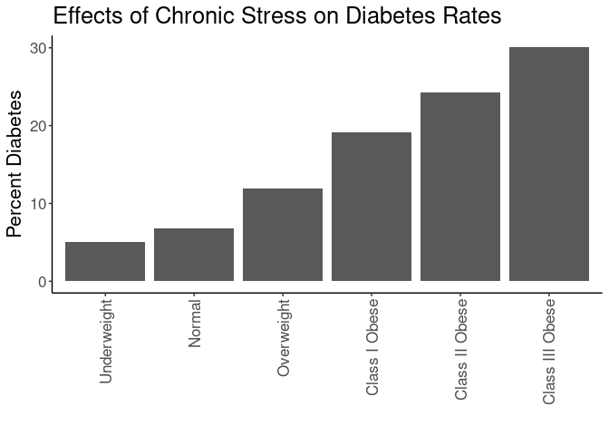<!-- -->

``` r
#calculating diabetes rates by bmi category by gender
with(combined.data, table(DiabetesAny,BMI_cat,Gender)) %>% 
  data.frame %>%
  pivot_wider(names_from=DiabetesAny,
              values_from = Freq) %>%
  rename(Diabetes=`1`,
         NonDiabetes=`0`) %>%
  mutate(Total=Diabetes+NonDiabetes) %>%
  mutate(Percent=Diabetes/Total*100) -> diabetes.bmi.counts

kable(diabetes.bmi.counts, caption="Diabetes rates by BMI category")
```


Table: Diabetes rates by BMI category

|BMI_cat         |Gender | NonDiabetes| Diabetes| Total| Percent|
|:---------------|:------|-----------:|--------:|-----:|-------:|
|Underweight     |F      |         321|       18|   339|    5.31|
|Normal          |F      |        8808|      479|  9287|    5.16|
|Overweight      |F      |        8190|      876|  9066|    9.66|
|Class I Obese   |F      |        5441|     1059|  6500|   16.29|
|Class II Obese  |F      |        3046|      860|  3906|   22.02|
|Class III Obese |F      |        2549|     1014|  3563|   28.46|
|Underweight     |M      |         144|        7|   151|    4.64|
|Normal          |M      |        5374|      553|  5927|    9.33|
|Overweight      |M      |        9524|     1519| 11043|   13.76|
|Class I Obese   |M      |        5705|     1571|  7276|   21.59|
|Class II Obese  |M      |        2231|      830|  3061|   27.11|
|Class III Obese |M      |        1113|      561|  1674|   33.51|

``` r
ggplot(diabetes.bmi.counts,
       aes(y=Percent,
           x=BMI_cat)) +
  geom_bar(stat='identity',position='dodge') +
  labs(y="Percent Diabetes",
       title="Effects of Chronic Stress on Diabetes Rates",
       x="") +
  theme_classic() +
  scale_fill_grey() +
  facet_grid(.~Gender) +
  theme(text=element_text(size=16),
        axis.text.x=element_text(angle=90,vjust=0.5,hjust=1),
        legend.position = c(0.1,0.85))
```

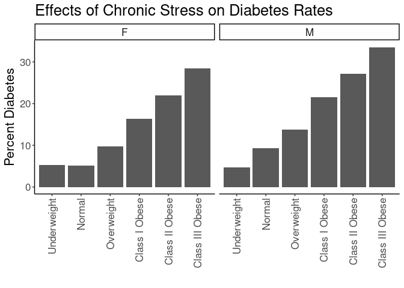<!-- -->

## Diabetes Rate by BMI and Stress

This analysis uses all the BMI categories


``` r
#calculating diabetes rates by bmi category and stress
with(combined.data, table(DiabetesAny,BMI_cat,Stress)) %>% 
  data.frame %>%
  pivot_wider(names_from=DiabetesAny,
              values_from = Freq) %>%
  rename(Diabetes=`1`,
         NonDiabetes=`0`) %>%
  mutate(Total=Diabetes+NonDiabetes) %>%
  mutate(Percent=Diabetes/Total*100) -> diabetes.bmi.stress.counts

library(ggplot2)

kable(diabetes.bmi.stress.counts, caption="Diabetes rates by BMI category")
```


Table: Diabetes rates by BMI category

|BMI_cat         |Stress | NonDiabetes| Diabetes| Total| Percent|
|:---------------|:------|-----------:|--------:|-----:|-------:|
|Underweight     |Low    |         128|        4|   132|    3.03|
|Normal          |Low    |        5396|      331|  5727|    5.78|
|Overweight      |Low    |        6918|      819|  7737|   10.59|
|Class I Obese   |Low    |        4209|      836|  5045|   16.57|
|Class II Obese  |Low    |        1923|      512|  2435|   21.03|
|Class III Obese |Low    |        1305|      438|  1743|   25.13|
|Underweight     |High   |         143|        8|   151|    5.30|
|Normal          |High   |        3658|      263|  3921|    6.71|
|Overweight      |High   |        4581|      592|  5173|   11.44|
|Class I Obese   |High   |        3051|      774|  3825|   20.23|
|Class II Obese  |High   |        1518|      518|  2036|   25.44|
|Class III Obese |High   |        1147|      488|  1635|   29.85|

``` r
ggplot(diabetes.bmi.stress.counts,
       aes(y=Percent,
           x=BMI_cat,
           fill=Stress)) +
  geom_bar(stat='identity',position='dodge') +
  labs(y="Percent Diabetes",
       title="Effects of Chronic Stress on Diabetes Rates",
       x="") +
  theme_classic() +
  scale_fill_grey() +
  theme(text=element_text(size=16),
        axis.text.x=element_text(angle=90,vjust=0.5,hjust=1),
        legend.position = c(0.1,0.85))
```

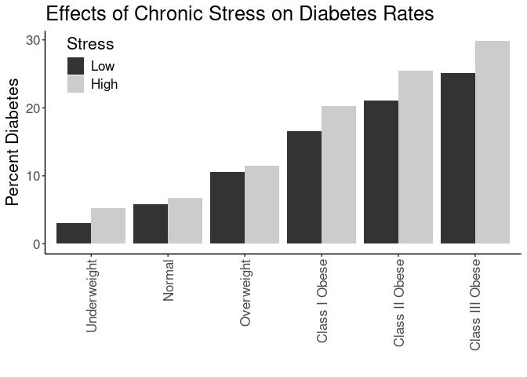<!-- -->


``` r
#calculating diabetes rates by bmi category and stress
with(combined.data, table(DiabetesAny,BMI_cat,Stress,Gender)) %>% 
  data.frame %>%
  pivot_wider(names_from=DiabetesAny,
              values_from = Freq) %>%
  rename(Diabetes=`1`,
         NonDiabetes=`0`) %>%
  mutate(Total=Diabetes+NonDiabetes) %>%
  mutate(Percent=Diabetes/Total*100) -> diabetes.bmi.stress.counts

library(ggplot2)

kable(diabetes.bmi.stress.counts, caption="Diabetes rates by BMI category")
```


Table: Diabetes rates by BMI category

|BMI_cat         |Stress |Gender | NonDiabetes| Diabetes| Total| Percent|
|:---------------|:------|:------|-----------:|--------:|-----:|-------:|
|Underweight     |Low    |F      |          90|        3|    93|    3.23|
|Normal          |Low    |F      |        3289|      146|  3435|    4.25|
|Overweight      |Low    |F      |        3078|      252|  3330|    7.57|
|Class I Obese   |Low    |F      |        1937|      274|  2211|   12.39|
|Class II Obese  |Low    |F      |        1078|      227|  1305|   17.39|
|Class III Obese |Low    |F      |         883|      277|  1160|   23.88|
|Underweight     |High   |F      |          93|        6|    99|    6.06|
|Normal          |High   |F      |        2280|      121|  2401|    5.04|
|Overweight      |High   |F      |        2220|      246|  2466|    9.98|
|Class I Obese   |High   |F      |        1617|      339|  1956|   17.33|
|Class II Obese  |High   |F      |         902|      280|  1182|   23.69|
|Class III Obese |High   |F      |         813|      321|  1134|   28.31|
|Underweight     |Low    |M      |          38|        1|    39|    2.56|
|Normal          |Low    |M      |        2107|      185|  2292|    8.07|
|Overweight      |Low    |M      |        3840|      567|  4407|   12.87|
|Class I Obese   |Low    |M      |        2272|      562|  2834|   19.83|
|Class II Obese  |Low    |M      |         845|      285|  1130|   25.22|
|Class III Obese |Low    |M      |         422|      161|   583|   27.62|
|Underweight     |High   |M      |          50|        2|    52|    3.85|
|Normal          |High   |M      |        1378|      142|  1520|    9.34|
|Overweight      |High   |M      |        2361|      346|  2707|   12.78|
|Class I Obese   |High   |M      |        1434|      435|  1869|   23.27|
|Class II Obese  |High   |M      |         616|      238|   854|   27.87|
|Class III Obese |High   |M      |         334|      167|   501|   33.33|

``` r
ggplot(diabetes.bmi.stress.counts,
       aes(y=Percent,
           x=BMI_cat,
           fill=Stress)) +
  geom_bar(stat='identity',position='dodge') +
  labs(y="Percent Diabetes",
       title="Effects of Chronic Stress on Diabetes Rates",
       x="") +
  theme_classic() +
  scale_fill_grey() +
  facet_grid(.~Gender) +
  theme(text=element_text(size=16),
        axis.text.x=element_text(angle=90,vjust=0.5,hjust=1),
        legend.position = c(0.1,0.85))
```

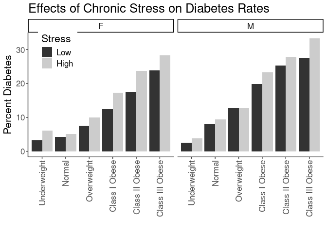<!-- -->

## Logistic Regressions for All Obese Categories

Ran a series of stepwise logistic regressions testing for obesity as a modifier of the effects of stress.


``` r
library(broom)
glm(DiabetesAny~BMI_cat, 
    family="binomial",
    data=combined.data) -> obesity.glm1

obesity.glm1 %>%
  tidy() %>%
  kable(caption="Logistic regression of obesity on diabetes", digits =c(0,2,3,2,99))
```


Table: Logistic regression of obesity on diabetes

|term                   | estimate| std.error| statistic|  p.value|
|:----------------------|--------:|---------:|---------:|--------:|
|(Intercept)            |    -2.92|     0.205|    -14.24| 5.27e-46|
|BMI_catNormal          |     0.30|     0.208|      1.46| 1.45e-01|
|BMI_catOverweight      |     0.92|     0.206|      4.47| 7.94e-06|
|BMI_catClass I Obese   |     1.48|     0.206|      7.16| 7.80e-13|
|BMI_catClass II Obese  |     1.78|     0.207|      8.61| 7.12e-18|
|BMI_catClass III Obese |     2.08|     0.207|     10.02| 1.23e-23|

``` r
anova(obesity.glm1,test="Chisq") %>% tidy %>%
  kable(caption="Logistic regression of obesity on diabetes, ", digits =c(0,0,0,0,0,99))
```


Table: Logistic regression of obesity on diabetes, 

|term    | df| deviance| df.residual| residual.deviance| p.value|
|:-------|--:|--------:|-----------:|-----------------:|-------:|
|NULL    | NA|       NA|       61792|             52511|      NA|
|BMI_cat |  5|     2525|       61787|             49986|       0|

``` r
#adding in stress as a modifier
glm(DiabetesAny~BMI_cat+Stress+Stress:BMI_cat, 
    family="binomial",
    data=combined.data) -> obesity.glm2

obesity.glm2 %>%
  tidy() %>%
  kable(caption="Logistic regression of obesity on diabetes, with stress as a modifier", digits =c(0,2,3,2,99))
```


Table: Logistic regression of obesity on diabetes, with stress as a modifier

|term                              | estimate| std.error| statistic|  p.value|
|:---------------------------------|--------:|---------:|---------:|--------:|
|(Intercept)                       |    -3.47|     0.507|     -6.83| 8.22e-12|
|BMI_catNormal                     |     0.67|     0.510|      1.32| 1.86e-01|
|BMI_catOverweight                 |     1.33|     0.508|      2.62| 8.80e-03|
|BMI_catClass I Obese              |     1.85|     0.508|      3.64| 2.76e-04|
|BMI_catClass II Obese             |     2.14|     0.510|      4.20| 2.61e-05|
|BMI_catClass III Obese            |     2.37|     0.510|      4.65| 3.25e-06|
|StressHigh                        |     0.58|     0.624|      0.93| 3.51e-01|
|BMI_catNormal:StressHigh          |    -0.42|     0.630|     -0.67| 5.01e-01|
|BMI_catOverweight:StressHigh      |    -0.49|     0.626|     -0.79| 4.30e-01|
|BMI_catClass I Obese:StressHigh   |    -0.34|     0.626|     -0.54| 5.90e-01|
|BMI_catClass II Obese:StressHigh  |    -0.33|     0.628|     -0.53| 5.95e-01|
|BMI_catClass III Obese:StressHigh |    -0.35|     0.629|     -0.55| 5.83e-01|

``` r
anova(obesity.glm2,test="Chisq") %>% tidy %>%
  kable(caption="Logistic regression of obese vs non-obese on diabetes, with stress as a modifier", digits =c(0,0,0,0,0,99))
```


Table: Logistic regression of obese vs non-obese on diabetes, with stress as a modifier

|term           | df| deviance| df.residual| residual.deviance|  p.value|
|:--------------|--:|--------:|-----------:|-----------------:|--------:|
|NULL           | NA|       NA|       39559|             32202|       NA|
|BMI_cat        |  5|     1534|       39554|             30668| 0.00e+00|
|Stress         |  1|       42|       39553|             30626| 8.83e-11|
|BMI_cat:Stress |  5|        6|       39548|             30620| 3.29e-01|

``` r
#adding in age and gender as covariates as a modifier
glm(DiabetesAny~BMI_cat+Stress+Stress:BMI_cat+Gender+BMI_cat:Gender+age, 
    family="binomial",
    data=combined.data) -> obesity.glm3

obesity.glm3 %>%
  tidy() %>%
  kable(caption="Logistic regression of obesity on diabetes, with stress as a modifier and age and  gender as covariates", digits =c(0,2,3,2,99))
```


Table: Logistic regression of obesity on diabetes, with stress as a modifier and age and  gender as covariates

|term                              | estimate| std.error| statistic|  p.value|
|:---------------------------------|--------:|---------:|---------:|--------:|
|(Intercept)                       |    -5.68|     0.538|    -10.56| 4.54e-26|
|BMI_catNormal                     |     0.31|     0.539|      0.58| 5.61e-01|
|BMI_catOverweight                 |     0.91|     0.537|      1.69| 9.10e-02|
|BMI_catClass I Obese              |     1.46|     0.537|      2.72| 6.48e-03|
|BMI_catClass II Obese             |     1.93|     0.538|      3.59| 3.28e-04|
|BMI_catClass III Obese            |     2.36|     0.538|      4.39| 1.13e-05|
|StressHigh                        |     0.69|     0.632|      1.09| 2.78e-01|
|GenderM                           |    -0.22|     0.689|     -0.32| 7.50e-01|
|age                               |     0.04|     0.001|     37.07| 0.00e+00|
|BMI_catNormal:StressHigh          |    -0.45|     0.638|     -0.71| 4.81e-01|
|BMI_catOverweight:StressHigh      |    -0.49|     0.635|     -0.78| 4.36e-01|
|BMI_catClass I Obese:StressHigh   |    -0.33|     0.635|     -0.52| 6.01e-01|
|BMI_catClass II Obese:StressHigh  |    -0.34|     0.636|     -0.53| 5.96e-01|
|BMI_catClass III Obese:StressHigh |    -0.34|     0.637|     -0.54| 5.91e-01|
|BMI_catNormal:GenderM             |     0.80|     0.694|      1.15| 2.48e-01|
|BMI_catOverweight:GenderM         |     0.53|     0.691|      0.77| 4.43e-01|
|BMI_catClass I Obese:GenderM      |     0.53|     0.691|      0.77| 4.41e-01|
|BMI_catClass II Obese:GenderM     |     0.41|     0.693|      0.59| 5.57e-01|
|BMI_catClass III Obese:GenderM    |     0.32|     0.694|      0.46| 6.43e-01|

``` r
anova(obesity.glm3,test="Chisq") %>% tidy %>%
  kable(caption="Logistic regression of obesity on diabetes, with stress as a modifier and age and gender as covariate", digits =c(0,0,0,0,0,99))
```


Table: Logistic regression of obesity on diabetes, with stress as a modifier and age and gender as covariate

|term           | df| deviance| df.residual| residual.deviance|  p.value|
|:--------------|--:|--------:|-----------:|-----------------:|--------:|
|NULL           | NA|       NA|       39559|             32202|       NA|
|BMI_cat        |  5|     1534|       39554|             30668| 0.00e+00|
|Stress         |  1|       42|       39553|             30626| 8.83e-11|
|Gender         |  1|      205|       39552|             30421| 1.81e-46|
|age            |  1|     1564|       39551|             28857| 0.00e+00|
|BMI_cat:Stress |  5|        6|       39546|             28850| 2.74e-01|
|BMI_cat:Gender |  5|       19|       39541|             28831| 1.77e-03|

``` r
#adding in race and ethnicity
glm(DiabetesAny~BMI_cat+Stress+Stress:BMI_cat+Gender+BMI_cat:Gender+age+Race.Ethnicity, 
    family="binomial",
    data=combined.data) -> obesity.glm4

obesity.glm4 %>%
  tidy() %>%
  kable(caption="Logistic regression of obesity on diabetes, with stress as a modifier and age, gender and race as covariates", digits =c(0,2,3,2,99))
```


Table: Logistic regression of obesity on diabetes, with stress as a modifier and age, gender and race as covariates

|term                              | estimate| std.error| statistic|  p.value|
|:---------------------------------|--------:|---------:|---------:|--------:|
|(Intercept)                       |    -5.83|     0.538|    -10.83| 2.46e-27|
|BMI_catNormal                     |     0.31|     0.539|      0.58| 5.64e-01|
|BMI_catOverweight                 |     0.91|     0.536|      1.69| 9.10e-02|
|BMI_catClass I Obese              |     1.46|     0.536|      2.72| 6.55e-03|
|BMI_catClass II Obese             |     1.93|     0.537|      3.59| 3.28e-04|
|BMI_catClass III Obese            |     2.35|     0.537|      4.37| 1.22e-05|
|StressHigh                        |     0.69|     0.632|      1.09| 2.76e-01|
|GenderM                           |    -0.21|     0.689|     -0.30| 7.63e-01|
|age                               |     0.04|     0.001|     37.90| 0.00e+00|
|Race.EthnicityAsian               |     0.73|     0.142|      5.14| 2.69e-07|
|Race.EthnicityBlack               |     0.61|     0.066|      9.29| 1.48e-20|
|Race.EthnicityHispanic/Latino     |     0.39|     0.111|      3.54| 3.95e-04|
|Race.EthnicityOther               |     0.11|     0.086|      1.30| 1.92e-01|
|BMI_catNormal:StressHigh          |    -0.45|     0.638|     -0.71| 4.79e-01|
|BMI_catOverweight:StressHigh      |    -0.50|     0.635|     -0.79| 4.29e-01|
|BMI_catClass I Obese:StressHigh   |    -0.34|     0.635|     -0.53| 5.93e-01|
|BMI_catClass II Obese:StressHigh  |    -0.35|     0.636|     -0.54| 5.87e-01|
|BMI_catClass III Obese:StressHigh |    -0.34|     0.637|     -0.54| 5.89e-01|
|BMI_catNormal:GenderM             |     0.79|     0.695|      1.13| 2.57e-01|
|BMI_catOverweight:GenderM         |     0.52|     0.692|      0.76| 4.50e-01|
|BMI_catClass I Obese:GenderM      |     0.53|     0.692|      0.77| 4.43e-01|
|BMI_catClass II Obese:GenderM     |     0.41|     0.693|      0.59| 5.59e-01|
|BMI_catClass III Obese:GenderM    |     0.33|     0.694|      0.48| 6.33e-01|

``` r
anova(obesity.glm4,test="Chisq") %>% tidy %>%
  kable(caption="Logistic regression of obesity on diabetes, with stress as a modifier and age, gender and race as covariate", digits =c(0,0,0,0,0,99))
```


Table: Logistic regression of obesity on diabetes, with stress as a modifier and age, gender and race as covariate

|term           | df| deviance| df.residual| residual.deviance|  p.value|
|:--------------|--:|--------:|-----------:|-----------------:|--------:|
|NULL           | NA|       NA|       39559|             32202|       NA|
|BMI_cat        |  5|     1534|       39554|             30668| 0.00e+00|
|Stress         |  1|       42|       39553|             30626| 8.83e-11|
|Gender         |  1|      205|       39552|             30421| 1.81e-46|
|age            |  1|     1564|       39551|             28857| 0.00e+00|
|Race.Ethnicity |  4|      111|       39547|             28745| 4.05e-23|
|BMI_cat:Stress |  5|        6|       39542|             28739| 2.76e-01|
|BMI_cat:Gender |  5|       17|       39537|             28722| 3.66e-03|

``` r
#adding in neighborhood
glm(DiabetesAny~BMI_cat+Stress+Stress:BMI_cat+Gender+BMI_cat:Gender+age+Race.Ethnicity+disadvantage13_17_qrtl, 
    family="binomial",
    data=combined.data) -> obesity.glm5

obesity.glm5 %>%
  tidy() %>%
  kable(caption="Logistic regression of obesity on diabetes, with stress as a modifier and age, gender, race and neighborhood as covariates", digits =c(0,2,3,2,99))
```


Table: Logistic regression of obesity on diabetes, with stress as a modifier and age, gender, race and neighborhood as covariates

|term                              | estimate| std.error| statistic|  p.value|
|:---------------------------------|--------:|---------:|---------:|--------:|
|(Intercept)                       |    -6.03|     0.545|    -11.07| 1.79e-28|
|BMI_catNormal                     |     0.27|     0.544|      0.50| 6.15e-01|
|BMI_catOverweight                 |     0.85|     0.542|      1.56| 1.18e-01|
|BMI_catClass I Obese              |     1.39|     0.541|      2.57| 1.02e-02|
|BMI_catClass II Obese             |     1.84|     0.543|      3.39| 7.00e-04|
|BMI_catClass III Obese            |     2.28|     0.543|      4.20| 2.65e-05|
|StressHigh                        |     0.69|     0.633|      1.09| 2.77e-01|
|GenderM                           |    -0.22|     0.690|     -0.32| 7.48e-01|
|age                               |     0.04|     0.001|     36.84| 0.00e+00|
|Race.EthnicityAsian               |     0.76|     0.147|      5.20| 2.03e-07|
|Race.EthnicityBlack               |     0.51|     0.070|      7.25| 4.23e-13|
|Race.EthnicityHispanic/Latino     |     0.40|     0.114|      3.49| 4.90e-04|
|Race.EthnicityOther               |     0.09|     0.090|      0.97| 3.31e-01|
|disadvantage13_17_qrtl            |     0.12|     0.016|      7.37| 1.75e-13|
|BMI_catNormal:StressHigh          |    -0.46|     0.639|     -0.73| 4.68e-01|
|BMI_catOverweight:StressHigh      |    -0.54|     0.636|     -0.84| 4.00e-01|
|BMI_catClass I Obese:StressHigh   |    -0.37|     0.636|     -0.58| 5.62e-01|
|BMI_catClass II Obese:StressHigh  |    -0.36|     0.637|     -0.56| 5.75e-01|
|BMI_catClass III Obese:StressHigh |    -0.35|     0.638|     -0.55| 5.83e-01|
|BMI_catNormal:GenderM             |     0.78|     0.696|      1.13| 2.60e-01|
|BMI_catOverweight:GenderM         |     0.55|     0.693|      0.80| 4.26e-01|
|BMI_catClass I Obese:GenderM      |     0.56|     0.693|      0.81| 4.16e-01|
|BMI_catClass II Obese:GenderM     |     0.44|     0.694|      0.64| 5.25e-01|
|BMI_catClass III Obese:GenderM    |     0.33|     0.695|      0.48| 6.31e-01|

``` r
anova(obesity.glm5,test="Chisq") %>% tidy %>%
  kable(caption="Logistic regression of obesity on diabetes, with stress as a modifier and age, gender, race and neighborhood as covariates", digits =c(0,0,0,0,0,99))
```


Table: Logistic regression of obesity on diabetes, with stress as a modifier and age, gender, race and neighborhood as covariates

|term                   | df| deviance| df.residual| residual.deviance|  p.value|
|:----------------------|--:|--------:|-----------:|-----------------:|--------:|
|NULL                   | NA|       NA|       36392|             29765|       NA|
|BMI_cat                |  5|     1404|       36387|             28360| 0.00e+00|
|Stress                 |  1|       39|       36386|             28322| 5.06e-10|
|Gender                 |  1|      192|       36385|             28129| 9.70e-44|
|age                    |  1|     1445|       36384|             26684| 0.00e+00|
|Race.Ethnicity         |  4|      114|       36380|             26570| 8.00e-24|
|disadvantage13_17_qrtl |  1|       55|       36379|             26515| 1.28e-13|
|BMI_cat:Stress         |  5|        7|       36374|             26508| 2.47e-01|
|BMI_cat:Gender         |  5|       15|       36369|             26493| 8.77e-03|

### Diabetes Rates by Quartiles


``` r
with(combined.data, table(DiabetesAny,BMI_cat.obese,Stress.quartile,Gender)) %>% 
  data.frame %>%
  pivot_wider(names_from=DiabetesAny,
              values_from = Freq) %>%
  rename(Diabetes=`1`,
         NonDiabetes=`0`) %>%
  mutate(Total=Diabetes+NonDiabetes) %>%
  mutate(Percent=Diabetes/Total*100) -> diabetes.bmi.stress.quartile.counts

kable(diabetes.bmi.stress.quartile.counts, caption="Diabetes Rates by BMI and Stress Quartile")
```


Table: Diabetes Rates by BMI and Stress Quartile

|BMI_cat.obese |Stress.quartile |Gender | NonDiabetes| Diabetes| Total| Percent|
|:-------------|:---------------|:------|-----------:|--------:|-----:|-------:|
|Underweight   |Q1              |F      |          71|        2|    73|    2.74|
|Normal        |Q1              |F      |        2756|      118|  2874|    4.11|
|Overweight    |Q1              |F      |        2585|      204|  2789|    7.31|
|Obese         |Q1              |F      |        3249|      629|  3878|   16.22|
|Underweight   |Q2              |F      |          79|        5|    84|    5.95|
|Normal        |Q2              |F      |        2110|      117|  2227|    5.25|
|Overweight    |Q2              |F      |        2030|      216|  2246|    9.62|
|Obese         |Q2              |F      |        2869|      750|  3619|   20.72|
|Underweight   |Q3              |F      |          30|        2|    32|    6.25|
|Normal        |Q3              |F      |         631|       28|   659|    4.25|
|Overweight    |Q3              |F      |         609|       70|   679|   10.31|
|Obese         |Q3              |F      |         993|      311|  1304|   23.85|
|Underweight   |Q4              |F      |           3|        0|     3|    0.00|
|Normal        |Q4              |F      |          72|        4|    76|    5.26|
|Overweight    |Q4              |F      |          74|        8|    82|    9.76|
|Obese         |Q4              |F      |         119|       28|   147|   19.05|
|Underweight   |Q1              |M      |          27|        1|    28|    3.57|
|Normal        |Q1              |M      |        1805|      164|  1969|    8.33|
|Overweight    |Q1              |M      |        3318|      473|  3791|   12.48|
|Obese         |Q1              |M      |        3014|      852|  3866|   22.04|
|Underweight   |Q2              |M      |          45|        1|    46|    2.17|
|Normal        |Q2              |M      |        1312|      117|  1429|    8.19|
|Overweight    |Q2              |M      |        2336|      352|  2688|   13.10|
|Obese         |Q2              |M      |        2246|      758|  3004|   25.23|
|Underweight   |Q3              |M      |          14|        1|    15|    6.67|
|Normal        |Q3              |M      |         328|       38|   366|   10.38|
|Overweight    |Q3              |M      |         504|       79|   583|   13.55|
|Obese         |Q3              |M      |         599|      212|   811|   26.14|
|Underweight   |Q4              |M      |           2|        0|     2|    0.00|
|Normal        |Q4              |M      |          40|        8|    48|   16.67|
|Overweight    |Q4              |M      |          43|        9|    52|   17.31|
|Obese         |Q4              |M      |          64|       26|    90|   28.89|

``` r
ggplot(diabetes.bmi.stress.quartile.counts,
       aes(y=Percent,
           x=BMI_cat.obese,
           fill=Stress.quartile)) +
  geom_bar(stat='identity',position='dodge') +
  labs(y="Percent Diabetes",
       title="Effects of Chronic Stress on Diabetes",
       x="") +
  theme_classic() +
  facet_grid(.~Gender) +
  theme(text=element_text(size=16),
        axis.text.x=element_text(angle=90,vjust=0.5,hjust=1),
        legend.position = c(0.15,0.75))
```

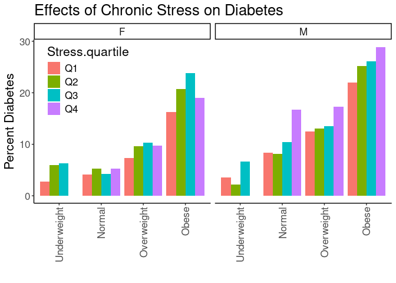<!-- -->

## Diabetes Rates by Normal Obesity and Stress


``` r
#calculating diabetes rates by bmi category, stress and gender
with(combined.data, table(DiabetesAny,BMI_cat.obese,Stress,Gender)) %>% 
  data.frame %>%
  pivot_wider(names_from=DiabetesAny,
              values_from = Freq) %>%
  rename(Diabetes=`1`,
         NonDiabetes=`0`) %>%
  mutate(Total=Diabetes+NonDiabetes) %>%
  mutate(Percent=Diabetes/Total*100) -> diabetes.bmi.stress.gender.counts

kable(diabetes.bmi.stress.gender.counts, caption="Diabetes Rates by BMI and Stress")
```


Table: Diabetes Rates by BMI and Stress

|BMI_cat.obese |Stress |Gender | NonDiabetes| Diabetes| Total| Percent|
|:-------------|:------|:------|-----------:|--------:|-----:|-------:|
|Underweight   |Low    |F      |          90|        3|    93|    3.23|
|Normal        |Low    |F      |        3289|      146|  3435|    4.25|
|Overweight    |Low    |F      |        3078|      252|  3330|    7.57|
|Obese         |Low    |F      |        3898|      778|  4676|   16.64|
|Underweight   |High   |F      |          93|        6|    99|    6.06|
|Normal        |High   |F      |        2280|      121|  2401|    5.04|
|Overweight    |High   |F      |        2220|      246|  2466|    9.98|
|Obese         |High   |F      |        3332|      940|  4272|   22.00|
|Underweight   |Low    |M      |          38|        1|    39|    2.56|
|Normal        |Low    |M      |        2107|      185|  2292|    8.07|
|Overweight    |Low    |M      |        3840|      567|  4407|   12.87|
|Obese         |Low    |M      |        3539|     1008|  4547|   22.17|
|Underweight   |High   |M      |          50|        2|    52|    3.85|
|Normal        |High   |M      |        1378|      142|  1520|    9.34|
|Overweight    |High   |M      |        2361|      346|  2707|   12.78|
|Obese         |High   |M      |        2384|      840|  3224|   26.05|

``` r
ggplot(diabetes.bmi.stress.gender.counts,
       aes(y=Percent,
           x=BMI_cat.obese,
           fill=Stress)) +
  geom_bar(stat='identity',position='dodge') +
  labs(y="Percent Diabetes",
       title="Effects of Chronic Stress on Diabetes",
       x="") +
  facet_grid(.~Gender) +
  theme_classic() +
  scale_fill_grey() +
  theme(text=element_text(size=16),
        axis.text.x=element_text(angle=90,vjust=0.5,hjust=1),
        legend.position = c(0.1,0.75))
```

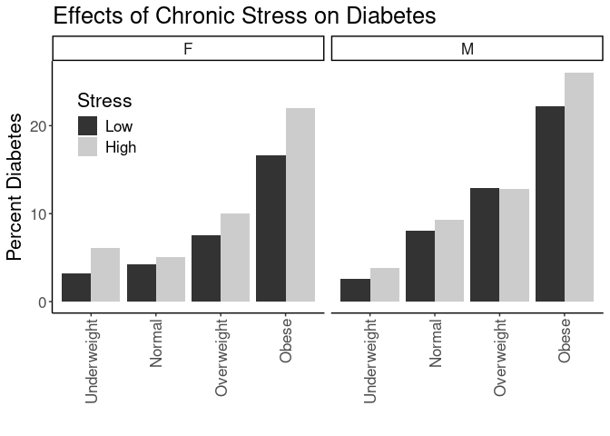<!-- -->

## Logistic Regressions for Obesity Categories

Ran a series of logistic regressions using the normal obesity categories not classes as the categorization


``` r
glm(DiabetesAny~BMI_cat.obese, 
    family="binomial",
    data=combined.data) -> obesity.glm1

obesity.glm1 %>%
  tidy() %>%
  kable(caption="Logistic regression of obese vs non-obese on diabetes", digits =c(0,2,3,2,99))
```


Table: Logistic regression of obese vs non-obese on diabetes

|term                    | estimate| std.error| statistic|  p.value|
|:-----------------------|--------:|---------:|---------:|--------:|
|(Intercept)             |    -2.92|     0.205|    -14.24| 5.27e-46|
|BMI_cat.obeseNormal     |     0.30|     0.208|      1.46| 1.45e-01|
|BMI_cat.obeseOverweight |     0.92|     0.206|      4.47| 7.94e-06|
|BMI_cat.obeseObese      |     1.70|     0.206|      8.25| 1.64e-16|

``` r
anova(obesity.glm1,test="Chisq") %>% tidy %>%
  kable(caption="Logistic regression of obesity on diabetes, ", digits =c(0,0,0,0,0,99))
```


Table: Logistic regression of obesity on diabetes, 

|term          | df| deviance| df.residual| residual.deviance| p.value|
|:-------------|--:|--------:|-----------:|-----------------:|-------:|
|NULL          | NA|       NA|       61792|             52511|      NA|
|BMI_cat.obese |  3|     2258|       61789|             50253|       0|

``` r
#adding in stress as a modifier
glm(DiabetesAny~BMI_cat.obese+Stress+Stress:BMI_cat.obese, 
    family="binomial",
    data=combined.data) -> obesity.glm2

obesity.glm2 %>%
  tidy() %>%
  kable(caption="Logistic regression of obesity on diabetes, with stress as a modifier", digits =c(0,2,3,2,99))
```


Table: Logistic regression of obesity on diabetes, with stress as a modifier

|term                               | estimate| std.error| statistic|  p.value|
|:----------------------------------|--------:|---------:|---------:|--------:|
|(Intercept)                        |    -3.47|     0.507|     -6.83| 8.22e-12|
|BMI_cat.obeseNormal                |     0.67|     0.510|      1.32| 1.86e-01|
|BMI_cat.obeseOverweight            |     1.33|     0.508|      2.62| 8.80e-03|
|BMI_cat.obeseObese                 |     2.04|     0.508|      4.02| 5.92e-05|
|StressHigh                         |     0.58|     0.624|      0.93| 3.51e-01|
|BMI_cat.obeseNormal:StressHigh     |    -0.42|     0.630|     -0.67| 5.01e-01|
|BMI_cat.obeseOverweight:StressHigh |    -0.49|     0.626|     -0.79| 4.30e-01|
|BMI_cat.obeseObese:StressHigh      |    -0.32|     0.625|     -0.52| 6.06e-01|

``` r
anova(obesity.glm2,test="Chisq") %>% tidy %>%
  kable(caption="Logistic regression of obesity on diabetes, with stress as a modifier", digits =c(0,0,0,0,0,99))
```


Table: Logistic regression of obesity on diabetes, with stress as a modifier

|term                 | df| deviance| df.residual| residual.deviance|  p.value|
|:--------------------|--:|--------:|-----------:|-----------------:|--------:|
|NULL                 | NA|       NA|       39559|             32202|       NA|
|BMI_cat.obese        |  3|     1401|       39556|             30801| 0.00e+00|
|Stress               |  1|       47|       39555|             30754| 7.74e-12|
|BMI_cat.obese:Stress |  3|        7|       39552|             30747| 7.22e-02|

``` r
#adding in age and gender as covariates as a modifier
glm(DiabetesAny~BMI_cat.obese+Stress+Stress:BMI_cat.obese+Gender+BMI_cat.obese:Gender+age, 
    family="binomial",
    data=combined.data) -> obesity.glm3

obesity.glm3 %>%
  tidy() %>%
  kable(caption="Logistic regression of obesity on diabetes, with stress as a modifier and age and  gender as covariates", digits =c(0,2,3,2,99))
```


Table: Logistic regression of obesity on diabetes, with stress as a modifier and age and  gender as covariates

|term                               | estimate| std.error| statistic|  p.value|
|:----------------------------------|--------:|---------:|---------:|--------:|
|(Intercept)                        |    -5.57|     0.538|    -10.36| 3.72e-25|
|BMI_cat.obeseNormal                |     0.31|     0.539|      0.58| 5.65e-01|
|BMI_cat.obeseOverweight            |     0.91|     0.536|      1.69| 9.12e-02|
|BMI_cat.obeseObese                 |     1.83|     0.535|      3.43| 6.02e-04|
|StressHigh                         |     0.68|     0.632|      1.08| 2.80e-01|
|GenderM                            |    -0.23|     0.688|     -0.33| 7.43e-01|
|age                                |     0.04|     0.001|     36.05| 0.00e+00|
|BMI_cat.obeseNormal:StressHigh     |    -0.45|     0.638|     -0.70| 4.82e-01|
|BMI_cat.obeseOverweight:StressHigh |    -0.49|     0.634|     -0.78| 4.37e-01|
|BMI_cat.obeseObese:StressHigh      |    -0.32|     0.633|     -0.51| 6.12e-01|
|BMI_cat.obeseNormal:GenderM        |     0.81|     0.693|      1.17| 2.42e-01|
|BMI_cat.obeseOverweight:GenderM    |     0.54|     0.691|      0.78| 4.33e-01|
|BMI_cat.obeseObese:GenderM         |     0.35|     0.689|      0.51| 6.11e-01|

``` r
anova(obesity.glm3,test="Chisq") %>% tidy %>%
  kable(caption="Logistic regression of obesity on diabetes, with stress as a modifier and age and gender as covariate", digits =c(0,0,0,0,0,99))
```


Table: Logistic regression of obesity on diabetes, with stress as a modifier and age and gender as covariate

|term                 | df| deviance| df.residual| residual.deviance|  p.value|
|:--------------------|--:|--------:|-----------:|-----------------:|--------:|
|NULL                 | NA|       NA|       39559|             32202|       NA|
|BMI_cat.obese        |  3|     1401|       39556|             30801| 0.00e+00|
|Stress               |  1|       47|       39555|             30754| 7.74e-12|
|Gender               |  1|      162|       39554|             30592| 4.37e-37|
|age                  |  1|     1460|       39553|             29132| 0.00e+00|
|BMI_cat.obese:Stress |  3|        8|       39550|             29124| 4.16e-02|
|BMI_cat.obese:Gender |  3|       27|       39547|             29097| 6.41e-06|

``` r
#adding in race and ethnicity
glm(DiabetesAny~BMI_cat.obese+Stress+Stress:BMI_cat.obese+Gender+BMI_cat.obese:Gender+age+Race.Ethnicity, 
    family="binomial",
    data=combined.data) -> obesity.glm4

obesity.glm4 %>%
  tidy() %>%
  kable(caption="Logistic regression of obesity on diabetes, with stress as a modifier and age, gender and race as covariates", digits =c(0,2,3,2,99))
```


Table: Logistic regression of obesity on diabetes, with stress as a modifier and age, gender and race as covariates

|term                               | estimate| std.error| statistic|  p.value|
|:----------------------------------|--------:|---------:|---------:|--------:|
|(Intercept)                        |    -5.71|     0.537|    -10.62| 2.32e-26|
|BMI_cat.obeseNormal                |     0.31|     0.538|      0.57| 5.69e-01|
|BMI_cat.obeseOverweight            |     0.90|     0.536|      1.68| 9.23e-02|
|BMI_cat.obeseObese                 |     1.82|     0.534|      3.42| 6.35e-04|
|StressHigh                         |     0.68|     0.632|      1.08| 2.80e-01|
|GenderM                            |    -0.22|     0.689|     -0.32| 7.52e-01|
|age                                |     0.04|     0.001|     36.90| 0.00e+00|
|Race.EthnicityAsian                |     0.66|     0.142|      4.68| 2.85e-06|
|Race.EthnicityBlack                |     0.63|     0.065|      9.68| 3.50e-22|
|Race.EthnicityHispanic/Latino      |     0.37|     0.110|      3.38| 7.22e-04|
|Race.EthnicityOther                |     0.11|     0.085|      1.34| 1.80e-01|
|BMI_cat.obeseNormal:StressHigh     |    -0.45|     0.638|     -0.70| 4.81e-01|
|BMI_cat.obeseOverweight:StressHigh |    -0.50|     0.634|     -0.79| 4.30e-01|
|BMI_cat.obeseObese:StressHigh      |    -0.33|     0.633|     -0.51| 6.07e-01|
|BMI_cat.obeseNormal:GenderM        |     0.80|     0.694|      1.15| 2.49e-01|
|BMI_cat.obeseOverweight:GenderM    |     0.54|     0.691|      0.78| 4.37e-01|
|BMI_cat.obeseObese:GenderM         |     0.35|     0.690|      0.51| 6.07e-01|

``` r
anova(obesity.glm4,test="Chisq") %>% tidy %>%
  kable(caption="Logistic regression of obesity on diabetes, with stress as a modifier and age, gender and race as covariates", digits =c(0,0,0,0,0,99))
```


Table: Logistic regression of obesity on diabetes, with stress as a modifier and age, gender and race as covariates

|term                 | df| deviance| df.residual| residual.deviance|  p.value|
|:--------------------|--:|--------:|-----------:|-----------------:|--------:|
|NULL                 | NA|       NA|       39559|             32202|       NA|
|BMI_cat.obese        |  3|     1401|       39556|             30801| 0.00e+00|
|Stress               |  1|       47|       39555|             30754| 7.74e-12|
|Gender               |  1|      162|       39554|             30592| 4.37e-37|
|age                  |  1|     1460|       39553|             29132| 0.00e+00|
|Race.Ethnicity       |  4|      113|       39549|             29019| 1.43e-23|
|BMI_cat.obese:Stress |  3|        8|       39546|             29010| 4.17e-02|
|BMI_cat.obese:Gender |  3|       25|       39543|             28985| 1.68e-05|

``` r
glm(DiabetesAny~BMI_cat.obese+Stress+Stress:BMI_cat.obese+Gender+BMI_cat.obese:Gender+age+Race.Ethnicity+disadvantage13_17_qrtl, 
    family="binomial",
    data=combined.data) -> obesity.glm5

obesity.glm5 %>%
  tidy() %>%
  kable(caption="Logistic regression of obesity on diabetes, with stress as a modifier and age, gender, race and neighborhood as covariates", digits =c(0,2,3,2,99))
```


Table: Logistic regression of obesity on diabetes, with stress as a modifier and age, gender, race and neighborhood as covariates

|term                               | estimate| std.error| statistic|  p.value|
|:----------------------------------|--------:|---------:|---------:|--------:|
|(Intercept)                        |    -5.94|     0.545|    -10.91| 9.79e-28|
|BMI_cat.obeseNormal                |     0.27|     0.544|      0.50| 6.17e-01|
|BMI_cat.obeseOverweight            |     0.85|     0.541|      1.56| 1.18e-01|
|BMI_cat.obeseObese                 |     1.75|     0.540|      3.25| 1.15e-03|
|StressHigh                         |     0.68|     0.632|      1.08| 2.82e-01|
|GenderM                            |    -0.24|     0.689|     -0.34| 7.33e-01|
|age                                |     0.04|     0.001|     35.93| 0.00e+00|
|Race.EthnicityAsian                |     0.70|     0.147|      4.75| 2.03e-06|
|Race.EthnicityBlack                |     0.52|     0.070|      7.42| 1.20e-13|
|Race.EthnicityHispanic/Latino      |     0.37|     0.114|      3.28| 1.03e-03|
|Race.EthnicityOther                |     0.09|     0.089|      1.01| 3.11e-01|
|disadvantage13_17_qrtl             |     0.13|     0.016|      8.14| 3.95e-16|
|BMI_cat.obeseNormal:StressHigh     |    -0.46|     0.639|     -0.72| 4.71e-01|
|BMI_cat.obeseOverweight:StressHigh |    -0.53|     0.635|     -0.84| 4.02e-01|
|BMI_cat.obeseObese:StressHigh      |    -0.35|     0.634|     -0.55| 5.86e-01|
|BMI_cat.obeseNormal:GenderM        |     0.80|     0.695|      1.15| 2.50e-01|
|BMI_cat.obeseOverweight:GenderM    |     0.57|     0.692|      0.82| 4.09e-01|
|BMI_cat.obeseObese:GenderM         |     0.39|     0.691|      0.56| 5.75e-01|

``` r
anova(obesity.glm5,test="Chisq") %>% tidy %>%
  kable(caption="Logistic regression of obesity on diabetes, with stress as a modifier and age, gender, race and neighborhood as covariates", digits =c(0,0,0,0,0,99))
```


Table: Logistic regression of obesity on diabetes, with stress as a modifier and age, gender, race and neighborhood as covariates

|term                   | df| deviance| df.residual| residual.deviance|  p.value|
|:----------------------|--:|--------:|-----------:|-----------------:|--------:|
|NULL                   | NA|       NA|       36392|             29765|       NA|
|BMI_cat.obese          |  3|     1274|       36389|             28491| 0.00e+00|
|Stress                 |  1|       43|       36388|             28448| 5.65e-11|
|Gender                 |  1|      151|       36387|             28296| 8.73e-35|
|age                    |  1|     1349|       36386|             26948| 0.00e+00|
|Race.Ethnicity         |  4|      117|       36382|             26831| 2.94e-24|
|disadvantage13_17_qrtl |  1|       68|       36381|             26764| 1.99e-16|
|BMI_cat.obese:Stress   |  3|        8|       36378|             26755| 4.10e-02|
|BMI_cat.obese:Gender   |  3|       20|       36375|             26735| 1.35e-04|

# Diabetes Rates by Obese/Not Obese and Stress


``` r
with(combined.data, table(DiabetesAny,BMI_cat.Ob.NonOb,Stress)) %>% 
  data.frame %>%
  pivot_wider(names_from=DiabetesAny,
              values_from = Freq) %>%
  rename(Diabetes=`1`,
         NonDiabetes=`0`) %>%
  mutate(Total=Diabetes+NonDiabetes) %>%
  mutate(Percent=Diabetes/Total*100) -> diabetes.BMI_cat.Ob.NonOb.stress.counts

kable(diabetes.BMI_cat.Ob.NonOb.stress.counts, caption="Diabetes Rates by Obese or not and Stress")
```


Table: Diabetes Rates by Obese or not and Stress

|BMI_cat.Ob.NonOb |Stress | NonDiabetes| Diabetes| Total| Percent|
|:----------------|:------|-----------:|--------:|-----:|-------:|
|Non-Obese        |Low    |       12442|     1154| 13596|    8.49|
|Obese            |Low    |        7437|     1786|  9223|   19.36|
|Non-Obese        |High   |        8382|      863|  9245|    9.34|
|Obese            |High   |        5716|     1780|  7496|   23.75|

``` r
ggplot(diabetes.BMI_cat.Ob.NonOb.stress.counts,
       aes(y=Percent,
           x=BMI_cat.Ob.NonOb,
           fill=Stress)) +
  geom_bar(stat='identity',position='dodge') +
  labs(y="Percent Diabetes",
       title="Effects of Chronic Stress on Diabetes",
       x="") +
  theme_classic() +
  scale_fill_grey() +
  theme(text=element_text(size=16),
        axis.text.x=element_text(angle=90,vjust=0.5,hjust=1),
        legend.position = c(0.1,0.75))
```

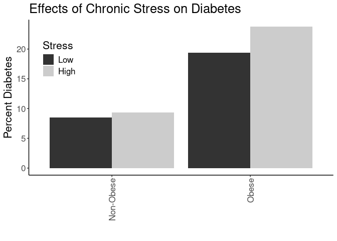<!-- -->


``` r
with(combined.data, table(DiabetesAny,BMI_cat.Ob.NonOb,Stress,Gender)) %>% 
  data.frame %>%
  pivot_wider(names_from=DiabetesAny,
              values_from = Freq) %>%
  rename(Diabetes=`1`,
         NonDiabetes=`0`) %>%
  mutate(Total=Diabetes+NonDiabetes) %>%
  mutate(Percent=Diabetes/Total*100) -> diabetes.BMI_cat.Ob.NonOb.stress.counts

kable(diabetes.BMI_cat.Ob.NonOb.stress.counts, caption="Diabetes Rates by Obese or not and Stress")
```


Table: Diabetes Rates by Obese or not and Stress

|BMI_cat.Ob.NonOb |Stress |Gender | NonDiabetes| Diabetes| Total| Percent|
|:----------------|:------|:------|-----------:|--------:|-----:|-------:|
|Non-Obese        |Low    |F      |        6457|      401|  6858|    5.85|
|Obese            |Low    |F      |        3898|      778|  4676|   16.64|
|Non-Obese        |High   |F      |        4593|      373|  4966|    7.51|
|Obese            |High   |F      |        3332|      940|  4272|   22.00|
|Non-Obese        |Low    |M      |        5985|      753|  6738|   11.18|
|Obese            |Low    |M      |        3539|     1008|  4547|   22.17|
|Non-Obese        |High   |M      |        3789|      490|  4279|   11.45|
|Obese            |High   |M      |        2384|      840|  3224|   26.05|

``` r
ggplot(diabetes.BMI_cat.Ob.NonOb.stress.counts,
       aes(y=Percent,
           x=BMI_cat.Ob.NonOb,
           fill=Stress)) +
  geom_bar(stat='identity',position='dodge') +
  labs(y="Percent Diabetes",
       title="Effects of Chronic Stress on Diabetes",
       x="") +
  facet_grid(.~Gender) +
  theme_classic() +
  scale_fill_grey() +
  theme(text=element_text(size=16),
        axis.text.x=element_text(angle=90,vjust=0.5,hjust=1),
        legend.position = c(0.1,0.75))
```

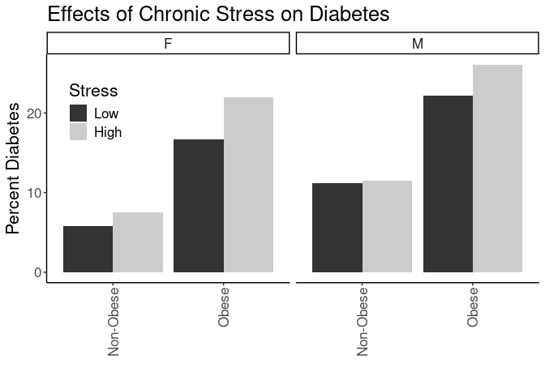<!-- -->


``` r
with(combined.data, table(DiabetesAny,BMI_cat.Ob.NonOb,Stress,Race.Ethnicity)) %>% 
  data.frame %>%
  pivot_wider(names_from=DiabetesAny,
              values_from = Freq) %>%
  rename(Diabetes=`1`,
         NonDiabetes=`0`) %>%
  mutate(Total=Diabetes+NonDiabetes) %>%
  mutate(Percent=Diabetes/Total*100) -> diabetes.BMI_cat.Ob.NonOb.stress.counts

ggplot(diabetes.BMI_cat.Ob.NonOb.stress.counts,
       aes(y=Percent,
           x=BMI_cat.Ob.NonOb,
           fill=Stress)) +
  geom_bar(stat='identity',position='dodge') +
  labs(y="Percent Diabetes",
       title="Effects of Chronic Stress on Diabetes",
       x="") +
  facet_grid(.~Race.Ethnicity) +
  theme_classic() +
  scale_fill_grey() +
  theme(text=element_text(size=16),
        axis.text.x=element_text(angle=90,vjust=0.5,hjust=1),
        legend.position = "none")
```

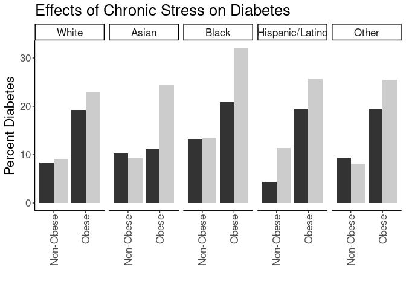<!-- -->

# Stratified by Neighborhood Disadvantage


``` r
with(combined.data, table(DiabetesAny,BMI_cat.Ob.NonOb,Stress,disadvantage13_17_qrtl)) %>% 
  data.frame %>%
  pivot_wider(names_from=DiabetesAny,
              values_from = Freq) %>%
  rename(Diabetes=`1`,
         NonDiabetes=`0`) %>%
  mutate(Total=Diabetes+NonDiabetes) %>%
  mutate(Percent=Diabetes/Total*100) -> diabetes.BMI_cat.Ob.NonOb.stress.counts

ggplot(diabetes.BMI_cat.Ob.NonOb.stress.counts,
       aes(y=Percent,
           x=BMI_cat.Ob.NonOb,
           fill=Stress)) +
  geom_bar(stat='identity',position='dodge') +
  labs(y="Percent Diabetes",
       title="Effects of Chronic Stress on Diabetes",
       x="") +
  facet_grid(.~disadvantage13_17_qrtl) +
  theme_classic() +
  scale_fill_grey() +
  theme(text=element_text(size=16),
        axis.text.x=element_text(angle=90,vjust=0.5,hjust=1),
        legend.position = "none")
```

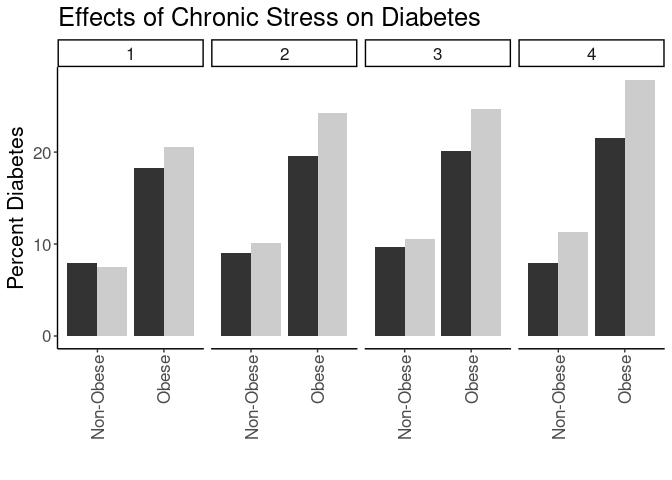<!-- -->


## Logistic Regressions for Obese/Non-Obese

Ran a series of logistic regressions using obese/non-obese as the categorization


``` r
glm(DiabetesAny~BMI_cat.Ob.NonOb, 
    family="binomial",
    data=combined.data) -> obesity.glm1

obesity.glm1 %>%
  tidy() %>%
  kable(caption="Logistic regression of obese vs non-obese on diabetes", digits =c(0,2,3,2,99))
```


Table: Logistic regression of obese vs non-obese on diabetes

|term                  | estimate| std.error| statistic| p.value|
|:---------------------|--------:|---------:|---------:|-------:|
|(Intercept)           |    -2.24|     0.018|    -125.0|       0|
|BMI_cat.Ob.NonObObese |     1.01|     0.023|      43.6|       0|

``` r
anova(obesity.glm1,test="Chisq") %>% tidy %>%
  kable(caption="Logistic regression of obese vs non-obese on diabetes, ", digits =c(0,0,0,0,0,99))
```


Table: Logistic regression of obese vs non-obese on diabetes, 

|term             | df| deviance| df.residual| residual.deviance| p.value|
|:----------------|--:|--------:|-----------:|-----------------:|-------:|
|NULL             | NA|       NA|       61792|             52511|      NA|
|BMI_cat.Ob.NonOb |  1|     1975|       61791|             50536|       0|

``` r
#adding in stress as a modifier
glm(DiabetesAny~BMI_cat.Ob.NonOb+Stress+Stress:BMI_cat.Ob.NonOb, 
    family="binomial",
    data=combined.data) -> obesity.glm2

obesity.glm2 %>%
  tidy() %>%
  kable(caption="Logistic regression of obese vs non-obese on diabetes, with stress as a modifier", digits =c(0,2,3,2,99))
```


Table: Logistic regression of obese vs non-obese on diabetes, with stress as a modifier

|term                             | estimate| std.error| statistic| p.value|
|:--------------------------------|--------:|---------:|---------:|-------:|
|(Intercept)                      |    -2.38|     0.031|    -77.27|  0.0000|
|BMI_cat.Ob.NonObObese            |     0.95|     0.041|     23.48|  0.0000|
|StressHigh                       |     0.10|     0.047|      2.21|  0.0269|
|BMI_cat.Ob.NonObObese:StressHigh |     0.16|     0.060|      2.57|  0.0102|

``` r
anova(obesity.glm2,test="Chisq") %>% tidy %>%
  kable(caption="Logistic regression of obese vs non-obese on diabetes, with stress as a modifier", digits =c(0,0,0,0,0,99))
```


Table: Logistic regression of obese vs non-obese on diabetes, with stress as a modifier

|term                    | df| deviance| df.residual| residual.deviance|  p.value|
|:-----------------------|--:|--------:|-----------:|-----------------:|--------:|
|NULL                    | NA|       NA|       39559|             32202|       NA|
|BMI_cat.Ob.NonOb        |  1|     1231|       39558|             30971| 0.00e+00|
|Stress                  |  1|       45|       39557|             30926| 1.62e-11|
|BMI_cat.Ob.NonOb:Stress |  1|        7|       39556|             30919| 1.01e-02|

``` r
#adding in age and gender as covariates as a modifier
glm(DiabetesAny~BMI_cat.Ob.NonOb+Stress+Stress:BMI_cat.Ob.NonOb+Gender+BMI_cat.Ob.NonOb:Gender+age, 
    family="binomial",
    data=combined.data) -> obesity.glm3

obesity.glm3 %>%
  tidy() %>%
  kable(caption="Logistic regression of obese vs non-obese on diabetes, with stress as a modifier and age and  gender as covariates", digits =c(0,2,3,2,99))
```


Table: Logistic regression of obese vs non-obese on diabetes, with stress as a modifier and age and  gender as covariates

|term                             | estimate| std.error| statistic|  p.value|
|:--------------------------------|--------:|---------:|---------:|--------:|
|(Intercept)                      |    -4.94|     0.079|    -62.78| 0.00e+00|
|BMI_cat.Ob.NonObObese            |     1.18|     0.055|     21.31| 0.00e+00|
|StressHigh                       |     0.20|     0.048|      4.17| 3.08e-05|
|GenderM                          |     0.47|     0.049|      9.56| 1.17e-21|
|age                              |     0.04|     0.001|     36.59| 0.00e+00|
|BMI_cat.Ob.NonObObese:StressHigh |     0.16|     0.062|      2.59| 9.53e-03|
|BMI_cat.Ob.NonObObese:GenderM    |    -0.34|     0.062|     -5.50| 3.85e-08|

``` r
anova(obesity.glm3,test="Chisq") %>% tidy %>%
  kable(caption="Logistic regression of obese vs non-obese on diabetes, with stress as a modifier and age and gender as covariate", digits =c(0,0,0,0,0,99))
```


Table: Logistic regression of obese vs non-obese on diabetes, with stress as a modifier and age and gender as covariate

|term                    | df| deviance| df.residual| residual.deviance|  p.value|
|:-----------------------|--:|--------:|-----------:|-----------------:|--------:|
|NULL                    | NA|       NA|       39559|             32202|       NA|
|BMI_cat.Ob.NonOb        |  1|     1231|       39558|             30971| 0.00e+00|
|Stress                  |  1|       45|       39557|             30926| 1.62e-11|
|Gender                  |  1|      193|       39556|             30732| 5.58e-44|
|age                     |  1|     1515|       39555|             29217| 0.00e+00|
|BMI_cat.Ob.NonOb:Stress |  1|        8|       39554|             29209| 3.61e-03|
|BMI_cat.Ob.NonOb:Gender |  1|       30|       39553|             29178| 3.48e-08|

``` r
#adding in race and ethnicity
glm(DiabetesAny~BMI_cat.Ob.NonOb+Stress+Stress:BMI_cat.Ob.NonOb+Gender+BMI_cat.Ob.NonOb:Gender+age+Race.Ethnicity, 
    family="binomial",
    data=combined.data) -> obesity.glm4

obesity.glm4 %>%
  tidy() %>%
  kable(caption="Logistic regression of obese vs non-obese on diabetes, with stress as a modifier and age, gender and race as covariates", digits =c(0,2,3,2,99))
```


Table: Logistic regression of obese vs non-obese on diabetes, with stress as a modifier and age, gender and race as covariates

|term                             | estimate| std.error| statistic|  p.value|
|:--------------------------------|--------:|---------:|---------:|--------:|
|(Intercept)                      |    -5.08|     0.081|    -62.99| 0.00e+00|
|BMI_cat.Ob.NonObObese            |     1.17|     0.056|     21.09| 1.10e-98|
|StressHigh                       |     0.20|     0.048|      4.07| 4.77e-05|
|GenderM                          |     0.47|     0.049|      9.57| 1.11e-21|
|age                              |     0.04|     0.001|     37.42| 0.00e+00|
|Race.EthnicityAsian              |     0.61|     0.141|      4.35| 1.34e-05|
|Race.EthnicityBlack              |     0.64|     0.065|      9.84| 7.25e-23|
|Race.EthnicityHispanic/Latino    |     0.37|     0.110|      3.37| 7.41e-04|
|Race.EthnicityOther              |     0.11|     0.085|      1.32| 1.86e-01|
|BMI_cat.Ob.NonObObese:StressHigh |     0.16|     0.062|      2.59| 9.67e-03|
|BMI_cat.Ob.NonObObese:GenderM    |    -0.33|     0.062|     -5.30| 1.19e-07|

``` r
anova(obesity.glm4,test="Chisq") %>% tidy %>%
  kable(caption="Logistic regression of obese vs non-obese on diabetes, with stress as a modifier and age, gender and race as covariate", digits =c(0,0,0,0,0,99))
```


Table: Logistic regression of obese vs non-obese on diabetes, with stress as a modifier and age, gender and race as covariate

|term                    | df| deviance| df.residual| residual.deviance|  p.value|
|:-----------------------|--:|--------:|-----------:|-----------------:|--------:|
|NULL                    | NA|       NA|       39559|             32202|       NA|
|BMI_cat.Ob.NonOb        |  1|     1231|       39558|             30971| 0.00e+00|
|Stress                  |  1|       45|       39557|             30926| 1.62e-11|
|Gender                  |  1|      193|       39556|             30732| 5.58e-44|
|age                     |  1|     1515|       39555|             29217| 0.00e+00|
|Race.Ethnicity          |  4|      114|       39551|             29103| 1.09e-23|
|BMI_cat.Ob.NonOb:Stress |  1|        8|       39550|             29095| 3.83e-03|
|BMI_cat.Ob.NonOb:Gender |  1|       28|       39549|             29067| 1.09e-07|

``` r
#adding in neighborhood disadvantage
glm(DiabetesAny~BMI_cat.Ob.NonOb+Stress+Stress:BMI_cat.Ob.NonOb+Gender+BMI_cat.Ob.NonOb:Gender+age+Race.Ethnicity+disadvantage13_17_qrtl, 
    family="binomial",
    data=combined.data) -> obesity.glm5

obesity.glm5 %>%
  tidy() %>%
  kable(caption="Logistic regression of obese vs non-obese on diabetes, with stress as a modifier and age, gender, race, neighborhood disadvantage as covariates", digits =c(0,2,3,2,99))
```


Table: Logistic regression of obese vs non-obese on diabetes, with stress as a modifier and age, gender, race, neighborhood disadvantage as covariates

|term                             | estimate| std.error| statistic|  p.value|
|:--------------------------------|--------:|---------:|---------:|--------:|
|(Intercept)                      |    -5.35|     0.091|    -58.56| 0.00e+00|
|BMI_cat.Ob.NonObObese            |     1.15|     0.058|     19.85| 1.20e-87|
|StressHigh                       |     0.17|     0.051|      3.33| 8.80e-04|
|GenderM                          |     0.47|     0.051|      9.18| 4.36e-20|
|age                              |     0.04|     0.001|     36.40| 0.00e+00|
|Race.EthnicityAsian              |     0.65|     0.146|      4.45| 8.64e-06|
|Race.EthnicityBlack              |     0.53|     0.070|      7.55| 4.48e-14|
|Race.EthnicityHispanic/Latino    |     0.37|     0.114|      3.28| 1.03e-03|
|Race.EthnicityOther              |     0.09|     0.089|      1.00| 3.19e-01|
|disadvantage13_17_qrtl           |     0.13|     0.016|      8.12| 4.70e-16|
|BMI_cat.Ob.NonObObese:StressHigh |     0.17|     0.065|      2.60| 9.42e-03|
|BMI_cat.Ob.NonObObese:GenderM    |    -0.32|     0.065|     -4.87| 1.13e-06|

``` r
anova(obesity.glm5,test="Chisq") %>% tidy %>%
  kable(caption="Logistic regression of obese vs non-obese on diabetes, with stress as a modifier and age, gender, race, and neighborhood disadvantage as covariates", digits =c(0,0,0,0,0,99))
```


Table: Logistic regression of obese vs non-obese on diabetes, with stress as a modifier and age, gender, race, and neighborhood disadvantage as covariates

|term                    | df| deviance| df.residual| residual.deviance|  p.value|
|:-----------------------|--:|--------:|-----------:|-----------------:|--------:|
|NULL                    | NA|       NA|       36392|             29765|       NA|
|BMI_cat.Ob.NonOb        |  1|     1127|       36391|             28637| 0.00e+00|
|Stress                  |  1|       41|       36390|             28596| 1.25e-10|
|Gender                  |  1|      179|       36389|             28417| 7.34e-41|
|age                     |  1|     1396|       36388|             27021| 0.00e+00|
|Race.Ethnicity          |  4|      117|       36384|             26904| 2.54e-24|
|disadvantage13_17_qrtl  |  1|       67|       36383|             26837| 2.34e-16|
|BMI_cat.Ob.NonOb:Stress |  1|        8|       36382|             26828| 4.22e-03|
|BMI_cat.Ob.NonOb:Gender |  1|       24|       36381|             26805| 1.05e-06|

### Testing for the Interaction Between Gender and Obesity-BMI

Used the final fully adjusted model to test if gender modifies the relationships between BMI and obesity on diabetes rates.  

First did this by adding in a complete interaction model and comparing to the complete model.


``` r
gender.int.model.null <- glm(DiabetesAny~BMI_cat.Ob.NonOb+Stress+Stress:BMI_cat.Ob.NonOb+Gender+age+Race.Ethnicity, 
    family="binomial",
    data=combined.data) 

gender.int.model <- glm(DiabetesAny~BMI_cat.Ob.NonOb+Stress+Stress:BMI_cat.Ob.NonOb+Gender+age+Race.Ethnicity+Gender:BMI_cat.Ob.NonOb+Gender:Stress+Gender:Stress:BMI_cat.Ob.NonOb, 
    family="binomial",
    data=combined.data) 


anova(gender.int.model,test="Chisq") %>% tidy %>%
  kable(caption="Logistic regression of obese vs non-obese on diabetes, with gender and stress as a modifier and age, gender and race as covariate")
```


Table: Logistic regression of obese vs non-obese on diabetes, with gender and stress as a modifier and age, gender and race as covariate

|term                           | df| deviance| df.residual| residual.deviance| p.value|
|:------------------------------|--:|--------:|-----------:|-----------------:|-------:|
|NULL                           | NA|       NA|       39559|             32202|      NA|
|BMI_cat.Ob.NonOb               |  1| 1231.155|       39558|             30971|   0.000|
|Stress                         |  1|   45.389|       39557|             30926|   0.000|
|Gender                         |  1|  193.463|       39556|             30732|   0.000|
|age                            |  1| 1515.240|       39555|             29217|   0.000|
|Race.Ethnicity                 |  4|  113.871|       39551|             29103|   0.000|
|BMI_cat.Ob.NonOb:Stress        |  1|    8.363|       39550|             29095|   0.004|
|BMI_cat.Ob.NonOb:Gender        |  1|   28.213|       39549|             29067|   0.000|
|Stress:Gender                  |  1|    6.415|       39548|             29060|   0.011|
|BMI_cat.Ob.NonOb:Stress:Gender |  1|    0.594|       39547|             29060|   0.441|

``` r
gender.int.model %>%
  tidy %>%
  kable(caption="Logistic regression of obese vs non-obese on diabetes, with gender and stress as a modifier and age, gender and race as covariate")
```


Table: Logistic regression of obese vs non-obese on diabetes, with gender and stress as a modifier and age, gender and race as covariate

|term                                     | estimate| std.error| statistic| p.value|
|:----------------------------------------|--------:|---------:|---------:|-------:|
|(Intercept)                              |   -5.135|     0.085|   -60.074|   0.000|
|BMI_cat.Ob.NonObObese                    |    1.201|     0.066|    18.187|   0.000|
|StressHigh                               |    0.323|     0.076|     4.278|   0.000|
|GenderM                                  |    0.561|     0.065|     8.569|   0.000|
|age                                      |    0.041|     0.001|    37.393|   0.000|
|Race.EthnicityAsian                      |    0.617|     0.141|     4.376|   0.000|
|Race.EthnicityBlack                      |    0.641|     0.065|     9.850|   0.000|
|Race.EthnicityHispanic/Latino            |    0.374|     0.110|     3.400|   0.001|
|Race.EthnicityOther                      |    0.113|     0.085|     1.331|   0.183|
|BMI_cat.Ob.NonObObese:StressHigh         |    0.093|     0.094|     0.990|   0.322|
|BMI_cat.Ob.NonObObese:GenderM            |   -0.367|     0.085|    -4.321|   0.000|
|StressHigh:GenderM                       |   -0.214|     0.098|    -2.177|   0.029|
|BMI_cat.Ob.NonObObese:StressHigh:GenderM |    0.097|     0.126|     0.771|   0.441|

``` r
anova(gender.int.model.null,gender.int.model,test="Chisq") %>% 
  kable(caption="Chi squared test of model with and without a gender interaction term",
        digits=c(0,0,0,0,99))
```


Table: Chi squared test of model with and without a gender interaction term

| Resid. Df| Resid. Dev| Df| Deviance| Pr(>Chi)|
|---------:|----------:|--:|--------:|--------:|
|     39550|      29095| NA|       NA|       NA|
|     39547|      29060|  3|       35| 1.09e-07|

Then did this asking for gender moderation of the stress effect only in each obese category using a stratification approach


``` r
glm(DiabetesAny~age+Race.Ethnicity+Stress+Gender+Stress:Gender, 
    family="binomial",
    data=combined.data %>% filter(BMI_cat.Ob.NonOb=="Obese"))  %>%
   tidy %>%
  kable(caption="Logistic regression of effects of gender on stress in people with obesity")
```


Table: Logistic regression of effects of gender on stress in people with obesity

|term                          | estimate| std.error| statistic| p.value|
|:-----------------------------|--------:|---------:|---------:|-------:|
|(Intercept)                   |   -3.849|     0.097|   -39.819|   0.000|
|age                           |    0.040|     0.002|    26.399|   0.000|
|Race.EthnicityAsian           |    0.279|     0.305|     0.914|   0.360|
|Race.EthnicityBlack           |    0.581|     0.079|     7.331|   0.000|
|Race.EthnicityHispanic/Latino |    0.412|     0.135|     3.043|   0.002|
|Race.EthnicityOther           |    0.104|     0.109|     0.951|   0.341|
|StressHigh                    |    0.413|     0.055|     7.475|   0.000|
|GenderM                       |    0.196|     0.055|     3.599|   0.000|
|StressHigh:GenderM            |   -0.117|     0.078|    -1.495|   0.135|

``` r
glm(DiabetesAny~age+Race.Ethnicity+Stress+Gender+Stress:Gender, 
    family="binomial",
    data=combined.data %>% filter(BMI_cat.Ob.NonOb=="Obese"))  %>%
  tidy %>%
  kable(caption="Logistic regression of effects of gender on stress in people with obesity")
```


Table: Logistic regression of effects of gender on stress in people with obesity

|term                          | estimate| std.error| statistic| p.value|
|:-----------------------------|--------:|---------:|---------:|-------:|
|(Intercept)                   |   -3.849|     0.097|   -39.819|   0.000|
|age                           |    0.040|     0.002|    26.399|   0.000|
|Race.EthnicityAsian           |    0.279|     0.305|     0.914|   0.360|
|Race.EthnicityBlack           |    0.581|     0.079|     7.331|   0.000|
|Race.EthnicityHispanic/Latino |    0.412|     0.135|     3.043|   0.002|
|Race.EthnicityOther           |    0.104|     0.109|     0.951|   0.341|
|StressHigh                    |    0.413|     0.055|     7.475|   0.000|
|GenderM                       |    0.196|     0.055|     3.599|   0.000|
|StressHigh:GenderM            |   -0.117|     0.078|    -1.495|   0.135|

``` r
glm(DiabetesAny~age+Race.Ethnicity+Stress+Gender+Stress:Gender, 
    family="binomial",
    data=combined.data %>% filter(BMI_cat.Ob.NonOb=="Non-Obese"))  %>%
  anova(test="Chisq") %>% tidy %>%
  kable(caption="Logistic regression of effects of gender on stress in people without obesity")
```


Table: Logistic regression of effects of gender on stress in people without obesity

|term           | df| deviance| df.residual| residual.deviance| p.value|
|:--------------|--:|--------:|-----------:|-----------------:|-------:|
|NULL           | NA|       NA|       22840|             13641|      NA|
|age            |  1|   846.19|       22839|             12795|    0.00|
|Race.Ethnicity |  4|    57.80|       22835|             12737|    0.00|
|Stress         |  1|    14.12|       22834|             12723|    0.00|
|Gender         |  1|    91.12|       22833|             12631|    0.00|
|Stress:Gender  |  1|     4.68|       22832|             12627|    0.03|

``` r
glm(DiabetesAny~age+Race.Ethnicity+Stress+Gender+Stress:Gender, 
    family="binomial",
    data=combined.data %>% filter(BMI_cat.Ob.NonOb=="Non-Obese"))  %>%
  tidy %>%
  kable(caption="Logistic regression of effects of gender on stress in people without obesity")
```


Table: Logistic regression of effects of gender on stress in people without obesity

|term                          | estimate| std.error| statistic| p.value|
|:-----------------------------|--------:|---------:|---------:|-------:|
|(Intercept)                   |   -5.236|     0.113|   -46.412|   0.000|
|age                           |    0.043|     0.002|    26.433|   0.000|
|Race.EthnicityAsian           |    0.736|     0.159|     4.644|   0.000|
|Race.EthnicityBlack           |    0.756|     0.112|     6.720|   0.000|
|Race.EthnicityHispanic/Latino |    0.294|     0.191|     1.537|   0.124|
|Race.EthnicityOther           |    0.130|     0.136|     0.958|   0.338|
|StressHigh                    |    0.325|     0.076|     4.289|   0.000|
|GenderM                       |    0.557|     0.066|     8.481|   0.000|
|StressHigh:GenderM            |   -0.213|     0.099|    -2.163|   0.031|

Based on this added a Gender:BMI term to all models

### Testing for the Interaction Between Black Race and Obesity-BMI

First did this by adding an interaction term to the complete model


``` r
race.int.model.null <- glm(DiabetesAny~BMI_cat.Ob.NonOb+Stress+Stress:BMI_cat.Ob.NonOb+Gender+age+Race.Ethnicity, 
    family="binomial",
    data=combined.data) 

race.int.model <- glm(DiabetesAny~BMI_cat.Ob.NonOb+Stress+Stress:BMI_cat.Ob.NonOb+Gender+age+Race.Ethnicity+Race.Ethnicity:BMI_cat.Ob.NonOb+Race.Ethnicity:Stress+Race.Ethnicity:Stress:BMI_cat.Ob.NonOb, 
    family="binomial",
    data=combined.data) 

race.int.model %>% tidy %>%
  kable(caption="Logistic regression of obese vs non-obese on diabetes, with gender and race as a modifier and age, gender and race as covariate")
```


Table: Logistic regression of obese vs non-obese on diabetes, with gender and race as a modifier and age, gender and race as covariate

|term                                                           | estimate| std.error| statistic| p.value|
|:--------------------------------------------------------------|--------:|---------:|---------:|-------:|
|(Intercept)                                                    |   -4.957|     0.077|   -64.179|   0.000|
|BMI_cat.Ob.NonObObese                                          |    1.003|     0.044|    22.765|   0.000|
|StressHigh                                                     |    0.186|     0.051|     3.613|   0.000|
|GenderM                                                        |    0.266|     0.031|     8.686|   0.000|
|age                                                            |    0.041|     0.001|    37.337|   0.000|
|Race.EthnicityAsian                                            |    0.764|     0.194|     3.927|   0.000|
|Race.EthnicityBlack                                            |    0.740|     0.157|     4.723|   0.000|
|Race.EthnicityHispanic/Latino                                  |   -0.102|     0.314|    -0.325|   0.745|
|Race.EthnicityOther                                            |    0.185|     0.173|     1.072|   0.284|
|BMI_cat.Ob.NonObObese:StressHigh                               |    0.151|     0.066|     2.276|   0.023|
|BMI_cat.Ob.NonObObese:Race.EthnicityAsian                      |   -0.945|     0.576|    -1.641|   0.101|
|BMI_cat.Ob.NonObObese:Race.EthnicityBlack                      |   -0.312|     0.196|    -1.586|   0.113|
|BMI_cat.Ob.NonObObese:Race.EthnicityHispanic/Latino            |    0.472|     0.370|     1.274|   0.202|
|BMI_cat.Ob.NonObObese:Race.EthnicityOther                      |   -0.139|     0.230|    -0.603|   0.547|
|StressHigh:Race.EthnicityAsian                                 |   -0.189|     0.328|    -0.578|   0.563|
|StressHigh:Race.EthnicityBlack                                 |    0.003|     0.223|     0.012|   0.990|
|StressHigh:Race.EthnicityHispanic/Latino                       |    0.633|     0.397|     1.595|   0.111|
|StressHigh:Race.EthnicityOther                                 |   -0.133|     0.277|    -0.480|   0.631|
|BMI_cat.Ob.NonObObese:StressHigh:Race.EthnicityAsian           |    0.965|     0.738|     1.308|   0.191|
|BMI_cat.Ob.NonObObese:StressHigh:Race.EthnicityBlack           |    0.325|     0.274|     1.186|   0.236|
|BMI_cat.Ob.NonObObese:StressHigh:Race.EthnicityHispanic/Latino |   -0.511|     0.481|    -1.064|   0.287|
|BMI_cat.Ob.NonObObese:StressHigh:Race.EthnicityOther           |    0.260|     0.354|     0.736|   0.462|

``` r
race.int.model %>% anova %>% tidy %>%
  kable(caption="Logistic regression of obese vs non-obese on diabetes, with gender and race as a modifier and age, gender and race as covariate")
```


Table: Logistic regression of obese vs non-obese on diabetes, with gender and race as a modifier and age, gender and race as covariate

|term                                   | df| deviance| df.residual| residual.deviance| p.value|
|:--------------------------------------|--:|--------:|-----------:|-----------------:|-------:|
|NULL                                   | NA|       NA|       39559|             32202|      NA|
|BMI_cat.Ob.NonOb                       |  1|  1231.15|       39558|             30971|   0.000|
|Stress                                 |  1|    45.39|       39557|             30926|   0.000|
|Gender                                 |  1|   193.46|       39556|             30732|   0.000|
|age                                    |  1|  1515.24|       39555|             29217|   0.000|
|Race.Ethnicity                         |  4|   113.87|       39551|             29103|   0.000|
|BMI_cat.Ob.NonOb:Stress                |  1|     8.36|       39550|             29095|   0.004|
|BMI_cat.Ob.NonOb:Race.Ethnicity        |  4|     2.99|       39546|             29092|   0.560|
|Stress:Race.Ethnicity                  |  4|     4.37|       39542|             29087|   0.358|
|BMI_cat.Ob.NonOb:Stress:Race.Ethnicity |  4|     4.89|       39538|             29082|   0.299|

``` r
anova(race.int.model.null,race.int.model) %>% 
  kable(caption="Chi squared test of model with and without a gender interaction term")
```


Table: Chi squared test of model with and without a gender interaction term

| Resid. Df| Resid. Dev| Df| Deviance| Pr(>Chi)|
|---------:|----------:|--:|--------:|--------:|
|     39550|      29095| NA|       NA|       NA|
|     39538|      29082| 12|     12.2|    0.426|

Then did this asking about racial moderation of the stress effect only in each obese category using a stratification approach


``` r
glm(DiabetesAny~age+Race.Ethnicity+Stress+Gender+Stress:Race.Ethnicity, 
    family="binomial",
    data=combined.data %>% filter(BMI_cat.Ob.NonOb=="Obese"))  %>%
  anova(test="Chisq") %>% tidy %>%
  kable(caption="Logistic regression of effects of race on stress in people with obesity")
```


Table: Logistic regression of effects of race on stress in people with obesity

|term                  | df| deviance| df.residual| residual.deviance| p.value|
|:---------------------|--:|--------:|-----------:|-----------------:|-------:|
|NULL                  | NA|       NA|       16718|             17330|      NA|
|age                   |  1|   750.62|       16717|             16580|   0.000|
|Race.Ethnicity        |  4|    57.88|       16713|             16522|   0.000|
|Stress                |  1|    79.25|       16712|             16443|   0.000|
|Gender                |  1|    12.65|       16711|             16430|   0.000|
|Race.Ethnicity:Stress |  4|     6.23|       16707|             16424|   0.182|

``` r
glm(DiabetesAny~age+Race.Ethnicity+Stress+Gender+Stress:Race.Ethnicity, 
    family="binomial",
    data=combined.data %>% filter(BMI_cat.Ob.NonOb=="Obese"))  %>%
  tidy %>%
  kable(caption="Logistic regression of effects of race on stress in people with obesity")
```


Table: Logistic regression of effects of race on stress in people with obesity

|term                                     | estimate| std.error| statistic| p.value|
|:----------------------------------------|--------:|---------:|---------:|-------:|
|(Intercept)                              |   -3.805|     0.095|   -40.195|   0.000|
|age                                      |    0.040|     0.002|    26.412|   0.000|
|Race.EthnicityAsian                      |   -0.211|     0.541|    -0.389|   0.697|
|Race.EthnicityBlack                      |    0.399|     0.119|     3.361|   0.001|
|Race.EthnicityHispanic/Latino            |    0.346|     0.196|     1.765|   0.078|
|Race.EthnicityOther                      |    0.045|     0.152|     0.297|   0.766|
|StressHigh                               |    0.323|     0.042|     7.748|   0.000|
|GenderM                                  |    0.138|     0.039|     3.510|   0.000|
|Race.EthnicityAsian:StressHigh           |    0.789|     0.659|     1.197|   0.231|
|Race.EthnicityBlack:StressHigh           |    0.334|     0.159|     2.104|   0.035|
|Race.EthnicityHispanic/Latino:StressHigh |    0.127|     0.270|     0.469|   0.639|
|Race.EthnicityOther:StressHigh           |    0.125|     0.219|     0.570|   0.569|

``` r
glm(DiabetesAny~age+Race.Ethnicity+Stress+Gender+Stress:Race.Ethnicity, 
    family="binomial",
    data=combined.data %>% filter(BMI_cat.Ob.NonOb=="Non-Obese"))  %>%
  anova(test="Chisq") %>% tidy %>%
  kable(caption="Logistic regression of effects of race on stress in people without obesity")
```


Table: Logistic regression of effects of race on stress in people without obesity

|term                  | df| deviance| df.residual| residual.deviance| p.value|
|:---------------------|--:|--------:|-----------:|-----------------:|-------:|
|NULL                  | NA|       NA|       22840|             13641|      NA|
|age                   |  1|   846.19|       22839|             12795|   0.000|
|Race.Ethnicity        |  4|    57.80|       22835|             12737|   0.000|
|Stress                |  1|    14.12|       22834|             12723|   0.000|
|Gender                |  1|    91.12|       22833|             12631|   0.000|
|Race.Ethnicity:Stress |  4|     3.03|       22829|             12628|   0.553|

``` r
glm(DiabetesAny~age+Race.Ethnicity+Stress+Gender+Stress:Race.Ethnicity, 
    family="binomial",
    data=combined.data %>% filter(BMI_cat.Ob.NonOb=="Non-Obese"))  %>%
  tidy %>%
  kable(caption="Logistic regression of effects of race on stress in people without obesity")
```


Table: Logistic regression of effects of race on stress in people without obesity

|term                                     | estimate| std.error| statistic| p.value|
|:----------------------------------------|--------:|---------:|---------:|-------:|
|(Intercept)                              |   -5.173|     0.109|   -47.264|   0.000|
|age                                      |    0.043|     0.002|    26.391|   0.000|
|Race.EthnicityAsian                      |    0.805|     0.196|     4.106|   0.000|
|Race.EthnicityBlack                      |    0.752|     0.158|     4.774|   0.000|
|Race.EthnicityHispanic/Latino            |   -0.056|     0.316|    -0.176|   0.860|
|Race.EthnicityOther                      |    0.183|     0.174|     1.055|   0.291|
|StressHigh                               |    0.198|     0.052|     3.821|   0.000|
|GenderM                                  |    0.463|     0.049|     9.439|   0.000|
|Race.EthnicityAsian:StressHigh           |   -0.200|     0.329|    -0.607|   0.544|
|Race.EthnicityBlack:StressHigh           |    0.009|     0.224|     0.039|   0.969|
|Race.EthnicityHispanic/Latino:StressHigh |    0.599|     0.399|     1.502|   0.133|
|Race.EthnicityOther:StressHigh           |   -0.139|     0.279|    -0.499|   0.618|

Finally did this using only Black and White as comparator groups to simplify.


``` r
race.int.model.null <- glm(DiabetesAny~BMI_cat.Ob.NonOb+Stress+Stress:BMI_cat.Ob.NonOb+Gender+Gender:BMI_cat.Ob.NonOb+age+Race.Ethnicity, 
    family="binomial",
    data=combined.data %>% filter(Race.Ethnicity %in% c("White","Black"))) 

race.int.model <- glm(DiabetesAny~BMI_cat.Ob.NonOb+Stress+Stress:BMI_cat.Ob.NonOb+Gender+Gender:BMI_cat.Ob.NonOb+age+Race.Ethnicity+Race.Ethnicity:BMI_cat.Ob.NonOb+Race.Ethnicity:Stress+Race.Ethnicity:Stress:BMI_cat.Ob.NonOb, 
    family="binomial",
    data=combined.data %>% filter(Race.Ethnicity %in% c("White","Black"))) 

race.int.model %>% tidy %>%
  kable(caption="Logistic regression of obese vs non-obese on diabetes, with gender and race as a modifier and age, gender and race as covariate, using white/black race only")
```


Table: Logistic regression of obese vs non-obese on diabetes, with gender and race as a modifier and age, gender and race as covariate, using white/black race only

|term                                                 | estimate| std.error| statistic| p.value|
|:----------------------------------------------------|--------:|---------:|---------:|-------:|
|(Intercept)                                          |   -5.082|     0.084|   -60.536|   0.000|
|BMI_cat.Ob.NonObObese                                |    1.207|     0.059|    20.554|   0.000|
|StressHigh                                           |    0.196|     0.052|     3.795|   0.000|
|GenderM                                              |    0.487|     0.051|     9.588|   0.000|
|age                                                  |    0.041|     0.001|    35.877|   0.000|
|Race.EthnicityBlack                                  |    0.743|     0.157|     4.725|   0.000|
|BMI_cat.Ob.NonObObese:StressHigh                     |    0.130|     0.066|     1.967|   0.049|
|BMI_cat.Ob.NonObObese:GenderM                        |   -0.348|     0.065|    -5.367|   0.000|
|BMI_cat.Ob.NonObObese:Race.EthnicityBlack            |   -0.335|     0.197|    -1.702|   0.089|
|StressHigh:Race.EthnicityBlack                       |    0.006|     0.224|     0.029|   0.977|
|BMI_cat.Ob.NonObObese:StressHigh:Race.EthnicityBlack |    0.328|     0.274|     1.196|   0.232|

``` r
anova(race.int.model.null,race.int.model) %>% 
  kable(caption="Chi squared test of model with and without a race interaction term, using white/black race only")
```


Table: Chi squared test of model with and without a race interaction term, using white/black race only

| Resid. Df| Resid. Dev| Df| Deviance| Pr(>Chi)|
|---------:|----------:|--:|--------:|--------:|
|     36929|      27209| NA|       NA|       NA|
|     36926|      27203|  3|     5.78|    0.123|

# Subgroup Analyses

Stratified these analyses to get moderating estimates by racial group and gender


``` r
glm(DiabetesAny~BMI_cat.Ob.NonOb+Stress+Stress:BMI_cat.Ob.NonOb+Gender+Gender:BMI_cat.Ob.NonOb+age+Race.Ethnicity, 
    family="binomial",
    data=combined.data) -> model.full

glm(DiabetesAny~BMI_cat.Ob.NonOb+Stress+Stress:BMI_cat.Ob.NonOb+Gender+Gender:BMI_cat.Ob.NonOb+age, 
    family="binomial",
    data=combined.data %>% filter(Race.Ethnicity == "White")) -> model.white

glm(DiabetesAny~BMI_cat.Ob.NonOb+Stress+Stress:BMI_cat.Ob.NonOb+Gender+Gender:BMI_cat.Ob.NonOb+age, 
    family="binomial",
    data=combined.data %>% filter(Race.Ethnicity == "Black")) -> model.black

glm(DiabetesAny~BMI_cat.Ob.NonOb+Stress+Stress:BMI_cat.Ob.NonOb+Gender+Gender:BMI_cat.Ob.NonOb+age, 
    family="binomial",
    data=combined.data %>% filter(Race.Ethnicity == "Hispanic/Latino")) -> model.hisp

glm(DiabetesAny~BMI_cat.Ob.NonOb+Stress+Stress:BMI_cat.Ob.NonOb+Gender+Gender:BMI_cat.Ob.NonOb+age, 
    family="binomial",
    data=combined.data %>% filter(Race.Ethnicity == "Asian")) -> model.asian

glm(DiabetesAny~BMI_cat.Ob.NonOb+Stress+Stress:BMI_cat.Ob.NonOb+Gender+Gender:BMI_cat.Ob.NonOb+age, 
    family="binomial",
    data=combined.data %>% filter(Race.Ethnicity == "Other")) -> model.other

glm(DiabetesAny~BMI_cat.Ob.NonOb+Stress+Stress:BMI_cat.Ob.NonOb+Race.Ethnicity+age, 
    family="binomial",
    data=combined.data %>% filter(Gender == "F")) -> model.female

glm(DiabetesAny~BMI_cat.Ob.NonOb+Stress+Stress:BMI_cat.Ob.NonOb+Race.Ethnicity+age, 
    family="binomial",
    data=combined.data %>% filter(Gender == "M")) -> model.male

bind_rows(model.full %>% tidy %>% mutate(Group="All"),
          model.white %>% tidy %>% mutate(Group="White"),
          model.black  %>% tidy %>% mutate(Group="Black"),
          model.hisp  %>% tidy %>% mutate(Group="Hispanic/Latino"),
          model.asian %>% tidy  %>% mutate(Group="Asian"),
          model.other  %>% tidy %>% mutate(Group="Other"),
          model.male  %>% tidy %>% mutate(Group="Male"),
          model.female  %>% tidy %>% mutate(Group="Female")) %>%
  filter(term=="BMI_cat.Ob.NonObObese:StressHigh") %>%
  mutate(Group = factor(Group, levels=c("All","Female","Male",
                                        "White","Black","Hispanic/Latino","Asian","Other"))) %>%
  select(-term) -> subgroup.analyses

subgroup.analyses %>%
  kable(caption="Stratified BMI:Stress interaction terms by race/ethnicity and gender")
```


Table: Stratified BMI:Stress interaction terms by race/ethnicity and gender

| estimate| std.error| statistic| p.value|Group           |
|--------:|---------:|---------:|-------:|:---------------|
|    0.161|     0.062|     2.587|   0.010|All             |
|    0.127|     0.066|     1.916|   0.055|White           |
|    0.509|     0.268|     1.898|   0.058|Black           |
|   -0.324|     0.486|    -0.665|   0.506|Hispanic/Latino |
|    1.164|     0.760|     1.532|   0.126|Asian           |
|    0.411|     0.345|     1.191|   0.234|Other           |
|    0.188|     0.084|     2.249|   0.025|Male            |
|    0.093|     0.094|     0.991|   0.322|Female          |

``` r
ggplot(subgroup.analyses, aes(y=estimate,
                              ymin=estimate-std.error*1.96,
                              ymax=estimate+std.error*1.96,
                              x=Group)) +
  geom_point() +
  geom_errorbar() +
  geom_hline(yintercept=0,lty=2)+
  theme_classic() +
  labs(y="Estimate of Stress:Obesity Interaction",
       x="")+
  theme(text=element_text(size=16),
        axis.text.x = element_text(angle = 90, vjust = 0.5, hjust=1))
```

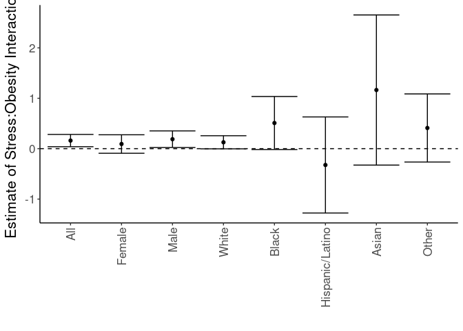<!-- -->

# Sensitivity Analyses

Ran a series of sensitivities analyses, for diferent groupings of BMI or stress.

## Logistic Regressions for Obese/Non-Obese - Stress as Linear Covariate

Ran a series of logistic regressions using obese/non-obese as the categorization, but now using stress as a linear covariate


``` r
glm(DiabetesAny~BMI_cat.Ob.NonOb+Stress_d1+Stress_d1:BMI_cat.Ob.NonOb+Gender+Gender:BMI_cat.Ob.NonOb+BMI_cat.Ob.NonOb:Gender+age+Race.Ethnicity+disadvantage13_17_qrtl, 
    family="binomial",
    data=combined.data) -> obesity.glm4

obesity.glm4 %>%
  tidy() %>%
  kable(caption="Logistic regression of obese vs non-obese on diabetes, with continuous stress as a modifier", digits =c(0,2,3,2,99))
```


Table: Logistic regression of obese vs non-obese on diabetes, with continuous stress as a modifier

|term                            | estimate| std.error| statistic|  p.value|
|:-------------------------------|--------:|---------:|---------:|--------:|
|(Intercept)                     |    -5.48|     0.097|    -56.38| 0.00e+00|
|BMI_cat.Ob.NonObObese           |     1.14|     0.070|     16.27| 1.73e-59|
|Stress_d1                       |     0.04|     0.008|      4.84| 1.30e-06|
|GenderM                         |     0.47|     0.051|      9.29| 1.55e-20|
|age                             |     0.04|     0.001|     36.70| 0.00e+00|
|Race.EthnicityAsian             |     0.66|     0.146|      4.50| 6.70e-06|
|Race.EthnicityBlack             |     0.53|     0.070|      7.65| 2.08e-14|
|Race.EthnicityHispanic/Latino   |     0.37|     0.114|      3.23| 1.23e-03|
|Race.EthnicityOther             |     0.09|     0.089|      1.02| 3.06e-01|
|disadvantage13_17_qrtl          |     0.12|     0.016|      7.83| 4.88e-15|
|BMI_cat.Ob.NonObObese:Stress_d1 |     0.02|     0.010|      1.66| 9.77e-02|
|BMI_cat.Ob.NonObObese:GenderM   |    -0.32|     0.065|     -4.86| 1.16e-06|

``` r
anova(obesity.glm4,test="Chisq") %>% tidy %>%
  kable(caption="Logistic regression of obese vs non-obese on diabetes, with continuous stress as a modifier", digits =c(0,0,0,0,0,99))
```


Table: Logistic regression of obese vs non-obese on diabetes, with continuous stress as a modifier

|term                       | df| deviance| df.residual| residual.deviance|  p.value|
|:--------------------------|--:|--------:|-----------:|-----------------:|--------:|
|NULL                       | NA|       NA|       36392|             29765|       NA|
|BMI_cat.Ob.NonOb           |  1|     1127|       36391|             28637| 0.00e+00|
|Stress_d1                  |  1|       35|       36390|             28602| 2.64e-09|
|Gender                     |  1|      182|       36389|             28420| 1.63e-41|
|age                        |  1|     1426|       36388|             26993| 0.00e+00|
|Race.Ethnicity             |  4|      117|       36384|             26876| 2.00e-24|
|disadvantage13_17_qrtl     |  1|       63|       36383|             26814| 2.56e-15|
|BMI_cat.Ob.NonOb:Stress_d1 |  1|        4|       36382|             26809| 4.28e-02|
|BMI_cat.Ob.NonOb:Gender    |  1|       24|       36381|             26786| 1.08e-06|

## Logistic Regressions for Obese/Non-Obese - Stress as Discrete Covariate

Ran a series of logistic regressions using obese/non-obese as the categorization, but now using stress as a non-linear discrete covariate


``` r
glm(DiabetesAny~BMI_cat.Ob.NonOb+as.factor(Stress_d1)+as.factor(Stress_d1):BMI_cat.Ob.NonOb+Gender+BMI_cat.Ob.NonOb:Gender+Gender:BMI_cat.Ob.NonOb+age+Race.Ethnicity+disadvantage13_17_qrtl, 
    family="binomial",
    data=combined.data) -> obesity.glm4

obesity.glm4 %>%
  tidy() %>%
  kable(caption="Logistic regression of obese vs non-obese on diabetes, with discrete stress as a modifier", digits =c(0,2,3,2,99))
```


Table: Logistic regression of obese vs non-obese on diabetes, with discrete stress as a modifier

|term                                         | estimate| std.error| statistic|  p.value|
|:--------------------------------------------|--------:|---------:|---------:|--------:|
|(Intercept)                                  |    -5.48|     0.114|    -48.26| 0.00e+00|
|BMI_cat.Ob.NonObObese                        |     1.22|     0.104|     11.70| 1.30e-31|
|as.factor(Stress_d1)1                        |     0.00|     0.107|      0.02| 9.86e-01|
|as.factor(Stress_d1)2                        |     0.09|     0.108|      0.79| 4.29e-01|
|as.factor(Stress_d1)3                        |     0.12|     0.117|      1.02| 3.10e-01|
|as.factor(Stress_d1)4                        |     0.12|     0.108|      1.07| 2.83e-01|
|as.factor(Stress_d1)5                        |     0.26|     0.108|      2.44| 1.46e-02|
|as.factor(Stress_d1)6                        |     0.20|     0.111|      1.83| 6.68e-02|
|as.factor(Stress_d1)7                        |     0.25|     0.113|      2.25| 2.45e-02|
|as.factor(Stress_d1)8                        |     0.19|     0.099|      1.96| 4.95e-02|
|as.factor(Stress_d1)9                        |     0.16|     0.140|      1.16| 2.46e-01|
|as.factor(Stress_d1)10                       |     0.42|     0.156|      2.66| 7.70e-03|
|as.factor(Stress_d1)11                       |     0.52|     0.197|      2.67| 7.64e-03|
|as.factor(Stress_d1)12                       |     0.55|     0.253|      2.18| 2.91e-02|
|as.factor(Stress_d1)13                       |     0.51|     0.332|      1.55| 1.21e-01|
|as.factor(Stress_d1)14                       |     1.57|     0.321|      4.88| 1.06e-06|
|as.factor(Stress_d1)15                       |     0.22|     0.745|      0.30| 7.64e-01|
|as.factor(Stress_d1)16                       |    -0.11|     1.046|     -0.10| 9.20e-01|
|GenderM                                      |     0.48|     0.051|      9.35| 8.95e-21|
|age                                          |     0.04|     0.001|     36.69| 0.00e+00|
|Race.EthnicityAsian                          |     0.66|     0.146|      4.51| 6.44e-06|
|Race.EthnicityBlack                          |     0.54|     0.070|      7.70| 1.40e-14|
|Race.EthnicityHispanic/Latino                |     0.37|     0.114|      3.28| 1.04e-03|
|Race.EthnicityOther                          |     0.09|     0.089|      1.06| 2.88e-01|
|disadvantage13_17_qrtl                       |     0.12|     0.016|      7.76| 8.61e-15|
|BMI_cat.Ob.NonObObese:as.factor(Stress_d1)1  |    -0.05|     0.142|     -0.35| 7.25e-01|
|BMI_cat.Ob.NonObObese:as.factor(Stress_d1)2  |    -0.08|     0.144|     -0.53| 5.99e-01|
|BMI_cat.Ob.NonObObese:as.factor(Stress_d1)3  |    -0.04|     0.152|     -0.23| 8.16e-01|
|BMI_cat.Ob.NonObObese:as.factor(Stress_d1)4  |    -0.15|     0.143|     -1.09| 2.78e-01|
|BMI_cat.Ob.NonObObese:as.factor(Stress_d1)5  |    -0.10|     0.142|     -0.70| 4.81e-01|
|BMI_cat.Ob.NonObObese:as.factor(Stress_d1)6  |     0.04|     0.144|      0.29| 7.68e-01|
|BMI_cat.Ob.NonObObese:as.factor(Stress_d1)7  |     0.12|     0.146|      0.82| 4.13e-01|
|BMI_cat.Ob.NonObObese:as.factor(Stress_d1)8  |     0.08|     0.128|      0.58| 5.59e-01|
|BMI_cat.Ob.NonObObese:as.factor(Stress_d1)9  |     0.37|     0.173|      2.15| 3.14e-02|
|BMI_cat.Ob.NonObObese:as.factor(Stress_d1)10 |     0.13|     0.198|      0.67| 5.05e-01|
|BMI_cat.Ob.NonObObese:as.factor(Stress_d1)11 |    -0.11|     0.246|     -0.46| 6.47e-01|
|BMI_cat.Ob.NonObObese:as.factor(Stress_d1)12 |     0.00|     0.311|      0.01| 9.93e-01|
|BMI_cat.Ob.NonObObese:as.factor(Stress_d1)13 |     0.33|     0.407|      0.81| 4.20e-01|
|BMI_cat.Ob.NonObObese:as.factor(Stress_d1)14 |    -1.22|     0.478|     -2.55| 1.07e-02|
|BMI_cat.Ob.NonObObese:as.factor(Stress_d1)15 |     0.21|     0.839|      0.25| 8.01e-01|
|BMI_cat.Ob.NonObObese:as.factor(Stress_d1)16 |     0.35|     1.192|      0.29| 7.71e-01|
|BMI_cat.Ob.NonObObese:GenderM                |    -0.32|     0.065|     -4.89| 9.94e-07|

``` r
anova(obesity.glm4,test="Chisq") %>% tidy %>%
  kable(caption="Logistic regression of obese vs non-obese on diabetes, with discrete stress as a modifier", digits =c(0,0,0,0,0,99))
```


Table: Logistic regression of obese vs non-obese on diabetes, with discrete stress as a modifier

|term                                  | df| deviance| df.residual| residual.deviance|  p.value|
|:-------------------------------------|--:|--------:|-----------:|-----------------:|--------:|
|NULL                                  | NA|       NA|       36392|             29765|       NA|
|BMI_cat.Ob.NonOb                      |  1|     1127|       36391|             28637| 0.00e+00|
|as.factor(Stress_d1)                  | 16|       55|       36375|             28582| 3.78e-06|
|Gender                                |  1|      182|       36374|             28401| 2.25e-41|
|age                                   |  1|     1424|       36373|             26977| 0.00e+00|
|Race.Ethnicity                        |  4|      118|       36369|             26858| 1.21e-24|
|disadvantage13_17_qrtl                |  1|       62|       36368|             26797| 3.76e-15|
|BMI_cat.Ob.NonOb:as.factor(Stress_d1) | 16|       22|       36352|             26774| 1.30e-01|
|BMI_cat.Ob.NonOb:Gender               |  1|       24|       36351|             26750| 9.23e-07|


## Logistic Regressions for Obese/Non-Obese - Stress as Quartile

Ran a series of logistic regressions using obese/non-obese as the categorization, but now using stress as a quartile.


``` r
glm(DiabetesAny~BMI_cat.Ob.NonOb+as.factor(Stress.quartile)+as.factor(Stress.quartile):BMI_cat.Ob.NonOb+Gender+Gender:BMI_cat.Ob.NonOb+age+Race.Ethnicity+disadvantage13_17_qrtl, 
    family="binomial",
    data=combined.data) -> obesity.glm4

obesity.glm4 %>%
  tidy() %>%
  kable(caption="Logistic regression of obese vs non-obese on diabetes, with discrete stress as a modifier", digits =c(0,2,3,2,99))
```


Table: Logistic regression of obese vs non-obese on diabetes, with discrete stress as a modifier

|term                                               | estimate| std.error| statistic|  p.value|
|:--------------------------------------------------|--------:|---------:|---------:|--------:|
|(Intercept)                                        |    -5.42|     0.093|    -58.13| 0.00e+00|
|BMI_cat.Ob.NonObObese                              |     1.16|     0.061|     18.84| 3.35e-79|
|as.factor(Stress.quartile)Q2                       |     0.17|     0.053|      3.14| 1.71e-03|
|as.factor(Stress.quartile)Q3                       |     0.28|     0.085|      3.25| 1.15e-03|
|as.factor(Stress.quartile)Q4                       |     0.77|     0.211|      3.68| 2.38e-04|
|GenderM                                            |     0.47|     0.051|      9.27| 1.83e-20|
|age                                                |     0.04|     0.001|     36.65| 0.00e+00|
|Race.EthnicityAsian                                |     0.67|     0.146|      4.55| 5.25e-06|
|Race.EthnicityBlack                                |     0.54|     0.070|      7.70| 1.32e-14|
|Race.EthnicityHispanic/Latino                      |     0.37|     0.114|      3.26| 1.10e-03|
|Race.EthnicityOther                                |     0.09|     0.089|      1.05| 2.94e-01|
|disadvantage13_17_qrtl                             |     0.12|     0.016|      7.82| 5.48e-15|
|BMI_cat.Ob.NonObObese:as.factor(Stress.quartile)Q2 |     0.10|     0.069|      1.39| 1.63e-01|
|BMI_cat.Ob.NonObObese:as.factor(Stress.quartile)Q3 |     0.24|     0.105|      2.30| 2.13e-02|
|BMI_cat.Ob.NonObObese:as.factor(Stress.quartile)Q4 |    -0.18|     0.267|     -0.67| 5.05e-01|
|BMI_cat.Ob.NonObObese:GenderM                      |    -0.32|     0.065|     -4.84| 1.27e-06|

``` r
anova(obesity.glm4,test="Chisq") %>% tidy %>%
  kable(caption="Logistic regression of obese vs non-obese on diabetes, with discrete stress as a modifier", digits =c(0,0,0,0,0,99))
```


Table: Logistic regression of obese vs non-obese on diabetes, with discrete stress as a modifier

|term                                        | df| deviance| df.residual| residual.deviance|  p.value|
|:-------------------------------------------|--:|--------:|-----------:|-----------------:|--------:|
|NULL                                        | NA|       NA|       36392|             29765|       NA|
|BMI_cat.Ob.NonOb                            |  1|     1127|       36391|             28637| 0.00e+00|
|as.factor(Stress.quartile)                  |  3|       45|       36388|             28593| 1.07e-09|
|Gender                                      |  1|      182|       36387|             28410| 1.49e-41|
|age                                         |  1|     1422|       36386|             26988| 0.00e+00|
|Race.Ethnicity                              |  4|      119|       36382|             26869| 9.06e-25|
|disadvantage13_17_qrtl                      |  1|       62|       36381|             26807| 2.69e-15|
|BMI_cat.Ob.NonOb:as.factor(Stress.quartile) |  3|        8|       36378|             26798| 4.01e-02|
|BMI_cat.Ob.NonOb:Gender                     |  1|       24|       36377|             26775| 1.18e-06|

## Logistic Regressions for BMI as a Continuous Variable

Ran a series of logistic regressions using BMI as a linear covariate


``` r
glm(DiabetesAny~BMI+Stress+Stress:BMI+Gender+Gender:BMI+age+Race.Ethnicity+disadvantage13_17_qrtl, 
    family="binomial",
    data=combined.data) -> obesity.glm4

obesity.glm4 %>%
  tidy() %>%
  kable(caption="Logistic regression of BMI as a continuous variable on diabetes.", digits =c(0,2,3,2,99))
```


Table: Logistic regression of BMI as a continuous variable on diabetes.

|term                          | estimate| std.error| statistic|  p.value|
|:-----------------------------|--------:|---------:|---------:|--------:|
|(Intercept)                   |    -7.31|     0.146|    -50.13| 0.00e+00|
|BMI                           |     0.08|     0.003|     22.44| 0.00e+00|
|StressHigh                    |     0.09|     0.139|      0.64| 5.21e-01|
|GenderM                       |     0.43|     0.142|      3.00| 2.72e-03|
|age                           |     0.04|     0.001|     37.55| 0.00e+00|
|Race.EthnicityAsian           |     0.73|     0.146|      4.97| 6.56e-07|
|Race.EthnicityBlack           |     0.52|     0.070|      7.42| 1.19e-13|
|Race.EthnicityHispanic/Latino |     0.42|     0.114|      3.63| 2.83e-04|
|Race.EthnicityOther           |     0.08|     0.090|      0.92| 3.58e-01|
|disadvantage13_17_qrtl        |     0.11|     0.016|      7.13| 1.01e-12|
|BMI:StressHigh                |     0.01|     0.004|      1.33| 1.83e-01|
|BMI:GenderM                   |     0.00|     0.004|     -0.70| 4.85e-01|

``` r
anova(obesity.glm4,test="Chisq") %>% tidy %>%
  kable(caption="Logistic regression of BMI as a continuous variable on diabetes.", digits =c(0,0,0,0,0,99))
```


Table: Logistic regression of BMI as a continuous variable on diabetes.

|term                   | df| deviance| df.residual| residual.deviance|  p.value|
|:----------------------|--:|--------:|-----------:|-----------------:|--------:|
|NULL                   | NA|       NA|       36392|             29765|       NA|
|BMI                    |  1|     1250|       36391|             28514| 0.00e+00|
|Stress                 |  1|       37|       36390|             28477| 9.90e-10|
|Gender                 |  1|      228|       36389|             28249| 1.43e-51|
|age                    |  1|     1520|       36388|             26729| 0.00e+00|
|Race.Ethnicity         |  4|      114|       36384|             26615| 1.19e-23|
|disadvantage13_17_qrtl |  1|       51|       36383|             26565| 1.11e-12|
|BMI:Stress             |  1|        2|       36382|             26563| 1.71e-01|
|BMI:Gender             |  1|        0|       36381|             26562| 4.85e-01|


# Summary of Covariates

Stratified data by stress and obesity status and summarized data


``` r
combined.data %>%
  group_by(Stress,BMI_cat.Ob.NonOb) %>%
  count %>%
  knitr::kable(caption="Number of participants by group")
```


Table: Number of participants by group

|Stress |BMI_cat.Ob.NonOb |     n|
|:------|:----------------|-----:|
|Low    |Non-Obese        | 13596|
|Low    |Obese            |  9223|
|High   |Non-Obese        |  9245|
|High   |Obese            |  7496|
|NA     |Non-Obese        | 12972|
|NA     |Obese            |  9261|

``` r
combined.data %>%
  group_by(Stress,BMI_cat.Ob.NonOb,Gender) %>%
  count %>%
    filter(!(is.na(Stress))) %>%
  filter(!(is.na(BMI_cat.Ob.NonOb))) %>%
  knitr::kable(caption="Number of participants by group and gender")
```


Table: Number of participants by group and gender

|Stress |BMI_cat.Ob.NonOb |Gender |    n|
|:------|:----------------|:------|----:|
|Low    |Non-Obese        |F      | 6858|
|Low    |Non-Obese        |M      | 6738|
|Low    |Obese            |F      | 4676|
|Low    |Obese            |M      | 4547|
|High   |Non-Obese        |F      | 4966|
|High   |Non-Obese        |M      | 4279|
|High   |Obese            |F      | 4272|
|High   |Obese            |M      | 3224|

``` r
combined.data %>%
  group_by(Stress,BMI_cat.Ob.NonOb,Race.Ethnicity) %>%
  count %>%
    filter(!(is.na(Stress))) %>%
  filter(!(is.na(BMI_cat.Ob.NonOb))) %>%
  knitr::kable(caption="Number of participants by group and race/ethnicity")
```


Table: Number of participants by group and race/ethnicity

|Stress |BMI_cat.Ob.NonOb |Race.Ethnicity  |     n|
|:------|:----------------|:---------------|-----:|
|Low    |Non-Obese        |White           | 12211|
|Low    |Non-Obese        |Asian           |   314|
|Low    |Non-Obese        |Black           |   394|
|Low    |Non-Obese        |Hispanic/Latino |   249|
|Low    |Non-Obese        |Other           |   428|
|Low    |Obese            |White           |  8221|
|Low    |Obese            |Asian           |    36|
|Low    |Obese            |Black           |   484|
|Low    |Obese            |Hispanic/Latino |   180|
|Low    |Obese            |Other           |   302|
|High   |Non-Obese        |White           |  8181|
|High   |Non-Obese        |Asian           |   184|
|High   |Non-Obese        |Black           |   386|
|High   |Non-Obese        |Hispanic/Latino |   185|
|High   |Non-Obese        |Other           |   309|
|High   |Obese            |White           |  6585|
|High   |Obese            |Asian           |    41|
|High   |Obese            |Black           |   475|
|High   |Obese            |Hispanic/Latino |   163|
|High   |Obese            |Other           |   232|

``` r
combined.data %>%
  group_by(Stress,BMI_cat.Ob.NonOb) %>%
    filter(!(is.na(Stress))) %>%
  filter(!(is.na(BMI_cat.Ob.NonOb))) %>%
  summarize_at(c('BMI','age','Stress_d1'), list(mean=~mean(.x,na.rm=T),
                                    sd=~sd(.x,na.rm=T),
                                    n=~length(.x)))%>%
  knitr::kable(caption="Average BMI, stress and age of participants by group")
```


Table: Average BMI, stress and age of participants by group

|Stress |BMI_cat.Ob.NonOb | BMI_mean| age_mean| Stress_d1_mean| BMI_sd| age_sd| Stress_d1_sd| BMI_n| age_n| Stress_d1_n|
|:------|:----------------|--------:|--------:|--------------:|------:|------:|------------:|-----:|-----:|-----------:|
|Low    |Non-Obese        |     25.3|     53.1|           2.33|   2.94|   17.7|         1.75| 13596| 13596|       13596|
|Low    |Obese            |     36.0|     54.7|           2.43|   5.72|   14.6|         1.75|  9223|  9223|        9223|
|High   |Non-Obese        |     25.2|     51.0|           8.04|   3.09|   17.8|         1.78|  9245|  9245|        9245|
|High   |Obese            |     36.6|     52.6|           8.16|   6.00|   14.6|         1.85|  7496|  7496|        7496|

``` r
combined.data %>%
  group_by(Stress,BMI_cat.Ob.NonOb) %>%
  summarize_at(c('BMI','age','Stress_d1'), list(mean=~mean(.x,na.rm=T),
                                    sd=~sd(.x,na.rm=T),
                                    n=~length(.x)))%>%
  filter(!(is.na(Stress))) %>%
  filter(!(is.na(BMI_cat.Ob.NonOb))) %>%
  knitr::kable(caption="Average BMI,stress and age of participants by group,complete cases")
```


Table: Average BMI,stress and age of participants by group,complete cases

|Stress |BMI_cat.Ob.NonOb | BMI_mean| age_mean| Stress_d1_mean| BMI_sd| age_sd| Stress_d1_sd| BMI_n| age_n| Stress_d1_n|
|:------|:----------------|--------:|--------:|--------------:|------:|------:|------------:|-----:|-----:|-----------:|
|Low    |Non-Obese        |     25.3|     53.1|           2.33|   2.94|   17.7|         1.75| 13596| 13596|       13596|
|Low    |Obese            |     36.0|     54.7|           2.43|   5.72|   14.6|         1.75|  9223|  9223|        9223|
|High   |Non-Obese        |     25.2|     51.0|           8.04|   3.09|   17.8|         1.78|  9245|  9245|        9245|
|High   |Obese            |     36.6|     52.6|           8.16|   6.00|   14.6|         1.85|  7496|  7496|        7496|


# Session Information


``` r
sessionInfo()
```

```
## R version 4.4.0 (2024-04-24)
## Platform: x86_64-pc-linux-gnu
## Running under: Red Hat Enterprise Linux 8.8 (Ootpa)
## 
## Matrix products: default
## BLAS:   /sw/pkgs/arc/stacks/gcc/13.2.0/R/4.4.0/lib64/R/lib/libRblas.so 
## LAPACK: /sw/pkgs/arc/stacks/gcc/13.2.0/R/4.4.0/lib64/R/lib/libRlapack.so;  LAPACK version 3.12.0
## 
## locale:
##  [1] LC_CTYPE=en_US.UTF-8       LC_NUMERIC=C              
##  [3] LC_TIME=en_US.UTF-8        LC_COLLATE=en_US.UTF-8    
##  [5] LC_MONETARY=en_US.UTF-8    LC_MESSAGES=en_US.UTF-8   
##  [7] LC_PAPER=en_US.UTF-8       LC_NAME=C                 
##  [9] LC_ADDRESS=C               LC_TELEPHONE=C            
## [11] LC_MEASUREMENT=en_US.UTF-8 LC_IDENTIFICATION=C       
## 
## time zone: America/Detroit
## tzcode source: system (glibc)
## 
## attached base packages:
## [1] stats     graphics  grDevices utils     datasets  methods   base     
## 
## other attached packages:
## [1] broom_1.0.6   ggplot2_3.5.1 forcats_1.0.0 tidyr_1.3.1   dplyr_1.1.4  
## [6] readr_2.1.5   knitr_1.48   
## 
## loaded via a namespace (and not attached):
##  [1] bit_4.0.5         gtable_0.3.5      jsonlite_1.8.8    highr_0.11       
##  [5] compiler_4.4.0    crayon_1.5.3      tidyselect_1.2.1  stringr_1.5.1    
##  [9] parallel_4.4.0    jquerylib_0.1.4   scales_1.3.0      yaml_2.3.9       
## [13] fastmap_1.2.0     R6_2.5.1          labeling_0.4.3    generics_0.1.3   
## [17] backports_1.5.0   tibble_3.2.1      munsell_0.5.1     bslib_0.7.0      
## [21] pillar_1.9.0      tzdb_0.4.0        rlang_1.1.4       utf8_1.2.4       
## [25] stringi_1.8.4     cachem_1.1.0      xfun_0.45         sass_0.4.9       
## [29] bit64_4.0.5       cli_3.6.3         withr_3.0.0       magrittr_2.0.3   
## [33] grid_4.4.0        digest_0.6.36     vroom_1.6.5       hms_1.1.3        
## [37] lifecycle_1.0.4   vctrs_0.6.5       evaluate_0.24.0   glue_1.7.0       
## [41] farver_2.1.2      colorspace_2.1-0  fansi_1.0.6       rmarkdown_2.27   
## [45] purrr_1.0.2       tools_4.4.0       pkgconfig_2.0.3   htmltools_0.5.8.1
```
