## Purpose

To test the effect modification of obesity on the stress-diabetes relationships.


``` r
library(knitr)
#figures made will go to directory called figures, will make them as both png and pdf files 
opts_chunk$set(fig.path='figures/',
               echo=TRUE, warning=FALSE, message=FALSE,dev=c('png','pdf'))
options(scipen = 2, digits = 3)

library(readr)
library(dplyr)
```

```
## 
## Attaching package: 'dplyr'
```

```
## The following objects are masked from 'package:stats':
## 
##     filter, lag
```

```
## The following objects are masked from 'package:base':
## 
##     intersect, setdiff, setequal, union
```

``` r
library(tidyr)
library(broom)

input.file <- 'data-combined.csv'
combined.data <- read_csv(input.file)
```

```
## Rows: 61793 Columns: 43
```

```
## ── Column specification ────────────────────────────────────────────────────────
## Delimiter: ","
## chr  (18): DeID_PatientID, Gender, DeID_Survey_Date, DeID_EncounterID, BMI_c...
## dbl  (23): age, Stress_d1, Survey.Year, CardiacArrhythmias, ChronicPulmonary...
## dttm  (2): Survey.Date, DeID_Diabetes_Diagnosis
## 
## ℹ Use `spec()` to retrieve the full column specification for this data.
## ℹ Specify the column types or set `show_col_types = FALSE` to quiet this message.
```

Loaded in the cleaned data from data-combined.csv. This script can be found in /nfs/turbo/precision-health/DataDirect/HUM00219435 - Obesity as a modifier of chronic psy/2023-03-14/2150 - Obesity and Stress - Cohort - DeID - 2023-03-14 and was most recently run on Mon Sep 30 14:00:18 2024. This dataset has 61793 values.


``` r
library(forcats)
combined.data <- 
  combined.data %>%
  mutate(BMI_cat= factor(BMI_cat, 
                         levels=c("Underweight",
                                  "Normal",
                                  "Overweight",
                                  'Class I Obese',
                                  'Class II Obese',
                                  'Class III Obese'))) %>%
  mutate(BMI_cat.obese= factor(BMI_cat.obese, 
                               levels=c("Underweight",
                                        "Normal",
                                        "Overweight",
                                        'Obese'))) %>%
  mutate(BMI_cat.Ob.NonOb= factor(BMI_cat.Ob.NonOb, 
                                  levels=c("Non-Obese",
                                           'Obese'))) %>%
  mutate(Stress=relevel(as.factor(High.Stress),ref="Low")) %>% #set low as reference value
    mutate(Race.Ethnicity=relevel(as.factor(Race.Ethnicity),ref="White")) %>% #set white as reference value
  mutate(Stress.quartile=fct_recode(as.factor(Stress.quartile),
                                    "Q1"="(-0.016,4]",
                                    "Q2"="(4,8]",
                                    "Q3"="(8,12]",
                                    "Q4"="(12,16]")) %>%
    mutate(Stress.quartile= factor(Stress.quartile, 
                                  levels=c("Q1","Q2","Q3","Q4"))) 
  
# need to clean race data
```

# Diabetes Rates by BMI

Stratified diagnoses by various BMI categories

## Diabetes by BMI Category


``` r
#calculating diabetes rates by bmi category
with(combined.data, table(Type2Diabetes,BMI_cat)) %>% 
  data.frame %>%
  pivot_wider(names_from=Type2Diabetes,
              values_from = Freq) %>%
  rename(Diabetes=`1`,
         NonDiabetes=`0`) %>%
  mutate(Total=Diabetes+NonDiabetes) %>%
  mutate(Percent=Diabetes/Total*100) -> diabetes.bmi.counts

kable(diabetes.bmi.counts, caption="Diabetes rates by BMI category not including gender")
```


Table: Diabetes rates by BMI category not including gender

|BMI_cat         | NonDiabetes| Diabetes| Total| Percent|
|:---------------|-----------:|--------:|-----:|-------:|
|Underweight     |         473|       17|   490|    3.47|
|Normal          |       14198|     1016| 15214|    6.68|
|Overweight      |       17550|     2559| 20109|   12.73|
|Class I Obese   |       10888|     2888| 13776|   20.96|
|Class II Obese  |        5036|     1931|  6967|   27.72|
|Class III Obese |        3397|     1840|  5237|   35.13|

``` r
library(ggplot2)

ggplot(diabetes.bmi.counts,
       aes(y=Percent,
           x=BMI_cat)) +
  geom_bar(stat='identity',position='dodge') +
  labs(y="Prevalence of Type 2 Diabetes",
       title="Obesity",
       x="") +
  theme_classic() +
  scale_fill_grey() +
  theme(text=element_text(size=16),
        axis.text.x=element_text(angle=90,vjust=0.5,hjust=1),
        legend.position = c(0.1,0.85))
```

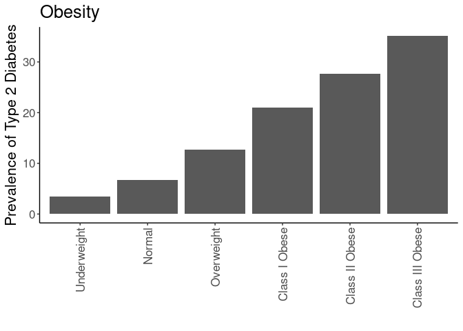<!-- -->

``` r
#calculating diabetes rates by bmi category by gender
with(combined.data, table(Type2Diabetes,BMI_cat,Gender)) %>% 
  data.frame %>%
  pivot_wider(names_from=Type2Diabetes,
              values_from = Freq) %>%
  rename(Diabetes=`1`,
         NonDiabetes=`0`) %>%
  mutate(Total=Diabetes+NonDiabetes) %>%
  mutate(Percent=Diabetes/Total*100) -> diabetes.bmi.counts

kable(diabetes.bmi.counts, caption="Diabetes rates by BMI category")
```


Table: Diabetes rates by BMI category

|BMI_cat         |Gender | NonDiabetes| Diabetes| Total| Percent|
|:---------------|:------|-----------:|--------:|-----:|-------:|
|Underweight     |F      |         326|       13|   339|    3.83|
|Normal          |F      |        8822|      465|  9287|    5.01|
|Overweight      |F      |        8105|      961|  9066|   10.60|
|Class I Obese   |F      |        5333|     1167|  6500|   17.95|
|Class II Obese  |F      |        2948|      958|  3906|   24.53|
|Class III Obese |F      |        2393|     1170|  3563|   32.84|
|Underweight     |M      |         147|        4|   151|    2.65|
|Normal          |M      |        5376|      551|  5927|    9.30|
|Overweight      |M      |        9445|     1598| 11043|   14.47|
|Class I Obese   |M      |        5555|     1721|  7276|   23.65|
|Class II Obese  |M      |        2088|      973|  3061|   31.79|
|Class III Obese |M      |        1004|      670|  1674|   40.02|

``` r
ggplot(diabetes.bmi.counts,
       aes(y=Percent,
           x=BMI_cat)) +
  geom_bar(stat='identity',position='dodge') +
  labs(y="Prevalence of Type 2 Diabetes",
       title="Gender",
       x="") +
  theme_classic() +
  scale_fill_grey() +
  facet_grid(.~Gender) +
  theme(text=element_text(size=16),
        axis.text.x=element_text(angle=90,vjust=0.5,hjust=1),
        legend.position = c(0.1,0.85))
```

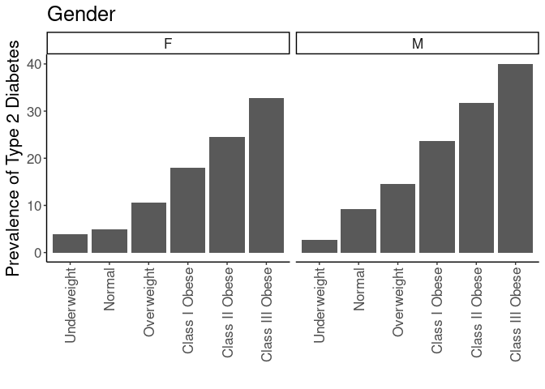<!-- -->

## Diabetes Rate by BMI and Stress

This analysis uses all the BMI categories


``` r
#calculating diabetes rates by bmi category and stress
with(combined.data, table(Type2Diabetes,BMI_cat,Stress)) %>% 
  data.frame %>%
  pivot_wider(names_from=Type2Diabetes,
              values_from = Freq) %>%
  rename(Diabetes=`1`,
         NonDiabetes=`0`) %>%
  mutate(Total=Diabetes+NonDiabetes) %>%
  mutate(Percent=Diabetes/Total*100) -> diabetes.bmi.stress.counts

library(ggplot2)

kable(diabetes.bmi.stress.counts, caption="Diabetes rates by BMI category")
```


Table: Diabetes rates by BMI category

|BMI_cat         |Stress | NonDiabetes| Diabetes| Total| Percent|
|:---------------|:------|-----------:|--------:|-----:|-------:|
|Underweight     |Low    |         129|        3|   132|    2.27|
|Normal          |Low    |        5413|      314|  5727|    5.48|
|Overweight      |Low    |        6876|      861|  7737|   11.13|
|Class I Obese   |Low    |        4125|      920|  5045|   18.24|
|Class II Obese  |Low    |        1832|      603|  2435|   24.76|
|Class III Obese |Low    |        1210|      533|  1743|   30.58|
|Underweight     |High   |         145|        6|   151|    3.97|
|Normal          |High   |        3659|      262|  3921|    6.68|
|Overweight      |High   |        4540|      633|  5173|   12.24|
|Class I Obese   |High   |        2985|      840|  3825|   21.96|
|Class II Obese  |High   |        1442|      594|  2036|   29.18|
|Class III Obese |High   |        1063|      572|  1635|   34.98|

``` r
ggplot(diabetes.bmi.stress.counts,
       aes(y=Percent,
           x=BMI_cat,
           fill=Stress)) +
  geom_bar(stat='identity',position='dodge') +
  labs(y="Prevalence of Type 2 Diabetes",
       title="Obesity",
       x="") +
  theme_classic() +
  scale_fill_grey() +
  theme(text=element_text(size=16),
        axis.text.x=element_text(angle=90,vjust=0.5,hjust=1),
        legend.position = c(0.1,0.85))
```

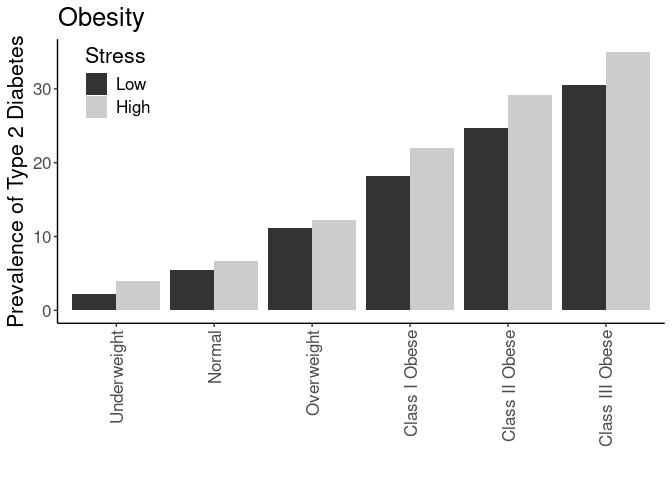<!-- -->


``` r
#calculating diabetes rates by bmi category and stress
with(combined.data, table(Type2Diabetes,BMI_cat,Stress,Gender)) %>% 
  data.frame %>%
  pivot_wider(names_from=Type2Diabetes,
              values_from = Freq) %>%
  rename(Diabetes=`1`,
         NonDiabetes=`0`) %>%
  mutate(Total=Diabetes+NonDiabetes) %>%
  mutate(Percent=Diabetes/Total*100) -> diabetes.bmi.stress.counts

library(ggplot2)

kable(diabetes.bmi.stress.counts, caption="Diabetes rates by BMI category")
```


Table: Diabetes rates by BMI category

|BMI_cat         |Stress |Gender | NonDiabetes| Diabetes| Total| Percent|
|:---------------|:------|:------|-----------:|--------:|-----:|-------:|
|Underweight     |Low    |F      |          90|        3|    93|    3.23|
|Normal          |Low    |F      |        3301|      134|  3435|    3.90|
|Overweight      |Low    |F      |        3054|      276|  3330|    8.29|
|Class I Obese   |Low    |F      |        1890|      321|  2211|   14.52|
|Class II Obese  |Low    |F      |        1040|      265|  1305|   20.31|
|Class III Obese |Low    |F      |         821|      339|  1160|   29.22|
|Underweight     |High   |F      |          94|        5|    99|    5.05|
|Normal          |High   |F      |        2280|      121|  2401|    5.04|
|Overweight      |High   |F      |        2201|      265|  2466|   10.75|
|Class I Obese   |High   |F      |        1590|      366|  1956|   18.71|
|Class II Obese  |High   |F      |         866|      316|  1182|   26.73|
|Class III Obese |High   |F      |         766|      368|  1134|   32.45|
|Underweight     |Low    |M      |          39|        0|    39|    0.00|
|Normal          |Low    |M      |        2112|      180|  2292|    7.85|
|Overweight      |Low    |M      |        3822|      585|  4407|   13.27|
|Class I Obese   |Low    |M      |        2235|      599|  2834|   21.14|
|Class II Obese  |Low    |M      |         792|      338|  1130|   29.91|
|Class III Obese |Low    |M      |         389|      194|   583|   33.28|
|Underweight     |High   |M      |          51|        1|    52|    1.92|
|Normal          |High   |M      |        1379|      141|  1520|    9.28|
|Overweight      |High   |M      |        2339|      368|  2707|   13.59|
|Class I Obese   |High   |M      |        1395|      474|  1869|   25.36|
|Class II Obese  |High   |M      |         576|      278|   854|   32.55|
|Class III Obese |High   |M      |         297|      204|   501|   40.72|

``` r
ggplot(diabetes.bmi.stress.counts,
       aes(y=Percent,
           x=BMI_cat,
           fill=Stress)) +
  geom_bar(stat='identity',position='dodge') +
  labs(y="Prevalence of Type 2 Diabetes",
       title="BMI Categories",
       x="") +
  theme_classic() +
  scale_fill_grey() +
  facet_grid(.~Gender) +
  theme(text=element_text(size=16),
        axis.text.x=element_text(angle=90,vjust=0.5,hjust=1),
        legend.position = c(0.1,0.85))
```

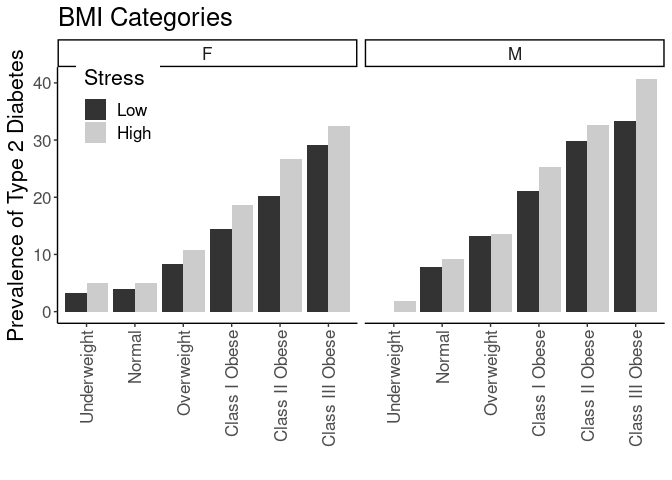<!-- -->


# Diabetes Rates by Obese/Not Obese and Stress


``` r
with(combined.data, table(Type2Diabetes,BMI_cat.Ob.NonOb,Stress)) %>% 
  data.frame %>%
  pivot_wider(names_from=Type2Diabetes,
              values_from = Freq) %>%
  rename(Diabetes=`1`,
         NonDiabetes=`0`) %>%
  mutate(Total=Diabetes+NonDiabetes) %>%
  mutate(Percent=Diabetes/Total*100) -> diabetes.BMI_cat.Ob.NonOb.stress.counts

kable(diabetes.BMI_cat.Ob.NonOb.stress.counts, caption="Diabetes Rates by Obese or not and Stress")
```


Table: Diabetes Rates by Obese or not and Stress

|BMI_cat.Ob.NonOb |Stress | NonDiabetes| Diabetes| Total| Percent|
|:----------------|:------|-----------:|--------:|-----:|-------:|
|Non-Obese        |Low    |       12418|     1178| 13596|    8.66|
|Obese            |Low    |        7167|     2056|  9223|   22.29|
|Non-Obese        |High   |        8344|      901|  9245|    9.75|
|Obese            |High   |        5490|     2006|  7496|   26.76|

``` r
ggplot(diabetes.BMI_cat.Ob.NonOb.stress.counts,
       aes(y=Percent,
           x=BMI_cat.Ob.NonOb,
           fill=Stress)) +
  geom_bar(stat='identity',position='dodge') +
  labs(y="Prevalence of Type 2 Diabetes",
       title="Obesity",
       x="") +
  theme_classic() +
  scale_fill_grey() +
  theme(text=element_text(size=16),
        axis.text.x=element_text(angle=90,vjust=0.5,hjust=1),
        legend.position = c(0.1,0.75))
```

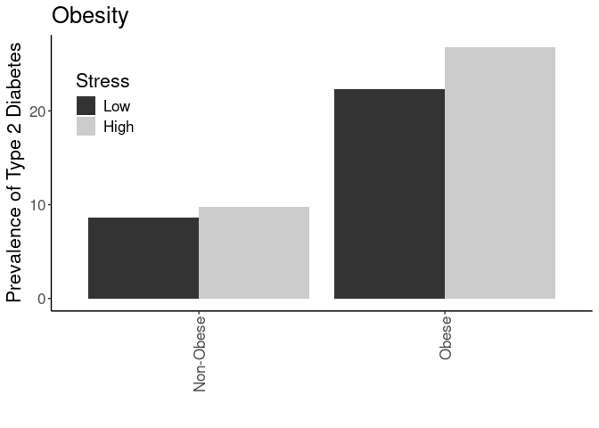<!-- -->


``` r
with(combined.data, table(Type2Diabetes,BMI_cat.Ob.NonOb,Stress,Gender)) %>% 
  data.frame %>%
  pivot_wider(names_from=Type2Diabetes,
              values_from = Freq) %>%
  rename(Diabetes=`1`,
         NonDiabetes=`0`) %>%
  mutate(Total=Diabetes+NonDiabetes) %>%
  mutate(Percent=Diabetes/Total*100) -> diabetes.BMI_cat.Ob.NonOb.stress.counts

kable(diabetes.BMI_cat.Ob.NonOb.stress.counts, caption="Diabetes Rates by Obese or not and Stress")
```


Table: Diabetes Rates by Obese or not and Stress

|BMI_cat.Ob.NonOb |Stress |Gender | NonDiabetes| Diabetes| Total| Percent|
|:----------------|:------|:------|-----------:|--------:|-----:|-------:|
|Non-Obese        |Low    |F      |        6445|      413|  6858|    6.02|
|Obese            |Low    |F      |        3751|      925|  4676|   19.78|
|Non-Obese        |High   |F      |        4575|      391|  4966|    7.87|
|Obese            |High   |F      |        3222|     1050|  4272|   24.58|
|Non-Obese        |Low    |M      |        5973|      765|  6738|   11.35|
|Obese            |Low    |M      |        3416|     1131|  4547|   24.87|
|Non-Obese        |High   |M      |        3769|      510|  4279|   11.92|
|Obese            |High   |M      |        2268|      956|  3224|   29.65|

``` r
ggplot(diabetes.BMI_cat.Ob.NonOb.stress.counts,
       aes(y=Percent,
           x=BMI_cat.Ob.NonOb,
           fill=Stress)) +
  geom_bar(stat='identity',position='dodge') +
  labs(y="Prevalence of Type 2 Diabetes",
       title="Gender",
       x="") +
  facet_grid(.~Gender) +
  theme_classic() +
  scale_fill_grey() +
  theme(text=element_text(size=16),
        axis.text.x=element_text(angle=90,vjust=0.5,hjust=1),
        legend.position = c(0.1,0.75))
```

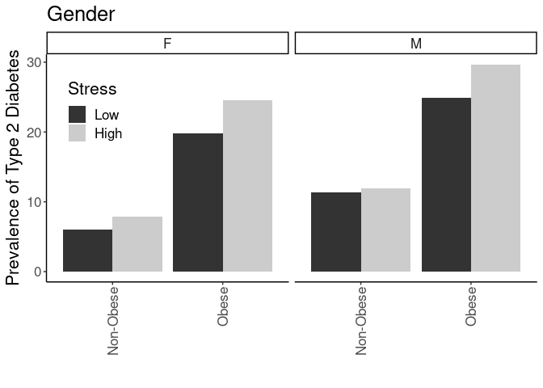<!-- -->


``` r
with(combined.data, table(Type2Diabetes,BMI_cat.Ob.NonOb,Stress,Race.Ethnicity)) %>% 
  data.frame %>%
  pivot_wider(names_from=Type2Diabetes,
              values_from = Freq) %>%
  rename(Diabetes=`1`,
         NonDiabetes=`0`) %>%
  mutate(Total=Diabetes+NonDiabetes) %>%
  mutate(Percent=Diabetes/Total*100) -> diabetes.BMI_cat.Ob.NonOb.stress.counts

ggplot(diabetes.BMI_cat.Ob.NonOb.stress.counts,
       aes(y=Percent,
           x=BMI_cat.Ob.NonOb,
           fill=Stress)) +
  geom_bar(stat='identity',position='dodge') +
  labs(y="Prevalence of Type 2 Diabetes",
       title="Race and Ethnicity",
       x="") +
  facet_grid(.~Race.Ethnicity) +
  theme_classic() +
  scale_fill_grey() +
  theme(text=element_text(size=16),
        axis.text.x=element_text(angle=90,vjust=0.5,hjust=1),
        legend.position = "none")
```

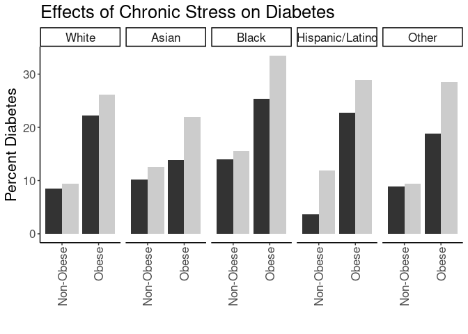<!-- -->

# Stratified by Neighborhood Disadvantage


``` r
with(combined.data, table(Type2Diabetes,BMI_cat.Ob.NonOb,Stress,disadvantage13_17_qrtl)) %>% 
  data.frame %>%
  pivot_wider(names_from=Type2Diabetes,
              values_from = Freq) %>%
  rename(Diabetes=`1`,
         NonDiabetes=`0`) %>%
  mutate(Total=Diabetes+NonDiabetes) %>%
  mutate(Percent=Diabetes/Total*100) -> diabetes.BMI_cat.Ob.NonOb.stress.counts

ggplot(diabetes.BMI_cat.Ob.NonOb.stress.counts,
       aes(y=Percent,
           x=BMI_cat.Ob.NonOb,
           fill=Stress)) +
  geom_bar(stat='identity',position='dodge') +
  labs(y="Prevalence of Type 2 Diabetes",
       title="Neighborhood Disadvantage",
       x="") +
  facet_grid(.~disadvantage13_17_qrtl) +
  theme_classic() +
  scale_fill_grey() +
  theme(text=element_text(size=16),
        axis.text.x=element_text(angle=90,vjust=0.5,hjust=1),
        legend.position = "none")
```

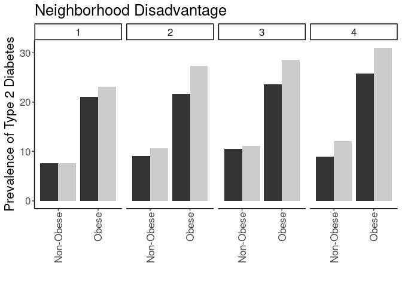<!-- -->


## Logistic Regressions for Obese/Non-Obese

Ran a series of logistic regressions using obese/non-obese as the categorization


``` r
glm(Type2Diabetes~BMI_cat.Ob.NonOb, 
    family="binomial",
    data=combined.data) -> obesity.glm1

obesity.glm1 %>%
  tidy() %>%
  kable(caption="Logistic regression of obese vs non-obese on diabetes", digits =c(0,3,3,2,99))
```


Table: Logistic regression of obese vs non-obese on diabetes

|term                  | estimate| std.error| statistic| p.value|
|:---------------------|--------:|---------:|---------:|-------:|
|(Intercept)           |    -2.19|     0.018|    -124.7|       0|
|BMI_cat.Ob.NonObObese |     1.13|     0.023|      49.9|       0|

``` r
anova(obesity.glm1,test="Chisq") %>% tidy %>%
  kable(caption="Logistic regression of obese vs non-obese on diabetes, ", digits =c(0,0,0,0,0,99))
```


Table: Logistic regression of obese vs non-obese on diabetes, 

|term             | df| deviance| df.residual| residual.deviance| p.value|
|:----------------|--:|--------:|-----------:|-----------------:|-------:|
|NULL             | NA|       NA|       61792|             55529|      NA|
|BMI_cat.Ob.NonOb |  1|     2624|       61791|             52905|       0|

``` r
#adding in stress as a modifier, this is model 1
glm(Type2Diabetes~BMI_cat.Ob.NonOb+Stress+Stress:BMI_cat.Ob.NonOb, 
    family="binomial",
    data=combined.data) -> obesity.glm2

obesity.glm2 %>%
  tidy() %>%
  kable(caption="Logistic regression of obese vs non-obese on diabetes, with stress as a modifier", digits =c(0,3,3,2,99))
```


Table: Logistic regression of obese vs non-obese on diabetes, with stress as a modifier

|term                             | estimate| std.error| statistic| p.value|
|:--------------------------------|--------:|---------:|---------:|-------:|
|(Intercept)                      |   -2.355|     0.030|    -77.26| 0.00000|
|BMI_cat.Ob.NonObObese            |    1.107|     0.039|     28.06| 0.00000|
|StressHigh                       |    0.130|     0.046|      2.79| 0.00531|
|BMI_cat.Ob.NonObObese:StressHigh |    0.112|     0.059|      1.91| 0.05622|

``` r
anova(obesity.glm2,test="Chisq") %>% tidy %>%
  kable(caption="Logistic regression of obese vs non-obese on diabetes, with stress as a modifier", digits =c(0,0,0,0,0,99))
```


Table: Logistic regression of obese vs non-obese on diabetes, with stress as a modifier

|term                    | df| deviance| df.residual| residual.deviance|  p.value|
|:-----------------------|--:|--------:|-----------:|-----------------:|--------:|
|NULL                    | NA|       NA|       39559|             34154|       NA|
|BMI_cat.Ob.NonOb        |  1|     1686|       39558|             32468| 0.00e+00|
|Stress                  |  1|       49|       39557|             32419| 2.78e-12|
|BMI_cat.Ob.NonOb:Stress |  1|        4|       39556|             32416| 5.60e-02|

``` r
#adding in age 
glm(Type2Diabetes~BMI_cat.Ob.NonOb+Stress+Stress:BMI_cat.Ob.NonOb+age, 
    family="binomial",
    data=combined.data) -> obesity.glm3

obesity.glm3 %>%
  tidy() %>%
  kable(caption="Logistic regression of obese vs non-obese on diabetes, with stress as a modifier and age as a covariate", digits =c(0,3,3,2,99))
```


Table: Logistic regression of obese vs non-obese on diabetes, with stress as a modifier and age as a covariate

|term                             | estimate| std.error| statistic|   p.value|
|:--------------------------------|--------:|---------:|---------:|---------:|
|(Intercept)                      |   -4.797|     0.072|    -66.19| 0.0000000|
|BMI_cat.Ob.NonObObese            |    1.149|     0.040|     28.41| 0.0000000|
|StressHigh                       |    0.212|     0.047|      4.47| 0.0000077|
|age                              |    0.042|     0.001|     40.07| 0.0000000|
|BMI_cat.Ob.NonObObese:StressHigh |    0.130|     0.060|      2.15| 0.0312009|

``` r
anova(obesity.glm3,test="Chisq") %>% tidy %>%
  kable(caption="Logistic regression of obese vs non-obese on diabetes, with stress as a modifier and age and gender as covariate", digits =c(0,0,0,0,0,99))
```


Table: Logistic regression of obese vs non-obese on diabetes, with stress as a modifier and age and gender as covariate

|term                    | df| deviance| df.residual| residual.deviance|  p.value|
|:-----------------------|--:|--------:|-----------:|-----------------:|--------:|
|NULL                    | NA|       NA|       39559|             34154|       NA|
|BMI_cat.Ob.NonOb        |  1|     1686|       39558|             32468| 0.00e+00|
|Stress                  |  1|       49|       39557|             32419| 2.78e-12|
|age                     |  1|     1840|       39556|             30579| 0.00e+00|
|BMI_cat.Ob.NonOb:Stress |  1|        5|       39555|             30575| 3.11e-02|

``` r
#adding in sex and obesity x sex
glm(Type2Diabetes~BMI_cat.Ob.NonOb+Stress+Stress:BMI_cat.Ob.NonOb+Gender+BMI_cat.Ob.NonOb:Gender+age, 
    family="binomial",
    data=combined.data) -> obesity.glm4

obesity.glm4 %>%
  tidy() %>%
  kable(caption="Logistic regression of obese vs non-obese on diabetes, with stress as a modifier and age, gender and race as covariates", digits =c(0,3,3,2,99))
```


Table: Logistic regression of obese vs non-obese on diabetes, with stress as a modifier and age, gender and race as covariates

|term                             | estimate| std.error| statistic|  p.value|
|:--------------------------------|--------:|---------:|---------:|--------:|
|(Intercept)                      |   -4.991|     0.077|    -64.63| 0.00e+00|
|BMI_cat.Ob.NonObObese            |    1.350|     0.054|     25.00| 0.00e+00|
|StressHigh                       |    0.230|     0.048|      4.82| 1.43e-06|
|GenderM                          |    0.451|     0.048|      9.38| 6.50e-21|
|age                              |    0.041|     0.001|     38.80| 0.00e+00|
|BMI_cat.Ob.NonObObese:StressHigh |    0.117|     0.061|      1.94| 5.26e-02|
|BMI_cat.Ob.NonObObese:GenderM    |   -0.348|     0.061|     -5.72| 1.07e-08|

``` r
anova(obesity.glm4,test="Chisq") %>% tidy %>%
  kable(caption="Logistic regression of obese vs non-obese on diabetes, with stress as a modifier and age, gender and race as covariate", digits =c(0,0,0,0,0,99))
```


Table: Logistic regression of obese vs non-obese on diabetes, with stress as a modifier and age, gender and race as covariate

|term                    | df| deviance| df.residual| residual.deviance|  p.value|
|:-----------------------|--:|--------:|-----------:|-----------------:|--------:|
|NULL                    | NA|       NA|       39559|             34154|       NA|
|BMI_cat.Ob.NonOb        |  1|     1686|       39558|             32468| 0.00e+00|
|Stress                  |  1|       49|       39557|             32419| 2.78e-12|
|Gender                  |  1|      190|       39556|             32230| 3.28e-43|
|age                     |  1|     1714|       39555|             30516| 0.00e+00|
|BMI_cat.Ob.NonOb:Stress |  1|        5|       39554|             30511| 2.35e-02|
|BMI_cat.Ob.NonOb:Gender |  1|       33|       39553|             30478| 9.52e-09|

``` r
#adding in race and ethnicity
glm(Type2Diabetes~BMI_cat.Ob.NonOb+Stress+Stress:BMI_cat.Ob.NonOb+Gender+BMI_cat.Ob.NonOb:Gender+age+Race.Ethnicity, 
    family="binomial",
    data=combined.data) -> obesity.glm5

obesity.glm5 %>%
  tidy() %>%
  kable(caption="Logistic regression of obese vs non-obese on diabetes, with stress as a modifier and age, gender and race as covariates", digits =c(0,3,3,2,99))
```


Table: Logistic regression of obese vs non-obese on diabetes, with stress as a modifier and age, gender and race as covariates

|term                             | estimate| std.error| statistic|  p.value|
|:--------------------------------|--------:|---------:|---------:|--------:|
|(Intercept)                      |   -5.135|     0.079|    -64.86| 0.00e+00|
|BMI_cat.Ob.NonObObese            |    1.344|     0.054|     24.79| 0.00e+00|
|StressHigh                       |    0.225|     0.048|      4.72| 2.36e-06|
|GenderM                          |    0.453|     0.048|      9.40| 5.45e-21|
|age                              |    0.043|     0.001|     39.68| 0.00e+00|
|Race.EthnicityAsian              |    0.672|     0.137|      4.92| 8.80e-07|
|Race.EthnicityBlack              |    0.663|     0.063|     10.49| 1.00e-25|
|Race.EthnicityHispanic/Latino    |    0.366|     0.107|      3.42| 6.33e-04|
|Race.EthnicityOther              |    0.038|     0.084|      0.45| 6.54e-01|
|BMI_cat.Ob.NonObObese:StressHigh |    0.117|     0.061|      1.93| 5.37e-02|
|BMI_cat.Ob.NonObObese:GenderM    |   -0.336|     0.061|     -5.52| 3.40e-08|

``` r
anova(obesity.glm5,test="Chisq") %>% tidy %>%
  kable(caption="Logistic regression of obese vs non-obese on diabetes, with stress as a modifier and age, gender and race as covariate", digits =c(0,0,0,0,0,99))
```


Table: Logistic regression of obese vs non-obese on diabetes, with stress as a modifier and age, gender and race as covariate

|term                    | df| deviance| df.residual| residual.deviance|  p.value|
|:-----------------------|--:|--------:|-----------:|-----------------:|--------:|
|NULL                    | NA|       NA|       39559|             34154|       NA|
|BMI_cat.Ob.NonOb        |  1|     1686|       39558|             32468| 0.00e+00|
|Stress                  |  1|       49|       39557|             32419| 2.78e-12|
|Gender                  |  1|      190|       39556|             32230| 3.28e-43|
|age                     |  1|     1714|       39555|             30516| 0.00e+00|
|Race.Ethnicity          |  4|      130|       39551|             30386| 3.74e-27|
|BMI_cat.Ob.NonOb:Stress |  1|        5|       39550|             30381| 2.49e-02|
|BMI_cat.Ob.NonOb:Gender |  1|       31|       39549|             30350| 3.07e-08|

``` r
#adding in neighborhood disadvantage
glm(Type2Diabetes~BMI_cat.Ob.NonOb+Stress+Stress:BMI_cat.Ob.NonOb+Gender+BMI_cat.Ob.NonOb:Gender+age+Race.Ethnicity+disadvantage13_17_qrtl, 
    family="binomial",
    data=combined.data) -> obesity.glm6

obesity.glm6 %>%
  tidy() %>%
  kable(caption="Logistic regression of obese vs non-obese on diabetes, with stress as a modifier and age, gender, race, neighborhood disadvantage as covariates", digits =c(0,3,3,2,99))
```


Table: Logistic regression of obese vs non-obese on diabetes, with stress as a modifier and age, gender, race, neighborhood disadvantage as covariates

|term                             | estimate| std.error| statistic|  p.value|
|:--------------------------------|--------:|---------:|---------:|--------:|
|(Intercept)                      |   -5.477|     0.090|    -60.87| 0.00e+00|
|BMI_cat.Ob.NonObObese            |    1.319|     0.056|     23.38| 0.00e+00|
|StressHigh                       |    0.205|     0.050|      4.11| 3.99e-05|
|GenderM                          |    0.448|     0.050|      8.92| 4.65e-19|
|age                              |    0.044|     0.001|     38.67| 0.00e+00|
|Race.EthnicityAsian              |    0.698|     0.142|      4.91| 9.20e-07|
|Race.EthnicityBlack              |    0.492|     0.068|      7.24| 4.61e-13|
|Race.EthnicityHispanic/Latino    |    0.360|     0.111|      3.25| 1.16e-03|
|Race.EthnicityOther              |    0.008|     0.088|      0.09| 9.25e-01|
|disadvantage13_17_qrtl           |    0.156|     0.015|     10.26| 1.07e-24|
|BMI_cat.Ob.NonObObese:StressHigh |    0.122|     0.063|      1.93| 5.34e-02|
|BMI_cat.Ob.NonObObese:GenderM    |   -0.318|     0.063|     -5.01| 5.36e-07|

``` r
anova(obesity.glm6,test="Chisq") %>% tidy %>%
  kable(caption="Logistic regression of obese vs non-obese on diabetes, with stress as a modifier and age, gender, race, and neighborhood disadvantage as covariates", digits =c(0,0,0,0,0,99))
```


Table: Logistic regression of obese vs non-obese on diabetes, with stress as a modifier and age, gender, race, and neighborhood disadvantage as covariates

|term                    | df| deviance| df.residual| residual.deviance|  p.value|
|:-----------------------|--:|--------:|-----------:|-----------------:|--------:|
|NULL                    | NA|       NA|       36392|             31591|       NA|
|BMI_cat.Ob.NonOb        |  1|     1553|       36391|             30038| 0.00e+00|
|Stress                  |  1|       49|       36390|             29988| 2.12e-12|
|Gender                  |  1|      172|       36389|             29816| 2.37e-39|
|age                     |  1|     1580|       36388|             28236| 0.00e+00|
|Race.Ethnicity          |  4|      124|       36384|             28111| 5.94e-26|
|disadvantage13_17_qrtl  |  1|      107|       36383|             28005| 4.53e-25|
|BMI_cat.Ob.NonOb:Stress |  1|        5|       36382|             28000| 2.76e-02|
|BMI_cat.Ob.NonOb:Gender |  1|       25|       36381|             27974| 4.96e-07|

``` r
obesity.glm6 %>%
  tidy(exponentiate=T) %>%
  kable(caption="Exponentiated logistic regression of obese vs non-obese on diabetes, with stress as a modifier and age, gender, race, neighborhood disadvantage as covariates", digits =c(0,3,3,2,99))
```


Table: Exponentiated logistic regression of obese vs non-obese on diabetes, with stress as a modifier and age, gender, race, neighborhood disadvantage as covariates

|term                             | estimate| std.error| statistic|  p.value|
|:--------------------------------|--------:|---------:|---------:|--------:|
|(Intercept)                      |    0.004|     0.090|    -60.87| 0.00e+00|
|BMI_cat.Ob.NonObObese            |    3.739|     0.056|     23.38| 0.00e+00|
|StressHigh                       |    1.227|     0.050|      4.11| 3.99e-05|
|GenderM                          |    1.566|     0.050|      8.92| 4.65e-19|
|age                              |    1.044|     0.001|     38.67| 0.00e+00|
|Race.EthnicityAsian              |    2.010|     0.142|      4.91| 9.20e-07|
|Race.EthnicityBlack              |    1.636|     0.068|      7.24| 4.61e-13|
|Race.EthnicityHispanic/Latino    |    1.434|     0.111|      3.25| 1.16e-03|
|Race.EthnicityOther              |    1.008|     0.088|      0.09| 9.25e-01|
|disadvantage13_17_qrtl           |    1.169|     0.015|     10.26| 1.07e-24|
|BMI_cat.Ob.NonObObese:StressHigh |    1.130|     0.063|      1.93| 5.34e-02|
|BMI_cat.Ob.NonObObese:GenderM    |    0.727|     0.063|     -5.01| 5.36e-07|

### Effects of Stress in Lean vs Obese Groups


``` r
glm(Type2Diabetes~Stress, 
    family="binomial",
    data=combined.data %>% filter(BMI_cat.Ob.NonOb=="Obese"))  %>%
   tidy %>%
  kable(caption="Logistic regression of effects of stress in people with obesity", digits=c(0,3,3,2,99))
```


Table: Logistic regression of effects of stress in people with obesity

|term        | estimate| std.error| statistic|  p.value|
|:-----------|--------:|---------:|---------:|--------:|
|(Intercept) |   -1.249|     0.025|    -49.91| 0.00e+00|
|StressHigh  |    0.242|     0.036|      6.69| 2.18e-11|

``` r
glm(Type2Diabetes~Stress, 
    family="binomial",
    data=combined.data %>% filter(BMI_cat.Ob.NonOb=="Obese"))  %>%
  tidy %>%
  kable(caption="Logistic regression of effects of stress in people with obesity", digits=c(0,3,3,2,99))
```


Table: Logistic regression of effects of stress in people with obesity

|term        | estimate| std.error| statistic|  p.value|
|:-----------|--------:|---------:|---------:|--------:|
|(Intercept) |   -1.249|     0.025|    -49.91| 0.00e+00|
|StressHigh  |    0.242|     0.036|      6.69| 2.18e-11|

``` r
glm(Type2Diabetes~Stress, 
    family="binomial",
    data=combined.data %>% filter(BMI_cat.Ob.NonOb=="Obese"))  %>%
  tidy(exponentiate=T) %>%
  kable(caption="Logistic regression of effects of stress in people with obesity (exponentiated)", digits=c(0,3,3,2,99))
```


Table: Logistic regression of effects of stress in people with obesity (exponentiated)

|term        | estimate| std.error| statistic|  p.value|
|:-----------|--------:|---------:|---------:|--------:|
|(Intercept) |    0.287|     0.025|    -49.91| 0.00e+00|
|StressHigh  |    1.274|     0.036|      6.69| 2.18e-11|

``` r
glm(Type2Diabetes~Stress, 
    family="binomial",
    data=combined.data %>% filter(BMI_cat.Ob.NonOb=="Non-Obese"))  %>%
  anova(test="Chisq") %>% tidy %>%
  kable(caption="Logistic regression of effects of stress in people without obesity", digits=c(0,3,3,2,99))
```


Table: Logistic regression of effects of stress in people without obesity

|term   | df| deviance| df.residual| residual.deviance| p.value|
|:------|--:|--------:|-----------:|-----------------:|-------:|
|NULL   | NA|       NA|       22840|             13928|      NA|
|Stress |  1|     7.73|       22839|             13920|       0|

``` r
glm(Type2Diabetes~Stress, 
    family="binomial",
    data=combined.data %>% filter(BMI_cat.Ob.NonOb=="Non-Obese"))  %>%
  tidy %>%
  kable(caption="Logistic regression of effects of stress in people without obesity", digits=c(0,3,3,2,99))
```


Table: Logistic regression of effects of stress in people without obesity

|term        | estimate| std.error| statistic| p.value|
|:-----------|--------:|---------:|---------:|-------:|
|(Intercept) |    -2.35|     0.030|    -77.26| 0.00000|
|StressHigh  |     0.13|     0.046|      2.79| 0.00531|

``` r
glm(Type2Diabetes~Stress, 
    family="binomial",
    data=combined.data %>% filter(BMI_cat.Ob.NonOb=="Non-Obese"))  %>%
  tidy(exponentiate=T) %>%
  kable(caption="Logistic regression of effects of stress in people without obesity (exponentiated)", digits=c(0,3,3,2,99))
```


Table: Logistic regression of effects of stress in people without obesity (exponentiated)

|term        | estimate| std.error| statistic| p.value|
|:-----------|--------:|---------:|---------:|-------:|
|(Intercept) |    0.095|     0.030|    -77.26| 0.00000|
|StressHigh  |    1.138|     0.046|      2.79| 0.00531|

### Testing for the Interaction Between Gender and Obesity-BMI

Used the final fully adjusted model to test if gender modifies the relationships between BMI and obesity on diabetes rates.  

First did this by adding in a complete interaction model and comparing to the complete model.


``` r
gender.int.model.null <- glm(Type2Diabetes~BMI_cat.Ob.NonOb+Stress+Stress:BMI_cat.Ob.NonOb+Gender+age+Race.Ethnicity, 
    family="binomial",
    data=combined.data) 

gender.int.model <- glm(Type2Diabetes~BMI_cat.Ob.NonOb+Stress+Stress:BMI_cat.Ob.NonOb+Gender+age+Race.Ethnicity+Gender:BMI_cat.Ob.NonOb+Gender:Stress+Gender:Stress:BMI_cat.Ob.NonOb, 
    family="binomial",
    data=combined.data) 


anova(gender.int.model,test="Chisq") %>% tidy %>%
  kable(caption="Logistic regression of obese vs non-obese on diabetes, with gender and stress as a modifier and age, gender and race as covariate")
```


Table: Logistic regression of obese vs non-obese on diabetes, with gender and stress as a modifier and age, gender and race as covariate

|term                           | df| deviance| df.residual| residual.deviance| p.value|
|:------------------------------|--:|--------:|-----------:|-----------------:|-------:|
|NULL                           | NA|       NA|       39559|             34154|      NA|
|BMI_cat.Ob.NonOb               |  1|  1686.16|       39558|             32468|   0.000|
|Stress                         |  1|    48.84|       39557|             32419|   0.000|
|Gender                         |  1|   189.94|       39556|             32230|   0.000|
|age                            |  1|  1713.78|       39555|             30516|   0.000|
|Race.Ethnicity                 |  4|   130.08|       39551|             30386|   0.000|
|BMI_cat.Ob.NonOb:Stress        |  1|     5.03|       39550|             30381|   0.025|
|BMI_cat.Ob.NonOb:Gender        |  1|    30.66|       39549|             30350|   0.000|
|Stress:Gender                  |  1|     2.13|       39548|             30348|   0.144|
|BMI_cat.Ob.NonOb:Stress:Gender |  1|     2.39|       39547|             30345|   0.122|

``` r
gender.int.model %>%
  tidy %>%
  kable(caption="Logistic regression of obese vs non-obese on diabetes, with gender and stress as a modifier and age, gender and race as covariate")
```


Table: Logistic regression of obese vs non-obese on diabetes, with gender and stress as a modifier and age, gender and race as covariate

|term                                     | estimate| std.error| statistic| p.value|
|:----------------------------------------|--------:|---------:|---------:|-------:|
|(Intercept)                              |   -5.191|     0.084|   -61.792|   0.000|
|BMI_cat.Ob.NonObObese                    |    1.397|     0.064|    21.799|   0.000|
|StressHigh                               |    0.346|     0.074|     4.652|   0.000|
|GenderM                                  |    0.544|     0.065|     8.387|   0.000|
|age                                      |    0.043|     0.001|    39.657|   0.000|
|Race.EthnicityAsian                      |    0.674|     0.137|     4.933|   0.000|
|Race.EthnicityBlack                      |    0.662|     0.063|    10.482|   0.000|
|Race.EthnicityHispanic/Latino            |    0.368|     0.107|     3.436|   0.001|
|Race.EthnicityOther                      |    0.039|     0.084|     0.458|   0.647|
|BMI_cat.Ob.NonObObese:StressHigh         |    0.004|     0.091|     0.043|   0.966|
|BMI_cat.Ob.NonObObese:GenderM            |   -0.419|     0.083|    -5.062|   0.000|
|StressHigh:GenderM                       |   -0.205|     0.097|    -2.114|   0.035|
|BMI_cat.Ob.NonObObese:StressHigh:GenderM |    0.189|     0.123|     1.545|   0.122|

``` r
anova(gender.int.model.null,gender.int.model,test="Chisq") %>% 
  kable(caption="Chi squared test of model with and without a gender interaction term",
        digits=c(0,0,0,0,99))
```


Table: Chi squared test of model with and without a gender interaction term

| Resid. Df| Resid. Dev| Df| Deviance| Pr(>Chi)|
|---------:|----------:|--:|--------:|--------:|
|     39550|      30381| NA|       NA|       NA|
|     39547|      30345|  3|       35| 1.12e-07|

Then did this asking for gender moderation of the stress effect only in each obese category using a stratification approach


``` r
glm(Type2Diabetes~age+Race.Ethnicity+Stress+Gender+Stress:Gender, 
    family="binomial",
    data=combined.data %>% filter(BMI_cat.Ob.NonOb=="Obese"))  %>%
   tidy %>%
  kable(caption="Logistic regression of effects of gender on stress in people with obesity")
```


Table: Logistic regression of effects of gender on stress in people with obesity

|term                          | estimate| std.error| statistic| p.value|
|:-----------------------------|--------:|---------:|---------:|-------:|
|(Intercept)                   |   -3.599|     0.091|   -39.525|   0.000|
|age                           |    0.039|     0.001|    27.485|   0.000|
|Race.EthnicityAsian           |    0.087|     0.304|     0.285|   0.775|
|Race.EthnicityBlack           |    0.551|     0.077|     7.195|   0.000|
|Race.EthnicityHispanic/Latino |    0.409|     0.130|     3.156|   0.002|
|Race.EthnicityOther           |   -0.025|     0.108|    -0.228|   0.820|
|StressHigh                    |    0.344|     0.053|     6.544|   0.000|
|GenderM                       |    0.133|     0.052|     2.562|   0.010|
|StressHigh:GenderM            |   -0.015|     0.075|    -0.205|   0.837|

``` r
glm(Type2Diabetes~age+Race.Ethnicity+Stress+Gender+Stress:Gender, 
    family="binomial",
    data=combined.data %>% filter(BMI_cat.Ob.NonOb=="Obese"))  %>%
  tidy %>%
  kable(caption="Logistic regression of effects of gender on stress in people with obesity")
```


Table: Logistic regression of effects of gender on stress in people with obesity

|term                          | estimate| std.error| statistic| p.value|
|:-----------------------------|--------:|---------:|---------:|-------:|
|(Intercept)                   |   -3.599|     0.091|   -39.525|   0.000|
|age                           |    0.039|     0.001|    27.485|   0.000|
|Race.EthnicityAsian           |    0.087|     0.304|     0.285|   0.775|
|Race.EthnicityBlack           |    0.551|     0.077|     7.195|   0.000|
|Race.EthnicityHispanic/Latino |    0.409|     0.130|     3.156|   0.002|
|Race.EthnicityOther           |   -0.025|     0.108|    -0.228|   0.820|
|StressHigh                    |    0.344|     0.053|     6.544|   0.000|
|GenderM                       |    0.133|     0.052|     2.562|   0.010|
|StressHigh:GenderM            |   -0.015|     0.075|    -0.205|   0.837|

``` r
glm(Type2Diabetes~age+Race.Ethnicity+Stress+Gender+Stress:Gender, 
    family="binomial",
    data=combined.data %>% filter(BMI_cat.Ob.NonOb=="Non-Obese"))  %>%
  anova(test="Chisq") %>% tidy %>%
  kable(caption="Logistic regression of effects of gender on stress in people without obesity")
```


Table: Logistic regression of effects of gender on stress in people without obesity

|term           | df| deviance| df.residual| residual.deviance| p.value|
|:--------------|--:|--------:|-----------:|-----------------:|-------:|
|NULL           | NA|       NA|       22840|             13928|      NA|
|age            |  1|   990.64|       22839|             12937|   0.000|
|Race.Ethnicity |  4|    83.49|       22835|             12854|   0.000|
|Stress         |  1|    20.03|       22834|             12834|   0.000|
|Gender         |  1|    84.97|       22833|             12749|   0.000|
|Stress:Gender  |  1|     4.37|       22832|             12745|   0.037|

``` r
glm(Type2Diabetes~age+Race.Ethnicity+Stress+Gender+Stress:Gender, 
    family="binomial",
    data=combined.data %>% filter(BMI_cat.Ob.NonOb=="Non-Obese"))  %>%
  tidy %>%
  kable(caption="Logistic regression of effects of gender on stress in people without obesity")
```


Table: Logistic regression of effects of gender on stress in people without obesity

|term                          | estimate| std.error| statistic| p.value|
|:-----------------------------|--------:|---------:|---------:|-------:|
|(Intercept)                   |   -5.453|     0.115|    -47.62|   0.000|
|age                           |    0.047|     0.002|     28.55|   0.000|
|Race.EthnicityAsian           |    0.897|     0.152|      5.89|   0.000|
|Race.EthnicityBlack           |    0.879|     0.109|      8.06|   0.000|
|Race.EthnicityHispanic/Latino |    0.262|     0.195|      1.34|   0.180|
|Race.EthnicityOther           |    0.148|     0.135|      1.10|   0.272|
|StressHigh                    |    0.351|     0.075|      4.70|   0.000|
|GenderM                       |    0.533|     0.065|      8.18|   0.000|
|StressHigh:GenderM            |   -0.204|     0.097|     -2.09|   0.037|

Based on this added a Gender:BMI term to all models

### Testing for the Interaction Between Black Race and Obesity-BMI

First did this by adding an interaction term to the complete model


``` r
race.int.model.null <- glm(Type2Diabetes~BMI_cat.Ob.NonOb+Stress+Stress:BMI_cat.Ob.NonOb+Gender+age+Race.Ethnicity, 
    family="binomial",
    data=combined.data) 

race.int.model <- glm(Type2Diabetes~BMI_cat.Ob.NonOb+Stress+Stress:BMI_cat.Ob.NonOb+Gender+age+Race.Ethnicity+Race.Ethnicity:BMI_cat.Ob.NonOb+Race.Ethnicity:Stress+Race.Ethnicity:Stress:BMI_cat.Ob.NonOb, 
    family="binomial",
    data=combined.data) 

race.int.model %>% tidy %>%
  kable(caption="Logistic regression of obese vs non-obese on diabetes, with gender and race as a modifier and age, gender and race as covariate")
```


Table: Logistic regression of obese vs non-obese on diabetes, with gender and race as a modifier and age, gender and race as covariate

|term                                                           | estimate| std.error| statistic| p.value|
|:--------------------------------------------------------------|--------:|---------:|---------:|-------:|
|(Intercept)                                                    |   -5.008|     0.076|   -66.131|   0.000|
|BMI_cat.Ob.NonObObese                                          |    1.169|     0.043|    27.218|   0.000|
|StressHigh                                                     |    0.189|     0.051|     3.703|   0.000|
|GenderM                                                        |    0.243|     0.030|     8.189|   0.000|
|age                                                            |    0.043|     0.001|    39.614|   0.000|
|Race.EthnicityAsian                                            |    0.752|     0.195|     3.866|   0.000|
|Race.EthnicityBlack                                            |    0.790|     0.153|     5.144|   0.000|
|Race.EthnicityHispanic/Latino                                  |   -0.329|     0.345|    -0.954|   0.340|
|Race.EthnicityOther                                            |    0.101|     0.177|     0.574|   0.566|
|BMI_cat.Ob.NonObObese:StressHigh                               |    0.142|     0.065|     2.192|   0.028|
|BMI_cat.Ob.NonObObese:Race.EthnicityAsian                      |   -0.845|     0.532|    -1.588|   0.112|
|BMI_cat.Ob.NonObObese:Race.EthnicityBlack                      |   -0.271|     0.190|    -1.431|   0.152|
|BMI_cat.Ob.NonObObese:Race.EthnicityHispanic/Latino            |    0.733|     0.392|     1.871|   0.061|
|BMI_cat.Ob.NonObObese:Race.EthnicityOther                      |   -0.290|     0.234|    -1.237|   0.216|
|StressHigh:Race.EthnicityAsian                                 |    0.172|     0.304|     0.565|   0.572|
|StressHigh:Race.EthnicityBlack                                 |    0.114|     0.215|     0.528|   0.597|
|StressHigh:Race.EthnicityHispanic/Latino                       |    0.897|     0.419|     2.140|   0.032|
|StressHigh:Race.EthnicityOther                                 |    0.101|     0.270|     0.374|   0.708|
|BMI_cat.Ob.NonObObese:StressHigh:Race.EthnicityAsian           |    0.205|     0.701|     0.292|   0.770|
|BMI_cat.Ob.NonObObese:StressHigh:Race.EthnicityBlack           |    0.022|     0.264|     0.084|   0.933|
|BMI_cat.Ob.NonObObese:StressHigh:Race.EthnicityHispanic/Latino |   -0.816|     0.493|    -1.655|   0.098|
|BMI_cat.Ob.NonObObese:StressHigh:Race.EthnicityOther           |    0.245|     0.347|     0.706|   0.480|

``` r
race.int.model %>% anova %>% tidy %>%
  kable(caption="Logistic regression of obese vs non-obese on diabetes, with gender and race as a modifier and age, gender and race as covariate")
```


Table: Logistic regression of obese vs non-obese on diabetes, with gender and race as a modifier and age, gender and race as covariate

|term                                   | df| deviance| df.residual| residual.deviance| p.value|
|:--------------------------------------|--:|--------:|-----------:|-----------------:|-------:|
|NULL                                   | NA|       NA|       39559|             34154|      NA|
|BMI_cat.Ob.NonOb                       |  1|  1686.16|       39558|             32468|   0.000|
|Stress                                 |  1|    48.84|       39557|             32419|   0.000|
|Gender                                 |  1|   189.94|       39556|             32230|   0.000|
|age                                    |  1|  1713.78|       39555|             30516|   0.000|
|Race.Ethnicity                         |  4|   130.08|       39551|             30386|   0.000|
|BMI_cat.Ob.NonOb:Stress                |  1|     5.03|       39550|             30381|   0.025|
|BMI_cat.Ob.NonOb:Race.Ethnicity        |  4|    10.04|       39546|             30371|   0.040|
|Stress:Race.Ethnicity                  |  4|     5.56|       39542|             30365|   0.235|
|BMI_cat.Ob.NonOb:Stress:Race.Ethnicity |  4|     3.51|       39538|             30362|   0.477|

``` r
anova(race.int.model.null,race.int.model) %>% 
  kable(caption="Chi squared test of model with and without a gender interaction term")
```


Table: Chi squared test of model with and without a gender interaction term

| Resid. Df| Resid. Dev| Df| Deviance| Pr(>Chi)|
|---------:|----------:|--:|--------:|--------:|
|     39550|      30381| NA|       NA|       NA|
|     39538|      30362| 12|     19.1|    0.086|

Then did this asking about racial moderation of the stress effect only in each obese category using a stratification approach


``` r
glm(Type2Diabetes~age+Race.Ethnicity+Stress+Gender+Stress:Race.Ethnicity, 
    family="binomial",
    data=combined.data %>% filter(BMI_cat.Ob.NonOb=="Obese"))  %>%
  anova(test="Chisq") %>% tidy %>%
  kable(caption="Logistic regression of effects of race on stress in people with obesity")
```


Table: Logistic regression of effects of race on stress in people with obesity

|term                  | df| deviance| df.residual| residual.deviance| p.value|
|:---------------------|--:|--------:|-----------:|-----------------:|-------:|
|NULL                  | NA|       NA|       16718|             18540|      NA|
|age                   |  1|   814.90|       16717|             17725|   0.000|
|Race.Ethnicity        |  4|    57.23|       16713|             17668|   0.000|
|Stress                |  1|    77.76|       16712|             17590|   0.000|
|Gender                |  1|    11.10|       16711|             17579|   0.001|
|Race.Ethnicity:Stress |  4|     3.64|       16707|             17576|   0.456|

``` r
glm(Type2Diabetes~age+Race.Ethnicity+Stress+Gender+Stress:Race.Ethnicity, 
    family="binomial",
    data=combined.data %>% filter(BMI_cat.Ob.NonOb=="Obese"))  %>%
  tidy %>%
  kable(caption="Logistic regression of effects of race on stress in people with obesity")
```


Table: Logistic regression of effects of race on stress in people with obesity

|term                                     | estimate| std.error| statistic| p.value|
|:----------------------------------------|--------:|---------:|---------:|-------:|
|(Intercept)                              |   -3.585|     0.089|   -40.092|   0.000|
|age                                      |    0.039|     0.001|    27.487|   0.000|
|Race.EthnicityAsian                      |   -0.140|     0.493|    -0.283|   0.777|
|Race.EthnicityBlack                      |    0.476|     0.111|     4.276|   0.000|
|Race.EthnicityHispanic/Latino            |    0.366|     0.186|     1.970|   0.049|
|Race.EthnicityOther                      |   -0.189|     0.153|    -1.232|   0.218|
|StressHigh                               |    0.313|     0.040|     7.857|   0.000|
|GenderM                                  |    0.125|     0.038|     3.312|   0.001|
|Race.EthnicityAsian:StressHigh           |    0.387|     0.628|     0.617|   0.537|
|Race.EthnicityBlack:StressHigh           |    0.143|     0.152|     0.940|   0.347|
|Race.EthnicityHispanic/Latino:StressHigh |    0.086|     0.258|     0.332|   0.740|
|Race.EthnicityOther:StressHigh           |    0.340|     0.216|     1.572|   0.116|

``` r
glm(Type2Diabetes~age+Race.Ethnicity+Stress+Gender+Stress:Race.Ethnicity, 
    family="binomial",
    data=combined.data %>% filter(BMI_cat.Ob.NonOb=="Non-Obese"))  %>%
  anova(test="Chisq") %>% tidy %>%
  kable(caption="Logistic regression of effects of race on stress in people without obesity")
```


Table: Logistic regression of effects of race on stress in people without obesity

|term                  | df| deviance| df.residual| residual.deviance| p.value|
|:---------------------|--:|--------:|-----------:|-----------------:|-------:|
|NULL                  | NA|       NA|       22840|             13928|      NA|
|age                   |  1|   990.64|       22839|             12937|   0.000|
|Race.Ethnicity        |  4|    83.49|       22835|             12854|   0.000|
|Stress                |  1|    20.03|       22834|             12834|   0.000|
|Gender                |  1|    84.97|       22833|             12749|   0.000|
|Race.Ethnicity:Stress |  4|     4.98|       22829|             12744|   0.289|

``` r
glm(Type2Diabetes~age+Race.Ethnicity+Stress+Gender+Stress:Race.Ethnicity, 
    family="binomial",
    data=combined.data %>% filter(BMI_cat.Ob.NonOb=="Non-Obese"))  %>%
  tidy %>%
  kable(caption="Logistic regression of effects of race on stress in people without obesity")
```


Table: Logistic regression of effects of race on stress in people without obesity

|term                                     | estimate| std.error| statistic| p.value|
|:----------------------------------------|--------:|---------:|---------:|-------:|
|(Intercept)                              |   -5.383|     0.111|   -48.390|   0.000|
|age                                      |    0.047|     0.002|    28.514|   0.000|
|Race.EthnicityAsian                      |    0.825|     0.197|     4.194|   0.000|
|Race.EthnicityBlack                      |    0.818|     0.155|     5.279|   0.000|
|Race.EthnicityHispanic/Latino            |   -0.254|     0.347|    -0.732|   0.464|
|Race.EthnicityOther                      |    0.101|     0.178|     0.568|   0.570|
|StressHigh                               |    0.204|     0.051|     3.984|   0.000|
|GenderM                                  |    0.442|     0.049|     9.099|   0.000|
|Race.EthnicityAsian:StressHigh           |    0.170|     0.307|     0.553|   0.580|
|Race.EthnicityBlack:StressHigh           |    0.126|     0.217|     0.580|   0.562|
|Race.EthnicityHispanic/Latino:StressHigh |    0.852|     0.422|     2.018|   0.044|
|Race.EthnicityOther:StressHigh           |    0.106|     0.272|     0.389|   0.697|

Finally did this using only Black and White as comparator groups to simplify.


``` r
race.int.model.null <- glm(Type2Diabetes~BMI_cat.Ob.NonOb+Stress+Stress:BMI_cat.Ob.NonOb+Gender+Gender:BMI_cat.Ob.NonOb+age+Race.Ethnicity, 
    family="binomial",
    data=combined.data %>% filter(Race.Ethnicity %in% c("White","Black"))) 

race.int.model <- glm(Type2Diabetes~BMI_cat.Ob.NonOb+Stress+Stress:BMI_cat.Ob.NonOb+Gender+Gender:BMI_cat.Ob.NonOb+age+Race.Ethnicity+Race.Ethnicity:BMI_cat.Ob.NonOb+Race.Ethnicity:Stress+Race.Ethnicity:Stress:BMI_cat.Ob.NonOb, 
    family="binomial",
    data=combined.data %>% filter(Race.Ethnicity %in% c("White","Black"))) 

race.int.model %>% tidy %>%
  kable(caption="Logistic regression of obese vs non-obese on diabetes, with gender and race as a modifier and age, gender and race as covariate, using white/black race only")
```


Table: Logistic regression of obese vs non-obese on diabetes, with gender and race as a modifier and age, gender and race as covariate, using white/black race only

|term                                                 | estimate| std.error| statistic| p.value|
|:----------------------------------------------------|--------:|---------:|---------:|-------:|
|(Intercept)                                          |   -5.122|     0.082|   -62.257|   0.000|
|BMI_cat.Ob.NonObObese                                |    1.367|     0.057|    23.903|   0.000|
|StressHigh                                           |    0.199|     0.051|     3.885|   0.000|
|GenderM                                              |    0.469|     0.050|     9.357|   0.000|
|age                                                  |    0.042|     0.001|    37.940|   0.000|
|Race.EthnicityBlack                                  |    0.792|     0.154|     5.139|   0.000|
|BMI_cat.Ob.NonObObese:StressHigh                     |    0.122|     0.065|     1.884|   0.060|
|BMI_cat.Ob.NonObObese:GenderM                        |   -0.339|     0.063|    -5.361|   0.000|
|BMI_cat.Ob.NonObObese:Race.EthnicityBlack            |   -0.294|     0.190|    -1.545|   0.122|
|StressHigh:Race.EthnicityBlack                       |    0.118|     0.216|     0.546|   0.585|
|BMI_cat.Ob.NonObObese:StressHigh:Race.EthnicityBlack |    0.025|     0.264|     0.095|   0.924|

``` r
anova(race.int.model.null,race.int.model) %>% 
  kable(caption="Chi squared test of model with and without a race interaction term, using white/black race only")
```


Table: Chi squared test of model with and without a race interaction term, using white/black race only

| Resid. Df| Resid. Dev| Df| Deviance| Pr(>Chi)|
|---------:|----------:|--:|--------:|--------:|
|     36929|      28450| NA|       NA|       NA|
|     36926|      28445|  3|      5.5|    0.138|

# Subgroup Analyses

Stratified these analyses to get moderating estimates by racial group and gender


``` r
glm(Type2Diabetes~BMI_cat.Ob.NonOb+Stress+Stress:BMI_cat.Ob.NonOb+Gender+Gender:BMI_cat.Ob.NonOb+age+Race.Ethnicity, 
    family="binomial",
    data=combined.data) -> model.full

glm(Type2Diabetes~BMI_cat.Ob.NonOb+Stress+Stress:BMI_cat.Ob.NonOb+Gender+Gender:BMI_cat.Ob.NonOb+age, 
    family="binomial",
    data=combined.data %>% filter(Race.Ethnicity == "White")) -> model.white

glm(Type2Diabetes~BMI_cat.Ob.NonOb+Stress+Stress:BMI_cat.Ob.NonOb+Gender+Gender:BMI_cat.Ob.NonOb+age, 
    family="binomial",
    data=combined.data %>% filter(Race.Ethnicity == "Black")) -> model.black

glm(Type2Diabetes~BMI_cat.Ob.NonOb+Stress+Stress:BMI_cat.Ob.NonOb+Gender+Gender:BMI_cat.Ob.NonOb+age, 
    family="binomial",
    data=combined.data %>% filter(Race.Ethnicity == "Hispanic/Latino")) -> model.hisp

glm(Type2Diabetes~BMI_cat.Ob.NonOb+Stress+Stress:BMI_cat.Ob.NonOb+Gender+Gender:BMI_cat.Ob.NonOb+age, 
    family="binomial",
    data=combined.data %>% filter(Race.Ethnicity == "Asian")) -> model.asian

glm(Type2Diabetes~BMI_cat.Ob.NonOb+Stress+Stress:BMI_cat.Ob.NonOb+Gender+Gender:BMI_cat.Ob.NonOb+age, 
    family="binomial",
    data=combined.data %>% filter(Race.Ethnicity == "Other")) -> model.other

glm(Type2Diabetes~BMI_cat.Ob.NonOb+Stress+Stress:BMI_cat.Ob.NonOb+Race.Ethnicity+age, 
    family="binomial",
    data=combined.data %>% filter(Gender == "F")) -> model.female

glm(Type2Diabetes~BMI_cat.Ob.NonOb+Stress+Stress:BMI_cat.Ob.NonOb+Race.Ethnicity+age, 
    family="binomial",
    data=combined.data %>% filter(Gender == "M")) -> model.male

glm(Type2Diabetes~BMI_cat.Ob.NonOb+Stress+Stress:BMI_cat.Ob.NonOb+Race.Ethnicity+age+Gender+Gender:BMI_cat.Ob.NonOb, 
    family="binomial",
    data=combined.data %>% filter(disadvantage13_17_qrtl == "1")) -> model.ses.1

glm(Type2Diabetes~BMI_cat.Ob.NonOb+Stress+Stress:BMI_cat.Ob.NonOb+Race.Ethnicity+age+Gender+Gender:BMI_cat.Ob.NonOb, 
    family="binomial",
    data=combined.data %>% filter(disadvantage13_17_qrtl == "2")) -> model.ses.2

glm(Type2Diabetes~BMI_cat.Ob.NonOb+Stress+Stress:BMI_cat.Ob.NonOb+Race.Ethnicity+age+Gender+Gender:BMI_cat.Ob.NonOb, 
    family="binomial",
    data=combined.data %>% filter(disadvantage13_17_qrtl == "3")) -> model.ses.3

glm(Type2Diabetes~BMI_cat.Ob.NonOb+Stress+Stress:BMI_cat.Ob.NonOb+Race.Ethnicity+age+Gender+Gender:BMI_cat.Ob.NonOb, 
    family="binomial",
    data=combined.data %>% filter(disadvantage13_17_qrtl == "4")) -> model.ses.4

bind_rows(model.full %>% tidy %>% mutate(Group="All"),
          model.white %>% tidy %>% mutate(Group="White"),
          model.black  %>% tidy %>% mutate(Group="Black"),
          model.hisp  %>% tidy %>% mutate(Group="Hispanic/Latino"),
          model.asian %>% tidy  %>% mutate(Group="Asian"),
          model.other  %>% tidy %>% mutate(Group="Other"),
          model.male  %>% tidy %>% mutate(Group="Male"),
          model.female  %>% tidy %>% mutate(Group="Female"),
          model.ses.1  %>% tidy %>% mutate(Group="SES 1"),
          model.ses.2  %>% tidy %>% mutate(Group="SES 2"),
          model.ses.3  %>% tidy %>% mutate(Group="SES 3"),
          model.ses.4  %>% tidy %>% mutate(Group="SES 4")) %>%
  filter(term=="BMI_cat.Ob.NonObObese:StressHigh") %>%
  mutate(Group = factor(Group, levels=c("All","Female","Male",
                                        "White","Black","Hispanic/Latino","Asian","Other",
                                        "SES 1", "SES 2", "SES 3","SES 4"))) %>%
  select(-term) -> subgroup.analyses

subgroup.analyses %>%
  kable(caption="Stratified BMI:Stress interaction terms by race/ethnicity and gender")
```


Table: Stratified BMI:Stress interaction terms by race/ethnicity and gender

| estimate| std.error| statistic| p.value|Group           |
|--------:|---------:|---------:|-------:|:---------------|
|    0.117|     0.061|     1.929|   0.054|All             |
|    0.119|     0.065|     1.837|   0.066|White           |
|    0.181|     0.257|     0.702|   0.483|Black           |
|   -0.587|     0.503|    -1.169|   0.243|Hispanic/Latino |
|    0.375|     0.723|     0.518|   0.605|Asian           |
|    0.362|     0.338|     1.072|   0.284|Other           |
|    0.193|     0.082|     2.347|   0.019|Male            |
|    0.002|     0.091|     0.023|   0.981|Female          |
|    0.117|     0.111|     1.050|   0.294|SES 1           |
|    0.137|     0.116|     1.184|   0.236|SES 2           |
|    0.182|     0.130|     1.395|   0.163|SES 3           |
|   -0.035|     0.175|    -0.202|   0.840|SES 4           |

``` r
ggplot(subgroup.analyses, aes(y=estimate,
                              ymin=estimate-std.error*1.96,
                              ymax=estimate+std.error*1.96,
                              x=Group)) +
  geom_point() +
  geom_errorbar() +
  geom_hline(yintercept=0,lty=2)+
  theme_classic() +
  labs(y="Estimate of Stress:Obesity Interaction",
       x="")+
  theme(text=element_text(size=16),
        axis.text.x = element_text(angle = 90, vjust = 0.5, hjust=1))
```

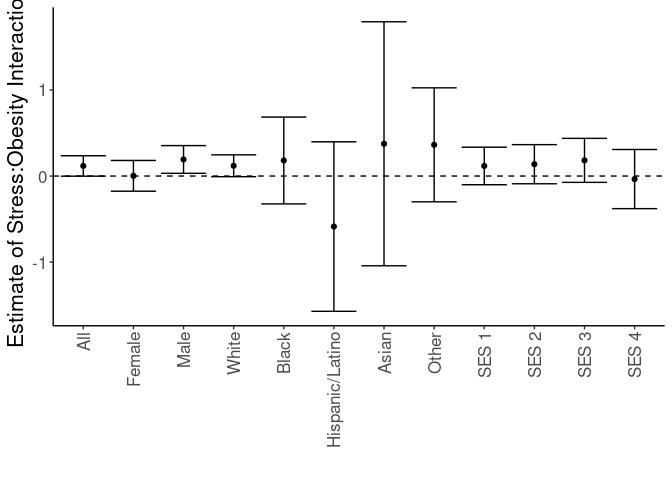<!-- -->

# Sensitivity Analyses

Ran a series of sensitivities analyses, for diferent groupings of BMI or stress.

## Logistic Regressions for All Obese Categories

Ran a series of stepwise logistic regressions testing for obesity as a modifier of the effects of stress.


``` r
library(broom)
glm(Type2Diabetes~BMI_cat, 
    family="binomial",
    data=combined.data) -> obesity.glm1

obesity.glm1 %>%
  tidy() %>%
  kable(caption="Logistic regression of obesity on diabetes", digits =c(0,2,3,2,99))
```


Table: Logistic regression of obesity on diabetes

|term                   | estimate| std.error| statistic|  p.value|
|:----------------------|--------:|---------:|---------:|--------:|
|(Intercept)            |    -3.33|     0.247|    -13.48| 2.01e-41|
|BMI_catNormal          |     0.69|     0.249|      2.77| 5.65e-03|
|BMI_catOverweight      |     1.40|     0.248|      5.66| 1.55e-08|
|BMI_catClass I Obese   |     2.00|     0.248|      8.07| 6.85e-16|
|BMI_catClass II Obese  |     2.37|     0.248|      9.54| 1.43e-21|
|BMI_catClass III Obese |     2.71|     0.248|     10.92| 9.12e-28|

``` r
anova(obesity.glm1,test="Chisq") %>% tidy %>%
  kable(caption="Logistic regression of obesity on diabetes, ", digits =c(0,0,0,0,0,99))
```


Table: Logistic regression of obesity on diabetes, 

|term    | df| deviance| df.residual| residual.deviance| p.value|
|:-------|--:|--------:|-----------:|-----------------:|-------:|
|NULL    | NA|       NA|       61792|             55529|      NA|
|BMI_cat |  5|     3429|       61787|             52100|       0|

``` r
#adding in stress as a modifier
glm(Type2Diabetes~BMI_cat+Stress+Stress:BMI_cat, 
    family="binomial",
    data=combined.data) -> obesity.glm2

obesity.glm2 %>%
  tidy() %>%
  kable(caption="Logistic regression of obesity on diabetes, with stress as a modifier", digits =c(0,2,3,2,99))
```


Table: Logistic regression of obesity on diabetes, with stress as a modifier

|term                              | estimate| std.error| statistic|  p.value|
|:---------------------------------|--------:|---------:|---------:|--------:|
|(Intercept)                       |    -3.76|     0.581|     -6.47| 9.72e-11|
|BMI_catNormal                     |     0.91|     0.584|      1.56| 1.18e-01|
|BMI_catOverweight                 |     1.68|     0.582|      2.89| 3.84e-03|
|BMI_catClass I Obese              |     2.26|     0.582|      3.88| 1.04e-04|
|BMI_catClass II Obese             |     2.65|     0.583|      4.54| 5.51e-06|
|BMI_catClass III Obese            |     2.94|     0.584|      5.04| 4.64e-07|
|StressHigh                        |     0.58|     0.715|      0.81| 4.20e-01|
|BMI_catNormal:StressHigh          |    -0.37|     0.720|     -0.51| 6.12e-01|
|BMI_catOverweight:StressHigh      |    -0.47|     0.717|     -0.65| 5.13e-01|
|BMI_catClass I Obese:StressHigh   |    -0.34|     0.717|     -0.48| 6.32e-01|
|BMI_catClass II Obese:StressHigh  |    -0.35|     0.718|     -0.49| 6.24e-01|
|BMI_catClass III Obese:StressHigh |    -0.38|     0.719|     -0.52| 6.01e-01|

``` r
anova(obesity.glm2,test="Chisq") %>% tidy %>%
  kable(caption="Logistic regression of obese vs non-obese on diabetes, with stress as a modifier", digits =c(0,0,0,0,0,99))
```


Table: Logistic regression of obese vs non-obese on diabetes, with stress as a modifier

|term           | df| deviance| df.residual| residual.deviance|  p.value|
|:--------------|--:|--------:|-----------:|-----------------:|--------:|
|NULL           | NA|       NA|       39559|             34154|       NA|
|BMI_cat        |  5|     2155|       39554|             31999| 0.00e+00|
|Stress         |  1|       44|       39553|             31955| 3.10e-11|
|BMI_cat:Stress |  5|        3|       39548|             31952| 6.29e-01|

``` r
#adding in age and gender as covariates as a modifier
glm(Type2Diabetes~BMI_cat+Stress+Stress:BMI_cat+Gender+BMI_cat:Gender+age, 
    family="binomial",
    data=combined.data) -> obesity.glm3

obesity.glm3 %>%
  tidy() %>%
  kable(caption="Logistic regression of obesity on diabetes, with stress as a modifier and age and  gender as covariates", digits =c(0,2,3,2,99))
```


Table: Logistic regression of obesity on diabetes, with stress as a modifier and age and  gender as covariates

|term                              | estimate| std.error| statistic|  p.value|
|:---------------------------------|--------:|---------:|---------:|--------:|
|(Intercept)                       |    -5.95|     0.602|     -9.88| 4.84e-23|
|BMI_catNormal                     |     0.39|     0.603|      0.65| 5.17e-01|
|BMI_catOverweight                 |     1.14|     0.601|      1.90| 5.73e-02|
|BMI_catClass I Obese              |     1.76|     0.601|      2.94| 3.32e-03|
|BMI_catClass II Obese             |     2.28|     0.601|      3.80| 1.46e-04|
|BMI_catClass III Obese            |     2.79|     0.602|      4.64| 3.43e-06|
|StressHigh                        |     0.72|     0.727|      1.00| 3.19e-01|
|GenderM                           |    -1.23|     1.072|     -1.14| 2.53e-01|
|age                               |     0.04|     0.001|     39.53| 0.00e+00|
|BMI_catNormal:StressHigh          |    -0.43|     0.732|     -0.59| 5.57e-01|
|BMI_catOverweight:StressHigh      |    -0.51|     0.729|     -0.70| 4.85e-01|
|BMI_catClass I Obese:StressHigh   |    -0.38|     0.729|     -0.52| 6.01e-01|
|BMI_catClass II Obese:StressHigh  |    -0.39|     0.730|     -0.53| 5.94e-01|
|BMI_catClass III Obese:StressHigh |    -0.41|     0.731|     -0.56| 5.75e-01|
|BMI_catNormal:GenderM             |     1.83|     1.076|      1.70| 8.84e-02|
|BMI_catOverweight:GenderM         |     1.49|     1.074|      1.39| 1.65e-01|
|BMI_catClass I Obese:GenderM      |     1.49|     1.074|      1.39| 1.65e-01|
|BMI_catClass II Obese:GenderM     |     1.47|     1.074|      1.36| 1.73e-01|
|BMI_catClass III Obese:GenderM    |     1.38|     1.075|      1.29| 1.98e-01|

``` r
anova(obesity.glm3,test="Chisq") %>% tidy %>%
  kable(caption="Logistic regression of obesity on diabetes, with stress as a modifier and age and gender as covariate", digits =c(0,0,0,0,0,99))
```


Table: Logistic regression of obesity on diabetes, with stress as a modifier and age and gender as covariate

|term           | df| deviance| df.residual| residual.deviance|  p.value|
|:--------------|--:|--------:|-----------:|-----------------:|--------:|
|NULL           | NA|       NA|       39559|             34154|       NA|
|BMI_cat        |  5|     2155|       39554|             31999| 0.00e+00|
|Stress         |  1|       44|       39553|             31955| 3.10e-11|
|Gender         |  1|      212|       39552|             31743| 5.75e-48|
|age            |  1|     1794|       39551|             29949| 0.00e+00|
|BMI_cat:Stress |  5|        3|       39546|             29945| 6.27e-01|
|BMI_cat:Gender |  5|       19|       39541|             29926| 1.58e-03|

``` r
#adding in race and ethnicity
glm(Type2Diabetes~BMI_cat+Stress+Stress:BMI_cat+Gender+BMI_cat:Gender+age+Race.Ethnicity, 
    family="binomial",
    data=combined.data) -> obesity.glm4

obesity.glm4 %>%
  tidy() %>%
  kable(caption="Logistic regression of obesity on diabetes, with stress as a modifier and age, gender and race as covariates", digits =c(0,2,3,2,99))
```


Table: Logistic regression of obesity on diabetes, with stress as a modifier and age, gender and race as covariates

|term                              | estimate| std.error| statistic|  p.value|
|:---------------------------------|--------:|---------:|---------:|--------:|
|(Intercept)                       |    -6.11|     0.602|    -10.14| 3.52e-24|
|BMI_catNormal                     |     0.39|     0.603|      0.65| 5.17e-01|
|BMI_catOverweight                 |     1.15|     0.600|      1.91| 5.64e-02|
|BMI_catClass I Obese              |     1.77|     0.600|      2.94| 3.25e-03|
|BMI_catClass II Obese             |     2.29|     0.601|      3.81| 1.39e-04|
|BMI_catClass III Obese            |     2.79|     0.601|      4.64| 3.47e-06|
|StressHigh                        |     0.73|     0.727|      1.01| 3.15e-01|
|GenderM                           |    -1.22|     1.072|     -1.13| 2.57e-01|
|age                               |     0.04|     0.001|     40.41| 0.00e+00|
|Race.EthnicityAsian               |     0.82|     0.138|      5.94| 2.90e-09|
|Race.EthnicityBlack               |     0.63|     0.064|      9.85| 6.99e-23|
|Race.EthnicityHispanic/Latino     |     0.39|     0.108|      3.64| 2.76e-04|
|Race.EthnicityOther               |     0.04|     0.085|      0.41| 6.80e-01|
|BMI_catNormal:StressHigh          |    -0.44|     0.732|     -0.60| 5.51e-01|
|BMI_catOverweight:StressHigh      |    -0.52|     0.729|     -0.72| 4.74e-01|
|BMI_catClass I Obese:StressHigh   |    -0.39|     0.729|     -0.54| 5.90e-01|
|BMI_catClass II Obese:StressHigh  |    -0.40|     0.730|     -0.55| 5.80e-01|
|BMI_catClass III Obese:StressHigh |    -0.42|     0.731|     -0.57| 5.68e-01|
|BMI_catNormal:GenderM             |     1.82|     1.076|      1.69| 9.06e-02|
|BMI_catOverweight:GenderM         |     1.48|     1.074|      1.38| 1.67e-01|
|BMI_catClass I Obese:GenderM      |     1.49|     1.074|      1.39| 1.65e-01|
|BMI_catClass II Obese:GenderM     |     1.46|     1.075|      1.36| 1.73e-01|
|BMI_catClass III Obese:GenderM    |     1.39|     1.075|      1.30| 1.95e-01|

``` r
anova(obesity.glm4,test="Chisq") %>% tidy %>%
  kable(caption="Logistic regression of obesity on diabetes, with stress as a modifier and age, gender and race as covariate", digits =c(0,0,0,0,0,99))
```


Table: Logistic regression of obesity on diabetes, with stress as a modifier and age, gender and race as covariate

|term           | df| deviance| df.residual| residual.deviance|  p.value|
|:--------------|--:|--------:|-----------:|-----------------:|--------:|
|NULL           | NA|       NA|       39559|             34154|       NA|
|BMI_cat        |  5|     2155|       39554|             31999| 0.00e+00|
|Stress         |  1|       44|       39553|             31955| 3.10e-11|
|Gender         |  1|      212|       39552|             31743| 5.75e-48|
|age            |  1|     1794|       39551|             29949| 0.00e+00|
|Race.Ethnicity |  4|      128|       39547|             29821| 1.09e-26|
|BMI_cat:Stress |  5|        3|       39542|             29818| 6.27e-01|
|BMI_cat:Gender |  5|       18|       39537|             29799| 2.90e-03|

``` r
#adding in neighborhood
glm(Type2Diabetes~BMI_cat+Stress+Stress:BMI_cat+Gender+BMI_cat:Gender+age+Race.Ethnicity+disadvantage13_17_qrtl, 
    family="binomial",
    data=combined.data) -> obesity.glm5

obesity.glm5 %>%
  tidy() %>%
  kable(caption="Logistic regression of obesity on diabetes, with stress as a modifier and age, gender, race and neighborhood as covariates", digits =c(0,2,3,2,99))
```


Table: Logistic regression of obesity on diabetes, with stress as a modifier and age, gender, race and neighborhood as covariates

|term                              | estimate| std.error| statistic|  p.value|
|:---------------------------------|--------:|---------:|---------:|--------:|
|(Intercept)                       |    -6.36|     0.608|    -10.46| 1.33e-25|
|BMI_catNormal                     |     0.36|     0.607|      0.60| 5.49e-01|
|BMI_catOverweight                 |     1.06|     0.605|      1.75| 7.94e-02|
|BMI_catClass I Obese              |     1.69|     0.605|      2.79| 5.30e-03|
|BMI_catClass II Obese             |     2.19|     0.606|      3.61| 3.02e-04|
|BMI_catClass III Obese            |     2.70|     0.606|      4.47| 8.00e-06|
|StressHigh                        |     0.69|     0.729|      0.95| 3.41e-01|
|GenderM                           |    -1.24|     1.074|     -1.16| 2.48e-01|
|age                               |     0.05|     0.001|     39.34| 0.00e+00|
|Race.EthnicityAsian               |     0.84|     0.143|      5.87| 4.42e-09|
|Race.EthnicityBlack               |     0.48|     0.069|      6.91| 4.88e-12|
|Race.EthnicityHispanic/Latino     |     0.39|     0.112|      3.51| 4.45e-04|
|Race.EthnicityOther               |     0.00|     0.089|      0.05| 9.64e-01|
|disadvantage13_17_qrtl            |     0.14|     0.015|      9.34| 1.01e-20|
|BMI_catNormal:StressHigh          |    -0.42|     0.735|     -0.58| 5.64e-01|
|BMI_catOverweight:StressHigh      |    -0.50|     0.731|     -0.68| 4.95e-01|
|BMI_catClass I Obese:StressHigh   |    -0.37|     0.731|     -0.51| 6.13e-01|
|BMI_catClass II Obese:StressHigh  |    -0.38|     0.733|     -0.52| 6.06e-01|
|BMI_catClass III Obese:StressHigh |    -0.39|     0.733|     -0.53| 5.93e-01|
|BMI_catNormal:GenderM             |     1.80|     1.078|      1.67| 9.51e-02|
|BMI_catOverweight:GenderM         |     1.53|     1.076|      1.42| 1.55e-01|
|BMI_catClass I Obese:GenderM      |     1.53|     1.076|      1.42| 1.56e-01|
|BMI_catClass II Obese:GenderM     |     1.50|     1.077|      1.39| 1.64e-01|
|BMI_catClass III Obese:GenderM    |     1.43|     1.077|      1.32| 1.85e-01|

``` r
anova(obesity.glm5,test="Chisq") %>% tidy %>%
  kable(caption="Logistic regression of obesity on diabetes, with stress as a modifier and age, gender, race and neighborhood as covariates", digits =c(0,0,0,0,0,99))
```


Table: Logistic regression of obesity on diabetes, with stress as a modifier and age, gender, race and neighborhood as covariates

|term                   | df| deviance| df.residual| residual.deviance|  p.value|
|:----------------------|--:|--------:|-----------:|-----------------:|--------:|
|NULL                   | NA|       NA|       36392|             31591|       NA|
|BMI_cat                |  5|     1984|       36387|             29608| 0.00e+00|
|Stress                 |  1|       45|       36386|             29562| 1.70e-11|
|Gender                 |  1|      195|       36385|             29367| 2.38e-44|
|age                    |  1|     1659|       36384|             27708| 0.00e+00|
|Race.Ethnicity         |  4|      123|       36380|             27585| 1.26e-25|
|disadvantage13_17_qrtl |  1|       88|       36379|             27498| 8.04e-21|
|BMI_cat:Stress         |  5|        3|       36374|             27494| 6.49e-01|
|BMI_cat:Gender         |  5|       13|       36369|             27481| 2.21e-02|

### Diabetes Rates by Quartiles


``` r
with(combined.data, table(Type2Diabetes,BMI_cat.obese,Stress.quartile,Gender)) %>% 
  data.frame %>%
  pivot_wider(names_from=Type2Diabetes,
              values_from = Freq) %>%
  rename(Diabetes=`1`,
         NonDiabetes=`0`) %>%
  mutate(Total=Diabetes+NonDiabetes) %>%
  mutate(Percent=Diabetes/Total*100) -> diabetes.bmi.stress.quartile.counts

kable(diabetes.bmi.stress.quartile.counts, caption="Diabetes Rates by BMI and Stress Quartile")
```


Table: Diabetes Rates by BMI and Stress Quartile

|BMI_cat.obese |Stress.quartile |Gender | NonDiabetes| Diabetes| Total| Percent|
|:-------------|:---------------|:------|-----------:|--------:|-----:|-------:|
|Underweight   |Q1              |F      |          70|        3|    73|    4.11|
|Normal        |Q1              |F      |        2760|      114|  2874|    3.97|
|Overweight    |Q1              |F      |        2560|      229|  2789|    8.21|
|Obese         |Q1              |F      |        3121|      757|  3878|   19.52|
|Underweight   |Q2              |F      |          81|        3|    84|    3.57|
|Normal        |Q2              |F      |        2120|      107|  2227|    4.80|
|Overweight    |Q2              |F      |        2024|      222|  2246|    9.88|
|Obese         |Q2              |F      |        2779|      840|  3619|   23.21|
|Underweight   |Q3              |F      |          30|        2|    32|    6.25|
|Normal        |Q3              |F      |         631|       28|   659|    4.25|
|Overweight    |Q3              |F      |         599|       80|   679|   11.78|
|Obese         |Q3              |F      |         960|      344|  1304|   26.38|
|Underweight   |Q4              |F      |           3|        0|     3|    0.00|
|Normal        |Q4              |F      |          70|        6|    76|    7.89|
|Overweight    |Q4              |F      |          72|       10|    82|   12.20|
|Obese         |Q4              |F      |         113|       34|   147|   23.13|
|Underweight   |Q1              |M      |          28|        0|    28|    0.00|
|Normal        |Q1              |M      |        1815|      154|  1969|    7.82|
|Overweight    |Q1              |M      |        3297|      494|  3791|   13.03|
|Obese         |Q1              |M      |        2911|      955|  3866|   24.70|
|Underweight   |Q2              |M      |          45|        1|    46|    2.17|
|Normal        |Q2              |M      |        1308|      121|  1429|    8.47|
|Overweight    |Q2              |M      |        2338|      350|  2688|   13.02|
|Obese         |Q2              |M      |        2145|      859|  3004|   28.59|
|Underweight   |Q3              |M      |          15|        0|    15|    0.00|
|Normal        |Q3              |M      |         330|       36|   366|    9.84|
|Overweight    |Q3              |M      |         486|       97|   583|   16.64|
|Obese         |Q3              |M      |         567|      244|   811|   30.09|
|Underweight   |Q4              |M      |           2|        0|     2|    0.00|
|Normal        |Q4              |M      |          38|       10|    48|   20.83|
|Overweight    |Q4              |M      |          40|       12|    52|   23.08|
|Obese         |Q4              |M      |          61|       29|    90|   32.22|

``` r
ggplot(diabetes.bmi.stress.quartile.counts,
       aes(y=Percent,
           x=BMI_cat.obese,
           fill=Stress.quartile)) +
  geom_bar(stat='identity',position='dodge') +
  labs(y="Prevalence of Type 2 Diabetes",
       title="Quartiles of Stress",
       x="") +
  theme_classic() +
  facet_grid(.~Gender) +
  theme(text=element_text(size=16),
        axis.text.x=element_text(angle=90,vjust=0.5,hjust=1),
        legend.position = c(0.15,0.75))
```

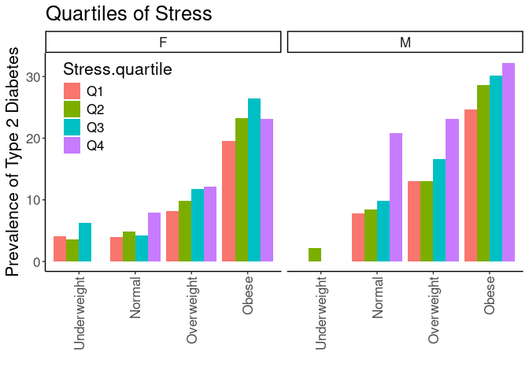<!-- -->

## Diabetes Rates by Normal Obesity and Stress


``` r
#calculating diabetes rates by bmi category, stress and gender
with(combined.data, table(Type2Diabetes,BMI_cat.obese,Stress,Gender)) %>% 
  data.frame %>%
  pivot_wider(names_from=Type2Diabetes,
              values_from = Freq) %>%
  rename(Diabetes=`1`,
         NonDiabetes=`0`) %>%
  mutate(Total=Diabetes+NonDiabetes) %>%
  mutate(Percent=Diabetes/Total*100) -> diabetes.bmi.stress.gender.counts

kable(diabetes.bmi.stress.gender.counts, caption="Diabetes Rates by BMI and Stress")
```


Table: Diabetes Rates by BMI and Stress

|BMI_cat.obese |Stress |Gender | NonDiabetes| Diabetes| Total| Percent|
|:-------------|:------|:------|-----------:|--------:|-----:|-------:|
|Underweight   |Low    |F      |          90|        3|    93|    3.23|
|Normal        |Low    |F      |        3301|      134|  3435|    3.90|
|Overweight    |Low    |F      |        3054|      276|  3330|    8.29|
|Obese         |Low    |F      |        3751|      925|  4676|   19.78|
|Underweight   |High   |F      |          94|        5|    99|    5.05|
|Normal        |High   |F      |        2280|      121|  2401|    5.04|
|Overweight    |High   |F      |        2201|      265|  2466|   10.75|
|Obese         |High   |F      |        3222|     1050|  4272|   24.58|
|Underweight   |Low    |M      |          39|        0|    39|    0.00|
|Normal        |Low    |M      |        2112|      180|  2292|    7.85|
|Overweight    |Low    |M      |        3822|      585|  4407|   13.27|
|Obese         |Low    |M      |        3416|     1131|  4547|   24.87|
|Underweight   |High   |M      |          51|        1|    52|    1.92|
|Normal        |High   |M      |        1379|      141|  1520|    9.28|
|Overweight    |High   |M      |        2339|      368|  2707|   13.59|
|Obese         |High   |M      |        2268|      956|  3224|   29.65|

``` r
ggplot(diabetes.bmi.stress.gender.counts,
       aes(y=Percent,
           x=BMI_cat.obese,
           fill=Stress)) +
  geom_bar(stat='identity',position='dodge') +
  labs(y="Prevalence of Type 2 Diabetes",
       title="Gender",
       x="") +
  facet_grid(.~Gender) +
  theme_classic() +
  scale_fill_grey() +
  theme(text=element_text(size=16),
        axis.text.x=element_text(angle=90,vjust=0.5,hjust=1),
        legend.position = c(0.1,0.75))
```

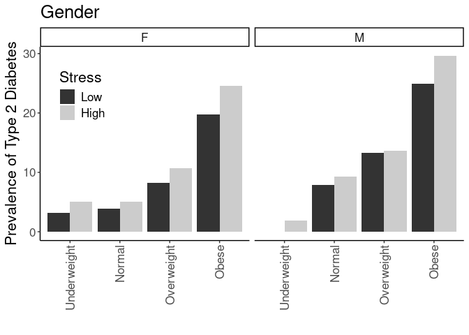<!-- -->

## Logistic Regressions for Obesity Categories

Ran a series of logistic regressions using the normal obesity categories not classes as the categorization


``` r
glm(Type2Diabetes~BMI_cat.obese, 
    family="binomial",
    data=combined.data) -> obesity.glm1

obesity.glm1 %>%
  tidy() %>%
  kable(caption="Logistic regression of obese vs non-obese on diabetes", digits =c(0,2,3,2,99))
```


Table: Logistic regression of obese vs non-obese on diabetes

|term                    | estimate| std.error| statistic|  p.value|
|:-----------------------|--------:|---------:|---------:|--------:|
|(Intercept)             |    -3.33|     0.247|    -13.48| 2.01e-41|
|BMI_cat.obeseNormal     |     0.69|     0.249|      2.77| 5.65e-03|
|BMI_cat.obeseOverweight |     1.40|     0.248|      5.66| 1.55e-08|
|BMI_cat.obeseObese      |     2.26|     0.247|      9.15| 5.78e-20|

``` r
anova(obesity.glm1,test="Chisq") %>% tidy %>%
  kable(caption="Logistic regression of obesity on diabetes, ", digits =c(0,0,0,0,0,99))
```


Table: Logistic regression of obesity on diabetes, 

|term          | df| deviance| df.residual| residual.deviance| p.value|
|:-------------|--:|--------:|-----------:|-----------------:|-------:|
|NULL          | NA|       NA|       61792|             55529|      NA|
|BMI_cat.obese |  3|     3017|       61789|             52512|       0|

``` r
#adding in stress as a modifier
glm(Type2Diabetes~BMI_cat.obese+Stress+Stress:BMI_cat.obese, 
    family="binomial",
    data=combined.data) -> obesity.glm2

obesity.glm2 %>%
  tidy() %>%
  kable(caption="Logistic regression of obesity on diabetes, with stress as a modifier", digits =c(0,2,3,2,99))
```


Table: Logistic regression of obesity on diabetes, with stress as a modifier

|term                               | estimate| std.error| statistic|  p.value|
|:----------------------------------|--------:|---------:|---------:|--------:|
|(Intercept)                        |    -3.76|     0.581|     -6.47| 9.72e-11|
|BMI_cat.obeseNormal                |     0.91|     0.584|      1.56| 1.18e-01|
|BMI_cat.obeseOverweight            |     1.68|     0.582|      2.89| 3.84e-03|
|BMI_cat.obeseObese                 |     2.51|     0.582|      4.32| 1.57e-05|
|StressHigh                         |     0.58|     0.715|      0.81| 4.20e-01|
|BMI_cat.obeseNormal:StressHigh     |    -0.37|     0.720|     -0.51| 6.12e-01|
|BMI_cat.obeseOverweight:StressHigh |    -0.47|     0.717|     -0.65| 5.13e-01|
|BMI_cat.obeseObese:StressHigh      |    -0.33|     0.716|     -0.47| 6.41e-01|

``` r
anova(obesity.glm2,test="Chisq") %>% tidy %>%
  kable(caption="Logistic regression of obesity on diabetes, with stress as a modifier", digits =c(0,0,0,0,0,99))
```


Table: Logistic regression of obesity on diabetes, with stress as a modifier

|term                 | df| deviance| df.residual| residual.deviance|  p.value|
|:--------------------|--:|--------:|-----------:|-----------------:|--------:|
|NULL                 | NA|       NA|       39559|             34154|       NA|
|BMI_cat.obese        |  3|     1919|       39556|             32235| 0.00e+00|
|Stress               |  1|       51|       39555|             32185| 1.11e-12|
|BMI_cat.obese:Stress |  3|        4|       39552|             32180| 2.22e-01|

``` r
#adding in age and gender as covariates as a modifier
glm(Type2Diabetes~BMI_cat.obese+Stress+Stress:BMI_cat.obese+Gender+BMI_cat.obese:Gender+age, 
    family="binomial",
    data=combined.data) -> obesity.glm3

obesity.glm3 %>%
  tidy() %>%
  kable(caption="Logistic regression of obesity on diabetes, with stress as a modifier and age and  gender as covariates", digits =c(0,2,3,2,99))
```


Table: Logistic regression of obesity on diabetes, with stress as a modifier and age and  gender as covariates

|term                               | estimate| std.error| statistic|  p.value|
|:----------------------------------|--------:|---------:|---------:|--------:|
|(Intercept)                        |    -5.80|     0.602|     -9.64| 5.23e-22|
|BMI_cat.obeseNormal                |     0.39|     0.603|      0.64| 5.22e-01|
|BMI_cat.obeseOverweight            |     1.14|     0.600|      1.90| 5.76e-02|
|BMI_cat.obeseObese                 |     2.18|     0.599|      3.64| 2.68e-04|
|StressHigh                         |     0.72|     0.726|      0.99| 3.23e-01|
|GenderM                            |    -1.23|     1.072|     -1.15| 2.50e-01|
|age                                |     0.04|     0.001|     38.16| 0.00e+00|
|BMI_cat.obeseNormal:StressHigh     |    -0.43|     0.732|     -0.58| 5.59e-01|
|BMI_cat.obeseOverweight:StressHigh |    -0.51|     0.728|     -0.70| 4.86e-01|
|BMI_cat.obeseObese:StressHigh      |    -0.37|     0.727|     -0.51| 6.09e-01|
|BMI_cat.obeseNormal:GenderM        |     1.85|     1.075|      1.72| 8.61e-02|
|BMI_cat.obeseOverweight:GenderM    |     1.50|     1.073|      1.40| 1.61e-01|
|BMI_cat.obeseObese:GenderM         |     1.34|     1.072|      1.25| 2.12e-01|

``` r
anova(obesity.glm3,test="Chisq") %>% tidy %>%
  kable(caption="Logistic regression of obesity on diabetes, with stress as a modifier and age and gender as covariate", digits =c(0,0,0,0,0,99))
```


Table: Logistic regression of obesity on diabetes, with stress as a modifier and age and gender as covariate

|term                 | df| deviance| df.residual| residual.deviance|  p.value|
|:--------------------|--:|--------:|-----------:|-----------------:|--------:|
|NULL                 | NA|       NA|       39559|             34154|       NA|
|BMI_cat.obese        |  3|     1919|       39556|             32235| 0.00e+00|
|Stress               |  1|       51|       39555|             32185| 1.11e-12|
|Gender               |  1|      154|       39554|             32031| 2.02e-35|
|age                  |  1|     1647|       39553|             30384| 0.00e+00|
|BMI_cat.obese:Stress |  3|        5|       39550|             30379| 1.70e-01|
|BMI_cat.obese:Gender |  3|       33|       39547|             30346| 4.06e-07|

``` r
#adding in race and ethnicity
glm(Type2Diabetes~BMI_cat.obese+Stress+Stress:BMI_cat.obese+Gender+BMI_cat.obese:Gender+age+Race.Ethnicity, 
    family="binomial",
    data=combined.data) -> obesity.glm4

obesity.glm4 %>%
  tidy() %>%
  kable(caption="Logistic regression of obesity on diabetes, with stress as a modifier and age, gender and race as covariates", digits =c(0,2,3,2,99))
```


Table: Logistic regression of obesity on diabetes, with stress as a modifier and age, gender and race as covariates

|term                               | estimate| std.error| statistic|  p.value|
|:----------------------------------|--------:|---------:|---------:|--------:|
|(Intercept)                        |    -5.95|     0.601|     -9.89| 4.54e-23|
|BMI_cat.obeseNormal                |     0.39|     0.602|      0.64| 5.23e-01|
|BMI_cat.obeseOverweight            |     1.14|     0.600|      1.90| 5.74e-02|
|BMI_cat.obeseObese                 |     2.18|     0.598|      3.64| 2.72e-04|
|StressHigh                         |     0.72|     0.726|      1.00| 3.19e-01|
|GenderM                            |    -1.23|     1.072|     -1.14| 2.52e-01|
|age                                |     0.04|     0.001|     39.06| 0.00e+00|
|Race.EthnicityAsian                |     0.73|     0.138|      5.33| 9.89e-08|
|Race.EthnicityBlack                |     0.65|     0.063|     10.29| 7.50e-25|
|Race.EthnicityHispanic/Latino      |     0.37|     0.107|      3.43| 6.12e-04|
|Race.EthnicityOther                |     0.04|     0.085|      0.47| 6.39e-01|
|BMI_cat.obeseNormal:StressHigh     |    -0.43|     0.732|     -0.59| 5.53e-01|
|BMI_cat.obeseOverweight:StressHigh |    -0.52|     0.728|     -0.71| 4.75e-01|
|BMI_cat.obeseObese:StressHigh      |    -0.38|     0.727|     -0.53| 5.99e-01|
|BMI_cat.obeseNormal:GenderM        |     1.84|     1.076|      1.71| 8.78e-02|
|BMI_cat.obeseOverweight:GenderM    |     1.50|     1.074|      1.40| 1.62e-01|
|BMI_cat.obeseObese:GenderM         |     1.34|     1.073|      1.25| 2.10e-01|

``` r
anova(obesity.glm4,test="Chisq") %>% tidy %>%
  kable(caption="Logistic regression of obesity on diabetes, with stress as a modifier and age, gender and race as covariates", digits =c(0,0,0,0,0,99))
```


Table: Logistic regression of obesity on diabetes, with stress as a modifier and age, gender and race as covariates

|term                 | df| deviance| df.residual| residual.deviance|  p.value|
|:--------------------|--:|--------:|-----------:|-----------------:|--------:|
|NULL                 | NA|       NA|       39559|             34154|       NA|
|BMI_cat.obese        |  3|     1919|       39556|             32235| 0.00e+00|
|Stress               |  1|       51|       39555|             32185| 1.11e-12|
|Gender               |  1|      154|       39554|             32031| 2.02e-35|
|age                  |  1|     1647|       39553|             30384| 0.00e+00|
|Race.Ethnicity       |  4|      130|       39549|             30254| 4.61e-27|
|BMI_cat.obese:Stress |  3|        5|       39546|             30249| 1.68e-01|
|BMI_cat.obese:Gender |  3|       30|       39543|             30219| 1.10e-06|

``` r
glm(Type2Diabetes~BMI_cat.obese+Stress+Stress:BMI_cat.obese+Gender+BMI_cat.obese:Gender+age+Race.Ethnicity+disadvantage13_17_qrtl, 
    family="binomial",
    data=combined.data) -> obesity.glm5

obesity.glm5 %>%
  tidy() %>%
  kable(caption="Logistic regression of obesity on diabetes, with stress as a modifier and age, gender, race and neighborhood as covariates", digits =c(0,2,3,2,99))
```


Table: Logistic regression of obesity on diabetes, with stress as a modifier and age, gender, race and neighborhood as covariates

|term                               | estimate| std.error| statistic|  p.value|
|:----------------------------------|--------:|---------:|---------:|--------:|
|(Intercept)                        |    -6.24|     0.607|    -10.27| 9.91e-25|
|BMI_cat.obeseNormal                |     0.36|     0.607|      0.59| 5.52e-01|
|BMI_cat.obeseOverweight            |     1.06|     0.604|      1.75| 8.02e-02|
|BMI_cat.obeseObese                 |     2.09|     0.603|      3.47| 5.12e-04|
|StressHigh                         |     0.68|     0.728|      0.94| 3.47e-01|
|GenderM                            |    -1.26|     1.074|     -1.17| 2.42e-01|
|age                                |     0.04|     0.001|     38.11| 0.00e+00|
|Race.EthnicityAsian                |     0.76|     0.143|      5.28| 1.29e-07|
|Race.EthnicityBlack                |     0.48|     0.068|      7.08| 1.48e-12|
|Race.EthnicityHispanic/Latino      |     0.36|     0.111|      3.25| 1.17e-03|
|Race.EthnicityOther                |     0.01|     0.088|      0.11| 9.13e-01|
|disadvantage13_17_qrtl             |     0.16|     0.015|     10.31| 6.63e-25|
|BMI_cat.obeseNormal:StressHigh     |    -0.42|     0.734|     -0.57| 5.67e-01|
|BMI_cat.obeseOverweight:StressHigh |    -0.50|     0.731|     -0.68| 4.97e-01|
|BMI_cat.obeseObese:StressHigh      |    -0.36|     0.729|     -0.49| 6.23e-01|
|BMI_cat.obeseNormal:GenderM        |     1.82|     1.078|      1.69| 9.14e-02|
|BMI_cat.obeseOverweight:GenderM    |     1.55|     1.076|      1.44| 1.48e-01|
|BMI_cat.obeseObese:GenderM         |     1.39|     1.075|      1.29| 1.96e-01|

``` r
anova(obesity.glm5,test="Chisq") %>% tidy %>%
  kable(caption="Logistic regression of obesity on diabetes, with stress as a modifier and age, gender, race and neighborhood as covariates", digits =c(0,0,0,0,0,99))
```


Table: Logistic regression of obesity on diabetes, with stress as a modifier and age, gender, race and neighborhood as covariates

|term                   | df| deviance| df.residual| residual.deviance|  p.value|
|:----------------------|--:|--------:|-----------:|-----------------:|--------:|
|NULL                   | NA|       NA|       36392|             31591|       NA|
|BMI_cat.obese          |  3|     1754|       36389|             29837| 0.00e+00|
|Stress                 |  1|       51|       36388|             29786| 7.45e-13|
|Gender                 |  1|      141|       36387|             29645| 1.49e-32|
|age                    |  1|     1522|       36386|             28122| 0.00e+00|
|Race.Ethnicity         |  4|      124|       36382|             27998| 6.22e-26|
|disadvantage13_17_qrtl |  1|      108|       36381|             27890| 3.11e-25|
|BMI_cat.obese:Stress   |  3|        5|       36378|             27886| 1.95e-01|
|BMI_cat.obese:Gender   |  3|       24|       36375|             27862| 3.17e-05|


## Logistic Regressions for Obese/Non-Obese - Stress as Linear Covariate

Ran a series of logistic regressions using obese/non-obese as the categorization, but now using stress as a linear covariate


``` r
glm(Type2Diabetes~BMI_cat.Ob.NonOb+Stress_d1+Stress_d1:BMI_cat.Ob.NonOb+Gender+Gender:BMI_cat.Ob.NonOb+BMI_cat.Ob.NonOb:Gender+age+Race.Ethnicity+disadvantage13_17_qrtl, 
    family="binomial",
    data=combined.data) -> obesity.glm4

obesity.glm4 %>%
  tidy() %>%
  kable(caption="Logistic regression of obese vs non-obese on diabetes, with continuous stress as a modifier", digits =c(0,2,3,2,99))
```


Table: Logistic regression of obese vs non-obese on diabetes, with continuous stress as a modifier

|term                            | estimate| std.error| statistic|  p.value|
|:-------------------------------|--------:|---------:|---------:|--------:|
|(Intercept)                     |    -5.63|     0.096|    -58.67| 0.00e+00|
|BMI_cat.Ob.NonObObese           |     1.33|     0.069|     19.36| 1.54e-83|
|Stress_d1                       |     0.04|     0.007|      5.82| 5.84e-09|
|GenderM                         |     0.46|     0.050|      9.06| 1.35e-19|
|age                             |     0.04|     0.001|     39.00| 0.00e+00|
|Race.EthnicityAsian             |     0.71|     0.142|      4.97| 6.83e-07|
|Race.EthnicityBlack             |     0.50|     0.068|      7.34| 2.09e-13|
|Race.EthnicityHispanic/Latino   |     0.35|     0.111|      3.19| 1.40e-03|
|Race.EthnicityOther             |     0.01|     0.088|      0.12| 9.03e-01|
|disadvantage13_17_qrtl          |     0.15|     0.015|      9.93| 3.04e-23|
|BMI_cat.Ob.NonObObese:Stress_d1 |     0.01|     0.009|      0.94| 3.46e-01|
|BMI_cat.Ob.NonObObese:GenderM   |    -0.32|     0.064|     -5.03| 5.03e-07|

``` r
anova(obesity.glm4,test="Chisq") %>% tidy %>%
  kable(caption="Logistic regression of obese vs non-obese on diabetes, with continuous stress as a modifier", digits =c(0,0,0,0,0,99))
```


Table: Logistic regression of obese vs non-obese on diabetes, with continuous stress as a modifier

|term                       | df| deviance| df.residual| residual.deviance|  p.value|
|:--------------------------|--:|--------:|-----------:|-----------------:|--------:|
|NULL                       | NA|       NA|       36392|             31591|       NA|
|BMI_cat.Ob.NonOb           |  1|     1553|       36391|             30038| 0.00e+00|
|Stress_d1                  |  1|       45|       36390|             29992| 1.54e-11|
|Gender                     |  1|      176|       36389|             29816| 3.85e-40|
|age                        |  1|     1617|       36388|             28199| 0.00e+00|
|Race.Ethnicity             |  4|      125|       36384|             28074| 4.63e-26|
|disadvantage13_17_qrtl     |  1|      100|       36383|             27974| 1.34e-23|
|BMI_cat.Ob.NonOb:Stress_d1 |  1|        2|       36382|             27972| 1.86e-01|
|BMI_cat.Ob.NonOb:Gender    |  1|       25|       36381|             27947| 4.65e-07|

## Logistic Regressions for Obese/Non-Obese - Stress as Discrete Covariate

Ran a series of logistic regressions using obese/non-obese as the categorization, but now using stress as a non-linear discrete covariate


``` r
glm(Type2Diabetes~BMI_cat.Ob.NonOb+as.factor(Stress_d1)+as.factor(Stress_d1):BMI_cat.Ob.NonOb+Gender+BMI_cat.Ob.NonOb:Gender+Gender:BMI_cat.Ob.NonOb+age+Race.Ethnicity+disadvantage13_17_qrtl, 
    family="binomial",
    data=combined.data) -> obesity.glm4

obesity.glm4 %>%
  tidy() %>%
  kable(caption="Logistic regression of obese vs non-obese on diabetes, with discrete stress as a modifier", digits =c(0,2,3,2,99))
```


Table: Logistic regression of obese vs non-obese on diabetes, with discrete stress as a modifier

|term                                         | estimate| std.error| statistic|  p.value|
|:--------------------------------------------|--------:|---------:|---------:|--------:|
|(Intercept)                                  |    -5.52|     0.111|    -49.95| 0.00e+00|
|BMI_cat.Ob.NonObObese                        |     1.28|     0.100|     12.82| 1.35e-37|
|as.factor(Stress_d1)1                        |    -0.14|     0.106|     -1.32| 1.88e-01|
|as.factor(Stress_d1)2                        |     0.01|     0.105|      0.09| 9.27e-01|
|as.factor(Stress_d1)3                        |    -0.06|     0.117|     -0.55| 5.81e-01|
|as.factor(Stress_d1)4                        |     0.06|     0.105|      0.58| 5.59e-01|
|as.factor(Stress_d1)5                        |     0.07|     0.108|      0.67| 5.00e-01|
|as.factor(Stress_d1)6                        |     0.07|     0.110|      0.66| 5.06e-01|
|as.factor(Stress_d1)7                        |     0.14|     0.111|      1.28| 1.99e-01|
|as.factor(Stress_d1)8                        |     0.09|     0.096|      0.95| 3.42e-01|
|as.factor(Stress_d1)9                        |     0.18|     0.134|      1.36| 1.75e-01|
|as.factor(Stress_d1)10                       |     0.50|     0.147|      3.38| 7.23e-04|
|as.factor(Stress_d1)11                       |     0.41|     0.196|      2.09| 3.67e-02|
|as.factor(Stress_d1)12                       |     0.79|     0.226|      3.52| 4.28e-04|
|as.factor(Stress_d1)13                       |     0.92|     0.280|      3.29| 1.00e-03|
|as.factor(Stress_d1)14                       |     1.55|     0.314|      4.94| 7.77e-07|
|as.factor(Stress_d1)15                       |     0.57|     0.625|      0.91| 3.65e-01|
|as.factor(Stress_d1)16                       |     0.57|     0.772|      0.73| 4.64e-01|
|GenderM                                      |     0.46|     0.050|      9.13| 6.74e-20|
|age                                          |     0.04|     0.001|     39.04| 0.00e+00|
|Race.EthnicityAsian                          |     0.71|     0.142|      5.02| 5.26e-07|
|Race.EthnicityBlack                          |     0.51|     0.068|      7.42| 1.20e-13|
|Race.EthnicityHispanic/Latino                |     0.36|     0.111|      3.24| 1.20e-03|
|Race.EthnicityOther                          |     0.01|     0.088|      0.17| 8.67e-01|
|disadvantage13_17_qrtl                       |     0.15|     0.015|      9.81| 9.91e-23|
|BMI_cat.Ob.NonObObese:as.factor(Stress_d1)1  |     0.08|     0.138|      0.60| 5.45e-01|
|BMI_cat.Ob.NonObObese:as.factor(Stress_d1)2  |     0.02|     0.139|      0.14| 8.90e-01|
|BMI_cat.Ob.NonObObese:as.factor(Stress_d1)3  |     0.19|     0.149|      1.28| 1.99e-01|
|BMI_cat.Ob.NonObObese:as.factor(Stress_d1)4  |    -0.06|     0.137|     -0.43| 6.67e-01|
|BMI_cat.Ob.NonObObese:as.factor(Stress_d1)5  |     0.07|     0.140|      0.52| 6.00e-01|
|BMI_cat.Ob.NonObObese:as.factor(Stress_d1)6  |     0.19|     0.141|      1.32| 1.87e-01|
|BMI_cat.Ob.NonObObese:as.factor(Stress_d1)7  |     0.27|     0.142|      1.91| 5.60e-02|
|BMI_cat.Ob.NonObObese:as.factor(Stress_d1)8  |     0.15|     0.125|      1.21| 2.24e-01|
|BMI_cat.Ob.NonObObese:as.factor(Stress_d1)9  |     0.28|     0.166|      1.71| 8.69e-02|
|BMI_cat.Ob.NonObObese:as.factor(Stress_d1)10 |     0.12|     0.187|      0.62| 5.33e-01|
|BMI_cat.Ob.NonObObese:as.factor(Stress_d1)11 |     0.08|     0.241|      0.34| 7.36e-01|
|BMI_cat.Ob.NonObObese:as.factor(Stress_d1)12 |    -0.20|     0.284|     -0.70| 4.86e-01|
|BMI_cat.Ob.NonObObese:as.factor(Stress_d1)13 |    -0.15|     0.363|     -0.42| 6.75e-01|
|BMI_cat.Ob.NonObObese:as.factor(Stress_d1)14 |    -1.26|     0.466|     -2.70| 6.85e-03|
|BMI_cat.Ob.NonObObese:as.factor(Stress_d1)15 |     0.09|     0.717|      0.13| 9.00e-01|
|BMI_cat.Ob.NonObObese:as.factor(Stress_d1)16 |     0.07|     0.920|      0.08| 9.40e-01|
|BMI_cat.Ob.NonObObese:GenderM                |    -0.32|     0.064|     -5.07| 3.92e-07|

``` r
anova(obesity.glm4,test="Chisq") %>% tidy %>%
  kable(caption="Logistic regression of obese vs non-obese on diabetes, with discrete stress as a modifier", digits =c(0,0,0,0,0,99))
```


Table: Logistic regression of obese vs non-obese on diabetes, with discrete stress as a modifier

|term                                  | df| deviance| df.residual| residual.deviance|  p.value|
|:-------------------------------------|--:|--------:|-----------:|-----------------:|--------:|
|NULL                                  | NA|       NA|       36392|             31591|       NA|
|BMI_cat.Ob.NonOb                      |  1|     1553|       36391|             30038| 0.00e+00|
|as.factor(Stress_d1)                  | 16|       69|       36375|             29969| 1.37e-08|
|Gender                                |  1|      175|       36374|             29793| 4.98e-40|
|age                                   |  1|     1622|       36373|             28171| 0.00e+00|
|Race.Ethnicity                        |  4|      126|       36369|             28045| 2.39e-26|
|disadvantage13_17_qrtl                |  1|       98|       36368|             27946| 3.29e-23|
|BMI_cat.Ob.NonOb:as.factor(Stress_d1) | 16|       21|       36352|             27925| 1.74e-01|
|BMI_cat.Ob.NonOb:Gender               |  1|       26|       36351|             27899| 3.61e-07|


## Logistic Regressions for Obese/Non-Obese - Stress as Quartile

Ran a series of logistic regressions using obese/non-obese as the categorization, but now using stress as a quartile.


``` r
glm(Type2Diabetes~BMI_cat.Ob.NonOb+as.factor(Stress.quartile)+as.factor(Stress.quartile):BMI_cat.Ob.NonOb+Gender+Gender:BMI_cat.Ob.NonOb+age+Race.Ethnicity+disadvantage13_17_qrtl, 
    family="binomial",
    data=combined.data) -> obesity.glm4

obesity.glm4 %>%
  tidy() %>%
  kable(caption="Logistic regression of obese vs non-obese on diabetes, with discrete stress as a modifier", digits =c(0,2,3,2,99))
```


Table: Logistic regression of obese vs non-obese on diabetes, with discrete stress as a modifier

|term                                               | estimate| std.error| statistic|  p.value|
|:--------------------------------------------------|--------:|---------:|---------:|--------:|
|(Intercept)                                        |    -5.53|     0.092|    -60.32| 0.00e+00|
|BMI_cat.Ob.NonObObese                              |     1.32|     0.060|     22.10| 0.00e+00|
|as.factor(Stress.quartile)Q2                       |     0.12|     0.053|      2.19| 2.84e-02|
|as.factor(Stress.quartile)Q3                       |     0.40|     0.081|      4.88| 1.07e-06|
|as.factor(Stress.quartile)Q4                       |     1.08|     0.189|      5.72| 1.05e-08|
|GenderM                                            |     0.46|     0.050|      9.09| 9.47e-20|
|age                                                |     0.04|     0.001|     39.00| 0.00e+00|
|Race.EthnicityAsian                                |     0.72|     0.142|      5.05| 4.40e-07|
|Race.EthnicityBlack                                |     0.51|     0.068|      7.42| 1.15e-13|
|Race.EthnicityHispanic/Latino                      |     0.36|     0.111|      3.23| 1.24e-03|
|Race.EthnicityOther                                |     0.01|     0.088|      0.16| 8.76e-01|
|disadvantage13_17_qrtl                             |     0.15|     0.015|      9.91| 3.61e-23|
|BMI_cat.Ob.NonObObese:as.factor(Stress.quartile)Q2 |     0.13|     0.068|      1.87| 6.10e-02|
|BMI_cat.Ob.NonObObese:as.factor(Stress.quartile)Q3 |     0.11|     0.101|      1.05| 2.92e-01|
|BMI_cat.Ob.NonObObese:as.factor(Stress.quartile)Q4 |    -0.48|     0.247|     -1.94| 5.21e-02|
|BMI_cat.Ob.NonObObese:GenderM                      |    -0.32|     0.064|     -5.07| 3.89e-07|

``` r
anova(obesity.glm4,test="Chisq") %>% tidy %>%
  kable(caption="Logistic regression of obese vs non-obese on diabetes, with discrete stress as a modifier", digits =c(0,0,0,0,0,99))
```


Table: Logistic regression of obese vs non-obese on diabetes, with discrete stress as a modifier

|term                                        | df| deviance| df.residual| residual.deviance|  p.value|
|:-------------------------------------------|--:|--------:|-----------:|-----------------:|--------:|
|NULL                                        | NA|       NA|       36392|             31591|       NA|
|BMI_cat.Ob.NonOb                            |  1|     1553|       36391|             30038| 0.00e+00|
|as.factor(Stress.quartile)                  |  3|       52|       36388|             29986| 2.81e-11|
|Gender                                      |  1|      176|       36387|             29809| 3.10e-40|
|age                                         |  1|     1617|       36386|             28193| 0.00e+00|
|Race.Ethnicity                              |  4|      127|       36382|             28065| 1.36e-26|
|disadvantage13_17_qrtl                      |  1|      100|       36381|             27965| 1.46e-23|
|BMI_cat.Ob.NonOb:as.factor(Stress.quartile) |  3|        9|       36378|             27956| 2.89e-02|
|BMI_cat.Ob.NonOb:Gender                     |  1|       26|       36377|             27930| 3.59e-07|

## Logistic Regressions for BMI as a Continuous Variable

Ran a series of logistic regressions using BMI as a linear covariate


``` r
glm(Type2Diabetes~BMI+Stress+Stress:BMI+Gender+Gender:BMI+age+Race.Ethnicity+disadvantage13_17_qrtl, 
    family="binomial",
    data=combined.data) -> obesity.glm4

obesity.glm4 %>%
  tidy() %>%
  kable(caption="Logistic regression of BMI as a continuous variable on diabetes.", digits =c(0,2,3,2,99))
```


Table: Logistic regression of BMI as a continuous variable on diabetes.

|term                          | estimate| std.error| statistic|  p.value|
|:-----------------------------|--------:|---------:|---------:|--------:|
|(Intercept)                   |    -7.78|     0.145|    -53.54| 0.00e+00|
|BMI                           |     0.09|     0.003|     26.41| 0.00e+00|
|StressHigh                    |     0.16|     0.138|      1.14| 2.56e-01|
|GenderM                       |     0.24|     0.141|      1.70| 8.98e-02|
|age                           |     0.05|     0.001|     40.16| 0.00e+00|
|Race.EthnicityAsian           |     0.81|     0.142|      5.67| 1.44e-08|
|Race.EthnicityBlack           |     0.49|     0.069|      7.08| 1.40e-12|
|Race.EthnicityHispanic/Latino |     0.41|     0.112|      3.67| 2.46e-04|
|Race.EthnicityOther           |     0.00|     0.089|     -0.01| 9.89e-01|
|disadvantage13_17_qrtl        |     0.14|     0.015|      9.02| 1.80e-19|
|BMI:StressHigh                |     0.00|     0.004|      0.91| 3.62e-01|
|BMI:GenderM                   |     0.00|     0.004|      0.57| 5.68e-01|

``` r
anova(obesity.glm4,test="Chisq") %>% tidy %>%
  kable(caption="Logistic regression of BMI as a continuous variable on diabetes.", digits =c(0,0,0,0,0,99))
```


Table: Logistic regression of BMI as a continuous variable on diabetes.

|term                   | df| deviance| df.residual| residual.deviance|  p.value|
|:----------------------|--:|--------:|-----------:|-----------------:|--------:|
|NULL                   | NA|       NA|       36392|             31591|       NA|
|BMI                    |  1|     1815|       36391|             29776| 0.00e+00|
|Stress                 |  1|       43|       36390|             29733| 4.83e-11|
|Gender                 |  1|      236|       36389|             29497| 2.95e-53|
|age                    |  1|     1753|       36388|             27744| 0.00e+00|
|Race.Ethnicity         |  4|      122|       36384|             27622| 2.05e-25|
|disadvantage13_17_qrtl |  1|       81|       36383|             27541| 2.67e-19|
|BMI:Stress             |  1|        1|       36382|             27540| 3.76e-01|
|BMI:Gender             |  1|        0|       36381|             27540| 5.68e-01|


# Summary of Covariates

Stratified data by stress and obesity status and summarized data


``` r
combined.data %>%
  group_by(Stress,BMI_cat.Ob.NonOb) %>%
  count %>%
  knitr::kable(caption="Number of participants by group")
```


Table: Number of participants by group

|Stress |BMI_cat.Ob.NonOb |     n|
|:------|:----------------|-----:|
|Low    |Non-Obese        | 13596|
|Low    |Obese            |  9223|
|High   |Non-Obese        |  9245|
|High   |Obese            |  7496|
|NA     |Non-Obese        | 12972|
|NA     |Obese            |  9261|

``` r
combined.data %>%
  group_by(Stress,BMI_cat.Ob.NonOb,Gender) %>%
  count %>%
    filter(!(is.na(Stress))) %>%
  filter(!(is.na(BMI_cat.Ob.NonOb))) %>%
  knitr::kable(caption="Number of participants by group and gender")
```


Table: Number of participants by group and gender

|Stress |BMI_cat.Ob.NonOb |Gender |    n|
|:------|:----------------|:------|----:|
|Low    |Non-Obese        |F      | 6858|
|Low    |Non-Obese        |M      | 6738|
|Low    |Obese            |F      | 4676|
|Low    |Obese            |M      | 4547|
|High   |Non-Obese        |F      | 4966|
|High   |Non-Obese        |M      | 4279|
|High   |Obese            |F      | 4272|
|High   |Obese            |M      | 3224|

``` r
combined.data %>%
  group_by(Stress,BMI_cat.Ob.NonOb,Race.Ethnicity) %>%
  count %>%
    filter(!(is.na(Stress))) %>%
  filter(!(is.na(BMI_cat.Ob.NonOb))) %>%
  knitr::kable(caption="Number of participants by group and race/ethnicity")
```


Table: Number of participants by group and race/ethnicity

|Stress |BMI_cat.Ob.NonOb |Race.Ethnicity  |     n|
|:------|:----------------|:---------------|-----:|
|Low    |Non-Obese        |White           | 12211|
|Low    |Non-Obese        |Asian           |   314|
|Low    |Non-Obese        |Black           |   394|
|Low    |Non-Obese        |Hispanic/Latino |   249|
|Low    |Non-Obese        |Other           |   428|
|Low    |Obese            |White           |  8221|
|Low    |Obese            |Asian           |    36|
|Low    |Obese            |Black           |   484|
|Low    |Obese            |Hispanic/Latino |   180|
|Low    |Obese            |Other           |   302|
|High   |Non-Obese        |White           |  8181|
|High   |Non-Obese        |Asian           |   184|
|High   |Non-Obese        |Black           |   386|
|High   |Non-Obese        |Hispanic/Latino |   185|
|High   |Non-Obese        |Other           |   309|
|High   |Obese            |White           |  6585|
|High   |Obese            |Asian           |    41|
|High   |Obese            |Black           |   475|
|High   |Obese            |Hispanic/Latino |   163|
|High   |Obese            |Other           |   232|

``` r
combined.data %>%
  group_by(Stress,BMI_cat.Ob.NonOb) %>%
    filter(!(is.na(Stress))) %>%
  filter(!(is.na(BMI_cat.Ob.NonOb))) %>%
  summarize_at(c('BMI','age','Stress_d1'), list(mean=~mean(.x,na.rm=T),
                                    sd=~sd(.x,na.rm=T),
                                    n=~length(.x)))%>%
  knitr::kable(caption="Average BMI, stress and age of participants by group")
```


Table: Average BMI, stress and age of participants by group

|Stress |BMI_cat.Ob.NonOb | BMI_mean| age_mean| Stress_d1_mean| BMI_sd| age_sd| Stress_d1_sd| BMI_n| age_n| Stress_d1_n|
|:------|:----------------|--------:|--------:|--------------:|------:|------:|------------:|-----:|-----:|-----------:|
|Low    |Non-Obese        |     25.3|     53.1|           2.33|   2.94|   17.7|         1.75| 13596| 13596|       13596|
|Low    |Obese            |     36.0|     54.7|           2.43|   5.72|   14.6|         1.75|  9223|  9223|        9223|
|High   |Non-Obese        |     25.2|     51.0|           8.04|   3.09|   17.8|         1.78|  9245|  9245|        9245|
|High   |Obese            |     36.6|     52.6|           8.16|   6.00|   14.6|         1.85|  7496|  7496|        7496|

``` r
combined.data %>%
  group_by(Stress,BMI_cat.Ob.NonOb) %>%
  summarize_at(c('BMI','age','Stress_d1'), list(mean=~mean(.x,na.rm=T),
                                    sd=~sd(.x,na.rm=T),
                                    n=~length(.x)))%>%
  filter(!(is.na(Stress))) %>%
  filter(!(is.na(BMI_cat.Ob.NonOb))) %>%
  knitr::kable(caption="Average BMI,stress and age of participants by group,complete cases")
```


Table: Average BMI,stress and age of participants by group,complete cases

|Stress |BMI_cat.Ob.NonOb | BMI_mean| age_mean| Stress_d1_mean| BMI_sd| age_sd| Stress_d1_sd| BMI_n| age_n| Stress_d1_n|
|:------|:----------------|--------:|--------:|--------------:|------:|------:|------------:|-----:|-----:|-----------:|
|Low    |Non-Obese        |     25.3|     53.1|           2.33|   2.94|   17.7|         1.75| 13596| 13596|       13596|
|Low    |Obese            |     36.0|     54.7|           2.43|   5.72|   14.6|         1.75|  9223|  9223|        9223|
|High   |Non-Obese        |     25.2|     51.0|           8.04|   3.09|   17.8|         1.78|  9245|  9245|        9245|
|High   |Obese            |     36.6|     52.6|           8.16|   6.00|   14.6|         1.85|  7496|  7496|        7496|


# Session Information


``` r
sessionInfo()
```

```
## R version 4.4.0 (2024-04-24)
## Platform: x86_64-pc-linux-gnu
## Running under: Red Hat Enterprise Linux 8.8 (Ootpa)
## 
## Matrix products: default
## BLAS:   /sw/pkgs/arc/stacks/gcc/13.2.0/R/4.4.0/lib64/R/lib/libRblas.so 
## LAPACK: /sw/pkgs/arc/stacks/gcc/13.2.0/R/4.4.0/lib64/R/lib/libRlapack.so;  LAPACK version 3.12.0
## 
## locale:
##  [1] LC_CTYPE=en_US.UTF-8       LC_NUMERIC=C              
##  [3] LC_TIME=en_US.UTF-8        LC_COLLATE=en_US.UTF-8    
##  [5] LC_MONETARY=en_US.UTF-8    LC_MESSAGES=en_US.UTF-8   
##  [7] LC_PAPER=en_US.UTF-8       LC_NAME=C                 
##  [9] LC_ADDRESS=C               LC_TELEPHONE=C            
## [11] LC_MEASUREMENT=en_US.UTF-8 LC_IDENTIFICATION=C       
## 
## time zone: America/Detroit
## tzcode source: system (glibc)
## 
## attached base packages:
## [1] stats     graphics  grDevices utils     datasets  methods   base     
## 
## other attached packages:
## [1] ggplot2_3.5.1 forcats_1.0.0 broom_1.0.6   tidyr_1.3.1   dplyr_1.1.4  
## [6] readr_2.1.5   knitr_1.48   
## 
## loaded via a namespace (and not attached):
##  [1] bit_4.0.5         gtable_0.3.5      jsonlite_1.8.8    highr_0.11       
##  [5] compiler_4.4.0    crayon_1.5.3      tidyselect_1.2.1  stringr_1.5.1    
##  [9] parallel_4.4.0    jquerylib_0.1.4   scales_1.3.0      yaml_2.3.9       
## [13] fastmap_1.2.0     R6_2.5.1          labeling_0.4.3    generics_0.1.3   
## [17] backports_1.5.0   tibble_3.2.1      munsell_0.5.1     bslib_0.7.0      
## [21] pillar_1.9.0      tzdb_0.4.0        rlang_1.1.4       utf8_1.2.4       
## [25] stringi_1.8.4     cachem_1.1.0      xfun_0.45         sass_0.4.9       
## [29] bit64_4.0.5       cli_3.6.3         withr_3.0.0       magrittr_2.0.3   
## [33] grid_4.4.0        digest_0.6.36     vroom_1.6.5       hms_1.1.3        
## [37] lifecycle_1.0.4   vctrs_0.6.5       evaluate_0.24.0   glue_1.7.0       
## [41] farver_2.1.2      colorspace_2.1-0  fansi_1.0.6       rmarkdown_2.27   
## [45] purrr_1.0.2       tools_4.4.0       pkgconfig_2.0.3   htmltools_0.5.8.1
```
