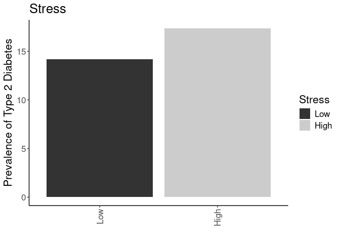
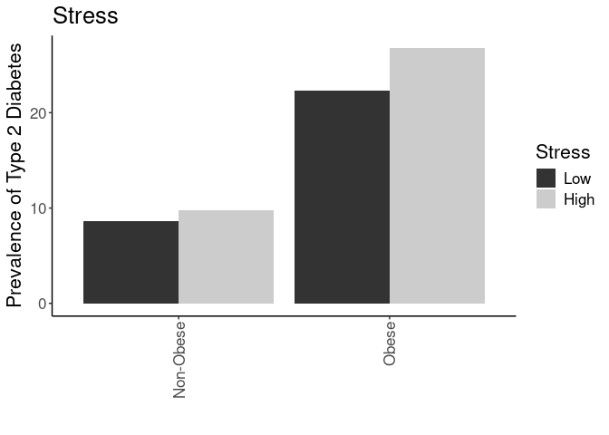
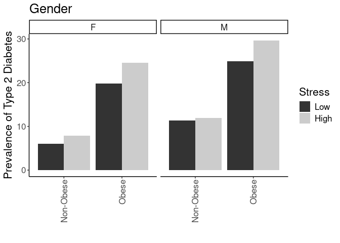
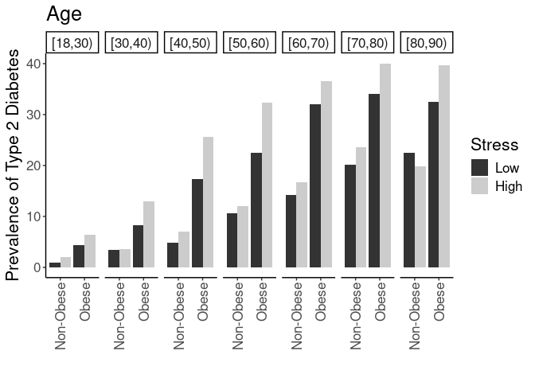
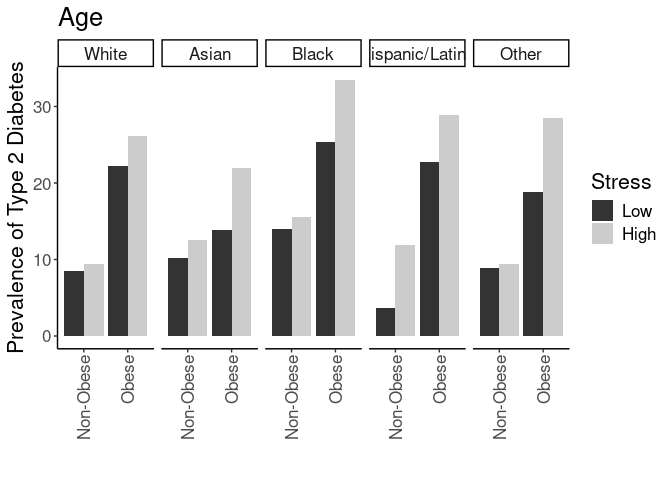
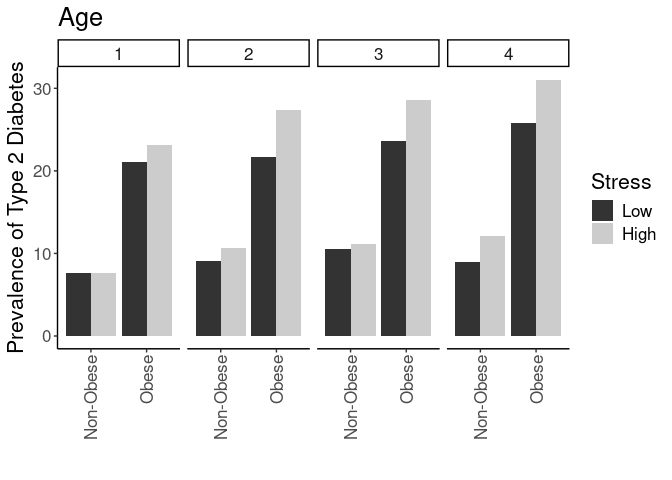

## Purpose

To test the effect modification of stress on diabetes risk, including multivariable analyses.


``` r
library(knitr)
#figures made will go to directory called figures, will make them as both png and pdf files 
opts_chunk$set(fig.path='figures/',
               echo=TRUE, warning=FALSE, message=FALSE,dev=c('png','pdf'))
options(scipen = 2, digits = 3)

library(readr)
library(dplyr)
```

```
## 
## Attaching package: 'dplyr'
```

```
## The following objects are masked from 'package:stats':
## 
##     filter, lag
```

```
## The following objects are masked from 'package:base':
## 
##     intersect, setdiff, setequal, union
```

``` r
library(tidyr)
library(broom)

input.file <- 'data-combined.csv'
combined.data <- read_csv(input.file)
```

```
## Rows: 39560 Columns: 43
```

```
## ── Column specification ────────────────────────────────────────────────────────
## Delimiter: ","
## chr  (18): DeID_PatientID, Gender, DeID_Survey_Date, DeID_EncounterID, BMI_c...
## dbl  (23): age, Stress_d1, Survey.Year, CardiacArrhythmias, ChronicPulmonary...
## dttm  (2): Survey.Date, DeID_Diabetes_Diagnosis
## 
## ℹ Use `spec()` to retrieve the full column specification for this data.
## ℹ Specify the column types or set `show_col_types = FALSE` to quiet this message.
```

Loaded in the cleaned data from data-combined.csv. This script can be found in /nfs/turbo/precision-health/DataDirect/HUM00219435 - Obesity as a modifier of chronic psy/2023-03-14/2150 - Obesity and Stress - Cohort - DeID - 2023-03-14 and was most recently run on Tue Jul 29 18:33:05 2025. This dataset has 39560 values.


``` r
library(forcats)
combined.data <- 
  combined.data %>%
  mutate(BMI_cat= factor(BMI_cat, 
                         levels=c("Underweight",
                                  "Normal",
                                  "Overweight",
                                  'Class I Obese',
                                  'Class II Obese',
                                  'Class III Obese'))) %>%
  mutate(BMI_cat.obese= factor(BMI_cat.obese, 
                               levels=c("Underweight",
                                        "Normal",
                                        "Overweight",
                                        'Obese'))) %>%
  mutate(BMI_cat.Ob.NonOb= factor(BMI_cat.Ob.NonOb, 
                                  levels=c("Non-Obese",
                                           'Obese'))) %>%
  mutate(Stress=relevel(as.factor(High.Stress),ref="Low")) %>% #set low as reference value
    mutate(Race.Ethnicity=relevel(as.factor(Race.Ethnicity),ref="White")) %>% #set white as reference value
  mutate(Stress.quartile=fct_recode(as.factor(Stress.quartile),
                                    "Q1"="(-0.016,4]",
                                    "Q2"="(4,8]",
                                    "Q3"="(8,12]",
                                    "Q4"="(12,16]")) %>%
    mutate(Stress.quartile= factor(Stress.quartile, 
                                  levels=c("Q1","Q2","Q3","Q4"))) 
```

# Effects of Stress on Diabetes Risk

Started with a crude model of:

$$\log \left( \frac{P(\text{Diabetes} = 1 \mid \text{Stress})}{1 - P(\text{Diabetes} = 1 \mid \text{Stress})} \right)
= \beta_0 + \beta_1 \times \text{Stress}$$


``` r
with(combined.data, table(Type2Diabetes,Stress)) %>% 
  data.frame %>%
  pivot_wider(names_from=Type2Diabetes,
              values_from = Freq) %>%
  rename(Diabetes=`1`,
         NonDiabetes=`0`) %>%
  mutate(Total=Diabetes+NonDiabetes) %>%
  mutate(Percent=Diabetes/Total*100) -> diabetes.stress.counts

library(ggplot2)

ggplot(diabetes.stress.counts,
       aes(y=Percent,
           fill=Stress,
           x=Stress)) +
  geom_bar(stat='identity',position='dodge') +
  labs(y="Prevalence of Type 2 Diabetes",
       title="Stress",
       x="") +
  theme_classic() +
  scale_fill_grey() +
  theme(text=element_text(size=16),
        axis.text.x=element_text(angle=90,vjust=0.5,hjust=1),
        legend.position.inside = c(0.1,0.85))
```

<!-- -->

``` r
kable(diabetes.stress.counts, caption="Diabetes rates by stress category")
```


Table: Diabetes rates by stress category

|Stress | NonDiabetes| Diabetes| Total| Percent|
|:------|-----------:|--------:|-----:|-------:|
|Low    |       19585|     3234| 22819|    14.2|
|High   |       13834|     2907| 16741|    17.4|

``` r
#adding in age and gender as covariates as a modifier
glm(Type2Diabetes~Stress, 
    family="binomial",
    data=combined.data) -> stress.glm1

library(broom)
stress.glm1 %>%
  tidy(exponentiate=T, conf.int = TRUE, conf.level = 0.95) %>%
  kable(caption="Logistic regression of stress on diabetes (exponentiated estimates)", digits =c(0,2,3,2,99,3,3))
```


Table: Logistic regression of stress on diabetes (exponentiated estimates)

|term        | estimate| std.error| statistic|  p.value| conf.low| conf.high|
|:-----------|--------:|---------:|---------:|--------:|--------:|---------:|
|(Intercept) |     0.17|     0.019|    -94.89| 0.00e+00|    0.159|     0.171|
|StressHigh  |     1.27|     0.028|      8.65| 5.17e-18|    1.205|     1.344|

## Adding in Obesity as a Covariate

Next added in obesity (obese vs non-obese) as a covariate


``` r
with(combined.data, table(Type2Diabetes,Stress,BMI_cat.Ob.NonOb)) %>% 
  data.frame %>%
  pivot_wider(names_from=Type2Diabetes,
              values_from = Freq) %>%
  rename(Diabetes=`1`,
         NonDiabetes=`0`) %>%
  mutate(Total=Diabetes+NonDiabetes) %>%
  mutate(Percent=Diabetes/Total*100) -> diabetes.stress.obesity.counts

ggplot(diabetes.stress.obesity.counts,
       aes(y=Percent,
           x=BMI_cat.Ob.NonOb,
           fill=Stress)) +
  geom_bar(stat='identity',position='dodge') +
  labs(y="Prevalence of Type 2 Diabetes",
       title="Stress",
       x="") +
  theme_classic() +
  scale_fill_grey() +
  theme(text=element_text(size=16),
        axis.text.x=element_text(angle=90,vjust=0.5,hjust=1),
        legend.position.inside = c(0.1,0.85))
```

<!-- -->

``` r
kable(diabetes.stress.obesity.counts, caption="Diabetes rates by stress and obesity")
```


Table: Diabetes rates by stress and obesity

|Stress |BMI_cat.Ob.NonOb | NonDiabetes| Diabetes| Total| Percent|
|:------|:----------------|-----------:|--------:|-----:|-------:|
|Low    |Non-Obese        |       12418|     1178| 13596|    8.66|
|High   |Non-Obese        |        8344|      901|  9245|    9.75|
|Low    |Obese            |        7167|     2056|  9223|   22.29|
|High   |Obese            |        5490|     2006|  7496|   26.76|

``` r
#adding in age and gender as covariates as a modifier
glm(Type2Diabetes~Stress+BMI_cat.Ob.NonOb, 
    family="binomial",
    data=combined.data) -> stress.glm2

library(broom)
stress.glm2 %>%
  tidy(exponentiate=T, conf.int = TRUE, conf.level = 0.95) %>%
  kable(caption="Logistic regression of stress and obesity on diabetes (exponentiated estimates)", digits =c(0,2,3,2,99,3,3))
```


Table: Logistic regression of stress and obesity on diabetes (exponentiated estimates)

|term                  | estimate| std.error| statistic|  p.value| conf.low| conf.high|
|:---------------------|--------:|---------:|---------:|--------:|--------:|---------:|
|(Intercept)           |     0.09|     0.026|     -90.8| 0.00e+00|    0.087|     0.097|
|StressHigh            |     1.22|     0.028|       7.0| 2.56e-12|    1.154|     1.291|
|BMI_cat.Ob.NonObObese |     3.18|     0.029|      39.6| 0.00e+00|    3.005|     3.370|

## Adding in Gender as a Covariate


``` r
with(combined.data, table(Type2Diabetes,Stress,BMI_cat.Ob.NonOb,Gender)) %>% 
  data.frame %>%
  pivot_wider(names_from=Type2Diabetes,
              values_from = Freq) %>%
  rename(Diabetes=`1`,
         NonDiabetes=`0`) %>%
  mutate(Total=Diabetes+NonDiabetes) %>%
  mutate(Percent=Diabetes/Total*100) -> diabetes.stress.obesity.gender.counts

ggplot(diabetes.stress.obesity.gender.counts,
       aes(y=Percent,
           x=BMI_cat.Ob.NonOb,
           fill=Stress)) +
  facet_grid(.~Gender) +
  geom_bar(stat='identity',position='dodge') +
  labs(y="Prevalence of Type 2 Diabetes",
       title="Gender",
       x="") +
  theme_classic() +
  scale_fill_grey() +
  theme(text=element_text(size=16),
        axis.text.x=element_text(angle=90,vjust=0.5,hjust=1),
        legend.position.inside = c(0.1,0.85))
```

<!-- -->

``` r
kable(diabetes.stress.obesity.counts, caption="Diabetes rates by stress, obesity and gender")
```


Table: Diabetes rates by stress, obesity and gender

|Stress |BMI_cat.Ob.NonOb | NonDiabetes| Diabetes| Total| Percent|
|:------|:----------------|-----------:|--------:|-----:|-------:|
|Low    |Non-Obese        |       12418|     1178| 13596|    8.66|
|High   |Non-Obese        |        8344|      901|  9245|    9.75|
|Low    |Obese            |        7167|     2056|  9223|   22.29|
|High   |Obese            |        5490|     2006|  7496|   26.76|

``` r
#adding in age and gender as covariates as a modifier
glm(Type2Diabetes~Stress+BMI_cat.Ob.NonOb+Gender, 
    family="binomial",
    data=combined.data) -> stress.glm3

stress.glm3 %>%
  tidy(exponentiate=T, conf.int = TRUE, conf.level = 0.95) %>%
  kable(caption="Logistic regression of stress, obesity, and gender on diabetes (exponentiated estimates)", digits =c(0,2,3,2,99,3,3))
```


Table: Logistic regression of stress, obesity, and gender on diabetes (exponentiated estimates)

|term                  | estimate| std.error| statistic|  p.value| conf.low| conf.high|
|:---------------------|--------:|---------:|---------:|--------:|--------:|---------:|
|(Intercept)           |     0.07|     0.031|    -83.25| 0.00e+00|     0.07|     0.079|
|StressHigh            |     1.25|     0.029|      7.72| 1.16e-14|     1.18|     1.319|
|BMI_cat.Ob.NonObObese |     3.22|     0.029|     39.85| 0.00e+00|     3.04|     3.412|
|GenderM               |     1.48|     0.029|     13.74| 6.03e-43|     1.40|     1.567|

## Adding in Age as a Covariate


``` r
with(combined.data, table(Type2Diabetes,Stress,BMI_cat.Ob.NonOb,Gender,Age.group)) %>% 
  data.frame %>%
  pivot_wider(names_from=Type2Diabetes,
              values_from = Freq) %>%
  rename(Diabetes=`1`,
         NonDiabetes=`0`) %>%
  mutate(Total=Diabetes+NonDiabetes) %>%
  mutate(Percent=Diabetes/Total*100) -> diabetes.stress.obesity.age.counts

ggplot(diabetes.stress.obesity.age.counts,
       aes(y=Percent,
           x=BMI_cat.Ob.NonOb,
           fill=Stress)) +
  facet_grid(.~Age.group) +
  geom_bar(stat='identity',position='dodge') +
  labs(y="Prevalence of Type 2 Diabetes",
       title="Age",
       x="") +
  theme_classic() +
  scale_fill_grey() +
  theme(text=element_text(size=16),
        axis.text.x=element_text(angle=90,vjust=0.5,hjust=1),
        legend.position.inside = c(0.1,0.85))
```

<!-- -->

``` r
kable(diabetes.stress.obesity.counts, caption="Diabetes rates by stress, obesity and gender")
```


Table: Diabetes rates by stress, obesity and gender

|Stress |BMI_cat.Ob.NonOb | NonDiabetes| Diabetes| Total| Percent|
|:------|:----------------|-----------:|--------:|-----:|-------:|
|Low    |Non-Obese        |       12418|     1178| 13596|    8.66|
|High   |Non-Obese        |        8344|      901|  9245|    9.75|
|Low    |Obese            |        7167|     2056|  9223|   22.29|
|High   |Obese            |        5490|     2006|  7496|   26.76|

``` r
#adding in age and gender as covariates as a modifier
glm(Type2Diabetes~Stress+BMI_cat.Ob.NonOb+Gender+Age.group, 
    family="binomial",
    data=combined.data) -> stress.glm4

stress.glm4 %>%
  tidy(exponentiate=T, conf.int = TRUE, conf.level = 0.95) %>%
  kable(caption="Logistic regression of stress, obesity, gender, and age on diabetes (exponentiated estimates)", digits =c(0,2,3,2,99,3,3))
```


Table: Logistic regression of stress, obesity, gender, and age on diabetes (exponentiated estimates)

|term                  | estimate| std.error| statistic|  p.value| conf.low| conf.high|
|:---------------------|--------:|---------:|---------:|--------:|--------:|---------:|
|(Intercept)           |     0.01|     0.108|    -42.00| 0.00e+00|    0.009|     0.013|
|StressHigh            |     1.35|     0.029|     10.30| 7.20e-25|    1.278|     1.434|
|BMI_cat.Ob.NonObObese |     3.19|     0.030|     38.28| 0.00e+00|    3.010|     3.390|
|GenderM               |     1.27|     0.030|      8.20| 2.41e-16|    1.202|     1.350|
|Age.group[30,40)      |     2.44|     0.122|      7.31| 2.70e-13|    1.927|     3.109|
|Age.group[40,50)      |     5.01|     0.112|     14.37| 8.50e-47|    4.046|     6.286|
|Age.group[50,60)      |     7.46|     0.109|     18.46| 4.51e-76|    6.059|     9.288|
|Age.group[60,70)      |    10.73|     0.108|     21.98| 0.00e+00|    8.739|    13.351|
|Age.group[70,80)      |    14.02|     0.110|     23.97| 0.00e+00|   11.365|    17.512|
|Age.group[80,90)      |    13.61|     0.126|     20.76| 9.51e-96|   10.676|    17.486|

## Adding in Race/Ethnicity as a Covariate


``` r
with(combined.data, table(Type2Diabetes,Stress,BMI_cat.Ob.NonOb,Race.Ethnicity)) %>% 
  data.frame %>%
  pivot_wider(names_from=Type2Diabetes,
              values_from = Freq) %>%
  rename(Diabetes=`1`,
         NonDiabetes=`0`) %>%
  mutate(Total=Diabetes+NonDiabetes) %>%
  mutate(Percent=Diabetes/Total*100) -> diabetes.stress.obesity.race.counts

ggplot(diabetes.stress.obesity.race.counts,
       aes(y=Percent,
           x=BMI_cat.Ob.NonOb,
           fill=Stress)) +
  facet_grid(.~Race.Ethnicity) +
  geom_bar(stat='identity',position='dodge') +
  labs(y="Prevalence of Type 2 Diabetes",
       title="Age",
       x="") +
  theme_classic() +
  scale_fill_grey() +
  theme(text=element_text(size=16),
        axis.text.x=element_text(angle=90,vjust=0.5,hjust=1),
        legend.position.inside = c(0.1,0.85))
```

<!-- -->

``` r
kable(diabetes.stress.obesity.counts, caption="Diabetes rates by stress, obesity and gender")
```


Table: Diabetes rates by stress, obesity and gender

|Stress |BMI_cat.Ob.NonOb | NonDiabetes| Diabetes| Total| Percent|
|:------|:----------------|-----------:|--------:|-----:|-------:|
|Low    |Non-Obese        |       12418|     1178| 13596|    8.66|
|High   |Non-Obese        |        8344|      901|  9245|    9.75|
|Low    |Obese            |        7167|     2056|  9223|   22.29|
|High   |Obese            |        5490|     2006|  7496|   26.76|

``` r
#adding in age and gender as covariates as a modifier
glm(Type2Diabetes~Stress+BMI_cat.Ob.NonOb+Gender+Age.group+Race.Ethnicity, 
    family="binomial",
    data=combined.data) -> stress.glm5

stress.glm5 %>%
  tidy(exponentiate=T, conf.int = TRUE, conf.level = 0.95) %>%
  kable(caption="Logistic regression of stress, obesity, gender, age, and race/ethnicity on diabetes (exponentiated estimates)", digits =c(0,2,3,2,99,3,3))
```


Table: Logistic regression of stress, obesity, gender, age, and race/ethnicity on diabetes (exponentiated estimates)

|term                          | estimate| std.error| statistic|  p.value| conf.low| conf.high|
|:-----------------------------|--------:|---------:|---------:|--------:|--------:|---------:|
|(Intercept)                   |     0.01|     0.109|    -42.62| 0.00e+00|    0.008|     0.012|
|StressHigh                    |     1.35|     0.029|     10.12| 4.50e-24|    1.272|     1.428|
|BMI_cat.Ob.NonObObese         |     3.20|     0.031|     38.06| 0.00e+00|    3.011|     3.394|
|GenderM                       |     1.29|     0.030|      8.47| 2.39e-17|    1.213|     1.362|
|Age.group[30,40)              |     2.46|     0.122|      7.37| 1.71e-13|    1.943|     3.137|
|Age.group[40,50)              |     5.10|     0.112|     14.50| 1.27e-47|    4.117|     6.400|
|Age.group[50,60)              |     7.83|     0.109|     18.85| 2.96e-79|    6.356|     9.756|
|Age.group[60,70)              |    11.47|     0.108|     22.50| 0.00e+00|    9.327|    14.273|
|Age.group[70,80)              |    15.15|     0.111|     24.56| 0.00e+00|   12.262|    18.931|
|Age.group[80,90)              |    14.77|     0.126|     21.33| 0.00e+00|   11.580|    19.006|
|Race.EthnicityAsian           |     1.98|     0.137|      4.99| 6.17e-07|    1.504|     2.577|
|Race.EthnicityBlack           |     1.95|     0.064|     10.51| 8.00e-26|    1.720|     2.206|
|Race.EthnicityHispanic/Latino |     1.46|     0.108|      3.52| 4.38e-04|    1.178|     1.797|
|Race.EthnicityOther           |     1.05|     0.084|      0.53| 5.98e-01|    0.884|     1.231|

## Adding in Neighborhood SES as a Covariate

Used `disadvantage13_17_qrtl` as the variable


``` r
with(combined.data, table(Type2Diabetes,Stress,BMI_cat.Ob.NonOb,disadvantage13_17_qrtl)) %>% 
  data.frame %>%
  pivot_wider(names_from=Type2Diabetes,
              values_from = Freq) %>%
  rename(Diabetes=`1`,
         NonDiabetes=`0`) %>%
  mutate(Total=Diabetes+NonDiabetes) %>%
  mutate(Percent=Diabetes/Total*100) -> diabetes.stress.obesity.ses.counts

ggplot(diabetes.stress.obesity.ses.counts,
       aes(y=Percent,
           x=BMI_cat.Ob.NonOb,
           fill=Stress)) +
  facet_grid(.~disadvantage13_17_qrtl) +
  geom_bar(stat='identity',position='dodge') +
  labs(y="Prevalence of Type 2 Diabetes",
       title="Age",
       x="") +
  theme_classic() +
  scale_fill_grey() +
  theme(text=element_text(size=16),
        axis.text.x=element_text(angle=90,vjust=0.5,hjust=1),
        legend.position.inside = c(0.1,0.85))
```

<!-- -->

``` r
kable(diabetes.stress.obesity.counts, caption="Diabetes rates by stress, obesity and gender")
```


Table: Diabetes rates by stress, obesity and gender

|Stress |BMI_cat.Ob.NonOb | NonDiabetes| Diabetes| Total| Percent|
|:------|:----------------|-----------:|--------:|-----:|-------:|
|Low    |Non-Obese        |       12418|     1178| 13596|    8.66|
|High   |Non-Obese        |        8344|      901|  9245|    9.75|
|Low    |Obese            |        7167|     2056|  9223|   22.29|
|High   |Obese            |        5490|     2006|  7496|   26.76|

``` r
#adding in age and gender as covariates as a modifier
glm(Type2Diabetes~Stress+BMI_cat.Ob.NonOb+Gender+Age.group+disadvantage13_17_qrtl, 
    family="binomial",
    data=combined.data) -> stress.glm6

stress.glm6 %>%
  tidy(exponentiate=T, conf.int = TRUE, conf.level = 0.95) %>%
  kable(caption="Logistic regression of stress, obesity, gender, age, and neighborhood SES on diabetes (exponentiated estimates)", digits =c(0,2,3,2,99,3,3))
```


Table: Logistic regression of stress, obesity, gender, age, and neighborhood SES on diabetes (exponentiated estimates)

|term                   | estimate| std.error| statistic|  p.value| conf.low| conf.high|
|:----------------------|--------:|---------:|---------:|--------:|--------:|---------:|
|(Intercept)            |     0.01|     0.118|    -41.72| 0.00e+00|    0.006|     0.009|
|StressHigh             |     1.32|     0.031|      9.09| 1.02e-19|    1.245|     1.404|
|BMI_cat.Ob.NonObObese  |     3.13|     0.032|     36.06| 0.00e+00|    2.945|     3.334|
|GenderM                |     1.29|     0.031|      8.24| 1.68e-16|    1.213|     1.369|
|Age.group[30,40)       |     2.42|     0.127|      6.94| 3.93e-12|    1.894|     3.122|
|Age.group[40,50)       |     5.12|     0.117|     13.91| 5.33e-44|    4.090|     6.483|
|Age.group[50,60)       |     7.87|     0.114|     18.11| 2.48e-73|    6.336|     9.908|
|Age.group[60,70)       |    11.19|     0.113|     21.35| 0.00e+00|    9.020|    14.060|
|Age.group[70,80)       |    14.74|     0.116|     23.29| 0.00e+00|   11.826|    18.610|
|Age.group[80,90)       |    14.79|     0.131|     20.49| 2.60e-93|   11.478|    19.228|
|disadvantage13_17_qrtl |     1.20|     0.015|     12.58| 2.74e-36|    1.170|     1.239|

# Combined Summary of Multivariable Models


``` r
combined.model.data <-
  bind_rows(tidy(stress.glm1, exponentiate=T, conf.int = TRUE, conf.level = 0.95) %>%
              mutate(Model="Unadjusted"),
            tidy(stress.glm2,exponentiate=T, conf.int = TRUE, conf.level = 0.95) %>%
              mutate(Model="+ Obesity"),
            tidy(stress.glm3,exponentiate=T, conf.int = TRUE, conf.level = 0.95) %>%
              mutate(Model="+ Gender"),
            tidy(stress.glm4,exponentiate=T, conf.int = TRUE, conf.level = 0.95) %>%
              mutate(Model="+ Age"),
            tidy(stress.glm5,exponentiate=T, conf.int = TRUE, conf.level = 0.95) %>%
              mutate(Model="+ Race/Ethnicity"),
            tidy(stress.glm6,exponentiate=T, conf.int = TRUE, conf.level = 0.95) %>%
              mutate(Model="+ Neighborhood SES")) %>%
  filter(term=="StressHigh") %>%
  mutate(`OR [95% CI]` = paste(round(estimate,3),
                          " [",
                          round(conf.low,3),
                          "-",
                          round(conf.high,3),
                          "]",
                          sep="")) %>%
  select(Model,`OR [95% CI]`,p.value)

kable(combined.model.data,
      caption="Summary of multivariable models",
      digits =c(0,0,99))
```


Table: Summary of multivariable models

|Model              |OR [95% CI]         |  p.value|
|:------------------|:-------------------|--------:|
|Unadjusted         |1.273 [1.205-1.344] | 5.17e-18|
|+ Obesity          |1.221 [1.154-1.291] | 2.56e-12|
|+ Gender           |1.247 [1.179-1.319] | 1.16e-14|
|+ Age              |1.354 [1.278-1.434] | 7.20e-25|
|+ Race/Ethnicity   |1.348 [1.272-1.428] | 4.50e-24|
|+ Neighborhood SES |1.322 [1.245-1.404] | 1.02e-19|

``` r
write_csv(combined.model.data, 
          "Multivariable Analysis of Stress-Diabetes Associations.csv")
```

# Effect Modification by Obesity

Used the fully adjusted models to evaluate effect modification by obesity status


``` r
with(combined.data, table(Type2Diabetes,Stress,BMI_cat.Ob.NonOb)) %>% 
  data.frame %>%
  pivot_wider(names_from=Type2Diabetes,
              values_from = Freq) %>%
  rename(Diabetes=`1`,
         NonDiabetes=`0`) %>%
  mutate(Total=Diabetes+NonDiabetes) %>%
  mutate(Percent=Diabetes/Total*100) %>%
  mutate(Odds = Percent/100 / (1 - Percent/100))-> diabetes.stress.obesity.counts

# Reshape to wide format for easier OR calculation
diabetes.stress.obesity.counts.wide <- diabetes.stress.obesity.counts %>%
  select(Stress, BMI_cat.Ob.NonOb, Odds) %>%
  tidyr::pivot_wider(names_from = Stress, values_from = Odds)

# Compute odds ratios for stress within each obesity group
odds.ratios <- diabetes.stress.obesity.counts.wide %>%
  mutate(OR = High / Low) %>%
  mutate(Interaction_OR = if_else(BMI_cat.Ob.NonOb == "Obese", 
                                  OR / OR[BMI_cat.Ob.NonOb == "Non-Obese"], 
                                  NA_real_))

kable(odds.ratios, caption="Crude odds and odds ratios")
```


Table: Crude odds and odds ratios

|BMI_cat.Ob.NonOb |   Low|  High|   OR| Interaction_OR|
|:----------------|-----:|-----:|----:|--------------:|
|Non-Obese        | 0.095| 0.108| 1.14|             NA|
|Obese            | 0.287| 0.365| 1.27|           1.12|

``` r
ggplot(diabetes.stress.obesity.counts,
       aes(y=Percent,
           x=BMI_cat.Ob.NonOb,
           fill=Stress)) +
  geom_bar(stat='identity',position='dodge') +
  labs(y="Prevalence of Type 2 Diabetes",
       title="Age",
       x="") +
  theme_classic() +
  scale_fill_grey() +
  theme(text=element_text(size=16),
        axis.text.x=element_text(angle=90,vjust=0.5,hjust=1),
        legend.position.inside = c(0.1,0.85))
```

<!-- -->

``` r
kable(diabetes.stress.obesity.counts, caption="Diabetes rates by stress, obesity and gender")
```


Table: Diabetes rates by stress, obesity and gender

|Stress |BMI_cat.Ob.NonOb | NonDiabetes| Diabetes| Total| Percent|  Odds|
|:------|:----------------|-----------:|--------:|-----:|-------:|-----:|
|Low    |Non-Obese        |       12418|     1178| 13596|    8.66| 0.095|
|High   |Non-Obese        |        8344|      901|  9245|    9.75| 0.108|
|Low    |Obese            |        7167|     2056|  9223|   22.29| 0.287|
|High   |Obese            |        5490|     2006|  7496|   26.76| 0.365|

``` r
#adding in age and gender as covariates as a modifier
glm(Type2Diabetes~Stress+BMI_cat.Ob.NonOb+Gender+Age.group+disadvantage13_17_qrtl+Stress:BMI_cat.Ob.NonOb, 
    family="binomial",
    data=combined.data) -> stress.em

stress.em %>%
  tidy(exponentiate=T, conf.int = TRUE, conf.level = 0.95) %>%
  kable(caption="Logistic regression of stress, obesity, gender, age, and neighborhood SES with effect modification by obesity status on diabetes (exponentiated estimates)", digits =c(0,2,3,2,99,3,3))
```


Table: Logistic regression of stress, obesity, gender, age, and neighborhood SES with effect modification by obesity status on diabetes (exponentiated estimates)

|term                             | estimate| std.error| statistic|  p.value| conf.low| conf.high|
|:--------------------------------|--------:|---------:|---------:|--------:|--------:|---------:|
|(Intercept)                      |     0.01|     0.119|    -41.03| 0.00e+00|    0.006|     0.009|
|StressHigh                       |     1.21|     0.050|      3.93| 8.54e-05|    1.102|     1.339|
|BMI_cat.Ob.NonObObese            |     2.95|     0.042|     25.55| 0.00e+00|    2.712|     3.201|
|GenderM                          |     1.29|     0.031|      8.27| 1.34e-16|    1.214|     1.370|
|Age.group[30,40)                 |     2.41|     0.127|      6.92| 4.49e-12|    1.890|     3.116|
|Age.group[40,50)                 |     5.11|     0.117|     13.89| 6.88e-44|    4.082|     6.471|
|Age.group[50,60)                 |     7.87|     0.114|     18.11| 2.56e-73|    6.336|     9.909|
|Age.group[60,70)                 |    11.18|     0.113|     21.34| 0.00e+00|    9.015|    14.053|
|Age.group[70,80)                 |    14.73|     0.116|     23.28| 0.00e+00|   11.818|    18.599|
|Age.group[80,90)                 |    14.81|     0.131|     20.50| 2.07e-93|   11.495|    19.258|
|disadvantage13_17_qrtl           |     1.20|     0.015|     12.59| 2.46e-36|    1.170|     1.240|
|StressHigh:BMI_cat.Ob.NonObObese |     1.15|     0.063|      2.18| 2.91e-02|    1.014|     1.298|

## Stratified Fully Adjusted Models in Support of Effect Modification


``` r
glm(Type2Diabetes~Stress+Gender+Age.group+disadvantage13_17_qrtl, 
    family="binomial",
    data=combined.data %>% filter(BMI_cat.Ob.NonOb=="Non-Obese")) -> stress.em.non.obese

stress.em.non.obese %>%
  tidy(exponentiate=T, conf.int = TRUE, conf.level = 0.95) %>%
  kable(caption="Participants with a BMI <30  Logistic regression of stress, gender, age, and neighborhood SES with effect modification by obesity status on diabetes (exponentiated estimates)", digits =c(0,2,3,2,99,3,3))
```


Table: Participants with a BMI <30  Logistic regression of stress, gender, age, and neighborhood SES with effect modification by obesity status on diabetes (exponentiated estimates)

|term                   | estimate| std.error| statistic|  p.value| conf.low| conf.high|
|:----------------------|--------:|---------:|---------:|--------:|--------:|---------:|
|(Intercept)            |     0.01|     0.177|    -28.98| 0.00e+00|    0.004|     0.008|
|StressHigh             |     1.24|     0.050|      4.27| 1.92e-05|    1.123|     1.366|
|GenderM                |     1.55|     0.050|      8.72| 2.70e-18|    1.407|     1.715|
|Age.group[30,40)       |     2.35|     0.204|      4.20| 2.65e-05|    1.588|     3.537|
|Age.group[40,50)       |     4.26|     0.185|      7.84| 4.59e-15|    2.999|     6.207|
|Age.group[50,60)       |     8.30|     0.172|     12.31| 7.84e-35|    6.009|    11.811|
|Age.group[60,70)       |    12.65|     0.169|     14.99| 8.85e-51|    9.207|    17.912|
|Age.group[70,80)       |    17.68|     0.171|     16.78| 3.30e-63|   12.824|    25.132|
|Age.group[80,90)       |    16.91|     0.186|     15.23| 2.41e-52|   11.884|    24.663|
|disadvantage13_17_qrtl |     1.22|     0.024|      8.16| 3.25e-16|    1.160|     1.274|

``` r
glm(Type2Diabetes~Stress+Gender+Age.group+disadvantage13_17_qrtl, 
    family="binomial",
    data=combined.data %>% filter(BMI_cat.Ob.NonOb=="Obese")) -> stress.em.obese

stress.em.obese %>%
  tidy(exponentiate=T, conf.int = TRUE, conf.level = 0.95) %>%
  kable(caption="Participants with obesity.  Logistic regression of stress, gender, age, and neighborhood SES with effect modification by obesity status on diabetes (exponentiated estimates)", digits =c(0,2,3,2,99,3,3))
```


Table: Participants with obesity.  Logistic regression of stress, gender, age, and neighborhood SES with effect modification by obesity status on diabetes (exponentiated estimates)

|term                   | estimate| std.error| statistic|  p.value| conf.low| conf.high|
|:----------------------|--------:|---------:|---------:|--------:|--------:|---------:|
|(Intercept)            |     0.03|     0.158|    -23.21| 0.00e+00|    0.019|     0.035|
|StressHigh             |     1.37|     0.039|      8.09| 5.85e-16|    1.270|     1.479|
|GenderM                |     1.15|     0.039|      3.62| 2.90e-04|    1.067|     1.244|
|Age.group[30,40)       |     2.36|     0.167|      5.15| 2.56e-07|    1.718|     3.309|
|Age.group[40,50)       |     5.25|     0.156|     10.65| 1.71e-26|    3.911|     7.211|
|Age.group[50,60)       |     7.49|     0.153|     13.17| 1.30e-39|    5.613|    10.235|
|Age.group[60,70)       |    10.22|     0.152|     15.25| 1.58e-52|    7.667|    13.951|
|Age.group[70,80)       |    12.53|     0.157|     16.12| 1.82e-58|    9.310|    17.238|
|Age.group[80,90)       |    12.50|     0.193|     13.07| 4.76e-39|    8.606|    18.378|
|disadvantage13_17_qrtl |     1.19|     0.019|      9.26| 2.10e-20|    1.146|     1.234|

# Session Information


``` r
sessionInfo()
```

```
## R version 4.4.3 (2025-02-28)
## Platform: x86_64-pc-linux-gnu
## Running under: Red Hat Enterprise Linux 8.10 (Ootpa)
## 
## Matrix products: default
## BLAS:   /sw/pkgs/arc/stacks/gcc/13.2.0/R/4.4.3/lib64/R/lib/libRblas.so 
## LAPACK: /sw/pkgs/arc/stacks/gcc/13.2.0/R/4.4.3/lib64/R/lib/libRlapack.so;  LAPACK version 3.12.0
## 
## locale:
##  [1] LC_CTYPE=en_US.UTF-8       LC_NUMERIC=C              
##  [3] LC_TIME=en_US.UTF-8        LC_COLLATE=en_US.UTF-8    
##  [5] LC_MONETARY=en_US.UTF-8    LC_MESSAGES=en_US.UTF-8   
##  [7] LC_PAPER=en_US.UTF-8       LC_NAME=C                 
##  [9] LC_ADDRESS=C               LC_TELEPHONE=C            
## [11] LC_MEASUREMENT=en_US.UTF-8 LC_IDENTIFICATION=C       
## 
## time zone: America/Detroit
## tzcode source: system (glibc)
## 
## attached base packages:
## [1] stats     graphics  grDevices utils     datasets  methods   base     
## 
## other attached packages:
## [1] ggplot2_3.5.1 forcats_1.0.0 broom_1.0.6   tidyr_1.3.1   dplyr_1.1.4  
## [6] readr_2.1.5   knitr_1.48   
## 
## loaded via a namespace (and not attached):
##  [1] bit_4.0.5         gtable_0.3.5      jsonlite_1.8.8    highr_0.11       
##  [5] compiler_4.4.3    crayon_1.5.3      tidyselect_1.2.1  parallel_4.4.3   
##  [9] jquerylib_0.1.4   scales_1.3.0      yaml_2.3.9        fastmap_1.2.0    
## [13] R6_2.5.1          labeling_0.4.3    generics_0.1.3    backports_1.5.0  
## [17] tibble_3.2.1      munsell_0.5.1     bslib_0.7.0       pillar_1.9.0     
## [21] tzdb_0.4.0        rlang_1.1.4       utf8_1.2.4        cachem_1.1.0     
## [25] xfun_0.45         sass_0.4.9        bit64_4.0.5       cli_3.6.3        
## [29] withr_3.0.0       magrittr_2.0.3    grid_4.4.3        digest_0.6.36    
## [33] vroom_1.6.5       rstudioapi_0.16.0 hms_1.1.3         lifecycle_1.0.4  
## [37] vctrs_0.6.5       evaluate_0.24.0   glue_1.8.0        farver_2.1.2     
## [41] colorspace_2.1-0  fansi_1.0.6       rmarkdown_2.27    purrr_1.0.2      
## [45] tools_4.4.3       pkgconfig_2.0.3   htmltools_0.5.8.1
```
