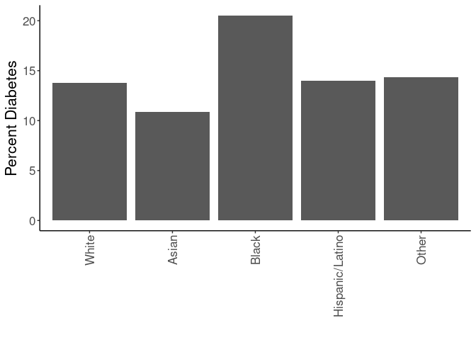
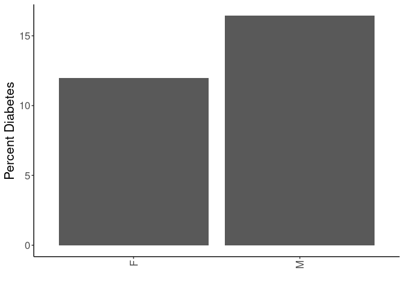
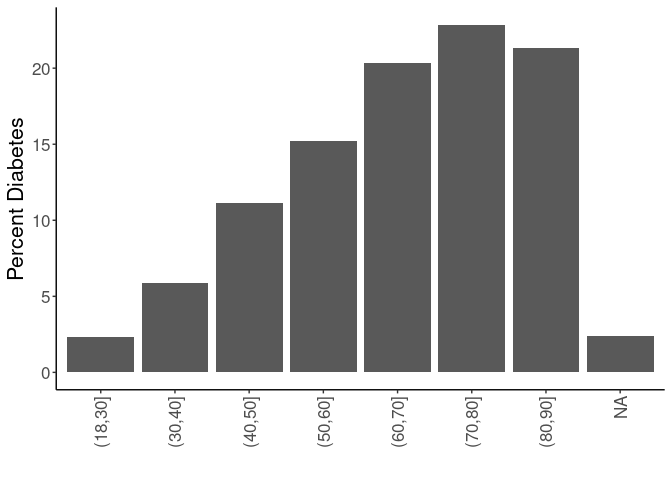
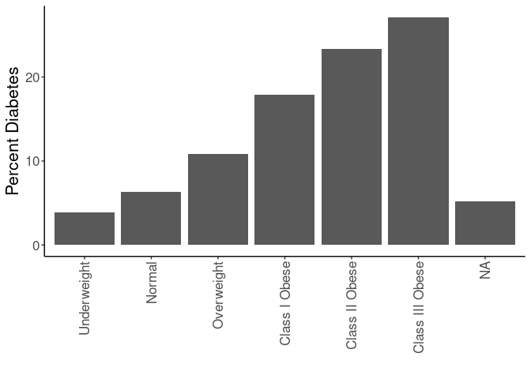

## Purpose

To define covariates for stress-obesity relationships, referring to associations with the outcome (diabetes risk).


```r
library(knitr)
#figures made will go to directory called figures, will make them as both png and pdf files 
opts_chunk$set(fig.path='figures/',
               echo=TRUE, warning=FALSE, message=FALSE,dev=c('png','pdf'))
options(scipen = 2, digits = 3)

library(readr)
library(dplyr)
```

```
## 
## Attaching package: 'dplyr'
```

```
## The following objects are masked from 'package:stats':
## 
##     filter, lag
```

```
## The following objects are masked from 'package:base':
## 
##     intersect, setdiff, setequal, union
```

```r
library(tidyr)
library(ggplot2)

input.file <- 'data-combined.csv'
combined.data <- read_csv(input.file) %>% #set reference values for each group
  mutate(Race.Ethnicity = relevel(as.factor(Race.Ethnicity),ref="White")) %>%
  mutate(Gender = relevel(as.factor(Gender),ref="F")) %>%
  mutate(BMI_cat = factor(as.factor(BMI_cat),levels=c("Underweight","Normal","Overweight","Class I Obese","Class II Obese","Class III Obese")))%>%
  filter(!(is.na(HypertensionAny))) %>%
  filter(!(is.na(Stress))) %>%
  filter(Stress!="NA")
```

```
## Rows: 62010 Columns: 32
```

```
## ── Column specification ────────────────────────────────────────────────────────
## Delimiter: ","
## chr (16): DeID_PatientID, Gender, DeID_EncounterID, BMI_cat, BMI_cat.obese, ...
## dbl (16): age, Stress_d1, CardiacArrhythmias, ChronicPulmonaryDisease, Depre...
## 
## ℹ Use `spec()` to retrieve the full column specification for this data.
## ℹ Specify the column types or set `show_col_types = FALSE` to quiet this message.
```

Loaded in the cleaned data from data-combined.csv. This script can be found in /nfs/turbo/precision-health/DataDirect/HUM00219435 - Obesity as a modifier of chronic psy and was most recently run on Tue Mar  7 15:32:52 2023. This dataset has 39691 values.

Performed univariate analyses on the categorical associations with diabetes incidence. Treated both age and BMI as both linear and categorical variables.

## By Race and Ethnicity


```r
combined.data %>%
  filter(!(is.na(Stress))) %>%
  filter(!(is.na(BMI_cat.Ob.NonOb))) %>%
  group_by(Race.Ethnicity,DiabetesAny) %>%
  count %>%
  pivot_wider(id_cols=Race.Ethnicity,
              names_from=DiabetesAny,
              values_from = n,
              names_prefix='Diabetes') %>%
  rename("Yes"="Diabetes1",
         "No"="Diabetes0")%>%
  mutate(Prevalence=Yes/(Yes+No)*100) -> diabetes.race

diabetes.race %>%
  ggplot(aes(y=Prevalence,x=Race.Ethnicity)) +
  geom_bar(stat='identity',position='dodge') +
  labs(y="Percent Diabetes",
       x="") +
  theme_classic() +
  scale_fill_grey() +
  theme(text=element_text(size=16),
        axis.text.x=element_text(angle=90,vjust=0.5,hjust=1),
        legend.position = c(0.1,0.85))
```

<!-- -->

```r
diabetes.race %>%
  knitr::kable(caption="Number of participants by diabetes diagnosis and race/ethnicity",
               digits =c(0,2,3,2,99))
```


Table: Number of participants by diabetes diagnosis and race/ethnicity

|Race.Ethnicity  |    No|  Yes| Prevalence|
|:---------------|-----:|----:|----------:|
|White           | 30452| 4870|       13.8|
|Asian           |   519|   65|       11.1|
|Black           |  1378|  360|       20.7|
|Hispanic/Latino |   675|  104|       13.3|
|Other           |  1092|  176|       13.9|


```r
library(broom)
glm(DiabetesAny~Race.Ethnicity, 
    family="binomial",
    data=combined.data) -> race.glm

race.glm %>% 
  anova(test="Chisq") %>% 
  tidy %>% 
  kable(caption="Binomial regression of ethicity on diabetes incidence",
        digits =c(0,0,0,0,0,99))
```


Table: Binomial regression of ethicity on diabetes incidence

|term           | df| Deviance| Resid..Df| Resid..Dev|  p.value|
|:--------------|--:|--------:|---------:|----------:|--------:|
|NULL           | NA|       NA|     39690|      32213|       NA|
|Race.Ethnicity |  4|       64|     39686|      32149| 4.51e-13|

```r
race.glm %>% 
  tidy %>% 
  kable(caption="Binomial regression estimates of ethicity on diabetes incidence", 
        digits =c(0,2,3,2,99))
```


Table: Binomial regression estimates of ethicity on diabetes incidence

|term                          | estimate| std.error| statistic|  p.value|
|:-----------------------------|--------:|---------:|---------:|--------:|
|(Intercept)                   |    -1.83|     0.015|   -118.78| 0.00e+00|
|Race.EthnicityAsian           |    -0.24|     0.132|     -1.85| 6.50e-02|
|Race.EthnicityBlack           |     0.49|     0.061|      8.02| 1.03e-15|
|Race.EthnicityHispanic/Latino |    -0.04|     0.106|     -0.35| 7.26e-01|
|Race.EthnicityOther           |     0.01|     0.083|      0.09| 9.25e-01|

## By Gender


```r
combined.data %>%
  filter(!(is.na(Stress))) %>%
  filter(!(is.na(BMI_cat.Ob.NonOb))) %>%
  group_by(Gender,DiabetesAny) %>%
  count %>%
  pivot_wider(id_cols=Gender,
              names_from=DiabetesAny,
              values_from = n,
              names_prefix='Diabetes') %>%
  rename("Yes"="Diabetes1",
         "No"="Diabetes0") %>%
  mutate(Prevalence=Yes/(Yes+No)*100) -> 
  diabetes.gender

diabetes.gender %>%
  ggplot(aes(y=Prevalence,x=Gender)) +
  geom_bar(stat='identity',position='dodge') +
  labs(y="Percent Diabetes",
       x="") +
  theme_classic() +
  scale_fill_grey() +
  theme(text=element_text(size=16),
        axis.text.x=element_text(angle=90,vjust=0.5,hjust=1),
        legend.position = c(0.1,0.85))
```

<!-- -->

```r
diabetes.gender %>% 
  knitr::kable(caption="Number of participants by diabetes diagnosis and gender",
               digits =c(0,2,3,2,99))
```


Table: Number of participants by diabetes diagnosis and gender

|Gender |    No|  Yes| Prevalence|
|:------|-----:|----:|----------:|
|F      | 18389| 2474|       11.9|
|M      | 15727| 3101|       16.5|


```r
library(broom)
glm(DiabetesAny~Gender, 
    family="binomial",
    data=combined.data) -> gender.glm

gender.glm %>% 
  anova(test="Chisq") %>% 
  tidy %>% 
  kable(caption="Binomial regression of gender on diabetes incidence",
        digits =c(0,0,0,0,0,99))
```


Table: Binomial regression of gender on diabetes incidence

|term   | df| Deviance| Resid..Df| Resid..Dev|  p.value|
|:------|--:|--------:|---------:|----------:|--------:|
|NULL   | NA|       NA|     39690|      32213|       NA|
|Gender |  1|      174|     39689|      32039| 8.93e-40|

```r
gender.glm %>% 
  tidy %>% 
  kable(caption="Binomial regression estimates of gender on diabetes incidence", 
        digits =c(0,2,3,2,99))
```


Table: Binomial regression estimates of gender on diabetes incidence

|term        | estimate| std.error| statistic|  p.value|
|:-----------|--------:|---------:|---------:|--------:|
|(Intercept) |    -2.01|     0.021|     -93.7| 0.00e+00|
|GenderM     |     0.38|     0.029|      13.2| 1.63e-39|

## By Age


```r
combined.data %>%
  filter(!(is.na(Stress))) %>%
  filter(!(is.na(BMI_cat.Ob.NonOb))) %>%
  group_by(Age.group,DiabetesAny) %>%
  count %>%
  pivot_wider(id_cols=Age.group,
              names_from=DiabetesAny,
              values_from = n,
              names_prefix='Diabetes') %>%
  rename("Yes"="Diabetes1",
         "No"="Diabetes0")%>%
  mutate(Prevalence=Yes/(Yes+No)*100) -> diabetes.age


diabetes.age %>%
  ggplot(aes(y=Prevalence,x=Age.group)) +
  geom_bar(stat='identity',position='dodge') +
  labs(y="Percent Diabetes",
       x="") +
  theme_classic() +
  scale_fill_grey() +
  theme(text=element_text(size=16),
        axis.text.x=element_text(angle=90,vjust=0.5,hjust=1),
        legend.position = c(0.1,0.85))  
```

<!-- -->

```r
diabetes.age %>%
  knitr::kable(caption="Number of participants by diabetes diagnosis and age")
```


Table: Number of participants by diabetes diagnosis and age

|Age.group |   No|  Yes| Prevalence|
|:---------|----:|----:|----------:|
|(18,30]   | 4388|  106|       2.36|
|(30,40]   | 4549|  284|       5.88|
|(40,50]   | 5619|  706|      11.16|
|(50,60]   | 7559| 1357|      15.22|
|(60,70]   | 7308| 1864|      20.32|
|(70,80]   | 3429| 1016|      22.86|
|(80,90]   |  855|  232|      21.34|
|NA        |  409|   10|       2.39|


```r
glm(DiabetesAny~Age.group, 
    family="binomial",
    data=combined.data) -> age.glm

age.glm %>% 
  anova(test="Chisq") %>% 
  tidy %>% 
  kable(caption="Binomial regression of age group on diabetes incidence",
        digits =c(0,0,0,0,0,99))
```


Table: Binomial regression of age group on diabetes incidence

|term      | df| Deviance| Resid..Df| Resid..Dev| p.value|
|:---------|--:|--------:|---------:|----------:|-------:|
|NULL      | NA|       NA|     39271|      32049|      NA|
|Age.group |  6|     1686|     39265|      30363|       0|

```r
age.glm %>% 
  tidy %>% 
  kable(caption="Binomial regression estimates of age group on diabetes incidence", 
        digits =c(0,2,3,2,99))
```


Table: Binomial regression estimates of age group on diabetes incidence

|term             | estimate| std.error| statistic|  p.value|
|:----------------|--------:|---------:|---------:|--------:|
|(Intercept)      |    -3.72|     0.098|     -37.9| 0.00e+00|
|Age.group(30,40] |     0.95|     0.116|       8.2| 2.37e-16|
|Age.group(40,50] |     1.65|     0.106|      15.5| 1.81e-54|
|Age.group(50,60] |     2.01|     0.103|      19.6| 4.52e-85|
|Age.group(60,70] |     2.36|     0.102|      23.2| 0.00e+00|
|Age.group(70,80] |     2.51|     0.105|      24.0| 0.00e+00|
|Age.group(80,90] |     2.42|     0.123|      19.7| 5.02e-86|

```r
glm(DiabetesAny~age, data=combined.data) %>% 
  tidy %>%
  kable(caption="Binomial regression estimates of age on diabetes incidence", 
        digits =c(0,2,3,2,99))
```


Table: Binomial regression estimates of age on diabetes incidence

|term        | estimate| std.error| statistic| p.value|
|:-----------|--------:|---------:|---------:|-------:|
|(Intercept) |    -0.07|     0.006|     -12.8| 1.3e-37|
|age         |     0.00|     0.000|      39.1| 0.0e+00|

## By Body Mass Index


```r
combined.data %>%
  filter(!(is.na(Stress))) %>%
  filter(!(is.na(BMI_cat.Ob.NonOb))) %>%
  group_by(BMI_cat,DiabetesAny) %>%
  count %>%
  pivot_wider(id_cols=BMI_cat,
              names_from=DiabetesAny,
              values_from = n,
              names_prefix='Diabetes') %>%
  rename("Yes"="Diabetes1",
         "No"="Diabetes0") %>%
  mutate(Prevalence=Yes/(Yes+No)*100) -> diabetes.bmi

diabetes.bmi %>%
  ggplot(aes(y=Prevalence,x=BMI_cat)) +
  geom_bar(stat='identity',position='dodge') +
  labs(y="Percent Diabetes",
       x="") +
  theme_classic() +
  scale_fill_grey() +
  theme(text=element_text(size=16),
        axis.text.x=element_text(angle=90,vjust=0.5,hjust=1),
        legend.position = c(0.1,0.85))  
```

<!-- -->

```r
diabetes.bmi %>%
  knitr::kable(caption="Number of participants by diabetes diagnosis and BMI category")
```


Table: Number of participants by diabetes diagnosis and BMI category

|BMI_cat         |    No|  Yes| Prevalence|
|:---------------|-----:|----:|----------:|
|Underweight     |   271|   11|       3.90|
|Normal          |  9045|  609|       6.31|
|Overweight      | 11493| 1399|      10.85|
|Class I Obese   |  7287| 1589|      17.90|
|Class II Obese  |  3429| 1043|      23.32|
|Class III Obese |  2463|  917|      27.13|
|NA              |   128|    7|       5.18|


```r
glm(DiabetesAny~BMI_cat, 
    family="binomial",
    data=combined.data) -> bmi.glm

bmi.glm %>% 
  anova(test="Chisq") %>% 
  tidy %>% 
  kable(caption="Binomial regression of BMI group on diabetes incidence",
        digits =c(0,0,0,0,0,99))
```


Table: Binomial regression of BMI group on diabetes incidence

|term    | df| Deviance| Resid..Df| Resid..Dev| p.value|
|:-------|--:|--------:|---------:|----------:|-------:|
|NULL    | NA|       NA|     39555|      32147|      NA|
|BMI_cat |  5|     1504|     39550|      30643|       0|

```r
bmi.glm %>% 
  tidy %>% 
  kable(caption="Binomial regression estimates of BMI group on diabetes incidence", 
        digits =c(0,2,3,2,99))
```


Table: Binomial regression estimates of BMI group on diabetes incidence

|term                   | estimate| std.error| statistic|  p.value|
|:----------------------|--------:|---------:|---------:|--------:|
|(Intercept)            |    -3.20|     0.307|    -10.42| 1.99e-25|
|BMI_catNormal          |     0.51|     0.310|      1.63| 1.03e-01|
|BMI_catOverweight      |     1.10|     0.309|      3.56| 3.75e-04|
|BMI_catClass I Obese   |     1.68|     0.309|      5.45| 5.16e-08|
|BMI_catClass II Obese  |     2.01|     0.310|      6.51| 7.64e-11|
|BMI_catClass III Obese |     2.22|     0.310|      7.15| 8.59e-13|

```r
glm(DiabetesAny~BMI, data=combined.data) %>% 
  tidy %>%
  kable(caption="Binomial regression estimates of BMI on diabetes incidence",
        digits =c(0,2,3,2,99))
```


Table: Binomial regression estimates of BMI on diabetes incidence

|term        | estimate| std.error| statistic|  p.value|
|:-----------|--------:|---------:|---------:|--------:|
|(Intercept) |    -0.14|     0.007|     -19.3| 1.13e-82|
|BMI         |     0.01|     0.000|      39.2| 0.00e+00|

# Summary Table


```r
rbind(diabetes.race %>% rename("Group"="Race.Ethnicity"),
      diabetes.gender %>% rename("Group"="Gender"),
      diabetes.bmi %>% rename("Group"="BMI_cat"),
      diabetes.age %>% rename("Group"="Age.group")) -> summary.table

kable(summary.table, caption="Summary of demographic variables by diabetes incidence")
```


Table: Summary of demographic variables by diabetes incidence

|Group           |    No|  Yes| Prevalence|
|:---------------|-----:|----:|----------:|
|White           | 30452| 4870|      13.79|
|Asian           |   519|   65|      11.13|
|Black           |  1378|  360|      20.71|
|Hispanic/Latino |   675|  104|      13.35|
|Other           |  1092|  176|      13.88|
|F               | 18389| 2474|      11.86|
|M               | 15727| 3101|      16.47|
|Underweight     |   271|   11|       3.90|
|Normal          |  9045|  609|       6.31|
|Overweight      | 11493| 1399|      10.85|
|Class I Obese   |  7287| 1589|      17.90|
|Class II Obese  |  3429| 1043|      23.32|
|Class III Obese |  2463|  917|      27.13|
|NA              |   128|    7|       5.18|
|(18,30]         |  4388|  106|       2.36|
|(30,40]         |  4549|  284|       5.88|
|(40,50]         |  5619|  706|      11.16|
|(50,60]         |  7559| 1357|      15.22|
|(60,70]         |  7308| 1864|      20.32|
|(70,80]         |  3429| 1016|      22.86|
|(80,90]         |   855|  232|      21.34|
|NA              |   409|   10|       2.39|

```r
write_csv(summary.table, "Diabetes Demographics Table.csv")
```

# Session Information


```r
sessionInfo()
```

```
## R version 4.2.0 (2022-04-22)
## Platform: x86_64-pc-linux-gnu (64-bit)
## Running under: Red Hat Enterprise Linux 8.4 (Ootpa)
## 
## Matrix products: default
## BLAS:   /sw/pkgs/arc/stacks/gcc/10.3.0/R/4.2.0/lib64/R/lib/libRblas.so
## LAPACK: /sw/pkgs/arc/stacks/gcc/10.3.0/R/4.2.0/lib64/R/lib/libRlapack.so
## 
## locale:
##  [1] LC_CTYPE=en_US.UTF-8       LC_NUMERIC=C              
##  [3] LC_TIME=en_US.UTF-8        LC_COLLATE=en_US.UTF-8    
##  [5] LC_MONETARY=en_US.UTF-8    LC_MESSAGES=en_US.UTF-8   
##  [7] LC_PAPER=en_US.UTF-8       LC_NAME=C                 
##  [9] LC_ADDRESS=C               LC_TELEPHONE=C            
## [11] LC_MEASUREMENT=en_US.UTF-8 LC_IDENTIFICATION=C       
## 
## attached base packages:
## [1] stats     graphics  grDevices utils     datasets  methods   base     
## 
## other attached packages:
## [1] broom_1.0.1   ggplot2_3.4.0 tidyr_1.2.1   dplyr_1.0.10  readr_2.1.3  
## [6] knitr_1.41   
## 
## loaded via a namespace (and not attached):
##  [1] highr_0.9        pillar_1.8.1     bslib_0.4.1      compiler_4.2.0  
##  [5] jquerylib_0.1.4  tools_4.2.0      bit_4.0.5        digest_0.6.30   
##  [9] gtable_0.3.1     jsonlite_1.8.4   evaluate_0.18    lifecycle_1.0.3 
## [13] tibble_3.1.8     pkgconfig_2.0.3  rlang_1.0.6      cli_3.4.1       
## [17] DBI_1.1.3        parallel_4.2.0   yaml_2.3.6       xfun_0.35       
## [21] fastmap_1.1.0    withr_2.5.0      stringr_1.5.0    generics_0.1.3  
## [25] vctrs_0.5.1      sass_0.4.4       hms_1.1.2        bit64_4.0.5     
## [29] grid_4.2.0       tidyselect_1.2.0 glue_1.6.2       R6_2.5.1        
## [33] fansi_1.0.3      vroom_1.6.0      rmarkdown_2.18   farver_2.1.1    
## [37] tzdb_0.3.0       purrr_0.3.5      magrittr_2.0.3   backports_1.4.1 
## [41] scales_1.2.1     ellipsis_0.3.2   htmltools_0.5.4  assertthat_0.2.1
## [45] colorspace_2.0-3 labeling_0.4.2   utf8_1.2.2       stringi_1.7.8   
## [49] munsell_0.5.0    cachem_1.0.6     crayon_1.5.2
```
