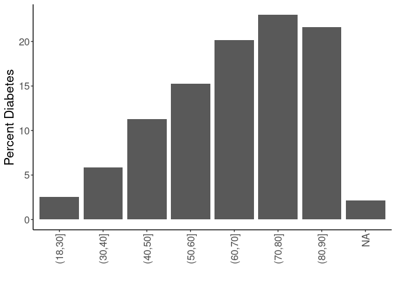
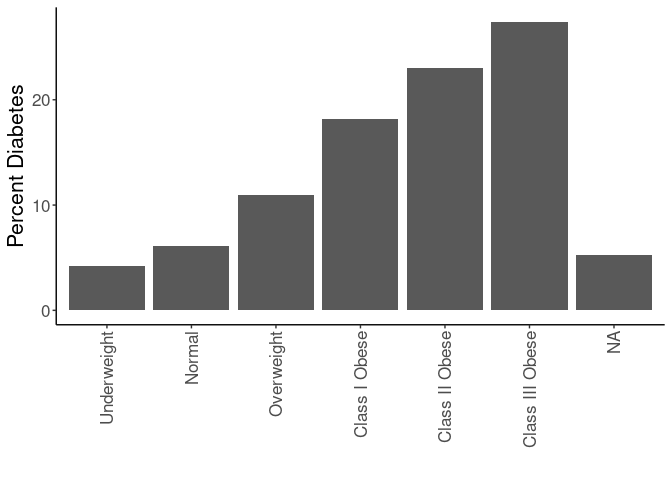

## Purpose

To define covariates for stress-obesity relationships, referring to associations with the outcome (diabetes risk).


```r
library(knitr)
#figures made will go to directory called figures, will make them as both png and pdf files 
opts_chunk$set(fig.path='figures/',
               echo=TRUE, warning=FALSE, message=FALSE,dev=c('png','pdf'))
options(scipen = 2, digits = 3)

library(readr)
library(dplyr)
```

```
## 
## Attaching package: 'dplyr'
```

```
## The following objects are masked from 'package:stats':
## 
##     filter, lag
```

```
## The following objects are masked from 'package:base':
## 
##     intersect, setdiff, setequal, union
```

```r
library(tidyr)
library(ggplot2)

input.file <- 'data-combined.csv'
combined.data <- read_csv(input.file) %>% #set reference values for each group
  mutate(Race.Ethnicity = relevel(as.factor(Race.Ethnicity),ref="White")) %>%
  mutate(Gender = relevel(as.factor(Gender),ref="F")) %>%
  mutate(BMI_cat = factor(as.factor(BMI_cat),levels=c("Underweight","Normal","Overweight","Class I Obese","Class II Obese","Class III Obese")))%>%
  filter(!(is.na(HypertensionAny))) %>%
  filter(!(is.na(Stress))) %>%
  filter(Stress!="NA")
```

```
## Rows: 62010 Columns: 38
```

```
## ── Column specification ────────────────────────────────────────────────────────
## Delimiter: ","
## chr (17): DeID_PatientID, Gender, DeID_EncounterID, BMI_cat, BMI_cat.obese, ...
## dbl (21): age, Stress_d1, CardiacArrhythmias, ChronicPulmonaryDisease, Conge...
## 
## ℹ Use `spec()` to retrieve the full column specification for this data.
## ℹ Specify the column types or set `show_col_types = FALSE` to quiet this message.
```

Loaded in the cleaned data from data-combined.csv. This script can be found in /nfs/turbo/precision-health/DataDirect/HUM00219435 - Obesity as a modifier of chronic psy/2023-03-14/2150 - Obesity and Stress - Cohort - DeID - 2023-03-14 and was most recently run on Sat Mar 25 17:24:03 2023. This dataset has 39694 values.

Performed univariate analyses on the categorical associations with diabetes incidence. Treated both age and BMI as both linear and categorical variables.

## By Race and Ethnicity


```r
combined.data %>%
  filter(!(is.na(Stress))) %>%
  filter(!(is.na(BMI_cat.Ob.NonOb))) %>%
  group_by(Race.Ethnicity,DiabetesAny) %>%
  count %>%
  pivot_wider(id_cols=Race.Ethnicity,
              names_from=DiabetesAny,
              values_from = n,
              names_prefix='Diabetes') %>%
  rename("Yes"="Diabetes1",
         "No"="Diabetes0")%>%
  mutate(Prevalence=Yes/(Yes+No)*100) -> diabetes.race

diabetes.race %>%
  ggplot(aes(y=Prevalence,x=Race.Ethnicity)) +
  geom_bar(stat='identity',position='dodge') +
  labs(y="Percent Diabetes",
       x="") +
  theme_classic() +
  scale_fill_grey() +
  theme(text=element_text(size=16),
        axis.text.x=element_text(angle=90,vjust=0.5,hjust=1),
        legend.position = c(0.1,0.85))
```

<!-- -->

```r
diabetes.race %>%
  knitr::kable(caption="Number of participants by diabetes diagnosis and race/ethnicity",
               digits =c(0,2,3,2,99))
```


Table: Number of participants by diabetes diagnosis and race/ethnicity

|Race.Ethnicity  |    No|  Yes| Prevalence|
|:---------------|-----:|----:|----------:|
|White           | 30443| 4878|       13.8|
|Asian           |   517|   63|       10.9|
|Black           |  1382|  357|       20.5|
|Hispanic/Latino |   669|  109|       14.0|
|Other           |  1093|  183|       14.3|


```r
library(broom)
glm(DiabetesAny~Race.Ethnicity, 
    family="binomial",
    data=combined.data) -> race.glm

race.glm %>% 
  anova(test="Chisq") %>% 
  tidy %>% 
  kable(caption="Binomial regression of ethicity on diabetes incidence",
        digits =c(0,0,0,0,0,99))
```


Table: Binomial regression of ethicity on diabetes incidence

|term           | df| Deviance| Resid..Df| Resid..Dev| p.value|
|:--------------|--:|--------:|---------:|----------:|-------:|
|NULL           | NA|       NA|     39693|      32268|      NA|
|Race.Ethnicity |  4|       61|     39689|      32207| 1.7e-12|

```r
race.glm %>% 
  tidy %>% 
  kable(caption="Binomial regression estimates of ethicity on diabetes incidence", 
        digits =c(0,2,3,2,99))
```


Table: Binomial regression estimates of ethicity on diabetes incidence

|term                          | estimate| std.error| statistic|  p.value|
|:-----------------------------|--------:|---------:|---------:|--------:|
|(Intercept)                   |    -1.83|     0.015|   -118.73| 0.00e+00|
|Race.EthnicityAsian           |    -0.27|     0.134|     -2.04| 4.15e-02|
|Race.EthnicityBlack           |     0.48|     0.061|      7.79| 6.94e-15|
|Race.EthnicityHispanic/Latino |     0.02|     0.104|      0.16| 8.73e-01|
|Race.EthnicityOther           |     0.04|     0.081|      0.54| 5.89e-01|

## By Gender


```r
combined.data %>%
  filter(!(is.na(Stress))) %>%
  filter(!(is.na(BMI_cat.Ob.NonOb))) %>%
  group_by(Gender,DiabetesAny) %>%
  count %>%
  pivot_wider(id_cols=Gender,
              names_from=DiabetesAny,
              values_from = n,
              names_prefix='Diabetes') %>%
  rename("Yes"="Diabetes1",
         "No"="Diabetes0") %>%
  mutate(Prevalence=Yes/(Yes+No)*100) -> 
  diabetes.gender

diabetes.gender %>%
  ggplot(aes(y=Prevalence,x=Gender)) +
  geom_bar(stat='identity',position='dodge') +
  labs(y="Percent Diabetes",
       x="") +
  theme_classic() +
  scale_fill_grey() +
  theme(text=element_text(size=16),
        axis.text.x=element_text(angle=90,vjust=0.5,hjust=1),
        legend.position = c(0.1,0.85))
```

<!-- -->

```r
diabetes.gender %>% 
  knitr::kable(caption="Number of participants by diabetes diagnosis and gender",
               digits =c(0,2,3,2,99))
```


Table: Number of participants by diabetes diagnosis and gender

|Gender |    No|  Yes| Prevalence|
|:------|-----:|----:|----------:|
|F      | 18369| 2497|       12.0|
|M      | 15735| 3093|       16.4|

## Interaction Between Gender and BMI

Modelling shows a significant interaction between BMI and gender with respect to diabetes risk


```r
combined.data %>%
  filter(!(is.na(Stress))) %>%
  filter(!(is.na(BMI_cat.Ob.NonOb))) %>%
  group_by(Gender,DiabetesAny,BMI_cat.Ob.NonOb) %>%
  count %>%
  pivot_wider(id_cols=c(Gender,BMI_cat.Ob.NonOb),
              names_from=DiabetesAny,
              values_from = n,
              names_prefix='Diabetes') %>%
  rename("Yes"="Diabetes1",
         "No"="Diabetes0") %>%
  mutate(Prevalence=Yes/(Yes+No)*100) -> 
  diabetes.gender.bmi

glm(DiabetesAny~Gender+BMI_cat.Ob.NonOb+BMI_cat.Ob.NonOb:Gender, 
    family="binomial",
    data=combined.data) -> gender.bmi.glm

kable(diabetes.gender.bmi, caption="Prevalence of diabetes by obesity and gender")
```


Table: Prevalence of diabetes by obesity and gender

|Gender |BMI_cat.Ob.NonOb |    No|  Yes| Prevalence|
|:------|:----------------|-----:|----:|----------:|
|F      |Non-Obese        | 11139|  779|       6.54|
|F      |Obese            |  7230| 1718|      19.20|
|M      |Non-Obese        |  9812| 1245|      11.26|
|M      |Obese            |  5923| 1848|      23.78|

```r
gender.bmi.glm %>% 
  anova(test="Chisq") %>% 
  tidy %>% 
  kable(caption="Binomial regression of gender:BMI interaction on diabetes incidence",
        digits =c(0,0,0,0,0,99))
```


Table: Binomial regression of gender:BMI interaction on diabetes incidence

|term                    | df| Deviance| Resid..Df| Resid..Dev|  p.value|
|:-----------------------|--:|--------:|---------:|----------:|--------:|
|NULL                    | NA|       NA|     39693|      32268|       NA|
|Gender                  |  1|      163|     39692|      32106| 3.03e-37|
|BMI_cat.Ob.NonOb        |  1|     1261|     39691|      30845| 0.00e+00|
|Gender:BMI_cat.Ob.NonOb |  1|       28|     39690|      30817| 9.96e-08|

```r
gender.bmi.glm %>% 
  tidy %>% 
  kable(caption="Binomial regression estimates of gender:BMI on diabetes incidence", 
        digits =c(0,2,3,2,99))
```


Table: Binomial regression estimates of gender:BMI on diabetes incidence

|term                          | estimate| std.error| statistic| p.value|
|:-----------------------------|--------:|---------:|---------:|-------:|
|(Intercept)                   |    -2.66|     0.037|    -71.78| 0.0e+00|
|GenderM                       |     0.60|     0.048|     12.48| 9.6e-36|
|BMI_cat.Ob.NonObObese         |     1.22|     0.046|     26.73| 0.0e+00|
|GenderM:BMI_cat.Ob.NonObObese |    -0.32|     0.061|     -5.31| 1.1e-07|


```r
diabetes.gender.bmi %>%
  ggplot(aes(y=Prevalence,x=Gender,fill=BMI_cat.Ob.NonOb)) +
  geom_bar(stat='identity',position='dodge') +
  labs(y="Percent Diabetes",
       x="") +
  theme_classic() +
  scale_fill_grey() +
  theme(text=element_text(size=16),
        axis.text.x=element_text(angle=90,vjust=0.5,hjust=1),
        legend.position = c(0.1,0.85))
```

<!-- -->


```r
library(broom)
glm(DiabetesAny~Gender, 
    family="binomial",
    data=combined.data) -> gender.glm

gender.glm %>% 
  anova(test="Chisq") %>% 
  tidy %>% 
  kable(caption="Binomial regression of gender on diabetes incidence",
        digits =c(0,0,0,0,0,99))
```


Table: Binomial regression of gender on diabetes incidence

|term   | df| Deviance| Resid..Df| Resid..Dev|  p.value|
|:------|--:|--------:|---------:|----------:|--------:|
|NULL   | NA|       NA|     39693|      32268|       NA|
|Gender |  1|      163|     39692|      32106| 3.03e-37|

```r
gender.glm %>% 
  tidy %>% 
  kable(caption="Binomial regression estimates of gender on diabetes incidence", 
        digits =c(0,2,3,2,99))
```


Table: Binomial regression estimates of gender on diabetes incidence

|term        | estimate| std.error| statistic|  p.value|
|:-----------|--------:|---------:|---------:|--------:|
|(Intercept) |    -2.00|     0.021|     -93.6| 0.00e+00|
|GenderM     |     0.37|     0.029|      12.7| 5.05e-37|

## By Age


```r
combined.data %>%
  filter(!(is.na(Stress))) %>%
  filter(!(is.na(BMI_cat.Ob.NonOb))) %>%
  group_by(Age.group,DiabetesAny) %>%
  count %>%
  pivot_wider(id_cols=Age.group,
              names_from=DiabetesAny,
              values_from = n,
              names_prefix='Diabetes') %>%
  rename("Yes"="Diabetes1",
         "No"="Diabetes0")%>%
  mutate(Prevalence=Yes/(Yes+No)*100) -> diabetes.age


diabetes.age %>%
  ggplot(aes(y=Prevalence,x=Age.group)) +
  geom_bar(stat='identity',position='dodge') +
  labs(y="Percent Diabetes",
       x="") +
  theme_classic() +
  scale_fill_grey() +
  theme(text=element_text(size=16),
        axis.text.x=element_text(angle=90,vjust=0.5,hjust=1),
        legend.position = c(0.1,0.85))  
```

<!-- -->

```r
diabetes.age %>%
  knitr::kable(caption="Number of participants by diabetes diagnosis and age")
```


Table: Number of participants by diabetes diagnosis and age

|Age.group |   No|  Yes| Prevalence|
|:---------|----:|----:|----------:|
|(18,30]   | 4380|  115|       2.56|
|(30,40]   | 4548|  284|       5.88|
|(40,50]   | 5611|  714|      11.29|
|(50,60]   | 7555| 1362|      15.27|
|(60,70]   | 7325| 1847|      20.14|
|(70,80]   | 3423| 1024|      23.03|
|(80,90]   |  852|  235|      21.62|
|NA        |  410|    9|       2.15|


```r
glm(DiabetesAny~Age.group, 
    family="binomial",
    data=combined.data) -> age.glm

age.glm %>% 
  anova(test="Chisq") %>% 
  tidy %>% 
  kable(caption="Binomial regression of age group on diabetes incidence",
        digits =c(0,0,0,0,0,99))
```


Table: Binomial regression of age group on diabetes incidence

|term      | df| Deviance| Resid..Df| Resid..Dev| p.value|
|:---------|--:|--------:|---------:|----------:|-------:|
|NULL      | NA|       NA|     39274|      32108|      NA|
|Age.group |  6|     1647|     39268|      30461|       0|

```r
age.glm %>% 
  tidy %>% 
  kable(caption="Binomial regression estimates of age group on diabetes incidence", 
        digits =c(0,2,3,2,99))
```


Table: Binomial regression estimates of age group on diabetes incidence

|term             | estimate| std.error| statistic|  p.value|
|:----------------|--------:|---------:|---------:|--------:|
|(Intercept)      |    -3.64|     0.094|     -38.5| 0.00e+00|
|Age.group(30,40] |     0.87|     0.113|       7.7| 1.37e-14|
|Age.group(40,50] |     1.58|     0.102|      15.4| 1.63e-53|
|Age.group(50,60] |     1.93|     0.099|      19.5| 1.92e-84|
|Age.group(60,70] |     2.26|     0.098|      23.1| 0.00e+00|
|Age.group(70,80] |     2.43|     0.101|      24.1| 0.00e+00|
|Age.group(80,90] |     2.35|     0.120|      19.6| 8.39e-86|

```r
glm(DiabetesAny~age, data=combined.data) %>% 
  tidy %>%
  kable(caption="Binomial regression estimates of age (continuous) on diabetes incidence", 
        digits =c(0,2,3,2,99))
```


Table: Binomial regression estimates of age (continuous) on diabetes incidence

|term        | estimate| std.error| statistic|  p.value|
|:-----------|--------:|---------:|---------:|--------:|
|(Intercept) |    -0.07|     0.006|     -12.6| 2.29e-36|
|age         |     0.00|     0.000|      38.9| 0.00e+00|

## By Neighborhood Disadvantage


```r
combined.data %>%
  filter(!(is.na(Stress))) %>%
  filter(!(is.na(BMI_cat.Ob.NonOb))) %>%
  group_by(disadvantage13_17_qrtl,DiabetesAny) %>%
  count %>%
  pivot_wider(id_cols=disadvantage13_17_qrtl,
              names_from=DiabetesAny,
              values_from = n,
              names_prefix='Diabetes') %>%
  rename("Yes"="Diabetes1",
         "No"="Diabetes0")%>%
  mutate(Prevalence=Yes/(Yes+No)*100) -> diabetes.disadvantage


diabetes.disadvantage %>%
  ggplot(aes(y=Prevalence,x=disadvantage13_17_qrtl)) +
  geom_bar(stat='identity',position='dodge') +
  labs(y="Percent Diabetes",
       x="") +
  theme_classic() +
  scale_fill_grey() +
  theme(text=element_text(size=16),
        axis.text.x=element_text(angle=90,vjust=0.5,hjust=1),
        legend.position = c(0.1,0.85))  
```

<!-- -->

```r
diabetes.disadvantage %>%
  knitr::kable(caption="Number of participants by diabetes neighborhood disadvantage")
```


Table: Number of participants by diabetes neighborhood disadvantage

| disadvantage13_17_qrtl|    No|  Yes| Prevalence|
|----------------------:|-----:|----:|----------:|
|                      1| 12311| 1686|       12.0|
|                      2|  8975| 1571|       14.9|
|                      3|  6447| 1189|       15.6|
|                      4|  3605|  736|       17.0|
|                     NA|  2766|  408|       12.9|


```r
glm(DiabetesAny~disadvantage13_17_qrtl, 
    family="binomial",
    data=combined.data) -> disadvantage.glm

disadvantage.glm %>% 
  anova(test="Chisq") %>% 
  tidy %>% 
  kable(caption="Binomial regression of neighborhood disadvantage group on diabetes incidence",
        digits =c(0,0,0,0,0,99))
```


Table: Binomial regression of neighborhood disadvantage group on diabetes incidence

|term                   | df| Deviance| Resid..Df| Resid..Dev|  p.value|
|:----------------------|--:|--------:|---------:|----------:|--------:|
|NULL                   | NA|       NA|     36519|      29829|       NA|
|disadvantage13_17_qrtl |  1|       87|     36518|      29742| 1.22e-20|

```r
disadvantage.glm %>% 
  tidy %>% 
  kable(caption="Binomial regression estimates of neighborhood disadvantage group on diabetes incidence", 
        digits =c(0,2,3,2,99))
```


Table: Binomial regression estimates of neighborhood disadvantage group on diabetes incidence

|term                   | estimate| std.error| statistic|  p.value|
|:----------------------|--------:|---------:|---------:|--------:|
|(Intercept)            |    -2.08|     0.034|    -60.66| 0.00e+00|
|disadvantage13_17_qrtl |     0.13|     0.014|      9.37| 7.26e-21|

## By Body Mass Index


```r
combined.data %>%
  filter(!(is.na(Stress))) %>%
  filter(!(is.na(BMI_cat.Ob.NonOb))) %>%
  group_by(BMI_cat,DiabetesAny) %>%
  count %>%
  pivot_wider(id_cols=BMI_cat,
              names_from=DiabetesAny,
              values_from = n,
              names_prefix='Diabetes') %>%
  rename("Yes"="Diabetes1",
         "No"="Diabetes0") %>%
  mutate(Prevalence=Yes/(Yes+No)*100) -> diabetes.bmi

diabetes.bmi %>%
  ggplot(aes(y=Prevalence,x=BMI_cat)) +
  geom_bar(stat='identity',position='dodge') +
  labs(y="Percent Diabetes",
       x="") +
  theme_classic() +
  scale_fill_grey() +
  theme(text=element_text(size=16),
        axis.text.x=element_text(angle=90,vjust=0.5,hjust=1),
        legend.position = c(0.1,0.85))  
```

<!-- -->

```r
diabetes.bmi %>%
  knitr::kable(caption="Number of participants by diabetes diagnosis and BMI category")
```


Table: Number of participants by diabetes diagnosis and BMI category

|BMI_cat         |    No|  Yes| Prevalence|
|:---------------|-----:|----:|----------:|
|Underweight     |   271|   12|       4.24|
|Normal          |  9054|  594|       6.16|
|Overweight      | 11499| 1411|      10.93|
|Class I Obese   |  7260| 1610|      18.15|
|Class II Obese  |  3441| 1030|      23.04|
|Class III Obese |  2452|  926|      27.41|
|NA              |   127|    7|       5.22|


```r
glm(DiabetesAny~BMI_cat, 
    family="binomial",
    data=combined.data) -> bmi.glm

bmi.glm %>% 
  anova(test="Chisq") %>% 
  tidy %>% 
  kable(caption="Binomial regression of BMI group on diabetes incidence",
        digits =c(0,0,0,0,0,99))
```


Table: Binomial regression of BMI group on diabetes incidence

|term    | df| Deviance| Resid..Df| Resid..Dev| p.value|
|:-------|--:|--------:|---------:|----------:|-------:|
|NULL    | NA|       NA|     39559|      32202|      NA|
|BMI_cat |  5|     1534|     39554|      30668|       0|

```r
bmi.glm %>% 
  tidy %>% 
  kable(caption="Binomial regression estimates of BMI group on diabetes incidence", 
        digits =c(0,2,3,2,99))
```


Table: Binomial regression estimates of BMI group on diabetes incidence

|term                   | estimate| std.error| statistic|  p.value|
|:----------------------|--------:|---------:|---------:|--------:|
|(Intercept)            |    -3.12|     0.295|    -10.57| 4.16e-26|
|BMI_catNormal          |     0.39|     0.298|      1.32| 1.87e-01|
|BMI_catOverweight      |     1.02|     0.296|      3.44| 5.82e-04|
|BMI_catClass I Obese   |     1.61|     0.296|      5.44| 5.37e-08|
|BMI_catClass II Obese  |     1.91|     0.297|      6.43| 1.25e-10|
|BMI_catClass III Obese |     2.14|     0.297|      7.21| 5.77e-13|

```r
glm(DiabetesAny~BMI, data=combined.data) %>% 
  tidy %>%
  kable(caption="Binomial regression estimates of BMI on diabetes incidence",
        digits =c(0,2,3,2,99))
```


Table: Binomial regression estimates of BMI on diabetes incidence

|term        | estimate| std.error| statistic|  p.value|
|:-----------|--------:|---------:|---------:|--------:|
|(Intercept) |    -0.15|     0.007|     -19.8| 5.46e-87|
|BMI         |     0.01|     0.000|      39.7| 0.00e+00|

# Summary Table


```r
rbind(diabetes.race %>% rename("Group"="Race.Ethnicity"),
      diabetes.gender %>% rename("Group"="Gender"),
      diabetes.bmi %>% rename("Group"="BMI_cat"),
      diabetes.disadvantage %>% rename("Group"="disadvantage13_17_qrtl") %>%
        mutate(Group=as.factor(Group)),
      diabetes.age %>% rename("Group"="Age.group")) %>%
  mutate(Total=No+Yes) %>%
  select(Group,Total,No,Yes,Prevalence)-> summary.table

kable(summary.table, caption="Summary of demographic variables by diabetes incidence")
```


Table: Summary of demographic variables by diabetes incidence

|Group           | Total|    No|  Yes| Prevalence|
|:---------------|-----:|-----:|----:|----------:|
|White           | 35321| 30443| 4878|      13.81|
|Asian           |   580|   517|   63|      10.86|
|Black           |  1739|  1382|  357|      20.53|
|Hispanic/Latino |   778|   669|  109|      14.01|
|Other           |  1276|  1093|  183|      14.34|
|F               | 20866| 18369| 2497|      11.97|
|M               | 18828| 15735| 3093|      16.43|
|Underweight     |   283|   271|   12|       4.24|
|Normal          |  9648|  9054|  594|       6.16|
|Overweight      | 12910| 11499| 1411|      10.93|
|Class I Obese   |  8870|  7260| 1610|      18.15|
|Class II Obese  |  4471|  3441| 1030|      23.04|
|Class III Obese |  3378|  2452|  926|      27.41|
|NA              |   134|   127|    7|       5.22|
|1               | 13997| 12311| 1686|      12.04|
|2               | 10546|  8975| 1571|      14.90|
|3               |  7636|  6447| 1189|      15.57|
|4               |  4341|  3605|  736|      16.95|
|NA              |  3174|  2766|  408|      12.85|
|(18,30]         |  4495|  4380|  115|       2.56|
|(30,40]         |  4832|  4548|  284|       5.88|
|(40,50]         |  6325|  5611|  714|      11.29|
|(50,60]         |  8917|  7555| 1362|      15.27|
|(60,70]         |  9172|  7325| 1847|      20.14|
|(70,80]         |  4447|  3423| 1024|      23.03|
|(80,90]         |  1087|   852|  235|      21.62|
|NA              |   419|   410|    9|       2.15|

```r
write_csv(summary.table, "Diabetes Demographics Table.csv")
```

# Session Information


```r
sessionInfo()
```

```
## R version 4.2.0 (2022-04-22)
## Platform: x86_64-pc-linux-gnu (64-bit)
## Running under: Red Hat Enterprise Linux 8.4 (Ootpa)
## 
## Matrix products: default
## BLAS:   /sw/pkgs/arc/stacks/gcc/10.3.0/R/4.2.0/lib64/R/lib/libRblas.so
## LAPACK: /sw/pkgs/arc/stacks/gcc/10.3.0/R/4.2.0/lib64/R/lib/libRlapack.so
## 
## locale:
##  [1] LC_CTYPE=en_US.UTF-8       LC_NUMERIC=C              
##  [3] LC_TIME=en_US.UTF-8        LC_COLLATE=en_US.UTF-8    
##  [5] LC_MONETARY=en_US.UTF-8    LC_MESSAGES=en_US.UTF-8   
##  [7] LC_PAPER=en_US.UTF-8       LC_NAME=C                 
##  [9] LC_ADDRESS=C               LC_TELEPHONE=C            
## [11] LC_MEASUREMENT=en_US.UTF-8 LC_IDENTIFICATION=C       
## 
## attached base packages:
## [1] stats     graphics  grDevices utils     datasets  methods   base     
## 
## other attached packages:
## [1] broom_1.0.1   ggplot2_3.4.0 tidyr_1.2.1   dplyr_1.0.10  readr_2.1.3  
## [6] knitr_1.41   
## 
## loaded via a namespace (and not attached):
##  [1] highr_0.9        pillar_1.8.1     bslib_0.4.1      compiler_4.2.0  
##  [5] jquerylib_0.1.4  tools_4.2.0      bit_4.0.5        digest_0.6.30   
##  [9] gtable_0.3.1     jsonlite_1.8.4   evaluate_0.18    lifecycle_1.0.3 
## [13] tibble_3.1.8     pkgconfig_2.0.3  rlang_1.0.6      cli_3.4.1       
## [17] DBI_1.1.3        parallel_4.2.0   yaml_2.3.6       xfun_0.35       
## [21] fastmap_1.1.0    withr_2.5.0      stringr_1.5.0    generics_0.1.3  
## [25] vctrs_0.5.1      sass_0.4.4       hms_1.1.2        bit64_4.0.5     
## [29] grid_4.2.0       tidyselect_1.2.0 glue_1.6.2       R6_2.5.1        
## [33] fansi_1.0.3      vroom_1.6.0      rmarkdown_2.18   farver_2.1.1    
## [37] tzdb_0.3.0       purrr_0.3.5      magrittr_2.0.3   backports_1.4.1 
## [41] scales_1.2.1     ellipsis_0.3.2   htmltools_0.5.4  assertthat_0.2.1
## [45] colorspace_2.0-3 labeling_0.4.2   utf8_1.2.2       stringi_1.7.8   
## [49] munsell_0.5.0    cachem_1.0.6     crayon_1.5.2
```
