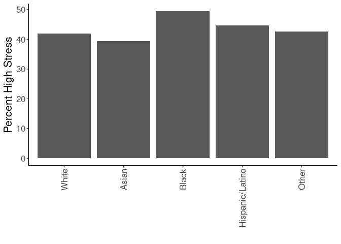
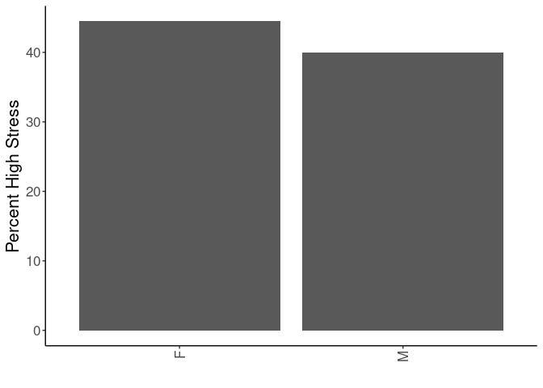
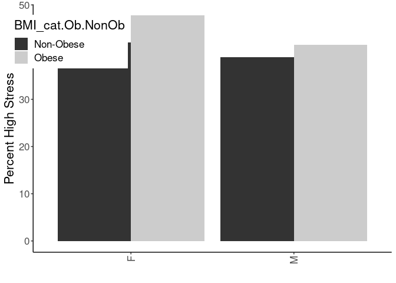
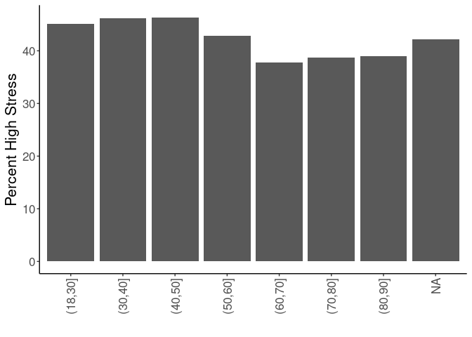
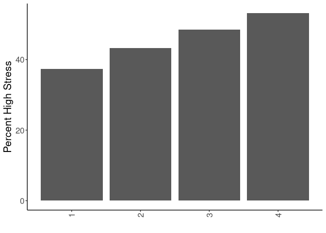
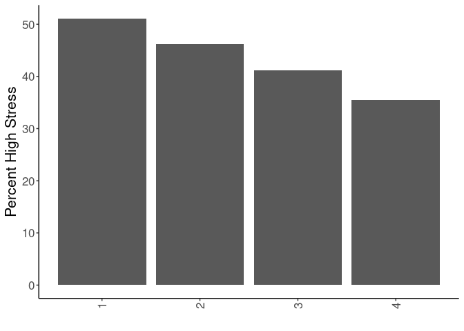
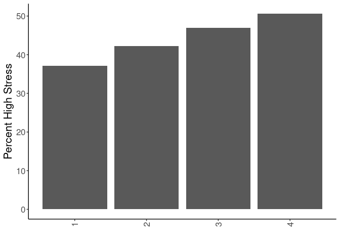
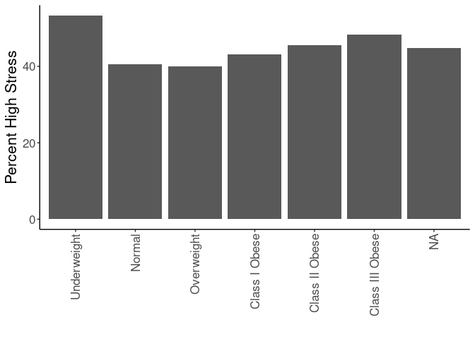

## Purpose

To define covariates for stress-obesity relationships, referring to associations with the exposure (stress).


```r
library(knitr)
#figures made will go to directory called figures, will make them as both png and pdf files 
opts_chunk$set(fig.path='figures/',
               echo=TRUE, warning=FALSE, message=FALSE,dev=c('png','pdf'))
options(scipen = 2, digits = 3)

library(readr)
library(dplyr)
```

```
## 
## Attaching package: 'dplyr'
```

```
## The following objects are masked from 'package:stats':
## 
##     filter, lag
```

```
## The following objects are masked from 'package:base':
## 
##     intersect, setdiff, setequal, union
```

```r
library(tidyr)
library(ggplot2)

input.file <- 'data-combined.csv'
combined.data <- read_csv(input.file) %>% #set reference values for each group
  mutate(Race.Ethnicity = relevel(as.factor(Race.Ethnicity),ref="White")) %>%
  mutate(Gender = relevel(as.factor(Gender),ref="F")) %>%
  mutate(BMI_cat = factor(as.factor(BMI_cat),levels=c("Underweight","Normal","Overweight","Class I Obese","Class II Obese","Class III Obese")))%>%
  filter(!(is.na(HypertensionAny))) %>%
  filter(!(is.na(Stress))) %>%
  filter(Stress!="NA") %>%
  mutate(Stress=case_when(Stress=="High"~1,
                          Stress=="Low"~0))
```

```
## Rows: 62010 Columns: 39
```

```
## ── Column specification ────────────────────────────────────────────────────────
## Delimiter: ","
## chr (17): DeID_PatientID, Gender, DeID_EncounterID, BMI_cat, BMI_cat.obese, ...
## dbl (22): age, Stress_d1, CardiacArrhythmias, ChronicPulmonaryDisease, Conge...
## 
## ℹ Use `spec()` to retrieve the full column specification for this data.
## ℹ Specify the column types or set `show_col_types = FALSE` to quiet this message.
```

Loaded in the cleaned data from data-combined.csv. This script can be found in /nfs/turbo/precision-health/DataDirect/HUM00219435 - Obesity as a modifier of chronic psy/2023-03-14/2150 - Obesity and Stress - Cohort - DeID - 2023-03-14 and was most recently run on Tue Sep 26 17:08:01 2023. This dataset has 39694 values.

Performed univariate analyses on the categorical associations with stress incidence. Treated both age and BMI as both linear and categorical variables.

## By Race and Ethnicity


```r
combined.data %>%
  filter(!(is.na(Stress))) %>%
  filter(!(is.na(BMI_cat.Ob.NonOb))) %>%
  group_by(Race.Ethnicity,Stress) %>%
  count %>%
  pivot_wider(id_cols=Race.Ethnicity,
              names_from=Stress,
              values_from = n,
              names_prefix='Stress') %>% 
  rename("Yes"="Stress1",
         "No"="Stress0")%>%
  mutate(Prevalence=Yes/(Yes+No)*100) -> stress.race

stress.race %>%
  ggplot(aes(y=Prevalence,x=Race.Ethnicity)) +
  geom_bar(stat='identity',position='dodge') +
  labs(y="Percent High Stress",
       x="") +
  theme_classic() +
  scale_fill_grey() +
  theme(text=element_text(size=16),
        axis.text.x=element_text(angle=90,vjust=0.5,hjust=1),
        legend.position = c(0.1,0.85))
```

<!-- -->

```r
stress.race %>%
  knitr::kable(caption="Number of participants by stress and race/ethnicity",
               digits =c(0,2,3,2,99))
```


Table: Number of participants by stress and race/ethnicity

|Race.Ethnicity  |    No|   Yes| Prevalence|
|:---------------|-----:|-----:|----------:|
|White           | 20500| 14821|       42.0|
|Asian           |   352|   228|       39.3|
|Black           |   878|   861|       49.5|
|Hispanic/Latino |   430|   348|       44.7|
|Other           |   733|   543|       42.5|


```r
library(broom)
glm(Stress~Race.Ethnicity, 
    family="binomial",
    data=combined.data) -> race.glm

race.glm %>% 
  anova(test="Chisq") %>% 
  tidy %>% 
  kable(caption="Binomial regression of ethicity on stress",
        digits =c(0,0,0,0,0,99))
```


Table: Binomial regression of ethicity on stress

|term           | df| deviance| df.residual| residual.deviance|  p.value|
|:--------------|--:|--------:|-----------:|-----------------:|--------:|
|NULL           | NA|       NA|       39693|             54089|       NA|
|Race.Ethnicity |  4|       42|       39689|             54047| 1.43e-08|

```r
race.glm %>% 
  tidy %>% 
  kable(caption="Binomial regression estimates of ethicity on stress incidence", 
        digits =c(0,2,3,2,99))
```


Table: Binomial regression estimates of ethicity on stress incidence

|term                          | estimate| std.error| statistic|  p.value|
|:-----------------------------|--------:|---------:|---------:|--------:|
|(Intercept)                   |    -0.32|     0.011|    -30.09| 0.00e+00|
|Race.EthnicityAsian           |    -0.11|     0.086|     -1.28| 2.00e-01|
|Race.EthnicityBlack           |     0.30|     0.049|      6.20| 5.62e-10|
|Race.EthnicityHispanic/Latino |     0.11|     0.073|      1.55| 1.22e-01|
|Race.EthnicityOther           |     0.02|     0.058|      0.42| 6.73e-01|

## By Gender


```r
combined.data %>%
  filter(!(is.na(Stress))) %>%
  filter(!(is.na(BMI_cat.Ob.NonOb))) %>%
  group_by(Gender,Stress) %>%
  count %>%
  pivot_wider(id_cols=Gender,
              names_from=Stress,
              values_from = n,
              names_prefix='Diabetes') %>%
  rename("Yes"="Diabetes1",
         "No"="Diabetes0") %>%
  mutate(Prevalence=Yes/(Yes+No)*100) -> 
  stress.gender

stress.gender %>%
  ggplot(aes(y=Prevalence,x=Gender)) +
  geom_bar(stat='identity',position='dodge') +
  labs(y="Percent High Stress",
       x="") +
  theme_classic() +
  scale_fill_grey() +
  theme(text=element_text(size=16),
        axis.text.x=element_text(angle=90,vjust=0.5,hjust=1),
        legend.position = c(0.1,0.85))
```

<!-- -->

```r
stress.gender %>% 
  knitr::kable(caption="Number of participants by stress and gender",
               digits =c(0,2,3,2,99))
```


Table: Number of participants by stress and gender

|Gender |    No|  Yes| Prevalence|
|:------|-----:|----:|----------:|
|F      | 11589| 9277|       44.5|
|M      | 11304| 7524|       40.0|

## Interaction Between Gender and BMI

Modelling shows a significant interaction between BMI and gender with respect to stress risk


```r
combined.data %>%
  filter(!(is.na(Stress))) %>%
  filter(!(is.na(BMI_cat.Ob.NonOb))) %>%
  group_by(Gender,Stress,BMI_cat.Ob.NonOb) %>%
  count %>%
  pivot_wider(id_cols=c(Gender,BMI_cat.Ob.NonOb),
              names_from=Stress,
              values_from = n,
              names_prefix='Diabetes') %>%
  rename("Yes"="Diabetes1",
         "No"="Diabetes0") %>%
  mutate(Prevalence=Yes/(Yes+No)*100) -> 
  stress.gender.bmi

glm(Stress~Gender+BMI_cat.Ob.NonOb+BMI_cat.Ob.NonOb:Gender, 
    family="binomial",
    data=combined.data) -> gender.bmi.glm

kable(stress.gender.bmi, caption="Prevalence of stress by obesity and gender")
```


Table: Prevalence of stress by obesity and gender

|Gender |BMI_cat.Ob.NonOb |   No|  Yes| Prevalence|
|:------|:----------------|----:|----:|----------:|
|F      |Non-Obese        | 6913| 5005|       42.0|
|F      |Obese            | 4676| 4272|       47.7|
|M      |Non-Obese        | 6757| 4300|       38.9|
|M      |Obese            | 4547| 3224|       41.5|

```r
gender.bmi.glm %>% 
  anova(test="Chisq") %>% 
  tidy %>% 
  kable(caption="Binomial regression of gender:BMI interaction on stress incidence",
        digits =c(0,0,0,0,0,99))
```


Table: Binomial regression of gender:BMI interaction on stress incidence

|term                    | df| deviance| df.residual| residual.deviance|  p.value|
|:-----------------------|--:|--------:|-----------:|-----------------:|--------:|
|NULL                    | NA|       NA|       39693|             54089|       NA|
|Gender                  |  1|       82|       39692|             54007| 1.29e-19|
|BMI_cat.Ob.NonOb        |  1|       72|       39691|             53935| 2.10e-17|
|Gender:BMI_cat.Ob.NonOb |  1|        9|       39690|             53926| 2.55e-03|

```r
gender.bmi.glm %>% 
  tidy %>% 
  kable(caption="Binomial regression estimates of gender:BMI on stress incidence", 
        digits =c(0,2,3,2,99))
```


Table: Binomial regression estimates of gender:BMI on stress incidence

|term                          | estimate| std.error| statistic|  p.value|
|:-----------------------------|--------:|---------:|---------:|--------:|
|(Intercept)                   |    -0.32|     0.019|    -17.40| 8.01e-68|
|GenderM                       |    -0.13|     0.027|     -4.79| 1.66e-06|
|BMI_cat.Ob.NonObObese         |     0.23|     0.028|      8.26| 1.42e-16|
|GenderM:BMI_cat.Ob.NonObObese |    -0.12|     0.041|     -3.02| 2.56e-03|


```r
stress.gender.bmi %>%
  ggplot(aes(y=Prevalence,x=Gender,fill=BMI_cat.Ob.NonOb)) +
  geom_bar(stat='identity',position='dodge') +
  labs(y="Percent High Stress",
       x="") +
  theme_classic() +
  scale_fill_grey() +
  theme(text=element_text(size=16),
        axis.text.x=element_text(angle=90,vjust=0.5,hjust=1),
        legend.position = c(0.1,0.85))
```

<!-- -->


```r
library(broom)
glm(Stress~Gender, 
    family="binomial",
    data=combined.data) -> gender.glm

gender.glm %>% 
  anova(test="Chisq") %>% 
  tidy %>% 
  kable(caption="Binomial regression of gender on stress incidence",
        digits =c(0,0,0,0,0,99))
```


Table: Binomial regression of gender on stress incidence

|term   | df| deviance| df.residual| residual.deviance|  p.value|
|:------|--:|--------:|-----------:|-----------------:|--------:|
|NULL   | NA|       NA|       39693|             54089|       NA|
|Gender |  1|       82|       39692|             54007| 1.29e-19|

```r
gender.glm %>% 
  tidy %>% 
  kable(caption="Binomial regression estimates of gender on stress incidence", 
        digits =c(0,2,3,2,99))
```


Table: Binomial regression estimates of gender on stress incidence

|term        | estimate| std.error| statistic|  p.value|
|:-----------|--------:|---------:|---------:|--------:|
|(Intercept) |    -0.22|     0.014|    -15.97| 1.99e-57|
|GenderM     |    -0.18|     0.020|     -9.05| 1.38e-19|

## By Age


```r
combined.data %>%
  filter(!(is.na(Stress))) %>%
  filter(!(is.na(BMI_cat.Ob.NonOb))) %>%
  group_by(Age.group,Stress) %>%
  count %>%
  pivot_wider(id_cols=Age.group,
              names_from=Stress,
              values_from = n,
              names_prefix='Diabetes') %>%
  rename("Yes"="Diabetes1",
         "No"="Diabetes0")%>%
  mutate(Prevalence=Yes/(Yes+No)*100) -> stress.age


stress.age %>%
  ggplot(aes(y=Prevalence,x=Age.group)) +
  geom_bar(stat='identity',position='dodge') +
  labs(y="Percent High Stress",
       x="") +
  theme_classic() +
  scale_fill_grey() +
  theme(text=element_text(size=16),
        axis.text.x=element_text(angle=90,vjust=0.5,hjust=1),
        legend.position = c(0.1,0.85))  
```

<!-- -->

```r
stress.age %>%
  knitr::kable(caption="Number of participants by stress diagnosis and age")
```


Table: Number of participants by stress diagnosis and age

|Age.group |   No|  Yes| Prevalence|
|:---------|----:|----:|----------:|
|(18,30]   | 2469| 2026|       45.1|
|(30,40]   | 2603| 2229|       46.1|
|(40,50]   | 3393| 2932|       46.4|
|(50,60]   | 5096| 3821|       42.9|
|(60,70]   | 5701| 3471|       37.8|
|(70,80]   | 2726| 1721|       38.7|
|(80,90]   |  663|  424|       39.0|
|NA        |  242|  177|       42.2|


```r
glm(Stress~Age.group, 
    family="binomial",
    data=combined.data) -> age.glm

age.glm %>% 
  anova(test="Chisq") %>% 
  tidy %>% 
  kable(caption="Binomial regression of age group on stress incidence",
        digits =c(0,0,0,0,0,99))
```


Table: Binomial regression of age group on stress incidence

|term      | df| deviance| df.residual| residual.deviance|  p.value|
|:---------|--:|--------:|-----------:|-----------------:|--------:|
|NULL      | NA|       NA|       39274|             53518|       NA|
|Age.group |  6|      190|       39268|             53328| 2.03e-38|

```r
age.glm %>% 
  tidy %>% 
  kable(caption="Binomial regression estimates of age group on stress incidence", 
        digits =c(0,2,3,2,99))
```


Table: Binomial regression estimates of age group on stress incidence

|term             | estimate| std.error| statistic|  p.value|
|:----------------|--------:|---------:|---------:|--------:|
|(Intercept)      |    -0.20|     0.030|     -6.60| 4.20e-11|
|Age.group(30,40] |     0.04|     0.042|      1.02| 3.06e-01|
|Age.group(40,50] |     0.05|     0.039|      1.32| 1.87e-01|
|Age.group(50,60] |    -0.09|     0.037|     -2.45| 1.43e-02|
|Age.group(60,70] |    -0.30|     0.037|     -8.09| 6.14e-16|
|Age.group(70,80] |    -0.26|     0.043|     -6.10| 1.05e-09|
|Age.group(80,90] |    -0.25|     0.069|     -3.61| 3.05e-04|

```r
glm(Stress~age, data=combined.data) %>% 
  tidy %>%
  kable(caption="Binomial regression estimates of age (continuous) on stress incidence", 
        digits =c(0,2,3,2,99))
```


Table: Binomial regression estimates of age (continuous) on stress incidence

|term        | estimate| std.error| statistic|  p.value|
|:-----------|--------:|---------:|---------:|--------:|
|(Intercept) |     0.52|     0.008|      62.1| 0.00e+00|
|age         |     0.00|     0.000|     -11.6| 5.32e-31|

## By Neighborhood Disadvantage

### Neighborhood Education


```r
combined.data %>%
  filter(!(is.na(Stress))) %>%
  filter(!(is.na(BMI_cat.Ob.NonOb))) %>%
  group_by(ped1_13_17_qrtl,Stress) %>%
  count %>%
  pivot_wider(id_cols=ped1_13_17_qrtl,
              names_from=Stress,
              values_from = n,
              names_prefix='Diabetes') %>%
  rename("Yes"="Diabetes1",
         "No"="Diabetes0")%>%
  mutate(Prevalence=Yes/(Yes+No)*100) -> stress.disadvantage


stress.disadvantage %>%
  ggplot(aes(y=Prevalence,x=ped1_13_17_qrtl)) +
  geom_bar(stat='identity',position='dodge') +
  labs(y="Percent High Stress",
       x="") +
  theme_classic() +
  scale_fill_grey() +
  theme(text=element_text(size=16),
        axis.text.x=element_text(angle=90,vjust=0.5,hjust=1),
        legend.position = c(0.1,0.85))  
```

<!-- -->

```r
stress.disadvantage %>%
  knitr::kable(caption="Number of participants by stress neighborhood education")
```


Table: Number of participants by stress neighborhood education

| ped1_13_17_qrtl|   No|  Yes| Prevalence|
|---------------:|----:|----:|----------:|
|               1| 9708| 5803|       37.4|
|               2| 6792| 5190|       43.3|
|               3| 3924| 3690|       48.5|
|               4|  661|  752|       53.2|
|              NA| 1808| 1366|       43.0|


```r
glm(Stress~ped1_13_17_qrtl, 
    family="binomial",
    data=combined.data) -> disadvantage.glm

disadvantage.glm %>% 
  anova(test="Chisq") %>% 
  tidy %>% 
  kable(caption="Binomial regression of neighborhood education group on stress incidence",
        digits =c(0,0,0,0,0,99))
```


Table: Binomial regression of neighborhood education group on stress incidence

|term            | df| deviance| df.residual| residual.deviance|  p.value|
|:---------------|--:|--------:|-----------:|-----------------:|--------:|
|NULL            | NA|       NA|       36519|             49750|       NA|
|ped1_13_17_qrtl |  1|      343|       36518|             49407| 1.59e-76|

```r
disadvantage.glm %>% 
  tidy %>% 
  kable(caption="Binomial regression estimates of neighborhood education group on stress incidence", 
        digits =c(0,2,3,2,99))
```


Table: Binomial regression estimates of neighborhood education group on stress incidence

|term            | estimate| std.error| statistic|  p.value|
|:---------------|--------:|---------:|---------:|--------:|
|(Intercept)     |    -0.73|     0.025|     -29.0| 0.00e+00|
|ped1_13_17_qrtl |     0.22|     0.012|      18.5| 3.82e-76|

### Neighborhood Affluence


```r
combined.data %>%
  filter(!(is.na(Stress))) %>%
  filter(!(is.na(BMI_cat.Ob.NonOb))) %>%
  group_by(affluence13_17_qrtl,Stress) %>%
  count %>%
  pivot_wider(id_cols=affluence13_17_qrtl,
              names_from=Stress,
              values_from = n,
              names_prefix='Diabetes') %>%
  rename("Yes"="Diabetes1",
         "No"="Diabetes0")%>%
  mutate(Prevalence=Yes/(Yes+No)*100) -> stress.disadvantage


stress.disadvantage %>%
  ggplot(aes(y=Prevalence,x=affluence13_17_qrtl)) +
  geom_bar(stat='identity',position='dodge') +
  labs(y="Percent High Stress",
       x="") +
  theme_classic() +
  scale_fill_grey() +
  theme(text=element_text(size=16),
        axis.text.x=element_text(angle=90,vjust=0.5,hjust=1),
        legend.position = c(0.1,0.85))  
```

<!-- -->

```r
stress.disadvantage %>%
  knitr::kable(caption="Number of participants by stress neighborhood affluence")
```


Table: Number of participants by stress neighborhood affluence

| affluence13_17_qrtl|   No|  Yes| Prevalence|
|-------------------:|----:|----:|----------:|
|                   1| 3195| 3342|       51.1|
|                   2| 4634| 3968|       46.1|
|                   3| 5497| 3852|       41.2|
|                   4| 7759| 4273|       35.5|
|                  NA| 1808| 1366|       43.0|


```r
glm(Stress~affluence13_17_qrtl, 
    family="binomial",
    data=combined.data) -> disadvantage.glm

disadvantage.glm %>% 
  anova(test="Chisq") %>% 
  tidy %>% 
  kable(caption="Binomial regression of neighborhood affluence group on stress incidence",
        digits =c(0,0,0,0,0,99))
```


Table: Binomial regression of neighborhood affluence group on stress incidence

|term                | df| deviance| df.residual| residual.deviance| p.value|
|:-------------------|--:|--------:|-----------:|-----------------:|-------:|
|NULL                | NA|       NA|       36519|             49750|      NA|
|affluence13_17_qrtl |  1|      492|       36518|             49258|       0|

```r
disadvantage.glm %>% 
  tidy %>% 
  kable(caption="Binomial regression estimates of neighborhood affluence group on stress incidence", 
        digits =c(0,2,3,2,99))
```


Table: Binomial regression estimates of neighborhood affluence group on stress incidence

|term                | estimate| std.error| statistic|  p.value|
|:-------------------|--------:|---------:|---------:|--------:|
|(Intercept)         |     0.27|     0.028|      9.54| 1.42e-21|
|affluence13_17_qrtl |    -0.21|     0.010|    -22.08| 0.00e+00|

### Disadvantage


```r
combined.data %>%
  filter(!(is.na(Stress))) %>%
  filter(!(is.na(BMI_cat.Ob.NonOb))) %>%
  group_by(disadvantage13_17_qrtl,Stress) %>%
  count %>%
  pivot_wider(id_cols=disadvantage13_17_qrtl,
              names_from=Stress,
              values_from = n,
              names_prefix='Diabetes') %>%
  rename("Yes"="Diabetes1",
         "No"="Diabetes0")%>%
  mutate(Prevalence=Yes/(Yes+No)*100) -> stress.disadvantage


stress.disadvantage %>%
  ggplot(aes(y=Prevalence,x=disadvantage13_17_qrtl)) +
  geom_bar(stat='identity',position='dodge') +
  labs(y="Percent High Stress",
       x="") +
  theme_classic() +
  scale_fill_grey() +
  theme(text=element_text(size=16),
        axis.text.x=element_text(angle=90,vjust=0.5,hjust=1),
        legend.position = c(0.1,0.85))  
```

<!-- -->

```r
stress.disadvantage %>%
  knitr::kable(caption="Number of participants by stress neighborhood disadvantage")
```


Table: Number of participants by stress neighborhood disadvantage

| disadvantage13_17_qrtl|   No|  Yes| Prevalence|
|----------------------:|----:|----:|----------:|
|                      1| 8798| 5199|       37.1|
|                      2| 6090| 4456|       42.3|
|                      3| 4055| 3581|       46.9|
|                      4| 2142| 2199|       50.7|
|                     NA| 1808| 1366|       43.0|


```r
glm(Stress~disadvantage13_17_qrtl, 
    family="binomial",
    data=combined.data) -> disadvantage.glm

disadvantage.glm %>% 
  anova(test="Chisq") %>% 
  tidy %>% 
  kable(caption="Binomial regression of neighborhood disadvantage group on stress incidence",
        digits =c(0,0,0,0,0,99))
```


Table: Binomial regression of neighborhood disadvantage group on stress incidence

|term                   | df| deviance| df.residual| residual.deviance|  p.value|
|:----------------------|--:|--------:|-----------:|-----------------:|--------:|
|NULL                   | NA|       NA|       36519|             49750|       NA|
|disadvantage13_17_qrtl |  1|      341|       36518|             49409| 4.41e-76|

```r
disadvantage.glm %>% 
  tidy %>% 
  kable(caption="Binomial regression estimates of neighborhood disadvantage group on stress incidence", 
        digits =c(0,2,3,2,99))
```


Table: Binomial regression estimates of neighborhood disadvantage group on stress incidence

|term                   | estimate| std.error| statistic|  p.value|
|:----------------------|--------:|---------:|---------:|--------:|
|(Intercept)            |    -0.71|     0.024|     -29.4| 0.00e+00|
|disadvantage13_17_qrtl |     0.19|     0.010|      18.4| 9.64e-76|

## By Body Mass Index


```r
combined.data %>%
  filter(!(is.na(Stress))) %>%
  filter(!(is.na(BMI_cat.Ob.NonOb))) %>%
  group_by(BMI_cat,Stress) %>%
  count %>%
  pivot_wider(id_cols=BMI_cat,
              names_from=Stress,
              values_from = n,
              names_prefix='Diabetes') %>%
  rename("Yes"="Diabetes1",
         "No"="Diabetes0") %>%
  mutate(Prevalence=Yes/(Yes+No)*100) -> stress.bmi

stress.bmi %>%
  ggplot(aes(y=Prevalence,x=BMI_cat)) +
  geom_bar(stat='identity',position='dodge') +
  labs(y="Percent High Stress",
       x="") +
  theme_classic() +
  scale_fill_grey() +
  theme(text=element_text(size=16),
        axis.text.x=element_text(angle=90,vjust=0.5,hjust=1),
        legend.position = c(0.1,0.85))  
```

<!-- -->

```r
stress.bmi %>%
  knitr::kable(caption="Number of participants by stress diagnosis and BMI category")
```


Table: Number of participants by stress diagnosis and BMI category

|BMI_cat         |   No|  Yes| Prevalence|
|:---------------|----:|----:|----------:|
|Underweight     |  132|  151|       53.4|
|Normal          | 5727| 3921|       40.6|
|Overweight      | 7737| 5173|       40.1|
|Class I Obese   | 5045| 3825|       43.1|
|Class II Obese  | 2435| 2036|       45.5|
|Class III Obese | 1743| 1635|       48.4|
|NA              |   74|   60|       44.8|


```r
glm(Stress~BMI_cat, 
    family="binomial",
    data=combined.data) -> bmi.glm

bmi.glm %>% 
  anova(test="Chisq") %>% 
  tidy %>% 
  kable(caption="Binomial regression of BMI group on stress incidence",
        digits =c(0,0,0,0,0,99))
```


Table: Binomial regression of BMI group on stress incidence

|term    | df| deviance| df.residual| residual.deviance|  p.value|
|:-------|--:|--------:|-----------:|-----------------:|--------:|
|NULL    | NA|       NA|       39559|             53904|       NA|
|BMI_cat |  5|      124|       39554|             53780| 4.73e-25|

```r
bmi.glm %>% 
  tidy %>% 
  kable(caption="Binomial regression estimates of BMI group on stress incidence", 
        digits =c(0,2,3,2,99))
```


Table: Binomial regression estimates of BMI group on stress incidence

|term                   | estimate| std.error| statistic|    p.value|
|:----------------------|--------:|---------:|---------:|----------:|
|(Intercept)            |     0.13|     0.119|      1.13| 0.25907413|
|BMI_catNormal          |    -0.51|     0.121|     -4.24| 0.00002193|
|BMI_catOverweight      |    -0.54|     0.121|     -4.46| 0.00000832|
|BMI_catClass I Obese   |    -0.41|     0.121|     -3.40| 0.00068042|
|BMI_catClass II Obese  |    -0.31|     0.123|     -2.55| 0.01075039|
|BMI_catClass III Obese |    -0.20|     0.124|     -1.60| 0.10960980|

```r
glm(Stress~BMI, data=combined.data) %>% 
  tidy %>%
  kable(caption="Binomial regression estimates of BMI on stress incidence",
        digits =c(0,2,3,2,99))
```


Table: Binomial regression estimates of BMI on stress incidence

|term        | estimate| std.error| statistic|  p.value|
|:-----------|--------:|---------:|---------:|--------:|
|(Intercept) |     0.33|     0.011|     30.44| 0.00e+00|
|BMI         |     0.00|     0.000|      8.95| 3.74e-19|

# Summary Table


```r
rbind(stress.race %>% rename("Group"="Race.Ethnicity"),
      stress.gender %>% rename("Group"="Gender"),
      stress.bmi %>% rename("Group"="BMI_cat"),
      stress.disadvantage %>% rename("Group"="disadvantage13_17_qrtl") %>%
      mutate(Group=as.factor(Group)),
      stress.age %>% rename("Group"="Age.group")) %>%
  mutate(Total=No+Yes) %>%
  select(Group,Total,No,Yes,Prevalence)-> summary.table

kable(summary.table, caption="Summary of demographic variables by stress incidence")
```


Table: Summary of demographic variables by stress incidence

|Group           | Total|    No|   Yes| Prevalence|
|:---------------|-----:|-----:|-----:|----------:|
|White           | 35321| 20500| 14821|       42.0|
|Asian           |   580|   352|   228|       39.3|
|Black           |  1739|   878|   861|       49.5|
|Hispanic/Latino |   778|   430|   348|       44.7|
|Other           |  1276|   733|   543|       42.6|
|F               | 20866| 11589|  9277|       44.5|
|M               | 18828| 11304|  7524|       40.0|
|Underweight     |   283|   132|   151|       53.4|
|Normal          |  9648|  5727|  3921|       40.6|
|Overweight      | 12910|  7737|  5173|       40.1|
|Class I Obese   |  8870|  5045|  3825|       43.1|
|Class II Obese  |  4471|  2435|  2036|       45.5|
|Class III Obese |  3378|  1743|  1635|       48.4|
|NA              |   134|    74|    60|       44.8|
|1               | 13997|  8798|  5199|       37.1|
|2               | 10546|  6090|  4456|       42.3|
|3               |  7636|  4055|  3581|       46.9|
|4               |  4341|  2142|  2199|       50.7|
|NA              |  3174|  1808|  1366|       43.0|
|(18,30]         |  4495|  2469|  2026|       45.1|
|(30,40]         |  4832|  2603|  2229|       46.1|
|(40,50]         |  6325|  3393|  2932|       46.4|
|(50,60]         |  8917|  5096|  3821|       42.9|
|(60,70]         |  9172|  5701|  3471|       37.8|
|(70,80]         |  4447|  2726|  1721|       38.7|
|(80,90]         |  1087|   663|   424|       39.0|
|NA              |   419|   242|   177|       42.2|

```r
write_csv(summary.table, "Stress Demographics Table.csv")
```

# Session Information


```r
sessionInfo()
```

```
## R version 4.3.1 (2023-06-16)
## Platform: x86_64-pc-linux-gnu (64-bit)
## Running under: Red Hat Enterprise Linux 8.6 (Ootpa)
## 
## Matrix products: default
## BLAS:   /sw/pkgs/arc/stacks/gcc/10.3.0/R/4.3.1/lib64/R/lib/libRblas.so 
## LAPACK: /sw/pkgs/arc/stacks/gcc/10.3.0/R/4.3.1/lib64/R/lib/libRlapack.so;  LAPACK version 3.11.0
## 
## locale:
##  [1] LC_CTYPE=en_US.UTF-8       LC_NUMERIC=C              
##  [3] LC_TIME=en_US.UTF-8        LC_COLLATE=en_US.UTF-8    
##  [5] LC_MONETARY=en_US.UTF-8    LC_MESSAGES=en_US.UTF-8   
##  [7] LC_PAPER=en_US.UTF-8       LC_NAME=C                 
##  [9] LC_ADDRESS=C               LC_TELEPHONE=C            
## [11] LC_MEASUREMENT=en_US.UTF-8 LC_IDENTIFICATION=C       
## 
## time zone: America/Detroit
## tzcode source: system (glibc)
## 
## attached base packages:
## [1] stats     graphics  grDevices utils     datasets  methods   base     
## 
## other attached packages:
## [1] broom_1.0.5   ggplot2_3.4.3 tidyr_1.3.0   dplyr_1.1.3   readr_2.1.4  
## [6] knitr_1.44   
## 
## loaded via a namespace (and not attached):
##  [1] bit_4.0.5        gtable_0.3.4     jsonlite_1.8.7   crayon_1.5.2    
##  [5] compiler_4.3.1   tidyselect_1.2.0 stringr_1.5.0    parallel_4.3.1  
##  [9] jquerylib_0.1.4  scales_1.2.1     yaml_2.3.7       fastmap_1.1.1   
## [13] R6_2.5.1         labeling_0.4.3   generics_0.1.3   backports_1.4.1 
## [17] tibble_3.2.1     munsell_0.5.0    bslib_0.5.1      pillar_1.9.0    
## [21] tzdb_0.4.0       rlang_1.1.1      utf8_1.2.3       stringi_1.7.12  
## [25] cachem_1.0.8     xfun_0.40        sass_0.4.7       bit64_4.0.5     
## [29] cli_3.6.1        withr_2.5.0      magrittr_2.0.3   digest_0.6.33   
## [33] grid_4.3.1       vroom_1.6.3      rstudioapi_0.13  hms_1.1.3       
## [37] lifecycle_1.0.3  vctrs_0.6.3      evaluate_0.21    glue_1.6.2      
## [41] farver_2.1.1     fansi_1.0.4      colorspace_2.1-0 rmarkdown_2.25  
## [45] purrr_1.0.2      tools_4.3.1      pkgconfig_2.0.3  htmltools_0.5.6
```
