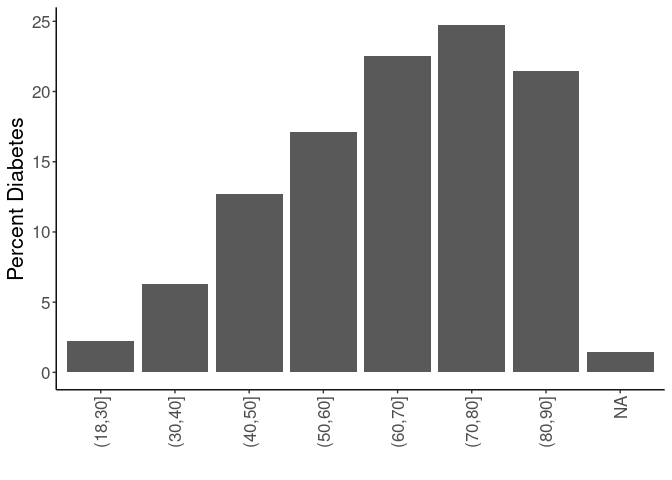

## Purpose

To define covariates for stress-obesity relationships, referring to associations with the outcome (diabetes risk).


```r
library(knitr)
#figures made will go to directory called figures, will make them as both png and pdf files 
opts_chunk$set(fig.path='figures/',
               echo=TRUE, warning=FALSE, message=FALSE,dev=c('png','pdf'))
options(scipen = 2, digits = 3)

library(readr)
library(dplyr)
```

```
## 
## Attaching package: 'dplyr'
```

```
## The following objects are masked from 'package:stats':
## 
##     filter, lag
```

```
## The following objects are masked from 'package:base':
## 
##     intersect, setdiff, setequal, union
```

```r
library(tidyr)
library(ggplot2)

input.file <- 'data-combined.csv'
combined.data <- read_csv(input.file) %>% #set reference values for each group
  mutate(Race.Ethnicity = relevel(as.factor(Race.Ethnicity),ref="White")) %>%
  mutate(Gender = relevel(as.factor(Gender),ref="F")) %>%
  mutate(BMI_cat = factor(as.factor(BMI_cat),levels=c("Underweight","Normal","Overweight","Class I Obese","Class II Obese","Class III Obese")))%>%
  filter(!(is.na(HypertensionAny))) %>%
  filter(!(is.na(Stress))) %>%
  filter(Stress!="NA")
```

```
## Rows: 62010 Columns: 39
```

```
## ── Column specification ────────────────────────────────────────────────────────
## Delimiter: ","
## chr (17): DeID_PatientID, Gender, DeID_EncounterID, BMI_cat, BMI_cat.obese, ...
## dbl (22): age, Stress_d1, CardiacArrhythmias, ChronicPulmonaryDisease, Conge...
## 
## ℹ Use `spec()` to retrieve the full column specification for this data.
## ℹ Specify the column types or set `show_col_types = FALSE` to quiet this message.
```

Loaded in the cleaned data from data-combined.csv. This script can be found in /nfs/turbo/precision-health/DataDirect/HUM00219435 - Obesity as a modifier of chronic psy/2023-03-14/2150 - Obesity and Stress - Cohort - DeID - 2023-03-14 and was most recently run on Wed Sep 20 14:09:22 2023. This dataset has 39694 values.

Performed univariate analyses on the categorical associations with diabetes incidence. Treated both age and BMI as both linear and categorical variables.

## By Race and Ethnicity


```r
combined.data %>%
  filter(!(is.na(Stress))) %>%
  filter(!(is.na(BMI_cat.Ob.NonOb))) %>%
  group_by(Race.Ethnicity,Type2Diabetes) %>%
  count %>%
  pivot_wider(id_cols=Race.Ethnicity,
              names_from=Type2Diabetes,
              values_from = n,
              names_prefix='Diabetes') %>%
  rename("Yes"="Diabetes1",
         "No"="Diabetes0")%>%
  mutate(Prevalence=Yes/(Yes+No)*100) -> diabetes.race

diabetes.race %>%
  ggplot(aes(y=Prevalence,x=Race.Ethnicity)) +
  geom_bar(stat='identity',position='dodge') +
  labs(y="Percent Diabetes",
       x="") +
  theme_classic() +
  scale_fill_grey() +
  theme(text=element_text(size=16),
        axis.text.x=element_text(angle=90,vjust=0.5,hjust=1),
        legend.position = c(0.1,0.85))
```

<!-- -->

```r
diabetes.race %>%
  knitr::kable(caption="Number of participants by diabetes diagnosis and race/ethnicity",
               digits =c(0,2,3,2,99))
```


Table: Number of participants by diabetes diagnosis and race/ethnicity

|Race.Ethnicity  |    No|  Yes| Prevalence|
|:---------------|-----:|----:|----------:|
|White           | 29951| 5370|       15.2|
|Asian           |   511|   69|       11.9|
|Black           |  1342|  397|       22.8|
|Hispanic/Latino |   659|  119|       15.3|
|Other           |  1086|  190|       14.9|


```r
library(broom)
glm(Type2Diabetes~Race.Ethnicity, 
    family="binomial",
    data=combined.data) -> race.glm

race.glm %>% 
  anova(test="Chisq") %>% 
  tidy %>% 
  kable(caption="Binomial regression of ethicity on diabetes incidence",
        digits =c(0,0,0,0,0,99))
```


Table: Binomial regression of ethicity on diabetes incidence

|term           | df| deviance| df.residual| residual.deviance|  p.value|
|:--------------|--:|--------:|-----------:|-----------------:|--------:|
|NULL           | NA|       NA|       39693|             34213|       NA|
|Race.Ethnicity |  4|       73|       39689|             34140| 5.68e-15|

```r
race.glm %>% 
  tidy %>% 
  kable(caption="Binomial regression estimates of ethicity on diabetes incidence", 
        digits =c(0,2,3,2,99))
```


Table: Binomial regression estimates of ethicity on diabetes incidence

|term                          | estimate| std.error| statistic|  p.value|
|:-----------------------------|--------:|---------:|---------:|--------:|
|(Intercept)                   |    -1.72|     0.015|   -115.98| 0.00e+00|
|Race.EthnicityAsian           |    -0.28|     0.129|     -2.20| 2.81e-02|
|Race.EthnicityBlack           |     0.50|     0.059|      8.48| 2.17e-17|
|Race.EthnicityHispanic/Latino |     0.01|     0.101|      0.07| 9.44e-01|
|Race.EthnicityOther           |    -0.02|     0.080|     -0.31| 7.60e-01|

## By Gender


```r
combined.data %>%
  filter(!(is.na(Stress))) %>%
  filter(!(is.na(BMI_cat.Ob.NonOb))) %>%
  group_by(Gender,Type2Diabetes) %>%
  count %>%
  pivot_wider(id_cols=Gender,
              names_from=Type2Diabetes,
              values_from = n,
              names_prefix='Diabetes') %>%
  rename("Yes"="Diabetes1",
         "No"="Diabetes0") %>%
  mutate(Prevalence=Yes/(Yes+No)*100) -> 
  diabetes.gender

diabetes.gender %>%
  ggplot(aes(y=Prevalence,x=Gender)) +
  geom_bar(stat='identity',position='dodge') +
  labs(y="Percent Diabetes",
       x="") +
  theme_classic() +
  scale_fill_grey() +
  theme(text=element_text(size=16),
        axis.text.x=element_text(angle=90,vjust=0.5,hjust=1),
        legend.position = c(0.1,0.85))
```

<!-- -->

```r
diabetes.gender %>% 
  knitr::kable(caption="Number of participants by diabetes diagnosis and gender",
               digits =c(0,2,3,2,99))
```


Table: Number of participants by diabetes diagnosis and gender

|Gender |    No|  Yes| Prevalence|
|:------|-----:|----:|----------:|
|F      | 18085| 2781|       13.3|
|M      | 15464| 3364|       17.9|

## Interaction Between Gender and BMI

Modelling shows a significant interaction between BMI and gender with respect to diabetes risk


```r
combined.data %>%
  filter(!(is.na(Stress))) %>%
  filter(!(is.na(BMI_cat.Ob.NonOb))) %>%
  group_by(Gender,Type2Diabetes,BMI_cat.Ob.NonOb) %>%
  count %>%
  pivot_wider(id_cols=c(Gender,BMI_cat.Ob.NonOb),
              names_from=Type2Diabetes,
              values_from = n,
              names_prefix='Diabetes') %>%
  rename("Yes"="Diabetes1",
         "No"="Diabetes0") %>%
  mutate(Prevalence=Yes/(Yes+No)*100) -> 
  diabetes.gender.bmi

glm(Type2Diabetes~Gender+BMI_cat.Ob.NonOb+BMI_cat.Ob.NonOb:Gender, 
    family="binomial",
    data=combined.data) -> gender.bmi.glm

kable(diabetes.gender.bmi, caption="Prevalence of diabetes by obesity and gender")
```


Table: Prevalence of diabetes by obesity and gender

|Gender |BMI_cat.Ob.NonOb |    No|  Yes| Prevalence|
|:------|:----------------|-----:|----:|----------:|
|F      |Non-Obese        | 11112|  806|       6.76|
|F      |Obese            |  6973| 1975|      22.07|
|M      |Non-Obese        |  9780| 1277|      11.55|
|M      |Obese            |  5684| 2087|      26.86|

```r
gender.bmi.glm %>% 
  anova(test="Chisq") %>% 
  tidy %>% 
  kable(caption="Binomial regression of gender:BMI interaction on diabetes incidence",
        digits =c(0,0,0,0,0,99))
```


Table: Binomial regression of gender:BMI interaction on diabetes incidence

|term                    | df| deviance| df.residual| residual.deviance|  p.value|
|:-----------------------|--:|--------:|-----------:|-----------------:|--------:|
|NULL                    | NA|       NA|       39693|             34213|       NA|
|Gender                  |  1|      156|       39692|             34057| 9.92e-36|
|BMI_cat.Ob.NonOb        |  1|     1726|       39691|             32331| 0.00e+00|
|Gender:BMI_cat.Ob.NonOb |  1|       31|       39690|             32300| 2.82e-08|

```r
gender.bmi.glm %>% 
  tidy %>% 
  kable(caption="Binomial regression estimates of gender:BMI on diabetes incidence", 
        digits =c(0,2,3,2,99))
```


Table: Binomial regression estimates of gender:BMI on diabetes incidence

|term                          | estimate| std.error| statistic|  p.value|
|:-----------------------------|--------:|---------:|---------:|--------:|
|(Intercept)                   |    -2.62|     0.036|    -71.92| 0.00e+00|
|GenderM                       |     0.59|     0.047|     12.49| 8.67e-36|
|BMI_cat.Ob.NonObObese         |     1.36|     0.045|     30.61| 0.00e+00|
|GenderM:BMI_cat.Ob.NonObObese |    -0.33|     0.059|     -5.53| 3.14e-08|


```r
diabetes.gender.bmi %>%
  ggplot(aes(y=Prevalence,x=Gender,fill=BMI_cat.Ob.NonOb)) +
  geom_bar(stat='identity',position='dodge') +
  labs(y="Percent Diabetes",
       x="") +
  theme_classic() +
  scale_fill_grey() +
  theme(text=element_text(size=16),
        axis.text.x=element_text(angle=90,vjust=0.5,hjust=1),
        legend.position = c(0.1,0.85))
```

<!-- -->


```r
library(broom)
glm(Type2Diabetes~Gender, 
    family="binomial",
    data=combined.data) -> gender.glm

gender.glm %>% 
  anova(test="Chisq") %>% 
  tidy %>% 
  kable(caption="Binomial regression of gender on diabetes incidence",
        digits =c(0,0,0,0,0,99))
```


Table: Binomial regression of gender on diabetes incidence

|term   | df| deviance| df.residual| residual.deviance|  p.value|
|:------|--:|--------:|-----------:|-----------------:|--------:|
|NULL   | NA|       NA|       39693|             34213|       NA|
|Gender |  1|      156|       39692|             34057| 9.92e-36|

```r
gender.glm %>% 
  tidy %>% 
  kable(caption="Binomial regression estimates of gender on diabetes incidence", 
        digits =c(0,2,3,2,99))
```


Table: Binomial regression estimates of gender on diabetes incidence

|term        | estimate| std.error| statistic|  p.value|
|:-----------|--------:|---------:|---------:|--------:|
|(Intercept) |    -1.87|     0.020|     -91.9| 0.00e+00|
|GenderM     |     0.35|     0.028|      12.4| 1.47e-35|

## By Age


```r
combined.data %>%
  filter(!(is.na(Stress))) %>%
  filter(!(is.na(BMI_cat.Ob.NonOb))) %>%
  group_by(Age.group,Type2Diabetes) %>%
  count %>%
  pivot_wider(id_cols=Age.group,
              names_from=Type2Diabetes,
              values_from = n,
              names_prefix='Diabetes') %>%
  rename("Yes"="Diabetes1",
         "No"="Diabetes0")%>%
  mutate(Prevalence=Yes/(Yes+No)*100) -> diabetes.age


diabetes.age %>%
  ggplot(aes(y=Prevalence,x=Age.group)) +
  geom_bar(stat='identity',position='dodge') +
  labs(y="Percent Diabetes",
       x="") +
  theme_classic() +
  scale_fill_grey() +
  theme(text=element_text(size=16),
        axis.text.x=element_text(angle=90,vjust=0.5,hjust=1),
        legend.position = c(0.1,0.85))  
```

<!-- -->

```r
diabetes.age %>%
  knitr::kable(caption="Number of participants by diabetes diagnosis and age")
```


Table: Number of participants by diabetes diagnosis and age

|Age.group |   No|  Yes| Prevalence|
|:---------|----:|----:|----------:|
|(18,30]   | 4393|  102|       2.27|
|(30,40]   | 4529|  303|       6.27|
|(40,50]   | 5520|  805|      12.73|
|(50,60]   | 7388| 1529|      17.15|
|(60,70]   | 7106| 2066|      22.52|
|(70,80]   | 3346| 1101|      24.76|
|(80,90]   |  854|  233|      21.43|
|NA        |  413|    6|       1.43|


```r
glm(Type2Diabetes~Age.group, 
    family="binomial",
    data=combined.data) -> age.glm

age.glm %>% 
  anova(test="Chisq") %>% 
  tidy %>% 
  kable(caption="Binomial regression of age group on diabetes incidence",
        digits =c(0,0,0,0,0,99))
```


Table: Binomial regression of age group on diabetes incidence

|term      | df| deviance| df.residual| residual.deviance| p.value|
|:---------|--:|--------:|-----------:|-----------------:|-------:|
|NULL      | NA|       NA|       39274|             34051|      NA|
|Age.group |  6|     1925|       39268|             32126|       0|

```r
age.glm %>% 
  tidy %>% 
  kable(caption="Binomial regression estimates of age group on diabetes incidence", 
        digits =c(0,2,3,2,99))
```


Table: Binomial regression estimates of age group on diabetes incidence

|term             | estimate| std.error| statistic|  p.value|
|:----------------|--------:|---------:|---------:|--------:|
|(Intercept)      |    -3.76|     0.100|    -37.57| 0.00e+00|
|Age.group(30,40] |     1.06|     0.116|      9.09| 9.85e-20|
|Age.group(40,50] |     1.84|     0.107|     17.17| 4.55e-66|
|Age.group(50,60] |     2.19|     0.104|     21.03| 3.50e-98|
|Age.group(60,70] |     2.53|     0.103|     24.48| 0.00e+00|
|Age.group(70,80] |     2.65|     0.106|     25.01| 0.00e+00|
|Age.group(80,90] |     2.46|     0.124|     19.79| 3.32e-87|

```r
glm(Type2Diabetes~age, data=combined.data) %>% 
  tidy %>%
  kable(caption="Binomial regression estimates of age (continuous) on diabetes incidence", 
        digits =c(0,2,3,2,99))
```


Table: Binomial regression estimates of age (continuous) on diabetes incidence

|term        | estimate| std.error| statistic| p.value|
|:-----------|--------:|---------:|---------:|-------:|
|(Intercept) |    -0.08|     0.006|     -13.4| 1.1e-40|
|age         |     0.00|     0.000|      41.2| 0.0e+00|

## By Neighborhood Disadvantage


```r
combined.data %>%
  filter(!(is.na(Stress))) %>%
  filter(!(is.na(BMI_cat.Ob.NonOb))) %>%
  group_by(disadvantage13_17_qrtl,Type2Diabetes) %>%
  count %>%
  pivot_wider(id_cols=disadvantage13_17_qrtl,
              names_from=Type2Diabetes,
              values_from = n,
              names_prefix='Diabetes') %>%
  rename("Yes"="Diabetes1",
         "No"="Diabetes0")%>%
  mutate(Prevalence=Yes/(Yes+No)*100) -> diabetes.disadvantage


diabetes.disadvantage %>%
  ggplot(aes(y=Prevalence,x=disadvantage13_17_qrtl)) +
  geom_bar(stat='identity',position='dodge') +
  labs(y="Percent Diabetes",
       x="") +
  theme_classic() +
  scale_fill_grey() +
  theme(text=element_text(size=16),
        axis.text.x=element_text(angle=90,vjust=0.5,hjust=1),
        legend.position = c(0.1,0.85))  
```

<!-- -->

```r
diabetes.disadvantage %>%
  knitr::kable(caption="Number of participants by diabetes neighborhood disadvantage")
```


Table: Number of participants by diabetes neighborhood disadvantage

| disadvantage13_17_qrtl|    No|  Yes| Prevalence|
|----------------------:|-----:|----:|----------:|
|                      1| 12176| 1821|       13.0|
|                      2|  8840| 1706|       16.2|
|                      3|  6292| 1344|       17.6|
|                      4|  3508|  833|       19.2|
|                     NA|  2733|  441|       13.9|


```r
glm(Type2Diabetes~disadvantage13_17_qrtl, 
    family="binomial",
    data=combined.data) -> disadvantage.glm

disadvantage.glm %>% 
  anova(test="Chisq") %>% 
  tidy %>% 
  kable(caption="Binomial regression of neighborhood disadvantage group on diabetes incidence",
        digits =c(0,0,0,0,0,99))
```


Table: Binomial regression of neighborhood disadvantage group on diabetes incidence

|term                   | df| deviance| df.residual| residual.deviance| p.value|
|:----------------------|--:|--------:|-----------:|-----------------:|-------:|
|NULL                   | NA|       NA|       36519|             31648|      NA|
|disadvantage13_17_qrtl |  1|      131|       36518|             31517| 2.3e-30|

```r
disadvantage.glm %>% 
  tidy %>% 
  kable(caption="Binomial regression estimates of neighborhood disadvantage group on diabetes incidence", 
        digits =c(0,2,3,2,99))
```


Table: Binomial regression estimates of neighborhood disadvantage group on diabetes incidence

|term                   | estimate| std.error| statistic|  p.value|
|:----------------------|--------:|---------:|---------:|--------:|
|(Intercept)            |    -2.02|     0.033|     -61.0| 0.00e+00|
|disadvantage13_17_qrtl |     0.16|     0.014|      11.5| 1.04e-30|

## By Body Mass Index


```r
combined.data %>%
  filter(!(is.na(Stress))) %>%
  filter(!(is.na(BMI_cat.Ob.NonOb))) %>%
  group_by(BMI_cat,Type2Diabetes) %>%
  count %>%
  pivot_wider(id_cols=BMI_cat,
              names_from=Type2Diabetes,
              values_from = n,
              names_prefix='Diabetes') %>%
  rename("Yes"="Diabetes1",
         "No"="Diabetes0") %>%
  mutate(Prevalence=Yes/(Yes+No)*100) -> diabetes.bmi

diabetes.bmi %>%
  ggplot(aes(y=Prevalence,x=BMI_cat)) +
  geom_bar(stat='identity',position='dodge') +
  labs(y="Percent Diabetes",
       x="") +
  theme_classic() +
  scale_fill_grey() +
  theme(text=element_text(size=16),
        axis.text.x=element_text(angle=90,vjust=0.5,hjust=1),
        legend.position = c(0.1,0.85))  
```

<!-- -->

```r
diabetes.bmi %>%
  knitr::kable(caption="Number of participants by diabetes diagnosis and BMI category")
```


Table: Number of participants by diabetes diagnosis and BMI category

|BMI_cat         |    No|  Yes| Prevalence|
|:---------------|-----:|----:|----------:|
|Underweight     |   274|    9|       3.18|
|Normal          |  9072|  576|       5.97|
|Overweight      | 11416| 1494|      11.57|
|Class I Obese   |  7110| 1760|      19.84|
|Class II Obese  |  3274| 1197|      26.77|
|Class III Obese |  2273| 1105|      32.71|
|NA              |   130|    4|       2.98|


```r
glm(Type2Diabetes~BMI_cat, 
    family="binomial",
    data=combined.data) -> bmi.glm

bmi.glm %>% 
  anova(test="Chisq") %>% 
  tidy %>% 
  kable(caption="Binomial regression of BMI group on diabetes incidence",
        digits =c(0,0,0,0,0,99))
```


Table: Binomial regression of BMI group on diabetes incidence

|term    | df| deviance| df.residual| residual.deviance| p.value|
|:-------|--:|--------:|-----------:|-----------------:|-------:|
|NULL    | NA|       NA|       39559|             34154|      NA|
|BMI_cat |  5|     2155|       39554|             31999|       0|

```r
bmi.glm %>% 
  tidy %>% 
  kable(caption="Binomial regression estimates of BMI group on diabetes incidence", 
        digits =c(0,2,3,2,99))
```


Table: Binomial regression estimates of BMI group on diabetes incidence

|term                   | estimate| std.error| statistic|  p.value|
|:----------------------|--------:|---------:|---------:|--------:|
|(Intercept)            |    -3.42|     0.338|    -10.09| 5.89e-24|
|BMI_catNormal          |     0.66|     0.341|      1.93| 5.34e-02|
|BMI_catOverweight      |     1.38|     0.340|      4.07| 4.68e-05|
|BMI_catClass I Obese   |     2.02|     0.339|      5.95| 2.69e-09|
|BMI_catClass II Obese  |     2.41|     0.340|      7.09| 1.39e-12|
|BMI_catClass III Obese |     2.69|     0.340|      7.92| 2.45e-15|

```r
glm(Type2Diabetes~BMI, data=combined.data) %>% 
  tidy %>%
  kable(caption="Binomial regression estimates of BMI on diabetes incidence",
        digits =c(0,2,3,2,99))
```


Table: Binomial regression estimates of BMI on diabetes incidence

|term        | estimate| std.error| statistic| p.value|
|:-----------|--------:|---------:|---------:|-------:|
|(Intercept) |    -0.21|     0.008|     -26.8|       0|
|BMI         |     0.01|     0.000|      48.2|       0|

# Summary Table


```r
rbind(diabetes.race %>% rename("Group"="Race.Ethnicity"),
      diabetes.gender %>% rename("Group"="Gender"),
      diabetes.bmi %>% rename("Group"="BMI_cat"),
      diabetes.disadvantage %>% rename("Group"="disadvantage13_17_qrtl") %>%
        mutate(Group=as.factor(Group)),
      diabetes.age %>% rename("Group"="Age.group")) %>%
  mutate(Total=No+Yes) %>%
  select(Group,Total,No,Yes,Prevalence)-> summary.table

kable(summary.table, caption="Summary of demographic variables by diabetes incidence")
```


Table: Summary of demographic variables by diabetes incidence

|Group           | Total|    No|  Yes| Prevalence|
|:---------------|-----:|-----:|----:|----------:|
|White           | 35321| 29951| 5370|      15.20|
|Asian           |   580|   511|   69|      11.90|
|Black           |  1739|  1342|  397|      22.83|
|Hispanic/Latino |   778|   659|  119|      15.30|
|Other           |  1276|  1086|  190|      14.89|
|F               | 20866| 18085| 2781|      13.33|
|M               | 18828| 15464| 3364|      17.87|
|Underweight     |   283|   274|    9|       3.18|
|Normal          |  9648|  9072|  576|       5.97|
|Overweight      | 12910| 11416| 1494|      11.57|
|Class I Obese   |  8870|  7110| 1760|      19.84|
|Class II Obese  |  4471|  3274| 1197|      26.77|
|Class III Obese |  3378|  2273| 1105|      32.71|
|NA              |   134|   130|    4|       2.98|
|1               | 13997| 12176| 1821|      13.01|
|2               | 10546|  8840| 1706|      16.18|
|3               |  7636|  6292| 1344|      17.60|
|4               |  4341|  3508|  833|      19.19|
|NA              |  3174|  2733|  441|      13.89|
|(18,30]         |  4495|  4393|  102|       2.27|
|(30,40]         |  4832|  4529|  303|       6.27|
|(40,50]         |  6325|  5520|  805|      12.73|
|(50,60]         |  8917|  7388| 1529|      17.15|
|(60,70]         |  9172|  7106| 2066|      22.52|
|(70,80]         |  4447|  3346| 1101|      24.76|
|(80,90]         |  1087|   854|  233|      21.43|
|NA              |   419|   413|    6|       1.43|

```r
write_csv(summary.table, "Type 2 Diabetes Demographics Table.csv")
```

# Session Information


```r
sessionInfo()
```

```
## R version 4.3.1 (2023-06-16)
## Platform: x86_64-pc-linux-gnu (64-bit)
## Running under: Red Hat Enterprise Linux 8.6 (Ootpa)
## 
## Matrix products: default
## BLAS:   /sw/pkgs/arc/stacks/gcc/10.3.0/R/4.3.1/lib64/R/lib/libRblas.so 
## LAPACK: /sw/pkgs/arc/stacks/gcc/10.3.0/R/4.3.1/lib64/R/lib/libRlapack.so;  LAPACK version 3.11.0
## 
## locale:
##  [1] LC_CTYPE=en_US.UTF-8       LC_NUMERIC=C              
##  [3] LC_TIME=en_US.UTF-8        LC_COLLATE=en_US.UTF-8    
##  [5] LC_MONETARY=en_US.UTF-8    LC_MESSAGES=en_US.UTF-8   
##  [7] LC_PAPER=en_US.UTF-8       LC_NAME=C                 
##  [9] LC_ADDRESS=C               LC_TELEPHONE=C            
## [11] LC_MEASUREMENT=en_US.UTF-8 LC_IDENTIFICATION=C       
## 
## time zone: America/Detroit
## tzcode source: system (glibc)
## 
## attached base packages:
## [1] stats     graphics  grDevices utils     datasets  methods   base     
## 
## other attached packages:
## [1] broom_1.0.5   ggplot2_3.4.3 tidyr_1.3.0   dplyr_1.1.3   readr_2.1.4  
## [6] knitr_1.44   
## 
## loaded via a namespace (and not attached):
##  [1] bit_4.0.5        gtable_0.3.4     jsonlite_1.8.7   crayon_1.5.2    
##  [5] compiler_4.3.1   tidyselect_1.2.0 stringr_1.5.0    parallel_4.3.1  
##  [9] jquerylib_0.1.4  scales_1.2.1     yaml_2.3.7       fastmap_1.1.1   
## [13] R6_2.5.1         labeling_0.4.3   generics_0.1.3   backports_1.4.1 
## [17] tibble_3.2.1     munsell_0.5.0    bslib_0.5.1      pillar_1.9.0    
## [21] tzdb_0.4.0       rlang_1.1.1      utf8_1.2.3       stringi_1.7.12  
## [25] cachem_1.0.8     xfun_0.40        sass_0.4.7       bit64_4.0.5     
## [29] cli_3.6.1        withr_2.5.0      magrittr_2.0.3   digest_0.6.33   
## [33] grid_4.3.1       vroom_1.6.3      hms_1.1.3        lifecycle_1.0.3 
## [37] vctrs_0.6.3      evaluate_0.21    glue_1.6.2       farver_2.1.1    
## [41] fansi_1.0.4      colorspace_2.1-0 rmarkdown_2.25   purrr_1.0.2     
## [45] tools_4.3.1      pkgconfig_2.0.3  htmltools_0.5.6
```
