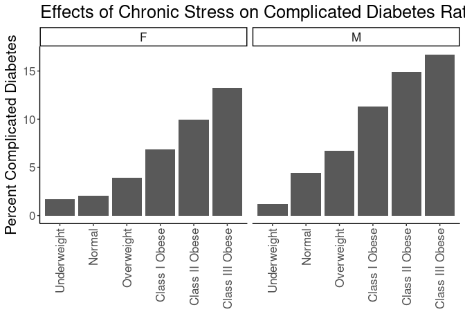
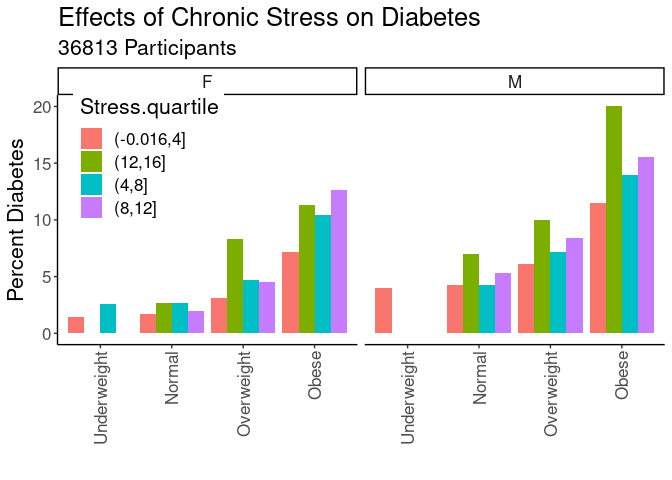

## Purpose

To test the effect modification of obesity on the stress-diabetes complications relationships.


```r
library(knitr)
#figures made will go to directory called figures, will make them as both png and pdf files 
opts_chunk$set(fig.path='figures/',
               echo=TRUE, warning=FALSE, message=FALSE,dev=c('png','pdf'))
options(scipen = 2, digits = 3)

library(readr)
library(dplyr)
```

```
## 
## Attaching package: 'dplyr'
```

```
## The following objects are masked from 'package:stats':
## 
##     filter, lag
```

```
## The following objects are masked from 'package:base':
## 
##     intersect, setdiff, setequal, union
```

```r
library(tidyr)

input.file <- 'data-combined.csv'
combined.data <- read_csv(input.file, na="-99") %>%
  filter(!(is.na(DiabetesComplicated))) %>%
  filter(!(is.na(Stress))) %>%
  filter(Stress!="NA")
```

```
## Rows: 62010 Columns: 32
```

```
## ── Column specification ────────────────────────────────────────────────────────
## Delimiter: ","
## chr (17): DeID_PatientID, Gender, Stress_d1, DeID_EncounterID, BMI_cat, BMI_...
## dbl (15): age, CardiacArrhythmias, ChronicPulmonaryDisease, Depression, Diab...
## 
## ℹ Use `spec()` to retrieve the full column specification for this data.
## ℹ Specify the column types or set `show_col_types = FALSE` to quiet this message.
```

Loaded in the cleaned data from data-combined.csv. This script can be found in /nfs/turbo/precision-health/DataDirect/HUM00219435 - Obesity as a modifier of chronic psy and was most recently run on Thu Mar  9 16:03:15 2023. This dataset has 36826 values.


```r
combined.data <- 
  combined.data %>%
  mutate(BMI_cat= factor(BMI_cat, 
                         levels=c("Underweight",
                                  "Normal",
                                  "Overweight",
                                  'Class I Obese',
                                  'Class II Obese',
                                  'Class III Obese'))) %>%
  mutate(BMI_cat.obese= factor(BMI_cat.obese, 
                               levels=c("Underweight",
                                        "Normal",
                                        "Overweight",
                                        'Obese'))) %>%
  mutate(BMI_cat.Ob.NonOb= factor(BMI_cat.Ob.NonOb, 
                                  levels=c("Non-Obese",
                                           'Obese'))) %>%
  mutate(Stress=relevel(as.factor(High.Stress),ref="Low")) #set low as reference value
  
# need to clean race data
```

# Diabetes Complication Rates by BMI

Stratified diagnoses by various BMI categories

## Diabetes by BMI Category


```r
#calculating diabetes rates by bmi category
with(combined.data, table(DiabetesComplicated,BMI_cat,Gender)) %>% 
  data.frame %>%
  pivot_wider(names_from=DiabetesComplicated,
              values_from = Freq) %>%
  rename(DiabetesComplicated=`1`,
         NonDiabetes=`0`) %>%
  mutate(Total=DiabetesComplicated+NonDiabetes) %>%
  mutate(Percent=DiabetesComplicated/Total*100) -> diabetes.bmi.counts

kable(diabetes.bmi.counts, caption="Diabetes with complication rates by BMI category")
```


Table: Diabetes with complication rates by BMI category

|BMI_cat         |Gender | NonDiabetes| DiabetesComplicated| Total| Percent|
|:---------------|:------|-----------:|-------------------:|-----:|-------:|
|Underweight     |F      |         167|                   4|   171|    2.34|
|Normal          |F      |        5327|                 119|  5446|    2.19|
|Overweight      |F      |        5150|                 208|  5358|    3.88|
|Class I Obese   |F      |        3625|                 258|  3883|    6.64|
|Class II Obese  |F      |        2107|                 210|  2317|    9.06|
|Class III Obese |F      |        1834|                 283|  2117|   13.37|
|Underweight     |M      |          85|                   1|    86|    1.16|
|Normal          |M      |        3366|                 173|  3539|    4.89|
|Overweight      |M      |        6125|                 433|  6558|    6.60|
|Class I Obese   |M      |        3905|                 484|  4389|   11.03|
|Class II Obese  |M      |        1575|                 266|  1841|   14.45|
|Class III Obese |M      |         819|                 177|   996|   17.77|

```r
library(ggplot2)

ggplot(diabetes.bmi.counts,
       aes(y=Percent,
           x=BMI_cat)) +
  geom_bar(stat='identity',position='dodge') +
  labs(y="Percent Complicated Diabetes",
       title="Effects of Chronic Stress on Complicated Diabetes Rates",
       x="") +
  theme_classic() +
  scale_fill_grey() +
  facet_grid(.~Gender) +
  theme(text=element_text(size=16),
        axis.text.x=element_text(angle=90,vjust=0.5,hjust=1),
        legend.position = c(0.1,0.85))
```

<!-- -->

## Diabetes Rate by BMI and Stress

This analysis uses all the BMI categories


```r
#calculating diabetes rates by bmi category and stress
with(combined.data, table(DiabetesComplicated,BMI_cat,Stress,Gender)) %>% 
  data.frame %>%
  pivot_wider(names_from=DiabetesComplicated,
              values_from = Freq) %>%
  rename(DiabetesComplicated=`1`,
         NonDiabetes=`0`) %>%
  mutate(Total=DiabetesComplicated+NonDiabetes) %>%
  mutate(Percent=DiabetesComplicated/Total*100) -> diabetes.bmi.stress.counts

library(ggplot2)

kable(diabetes.bmi.stress.counts, caption="Diabetes with complications rates by BMI category")
```


Table: Diabetes with complications rates by BMI category

|BMI_cat         |Stress |Gender | NonDiabetes| DiabetesComplicated| Total| Percent|
|:---------------|:------|:------|-----------:|-------------------:|-----:|-------:|
|Underweight     |Low    |F      |          85|                   1|    86|    1.16|
|Normal          |Low    |F      |        3141|                  59|  3200|    1.84|
|Overweight      |Low    |F      |        2981|                 100|  3081|    3.25|
|Class I Obese   |Low    |F      |        1948|                 111|  2059|    5.39|
|Class II Obese  |Low    |F      |        1141|                  87|  1228|    7.08|
|Class III Obese |Low    |F      |         935|                 127|  1062|   11.96|
|Underweight     |High   |F      |          82|                   3|    85|    3.53|
|Normal          |High   |F      |        2186|                  60|  2246|    2.67|
|Overweight      |High   |F      |        2169|                 108|  2277|    4.74|
|Class I Obese   |High   |F      |        1677|                 147|  1824|    8.06|
|Class II Obese  |High   |F      |         966|                 123|  1089|   11.29|
|Class III Obese |High   |F      |         899|                 156|  1055|   14.79|
|Underweight     |Low    |M      |          37|                   1|    38|    2.63|
|Normal          |Low    |M      |        2048|                  90|  2138|    4.21|
|Overweight      |Low    |M      |        3827|                 262|  4089|    6.41|
|Class I Obese   |Low    |M      |        2393|                 253|  2646|    9.56|
|Class II Obese  |Low    |M      |         901|                 147|  1048|   14.03|
|Class III Obese |Low    |M      |         454|                  79|   533|   14.82|
|Underweight     |High   |M      |          48|                   0|    48|    0.00|
|Normal          |High   |M      |        1318|                  83|  1401|    5.92|
|Overweight      |High   |M      |        2298|                 171|  2469|    6.93|
|Class I Obese   |High   |M      |        1512|                 231|  1743|   13.25|
|Class II Obese  |High   |M      |         674|                 119|   793|   15.01|
|Class III Obese |High   |M      |         365|                  98|   463|   21.17|

```r
ggplot(diabetes.bmi.stress.counts,
       aes(y=Percent,
           x=BMI_cat,
           fill=Stress)) +
  geom_bar(stat='identity',position='dodge') +
  labs(y="Percent Diabetes",
       title="Effects of Chronic Stress on Diabetes Rates",
       x="") +
  theme_classic() +
  scale_fill_grey() +
  facet_grid(.~Gender) +
  theme(text=element_text(size=16),
        axis.text.x=element_text(angle=90,vjust=0.5,hjust=1),
        legend.position = c(0.1,0.85))
```

<!-- -->

### Logistic Regressions for All Obese Categories

Ran a series of stepwise logistic regressions testing for obesity as a modifier of the effects of stress.


```r
library(broom)
glm(DiabetesComplicated~BMI_cat, 
    family="binomial",
    data=combined.data) -> obesity.glm1

obesity.glm1 %>%
  tidy() %>%
  kable(caption="Logistic regression of obesity on diabetes", digits =c(0,2,3,2,99))
```


Table: Logistic regression of obesity on diabetes

|term                   | estimate| std.error| statistic|  p.value|
|:----------------------|--------:|---------:|---------:|--------:|
|(Intercept)            |    -3.92|     0.452|     -8.68| 3.95e-18|
|BMI_catNormal          |     0.53|     0.455|      1.16| 2.48e-01|
|BMI_catOverweight      |     1.05|     0.453|      2.32| 2.03e-02|
|BMI_catClass I Obese   |     1.60|     0.453|      3.54| 4.06e-04|
|BMI_catClass II Obese  |     1.87|     0.454|      4.13| 3.69e-05|
|BMI_catClass III Obese |     2.17|     0.454|      4.77| 1.84e-06|

```r
anova(obesity.glm1,test="Chisq") %>% tidy %>%
  kable(caption="Logistic regression of obesity on diabetes, ", digits =c(0,0,0,0,0,99))
```


Table: Logistic regression of obesity on diabetes, 

|term    | df| Deviance| Resid..Df| Resid..Dev| p.value|
|:-------|--:|--------:|---------:|----------:|-------:|
|NULL    | NA|       NA|     36700|      18859|      NA|
|BMI_cat |  5|      681|     36695|      18178|       0|

```r
#adding in stress as a modifier
glm(DiabetesComplicated~BMI_cat+Stress+Stress:BMI_cat, 
    family="binomial",
    data=combined.data) -> obesity.glm2

obesity.glm2 %>%
  tidy() %>%
  kable(caption="Logistic regression of obesity on diabetes, with stress as a modifier", digits =c(0,2,3,2,99))
```


Table: Logistic regression of obesity on diabetes, with stress as a modifier

|term                              | estimate| std.error| statistic|  p.value|
|:---------------------------------|--------:|---------:|---------:|--------:|
|(Intercept)                       |    -4.11|     0.713|     -5.77| 8.02e-09|
|BMI_catNormal                     |     0.56|     0.718|      0.78| 4.35e-01|
|BMI_catOverweight                 |     1.18|     0.715|      1.65| 9.97e-02|
|BMI_catClass I Obese              |     1.63|     0.715|      2.28| 2.24e-02|
|BMI_catClass II Obese             |     1.94|     0.716|      2.72| 6.61e-03|
|BMI_catClass III Obese            |     2.20|     0.717|      3.07| 2.12e-03|
|StressHigh                        |     0.34|     0.921|      0.37| 7.11e-01|
|BMI_catNormal:StressHigh          |     0.01|     0.929|      0.01| 9.92e-01|
|BMI_catOverweight:StressHigh      |    -0.18|     0.925|     -0.20| 8.45e-01|
|BMI_catClass I Obese:StressHigh   |     0.00|     0.925|      0.00| 9.96e-01|
|BMI_catClass II Obese:StressHigh  |    -0.09|     0.927|     -0.10| 9.23e-01|
|BMI_catClass III Obese:StressHigh |    -0.04|     0.927|     -0.04| 9.67e-01|

```r
anova(obesity.glm2,test="Chisq") %>% tidy %>%
  kable(caption="Logistic regression of obese vs non-obese on diabetes, with stress as a modifier", digits =c(0,0,0,0,0,99))
```


Table: Logistic regression of obese vs non-obese on diabetes, with stress as a modifier

|term           | df| Deviance| Resid..Df| Resid..Dev|  p.value|
|:--------------|--:|--------:|---------:|----------:|--------:|
|NULL           | NA|       NA|     36700|      18859|       NA|
|BMI_cat        |  5|      681|     36695|      18178| 0.00e+00|
|Stress         |  1|       45|     36694|      18133| 1.83e-11|
|BMI_cat:Stress |  5|        3|     36689|      18130| 6.47e-01|

```r
#adding in age and gender as covariates as a modifier
glm(DiabetesComplicated~BMI_cat+Stress+Stress:BMI_cat+Gender+age, 
    family="binomial",
    data=combined.data) -> obesity.glm3

obesity.glm3 %>%
  tidy() %>%
  kable(caption="Logistic regression of obesity on diabetes, with stress as a modifier and age and  gender as covarites", digits =c(0,2,3,2,99))
```


Table: Logistic regression of obesity on diabetes, with stress as a modifier and age and  gender as covarites

|term                              | estimate| std.error| statistic|  p.value|
|:---------------------------------|--------:|---------:|---------:|--------:|
|(Intercept)                       |    -6.22|     0.721|     -8.63| 6.30e-18|
|BMI_catNormal                     |     0.46|     0.720|      0.63| 5.27e-01|
|BMI_catOverweight                 |     0.85|     0.717|      1.19| 2.35e-01|
|BMI_catClass I Obese              |     1.33|     0.718|      1.85| 6.44e-02|
|BMI_catClass II Obese             |     1.75|     0.719|      2.44| 1.47e-02|
|BMI_catClass III Obese            |     2.19|     0.719|      3.05| 2.28e-03|
|StressHigh                        |     0.37|     0.925|      0.40| 6.89e-01|
|GenderM                           |     0.44|     0.043|     10.27| 9.28e-25|
|age                               |     0.04|     0.002|     23.82| 0.00e+00|
|BMI_catNormal:StressHigh          |     0.05|     0.933|      0.05| 9.61e-01|
|BMI_catOverweight:StressHigh      |    -0.11|     0.929|     -0.12| 9.08e-01|
|BMI_catClass I Obese:StressHigh   |     0.08|     0.929|      0.09| 9.29e-01|
|BMI_catClass II Obese:StressHigh  |    -0.02|     0.931|     -0.02| 9.83e-01|
|BMI_catClass III Obese:StressHigh |     0.04|     0.931|      0.04| 9.65e-01|

```r
anova(obesity.glm3,test="Chisq") %>% tidy %>%
  kable(caption="Logistic regression of obesity on diabetes, with stress as a modifier and age and gender as covarite", digits =c(0,0,0,0,0,99))
```


Table: Logistic regression of obesity on diabetes, with stress as a modifier and age and gender as covarite

|term           | df| Deviance| Resid..Df| Resid..Dev|  p.value|
|:--------------|--:|--------:|---------:|----------:|--------:|
|NULL           | NA|       NA|     36700|      18859|       NA|
|BMI_cat        |  5|      681|     36695|      18178| 0.00e+00|
|Stress         |  1|       45|     36694|      18133| 1.83e-11|
|Gender         |  1|      179|     36693|      17954| 6.78e-41|
|age            |  1|      631|     36692|      17323| 0.00e+00|
|BMI_cat:Stress |  5|        3|     36687|      17320| 6.75e-01|

```r
#adding in race and ethnicity
glm(DiabetesComplicated~BMI_cat+Stress+Stress:BMI_cat+Gender+age+Race.Ethnicity, 
    family="binomial",
    data=combined.data) -> obesity.glm4

obesity.glm4 %>%
  tidy() %>%
  kable(caption="Logistic regression of obesity on diabetes, with stress as a modifier and age, gender and race as covarites", digits =c(0,2,3,2,99))
```


Table: Logistic regression of obesity on diabetes, with stress as a modifier and age, gender and race as covarites

|term                              | estimate| std.error| statistic|  p.value|
|:---------------------------------|--------:|---------:|---------:|--------:|
|(Intercept)                       |    -5.85|     0.745|     -7.86| 3.92e-15|
|BMI_catNormal                     |     0.44|     0.720|      0.61| 5.42e-01|
|BMI_catOverweight                 |     0.83|     0.718|      1.16| 2.45e-01|
|BMI_catClass I Obese              |     1.31|     0.718|      1.82| 6.89e-02|
|BMI_catClass II Obese             |     1.74|     0.719|      2.41| 1.57e-02|
|BMI_catClass III Obese            |     2.16|     0.719|      3.01| 2.63e-03|
|StressHigh                        |     0.36|     0.926|      0.39| 7.00e-01|
|GenderM                           |     0.45|     0.043|     10.51| 7.68e-26|
|age                               |     0.04|     0.002|     24.51| 0.00e+00|
|Race.EthnicityBlack               |     0.21|     0.218|      0.98| 3.26e-01|
|Race.EthnicityHispanic/Latino     |    -0.12|     0.250|     -0.48| 6.31e-01|
|Race.EthnicityOther               |    -0.69|     0.241|     -2.86| 4.28e-03|
|Race.EthnicityWhite               |    -0.50|     0.204|     -2.42| 1.53e-02|
|BMI_catNormal:StressHigh          |     0.06|     0.933|      0.06| 9.51e-01|
|BMI_catOverweight:StressHigh      |    -0.10|     0.929|     -0.11| 9.11e-01|
|BMI_catClass I Obese:StressHigh   |     0.09|     0.929|      0.10| 9.23e-01|
|BMI_catClass II Obese:StressHigh  |    -0.02|     0.931|     -0.02| 9.86e-01|
|BMI_catClass III Obese:StressHigh |     0.05|     0.931|      0.06| 9.53e-01|

```r
anova(obesity.glm4,test="Chisq") %>% tidy %>%
  kable(caption="Logistic regression of obesity on diabetes, with stress as a modifier and age, gender and race as covarite", digits =c(0,0,0,0,0,99))
```


Table: Logistic regression of obesity on diabetes, with stress as a modifier and age, gender and race as covarite

|term           | df| Deviance| Resid..Df| Resid..Dev|  p.value|
|:--------------|--:|--------:|---------:|----------:|--------:|
|NULL           | NA|       NA|     36700|      18859|       NA|
|BMI_cat        |  5|      681|     36695|      18178| 0.00e+00|
|Stress         |  1|       45|     36694|      18133| 1.83e-11|
|Gender         |  1|      179|     36693|      17954| 6.78e-41|
|age            |  1|      631|     36692|      17323| 0.00e+00|
|Race.Ethnicity |  4|       76|     36688|      17248| 1.50e-15|
|BMI_cat:Stress |  5|        3|     36683|      17244| 6.51e-01|

### Diabetes Rates by Quartiles


```r
with(combined.data, table(DiabetesComplicated,BMI_cat.obese,Stress.quartile,Gender)) %>% 
  data.frame %>%
  pivot_wider(names_from=DiabetesComplicated,
              values_from = Freq) %>%
  rename(Diabetes=`1`,
         NonDiabetes=`0`) %>%
  mutate(Total=Diabetes+NonDiabetes) %>%
  mutate(Percent=Diabetes/Total*100) -> diabetes.bmi.stress.quartile.counts

kable(diabetes.bmi.stress.quartile.counts, caption="Diabetes Rates by BMI and Stress Quartile")
```


Table: Diabetes Rates by BMI and Stress Quartile

|BMI_cat.obese |Stress.quartile |Gender | NonDiabetes| Diabetes| Total| Percent|
|:-------------|:---------------|:------|-----------:|--------:|-----:|-------:|
|Underweight   |(-0.016,4]      |F      |          65|        1|    66|    1.51|
|Normal        |(-0.016,4]      |F      |        2629|       51|  2680|    1.90|
|Overweight    |(-0.016,4]      |F      |        2497|       85|  2582|    3.29|
|Obese         |(-0.016,4]      |F      |        3349|      264|  3613|    7.31|
|Underweight   |(12,16]         |F      |           3|        0|     3|    0.00|
|Normal        |(12,16]         |F      |          67|        0|    67|    0.00|
|Overweight    |(12,16]         |F      |          70|        6|    76|    7.89|
|Obese         |(12,16]         |F      |         120|       16|   136|   11.77|
|Underweight   |(4,8]           |F      |          71|        3|    74|    4.05|
|Normal        |(4,8]           |F      |        2025|       52|  2077|    2.50|
|Overweight    |(4,8]           |F      |        1983|       90|  2073|    4.34|
|Obese         |(4,8]           |F      |        3029|      334|  3363|    9.93|
|Underweight   |(8,12]          |F      |          28|        0|    28|    0.00|
|Normal        |(8,12]          |F      |         606|       16|   622|    2.57|
|Overweight    |(8,12]          |F      |         600|       27|   627|    4.31|
|Obese         |(8,12]          |F      |        1068|      137|  1205|   11.37|
|Underweight   |(-0.016,4]      |M      |          26|        1|    27|    3.70|
|Normal        |(-0.016,4]      |M      |        1746|       77|  1823|    4.22|
|Overweight    |(-0.016,4]      |M      |        3298|      216|  3514|    6.15|
|Obese         |(-0.016,4]      |M      |        3192|      411|  3603|   11.41|
|Underweight   |(12,16]         |M      |           2|        0|     2|    0.00|
|Normal        |(12,16]         |M      |          44|        4|    48|    8.33|
|Overweight    |(12,16]         |M      |          44|        4|    48|    8.33|
|Obese         |(12,16]         |M      |          63|       17|    80|   21.25|
|Underweight   |(4,8]           |M      |          43|        0|    43|    0.00|
|Normal        |(4,8]           |M      |        1258|       71|  1329|    5.34|
|Overweight    |(4,8]           |M      |        2301|      169|  2470|    6.84|
|Obese         |(4,8]           |M      |        2421|      377|  2798|   13.47|
|Underweight   |(8,12]          |M      |          14|        0|    14|    0.00|
|Normal        |(8,12]          |M      |         318|       21|   339|    6.20|
|Overweight    |(8,12]          |M      |         482|       44|   526|    8.37|
|Obese         |(8,12]          |M      |         623|      122|   745|   16.38|

```r
ggplot(diabetes.bmi.stress.quartile.counts,
       aes(y=Percent,
           x=BMI_cat.obese,
           fill=Stress.quartile)) +
  geom_bar(stat='identity',position='dodge') +
  labs(y="Percent Diabetes",
       title="Effects of Chronic Stress on Diabetes",
       subtitle=paste(c(length(combined.data$DeID_PatientID), "Participants"), collapse=" "),
       x="") +
  theme_classic() +
  facet_grid(.~Gender) +
  theme(text=element_text(size=16),
        axis.text.x=element_text(angle=90,vjust=0.5,hjust=1),
        legend.position = c(0.15,0.75))
```

<!-- -->

## Diabetes Rates by Normal Obesity and Stress


```r
#calculating diabetes rates by bmi category, stress and gender
with(combined.data, table(DiabetesComplicated,BMI_cat.obese,Stress,Gender)) %>% 
  data.frame %>%
  pivot_wider(names_from=DiabetesComplicated,
              values_from = Freq) %>%
  rename(Diabetes=`1`,
         NonDiabetes=`0`) %>%
  mutate(Total=Diabetes+NonDiabetes) %>%
  mutate(Percent=Diabetes/Total*100) -> diabetes.bmi.stress.gender.counts

kable(diabetes.bmi.stress.gender.counts, caption="Diabetes Rates by BMI and Stress")
```


Table: Diabetes Rates by BMI and Stress

|BMI_cat.obese |Stress |Gender | NonDiabetes| Diabetes| Total| Percent|
|:-------------|:------|:------|-----------:|--------:|-----:|-------:|
|Underweight   |Low    |F      |          85|        1|    86|    1.16|
|Normal        |Low    |F      |        3141|       59|  3200|    1.84|
|Overweight    |Low    |F      |        2981|      100|  3081|    3.25|
|Obese         |Low    |F      |        4024|      325|  4349|    7.47|
|Underweight   |High   |F      |          82|        3|    85|    3.53|
|Normal        |High   |F      |        2186|       60|  2246|    2.67|
|Overweight    |High   |F      |        2169|      108|  2277|    4.74|
|Obese         |High   |F      |        3542|      426|  3968|   10.74|
|Underweight   |Low    |M      |          37|        1|    38|    2.63|
|Normal        |Low    |M      |        2048|       90|  2138|    4.21|
|Overweight    |Low    |M      |        3827|      262|  4089|    6.41|
|Obese         |Low    |M      |        3748|      479|  4227|   11.33|
|Underweight   |High   |M      |          48|        0|    48|    0.00|
|Normal        |High   |M      |        1318|       83|  1401|    5.92|
|Overweight    |High   |M      |        2298|      171|  2469|    6.93|
|Obese         |High   |M      |        2551|      448|  2999|   14.94|

```r
ggplot(diabetes.bmi.stress.gender.counts,
       aes(y=Percent,
           x=BMI_cat.obese,
           fill=Stress)) +
  geom_bar(stat='identity',position='dodge') +
  labs(y="Percent Diabetes",
       title="Effects of Chronic Stress on Diabetes",
       subtitle=paste(c(length(combined.data$DeID_PatientID), "Participants"), collapse=" "),
       x="") +
  facet_grid(.~Gender) +
  theme_classic() +
  scale_fill_grey() +
  theme(text=element_text(size=16),
        axis.text.x=element_text(angle=90,vjust=0.5,hjust=1),
        legend.position = c(0.1,0.75))
```

<!-- -->

## Logistic Regressions for Obese/Non-Obese

Ran a series of logistic regressions using the normal obesity categories not classes as the categorization


```r
glm(DiabetesComplicated~BMI_cat.obese, 
    family="binomial",
    data=combined.data) -> obesity.glm1

obesity.glm1 %>%
  tidy() %>%
  kable(caption="Logistic regression of obese vs non-obese on diabetes", digits =c(0,2,3,2,99))
```


Table: Logistic regression of obese vs non-obese on diabetes

|term                    | estimate| std.error| statistic|  p.value|
|:-----------------------|--------:|---------:|---------:|--------:|
|(Intercept)             |    -3.92|     0.452|     -8.68| 3.95e-18|
|BMI_cat.obeseNormal     |     0.53|     0.455|      1.16| 2.48e-01|
|BMI_cat.obeseOverweight |     1.05|     0.453|      2.32| 2.03e-02|
|BMI_cat.obeseObese      |     1.81|     0.452|      4.00| 6.40e-05|

```r
anova(obesity.glm1,test="Chisq") %>% tidy %>%
  kable(caption="Logistic regression of obesity on diabetes, ", digits =c(0,0,0,0,0,99))
```


Table: Logistic regression of obesity on diabetes, 

|term          | df| Deviance| Resid..Df| Resid..Dev| p.value|
|:-------------|--:|--------:|---------:|----------:|-------:|
|NULL          | NA|       NA|     36700|      18859|      NA|
|BMI_cat.obese |  3|      603|     36697|      18257|       0|

```r
#adding in stress as a modifier
glm(DiabetesComplicated~BMI_cat.obese+Stress+Stress:BMI_cat.obese, 
    family="binomial",
    data=combined.data) -> obesity.glm2

obesity.glm2 %>%
  tidy() %>%
  kable(caption="Logistic regression of obesity on diabetes, with stress as a modifier", digits =c(0,2,3,2,99))
```


Table: Logistic regression of obesity on diabetes, with stress as a modifier

|term                               | estimate| std.error| statistic|  p.value|
|:----------------------------------|--------:|---------:|---------:|--------:|
|(Intercept)                        |    -4.11|     0.713|     -5.77| 8.02e-09|
|BMI_cat.obeseNormal                |     0.56|     0.718|      0.78| 4.35e-01|
|BMI_cat.obeseOverweight            |     1.18|     0.715|      1.65| 9.97e-02|
|BMI_cat.obeseObese                 |     1.84|     0.714|      2.58| 9.84e-03|
|StressHigh                         |     0.34|     0.921|      0.37| 7.11e-01|
|BMI_cat.obeseNormal:StressHigh     |     0.01|     0.929|      0.01| 9.92e-01|
|BMI_cat.obeseOverweight:StressHigh |    -0.18|     0.925|     -0.20| 8.45e-01|
|BMI_cat.obeseObese:StressHigh      |    -0.02|     0.923|     -0.02| 9.87e-01|

```r
anova(obesity.glm2,test="Chisq") %>% tidy %>%
  kable(caption="Logistic regression of obesity on diabetes, with stress as a modifier", digits =c(0,0,0,0,0,99))
```


Table: Logistic regression of obesity on diabetes, with stress as a modifier

|term                 | df| Deviance| Resid..Df| Resid..Dev|  p.value|
|:--------------------|--:|--------:|---------:|----------:|--------:|
|NULL                 | NA|       NA|     36700|      18859|       NA|
|BMI_cat.obese        |  3|      603|     36697|      18257| 0.00e+00|
|Stress               |  1|       49|     36696|      18208| 2.27e-12|
|BMI_cat.obese:Stress |  3|        3|     36693|      18204| 3.53e-01|

```r
#adding in age and gender as covariates as a modifier
glm(DiabetesComplicated~BMI_cat.obese+Stress+Stress:BMI_cat.obese+Gender+age, 
    family="binomial",
    data=combined.data) -> obesity.glm3

obesity.glm3 %>%
  tidy() %>%
  kable(caption="Logistic regression of obesity on diabetes, with stress as a modifier and age and  gender as covarites", digits =c(0,2,3,2,99))
```


Table: Logistic regression of obesity on diabetes, with stress as a modifier and age and  gender as covarites

|term                               | estimate| std.error| statistic|  p.value|
|:----------------------------------|--------:|---------:|---------:|--------:|
|(Intercept)                        |    -6.07|     0.720|     -8.43| 3.39e-17|
|BMI_cat.obeseNormal                |     0.47|     0.720|      0.65| 5.14e-01|
|BMI_cat.obeseOverweight            |     0.88|     0.717|      1.23| 2.18e-01|
|BMI_cat.obeseObese                 |     1.64|     0.716|      2.29| 2.21e-02|
|StressHigh                         |     0.37|     0.925|      0.40| 6.88e-01|
|GenderM                            |     0.37|     0.043|      8.79| 1.46e-18|
|age                                |     0.03|     0.001|     22.88| 0.00e+00|
|BMI_cat.obeseNormal:StressHigh     |     0.04|     0.933|      0.04| 9.67e-01|
|BMI_cat.obeseOverweight:StressHigh |    -0.12|     0.929|     -0.13| 8.99e-01|
|BMI_cat.obeseObese:StressHigh      |     0.06|     0.926|      0.06| 9.49e-01|

```r
anova(obesity.glm3,test="Chisq") %>% tidy %>%
  kable(caption="Logistic regression of obesity on diabetes, with stress as a modifier and age and gender as covarite", digits =c(0,0,0,0,0,99))
```


Table: Logistic regression of obesity on diabetes, with stress as a modifier and age and gender as covarite

|term                 | df| Deviance| Resid..Df| Resid..Dev|  p.value|
|:--------------------|--:|--------:|---------:|----------:|--------:|
|NULL                 | NA|       NA|     36700|      18859|       NA|
|BMI_cat.obese        |  3|      603|     36697|      18257| 0.00e+00|
|Stress               |  1|       49|     36696|      18208| 2.27e-12|
|Gender               |  1|      147|     36695|      18061| 8.92e-34|
|age                  |  1|      577|     36694|      17484| 0.00e+00|
|BMI_cat.obese:Stress |  3|        3|     36691|      17481| 3.44e-01|

```r
#adding in race and ethnicity
glm(DiabetesComplicated~BMI_cat.obese+Stress+Stress:BMI_cat.obese+Gender+age+Race.Ethnicity, 
    family="binomial",
    data=combined.data) -> obesity.glm4

obesity.glm4 %>%
  tidy() %>%
  kable(caption="Logistic regression of obesity on diabetes, with stress as a modifier and age, gender and race as covarites", digits =c(0,2,3,2,99))
```


Table: Logistic regression of obesity on diabetes, with stress as a modifier and age, gender and race as covarites

|term                               | estimate| std.error| statistic|  p.value|
|:----------------------------------|--------:|---------:|---------:|--------:|
|(Intercept)                        |    -5.77|     0.744|     -7.75| 9.11e-15|
|BMI_cat.obeseNormal                |     0.45|     0.720|      0.63| 5.30e-01|
|BMI_cat.obeseOverweight            |     0.86|     0.717|      1.20| 2.29e-01|
|BMI_cat.obeseObese                 |     1.61|     0.716|      2.25| 2.43e-02|
|StressHigh                         |     0.36|     0.925|      0.39| 6.99e-01|
|GenderM                            |     0.39|     0.043|      9.04| 1.61e-19|
|age                                |     0.04|     0.002|     23.59| 0.00e+00|
|Race.EthnicityBlack                |     0.30|     0.217|      1.39| 1.65e-01|
|Race.EthnicityHispanic/Latino      |    -0.07|     0.249|     -0.28| 7.77e-01|
|Race.EthnicityOther                |    -0.61|     0.240|     -2.54| 1.09e-02|
|Race.EthnicityWhite                |    -0.43|     0.204|     -2.11| 3.50e-02|
|BMI_cat.obeseNormal:StressHigh     |     0.05|     0.933|      0.05| 9.56e-01|
|BMI_cat.obeseOverweight:StressHigh |    -0.11|     0.929|     -0.12| 9.04e-01|
|BMI_cat.obeseObese:StressHigh      |     0.07|     0.927|      0.07| 9.42e-01|

```r
anova(obesity.glm4,test="Chisq") %>% tidy %>%
  kable(caption="Logistic regression of obesity on diabetes, with stress as a modifier and age, gender and race as covariates", digits =c(0,0,0,0,0,99))
```


Table: Logistic regression of obesity on diabetes, with stress as a modifier and age, gender and race as covariates

|term                 | df| Deviance| Resid..Df| Resid..Dev|  p.value|
|:--------------------|--:|--------:|---------:|----------:|--------:|
|NULL                 | NA|       NA|     36700|      18859|       NA|
|BMI_cat.obese        |  3|      603|     36697|      18257| 0.00e+00|
|Stress               |  1|       49|     36696|      18208| 2.27e-12|
|Gender               |  1|      147|     36695|      18061| 8.92e-34|
|age                  |  1|      577|     36694|      17484| 0.00e+00|
|Race.Ethnicity       |  4|       78|     36690|      17406| 4.44e-16|
|BMI_cat.obese:Stress |  3|        3|     36687|      17403| 3.27e-01|

# Diabetes Rates by Obese/Not Obese and Stress


```r
with(combined.data, table(DiabetesComplicated,BMI_cat.Ob.NonOb,Stress,Gender)) %>% 
  data.frame %>%
  pivot_wider(names_from=DiabetesComplicated,
              values_from = Freq) %>%
  rename(Diabetes=`1`,
         NonDiabetes=`0`) %>%
  mutate(Total=Diabetes+NonDiabetes) %>%
  mutate(Percent=Diabetes/Total*100) -> diabetes.BMI_cat.Ob.NonOb.stress.counts

kable(diabetes.BMI_cat.Ob.NonOb.stress.counts, caption="Diabetes Rates by Obese or not and Stress")
```


Table: Diabetes Rates by Obese or not and Stress

|BMI_cat.Ob.NonOb |Stress |Gender | NonDiabetes| Diabetes| Total| Percent|
|:----------------|:------|:------|-----------:|--------:|-----:|-------:|
|Non-Obese        |Low    |F      |        6257|      162|  6419|    2.52|
|Obese            |Low    |F      |        4024|      325|  4349|    7.47|
|Non-Obese        |High   |F      |        4473|      172|  4645|    3.70|
|Obese            |High   |F      |        3542|      426|  3968|   10.74|
|Non-Obese        |Low    |M      |        5929|      353|  6282|    5.62|
|Obese            |Low    |M      |        3748|      479|  4227|   11.33|
|Non-Obese        |High   |M      |        3682|      255|  3937|    6.48|
|Obese            |High   |M      |        2551|      448|  2999|   14.94|

```r
ggplot(diabetes.BMI_cat.Ob.NonOb.stress.counts,
       aes(y=Percent,
           x=BMI_cat.Ob.NonOb,
           fill=Stress)) +
  geom_bar(stat='identity',position='dodge') +
  labs(y="Percent Diabetes",
       title="Effects of Chronic Stress on Diabetes",
       subtitle=paste(c(length(combined.data$DeID_PatientID), "Participants"), collapse=" "),
       x="") +
  facet_grid(.~Gender) +
  theme_classic() +
  scale_fill_grey() +
  theme(text=element_text(size=16),
        axis.text.x=element_text(angle=90,vjust=0.5,hjust=1),
        legend.position = c(0.1,0.75))
```

<!-- -->

## Logistic Regressions for Obese/Non-Obese

Ran a series of logistic regressions using obese/non-obese as the categorization


```r
glm(DiabetesComplicated~BMI_cat.Ob.NonOb, 
    family="binomial",
    data=combined.data) -> obesity.glm1

obesity.glm1 %>%
  tidy() %>%
  kable(caption="Logistic regression of obese vs non-obese on diabetes", digits =c(0,2,3,2,99))
```


Table: Logistic regression of obese vs non-obese on diabetes

|term                  | estimate| std.error| statistic| p.value|
|:---------------------|--------:|---------:|---------:|-------:|
|(Intercept)           |    -3.07|     0.033|     -92.2|       0|
|BMI_cat.Ob.NonObObese |     0.96|     0.042|      22.8|       0|

```r
anova(obesity.glm1,test="Chisq") %>% tidy %>%
  kable(caption="Logistic regression of obese vs non-obese on diabetes, ", digits =c(0,0,0,0,0,99))
```


Table: Logistic regression of obese vs non-obese on diabetes, 

|term             | df| Deviance| Resid..Df| Resid..Dev| p.value|
|:----------------|--:|--------:|---------:|----------:|-------:|
|NULL             | NA|       NA|     36825|      18898|      NA|
|BMI_cat.Ob.NonOb |  1|      545|     36824|      18354|       0|

```r
#adding in stress as a modifier
glm(DiabetesComplicated~BMI_cat.Ob.NonOb+Stress+Stress:BMI_cat.Ob.NonOb, 
    family="binomial",
    data=combined.data) -> obesity.glm2

obesity.glm2 %>%
  tidy() %>%
  kable(caption="Logistic regression of obese vs non-obese on diabetes, with stress as a modifier", digits =c(0,2,3,2,99))
```


Table: Logistic regression of obese vs non-obese on diabetes, with stress as a modifier

|term                             | estimate| std.error| statistic|  p.value|
|:--------------------------------|--------:|---------:|---------:|--------:|
|(Intercept)                      |    -3.16|     0.045|    -70.35| 0.00e+00|
|BMI_cat.Ob.NonObObese            |     0.90|     0.058|     15.36| 2.89e-53|
|StressHigh                       |     0.21|     0.067|      3.20| 1.38e-03|
|BMI_cat.Ob.NonObObese:StressHigh |     0.11|     0.085|      1.33| 1.84e-01|

```r
anova(obesity.glm2,test="Chisq") %>% tidy %>%
  kable(caption="Logistic regression of obese vs non-obese on diabetes, with stress as a modifier", digits =c(0,0,0,0,0,99))
```


Table: Logistic regression of obese vs non-obese on diabetes, with stress as a modifier

|term                    | df| Deviance| Resid..Df| Resid..Dev|  p.value|
|:-----------------------|--:|--------:|---------:|----------:|--------:|
|NULL                    | NA|       NA|     36825|      18898|       NA|
|BMI_cat.Ob.NonOb        |  1|      545|     36824|      18354| 0.00e+00|
|Stress                  |  1|       48|     36823|      18306| 3.73e-12|
|BMI_cat.Ob.NonOb:Stress |  1|        2|     36822|      18304| 1.83e-01|

```r
#adding in age and gender as covariates as a modifier
glm(DiabetesComplicated~BMI_cat.Ob.NonOb+Stress+Stress:BMI_cat.Ob.NonOb+Gender+age, 
    family="binomial",
    data=combined.data) -> obesity.glm3

obesity.glm3 %>%
  tidy() %>%
  kable(caption="Logistic regression of obese vs non-obese on diabetes, with stress as a modifier and age and  gender as covarites", digits =c(0,2,3,2,99))
```


Table: Logistic regression of obese vs non-obese on diabetes, with stress as a modifier and age and  gender as covarites

|term                             | estimate| std.error| statistic|  p.value|
|:--------------------------------|--------:|---------:|---------:|--------:|
|(Intercept)                      |    -5.36|     0.103|    -52.20| 0.00e+00|
|BMI_cat.Ob.NonObObese            |     0.90|     0.059|     15.29| 9.39e-53|
|StressHigh                       |     0.30|     0.068|      4.38| 1.21e-05|
|GenderM                          |     0.39|     0.042|      9.31| 1.24e-20|
|age                              |     0.03|     0.001|     23.17| 0.00e+00|
|BMI_cat.Ob.NonObObese:StressHigh |     0.14|     0.086|      1.60| 1.09e-01|

```r
anova(obesity.glm3,test="Chisq") %>% tidy %>%
  kable(caption="Logistic regression of obese vs non-obese on diabetes, with stress as a modifier and age and gender as covarite", digits =c(0,0,0,0,0,99))
```


Table: Logistic regression of obese vs non-obese on diabetes, with stress as a modifier and age and gender as covarite

|term                    | df| Deviance| Resid..Df| Resid..Dev|  p.value|
|:-----------------------|--:|--------:|---------:|----------:|--------:|
|NULL                    | NA|       NA|     36825|      18898|       NA|
|BMI_cat.Ob.NonOb        |  1|      545|     36824|      18354| 0.00e+00|
|Stress                  |  1|       48|     36823|      18306| 3.73e-12|
|Gender                  |  1|      163|     36822|      18142| 2.18e-37|
|age                     |  1|      594|     36821|      17549| 0.00e+00|
|BMI_cat.Ob.NonOb:Stress |  1|        3|     36820|      17546| 1.09e-01|

```r
#adding in race and ethnicity
glm(DiabetesComplicated~BMI_cat.Ob.NonOb+Stress+Stress:BMI_cat.Ob.NonOb+Gender+age+Race.Ethnicity, 
    family="binomial",
    data=combined.data) -> obesity.glm4

obesity.glm4 %>%
  tidy() %>%
  kable(caption="Logistic regression of obese vs non-obese on diabetes, with stress as a modifier and age, gender and race as covarites", digits =c(0,2,3,2,99))
```


Table: Logistic regression of obese vs non-obese on diabetes, with stress as a modifier and age, gender and race as covarites

|term                             | estimate| std.error| statistic|  p.value|
|:--------------------------------|--------:|---------:|---------:|--------:|
|(Intercept)                      |    -5.12|     0.217|    -23.54| 0.00e+00|
|BMI_cat.Ob.NonObObese            |     0.89|     0.059|     15.09| 1.88e-51|
|StressHigh                       |     0.29|     0.068|      4.27| 1.98e-05|
|GenderM                          |     0.40|     0.042|      9.54| 1.38e-21|
|age                              |     0.04|     0.002|     23.86| 0.00e+00|
|Race.EthnicityBlack              |     0.36|     0.217|      1.67| 9.50e-02|
|Race.EthnicityHispanic/Latino    |    -0.02|     0.249|     -0.09| 9.31e-01|
|Race.EthnicityOther              |    -0.56|     0.240|     -2.34| 1.94e-02|
|Race.EthnicityWhite              |    -0.38|     0.203|     -1.86| 6.34e-02|
|BMI_cat.Ob.NonObObese:StressHigh |     0.14|     0.086|      1.61| 1.08e-01|

```r
anova(obesity.glm4,test="Chisq") %>% tidy %>%
  kable(caption="Logistic regression of obese vs non-obese on diabetes, with stress as a modifier and age, gender and race as covarite", digits =c(0,0,0,0,0,99))
```


Table: Logistic regression of obese vs non-obese on diabetes, with stress as a modifier and age, gender and race as covarite

|term                    | df| Deviance| Resid..Df| Resid..Dev|  p.value|
|:-----------------------|--:|--------:|---------:|----------:|--------:|
|NULL                    | NA|       NA|     36825|      18898|       NA|
|BMI_cat.Ob.NonOb        |  1|      545|     36824|      18354| 0.00e+00|
|Stress                  |  1|       48|     36823|      18306| 3.73e-12|
|Gender                  |  1|      163|     36822|      18142| 2.18e-37|
|age                     |  1|      594|     36821|      17549| 0.00e+00|
|Race.Ethnicity          |  4|       79|     36817|      17470| 3.31e-16|
|BMI_cat.Ob.NonOb:Stress |  1|        3|     36816|      17467| 1.08e-01|

# Summary of Covariates

Stratified data by stress and obesity status and summarized data


```r
combined.data %>%
  group_by(Stress,BMI_cat.Ob.NonOb) %>%
  count %>%
  knitr::kable(caption="Number of participants by group")
```


Table: Number of participants by group

|Stress |BMI_cat.Ob.NonOb |     n|
|:------|:----------------|-----:|
|Low    |Non-Obese        | 12701|
|Low    |Obese            |  8576|
|High   |Non-Obese        |  8582|
|High   |Obese            |  6967|

```r
combined.data %>%
  group_by(Stress,BMI_cat.Ob.NonOb,Gender) %>%
  count %>%
    filter(!(is.na(Stress))) %>%
  filter(!(is.na(BMI_cat.Ob.NonOb))) %>%
  knitr::kable(caption="Number of participants by group and gender")
```


Table: Number of participants by group and gender

|Stress |BMI_cat.Ob.NonOb |Gender |    n|
|:------|:----------------|:------|----:|
|Low    |Non-Obese        |F      | 6419|
|Low    |Non-Obese        |M      | 6282|
|Low    |Obese            |F      | 4349|
|Low    |Obese            |M      | 4227|
|High   |Non-Obese        |F      | 4645|
|High   |Non-Obese        |M      | 3937|
|High   |Obese            |F      | 3968|
|High   |Obese            |M      | 2999|

```r
combined.data %>%
  group_by(Stress,BMI_cat.Ob.NonOb,Race.Ethnicity) %>%
  count %>%
    filter(!(is.na(Stress))) %>%
  filter(!(is.na(BMI_cat.Ob.NonOb))) %>%
  knitr::kable(caption="Number of participants by group and race/ethnicity")
```


Table: Number of participants by group and race/ethnicity

|Stress |BMI_cat.Ob.NonOb |Race.Ethnicity  |     n|
|:------|:----------------|:---------------|-----:|
|Low    |Non-Obese        |Asian           |   299|
|Low    |Non-Obese        |Black           |   363|
|Low    |Non-Obese        |Hispanic/Latino |   234|
|Low    |Non-Obese        |Other           |   393|
|Low    |Non-Obese        |White           | 11412|
|Low    |Obese            |Asian           |    36|
|Low    |Obese            |Black           |   455|
|Low    |Obese            |Hispanic/Latino |   167|
|Low    |Obese            |Other           |   282|
|Low    |Obese            |White           |  7636|
|High   |Non-Obese        |Asian           |   176|
|High   |Non-Obese        |Black           |   357|
|High   |Non-Obese        |Hispanic/Latino |   174|
|High   |Non-Obese        |Other           |   272|
|High   |Non-Obese        |White           |  7603|
|High   |Obese            |Asian           |    41|
|High   |Obese            |Black           |   441|
|High   |Obese            |Hispanic/Latino |   154|
|High   |Obese            |Other           |   215|
|High   |Obese            |White           |  6116|

```r
combined.data %>%
  group_by(Stress,BMI_cat.Ob.NonOb) %>%
    filter(!(is.na(Stress))) %>%
  filter(!(is.na(BMI_cat.Ob.NonOb))) %>%
  summarize_at(c('BMI','age'), list(mean=~mean(.x,na.rm=T),
                                    sd=~sd(.x,na.rm=T),
                                    n=~length(.x)))%>%
  knitr::kable(caption="Average BMI and age of participants by group")
```


Table: Average BMI and age of participants by group

|Stress |BMI_cat.Ob.NonOb | BMI_mean| age_mean| BMI_sd| age_sd| BMI_n| age_n|
|:------|:----------------|--------:|--------:|------:|------:|-----:|-----:|
|Low    |Non-Obese        |     25.3|     53.0|   2.99|   17.7| 12701| 12701|
|Low    |Obese            |     36.0|     54.7|   5.71|   14.6|  8576|  8576|
|High   |Non-Obese        |     25.1|     51.0|   3.12|   17.8|  8582|  8582|
|High   |Obese            |     36.6|     52.6|   5.99|   14.6|  6967|  6967|

```r
combined.data %>%
  group_by(Stress,BMI_cat.Ob.NonOb) %>%
  summarize_at(c('BMI','age'), list(mean=~mean(.x,na.rm=T),
                                    sd=~sd(.x,na.rm=T),
                                    n=~length(.x)))%>%
  filter(!(is.na(Stress))) %>%
  filter(!(is.na(BMI_cat.Ob.NonOb))) %>%
  knitr::kable(caption="Average BMI and age of participants by group,complete cases")
```


Table: Average BMI and age of participants by group,complete cases

|Stress |BMI_cat.Ob.NonOb | BMI_mean| age_mean| BMI_sd| age_sd| BMI_n| age_n|
|:------|:----------------|--------:|--------:|------:|------:|-----:|-----:|
|Low    |Non-Obese        |     25.3|     53.0|   2.99|   17.7| 12701| 12701|
|Low    |Obese            |     36.0|     54.7|   5.71|   14.6|  8576|  8576|
|High   |Non-Obese        |     25.1|     51.0|   3.12|   17.8|  8582|  8582|
|High   |Obese            |     36.6|     52.6|   5.99|   14.6|  6967|  6967|

# Session Information


```r
sessionInfo()
```

```
## R version 4.2.0 (2022-04-22)
## Platform: x86_64-pc-linux-gnu (64-bit)
## Running under: Red Hat Enterprise Linux 8.4 (Ootpa)
## 
## Matrix products: default
## BLAS:   /sw/pkgs/arc/stacks/gcc/10.3.0/R/4.2.0/lib64/R/lib/libRblas.so
## LAPACK: /sw/pkgs/arc/stacks/gcc/10.3.0/R/4.2.0/lib64/R/lib/libRlapack.so
## 
## locale:
##  [1] LC_CTYPE=en_US.UTF-8       LC_NUMERIC=C              
##  [3] LC_TIME=en_US.UTF-8        LC_COLLATE=en_US.UTF-8    
##  [5] LC_MONETARY=en_US.UTF-8    LC_MESSAGES=en_US.UTF-8   
##  [7] LC_PAPER=en_US.UTF-8       LC_NAME=C                 
##  [9] LC_ADDRESS=C               LC_TELEPHONE=C            
## [11] LC_MEASUREMENT=en_US.UTF-8 LC_IDENTIFICATION=C       
## 
## attached base packages:
## [1] stats     graphics  grDevices utils     datasets  methods   base     
## 
## other attached packages:
## [1] broom_1.0.1   ggplot2_3.4.0 tidyr_1.2.1   dplyr_1.0.10  readr_2.1.3  
## [6] knitr_1.41   
## 
## loaded via a namespace (and not attached):
##  [1] highr_0.9        pillar_1.8.1     bslib_0.4.1      compiler_4.2.0  
##  [5] jquerylib_0.1.4  tools_4.2.0      bit_4.0.5        digest_0.6.30   
##  [9] gtable_0.3.1     jsonlite_1.8.4   evaluate_0.18    lifecycle_1.0.3 
## [13] tibble_3.1.8     pkgconfig_2.0.3  rlang_1.0.6      cli_3.4.1       
## [17] DBI_1.1.3        parallel_4.2.0   yaml_2.3.6       xfun_0.35       
## [21] fastmap_1.1.0    withr_2.5.0      stringr_1.5.0    generics_0.1.3  
## [25] vctrs_0.5.1      sass_0.4.4       hms_1.1.2        grid_4.2.0      
## [29] bit64_4.0.5      tidyselect_1.2.0 glue_1.6.2       R6_2.5.1        
## [33] fansi_1.0.3      vroom_1.6.0      rmarkdown_2.18   farver_2.1.1    
## [37] tzdb_0.3.0       purrr_0.3.5      magrittr_2.0.3   backports_1.4.1 
## [41] scales_1.2.1     ellipsis_0.3.2   htmltools_0.5.4  assertthat_0.2.1
## [45] colorspace_2.0-3 labeling_0.4.2   utf8_1.2.2       stringi_1.7.8   
## [49] munsell_0.5.0    cachem_1.0.6     crayon_1.5.2
```
