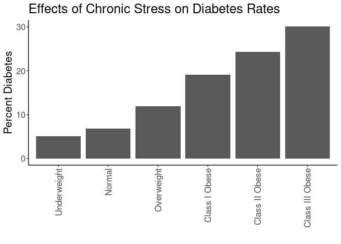
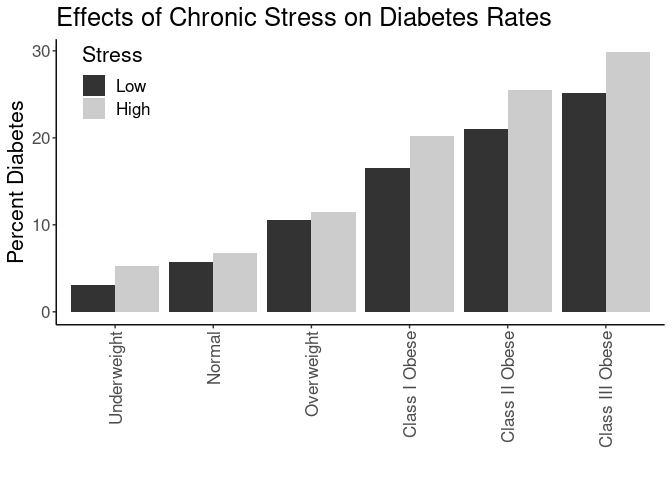
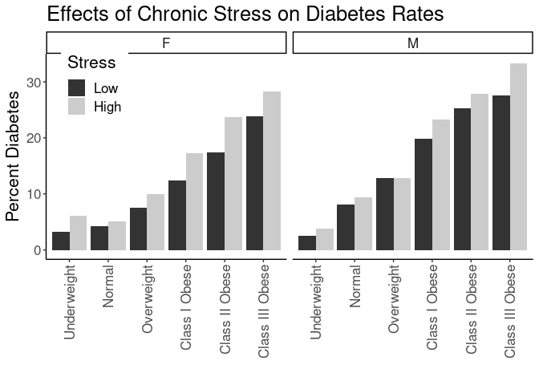
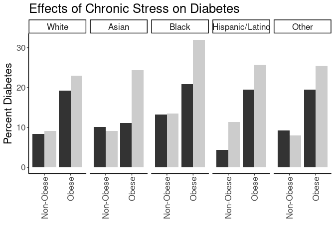

## Purpose

To test the effect modification of obesity on the stress-diabetes relationships.


```r
library(knitr)
#figures made will go to directory called figures, will make them as both png and pdf files 
opts_chunk$set(fig.path='figures/',
               echo=TRUE, warning=FALSE, message=FALSE,dev=c('png','pdf'))
options(scipen = 2, digits = 3)

library(readr)
library(dplyr)
```

```
## 
## Attaching package: 'dplyr'
```

```
## The following objects are masked from 'package:stats':
## 
##     filter, lag
```

```
## The following objects are masked from 'package:base':
## 
##     intersect, setdiff, setequal, union
```

```r
library(tidyr)

input.file <- 'data-combined.csv'
combined.data <- read_csv(input.file)
```

```
## Rows: 62010 Columns: 32
```

```
## ── Column specification ────────────────────────────────────────────────────────
## Delimiter: ","
## chr (16): DeID_PatientID, Gender, DeID_EncounterID, BMI_cat, BMI_cat.obese, ...
## dbl (16): age, Stress_d1, CardiacArrhythmias, ChronicPulmonaryDisease, Depre...
## 
## ℹ Use `spec()` to retrieve the full column specification for this data.
## ℹ Specify the column types or set `show_col_types = FALSE` to quiet this message.
```

Loaded in the cleaned data from data-combined.csv. This script can be found in /nfs/turbo/precision-health/DataDirect/HUM00219435 - Obesity as a modifier of chronic psy and was most recently run on Thu Mar  9 16:02:49 2023. This dataset has 62010 values.


```r
library(forcats)
combined.data <- 
  combined.data %>%
  mutate(BMI_cat= factor(BMI_cat, 
                         levels=c("Underweight",
                                  "Normal",
                                  "Overweight",
                                  'Class I Obese',
                                  'Class II Obese',
                                  'Class III Obese'))) %>%
  mutate(BMI_cat.obese= factor(BMI_cat.obese, 
                               levels=c("Underweight",
                                        "Normal",
                                        "Overweight",
                                        'Obese'))) %>%
  mutate(BMI_cat.Ob.NonOb= factor(BMI_cat.Ob.NonOb, 
                                  levels=c("Non-Obese",
                                           'Obese'))) %>%
  mutate(Stress=relevel(as.factor(High.Stress),ref="Low")) %>% #set low as reference value
    mutate(Race.Ethnicity=relevel(as.factor(Race.Ethnicity),ref="White")) %>% #set white as reference value
  mutate(Stress.quartile=fct_recode(as.factor(Stress.quartile),
                                    "Q1"="(-0.016,4]",
                                    "Q2"="(4,8]",
                                    "Q3"="(8,12]",
                                    "Q4"="(12,16]")) %>%
    mutate(Stress.quartile= factor(Stress.quartile, 
                                  levels=c("Q1","Q2","Q3","Q4"))) 
  
# need to clean race data
```

# Diabetes Rates by BMI

Stratified diagnoses by various BMI categories

## Diabetes by BMI Category


```r
#calculating diabetes rates by bmi category
with(combined.data, table(DiabetesAny,BMI_cat)) %>% 
  data.frame %>%
  pivot_wider(names_from=DiabetesAny,
              values_from = Freq) %>%
  rename(Diabetes=`1`,
         NonDiabetes=`0`) %>%
  mutate(Total=Diabetes+NonDiabetes) %>%
  mutate(Percent=Diabetes/Total*100) -> diabetes.bmi.counts

kable(diabetes.bmi.counts, caption="Diabetes rates by BMI category not including gender")
```


Table: Diabetes rates by BMI category not including gender

|BMI_cat         | NonDiabetes| Diabetes| Total| Percent|
|:---------------|-----------:|--------:|-----:|-------:|
|Underweight     |         468|       23|   491|    4.68|
|Normal          |       14173|     1050| 15223|    6.90|
|Overweight      |       17681|     2412| 20093|   12.00|
|Class I Obese   |       11155|     2622| 13777|   19.03|
|Class II Obese  |        5288|     1684|  6972|   24.15|
|Class III Obese |        3710|     1527|  5237|   29.16|

```r
library(ggplot2)

ggplot(diabetes.bmi.counts,
       aes(y=Percent,
           x=BMI_cat)) +
  geom_bar(stat='identity',position='dodge') +
  labs(y="Percent Diabetes",
       title="Effects of Chronic Stress on Diabetes Rates",
       x="") +
  theme_classic() +
  scale_fill_grey() +
  theme(text=element_text(size=16),
        axis.text.x=element_text(angle=90,vjust=0.5,hjust=1),
        legend.position = c(0.1,0.85))
```

<!-- -->

```r
#calculating diabetes rates by bmi category by gender
with(combined.data, table(DiabetesAny,BMI_cat,Gender)) %>% 
  data.frame %>%
  pivot_wider(names_from=DiabetesAny,
              values_from = Freq) %>%
  rename(Diabetes=`1`,
         NonDiabetes=`0`) %>%
  mutate(Total=Diabetes+NonDiabetes) %>%
  mutate(Percent=Diabetes/Total*100) -> diabetes.bmi.counts

kable(diabetes.bmi.counts, caption="Diabetes rates by BMI category")
```


Table: Diabetes rates by BMI category

|BMI_cat         |Gender | NonDiabetes| Diabetes| Total| Percent|
|:---------------|:------|-----------:|--------:|-----:|-------:|
|Underweight     |F      |         323|       17|   340|    5.00|
|Normal          |F      |        8799|      486|  9285|    5.23|
|Overweight      |F      |        8181|      881|  9062|    9.72|
|Class I Obese   |F      |        5462|     1037|  6499|   15.96|
|Class II Obese  |F      |        3070|      840|  3910|   21.48|
|Class III Obese |F      |        2581|      982|  3563|   27.56|
|Underweight     |M      |         145|        6|   151|    3.97|
|Normal          |M      |        5374|      564|  5938|    9.50|
|Overweight      |M      |        9500|     1531| 11031|   13.88|
|Class I Obese   |M      |        5693|     1585|  7278|   21.78|
|Class II Obese  |M      |        2218|      844|  3062|   27.56|
|Class III Obese |M      |        1129|      545|  1674|   32.56|

```r
ggplot(diabetes.bmi.counts,
       aes(y=Percent,
           x=BMI_cat)) +
  geom_bar(stat='identity',position='dodge') +
  labs(y="Percent Diabetes",
       title="Effects of Chronic Stress on Diabetes Rates",
       x="") +
  theme_classic() +
  scale_fill_grey() +
  facet_grid(.~Gender) +
  theme(text=element_text(size=16),
        axis.text.x=element_text(angle=90,vjust=0.5,hjust=1),
        legend.position = c(0.1,0.85))
```

<!-- -->

## Diabetes Rate by BMI and Stress

This analysis uses all the BMI categories


```r
#calculating diabetes rates by bmi category and stress
with(combined.data, table(DiabetesAny,BMI_cat,Stress)) %>% 
  data.frame %>%
  pivot_wider(names_from=DiabetesAny,
              values_from = Freq) %>%
  rename(Diabetes=`1`,
         NonDiabetes=`0`) %>%
  mutate(Total=Diabetes+NonDiabetes) %>%
  mutate(Percent=Diabetes/Total*100) -> diabetes.bmi.stress.counts

library(ggplot2)

kable(diabetes.bmi.stress.counts, caption="Diabetes rates by BMI category")
```


Table: Diabetes rates by BMI category

|BMI_cat         |Stress | NonDiabetes| Diabetes| Total| Percent|
|:---------------|:------|-----------:|--------:|-----:|-------:|
|Underweight     |Low    |         130|        2|   132|    1.51|
|Normal          |Low    |        5377|      345|  5722|    6.03|
|Overweight      |Low    |        6923|      810|  7733|   10.47|
|Class I Obese   |Low    |        4203|      843|  5046|   16.71|
|Class II Obese  |Low    |        1908|      531|  2439|   21.77|
|Class III Obese |Low    |        1318|      426|  1744|   24.43|
|Underweight     |High   |         141|        9|   150|    6.00|
|Normal          |High   |        3668|      264|  3932|    6.71|
|Overweight      |High   |        4570|      589|  5159|   11.42|
|Class I Obese   |High   |        3084|      746|  3830|   19.48|
|Class II Obese  |High   |        1521|      512|  2033|   25.18|
|Class III Obese |High   |        1145|      491|  1636|   30.01|

```r
ggplot(diabetes.bmi.stress.counts,
       aes(y=Percent,
           x=BMI_cat,
           fill=Stress)) +
  geom_bar(stat='identity',position='dodge') +
  labs(y="Percent Diabetes",
       title="Effects of Chronic Stress on Diabetes Rates",
       x="") +
  theme_classic() +
  scale_fill_grey() +
  theme(text=element_text(size=16),
        axis.text.x=element_text(angle=90,vjust=0.5,hjust=1),
        legend.position = c(0.1,0.85))
```

<!-- -->


```r
#calculating diabetes rates by bmi category and stress
with(combined.data, table(DiabetesAny,BMI_cat,Stress,Gender)) %>% 
  data.frame %>%
  pivot_wider(names_from=DiabetesAny,
              values_from = Freq) %>%
  rename(Diabetes=`1`,
         NonDiabetes=`0`) %>%
  mutate(Total=Diabetes+NonDiabetes) %>%
  mutate(Percent=Diabetes/Total*100) -> diabetes.bmi.stress.counts

library(ggplot2)

kable(diabetes.bmi.stress.counts, caption="Diabetes rates by BMI category")
```


Table: Diabetes rates by BMI category

|BMI_cat         |Stress |Gender | NonDiabetes| Diabetes| Total| Percent|
|:---------------|:------|:------|-----------:|--------:|-----:|-------:|
|Underweight     |Low    |F      |          92|        1|    93|    1.07|
|Normal          |Low    |F      |        3278|      153|  3431|    4.46|
|Overweight      |Low    |F      |        3076|      250|  3326|    7.52|
|Class I Obese   |Low    |F      |        1927|      281|  2208|   12.73|
|Class II Obese  |Low    |F      |        1076|      234|  1310|   17.86|
|Class III Obese |Low    |F      |         887|      275|  1162|   23.67|
|Underweight     |High   |F      |          91|        7|    98|    7.14|
|Normal          |High   |F      |        2289|      115|  2404|    4.78|
|Overweight      |High   |F      |        2227|      237|  2464|    9.62|
|Class I Obese   |High   |F      |        1636|      322|  1958|   16.45|
|Class II Obese  |High   |F      |         909|      270|  1179|   22.90|
|Class III Obese |High   |F      |         810|      324|  1134|   28.57|
|Underweight     |Low    |M      |          38|        1|    39|    2.56|
|Normal          |Low    |M      |        2099|      192|  2291|    8.38|
|Overweight      |Low    |M      |        3847|      560|  4407|   12.71|
|Class I Obese   |Low    |M      |        2276|      562|  2838|   19.80|
|Class II Obese  |Low    |M      |         832|      297|  1129|   26.31|
|Class III Obese |Low    |M      |         431|      151|   582|   25.95|
|Underweight     |High   |M      |          50|        2|    52|    3.85|
|Normal          |High   |M      |        1379|      149|  1528|    9.75|
|Overweight      |High   |M      |        2343|      352|  2695|   13.06|
|Class I Obese   |High   |M      |        1448|      424|  1872|   22.65|
|Class II Obese  |High   |M      |         612|      242|   854|   28.34|
|Class III Obese |High   |M      |         335|      167|   502|   33.27|

```r
ggplot(diabetes.bmi.stress.counts,
       aes(y=Percent,
           x=BMI_cat,
           fill=Stress)) +
  geom_bar(stat='identity',position='dodge') +
  labs(y="Percent Diabetes",
       title="Effects of Chronic Stress on Diabetes Rates",
       x="") +
  theme_classic() +
  scale_fill_grey() +
  facet_grid(.~Gender) +
  theme(text=element_text(size=16),
        axis.text.x=element_text(angle=90,vjust=0.5,hjust=1),
        legend.position = c(0.1,0.85))
```

<!-- -->

### Logistic Regressions for All Obese Categories

Ran a series of stepwise logistic regressions testing for obesity as a modifier of the effects of stress.


```r
library(broom)
glm(DiabetesAny~BMI_cat, 
    family="binomial",
    data=combined.data) -> obesity.glm1

obesity.glm1 %>%
  tidy() %>%
  kable(caption="Logistic regression of obesity on diabetes", digits =c(0,2,3,2,99))
```


Table: Logistic regression of obesity on diabetes

|term                   | estimate| std.error| statistic|  p.value|
|:----------------------|--------:|---------:|---------:|--------:|
|(Intercept)            |    -3.01|     0.214|    -14.11| 3.37e-45|
|BMI_catNormal          |     0.41|     0.216|      1.90| 5.73e-02|
|BMI_catOverweight      |     1.02|     0.215|      4.76| 1.97e-06|
|BMI_catClass I Obese   |     1.57|     0.215|      7.29| 3.08e-13|
|BMI_catClass II Obese  |     1.87|     0.215|      8.68| 4.09e-18|
|BMI_catClass III Obese |     2.13|     0.216|      9.85| 6.70e-23|

```r
anova(obesity.glm1,test="Chisq") %>% tidy %>%
  kable(caption="Logistic regression of obesity on diabetes, ", digits =c(0,0,0,0,0,99))
```


Table: Logistic regression of obesity on diabetes, 

|term    | df| Deviance| Resid..Df| Resid..Dev| p.value|
|:-------|--:|--------:|---------:|----------:|-------:|
|NULL    | NA|       NA|     61792|      52411|      NA|
|BMI_cat |  5|     2395|     61787|      50016|       0|

```r
#adding in stress as a modifier
glm(DiabetesAny~BMI_cat+Stress+Stress:BMI_cat, 
    family="binomial",
    data=combined.data) -> obesity.glm2

obesity.glm2 %>%
  tidy() %>%
  kable(caption="Logistic regression of obesity on diabetes, with stress as a modifier", digits =c(0,2,3,2,99))
```


Table: Logistic regression of obesity on diabetes, with stress as a modifier

|term                              | estimate| std.error| statistic|  p.value|
|:---------------------------------|--------:|---------:|---------:|--------:|
|(Intercept)                       |    -4.17|     0.712|     -5.86| 4.61e-09|
|BMI_catNormal                     |     1.43|     0.714|      2.00| 4.56e-02|
|BMI_catOverweight                 |     2.03|     0.713|      2.84| 4.45e-03|
|BMI_catClass I Obese              |     2.57|     0.713|      3.60| 3.18e-04|
|BMI_catClass II Obese             |     2.90|     0.714|      4.06| 5.01e-05|
|BMI_catClass III Obese            |     3.04|     0.714|      4.26| 2.03e-05|
|StressHigh                        |     1.42|     0.791|      1.80| 7.20e-02|
|BMI_catNormal:StressHigh          |    -1.31|     0.795|     -1.64| 1.00e-01|
|BMI_catOverweight:StressHigh      |    -1.33|     0.793|     -1.67| 9.45e-02|
|BMI_catClass I Obese:StressHigh   |    -1.24|     0.793|     -1.56| 1.19e-01|
|BMI_catClass II Obese:StressHigh  |    -1.23|     0.794|     -1.55| 1.21e-01|
|BMI_catClass III Obese:StressHigh |    -1.14|     0.795|     -1.43| 1.51e-01|

```r
anova(obesity.glm2,test="Chisq") %>% tidy %>%
  kable(caption="Logistic regression of obese vs non-obese on diabetes, with stress as a modifier", digits =c(0,0,0,0,0,99))
```


Table: Logistic regression of obese vs non-obese on diabetes, with stress as a modifier

|term           | df| Deviance| Resid..Df| Resid..Dev|  p.value|
|:--------------|--:|--------:|---------:|----------:|--------:|
|NULL           | NA|       NA|     39555|      32147|       NA|
|BMI_cat        |  5|     1504|     39550|      30643| 0.00e+00|
|Stress         |  1|       33|     39549|      30610| 8.48e-09|
|BMI_cat:Stress |  5|        7|     39544|      30602| 1.88e-01|

```r
#adding in age and gender as covariates as a modifier
glm(DiabetesAny~BMI_cat+Stress+Stress:BMI_cat+Gender+age, 
    family="binomial",
    data=combined.data) -> obesity.glm3

obesity.glm3 %>%
  tidy() %>%
  kable(caption="Logistic regression of obesity on diabetes, with stress as a modifier and age and  gender as covarites", digits =c(0,2,3,2,99))
```


Table: Logistic regression of obesity on diabetes, with stress as a modifier and age and  gender as covarites

|term                              | estimate| std.error| statistic|  p.value|
|:---------------------------------|--------:|---------:|---------:|--------:|
|(Intercept)                       |    -6.54|     0.718|     -9.10| 8.94e-20|
|BMI_catNormal                     |     1.35|     0.717|      1.88| 6.07e-02|
|BMI_catOverweight                 |     1.74|     0.716|      2.43| 1.53e-02|
|BMI_catClass I Obese              |     2.32|     0.716|      3.23| 1.23e-03|
|BMI_catClass II Obese             |     2.76|     0.717|      3.85| 1.20e-04|
|BMI_catClass III Obese            |     3.09|     0.718|      4.31| 1.67e-05|
|StressHigh                        |     1.50|     0.796|      1.88| 5.97e-02|
|GenderM                           |     0.31|     0.031|      9.92| 3.43e-23|
|age                               |     0.04|     0.001|     37.16| 0.00e+00|
|BMI_catNormal:StressHigh          |    -1.32|     0.801|     -1.64| 1.00e-01|
|BMI_catOverweight:StressHigh      |    -1.30|     0.798|     -1.62| 1.04e-01|
|BMI_catClass I Obese:StressHigh   |    -1.20|     0.798|     -1.51| 1.31e-01|
|BMI_catClass II Obese:StressHigh  |    -1.20|     0.799|     -1.51| 1.32e-01|
|BMI_catClass III Obese:StressHigh |    -1.10|     0.800|     -1.37| 1.70e-01|

```r
anova(obesity.glm3,test="Chisq") %>% tidy %>%
  kable(caption="Logistic regression of obesity on diabetes, with stress as a modifier and age and gender as covarite", digits =c(0,0,0,0,0,99))
```


Table: Logistic regression of obesity on diabetes, with stress as a modifier and age and gender as covarite

|term           | df| Deviance| Resid..Df| Resid..Dev|  p.value|
|:--------------|--:|--------:|---------:|----------:|--------:|
|NULL           | NA|       NA|     39555|      32147|       NA|
|BMI_cat        |  5|     1504|     39550|      30643| 0.00e+00|
|Stress         |  1|       33|     39549|      30610| 8.48e-09|
|Gender         |  1|      219|     39548|      30391| 1.50e-49|
|age            |  1|     1573|     39547|      28818| 0.00e+00|
|BMI_cat:Stress |  5|        8|     39542|      28810| 1.43e-01|

```r
#adding in race and ethnicity
glm(DiabetesAny~BMI_cat+Stress+Stress:BMI_cat+Gender+age+Race.Ethnicity, 
    family="binomial",
    data=combined.data) -> obesity.glm4

obesity.glm4 %>%
  tidy() %>%
  kable(caption="Logistic regression of obesity on diabetes, with stress as a modifier and age, gender and race as covarites", digits =c(0,2,3,2,99))
```


Table: Logistic regression of obesity on diabetes, with stress as a modifier and age, gender and race as covarites

|term                              | estimate| std.error| statistic|  p.value|
|:---------------------------------|--------:|---------:|---------:|--------:|
|(Intercept)                       |    -6.68|     0.719|     -9.30| 1.47e-20|
|BMI_catNormal                     |     1.34|     0.717|      1.86| 6.26e-02|
|BMI_catOverweight                 |     1.73|     0.716|      2.42| 1.56e-02|
|BMI_catClass I Obese              |     2.31|     0.716|      3.22| 1.26e-03|
|BMI_catClass II Obese             |     2.76|     0.717|      3.84| 1.21e-04|
|BMI_catClass III Obese            |     3.08|     0.718|      4.29| 1.77e-05|
|StressHigh                        |     1.50|     0.796|      1.88| 5.97e-02|
|GenderM                           |     0.32|     0.031|     10.17| 2.60e-24|
|age                               |     0.04|     0.001|     38.00| 0.00e+00|
|Race.EthnicityAsian               |     0.74|     0.140|      5.31| 1.10e-07|
|Race.EthnicityBlack               |     0.64|     0.065|      9.75| 1.81e-22|
|Race.EthnicityHispanic/Latino     |     0.34|     0.112|      2.98| 2.84e-03|
|Race.EthnicityOther               |     0.07|     0.087|      0.81| 4.17e-01|
|BMI_catNormal:StressHigh          |    -1.32|     0.801|     -1.64| 1.00e-01|
|BMI_catOverweight:StressHigh      |    -1.30|     0.798|     -1.63| 1.03e-01|
|BMI_catClass I Obese:StressHigh   |    -1.21|     0.798|     -1.52| 1.29e-01|
|BMI_catClass II Obese:StressHigh  |    -1.21|     0.799|     -1.52| 1.29e-01|
|BMI_catClass III Obese:StressHigh |    -1.10|     0.800|     -1.38| 1.69e-01|

```r
anova(obesity.glm4,test="Chisq") %>% tidy %>%
  kable(caption="Logistic regression of obesity on diabetes, with stress as a modifier and age, gender and race as covarite", digits =c(0,0,0,0,0,99))
```


Table: Logistic regression of obesity on diabetes, with stress as a modifier and age, gender and race as covarite

|term           | df| Deviance| Resid..Df| Resid..Dev|  p.value|
|:--------------|--:|--------:|---------:|----------:|--------:|
|NULL           | NA|       NA|     39555|      32147|       NA|
|BMI_cat        |  5|     1504|     39550|      30643| 0.00e+00|
|Stress         |  1|       33|     39549|      30610| 8.48e-09|
|Gender         |  1|      219|     39548|      30391| 1.50e-49|
|age            |  1|     1573|     39547|      28818| 0.00e+00|
|Race.Ethnicity |  4|      115|     39543|      28703| 6.78e-24|
|BMI_cat:Stress |  5|        8|     39538|      28695| 1.41e-01|

### Diabetes Rates by Quartiles


```r
with(combined.data, table(DiabetesAny,BMI_cat.obese,Stress.quartile,Gender)) %>% 
  data.frame %>%
  pivot_wider(names_from=DiabetesAny,
              values_from = Freq) %>%
  rename(Diabetes=`1`,
         NonDiabetes=`0`) %>%
  mutate(Total=Diabetes+NonDiabetes) %>%
  mutate(Percent=Diabetes/Total*100) -> diabetes.bmi.stress.quartile.counts

kable(diabetes.bmi.stress.quartile.counts, caption="Diabetes Rates by BMI and Stress Quartile")
```


Table: Diabetes Rates by BMI and Stress Quartile

|BMI_cat.obese |Stress.quartile |Gender | NonDiabetes| Diabetes| Total| Percent|
|:-------------|:---------------|:------|-----------:|--------:|-----:|-------:|
|Underweight   |Q1              |F      |          72|        1|    73|    1.37|
|Normal        |Q1              |F      |        2745|      126|  2871|    4.39|
|Overweight    |Q1              |F      |        2580|      205|  2785|    7.36|
|Obese         |Q1              |F      |        3240|      639|  3879|   16.47|
|Underweight   |Q2              |F      |          78|        5|    83|    6.02|
|Normal        |Q2              |F      |        2120|      110|  2230|    4.93|
|Overweight    |Q2              |F      |        2039|      204|  2243|    9.10|
|Obese         |Q2              |F      |        2878|      744|  3622|   20.54|
|Underweight   |Q3              |F      |          30|        2|    32|    6.25|
|Normal        |Q3              |F      |         628|       29|   657|    4.41|
|Overweight    |Q3              |F      |         612|       69|   681|   10.13|
|Obese         |Q3              |F      |        1012|      291|  1303|   22.33|
|Underweight   |Q4              |F      |           3|        0|     3|    0.00|
|Normal        |Q4              |F      |          74|        3|    77|    3.90|
|Overweight    |Q4              |F      |          72|        9|    81|   11.11|
|Obese         |Q4              |F      |         115|       32|   147|   21.77|
|Underweight   |Q1              |M      |          27|        1|    28|    3.57|
|Normal        |Q1              |M      |        1799|      168|  1967|    8.54|
|Overweight    |Q1              |M      |        3316|      474|  3790|   12.51|
|Obese         |Q1              |M      |        3010|      859|  3869|   22.20|
|Underweight   |Q2              |M      |          45|        1|    46|    2.17|
|Normal        |Q2              |M      |        1314|      121|  1435|    8.43|
|Overweight    |Q2              |M      |        2331|      348|  2679|   12.99|
|Obese         |Q2              |M      |        2256|      751|  3007|   24.98|
|Underweight   |Q3              |M      |          14|        1|    15|    6.67|
|Normal        |Q3              |M      |         327|       42|   369|   11.38|
|Overweight    |Q3              |M      |         497|       84|   581|   14.46|
|Obese         |Q3              |M      |         602|      209|   811|   25.77|
|Underweight   |Q4              |M      |           2|        0|     2|    0.00|
|Normal        |Q4              |M      |          38|       10|    48|   20.83|
|Overweight    |Q4              |M      |          46|        6|    52|   11.54|
|Obese         |Q4              |M      |          66|       24|    90|   26.67|

```r
ggplot(diabetes.bmi.stress.quartile.counts,
       aes(y=Percent,
           x=BMI_cat.obese,
           fill=Stress.quartile)) +
  geom_bar(stat='identity',position='dodge') +
  labs(y="Percent Diabetes",
       title="Effects of Chronic Stress on Diabetes",
       x="") +
  theme_classic() +
  facet_grid(.~Gender) +
  theme(text=element_text(size=16),
        axis.text.x=element_text(angle=90,vjust=0.5,hjust=1),
        legend.position = c(0.15,0.75))
```

<!-- -->

## Diabetes Rates by Normal Obesity and Stress


```r
#calculating diabetes rates by bmi category, stress and gender
with(combined.data, table(DiabetesAny,BMI_cat.obese,Stress,Gender)) %>% 
  data.frame %>%
  pivot_wider(names_from=DiabetesAny,
              values_from = Freq) %>%
  rename(Diabetes=`1`,
         NonDiabetes=`0`) %>%
  mutate(Total=Diabetes+NonDiabetes) %>%
  mutate(Percent=Diabetes/Total*100) -> diabetes.bmi.stress.gender.counts

kable(diabetes.bmi.stress.gender.counts, caption="Diabetes Rates by BMI and Stress")
```


Table: Diabetes Rates by BMI and Stress

|BMI_cat.obese |Stress |Gender | NonDiabetes| Diabetes| Total| Percent|
|:-------------|:------|:------|-----------:|--------:|-----:|-------:|
|Underweight   |Low    |F      |          92|        1|    93|    1.07|
|Normal        |Low    |F      |        3278|      153|  3431|    4.46|
|Overweight    |Low    |F      |        3076|      250|  3326|    7.52|
|Obese         |Low    |F      |        3890|      790|  4680|   16.88|
|Underweight   |High   |F      |          91|        7|    98|    7.14|
|Normal        |High   |F      |        2289|      115|  2404|    4.78|
|Overweight    |High   |F      |        2227|      237|  2464|    9.62|
|Obese         |High   |F      |        3355|      916|  4271|   21.45|
|Underweight   |Low    |M      |          38|        1|    39|    2.56|
|Normal        |Low    |M      |        2099|      192|  2291|    8.38|
|Overweight    |Low    |M      |        3847|      560|  4407|   12.71|
|Obese         |Low    |M      |        3539|     1010|  4549|   22.20|
|Underweight   |High   |M      |          50|        2|    52|    3.85|
|Normal        |High   |M      |        1379|      149|  1528|    9.75|
|Overweight    |High   |M      |        2343|      352|  2695|   13.06|
|Obese         |High   |M      |        2395|      833|  3228|   25.80|

```r
ggplot(diabetes.bmi.stress.gender.counts,
       aes(y=Percent,
           x=BMI_cat.obese,
           fill=Stress)) +
  geom_bar(stat='identity',position='dodge') +
  labs(y="Percent Diabetes",
       title="Effects of Chronic Stress on Diabetes",
       x="") +
  facet_grid(.~Gender) +
  theme_classic() +
  scale_fill_grey() +
  theme(text=element_text(size=16),
        axis.text.x=element_text(angle=90,vjust=0.5,hjust=1),
        legend.position = c(0.1,0.75))
```

<!-- -->

## Logistic Regressions for Obese/Non-Obese

Ran a series of logistic regressions using the normal obesity categories not classes as the categorization


```r
glm(DiabetesAny~BMI_cat.obese, 
    family="binomial",
    data=combined.data) -> obesity.glm1

obesity.glm1 %>%
  tidy() %>%
  kable(caption="Logistic regression of obese vs non-obese on diabetes", digits =c(0,2,3,2,99))
```


Table: Logistic regression of obese vs non-obese on diabetes

|term                    | estimate| std.error| statistic|  p.value|
|:-----------------------|--------:|---------:|---------:|--------:|
|(Intercept)             |    -3.01|     0.214|    -14.11| 3.37e-45|
|BMI_cat.obeseNormal     |     0.41|     0.216|      1.90| 5.73e-02|
|BMI_cat.obeseOverweight |     1.02|     0.215|      4.76| 1.97e-06|
|BMI_cat.obeseObese      |     1.77|     0.214|      8.28| 1.20e-16|

```r
anova(obesity.glm1,test="Chisq") %>% tidy %>%
  kable(caption="Logistic regression of obesity on diabetes, ", digits =c(0,0,0,0,0,99))
```


Table: Logistic regression of obesity on diabetes, 

|term          | df| Deviance| Resid..Df| Resid..Dev| p.value|
|:-------------|--:|--------:|---------:|----------:|-------:|
|NULL          | NA|       NA|     61792|      52411|      NA|
|BMI_cat.obese |  3|     2160|     61789|      50251|       0|

```r
#adding in stress as a modifier
glm(DiabetesAny~BMI_cat.obese+Stress+Stress:BMI_cat.obese, 
    family="binomial",
    data=combined.data) -> obesity.glm2

obesity.glm2 %>%
  tidy() %>%
  kable(caption="Logistic regression of obesity on diabetes, with stress as a modifier", digits =c(0,2,3,2,99))
```


Table: Logistic regression of obesity on diabetes, with stress as a modifier

|term                               | estimate| std.error| statistic|  p.value|
|:----------------------------------|--------:|---------:|---------:|--------:|
|(Intercept)                        |    -4.17|     0.712|     -5.86| 4.61e-09|
|BMI_cat.obeseNormal                |     1.43|     0.714|      2.00| 4.56e-02|
|BMI_cat.obeseOverweight            |     2.03|     0.713|      2.84| 4.45e-03|
|BMI_cat.obeseObese                 |     2.76|     0.713|      3.87| 1.10e-04|
|StressHigh                         |     1.42|     0.791|      1.80| 7.20e-02|
|BMI_cat.obeseNormal:StressHigh     |    -1.31|     0.795|     -1.64| 1.00e-01|
|BMI_cat.obeseOverweight:StressHigh |    -1.33|     0.793|     -1.67| 9.45e-02|
|BMI_cat.obeseObese:StressHigh      |    -1.20|     0.792|     -1.51| 1.31e-01|

```r
anova(obesity.glm2,test="Chisq") %>% tidy %>%
  kable(caption="Logistic regression of obesity on diabetes, with stress as a modifier", digits =c(0,0,0,0,0,99))
```


Table: Logistic regression of obesity on diabetes, with stress as a modifier

|term                 | df| Deviance| Resid..Df| Resid..Dev|  p.value|
|:--------------------|--:|--------:|---------:|----------:|--------:|
|NULL                 | NA|       NA|     39555|      32147|       NA|
|BMI_cat.obese        |  3|     1365|     39552|      30782| 0.00e+00|
|Stress               |  1|       37|     39551|      30744| 9.50e-10|
|BMI_cat.obese:Stress |  3|        7|     39548|      30737| 6.19e-02|

```r
#adding in age and gender as covariates as a modifier
glm(DiabetesAny~BMI_cat.obese+Stress+Stress:BMI_cat.obese+Gender+age, 
    family="binomial",
    data=combined.data) -> obesity.glm3

obesity.glm3 %>%
  tidy() %>%
  kable(caption="Logistic regression of obesity on diabetes, with stress as a modifier and age and  gender as covarites", digits =c(0,2,3,2,99))
```


Table: Logistic regression of obesity on diabetes, with stress as a modifier and age and  gender as covarites

|term                               | estimate| std.error| statistic|  p.value|
|:----------------------------------|--------:|---------:|---------:|--------:|
|(Intercept)                        |    -6.40|     0.718|     -8.91| 4.91e-19|
|BMI_cat.obeseNormal                |     1.36|     0.717|      1.89| 5.83e-02|
|BMI_cat.obeseOverweight            |     1.76|     0.716|      2.46| 1.37e-02|
|BMI_cat.obeseObese                 |     2.60|     0.715|      3.64| 2.75e-04|
|StressHigh                         |     1.50|     0.795|      1.88| 5.99e-02|
|GenderM                            |     0.25|     0.031|      8.01| 1.15e-15|
|age                                |     0.04|     0.001|     36.05| 0.00e+00|
|BMI_cat.obeseNormal:StressHigh     |    -1.32|     0.800|     -1.65| 9.95e-02|
|BMI_cat.obeseOverweight:StressHigh |    -1.30|     0.798|     -1.63| 1.03e-01|
|BMI_cat.obeseObese:StressHigh      |    -1.16|     0.796|     -1.46| 1.45e-01|

```r
anova(obesity.glm3,test="Chisq") %>% tidy %>%
  kable(caption="Logistic regression of obesity on diabetes, with stress as a modifier and age and gender as covarite", digits =c(0,0,0,0,0,99))
```


Table: Logistic regression of obesity on diabetes, with stress as a modifier and age and gender as covarite

|term                 | df| Deviance| Resid..Df| Resid..Dev|  p.value|
|:--------------------|--:|--------:|---------:|----------:|--------:|
|NULL                 | NA|       NA|     39555|      32147|       NA|
|BMI_cat.obese        |  3|     1365|     39552|      30782| 0.00e+00|
|Stress               |  1|       37|     39551|      30744| 9.50e-10|
|Gender               |  1|      174|     39550|      30571| 1.15e-39|
|age                  |  1|     1467|     39549|      29104| 0.00e+00|
|BMI_cat.obese:Stress |  3|        8|     39546|      29096| 3.71e-02|

```r
#adding in race and ethnicity
glm(DiabetesAny~BMI_cat.obese+Stress+Stress:BMI_cat.obese+Gender+age+Race.Ethnicity, 
    family="binomial",
    data=combined.data) -> obesity.glm4

obesity.glm4 %>%
  tidy() %>%
  kable(caption="Logistic regression of obesity on diabetes, with stress as a modifier and age, gender and race as covarites", digits =c(0,2,3,2,99))
```


Table: Logistic regression of obesity on diabetes, with stress as a modifier and age, gender and race as covarites

|term                               | estimate| std.error| statistic|  p.value|
|:----------------------------------|--------:|---------:|---------:|--------:|
|(Intercept)                        |    -6.54|     0.718|     -9.10| 8.73e-20|
|BMI_cat.obeseNormal                |     1.35|     0.717|      1.88| 6.03e-02|
|BMI_cat.obeseOverweight            |     1.76|     0.716|      2.45| 1.42e-02|
|BMI_cat.obeseObese                 |     2.59|     0.715|      3.63| 2.89e-04|
|StressHigh                         |     1.50|     0.795|      1.88| 6.01e-02|
|GenderM                            |     0.25|     0.031|      8.28| 1.25e-16|
|age                                |     0.04|     0.001|     36.91| 0.00e+00|
|Race.EthnicityAsian                |     0.68|     0.139|      4.85| 1.23e-06|
|Race.EthnicityBlack                |     0.66|     0.065|     10.14| 3.52e-24|
|Race.EthnicityHispanic/Latino      |     0.32|     0.112|      2.83| 4.70e-03|
|Race.EthnicityOther                |     0.08|     0.087|      0.91| 3.62e-01|
|BMI_cat.obeseNormal:StressHigh     |    -1.32|     0.800|     -1.65| 9.96e-02|
|BMI_cat.obeseOverweight:StressHigh |    -1.31|     0.798|     -1.64| 1.01e-01|
|BMI_cat.obeseObese:StressHigh      |    -1.16|     0.796|     -1.46| 1.44e-01|

```r
anova(obesity.glm4,test="Chisq") %>% tidy %>%
  kable(caption="Logistic regression of obesity on diabetes, with stress as a modifier and age, gender and race as covariates", digits =c(0,0,0,0,0,99))
```


Table: Logistic regression of obesity on diabetes, with stress as a modifier and age, gender and race as covariates

|term                 | df| Deviance| Resid..Df| Resid..Dev|  p.value|
|:--------------------|--:|--------:|---------:|----------:|--------:|
|NULL                 | NA|       NA|     39555|      32147|       NA|
|BMI_cat.obese        |  3|     1365|     39552|      30782| 0.00e+00|
|Stress               |  1|       37|     39551|      30744| 9.50e-10|
|Gender               |  1|      174|     39550|      30571| 1.15e-39|
|age                  |  1|     1467|     39549|      29104| 0.00e+00|
|Race.Ethnicity       |  4|      117|     39545|      28987| 2.11e-24|
|BMI_cat.obese:Stress |  3|        8|     39542|      28979| 3.83e-02|

# Diabetes Rates by Obese/Not Obese and Stress


```r
with(combined.data, table(DiabetesAny,BMI_cat.Ob.NonOb,Stress)) %>% 
  data.frame %>%
  pivot_wider(names_from=DiabetesAny,
              values_from = Freq) %>%
  rename(Diabetes=`1`,
         NonDiabetes=`0`) %>%
  mutate(Total=Diabetes+NonDiabetes) %>%
  mutate(Percent=Diabetes/Total*100) -> diabetes.BMI_cat.Ob.NonOb.stress.counts

kable(diabetes.BMI_cat.Ob.NonOb.stress.counts, caption="Diabetes Rates by Obese or not and Stress")
```


Table: Diabetes Rates by Obese or not and Stress

|BMI_cat.Ob.NonOb |Stress | NonDiabetes| Diabetes| Total| Percent|
|:----------------|:------|-----------:|--------:|-----:|-------:|
|Non-Obese        |Low    |       12501|     1161| 13662|     8.5|
|Obese            |Low    |        7429|     1800|  9229|    19.5|
|Non-Obese        |High   |        8436|      865|  9301|     9.3|
|Obese            |High   |        5750|     1749|  7499|    23.3|

```r
ggplot(diabetes.BMI_cat.Ob.NonOb.stress.counts,
       aes(y=Percent,
           x=BMI_cat.Ob.NonOb,
           fill=Stress)) +
  geom_bar(stat='identity',position='dodge') +
  labs(y="Percent Diabetes",
       title="Effects of Chronic Stress on Diabetes",
       x="") +
  theme_classic() +
  scale_fill_grey() +
  theme(text=element_text(size=16),
        axis.text.x=element_text(angle=90,vjust=0.5,hjust=1),
        legend.position = c(0.1,0.75))
```

<!-- -->


```r
with(combined.data, table(DiabetesAny,BMI_cat.Ob.NonOb,Stress,Gender)) %>% 
  data.frame %>%
  pivot_wider(names_from=DiabetesAny,
              values_from = Freq) %>%
  rename(Diabetes=`1`,
         NonDiabetes=`0`) %>%
  mutate(Total=Diabetes+NonDiabetes) %>%
  mutate(Percent=Diabetes/Total*100) -> diabetes.BMI_cat.Ob.NonOb.stress.counts

kable(diabetes.BMI_cat.Ob.NonOb.stress.counts, caption="Diabetes Rates by Obese or not and Stress")
```


Table: Diabetes Rates by Obese or not and Stress

|BMI_cat.Ob.NonOb |Stress |Gender | NonDiabetes| Diabetes| Total| Percent|
|:----------------|:------|:------|-----------:|--------:|-----:|-------:|
|Non-Obese        |Low    |F      |        6498|      408|  6906|    5.91|
|Obese            |Low    |F      |        3890|      790|  4680|   16.88|
|Non-Obese        |High   |F      |        4646|      360|  5006|    7.19|
|Obese            |High   |F      |        3355|      916|  4271|   21.45|
|Non-Obese        |Low    |M      |        6003|      753|  6756|   11.15|
|Obese            |Low    |M      |        3539|     1010|  4549|   22.20|
|Non-Obese        |High   |M      |        3790|      505|  4295|   11.76|
|Obese            |High   |M      |        2395|      833|  3228|   25.80|

```r
ggplot(diabetes.BMI_cat.Ob.NonOb.stress.counts,
       aes(y=Percent,
           x=BMI_cat.Ob.NonOb,
           fill=Stress)) +
  geom_bar(stat='identity',position='dodge') +
  labs(y="Percent Diabetes",
       title="Effects of Chronic Stress on Diabetes",
       x="") +
  facet_grid(.~Gender) +
  theme_classic() +
  scale_fill_grey() +
  theme(text=element_text(size=16),
        axis.text.x=element_text(angle=90,vjust=0.5,hjust=1),
        legend.position = c(0.1,0.75))
```

<!-- -->


```r
with(combined.data, table(DiabetesAny,BMI_cat.Ob.NonOb,Stress,Race.Ethnicity)) %>% 
  data.frame %>%
  pivot_wider(names_from=DiabetesAny,
              values_from = Freq) %>%
  rename(Diabetes=`1`,
         NonDiabetes=`0`) %>%
  mutate(Total=Diabetes+NonDiabetes) %>%
  mutate(Percent=Diabetes/Total*100) -> diabetes.BMI_cat.Ob.NonOb.stress.counts

ggplot(diabetes.BMI_cat.Ob.NonOb.stress.counts,
       aes(y=Percent,
           x=BMI_cat.Ob.NonOb,
           fill=Stress)) +
  geom_bar(stat='identity',position='dodge') +
  labs(y="Percent Diabetes",
       title="Effects of Chronic Stress on Diabetes",
       x="") +
  facet_grid(.~Race.Ethnicity) +
  theme_classic() +
  scale_fill_grey() +
  theme(text=element_text(size=16),
        axis.text.x=element_text(angle=90,vjust=0.5,hjust=1),
        legend.position = "none")
```

<!-- -->

## Logistic Regressions for Obese/Non-Obese

Ran a series of logistic regressions using obese/non-obese as the categorization


```r
glm(DiabetesAny~BMI_cat.Ob.NonOb, 
    family="binomial",
    data=combined.data) -> obesity.glm1

obesity.glm1 %>%
  tidy() %>%
  kable(caption="Logistic regression of obese vs non-obese on diabetes", digits =c(0,2,3,2,99))
```


Table: Logistic regression of obese vs non-obese on diabetes

|term                  | estimate| std.error| statistic| p.value|
|:---------------------|--------:|---------:|---------:|-------:|
|(Intercept)           |    -2.23|     0.018|    -125.3|       0|
|BMI_cat.Ob.NonObObese |     0.99|     0.023|      42.7|       0|

```r
anova(obesity.glm1,test="Chisq") %>% tidy %>%
  kable(caption="Logistic regression of obese vs non-obese on diabetes, ", digits =c(0,0,0,0,0,99))
```


Table: Logistic regression of obese vs non-obese on diabetes, 

|term             | df| Deviance| Resid..Df| Resid..Dev| p.value|
|:----------------|--:|--------:|---------:|----------:|-------:|
|NULL             | NA|       NA|     62009|      52534|      NA|
|BMI_cat.Ob.NonOb |  1|     1890|     62008|      50644|       0|

```r
#adding in stress as a modifier
glm(DiabetesAny~BMI_cat.Ob.NonOb+Stress+Stress:BMI_cat.Ob.NonOb, 
    family="binomial",
    data=combined.data) -> obesity.glm2

obesity.glm2 %>%
  tidy() %>%
  kable(caption="Logistic regression of obese vs non-obese on diabetes, with stress as a modifier", digits =c(0,2,3,2,99))
```


Table: Logistic regression of obese vs non-obese on diabetes, with stress as a modifier

|term                             | estimate| std.error| statistic| p.value|
|:--------------------------------|--------:|---------:|---------:|-------:|
|(Intercept)                      |    -2.38|     0.031|    -77.46|  0.0000|
|BMI_cat.Ob.NonObObese            |     0.96|     0.040|     23.74|  0.0000|
|StressHigh                       |     0.10|     0.047|      2.10|  0.0355|
|BMI_cat.Ob.NonObObese:StressHigh |     0.13|     0.060|      2.13|  0.0335|

```r
anova(obesity.glm2,test="Chisq") %>% tidy %>%
  kable(caption="Logistic regression of obese vs non-obese on diabetes, with stress as a modifier", digits =c(0,0,0,0,0,99))
```


Table: Logistic regression of obese vs non-obese on diabetes, with stress as a modifier

|term                    | df| Deviance| Resid..Df| Resid..Dev|  p.value|
|:-----------------------|--:|--------:|---------:|----------:|--------:|
|NULL                    | NA|       NA|     39690|      32213|       NA|
|BMI_cat.Ob.NonOb        |  1|     1218|     39689|      30995| 0.00e+00|
|Stress                  |  1|       36|     39688|      30960| 2.12e-09|
|BMI_cat.Ob.NonOb:Stress |  1|        5|     39687|      30955| 3.34e-02|

```r
#adding in age and gender as covariates as a modifier
glm(DiabetesAny~BMI_cat.Ob.NonOb+Stress+Stress:BMI_cat.Ob.NonOb+Gender+age, 
    family="binomial",
    data=combined.data) -> obesity.glm3

obesity.glm3 %>%
  tidy() %>%
  kable(caption="Logistic regression of obese vs non-obese on diabetes, with stress as a modifier and age and  gender as covarites", digits =c(0,2,3,2,99))
```


Table: Logistic regression of obese vs non-obese on diabetes, with stress as a modifier and age and  gender as covarites

|term                             | estimate| std.error| statistic|  p.value|
|:--------------------------------|--------:|---------:|---------:|--------:|
|(Intercept)                      |    -4.82|     0.074|    -64.73| 0.00e+00|
|BMI_cat.Ob.NonObObese            |     0.99|     0.041|     23.90| 0.00e+00|
|StressHigh                       |     0.19|     0.048|      3.87| 1.07e-04|
|GenderM                          |     0.27|     0.030|      8.92| 4.74e-19|
|age                              |     0.04|     0.001|     36.59| 0.00e+00|
|BMI_cat.Ob.NonObObese:StressHigh |     0.15|     0.062|      2.47| 1.35e-02|

```r
anova(obesity.glm3,test="Chisq") %>% tidy %>%
  kable(caption="Logistic regression of obese vs non-obese on diabetes, with stress as a modifier and age and gender as covarite", digits =c(0,0,0,0,0,99))
```


Table: Logistic regression of obese vs non-obese on diabetes, with stress as a modifier and age and gender as covarite

|term                    | df| Deviance| Resid..Df| Resid..Dev|  p.value|
|:-----------------------|--:|--------:|---------:|----------:|--------:|
|NULL                    | NA|       NA|     39690|      32213|       NA|
|BMI_cat.Ob.NonOb        |  1|     1218|     39689|      30995| 0.00e+00|
|Stress                  |  1|       36|     39688|      30960| 2.12e-09|
|Gender                  |  1|      205|     39687|      30755| 1.62e-46|
|age                     |  1|     1519|     39686|      29236| 0.00e+00|
|BMI_cat.Ob.NonOb:Stress |  1|        6|     39685|      29230| 1.34e-02|

```r
#adding in race and ethnicity
glm(DiabetesAny~BMI_cat.Ob.NonOb+Stress+Stress:BMI_cat.Ob.NonOb+Gender+age+Race.Ethnicity, 
    family="binomial",
    data=combined.data) -> obesity.glm4

obesity.glm4 %>%
  tidy() %>%
  kable(caption="Logistic regression of obese vs non-obese on diabetes, with stress as a modifier and age, gender and race as covarites", digits =c(0,2,3,2,99))
```


Table: Logistic regression of obese vs non-obese on diabetes, with stress as a modifier and age, gender and race as covarites

|term                             | estimate| std.error| statistic|  p.value|
|:--------------------------------|--------:|---------:|---------:|--------:|
|(Intercept)                      |    -4.96|     0.077|    -64.80| 0.00e+00|
|BMI_cat.Ob.NonObObese            |     0.99|     0.042|     23.77| 0.00e+00|
|StressHigh                       |     0.18|     0.048|      3.77| 1.61e-04|
|GenderM                          |     0.28|     0.031|      9.18| 4.40e-20|
|age                              |     0.04|     0.001|     37.42| 0.00e+00|
|Race.EthnicityAsian              |     0.61|     0.139|      4.43| 9.63e-06|
|Race.EthnicityBlack              |     0.67|     0.065|     10.32| 5.62e-25|
|Race.EthnicityHispanic/Latino    |     0.31|     0.112|      2.81| 4.92e-03|
|Race.EthnicityOther              |     0.08|     0.086|      0.89| 3.73e-01|
|BMI_cat.Ob.NonObObese:StressHigh |     0.15|     0.062|      2.45| 1.43e-02|

```r
anova(obesity.glm4,test="Chisq") %>% tidy %>%
  kable(caption="Logistic regression of obese vs non-obese on diabetes, with stress as a modifier and age, gender and race as covarite", digits =c(0,0,0,0,0,99))
```


Table: Logistic regression of obese vs non-obese on diabetes, with stress as a modifier and age, gender and race as covarite

|term                    | df| Deviance| Resid..Df| Resid..Dev|  p.value|
|:-----------------------|--:|--------:|---------:|----------:|--------:|
|NULL                    | NA|       NA|     39690|      32213|       NA|
|BMI_cat.Ob.NonOb        |  1|     1218|     39689|      30995| 0.00e+00|
|Stress                  |  1|       36|     39688|      30960| 2.12e-09|
|Gender                  |  1|      205|     39687|      30755| 1.62e-46|
|age                     |  1|     1519|     39686|      29236| 0.00e+00|
|Race.Ethnicity          |  4|      117|     39682|      29119| 2.15e-24|
|BMI_cat.Ob.NonOb:Stress |  1|        6|     39681|      29113| 1.43e-02|

### Testing for the Interaction Between Gender and Obesity-BMI

Used the final fully adjusted model to test if gender modifies the relationships between BMI and obesity on diabetes rates.  

First did this by adding in a complete interaction model and comparing to the complete model.


```r
gender.int.model.null <- glm(DiabetesAny~BMI_cat.Ob.NonOb+Stress+Stress:BMI_cat.Ob.NonOb+Gender+age+Race.Ethnicity, 
    family="binomial",
    data=combined.data) 

gender.int.model <- glm(DiabetesAny~BMI_cat.Ob.NonOb+Stress+Stress:BMI_cat.Ob.NonOb+Gender+age+Race.Ethnicity+Gender:BMI_cat.Ob.NonOb+Gender:Stress+Gender:Stress:BMI_cat.Ob.NonOb, 
    family="binomial",
    data=combined.data) 


anova(gender.int.model,test="Chisq") %>% tidy %>%
  kable(caption="Logistic regression of obese vs non-obese on diabetes, with gender and stress as a modifier and age, gender and race as covarite")
```


Table: Logistic regression of obese vs non-obese on diabetes, with gender and stress as a modifier and age, gender and race as covarite

|term                           | df| Deviance| Resid..Df| Resid..Dev| p.value|
|:------------------------------|--:|--------:|---------:|----------:|-------:|
|NULL                           | NA|       NA|     39690|      32213|      NA|
|BMI_cat.Ob.NonOb               |  1| 1217.582|     39689|      30995|   0.000|
|Stress                         |  1|   35.861|     39688|      30960|   0.000|
|Gender                         |  1|  205.088|     39687|      30755|   0.000|
|age                            |  1| 1518.614|     39686|      29236|   0.000|
|Race.Ethnicity                 |  4|  117.172|     39682|      29119|   0.000|
|BMI_cat.Ob.NonOb:Stress        |  1|    6.006|     39681|      29113|   0.014|
|BMI_cat.Ob.NonOb:Gender        |  1|   32.900|     39680|      29080|   0.000|
|Stress:Gender                  |  1|    2.438|     39679|      29077|   0.118|
|BMI_cat.Ob.NonOb:Stress:Gender |  1|    0.092|     39678|      29077|   0.762|

```r
gender.int.model %>%
  tidy %>%
  kable(caption="Logistic regression of obese vs non-obese on diabetes, with gender and stress as a modifier and age, gender and race as covarite")
```


Table: Logistic regression of obese vs non-obese on diabetes, with gender and stress as a modifier and age, gender and race as covarite

|term                                     | estimate| std.error| statistic| p.value|
|:----------------------------------------|--------:|---------:|---------:|-------:|
|(Intercept)                              |   -5.123|     0.085|   -60.141|   0.000|
|BMI_cat.Ob.NonObObese                    |    1.206|     0.066|    18.404|   0.000|
|StressHigh                               |    0.262|     0.076|     3.449|   0.001|
|GenderM                                  |    0.548|     0.065|     8.408|   0.000|
|age                                      |    0.041|     0.001|    37.433|   0.000|
|Race.EthnicityAsian                      |    0.626|     0.139|     4.504|   0.000|
|Race.EthnicityBlack                      |    0.659|     0.065|    10.162|   0.000|
|Race.EthnicityHispanic/Latino            |    0.316|     0.112|     2.819|   0.005|
|Race.EthnicityOther                      |    0.073|     0.086|     0.840|   0.401|
|BMI_cat.Ob.NonObObese:StressHigh         |    0.102|     0.094|     1.081|   0.280|
|BMI_cat.Ob.NonObObese:GenderM            |   -0.370|     0.085|    -4.371|   0.000|
|StressHigh:GenderM                       |   -0.119|     0.098|    -1.208|   0.227|
|BMI_cat.Ob.NonObObese:StressHigh:GenderM |    0.038|     0.126|     0.303|   0.762|

```r
anova(gender.int.model.null,gender.int.model,test="Chisq") %>% 
  kable(caption="Chi squared test of model with and without a gender interaction term",
        digits=c(0,0,0,0,99))
```


Table: Chi squared test of model with and without a gender interaction term

| Resid. Df| Resid. Dev| Df| Deviance| Pr(>Chi)|
|---------:|----------:|--:|--------:|--------:|
|     39681|      29113| NA|       NA|       NA|
|     39678|      29077|  3|       35| 9.89e-08|

Then did this asking for gender moderation of the stress effect only in each obese category using a stratification approach


```r
glm(DiabetesAny~age+Race.Ethnicity+Stress+Gender+Stress:Gender, 
    family="binomial",
    data=combined.data %>% filter(BMI_cat.Ob.NonOb=="Obese"))  %>%
   tidy %>%
  kable(caption="Logistic regression of effects of gender on stress in people with obesity")
```


Table: Logistic regression of effects of gender on stress in people with obesity

|term                          | estimate| std.error| statistic| p.value|
|:-----------------------------|--------:|---------:|---------:|-------:|
|(Intercept)                   |   -3.867|     0.097|   -39.857|   0.000|
|age                           |    0.040|     0.002|    26.675|   0.000|
|Race.EthnicityAsian           |    0.433|     0.289|     1.500|   0.134|
|Race.EthnicityBlack           |    0.623|     0.079|     7.904|   0.000|
|Race.EthnicityHispanic/Latino |    0.366|     0.137|     2.672|   0.008|
|Race.EthnicityOther           |    0.042|     0.112|     0.379|   0.705|
|StressHigh                    |    0.362|     0.055|     6.535|   0.000|
|GenderM                       |    0.179|     0.054|     3.296|   0.001|
|StressHigh:GenderM            |   -0.081|     0.078|    -1.032|   0.302|

```r
glm(DiabetesAny~age+Race.Ethnicity+Stress+Gender+Stress:Gender, 
    family="binomial",
    data=combined.data %>% filter(BMI_cat.Ob.NonOb=="Obese"))  %>%
  tidy %>%
  kable(caption="Logistic regression of effects of gender on stress in people with obesity")
```


Table: Logistic regression of effects of gender on stress in people with obesity

|term                          | estimate| std.error| statistic| p.value|
|:-----------------------------|--------:|---------:|---------:|-------:|
|(Intercept)                   |   -3.867|     0.097|   -39.857|   0.000|
|age                           |    0.040|     0.002|    26.675|   0.000|
|Race.EthnicityAsian           |    0.433|     0.289|     1.500|   0.134|
|Race.EthnicityBlack           |    0.623|     0.079|     7.904|   0.000|
|Race.EthnicityHispanic/Latino |    0.366|     0.137|     2.672|   0.008|
|Race.EthnicityOther           |    0.042|     0.112|     0.379|   0.705|
|StressHigh                    |    0.362|     0.055|     6.535|   0.000|
|GenderM                       |    0.179|     0.054|     3.296|   0.001|
|StressHigh:GenderM            |   -0.081|     0.078|    -1.032|   0.302|

```r
glm(DiabetesAny~age+Race.Ethnicity+Stress+Gender+Stress:Gender, 
    family="binomial",
    data=combined.data %>% filter(BMI_cat.Ob.NonOb=="Non-Obese"))  %>%
  anova(test="Chisq") %>% tidy %>%
  kable(caption="Logistic regression of effects of gender on stress in people without obesity")
```


Table: Logistic regression of effects of gender on stress in people without obesity

|term           | df| Deviance| Resid..Df| Resid..Dev| p.value|
|:--------------|--:|--------:|---------:|----------:|-------:|
|NULL           | NA|       NA|     22962|      13705|      NA|
|age            |  1|   838.17|     22961|      12867|   0.000|
|Race.Ethnicity |  4|    52.19|     22957|      12815|   0.000|
|Stress         |  1|    13.06|     22956|      12802|   0.000|
|Gender         |  1|   103.65|     22955|      12698|   0.000|
|Stress:Gender  |  1|     1.43|     22954|      12697|   0.232|

```r
glm(DiabetesAny~age+Race.Ethnicity+Stress+Gender+Stress:Gender, 
    family="binomial",
    data=combined.data %>% filter(BMI_cat.Ob.NonOb=="Non-Obese"))  %>%
  tidy %>%
  kable(caption="Logistic regression of effects of gender on stress in people without obesity")
```


Table: Logistic regression of effects of gender on stress in people without obesity

|term                          | estimate| std.error| statistic| p.value|
|:-----------------------------|--------:|---------:|---------:|-------:|
|(Intercept)                   |   -5.180|     0.112|    -46.36|   0.000|
|age                           |    0.042|     0.002|     26.22|   0.000|
|Race.EthnicityAsian           |    0.697|     0.158|      4.40|   0.000|
|Race.EthnicityBlack           |    0.728|     0.113|      6.43|   0.000|
|Race.EthnicityHispanic/Latino |    0.211|     0.197|      1.07|   0.283|
|Race.EthnicityOther           |    0.119|     0.136|      0.88|   0.379|
|StressHigh                    |    0.263|     0.076|      3.45|   0.001|
|GenderM                       |    0.545|     0.065|      8.34|   0.000|
|StressHigh:GenderM            |   -0.118|     0.098|     -1.20|   0.232|

Based on this added a 

### Testing for the Interaction Between Black Race and Obesity-BMI

First did this by adding an interaction term to the complete model


```r
race.int.model.null <- glm(DiabetesAny~BMI_cat.Ob.NonOb+Stress+Stress:BMI_cat.Ob.NonOb+Gender+age+Race.Ethnicity, 
    family="binomial",
    data=combined.data) 

race.int.model <- glm(DiabetesAny~BMI_cat.Ob.NonOb+Stress+Stress:BMI_cat.Ob.NonOb+Gender+age+Race.Ethnicity+Race.Ethnicity:BMI_cat.Ob.NonOb+Race.Ethnicity:Stress+Race.Ethnicity:Stress:BMI_cat.Ob.NonOb, 
    family="binomial",
    data=combined.data) 

race.int.model %>% tidy %>%
  kable(caption="Logistic regression of obese vs non-obese on diabetes, with gender and race as a modifier and age, gender and race as covarite")
```


Table: Logistic regression of obese vs non-obese on diabetes, with gender and race as a modifier and age, gender and race as covarite

|term                                                           | estimate| std.error| statistic| p.value|
|:--------------------------------------------------------------|--------:|---------:|---------:|-------:|
|(Intercept)                                                    |   -4.960|     0.077|   -64.292|   0.000|
|BMI_cat.Ob.NonObObese                                          |    1.005|     0.044|    22.900|   0.000|
|StressHigh                                                     |    0.182|     0.051|     3.557|   0.000|
|GenderM                                                        |    0.279|     0.031|     9.126|   0.000|
|age                                                            |    0.041|     0.001|    37.375|   0.000|
|Race.EthnicityAsian                                            |    0.712|     0.197|     3.612|   0.000|
|Race.EthnicityBlack                                            |    0.806|     0.153|     5.253|   0.000|
|Race.EthnicityHispanic/Latino                                  |   -0.105|     0.314|    -0.334|   0.738|
|Race.EthnicityOther                                            |    0.081|     0.179|     0.454|   0.650|
|BMI_cat.Ob.NonObObese:StressHigh                               |    0.122|     0.066|     1.850|   0.064|
|BMI_cat.Ob.NonObObese:Race.EthnicityAsian                      |   -0.423|     0.500|    -0.846|   0.398|
|BMI_cat.Ob.NonObObese:Race.EthnicityBlack                      |   -0.295|     0.192|    -1.535|   0.125|
|BMI_cat.Ob.NonObObese:Race.EthnicityHispanic/Latino            |    0.506|     0.369|     1.370|   0.171|
|BMI_cat.Ob.NonObObese:Race.EthnicityOther                      |   -0.211|     0.240|    -0.881|   0.378|
|StressHigh:Race.EthnicityAsian                                 |   -0.123|     0.324|    -0.379|   0.705|
|StressHigh:Race.EthnicityBlack                                 |   -0.185|     0.225|    -0.820|   0.412|
|StressHigh:Race.EthnicityHispanic/Latino                       |    0.515|     0.403|     1.278|   0.201|
|StressHigh:Race.EthnicityOther                                 |    0.106|     0.273|     0.386|   0.699|
|BMI_cat.Ob.NonObObese:StressHigh:Race.EthnicityAsian           |    0.401|     0.675|     0.595|   0.552|
|BMI_cat.Ob.NonObObese:StressHigh:Race.EthnicityBlack           |    0.439|     0.275|     1.597|   0.110|
|BMI_cat.Ob.NonObObese:StressHigh:Race.EthnicityHispanic/Latino |   -0.550|     0.487|    -1.129|   0.259|
|BMI_cat.Ob.NonObObese:StressHigh:Race.EthnicityOther           |    0.255|     0.354|     0.719|   0.472|

```r
race.int.model %>% anova %>% tidy %>%
  kable(caption="Logistic regression of obese vs non-obese on diabetes, with gender and race as a modifier and age, gender and race as covarite")
```


Table: Logistic regression of obese vs non-obese on diabetes, with gender and race as a modifier and age, gender and race as covarite

|term                                   | df| Deviance| Resid..Df| Resid..Dev|
|:--------------------------------------|--:|--------:|---------:|----------:|
|NULL                                   | NA|       NA|     39690|      32213|
|BMI_cat.Ob.NonOb                       |  1|  1217.58|     39689|      30995|
|Stress                                 |  1|    35.86|     39688|      30960|
|Gender                                 |  1|   205.09|     39687|      30755|
|age                                    |  1|  1518.61|     39686|      29236|
|Race.Ethnicity                         |  4|   117.17|     39682|      29119|
|BMI_cat.Ob.NonOb:Stress                |  1|     6.01|     39681|      29113|
|BMI_cat.Ob.NonOb:Race.Ethnicity        |  4|     1.65|     39677|      29111|
|Stress:Race.Ethnicity                  |  4|     3.15|     39673|      29108|
|BMI_cat.Ob.NonOb:Stress:Race.Ethnicity |  4|     4.75|     39669|      29103|

```r
anova(race.int.model.null,race.int.model) %>% 
  kable(caption="Chi squared test of model with and without a gender interaction term")
```


Table: Chi squared test of model with and without a gender interaction term

| Resid. Df| Resid. Dev| Df| Deviance|
|---------:|----------:|--:|--------:|
|     39681|      29113| NA|       NA|
|     39669|      29103| 12|     9.55|

Then did this asking about racial moderation of the stress effect only in each obese category using a stratification approach


```r
glm(DiabetesAny~age+Race.Ethnicity+Stress+Gender+Stress:Race.Ethnicity, 
    family="binomial",
    data=combined.data %>% filter(BMI_cat.Ob.NonOb=="Obese"))  %>%
  anova(test="Chisq") %>% tidy %>%
  kable(caption="Logistic regression of effects of race on stress in people with obesity")
```


Table: Logistic regression of effects of race on stress in people with obesity

|term                  | df| Deviance| Resid..Df| Resid..Dev| p.value|
|:---------------------|--:|--------:|---------:|----------:|-------:|
|NULL                  | NA|       NA|     16727|      17290|      NA|
|age                   |  1|   769.01|     16726|      16521|   0.000|
|Race.Ethnicity        |  4|    64.70|     16722|      16456|   0.000|
|Stress                |  1|    64.45|     16721|      16392|   0.000|
|Gender                |  1|    12.74|     16720|      16379|   0.000|
|Race.Ethnicity:Stress |  4|     5.32|     16716|      16374|   0.256|

```r
glm(DiabetesAny~age+Race.Ethnicity+Stress+Gender+Stress:Race.Ethnicity, 
    family="binomial",
    data=combined.data %>% filter(BMI_cat.Ob.NonOb=="Obese"))  %>%
  tidy %>%
  kable(caption="Logistic regression of effects of race on stress in people with obesity")
```


Table: Logistic regression of effects of race on stress in people with obesity

|term                                     | estimate| std.error| statistic| p.value|
|:----------------------------------------|--------:|---------:|---------:|-------:|
|(Intercept)                              |   -3.834|     0.095|   -40.301|   0.000|
|age                                      |    0.040|     0.002|    26.684|   0.000|
|Race.EthnicityAsian                      |    0.263|     0.459|     0.573|   0.566|
|Race.EthnicityBlack                      |    0.484|     0.116|     4.159|   0.000|
|Race.EthnicityHispanic/Latino            |    0.381|     0.194|     1.958|   0.050|
|Race.EthnicityOther                      |   -0.131|     0.160|    -0.820|   0.412|
|StressHigh                               |    0.292|     0.042|     6.988|   0.000|
|GenderM                                  |    0.140|     0.039|     3.544|   0.000|
|Race.EthnicityAsian:StressHigh           |    0.294|     0.591|     0.498|   0.619|
|Race.EthnicityBlack:StressHigh           |    0.262|     0.157|     1.665|   0.096|
|Race.EthnicityHispanic/Latino:StressHigh |   -0.027|     0.273|    -0.100|   0.920|
|Race.EthnicityOther:StressHigh           |    0.357|     0.225|     1.589|   0.112|

```r
glm(DiabetesAny~age+Race.Ethnicity+Stress+Gender+Stress:Race.Ethnicity, 
    family="binomial",
    data=combined.data %>% filter(BMI_cat.Ob.NonOb=="Non-Obese"))  %>%
  anova(test="Chisq") %>% tidy %>%
  kable(caption="Logistic regression of effects of race on stress in people without obesity")
```


Table: Logistic regression of effects of race on stress in people without obesity

|term                  | df| Deviance| Resid..Df| Resid..Dev| p.value|
|:---------------------|--:|--------:|---------:|----------:|-------:|
|NULL                  | NA|       NA|     22962|      13705|      NA|
|age                   |  1|   838.17|     22961|      12867|   0.000|
|Race.Ethnicity        |  4|    52.19|     22957|      12815|   0.000|
|Stress                |  1|    13.06|     22956|      12802|   0.000|
|Gender                |  1|   103.65|     22955|      12698|   0.000|
|Race.Ethnicity:Stress |  4|     2.45|     22951|      12696|   0.654|

```r
glm(DiabetesAny~age+Race.Ethnicity+Stress+Gender+Stress:Race.Ethnicity, 
    family="binomial",
    data=combined.data %>% filter(BMI_cat.Ob.NonOb=="Non-Obese"))  %>%
  tidy %>%
  kable(caption="Logistic regression of effects of race on stress in people without obesity")
```


Table: Logistic regression of effects of race on stress in people without obesity

|term                                     | estimate| std.error| statistic| p.value|
|:----------------------------------------|--------:|---------:|---------:|-------:|
|(Intercept)                              |   -5.145|     0.109|   -47.366|   0.000|
|age                                      |    0.042|     0.002|    26.191|   0.000|
|Race.EthnicityAsian                      |    0.744|     0.198|     3.751|   0.000|
|Race.EthnicityBlack                      |    0.815|     0.154|     5.284|   0.000|
|Race.EthnicityHispanic/Latino            |   -0.064|     0.316|    -0.202|   0.840|
|Race.EthnicityOther                      |    0.077|     0.179|     0.430|   0.667|
|StressHigh                               |    0.194|     0.052|     3.759|   0.000|
|GenderM                                  |    0.492|     0.049|    10.046|   0.000|
|Race.EthnicityAsian:StressHigh           |   -0.132|     0.325|    -0.405|   0.686|
|Race.EthnicityBlack:StressHigh           |   -0.180|     0.226|    -0.798|   0.425|
|Race.EthnicityHispanic/Latino:StressHigh |    0.481|     0.405|     1.187|   0.235|
|Race.EthnicityOther:StressHigh           |    0.098|     0.274|     0.358|   0.720|

Finally did this using only Black and White as comparator groups to simplify.


```r
race.int.model.null <- glm(DiabetesAny~BMI_cat.Ob.NonOb+Stress+Stress:BMI_cat.Ob.NonOb+Gender+age+Race.Ethnicity, 
    family="binomial",
    data=combined.data %>% filter(Race.Ethnicity %in% c("White","Black"))) 

race.int.model <- glm(DiabetesAny~BMI_cat.Ob.NonOb+Stress+Stress:BMI_cat.Ob.NonOb+Gender+age+Race.Ethnicity+Race.Ethnicity:BMI_cat.Ob.NonOb+Race.Ethnicity:Stress+Race.Ethnicity:Stress:BMI_cat.Ob.NonOb, 
    family="binomial",
    data=combined.data %>% filter(Race.Ethnicity %in% c("White","Black"))) 

race.int.model %>% tidy %>%
  kable(caption="Logistic regression of obese vs non-obese on diabetes, with gender and race as a modifier and age, gender and race as covarite, using white/black race only")
```


Table: Logistic regression of obese vs non-obese on diabetes, with gender and race as a modifier and age, gender and race as covarite, using white/black race only

|term                                                 | estimate| std.error| statistic| p.value|
|:----------------------------------------------------|--------:|---------:|---------:|-------:|
|(Intercept)                                          |   -4.949|     0.079|   -62.354|   0.000|
|BMI_cat.Ob.NonObObese                                |    1.005|     0.044|    22.883|   0.000|
|StressHigh                                           |    0.183|     0.051|     3.563|   0.000|
|GenderM                                              |    0.299|     0.032|     9.462|   0.000|
|age                                                  |    0.041|     0.001|    35.788|   0.000|
|Race.EthnicityBlack                                  |    0.804|     0.153|     5.241|   0.000|
|BMI_cat.Ob.NonObObese:StressHigh                     |    0.123|     0.066|     1.856|   0.063|
|BMI_cat.Ob.NonObObese:Race.EthnicityBlack            |   -0.293|     0.192|    -1.523|   0.128|
|StressHigh:Race.EthnicityBlack                       |   -0.185|     0.225|    -0.821|   0.412|
|BMI_cat.Ob.NonObObese:StressHigh:Race.EthnicityBlack |    0.438|     0.275|     1.593|   0.111|

```r
anova(race.int.model.null,race.int.model) %>% 
  kable(caption="Chi squared test of model with and without a race interaction term, using white/black race only")
```


Table: Chi squared test of model with and without a race interaction term, using white/black race only

| Resid. Df| Resid. Dev| Df| Deviance|
|---------:|----------:|--:|--------:|
|     37053|      27285| NA|       NA|
|     37050|      27282|  3|     3.53|

# Subgroup Analyses

Stratified these analyses to get moderating estimates by racial group and gender


```r
glm(DiabetesAny~BMI_cat.Ob.NonOb+Stress+Stress:BMI_cat.Ob.NonOb+Gender+age+Race.Ethnicity, 
    family="binomial",
    data=combined.data) -> model.full

glm(DiabetesAny~BMI_cat.Ob.NonOb+Stress+Stress:BMI_cat.Ob.NonOb+Gender+age, 
    family="binomial",
    data=combined.data %>% filter(Race.Ethnicity == "White")) -> model.white

glm(DiabetesAny~BMI_cat.Ob.NonOb+Stress+Stress:BMI_cat.Ob.NonOb+Gender+age, 
    family="binomial",
    data=combined.data %>% filter(Race.Ethnicity == "Black")) -> model.black

glm(DiabetesAny~BMI_cat.Ob.NonOb+Stress+Stress:BMI_cat.Ob.NonOb+Gender+age, 
    family="binomial",
    data=combined.data %>% filter(Race.Ethnicity == "Hispanic/Latino")) -> model.hisp

glm(DiabetesAny~BMI_cat.Ob.NonOb+Stress+Stress:BMI_cat.Ob.NonOb+Gender+age, 
    family="binomial",
    data=combined.data %>% filter(Race.Ethnicity == "Asian")) -> model.asian

glm(DiabetesAny~BMI_cat.Ob.NonOb+Stress+Stress:BMI_cat.Ob.NonOb+Gender+age, 
    family="binomial",
    data=combined.data %>% filter(Race.Ethnicity == "Other")) -> model.other

glm(DiabetesAny~BMI_cat.Ob.NonOb+Stress+Stress:BMI_cat.Ob.NonOb+Race.Ethnicity+age, 
    family="binomial",
    data=combined.data %>% filter(Gender == "F")) -> model.female

glm(DiabetesAny~BMI_cat.Ob.NonOb+Stress+Stress:BMI_cat.Ob.NonOb+Race.Ethnicity+age, 
    family="binomial",
    data=combined.data %>% filter(Gender == "M")) -> model.male

bind_rows(model.full %>% tidy %>% mutate(Group="All"),
          model.white %>% tidy %>% mutate(Group="White"),
          model.black  %>% tidy %>% mutate(Group="Black"),
          model.hisp  %>% tidy %>% mutate(Group="Hispanic/Latino"),
          model.asian %>% tidy  %>% mutate(Group="Asian"),
          model.other  %>% tidy %>% mutate(Group="Other"),
          model.male  %>% tidy %>% mutate(Group="Male"),
          model.female  %>% tidy %>% mutate(Group="Female")) %>%
  filter(term=="BMI_cat.Ob.NonObObese:StressHigh") %>%
  select(-term) -> subgroup.analyses

subgroup.analyses %>%
  kable(caption="Stratified BMI:Stress interaction terms by race/ethnicity and gender")
```


Table: Stratified BMI:Stress interaction terms by race/ethnicity and gender

| estimate| std.error| statistic| p.value|Group           |
|--------:|---------:|---------:|-------:|:---------------|
|    0.152|     0.062|     2.448|   0.014|All             |
|    0.122|     0.066|     1.850|   0.064|White           |
|    0.561|     0.270|     2.080|   0.038|Black           |
|   -0.397|     0.492|    -0.807|   0.419|Hispanic/Latino |
|    0.569|     0.695|     0.818|   0.414|Asian           |
|    0.355|     0.346|     1.027|   0.304|Other           |
|    0.139|     0.084|     1.661|   0.097|Male            |
|    0.099|     0.094|     1.055|   0.291|Female          |

```r
ggplot(subgroup.analyses, aes(y=estimate,
                              ymin=estimate-std.error*1.96,
                              ymax=estimate+std.error*1.96,
                              x=Group)) +
  geom_point() +
  geom_errorbar() +
  theme_classic() +
  labs(y="Subgroup Estimate of Stress:Obesity Interaction",
       x="")+
  theme(text=element_text(size=16),
        axis.text.x = element_text(angle = 90, vjust = 0.5, hjust=1))
```

<!-- -->


## Logistic Regressions for Obese/Non-Obese - Stress as Linear Covariate

Ran a series of logistic regressions using obese/non-obese as the categorization, but now using stress as a linear covariate


```r
glm(DiabetesAny~BMI_cat.Ob.NonOb, 
    family="binomial",
    data=combined.data) -> obesity.glm1

obesity.glm1 %>%
  tidy() %>%
  kable(caption="Logistic regression of obese vs non-obese on diabetes", digits =c(0,2,3,2,99))
```


Table: Logistic regression of obese vs non-obese on diabetes

|term                  | estimate| std.error| statistic| p.value|
|:---------------------|--------:|---------:|---------:|-------:|
|(Intercept)           |    -2.23|     0.018|    -125.3|       0|
|BMI_cat.Ob.NonObObese |     0.99|     0.023|      42.7|       0|

```r
anova(obesity.glm1,test="Chisq") %>% tidy %>%
  kable(caption="Logistic regression of obese vs non-obese on diabetes, ", digits =c(0,0,0,0,0,99))
```


Table: Logistic regression of obese vs non-obese on diabetes, 

|term             | df| Deviance| Resid..Df| Resid..Dev| p.value|
|:----------------|--:|--------:|---------:|----------:|-------:|
|NULL             | NA|       NA|     62009|      52534|      NA|
|BMI_cat.Ob.NonOb |  1|     1890|     62008|      50644|       0|

```r
#adding in stress as a modifier
glm(DiabetesAny~BMI_cat.Ob.NonOb+Stress_d1+Stress_d1:BMI_cat.Ob.NonOb, 
    family="binomial",
    data=combined.data) -> obesity.glm2

obesity.glm2 %>%
  tidy() %>%
  kable(caption="Logistic regression of obese vs non-obese on diabetes, with continuous stress as a modifier", digits =c(0,2,3,2,99))
```


Table: Logistic regression of obese vs non-obese on diabetes, with continuous stress as a modifier

|term                            | estimate| std.error| statistic|  p.value|
|:-------------------------------|--------:|---------:|---------:|--------:|
|(Intercept)                     |    -2.40|     0.041|    -59.01| 0.00e+00|
|BMI_cat.Ob.NonObObese           |     0.95|     0.053|     17.85| 2.89e-71|
|Stress_d1                       |     0.01|     0.007|      2.00| 4.56e-02|
|BMI_cat.Ob.NonObObese:Stress_d1 |     0.01|     0.009|      1.44| 1.51e-01|

```r
anova(obesity.glm2,test="Chisq") %>% tidy %>%
  kable(caption="Logistic regression of obese vs non-obese on diabetes, with continuous stress as a modifier", digits =c(0,0,0,0,0,99))
```


Table: Logistic regression of obese vs non-obese on diabetes, with continuous stress as a modifier

|term                       | df| Deviance| Resid..Df| Resid..Dev|  p.value|
|:--------------------------|--:|--------:|---------:|----------:|--------:|
|NULL                       | NA|       NA|     39690|      32213|       NA|
|BMI_cat.Ob.NonOb           |  1|     1218|     39689|      30995| 0.00e+00|
|Stress_d1                  |  1|       25|     39688|      30971| 6.01e-07|
|BMI_cat.Ob.NonOb:Stress_d1 |  1|        2|     39687|      30968| 1.51e-01|

```r
#adding in age and gender as covariates as a modifier
glm(DiabetesAny~BMI_cat.Ob.NonOb+Stress_d1+Stress_d1:BMI_cat.Ob.NonOb+Gender+age, 
    family="binomial",
    data=combined.data) -> obesity.glm3

obesity.glm3 %>%
  tidy() %>%
  kable(caption="Logistic regression of obese vs non-obese on diabetes, with continuous stress as a modifier and age and  gender as covarites", digits =c(0,2,3,2,99))
```


Table: Logistic regression of obese vs non-obese on diabetes, with continuous stress as a modifier and age and  gender as covarites

|term                            | estimate| std.error| statistic|  p.value|
|:-------------------------------|--------:|---------:|---------:|--------:|
|(Intercept)                     |    -4.94|     0.081|    -61.01| 0.00e+00|
|BMI_cat.Ob.NonObObese           |     0.98|     0.055|     17.84| 3.77e-71|
|Stress_d1                       |     0.04|     0.007|      5.02| 5.27e-07|
|GenderM                         |     0.28|     0.031|      9.10| 8.99e-20|
|age                             |     0.04|     0.001|     36.87| 0.00e+00|
|BMI_cat.Ob.NonObObese:Stress_d1 |     0.02|     0.009|      1.72| 8.63e-02|

```r
anova(obesity.glm3,test="Chisq") %>% tidy %>%
  kable(caption="Logistic regression of obese vs non-obese on diabetes, with continuous stress as a modifier and age and gender as covarite", digits =c(0,0,0,0,0,99))
```


Table: Logistic regression of obese vs non-obese on diabetes, with continuous stress as a modifier and age and gender as covarite

|term                       | df| Deviance| Resid..Df| Resid..Dev|  p.value|
|:--------------------------|--:|--------:|---------:|----------:|--------:|
|NULL                       | NA|       NA|     39690|      32213|       NA|
|BMI_cat.Ob.NonOb           |  1|     1218|     39689|      30995| 0.00e+00|
|Stress_d1                  |  1|       25|     39688|      30971| 6.01e-07|
|Gender                     |  1|      207|     39687|      30763| 5.99e-47|
|age                        |  1|     1545|     39686|      29219| 0.00e+00|
|BMI_cat.Ob.NonOb:Stress_d1 |  1|        3|     39685|      29216| 8.61e-02|

```r
#adding in race and ethnicity
glm(DiabetesAny~BMI_cat.Ob.NonOb+Stress_d1+Stress_d1:BMI_cat.Ob.NonOb+Gender+age+Race.Ethnicity, 
    family="binomial",
    data=combined.data) -> obesity.glm4

obesity.glm4 %>%
  tidy() %>%
  kable(caption="Logistic regression of obese vs non-obese on diabetes, with continuous stress as a modifier and age, gender and race as covarites", digits =c(0,2,3,2,99))
```


Table: Logistic regression of obese vs non-obese on diabetes, with continuous stress as a modifier and age, gender and race as covarites

|term                            | estimate| std.error| statistic|  p.value|
|:-------------------------------|--------:|---------:|---------:|--------:|
|(Intercept)                     |    -5.08|     0.083|    -61.28| 0.00e+00|
|BMI_cat.Ob.NonObObese           |     0.97|     0.055|     17.75| 1.63e-70|
|Stress_d1                       |     0.04|     0.007|      4.94| 7.72e-07|
|GenderM                         |     0.29|     0.031|      9.36| 7.83e-21|
|age                             |     0.04|     0.001|     37.70| 0.00e+00|
|Race.EthnicityAsian             |     0.62|     0.139|      4.47| 7.79e-06|
|Race.EthnicityBlack             |     0.67|     0.065|     10.36| 3.73e-25|
|Race.EthnicityHispanic/Latino   |     0.31|     0.112|      2.77| 5.68e-03|
|Race.EthnicityOther             |     0.08|     0.086|      0.90| 3.70e-01|
|BMI_cat.Ob.NonObObese:Stress_d1 |     0.02|     0.009|      1.71| 8.80e-02|

```r
anova(obesity.glm4,test="Chisq") %>% tidy %>%
  kable(caption="Logistic regression of obese vs non-obese on diabetes, with continuous stress as a modifier and age, gender and race as covarite", digits =c(0,0,0,0,0,99))
```


Table: Logistic regression of obese vs non-obese on diabetes, with continuous stress as a modifier and age, gender and race as covarite

|term                       | df| Deviance| Resid..Df| Resid..Dev|  p.value|
|:--------------------------|--:|--------:|---------:|----------:|--------:|
|NULL                       | NA|       NA|     39690|      32213|       NA|
|BMI_cat.Ob.NonOb           |  1|     1218|     39689|      30995| 0.00e+00|
|Stress_d1                  |  1|       25|     39688|      30971| 6.01e-07|
|Gender                     |  1|      207|     39687|      30763| 5.99e-47|
|age                        |  1|     1545|     39686|      29219| 0.00e+00|
|Race.Ethnicity             |  4|      118|     39682|      29101| 1.50e-24|
|BMI_cat.Ob.NonOb:Stress_d1 |  1|        3|     39681|      29098| 8.78e-02|


# Summary of Covariates

Stratified data by stress and obesity status and summarized data


```r
combined.data %>%
  group_by(Stress,BMI_cat.Ob.NonOb) %>%
  count %>%
  knitr::kable(caption="Number of participants by group")
```


Table: Number of participants by group

|Stress |BMI_cat.Ob.NonOb |     n|
|:------|:----------------|-----:|
|Low    |Non-Obese        | 13662|
|Low    |Obese            |  9229|
|High   |Non-Obese        |  9301|
|High   |Obese            |  7499|
|NA     |Non-Obese        | 13061|
|NA     |Obese            |  9258|

```r
combined.data %>%
  group_by(Stress,BMI_cat.Ob.NonOb,Gender) %>%
  count %>%
    filter(!(is.na(Stress))) %>%
  filter(!(is.na(BMI_cat.Ob.NonOb))) %>%
  knitr::kable(caption="Number of participants by group and gender")
```


Table: Number of participants by group and gender

|Stress |BMI_cat.Ob.NonOb |Gender |    n|
|:------|:----------------|:------|----:|
|Low    |Non-Obese        |F      | 6906|
|Low    |Non-Obese        |M      | 6756|
|Low    |Obese            |F      | 4680|
|Low    |Obese            |M      | 4549|
|High   |Non-Obese        |F      | 5006|
|High   |Non-Obese        |M      | 4295|
|High   |Obese            |F      | 4271|
|High   |Obese            |M      | 3228|

```r
combined.data %>%
  group_by(Stress,BMI_cat.Ob.NonOb,Race.Ethnicity) %>%
  count %>%
    filter(!(is.na(Stress))) %>%
  filter(!(is.na(BMI_cat.Ob.NonOb))) %>%
  knitr::kable(caption="Number of participants by group and race/ethnicity")
```


Table: Number of participants by group and race/ethnicity

|Stress |BMI_cat.Ob.NonOb |Race.Ethnicity  |     n|
|:------|:----------------|:---------------|-----:|
|Low    |Non-Obese        |White           | 12272|
|Low    |Non-Obese        |Asian           |   316|
|Low    |Non-Obese        |Black           |   393|
|Low    |Non-Obese        |Hispanic/Latino |   250|
|Low    |Non-Obese        |Other           |   431|
|Low    |Obese            |White           |  8229|
|Low    |Obese            |Asian           |    37|
|Low    |Obese            |Black           |   485|
|Low    |Obese            |Hispanic/Latino |   180|
|Low    |Obese            |Other           |   298|
|High   |Non-Obese        |White           |  8235|
|High   |Non-Obese        |Asian           |   188|
|High   |Non-Obese        |Black           |   385|
|High   |Non-Obese        |Hispanic/Latino |   185|
|High   |Non-Obese        |Other           |   308|
|High   |Obese            |White           |  6586|
|High   |Obese            |Asian           |    43|
|High   |Obese            |Black           |   475|
|High   |Obese            |Hispanic/Latino |   164|
|High   |Obese            |Other           |   231|

```r
combined.data %>%
  group_by(Stress,BMI_cat.Ob.NonOb) %>%
    filter(!(is.na(Stress))) %>%
  filter(!(is.na(BMI_cat.Ob.NonOb))) %>%
  summarize_at(c('BMI','age','Stress_d1'), list(mean=~mean(.x,na.rm=T),
                                    sd=~sd(.x,na.rm=T),
                                    n=~length(.x)))%>%
  knitr::kable(caption="Average BMI, stress and age of participants by group")
```


Table: Average BMI, stress and age of participants by group

|Stress |BMI_cat.Ob.NonOb | BMI_mean| age_mean| Stress_d1_mean| BMI_sd| age_sd| Stress_d1_sd| BMI_n| age_n| Stress_d1_n|
|:------|:----------------|--------:|--------:|--------------:|------:|------:|------------:|-----:|-----:|-----------:|
|Low    |Non-Obese        |     25.3|     53.0|           2.34|   2.98|   17.7|         1.75| 13662| 13662|       13662|
|Low    |Obese            |     36.0|     54.7|           2.43|   5.72|   14.6|         1.75|  9229|  9229|        9229|
|High   |Non-Obese        |     25.1|     51.0|           8.04|   3.13|   17.8|         1.78|  9301|  9301|        9301|
|High   |Obese            |     36.6|     52.6|           8.16|   6.00|   14.6|         1.85|  7499|  7499|        7499|

```r
combined.data %>%
  group_by(Stress,BMI_cat.Ob.NonOb) %>%
  summarize_at(c('BMI','age','Stress_d1'), list(mean=~mean(.x,na.rm=T),
                                    sd=~sd(.x,na.rm=T),
                                    n=~length(.x)))%>%
  filter(!(is.na(Stress))) %>%
  filter(!(is.na(BMI_cat.Ob.NonOb))) %>%
  knitr::kable(caption="Average BMI,stress and age of participants by group,complete cases")
```


Table: Average BMI,stress and age of participants by group,complete cases

|Stress |BMI_cat.Ob.NonOb | BMI_mean| age_mean| Stress_d1_mean| BMI_sd| age_sd| Stress_d1_sd| BMI_n| age_n| Stress_d1_n|
|:------|:----------------|--------:|--------:|--------------:|------:|------:|------------:|-----:|-----:|-----------:|
|Low    |Non-Obese        |     25.3|     53.0|           2.34|   2.98|   17.7|         1.75| 13662| 13662|       13662|
|Low    |Obese            |     36.0|     54.7|           2.43|   5.72|   14.6|         1.75|  9229|  9229|        9229|
|High   |Non-Obese        |     25.1|     51.0|           8.04|   3.13|   17.8|         1.78|  9301|  9301|        9301|
|High   |Obese            |     36.6|     52.6|           8.16|   6.00|   14.6|         1.85|  7499|  7499|        7499|


# Session Information


```r
sessionInfo()
```

```
## R version 4.2.0 (2022-04-22)
## Platform: x86_64-pc-linux-gnu (64-bit)
## Running under: Red Hat Enterprise Linux 8.4 (Ootpa)
## 
## Matrix products: default
## BLAS:   /sw/pkgs/arc/stacks/gcc/10.3.0/R/4.2.0/lib64/R/lib/libRblas.so
## LAPACK: /sw/pkgs/arc/stacks/gcc/10.3.0/R/4.2.0/lib64/R/lib/libRlapack.so
## 
## locale:
##  [1] LC_CTYPE=en_US.UTF-8       LC_NUMERIC=C              
##  [3] LC_TIME=en_US.UTF-8        LC_COLLATE=en_US.UTF-8    
##  [5] LC_MONETARY=en_US.UTF-8    LC_MESSAGES=en_US.UTF-8   
##  [7] LC_PAPER=en_US.UTF-8       LC_NAME=C                 
##  [9] LC_ADDRESS=C               LC_TELEPHONE=C            
## [11] LC_MEASUREMENT=en_US.UTF-8 LC_IDENTIFICATION=C       
## 
## attached base packages:
## [1] stats     graphics  grDevices utils     datasets  methods   base     
## 
## other attached packages:
## [1] broom_1.0.1   ggplot2_3.4.0 forcats_0.5.2 tidyr_1.2.1   dplyr_1.0.10 
## [6] readr_2.1.3   knitr_1.41   
## 
## loaded via a namespace (and not attached):
##  [1] highr_0.9        pillar_1.8.1     bslib_0.4.1      compiler_4.2.0  
##  [5] jquerylib_0.1.4  tools_4.2.0      bit_4.0.5        digest_0.6.30   
##  [9] gtable_0.3.1     jsonlite_1.8.4   evaluate_0.18    lifecycle_1.0.3 
## [13] tibble_3.1.8     pkgconfig_2.0.3  rlang_1.0.6      cli_3.4.1       
## [17] DBI_1.1.3        parallel_4.2.0   yaml_2.3.6       xfun_0.35       
## [21] fastmap_1.1.0    withr_2.5.0      stringr_1.5.0    generics_0.1.3  
## [25] vctrs_0.5.1      sass_0.4.4       hms_1.1.2        grid_4.2.0      
## [29] bit64_4.0.5      tidyselect_1.2.0 glue_1.6.2       R6_2.5.1        
## [33] fansi_1.0.3      vroom_1.6.0      rmarkdown_2.18   farver_2.1.1    
## [37] tzdb_0.3.0       purrr_0.3.5      magrittr_2.0.3   backports_1.4.1 
## [41] scales_1.2.1     ellipsis_0.3.2   htmltools_0.5.4  assertthat_0.2.1
## [45] colorspace_2.0-3 labeling_0.4.2   utf8_1.2.2       stringi_1.7.8   
## [49] munsell_0.5.0    cachem_1.0.6     crayon_1.5.2
```
