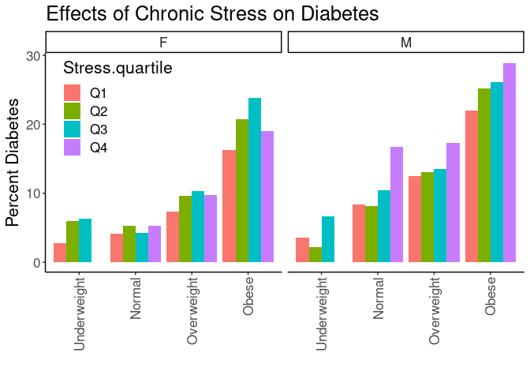
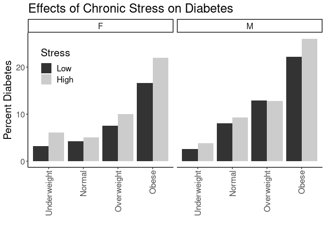

## Purpose

To test the effect modification of obesity on the stress-diabetes relationships.


```r
library(knitr)
#figures made will go to directory called figures, will make them as both png and pdf files 
opts_chunk$set(fig.path='figures/',
               echo=TRUE, warning=FALSE, message=FALSE,dev=c('png','pdf'))
options(scipen = 2, digits = 3)

library(readr)
library(dplyr)
```

```
## 
## Attaching package: 'dplyr'
```

```
## The following objects are masked from 'package:stats':
## 
##     filter, lag
```

```
## The following objects are masked from 'package:base':
## 
##     intersect, setdiff, setequal, union
```

```r
library(tidyr)

input.file <- 'data-combined.csv'
combined.data <- read_csv(input.file)
```

```
## Rows: 62010 Columns: 38
```

```
## ── Column specification ────────────────────────────────────────────────────────
## Delimiter: ","
## chr (17): DeID_PatientID, Gender, DeID_EncounterID, BMI_cat, BMI_cat.obese, ...
## dbl (21): age, Stress_d1, CardiacArrhythmias, ChronicPulmonaryDisease, Conge...
## 
## ℹ Use `spec()` to retrieve the full column specification for this data.
## ℹ Specify the column types or set `show_col_types = FALSE` to quiet this message.
```

Loaded in the cleaned data from data-combined.csv. This script can be found in /nfs/turbo/precision-health/DataDirect/HUM00219435 - Obesity as a modifier of chronic psy/2023-03-14/2150 - Obesity and Stress - Cohort - DeID - 2023-03-14 and was most recently run on Thu Mar 23 14:47:47 2023. This dataset has 62010 values.


```r
library(forcats)
combined.data <- 
  combined.data %>%
  mutate(BMI_cat= factor(BMI_cat, 
                         levels=c("Underweight",
                                  "Normal",
                                  "Overweight",
                                  'Class I Obese',
                                  'Class II Obese',
                                  'Class III Obese'))) %>%
  mutate(BMI_cat.obese= factor(BMI_cat.obese, 
                               levels=c("Underweight",
                                        "Normal",
                                        "Overweight",
                                        'Obese'))) %>%
  mutate(BMI_cat.Ob.NonOb= factor(BMI_cat.Ob.NonOb, 
                                  levels=c("Non-Obese",
                                           'Obese'))) %>%
  mutate(Stress=relevel(as.factor(High.Stress),ref="Low")) %>% #set low as reference value
    mutate(Race.Ethnicity=relevel(as.factor(Race.Ethnicity),ref="White")) %>% #set white as reference value
  mutate(Stress.quartile=fct_recode(as.factor(Stress.quartile),
                                    "Q1"="(-0.016,4]",
                                    "Q2"="(4,8]",
                                    "Q3"="(8,12]",
                                    "Q4"="(12,16]")) %>%
    mutate(Stress.quartile= factor(Stress.quartile, 
                                  levels=c("Q1","Q2","Q3","Q4"))) 
  
# need to clean race data
```

# Diabetes Rates by BMI

Stratified diagnoses by various BMI categories

## Diabetes by BMI Category


```r
#calculating diabetes rates by bmi category
with(combined.data, table(DiabetesAny,BMI_cat)) %>% 
  data.frame %>%
  pivot_wider(names_from=DiabetesAny,
              values_from = Freq) %>%
  rename(Diabetes=`1`,
         NonDiabetes=`0`) %>%
  mutate(Total=Diabetes+NonDiabetes) %>%
  mutate(Percent=Diabetes/Total*100) -> diabetes.bmi.counts

kable(diabetes.bmi.counts, caption="Diabetes rates by BMI category not including gender")
```


Table: Diabetes rates by BMI category not including gender

|BMI_cat         | NonDiabetes| Diabetes| Total| Percent|
|:---------------|-----------:|--------:|-----:|-------:|
|Underweight     |         465|       25|   490|    5.10|
|Normal          |       14182|     1032| 15214|    6.78|
|Overweight      |       17714|     2395| 20109|   11.91|
|Class I Obese   |       11146|     2630| 13776|   19.09|
|Class II Obese  |        5277|     1690|  6967|   24.26|
|Class III Obese |        3662|     1575|  5237|   30.07|

```r
library(ggplot2)

ggplot(diabetes.bmi.counts,
       aes(y=Percent,
           x=BMI_cat)) +
  geom_bar(stat='identity',position='dodge') +
  labs(y="Percent Diabetes",
       title="Effects of Chronic Stress on Diabetes Rates",
       x="") +
  theme_classic() +
  scale_fill_grey() +
  theme(text=element_text(size=16),
        axis.text.x=element_text(angle=90,vjust=0.5,hjust=1),
        legend.position = c(0.1,0.85))
```

<!-- -->

```r
#calculating diabetes rates by bmi category by gender
with(combined.data, table(DiabetesAny,BMI_cat,Gender)) %>% 
  data.frame %>%
  pivot_wider(names_from=DiabetesAny,
              values_from = Freq) %>%
  rename(Diabetes=`1`,
         NonDiabetes=`0`) %>%
  mutate(Total=Diabetes+NonDiabetes) %>%
  mutate(Percent=Diabetes/Total*100) -> diabetes.bmi.counts

kable(diabetes.bmi.counts, caption="Diabetes rates by BMI category")
```


Table: Diabetes rates by BMI category

|BMI_cat         |Gender | NonDiabetes| Diabetes| Total| Percent|
|:---------------|:------|-----------:|--------:|-----:|-------:|
|Underweight     |F      |         321|       18|   339|    5.31|
|Normal          |F      |        8808|      479|  9287|    5.16|
|Overweight      |F      |        8190|      876|  9066|    9.66|
|Class I Obese   |F      |        5441|     1059|  6500|   16.29|
|Class II Obese  |F      |        3046|      860|  3906|   22.02|
|Class III Obese |F      |        2549|     1014|  3563|   28.46|
|Underweight     |M      |         144|        7|   151|    4.64|
|Normal          |M      |        5374|      553|  5927|    9.33|
|Overweight      |M      |        9524|     1519| 11043|   13.76|
|Class I Obese   |M      |        5705|     1571|  7276|   21.59|
|Class II Obese  |M      |        2231|      830|  3061|   27.11|
|Class III Obese |M      |        1113|      561|  1674|   33.51|

```r
ggplot(diabetes.bmi.counts,
       aes(y=Percent,
           x=BMI_cat)) +
  geom_bar(stat='identity',position='dodge') +
  labs(y="Percent Diabetes",
       title="Effects of Chronic Stress on Diabetes Rates",
       x="") +
  theme_classic() +
  scale_fill_grey() +
  facet_grid(.~Gender) +
  theme(text=element_text(size=16),
        axis.text.x=element_text(angle=90,vjust=0.5,hjust=1),
        legend.position = c(0.1,0.85))
```

<!-- -->

## Diabetes Rate by BMI and Stress

This analysis uses all the BMI categories


```r
#calculating diabetes rates by bmi category and stress
with(combined.data, table(DiabetesAny,BMI_cat,Stress)) %>% 
  data.frame %>%
  pivot_wider(names_from=DiabetesAny,
              values_from = Freq) %>%
  rename(Diabetes=`1`,
         NonDiabetes=`0`) %>%
  mutate(Total=Diabetes+NonDiabetes) %>%
  mutate(Percent=Diabetes/Total*100) -> diabetes.bmi.stress.counts

library(ggplot2)

kable(diabetes.bmi.stress.counts, caption="Diabetes rates by BMI category")
```


Table: Diabetes rates by BMI category

|BMI_cat         |Stress | NonDiabetes| Diabetes| Total| Percent|
|:---------------|:------|-----------:|--------:|-----:|-------:|
|Underweight     |Low    |         128|        4|   132|    3.03|
|Normal          |Low    |        5396|      331|  5727|    5.78|
|Overweight      |Low    |        6918|      819|  7737|   10.59|
|Class I Obese   |Low    |        4209|      836|  5045|   16.57|
|Class II Obese  |Low    |        1923|      512|  2435|   21.03|
|Class III Obese |Low    |        1305|      438|  1743|   25.13|
|Underweight     |High   |         143|        8|   151|    5.30|
|Normal          |High   |        3658|      263|  3921|    6.71|
|Overweight      |High   |        4581|      592|  5173|   11.44|
|Class I Obese   |High   |        3051|      774|  3825|   20.23|
|Class II Obese  |High   |        1518|      518|  2036|   25.44|
|Class III Obese |High   |        1147|      488|  1635|   29.85|

```r
ggplot(diabetes.bmi.stress.counts,
       aes(y=Percent,
           x=BMI_cat,
           fill=Stress)) +
  geom_bar(stat='identity',position='dodge') +
  labs(y="Percent Diabetes",
       title="Effects of Chronic Stress on Diabetes Rates",
       x="") +
  theme_classic() +
  scale_fill_grey() +
  theme(text=element_text(size=16),
        axis.text.x=element_text(angle=90,vjust=0.5,hjust=1),
        legend.position = c(0.1,0.85))
```

<!-- -->


```r
#calculating diabetes rates by bmi category and stress
with(combined.data, table(DiabetesAny,BMI_cat,Stress,Gender)) %>% 
  data.frame %>%
  pivot_wider(names_from=DiabetesAny,
              values_from = Freq) %>%
  rename(Diabetes=`1`,
         NonDiabetes=`0`) %>%
  mutate(Total=Diabetes+NonDiabetes) %>%
  mutate(Percent=Diabetes/Total*100) -> diabetes.bmi.stress.counts

library(ggplot2)

kable(diabetes.bmi.stress.counts, caption="Diabetes rates by BMI category")
```


Table: Diabetes rates by BMI category

|BMI_cat         |Stress |Gender | NonDiabetes| Diabetes| Total| Percent|
|:---------------|:------|:------|-----------:|--------:|-----:|-------:|
|Underweight     |Low    |F      |          90|        3|    93|    3.23|
|Normal          |Low    |F      |        3289|      146|  3435|    4.25|
|Overweight      |Low    |F      |        3078|      252|  3330|    7.57|
|Class I Obese   |Low    |F      |        1937|      274|  2211|   12.39|
|Class II Obese  |Low    |F      |        1078|      227|  1305|   17.39|
|Class III Obese |Low    |F      |         883|      277|  1160|   23.88|
|Underweight     |High   |F      |          93|        6|    99|    6.06|
|Normal          |High   |F      |        2280|      121|  2401|    5.04|
|Overweight      |High   |F      |        2220|      246|  2466|    9.98|
|Class I Obese   |High   |F      |        1617|      339|  1956|   17.33|
|Class II Obese  |High   |F      |         902|      280|  1182|   23.69|
|Class III Obese |High   |F      |         813|      321|  1134|   28.31|
|Underweight     |Low    |M      |          38|        1|    39|    2.56|
|Normal          |Low    |M      |        2107|      185|  2292|    8.07|
|Overweight      |Low    |M      |        3840|      567|  4407|   12.87|
|Class I Obese   |Low    |M      |        2272|      562|  2834|   19.83|
|Class II Obese  |Low    |M      |         845|      285|  1130|   25.22|
|Class III Obese |Low    |M      |         422|      161|   583|   27.62|
|Underweight     |High   |M      |          50|        2|    52|    3.85|
|Normal          |High   |M      |        1378|      142|  1520|    9.34|
|Overweight      |High   |M      |        2361|      346|  2707|   12.78|
|Class I Obese   |High   |M      |        1434|      435|  1869|   23.27|
|Class II Obese  |High   |M      |         616|      238|   854|   27.87|
|Class III Obese |High   |M      |         334|      167|   501|   33.33|

```r
ggplot(diabetes.bmi.stress.counts,
       aes(y=Percent,
           x=BMI_cat,
           fill=Stress)) +
  geom_bar(stat='identity',position='dodge') +
  labs(y="Percent Diabetes",
       title="Effects of Chronic Stress on Diabetes Rates",
       x="") +
  theme_classic() +
  scale_fill_grey() +
  facet_grid(.~Gender) +
  theme(text=element_text(size=16),
        axis.text.x=element_text(angle=90,vjust=0.5,hjust=1),
        legend.position = c(0.1,0.85))
```

<!-- -->

### Logistic Regressions for All Obese Categories

Ran a series of stepwise logistic regressions testing for obesity as a modifier of the effects of stress.


```r
library(broom)
glm(DiabetesAny~BMI_cat, 
    family="binomial",
    data=combined.data) -> obesity.glm1

obesity.glm1 %>%
  tidy() %>%
  kable(caption="Logistic regression of obesity on diabetes", digits =c(0,2,3,2,99))
```


Table: Logistic regression of obesity on diabetes

|term                   | estimate| std.error| statistic|  p.value|
|:----------------------|--------:|---------:|---------:|--------:|
|(Intercept)            |    -2.92|     0.205|    -14.24| 5.27e-46|
|BMI_catNormal          |     0.30|     0.208|      1.46| 1.45e-01|
|BMI_catOverweight      |     0.92|     0.206|      4.47| 7.94e-06|
|BMI_catClass I Obese   |     1.48|     0.206|      7.16| 7.80e-13|
|BMI_catClass II Obese  |     1.78|     0.207|      8.61| 7.12e-18|
|BMI_catClass III Obese |     2.08|     0.207|     10.02| 1.23e-23|

```r
anova(obesity.glm1,test="Chisq") %>% tidy %>%
  kable(caption="Logistic regression of obesity on diabetes, ", digits =c(0,0,0,0,0,99))
```


Table: Logistic regression of obesity on diabetes, 

|term    | df| Deviance| Resid..Df| Resid..Dev| p.value|
|:-------|--:|--------:|---------:|----------:|-------:|
|NULL    | NA|       NA|     61792|      52511|      NA|
|BMI_cat |  5|     2525|     61787|      49986|       0|

```r
#adding in stress as a modifier
glm(DiabetesAny~BMI_cat+Stress+Stress:BMI_cat, 
    family="binomial",
    data=combined.data) -> obesity.glm2

obesity.glm2 %>%
  tidy() %>%
  kable(caption="Logistic regression of obesity on diabetes, with stress as a modifier", digits =c(0,2,3,2,99))
```


Table: Logistic regression of obesity on diabetes, with stress as a modifier

|term                              | estimate| std.error| statistic|  p.value|
|:---------------------------------|--------:|---------:|---------:|--------:|
|(Intercept)                       |    -3.47|     0.507|     -6.83| 8.22e-12|
|BMI_catNormal                     |     0.67|     0.510|      1.32| 1.86e-01|
|BMI_catOverweight                 |     1.33|     0.508|      2.62| 8.80e-03|
|BMI_catClass I Obese              |     1.85|     0.508|      3.64| 2.76e-04|
|BMI_catClass II Obese             |     2.14|     0.510|      4.20| 2.61e-05|
|BMI_catClass III Obese            |     2.37|     0.510|      4.65| 3.25e-06|
|StressHigh                        |     0.58|     0.624|      0.93| 3.51e-01|
|BMI_catNormal:StressHigh          |    -0.42|     0.630|     -0.67| 5.01e-01|
|BMI_catOverweight:StressHigh      |    -0.49|     0.626|     -0.79| 4.30e-01|
|BMI_catClass I Obese:StressHigh   |    -0.34|     0.626|     -0.54| 5.90e-01|
|BMI_catClass II Obese:StressHigh  |    -0.33|     0.628|     -0.53| 5.95e-01|
|BMI_catClass III Obese:StressHigh |    -0.35|     0.629|     -0.55| 5.83e-01|

```r
anova(obesity.glm2,test="Chisq") %>% tidy %>%
  kable(caption="Logistic regression of obese vs non-obese on diabetes, with stress as a modifier", digits =c(0,0,0,0,0,99))
```


Table: Logistic regression of obese vs non-obese on diabetes, with stress as a modifier

|term           | df| Deviance| Resid..Df| Resid..Dev|  p.value|
|:--------------|--:|--------:|---------:|----------:|--------:|
|NULL           | NA|       NA|     39559|      32202|       NA|
|BMI_cat        |  5|     1534|     39554|      30668| 0.00e+00|
|Stress         |  1|       42|     39553|      30626| 8.83e-11|
|BMI_cat:Stress |  5|        6|     39548|      30620| 3.29e-01|

```r
#adding in age and gender as covariates as a modifier
glm(DiabetesAny~BMI_cat+Stress+Stress:BMI_cat+Gender+age, 
    family="binomial",
    data=combined.data) -> obesity.glm3

obesity.glm3 %>%
  tidy() %>%
  kable(caption="Logistic regression of obesity on diabetes, with stress as a modifier and age and  gender as covariates", digits =c(0,2,3,2,99))
```


Table: Logistic regression of obesity on diabetes, with stress as a modifier and age and  gender as covariates

|term                              | estimate| std.error| statistic|  p.value|
|:---------------------------------|--------:|---------:|---------:|--------:|
|(Intercept)                       |    -5.82|     0.515|    -11.30| 1.34e-29|
|BMI_catNormal                     |     0.60|     0.514|      1.16| 2.45e-01|
|BMI_catOverweight                 |     1.05|     0.512|      2.05| 3.99e-02|
|BMI_catClass I Obese              |     1.61|     0.512|      3.14| 1.70e-03|
|BMI_catClass II Obese             |     2.01|     0.513|      3.92| 9.01e-05|
|BMI_catClass III Obese            |     2.43|     0.514|      4.72| 2.37e-06|
|StressHigh                        |     0.66|     0.630|      1.04| 2.96e-01|
|GenderM                           |     0.29|     0.031|      9.46| 2.95e-21|
|age                               |     0.04|     0.001|     37.07| 0.00e+00|
|BMI_catNormal:StressHigh          |    -0.43|     0.636|     -0.68| 4.99e-01|
|BMI_catOverweight:StressHigh      |    -0.47|     0.632|     -0.74| 4.60e-01|
|BMI_catClass I Obese:StressHigh   |    -0.31|     0.632|     -0.48| 6.29e-01|
|BMI_catClass II Obese:StressHigh  |    -0.30|     0.634|     -0.48| 6.34e-01|
|BMI_catClass III Obese:StressHigh |    -0.31|     0.635|     -0.48| 6.29e-01|

```r
anova(obesity.glm3,test="Chisq") %>% tidy %>%
  kable(caption="Logistic regression of obesity on diabetes, with stress as a modifier and age and gender as covariate", digits =c(0,0,0,0,0,99))
```


Table: Logistic regression of obesity on diabetes, with stress as a modifier and age and gender as covariate

|term           | df| Deviance| Resid..Df| Resid..Dev|  p.value|
|:--------------|--:|--------:|---------:|----------:|--------:|
|NULL           | NA|       NA|     39559|      32202|       NA|
|BMI_cat        |  5|     1534|     39554|      30668| 0.00e+00|
|Stress         |  1|       42|     39553|      30626| 8.83e-11|
|Gender         |  1|      205|     39552|      30421| 1.81e-46|
|age            |  1|     1564|     39551|      28857| 0.00e+00|
|BMI_cat:Stress |  5|        6|     39546|      28850| 2.74e-01|

```r
#adding in race and ethnicity
glm(DiabetesAny~BMI_cat+Stress+Stress:BMI_cat+Gender+age+Race.Ethnicity, 
    family="binomial",
    data=combined.data) -> obesity.glm4

obesity.glm4 %>%
  tidy() %>%
  kable(caption="Logistic regression of obesity on diabetes, with stress as a modifier and age, gender and race as covariates", digits =c(0,2,3,2,99))
```


Table: Logistic regression of obesity on diabetes, with stress as a modifier and age, gender and race as covariates

|term                              | estimate| std.error| statistic|  p.value|
|:---------------------------------|--------:|---------:|---------:|--------:|
|(Intercept)                       |    -5.96|     0.515|    -11.57| 6.12e-31|
|BMI_catNormal                     |     0.59|     0.514|      1.14| 2.54e-01|
|BMI_catOverweight                 |     1.05|     0.512|      2.04| 4.12e-02|
|BMI_catClass I Obese              |     1.60|     0.512|      3.13| 1.77e-03|
|BMI_catClass II Obese             |     2.01|     0.513|      3.91| 9.28e-05|
|BMI_catClass III Obese            |     2.42|     0.514|      4.70| 2.59e-06|
|StressHigh                        |     0.66|     0.630|      1.04| 2.97e-01|
|GenderM                           |     0.30|     0.031|      9.70| 2.89e-22|
|age                               |     0.04|     0.001|     37.91| 0.00e+00|
|Race.EthnicityAsian               |     0.72|     0.142|      5.10| 3.37e-07|
|Race.EthnicityBlack               |     0.62|     0.065|      9.42| 4.51e-21|
|Race.EthnicityHispanic/Latino     |     0.39|     0.111|      3.56| 3.78e-04|
|Race.EthnicityOther               |     0.11|     0.086|      1.32| 1.88e-01|
|BMI_catNormal:StressHigh          |    -0.43|     0.636|     -0.67| 5.00e-01|
|BMI_catOverweight:StressHigh      |    -0.47|     0.632|     -0.75| 4.55e-01|
|BMI_catClass I Obese:StressHigh   |    -0.31|     0.632|     -0.49| 6.24e-01|
|BMI_catClass II Obese:StressHigh  |    -0.31|     0.634|     -0.49| 6.27e-01|
|BMI_catClass III Obese:StressHigh |    -0.31|     0.635|     -0.48| 6.28e-01|

```r
anova(obesity.glm4,test="Chisq") %>% tidy %>%
  kable(caption="Logistic regression of obesity on diabetes, with stress as a modifier and age, gender and race as covariate", digits =c(0,0,0,0,0,99))
```


Table: Logistic regression of obesity on diabetes, with stress as a modifier and age, gender and race as covariate

|term           | df| Deviance| Resid..Df| Resid..Dev|  p.value|
|:--------------|--:|--------:|---------:|----------:|--------:|
|NULL           | NA|       NA|     39559|      32202|       NA|
|BMI_cat        |  5|     1534|     39554|      30668| 0.00e+00|
|Stress         |  1|       42|     39553|      30626| 8.83e-11|
|Gender         |  1|      205|     39552|      30421| 1.81e-46|
|age            |  1|     1564|     39551|      28857| 0.00e+00|
|Race.Ethnicity |  4|      111|     39547|      28745| 4.05e-23|
|BMI_cat:Stress |  5|        6|     39542|      28739| 2.76e-01|

### Diabetes Rates by Quartiles


```r
with(combined.data, table(DiabetesAny,BMI_cat.obese,Stress.quartile,Gender)) %>% 
  data.frame %>%
  pivot_wider(names_from=DiabetesAny,
              values_from = Freq) %>%
  rename(Diabetes=`1`,
         NonDiabetes=`0`) %>%
  mutate(Total=Diabetes+NonDiabetes) %>%
  mutate(Percent=Diabetes/Total*100) -> diabetes.bmi.stress.quartile.counts

kable(diabetes.bmi.stress.quartile.counts, caption="Diabetes Rates by BMI and Stress Quartile")
```


Table: Diabetes Rates by BMI and Stress Quartile

|BMI_cat.obese |Stress.quartile |Gender | NonDiabetes| Diabetes| Total| Percent|
|:-------------|:---------------|:------|-----------:|--------:|-----:|-------:|
|Underweight   |Q1              |F      |          71|        2|    73|    2.74|
|Normal        |Q1              |F      |        2756|      118|  2874|    4.11|
|Overweight    |Q1              |F      |        2585|      204|  2789|    7.31|
|Obese         |Q1              |F      |        3249|      629|  3878|   16.22|
|Underweight   |Q2              |F      |          79|        5|    84|    5.95|
|Normal        |Q2              |F      |        2110|      117|  2227|    5.25|
|Overweight    |Q2              |F      |        2030|      216|  2246|    9.62|
|Obese         |Q2              |F      |        2869|      750|  3619|   20.72|
|Underweight   |Q3              |F      |          30|        2|    32|    6.25|
|Normal        |Q3              |F      |         631|       28|   659|    4.25|
|Overweight    |Q3              |F      |         609|       70|   679|   10.31|
|Obese         |Q3              |F      |         993|      311|  1304|   23.85|
|Underweight   |Q4              |F      |           3|        0|     3|    0.00|
|Normal        |Q4              |F      |          72|        4|    76|    5.26|
|Overweight    |Q4              |F      |          74|        8|    82|    9.76|
|Obese         |Q4              |F      |         119|       28|   147|   19.05|
|Underweight   |Q1              |M      |          27|        1|    28|    3.57|
|Normal        |Q1              |M      |        1805|      164|  1969|    8.33|
|Overweight    |Q1              |M      |        3318|      473|  3791|   12.48|
|Obese         |Q1              |M      |        3014|      852|  3866|   22.04|
|Underweight   |Q2              |M      |          45|        1|    46|    2.17|
|Normal        |Q2              |M      |        1312|      117|  1429|    8.19|
|Overweight    |Q2              |M      |        2336|      352|  2688|   13.10|
|Obese         |Q2              |M      |        2246|      758|  3004|   25.23|
|Underweight   |Q3              |M      |          14|        1|    15|    6.67|
|Normal        |Q3              |M      |         328|       38|   366|   10.38|
|Overweight    |Q3              |M      |         504|       79|   583|   13.55|
|Obese         |Q3              |M      |         599|      212|   811|   26.14|
|Underweight   |Q4              |M      |           2|        0|     2|    0.00|
|Normal        |Q4              |M      |          40|        8|    48|   16.67|
|Overweight    |Q4              |M      |          43|        9|    52|   17.31|
|Obese         |Q4              |M      |          64|       26|    90|   28.89|

```r
ggplot(diabetes.bmi.stress.quartile.counts,
       aes(y=Percent,
           x=BMI_cat.obese,
           fill=Stress.quartile)) +
  geom_bar(stat='identity',position='dodge') +
  labs(y="Percent Diabetes",
       title="Effects of Chronic Stress on Diabetes",
       x="") +
  theme_classic() +
  facet_grid(.~Gender) +
  theme(text=element_text(size=16),
        axis.text.x=element_text(angle=90,vjust=0.5,hjust=1),
        legend.position = c(0.15,0.75))
```

<!-- -->

## Diabetes Rates by Normal Obesity and Stress


```r
#calculating diabetes rates by bmi category, stress and gender
with(combined.data, table(DiabetesAny,BMI_cat.obese,Stress,Gender)) %>% 
  data.frame %>%
  pivot_wider(names_from=DiabetesAny,
              values_from = Freq) %>%
  rename(Diabetes=`1`,
         NonDiabetes=`0`) %>%
  mutate(Total=Diabetes+NonDiabetes) %>%
  mutate(Percent=Diabetes/Total*100) -> diabetes.bmi.stress.gender.counts

kable(diabetes.bmi.stress.gender.counts, caption="Diabetes Rates by BMI and Stress")
```


Table: Diabetes Rates by BMI and Stress

|BMI_cat.obese |Stress |Gender | NonDiabetes| Diabetes| Total| Percent|
|:-------------|:------|:------|-----------:|--------:|-----:|-------:|
|Underweight   |Low    |F      |          90|        3|    93|    3.23|
|Normal        |Low    |F      |        3289|      146|  3435|    4.25|
|Overweight    |Low    |F      |        3078|      252|  3330|    7.57|
|Obese         |Low    |F      |        3898|      778|  4676|   16.64|
|Underweight   |High   |F      |          93|        6|    99|    6.06|
|Normal        |High   |F      |        2280|      121|  2401|    5.04|
|Overweight    |High   |F      |        2220|      246|  2466|    9.98|
|Obese         |High   |F      |        3332|      940|  4272|   22.00|
|Underweight   |Low    |M      |          38|        1|    39|    2.56|
|Normal        |Low    |M      |        2107|      185|  2292|    8.07|
|Overweight    |Low    |M      |        3840|      567|  4407|   12.87|
|Obese         |Low    |M      |        3539|     1008|  4547|   22.17|
|Underweight   |High   |M      |          50|        2|    52|    3.85|
|Normal        |High   |M      |        1378|      142|  1520|    9.34|
|Overweight    |High   |M      |        2361|      346|  2707|   12.78|
|Obese         |High   |M      |        2384|      840|  3224|   26.05|

```r
ggplot(diabetes.bmi.stress.gender.counts,
       aes(y=Percent,
           x=BMI_cat.obese,
           fill=Stress)) +
  geom_bar(stat='identity',position='dodge') +
  labs(y="Percent Diabetes",
       title="Effects of Chronic Stress on Diabetes",
       x="") +
  facet_grid(.~Gender) +
  theme_classic() +
  scale_fill_grey() +
  theme(text=element_text(size=16),
        axis.text.x=element_text(angle=90,vjust=0.5,hjust=1),
        legend.position = c(0.1,0.75))
```

<!-- -->

## Logistic Regressions for Obese/Non-Obese

Ran a series of logistic regressions using the normal obesity categories not classes as the categorization


```r
glm(DiabetesAny~BMI_cat.obese, 
    family="binomial",
    data=combined.data) -> obesity.glm1

obesity.glm1 %>%
  tidy() %>%
  kable(caption="Logistic regression of obese vs non-obese on diabetes", digits =c(0,2,3,2,99))
```


Table: Logistic regression of obese vs non-obese on diabetes

|term                    | estimate| std.error| statistic|  p.value|
|:-----------------------|--------:|---------:|---------:|--------:|
|(Intercept)             |    -2.92|     0.205|    -14.24| 5.27e-46|
|BMI_cat.obeseNormal     |     0.30|     0.208|      1.46| 1.45e-01|
|BMI_cat.obeseOverweight |     0.92|     0.206|      4.47| 7.94e-06|
|BMI_cat.obeseObese      |     1.70|     0.206|      8.25| 1.64e-16|

```r
anova(obesity.glm1,test="Chisq") %>% tidy %>%
  kable(caption="Logistic regression of obesity on diabetes, ", digits =c(0,0,0,0,0,99))
```


Table: Logistic regression of obesity on diabetes, 

|term          | df| Deviance| Resid..Df| Resid..Dev| p.value|
|:-------------|--:|--------:|---------:|----------:|-------:|
|NULL          | NA|       NA|     61792|      52511|      NA|
|BMI_cat.obese |  3|     2258|     61789|      50253|       0|

```r
#adding in stress as a modifier
glm(DiabetesAny~BMI_cat.obese+Stress+Stress:BMI_cat.obese, 
    family="binomial",
    data=combined.data) -> obesity.glm2

obesity.glm2 %>%
  tidy() %>%
  kable(caption="Logistic regression of obesity on diabetes, with stress as a modifier", digits =c(0,2,3,2,99))
```


Table: Logistic regression of obesity on diabetes, with stress as a modifier

|term                               | estimate| std.error| statistic|  p.value|
|:----------------------------------|--------:|---------:|---------:|--------:|
|(Intercept)                        |    -3.47|     0.507|     -6.83| 8.22e-12|
|BMI_cat.obeseNormal                |     0.67|     0.510|      1.32| 1.86e-01|
|BMI_cat.obeseOverweight            |     1.33|     0.508|      2.62| 8.80e-03|
|BMI_cat.obeseObese                 |     2.04|     0.508|      4.02| 5.92e-05|
|StressHigh                         |     0.58|     0.624|      0.93| 3.51e-01|
|BMI_cat.obeseNormal:StressHigh     |    -0.42|     0.630|     -0.67| 5.01e-01|
|BMI_cat.obeseOverweight:StressHigh |    -0.49|     0.626|     -0.79| 4.30e-01|
|BMI_cat.obeseObese:StressHigh      |    -0.32|     0.625|     -0.52| 6.06e-01|

```r
anova(obesity.glm2,test="Chisq") %>% tidy %>%
  kable(caption="Logistic regression of obesity on diabetes, with stress as a modifier", digits =c(0,0,0,0,0,99))
```


Table: Logistic regression of obesity on diabetes, with stress as a modifier

|term                 | df| Deviance| Resid..Df| Resid..Dev|  p.value|
|:--------------------|--:|--------:|---------:|----------:|--------:|
|NULL                 | NA|       NA|     39559|      32202|       NA|
|BMI_cat.obese        |  3|     1401|     39556|      30801| 0.00e+00|
|Stress               |  1|       47|     39555|      30754| 7.74e-12|
|BMI_cat.obese:Stress |  3|        7|     39552|      30747| 7.22e-02|

```r
#adding in age and gender as covariates as a modifier
glm(DiabetesAny~BMI_cat.obese+Stress+Stress:BMI_cat.obese+Gender+age, 
    family="binomial",
    data=combined.data) -> obesity.glm3

obesity.glm3 %>%
  tidy() %>%
  kable(caption="Logistic regression of obesity on diabetes, with stress as a modifier and age and  gender as covariates", digits =c(0,2,3,2,99))
```


Table: Logistic regression of obesity on diabetes, with stress as a modifier and age and  gender as covariates

|term                               | estimate| std.error| statistic|  p.value|
|:----------------------------------|--------:|---------:|---------:|--------:|
|(Intercept)                        |    -5.69|     0.515|    -11.05| 2.22e-28|
|BMI_cat.obeseNormal                |     0.61|     0.514|      1.19| 2.36e-01|
|BMI_cat.obeseOverweight            |     1.08|     0.512|      2.11| 3.51e-02|
|BMI_cat.obeseObese                 |     1.89|     0.511|      3.70| 2.12e-04|
|StressHigh                         |     0.66|     0.629|      1.04| 2.97e-01|
|GenderM                            |     0.23|     0.031|      7.57| 3.78e-14|
|age                                |     0.04|     0.001|     35.98| 0.00e+00|
|BMI_cat.obeseNormal:StressHigh     |    -0.43|     0.635|     -0.68| 4.96e-01|
|BMI_cat.obeseOverweight:StressHigh |    -0.47|     0.632|     -0.75| 4.55e-01|
|BMI_cat.obeseObese:StressHigh      |    -0.29|     0.630|     -0.46| 6.49e-01|

```r
anova(obesity.glm3,test="Chisq") %>% tidy %>%
  kable(caption="Logistic regression of obesity on diabetes, with stress as a modifier and age and gender as covariate", digits =c(0,0,0,0,0,99))
```


Table: Logistic regression of obesity on diabetes, with stress as a modifier and age and gender as covariate

|term                 | df| Deviance| Resid..Df| Resid..Dev|  p.value|
|:--------------------|--:|--------:|---------:|----------:|--------:|
|NULL                 | NA|       NA|     39559|      32202|       NA|
|BMI_cat.obese        |  3|     1401|     39556|      30801| 0.00e+00|
|Stress               |  1|       47|     39555|      30754| 7.74e-12|
|Gender               |  1|      162|     39554|      30592| 4.37e-37|
|age                  |  1|     1460|     39553|      29132| 0.00e+00|
|BMI_cat.obese:Stress |  3|        8|     39550|      29124| 4.16e-02|

```r
#adding in race and ethnicity
glm(DiabetesAny~BMI_cat.obese+Stress+Stress:BMI_cat.obese+Gender+age+Race.Ethnicity, 
    family="binomial",
    data=combined.data) -> obesity.glm4

obesity.glm4 %>%
  tidy() %>%
  kable(caption="Logistic regression of obesity on diabetes, with stress as a modifier and age, gender and race as covariates", digits =c(0,2,3,2,99))
```


Table: Logistic regression of obesity on diabetes, with stress as a modifier and age, gender and race as covariates

|term                               | estimate| std.error| statistic|  p.value|
|:----------------------------------|--------:|---------:|---------:|--------:|
|(Intercept)                        |    -5.82|     0.515|    -11.31| 1.17e-29|
|BMI_cat.obeseNormal                |     0.60|     0.514|      1.16| 2.45e-01|
|BMI_cat.obeseOverweight            |     1.07|     0.512|      2.09| 3.67e-02|
|BMI_cat.obeseObese                 |     1.88|     0.511|      3.69| 2.28e-04|
|StressHigh                         |     0.65|     0.629|      1.04| 2.98e-01|
|GenderM                            |     0.24|     0.031|      7.82| 5.11e-15|
|age                                |     0.04|     0.001|     36.85| 0.00e+00|
|Race.EthnicityAsian                |     0.66|     0.141|      4.64| 3.45e-06|
|Race.EthnicityBlack                |     0.64|     0.065|      9.82| 9.40e-23|
|Race.EthnicityHispanic/Latino      |     0.37|     0.110|      3.39| 6.93e-04|
|Race.EthnicityOther                |     0.12|     0.085|      1.38| 1.67e-01|
|BMI_cat.obeseNormal:StressHigh     |    -0.43|     0.635|     -0.68| 4.98e-01|
|BMI_cat.obeseOverweight:StressHigh |    -0.48|     0.632|     -0.75| 4.51e-01|
|BMI_cat.obeseObese:StressHigh      |    -0.29|     0.630|     -0.46| 6.45e-01|

```r
anova(obesity.glm4,test="Chisq") %>% tidy %>%
  kable(caption="Logistic regression of obesity on diabetes, with stress as a modifier and age, gender and race as covariates", digits =c(0,0,0,0,0,99))
```


Table: Logistic regression of obesity on diabetes, with stress as a modifier and age, gender and race as covariates

|term                 | df| Deviance| Resid..Df| Resid..Dev|  p.value|
|:--------------------|--:|--------:|---------:|----------:|--------:|
|NULL                 | NA|       NA|     39559|      32202|       NA|
|BMI_cat.obese        |  3|     1401|     39556|      30801| 0.00e+00|
|Stress               |  1|       47|     39555|      30754| 7.74e-12|
|Gender               |  1|      162|     39554|      30592| 4.37e-37|
|age                  |  1|     1460|     39553|      29132| 0.00e+00|
|Race.Ethnicity       |  4|      113|     39549|      29019| 1.43e-23|
|BMI_cat.obese:Stress |  3|        8|     39546|      29010| 4.17e-02|

# Diabetes Rates by Obese/Not Obese and Stress


```r
with(combined.data, table(DiabetesAny,BMI_cat.Ob.NonOb,Stress)) %>% 
  data.frame %>%
  pivot_wider(names_from=DiabetesAny,
              values_from = Freq) %>%
  rename(Diabetes=`1`,
         NonDiabetes=`0`) %>%
  mutate(Total=Diabetes+NonDiabetes) %>%
  mutate(Percent=Diabetes/Total*100) -> diabetes.BMI_cat.Ob.NonOb.stress.counts

kable(diabetes.BMI_cat.Ob.NonOb.stress.counts, caption="Diabetes Rates by Obese or not and Stress")
```


Table: Diabetes Rates by Obese or not and Stress

|BMI_cat.Ob.NonOb |Stress | NonDiabetes| Diabetes| Total| Percent|
|:----------------|:------|-----------:|--------:|-----:|-------:|
|Non-Obese        |Low    |       12512|     1158| 13670|    8.47|
|Obese            |Low    |        7437|     1786|  9223|   19.36|
|Non-Obese        |High   |        8439|      866|  9305|    9.31|
|Obese            |High   |        5716|     1780|  7496|   23.75|

```r
ggplot(diabetes.BMI_cat.Ob.NonOb.stress.counts,
       aes(y=Percent,
           x=BMI_cat.Ob.NonOb,
           fill=Stress)) +
  geom_bar(stat='identity',position='dodge') +
  labs(y="Percent Diabetes",
       title="Effects of Chronic Stress on Diabetes",
       x="") +
  theme_classic() +
  scale_fill_grey() +
  theme(text=element_text(size=16),
        axis.text.x=element_text(angle=90,vjust=0.5,hjust=1),
        legend.position = c(0.1,0.75))
```

<!-- -->


```r
with(combined.data, table(DiabetesAny,BMI_cat.Ob.NonOb,Stress,Gender)) %>% 
  data.frame %>%
  pivot_wider(names_from=DiabetesAny,
              values_from = Freq) %>%
  rename(Diabetes=`1`,
         NonDiabetes=`0`) %>%
  mutate(Total=Diabetes+NonDiabetes) %>%
  mutate(Percent=Diabetes/Total*100) -> diabetes.BMI_cat.Ob.NonOb.stress.counts

kable(diabetes.BMI_cat.Ob.NonOb.stress.counts, caption="Diabetes Rates by Obese or not and Stress")
```


Table: Diabetes Rates by Obese or not and Stress

|BMI_cat.Ob.NonOb |Stress |Gender | NonDiabetes| Diabetes| Total| Percent|
|:----------------|:------|:------|-----------:|--------:|-----:|-------:|
|Non-Obese        |Low    |F      |        6508|      405|  6913|    5.86|
|Obese            |Low    |F      |        3898|      778|  4676|   16.64|
|Non-Obese        |High   |F      |        4631|      374|  5005|    7.47|
|Obese            |High   |F      |        3332|      940|  4272|   22.00|
|Non-Obese        |Low    |M      |        6004|      753|  6757|   11.14|
|Obese            |Low    |M      |        3539|     1008|  4547|   22.17|
|Non-Obese        |High   |M      |        3808|      492|  4300|   11.44|
|Obese            |High   |M      |        2384|      840|  3224|   26.05|

```r
ggplot(diabetes.BMI_cat.Ob.NonOb.stress.counts,
       aes(y=Percent,
           x=BMI_cat.Ob.NonOb,
           fill=Stress)) +
  geom_bar(stat='identity',position='dodge') +
  labs(y="Percent Diabetes",
       title="Effects of Chronic Stress on Diabetes",
       x="") +
  facet_grid(.~Gender) +
  theme_classic() +
  scale_fill_grey() +
  theme(text=element_text(size=16),
        axis.text.x=element_text(angle=90,vjust=0.5,hjust=1),
        legend.position = c(0.1,0.75))
```

<!-- -->


```r
with(combined.data, table(DiabetesAny,BMI_cat.Ob.NonOb,Stress,Race.Ethnicity)) %>% 
  data.frame %>%
  pivot_wider(names_from=DiabetesAny,
              values_from = Freq) %>%
  rename(Diabetes=`1`,
         NonDiabetes=`0`) %>%
  mutate(Total=Diabetes+NonDiabetes) %>%
  mutate(Percent=Diabetes/Total*100) -> diabetes.BMI_cat.Ob.NonOb.stress.counts

ggplot(diabetes.BMI_cat.Ob.NonOb.stress.counts,
       aes(y=Percent,
           x=BMI_cat.Ob.NonOb,
           fill=Stress)) +
  geom_bar(stat='identity',position='dodge') +
  labs(y="Percent Diabetes",
       title="Effects of Chronic Stress on Diabetes",
       x="") +
  facet_grid(.~Race.Ethnicity) +
  theme_classic() +
  scale_fill_grey() +
  theme(text=element_text(size=16),
        axis.text.x=element_text(angle=90,vjust=0.5,hjust=1),
        legend.position = "none")
```

<!-- -->

# Stratified by Neighborhood Disadvantage


```r
with(combined.data, table(DiabetesAny,BMI_cat.Ob.NonOb,Stress,disadvantage13_17_qrtl)) %>% 
  data.frame %>%
  pivot_wider(names_from=DiabetesAny,
              values_from = Freq) %>%
  rename(Diabetes=`1`,
         NonDiabetes=`0`) %>%
  mutate(Total=Diabetes+NonDiabetes) %>%
  mutate(Percent=Diabetes/Total*100) -> diabetes.BMI_cat.Ob.NonOb.stress.counts

ggplot(diabetes.BMI_cat.Ob.NonOb.stress.counts,
       aes(y=Percent,
           x=BMI_cat.Ob.NonOb,
           fill=Stress)) +
  geom_bar(stat='identity',position='dodge') +
  labs(y="Percent Diabetes",
       title="Effects of Chronic Stress on Diabetes",
       x="") +
  facet_grid(.~disadvantage13_17_qrtl) +
  theme_classic() +
  scale_fill_grey() +
  theme(text=element_text(size=16),
        axis.text.x=element_text(angle=90,vjust=0.5,hjust=1),
        legend.position = "none")
```

<!-- -->


## Logistic Regressions for Obese/Non-Obese

Ran a series of logistic regressions using obese/non-obese as the categorization


```r
glm(DiabetesAny~BMI_cat.Ob.NonOb, 
    family="binomial",
    data=combined.data) -> obesity.glm1

obesity.glm1 %>%
  tidy() %>%
  kable(caption="Logistic regression of obese vs non-obese on diabetes", digits =c(0,2,3,2,99))
```


Table: Logistic regression of obese vs non-obese on diabetes

|term                  | estimate| std.error| statistic| p.value|
|:---------------------|--------:|---------:|---------:|-------:|
|(Intercept)           |    -2.24|     0.018|    -125.4|       0|
|BMI_cat.Ob.NonObObese |     1.01|     0.023|      43.7|       0|

```r
anova(obesity.glm1,test="Chisq") %>% tidy %>%
  kable(caption="Logistic regression of obese vs non-obese on diabetes, ", digits =c(0,0,0,0,0,99))
```


Table: Logistic regression of obese vs non-obese on diabetes, 

|term             | df| Deviance| Resid..Df| Resid..Dev| p.value|
|:----------------|--:|--------:|---------:|----------:|-------:|
|NULL             | NA|       NA|     62009|      52630|      NA|
|BMI_cat.Ob.NonOb |  1|     1988|     62008|      50643|       0|

```r
#adding in stress as a modifier
glm(DiabetesAny~BMI_cat.Ob.NonOb+Stress+Stress:BMI_cat.Ob.NonOb, 
    family="binomial",
    data=combined.data) -> obesity.glm2

obesity.glm2 %>%
  tidy() %>%
  kable(caption="Logistic regression of obese vs non-obese on diabetes, with stress as a modifier", digits =c(0,2,3,2,99))
```


Table: Logistic regression of obese vs non-obese on diabetes, with stress as a modifier

|term                             | estimate| std.error| statistic| p.value|
|:--------------------------------|--------:|---------:|---------:|-------:|
|(Intercept)                      |    -2.38|     0.031|    -77.48| 0.00000|
|BMI_cat.Ob.NonObObese            |     0.95|     0.040|     23.56| 0.00000|
|StressHigh                       |     0.10|     0.047|      2.19| 0.02829|
|BMI_cat.Ob.NonObObese:StressHigh |     0.16|     0.060|      2.59| 0.00953|

```r
anova(obesity.glm2,test="Chisq") %>% tidy %>%
  kable(caption="Logistic regression of obese vs non-obese on diabetes, with stress as a modifier", digits =c(0,0,0,0,0,99))
```


Table: Logistic regression of obese vs non-obese on diabetes, with stress as a modifier

|term                    | df| Deviance| Resid..Df| Resid..Dev|  p.value|
|:-----------------------|--:|--------:|---------:|----------:|--------:|
|NULL                    | NA|       NA|     39693|      32268|       NA|
|BMI_cat.Ob.NonOb        |  1|     1240|     39692|      31029| 0.00e+00|
|Stress                  |  1|       45|     39691|      30983| 1.79e-11|
|BMI_cat.Ob.NonOb:Stress |  1|        7|     39690|      30977| 9.46e-03|

```r
#adding in age and gender as covariates as a modifier
glm(DiabetesAny~BMI_cat.Ob.NonOb+Stress+Stress:BMI_cat.Ob.NonOb+Gender+age, 
    family="binomial",
    data=combined.data) -> obesity.glm3

obesity.glm3 %>%
  tidy() %>%
  kable(caption="Logistic regression of obese vs non-obese on diabetes, with stress as a modifier and age and  gender as covariates", digits =c(0,2,3,2,99))
```


Table: Logistic regression of obese vs non-obese on diabetes, with stress as a modifier and age and  gender as covariates

|term                             | estimate| std.error| statistic|  p.value|
|:--------------------------------|--------:|---------:|---------:|--------:|
|(Intercept)                      |    -4.81|     0.074|    -64.68| 0.00e+00|
|BMI_cat.Ob.NonObObese            |     0.98|     0.041|     23.73| 0.00e+00|
|StressHigh                       |     0.19|     0.048|      3.95| 7.93e-05|
|GenderM                          |     0.26|     0.030|      8.54| 1.38e-17|
|age                              |     0.04|     0.001|     36.53| 0.00e+00|
|BMI_cat.Ob.NonObObese:StressHigh |     0.18|     0.062|      2.95| 3.17e-03|

```r
anova(obesity.glm3,test="Chisq") %>% tidy %>%
  kable(caption="Logistic regression of obese vs non-obese on diabetes, with stress as a modifier and age and gender as covariate", digits =c(0,0,0,0,0,99))
```


Table: Logistic regression of obese vs non-obese on diabetes, with stress as a modifier and age and gender as covariate

|term                    | df| Deviance| Resid..Df| Resid..Dev|  p.value|
|:-----------------------|--:|--------:|---------:|----------:|--------:|
|NULL                    | NA|       NA|     39693|      32268|       NA|
|BMI_cat.Ob.NonOb        |  1|     1240|     39692|      31029| 0.00e+00|
|Stress                  |  1|       45|     39691|      30983| 1.79e-11|
|Gender                  |  1|      194|     39690|      30790| 4.81e-44|
|age                     |  1|     1512|     39689|      29277| 0.00e+00|
|BMI_cat.Ob.NonOb:Stress |  1|        9|     39688|      29269| 3.13e-03|

```r
#adding in race and ethnicity
glm(DiabetesAny~BMI_cat.Ob.NonOb+Stress+Stress:BMI_cat.Ob.NonOb+Gender+age+Race.Ethnicity, 
    family="binomial",
    data=combined.data) -> obesity.glm4

obesity.glm4 %>%
  tidy() %>%
  kable(caption="Logistic regression of obese vs non-obese on diabetes, with stress as a modifier and age, gender and race as covariates", digits =c(0,2,3,2,99))
```


Table: Logistic regression of obese vs non-obese on diabetes, with stress as a modifier and age, gender and race as covariates

|term                             | estimate| std.error| statistic|  p.value|
|:--------------------------------|--------:|---------:|---------:|--------:|
|(Intercept)                      |    -4.95|     0.076|    -64.77| 0.00e+00|
|BMI_cat.Ob.NonObObese            |     0.98|     0.042|     23.59| 0.00e+00|
|StressHigh                       |     0.19|     0.048|      3.85| 1.19e-04|
|GenderM                          |     0.27|     0.031|      8.79| 1.56e-18|
|age                              |     0.04|     0.001|     37.35| 0.00e+00|
|Race.EthnicityAsian              |     0.59|     0.141|      4.18| 2.97e-05|
|Race.EthnicityBlack              |     0.65|     0.065|      9.99| 1.65e-23|
|Race.EthnicityHispanic/Latino    |     0.37|     0.110|      3.38| 7.35e-04|
|Race.EthnicityOther              |     0.12|     0.085|      1.35| 1.77e-01|
|BMI_cat.Ob.NonObObese:StressHigh |     0.18|     0.062|      2.93| 3.34e-03|

```r
anova(obesity.glm4,test="Chisq") %>% tidy %>%
  kable(caption="Logistic regression of obese vs non-obese on diabetes, with stress as a modifier and age, gender and race as covariate", digits =c(0,0,0,0,0,99))
```


Table: Logistic regression of obese vs non-obese on diabetes, with stress as a modifier and age, gender and race as covariate

|term                    | df| Deviance| Resid..Df| Resid..Dev|  p.value|
|:-----------------------|--:|--------:|---------:|----------:|--------:|
|NULL                    | NA|       NA|     39693|      32268|       NA|
|BMI_cat.Ob.NonOb        |  1|     1240|     39692|      31029| 0.00e+00|
|Stress                  |  1|       45|     39691|      30983| 1.79e-11|
|Gender                  |  1|      194|     39690|      30790| 4.81e-44|
|age                     |  1|     1512|     39689|      29277| 0.00e+00|
|Race.Ethnicity          |  4|      113|     39685|      29164| 1.68e-23|
|BMI_cat.Ob.NonOb:Stress |  1|        9|     39684|      29156| 3.31e-03|

```r
#adding in neighborhood disadvantage
glm(DiabetesAny~BMI_cat.Ob.NonOb+Stress+Stress:BMI_cat.Ob.NonOb+Gender+age+Race.Ethnicity+disadvantage13_17_qrtl, 
    family="binomial",
    data=combined.data) -> obesity.glm5

obesity.glm5 %>%
  tidy() %>%
  kable(caption="Logistic regression of obese vs non-obese on diabetes, with stress as a modifier and age, gender, race, neighborhood disadvantage as covariates", digits =c(0,2,3,2,99))
```


Table: Logistic regression of obese vs non-obese on diabetes, with stress as a modifier and age, gender, race, neighborhood disadvantage as covariates

|term                             | estimate| std.error| statistic|  p.value|
|:--------------------------------|--------:|---------:|---------:|--------:|
|(Intercept)                      |    -5.23|     0.088|    -59.77| 0.00e+00|
|BMI_cat.Ob.NonObObese            |     0.96|     0.043|     22.28| 0.00e+00|
|StressHigh                       |     0.16|     0.050|      3.12| 1.81e-03|
|GenderM                          |     0.28|     0.032|      8.70| 3.41e-18|
|age                              |     0.04|     0.001|     36.34| 0.00e+00|
|Race.EthnicityAsian              |     0.63|     0.146|      4.30| 1.68e-05|
|Race.EthnicityBlack              |     0.53|     0.070|      7.63| 2.44e-14|
|Race.EthnicityHispanic/Latino    |     0.37|     0.114|      3.27| 1.07e-03|
|Race.EthnicityOther              |     0.09|     0.089|      1.00| 3.18e-01|
|disadvantage13_17_qrtl           |     0.13|     0.016|      8.31| 9.83e-17|
|BMI_cat.Ob.NonObObese:StressHigh |     0.19|     0.064|      2.90| 3.71e-03|

```r
anova(obesity.glm5,test="Chisq") %>% tidy %>%
  kable(caption="Logistic regression of obese vs non-obese on diabetes, with stress as a modifier and age, gender, race, and neighborhood disadvantage as covariates", digits =c(0,0,0,0,0,99))
```


Table: Logistic regression of obese vs non-obese on diabetes, with stress as a modifier and age, gender, race, and neighborhood disadvantage as covariates

|term                    | df| Deviance| Resid..Df| Resid..Dev|  p.value|
|:-----------------------|--:|--------:|---------:|----------:|--------:|
|NULL                    | NA|       NA|     36519|      29829|       NA|
|BMI_cat.Ob.NonOb        |  1|     1135|     36518|      28694| 0.00e+00|
|Stress                  |  1|       41|     36517|      28652| 1.36e-10|
|Gender                  |  1|      179|     36516|      28473| 7.12e-41|
|age                     |  1|     1393|     36515|      27080| 0.00e+00|
|Race.Ethnicity          |  4|      116|     36511|      26964| 4.11e-24|
|disadvantage13_17_qrtl  |  1|       68|     36510|      26896| 1.39e-16|
|BMI_cat.Ob.NonOb:Stress |  1|        8|     36509|      26887| 3.67e-03|

### Testing for the Interaction Between Gender and Obesity-BMI

Used the final fully adjusted model to test if gender modifies the relationships between BMI and obesity on diabetes rates.  

First did this by adding in a complete interaction model and comparing to the complete model.


```r
gender.int.model.null <- glm(DiabetesAny~BMI_cat.Ob.NonOb+Stress+Stress:BMI_cat.Ob.NonOb+Gender+age+Race.Ethnicity, 
    family="binomial",
    data=combined.data) 

gender.int.model <- glm(DiabetesAny~BMI_cat.Ob.NonOb+Stress+Stress:BMI_cat.Ob.NonOb+Gender+age+Race.Ethnicity+Gender:BMI_cat.Ob.NonOb+Gender:Stress+Gender:Stress:BMI_cat.Ob.NonOb, 
    family="binomial",
    data=combined.data) 


anova(gender.int.model,test="Chisq") %>% tidy %>%
  kable(caption="Logistic regression of obese vs non-obese on diabetes, with gender and stress as a modifier and age, gender and race as covariate")
```


Table: Logistic regression of obese vs non-obese on diabetes, with gender and stress as a modifier and age, gender and race as covariate

|term                           | df| Deviance| Resid..Df| Resid..Dev| p.value|
|:------------------------------|--:|--------:|---------:|----------:|-------:|
|NULL                           | NA|       NA|     39693|      32268|      NA|
|BMI_cat.Ob.NonOb               |  1| 1239.733|     39692|      31029|   0.000|
|Stress                         |  1|   45.185|     39691|      30983|   0.000|
|Gender                         |  1|  193.757|     39690|      30790|   0.000|
|age                            |  1| 1512.314|     39689|      29277|   0.000|
|Race.Ethnicity                 |  4|  112.983|     39685|      29164|   0.000|
|BMI_cat.Ob.NonOb:Stress        |  1|    8.631|     39684|      29156|   0.003|
|BMI_cat.Ob.NonOb:Gender        |  1|   28.267|     39683|      29127|   0.000|
|Stress:Gender                  |  1|    6.118|     39682|      29121|   0.013|
|BMI_cat.Ob.NonOb:Stress:Gender |  1|    0.479|     39681|      29121|   0.489|

```r
gender.int.model %>%
  tidy %>%
  kable(caption="Logistic regression of obese vs non-obese on diabetes, with gender and stress as a modifier and age, gender and race as covariate")
```


Table: Logistic regression of obese vs non-obese on diabetes, with gender and stress as a modifier and age, gender and race as covariate

|term                                     | estimate| std.error| statistic| p.value|
|:----------------------------------------|--------:|---------:|---------:|-------:|
|(Intercept)                              |   -5.124|     0.085|   -60.155|   0.000|
|BMI_cat.Ob.NonObObese                    |    1.197|     0.066|    18.194|   0.000|
|StressHigh                               |    0.314|     0.075|     4.171|   0.000|
|GenderM                                  |    0.557|     0.065|     8.533|   0.000|
|age                                      |    0.041|     0.001|    37.356|   0.000|
|Race.EthnicityAsian                      |    0.600|     0.141|     4.258|   0.000|
|Race.EthnicityBlack                      |    0.640|     0.065|     9.844|   0.000|
|Race.EthnicityHispanic/Latino            |    0.373|     0.110|     3.390|   0.001|
|Race.EthnicityOther                      |    0.112|     0.085|     1.310|   0.190|
|BMI_cat.Ob.NonObObese:StressHigh         |    0.102|     0.093|     1.087|   0.277|
|BMI_cat.Ob.NonObObese:GenderM            |   -0.363|     0.085|    -4.275|   0.000|
|StressHigh:GenderM                       |   -0.204|     0.098|    -2.081|   0.037|
|BMI_cat.Ob.NonObObese:StressHigh:GenderM |    0.087|     0.125|     0.692|   0.489|

```r
anova(gender.int.model.null,gender.int.model,test="Chisq") %>% 
  kable(caption="Chi squared test of model with and without a gender interaction term",
        digits=c(0,0,0,0,99))
```


Table: Chi squared test of model with and without a gender interaction term

| Resid. Df| Resid. Dev| Df| Deviance| Pr(>Chi)|
|---------:|----------:|--:|--------:|--------:|
|     39684|      29156| NA|       NA|       NA|
|     39681|      29121|  3|       35|  1.3e-07|

Then did this asking for gender moderation of the stress effect only in each obese category using a stratification approach


```r
glm(DiabetesAny~age+Race.Ethnicity+Stress+Gender+Stress:Gender, 
    family="binomial",
    data=combined.data %>% filter(BMI_cat.Ob.NonOb=="Obese"))  %>%
   tidy %>%
  kable(caption="Logistic regression of effects of gender on stress in people with obesity")
```


Table: Logistic regression of effects of gender on stress in people with obesity

|term                          | estimate| std.error| statistic| p.value|
|:-----------------------------|--------:|---------:|---------:|-------:|
|(Intercept)                   |   -3.849|     0.097|   -39.819|   0.000|
|age                           |    0.040|     0.002|    26.399|   0.000|
|Race.EthnicityAsian           |    0.279|     0.305|     0.914|   0.360|
|Race.EthnicityBlack           |    0.581|     0.079|     7.331|   0.000|
|Race.EthnicityHispanic/Latino |    0.412|     0.135|     3.043|   0.002|
|Race.EthnicityOther           |    0.104|     0.109|     0.951|   0.341|
|StressHigh                    |    0.413|     0.055|     7.475|   0.000|
|GenderM                       |    0.196|     0.055|     3.599|   0.000|
|StressHigh:GenderM            |   -0.117|     0.078|    -1.495|   0.135|

```r
glm(DiabetesAny~age+Race.Ethnicity+Stress+Gender+Stress:Gender, 
    family="binomial",
    data=combined.data %>% filter(BMI_cat.Ob.NonOb=="Obese"))  %>%
  tidy %>%
  kable(caption="Logistic regression of effects of gender on stress in people with obesity")
```


Table: Logistic regression of effects of gender on stress in people with obesity

|term                          | estimate| std.error| statistic| p.value|
|:-----------------------------|--------:|---------:|---------:|-------:|
|(Intercept)                   |   -3.849|     0.097|   -39.819|   0.000|
|age                           |    0.040|     0.002|    26.399|   0.000|
|Race.EthnicityAsian           |    0.279|     0.305|     0.914|   0.360|
|Race.EthnicityBlack           |    0.581|     0.079|     7.331|   0.000|
|Race.EthnicityHispanic/Latino |    0.412|     0.135|     3.043|   0.002|
|Race.EthnicityOther           |    0.104|     0.109|     0.951|   0.341|
|StressHigh                    |    0.413|     0.055|     7.475|   0.000|
|GenderM                       |    0.196|     0.055|     3.599|   0.000|
|StressHigh:GenderM            |   -0.117|     0.078|    -1.495|   0.135|

```r
glm(DiabetesAny~age+Race.Ethnicity+Stress+Gender+Stress:Gender, 
    family="binomial",
    data=combined.data %>% filter(BMI_cat.Ob.NonOb=="Non-Obese"))  %>%
  anova(test="Chisq") %>% tidy %>%
  kable(caption="Logistic regression of effects of gender on stress in people without obesity")
```


Table: Logistic regression of effects of gender on stress in people without obesity

|term           | df| Deviance| Resid..Df| Resid..Dev| p.value|
|:--------------|--:|--------:|---------:|----------:|-------:|
|NULL           | NA|       NA|     22974|      13698|      NA|
|age            |  1|   842.99|     22973|      12855|   0.000|
|Race.Ethnicity |  4|    56.83|     22969|      12798|   0.000|
|Stress         |  1|    13.69|     22968|      12785|   0.000|
|Gender         |  1|    91.85|     22967|      12693|   0.000|
|Stress:Gender  |  1|     4.27|     22966|      12689|   0.039|

```r
glm(DiabetesAny~age+Race.Ethnicity+Stress+Gender+Stress:Gender, 
    family="binomial",
    data=combined.data %>% filter(BMI_cat.Ob.NonOb=="Non-Obese"))  %>%
  tidy %>%
  kable(caption="Logistic regression of effects of gender on stress in people without obesity")
```


Table: Logistic regression of effects of gender on stress in people without obesity

|term                          | estimate| std.error| statistic| p.value|
|:-----------------------------|--------:|---------:|---------:|-------:|
|(Intercept)                   |   -5.215|     0.112|   -46.488|   0.000|
|age                           |    0.042|     0.002|    26.381|   0.000|
|Race.EthnicityAsian           |    0.711|     0.158|     4.490|   0.000|
|Race.EthnicityBlack           |    0.755|     0.112|     6.717|   0.000|
|Race.EthnicityHispanic/Latino |    0.291|     0.191|     1.524|   0.128|
|Race.EthnicityOther           |    0.125|     0.136|     0.922|   0.357|
|StressHigh                    |    0.315|     0.075|     4.177|   0.000|
|GenderM                       |    0.553|     0.065|     8.451|   0.000|
|StressHigh:GenderM            |   -0.203|     0.098|    -2.067|   0.039|

Based on this added a 

### Testing for the Interaction Between Black Race and Obesity-BMI

First did this by adding an interaction term to the complete model


```r
race.int.model.null <- glm(DiabetesAny~BMI_cat.Ob.NonOb+Stress+Stress:BMI_cat.Ob.NonOb+Gender+age+Race.Ethnicity, 
    family="binomial",
    data=combined.data) 

race.int.model <- glm(DiabetesAny~BMI_cat.Ob.NonOb+Stress+Stress:BMI_cat.Ob.NonOb+Gender+age+Race.Ethnicity+Race.Ethnicity:BMI_cat.Ob.NonOb+Race.Ethnicity:Stress+Race.Ethnicity:Stress:BMI_cat.Ob.NonOb, 
    family="binomial",
    data=combined.data) 

race.int.model %>% tidy %>%
  kable(caption="Logistic regression of obese vs non-obese on diabetes, with gender and race as a modifier and age, gender and race as covariate")
```


Table: Logistic regression of obese vs non-obese on diabetes, with gender and race as a modifier and age, gender and race as covariate

|term                                                           | estimate| std.error| statistic| p.value|
|:--------------------------------------------------------------|--------:|---------:|---------:|-------:|
|(Intercept)                                                    |   -4.949|     0.077|   -64.246|   0.000|
|BMI_cat.Ob.NonObObese                                          |    1.003|     0.044|    22.791|   0.000|
|StressHigh                                                     |    0.183|     0.051|     3.567|   0.000|
|GenderM                                                        |    0.266|     0.031|     8.719|   0.000|
|age                                                            |    0.041|     0.001|    37.297|   0.000|
|Race.EthnicityAsian                                            |    0.749|     0.194|     3.855|   0.000|
|Race.EthnicityBlack                                            |    0.739|     0.157|     4.720|   0.000|
|Race.EthnicityHispanic/Latino                                  |   -0.106|     0.314|    -0.336|   0.737|
|Race.EthnicityOther                                            |    0.180|     0.173|     1.043|   0.297|
|BMI_cat.Ob.NonObObese:StressHigh                               |    0.153|     0.066|     2.317|   0.021|
|BMI_cat.Ob.NonObObese:Race.EthnicityAsian                      |   -0.932|     0.576|    -1.619|   0.106|
|BMI_cat.Ob.NonObObese:Race.EthnicityBlack                      |   -0.312|     0.196|    -1.588|   0.112|
|BMI_cat.Ob.NonObObese:Race.EthnicityHispanic/Latino            |    0.475|     0.370|     1.282|   0.200|
|BMI_cat.Ob.NonObObese:Race.EthnicityOther                      |   -0.134|     0.230|    -0.581|   0.561|
|StressHigh:Race.EthnicityAsian                                 |   -0.208|     0.327|    -0.634|   0.526|
|StressHigh:Race.EthnicityBlack                                 |    0.005|     0.223|     0.023|   0.982|
|StressHigh:Race.EthnicityHispanic/Latino                       |    0.638|     0.397|     1.609|   0.108|
|StressHigh:Race.EthnicityOther                                 |   -0.132|     0.277|    -0.475|   0.635|
|BMI_cat.Ob.NonObObese:StressHigh:Race.EthnicityAsian           |    0.982|     0.737|     1.332|   0.183|
|BMI_cat.Ob.NonObObese:StressHigh:Race.EthnicityBlack           |    0.322|     0.274|     1.177|   0.239|
|BMI_cat.Ob.NonObObese:StressHigh:Race.EthnicityHispanic/Latino |   -0.517|     0.481|    -1.076|   0.282|
|BMI_cat.Ob.NonObObese:StressHigh:Race.EthnicityOther           |    0.259|     0.354|     0.732|   0.464|

```r
race.int.model %>% anova %>% tidy %>%
  kable(caption="Logistic regression of obese vs non-obese on diabetes, with gender and race as a modifier and age, gender and race as covariate")
```


Table: Logistic regression of obese vs non-obese on diabetes, with gender and race as a modifier and age, gender and race as covariate

|term                                   | df| Deviance| Resid..Df| Resid..Dev|
|:--------------------------------------|--:|--------:|---------:|----------:|
|NULL                                   | NA|       NA|     39693|      32268|
|BMI_cat.Ob.NonOb                       |  1|  1239.73|     39692|      31029|
|Stress                                 |  1|    45.19|     39691|      30983|
|Gender                                 |  1|   193.76|     39690|      30790|
|age                                    |  1|  1512.31|     39689|      29277|
|Race.Ethnicity                         |  4|   112.98|     39685|      29164|
|BMI_cat.Ob.NonOb:Stress                |  1|     8.63|     39684|      29156|
|BMI_cat.Ob.NonOb:Race.Ethnicity        |  4|     2.87|     39680|      29153|
|Stress:Race.Ethnicity                  |  4|     4.41|     39676|      29148|
|BMI_cat.Ob.NonOb:Stress:Race.Ethnicity |  4|     4.96|     39672|      29143|

```r
anova(race.int.model.null,race.int.model) %>% 
  kable(caption="Chi squared test of model with and without a gender interaction term")
```


Table: Chi squared test of model with and without a gender interaction term

| Resid. Df| Resid. Dev| Df| Deviance|
|---------:|----------:|--:|--------:|
|     39684|      29156| NA|       NA|
|     39672|      29143| 12|     12.2|

Then did this asking about racial moderation of the stress effect only in each obese category using a stratification approach


```r
glm(DiabetesAny~age+Race.Ethnicity+Stress+Gender+Stress:Race.Ethnicity, 
    family="binomial",
    data=combined.data %>% filter(BMI_cat.Ob.NonOb=="Obese"))  %>%
  anova(test="Chisq") %>% tidy %>%
  kable(caption="Logistic regression of effects of race on stress in people with obesity")
```


Table: Logistic regression of effects of race on stress in people with obesity

|term                  | df| Deviance| Resid..Df| Resid..Dev| p.value|
|:---------------------|--:|--------:|---------:|----------:|-------:|
|NULL                  | NA|       NA|     16718|      17330|      NA|
|age                   |  1|   750.62|     16717|      16580|   0.000|
|Race.Ethnicity        |  4|    57.88|     16713|      16522|   0.000|
|Stress                |  1|    79.25|     16712|      16443|   0.000|
|Gender                |  1|    12.65|     16711|      16430|   0.000|
|Race.Ethnicity:Stress |  4|     6.23|     16707|      16424|   0.182|

```r
glm(DiabetesAny~age+Race.Ethnicity+Stress+Gender+Stress:Race.Ethnicity, 
    family="binomial",
    data=combined.data %>% filter(BMI_cat.Ob.NonOb=="Obese"))  %>%
  tidy %>%
  kable(caption="Logistic regression of effects of race on stress in people with obesity")
```


Table: Logistic regression of effects of race on stress in people with obesity

|term                                     | estimate| std.error| statistic| p.value|
|:----------------------------------------|--------:|---------:|---------:|-------:|
|(Intercept)                              |   -3.805|     0.095|   -40.195|   0.000|
|age                                      |    0.040|     0.002|    26.412|   0.000|
|Race.EthnicityAsian                      |   -0.211|     0.541|    -0.389|   0.697|
|Race.EthnicityBlack                      |    0.399|     0.119|     3.361|   0.001|
|Race.EthnicityHispanic/Latino            |    0.346|     0.196|     1.765|   0.078|
|Race.EthnicityOther                      |    0.045|     0.152|     0.297|   0.766|
|StressHigh                               |    0.323|     0.042|     7.748|   0.000|
|GenderM                                  |    0.138|     0.039|     3.510|   0.000|
|Race.EthnicityAsian:StressHigh           |    0.789|     0.659|     1.197|   0.231|
|Race.EthnicityBlack:StressHigh           |    0.334|     0.159|     2.104|   0.035|
|Race.EthnicityHispanic/Latino:StressHigh |    0.127|     0.270|     0.469|   0.639|
|Race.EthnicityOther:StressHigh           |    0.125|     0.219|     0.570|   0.569|

```r
glm(DiabetesAny~age+Race.Ethnicity+Stress+Gender+Stress:Race.Ethnicity, 
    family="binomial",
    data=combined.data %>% filter(BMI_cat.Ob.NonOb=="Non-Obese"))  %>%
  anova(test="Chisq") %>% tidy %>%
  kable(caption="Logistic regression of effects of race on stress in people without obesity")
```


Table: Logistic regression of effects of race on stress in people without obesity

|term                  | df| Deviance| Resid..Df| Resid..Dev| p.value|
|:---------------------|--:|--------:|---------:|----------:|-------:|
|NULL                  | NA|       NA|     22974|      13698|      NA|
|age                   |  1|   842.99|     22973|      12855|   0.000|
|Race.Ethnicity        |  4|    56.83|     22969|      12798|   0.000|
|Stress                |  1|    13.69|     22968|      12785|   0.000|
|Gender                |  1|    91.85|     22967|      12693|   0.000|
|Race.Ethnicity:Stress |  4|     3.15|     22963|      12690|   0.532|

```r
glm(DiabetesAny~age+Race.Ethnicity+Stress+Gender+Stress:Race.Ethnicity, 
    family="binomial",
    data=combined.data %>% filter(BMI_cat.Ob.NonOb=="Non-Obese"))  %>%
  tidy %>%
  kable(caption="Logistic regression of effects of race on stress in people without obesity")
```


Table: Logistic regression of effects of race on stress in people without obesity

|term                                     | estimate| std.error| statistic| p.value|
|:----------------------------------------|--------:|---------:|---------:|-------:|
|(Intercept)                              |   -5.155|     0.109|   -47.356|   0.000|
|age                                      |    0.042|     0.002|    26.339|   0.000|
|Race.EthnicityAsian                      |    0.787|     0.196|     4.019|   0.000|
|Race.EthnicityBlack                      |    0.750|     0.158|     4.764|   0.000|
|Race.EthnicityHispanic/Latino            |   -0.061|     0.316|    -0.194|   0.846|
|Race.EthnicityOther                      |    0.178|     0.174|     1.025|   0.305|
|StressHigh                               |    0.194|     0.052|     3.768|   0.000|
|GenderM                                  |    0.464|     0.049|     9.478|   0.000|
|Race.EthnicityAsian:StressHigh           |   -0.218|     0.329|    -0.663|   0.507|
|Race.EthnicityBlack:StressHigh           |    0.011|     0.224|     0.049|   0.961|
|Race.EthnicityHispanic/Latino:StressHigh |    0.605|     0.398|     1.518|   0.129|
|Race.EthnicityOther:StressHigh           |   -0.138|     0.278|    -0.495|   0.621|

Finally did this using only Black and White as comparator groups to simplify.


```r
race.int.model.null <- glm(DiabetesAny~BMI_cat.Ob.NonOb+Stress+Stress:BMI_cat.Ob.NonOb+Gender+age+Race.Ethnicity, 
    family="binomial",
    data=combined.data %>% filter(Race.Ethnicity %in% c("White","Black"))) 

race.int.model <- glm(DiabetesAny~BMI_cat.Ob.NonOb+Stress+Stress:BMI_cat.Ob.NonOb+Gender+age+Race.Ethnicity+Race.Ethnicity:BMI_cat.Ob.NonOb+Race.Ethnicity:Stress+Race.Ethnicity:Stress:BMI_cat.Ob.NonOb, 
    family="binomial",
    data=combined.data %>% filter(Race.Ethnicity %in% c("White","Black"))) 

race.int.model %>% tidy %>%
  kable(caption="Logistic regression of obese vs non-obese on diabetes, with gender and race as a modifier and age, gender and race as covariate, using white/black race only")
```


Table: Logistic regression of obese vs non-obese on diabetes, with gender and race as a modifier and age, gender and race as covariate, using white/black race only

|term                                                 | estimate| std.error| statistic| p.value|
|:----------------------------------------------------|--------:|---------:|---------:|-------:|
|(Intercept)                                          |   -4.943|     0.079|   -62.301|   0.000|
|BMI_cat.Ob.NonObObese                                |    1.002|     0.044|    22.780|   0.000|
|StressHigh                                           |    0.183|     0.051|     3.571|   0.000|
|GenderM                                              |    0.277|     0.032|     8.765|   0.000|
|age                                                  |    0.041|     0.001|    35.816|   0.000|
|Race.EthnicityBlack                                  |    0.738|     0.157|     4.714|   0.000|
|BMI_cat.Ob.NonObObese:StressHigh                     |    0.153|     0.066|     2.320|   0.020|
|BMI_cat.Ob.NonObObese:Race.EthnicityBlack            |   -0.311|     0.196|    -1.582|   0.114|
|StressHigh:Race.EthnicityBlack                       |    0.005|     0.223|     0.022|   0.982|
|BMI_cat.Ob.NonObObese:StressHigh:Race.EthnicityBlack |    0.322|     0.274|     1.175|   0.240|

```r
anova(race.int.model.null,race.int.model) %>% 
  kable(caption="Chi squared test of model with and without a race interaction term, using white/black race only")
```


Table: Chi squared test of model with and without a race interaction term, using white/black race only

| Resid. Df| Resid. Dev| Df| Deviance|
|---------:|----------:|--:|--------:|
|     37053|      27296| NA|       NA|
|     37050|      27291|  3|     5.24|

# Subgroup Analyses

Stratified these analyses to get moderating estimates by racial group and gender


```r
glm(DiabetesAny~BMI_cat.Ob.NonOb+Stress+Stress:BMI_cat.Ob.NonOb+Gender+age+Race.Ethnicity, 
    family="binomial",
    data=combined.data) -> model.full

glm(DiabetesAny~BMI_cat.Ob.NonOb+Stress+Stress:BMI_cat.Ob.NonOb+Gender+age, 
    family="binomial",
    data=combined.data %>% filter(Race.Ethnicity == "White")) -> model.white

glm(DiabetesAny~BMI_cat.Ob.NonOb+Stress+Stress:BMI_cat.Ob.NonOb+Gender+age, 
    family="binomial",
    data=combined.data %>% filter(Race.Ethnicity == "Black")) -> model.black

glm(DiabetesAny~BMI_cat.Ob.NonOb+Stress+Stress:BMI_cat.Ob.NonOb+Gender+age, 
    family="binomial",
    data=combined.data %>% filter(Race.Ethnicity == "Hispanic/Latino")) -> model.hisp

glm(DiabetesAny~BMI_cat.Ob.NonOb+Stress+Stress:BMI_cat.Ob.NonOb+Gender+age, 
    family="binomial",
    data=combined.data %>% filter(Race.Ethnicity == "Asian")) -> model.asian

glm(DiabetesAny~BMI_cat.Ob.NonOb+Stress+Stress:BMI_cat.Ob.NonOb+Gender+age, 
    family="binomial",
    data=combined.data %>% filter(Race.Ethnicity == "Other")) -> model.other

glm(DiabetesAny~BMI_cat.Ob.NonOb+Stress+Stress:BMI_cat.Ob.NonOb+Race.Ethnicity+age, 
    family="binomial",
    data=combined.data %>% filter(Gender == "F")) -> model.female

glm(DiabetesAny~BMI_cat.Ob.NonOb+Stress+Stress:BMI_cat.Ob.NonOb+Race.Ethnicity+age, 
    family="binomial",
    data=combined.data %>% filter(Gender == "M")) -> model.male

bind_rows(model.full %>% tidy %>% mutate(Group="All"),
          model.white %>% tidy %>% mutate(Group="White"),
          model.black  %>% tidy %>% mutate(Group="Black"),
          model.hisp  %>% tidy %>% mutate(Group="Hispanic/Latino"),
          model.asian %>% tidy  %>% mutate(Group="Asian"),
          model.other  %>% tidy %>% mutate(Group="Other"),
          model.male  %>% tidy %>% mutate(Group="Male"),
          model.female  %>% tidy %>% mutate(Group="Female")) %>%
  filter(term=="BMI_cat.Ob.NonObObese:StressHigh") %>%
  mutate(Group = factor(Group, levels=c("All","Female","Male",
                                        "White","Black","Hispanic/Latino","Asian","Other"))) %>%
  select(-term) -> subgroup.analyses

subgroup.analyses %>%
  kable(caption="Stratified BMI:Stress interaction terms by race/ethnicity and gender")
```


Table: Stratified BMI:Stress interaction terms by race/ethnicity and gender

| estimate| std.error| statistic| p.value|Group           |
|--------:|---------:|---------:|-------:|:---------------|
|    0.182|     0.062|     2.934|   0.003|All             |
|    0.153|     0.066|     2.319|   0.020|White           |
|    0.480|     0.268|     1.789|   0.074|Black           |
|   -0.321|     0.486|    -0.661|   0.509|Hispanic/Latino |
|    1.188|     0.756|     1.572|   0.116|Asian           |
|    0.416|     0.345|     1.206|   0.228|Other           |
|    0.188|     0.084|     2.239|   0.025|Male            |
|    0.101|     0.093|     1.086|   0.278|Female          |

```r
ggplot(subgroup.analyses, aes(y=estimate,
                              ymin=estimate-std.error*1.96,
                              ymax=estimate+std.error*1.96,
                              x=Group)) +
  geom_point() +
  geom_errorbar() +
  geom_hline(yintercept=0,lty=2)+
  theme_classic() +
  labs(y="Estimate of Stress:Obesity Interaction",
       x="")+
  theme(text=element_text(size=16),
        axis.text.x = element_text(angle = 90, vjust = 0.5, hjust=1))
```

<!-- -->


## Logistic Regressions for Obese/Non-Obese - Stress as Linear Covariate

Ran a series of logistic regressions using obese/non-obese as the categorization, but now using stress as a linear covariate


```r
glm(DiabetesAny~BMI_cat.Ob.NonOb+Stress_d1+Stress_d1:BMI_cat.Ob.NonOb+Gender+age+Race.Ethnicity+disadvantage13_17_qrtl, 
    family="binomial",
    data=combined.data) -> obesity.glm4

obesity.glm4 %>%
  tidy() %>%
  kable(caption="Logistic regression of obese vs non-obese on diabetes, with continuous stress as a modifier", digits =c(0,2,3,2,99))
```


Table: Logistic regression of obese vs non-obese on diabetes, with continuous stress as a modifier

|term                            | estimate| std.error| statistic|  p.value|
|:-------------------------------|--------:|---------:|---------:|--------:|
|(Intercept)                     |    -5.36|     0.093|    -57.44| 0.00e+00|
|BMI_cat.Ob.NonObObese           |     0.95|     0.057|     16.54| 1.82e-61|
|Stress_d1                       |     0.03|     0.008|      4.59| 4.49e-06|
|GenderM                         |     0.28|     0.032|      8.88| 6.60e-19|
|age                             |     0.04|     0.001|     36.64| 0.00e+00|
|Race.EthnicityAsian             |     0.63|     0.146|      4.35| 1.33e-05|
|Race.EthnicityBlack             |     0.54|     0.070|      7.73| 1.10e-14|
|Race.EthnicityHispanic/Latino   |     0.37|     0.114|      3.22| 1.28e-03|
|Race.EthnicityOther             |     0.09|     0.089|      1.03| 3.05e-01|
|disadvantage13_17_qrtl          |     0.13|     0.016|      8.01| 1.12e-15|
|BMI_cat.Ob.NonObObese:Stress_d1 |     0.02|     0.010|      2.04| 4.12e-02|

```r
anova(obesity.glm4,test="Chisq") %>% tidy %>%
  kable(caption="Logistic regression of obese vs non-obese on diabetes, with continuous stress as a modifier", digits =c(0,0,0,0,0,99))
```


Table: Logistic regression of obese vs non-obese on diabetes, with continuous stress as a modifier

|term                       | df| Deviance| Resid..Df| Resid..Dev|  p.value|
|:--------------------------|--:|--------:|---------:|----------:|--------:|
|NULL                       | NA|       NA|     36519|      29829|       NA|
|BMI_cat.Ob.NonOb           |  1|     1135|     36518|      28694| 0.00e+00|
|Stress_d1                  |  1|       35|     36517|      28658| 2.67e-09|
|Gender                     |  1|      182|     36516|      28476| 1.58e-41|
|age                        |  1|     1423|     36515|      27052| 0.00e+00|
|Race.Ethnicity             |  4|      116|     36511|      26936| 3.31e-24|
|disadvantage13_17_qrtl     |  1|       64|     36510|      26873| 1.55e-15|
|BMI_cat.Ob.NonOb:Stress_d1 |  1|        4|     36509|      26868| 4.11e-02|

## Logistic Regressions for Obese/Non-Obese - Stress as Discrete Covariate

Ran a series of logistic regressions using obese/non-obese as the categorization, but now using stress as a non-linear discrete covariate


```r
glm(DiabetesAny~BMI_cat.Ob.NonOb+as.factor(Stress_d1)+as.factor(Stress_d1):BMI_cat.Ob.NonOb+Gender+age+Race.Ethnicity+disadvantage13_17_qrtl, 
    family="binomial",
    data=combined.data) -> obesity.glm4

obesity.glm4 %>%
  tidy() %>%
  kable(caption="Logistic regression of obese vs non-obese on diabetes, with discrete stress as a modifier", digits =c(0,2,3,2,99))
```


Table: Logistic regression of obese vs non-obese on diabetes, with discrete stress as a modifier

|term                                         | estimate| std.error| statistic|  p.value|
|:--------------------------------------------|--------:|---------:|---------:|--------:|
|(Intercept)                                  |    -5.35|     0.110|    -48.66| 0.00e+00|
|BMI_cat.Ob.NonObObese                        |     1.02|     0.095|     10.65| 1.72e-26|
|as.factor(Stress_d1)1                        |     0.00|     0.106|     -0.01| 9.93e-01|
|as.factor(Stress_d1)2                        |     0.08|     0.108|      0.71| 4.78e-01|
|as.factor(Stress_d1)3                        |     0.10|     0.117|      0.85| 3.95e-01|
|as.factor(Stress_d1)4                        |     0.11|     0.107|      1.05| 2.96e-01|
|as.factor(Stress_d1)5                        |     0.24|     0.107|      2.24| 2.52e-02|
|as.factor(Stress_d1)6                        |     0.18|     0.111|      1.63| 1.04e-01|
|as.factor(Stress_d1)7                        |     0.24|     0.112|      2.14| 3.21e-02|
|as.factor(Stress_d1)8                        |     0.18|     0.098|      1.83| 6.69e-02|
|as.factor(Stress_d1)9                        |     0.13|     0.140|      0.94| 3.47e-01|
|as.factor(Stress_d1)10                       |     0.39|     0.156|      2.49| 1.27e-02|
|as.factor(Stress_d1)11                       |     0.48|     0.196|      2.46| 1.40e-02|
|as.factor(Stress_d1)12                       |     0.51|     0.252|      2.03| 4.23e-02|
|as.factor(Stress_d1)13                       |     0.47|     0.331|      1.43| 1.52e-01|
|as.factor(Stress_d1)14                       |     1.58|     0.312|      5.07| 3.88e-07|
|as.factor(Stress_d1)15                       |     0.18|     0.745|      0.24| 8.13e-01|
|as.factor(Stress_d1)16                       |    -0.11|     1.044|     -0.11| 9.16e-01|
|GenderM                                      |     0.28|     0.032|      8.94| 3.92e-19|
|age                                          |     0.04|     0.001|     36.63| 0.00e+00|
|Race.EthnicityAsian                          |     0.64|     0.146|      4.37| 1.27e-05|
|Race.EthnicityBlack                          |     0.54|     0.070|      7.78| 7.48e-15|
|Race.EthnicityHispanic/Latino                |     0.37|     0.114|      3.27| 1.07e-03|
|Race.EthnicityOther                          |     0.10|     0.089|      1.07| 2.86e-01|
|disadvantage13_17_qrtl                       |     0.13|     0.016|      7.94| 2.06e-15|
|BMI_cat.Ob.NonObObese:as.factor(Stress_d1)1  |    -0.04|     0.142|     -0.31| 7.53e-01|
|BMI_cat.Ob.NonObObese:as.factor(Stress_d1)2  |    -0.06|     0.144|     -0.42| 6.78e-01|
|BMI_cat.Ob.NonObObese:as.factor(Stress_d1)3  |    -0.01|     0.152|     -0.05| 9.63e-01|
|BMI_cat.Ob.NonObObese:as.factor(Stress_d1)4  |    -0.14|     0.142|     -1.00| 3.18e-01|
|BMI_cat.Ob.NonObObese:as.factor(Stress_d1)5  |    -0.07|     0.142|     -0.48| 6.31e-01|
|BMI_cat.Ob.NonObObese:as.factor(Stress_d1)6  |     0.08|     0.144|      0.54| 5.92e-01|
|BMI_cat.Ob.NonObObese:as.factor(Stress_d1)7  |     0.14|     0.146|      0.99| 3.20e-01|
|BMI_cat.Ob.NonObObese:as.factor(Stress_d1)8  |     0.10|     0.128|      0.78| 4.38e-01|
|BMI_cat.Ob.NonObObese:as.factor(Stress_d1)9  |     0.42|     0.172|      2.46| 1.40e-02|
|BMI_cat.Ob.NonObObese:as.factor(Stress_d1)10 |     0.18|     0.198|      0.91| 3.63e-01|
|BMI_cat.Ob.NonObObese:as.factor(Stress_d1)11 |    -0.05|     0.246|     -0.21| 8.35e-01|
|BMI_cat.Ob.NonObObese:as.factor(Stress_d1)12 |     0.07|     0.310|      0.21| 8.31e-01|
|BMI_cat.Ob.NonObObese:as.factor(Stress_d1)13 |     0.39|     0.406|      0.96| 3.38e-01|
|BMI_cat.Ob.NonObObese:as.factor(Stress_d1)14 |    -1.22|     0.472|     -2.58| 9.77e-03|
|BMI_cat.Ob.NonObObese:as.factor(Stress_d1)15 |     0.29|     0.839|      0.35| 7.29e-01|
|BMI_cat.Ob.NonObObese:as.factor(Stress_d1)16 |     0.36|     1.190|      0.30| 7.62e-01|

```r
anova(obesity.glm4,test="Chisq") %>% tidy %>%
  kable(caption="Logistic regression of obese vs non-obese on diabetes, with discrete stress as a modifier", digits =c(0,0,0,0,0,99))
```


Table: Logistic regression of obese vs non-obese on diabetes, with discrete stress as a modifier

|term                                  | df| Deviance| Resid..Df| Resid..Dev|  p.value|
|:-------------------------------------|--:|--------:|---------:|----------:|--------:|
|NULL                                  | NA|       NA|     36519|      29829|       NA|
|BMI_cat.Ob.NonOb                      |  1|     1135|     36518|      28694| 0.00e+00|
|as.factor(Stress_d1)                  | 16|       55|     36502|      28639| 3.55e-06|
|Gender                                |  1|      182|     36501|      28457| 2.17e-41|
|age                                   |  1|     1421|     36500|      27035| 0.00e+00|
|Race.Ethnicity                        |  4|      117|     36496|      26918| 2.06e-24|
|disadvantage13_17_qrtl                |  1|       63|     36495|      26855| 2.32e-15|
|BMI_cat.Ob.NonOb:as.factor(Stress_d1) | 16|       24|     36479|      26831| 9.02e-02|


## Logistic Regressions for Obese/Non-Obese - Stress as Quartile

Ran a series of logistic regressions using obese/non-obese as the categorization, but now using stress as a quartile.


```r
glm(DiabetesAny~BMI_cat.Ob.NonOb+as.factor(Stress.quartile)+as.factor(Stress.quartile):BMI_cat.Ob.NonOb+Gender+age+Race.Ethnicity+disadvantage13_17_qrtl, 
    family="binomial",
    data=combined.data) -> obesity.glm4

obesity.glm4 %>%
  tidy() %>%
  kable(caption="Logistic regression of obese vs non-obese on diabetes, with discrete stress as a modifier", digits =c(0,2,3,2,99))
```


Table: Logistic regression of obese vs non-obese on diabetes, with discrete stress as a modifier

|term                                               | estimate| std.error| statistic|  p.value|
|:--------------------------------------------------|--------:|---------:|---------:|--------:|
|(Intercept)                                        |    -5.29|     0.089|    -59.29| 0.00e+00|
|BMI_cat.Ob.NonObObese                              |     0.97|     0.047|     20.44| 8.08e-93|
|as.factor(Stress.quartile)Q2                       |     0.16|     0.053|      2.92| 3.48e-03|
|as.factor(Stress.quartile)Q3                       |     0.25|     0.085|      2.95| 3.22e-03|
|as.factor(Stress.quartile)Q4                       |     0.77|     0.207|      3.74| 1.85e-04|
|GenderM                                            |     0.28|     0.032|      8.87| 7.00e-19|
|age                                                |     0.04|     0.001|     36.59| 0.00e+00|
|Race.EthnicityAsian                                |     0.64|     0.146|      4.41| 1.04e-05|
|Race.EthnicityBlack                                |     0.54|     0.070|      7.79| 6.83e-15|
|Race.EthnicityHispanic/Latino                      |     0.37|     0.114|      3.25| 1.14e-03|
|Race.EthnicityOther                                |     0.09|     0.089|      1.05| 2.92e-01|
|disadvantage13_17_qrtl                             |     0.13|     0.016|      8.00| 1.25e-15|
|BMI_cat.Ob.NonObObese:as.factor(Stress.quartile)Q2 |     0.11|     0.069|      1.65| 9.88e-02|
|BMI_cat.Ob.NonObObese:as.factor(Stress.quartile)Q3 |     0.28|     0.105|      2.71| 6.74e-03|
|BMI_cat.Ob.NonObObese:as.factor(Stress.quartile)Q4 |    -0.16|     0.264|     -0.61| 5.39e-01|

```r
anova(obesity.glm4,test="Chisq") %>% tidy %>%
  kable(caption="Logistic regression of obese vs non-obese on diabetes, with discrete stress as a modifier", digits =c(0,0,0,0,0,99))
```


Table: Logistic regression of obese vs non-obese on diabetes, with discrete stress as a modifier

|term                                        | df| Deviance| Resid..Df| Resid..Dev|  p.value|
|:-------------------------------------------|--:|--------:|---------:|----------:|--------:|
|NULL                                        | NA|       NA|     36519|      29829|       NA|
|BMI_cat.Ob.NonOb                            |  1|     1135|     36518|      28694| 0.00e+00|
|as.factor(Stress.quartile)                  |  3|       44|     36515|      28649| 1.31e-09|
|Gender                                      |  1|      182|     36514|      28467| 1.45e-41|
|age                                         |  1|     1419|     36513|      27047| 0.00e+00|
|Race.Ethnicity                              |  4|      118|     36509|      26930| 1.48e-24|
|disadvantage13_17_qrtl                      |  1|       63|     36508|      26866| 1.62e-15|
|BMI_cat.Ob.NonOb:as.factor(Stress.quartile) |  3|        9|     36505|      26857| 2.92e-02|


# Summary of Covariates

Stratified data by stress and obesity status and summarized data


```r
combined.data %>%
  group_by(Stress,BMI_cat.Ob.NonOb) %>%
  count %>%
  knitr::kable(caption="Number of participants by group")
```


Table: Number of participants by group

|Stress |BMI_cat.Ob.NonOb |     n|
|:------|:----------------|-----:|
|Low    |Non-Obese        | 13670|
|Low    |Obese            |  9223|
|High   |Non-Obese        |  9305|
|High   |Obese            |  7496|
|NA     |Non-Obese        | 13055|
|NA     |Obese            |  9261|

```r
combined.data %>%
  group_by(Stress,BMI_cat.Ob.NonOb,Gender) %>%
  count %>%
    filter(!(is.na(Stress))) %>%
  filter(!(is.na(BMI_cat.Ob.NonOb))) %>%
  knitr::kable(caption="Number of participants by group and gender")
```


Table: Number of participants by group and gender

|Stress |BMI_cat.Ob.NonOb |Gender |    n|
|:------|:----------------|:------|----:|
|Low    |Non-Obese        |F      | 6913|
|Low    |Non-Obese        |M      | 6757|
|Low    |Obese            |F      | 4676|
|Low    |Obese            |M      | 4547|
|High   |Non-Obese        |F      | 5005|
|High   |Non-Obese        |M      | 4300|
|High   |Obese            |F      | 4272|
|High   |Obese            |M      | 3224|

```r
combined.data %>%
  group_by(Stress,BMI_cat.Ob.NonOb,Race.Ethnicity) %>%
  count %>%
    filter(!(is.na(Stress))) %>%
  filter(!(is.na(BMI_cat.Ob.NonOb))) %>%
  knitr::kable(caption="Number of participants by group and race/ethnicity")
```


Table: Number of participants by group and race/ethnicity

|Stress |BMI_cat.Ob.NonOb |Race.Ethnicity  |     n|
|:------|:----------------|:---------------|-----:|
|Low    |Non-Obese        |White           | 12279|
|Low    |Non-Obese        |Asian           |   316|
|Low    |Non-Obese        |Black           |   394|
|Low    |Non-Obese        |Hispanic/Latino |   250|
|Low    |Non-Obese        |Other           |   431|
|Low    |Obese            |White           |  8221|
|Low    |Obese            |Asian           |    36|
|Low    |Obese            |Black           |   484|
|Low    |Obese            |Hispanic/Latino |   180|
|Low    |Obese            |Other           |   302|
|High   |Non-Obese        |White           |  8236|
|High   |Non-Obese        |Asian           |   187|
|High   |Non-Obese        |Black           |   386|
|High   |Non-Obese        |Hispanic/Latino |   185|
|High   |Non-Obese        |Other           |   311|
|High   |Obese            |White           |  6585|
|High   |Obese            |Asian           |    41|
|High   |Obese            |Black           |   475|
|High   |Obese            |Hispanic/Latino |   163|
|High   |Obese            |Other           |   232|

```r
combined.data %>%
  group_by(Stress,BMI_cat.Ob.NonOb) %>%
    filter(!(is.na(Stress))) %>%
  filter(!(is.na(BMI_cat.Ob.NonOb))) %>%
  summarize_at(c('BMI','age','Stress_d1'), list(mean=~mean(.x,na.rm=T),
                                    sd=~sd(.x,na.rm=T),
                                    n=~length(.x)))%>%
  knitr::kable(caption="Average BMI, stress and age of participants by group")
```


Table: Average BMI, stress and age of participants by group

|Stress |BMI_cat.Ob.NonOb | BMI_mean| age_mean| Stress_d1_mean| BMI_sd| age_sd| Stress_d1_sd| BMI_n| age_n| Stress_d1_n|
|:------|:----------------|--------:|--------:|--------------:|------:|------:|------------:|-----:|-----:|-----------:|
|Low    |Non-Obese        |     25.3|     53.0|           2.34|   2.98|   17.7|         1.75| 13670| 13670|       13670|
|Low    |Obese            |     36.0|     54.7|           2.43|   5.72|   14.6|         1.75|  9223|  9223|        9223|
|High   |Non-Obese        |     25.2|     51.0|           8.04|   3.13|   17.8|         1.78|  9305|  9305|        9305|
|High   |Obese            |     36.6|     52.6|           8.16|   6.00|   14.6|         1.85|  7496|  7496|        7496|

```r
combined.data %>%
  group_by(Stress,BMI_cat.Ob.NonOb) %>%
  summarize_at(c('BMI','age','Stress_d1'), list(mean=~mean(.x,na.rm=T),
                                    sd=~sd(.x,na.rm=T),
                                    n=~length(.x)))%>%
  filter(!(is.na(Stress))) %>%
  filter(!(is.na(BMI_cat.Ob.NonOb))) %>%
  knitr::kable(caption="Average BMI,stress and age of participants by group,complete cases")
```


Table: Average BMI,stress and age of participants by group,complete cases

|Stress |BMI_cat.Ob.NonOb | BMI_mean| age_mean| Stress_d1_mean| BMI_sd| age_sd| Stress_d1_sd| BMI_n| age_n| Stress_d1_n|
|:------|:----------------|--------:|--------:|--------------:|------:|------:|------------:|-----:|-----:|-----------:|
|Low    |Non-Obese        |     25.3|     53.0|           2.34|   2.98|   17.7|         1.75| 13670| 13670|       13670|
|Low    |Obese            |     36.0|     54.7|           2.43|   5.72|   14.6|         1.75|  9223|  9223|        9223|
|High   |Non-Obese        |     25.2|     51.0|           8.04|   3.13|   17.8|         1.78|  9305|  9305|        9305|
|High   |Obese            |     36.6|     52.6|           8.16|   6.00|   14.6|         1.85|  7496|  7496|        7496|


# Session Information


```r
sessionInfo()
```

```
## R version 4.2.0 (2022-04-22)
## Platform: x86_64-pc-linux-gnu (64-bit)
## Running under: Red Hat Enterprise Linux 8.4 (Ootpa)
## 
## Matrix products: default
## BLAS:   /sw/pkgs/arc/stacks/gcc/10.3.0/R/4.2.0/lib64/R/lib/libRblas.so
## LAPACK: /sw/pkgs/arc/stacks/gcc/10.3.0/R/4.2.0/lib64/R/lib/libRlapack.so
## 
## locale:
##  [1] LC_CTYPE=en_US.UTF-8       LC_NUMERIC=C              
##  [3] LC_TIME=en_US.UTF-8        LC_COLLATE=en_US.UTF-8    
##  [5] LC_MONETARY=en_US.UTF-8    LC_MESSAGES=en_US.UTF-8   
##  [7] LC_PAPER=en_US.UTF-8       LC_NAME=C                 
##  [9] LC_ADDRESS=C               LC_TELEPHONE=C            
## [11] LC_MEASUREMENT=en_US.UTF-8 LC_IDENTIFICATION=C       
## 
## attached base packages:
## [1] stats     graphics  grDevices utils     datasets  methods   base     
## 
## other attached packages:
## [1] broom_1.0.1   ggplot2_3.4.0 forcats_0.5.2 tidyr_1.2.1   dplyr_1.0.10 
## [6] readr_2.1.3   knitr_1.41   
## 
## loaded via a namespace (and not attached):
##  [1] highr_0.9        pillar_1.8.1     bslib_0.4.1      compiler_4.2.0  
##  [5] jquerylib_0.1.4  tools_4.2.0      bit_4.0.5        digest_0.6.30   
##  [9] gtable_0.3.1     jsonlite_1.8.4   evaluate_0.18    lifecycle_1.0.3 
## [13] tibble_3.1.8     pkgconfig_2.0.3  rlang_1.0.6      cli_3.4.1       
## [17] DBI_1.1.3        parallel_4.2.0   yaml_2.3.6       xfun_0.35       
## [21] fastmap_1.1.0    withr_2.5.0      stringr_1.5.0    generics_0.1.3  
## [25] vctrs_0.5.1      sass_0.4.4       hms_1.1.2        grid_4.2.0      
## [29] bit64_4.0.5      tidyselect_1.2.0 glue_1.6.2       R6_2.5.1        
## [33] fansi_1.0.3      vroom_1.6.0      rmarkdown_2.18   farver_2.1.1    
## [37] tzdb_0.3.0       purrr_0.3.5      magrittr_2.0.3   backports_1.4.1 
## [41] scales_1.2.1     ellipsis_0.3.2   htmltools_0.5.4  assertthat_0.2.1
## [45] colorspace_2.0-3 labeling_0.4.2   utf8_1.2.2       stringi_1.7.8   
## [49] munsell_0.5.0    cachem_1.0.6     crayon_1.5.2
```
