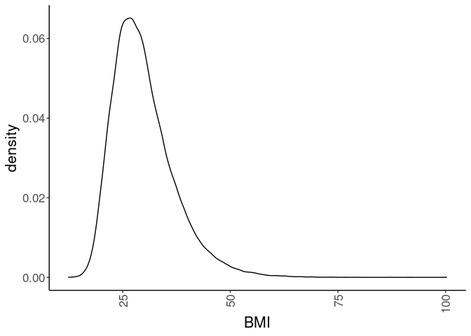
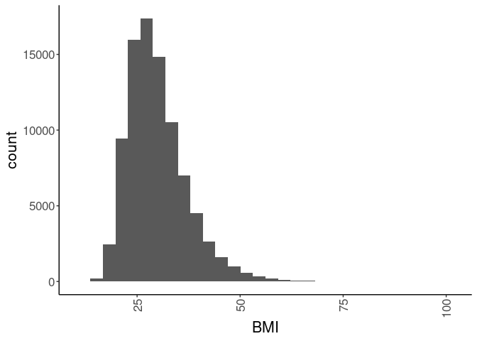

## Purpose

To test the effect modification of obesity on the stress-diabetes relationships. This script collects the the raw data files, processes and merges them. This script can be found in /nfs/turbo/precision-health/DataDirect/HUM00219435 - Obesity as a modifier of chronic psy/2023-03-14/2150 - Obesity and Stress - Cohort - DeID - 2023-03-14 and was most recently run on Thu Mar 23 16:28:28 2023.


```r
library(knitr)
#figures made will go to directory called figures, will make them as both png and pdf files 
opts_chunk$set(fig.path='figures/',
               echo=TRUE, warning=FALSE, message=FALSE,dev=c('png','pdf'))
options(scipen = 2, digits = 3)

encounters.datafile <- 'EncounterAnthropometricsBMI.csv'
```

The input data file is in EncounterAnthropometricsBMI.csv. This includes the BMI for each patient, potentially at multiple time points. This script takes this file and pulls out just the first BMI measure


```r
library(readr)
library(dplyr)
library(tidyr)
library(knitr)

#get encounter data
bmi.data <- read_csv(encounters.datafile) 
```

# Defining BMI Data

We will use the median BMI measure if there are multiple in the encounters file.


```r
bmi.cutoff <- 300
bmi.lower <- 12

bmi.data.median <- 
  bmi.data %>%
  group_by(DeID_PatientID) %>%
  summarize(BMI = median(BMI,na.rm=T),
            BMI.n = length(BMI)) 

bmi.data.complete <-
  bmi.data.median %>%
  filter(!(is.na(BMI)))  # remove rows where there is no BMI data

bmi.data.cutoff <-
  bmi.data.complete %>%
  filter(BMI<bmi.cutoff) %>% #remove BMI under cutoff
  filter(BMI>bmi.lower) #remove BMI above cutoff
```

Based on this procedure we had 91598 participants in the initial dataset.  After removing individuals with no BMI measure we had 90245 (a loss of 1353 participants).  We then removed anyone who's median BMI was >300 or <12, a loss of 3 participants.  This resulted in a final dataset of 90242.

## Analysis of BMI


```r
library(ggplot2)
bmi.data.cutoff %>%
  ggplot(aes(x=BMI)) +
  geom_density() +
  theme_classic() +
  scale_fill_grey() +
  theme(text=element_text(size=16),
        axis.text.x=element_text(angle=90,vjust=0.5,hjust=1),
        legend.position = c(0.1,0.85))
```

<!-- -->

```r
bmi.data.cutoff %>%
  ggplot(aes(x=BMI)) +
  geom_histogram() +
  theme_classic() +
  scale_fill_grey() +
  theme(text=element_text(size=16),
        axis.text.x=element_text(angle=90,vjust=0.5,hjust=1),
        legend.position = c(0.1,0.85))
```

<!-- -->

```r
bmi.data.cutoff %>%
  summarize(mean=mean(BMI,na.rm=T),
             min=min(BMI, na.rm=T),
             max=max(BMI,na.rm=T),
             sd=sd(BMI,na.rm=T),
             n=length(BMI)) %>%
  kable(caption="Summary statistics for the BMI measurements used in this study")
```


Table: Summary statistics for the BMI measurements used in this study

| mean|  min| max|  sd|     n|
|----:|----:|---:|---:|-----:|
| 29.8| 12.3| 100| 7.2| 90242|

# Validation and Checking for Outliers

We filtered out all BMI that the median was \>300. After this the highest and lowest BMI were


```r
bmi.data.cutoff %>%
  arrange(desc(BMI)) %>%
  select(BMI,BMI.n) %>%
  head(10) %>%
  kable(caption="Top 50 median BMI values and number of encounters")
```


Table: Top 50 median BMI values and number of encounters

|   BMI| BMI.n|
|-----:|-----:|
| 100.3|     1|
|  99.4|     1|
|  97.6|     1|
|  94.1|     1|
|  92.2|     1|
|  91.1|     1|
|  87.2|     1|
|  86.8|     1|
|  79.8|     1|
|  79.7|     1|

```r
bmi.data.cutoff %>%
  arrange(BMI) %>%
  select(BMI,BMI.n) %>%
  head(10) %>%
  kable(caption="Top 50 median BMI values and number of encounters")
```


Table: Top 50 median BMI values and number of encounters

|  BMI| BMI.n|
|----:|-----:|
| 12.3|     1|
| 12.5|     1|
| 12.6|     1|
| 13.0|     1|
| 13.2|     1|
| 13.6|     1|
| 13.6|     1|
| 13.7|     1|
| 14.1|     1|
| 14.1|     1|

# Output


```r
output.file <- 'MedianEncounterAnthropometricsBMI.csv'
write_csv(bmi.data.cutoff, file=output.file)
```

These data were written out to MedianEncounterAnthropometricsBMI.csv. This is the input file for the other scripts.

# Session Information


```r
sessionInfo()
```

```
## R version 4.2.0 (2022-04-22)
## Platform: x86_64-pc-linux-gnu (64-bit)
## Running under: Red Hat Enterprise Linux 8.4 (Ootpa)
## 
## Matrix products: default
## BLAS:   /sw/pkgs/arc/stacks/gcc/10.3.0/R/4.2.0/lib64/R/lib/libRblas.so
## LAPACK: /sw/pkgs/arc/stacks/gcc/10.3.0/R/4.2.0/lib64/R/lib/libRlapack.so
## 
## locale:
##  [1] LC_CTYPE=en_US.UTF-8       LC_NUMERIC=C              
##  [3] LC_TIME=en_US.UTF-8        LC_COLLATE=en_US.UTF-8    
##  [5] LC_MONETARY=en_US.UTF-8    LC_MESSAGES=en_US.UTF-8   
##  [7] LC_PAPER=en_US.UTF-8       LC_NAME=C                 
##  [9] LC_ADDRESS=C               LC_TELEPHONE=C            
## [11] LC_MEASUREMENT=en_US.UTF-8 LC_IDENTIFICATION=C       
## 
## attached base packages:
## [1] stats     graphics  grDevices utils     datasets  methods   base     
## 
## other attached packages:
## [1] ggplot2_3.4.0 tidyr_1.2.1   dplyr_1.0.10  readr_2.1.3   knitr_1.41   
## 
## loaded via a namespace (and not attached):
##  [1] highr_0.9        pillar_1.8.1     bslib_0.4.1      compiler_4.2.0  
##  [5] jquerylib_0.1.4  tools_4.2.0      bit_4.0.5        digest_0.6.30   
##  [9] gtable_0.3.1     jsonlite_1.8.4   evaluate_0.18    lifecycle_1.0.3 
## [13] tibble_3.1.8     pkgconfig_2.0.3  rlang_1.0.6      cli_3.4.1       
## [17] DBI_1.1.3        parallel_4.2.0   yaml_2.3.6       xfun_0.35       
## [21] fastmap_1.1.0    withr_2.5.0      stringr_1.5.0    generics_0.1.3  
## [25] vctrs_0.5.1      sass_0.4.4       hms_1.1.2        grid_4.2.0      
## [29] bit64_4.0.5      tidyselect_1.2.0 glue_1.6.2       R6_2.5.1        
## [33] fansi_1.0.3      vroom_1.6.0      rmarkdown_2.18   farver_2.1.1    
## [37] tzdb_0.3.0       purrr_0.3.5      magrittr_2.0.3   scales_1.2.1    
## [41] ellipsis_0.3.2   htmltools_0.5.4  assertthat_0.2.1 colorspace_2.0-3
## [45] labeling_0.4.2   utf8_1.2.2       stringi_1.7.8    munsell_0.5.0   
## [49] cachem_1.0.6     crayon_1.5.2
```
