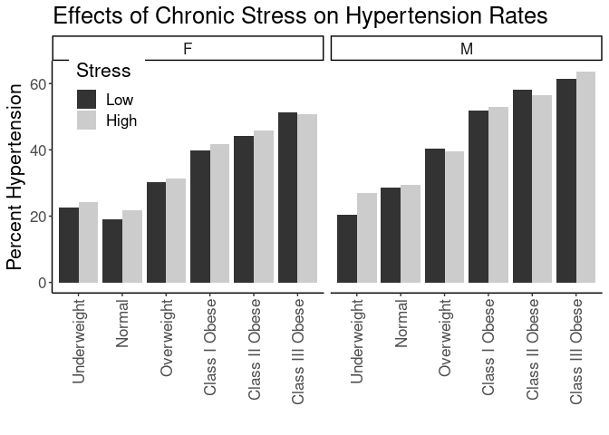
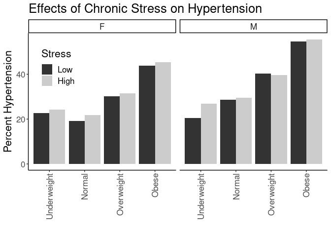
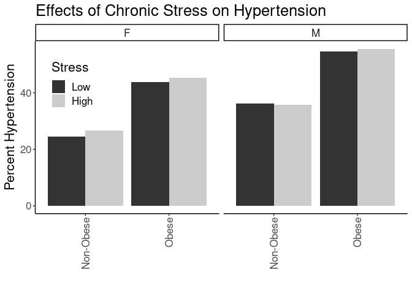

## Purpose

To test the effect modification of obesity on the stress-hypertension relationships.


```r
library(knitr)
#figures made will go to directory called figures, will make them as both png and pdf files 
opts_chunk$set(fig.path='figures/',
               echo=TRUE, warning=FALSE, message=FALSE,dev=c('png','pdf'))
options(scipen = 2, digits = 3)

library(readr)
library(dplyr)
```

```
## 
## Attaching package: 'dplyr'
```

```
## The following objects are masked from 'package:stats':
## 
##     filter, lag
```

```
## The following objects are masked from 'package:base':
## 
##     intersect, setdiff, setequal, union
```

```r
library(tidyr)
library(knitr)

input.file <- 'data-combined.csv'
combined.data <- read_csv(input.file, na="-99")%>%
  filter(!(is.na(HypertensionAny))) %>%
  filter(!(is.na(Stress))) %>%
  filter(Stress!="NA")
```

```
## Rows: 62010 Columns: 38
```

```
## ── Column specification ────────────────────────────────────────────────────────
## Delimiter: ","
## chr (21): DeID_PatientID, Gender, Stress_d1, DeID_EncounterID, affluence13_1...
## dbl (17): age, CardiacArrhythmias, ChronicPulmonaryDisease, CongestiveHeartF...
## 
## ℹ Use `spec()` to retrieve the full column specification for this data.
## ℹ Specify the column types or set `show_col_types = FALSE` to quiet this message.
```

Loaded in the cleaned data from data-combined.csv. This script can be found in /nfs/turbo/precision-health/DataDirect/HUM00219435 - Obesity as a modifier of chronic psy/2023-03-14/2150 - Obesity and Stress - Cohort - DeID - 2023-03-14 and was most recently run on Thu Mar 23 14:48:48 2023. This dataset has 39694 values.


```r
combined.data <- 
  combined.data %>%
  mutate(BMI_cat= factor(BMI_cat, 
                         levels=c("Underweight",
                                  "Normal",
                                  "Overweight",
                                  'Class I Obese',
                                  'Class II Obese',
                                  'Class III Obese'))) %>%
  mutate(BMI_cat.obese= factor(BMI_cat.obese, 
                               levels=c("Underweight",
                                        "Normal",
                                        "Overweight",
                                        'Obese'))) %>%
  mutate(BMI_cat.Ob.NonOb= factor(BMI_cat.Ob.NonOb, 
                                  levels=c("Non-Obese",
                                           'Obese'))) %>%
  mutate(Stress=relevel(as.factor(High.Stress),ref="Low"))  #set low as reference value
```

# Hypertension Complication Rates by BMI

Stratified diagnoses by various BMI categories

## Hypertension by BMI Category


```r
#calculating hypertension rates by bmi category
with(combined.data, table(HypertensionAny,BMI_cat,Gender)) %>% 
  data.frame %>%
  pivot_wider(names_from=HypertensionAny,
              values_from = Freq) %>%
  rename(HypertensionAny=`1`,
         NonDisease=`0`) %>%
  mutate(Total=HypertensionAny+NonDisease) %>%
  mutate(Percent=HypertensionAny/Total*100) -> hypertension.bmi.counts

kable(hypertension.bmi.counts, caption="Liver disease rates by BMI category")
```


Table: Liver disease rates by BMI category

|BMI_cat         |Gender | NonDisease| HypertensionAny| Total| Percent|
|:---------------|:------|----------:|---------------:|-----:|-------:|
|Underweight     |F      |        147|              45|   192|    23.4|
|Normal          |F      |       4657|            1179|  5836|    20.2|
|Overweight      |F      |       4018|            1778|  5796|    30.7|
|Class I Obese   |F      |       2472|            1695|  4167|    40.7|
|Class II Obese  |F      |       1368|            1119|  2487|    45.0|
|Class III Obese |F      |       1124|            1170|  2294|    51.0|
|Underweight     |M      |         69|              22|    91|    24.2|
|Normal          |M      |       2709|            1103|  3812|    28.9|
|Overweight      |M      |       4263|            2851|  7114|    40.1|
|Class I Obese   |M      |       2243|            2460|  4703|    52.3|
|Class II Obese  |M      |        845|            1139|  1984|    57.4|
|Class III Obese |M      |        407|             677|  1084|    62.5|

```r
library(ggplot2)

ggplot(hypertension.bmi.counts,
       aes(y=Percent,
           x=BMI_cat)) +
  geom_bar(stat='identity',position='dodge') +
  labs(y="Percent Hypertension",
       title="Effects of Chronic Stress on Hypertension Rates",
       x="") +
  theme_classic() +
  scale_fill_grey() +
  facet_grid(.~Gender) +
  theme(text=element_text(size=16),
        axis.text.x=element_text(angle=90,vjust=0.5,hjust=1),
        legend.position = c(0.1,0.85))
```

<!-- -->

## Hypertension Rate by BMI and Stress

This analysis uses all the BMI categories


```r
#calculating hypertension rates by bmi category and stress
with(combined.data, table(HypertensionAny,BMI_cat,Stress,Gender)) %>% 
  data.frame %>%
  pivot_wider(names_from=HypertensionAny,
              values_from = Freq) %>%
  rename(HypertensionAny=`1`,
         NonHypertensionAny=`0`) %>%
  mutate(Total=HypertensionAny+NonHypertensionAny) %>%
  mutate(Percent=HypertensionAny/Total*100) -> hypertension.bmi.stress.counts

library(ggplot2)

kable(hypertension.bmi.stress.counts, caption="Hypertension rates by BMI category")
```


Table: Hypertension rates by BMI category

|BMI_cat         |Stress |Gender | NonHypertensionAny| HypertensionAny| Total| Percent|
|:---------------|:------|:------|------------------:|---------------:|-----:|-------:|
|Underweight     |Low    |F      |                 72|              21|    93|    22.6|
|Normal          |Low    |F      |               2777|             658|  3435|    19.2|
|Overweight      |Low    |F      |               2327|            1003|  3330|    30.1|
|Class I Obese   |Low    |F      |               1332|             879|  2211|    39.8|
|Class II Obese  |Low    |F      |                729|             576|  1305|    44.1|
|Class III Obese |Low    |F      |                565|             595|  1160|    51.3|
|Underweight     |High   |F      |                 75|              24|    99|    24.2|
|Normal          |High   |F      |               1880|             521|  2401|    21.7|
|Overweight      |High   |F      |               1691|             775|  2466|    31.4|
|Class I Obese   |High   |F      |               1140|             816|  1956|    41.7|
|Class II Obese  |High   |F      |                639|             543|  1182|    45.9|
|Class III Obese |High   |F      |                559|             575|  1134|    50.7|
|Underweight     |Low    |M      |                 31|               8|    39|    20.5|
|Normal          |Low    |M      |               1637|             655|  2292|    28.6|
|Overweight      |Low    |M      |               2630|            1777|  4407|    40.3|
|Class I Obese   |Low    |M      |               1363|            1471|  2834|    51.9|
|Class II Obese  |Low    |M      |                474|             656|  1130|    58.1|
|Class III Obese |Low    |M      |                225|             358|   583|    61.4|
|Underweight     |High   |M      |                 38|              14|    52|    26.9|
|Normal          |High   |M      |               1072|             448|  1520|    29.5|
|Overweight      |High   |M      |               1633|            1074|  2707|    39.7|
|Class I Obese   |High   |M      |                880|             989|  1869|    52.9|
|Class II Obese  |High   |M      |                371|             483|   854|    56.6|
|Class III Obese |High   |M      |                182|             319|   501|    63.7|

```r
ggplot(hypertension.bmi.stress.counts,
       aes(y=Percent,
           x=BMI_cat,
           fill=Stress)) +
  geom_bar(stat='identity',position='dodge') +
  labs(y="Percent Hypertension",
       title="Effects of Chronic Stress on Hypertension Rates",
       x="") +
  theme_classic() +
  scale_fill_grey() +
  facet_grid(.~Gender) +
  theme(text=element_text(size=16),
        axis.text.x=element_text(angle=90,vjust=0.5,hjust=1),
        legend.position = c(0.1,0.85))
```

<!-- -->

### Logistic Regressions for All Obese Categories

Ran a series of stepwise logistic regressions testing for obesity as a modifier of the effects of stress.


```r
library(broom)
glm(HypertensionAny~BMI_cat, 
    family="binomial",
    data=combined.data) -> obesity.glm1

obesity.glm1 %>%
  tidy() %>%
  kable(caption="Logistic regression of obesity on hypertension", digits =c(0,2,3,2,99))
```


Table: Logistic regression of obesity on hypertension

|term                   | estimate| std.error| statistic|  p.value|
|:----------------------|--------:|---------:|---------:|--------:|
|(Intercept)            |    -1.17|     0.140|     -8.37| 5.72e-17|
|BMI_catNormal          |     0.00|     0.142|     -0.01| 9.93e-01|
|BMI_catOverweight      |     0.59|     0.141|      4.18| 2.97e-05|
|BMI_catClass I Obese   |     1.04|     0.141|      7.38| 1.56e-13|
|BMI_catClass II Obese  |     1.19|     0.143|      8.33| 8.32e-17|
|BMI_catClass III Obese |     1.36|     0.144|      9.43| 4.14e-21|

```r
anova(obesity.glm1,test="Chisq") %>% tidy %>%
  kable(caption="Logistic regression of obesity on hypertension, ", digits =c(0,0,0,0,0,99))
```


Table: Logistic regression of obesity on hypertension, 

|term    | df| Deviance| Resid..Df| Resid..Dev| p.value|
|:-------|--:|--------:|---------:|----------:|-------:|
|NULL    | NA|       NA|     39559|      52737|      NA|
|BMI_cat |  5|     1910|     39554|      50827|       0|

```r
#adding in stress as a modifier
glm(HypertensionAny~BMI_cat+Stress+Stress:BMI_cat, 
    family="binomial",
    data=combined.data) -> obesity.glm2

obesity.glm2 %>%
  tidy() %>%
  kable(caption="Logistic regression of obesity on hypertension, with stress as a modifier", digits =c(0,2,3,2,99))
```


Table: Logistic regression of obesity on hypertension, with stress as a modifier

|term                              | estimate| std.error| statistic|  p.value|
|:---------------------------------|--------:|---------:|---------:|--------:|
|(Intercept)                       |    -1.27|     0.210|     -6.03| 1.65e-09|
|BMI_catNormal                     |     0.05|     0.213|      0.26| 7.96e-01|
|BMI_catOverweight                 |     0.69|     0.212|      3.26| 1.12e-03|
|BMI_catClass I Obese              |     1.13|     0.212|      5.33| 9.84e-08|
|BMI_catClass II Obese             |     1.29|     0.214|      6.03| 1.63e-09|
|BMI_catClass III Obese            |     1.46|     0.216|      6.75| 1.51e-11|
|StressHigh                        |     0.18|     0.282|      0.63| 5.28e-01|
|BMI_catNormal:StressHigh          |    -0.08|     0.286|     -0.28| 7.82e-01|
|BMI_catOverweight:StressHigh      |    -0.19|     0.284|     -0.65| 5.13e-01|
|BMI_catClass I Obese:StressHigh   |    -0.15|     0.285|     -0.54| 5.91e-01|
|BMI_catClass II Obese:StressHigh  |    -0.19|     0.288|     -0.64| 5.19e-01|
|BMI_catClass III Obese:StressHigh |    -0.18|     0.290|     -0.61| 5.41e-01|

```r
anova(obesity.glm2,test="Chisq") %>% tidy %>%
  kable(caption="Logistic regression of obese vs non-obese on hypertension, with stress as a modifier", digits =c(0,0,0,0,0,99))
```


Table: Logistic regression of obese vs non-obese on hypertension, with stress as a modifier

|term           | df| Deviance| Resid..Df| Resid..Dev| p.value|
|:--------------|--:|--------:|---------:|----------:|-------:|
|NULL           | NA|       NA|     39559|      52737|      NA|
|BMI_cat        |  5|     1910|     39554|      50827|   0.000|
|Stress         |  1|        1|     39553|      50826|   0.293|
|BMI_cat:Stress |  5|        4|     39548|      50822|   0.581|

```r
#adding in age and gender as covariates as a modifier
glm(HypertensionAny~BMI_cat+Stress+Stress:BMI_cat+Gender+age, 
    family="binomial",
    data=combined.data) -> obesity.glm3

obesity.glm3 %>%
  tidy() %>%
  kable(caption="Logistic regression of obesity on hypertension, with stress as a modifier and age and  gender as covarites", digits =c(0,2,3,2,99))
```


Table: Logistic regression of obesity on hypertension, with stress as a modifier and age and  gender as covarites

|term                              | estimate| std.error| statistic|  p.value|
|:---------------------------------|--------:|---------:|---------:|--------:|
|(Intercept)                       |    -4.53|     0.234|    -19.33| 3.30e-83|
|BMI_catNormal                     |    -0.04|     0.232|     -0.19| 8.49e-01|
|BMI_catOverweight                 |     0.37|     0.231|      1.61| 1.08e-01|
|BMI_catClass I Obese              |     0.89|     0.231|      3.86| 1.11e-04|
|BMI_catClass II Obese             |     1.20|     0.233|      5.13| 2.86e-07|
|BMI_catClass III Obese            |     1.61|     0.235|      6.85| 7.14e-12|
|StressHigh                        |     0.31|     0.307|      1.00| 3.20e-01|
|GenderM                           |     0.30|     0.023|     12.61| 1.82e-36|
|age                               |     0.06|     0.001|     69.52| 0.00e+00|
|BMI_catNormal:StressHigh          |    -0.09|     0.312|     -0.28| 7.80e-01|
|BMI_catOverweight:StressHigh      |    -0.16|     0.310|     -0.52| 6.00e-01|
|BMI_catClass I Obese:StressHigh   |    -0.14|     0.311|     -0.46| 6.44e-01|
|BMI_catClass II Obese:StressHigh  |    -0.18|     0.314|     -0.57| 5.66e-01|
|BMI_catClass III Obese:StressHigh |    -0.17|     0.316|     -0.52| 6.01e-01|

```r
anova(obesity.glm3,test="Chisq") %>% tidy %>%
  kable(caption="Logistic regression of obesity on hypertension, with stress as a modifier and age and gender as covarite", digits =c(0,0,0,0,0,99))
```


Table: Logistic regression of obesity on hypertension, with stress as a modifier and age and gender as covarite

|term           | df| Deviance| Resid..Df| Resid..Dev|  p.value|
|:--------------|--:|--------:|---------:|----------:|--------:|
|NULL           | NA|       NA|     39559|      52737|       NA|
|BMI_cat        |  5|     1910|     39554|      50827| 0.00e+00|
|Stress         |  1|        1|     39553|      50826| 2.93e-01|
|Gender         |  1|      446|     39552|      50380| 5.00e-99|
|age            |  1|     6094|     39551|      44285| 0.00e+00|
|BMI_cat:Stress |  5|        2|     39546|      44283| 8.55e-01|

```r
#adding in race and ethnicity
glm(HypertensionAny~BMI_cat+Stress+Stress:BMI_cat+Gender+age+Race.Ethnicity, 
    family="binomial",
    data=combined.data) -> obesity.glm4

obesity.glm4 %>%
  tidy() %>%
  kable(caption="Logistic regression of obesity on hypertension, with stress as a modifier and age, gender and race as covarites", digits =c(0,2,3,2,99))
```


Table: Logistic regression of obesity on hypertension, with stress as a modifier and age, gender and race as covarites

|term                              | estimate| std.error| statistic|  p.value|
|:---------------------------------|--------:|---------:|---------:|--------:|
|(Intercept)                       |    -4.39|     0.256|    -17.15| 6.36e-66|
|BMI_catNormal                     |    -0.05|     0.232|     -0.23| 8.18e-01|
|BMI_catOverweight                 |     0.36|     0.231|      1.55| 1.20e-01|
|BMI_catClass I Obese              |     0.88|     0.231|      3.79| 1.50e-04|
|BMI_catClass II Obese             |     1.18|     0.233|      5.06| 4.18e-07|
|BMI_catClass III Obese            |     1.58|     0.235|      6.73| 1.70e-11|
|StressHigh                        |     0.30|     0.308|      0.99| 3.23e-01|
|GenderM                           |     0.30|     0.024|     12.86| 7.34e-38|
|age                               |     0.06|     0.001|     69.66| 0.00e+00|
|Race.EthnicityBlack               |     0.51|     0.123|      4.12| 3.79e-05|
|Race.EthnicityHispanic/Latino     |    -0.36|     0.143|     -2.56| 1.06e-02|
|Race.EthnicityOther               |    -0.38|     0.129|     -2.95| 3.21e-03|
|Race.EthnicityWhite               |    -0.21|     0.111|     -1.90| 5.76e-02|
|BMI_catNormal:StressHigh          |    -0.09|     0.312|     -0.28| 7.81e-01|
|BMI_catOverweight:StressHigh      |    -0.17|     0.310|     -0.54| 5.91e-01|
|BMI_catClass I Obese:StressHigh   |    -0.15|     0.311|     -0.47| 6.38e-01|
|BMI_catClass II Obese:StressHigh  |    -0.19|     0.315|     -0.60| 5.50e-01|
|BMI_catClass III Obese:StressHigh |    -0.17|     0.317|     -0.53| 5.99e-01|

```r
anova(obesity.glm4,test="Chisq") %>% tidy %>%
  kable(caption="Logistic regression of obesity on hypertension, with stress as a modifier and age, gender and race as covarite", digits =c(0,0,0,0,0,99))
```


Table: Logistic regression of obesity on hypertension, with stress as a modifier and age, gender and race as covarite

|term           | df| Deviance| Resid..Df| Resid..Dev|  p.value|
|:--------------|--:|--------:|---------:|----------:|--------:|
|NULL           | NA|       NA|     39559|      52737|       NA|
|BMI_cat        |  5|     1910|     39554|      50827| 0.00e+00|
|Stress         |  1|        1|     39553|      50826| 2.93e-01|
|Gender         |  1|      446|     39552|      50380| 5.00e-99|
|age            |  1|     6094|     39551|      44285| 0.00e+00|
|Race.Ethnicity |  4|      182|     39547|      44104| 3.25e-38|
|BMI_cat:Stress |  5|        2|     39542|      44102| 8.22e-01|

### Hypertension Rates by Quartiles


```r
with(combined.data, table(HypertensionAny,BMI_cat.obese,Stress.quartile,Gender)) %>% 
  data.frame %>%
  pivot_wider(names_from=HypertensionAny,
              values_from = Freq) %>%
  rename(HypertensionAny=`1`,
         NonDisease=`0`) %>%
  mutate(Total=HypertensionAny+NonDisease) %>%
  mutate(Percent=HypertensionAny/Total*100) -> hypertension.bmi.stress.quartile.counts

kable(hypertension.bmi.stress.quartile.counts, caption="Hypertension Rates by BMI and Stress Quartile")
```


Table: Hypertension Rates by BMI and Stress Quartile

|BMI_cat.obese |Stress.quartile |Gender | NonDisease| HypertensionAny| Total| Percent|
|:-------------|:---------------|:------|----------:|---------------:|-----:|-------:|
|Underweight   |(-0.016,4]      |F      |         56|              17|    73|    23.3|
|Normal        |(-0.016,4]      |F      |       2321|             553|  2874|    19.2|
|Overweight    |(-0.016,4]      |F      |       1958|             831|  2789|    29.8|
|Obese         |(-0.016,4]      |F      |       2169|            1709|  3878|    44.1|
|Underweight   |(12,16]         |F      |          3|               0|     3|     0.0|
|Normal        |(12,16]         |F      |         59|              17|    76|    22.4|
|Overweight    |(12,16]         |F      |         57|              25|    82|    30.5|
|Obese         |(12,16]         |F      |         86|              61|   147|    41.5|
|Underweight   |(4,8]           |F      |         64|              20|    84|    23.8|
|Normal        |(4,8]           |F      |       1762|             465|  2227|    20.9|
|Overweight    |(4,8]           |F      |       1546|             700|  2246|    31.2|
|Obese         |(4,8]           |F      |       2000|            1619|  3619|    44.7|
|Underweight   |(8,12]          |F      |         24|               8|    32|    25.0|
|Normal        |(8,12]          |F      |        515|             144|   659|    21.9|
|Overweight    |(8,12]          |F      |        457|             222|   679|    32.7|
|Obese         |(8,12]          |F      |        709|             595|  1304|    45.6|
|Underweight   |(-0.016,4]      |M      |         21|               7|    28|    25.0|
|Normal        |(-0.016,4]      |M      |       1395|             574|  1969|    29.2|
|Overweight    |(-0.016,4]      |M      |       2283|            1508|  3791|    39.8|
|Obese         |(-0.016,4]      |M      |       1743|            2123|  3866|    54.9|
|Underweight   |(12,16]         |M      |          2|               0|     2|     0.0|
|Normal        |(12,16]         |M      |         30|              18|    48|    37.5|
|Overweight    |(12,16]         |M      |         30|              22|    52|    42.3|
|Obese         |(12,16]         |M      |         43|              47|    90|    52.2|
|Underweight   |(4,8]           |M      |         34|              12|    46|    26.1|
|Normal        |(4,8]           |M      |       1021|             408|  1429|    28.6|
|Overweight    |(4,8]           |M      |       1593|            1095|  2688|    40.7|
|Obese         |(4,8]           |M      |       1327|            1677|  3004|    55.8|
|Underweight   |(8,12]          |M      |         12|               3|    15|    20.0|
|Normal        |(8,12]          |M      |        263|             103|   366|    28.1|
|Overweight    |(8,12]          |M      |        357|             226|   583|    38.8|
|Obese         |(8,12]          |M      |        382|             429|   811|    52.9|

```r
ggplot(hypertension.bmi.stress.quartile.counts,
       aes(y=Percent,
           x=BMI_cat.obese,
           fill=Stress.quartile)) +
  geom_bar(stat='identity',position='dodge') +
  labs(y="Percent HypertensionAny",
       title="Effects of Chronic Stress on Hypertension",
       x="") +
  theme_classic() +
  facet_grid(.~Gender) +
  theme(text=element_text(size=16),
        axis.text.x=element_text(angle=90,vjust=0.5,hjust=1),
        legend.position = c(0.15,0.75))
```

<!-- -->

## Hypertension Rates by Normal Obesity and Stress


```r
#calculating hypertension rates by bmi category, stress and gender
with(combined.data, table(HypertensionAny,BMI_cat.obese,Stress,Gender)) %>% 
  data.frame %>%
  pivot_wider(names_from=HypertensionAny,
              values_from = Freq) %>%
  rename(HypertensionAny=`1`,
         NonDisease=`0`) %>%
  mutate(Total=HypertensionAny+NonDisease) %>%
  mutate(Percent=HypertensionAny/Total*100) -> hypertension.bmi.stress.gender.counts

kable(hypertension.bmi.stress.gender.counts, caption="Hypertension Rates by BMI and Stress")
```


Table: Hypertension Rates by BMI and Stress

|BMI_cat.obese |Stress |Gender | NonDisease| HypertensionAny| Total| Percent|
|:-------------|:------|:------|----------:|---------------:|-----:|-------:|
|Underweight   |Low    |F      |         72|              21|    93|    22.6|
|Normal        |Low    |F      |       2777|             658|  3435|    19.2|
|Overweight    |Low    |F      |       2327|            1003|  3330|    30.1|
|Obese         |Low    |F      |       2626|            2050|  4676|    43.8|
|Underweight   |High   |F      |         75|              24|    99|    24.2|
|Normal        |High   |F      |       1880|             521|  2401|    21.7|
|Overweight    |High   |F      |       1691|             775|  2466|    31.4|
|Obese         |High   |F      |       2338|            1934|  4272|    45.3|
|Underweight   |Low    |M      |         31|               8|    39|    20.5|
|Normal        |Low    |M      |       1637|             655|  2292|    28.6|
|Overweight    |Low    |M      |       2630|            1777|  4407|    40.3|
|Obese         |Low    |M      |       2062|            2485|  4547|    54.7|
|Underweight   |High   |M      |         38|              14|    52|    26.9|
|Normal        |High   |M      |       1072|             448|  1520|    29.5|
|Overweight    |High   |M      |       1633|            1074|  2707|    39.7|
|Obese         |High   |M      |       1433|            1791|  3224|    55.6|

```r
ggplot(hypertension.bmi.stress.gender.counts,
       aes(y=Percent,
           x=BMI_cat.obese,
           fill=Stress)) +
  geom_bar(stat='identity',position='dodge') +
  labs(y="Percent Hypertension",
       title="Effects of Chronic Stress on Hypertension",
       x="") +
  facet_grid(.~Gender) +
  theme_classic() +
  scale_fill_grey() +
  theme(text=element_text(size=16),
        axis.text.x=element_text(angle=90,vjust=0.5,hjust=1),
        legend.position = c(0.1,0.75))
```

<!-- -->

## Logistic Regressions for Obese/Non-Obese

Ran a series of logistic regressions using the normal obesity categories not classes as the categorization


```r
glm(HypertensionAny~BMI_cat.obese, 
    family="binomial",
    data=combined.data) -> obesity.glm1

obesity.glm1 %>%
  tidy() %>%
  kable(caption="Logistic regression of obese vs non-obese on liver disease", digits =c(0,2,3,2,99))
```


Table: Logistic regression of obese vs non-obese on liver disease

|term                    | estimate| std.error| statistic|  p.value|
|:-----------------------|--------:|---------:|---------:|--------:|
|(Intercept)             |    -1.17|     0.140|     -8.37| 5.72e-17|
|BMI_cat.obeseNormal     |     0.00|     0.142|     -0.01| 9.93e-01|
|BMI_cat.obeseOverweight |     0.59|     0.141|      4.18| 2.97e-05|
|BMI_cat.obeseObese      |     1.15|     0.141|      8.15| 3.61e-16|

```r
anova(obesity.glm1,test="Chisq") %>% tidy %>%
  kable(caption="Logistic regression of obesity on liver disease, ", digits =c(0,0,0,0,0,99))
```


Table: Logistic regression of obesity on liver disease, 

|term          | df| Deviance| Resid..Df| Resid..Dev| p.value|
|:-------------|--:|--------:|---------:|----------:|-------:|
|NULL          | NA|       NA|     39559|      52737|      NA|
|BMI_cat.obese |  3|     1847|     39556|      50890|       0|

```r
#adding in stress as a modifier
glm(HypertensionAny~BMI_cat.obese+Stress+Stress:BMI_cat.obese, 
    family="binomial",
    data=combined.data) -> obesity.glm2

obesity.glm2 %>%
  tidy() %>%
  kable(caption="Logistic regression of obesity on liver disease, with stress as a modifier", digits =c(0,2,3,2,99))
```


Table: Logistic regression of obesity on liver disease, with stress as a modifier

|term                               | estimate| std.error| statistic|  p.value|
|:----------------------------------|--------:|---------:|---------:|--------:|
|(Intercept)                        |    -1.27|     0.210|     -6.03| 1.65e-09|
|BMI_cat.obeseNormal                |     0.05|     0.213|      0.26| 7.96e-01|
|BMI_cat.obeseOverweight            |     0.69|     0.212|      3.26| 1.12e-03|
|BMI_cat.obeseObese                 |     1.23|     0.211|      5.84| 5.14e-09|
|StressHigh                         |     0.18|     0.282|      0.63| 5.28e-01|
|BMI_cat.obeseNormal:StressHigh     |    -0.08|     0.286|     -0.28| 7.82e-01|
|BMI_cat.obeseOverweight:StressHigh |    -0.19|     0.284|     -0.65| 5.13e-01|
|BMI_cat.obeseObese:StressHigh      |    -0.16|     0.283|     -0.55| 5.80e-01|

```r
anova(obesity.glm2,test="Chisq") %>% tidy %>%
  kable(caption="Logistic regression of obesity on liver disease, with stress as a modifier", digits =c(0,0,0,0,0,99))
```


Table: Logistic regression of obesity on liver disease, with stress as a modifier

|term                 | df| Deviance| Resid..Df| Resid..Dev| p.value|
|:--------------------|--:|--------:|---------:|----------:|-------:|
|NULL                 | NA|       NA|     39559|      52737|      NA|
|BMI_cat.obese        |  3|     1847|     39556|      50890|   0.000|
|Stress               |  1|        2|     39555|      50889|   0.202|
|BMI_cat.obese:Stress |  3|        3|     39552|      50885|   0.338|

```r
#adding in age and gender as covariates as a modifier
glm(HypertensionAny~BMI_cat.obese+Stress+Stress:BMI_cat.obese+Gender+age, 
    family="binomial",
    data=combined.data) -> obesity.glm3

obesity.glm3 %>%
  tidy() %>%
  kable(caption="Logistic regression of obesity on liver disease, with stress as a modifier and age and  gender as covarites", digits =c(0,2,3,2,99))
```


Table: Logistic regression of obesity on liver disease, with stress as a modifier and age and  gender as covarites

|term                               | estimate| std.error| statistic|  p.value|
|:----------------------------------|--------:|---------:|---------:|--------:|
|(Intercept)                        |    -4.44|     0.233|    -19.04| 7.68e-81|
|BMI_cat.obeseNormal                |    -0.04|     0.231|     -0.16| 8.73e-01|
|BMI_cat.obeseOverweight            |     0.39|     0.230|      1.68| 9.35e-02|
|BMI_cat.obeseObese                 |     1.12|     0.229|      4.86| 1.16e-06|
|StressHigh                         |     0.30|     0.306|      0.99| 3.20e-01|
|GenderM                            |     0.26|     0.023|     11.01| 3.61e-28|
|age                                |     0.06|     0.001|     68.90| 0.00e+00|
|BMI_cat.obeseNormal:StressHigh     |    -0.09|     0.311|     -0.29| 7.73e-01|
|BMI_cat.obeseOverweight:StressHigh |    -0.17|     0.309|     -0.54| 5.91e-01|
|BMI_cat.obeseObese:StressHigh      |    -0.14|     0.308|     -0.45| 6.50e-01|

```r
anova(obesity.glm3,test="Chisq") %>% tidy %>%
  kable(caption="Logistic regression of obesity on liver disease, with stress as a modifier and age and gender as covarite", digits =c(0,0,0,0,0,99))
```


Table: Logistic regression of obesity on liver disease, with stress as a modifier and age and gender as covarite

|term                 | df| Deviance| Resid..Df| Resid..Dev|  p.value|
|:--------------------|--:|--------:|---------:|----------:|--------:|
|NULL                 | NA|       NA|     39559|      52737|       NA|
|BMI_cat.obese        |  3|     1847|     39556|      50890| 0.00e+00|
|Stress               |  1|        2|     39555|      50889| 2.02e-01|
|Gender               |  1|      404|     39554|      50485| 8.08e-90|
|age                  |  1|     5939|     39553|      44546| 0.00e+00|
|BMI_cat.obese:Stress |  3|        2|     39550|      44545| 6.80e-01|

```r
#adding in race and ethnicity
glm(HypertensionAny~BMI_cat.obese+Stress+Stress:BMI_cat.obese+Gender+age+Race.Ethnicity, 
    family="binomial",
    data=combined.data) -> obesity.glm4

obesity.glm4 %>%
  tidy() %>%
  kable(caption="Logistic regression of obesity on liver diesease, with stress as a modifier and age, gender and race as covarites", digits =c(0,2,3,2,99))
```


Table: Logistic regression of obesity on liver diesease, with stress as a modifier and age, gender and race as covarites

|term                               | estimate| std.error| statistic|  p.value|
|:----------------------------------|--------:|---------:|---------:|--------:|
|(Intercept)                        |    -4.34|     0.255|    -17.03| 5.29e-65|
|BMI_cat.obeseNormal                |    -0.05|     0.231|     -0.20| 8.39e-01|
|BMI_cat.obeseOverweight            |     0.37|     0.230|      1.62| 1.06e-01|
|BMI_cat.obeseObese                 |     1.10|     0.230|      4.77| 1.87e-06|
|StressHigh                         |     0.30|     0.307|      0.98| 3.25e-01|
|GenderM                            |     0.26|     0.023|     11.30| 1.29e-29|
|age                                |     0.06|     0.001|     69.06| 0.00e+00|
|Race.EthnicityBlack                |     0.56|     0.122|      4.59| 4.54e-06|
|Race.EthnicityHispanic/Latino      |    -0.33|     0.142|     -2.35| 1.88e-02|
|Race.EthnicityOther                |    -0.34|     0.129|     -2.64| 8.41e-03|
|Race.EthnicityWhite                |    -0.17|     0.111|     -1.55| 1.21e-01|
|BMI_cat.obeseNormal:StressHigh     |    -0.09|     0.311|     -0.29| 7.75e-01|
|BMI_cat.obeseOverweight:StressHigh |    -0.17|     0.310|     -0.55| 5.83e-01|
|BMI_cat.obeseObese:StressHigh      |    -0.14|     0.309|     -0.46| 6.43e-01|

```r
anova(obesity.glm4,test="Chisq") %>% tidy %>%
  kable(caption="Logistic regression of obesity on liver disease, with stress as a modifier and age, gender and race as covariates", digits =c(0,0,0,0,0,99))
```


Table: Logistic regression of obesity on liver disease, with stress as a modifier and age, gender and race as covariates

|term                 | df| Deviance| Resid..Df| Resid..Dev|  p.value|
|:--------------------|--:|--------:|---------:|----------:|--------:|
|NULL                 | NA|       NA|     39559|      52737|       NA|
|BMI_cat.obese        |  3|     1847|     39556|      50890| 0.00e+00|
|Stress               |  1|        2|     39555|      50889| 2.02e-01|
|Gender               |  1|      404|     39554|      50485| 8.08e-90|
|age                  |  1|     5939|     39553|      44546| 0.00e+00|
|Race.Ethnicity       |  4|      191|     39549|      44356| 3.96e-40|
|BMI_cat.obese:Stress |  3|        2|     39546|      44354| 6.44e-01|

# Hypertension Rates by Obese/Not Obese and Stress


```r
with(combined.data, table(HypertensionAny,BMI_cat.Ob.NonOb,Stress,Gender)) %>% 
  data.frame %>%
  pivot_wider(names_from=HypertensionAny,
              values_from = Freq) %>%
  rename(HypertensionAny=`1`,
         NonDisease=`0`) %>%
  mutate(Total=HypertensionAny+NonDisease) %>%
  mutate(Percent=HypertensionAny/Total*100) -> hypertension.BMI_cat.Ob.NonOb.stress.counts

kable(hypertension.BMI_cat.Ob.NonOb.stress.counts, caption="Hypertension Rates by Obese or not and Stress")
```


Table: Hypertension Rates by Obese or not and Stress

|BMI_cat.Ob.NonOb |Stress |Gender | NonDisease| HypertensionAny| Total| Percent|
|:----------------|:------|:------|----------:|---------------:|-----:|-------:|
|Non-Obese        |Low    |F      |       5218|            1695|  6913|    24.5|
|Obese            |Low    |F      |       2626|            2050|  4676|    43.8|
|Non-Obese        |High   |F      |       3674|            1331|  5005|    26.6|
|Obese            |High   |F      |       2338|            1934|  4272|    45.3|
|Non-Obese        |Low    |M      |       4313|            2444|  6757|    36.2|
|Obese            |Low    |M      |       2062|            2485|  4547|    54.7|
|Non-Obese        |High   |M      |       2758|            1542|  4300|    35.9|
|Obese            |High   |M      |       1433|            1791|  3224|    55.6|

```r
ggplot(hypertension.BMI_cat.Ob.NonOb.stress.counts,
       aes(y=Percent,
           x=BMI_cat.Ob.NonOb,
           fill=Stress)) +
  geom_bar(stat='identity',position='dodge') +
  labs(y="Percent Hypertension",
       title="Effects of Chronic Stress on Hypertension",
       x="") +
  facet_grid(.~Gender) +
  theme_classic() +
  scale_fill_grey() +
  theme(text=element_text(size=16),
        axis.text.x=element_text(angle=90,vjust=0.5,hjust=1),
        legend.position = c(0.1,0.75))
```

<!-- -->

## Logistic Regressions for Obese/Non-Obese

Ran a series of logistic regressions using obese/non-obese as the categorization


```r
glm(HypertensionAny~BMI_cat.Ob.NonOb, 
    family="binomial",
    data=combined.data) -> obesity.glm1

obesity.glm1 %>%
  tidy() %>%
  kable(caption="Logistic regression of obese vs non-obese on hypertension", digits =c(0,2,3,2,99))
```


Table: Logistic regression of obese vs non-obese on hypertension

|term                  | estimate| std.error| statistic| p.value|
|:---------------------|--------:|---------:|---------:|-------:|
|(Intercept)           |    -0.82|     0.014|     -57.4|       0|
|BMI_cat.Ob.NonObObese |     0.80|     0.021|      37.9|       0|

```r
anova(obesity.glm1,test="Chisq") %>% tidy %>%
  kable(caption="Logistic regression of obese vs non-obese on hypertension, ", digits =c(0,0,0,0,0,99))
```


Table: Logistic regression of obese vs non-obese on hypertension, 

|term             | df| Deviance| Resid..Df| Resid..Dev| p.value|
|:----------------|--:|--------:|---------:|----------:|-------:|
|NULL             | NA|       NA|     39693|      52899|      NA|
|BMI_cat.Ob.NonOb |  1|     1455|     39692|      51444|       0|

```r
#adding in stress as a modifier
glm(HypertensionAny~BMI_cat.Ob.NonOb+Stress+Stress:BMI_cat.Ob.NonOb, 
    family="binomial",
    data=combined.data) -> obesity.glm2

obesity.glm2 %>%
  tidy() %>%
  kable(caption="Logistic regression of obese vs non-obese on hypertension, with stress as a modifier", digits =c(0,2,3,2,99))
```


Table: Logistic regression of obese vs non-obese on hypertension, with stress as a modifier

|term                             | estimate| std.error| statistic| p.value|
|:--------------------------------|--------:|---------:|---------:|-------:|
|(Intercept)                      |    -0.83|     0.019|    -44.81|   0.000|
|BMI_cat.Ob.NonObObese            |     0.80|     0.028|     28.67|   0.000|
|StressHigh                       |     0.03|     0.029|      0.97|   0.334|
|BMI_cat.Ob.NonObObese:StressHigh |    -0.01|     0.043|     -0.17|   0.865|

```r
anova(obesity.glm2,test="Chisq") %>% tidy %>%
  kable(caption="Logistic regression of obese vs non-obese on hypertension, with stress as a modifier", digits =c(0,0,0,0,0,99))
```


Table: Logistic regression of obese vs non-obese on hypertension, with stress as a modifier

|term                    | df| Deviance| Resid..Df| Resid..Dev| p.value|
|:-----------------------|--:|--------:|---------:|----------:|-------:|
|NULL                    | NA|       NA|     39693|      52899|      NA|
|BMI_cat.Ob.NonOb        |  1|     1455|     39692|      51444|   0.000|
|Stress                  |  1|        1|     39691|      51442|   0.244|
|BMI_cat.Ob.NonOb:Stress |  1|        0|     39690|      51442|   0.865|

```r
#adding in age and gender as covariates as a modifier
glm(HypertensionAny~BMI_cat.Ob.NonOb+Stress+Stress:BMI_cat.Ob.NonOb+Gender+age, 
    family="binomial",
    data=combined.data) -> obesity.glm3

obesity.glm3 %>%
  tidy() %>%
  kable(caption="Logistic regression of obese vs non-obese on hypertension, with stress as a modifier and age and  gender as covarites", digits =c(0,2,3,2,99))
```


Table: Logistic regression of obese vs non-obese on hypertension, with stress as a modifier and age and  gender as covarites

|term                             | estimate| std.error| statistic|  p.value|
|:--------------------------------|--------:|---------:|---------:|--------:|
|(Intercept)                      |    -4.25|     0.054|    -78.99| 0.00e+00|
|BMI_cat.Ob.NonObObese            |     0.89|     0.031|     29.25| 0.00e+00|
|StressHigh                       |     0.16|     0.032|      5.14| 2.79e-07|
|GenderM                          |     0.29|     0.023|     12.45| 1.32e-35|
|age                              |     0.06|     0.001|     69.75| 0.00e+00|
|BMI_cat.Ob.NonObObese:StressHigh |     0.00|     0.046|      0.07| 9.43e-01|

```r
anova(obesity.glm3,test="Chisq") %>% tidy %>%
  kable(caption="Logistic regression of obese vs non-obese on hypertension, with stress as a modifier and age and gender as covarite", digits =c(0,0,0,0,0,99))
```


Table: Logistic regression of obese vs non-obese on hypertension, with stress as a modifier and age and gender as covarite

|term                    | df| Deviance| Resid..Df| Resid..Dev| p.value|
|:-----------------------|--:|--------:|---------:|----------:|-------:|
|NULL                    | NA|       NA|     39693|      52899|      NA|
|BMI_cat.Ob.NonOb        |  1|     1455|     39692|      51444|   0.000|
|Stress                  |  1|        1|     39691|      51442|   0.244|
|Gender                  |  1|      491|     39690|      50951|   0.000|
|age                     |  1|     6130|     39689|      44822|   0.000|
|BMI_cat.Ob.NonOb:Stress |  1|        0|     39688|      44822|   0.943|

```r
#adding in race and ethnicity
glm(HypertensionAny~BMI_cat.Ob.NonOb+Stress+Stress:BMI_cat.Ob.NonOb+Gender+age+Race.Ethnicity, 
    family="binomial",
    data=combined.data) -> obesity.glm4

obesity.glm4 %>%
  tidy() %>%
  kable(caption="Logistic regression of obese vs non-obese on hypertension, with stress as a modifier and age, gender and race as covarites", digits =c(0,2,3,2,99))
```


Table: Logistic regression of obese vs non-obese on hypertension, with stress as a modifier and age, gender and race as covarites

|term                             | estimate| std.error| statistic|  p.value|
|:--------------------------------|--------:|---------:|---------:|--------:|
|(Intercept)                      |    -4.23|     0.117|    -35.98| 0.00e+00|
|BMI_cat.Ob.NonObObese            |     0.88|     0.031|     28.80| 0.00e+00|
|StressHigh                       |     0.16|     0.032|      4.96| 6.90e-07|
|GenderM                          |     0.29|     0.023|     12.72| 4.85e-37|
|age                              |     0.06|     0.001|     69.85| 0.00e+00|
|Race.EthnicityBlack              |     0.64|     0.122|      5.24| 1.64e-07|
|Race.EthnicityHispanic/Latino    |    -0.27|     0.142|     -1.90| 5.69e-02|
|Race.EthnicityOther              |    -0.27|     0.128|     -2.14| 3.20e-02|
|Race.EthnicityWhite              |    -0.11|     0.110|     -0.97| 3.34e-01|
|BMI_cat.Ob.NonObObese:StressHigh |     0.00|     0.047|      0.05| 9.64e-01|

```r
anova(obesity.glm4,test="Chisq") %>% tidy %>%
  kable(caption="Logistic regression of obese vs non-obese on hypertension, with stress as a modifier and age, gender and race as covarite", digits =c(0,0,0,0,0,99))
```


Table: Logistic regression of obese vs non-obese on hypertension, with stress as a modifier and age, gender and race as covarite

|term                    | df| Deviance| Resid..Df| Resid..Dev|  p.value|
|:-----------------------|--:|--------:|---------:|----------:|--------:|
|NULL                    | NA|       NA|     39693|      52899|       NA|
|BMI_cat.Ob.NonOb        |  1|     1455|     39692|      51444| 0.00e+00|
|Stress                  |  1|        1|     39691|      51442| 2.44e-01|
|Gender                  |  1|      491|     39690|      50951| 0.00e+00|
|age                     |  1|     6130|     39689|      44822| 0.00e+00|
|Race.Ethnicity          |  4|      195|     39685|      44626| 3.85e-41|
|BMI_cat.Ob.NonOb:Stress |  1|        0|     39684|      44626| 9.64e-01|

# Summary of Covariates

Stratified data by stress and obesity status and summarized data


```r
combined.data %>%
  group_by(Stress,BMI_cat.Ob.NonOb) %>%
  count %>%
  knitr::kable(caption="Number of participants by group")
```


Table: Number of participants by group

|Stress |BMI_cat.Ob.NonOb |     n|
|:------|:----------------|-----:|
|Low    |Non-Obese        | 13670|
|Low    |Obese            |  9223|
|High   |Non-Obese        |  9305|
|High   |Obese            |  7496|

```r
combined.data %>%
  group_by(Stress,BMI_cat.Ob.NonOb,Gender) %>%
  count %>%
    filter(!(is.na(Stress))) %>%
  filter(!(is.na(BMI_cat.Ob.NonOb))) %>%
  knitr::kable(caption="Number of participants by group and gender")
```


Table: Number of participants by group and gender

|Stress |BMI_cat.Ob.NonOb |Gender |    n|
|:------|:----------------|:------|----:|
|Low    |Non-Obese        |F      | 6913|
|Low    |Non-Obese        |M      | 6757|
|Low    |Obese            |F      | 4676|
|Low    |Obese            |M      | 4547|
|High   |Non-Obese        |F      | 5005|
|High   |Non-Obese        |M      | 4300|
|High   |Obese            |F      | 4272|
|High   |Obese            |M      | 3224|

```r
combined.data %>%
  group_by(Stress,BMI_cat.Ob.NonOb,Race.Ethnicity) %>%
  count %>%
    filter(!(is.na(Stress))) %>%
  filter(!(is.na(BMI_cat.Ob.NonOb))) %>%
  knitr::kable(caption="Number of participants by group and race/ethnicity")
```


Table: Number of participants by group and race/ethnicity

|Stress |BMI_cat.Ob.NonOb |Race.Ethnicity  |     n|
|:------|:----------------|:---------------|-----:|
|Low    |Non-Obese        |Asian           |   316|
|Low    |Non-Obese        |Black           |   394|
|Low    |Non-Obese        |Hispanic/Latino |   250|
|Low    |Non-Obese        |Other           |   431|
|Low    |Non-Obese        |White           | 12279|
|Low    |Obese            |Asian           |    36|
|Low    |Obese            |Black           |   484|
|Low    |Obese            |Hispanic/Latino |   180|
|Low    |Obese            |Other           |   302|
|Low    |Obese            |White           |  8221|
|High   |Non-Obese        |Asian           |   187|
|High   |Non-Obese        |Black           |   386|
|High   |Non-Obese        |Hispanic/Latino |   185|
|High   |Non-Obese        |Other           |   311|
|High   |Non-Obese        |White           |  8236|
|High   |Obese            |Asian           |    41|
|High   |Obese            |Black           |   475|
|High   |Obese            |Hispanic/Latino |   163|
|High   |Obese            |Other           |   232|
|High   |Obese            |White           |  6585|

```r
combined.data %>%
  group_by(Stress,BMI_cat.Ob.NonOb) %>%
    filter(!(is.na(Stress))) %>%
  filter(!(is.na(BMI_cat.Ob.NonOb))) %>%
  summarize_at(c('BMI','age'), list(mean=~mean(.x,na.rm=T),
                                    sd=~sd(.x,na.rm=T),
                                    n=~length(.x)))%>%
  knitr::kable(caption="Average BMI and age of participants by group")
```


Table: Average BMI and age of participants by group

|Stress |BMI_cat.Ob.NonOb | BMI_mean| age_mean| BMI_sd| age_sd| BMI_n| age_n|
|:------|:----------------|--------:|--------:|------:|------:|-----:|-----:|
|Low    |Non-Obese        |     25.3|     53.0|   2.98|   17.7| 13670| 13670|
|Low    |Obese            |     36.0|     54.7|   5.72|   14.6|  9223|  9223|
|High   |Non-Obese        |     25.2|     51.0|   3.13|   17.8|  9305|  9305|
|High   |Obese            |     36.6|     52.6|   6.00|   14.6|  7496|  7496|

```r
combined.data %>%
  group_by(Stress,BMI_cat.Ob.NonOb) %>%
  summarize_at(c('BMI','age'), list(mean=~mean(.x,na.rm=T),
                                    sd=~sd(.x,na.rm=T),
                                    n=~length(.x)))%>%
  filter(!(is.na(Stress))) %>%
  filter(!(is.na(BMI_cat.Ob.NonOb))) %>%
  knitr::kable(caption="Average BMI and age of participants by group,complete cases")
```


Table: Average BMI and age of participants by group,complete cases

|Stress |BMI_cat.Ob.NonOb | BMI_mean| age_mean| BMI_sd| age_sd| BMI_n| age_n|
|:------|:----------------|--------:|--------:|------:|------:|-----:|-----:|
|Low    |Non-Obese        |     25.3|     53.0|   2.98|   17.7| 13670| 13670|
|Low    |Obese            |     36.0|     54.7|   5.72|   14.6|  9223|  9223|
|High   |Non-Obese        |     25.2|     51.0|   3.13|   17.8|  9305|  9305|
|High   |Obese            |     36.6|     52.6|   6.00|   14.6|  7496|  7496|

# Session Information


```r
sessionInfo()
```

```
## R version 4.2.0 (2022-04-22)
## Platform: x86_64-pc-linux-gnu (64-bit)
## Running under: Red Hat Enterprise Linux 8.4 (Ootpa)
## 
## Matrix products: default
## BLAS:   /sw/pkgs/arc/stacks/gcc/10.3.0/R/4.2.0/lib64/R/lib/libRblas.so
## LAPACK: /sw/pkgs/arc/stacks/gcc/10.3.0/R/4.2.0/lib64/R/lib/libRlapack.so
## 
## locale:
##  [1] LC_CTYPE=en_US.UTF-8       LC_NUMERIC=C              
##  [3] LC_TIME=en_US.UTF-8        LC_COLLATE=en_US.UTF-8    
##  [5] LC_MONETARY=en_US.UTF-8    LC_MESSAGES=en_US.UTF-8   
##  [7] LC_PAPER=en_US.UTF-8       LC_NAME=C                 
##  [9] LC_ADDRESS=C               LC_TELEPHONE=C            
## [11] LC_MEASUREMENT=en_US.UTF-8 LC_IDENTIFICATION=C       
## 
## attached base packages:
## [1] stats     graphics  grDevices utils     datasets  methods   base     
## 
## other attached packages:
## [1] broom_1.0.1   ggplot2_3.4.0 tidyr_1.2.1   dplyr_1.0.10  readr_2.1.3  
## [6] knitr_1.41   
## 
## loaded via a namespace (and not attached):
##  [1] highr_0.9        pillar_1.8.1     bslib_0.4.1      compiler_4.2.0  
##  [5] jquerylib_0.1.4  tools_4.2.0      bit_4.0.5        digest_0.6.30   
##  [9] gtable_0.3.1     jsonlite_1.8.4   evaluate_0.18    lifecycle_1.0.3 
## [13] tibble_3.1.8     pkgconfig_2.0.3  rlang_1.0.6      cli_3.4.1       
## [17] DBI_1.1.3        parallel_4.2.0   yaml_2.3.6       xfun_0.35       
## [21] fastmap_1.1.0    withr_2.5.0      stringr_1.5.0    generics_0.1.3  
## [25] vctrs_0.5.1      sass_0.4.4       hms_1.1.2        grid_4.2.0      
## [29] bit64_4.0.5      tidyselect_1.2.0 glue_1.6.2       R6_2.5.1        
## [33] fansi_1.0.3      vroom_1.6.0      rmarkdown_2.18   farver_2.1.1    
## [37] tzdb_0.3.0       purrr_0.3.5      magrittr_2.0.3   backports_1.4.1 
## [41] scales_1.2.1     ellipsis_0.3.2   htmltools_0.5.4  assertthat_0.2.1
## [45] colorspace_2.0-3 labeling_0.4.2   utf8_1.2.2       stringi_1.7.8   
## [49] munsell_0.5.0    cachem_1.0.6     crayon_1.5.2
```
