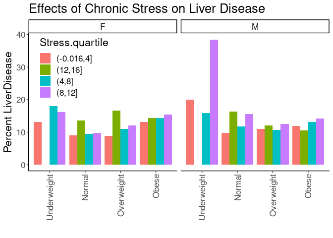
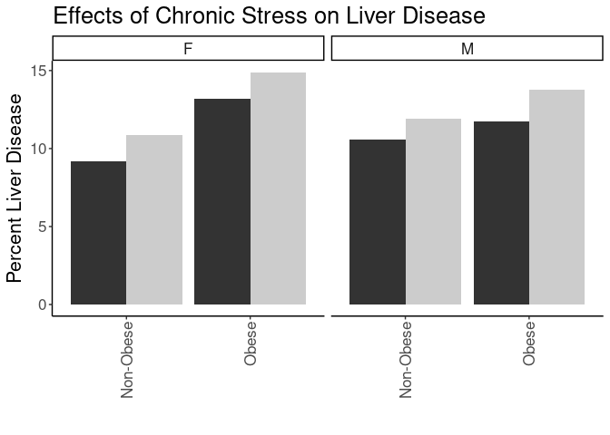

## Purpose

To test the effect modification of obesity on the stress-liver.disease relationships.


```r
library(knitr)
#figures made will go to directory called figures, will make them as both png and pdf files 
opts_chunk$set(fig.path='figures/',
               echo=TRUE, warning=FALSE, message=FALSE,dev=c('png','pdf'))
options(scipen = 2, digits = 3)

library(readr)
library(dplyr)
```

```
## 
## Attaching package: 'dplyr'
```

```
## The following objects are masked from 'package:stats':
## 
##     filter, lag
```

```
## The following objects are masked from 'package:base':
## 
##     intersect, setdiff, setequal, union
```

```r
library(tidyr)
library(knitr)

input.file <- 'data-combined.csv'
combined.data <- read_csv(input.file, na="-99") %>%
  filter(!(is.na(LiverDisease))) %>%
  filter(!(is.na(Stress))) %>%
  filter(Stress!="NA")
```

```
## Rows: 62010 Columns: 32
```

```
## ── Column specification ────────────────────────────────────────────────────────
## Delimiter: ","
## chr (17): DeID_PatientID, Gender, Stress_d1, DeID_EncounterID, BMI_cat, BMI_...
## dbl (15): age, CardiacArrhythmias, ChronicPulmonaryDisease, Depression, Diab...
## 
## ℹ Use `spec()` to retrieve the full column specification for this data.
## ℹ Specify the column types or set `show_col_types = FALSE` to quiet this message.
```

Loaded in the cleaned data from data-combined.csv. This script can be found in /nfs/turbo/precision-health/DataDirect/HUM00219435 - Obesity as a modifier of chronic psy and was most recently run on Thu Mar  9 16:03:30 2023. This dataset has 36826 values.


```r
combined.data <- 
  combined.data %>%
  mutate(BMI_cat= factor(BMI_cat, 
                         levels=c("Underweight",
                                  "Normal",
                                  "Overweight",
                                  'Class I Obese',
                                  'Class II Obese',
                                  'Class III Obese'))) %>%
  mutate(BMI_cat.obese= factor(BMI_cat.obese, 
                               levels=c("Underweight",
                                        "Normal",
                                        "Overweight",
                                        'Obese'))) %>%
  mutate(BMI_cat.Ob.NonOb= factor(BMI_cat.Ob.NonOb, 
                                  levels=c("Non-Obese",
                                           'Obese'))) %>%
  mutate(Stress=relevel(as.factor(High.Stress),ref="Low")) #set low as reference value
```

# Liver Disease Complication Rates by BMI

Stratified diagnoses by various BMI categories

## Liver Disease by BMI Category


```r
#calculating liver-disease rates by bmi category
with(combined.data, table(LiverDisease,BMI_cat,Gender)) %>% 
  data.frame %>%
  pivot_wider(names_from=LiverDisease,
              values_from = Freq) %>%
  rename(LiverDisease=`1`,
         NonDisease=`0`) %>%
  mutate(Total=LiverDisease+NonDisease) %>%
  mutate(Percent=LiverDisease/Total*100) -> liver.disease.bmi.counts

kable(liver.disease.bmi.counts, caption="Liver disease rates by BMI category")
```


Table: Liver disease rates by BMI category

|BMI_cat         |Gender | NonDisease| LiverDisease| Total| Percent|
|:---------------|:------|----------:|------------:|-----:|-------:|
|Underweight     |F      |        151|           20|   171|    11.7|
|Normal          |F      |       4934|          512|  5446|     9.4|
|Overweight      |F      |       4798|          560|  5358|    10.5|
|Class I Obese   |F      |       3372|          511|  3883|    13.2|
|Class II Obese  |F      |       2022|          295|  2317|    12.7|
|Class III Obese |F      |       1794|          323|  2117|    15.3|
|Underweight     |M      |         71|           15|    86|    17.4|
|Normal          |M      |       3156|          383|  3539|    10.8|
|Overweight      |M      |       5837|          721|  6558|    11.0|
|Class I Obese   |M      |       3870|          519|  4389|    11.8|
|Class II Obese  |M      |       1598|          243|  1841|    13.2|
|Class III Obese |M      |        857|          139|   996|    14.0|

```r
library(ggplot2)

ggplot(liver.disease.bmi.counts,
       aes(y=Percent,
           x=BMI_cat)) +
  geom_bar(stat='identity',position='dodge') +
  labs(y="Percent Liver Disease",
       title="Effects of Chronic Stress on Liver Disease Rates",
       x="") +
  theme_classic() +
  scale_fill_grey() +
  facet_grid(.~Gender) +
  theme(text=element_text(size=16),
        axis.text.x=element_text(angle=90,vjust=0.5,hjust=1),
        legend.position = c(0.1,0.85))
```

<!-- -->

## Liver Disease Rate by BMI and Stress

This analysis uses all the BMI categories


```r
#calculating liver.disease rates by bmi category and stress
with(combined.data, table(LiverDisease,BMI_cat,Stress,Gender)) %>% 
  data.frame %>%
  pivot_wider(names_from=LiverDisease,
              values_from = Freq) %>%
  rename(LiverDisease=`1`,
         NonLiverDisease=`0`) %>%
  mutate(Total=LiverDisease+NonLiverDisease) %>%
  mutate(Percent=LiverDisease/Total*100) -> liver.disease.bmi.stress.counts

library(ggplot2)

kable(liver.disease.bmi.stress.counts, caption="Liver Disease rates by BMI category")
```


Table: Liver Disease rates by BMI category

|BMI_cat         |Stress |Gender | NonLiverDisease| LiverDisease| Total| Percent|
|:---------------|:------|:------|---------------:|------------:|-----:|-------:|
|Underweight     |Low    |F      |              79|            7|    86|    8.14|
|Normal          |Low    |F      |            2905|          295|  3200|    9.22|
|Overweight      |Low    |F      |            2787|          294|  3081|    9.54|
|Class I Obese   |Low    |F      |            1797|          262|  2059|   12.72|
|Class II Obese  |Low    |F      |            1087|          141|  1228|   11.48|
|Class III Obese |Low    |F      |             902|          160|  1062|   15.07|
|Underweight     |High   |F      |              72|           13|    85|   15.29|
|Normal          |High   |F      |            2029|          217|  2246|    9.66|
|Overweight      |High   |F      |            2011|          266|  2277|   11.68|
|Class I Obese   |High   |F      |            1575|          249|  1824|   13.65|
|Class II Obese  |High   |F      |             935|          154|  1089|   14.14|
|Class III Obese |High   |F      |             892|          163|  1055|   15.45|
|Underweight     |Low    |M      |              31|            7|    38|   18.42|
|Normal          |Low    |M      |            1924|          214|  2138|   10.01|
|Overweight      |Low    |M      |            3636|          453|  4089|   11.08|
|Class I Obese   |Low    |M      |            2355|          291|  2646|   11.00|
|Class II Obese  |Low    |M      |             926|          122|  1048|   11.64|
|Class III Obese |Low    |M      |             464|           69|   533|   12.95|
|Underweight     |High   |M      |              40|            8|    48|   16.67|
|Normal          |High   |M      |            1232|          169|  1401|   12.06|
|Overweight      |High   |M      |            2201|          268|  2469|   10.86|
|Class I Obese   |High   |M      |            1515|          228|  1743|   13.08|
|Class II Obese  |High   |M      |             672|          121|   793|   15.26|
|Class III Obese |High   |M      |             393|           70|   463|   15.12|

```r
ggplot(liver.disease.bmi.stress.counts,
       aes(y=Percent,
           x=BMI_cat,
           fill=Stress)) +
  geom_bar(stat='identity',position='dodge') +
  labs(y="Percent Liver Disease",
       title="Effects of Chronic Stress on Liver Disease Rates",
       x="") +
  theme_classic() +
  scale_fill_grey() +
  facet_grid(.~Gender) +
  theme(text=element_text(size=16),
        axis.text.x=element_text(angle=90,vjust=0.5,hjust=1),
        legend.position = c(0.1,0.85))
```

<!-- -->

### Logistic Regressions for All Obese Categories

Ran a series of stepwise logistic regressions testing for obesity as a modifier of the effects of stress.


```r
library(broom)
glm(LiverDisease~BMI_cat, 
    family="binomial",
    data=combined.data) -> obesity.glm1

obesity.glm1 %>%
  tidy() %>%
  kable(caption="Logistic regression of obesity on liver.disease", digits =c(0,2,3,2,99))
```


Table: Logistic regression of obesity on liver.disease

|term                   | estimate| std.error| statistic|  p.value|
|:----------------------|--------:|---------:|---------:|--------:|
|(Intercept)            |    -1.85|     0.182|    -10.16| 3.07e-24|
|BMI_catNormal          |    -0.35|     0.185|     -1.91| 5.58e-02|
|BMI_catOverweight      |    -0.27|     0.184|     -1.46| 1.44e-01|
|BMI_catClass I Obese   |    -0.10|     0.185|     -0.56| 5.77e-01|
|BMI_catClass II Obese  |    -0.06|     0.188|     -0.31| 7.53e-01|
|BMI_catClass III Obese |     0.10|     0.189|      0.53| 5.95e-01|

```r
anova(obesity.glm1,test="Chisq") %>% tidy %>%
  kable(caption="Logistic regression of obesity on liver.disease, ", digits =c(0,0,0,0,0,99))
```


Table: Logistic regression of obesity on liver.disease, 

|term    | df| Deviance| Resid..Df| Resid..Dev|  p.value|
|:-------|--:|--------:|---------:|----------:|--------:|
|NULL    | NA|       NA|     36700|      26276|       NA|
|BMI_cat |  5|       76|     36695|      26200| 4.64e-15|

```r
#adding in stress as a modifier
glm(LiverDisease~BMI_cat+Stress+Stress:BMI_cat, 
    family="binomial",
    data=combined.data) -> obesity.glm2

obesity.glm2 %>%
  tidy() %>%
  kable(caption="Logistic regression of obesity on liver.disease, with stress as a modifier", digits =c(0,2,3,2,99))
```


Table: Logistic regression of obesity on liver.disease, with stress as a modifier

|term                              | estimate| std.error| statistic|  p.value|
|:---------------------------------|--------:|---------:|---------:|--------:|
|(Intercept)                       |    -2.06|     0.284|     -7.26| 3.74e-13|
|BMI_catNormal                     |    -0.19|     0.288|     -0.66| 5.12e-01|
|BMI_catOverweight                 |    -0.09|     0.286|     -0.31| 7.53e-01|
|BMI_catClass I Obese              |     0.05|     0.287|      0.16| 8.74e-01|
|BMI_catClass II Obese             |     0.03|     0.291|      0.09| 9.28e-01|
|BMI_catClass III Obese            |     0.28|     0.293|      0.94| 3.46e-01|
|StressHigh                        |     0.39|     0.370|      1.05| 2.95e-01|
|BMI_catNormal:StressHigh          |    -0.27|     0.377|     -0.72| 4.72e-01|
|BMI_catOverweight:StressHigh      |    -0.30|     0.375|     -0.80| 4.22e-01|
|BMI_catClass I Obese:StressHigh   |    -0.24|     0.376|     -0.64| 5.24e-01|
|BMI_catClass II Obese:StressHigh  |    -0.12|     0.382|     -0.31| 7.58e-01|
|BMI_catClass III Obese:StressHigh |    -0.31|     0.384|     -0.81| 4.21e-01|

```r
anova(obesity.glm2,test="Chisq") %>% tidy %>%
  kable(caption="Logistic regression of obese vs non-obese on liver.disease, with stress as a modifier", digits =c(0,0,0,0,0,99))
```


Table: Logistic regression of obese vs non-obese on liver.disease, with stress as a modifier

|term           | df| Deviance| Resid..Df| Resid..Dev|  p.value|
|:--------------|--:|--------:|---------:|----------:|--------:|
|NULL           | NA|       NA|     36700|      26276|       NA|
|BMI_cat        |  5|       76|     36695|      26200| 4.64e-15|
|Stress         |  1|       16|     36694|      26184| 5.97e-05|
|BMI_cat:Stress |  5|        4|     36689|      26180| 5.98e-01|

```r
#adding in age and gender as covariates as a modifier
glm(LiverDisease~BMI_cat+Stress+Stress:BMI_cat+Gender+age, 
    family="binomial",
    data=combined.data) -> obesity.glm3

obesity.glm3 %>%
  tidy() %>%
  kable(caption="Logistic regression of obesity on liver.disease, with stress as a modifier and age and  gender as covarites", digits =c(0,2,3,2,99))
```


Table: Logistic regression of obesity on liver.disease, with stress as a modifier and age and  gender as covarites

|term                              | estimate| std.error| statistic|  p.value|
|:---------------------------------|--------:|---------:|---------:|--------:|
|(Intercept)                       |    -2.88|     0.291|     -9.90| 4.17e-23|
|BMI_catNormal                     |    -0.21|     0.289|     -0.71| 4.76e-01|
|BMI_catOverweight                 |    -0.18|     0.288|     -0.64| 5.25e-01|
|BMI_catClass I Obese              |    -0.05|     0.289|     -0.17| 8.64e-01|
|BMI_catClass II Obese             |    -0.05|     0.293|     -0.16| 8.75e-01|
|BMI_catClass III Obese            |     0.25|     0.294|      0.85| 3.96e-01|
|StressHigh                        |     0.42|     0.372|      1.13| 2.60e-01|
|GenderM                           |    -0.03|     0.034|     -0.93| 3.52e-01|
|age                               |     0.02|     0.001|     15.26| 1.38e-52|
|BMI_catNormal:StressHigh          |    -0.28|     0.379|     -0.74| 4.61e-01|
|BMI_catOverweight:StressHigh      |    -0.30|     0.377|     -0.79| 4.29e-01|
|BMI_catClass I Obese:StressHigh   |    -0.24|     0.378|     -0.65| 5.18e-01|
|BMI_catClass II Obese:StressHigh  |    -0.12|     0.384|     -0.30| 7.60e-01|
|BMI_catClass III Obese:StressHigh |    -0.30|     0.386|     -0.79| 4.31e-01|

```r
anova(obesity.glm3,test="Chisq") %>% tidy %>%
  kable(caption="Logistic regression of obesity on liver.disease, with stress as a modifier and age and gender as covarite", digits =c(0,0,0,0,0,99))
```


Table: Logistic regression of obesity on liver.disease, with stress as a modifier and age and gender as covarite

|term           | df| Deviance| Resid..Df| Resid..Dev|  p.value|
|:--------------|--:|--------:|---------:|----------:|--------:|
|NULL           | NA|       NA|     36700|      26276|       NA|
|BMI_cat        |  5|       76|     36695|      26200| 4.64e-15|
|Stress         |  1|       16|     36694|      26184| 5.97e-05|
|Gender         |  1|        1|     36693|      26183| 4.33e-01|
|age            |  1|      241|     36692|      25942| 2.60e-54|
|BMI_cat:Stress |  5|        4|     36687|      25939| 6.12e-01|

```r
#adding in race and ethnicity
glm(LiverDisease~BMI_cat+Stress+Stress:BMI_cat+Gender+age+Race.Ethnicity, 
    family="binomial",
    data=combined.data) -> obesity.glm4

obesity.glm4 %>%
  tidy() %>%
  kable(caption="Logistic regression of obesity on liver.disease, with stress as a modifier and age, gender and race as covarites", digits =c(0,2,3,2,99))
```


Table: Logistic regression of obesity on liver.disease, with stress as a modifier and age, gender and race as covarites

|term                              | estimate| std.error| statistic|  p.value|
|:---------------------------------|--------:|---------:|---------:|--------:|
|(Intercept)                       |    -2.80|     0.319|     -8.77| 1.77e-18|
|BMI_catNormal                     |    -0.20|     0.289|     -0.71| 4.80e-01|
|BMI_catOverweight                 |    -0.18|     0.288|     -0.62| 5.33e-01|
|BMI_catClass I Obese              |    -0.05|     0.289|     -0.16| 8.75e-01|
|BMI_catClass II Obese             |    -0.04|     0.293|     -0.14| 8.88e-01|
|BMI_catClass III Obese            |     0.25|     0.294|      0.87| 3.86e-01|
|StressHigh                        |     0.42|     0.372|      1.13| 2.60e-01|
|GenderM                           |    -0.03|     0.034|     -0.89| 3.71e-01|
|age                               |     0.02|     0.001|     15.20| 3.35e-52|
|Race.EthnicityBlack               |    -0.09|     0.165|     -0.56| 5.74e-01|
|Race.EthnicityHispanic/Latino     |     0.05|     0.185|      0.29| 7.72e-01|
|Race.EthnicityOther               |    -0.33|     0.177|     -1.84| 6.64e-02|
|Race.EthnicityWhite               |    -0.08|     0.146|     -0.56| 5.74e-01|
|BMI_catNormal:StressHigh          |    -0.28|     0.379|     -0.74| 4.62e-01|
|BMI_catOverweight:StressHigh      |    -0.30|     0.377|     -0.79| 4.29e-01|
|BMI_catClass I Obese:StressHigh   |    -0.24|     0.378|     -0.65| 5.17e-01|
|BMI_catClass II Obese:StressHigh  |    -0.12|     0.384|     -0.31| 7.59e-01|
|BMI_catClass III Obese:StressHigh |    -0.30|     0.386|     -0.79| 4.31e-01|

```r
anova(obesity.glm4,test="Chisq") %>% tidy %>%
  kable(caption="Logistic regression of obesity on liver.disease, with stress as a modifier and age, gender and race as covarite", digits =c(0,0,0,0,0,99))
```


Table: Logistic regression of obesity on liver.disease, with stress as a modifier and age, gender and race as covarite

|term           | df| Deviance| Resid..Df| Resid..Dev|  p.value|
|:--------------|--:|--------:|---------:|----------:|--------:|
|NULL           | NA|       NA|     36700|      26276|       NA|
|BMI_cat        |  5|       76|     36695|      26200| 4.64e-15|
|Stress         |  1|       16|     36694|      26184| 5.97e-05|
|Gender         |  1|        1|     36693|      26183| 4.33e-01|
|age            |  1|      241|     36692|      25942| 2.60e-54|
|Race.Ethnicity |  4|        8|     36688|      25934| 1.04e-01|
|BMI_cat:Stress |  5|        4|     36683|      25931| 6.16e-01|

### Liver Disease Rates by Quartiles


```r
with(combined.data, table(LiverDisease,BMI_cat.obese,Stress.quartile,Gender)) %>% 
  data.frame %>%
  pivot_wider(names_from=LiverDisease,
              values_from = Freq) %>%
  rename(LiverDisease=`1`,
         NonDisease=`0`) %>%
  mutate(Total=LiverDisease+NonDisease) %>%
  mutate(Percent=LiverDisease/Total*100) -> liver.disease.bmi.stress.quartile.counts

kable(liver.disease.bmi.stress.quartile.counts, caption="Liver Disease Rates by BMI and Stress Quartile")
```


Table: Liver Disease Rates by BMI and Stress Quartile

|BMI_cat.obese |Stress.quartile |Gender | NonDisease| LiverDisease| Total| Percent|
|:-------------|:---------------|:------|----------:|------------:|-----:|-------:|
|Underweight   |(-0.016,4]      |F      |         60|            6|    66|    9.09|
|Normal        |(-0.016,4]      |F      |       2437|          243|  2680|    9.07|
|Overweight    |(-0.016,4]      |F      |       2334|          248|  2582|    9.61|
|Obese         |(-0.016,4]      |F      |       3156|          457|  3613|   12.65|
|Underweight   |(12,16]         |F      |          3|            0|     3|    0.00|
|Normal        |(12,16]         |F      |         60|            7|    67|   10.45|
|Overweight    |(12,16]         |F      |         65|           11|    76|   14.47|
|Obese         |(12,16]         |F      |        124|           12|   136|    8.82|
|Underweight   |(4,8]           |F      |         65|            9|    74|   12.16|
|Normal        |(4,8]           |F      |       1880|          197|  2077|    9.48|
|Overweight    |(4,8]           |F      |       1850|          223|  2073|   10.76|
|Obese         |(4,8]           |F      |       2880|          483|  3363|   14.36|
|Underweight   |(8,12]          |F      |         23|            5|    28|   17.86|
|Normal        |(8,12]          |F      |        557|           65|   622|   10.45|
|Overweight    |(8,12]          |F      |        549|           78|   627|   12.44|
|Obese         |(8,12]          |F      |       1028|          177|  1205|   14.69|
|Underweight   |(-0.016,4]      |M      |         21|            6|    27|   22.22|
|Normal        |(-0.016,4]      |M      |       1649|          174|  1823|    9.54|
|Overweight    |(-0.016,4]      |M      |       3114|          400|  3514|   11.38|
|Obese         |(-0.016,4]      |M      |       3188|          415|  3603|   11.52|
|Underweight   |(12,16]         |M      |          2|            0|     2|    0.00|
|Normal        |(12,16]         |M      |         40|            8|    48|   16.67|
|Overweight    |(12,16]         |M      |         42|            6|    48|   12.50|
|Obese         |(12,16]         |M      |         73|            7|    80|    8.75|
|Underweight   |(4,8]           |M      |         37|            6|    43|   13.95|
|Normal        |(4,8]           |M      |       1175|          154|  1329|   11.59|
|Overweight    |(4,8]           |M      |       2216|          254|  2470|   10.28|
|Obese         |(4,8]           |M      |       2423|          375|  2798|   13.40|
|Underweight   |(8,12]          |M      |         11|            3|    14|   21.43|
|Normal        |(8,12]          |M      |        292|           47|   339|   13.86|
|Overweight    |(8,12]          |M      |        465|           61|   526|   11.60|
|Obese         |(8,12]          |M      |        641|          104|   745|   13.96|

```r
ggplot(liver.disease.bmi.stress.quartile.counts,
       aes(y=Percent,
           x=BMI_cat.obese,
           fill=Stress.quartile)) +
  geom_bar(stat='identity',position='dodge') +
  labs(y="Percent LiverDisease",
       title="Effects of Chronic Stress on Liver Disease",
       x="") +
  theme_classic() +
  facet_grid(.~Gender) +
  theme(text=element_text(size=16),
        axis.text.x=element_text(angle=90,vjust=0.5,hjust=1),
        legend.position = c(0.15,0.75))
```

<!-- -->

## Liver Disease Rates by Normal Obesity and Stress


```r
#calculating liver.disease rates by bmi category, stress and gender
with(combined.data, table(LiverDisease,BMI_cat.obese,Stress,Gender)) %>% 
  data.frame %>%
  pivot_wider(names_from=LiverDisease,
              values_from = Freq) %>%
  rename(LiverDisease=`1`,
         NonDisease=`0`) %>%
  mutate(Total=LiverDisease+NonDisease) %>%
  mutate(Percent=LiverDisease/Total*100) -> liver.disease.bmi.stress.gender.counts

kable(liver.disease.bmi.stress.gender.counts, caption="Liver Disease Rates by BMI and Stress")
```


Table: Liver Disease Rates by BMI and Stress

|BMI_cat.obese |Stress |Gender | NonDisease| LiverDisease| Total| Percent|
|:-------------|:------|:------|----------:|------------:|-----:|-------:|
|Underweight   |Low    |F      |         79|            7|    86|    8.14|
|Normal        |Low    |F      |       2905|          295|  3200|    9.22|
|Overweight    |Low    |F      |       2787|          294|  3081|    9.54|
|Obese         |Low    |F      |       3786|          563|  4349|   12.95|
|Underweight   |High   |F      |         72|           13|    85|   15.29|
|Normal        |High   |F      |       2029|          217|  2246|    9.66|
|Overweight    |High   |F      |       2011|          266|  2277|   11.68|
|Obese         |High   |F      |       3402|          566|  3968|   14.26|
|Underweight   |Low    |M      |         31|            7|    38|   18.42|
|Normal        |Low    |M      |       1924|          214|  2138|   10.01|
|Overweight    |Low    |M      |       3636|          453|  4089|   11.08|
|Obese         |Low    |M      |       3745|          482|  4227|   11.40|
|Underweight   |High   |M      |         40|            8|    48|   16.67|
|Normal        |High   |M      |       1232|          169|  1401|   12.06|
|Overweight    |High   |M      |       2201|          268|  2469|   10.86|
|Obese         |High   |M      |       2580|          419|  2999|   13.97|

```r
ggplot(liver.disease.bmi.stress.gender.counts,
       aes(y=Percent,
           x=BMI_cat.obese,
           fill=Stress)) +
  geom_bar(stat='identity',position='dodge') +
  labs(y="Percent Liver Disease",
       title="Effects of Chronic Stress on Liver Disease",
       x="") +
  facet_grid(.~Gender) +
  theme_classic() +
  scale_fill_grey() +
  theme(text=element_text(size=16),
        axis.text.x=element_text(angle=90,vjust=0.5,hjust=1),
        legend.position = c(0.1,0.75))
```

<!-- -->

## Logistic Regressions for Obese/Non-Obese

Ran a series of logistic regressions using the normal obesity categories not classes as the categorization


```r
glm(LiverDisease~BMI_cat.obese, 
    family="binomial",
    data=combined.data) -> obesity.glm1

obesity.glm1 %>%
  tidy() %>%
  kable(caption="Logistic regression of obese vs non-obese on liver disease", digits =c(0,2,3,2,99))
```


Table: Logistic regression of obese vs non-obese on liver disease

|term                    | estimate| std.error| statistic|  p.value|
|:-----------------------|--------:|---------:|---------:|--------:|
|(Intercept)             |    -1.85|     0.182|    -10.16| 3.07e-24|
|BMI_cat.obeseNormal     |    -0.35|     0.185|     -1.91| 5.58e-02|
|BMI_cat.obeseOverweight |    -0.27|     0.184|     -1.46| 1.44e-01|
|BMI_cat.obeseObese      |    -0.05|     0.183|     -0.26| 7.92e-01|

```r
anova(obesity.glm1,test="Chisq") %>% tidy %>%
  kable(caption="Logistic regression of obesity on liver disease, ", digits =c(0,0,0,0,0,99))
```


Table: Logistic regression of obesity on liver disease, 

|term          | df| Deviance| Resid..Df| Resid..Dev|  p.value|
|:-------------|--:|--------:|---------:|----------:|--------:|
|NULL          | NA|       NA|     36700|      26276|       NA|
|BMI_cat.obese |  3|       65|     36697|      26211| 4.37e-14|

```r
#adding in stress as a modifier
glm(LiverDisease~BMI_cat.obese+Stress+Stress:BMI_cat.obese, 
    family="binomial",
    data=combined.data) -> obesity.glm2

obesity.glm2 %>%
  tidy() %>%
  kable(caption="Logistic regression of obesity on liver disease, with stress as a modifier", digits =c(0,2,3,2,99))
```


Table: Logistic regression of obesity on liver disease, with stress as a modifier

|term                               | estimate| std.error| statistic|  p.value|
|:----------------------------------|--------:|---------:|---------:|--------:|
|(Intercept)                        |    -2.06|     0.284|     -7.26| 3.74e-13|
|BMI_cat.obeseNormal                |    -0.19|     0.288|     -0.66| 5.12e-01|
|BMI_cat.obeseOverweight            |    -0.09|     0.286|     -0.31| 7.53e-01|
|BMI_cat.obeseObese                 |     0.09|     0.286|      0.30| 7.62e-01|
|StressHigh                         |     0.39|     0.370|      1.05| 2.95e-01|
|BMI_cat.obeseNormal:StressHigh     |    -0.27|     0.377|     -0.72| 4.72e-01|
|BMI_cat.obeseOverweight:StressHigh |    -0.30|     0.375|     -0.80| 4.22e-01|
|BMI_cat.obeseObese:StressHigh      |    -0.22|     0.373|     -0.58| 5.62e-01|

```r
anova(obesity.glm2,test="Chisq") %>% tidy %>%
  kable(caption="Logistic regression of obesity on liver disease, with stress as a modifier", digits =c(0,0,0,0,0,99))
```


Table: Logistic regression of obesity on liver disease, with stress as a modifier

|term                 | df| Deviance| Resid..Df| Resid..Dev|  p.value|
|:--------------------|--:|--------:|---------:|----------:|--------:|
|NULL                 | NA|       NA|     36700|      26276|       NA|
|BMI_cat.obese        |  3|       65|     36697|      26211| 4.37e-14|
|Stress               |  1|       17|     36696|      26194| 3.94e-05|
|BMI_cat.obese:Stress |  3|        2|     36693|      26192| 6.20e-01|

```r
#adding in age and gender as covariates as a modifier
glm(LiverDisease~BMI_cat.obese+Stress+Stress:BMI_cat.obese+Gender+age, 
    family="binomial",
    data=combined.data) -> obesity.glm3

obesity.glm3 %>%
  tidy() %>%
  kable(caption="Logistic regression of obesity on liver disease, with stress as a modifier and age and  gender as covarites", digits =c(0,2,3,2,99))
```


Table: Logistic regression of obesity on liver disease, with stress as a modifier and age and  gender as covarites

|term                               | estimate| std.error| statistic|  p.value|
|:----------------------------------|--------:|---------:|---------:|--------:|
|(Intercept)                        |    -2.86|     0.290|     -9.83| 8.44e-23|
|BMI_cat.obeseNormal                |    -0.20|     0.289|     -0.71| 4.80e-01|
|BMI_cat.obeseOverweight            |    -0.18|     0.288|     -0.61| 5.39e-01|
|BMI_cat.obeseObese                 |     0.01|     0.287|      0.05| 9.59e-01|
|StressHigh                         |     0.42|     0.372|      1.13| 2.59e-01|
|GenderM                            |    -0.05|     0.033|     -1.38| 1.68e-01|
|age                                |     0.02|     0.001|     15.01| 5.93e-51|
|BMI_cat.obeseNormal:StressHigh     |    -0.28|     0.379|     -0.74| 4.60e-01|
|BMI_cat.obeseOverweight:StressHigh |    -0.30|     0.377|     -0.80| 4.26e-01|
|BMI_cat.obeseObese:StressHigh      |    -0.22|     0.375|     -0.58| 5.63e-01|

```r
anova(obesity.glm3,test="Chisq") %>% tidy %>%
  kable(caption="Logistic regression of obesity on liver disease, with stress as a modifier and age and gender as covarite", digits =c(0,0,0,0,0,99))
```


Table: Logistic regression of obesity on liver disease, with stress as a modifier and age and gender as covarite

|term                 | df| Deviance| Resid..Df| Resid..Dev|  p.value|
|:--------------------|--:|--------:|---------:|----------:|--------:|
|NULL                 | NA|       NA|     36700|      26276|       NA|
|BMI_cat.obese        |  3|       65|     36697|      26211| 4.37e-14|
|Stress               |  1|       17|     36696|      26194| 3.94e-05|
|Gender               |  1|        0|     36695|      26194| 6.69e-01|
|age                  |  1|      233|     36694|      25961| 1.54e-52|
|BMI_cat.obese:Stress |  3|        2|     36691|      25959| 6.18e-01|

```r
#adding in race and ethnicity
glm(LiverDisease~BMI_cat.obese+Stress+Stress:BMI_cat.obese+Gender+age+Race.Ethnicity, 
    family="binomial",
    data=combined.data) -> obesity.glm4

obesity.glm4 %>%
  tidy() %>%
  kable(caption="Logistic regression of obesity on liver diesease, with stress as a modifier and age, gender and race as covarites", digits =c(0,2,3,2,99))
```


Table: Logistic regression of obesity on liver diesease, with stress as a modifier and age, gender and race as covarites

|term                               | estimate| std.error| statistic|  p.value|
|:----------------------------------|--------:|---------:|---------:|--------:|
|(Intercept)                        |    -2.79|     0.319|     -8.74| 2.36e-18|
|BMI_cat.obeseNormal                |    -0.20|     0.289|     -0.70| 4.84e-01|
|BMI_cat.obeseOverweight            |    -0.17|     0.288|     -0.60| 5.45e-01|
|BMI_cat.obeseObese                 |     0.02|     0.287|      0.06| 9.49e-01|
|StressHigh                         |     0.42|     0.372|      1.13| 2.60e-01|
|GenderM                            |    -0.04|     0.033|     -1.34| 1.79e-01|
|age                                |     0.02|     0.001|     14.96| 1.43e-50|
|Race.EthnicityBlack                |    -0.07|     0.165|     -0.44| 6.63e-01|
|Race.EthnicityHispanic/Latino      |     0.06|     0.185|      0.33| 7.44e-01|
|Race.EthnicityOther                |    -0.31|     0.177|     -1.77| 7.67e-02|
|Race.EthnicityWhite                |    -0.07|     0.146|     -0.48| 6.29e-01|
|BMI_cat.obeseNormal:StressHigh     |    -0.28|     0.379|     -0.74| 4.60e-01|
|BMI_cat.obeseOverweight:StressHigh |    -0.30|     0.377|     -0.80| 4.26e-01|
|BMI_cat.obeseObese:StressHigh      |    -0.22|     0.375|     -0.58| 5.63e-01|

```r
anova(obesity.glm4,test="Chisq") %>% tidy %>%
  kable(caption="Logistic regression of obesity on liver disease, with stress as a modifier and age, gender and race as covariates", digits =c(0,0,0,0,0,99))
```


Table: Logistic regression of obesity on liver disease, with stress as a modifier and age, gender and race as covariates

|term                 | df| Deviance| Resid..Df| Resid..Dev|  p.value|
|:--------------------|--:|--------:|---------:|----------:|--------:|
|NULL                 | NA|       NA|     36700|      26276|       NA|
|BMI_cat.obese        |  3|       65|     36697|      26211| 4.37e-14|
|Stress               |  1|       17|     36696|      26194| 3.94e-05|
|Gender               |  1|        0|     36695|      26194| 6.69e-01|
|age                  |  1|      233|     36694|      25961| 1.54e-52|
|Race.Ethnicity       |  4|        7|     36690|      25954| 1.13e-01|
|BMI_cat.obese:Stress |  3|        2|     36687|      25952| 6.21e-01|

# Liver Disease Rates by Obese/Not Obese and Stress


```r
with(combined.data, table(LiverDisease,BMI_cat.Ob.NonOb,Stress,Gender)) %>% 
  data.frame %>%
  pivot_wider(names_from=LiverDisease,
              values_from = Freq) %>%
  rename(LiverDisease=`1`,
         NonDisease=`0`) %>%
  mutate(Total=LiverDisease+NonDisease) %>%
  mutate(Percent=LiverDisease/Total*100) -> liver.disease.BMI_cat.Ob.NonOb.stress.counts

kable(liver.disease.BMI_cat.Ob.NonOb.stress.counts, caption="Liver Disease Rates by Obese or not and Stress")
```


Table: Liver Disease Rates by Obese or not and Stress

|BMI_cat.Ob.NonOb |Stress |Gender | NonDisease| LiverDisease| Total| Percent|
|:----------------|:------|:------|----------:|------------:|-----:|-------:|
|Non-Obese        |Low    |F      |       5817|          602|  6419|    9.38|
|Obese            |Low    |F      |       3786|          563|  4349|   12.95|
|Non-Obese        |High   |F      |       4142|          503|  4645|   10.83|
|Obese            |High   |F      |       3402|          566|  3968|   14.26|
|Non-Obese        |Low    |M      |       5608|          674|  6282|   10.73|
|Obese            |Low    |M      |       3745|          482|  4227|   11.40|
|Non-Obese        |High   |M      |       3488|          449|  3937|   11.40|
|Obese            |High   |M      |       2580|          419|  2999|   13.97|

```r
ggplot(liver.disease.BMI_cat.Ob.NonOb.stress.counts,
       aes(y=Percent,
           x=BMI_cat.Ob.NonOb,
           fill=Stress)) +
  geom_bar(stat='identity',position='dodge') +
  labs(y="Percent Liver Disease",
       title="Effects of Chronic Stress on Liver Disease",
       x="") +
  facet_grid(.~Gender) +
  theme_classic() +
  scale_fill_grey() +
  theme(text=element_text(size=16),
        axis.text.x=element_text(angle=90,vjust=0.5,hjust=1),
        legend.position = 'none')
```

<!-- -->

## Logistic Regressions for Obese/Non-Obese

Ran a series of logistic regressions using obese/non-obese as the categorization


```r
glm(LiverDisease~BMI_cat.Ob.NonOb, 
    family="binomial",
    data=combined.data) -> obesity.glm1

obesity.glm1 %>%
  tidy() %>%
  kable(caption="Logistic regression of obese vs non-obese on liver.disease", digits =c(0,2,3,2,99))
```


Table: Logistic regression of obese vs non-obese on liver.disease

|term                  | estimate| std.error| statistic|  p.value|
|:---------------------|--------:|---------:|---------:|--------:|
|(Intercept)           |    -2.15|     0.022|    -95.86| 0.00e+00|
|BMI_cat.Ob.NonObObese |     0.25|     0.033|      7.67| 1.73e-14|

```r
anova(obesity.glm1,test="Chisq") %>% tidy %>%
  kable(caption="Logistic regression of obese vs non-obese on liver.disease, ", digits =c(0,0,0,0,0,99))
```


Table: Logistic regression of obese vs non-obese on liver.disease, 

|term             | df| Deviance| Resid..Df| Resid..Dev|  p.value|
|:----------------|--:|--------:|---------:|----------:|--------:|
|NULL             | NA|       NA|     36825|      26376|       NA|
|BMI_cat.Ob.NonOb |  1|       59|     36824|      26317| 1.99e-14|

```r
#adding in stress as a modifier
glm(LiverDisease~BMI_cat.Ob.NonOb+Stress+Stress:BMI_cat.Ob.NonOb, 
    family="binomial",
    data=combined.data) -> obesity.glm2

obesity.glm2 %>%
  tidy() %>%
  kable(caption="Logistic regression of obese vs non-obese on liver.disease, with stress as a modifier", digits =c(0,2,3,2,99))
```


Table: Logistic regression of obese vs non-obese on liver.disease, with stress as a modifier

|term                             | estimate| std.error| statistic|  p.value|
|:--------------------------------|--------:|---------:|---------:|--------:|
|(Intercept)                      |    -2.19|     0.030|    -74.27| 0.00e+00|
|BMI_cat.Ob.NonObObese            |     0.22|     0.044|      4.90| 9.49e-07|
|StressHigh                       |     0.11|     0.045|      2.45| 1.45e-02|
|BMI_cat.Ob.NonObObese:StressHigh |     0.06|     0.066|      0.92| 3.59e-01|

```r
anova(obesity.glm2,test="Chisq") %>% tidy %>%
  kable(caption="Logistic regression of obese vs non-obese on liver.disease, with stress as a modifier", digits =c(0,0,0,0,0,99))
```


Table: Logistic regression of obese vs non-obese on liver.disease, with stress as a modifier

|term                    | df| Deviance| Resid..Df| Resid..Dev|  p.value|
|:-----------------------|--:|--------:|---------:|----------:|--------:|
|NULL                    | NA|       NA|     36825|      26376|       NA|
|BMI_cat.Ob.NonOb        |  1|       59|     36824|      26317| 1.99e-14|
|Stress                  |  1|       18|     36823|      26299| 2.24e-05|
|BMI_cat.Ob.NonOb:Stress |  1|        1|     36822|      26299| 3.59e-01|

```r
#adding in age and gender as covariates as a modifier
glm(LiverDisease~BMI_cat.Ob.NonOb+Stress+Stress:BMI_cat.Ob.NonOb+Gender+age, 
    family="binomial",
    data=combined.data) -> obesity.glm3

obesity.glm3 %>%
  tidy() %>%
  kable(caption="Logistic regression of obese vs non-obese on liver.disease, with stress as a modifier and age and  gender as covarites", digits =c(0,2,3,2,99))
```


Table: Logistic regression of obese vs non-obese on liver.disease, with stress as a modifier and age and  gender as covarites

|term                             | estimate| std.error| statistic|  p.value|
|:--------------------------------|--------:|---------:|---------:|--------:|
|(Intercept)                      |    -3.05|     0.067|    -45.66| 0.00e+00|
|BMI_cat.Ob.NonObObese            |     0.20|     0.044|      4.52| 6.14e-06|
|StressHigh                       |     0.14|     0.046|      3.09| 2.02e-03|
|GenderM                          |    -0.05|     0.033|     -1.44| 1.49e-01|
|age                              |     0.02|     0.001|     15.23| 2.25e-52|
|BMI_cat.Ob.NonObObese:StressHigh |     0.06|     0.066|      0.95| 3.44e-01|

```r
anova(obesity.glm3,test="Chisq") %>% tidy %>%
  kable(caption="Logistic regression of obese vs non-obese on liver.disease, with stress as a modifier and age and gender as covarite", digits =c(0,0,0,0,0,99))
```


Table: Logistic regression of obese vs non-obese on liver.disease, with stress as a modifier and age and gender as covarite

|term                    | df| Deviance| Resid..Df| Resid..Dev|  p.value|
|:-----------------------|--:|--------:|---------:|----------:|--------:|
|NULL                    | NA|       NA|     36825|      26376|       NA|
|BMI_cat.Ob.NonOb        |  1|       59|     36824|      26317| 1.99e-14|
|Stress                  |  1|       18|     36823|      26299| 2.24e-05|
|Gender                  |  1|        0|     36822|      26299| 5.85e-01|
|age                     |  1|      240|     36821|      26059| 3.98e-54|
|BMI_cat.Ob.NonOb:Stress |  1|        1|     36820|      26058| 3.44e-01|

```r
#adding in race and ethnicity
glm(LiverDisease~BMI_cat.Ob.NonOb+Stress+Stress:BMI_cat.Ob.NonOb+Gender+age+Race.Ethnicity, 
    family="binomial",
    data=combined.data) -> obesity.glm4

obesity.glm4 %>%
  tidy() %>%
  kable(caption="Logistic regression of obese vs non-obese on liver.disease, with stress as a modifier and age, gender and race as covarites", digits =c(0,2,3,2,99))
```


Table: Logistic regression of obese vs non-obese on liver.disease, with stress as a modifier and age, gender and race as covarites

|term                             | estimate| std.error| statistic|  p.value|
|:--------------------------------|--------:|---------:|---------:|--------:|
|(Intercept)                      |    -2.99|     0.153|    -19.55| 4.04e-85|
|BMI_cat.Ob.NonObObese            |     0.20|     0.045|      4.54| 5.63e-06|
|StressHigh                       |     0.14|     0.046|      3.08| 2.06e-03|
|GenderM                          |    -0.05|     0.033|     -1.41| 1.59e-01|
|age                              |     0.02|     0.001|     15.16| 6.54e-52|
|Race.EthnicityBlack              |    -0.06|     0.165|     -0.37| 7.09e-01|
|Race.EthnicityHispanic/Latino    |     0.07|     0.185|      0.38| 7.07e-01|
|Race.EthnicityOther              |    -0.31|     0.177|     -1.73| 8.34e-02|
|Race.EthnicityWhite              |    -0.06|     0.146|     -0.40| 6.89e-01|
|BMI_cat.Ob.NonObObese:StressHigh |     0.06|     0.066|      0.94| 3.48e-01|

```r
anova(obesity.glm4,test="Chisq") %>% tidy %>%
  kable(caption="Logistic regression of obese vs non-obese on liver.disease, with stress as a modifier and age, gender and race as covarite", digits =c(0,0,0,0,0,99))
```


Table: Logistic regression of obese vs non-obese on liver.disease, with stress as a modifier and age, gender and race as covarite

|term                    | df| Deviance| Resid..Df| Resid..Dev|  p.value|
|:-----------------------|--:|--------:|---------:|----------:|--------:|
|NULL                    | NA|       NA|     36825|      26376|       NA|
|BMI_cat.Ob.NonOb        |  1|       59|     36824|      26317| 1.99e-14|
|Stress                  |  1|       18|     36823|      26299| 2.24e-05|
|Gender                  |  1|        0|     36822|      26299| 5.85e-01|
|age                     |  1|      240|     36821|      26059| 3.98e-54|
|Race.Ethnicity          |  4|        8|     36817|      26052| 1.08e-01|
|BMI_cat.Ob.NonOb:Stress |  1|        1|     36816|      26051| 3.48e-01|

# Summary of Covariates

Stratified data by stress and obesity status and summarized data


```r
combined.data %>%
  group_by(Stress,BMI_cat.Ob.NonOb) %>%
  count %>%
  knitr::kable(caption="Number of participants by group")
```


Table: Number of participants by group

|Stress |BMI_cat.Ob.NonOb |     n|
|:------|:----------------|-----:|
|Low    |Non-Obese        | 12701|
|Low    |Obese            |  8576|
|High   |Non-Obese        |  8582|
|High   |Obese            |  6967|

```r
combined.data %>%
  group_by(Stress,BMI_cat.Ob.NonOb,Gender) %>%
  count %>%
    filter(!(is.na(Stress))) %>%
  filter(!(is.na(BMI_cat.Ob.NonOb))) %>%
  knitr::kable(caption="Number of participants by group and gender")
```


Table: Number of participants by group and gender

|Stress |BMI_cat.Ob.NonOb |Gender |    n|
|:------|:----------------|:------|----:|
|Low    |Non-Obese        |F      | 6419|
|Low    |Non-Obese        |M      | 6282|
|Low    |Obese            |F      | 4349|
|Low    |Obese            |M      | 4227|
|High   |Non-Obese        |F      | 4645|
|High   |Non-Obese        |M      | 3937|
|High   |Obese            |F      | 3968|
|High   |Obese            |M      | 2999|

```r
combined.data %>%
  group_by(Stress,BMI_cat.Ob.NonOb,Race.Ethnicity) %>%
  count %>%
    filter(!(is.na(Stress))) %>%
  filter(!(is.na(BMI_cat.Ob.NonOb))) %>%
  knitr::kable(caption="Number of participants by group and race/ethnicity")
```


Table: Number of participants by group and race/ethnicity

|Stress |BMI_cat.Ob.NonOb |Race.Ethnicity  |     n|
|:------|:----------------|:---------------|-----:|
|Low    |Non-Obese        |Asian           |   299|
|Low    |Non-Obese        |Black           |   363|
|Low    |Non-Obese        |Hispanic/Latino |   234|
|Low    |Non-Obese        |Other           |   393|
|Low    |Non-Obese        |White           | 11412|
|Low    |Obese            |Asian           |    36|
|Low    |Obese            |Black           |   455|
|Low    |Obese            |Hispanic/Latino |   167|
|Low    |Obese            |Other           |   282|
|Low    |Obese            |White           |  7636|
|High   |Non-Obese        |Asian           |   176|
|High   |Non-Obese        |Black           |   357|
|High   |Non-Obese        |Hispanic/Latino |   174|
|High   |Non-Obese        |Other           |   272|
|High   |Non-Obese        |White           |  7603|
|High   |Obese            |Asian           |    41|
|High   |Obese            |Black           |   441|
|High   |Obese            |Hispanic/Latino |   154|
|High   |Obese            |Other           |   215|
|High   |Obese            |White           |  6116|

```r
combined.data %>%
  group_by(Stress,BMI_cat.Ob.NonOb) %>%
    filter(!(is.na(Stress))) %>%
  filter(!(is.na(BMI_cat.Ob.NonOb))) %>%
  summarize_at(c('BMI','age'), list(mean=~mean(.x,na.rm=T),
                                    sd=~sd(.x,na.rm=T),
                                    n=~length(.x)))%>%
  knitr::kable(caption="Average BMI and age of participants by group")
```


Table: Average BMI and age of participants by group

|Stress |BMI_cat.Ob.NonOb | BMI_mean| age_mean| BMI_sd| age_sd| BMI_n| age_n|
|:------|:----------------|--------:|--------:|------:|------:|-----:|-----:|
|Low    |Non-Obese        |     25.3|     53.0|   2.99|   17.7| 12701| 12701|
|Low    |Obese            |     36.0|     54.7|   5.71|   14.6|  8576|  8576|
|High   |Non-Obese        |     25.1|     51.0|   3.12|   17.8|  8582|  8582|
|High   |Obese            |     36.6|     52.6|   5.99|   14.6|  6967|  6967|

```r
combined.data %>%
  group_by(Stress,BMI_cat.Ob.NonOb) %>%
  summarize_at(c('BMI','age'), list(mean=~mean(.x,na.rm=T),
                                    sd=~sd(.x,na.rm=T),
                                    n=~length(.x)))%>%
  filter(!(is.na(Stress))) %>%
  filter(!(is.na(BMI_cat.Ob.NonOb))) %>%
  knitr::kable(caption="Average BMI and age of participants by group,complete cases")
```


Table: Average BMI and age of participants by group,complete cases

|Stress |BMI_cat.Ob.NonOb | BMI_mean| age_mean| BMI_sd| age_sd| BMI_n| age_n|
|:------|:----------------|--------:|--------:|------:|------:|-----:|-----:|
|Low    |Non-Obese        |     25.3|     53.0|   2.99|   17.7| 12701| 12701|
|Low    |Obese            |     36.0|     54.7|   5.71|   14.6|  8576|  8576|
|High   |Non-Obese        |     25.1|     51.0|   3.12|   17.8|  8582|  8582|
|High   |Obese            |     36.6|     52.6|   5.99|   14.6|  6967|  6967|

# Session Information


```r
sessionInfo()
```

```
## R version 4.2.0 (2022-04-22)
## Platform: x86_64-pc-linux-gnu (64-bit)
## Running under: Red Hat Enterprise Linux 8.4 (Ootpa)
## 
## Matrix products: default
## BLAS:   /sw/pkgs/arc/stacks/gcc/10.3.0/R/4.2.0/lib64/R/lib/libRblas.so
## LAPACK: /sw/pkgs/arc/stacks/gcc/10.3.0/R/4.2.0/lib64/R/lib/libRlapack.so
## 
## locale:
##  [1] LC_CTYPE=en_US.UTF-8       LC_NUMERIC=C              
##  [3] LC_TIME=en_US.UTF-8        LC_COLLATE=en_US.UTF-8    
##  [5] LC_MONETARY=en_US.UTF-8    LC_MESSAGES=en_US.UTF-8   
##  [7] LC_PAPER=en_US.UTF-8       LC_NAME=C                 
##  [9] LC_ADDRESS=C               LC_TELEPHONE=C            
## [11] LC_MEASUREMENT=en_US.UTF-8 LC_IDENTIFICATION=C       
## 
## attached base packages:
## [1] stats     graphics  grDevices utils     datasets  methods   base     
## 
## other attached packages:
## [1] broom_1.0.1   ggplot2_3.4.0 tidyr_1.2.1   dplyr_1.0.10  readr_2.1.3  
## [6] knitr_1.41   
## 
## loaded via a namespace (and not attached):
##  [1] highr_0.9        pillar_1.8.1     bslib_0.4.1      compiler_4.2.0  
##  [5] jquerylib_0.1.4  tools_4.2.0      bit_4.0.5        digest_0.6.30   
##  [9] gtable_0.3.1     jsonlite_1.8.4   evaluate_0.18    lifecycle_1.0.3 
## [13] tibble_3.1.8     pkgconfig_2.0.3  rlang_1.0.6      cli_3.4.1       
## [17] DBI_1.1.3        parallel_4.2.0   yaml_2.3.6       xfun_0.35       
## [21] fastmap_1.1.0    withr_2.5.0      stringr_1.5.0    generics_0.1.3  
## [25] vctrs_0.5.1      sass_0.4.4       hms_1.1.2        grid_4.2.0      
## [29] bit64_4.0.5      tidyselect_1.2.0 glue_1.6.2       R6_2.5.1        
## [33] fansi_1.0.3      vroom_1.6.0      rmarkdown_2.18   farver_2.1.1    
## [37] tzdb_0.3.0       purrr_0.3.5      magrittr_2.0.3   backports_1.4.1 
## [41] scales_1.2.1     ellipsis_0.3.2   htmltools_0.5.4  assertthat_0.2.1
## [45] colorspace_2.0-3 labeling_0.4.2   utf8_1.2.2       stringi_1.7.8   
## [49] munsell_0.5.0    cachem_1.0.6     crayon_1.5.2
```
