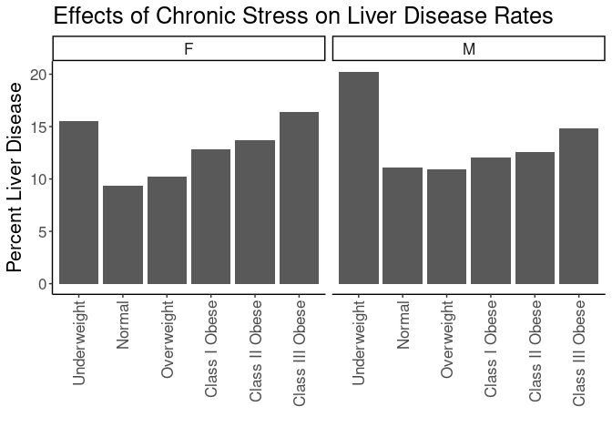

## Purpose

To test the effect modification of obesity on the stress-liver.disease relationships.


```r
library(knitr)
#figures made will go to directory called figures, will make them as both png and pdf files 
opts_chunk$set(fig.path='figures/',
               echo=TRUE, warning=FALSE, message=FALSE,dev=c('png','pdf'))
options(scipen = 2, digits = 3)

library(readr)
library(dplyr)
```

```
## 
## Attaching package: 'dplyr'
```

```
## The following objects are masked from 'package:stats':
## 
##     filter, lag
```

```
## The following objects are masked from 'package:base':
## 
##     intersect, setdiff, setequal, union
```

```r
library(tidyr)
library(knitr)

input.file <- 'data-combined.csv'
combined.data <- read_csv(input.file, na="-99") %>%
  filter(!(is.na(LiverDisease))) %>%
  filter(!(is.na(Stress))) %>%
  filter(Stress!="NA")
```

```
## Rows: 62010 Columns: 38
```

```
## ── Column specification ────────────────────────────────────────────────────────
## Delimiter: ","
## chr (21): DeID_PatientID, Gender, Stress_d1, DeID_EncounterID, affluence13_1...
## dbl (17): age, CardiacArrhythmias, ChronicPulmonaryDisease, CongestiveHeartF...
## 
## ℹ Use `spec()` to retrieve the full column specification for this data.
## ℹ Specify the column types or set `show_col_types = FALSE` to quiet this message.
```

Loaded in the cleaned data from data-combined.csv. This script can be found in /nfs/turbo/precision-health/DataDirect/HUM00219435 - Obesity as a modifier of chronic psy/2023-03-14/2150 - Obesity and Stress - Cohort - DeID - 2023-03-14 and was most recently run on Thu Mar 23 14:48:34 2023. This dataset has 36813 values.


```r
combined.data <- 
  combined.data %>%
  mutate(BMI_cat= factor(BMI_cat, 
                         levels=c("Underweight",
                                  "Normal",
                                  "Overweight",
                                  'Class I Obese',
                                  'Class II Obese',
                                  'Class III Obese'))) %>%
  mutate(BMI_cat.obese= factor(BMI_cat.obese, 
                               levels=c("Underweight",
                                        "Normal",
                                        "Overweight",
                                        'Obese'))) %>%
  mutate(BMI_cat.Ob.NonOb= factor(BMI_cat.Ob.NonOb, 
                                  levels=c("Non-Obese",
                                           'Obese'))) %>%
  mutate(Stress=relevel(as.factor(High.Stress),ref="Low")) #set low as reference value
```

# Liver Disease Complication Rates by BMI

Stratified diagnoses by various BMI categories

## Liver Disease by BMI Category


```r
#calculating liver-disease rates by bmi category
with(combined.data, table(LiverDisease,BMI_cat,Gender)) %>% 
  data.frame %>%
  pivot_wider(names_from=LiverDisease,
              values_from = Freq) %>%
  rename(LiverDisease=`1`,
         NonDisease=`0`) %>%
  mutate(Total=LiverDisease+NonDisease) %>%
  mutate(Percent=LiverDisease/Total*100) -> liver.disease.bmi.counts

kable(liver.disease.bmi.counts, caption="Liver disease rates by BMI category")
```


Table: Liver disease rates by BMI category

|BMI_cat         |Gender | NonDisease| LiverDisease| Total| Percent|
|:---------------|:------|----------:|------------:|-----:|-------:|
|Underweight     |F      |        152|           28|   180|   15.56|
|Normal          |F      |       4954|          510|  5464|    9.33|
|Overweight      |F      |       4817|          546|  5363|   10.18|
|Class I Obese   |F      |       3393|          500|  3893|   12.84|
|Class II Obese  |F      |       1976|          314|  2290|   13.71|
|Class III Obese |F      |       1774|          347|  2121|   16.36|
|Underweight     |M      |         67|           17|    84|   20.24|
|Normal          |M      |       3136|          392|  3528|   11.11|
|Overweight      |M      |       5843|          719|  6562|   10.96|
|Class I Obese   |M      |       3849|          529|  4378|   12.08|
|Class II Obese  |M      |       1609|          231|  1840|   12.55|
|Class III Obese |M      |        841|          146|   987|   14.79|

```r
library(ggplot2)

ggplot(liver.disease.bmi.counts,
       aes(y=Percent,
           x=BMI_cat)) +
  geom_bar(stat='identity',position='dodge') +
  labs(y="Percent Liver Disease",
       title="Effects of Chronic Stress on Liver Disease Rates",
       x="") +
  theme_classic() +
  scale_fill_grey() +
  facet_grid(.~Gender) +
  theme(text=element_text(size=16),
        axis.text.x=element_text(angle=90,vjust=0.5,hjust=1),
        legend.position = c(0.1,0.85))
```

<!-- -->

## Liver Disease Rate by BMI and Stress

This analysis uses all the BMI categories


```r
#calculating liver.disease rates by bmi category and stress
with(combined.data, table(LiverDisease,BMI_cat,Stress,Gender)) %>% 
  data.frame %>%
  pivot_wider(names_from=LiverDisease,
              values_from = Freq) %>%
  rename(LiverDisease=`1`,
         NonLiverDisease=`0`) %>%
  mutate(Total=LiverDisease+NonLiverDisease) %>%
  mutate(Percent=LiverDisease/Total*100) -> liver.disease.bmi.stress.counts

library(ggplot2)

kable(liver.disease.bmi.stress.counts, caption="Liver Disease rates by BMI category")
```


Table: Liver Disease rates by BMI category

|BMI_cat         |Stress |Gender | NonLiverDisease| LiverDisease| Total| Percent|
|:---------------|:------|:------|---------------:|------------:|-----:|-------:|
|Underweight     |Low    |F      |              78|           11|    89|   12.36|
|Normal          |Low    |F      |            2937|          295|  3232|    9.13|
|Overweight      |Low    |F      |            2801|          279|  3080|    9.06|
|Class I Obese   |Low    |F      |            1810|          256|  2066|   12.39|
|Class II Obese  |Low    |F      |            1067|          150|  1217|   12.32|
|Class III Obese |Low    |F      |             902|          167|  1069|   15.62|
|Underweight     |High   |F      |              74|           17|    91|   18.68|
|Normal          |High   |F      |            2017|          215|  2232|    9.63|
|Overweight      |High   |F      |            2016|          267|  2283|   11.70|
|Class I Obese   |High   |F      |            1583|          244|  1827|   13.36|
|Class II Obese  |High   |F      |             909|          164|  1073|   15.28|
|Class III Obese |High   |F      |             872|          180|  1052|   17.11|
|Underweight     |Low    |M      |              29|            6|    35|   17.14|
|Normal          |Low    |M      |            1896|          219|  2115|   10.36|
|Overweight      |Low    |M      |            3662|          436|  4098|   10.64|
|Class I Obese   |Low    |M      |            2333|          307|  2640|   11.63|
|Class II Obese  |Low    |M      |             935|          114|  1049|   10.87|
|Class III Obese |Low    |M      |             453|           73|   526|   13.88|
|Underweight     |High   |M      |              38|           11|    49|   22.45|
|Normal          |High   |M      |            1240|          173|  1413|   12.24|
|Overweight      |High   |M      |            2181|          283|  2464|   11.48|
|Class I Obese   |High   |M      |            1516|          222|  1738|   12.77|
|Class II Obese  |High   |M      |             674|          117|   791|   14.79|
|Class III Obese |High   |M      |             388|           73|   461|   15.84|

```r
ggplot(liver.disease.bmi.stress.counts,
       aes(y=Percent,
           x=BMI_cat,
           fill=Stress)) +
  geom_bar(stat='identity',position='dodge') +
  labs(y="Percent Liver Disease",
       title="Effects of Chronic Stress on Liver Disease Rates",
       x="") +
  theme_classic() +
  scale_fill_grey() +
  facet_grid(.~Gender) +
  theme(text=element_text(size=16),
        axis.text.x=element_text(angle=90,vjust=0.5,hjust=1),
        legend.position = c(0.1,0.85))
```

<!-- -->

### Logistic Regressions for All Obese Categories

Ran a series of stepwise logistic regressions testing for obesity as a modifier of the effects of stress.


```r
library(broom)
glm(LiverDisease~BMI_cat, 
    family="binomial",
    data=combined.data) -> obesity.glm1

obesity.glm1 %>%
  tidy() %>%
  kable(caption="Logistic regression of obesity on liver.disease", digits =c(0,2,3,2,99))
```


Table: Logistic regression of obesity on liver.disease

|term                   | estimate| std.error| statistic|  p.value|
|:----------------------|--------:|---------:|---------:|--------:|
|(Intercept)            |    -1.58|     0.164|     -9.67| 4.12e-22|
|BMI_catNormal          |    -0.61|     0.167|     -3.65| 2.60e-04|
|BMI_catOverweight      |    -0.55|     0.166|     -3.30| 9.66e-04|
|BMI_catClass I Obese   |    -0.37|     0.167|     -2.21| 2.72e-02|
|BMI_catClass II Obese  |    -0.30|     0.170|     -1.77| 7.63e-02|
|BMI_catClass III Obese |    -0.09|     0.171|     -0.50| 6.14e-01|

```r
anova(obesity.glm1,test="Chisq") %>% tidy %>%
  kable(caption="Logistic regression of obesity on liver.disease, ", digits =c(0,0,0,0,0,99))
```


Table: Logistic regression of obesity on liver.disease, 

|term    | df| Deviance| Resid..Df| Resid..Dev|  p.value|
|:-------|--:|--------:|---------:|----------:|--------:|
|NULL    | NA|       NA|     36689|      26428|       NA|
|BMI_cat |  5|      106|     36684|      26321| 2.29e-21|

```r
#adding in stress as a modifier
glm(LiverDisease~BMI_cat+Stress+Stress:BMI_cat, 
    family="binomial",
    data=combined.data) -> obesity.glm2

obesity.glm2 %>%
  tidy() %>%
  kable(caption="Logistic regression of obesity on liver.disease, with stress as a modifier", digits =c(0,2,3,2,99))
```


Table: Logistic regression of obesity on liver.disease, with stress as a modifier

|term                              | estimate| std.error| statistic|  p.value|
|:---------------------------------|--------:|---------:|---------:|--------:|
|(Intercept)                       |    -1.84|     0.261|     -7.05| 1.84e-12|
|BMI_catNormal                     |    -0.40|     0.265|     -1.51| 1.30e-01|
|BMI_catOverweight                 |    -0.36|     0.264|     -1.37| 1.70e-01|
|BMI_catClass I Obese              |    -0.16|     0.265|     -0.59| 5.55e-01|
|BMI_catClass II Obese             |    -0.19|     0.269|     -0.69| 4.89e-01|
|BMI_catClass III Obese            |     0.11|     0.270|      0.40| 6.88e-01|
|StressHigh                        |     0.45|     0.336|      1.35| 1.77e-01|
|BMI_catNormal:StressHigh          |    -0.34|     0.343|     -0.99| 3.22e-01|
|BMI_catOverweight:StressHigh      |    -0.28|     0.341|     -0.83| 4.05e-01|
|BMI_catClass I Obese:StressHigh   |    -0.35|     0.342|     -1.03| 3.04e-01|
|BMI_catClass II Obese:StressHigh  |    -0.16|     0.348|     -0.45| 6.54e-01|
|BMI_catClass III Obese:StressHigh |    -0.33|     0.350|     -0.94| 3.49e-01|

```r
anova(obesity.glm2,test="Chisq") %>% tidy %>%
  kable(caption="Logistic regression of obese vs non-obese on liver.disease, with stress as a modifier", digits =c(0,0,0,0,0,99))
```


Table: Logistic regression of obese vs non-obese on liver.disease, with stress as a modifier

|term           | df| Deviance| Resid..Df| Resid..Dev|  p.value|
|:--------------|--:|--------:|---------:|----------:|--------:|
|NULL           | NA|       NA|     36689|      26428|       NA|
|BMI_cat        |  5|      106|     36684|      26321| 2.29e-21|
|Stress         |  1|       22|     36683|      26299| 2.33e-06|
|BMI_cat:Stress |  5|        4|     36678|      26295| 5.04e-01|

```r
#adding in age and gender as covariates as a modifier
glm(LiverDisease~BMI_cat+Stress+Stress:BMI_cat+Gender+age, 
    family="binomial",
    data=combined.data) -> obesity.glm3

obesity.glm3 %>%
  tidy() %>%
  kable(caption="Logistic regression of obesity on liver.disease, with stress as a modifier and age and  gender as covarites", digits =c(0,2,3,2,99))
```


Table: Logistic regression of obesity on liver.disease, with stress as a modifier and age and  gender as covarites

|term                              | estimate| std.error| statistic|  p.value|
|:---------------------------------|--------:|---------:|---------:|--------:|
|(Intercept)                       |    -2.61|     0.268|     -9.73| 2.28e-22|
|BMI_catNormal                     |    -0.42|     0.267|     -1.59| 1.11e-01|
|BMI_catOverweight                 |    -0.46|     0.266|     -1.72| 8.56e-02|
|BMI_catClass I Obese              |    -0.25|     0.267|     -0.94| 3.48e-01|
|BMI_catClass II Obese             |    -0.26|     0.271|     -0.95| 3.40e-01|
|BMI_catClass III Obese            |     0.08|     0.272|      0.30| 7.66e-01|
|StressHigh                        |     0.48|     0.338|      1.43| 1.52e-01|
|GenderM                           |    -0.02|     0.033|     -0.61| 5.39e-01|
|age                               |     0.02|     0.001|     14.52| 9.23e-48|
|BMI_catNormal:StressHigh          |    -0.35|     0.345|     -1.00| 3.17e-01|
|BMI_catOverweight:StressHigh      |    -0.28|     0.343|     -0.82| 4.14e-01|
|BMI_catClass I Obese:StressHigh   |    -0.36|     0.344|     -1.04| 2.99e-01|
|BMI_catClass II Obese:StressHigh  |    -0.16|     0.350|     -0.46| 6.46e-01|
|BMI_catClass III Obese:StressHigh |    -0.33|     0.352|     -0.92| 3.55e-01|

```r
anova(obesity.glm3,test="Chisq") %>% tidy %>%
  kable(caption="Logistic regression of obesity on liver.disease, with stress as a modifier and age and gender as covarite", digits =c(0,0,0,0,0,99))
```


Table: Logistic regression of obesity on liver.disease, with stress as a modifier and age and gender as covarite

|term           | df| Deviance| Resid..Df| Resid..Dev|  p.value|
|:--------------|--:|--------:|---------:|----------:|--------:|
|NULL           | NA|       NA|     36689|      26428|       NA|
|BMI_cat        |  5|      106|     36684|      26321| 2.29e-21|
|Stress         |  1|       22|     36683|      26299| 2.33e-06|
|Gender         |  1|        1|     36682|      26298| 2.94e-01|
|age            |  1|      217|     36681|      26081| 3.72e-49|
|BMI_cat:Stress |  5|        4|     36676|      26076| 4.95e-01|

```r
#adding in race and ethnicity
glm(LiverDisease~BMI_cat+Stress+Stress:BMI_cat+Gender+age+Race.Ethnicity, 
    family="binomial",
    data=combined.data) -> obesity.glm4

obesity.glm4 %>%
  tidy() %>%
  kable(caption="Logistic regression of obesity on liver.disease, with stress as a modifier and age, gender and race as covarites", digits =c(0,2,3,2,99))
```


Table: Logistic regression of obesity on liver.disease, with stress as a modifier and age, gender and race as covarites

|term                              | estimate| std.error| statistic|  p.value|
|:---------------------------------|--------:|---------:|---------:|--------:|
|(Intercept)                       |    -2.56|     0.299|     -8.54| 1.33e-17|
|BMI_catNormal                     |    -0.42|     0.267|     -1.59| 1.12e-01|
|BMI_catOverweight                 |    -0.46|     0.266|     -1.72| 8.59e-02|
|BMI_catClass I Obese              |    -0.25|     0.267|     -0.94| 3.50e-01|
|BMI_catClass II Obese             |    -0.26|     0.271|     -0.95| 3.41e-01|
|BMI_catClass III Obese            |     0.08|     0.272|      0.31| 7.58e-01|
|StressHigh                        |     0.48|     0.338|      1.43| 1.53e-01|
|GenderM                           |    -0.02|     0.033|     -0.57| 5.68e-01|
|age                               |     0.02|     0.001|     14.53| 7.61e-48|
|Race.EthnicityBlack               |    -0.08|     0.166|     -0.45| 6.51e-01|
|Race.EthnicityHispanic/Latino     |     0.22|     0.183|      1.18| 2.37e-01|
|Race.EthnicityOther               |    -0.33|     0.178|     -1.88| 6.03e-02|
|Race.EthnicityWhite               |    -0.06|     0.147|     -0.40| 6.89e-01|
|BMI_catNormal:StressHigh          |    -0.34|     0.345|     -1.00| 3.19e-01|
|BMI_catOverweight:StressHigh      |    -0.28|     0.343|     -0.81| 4.18e-01|
|BMI_catClass I Obese:StressHigh   |    -0.36|     0.345|     -1.04| 3.00e-01|
|BMI_catClass II Obese:StressHigh  |    -0.16|     0.350|     -0.45| 6.51e-01|
|BMI_catClass III Obese:StressHigh |    -0.32|     0.352|     -0.92| 3.58e-01|

```r
anova(obesity.glm4,test="Chisq") %>% tidy %>%
  kable(caption="Logistic regression of obesity on liver.disease, with stress as a modifier and age, gender and race as covarite", digits =c(0,0,0,0,0,99))
```


Table: Logistic regression of obesity on liver.disease, with stress as a modifier and age, gender and race as covarite

|term           | df| Deviance| Resid..Df| Resid..Dev|  p.value|
|:--------------|--:|--------:|---------:|----------:|--------:|
|NULL           | NA|       NA|     36689|      26428|       NA|
|BMI_cat        |  5|      106|     36684|      26321| 2.29e-21|
|Stress         |  1|       22|     36683|      26299| 2.33e-06|
|Gender         |  1|        1|     36682|      26298| 2.94e-01|
|age            |  1|      217|     36681|      26081| 3.72e-49|
|Race.Ethnicity |  4|       14|     36677|      26067| 8.05e-03|
|BMI_cat:Stress |  5|        4|     36672|      26062| 4.88e-01|

### Liver Disease Rates by Quartiles


```r
with(combined.data, table(LiverDisease,BMI_cat.obese,Stress.quartile,Gender)) %>% 
  data.frame %>%
  pivot_wider(names_from=LiverDisease,
              values_from = Freq) %>%
  rename(LiverDisease=`1`,
         NonDisease=`0`) %>%
  mutate(Total=LiverDisease+NonDisease) %>%
  mutate(Percent=LiverDisease/Total*100) -> liver.disease.bmi.stress.quartile.counts

kable(liver.disease.bmi.stress.quartile.counts, caption="Liver Disease Rates by BMI and Stress Quartile")
```


Table: Liver Disease Rates by BMI and Stress Quartile

|BMI_cat.obese |Stress.quartile |Gender | NonDisease| LiverDisease| Total| Percent|
|:-------------|:---------------|:------|----------:|------------:|-----:|-------:|
|Underweight   |(-0.016,4]      |F      |         60|            9|    69|   13.04|
|Normal        |(-0.016,4]      |F      |       2459|          243|  2702|    8.99|
|Overweight    |(-0.016,4]      |F      |       2350|          230|  2580|    8.91|
|Obese         |(-0.016,4]      |F      |       3144|          475|  3619|   13.12|
|Underweight   |(12,16]         |F      |          2|            0|     2|    0.00|
|Normal        |(12,16]         |F      |         64|           10|    74|   13.51|
|Overweight    |(12,16]         |F      |         60|           12|    72|   16.67|
|Obese         |(12,16]         |F      |        114|           19|   133|   14.29|
|Underweight   |(4,8]           |F      |         64|           14|    78|   17.95|
|Normal        |(4,8]           |F      |       1882|          198|  2080|    9.52|
|Overweight    |(4,8]           |F      |       1847|          227|  2074|   10.95|
|Obese         |(4,8]           |F      |       2877|          483|  3360|   14.38|
|Underweight   |(8,12]          |F      |         26|            5|    31|   16.13|
|Normal        |(8,12]          |F      |        549|           59|   608|    9.70|
|Overweight    |(8,12]          |F      |        560|           77|   637|   12.09|
|Obese         |(8,12]          |F      |       1008|          184|  1192|   15.44|
|Underweight   |(-0.016,4]      |M      |         20|            5|    25|   20.00|
|Normal        |(-0.016,4]      |M      |       1645|          177|  1822|    9.71|
|Overweight    |(-0.016,4]      |M      |       3143|          386|  3529|   10.94|
|Obese         |(-0.016,4]      |M      |       3169|          425|  3594|   11.82|
|Underweight   |(12,16]         |M      |          2|            0|     2|    0.00|
|Normal        |(12,16]         |M      |         36|            7|    43|   16.28|
|Overweight    |(12,16]         |M      |         44|            6|    50|   12.00|
|Obese         |(12,16]         |M      |         76|            9|    85|   10.59|
|Underweight   |(4,8]           |M      |         37|            7|    44|   15.91|
|Normal        |(4,8]           |M      |       1167|          155|  1322|   11.72|
|Overweight    |(4,8]           |M      |       2190|          260|  2450|   10.61|
|Obese         |(4,8]           |M      |       2425|          368|  2793|   13.18|
|Underweight   |(8,12]          |M      |          8|            5|    13|   38.46|
|Normal        |(8,12]          |M      |        288|           53|   341|   15.54|
|Overweight    |(8,12]          |M      |        466|           67|   533|   12.57|
|Obese         |(8,12]          |M      |        629|          104|   733|   14.19|

```r
ggplot(liver.disease.bmi.stress.quartile.counts,
       aes(y=Percent,
           x=BMI_cat.obese,
           fill=Stress.quartile)) +
  geom_bar(stat='identity',position='dodge') +
  labs(y="Percent LiverDisease",
       title="Effects of Chronic Stress on Liver Disease",
       x="") +
  theme_classic() +
  facet_grid(.~Gender) +
  theme(text=element_text(size=16),
        axis.text.x=element_text(angle=90,vjust=0.5,hjust=1),
        legend.position = c(0.15,0.75))
```

<!-- -->

## Liver Disease Rates by Normal Obesity and Stress


```r
#calculating liver.disease rates by bmi category, stress and gender
with(combined.data, table(LiverDisease,BMI_cat.obese,Stress,Gender)) %>% 
  data.frame %>%
  pivot_wider(names_from=LiverDisease,
              values_from = Freq) %>%
  rename(LiverDisease=`1`,
         NonDisease=`0`) %>%
  mutate(Total=LiverDisease+NonDisease) %>%
  mutate(Percent=LiverDisease/Total*100) -> liver.disease.bmi.stress.gender.counts

kable(liver.disease.bmi.stress.gender.counts, caption="Liver Disease Rates by BMI and Stress")
```


Table: Liver Disease Rates by BMI and Stress

|BMI_cat.obese |Stress |Gender | NonDisease| LiverDisease| Total| Percent|
|:-------------|:------|:------|----------:|------------:|-----:|-------:|
|Underweight   |Low    |F      |         78|           11|    89|   12.36|
|Normal        |Low    |F      |       2937|          295|  3232|    9.13|
|Overweight    |Low    |F      |       2801|          279|  3080|    9.06|
|Obese         |Low    |F      |       3779|          573|  4352|   13.17|
|Underweight   |High   |F      |         74|           17|    91|   18.68|
|Normal        |High   |F      |       2017|          215|  2232|    9.63|
|Overweight    |High   |F      |       2016|          267|  2283|   11.70|
|Obese         |High   |F      |       3364|          588|  3952|   14.88|
|Underweight   |Low    |M      |         29|            6|    35|   17.14|
|Normal        |Low    |M      |       1896|          219|  2115|   10.36|
|Overweight    |Low    |M      |       3662|          436|  4098|   10.64|
|Obese         |Low    |M      |       3721|          494|  4215|   11.72|
|Underweight   |High   |M      |         38|           11|    49|   22.45|
|Normal        |High   |M      |       1240|          173|  1413|   12.24|
|Overweight    |High   |M      |       2181|          283|  2464|   11.48|
|Obese         |High   |M      |       2578|          412|  2990|   13.78|

```r
ggplot(liver.disease.bmi.stress.gender.counts,
       aes(y=Percent,
           x=BMI_cat.obese,
           fill=Stress)) +
  geom_bar(stat='identity',position='dodge') +
  labs(y="Percent Liver Disease",
       title="Effects of Chronic Stress on Liver Disease",
       x="") +
  facet_grid(.~Gender) +
  theme_classic() +
  scale_fill_grey() +
  theme(text=element_text(size=16),
        axis.text.x=element_text(angle=90,vjust=0.5,hjust=1),
        legend.position = c(0.1,0.75))
```

<!-- -->

## Logistic Regressions for Obese/Non-Obese

Ran a series of logistic regressions using the normal obesity categories not classes as the categorization


```r
glm(LiverDisease~BMI_cat.obese, 
    family="binomial",
    data=combined.data) -> obesity.glm1

obesity.glm1 %>%
  tidy() %>%
  kable(caption="Logistic regression of obese vs non-obese on liver disease", digits =c(0,2,3,2,99))
```


Table: Logistic regression of obese vs non-obese on liver disease

|term                    | estimate| std.error| statistic|  p.value|
|:-----------------------|--------:|---------:|---------:|--------:|
|(Intercept)             |    -1.58|     0.164|     -9.67| 4.12e-22|
|BMI_cat.obeseNormal     |    -0.61|     0.167|     -3.65| 2.60e-04|
|BMI_cat.obeseOverweight |    -0.55|     0.166|     -3.30| 9.66e-04|
|BMI_cat.obeseObese      |    -0.29|     0.165|     -1.75| 7.96e-02|

```r
anova(obesity.glm1,test="Chisq") %>% tidy %>%
  kable(caption="Logistic regression of obesity on liver disease, ", digits =c(0,0,0,0,0,99))
```


Table: Logistic regression of obesity on liver disease, 

|term          | df| Deviance| Resid..Df| Resid..Dev|  p.value|
|:-------------|--:|--------:|---------:|----------:|--------:|
|NULL          | NA|       NA|     36689|      26428|       NA|
|BMI_cat.obese |  3|       84|     36686|      26343| 3.81e-18|

```r
#adding in stress as a modifier
glm(LiverDisease~BMI_cat.obese+Stress+Stress:BMI_cat.obese, 
    family="binomial",
    data=combined.data) -> obesity.glm2

obesity.glm2 %>%
  tidy() %>%
  kable(caption="Logistic regression of obesity on liver disease, with stress as a modifier", digits =c(0,2,3,2,99))
```


Table: Logistic regression of obesity on liver disease, with stress as a modifier

|term                               | estimate| std.error| statistic|  p.value|
|:----------------------------------|--------:|---------:|---------:|--------:|
|(Intercept)                        |    -1.84|     0.261|     -7.05| 1.84e-12|
|BMI_cat.obeseNormal                |    -0.40|     0.265|     -1.51| 1.30e-01|
|BMI_cat.obeseOverweight            |    -0.36|     0.264|     -1.37| 1.70e-01|
|BMI_cat.obeseObese                 |    -0.11|     0.263|     -0.42| 6.75e-01|
|StressHigh                         |     0.45|     0.336|      1.35| 1.77e-01|
|BMI_cat.obeseNormal:StressHigh     |    -0.34|     0.343|     -0.99| 3.22e-01|
|BMI_cat.obeseOverweight:StressHigh |    -0.28|     0.341|     -0.83| 4.05e-01|
|BMI_cat.obeseObese:StressHigh      |    -0.29|     0.339|     -0.84| 4.00e-01|

```r
anova(obesity.glm2,test="Chisq") %>% tidy %>%
  kable(caption="Logistic regression of obesity on liver disease, with stress as a modifier", digits =c(0,0,0,0,0,99))
```


Table: Logistic regression of obesity on liver disease, with stress as a modifier

|term                 | df| Deviance| Resid..Df| Resid..Dev|  p.value|
|:--------------------|--:|--------:|---------:|----------:|--------:|
|NULL                 | NA|       NA|     36689|      26428|       NA|
|BMI_cat.obese        |  3|       84|     36686|      26343| 3.81e-18|
|Stress               |  1|       24|     36685|      26320| 1.17e-06|
|BMI_cat.obese:Stress |  3|        1|     36682|      26319| 7.39e-01|

```r
#adding in age and gender as covariates as a modifier
glm(LiverDisease~BMI_cat.obese+Stress+Stress:BMI_cat.obese+Gender+age, 
    family="binomial",
    data=combined.data) -> obesity.glm3

obesity.glm3 %>%
  tidy() %>%
  kable(caption="Logistic regression of obesity on liver disease, with stress as a modifier and age and  gender as covarites", digits =c(0,2,3,2,99))
```


Table: Logistic regression of obesity on liver disease, with stress as a modifier and age and  gender as covarites

|term                               | estimate| std.error| statistic|  p.value|
|:----------------------------------|--------:|---------:|---------:|--------:|
|(Intercept)                        |    -2.58|     0.268|     -9.63| 5.85e-22|
|BMI_cat.obeseNormal                |    -0.42|     0.267|     -1.58| 1.14e-01|
|BMI_cat.obeseOverweight            |    -0.45|     0.266|     -1.69| 9.16e-02|
|BMI_cat.obeseObese                 |    -0.18|     0.265|     -0.68| 4.96e-01|
|StressHigh                         |     0.48|     0.338|      1.44| 1.51e-01|
|GenderM                            |    -0.04|     0.033|     -1.19| 2.33e-01|
|age                                |     0.01|     0.001|     14.18| 1.14e-45|
|BMI_cat.obeseNormal:StressHigh     |    -0.35|     0.345|     -1.00| 3.15e-01|
|BMI_cat.obeseOverweight:StressHigh |    -0.28|     0.343|     -0.82| 4.10e-01|
|BMI_cat.obeseObese:StressHigh      |    -0.29|     0.341|     -0.85| 3.96e-01|

```r
anova(obesity.glm3,test="Chisq") %>% tidy %>%
  kable(caption="Logistic regression of obesity on liver disease, with stress as a modifier and age and gender as covarite", digits =c(0,0,0,0,0,99))
```


Table: Logistic regression of obesity on liver disease, with stress as a modifier and age and gender as covarite

|term                 | df| Deviance| Resid..Df| Resid..Dev|  p.value|
|:--------------------|--:|--------:|---------:|----------:|--------:|
|NULL                 | NA|       NA|     36689|      26428|       NA|
|BMI_cat.obese        |  3|       84|     36686|      26343| 3.81e-18|
|Stress               |  1|       24|     36685|      26320| 1.17e-06|
|Gender               |  1|        0|     36684|      26320| 5.94e-01|
|age                  |  1|      207|     36683|      26113| 6.23e-47|
|BMI_cat.obese:Stress |  3|        1|     36680|      26111| 7.15e-01|

```r
#adding in race and ethnicity
glm(LiverDisease~BMI_cat.obese+Stress+Stress:BMI_cat.obese+Gender+age+Race.Ethnicity, 
    family="binomial",
    data=combined.data) -> obesity.glm4

obesity.glm4 %>%
  tidy() %>%
  kable(caption="Logistic regression of obesity on liver diesease, with stress as a modifier and age, gender and race as covarites", digits =c(0,2,3,2,99))
```


Table: Logistic regression of obesity on liver diesease, with stress as a modifier and age, gender and race as covarites

|term                               | estimate| std.error| statistic|  p.value|
|:----------------------------------|--------:|---------:|---------:|--------:|
|(Intercept)                        |    -2.55|     0.299|     -8.50| 1.86e-17|
|BMI_cat.obeseNormal                |    -0.42|     0.267|     -1.58| 1.14e-01|
|BMI_cat.obeseOverweight            |    -0.45|     0.266|     -1.69| 9.13e-02|
|BMI_cat.obeseObese                 |    -0.18|     0.265|     -0.68| 4.96e-01|
|StressHigh                         |     0.48|     0.338|      1.43| 1.53e-01|
|GenderM                            |    -0.04|     0.033|     -1.15| 2.50e-01|
|age                                |     0.02|     0.001|     14.20| 9.69e-46|
|Race.EthnicityBlack                |    -0.05|     0.166|     -0.28| 7.77e-01|
|Race.EthnicityHispanic/Latino      |     0.23|     0.183|      1.24| 2.17e-01|
|Race.EthnicityOther                |    -0.32|     0.178|     -1.78| 7.55e-02|
|Race.EthnicityWhite                |    -0.04|     0.147|     -0.29| 7.70e-01|
|BMI_cat.obeseNormal:StressHigh     |    -0.34|     0.345|     -1.00| 3.18e-01|
|BMI_cat.obeseOverweight:StressHigh |    -0.28|     0.343|     -0.82| 4.15e-01|
|BMI_cat.obeseObese:StressHigh      |    -0.29|     0.341|     -0.84| 4.00e-01|

```r
anova(obesity.glm4,test="Chisq") %>% tidy %>%
  kable(caption="Logistic regression of obesity on liver disease, with stress as a modifier and age, gender and race as covariates", digits =c(0,0,0,0,0,99))
```


Table: Logistic regression of obesity on liver disease, with stress as a modifier and age, gender and race as covariates

|term                 | df| Deviance| Resid..Df| Resid..Dev|  p.value|
|:--------------------|--:|--------:|---------:|----------:|--------:|
|NULL                 | NA|       NA|     36689|      26428|       NA|
|BMI_cat.obese        |  3|       84|     36686|      26343| 3.81e-18|
|Stress               |  1|       24|     36685|      26320| 1.17e-06|
|Gender               |  1|        0|     36684|      26320| 5.94e-01|
|age                  |  1|      207|     36683|      26113| 6.23e-47|
|Race.Ethnicity       |  4|       13|     36679|      26099| 9.67e-03|
|BMI_cat.obese:Stress |  3|        1|     36676|      26098| 7.16e-01|

# Liver Disease Rates by Obese/Not Obese and Stress


```r
with(combined.data, table(LiverDisease,BMI_cat.Ob.NonOb,Stress,Gender)) %>% 
  data.frame %>%
  pivot_wider(names_from=LiverDisease,
              values_from = Freq) %>%
  rename(LiverDisease=`1`,
         NonDisease=`0`) %>%
  mutate(Total=LiverDisease+NonDisease) %>%
  mutate(Percent=LiverDisease/Total*100) -> liver.disease.BMI_cat.Ob.NonOb.stress.counts

kable(liver.disease.BMI_cat.Ob.NonOb.stress.counts, caption="Liver Disease Rates by Obese or not and Stress")
```


Table: Liver Disease Rates by Obese or not and Stress

|BMI_cat.Ob.NonOb |Stress |Gender | NonDisease| LiverDisease| Total| Percent|
|:----------------|:------|:------|----------:|------------:|-----:|-------:|
|Non-Obese        |Low    |F      |       5858|          592|  6450|    9.18|
|Obese            |Low    |F      |       3779|          573|  4352|   13.17|
|Non-Obese        |High   |F      |       4137|          505|  4642|   10.88|
|Obese            |High   |F      |       3364|          588|  3952|   14.88|
|Non-Obese        |Low    |M      |       5604|          661|  6265|   10.55|
|Obese            |Low    |M      |       3721|          494|  4215|   11.72|
|Non-Obese        |High   |M      |       3476|          471|  3947|   11.93|
|Obese            |High   |M      |       2578|          412|  2990|   13.78|

```r
ggplot(liver.disease.BMI_cat.Ob.NonOb.stress.counts,
       aes(y=Percent,
           x=BMI_cat.Ob.NonOb,
           fill=Stress)) +
  geom_bar(stat='identity',position='dodge') +
  labs(y="Percent Liver Disease",
       title="Effects of Chronic Stress on Liver Disease",
       x="") +
  facet_grid(.~Gender) +
  theme_classic() +
  scale_fill_grey() +
  theme(text=element_text(size=16),
        axis.text.x=element_text(angle=90,vjust=0.5,hjust=1),
        legend.position = 'none')
```

<!-- -->

## Logistic Regressions for Obese/Non-Obese

Ran a series of logistic regressions using obese/non-obese as the categorization


```r
glm(LiverDisease~BMI_cat.Ob.NonOb, 
    family="binomial",
    data=combined.data) -> obesity.glm1

obesity.glm1 %>%
  tidy() %>%
  kable(caption="Logistic regression of obese vs non-obese on liver.disease", digits =c(0,2,3,2,99))
```


Table: Logistic regression of obese vs non-obese on liver.disease

|term                  | estimate| std.error| statistic|  p.value|
|:---------------------|--------:|---------:|---------:|--------:|
|(Intercept)           |    -2.15|     0.022|    -95.91| 0.00e+00|
|BMI_cat.Ob.NonObObese |     0.27|     0.033|      8.44| 3.29e-17|

```r
anova(obesity.glm1,test="Chisq") %>% tidy %>%
  kable(caption="Logistic regression of obese vs non-obese on liver.disease, ", digits =c(0,0,0,0,0,99))
```


Table: Logistic regression of obese vs non-obese on liver.disease, 

|term             | df| Deviance| Resid..Df| Resid..Dev|  p.value|
|:----------------|--:|--------:|---------:|----------:|--------:|
|NULL             | NA|       NA|     36812|      26527|       NA|
|BMI_cat.Ob.NonOb |  1|       71|     36811|      26456| 3.89e-17|

```r
#adding in stress as a modifier
glm(LiverDisease~BMI_cat.Ob.NonOb+Stress+Stress:BMI_cat.Ob.NonOb, 
    family="binomial",
    data=combined.data) -> obesity.glm2

obesity.glm2 %>%
  tidy() %>%
  kable(caption="Logistic regression of obese vs non-obese on liver.disease, with stress as a modifier", digits =c(0,2,3,2,99))
```


Table: Logistic regression of obese vs non-obese on liver.disease, with stress as a modifier

|term                             | estimate| std.error| statistic|  p.value|
|:--------------------------------|--------:|---------:|---------:|--------:|
|(Intercept)                      |    -2.21|     0.030|    -74.40| 0.00e+00|
|BMI_cat.Ob.NonObObese            |     0.26|     0.044|      5.96| 2.57e-09|
|StressHigh                       |     0.16|     0.045|      3.53| 4.20e-04|
|BMI_cat.Ob.NonObObese:StressHigh |     0.01|     0.065|      0.13| 8.95e-01|

```r
anova(obesity.glm2,test="Chisq") %>% tidy %>%
  kable(caption="Logistic regression of obese vs non-obese on liver.disease, with stress as a modifier", digits =c(0,0,0,0,0,99))
```


Table: Logistic regression of obese vs non-obese on liver.disease, with stress as a modifier

|term                    | df| Deviance| Resid..Df| Resid..Dev|  p.value|
|:-----------------------|--:|--------:|---------:|----------:|--------:|
|NULL                    | NA|       NA|     36812|      26527|       NA|
|BMI_cat.Ob.NonOb        |  1|       71|     36811|      26456| 3.89e-17|
|Stress                  |  1|       25|     36810|      26431| 5.94e-07|
|BMI_cat.Ob.NonOb:Stress |  1|        0|     36809|      26431| 8.95e-01|

```r
#adding in age and gender as covariates as a modifier
glm(LiverDisease~BMI_cat.Ob.NonOb+Stress+Stress:BMI_cat.Ob.NonOb+Gender+age, 
    family="binomial",
    data=combined.data) -> obesity.glm3

obesity.glm3 %>%
  tidy() %>%
  kable(caption="Logistic regression of obese vs non-obese on liver.disease, with stress as a modifier and age and  gender as covarites", digits =c(0,2,3,2,99))
```


Table: Logistic regression of obese vs non-obese on liver.disease, with stress as a modifier and age and  gender as covarites

|term                             | estimate| std.error| statistic|  p.value|
|:--------------------------------|--------:|---------:|---------:|--------:|
|(Intercept)                      |    -3.01|     0.066|    -45.36| 0.00e+00|
|BMI_cat.Ob.NonObObese            |     0.25|     0.044|      5.66| 1.49e-08|
|StressHigh                       |     0.19|     0.045|      4.17| 3.08e-05|
|GenderM                          |    -0.04|     0.033|     -1.36| 1.73e-01|
|age                              |     0.01|     0.001|     14.28| 2.81e-46|
|BMI_cat.Ob.NonObObese:StressHigh |     0.01|     0.066|      0.09| 9.26e-01|

```r
anova(obesity.glm3,test="Chisq") %>% tidy %>%
  kable(caption="Logistic regression of obese vs non-obese on liver.disease, with stress as a modifier and age and gender as covarite", digits =c(0,0,0,0,0,99))
```


Table: Logistic regression of obese vs non-obese on liver.disease, with stress as a modifier and age and gender as covarite

|term                    | df| Deviance| Resid..Df| Resid..Dev|  p.value|
|:-----------------------|--:|--------:|---------:|----------:|--------:|
|NULL                    | NA|       NA|     36812|      26527|       NA|
|BMI_cat.Ob.NonOb        |  1|       71|     36811|      26456| 3.89e-17|
|Stress                  |  1|       25|     36810|      26431| 5.94e-07|
|Gender                  |  1|        0|     36809|      26431| 5.94e-01|
|age                     |  1|      210|     36808|      26221| 1.13e-47|
|BMI_cat.Ob.NonOb:Stress |  1|        0|     36807|      26221| 9.26e-01|

```r
#adding in race and ethnicity
glm(LiverDisease~BMI_cat.Ob.NonOb+Stress+Stress:BMI_cat.Ob.NonOb+Gender+age+Race.Ethnicity, 
    family="binomial",
    data=combined.data) -> obesity.glm4

obesity.glm4 %>%
  tidy() %>%
  kable(caption="Logistic regression of obese vs non-obese on liver.disease, with stress as a modifier and age, gender and race as covarites", digits =c(0,2,3,2,99))
```


Table: Logistic regression of obese vs non-obese on liver.disease, with stress as a modifier and age, gender and race as covarites

|term                             | estimate| std.error| statistic|  p.value|
|:--------------------------------|--------:|---------:|---------:|--------:|
|(Intercept)                      |    -2.98|     0.154|    -19.36| 1.59e-83|
|BMI_cat.Ob.NonObObese            |     0.25|     0.044|      5.66| 1.54e-08|
|StressHigh                       |     0.19|     0.045|      4.16| 3.12e-05|
|GenderM                          |    -0.04|     0.033|     -1.32| 1.86e-01|
|age                              |     0.02|     0.001|     14.29| 2.67e-46|
|Race.EthnicityBlack              |    -0.04|     0.166|     -0.27| 7.88e-01|
|Race.EthnicityHispanic/Latino    |     0.23|     0.183|      1.26| 2.07e-01|
|Race.EthnicityOther              |    -0.32|     0.178|     -1.77| 7.63e-02|
|Race.EthnicityWhite              |    -0.04|     0.147|     -0.25| 7.99e-01|
|BMI_cat.Ob.NonObObese:StressHigh |     0.01|     0.066|      0.09| 9.29e-01|

```r
anova(obesity.glm4,test="Chisq") %>% tidy %>%
  kable(caption="Logistic regression of obese vs non-obese on liver.disease, with stress as a modifier and age, gender and race as covarite", digits =c(0,0,0,0,0,99))
```


Table: Logistic regression of obese vs non-obese on liver.disease, with stress as a modifier and age, gender and race as covarite

|term                    | df| Deviance| Resid..Df| Resid..Dev|  p.value|
|:-----------------------|--:|--------:|---------:|----------:|--------:|
|NULL                    | NA|       NA|     36812|      26527|       NA|
|BMI_cat.Ob.NonOb        |  1|       71|     36811|      26456| 3.89e-17|
|Stress                  |  1|       25|     36810|      26431| 5.94e-07|
|Gender                  |  1|        0|     36809|      26431| 5.94e-01|
|age                     |  1|      210|     36808|      26221| 1.13e-47|
|Race.Ethnicity          |  4|       14|     36804|      26207| 8.88e-03|
|BMI_cat.Ob.NonOb:Stress |  1|        0|     36803|      26207| 9.29e-01|

# Summary of Covariates

Stratified data by stress and obesity status and summarized data


```r
combined.data %>%
  group_by(Stress,BMI_cat.Ob.NonOb) %>%
  count %>%
  knitr::kable(caption="Number of participants by group")
```


Table: Number of participants by group

|Stress |BMI_cat.Ob.NonOb |     n|
|:------|:----------------|-----:|
|Low    |Non-Obese        | 12715|
|Low    |Obese            |  8567|
|High   |Non-Obese        |  8589|
|High   |Obese            |  6942|

```r
combined.data %>%
  group_by(Stress,BMI_cat.Ob.NonOb,Gender) %>%
  count %>%
    filter(!(is.na(Stress))) %>%
  filter(!(is.na(BMI_cat.Ob.NonOb))) %>%
  knitr::kable(caption="Number of participants by group and gender")
```


Table: Number of participants by group and gender

|Stress |BMI_cat.Ob.NonOb |Gender |    n|
|:------|:----------------|:------|----:|
|Low    |Non-Obese        |F      | 6450|
|Low    |Non-Obese        |M      | 6265|
|Low    |Obese            |F      | 4352|
|Low    |Obese            |M      | 4215|
|High   |Non-Obese        |F      | 4642|
|High   |Non-Obese        |M      | 3947|
|High   |Obese            |F      | 3952|
|High   |Obese            |M      | 2990|

```r
combined.data %>%
  group_by(Stress,BMI_cat.Ob.NonOb,Race.Ethnicity) %>%
  count %>%
    filter(!(is.na(Stress))) %>%
  filter(!(is.na(BMI_cat.Ob.NonOb))) %>%
  knitr::kable(caption="Number of participants by group and race/ethnicity")
```


Table: Number of participants by group and race/ethnicity

|Stress |BMI_cat.Ob.NonOb |Race.Ethnicity  |     n|
|:------|:----------------|:---------------|-----:|
|Low    |Non-Obese        |Asian           |   302|
|Low    |Non-Obese        |Black           |   362|
|Low    |Non-Obese        |Hispanic/Latino |   228|
|Low    |Non-Obese        |Other           |   401|
|Low    |Non-Obese        |White           | 11422|
|Low    |Obese            |Asian           |    35|
|Low    |Obese            |Black           |   457|
|Low    |Obese            |Hispanic/Latino |   172|
|Low    |Obese            |Other           |   281|
|Low    |Obese            |White           |  7622|
|High   |Non-Obese        |Asian           |   172|
|High   |Non-Obese        |Black           |   366|
|High   |Non-Obese        |Hispanic/Latino |   167|
|High   |Non-Obese        |Other           |   286|
|High   |Non-Obese        |White           |  7598|
|High   |Obese            |Asian           |    40|
|High   |Obese            |Black           |   449|
|High   |Obese            |Hispanic/Latino |   150|
|High   |Obese            |Other           |   217|
|High   |Obese            |White           |  6086|

```r
combined.data %>%
  group_by(Stress,BMI_cat.Ob.NonOb) %>%
    filter(!(is.na(Stress))) %>%
  filter(!(is.na(BMI_cat.Ob.NonOb))) %>%
  summarize_at(c('BMI','age'), list(mean=~mean(.x,na.rm=T),
                                    sd=~sd(.x,na.rm=T),
                                    n=~length(.x)))%>%
  knitr::kable(caption="Average BMI and age of participants by group")
```


Table: Average BMI and age of participants by group

|Stress |BMI_cat.Ob.NonOb | BMI_mean| age_mean| BMI_sd| age_sd| BMI_n| age_n|
|:------|:----------------|--------:|--------:|------:|------:|-----:|-----:|
|Low    |Non-Obese        |     25.3|     53.1|   2.98|   17.7| 12715| 12715|
|Low    |Obese            |     36.0|     54.6|   5.71|   14.6|  8567|  8567|
|High   |Non-Obese        |     25.1|     51.0|   3.12|   17.8|  8589|  8589|
|High   |Obese            |     36.6|     52.7|   5.98|   14.6|  6942|  6942|

```r
combined.data %>%
  group_by(Stress,BMI_cat.Ob.NonOb) %>%
  summarize_at(c('BMI','age'), list(mean=~mean(.x,na.rm=T),
                                    sd=~sd(.x,na.rm=T),
                                    n=~length(.x)))%>%
  filter(!(is.na(Stress))) %>%
  filter(!(is.na(BMI_cat.Ob.NonOb))) %>%
  knitr::kable(caption="Average BMI and age of participants by group,complete cases")
```


Table: Average BMI and age of participants by group,complete cases

|Stress |BMI_cat.Ob.NonOb | BMI_mean| age_mean| BMI_sd| age_sd| BMI_n| age_n|
|:------|:----------------|--------:|--------:|------:|------:|-----:|-----:|
|Low    |Non-Obese        |     25.3|     53.1|   2.98|   17.7| 12715| 12715|
|Low    |Obese            |     36.0|     54.6|   5.71|   14.6|  8567|  8567|
|High   |Non-Obese        |     25.1|     51.0|   3.12|   17.8|  8589|  8589|
|High   |Obese            |     36.6|     52.7|   5.98|   14.6|  6942|  6942|

# Session Information


```r
sessionInfo()
```

```
## R version 4.2.0 (2022-04-22)
## Platform: x86_64-pc-linux-gnu (64-bit)
## Running under: Red Hat Enterprise Linux 8.4 (Ootpa)
## 
## Matrix products: default
## BLAS:   /sw/pkgs/arc/stacks/gcc/10.3.0/R/4.2.0/lib64/R/lib/libRblas.so
## LAPACK: /sw/pkgs/arc/stacks/gcc/10.3.0/R/4.2.0/lib64/R/lib/libRlapack.so
## 
## locale:
##  [1] LC_CTYPE=en_US.UTF-8       LC_NUMERIC=C              
##  [3] LC_TIME=en_US.UTF-8        LC_COLLATE=en_US.UTF-8    
##  [5] LC_MONETARY=en_US.UTF-8    LC_MESSAGES=en_US.UTF-8   
##  [7] LC_PAPER=en_US.UTF-8       LC_NAME=C                 
##  [9] LC_ADDRESS=C               LC_TELEPHONE=C            
## [11] LC_MEASUREMENT=en_US.UTF-8 LC_IDENTIFICATION=C       
## 
## attached base packages:
## [1] stats     graphics  grDevices utils     datasets  methods   base     
## 
## other attached packages:
## [1] broom_1.0.1   ggplot2_3.4.0 tidyr_1.2.1   dplyr_1.0.10  readr_2.1.3  
## [6] knitr_1.41   
## 
## loaded via a namespace (and not attached):
##  [1] highr_0.9        pillar_1.8.1     bslib_0.4.1      compiler_4.2.0  
##  [5] jquerylib_0.1.4  tools_4.2.0      bit_4.0.5        digest_0.6.30   
##  [9] gtable_0.3.1     jsonlite_1.8.4   evaluate_0.18    lifecycle_1.0.3 
## [13] tibble_3.1.8     pkgconfig_2.0.3  rlang_1.0.6      cli_3.4.1       
## [17] DBI_1.1.3        parallel_4.2.0   yaml_2.3.6       xfun_0.35       
## [21] fastmap_1.1.0    withr_2.5.0      stringr_1.5.0    generics_0.1.3  
## [25] vctrs_0.5.1      sass_0.4.4       hms_1.1.2        grid_4.2.0      
## [29] bit64_4.0.5      tidyselect_1.2.0 glue_1.6.2       R6_2.5.1        
## [33] fansi_1.0.3      vroom_1.6.0      rmarkdown_2.18   farver_2.1.1    
## [37] tzdb_0.3.0       purrr_0.3.5      magrittr_2.0.3   backports_1.4.1 
## [41] scales_1.2.1     ellipsis_0.3.2   htmltools_0.5.4  assertthat_0.2.1
## [45] colorspace_2.0-3 labeling_0.4.2   utf8_1.2.2       stringi_1.7.8   
## [49] munsell_0.5.0    cachem_1.0.6     crayon_1.5.2
```
