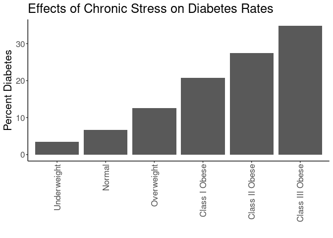
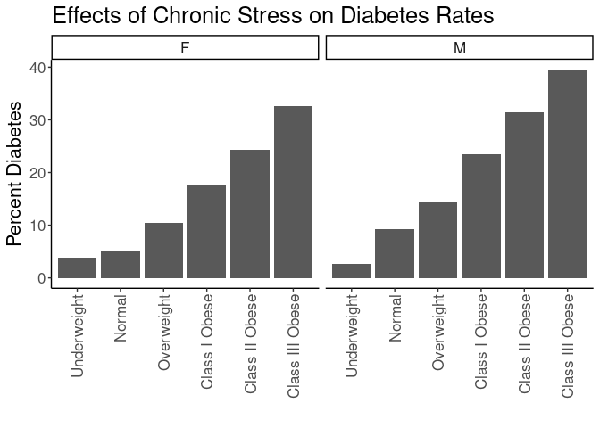
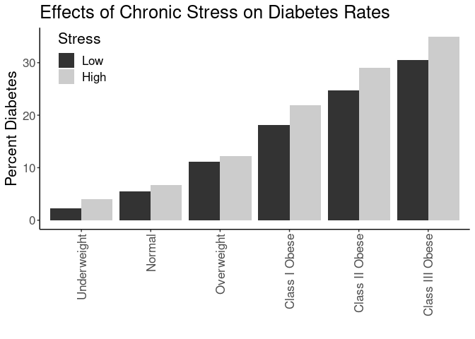
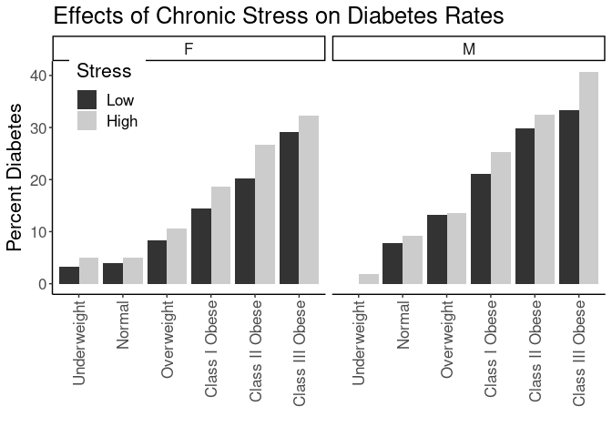
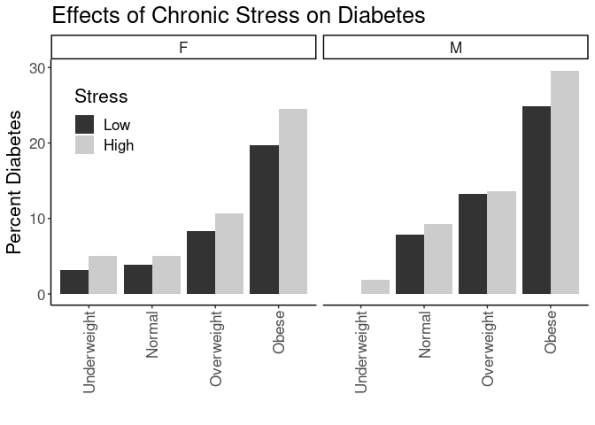
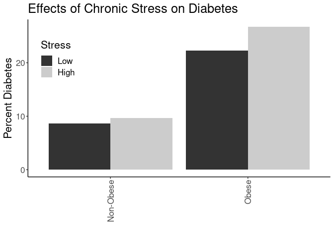
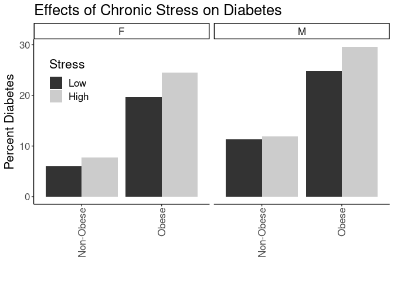
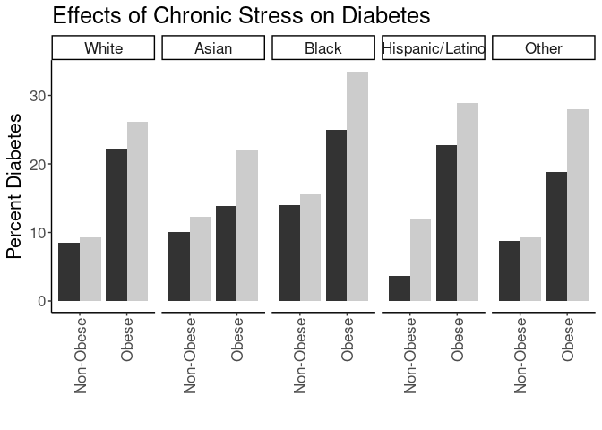
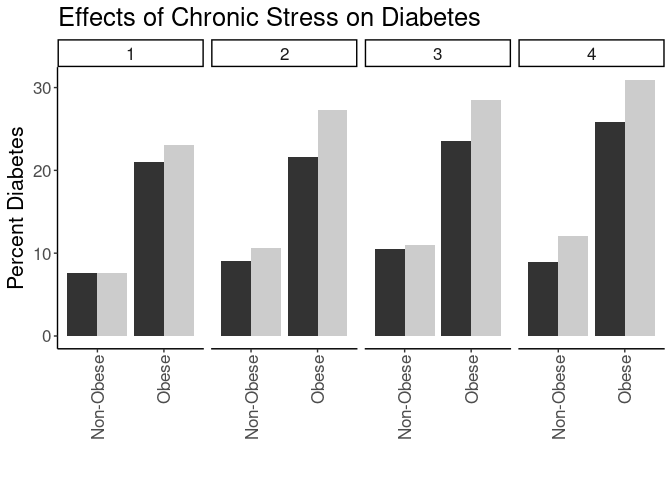
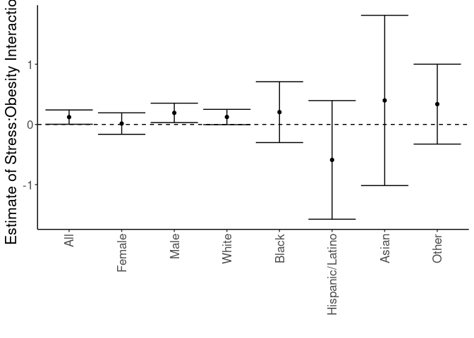

## Purpose

To test the effect modification of obesity on the stress-diabetes relationships.


```r
library(knitr)
#figures made will go to directory called figures, will make them as both png and pdf files 
opts_chunk$set(fig.path='figures/',
               echo=TRUE, warning=FALSE, message=FALSE,dev=c('png','pdf'))
options(scipen = 2, digits = 3)

library(readr)
library(dplyr)
```

```
## 
## Attaching package: 'dplyr'
```

```
## The following objects are masked from 'package:stats':
## 
##     filter, lag
```

```
## The following objects are masked from 'package:base':
## 
##     intersect, setdiff, setequal, union
```

```r
library(tidyr)

input.file <- 'data-combined.csv'
combined.data <- read_csv(input.file)
```

```
## Rows: 62010 Columns: 39
```

```
## ── Column specification ────────────────────────────────────────────────────────
## Delimiter: ","
## chr (17): DeID_PatientID, Gender, DeID_EncounterID, BMI_cat, BMI_cat.obese, ...
## dbl (22): age, Stress_d1, CardiacArrhythmias, ChronicPulmonaryDisease, Conge...
## 
## ℹ Use `spec()` to retrieve the full column specification for this data.
## ℹ Specify the column types or set `show_col_types = FALSE` to quiet this message.
```

Loaded in the cleaned data from data-combined.csv. This script can be found in /nfs/turbo/precision-health/DataDirect/HUM00219435 - Obesity as a modifier of chronic psy/2023-03-14/2150 - Obesity and Stress - Cohort - DeID - 2023-03-14 and was most recently run on Wed Sep 20 14:10:06 2023. This dataset has 62010 values.


```r
library(forcats)
combined.data <- 
  combined.data %>%
  mutate(BMI_cat= factor(BMI_cat, 
                         levels=c("Underweight",
                                  "Normal",
                                  "Overweight",
                                  'Class I Obese',
                                  'Class II Obese',
                                  'Class III Obese'))) %>%
  mutate(BMI_cat.obese= factor(BMI_cat.obese, 
                               levels=c("Underweight",
                                        "Normal",
                                        "Overweight",
                                        'Obese'))) %>%
  mutate(BMI_cat.Ob.NonOb= factor(BMI_cat.Ob.NonOb, 
                                  levels=c("Non-Obese",
                                           'Obese'))) %>%
  mutate(Stress=relevel(as.factor(High.Stress),ref="Low")) %>% #set low as reference value
    mutate(Race.Ethnicity=relevel(as.factor(Race.Ethnicity),ref="White")) %>% #set white as reference value
  mutate(Stress.quartile=fct_recode(as.factor(Stress.quartile),
                                    "Q1"="(-0.016,4]",
                                    "Q2"="(4,8]",
                                    "Q3"="(8,12]",
                                    "Q4"="(12,16]")) %>%
    mutate(Stress.quartile= factor(Stress.quartile, 
                                  levels=c("Q1","Q2","Q3","Q4"))) 
  
# need to clean race data
```

# Diabetes Rates by BMI

Stratified diagnoses by various BMI categories

## Diabetes by BMI Category


```r
#calculating diabetes rates by bmi category
with(combined.data, table(Type2Diabetes,BMI_cat)) %>% 
  data.frame %>%
  pivot_wider(names_from=Type2Diabetes,
              values_from = Freq) %>%
  rename(Diabetes=`1`,
         NonDiabetes=`0`) %>%
  mutate(Total=Diabetes+NonDiabetes) %>%
  mutate(Percent=Diabetes/Total*100) -> diabetes.bmi.counts

kable(diabetes.bmi.counts, caption="Diabetes rates by BMI category not including gender")
```


Table: Diabetes rates by BMI category not including gender

|BMI_cat         | NonDiabetes| Diabetes| Total| Percent|
|:---------------|-----------:|--------:|-----:|-------:|
|Underweight     |         473|       17|   490|    3.47|
|Normal          |       14198|     1016| 15214|    6.68|
|Overweight      |       17550|     2559| 20109|   12.73|
|Class I Obese   |       10888|     2888| 13776|   20.96|
|Class II Obese  |        5036|     1931|  6967|   27.72|
|Class III Obese |        3397|     1840|  5237|   35.13|

```r
library(ggplot2)

ggplot(diabetes.bmi.counts,
       aes(y=Percent,
           x=BMI_cat)) +
  geom_bar(stat='identity',position='dodge') +
  labs(y="Percent Diabetes",
       title="Effects of Chronic Stress on Diabetes Rates",
       x="") +
  theme_classic() +
  scale_fill_grey() +
  theme(text=element_text(size=16),
        axis.text.x=element_text(angle=90,vjust=0.5,hjust=1),
        legend.position = c(0.1,0.85))
```

<!-- -->

```r
#calculating diabetes rates by bmi category by gender
with(combined.data, table(Type2Diabetes,BMI_cat,Gender)) %>% 
  data.frame %>%
  pivot_wider(names_from=Type2Diabetes,
              values_from = Freq) %>%
  rename(Diabetes=`1`,
         NonDiabetes=`0`) %>%
  mutate(Total=Diabetes+NonDiabetes) %>%
  mutate(Percent=Diabetes/Total*100) -> diabetes.bmi.counts

kable(diabetes.bmi.counts, caption="Diabetes rates by BMI category")
```


Table: Diabetes rates by BMI category

|BMI_cat         |Gender | NonDiabetes| Diabetes| Total| Percent|
|:---------------|:------|-----------:|--------:|-----:|-------:|
|Underweight     |F      |         326|       13|   339|    3.83|
|Normal          |F      |        8822|      465|  9287|    5.01|
|Overweight      |F      |        8105|      961|  9066|   10.60|
|Class I Obese   |F      |        5333|     1167|  6500|   17.95|
|Class II Obese  |F      |        2948|      958|  3906|   24.53|
|Class III Obese |F      |        2393|     1170|  3563|   32.84|
|Underweight     |M      |         147|        4|   151|    2.65|
|Normal          |M      |        5376|      551|  5927|    9.30|
|Overweight      |M      |        9445|     1598| 11043|   14.47|
|Class I Obese   |M      |        5555|     1721|  7276|   23.65|
|Class II Obese  |M      |        2088|      973|  3061|   31.79|
|Class III Obese |M      |        1004|      670|  1674|   40.02|

```r
ggplot(diabetes.bmi.counts,
       aes(y=Percent,
           x=BMI_cat)) +
  geom_bar(stat='identity',position='dodge') +
  labs(y="Percent Diabetes",
       title="Effects of Chronic Stress on Diabetes Rates",
       x="") +
  theme_classic() +
  scale_fill_grey() +
  facet_grid(.~Gender) +
  theme(text=element_text(size=16),
        axis.text.x=element_text(angle=90,vjust=0.5,hjust=1),
        legend.position = c(0.1,0.85))
```

<!-- -->

## Diabetes Rate by BMI and Stress

This analysis uses all the BMI categories


```r
#calculating diabetes rates by bmi category and stress
with(combined.data, table(Type2Diabetes,BMI_cat,Stress)) %>% 
  data.frame %>%
  pivot_wider(names_from=Type2Diabetes,
              values_from = Freq) %>%
  rename(Diabetes=`1`,
         NonDiabetes=`0`) %>%
  mutate(Total=Diabetes+NonDiabetes) %>%
  mutate(Percent=Diabetes/Total*100) -> diabetes.bmi.stress.counts

library(ggplot2)

kable(diabetes.bmi.stress.counts, caption="Diabetes rates by BMI category")
```


Table: Diabetes rates by BMI category

|BMI_cat         |Stress | NonDiabetes| Diabetes| Total| Percent|
|:---------------|:------|-----------:|--------:|-----:|-------:|
|Underweight     |Low    |         129|        3|   132|    2.27|
|Normal          |Low    |        5413|      314|  5727|    5.48|
|Overweight      |Low    |        6876|      861|  7737|   11.13|
|Class I Obese   |Low    |        4125|      920|  5045|   18.24|
|Class II Obese  |Low    |        1832|      603|  2435|   24.76|
|Class III Obese |Low    |        1210|      533|  1743|   30.58|
|Underweight     |High   |         145|        6|   151|    3.97|
|Normal          |High   |        3659|      262|  3921|    6.68|
|Overweight      |High   |        4540|      633|  5173|   12.24|
|Class I Obese   |High   |        2985|      840|  3825|   21.96|
|Class II Obese  |High   |        1442|      594|  2036|   29.18|
|Class III Obese |High   |        1063|      572|  1635|   34.98|

```r
ggplot(diabetes.bmi.stress.counts,
       aes(y=Percent,
           x=BMI_cat,
           fill=Stress)) +
  geom_bar(stat='identity',position='dodge') +
  labs(y="Percent Diabetes",
       title="Effects of Chronic Stress on Diabetes Rates",
       x="") +
  theme_classic() +
  scale_fill_grey() +
  theme(text=element_text(size=16),
        axis.text.x=element_text(angle=90,vjust=0.5,hjust=1),
        legend.position = c(0.1,0.85))
```

<!-- -->


```r
#calculating diabetes rates by bmi category and stress
with(combined.data, table(Type2Diabetes,BMI_cat,Stress,Gender)) %>% 
  data.frame %>%
  pivot_wider(names_from=Type2Diabetes,
              values_from = Freq) %>%
  rename(Diabetes=`1`,
         NonDiabetes=`0`) %>%
  mutate(Total=Diabetes+NonDiabetes) %>%
  mutate(Percent=Diabetes/Total*100) -> diabetes.bmi.stress.counts

library(ggplot2)

kable(diabetes.bmi.stress.counts, caption="Diabetes rates by BMI category")
```


Table: Diabetes rates by BMI category

|BMI_cat         |Stress |Gender | NonDiabetes| Diabetes| Total| Percent|
|:---------------|:------|:------|-----------:|--------:|-----:|-------:|
|Underweight     |Low    |F      |          90|        3|    93|    3.23|
|Normal          |Low    |F      |        3301|      134|  3435|    3.90|
|Overweight      |Low    |F      |        3054|      276|  3330|    8.29|
|Class I Obese   |Low    |F      |        1890|      321|  2211|   14.52|
|Class II Obese  |Low    |F      |        1040|      265|  1305|   20.31|
|Class III Obese |Low    |F      |         821|      339|  1160|   29.22|
|Underweight     |High   |F      |          94|        5|    99|    5.05|
|Normal          |High   |F      |        2280|      121|  2401|    5.04|
|Overweight      |High   |F      |        2201|      265|  2466|   10.75|
|Class I Obese   |High   |F      |        1590|      366|  1956|   18.71|
|Class II Obese  |High   |F      |         866|      316|  1182|   26.73|
|Class III Obese |High   |F      |         766|      368|  1134|   32.45|
|Underweight     |Low    |M      |          39|        0|    39|    0.00|
|Normal          |Low    |M      |        2112|      180|  2292|    7.85|
|Overweight      |Low    |M      |        3822|      585|  4407|   13.27|
|Class I Obese   |Low    |M      |        2235|      599|  2834|   21.14|
|Class II Obese  |Low    |M      |         792|      338|  1130|   29.91|
|Class III Obese |Low    |M      |         389|      194|   583|   33.28|
|Underweight     |High   |M      |          51|        1|    52|    1.92|
|Normal          |High   |M      |        1379|      141|  1520|    9.28|
|Overweight      |High   |M      |        2339|      368|  2707|   13.59|
|Class I Obese   |High   |M      |        1395|      474|  1869|   25.36|
|Class II Obese  |High   |M      |         576|      278|   854|   32.55|
|Class III Obese |High   |M      |         297|      204|   501|   40.72|

```r
ggplot(diabetes.bmi.stress.counts,
       aes(y=Percent,
           x=BMI_cat,
           fill=Stress)) +
  geom_bar(stat='identity',position='dodge') +
  labs(y="Percent Diabetes",
       title="Effects of Chronic Stress on Diabetes Rates",
       x="") +
  theme_classic() +
  scale_fill_grey() +
  facet_grid(.~Gender) +
  theme(text=element_text(size=16),
        axis.text.x=element_text(angle=90,vjust=0.5,hjust=1),
        legend.position = c(0.1,0.85))
```

<!-- -->

## Logistic Regressions for All Obese Categories

Ran a series of stepwise logistic regressions testing for obesity as a modifier of the effects of stress.


```r
library(broom)
glm(Type2Diabetes~BMI_cat, 
    family="binomial",
    data=combined.data) -> obesity.glm1

obesity.glm1 %>%
  tidy() %>%
  kable(caption="Logistic regression of obesity on diabetes", digits =c(0,2,3,2,99))
```


Table: Logistic regression of obesity on diabetes

|term                   | estimate| std.error| statistic|  p.value|
|:----------------------|--------:|---------:|---------:|--------:|
|(Intercept)            |    -3.33|     0.247|    -13.48| 2.01e-41|
|BMI_catNormal          |     0.69|     0.249|      2.77| 5.65e-03|
|BMI_catOverweight      |     1.40|     0.248|      5.66| 1.55e-08|
|BMI_catClass I Obese   |     2.00|     0.248|      8.07| 6.85e-16|
|BMI_catClass II Obese  |     2.37|     0.248|      9.54| 1.43e-21|
|BMI_catClass III Obese |     2.71|     0.248|     10.92| 9.12e-28|

```r
anova(obesity.glm1,test="Chisq") %>% tidy %>%
  kable(caption="Logistic regression of obesity on diabetes, ", digits =c(0,0,0,0,0,99))
```


Table: Logistic regression of obesity on diabetes, 

|term    | df| deviance| df.residual| residual.deviance| p.value|
|:-------|--:|--------:|-----------:|-----------------:|-------:|
|NULL    | NA|       NA|       61792|             55529|      NA|
|BMI_cat |  5|     3429|       61787|             52100|       0|

```r
#adding in stress as a modifier
glm(Type2Diabetes~BMI_cat+Stress+Stress:BMI_cat, 
    family="binomial",
    data=combined.data) -> obesity.glm2

obesity.glm2 %>%
  tidy() %>%
  kable(caption="Logistic regression of obesity on diabetes, with stress as a modifier", digits =c(0,2,3,2,99))
```


Table: Logistic regression of obesity on diabetes, with stress as a modifier

|term                              | estimate| std.error| statistic|  p.value|
|:---------------------------------|--------:|---------:|---------:|--------:|
|(Intercept)                       |    -3.76|     0.581|     -6.47| 9.72e-11|
|BMI_catNormal                     |     0.91|     0.584|      1.56| 1.18e-01|
|BMI_catOverweight                 |     1.68|     0.582|      2.89| 3.84e-03|
|BMI_catClass I Obese              |     2.26|     0.582|      3.88| 1.04e-04|
|BMI_catClass II Obese             |     2.65|     0.583|      4.54| 5.51e-06|
|BMI_catClass III Obese            |     2.94|     0.584|      5.04| 4.64e-07|
|StressHigh                        |     0.58|     0.715|      0.81| 4.20e-01|
|BMI_catNormal:StressHigh          |    -0.37|     0.720|     -0.51| 6.12e-01|
|BMI_catOverweight:StressHigh      |    -0.47|     0.717|     -0.65| 5.13e-01|
|BMI_catClass I Obese:StressHigh   |    -0.34|     0.717|     -0.48| 6.32e-01|
|BMI_catClass II Obese:StressHigh  |    -0.35|     0.718|     -0.49| 6.24e-01|
|BMI_catClass III Obese:StressHigh |    -0.38|     0.719|     -0.52| 6.01e-01|

```r
anova(obesity.glm2,test="Chisq") %>% tidy %>%
  kable(caption="Logistic regression of obese vs non-obese on diabetes, with stress as a modifier", digits =c(0,0,0,0,0,99))
```


Table: Logistic regression of obese vs non-obese on diabetes, with stress as a modifier

|term           | df| deviance| df.residual| residual.deviance|  p.value|
|:--------------|--:|--------:|-----------:|-----------------:|--------:|
|NULL           | NA|       NA|       39559|             34154|       NA|
|BMI_cat        |  5|     2155|       39554|             31999| 0.00e+00|
|Stress         |  1|       44|       39553|             31955| 3.10e-11|
|BMI_cat:Stress |  5|        3|       39548|             31952| 6.29e-01|

```r
#adding in age and gender as covariates as a modifier
glm(Type2Diabetes~BMI_cat+Stress+Stress:BMI_cat+Gender+BMI_cat:Gender+age, 
    family="binomial",
    data=combined.data) -> obesity.glm3

obesity.glm3 %>%
  tidy() %>%
  kable(caption="Logistic regression of obesity on diabetes, with stress as a modifier and age and  gender as covariates", digits =c(0,2,3,2,99))
```


Table: Logistic regression of obesity on diabetes, with stress as a modifier and age and  gender as covariates

|term                              | estimate| std.error| statistic|  p.value|
|:---------------------------------|--------:|---------:|---------:|--------:|
|(Intercept)                       |    -5.95|     0.602|     -9.88| 4.84e-23|
|BMI_catNormal                     |     0.39|     0.603|      0.65| 5.17e-01|
|BMI_catOverweight                 |     1.14|     0.601|      1.90| 5.73e-02|
|BMI_catClass I Obese              |     1.76|     0.601|      2.94| 3.32e-03|
|BMI_catClass II Obese             |     2.28|     0.601|      3.80| 1.46e-04|
|BMI_catClass III Obese            |     2.79|     0.602|      4.64| 3.43e-06|
|StressHigh                        |     0.72|     0.727|      1.00| 3.19e-01|
|GenderM                           |    -1.23|     1.072|     -1.14| 2.53e-01|
|age                               |     0.04|     0.001|     39.53| 0.00e+00|
|BMI_catNormal:StressHigh          |    -0.43|     0.732|     -0.59| 5.57e-01|
|BMI_catOverweight:StressHigh      |    -0.51|     0.729|     -0.70| 4.85e-01|
|BMI_catClass I Obese:StressHigh   |    -0.38|     0.729|     -0.52| 6.01e-01|
|BMI_catClass II Obese:StressHigh  |    -0.39|     0.730|     -0.53| 5.94e-01|
|BMI_catClass III Obese:StressHigh |    -0.41|     0.731|     -0.56| 5.75e-01|
|BMI_catNormal:GenderM             |     1.83|     1.076|      1.70| 8.84e-02|
|BMI_catOverweight:GenderM         |     1.49|     1.074|      1.39| 1.65e-01|
|BMI_catClass I Obese:GenderM      |     1.49|     1.074|      1.39| 1.65e-01|
|BMI_catClass II Obese:GenderM     |     1.47|     1.074|      1.36| 1.73e-01|
|BMI_catClass III Obese:GenderM    |     1.38|     1.075|      1.29| 1.98e-01|

```r
anova(obesity.glm3,test="Chisq") %>% tidy %>%
  kable(caption="Logistic regression of obesity on diabetes, with stress as a modifier and age and gender as covariate", digits =c(0,0,0,0,0,99))
```


Table: Logistic regression of obesity on diabetes, with stress as a modifier and age and gender as covariate

|term           | df| deviance| df.residual| residual.deviance|  p.value|
|:--------------|--:|--------:|-----------:|-----------------:|--------:|
|NULL           | NA|       NA|       39559|             34154|       NA|
|BMI_cat        |  5|     2155|       39554|             31999| 0.00e+00|
|Stress         |  1|       44|       39553|             31955| 3.10e-11|
|Gender         |  1|      212|       39552|             31743| 5.75e-48|
|age            |  1|     1794|       39551|             29949| 0.00e+00|
|BMI_cat:Stress |  5|        3|       39546|             29945| 6.27e-01|
|BMI_cat:Gender |  5|       19|       39541|             29926| 1.58e-03|

```r
#adding in race and ethnicity
glm(Type2Diabetes~BMI_cat+Stress+Stress:BMI_cat+Gender+BMI_cat:Gender+age+Race.Ethnicity, 
    family="binomial",
    data=combined.data) -> obesity.glm4

obesity.glm4 %>%
  tidy() %>%
  kable(caption="Logistic regression of obesity on diabetes, with stress as a modifier and age, gender and race as covariates", digits =c(0,2,3,2,99))
```


Table: Logistic regression of obesity on diabetes, with stress as a modifier and age, gender and race as covariates

|term                              | estimate| std.error| statistic|  p.value|
|:---------------------------------|--------:|---------:|---------:|--------:|
|(Intercept)                       |    -6.11|     0.602|    -10.14| 3.52e-24|
|BMI_catNormal                     |     0.39|     0.603|      0.65| 5.17e-01|
|BMI_catOverweight                 |     1.15|     0.600|      1.91| 5.64e-02|
|BMI_catClass I Obese              |     1.77|     0.600|      2.94| 3.25e-03|
|BMI_catClass II Obese             |     2.29|     0.601|      3.81| 1.39e-04|
|BMI_catClass III Obese            |     2.79|     0.601|      4.64| 3.47e-06|
|StressHigh                        |     0.73|     0.727|      1.01| 3.15e-01|
|GenderM                           |    -1.22|     1.072|     -1.13| 2.57e-01|
|age                               |     0.04|     0.001|     40.41| 0.00e+00|
|Race.EthnicityAsian               |     0.82|     0.138|      5.94| 2.90e-09|
|Race.EthnicityBlack               |     0.63|     0.064|      9.85| 6.99e-23|
|Race.EthnicityHispanic/Latino     |     0.39|     0.108|      3.64| 2.76e-04|
|Race.EthnicityOther               |     0.04|     0.085|      0.41| 6.80e-01|
|BMI_catNormal:StressHigh          |    -0.44|     0.732|     -0.60| 5.51e-01|
|BMI_catOverweight:StressHigh      |    -0.52|     0.729|     -0.72| 4.74e-01|
|BMI_catClass I Obese:StressHigh   |    -0.39|     0.729|     -0.54| 5.90e-01|
|BMI_catClass II Obese:StressHigh  |    -0.40|     0.730|     -0.55| 5.80e-01|
|BMI_catClass III Obese:StressHigh |    -0.42|     0.731|     -0.57| 5.68e-01|
|BMI_catNormal:GenderM             |     1.82|     1.076|      1.69| 9.06e-02|
|BMI_catOverweight:GenderM         |     1.48|     1.074|      1.38| 1.67e-01|
|BMI_catClass I Obese:GenderM      |     1.49|     1.074|      1.39| 1.65e-01|
|BMI_catClass II Obese:GenderM     |     1.46|     1.075|      1.36| 1.73e-01|
|BMI_catClass III Obese:GenderM    |     1.39|     1.075|      1.30| 1.95e-01|

```r
anova(obesity.glm4,test="Chisq") %>% tidy %>%
  kable(caption="Logistic regression of obesity on diabetes, with stress as a modifier and age, gender and race as covariate", digits =c(0,0,0,0,0,99))
```


Table: Logistic regression of obesity on diabetes, with stress as a modifier and age, gender and race as covariate

|term           | df| deviance| df.residual| residual.deviance|  p.value|
|:--------------|--:|--------:|-----------:|-----------------:|--------:|
|NULL           | NA|       NA|       39559|             34154|       NA|
|BMI_cat        |  5|     2155|       39554|             31999| 0.00e+00|
|Stress         |  1|       44|       39553|             31955| 3.10e-11|
|Gender         |  1|      212|       39552|             31743| 5.75e-48|
|age            |  1|     1794|       39551|             29949| 0.00e+00|
|Race.Ethnicity |  4|      128|       39547|             29821| 1.09e-26|
|BMI_cat:Stress |  5|        3|       39542|             29818| 6.27e-01|
|BMI_cat:Gender |  5|       18|       39537|             29799| 2.90e-03|

```r
#adding in neighborhood
glm(Type2Diabetes~BMI_cat+Stress+Stress:BMI_cat+Gender+BMI_cat:Gender+age+Race.Ethnicity+disadvantage13_17_qrtl, 
    family="binomial",
    data=combined.data) -> obesity.glm5

obesity.glm5 %>%
  tidy() %>%
  kable(caption="Logistic regression of obesity on diabetes, with stress as a modifier and age, gender, race and neighborhood as covariates", digits =c(0,2,3,2,99))
```


Table: Logistic regression of obesity on diabetes, with stress as a modifier and age, gender, race and neighborhood as covariates

|term                              | estimate| std.error| statistic|  p.value|
|:---------------------------------|--------:|---------:|---------:|--------:|
|(Intercept)                       |    -6.36|     0.608|    -10.46| 1.33e-25|
|BMI_catNormal                     |     0.36|     0.607|      0.60| 5.49e-01|
|BMI_catOverweight                 |     1.06|     0.605|      1.75| 7.94e-02|
|BMI_catClass I Obese              |     1.69|     0.605|      2.79| 5.30e-03|
|BMI_catClass II Obese             |     2.19|     0.606|      3.61| 3.02e-04|
|BMI_catClass III Obese            |     2.70|     0.606|      4.47| 8.00e-06|
|StressHigh                        |     0.69|     0.729|      0.95| 3.41e-01|
|GenderM                           |    -1.24|     1.074|     -1.16| 2.48e-01|
|age                               |     0.05|     0.001|     39.34| 0.00e+00|
|Race.EthnicityAsian               |     0.84|     0.143|      5.87| 4.42e-09|
|Race.EthnicityBlack               |     0.48|     0.069|      6.91| 4.88e-12|
|Race.EthnicityHispanic/Latino     |     0.39|     0.112|      3.51| 4.45e-04|
|Race.EthnicityOther               |     0.00|     0.089|      0.05| 9.64e-01|
|disadvantage13_17_qrtl            |     0.14|     0.015|      9.34| 1.01e-20|
|BMI_catNormal:StressHigh          |    -0.42|     0.735|     -0.58| 5.64e-01|
|BMI_catOverweight:StressHigh      |    -0.50|     0.731|     -0.68| 4.95e-01|
|BMI_catClass I Obese:StressHigh   |    -0.37|     0.731|     -0.51| 6.13e-01|
|BMI_catClass II Obese:StressHigh  |    -0.38|     0.733|     -0.52| 6.06e-01|
|BMI_catClass III Obese:StressHigh |    -0.39|     0.733|     -0.53| 5.93e-01|
|BMI_catNormal:GenderM             |     1.80|     1.078|      1.67| 9.51e-02|
|BMI_catOverweight:GenderM         |     1.53|     1.076|      1.42| 1.55e-01|
|BMI_catClass I Obese:GenderM      |     1.53|     1.076|      1.42| 1.56e-01|
|BMI_catClass II Obese:GenderM     |     1.50|     1.077|      1.39| 1.64e-01|
|BMI_catClass III Obese:GenderM    |     1.43|     1.077|      1.32| 1.85e-01|

```r
anova(obesity.glm5,test="Chisq") %>% tidy %>%
  kable(caption="Logistic regression of obesity on diabetes, with stress as a modifier and age, gender, race and neighborhood as covariates", digits =c(0,0,0,0,0,99))
```


Table: Logistic regression of obesity on diabetes, with stress as a modifier and age, gender, race and neighborhood as covariates

|term                   | df| deviance| df.residual| residual.deviance|  p.value|
|:----------------------|--:|--------:|-----------:|-----------------:|--------:|
|NULL                   | NA|       NA|       36392|             31591|       NA|
|BMI_cat                |  5|     1984|       36387|             29608| 0.00e+00|
|Stress                 |  1|       45|       36386|             29562| 1.70e-11|
|Gender                 |  1|      195|       36385|             29367| 2.38e-44|
|age                    |  1|     1659|       36384|             27708| 0.00e+00|
|Race.Ethnicity         |  4|      123|       36380|             27585| 1.26e-25|
|disadvantage13_17_qrtl |  1|       88|       36379|             27498| 8.04e-21|
|BMI_cat:Stress         |  5|        3|       36374|             27494| 6.49e-01|
|BMI_cat:Gender         |  5|       13|       36369|             27481| 2.21e-02|

### Diabetes Rates by Quartiles


```r
with(combined.data, table(Type2Diabetes,BMI_cat.obese,Stress.quartile,Gender)) %>% 
  data.frame %>%
  pivot_wider(names_from=Type2Diabetes,
              values_from = Freq) %>%
  rename(Diabetes=`1`,
         NonDiabetes=`0`) %>%
  mutate(Total=Diabetes+NonDiabetes) %>%
  mutate(Percent=Diabetes/Total*100) -> diabetes.bmi.stress.quartile.counts

kable(diabetes.bmi.stress.quartile.counts, caption="Diabetes Rates by BMI and Stress Quartile")
```


Table: Diabetes Rates by BMI and Stress Quartile

|BMI_cat.obese |Stress.quartile |Gender | NonDiabetes| Diabetes| Total| Percent|
|:-------------|:---------------|:------|-----------:|--------:|-----:|-------:|
|Underweight   |Q1              |F      |          70|        3|    73|    4.11|
|Normal        |Q1              |F      |        2760|      114|  2874|    3.97|
|Overweight    |Q1              |F      |        2560|      229|  2789|    8.21|
|Obese         |Q1              |F      |        3121|      757|  3878|   19.52|
|Underweight   |Q2              |F      |          81|        3|    84|    3.57|
|Normal        |Q2              |F      |        2120|      107|  2227|    4.80|
|Overweight    |Q2              |F      |        2024|      222|  2246|    9.88|
|Obese         |Q2              |F      |        2779|      840|  3619|   23.21|
|Underweight   |Q3              |F      |          30|        2|    32|    6.25|
|Normal        |Q3              |F      |         631|       28|   659|    4.25|
|Overweight    |Q3              |F      |         599|       80|   679|   11.78|
|Obese         |Q3              |F      |         960|      344|  1304|   26.38|
|Underweight   |Q4              |F      |           3|        0|     3|    0.00|
|Normal        |Q4              |F      |          70|        6|    76|    7.89|
|Overweight    |Q4              |F      |          72|       10|    82|   12.20|
|Obese         |Q4              |F      |         113|       34|   147|   23.13|
|Underweight   |Q1              |M      |          28|        0|    28|    0.00|
|Normal        |Q1              |M      |        1815|      154|  1969|    7.82|
|Overweight    |Q1              |M      |        3297|      494|  3791|   13.03|
|Obese         |Q1              |M      |        2911|      955|  3866|   24.70|
|Underweight   |Q2              |M      |          45|        1|    46|    2.17|
|Normal        |Q2              |M      |        1308|      121|  1429|    8.47|
|Overweight    |Q2              |M      |        2338|      350|  2688|   13.02|
|Obese         |Q2              |M      |        2145|      859|  3004|   28.59|
|Underweight   |Q3              |M      |          15|        0|    15|    0.00|
|Normal        |Q3              |M      |         330|       36|   366|    9.84|
|Overweight    |Q3              |M      |         486|       97|   583|   16.64|
|Obese         |Q3              |M      |         567|      244|   811|   30.09|
|Underweight   |Q4              |M      |           2|        0|     2|    0.00|
|Normal        |Q4              |M      |          38|       10|    48|   20.83|
|Overweight    |Q4              |M      |          40|       12|    52|   23.08|
|Obese         |Q4              |M      |          61|       29|    90|   32.22|

```r
ggplot(diabetes.bmi.stress.quartile.counts,
       aes(y=Percent,
           x=BMI_cat.obese,
           fill=Stress.quartile)) +
  geom_bar(stat='identity',position='dodge') +
  labs(y="Percent Diabetes",
       title="Effects of Chronic Stress on Diabetes",
       x="") +
  theme_classic() +
  facet_grid(.~Gender) +
  theme(text=element_text(size=16),
        axis.text.x=element_text(angle=90,vjust=0.5,hjust=1),
        legend.position = c(0.15,0.75))
```

<!-- -->

## Diabetes Rates by Normal Obesity and Stress


```r
#calculating diabetes rates by bmi category, stress and gender
with(combined.data, table(Type2Diabetes,BMI_cat.obese,Stress,Gender)) %>% 
  data.frame %>%
  pivot_wider(names_from=Type2Diabetes,
              values_from = Freq) %>%
  rename(Diabetes=`1`,
         NonDiabetes=`0`) %>%
  mutate(Total=Diabetes+NonDiabetes) %>%
  mutate(Percent=Diabetes/Total*100) -> diabetes.bmi.stress.gender.counts

kable(diabetes.bmi.stress.gender.counts, caption="Diabetes Rates by BMI and Stress")
```


Table: Diabetes Rates by BMI and Stress

|BMI_cat.obese |Stress |Gender | NonDiabetes| Diabetes| Total| Percent|
|:-------------|:------|:------|-----------:|--------:|-----:|-------:|
|Underweight   |Low    |F      |          90|        3|    93|    3.23|
|Normal        |Low    |F      |        3301|      134|  3435|    3.90|
|Overweight    |Low    |F      |        3054|      276|  3330|    8.29|
|Obese         |Low    |F      |        3751|      925|  4676|   19.78|
|Underweight   |High   |F      |          94|        5|    99|    5.05|
|Normal        |High   |F      |        2280|      121|  2401|    5.04|
|Overweight    |High   |F      |        2201|      265|  2466|   10.75|
|Obese         |High   |F      |        3222|     1050|  4272|   24.58|
|Underweight   |Low    |M      |          39|        0|    39|    0.00|
|Normal        |Low    |M      |        2112|      180|  2292|    7.85|
|Overweight    |Low    |M      |        3822|      585|  4407|   13.27|
|Obese         |Low    |M      |        3416|     1131|  4547|   24.87|
|Underweight   |High   |M      |          51|        1|    52|    1.92|
|Normal        |High   |M      |        1379|      141|  1520|    9.28|
|Overweight    |High   |M      |        2339|      368|  2707|   13.59|
|Obese         |High   |M      |        2268|      956|  3224|   29.65|

```r
ggplot(diabetes.bmi.stress.gender.counts,
       aes(y=Percent,
           x=BMI_cat.obese,
           fill=Stress)) +
  geom_bar(stat='identity',position='dodge') +
  labs(y="Percent Diabetes",
       title="Effects of Chronic Stress on Diabetes",
       x="") +
  facet_grid(.~Gender) +
  theme_classic() +
  scale_fill_grey() +
  theme(text=element_text(size=16),
        axis.text.x=element_text(angle=90,vjust=0.5,hjust=1),
        legend.position = c(0.1,0.75))
```

<!-- -->

## Logistic Regressions for Obesity Categories

Ran a series of logistic regressions using the normal obesity categories not classes as the categorization


```r
glm(Type2Diabetes~BMI_cat.obese, 
    family="binomial",
    data=combined.data) -> obesity.glm1

obesity.glm1 %>%
  tidy() %>%
  kable(caption="Logistic regression of obese vs non-obese on diabetes", digits =c(0,2,3,2,99))
```


Table: Logistic regression of obese vs non-obese on diabetes

|term                    | estimate| std.error| statistic|  p.value|
|:-----------------------|--------:|---------:|---------:|--------:|
|(Intercept)             |    -3.33|     0.247|    -13.48| 2.01e-41|
|BMI_cat.obeseNormal     |     0.69|     0.249|      2.77| 5.65e-03|
|BMI_cat.obeseOverweight |     1.40|     0.248|      5.66| 1.55e-08|
|BMI_cat.obeseObese      |     2.26|     0.247|      9.15| 5.78e-20|

```r
anova(obesity.glm1,test="Chisq") %>% tidy %>%
  kable(caption="Logistic regression of obesity on diabetes, ", digits =c(0,0,0,0,0,99))
```


Table: Logistic regression of obesity on diabetes, 

|term          | df| deviance| df.residual| residual.deviance| p.value|
|:-------------|--:|--------:|-----------:|-----------------:|-------:|
|NULL          | NA|       NA|       61792|             55529|      NA|
|BMI_cat.obese |  3|     3017|       61789|             52512|       0|

```r
#adding in stress as a modifier
glm(Type2Diabetes~BMI_cat.obese+Stress+Stress:BMI_cat.obese, 
    family="binomial",
    data=combined.data) -> obesity.glm2

obesity.glm2 %>%
  tidy() %>%
  kable(caption="Logistic regression of obesity on diabetes, with stress as a modifier", digits =c(0,2,3,2,99))
```


Table: Logistic regression of obesity on diabetes, with stress as a modifier

|term                               | estimate| std.error| statistic|  p.value|
|:----------------------------------|--------:|---------:|---------:|--------:|
|(Intercept)                        |    -3.76|     0.581|     -6.47| 9.72e-11|
|BMI_cat.obeseNormal                |     0.91|     0.584|      1.56| 1.18e-01|
|BMI_cat.obeseOverweight            |     1.68|     0.582|      2.89| 3.84e-03|
|BMI_cat.obeseObese                 |     2.51|     0.582|      4.32| 1.57e-05|
|StressHigh                         |     0.58|     0.715|      0.81| 4.20e-01|
|BMI_cat.obeseNormal:StressHigh     |    -0.37|     0.720|     -0.51| 6.12e-01|
|BMI_cat.obeseOverweight:StressHigh |    -0.47|     0.717|     -0.65| 5.13e-01|
|BMI_cat.obeseObese:StressHigh      |    -0.33|     0.716|     -0.47| 6.41e-01|

```r
anova(obesity.glm2,test="Chisq") %>% tidy %>%
  kable(caption="Logistic regression of obesity on diabetes, with stress as a modifier", digits =c(0,0,0,0,0,99))
```


Table: Logistic regression of obesity on diabetes, with stress as a modifier

|term                 | df| deviance| df.residual| residual.deviance|  p.value|
|:--------------------|--:|--------:|-----------:|-----------------:|--------:|
|NULL                 | NA|       NA|       39559|             34154|       NA|
|BMI_cat.obese        |  3|     1919|       39556|             32235| 0.00e+00|
|Stress               |  1|       51|       39555|             32185| 1.11e-12|
|BMI_cat.obese:Stress |  3|        4|       39552|             32180| 2.22e-01|

```r
#adding in age and gender as covariates as a modifier
glm(Type2Diabetes~BMI_cat.obese+Stress+Stress:BMI_cat.obese+Gender+BMI_cat.obese:Gender+age, 
    family="binomial",
    data=combined.data) -> obesity.glm3

obesity.glm3 %>%
  tidy() %>%
  kable(caption="Logistic regression of obesity on diabetes, with stress as a modifier and age and  gender as covariates", digits =c(0,2,3,2,99))
```


Table: Logistic regression of obesity on diabetes, with stress as a modifier and age and  gender as covariates

|term                               | estimate| std.error| statistic|  p.value|
|:----------------------------------|--------:|---------:|---------:|--------:|
|(Intercept)                        |    -5.80|     0.602|     -9.64| 5.23e-22|
|BMI_cat.obeseNormal                |     0.39|     0.603|      0.64| 5.22e-01|
|BMI_cat.obeseOverweight            |     1.14|     0.600|      1.90| 5.76e-02|
|BMI_cat.obeseObese                 |     2.18|     0.599|      3.64| 2.68e-04|
|StressHigh                         |     0.72|     0.726|      0.99| 3.23e-01|
|GenderM                            |    -1.23|     1.072|     -1.15| 2.50e-01|
|age                                |     0.04|     0.001|     38.16| 0.00e+00|
|BMI_cat.obeseNormal:StressHigh     |    -0.43|     0.732|     -0.58| 5.59e-01|
|BMI_cat.obeseOverweight:StressHigh |    -0.51|     0.728|     -0.70| 4.86e-01|
|BMI_cat.obeseObese:StressHigh      |    -0.37|     0.727|     -0.51| 6.09e-01|
|BMI_cat.obeseNormal:GenderM        |     1.85|     1.075|      1.72| 8.61e-02|
|BMI_cat.obeseOverweight:GenderM    |     1.50|     1.073|      1.40| 1.61e-01|
|BMI_cat.obeseObese:GenderM         |     1.34|     1.072|      1.25| 2.12e-01|

```r
anova(obesity.glm3,test="Chisq") %>% tidy %>%
  kable(caption="Logistic regression of obesity on diabetes, with stress as a modifier and age and gender as covariate", digits =c(0,0,0,0,0,99))
```


Table: Logistic regression of obesity on diabetes, with stress as a modifier and age and gender as covariate

|term                 | df| deviance| df.residual| residual.deviance|  p.value|
|:--------------------|--:|--------:|-----------:|-----------------:|--------:|
|NULL                 | NA|       NA|       39559|             34154|       NA|
|BMI_cat.obese        |  3|     1919|       39556|             32235| 0.00e+00|
|Stress               |  1|       51|       39555|             32185| 1.11e-12|
|Gender               |  1|      154|       39554|             32031| 2.02e-35|
|age                  |  1|     1647|       39553|             30384| 0.00e+00|
|BMI_cat.obese:Stress |  3|        5|       39550|             30379| 1.70e-01|
|BMI_cat.obese:Gender |  3|       33|       39547|             30346| 4.06e-07|

```r
#adding in race and ethnicity
glm(Type2Diabetes~BMI_cat.obese+Stress+Stress:BMI_cat.obese+Gender+BMI_cat.obese:Gender+age+Race.Ethnicity, 
    family="binomial",
    data=combined.data) -> obesity.glm4

obesity.glm4 %>%
  tidy() %>%
  kable(caption="Logistic regression of obesity on diabetes, with stress as a modifier and age, gender and race as covariates", digits =c(0,2,3,2,99))
```


Table: Logistic regression of obesity on diabetes, with stress as a modifier and age, gender and race as covariates

|term                               | estimate| std.error| statistic|  p.value|
|:----------------------------------|--------:|---------:|---------:|--------:|
|(Intercept)                        |    -5.95|     0.601|     -9.89| 4.54e-23|
|BMI_cat.obeseNormal                |     0.39|     0.602|      0.64| 5.23e-01|
|BMI_cat.obeseOverweight            |     1.14|     0.600|      1.90| 5.74e-02|
|BMI_cat.obeseObese                 |     2.18|     0.598|      3.64| 2.72e-04|
|StressHigh                         |     0.72|     0.726|      1.00| 3.19e-01|
|GenderM                            |    -1.23|     1.072|     -1.14| 2.52e-01|
|age                                |     0.04|     0.001|     39.06| 0.00e+00|
|Race.EthnicityAsian                |     0.73|     0.138|      5.33| 9.89e-08|
|Race.EthnicityBlack                |     0.65|     0.063|     10.29| 7.50e-25|
|Race.EthnicityHispanic/Latino      |     0.37|     0.107|      3.43| 6.12e-04|
|Race.EthnicityOther                |     0.04|     0.085|      0.47| 6.39e-01|
|BMI_cat.obeseNormal:StressHigh     |    -0.43|     0.732|     -0.59| 5.53e-01|
|BMI_cat.obeseOverweight:StressHigh |    -0.52|     0.728|     -0.71| 4.75e-01|
|BMI_cat.obeseObese:StressHigh      |    -0.38|     0.727|     -0.53| 5.99e-01|
|BMI_cat.obeseNormal:GenderM        |     1.84|     1.076|      1.71| 8.78e-02|
|BMI_cat.obeseOverweight:GenderM    |     1.50|     1.074|      1.40| 1.62e-01|
|BMI_cat.obeseObese:GenderM         |     1.34|     1.073|      1.25| 2.10e-01|

```r
anova(obesity.glm4,test="Chisq") %>% tidy %>%
  kable(caption="Logistic regression of obesity on diabetes, with stress as a modifier and age, gender and race as covariates", digits =c(0,0,0,0,0,99))
```


Table: Logistic regression of obesity on diabetes, with stress as a modifier and age, gender and race as covariates

|term                 | df| deviance| df.residual| residual.deviance|  p.value|
|:--------------------|--:|--------:|-----------:|-----------------:|--------:|
|NULL                 | NA|       NA|       39559|             34154|       NA|
|BMI_cat.obese        |  3|     1919|       39556|             32235| 0.00e+00|
|Stress               |  1|       51|       39555|             32185| 1.11e-12|
|Gender               |  1|      154|       39554|             32031| 2.02e-35|
|age                  |  1|     1647|       39553|             30384| 0.00e+00|
|Race.Ethnicity       |  4|      130|       39549|             30254| 4.61e-27|
|BMI_cat.obese:Stress |  3|        5|       39546|             30249| 1.68e-01|
|BMI_cat.obese:Gender |  3|       30|       39543|             30219| 1.10e-06|

```r
glm(Type2Diabetes~BMI_cat.obese+Stress+Stress:BMI_cat.obese+Gender+BMI_cat.obese:Gender+age+Race.Ethnicity+disadvantage13_17_qrtl, 
    family="binomial",
    data=combined.data) -> obesity.glm5

obesity.glm5 %>%
  tidy() %>%
  kable(caption="Logistic regression of obesity on diabetes, with stress as a modifier and age, gender, race and neighborhood as covariates", digits =c(0,2,3,2,99))
```


Table: Logistic regression of obesity on diabetes, with stress as a modifier and age, gender, race and neighborhood as covariates

|term                               | estimate| std.error| statistic|  p.value|
|:----------------------------------|--------:|---------:|---------:|--------:|
|(Intercept)                        |    -6.24|     0.607|    -10.27| 9.91e-25|
|BMI_cat.obeseNormal                |     0.36|     0.607|      0.59| 5.52e-01|
|BMI_cat.obeseOverweight            |     1.06|     0.604|      1.75| 8.02e-02|
|BMI_cat.obeseObese                 |     2.09|     0.603|      3.47| 5.12e-04|
|StressHigh                         |     0.68|     0.728|      0.94| 3.47e-01|
|GenderM                            |    -1.26|     1.074|     -1.17| 2.42e-01|
|age                                |     0.04|     0.001|     38.11| 0.00e+00|
|Race.EthnicityAsian                |     0.76|     0.143|      5.28| 1.29e-07|
|Race.EthnicityBlack                |     0.48|     0.068|      7.08| 1.48e-12|
|Race.EthnicityHispanic/Latino      |     0.36|     0.111|      3.25| 1.17e-03|
|Race.EthnicityOther                |     0.01|     0.088|      0.11| 9.13e-01|
|disadvantage13_17_qrtl             |     0.16|     0.015|     10.31| 6.63e-25|
|BMI_cat.obeseNormal:StressHigh     |    -0.42|     0.734|     -0.57| 5.67e-01|
|BMI_cat.obeseOverweight:StressHigh |    -0.50|     0.731|     -0.68| 4.97e-01|
|BMI_cat.obeseObese:StressHigh      |    -0.36|     0.729|     -0.49| 6.23e-01|
|BMI_cat.obeseNormal:GenderM        |     1.82|     1.078|      1.69| 9.14e-02|
|BMI_cat.obeseOverweight:GenderM    |     1.55|     1.076|      1.44| 1.48e-01|
|BMI_cat.obeseObese:GenderM         |     1.39|     1.075|      1.29| 1.96e-01|

```r
anova(obesity.glm5,test="Chisq") %>% tidy %>%
  kable(caption="Logistic regression of obesity on diabetes, with stress as a modifier and age, gender, race and neighborhood as covariates", digits =c(0,0,0,0,0,99))
```


Table: Logistic regression of obesity on diabetes, with stress as a modifier and age, gender, race and neighborhood as covariates

|term                   | df| deviance| df.residual| residual.deviance|  p.value|
|:----------------------|--:|--------:|-----------:|-----------------:|--------:|
|NULL                   | NA|       NA|       36392|             31591|       NA|
|BMI_cat.obese          |  3|     1754|       36389|             29837| 0.00e+00|
|Stress                 |  1|       51|       36388|             29786| 7.45e-13|
|Gender                 |  1|      141|       36387|             29645| 1.49e-32|
|age                    |  1|     1522|       36386|             28122| 0.00e+00|
|Race.Ethnicity         |  4|      124|       36382|             27998| 6.22e-26|
|disadvantage13_17_qrtl |  1|      108|       36381|             27890| 3.11e-25|
|BMI_cat.obese:Stress   |  3|        5|       36378|             27886| 1.95e-01|
|BMI_cat.obese:Gender   |  3|       24|       36375|             27862| 3.17e-05|

# Diabetes Rates by Obese/Not Obese and Stress


```r
with(combined.data, table(Type2Diabetes,BMI_cat.Ob.NonOb,Stress)) %>% 
  data.frame %>%
  pivot_wider(names_from=Type2Diabetes,
              values_from = Freq) %>%
  rename(Diabetes=`1`,
         NonDiabetes=`0`) %>%
  mutate(Total=Diabetes+NonDiabetes) %>%
  mutate(Percent=Diabetes/Total*100) -> diabetes.BMI_cat.Ob.NonOb.stress.counts

kable(diabetes.BMI_cat.Ob.NonOb.stress.counts, caption="Diabetes Rates by Obese or not and Stress")
```


Table: Diabetes Rates by Obese or not and Stress

|BMI_cat.Ob.NonOb |Stress | NonDiabetes| Diabetes| Total| Percent|
|:----------------|:------|-----------:|--------:|-----:|-------:|
|Non-Obese        |Low    |       12491|     1179| 13670|    8.62|
|Obese            |Low    |        7167|     2056|  9223|   22.29|
|Non-Obese        |High   |        8401|      904|  9305|    9.71|
|Obese            |High   |        5490|     2006|  7496|   26.76|

```r
ggplot(diabetes.BMI_cat.Ob.NonOb.stress.counts,
       aes(y=Percent,
           x=BMI_cat.Ob.NonOb,
           fill=Stress)) +
  geom_bar(stat='identity',position='dodge') +
  labs(y="Percent Diabetes",
       title="Effects of Chronic Stress on Diabetes",
       x="") +
  theme_classic() +
  scale_fill_grey() +
  theme(text=element_text(size=16),
        axis.text.x=element_text(angle=90,vjust=0.5,hjust=1),
        legend.position = c(0.1,0.75))
```

<!-- -->


```r
with(combined.data, table(Type2Diabetes,BMI_cat.Ob.NonOb,Stress,Gender)) %>% 
  data.frame %>%
  pivot_wider(names_from=Type2Diabetes,
              values_from = Freq) %>%
  rename(Diabetes=`1`,
         NonDiabetes=`0`) %>%
  mutate(Total=Diabetes+NonDiabetes) %>%
  mutate(Percent=Diabetes/Total*100) -> diabetes.BMI_cat.Ob.NonOb.stress.counts

kable(diabetes.BMI_cat.Ob.NonOb.stress.counts, caption="Diabetes Rates by Obese or not and Stress")
```


Table: Diabetes Rates by Obese or not and Stress

|BMI_cat.Ob.NonOb |Stress |Gender | NonDiabetes| Diabetes| Total| Percent|
|:----------------|:------|:------|-----------:|--------:|-----:|-------:|
|Non-Obese        |Low    |F      |        6499|      414|  6913|    5.99|
|Obese            |Low    |F      |        3751|      925|  4676|   19.78|
|Non-Obese        |High   |F      |        4613|      392|  5005|    7.83|
|Obese            |High   |F      |        3222|     1050|  4272|   24.58|
|Non-Obese        |Low    |M      |        5992|      765|  6757|   11.32|
|Obese            |Low    |M      |        3416|     1131|  4547|   24.87|
|Non-Obese        |High   |M      |        3788|      512|  4300|   11.91|
|Obese            |High   |M      |        2268|      956|  3224|   29.65|

```r
ggplot(diabetes.BMI_cat.Ob.NonOb.stress.counts,
       aes(y=Percent,
           x=BMI_cat.Ob.NonOb,
           fill=Stress)) +
  geom_bar(stat='identity',position='dodge') +
  labs(y="Percent Diabetes",
       title="Effects of Chronic Stress on Diabetes",
       x="") +
  facet_grid(.~Gender) +
  theme_classic() +
  scale_fill_grey() +
  theme(text=element_text(size=16),
        axis.text.x=element_text(angle=90,vjust=0.5,hjust=1),
        legend.position = c(0.1,0.75))
```

<!-- -->


```r
with(combined.data, table(Type2Diabetes,BMI_cat.Ob.NonOb,Stress,Race.Ethnicity)) %>% 
  data.frame %>%
  pivot_wider(names_from=Type2Diabetes,
              values_from = Freq) %>%
  rename(Diabetes=`1`,
         NonDiabetes=`0`) %>%
  mutate(Total=Diabetes+NonDiabetes) %>%
  mutate(Percent=Diabetes/Total*100) -> diabetes.BMI_cat.Ob.NonOb.stress.counts

ggplot(diabetes.BMI_cat.Ob.NonOb.stress.counts,
       aes(y=Percent,
           x=BMI_cat.Ob.NonOb,
           fill=Stress)) +
  geom_bar(stat='identity',position='dodge') +
  labs(y="Percent Diabetes",
       title="Effects of Chronic Stress on Diabetes",
       x="") +
  facet_grid(.~Race.Ethnicity) +
  theme_classic() +
  scale_fill_grey() +
  theme(text=element_text(size=16),
        axis.text.x=element_text(angle=90,vjust=0.5,hjust=1),
        legend.position = "none")
```

<!-- -->

# Stratified by Neighborhood Disadvantage


```r
with(combined.data, table(Type2Diabetes,BMI_cat.Ob.NonOb,Stress,disadvantage13_17_qrtl)) %>% 
  data.frame %>%
  pivot_wider(names_from=Type2Diabetes,
              values_from = Freq) %>%
  rename(Diabetes=`1`,
         NonDiabetes=`0`) %>%
  mutate(Total=Diabetes+NonDiabetes) %>%
  mutate(Percent=Diabetes/Total*100) -> diabetes.BMI_cat.Ob.NonOb.stress.counts

ggplot(diabetes.BMI_cat.Ob.NonOb.stress.counts,
       aes(y=Percent,
           x=BMI_cat.Ob.NonOb,
           fill=Stress)) +
  geom_bar(stat='identity',position='dodge') +
  labs(y="Percent Diabetes",
       title="Effects of Chronic Stress on Diabetes",
       x="") +
  facet_grid(.~disadvantage13_17_qrtl) +
  theme_classic() +
  scale_fill_grey() +
  theme(text=element_text(size=16),
        axis.text.x=element_text(angle=90,vjust=0.5,hjust=1),
        legend.position = "none")
```

<!-- -->


## Logistic Regressions for Obese/Non-Obese

Ran a series of logistic regressions using obese/non-obese as the categorization


```r
glm(Type2Diabetes~BMI_cat.Ob.NonOb, 
    family="binomial",
    data=combined.data) -> obesity.glm1

obesity.glm1 %>%
  tidy() %>%
  kable(caption="Logistic regression of obese vs non-obese on diabetes", digits =c(0,2,3,2,99))
```


Table: Logistic regression of obese vs non-obese on diabetes

|term                  | estimate| std.error| statistic| p.value|
|:---------------------|--------:|---------:|---------:|-------:|
|(Intercept)           |    -2.20|     0.018|    -125.1|       0|
|BMI_cat.Ob.NonObObese |     1.13|     0.023|      50.1|       0|

```r
anova(obesity.glm1,test="Chisq") %>% tidy %>%
  kable(caption="Logistic regression of obese vs non-obese on diabetes, ", digits =c(0,0,0,0,0,99))
```


Table: Logistic regression of obese vs non-obese on diabetes, 

|term             | df| deviance| df.residual| residual.deviance| p.value|
|:----------------|--:|--------:|-----------:|-----------------:|-------:|
|NULL             | NA|       NA|       62009|             55649|      NA|
|BMI_cat.Ob.NonOb |  1|     2641|       62008|             53008|       0|

```r
#adding in stress as a modifier
glm(Type2Diabetes~BMI_cat.Ob.NonOb+Stress+Stress:BMI_cat.Ob.NonOb, 
    family="binomial",
    data=combined.data) -> obesity.glm2

obesity.glm2 %>%
  tidy() %>%
  kable(caption="Logistic regression of obese vs non-obese on diabetes, with stress as a modifier", digits =c(0,2,3,2,99))
```


Table: Logistic regression of obese vs non-obese on diabetes, with stress as a modifier

|term                             | estimate| std.error| statistic| p.value|
|:--------------------------------|--------:|---------:|---------:|-------:|
|(Intercept)                      |    -2.36|     0.030|    -77.47| 0.00000|
|BMI_cat.Ob.NonObObese            |     1.11|     0.039|     28.20| 0.00000|
|StressHigh                       |     0.13|     0.046|      2.82| 0.00474|
|BMI_cat.Ob.NonObObese:StressHigh |     0.11|     0.059|      1.88| 0.05944|

```r
anova(obesity.glm2,test="Chisq") %>% tidy %>%
  kable(caption="Logistic regression of obese vs non-obese on diabetes, with stress as a modifier", digits =c(0,0,0,0,0,99))
```


Table: Logistic regression of obese vs non-obese on diabetes, with stress as a modifier

|term                    | df| deviance| df.residual| residual.deviance|  p.value|
|:-----------------------|--:|--------:|-----------:|-----------------:|--------:|
|NULL                    | NA|       NA|       39693|             34213|       NA|
|BMI_cat.Ob.NonOb        |  1|     1701|       39692|             32512| 0.00e+00|
|Stress                  |  1|       49|       39691|             32463| 2.39e-12|
|BMI_cat.Ob.NonOb:Stress |  1|        4|       39690|             32460| 5.93e-02|

```r
#adding in age and gender as covariates as a modifier
glm(Type2Diabetes~BMI_cat.Ob.NonOb+Stress+Stress:BMI_cat.Ob.NonOb+Gender+BMI_cat.Ob.NonOb:Gender+age, 
    family="binomial",
    data=combined.data) -> obesity.glm3

obesity.glm3 %>%
  tidy() %>%
  kable(caption="Logistic regression of obese vs non-obese on diabetes, with stress as a modifier and age and  gender as covariates", digits =c(0,2,3,2,99))
```


Table: Logistic regression of obese vs non-obese on diabetes, with stress as a modifier and age and  gender as covariates

|term                             | estimate| std.error| statistic|  p.value|
|:--------------------------------|--------:|---------:|---------:|--------:|
|(Intercept)                      |    -5.00|     0.077|    -64.78| 0.00e+00|
|BMI_cat.Ob.NonObObese            |     1.36|     0.054|     25.14| 0.00e+00|
|StressHigh                       |     0.23|     0.048|      4.83| 1.34e-06|
|GenderM                          |     0.46|     0.048|      9.49| 2.29e-21|
|age                              |     0.04|     0.001|     38.86| 0.00e+00|
|BMI_cat.Ob.NonObObese:StressHigh |     0.12|     0.060|      1.94| 5.29e-02|
|BMI_cat.Ob.NonObObese:GenderM    |    -0.35|     0.061|     -5.80| 6.53e-09|

```r
anova(obesity.glm3,test="Chisq") %>% tidy %>%
  kable(caption="Logistic regression of obese vs non-obese on diabetes, with stress as a modifier and age and gender as covariate", digits =c(0,0,0,0,0,99))
```


Table: Logistic regression of obese vs non-obese on diabetes, with stress as a modifier and age and gender as covariate

|term                    | df| deviance| df.residual| residual.deviance|  p.value|
|:-----------------------|--:|--------:|-----------:|-----------------:|--------:|
|NULL                    | NA|       NA|       39693|             34213|       NA|
|BMI_cat.Ob.NonOb        |  1|     1701|       39692|             32512| 0.00e+00|
|Stress                  |  1|       49|       39691|             32463| 2.39e-12|
|Gender                  |  1|      192|       39690|             32272| 1.44e-43|
|age                     |  1|     1719|       39689|             30552| 0.00e+00|
|BMI_cat.Ob.NonOb:Stress |  1|        5|       39688|             30547| 2.34e-02|
|BMI_cat.Ob.NonOb:Gender |  1|       34|       39687|             30513| 5.81e-09|

```r
#adding in race and ethnicity
glm(Type2Diabetes~BMI_cat.Ob.NonOb+Stress+Stress:BMI_cat.Ob.NonOb+Gender+BMI_cat.Ob.NonOb:Gender+age+Race.Ethnicity, 
    family="binomial",
    data=combined.data) -> obesity.glm4

obesity.glm4 %>%
  tidy() %>%
  kable(caption="Logistic regression of obese vs non-obese on diabetes, with stress as a modifier and age, gender and race as covariates", digits =c(0,2,3,2,99))
```


Table: Logistic regression of obese vs non-obese on diabetes, with stress as a modifier and age, gender and race as covariates

|term                             | estimate| std.error| statistic|  p.value|
|:--------------------------------|--------:|---------:|---------:|--------:|
|(Intercept)                      |    -5.14|     0.079|    -65.01| 0.00e+00|
|BMI_cat.Ob.NonObObese            |     1.35|     0.054|     24.92| 0.00e+00|
|StressHigh                       |     0.23|     0.048|      4.73| 2.25e-06|
|GenderM                          |     0.46|     0.048|      9.50| 2.05e-21|
|age                              |     0.04|     0.001|     39.73| 0.00e+00|
|Race.EthnicityAsian              |     0.66|     0.137|      4.82| 1.44e-06|
|Race.EthnicityBlack              |     0.66|     0.063|     10.50| 8.55e-26|
|Race.EthnicityHispanic/Latino    |     0.37|     0.107|      3.43| 6.14e-04|
|Race.EthnicityOther              |     0.04|     0.084|      0.44| 6.61e-01|
|BMI_cat.Ob.NonObObese:StressHigh |     0.12|     0.061|      1.93| 5.38e-02|
|BMI_cat.Ob.NonObObese:GenderM    |    -0.34|     0.061|     -5.59| 2.21e-08|

```r
anova(obesity.glm4,test="Chisq") %>% tidy %>%
  kable(caption="Logistic regression of obese vs non-obese on diabetes, with stress as a modifier and age, gender and race as covariate", digits =c(0,0,0,0,0,99))
```


Table: Logistic regression of obese vs non-obese on diabetes, with stress as a modifier and age, gender and race as covariate

|term                    | df| deviance| df.residual| residual.deviance|  p.value|
|:-----------------------|--:|--------:|-----------:|-----------------:|--------:|
|NULL                    | NA|       NA|       39693|             34213|       NA|
|BMI_cat.Ob.NonOb        |  1|     1701|       39692|             32512| 0.00e+00|
|Stress                  |  1|       49|       39691|             32463| 2.39e-12|
|Gender                  |  1|      192|       39690|             32272| 1.44e-43|
|age                     |  1|     1719|       39689|             30552| 0.00e+00|
|Race.Ethnicity          |  4|      130|       39685|             30423| 4.29e-27|
|BMI_cat.Ob.NonOb:Stress |  1|        5|       39684|             30418| 2.47e-02|
|BMI_cat.Ob.NonOb:Gender |  1|       32|       39683|             30386| 1.99e-08|

```r
#adding in neighborhood disadvantage
glm(Type2Diabetes~BMI_cat.Ob.NonOb+Stress+Stress:BMI_cat.Ob.NonOb+Gender+BMI_cat.Ob.NonOb:Gender+age+Race.Ethnicity+disadvantage13_17_qrtl, 
    family="binomial",
    data=combined.data) -> obesity.glm5

obesity.glm5 %>%
  tidy() %>%
  kable(caption="Logistic regression of obese vs non-obese on diabetes, with stress as a modifier and age, gender, race, neighborhood disadvantage as covariates", digits =c(0,2,3,2,99))
```


Table: Logistic regression of obese vs non-obese on diabetes, with stress as a modifier and age, gender, race, neighborhood disadvantage as covariates

|term                             | estimate| std.error| statistic|  p.value|
|:--------------------------------|--------:|---------:|---------:|--------:|
|(Intercept)                      |    -5.48|     0.090|    -61.01| 0.00e+00|
|BMI_cat.Ob.NonObObese            |     1.32|     0.056|     23.51| 0.00e+00|
|StressHigh                       |     0.21|     0.050|      4.12| 3.82e-05|
|GenderM                          |     0.45|     0.050|      9.02| 1.96e-19|
|age                              |     0.04|     0.001|     38.72| 0.00e+00|
|Race.EthnicityAsian              |     0.68|     0.142|      4.81| 1.48e-06|
|Race.EthnicityBlack              |     0.49|     0.068|      7.24| 4.40e-13|
|Race.EthnicityHispanic/Latino    |     0.36|     0.111|      3.25| 1.14e-03|
|Race.EthnicityOther              |     0.01|     0.088|      0.08| 9.35e-01|
|disadvantage13_17_qrtl           |     0.16|     0.015|     10.29| 7.55e-25|
|BMI_cat.Ob.NonObObese:StressHigh |     0.12|     0.063|      1.93| 5.37e-02|
|BMI_cat.Ob.NonObObese:GenderM    |    -0.32|     0.063|     -5.08| 3.74e-07|

```r
anova(obesity.glm5,test="Chisq") %>% tidy %>%
  kable(caption="Logistic regression of obese vs non-obese on diabetes, with stress as a modifier and age, gender, race, and neighborhood disadvantage as covariates", digits =c(0,0,0,0,0,99))
```


Table: Logistic regression of obese vs non-obese on diabetes, with stress as a modifier and age, gender, race, and neighborhood disadvantage as covariates

|term                    | df| deviance| df.residual| residual.deviance|  p.value|
|:-----------------------|--:|--------:|-----------:|-----------------:|--------:|
|NULL                    | NA|       NA|       36519|             31648|       NA|
|BMI_cat.Ob.NonOb        |  1|     1567|       36518|             30081| 0.00e+00|
|Stress                  |  1|       50|       36517|             30031| 1.78e-12|
|Gender                  |  1|      174|       36516|             29857| 1.18e-39|
|age                     |  1|     1586|       36515|             28272| 0.00e+00|
|Race.Ethnicity          |  4|      124|       36511|             28147| 7.04e-26|
|disadvantage13_17_qrtl  |  1|      108|       36510|             28040| 3.12e-25|
|BMI_cat.Ob.NonOb:Stress |  1|        5|       36509|             28035| 2.77e-02|
|BMI_cat.Ob.NonOb:Gender |  1|       26|       36508|             28009| 3.45e-07|

### Testing for the Interaction Between Gender and Obesity-BMI

Used the final fully adjusted model to test if gender modifies the relationships between BMI and obesity on diabetes rates.  

First did this by adding in a complete interaction model and comparing to the complete model.


```r
gender.int.model.null <- glm(Type2Diabetes~BMI_cat.Ob.NonOb+Stress+Stress:BMI_cat.Ob.NonOb+Gender+age+Race.Ethnicity, 
    family="binomial",
    data=combined.data) 

gender.int.model <- glm(Type2Diabetes~BMI_cat.Ob.NonOb+Stress+Stress:BMI_cat.Ob.NonOb+Gender+age+Race.Ethnicity+Gender:BMI_cat.Ob.NonOb+Gender:Stress+Gender:Stress:BMI_cat.Ob.NonOb, 
    family="binomial",
    data=combined.data) 


anova(gender.int.model,test="Chisq") %>% tidy %>%
  kable(caption="Logistic regression of obese vs non-obese on diabetes, with gender and stress as a modifier and age, gender and race as covariate")
```


Table: Logistic regression of obese vs non-obese on diabetes, with gender and stress as a modifier and age, gender and race as covariate

|term                           | df| deviance| df.residual| residual.deviance| p.value|
|:------------------------------|--:|--------:|-----------:|-----------------:|-------:|
|NULL                           | NA|       NA|       39693|             34213|      NA|
|BMI_cat.Ob.NonOb               |  1|  1700.92|       39692|             32512|   0.000|
|Stress                         |  1|    49.13|       39691|             32463|   0.000|
|Gender                         |  1|   191.57|       39690|             32272|   0.000|
|age                            |  1|  1719.18|       39689|             30552|   0.000|
|Race.Ethnicity                 |  4|   129.80|       39685|             30423|   0.000|
|BMI_cat.Ob.NonOb:Stress        |  1|     5.04|       39684|             30418|   0.025|
|BMI_cat.Ob.NonOb:Gender        |  1|    31.51|       39683|             30386|   0.000|
|Stress:Gender                  |  1|     2.10|       39682|             30384|   0.147|
|BMI_cat.Ob.NonOb:Stress:Gender |  1|     2.35|       39681|             30382|   0.126|

```r
gender.int.model %>%
  tidy %>%
  kable(caption="Logistic regression of obese vs non-obese on diabetes, with gender and stress as a modifier and age, gender and race as covariate")
```


Table: Logistic regression of obese vs non-obese on diabetes, with gender and stress as a modifier and age, gender and race as covariate

|term                                     | estimate| std.error| statistic| p.value|
|:----------------------------------------|--------:|---------:|---------:|-------:|
|(Intercept)                              |   -5.197|     0.084|   -61.930|   0.000|
|BMI_cat.Ob.NonObObese                    |    1.402|     0.064|    21.903|   0.000|
|StressHigh                               |    0.345|     0.074|     4.646|   0.000|
|GenderM                                  |    0.547|     0.065|     8.451|   0.000|
|age                                      |    0.043|     0.001|    39.707|   0.000|
|Race.EthnicityAsian                      |    0.660|     0.137|     4.835|   0.000|
|Race.EthnicityBlack                      |    0.663|     0.063|    10.497|   0.000|
|Race.EthnicityHispanic/Latino            |    0.369|     0.107|     3.444|   0.001|
|Race.EthnicityOther                      |    0.038|     0.084|     0.448|   0.654|
|BMI_cat.Ob.NonObObese:StressHigh         |    0.005|     0.091|     0.053|   0.957|
|BMI_cat.Ob.NonObObese:GenderM            |   -0.423|     0.083|    -5.108|   0.000|
|StressHigh:GenderM                       |   -0.203|     0.097|    -2.098|   0.036|
|BMI_cat.Ob.NonObObese:StressHigh:GenderM |    0.187|     0.122|     1.531|   0.126|

```r
anova(gender.int.model.null,gender.int.model,test="Chisq") %>% 
  kable(caption="Chi squared test of model with and without a gender interaction term",
        digits=c(0,0,0,0,99))
```


Table: Chi squared test of model with and without a gender interaction term

| Resid. Df| Resid. Dev| Df| Deviance| Pr(>Chi)|
|---------:|----------:|--:|--------:|--------:|
|     39684|      30418| NA|       NA|       NA|
|     39681|      30382|  3|       36| 7.66e-08|

Then did this asking for gender moderation of the stress effect only in each obese category using a stratification approach


```r
glm(Type2Diabetes~age+Race.Ethnicity+Stress+Gender+Stress:Gender, 
    family="binomial",
    data=combined.data %>% filter(BMI_cat.Ob.NonOb=="Obese"))  %>%
   tidy %>%
  kable(caption="Logistic regression of effects of gender on stress in people with obesity")
```


Table: Logistic regression of effects of gender on stress in people with obesity

|term                          | estimate| std.error| statistic| p.value|
|:-----------------------------|--------:|---------:|---------:|-------:|
|(Intercept)                   |   -3.599|     0.091|   -39.525|   0.000|
|age                           |    0.039|     0.001|    27.485|   0.000|
|Race.EthnicityAsian           |    0.087|     0.304|     0.285|   0.775|
|Race.EthnicityBlack           |    0.551|     0.077|     7.195|   0.000|
|Race.EthnicityHispanic/Latino |    0.409|     0.130|     3.156|   0.002|
|Race.EthnicityOther           |   -0.025|     0.108|    -0.228|   0.820|
|StressHigh                    |    0.344|     0.053|     6.544|   0.000|
|GenderM                       |    0.133|     0.052|     2.562|   0.010|
|StressHigh:GenderM            |   -0.015|     0.075|    -0.205|   0.837|

```r
glm(Type2Diabetes~age+Race.Ethnicity+Stress+Gender+Stress:Gender, 
    family="binomial",
    data=combined.data %>% filter(BMI_cat.Ob.NonOb=="Obese"))  %>%
  tidy %>%
  kable(caption="Logistic regression of effects of gender on stress in people with obesity")
```


Table: Logistic regression of effects of gender on stress in people with obesity

|term                          | estimate| std.error| statistic| p.value|
|:-----------------------------|--------:|---------:|---------:|-------:|
|(Intercept)                   |   -3.599|     0.091|   -39.525|   0.000|
|age                           |    0.039|     0.001|    27.485|   0.000|
|Race.EthnicityAsian           |    0.087|     0.304|     0.285|   0.775|
|Race.EthnicityBlack           |    0.551|     0.077|     7.195|   0.000|
|Race.EthnicityHispanic/Latino |    0.409|     0.130|     3.156|   0.002|
|Race.EthnicityOther           |   -0.025|     0.108|    -0.228|   0.820|
|StressHigh                    |    0.344|     0.053|     6.544|   0.000|
|GenderM                       |    0.133|     0.052|     2.562|   0.010|
|StressHigh:GenderM            |   -0.015|     0.075|    -0.205|   0.837|

```r
glm(Type2Diabetes~age+Race.Ethnicity+Stress+Gender+Stress:Gender, 
    family="binomial",
    data=combined.data %>% filter(BMI_cat.Ob.NonOb=="Non-Obese"))  %>%
  anova(test="Chisq") %>% tidy %>%
  kable(caption="Logistic regression of effects of gender on stress in people without obesity")
```


Table: Logistic regression of effects of gender on stress in people without obesity

|term           | df| deviance| df.residual| residual.deviance| p.value|
|:--------------|--:|--------:|-----------:|-----------------:|-------:|
|NULL           | NA|       NA|       22974|             13972|      NA|
|age            |  1|    996.9|       22973|             12975|   0.000|
|Race.Ethnicity |  4|     83.0|       22969|             12892|   0.000|
|Stress         |  1|     20.1|       22968|             12872|   0.000|
|Gender         |  1|     86.9|       22967|             12785|   0.000|
|Stress:Gender  |  1|      4.3|       22966|             12781|   0.038|

```r
glm(Type2Diabetes~age+Race.Ethnicity+Stress+Gender+Stress:Gender, 
    family="binomial",
    data=combined.data %>% filter(BMI_cat.Ob.NonOb=="Non-Obese"))  %>%
  tidy %>%
  kable(caption="Logistic regression of effects of gender on stress in people without obesity")
```


Table: Logistic regression of effects of gender on stress in people without obesity

|term                          | estimate| std.error| statistic| p.value|
|:-----------------------------|--------:|---------:|---------:|-------:|
|(Intercept)                   |   -5.458|     0.114|    -47.76|   0.000|
|age                           |    0.047|     0.002|     28.61|   0.000|
|Race.EthnicityAsian           |    0.877|     0.152|      5.76|   0.000|
|Race.EthnicityBlack           |    0.882|     0.109|      8.09|   0.000|
|Race.EthnicityHispanic/Latino |    0.264|     0.195|      1.35|   0.176|
|Race.EthnicityOther           |    0.146|     0.135|      1.08|   0.279|
|StressHigh                    |    0.350|     0.075|      4.69|   0.000|
|GenderM                       |    0.537|     0.065|      8.25|   0.000|
|StressHigh:GenderM            |   -0.202|     0.097|     -2.07|   0.038|

Based on this added a Gender:BMI term to all models

### Testing for the Interaction Between Black Race and Obesity-BMI

First did this by adding an interaction term to the complete model


```r
race.int.model.null <- glm(Type2Diabetes~BMI_cat.Ob.NonOb+Stress+Stress:BMI_cat.Ob.NonOb+Gender+age+Race.Ethnicity, 
    family="binomial",
    data=combined.data) 

race.int.model <- glm(Type2Diabetes~BMI_cat.Ob.NonOb+Stress+Stress:BMI_cat.Ob.NonOb+Gender+age+Race.Ethnicity+Race.Ethnicity:BMI_cat.Ob.NonOb+Race.Ethnicity:Stress+Race.Ethnicity:Stress:BMI_cat.Ob.NonOb, 
    family="binomial",
    data=combined.data) 

race.int.model %>% tidy %>%
  kable(caption="Logistic regression of obese vs non-obese on diabetes, with gender and race as a modifier and age, gender and race as covariate")
```


Table: Logistic regression of obese vs non-obese on diabetes, with gender and race as a modifier and age, gender and race as covariate

|term                                                           | estimate| std.error| statistic| p.value|
|:--------------------------------------------------------------|--------:|---------:|---------:|-------:|
|(Intercept)                                                    |   -5.013|     0.076|   -66.265|   0.000|
|BMI_cat.Ob.NonObObese                                          |    1.173|     0.043|    27.314|   0.000|
|StressHigh                                                     |    0.189|     0.051|     3.723|   0.000|
|GenderM                                                        |    0.245|     0.030|     8.257|   0.000|
|age                                                            |    0.043|     0.001|    39.660|   0.000|
|Race.EthnicityAsian                                            |    0.743|     0.195|     3.820|   0.000|
|Race.EthnicityBlack                                            |    0.793|     0.153|     5.168|   0.000|
|Race.EthnicityHispanic/Latino                                  |   -0.327|     0.345|    -0.949|   0.343|
|Race.EthnicityOther                                            |    0.100|     0.177|     0.565|   0.572|
|BMI_cat.Ob.NonObObese:StressHigh                               |    0.141|     0.065|     2.185|   0.029|
|BMI_cat.Ob.NonObObese:Race.EthnicityAsian                      |   -0.836|     0.532|    -1.570|   0.116|
|BMI_cat.Ob.NonObObese:Race.EthnicityBlack                      |   -0.275|     0.190|    -1.448|   0.147|
|BMI_cat.Ob.NonObObese:Race.EthnicityHispanic/Latino            |    0.732|     0.392|     1.867|   0.062|
|BMI_cat.Ob.NonObObese:Race.EthnicityOther                      |   -0.288|     0.234|    -1.230|   0.219|
|StressHigh:Race.EthnicityAsian                                 |    0.149|     0.304|     0.492|   0.623|
|StressHigh:Race.EthnicityBlack                                 |    0.113|     0.215|     0.525|   0.599|
|StressHigh:Race.EthnicityHispanic/Latino                       |    0.898|     0.419|     2.143|   0.032|
|StressHigh:Race.EthnicityOther                                 |    0.099|     0.270|     0.368|   0.713|
|BMI_cat.Ob.NonObObese:StressHigh:Race.EthnicityAsian           |    0.227|     0.701|     0.323|   0.746|
|BMI_cat.Ob.NonObObese:StressHigh:Race.EthnicityBlack           |    0.023|     0.264|     0.086|   0.931|
|BMI_cat.Ob.NonObObese:StressHigh:Race.EthnicityHispanic/Latino |   -0.818|     0.493|    -1.658|   0.097|
|BMI_cat.Ob.NonObObese:StressHigh:Race.EthnicityOther           |    0.247|     0.346|     0.712|   0.477|

```r
race.int.model %>% anova %>% tidy %>%
  kable(caption="Logistic regression of obese vs non-obese on diabetes, with gender and race as a modifier and age, gender and race as covariate")
```


Table: Logistic regression of obese vs non-obese on diabetes, with gender and race as a modifier and age, gender and race as covariate

|term                                   | df| deviance| df.residual| residual.deviance|
|:--------------------------------------|--:|--------:|-----------:|-----------------:|
|NULL                                   | NA|       NA|       39693|             34213|
|BMI_cat.Ob.NonOb                       |  1|  1700.92|       39692|             32512|
|Stress                                 |  1|    49.13|       39691|             32463|
|Gender                                 |  1|   191.57|       39690|             32272|
|age                                    |  1|  1719.18|       39689|             30552|
|Race.Ethnicity                         |  4|   129.80|       39685|             30423|
|BMI_cat.Ob.NonOb:Stress                |  1|     5.04|       39684|             30418|
|BMI_cat.Ob.NonOb:Race.Ethnicity        |  4|     9.86|       39680|             30408|
|Stress:Race.Ethnicity                  |  4|     5.46|       39676|             30402|
|BMI_cat.Ob.NonOb:Stress:Race.Ethnicity |  4|     3.55|       39672|             30399|

```r
anova(race.int.model.null,race.int.model) %>% 
  kable(caption="Chi squared test of model with and without a gender interaction term")
```


Table: Chi squared test of model with and without a gender interaction term

| Resid. Df| Resid. Dev| Df| Deviance|
|---------:|----------:|--:|--------:|
|     39684|      30418| NA|       NA|
|     39672|      30399| 12|     18.9|

Then did this asking about racial moderation of the stress effect only in each obese category using a stratification approach


```r
glm(Type2Diabetes~age+Race.Ethnicity+Stress+Gender+Stress:Race.Ethnicity, 
    family="binomial",
    data=combined.data %>% filter(BMI_cat.Ob.NonOb=="Obese"))  %>%
  anova(test="Chisq") %>% tidy %>%
  kable(caption="Logistic regression of effects of race on stress in people with obesity")
```


Table: Logistic regression of effects of race on stress in people with obesity

|term                  | df| deviance| df.residual| residual.deviance| p.value|
|:---------------------|--:|--------:|-----------:|-----------------:|-------:|
|NULL                  | NA|       NA|       16718|             18540|      NA|
|age                   |  1|   814.90|       16717|             17725|   0.000|
|Race.Ethnicity        |  4|    57.23|       16713|             17668|   0.000|
|Stress                |  1|    77.76|       16712|             17590|   0.000|
|Gender                |  1|    11.10|       16711|             17579|   0.001|
|Race.Ethnicity:Stress |  4|     3.64|       16707|             17576|   0.456|

```r
glm(Type2Diabetes~age+Race.Ethnicity+Stress+Gender+Stress:Race.Ethnicity, 
    family="binomial",
    data=combined.data %>% filter(BMI_cat.Ob.NonOb=="Obese"))  %>%
  tidy %>%
  kable(caption="Logistic regression of effects of race on stress in people with obesity")
```


Table: Logistic regression of effects of race on stress in people with obesity

|term                                     | estimate| std.error| statistic| p.value|
|:----------------------------------------|--------:|---------:|---------:|-------:|
|(Intercept)                              |   -3.585|     0.089|   -40.092|   0.000|
|age                                      |    0.039|     0.001|    27.487|   0.000|
|Race.EthnicityAsian                      |   -0.140|     0.493|    -0.283|   0.777|
|Race.EthnicityBlack                      |    0.476|     0.111|     4.276|   0.000|
|Race.EthnicityHispanic/Latino            |    0.366|     0.186|     1.970|   0.049|
|Race.EthnicityOther                      |   -0.189|     0.153|    -1.232|   0.218|
|StressHigh                               |    0.313|     0.040|     7.857|   0.000|
|GenderM                                  |    0.125|     0.038|     3.312|   0.001|
|Race.EthnicityAsian:StressHigh           |    0.387|     0.628|     0.617|   0.537|
|Race.EthnicityBlack:StressHigh           |    0.143|     0.152|     0.940|   0.347|
|Race.EthnicityHispanic/Latino:StressHigh |    0.086|     0.258|     0.332|   0.740|
|Race.EthnicityOther:StressHigh           |    0.340|     0.216|     1.572|   0.116|

```r
glm(Type2Diabetes~age+Race.Ethnicity+Stress+Gender+Stress:Race.Ethnicity, 
    family="binomial",
    data=combined.data %>% filter(BMI_cat.Ob.NonOb=="Non-Obese"))  %>%
  anova(test="Chisq") %>% tidy %>%
  kable(caption="Logistic regression of effects of race on stress in people without obesity")
```


Table: Logistic regression of effects of race on stress in people without obesity

|term                  | df| deviance| df.residual| residual.deviance| p.value|
|:---------------------|--:|--------:|-----------:|-----------------:|-------:|
|NULL                  | NA|       NA|       22974|             13972|      NA|
|age                   |  1|   996.86|       22973|             12975|   0.000|
|Race.Ethnicity        |  4|    83.02|       22969|             12892|   0.000|
|Stress                |  1|    20.07|       22968|             12872|   0.000|
|Gender                |  1|    86.89|       22967|             12785|   0.000|
|Race.Ethnicity:Stress |  4|     4.92|       22963|             12780|   0.295|

```r
glm(Type2Diabetes~age+Race.Ethnicity+Stress+Gender+Stress:Race.Ethnicity, 
    family="binomial",
    data=combined.data %>% filter(BMI_cat.Ob.NonOb=="Non-Obese"))  %>%
  tidy %>%
  kable(caption="Logistic regression of effects of race on stress in people without obesity")
```


Table: Logistic regression of effects of race on stress in people without obesity

|term                                     | estimate| std.error| statistic| p.value|
|:----------------------------------------|--------:|---------:|---------:|-------:|
|(Intercept)                              |   -5.389|     0.111|   -48.544|   0.000|
|age                                      |    0.047|     0.002|    28.577|   0.000|
|Race.EthnicityAsian                      |    0.814|     0.197|     4.138|   0.000|
|Race.EthnicityBlack                      |    0.821|     0.155|     5.300|   0.000|
|Race.EthnicityHispanic/Latino            |   -0.252|     0.347|    -0.726|   0.468|
|Race.EthnicityOther                      |    0.099|     0.178|     0.559|   0.576|
|StressHigh                               |    0.205|     0.051|     4.002|   0.000|
|GenderM                                  |    0.446|     0.048|     9.202|   0.000|
|Race.EthnicityAsian:StressHigh           |    0.147|     0.307|     0.478|   0.633|
|Race.EthnicityBlack:StressHigh           |    0.126|     0.217|     0.579|   0.563|
|Race.EthnicityHispanic/Latino:StressHigh |    0.853|     0.422|     2.021|   0.043|
|Race.EthnicityOther:StressHigh           |    0.104|     0.272|     0.383|   0.702|

Finally did this using only Black and White as comparator groups to simplify.


```r
race.int.model.null <- glm(Type2Diabetes~BMI_cat.Ob.NonOb+Stress+Stress:BMI_cat.Ob.NonOb+Gender+Gender:BMI_cat.Ob.NonOb+age+Race.Ethnicity, 
    family="binomial",
    data=combined.data %>% filter(Race.Ethnicity %in% c("White","Black"))) 

race.int.model <- glm(Type2Diabetes~BMI_cat.Ob.NonOb+Stress+Stress:BMI_cat.Ob.NonOb+Gender+Gender:BMI_cat.Ob.NonOb+age+Race.Ethnicity+Race.Ethnicity:BMI_cat.Ob.NonOb+Race.Ethnicity:Stress+Race.Ethnicity:Stress:BMI_cat.Ob.NonOb, 
    family="binomial",
    data=combined.data %>% filter(Race.Ethnicity %in% c("White","Black"))) 

race.int.model %>% tidy %>%
  kable(caption="Logistic regression of obese vs non-obese on diabetes, with gender and race as a modifier and age, gender and race as covariate, using white/black race only")
```


Table: Logistic regression of obese vs non-obese on diabetes, with gender and race as a modifier and age, gender and race as covariate, using white/black race only

|term                                                 | estimate| std.error| statistic| p.value|
|:----------------------------------------------------|--------:|---------:|---------:|-------:|
|(Intercept)                                          |   -5.129|     0.082|   -62.405|   0.000|
|BMI_cat.Ob.NonObObese                                |    1.373|     0.057|    24.034|   0.000|
|StressHigh                                           |    0.199|     0.051|     3.906|   0.000|
|GenderM                                              |    0.474|     0.050|     9.463|   0.000|
|age                                                  |    0.042|     0.001|    38.000|   0.000|
|Race.EthnicityBlack                                  |    0.795|     0.154|     5.162|   0.000|
|BMI_cat.Ob.NonObObese:StressHigh                     |    0.121|     0.065|     1.875|   0.061|
|BMI_cat.Ob.NonObObese:GenderM                        |   -0.343|     0.063|    -5.440|   0.000|
|BMI_cat.Ob.NonObObese:Race.EthnicityBlack            |   -0.297|     0.190|    -1.563|   0.118|
|StressHigh:Race.EthnicityBlack                       |    0.117|     0.216|     0.544|   0.586|
|BMI_cat.Ob.NonObObese:StressHigh:Race.EthnicityBlack |    0.025|     0.264|     0.096|   0.923|

```r
anova(race.int.model.null,race.int.model) %>% 
  kable(caption="Chi squared test of model with and without a race interaction term, using white/black race only")
```


Table: Chi squared test of model with and without a race interaction term, using white/black race only

| Resid. Df| Resid. Dev| Df| Deviance|
|---------:|----------:|--:|--------:|
|     37052|      28484| NA|       NA|
|     37049|      28478|  3|      5.6|

# Subgroup Analyses

Stratified these analyses to get moderating estimates by racial group and gender


```r
glm(Type2Diabetes~BMI_cat.Ob.NonOb+Stress+Stress:BMI_cat.Ob.NonOb+Gender+Gender:BMI_cat.Ob.NonOb+age+Race.Ethnicity, 
    family="binomial",
    data=combined.data) -> model.full

glm(Type2Diabetes~BMI_cat.Ob.NonOb+Stress+Stress:BMI_cat.Ob.NonOb+Gender+Gender:BMI_cat.Ob.NonOb+age, 
    family="binomial",
    data=combined.data %>% filter(Race.Ethnicity == "White")) -> model.white

glm(Type2Diabetes~BMI_cat.Ob.NonOb+Stress+Stress:BMI_cat.Ob.NonOb+Gender+Gender:BMI_cat.Ob.NonOb+age, 
    family="binomial",
    data=combined.data %>% filter(Race.Ethnicity == "Black")) -> model.black

glm(Type2Diabetes~BMI_cat.Ob.NonOb+Stress+Stress:BMI_cat.Ob.NonOb+Gender+Gender:BMI_cat.Ob.NonOb+age, 
    family="binomial",
    data=combined.data %>% filter(Race.Ethnicity == "Hispanic/Latino")) -> model.hisp

glm(Type2Diabetes~BMI_cat.Ob.NonOb+Stress+Stress:BMI_cat.Ob.NonOb+Gender+Gender:BMI_cat.Ob.NonOb+age, 
    family="binomial",
    data=combined.data %>% filter(Race.Ethnicity == "Asian")) -> model.asian

glm(Type2Diabetes~BMI_cat.Ob.NonOb+Stress+Stress:BMI_cat.Ob.NonOb+Gender+Gender:BMI_cat.Ob.NonOb+age, 
    family="binomial",
    data=combined.data %>% filter(Race.Ethnicity == "Other")) -> model.other

glm(Type2Diabetes~BMI_cat.Ob.NonOb+Stress+Stress:BMI_cat.Ob.NonOb+Race.Ethnicity+age, 
    family="binomial",
    data=combined.data %>% filter(Gender == "F")) -> model.female

glm(Type2Diabetes~BMI_cat.Ob.NonOb+Stress+Stress:BMI_cat.Ob.NonOb+Race.Ethnicity+age, 
    family="binomial",
    data=combined.data %>% filter(Gender == "M")) -> model.male

bind_rows(model.full %>% tidy %>% mutate(Group="All"),
          model.white %>% tidy %>% mutate(Group="White"),
          model.black  %>% tidy %>% mutate(Group="Black"),
          model.hisp  %>% tidy %>% mutate(Group="Hispanic/Latino"),
          model.asian %>% tidy  %>% mutate(Group="Asian"),
          model.other  %>% tidy %>% mutate(Group="Other"),
          model.male  %>% tidy %>% mutate(Group="Male"),
          model.female  %>% tidy %>% mutate(Group="Female")) %>%
  filter(term=="BMI_cat.Ob.NonObObese:StressHigh") %>%
  mutate(Group = factor(Group, levels=c("All","Female","Male",
                                        "White","Black","Hispanic/Latino","Asian","Other"))) %>%
  select(-term) -> subgroup.analyses

subgroup.analyses %>%
  kable(caption="Stratified BMI:Stress interaction terms by race/ethnicity and gender")
```


Table: Stratified BMI:Stress interaction terms by race/ethnicity and gender

| estimate| std.error| statistic| p.value|Group           |
|--------:|---------:|---------:|-------:|:---------------|
|    0.117|     0.061|     1.928|   0.054|All             |
|    0.118|     0.065|     1.828|   0.068|White           |
|    0.181|     0.257|     0.702|   0.483|Black           |
|   -0.589|     0.503|    -1.171|   0.241|Hispanic/Latino |
|    0.399|     0.721|     0.553|   0.580|Asian           |
|    0.363|     0.338|     1.074|   0.283|Other           |
|    0.192|     0.082|     2.340|   0.019|Male            |
|    0.003|     0.091|     0.033|   0.973|Female          |

```r
ggplot(subgroup.analyses, aes(y=estimate,
                              ymin=estimate-std.error*1.96,
                              ymax=estimate+std.error*1.96,
                              x=Group)) +
  geom_point() +
  geom_errorbar() +
  geom_hline(yintercept=0,lty=2)+
  theme_classic() +
  labs(y="Estimate of Stress:Obesity Interaction",
       x="")+
  theme(text=element_text(size=16),
        axis.text.x = element_text(angle = 90, vjust = 0.5, hjust=1))
```

<!-- -->

# Sensitivity Analyses

Ran a series of sensitivities analyses, for diferent groupings of BMI or stress.

## Logistic Regressions for Obese/Non-Obese - Stress as Linear Covariate

Ran a series of logistic regressions using obese/non-obese as the categorization, but now using stress as a linear covariate


```r
glm(Type2Diabetes~BMI_cat.Ob.NonOb+Stress_d1+Stress_d1:BMI_cat.Ob.NonOb+Gender+Gender:BMI_cat.Ob.NonOb+BMI_cat.Ob.NonOb:Gender+age+Race.Ethnicity+disadvantage13_17_qrtl, 
    family="binomial",
    data=combined.data) -> obesity.glm4

obesity.glm4 %>%
  tidy() %>%
  kable(caption="Logistic regression of obese vs non-obese on diabetes, with continuous stress as a modifier", digits =c(0,2,3,2,99))
```


Table: Logistic regression of obese vs non-obese on diabetes, with continuous stress as a modifier

|term                            | estimate| std.error| statistic|  p.value|
|:-------------------------------|--------:|---------:|---------:|--------:|
|(Intercept)                     |    -5.63|     0.096|    -58.79| 0.00e+00|
|BMI_cat.Ob.NonObObese           |     1.33|     0.069|     19.44| 3.42e-84|
|Stress_d1                       |     0.04|     0.007|      5.78| 7.36e-09|
|GenderM                         |     0.46|     0.050|      9.15| 5.80e-20|
|age                             |     0.04|     0.001|     39.05| 0.00e+00|
|Race.EthnicityAsian             |     0.69|     0.142|      4.87| 1.14e-06|
|Race.EthnicityBlack             |     0.50|     0.068|      7.35| 2.00e-13|
|Race.EthnicityHispanic/Latino   |     0.36|     0.111|      3.20| 1.37e-03|
|Race.EthnicityOther             |     0.01|     0.088|      0.11| 9.12e-01|
|disadvantage13_17_qrtl          |     0.15|     0.015|      9.97| 2.07e-23|
|BMI_cat.Ob.NonObObese:Stress_d1 |     0.01|     0.009|      0.98| 3.29e-01|
|BMI_cat.Ob.NonObObese:GenderM   |    -0.32|     0.064|     -5.09| 3.57e-07|

```r
anova(obesity.glm4,test="Chisq") %>% tidy %>%
  kable(caption="Logistic regression of obese vs non-obese on diabetes, with continuous stress as a modifier", digits =c(0,0,0,0,0,99))
```


Table: Logistic regression of obese vs non-obese on diabetes, with continuous stress as a modifier

|term                       | df| deviance| df.residual| residual.deviance|  p.value|
|:--------------------------|--:|--------:|-----------:|-----------------:|--------:|
|NULL                       | NA|       NA|       36519|             31648|       NA|
|BMI_cat.Ob.NonOb           |  1|     1567|       36518|             30081| 0.00e+00|
|Stress_d1                  |  1|       45|       36517|             30035| 1.71e-11|
|Gender                     |  1|      177|       36516|             29858| 1.97e-40|
|age                        |  1|     1622|       36515|             28236| 0.00e+00|
|Race.Ethnicity             |  4|      125|       36511|             28111| 5.59e-26|
|disadvantage13_17_qrtl     |  1|      101|       36510|             28010| 9.00e-24|
|BMI_cat.Ob.NonOb:Stress_d1 |  1|        2|       36509|             28008| 1.74e-01|
|BMI_cat.Ob.NonOb:Gender    |  1|       26|       36508|             27982| 3.29e-07|

## Logistic Regressions for Obese/Non-Obese - Stress as Discrete Covariate

Ran a series of logistic regressions using obese/non-obese as the categorization, but now using stress as a non-linear discrete covariate


```r
glm(Type2Diabetes~BMI_cat.Ob.NonOb+as.factor(Stress_d1)+as.factor(Stress_d1):BMI_cat.Ob.NonOb+Gender+BMI_cat.Ob.NonOb:Gender+Gender:BMI_cat.Ob.NonOb+age+Race.Ethnicity+disadvantage13_17_qrtl, 
    family="binomial",
    data=combined.data) -> obesity.glm4

obesity.glm4 %>%
  tidy() %>%
  kable(caption="Logistic regression of obese vs non-obese on diabetes, with discrete stress as a modifier", digits =c(0,2,3,2,99))
```


Table: Logistic regression of obese vs non-obese on diabetes, with discrete stress as a modifier

|term                                         | estimate| std.error| statistic|  p.value|
|:--------------------------------------------|--------:|---------:|---------:|--------:|
|(Intercept)                                  |    -5.52|     0.110|    -50.04| 0.00e+00|
|BMI_cat.Ob.NonObObese                        |     1.28|     0.100|     12.84| 1.03e-37|
|as.factor(Stress_d1)1                        |    -0.14|     0.106|     -1.36| 1.73e-01|
|as.factor(Stress_d1)2                        |     0.00|     0.105|      0.05| 9.63e-01|
|as.factor(Stress_d1)3                        |    -0.07|     0.117|     -0.63| 5.30e-01|
|as.factor(Stress_d1)4                        |     0.06|     0.104|      0.53| 5.95e-01|
|as.factor(Stress_d1)5                        |     0.06|     0.108|      0.58| 5.60e-01|
|as.factor(Stress_d1)6                        |     0.07|     0.110|      0.61| 5.43e-01|
|as.factor(Stress_d1)7                        |     0.14|     0.110|      1.28| 2.02e-01|
|as.factor(Stress_d1)8                        |     0.09|     0.096|      0.92| 3.57e-01|
|as.factor(Stress_d1)9                        |     0.17|     0.134|      1.30| 1.93e-01|
|as.factor(Stress_d1)10                       |     0.49|     0.147|      3.33| 8.63e-04|
|as.factor(Stress_d1)11                       |     0.40|     0.196|      2.03| 4.19e-02|
|as.factor(Stress_d1)12                       |     0.79|     0.226|      3.52| 4.38e-04|
|as.factor(Stress_d1)13                       |     0.91|     0.279|      3.24| 1.19e-03|
|as.factor(Stress_d1)14                       |     1.53|     0.313|      4.89| 1.02e-06|
|as.factor(Stress_d1)15                       |     0.56|     0.625|      0.90| 3.66e-01|
|as.factor(Stress_d1)16                       |     0.56|     0.773|      0.73| 4.65e-01|
|GenderM                                      |     0.46|     0.050|      9.22| 2.96e-20|
|age                                          |     0.04|     0.001|     39.09| 0.00e+00|
|Race.EthnicityAsian                          |     0.70|     0.142|      4.92| 8.55e-07|
|Race.EthnicityBlack                          |     0.51|     0.068|      7.42| 1.14e-13|
|Race.EthnicityHispanic/Latino                |     0.36|     0.111|      3.25| 1.17e-03|
|Race.EthnicityOther                          |     0.01|     0.088|      0.16| 8.76e-01|
|disadvantage13_17_qrtl                       |     0.15|     0.015|      9.85| 6.85e-23|
|BMI_cat.Ob.NonObObese:as.factor(Stress_d1)1  |     0.09|     0.138|      0.64| 5.23e-01|
|BMI_cat.Ob.NonObObese:as.factor(Stress_d1)2  |     0.02|     0.139|      0.17| 8.63e-01|
|BMI_cat.Ob.NonObObese:as.factor(Stress_d1)3  |     0.20|     0.149|      1.35| 1.78e-01|
|BMI_cat.Ob.NonObObese:as.factor(Stress_d1)4  |    -0.05|     0.137|     -0.39| 6.96e-01|
|BMI_cat.Ob.NonObObese:as.factor(Stress_d1)5  |     0.08|     0.140|      0.60| 5.52e-01|
|BMI_cat.Ob.NonObObese:as.factor(Stress_d1)6  |     0.19|     0.141|      1.37| 1.72e-01|
|BMI_cat.Ob.NonObObese:as.factor(Stress_d1)7  |     0.27|     0.142|      1.92| 5.46e-02|
|BMI_cat.Ob.NonObObese:as.factor(Stress_d1)8  |     0.15|     0.125|      1.24| 2.15e-01|
|BMI_cat.Ob.NonObObese:as.factor(Stress_d1)9  |     0.29|     0.166|      1.76| 7.91e-02|
|BMI_cat.Ob.NonObObese:as.factor(Stress_d1)10 |     0.12|     0.187|      0.66| 5.07e-01|
|BMI_cat.Ob.NonObObese:as.factor(Stress_d1)11 |     0.09|     0.241|      0.38| 7.02e-01|
|BMI_cat.Ob.NonObObese:as.factor(Stress_d1)12 |    -0.20|     0.284|     -0.69| 4.89e-01|
|BMI_cat.Ob.NonObObese:as.factor(Stress_d1)13 |    -0.14|     0.363|     -0.38| 7.05e-01|
|BMI_cat.Ob.NonObObese:as.factor(Stress_d1)14 |    -1.24|     0.466|     -2.66| 7.82e-03|
|BMI_cat.Ob.NonObObese:as.factor(Stress_d1)15 |     0.09|     0.717|      0.13| 8.98e-01|
|BMI_cat.Ob.NonObObese:as.factor(Stress_d1)16 |     0.07|     0.920|      0.08| 9.38e-01|
|BMI_cat.Ob.NonObObese:GenderM                |    -0.33|     0.064|     -5.14| 2.81e-07|

```r
anova(obesity.glm4,test="Chisq") %>% tidy %>%
  kable(caption="Logistic regression of obese vs non-obese on diabetes, with discrete stress as a modifier", digits =c(0,0,0,0,0,99))
```


Table: Logistic regression of obese vs non-obese on diabetes, with discrete stress as a modifier

|term                                  | df| deviance| df.residual| residual.deviance|  p.value|
|:-------------------------------------|--:|--------:|-----------:|-----------------:|--------:|
|NULL                                  | NA|       NA|       36519|             31648|       NA|
|BMI_cat.Ob.NonOb                      |  1|     1567|       36518|             30081| 0.00e+00|
|as.factor(Stress_d1)                  | 16|       69|       36502|             30011| 1.25e-08|
|Gender                                |  1|      177|       36501|             29834| 2.60e-40|
|age                                   |  1|     1627|       36500|             28207| 0.00e+00|
|Race.Ethnicity                        |  4|      126|       36496|             28081| 2.86e-26|
|disadvantage13_17_qrtl                |  1|       99|       36495|             27982| 2.25e-23|
|BMI_cat.Ob.NonOb:as.factor(Stress_d1) | 16|       21|       36479|             27961| 1.77e-01|
|BMI_cat.Ob.NonOb:Gender               |  1|       27|       36478|             27935| 2.58e-07|


## Logistic Regressions for Obese/Non-Obese - Stress as Quartile

Ran a series of logistic regressions using obese/non-obese as the categorization, but now using stress as a quartile.


```r
glm(Type2Diabetes~BMI_cat.Ob.NonOb+as.factor(Stress.quartile)+as.factor(Stress.quartile):BMI_cat.Ob.NonOb+Gender+Gender:BMI_cat.Ob.NonOb+age+Race.Ethnicity+disadvantage13_17_qrtl, 
    family="binomial",
    data=combined.data) -> obesity.glm4

obesity.glm4 %>%
  tidy() %>%
  kable(caption="Logistic regression of obese vs non-obese on diabetes, with discrete stress as a modifier", digits =c(0,2,3,2,99))
```


Table: Logistic regression of obese vs non-obese on diabetes, with discrete stress as a modifier

|term                                               | estimate| std.error| statistic|  p.value|
|:--------------------------------------------------|--------:|---------:|---------:|--------:|
|(Intercept)                                        |    -5.54|     0.092|    -60.45| 0.00e+00|
|BMI_cat.Ob.NonObObese                              |     1.32|     0.060|     22.21| 0.00e+00|
|as.factor(Stress.quartile)Q2                       |     0.12|     0.053|      2.18| 2.92e-02|
|as.factor(Stress.quartile)Q3                       |     0.39|     0.081|      4.84| 1.28e-06|
|as.factor(Stress.quartile)Q4                       |     1.07|     0.189|      5.68| 1.34e-08|
|GenderM                                            |     0.46|     0.050|      9.19| 4.01e-20|
|age                                                |     0.04|     0.001|     39.05| 0.00e+00|
|Race.EthnicityAsian                                |     0.70|     0.142|      4.95| 7.30e-07|
|Race.EthnicityBlack                                |     0.51|     0.068|      7.43| 1.10e-13|
|Race.EthnicityHispanic/Latino                      |     0.36|     0.111|      3.24| 1.21e-03|
|Race.EthnicityOther                                |     0.01|     0.088|      0.14| 8.85e-01|
|disadvantage13_17_qrtl                             |     0.15|     0.015|      9.95| 2.45e-23|
|BMI_cat.Ob.NonObObese:as.factor(Stress.quartile)Q2 |     0.13|     0.068|      1.89| 5.94e-02|
|BMI_cat.Ob.NonObObese:as.factor(Stress.quartile)Q3 |     0.11|     0.101|      1.08| 2.78e-01|
|BMI_cat.Ob.NonObObese:as.factor(Stress.quartile)Q4 |    -0.47|     0.246|     -1.91| 5.66e-02|
|BMI_cat.Ob.NonObObese:GenderM                      |    -0.33|     0.064|     -5.14| 2.74e-07|

```r
anova(obesity.glm4,test="Chisq") %>% tidy %>%
  kable(caption="Logistic regression of obese vs non-obese on diabetes, with discrete stress as a modifier", digits =c(0,0,0,0,0,99))
```


Table: Logistic regression of obese vs non-obese on diabetes, with discrete stress as a modifier

|term                                        | df| deviance| df.residual| residual.deviance|  p.value|
|:-------------------------------------------|--:|--------:|-----------:|-----------------:|--------:|
|NULL                                        | NA|       NA|       36519|             31648|       NA|
|BMI_cat.Ob.NonOb                            |  1|     1567|       36518|             30081| 0.00e+00|
|as.factor(Stress.quartile)                  |  3|       52|       36515|             30029| 3.15e-11|
|Gender                                      |  1|      178|       36514|             29851| 1.59e-40|
|age                                         |  1|     1622|       36513|             28229| 0.00e+00|
|Race.Ethnicity                              |  4|      127|       36509|             28102| 1.64e-26|
|disadvantage13_17_qrtl                      |  1|      101|       36508|             28001| 9.78e-24|
|BMI_cat.Ob.NonOb:as.factor(Stress.quartile) |  3|        9|       36505|             27992| 2.92e-02|
|BMI_cat.Ob.NonOb:Gender                     |  1|       27|       36504|             27966| 2.52e-07|

## Logistic Regressions for BMI as a Continuous Variable

Ran a series of logistic regressions using BMI as a linear covariate


```r
glm(Type2Diabetes~BMI+Stress+Stress:BMI+Gender+Gender:BMI+age+Race.Ethnicity+disadvantage13_17_qrtl, 
    family="binomial",
    data=combined.data) -> obesity.glm4

obesity.glm4 %>%
  tidy() %>%
  kable(caption="Logistic regression of BMI as a continuous variable on diabetes.", digits =c(0,2,3,2,99))
```


Table: Logistic regression of BMI as a continuous variable on diabetes.

|term                          | estimate| std.error| statistic|  p.value|
|:-----------------------------|--------:|---------:|---------:|--------:|
|(Intercept)                   |    -7.79|     0.145|    -53.73| 0.00e+00|
|BMI                           |     0.09|     0.003|     26.55| 0.00e+00|
|StressHigh                    |     0.16|     0.138|      1.18| 2.40e-01|
|GenderM                       |     0.25|     0.141|      1.75| 8.03e-02|
|age                           |     0.05|     0.001|     40.21| 0.00e+00|
|Race.EthnicityAsian           |     0.80|     0.142|      5.60| 2.12e-08|
|Race.EthnicityBlack           |     0.49|     0.069|      7.08| 1.44e-12|
|Race.EthnicityHispanic/Latino |     0.41|     0.112|      3.67| 2.46e-04|
|Race.EthnicityOther           |     0.00|     0.089|     -0.03| 9.79e-01|
|disadvantage13_17_qrtl        |     0.14|     0.015|      9.06| 1.36e-19|
|BMI:StressHigh                |     0.00|     0.004|      0.88| 3.79e-01|
|BMI:GenderM                   |     0.00|     0.004|      0.53| 5.96e-01|

```r
anova(obesity.glm4,test="Chisq") %>% tidy %>%
  kable(caption="Logistic regression of BMI as a continuous variable on diabetes.", digits =c(0,0,0,0,0,99))
```


Table: Logistic regression of BMI as a continuous variable on diabetes.

|term                   | df| deviance| df.residual| residual.deviance|  p.value|
|:----------------------|--:|--------:|-----------:|-----------------:|--------:|
|NULL                   | NA|       NA|       36519|             31648|       NA|
|BMI                    |  1|     1834|       36518|             29814| 0.00e+00|
|Stress                 |  1|       44|       36517|             29770| 4.02e-11|
|Gender                 |  1|      237|       36516|             29533| 1.56e-53|
|age                    |  1|     1759|       36515|             27774| 0.00e+00|
|Race.Ethnicity         |  4|      121|       36511|             27653| 2.63e-25|
|disadvantage13_17_qrtl |  1|       81|       36510|             27572| 2.01e-19|
|BMI:Stress             |  1|        1|       36509|             27571| 3.92e-01|
|BMI:Gender             |  1|        0|       36508|             27570| 5.96e-01|


# Summary of Covariates

Stratified data by stress and obesity status and summarized data


```r
combined.data %>%
  group_by(Stress,BMI_cat.Ob.NonOb) %>%
  count %>%
  knitr::kable(caption="Number of participants by group")
```


Table: Number of participants by group

|Stress |BMI_cat.Ob.NonOb |     n|
|:------|:----------------|-----:|
|Low    |Non-Obese        | 13670|
|Low    |Obese            |  9223|
|High   |Non-Obese        |  9305|
|High   |Obese            |  7496|
|NA     |Non-Obese        | 13055|
|NA     |Obese            |  9261|

```r
combined.data %>%
  group_by(Stress,BMI_cat.Ob.NonOb,Gender) %>%
  count %>%
    filter(!(is.na(Stress))) %>%
  filter(!(is.na(BMI_cat.Ob.NonOb))) %>%
  knitr::kable(caption="Number of participants by group and gender")
```


Table: Number of participants by group and gender

|Stress |BMI_cat.Ob.NonOb |Gender |    n|
|:------|:----------------|:------|----:|
|Low    |Non-Obese        |F      | 6913|
|Low    |Non-Obese        |M      | 6757|
|Low    |Obese            |F      | 4676|
|Low    |Obese            |M      | 4547|
|High   |Non-Obese        |F      | 5005|
|High   |Non-Obese        |M      | 4300|
|High   |Obese            |F      | 4272|
|High   |Obese            |M      | 3224|

```r
combined.data %>%
  group_by(Stress,BMI_cat.Ob.NonOb,Race.Ethnicity) %>%
  count %>%
    filter(!(is.na(Stress))) %>%
  filter(!(is.na(BMI_cat.Ob.NonOb))) %>%
  knitr::kable(caption="Number of participants by group and race/ethnicity")
```


Table: Number of participants by group and race/ethnicity

|Stress |BMI_cat.Ob.NonOb |Race.Ethnicity  |     n|
|:------|:----------------|:---------------|-----:|
|Low    |Non-Obese        |White           | 12279|
|Low    |Non-Obese        |Asian           |   316|
|Low    |Non-Obese        |Black           |   394|
|Low    |Non-Obese        |Hispanic/Latino |   250|
|Low    |Non-Obese        |Other           |   431|
|Low    |Obese            |White           |  8221|
|Low    |Obese            |Asian           |    36|
|Low    |Obese            |Black           |   484|
|Low    |Obese            |Hispanic/Latino |   180|
|Low    |Obese            |Other           |   302|
|High   |Non-Obese        |White           |  8236|
|High   |Non-Obese        |Asian           |   187|
|High   |Non-Obese        |Black           |   386|
|High   |Non-Obese        |Hispanic/Latino |   185|
|High   |Non-Obese        |Other           |   311|
|High   |Obese            |White           |  6585|
|High   |Obese            |Asian           |    41|
|High   |Obese            |Black           |   475|
|High   |Obese            |Hispanic/Latino |   163|
|High   |Obese            |Other           |   232|

```r
combined.data %>%
  group_by(Stress,BMI_cat.Ob.NonOb) %>%
    filter(!(is.na(Stress))) %>%
  filter(!(is.na(BMI_cat.Ob.NonOb))) %>%
  summarize_at(c('BMI','age','Stress_d1'), list(mean=~mean(.x,na.rm=T),
                                    sd=~sd(.x,na.rm=T),
                                    n=~length(.x)))%>%
  knitr::kable(caption="Average BMI, stress and age of participants by group")
```


Table: Average BMI, stress and age of participants by group

|Stress |BMI_cat.Ob.NonOb | BMI_mean| age_mean| Stress_d1_mean| BMI_sd| age_sd| Stress_d1_sd| BMI_n| age_n| Stress_d1_n|
|:------|:----------------|--------:|--------:|--------------:|------:|------:|------------:|-----:|-----:|-----------:|
|Low    |Non-Obese        |     25.3|     53.0|           2.34|   2.98|   17.7|         1.75| 13670| 13670|       13670|
|Low    |Obese            |     36.0|     54.7|           2.43|   5.72|   14.6|         1.75|  9223|  9223|        9223|
|High   |Non-Obese        |     25.2|     51.0|           8.04|   3.13|   17.8|         1.78|  9305|  9305|        9305|
|High   |Obese            |     36.6|     52.6|           8.16|   6.00|   14.6|         1.85|  7496|  7496|        7496|

```r
combined.data %>%
  group_by(Stress,BMI_cat.Ob.NonOb) %>%
  summarize_at(c('BMI','age','Stress_d1'), list(mean=~mean(.x,na.rm=T),
                                    sd=~sd(.x,na.rm=T),
                                    n=~length(.x)))%>%
  filter(!(is.na(Stress))) %>%
  filter(!(is.na(BMI_cat.Ob.NonOb))) %>%
  knitr::kable(caption="Average BMI,stress and age of participants by group,complete cases")
```


Table: Average BMI,stress and age of participants by group,complete cases

|Stress |BMI_cat.Ob.NonOb | BMI_mean| age_mean| Stress_d1_mean| BMI_sd| age_sd| Stress_d1_sd| BMI_n| age_n| Stress_d1_n|
|:------|:----------------|--------:|--------:|--------------:|------:|------:|------------:|-----:|-----:|-----------:|
|Low    |Non-Obese        |     25.3|     53.0|           2.34|   2.98|   17.7|         1.75| 13670| 13670|       13670|
|Low    |Obese            |     36.0|     54.7|           2.43|   5.72|   14.6|         1.75|  9223|  9223|        9223|
|High   |Non-Obese        |     25.2|     51.0|           8.04|   3.13|   17.8|         1.78|  9305|  9305|        9305|
|High   |Obese            |     36.6|     52.6|           8.16|   6.00|   14.6|         1.85|  7496|  7496|        7496|


# Session Information


```r
sessionInfo()
```

```
## R version 4.3.1 (2023-06-16)
## Platform: x86_64-pc-linux-gnu (64-bit)
## Running under: Red Hat Enterprise Linux 8.6 (Ootpa)
## 
## Matrix products: default
## BLAS:   /sw/pkgs/arc/stacks/gcc/10.3.0/R/4.3.1/lib64/R/lib/libRblas.so 
## LAPACK: /sw/pkgs/arc/stacks/gcc/10.3.0/R/4.3.1/lib64/R/lib/libRlapack.so;  LAPACK version 3.11.0
## 
## locale:
##  [1] LC_CTYPE=en_US.UTF-8       LC_NUMERIC=C              
##  [3] LC_TIME=en_US.UTF-8        LC_COLLATE=en_US.UTF-8    
##  [5] LC_MONETARY=en_US.UTF-8    LC_MESSAGES=en_US.UTF-8   
##  [7] LC_PAPER=en_US.UTF-8       LC_NAME=C                 
##  [9] LC_ADDRESS=C               LC_TELEPHONE=C            
## [11] LC_MEASUREMENT=en_US.UTF-8 LC_IDENTIFICATION=C       
## 
## time zone: America/Detroit
## tzcode source: system (glibc)
## 
## attached base packages:
## [1] stats     graphics  grDevices utils     datasets  methods   base     
## 
## other attached packages:
## [1] broom_1.0.5   ggplot2_3.4.3 forcats_1.0.0 tidyr_1.3.0   dplyr_1.1.3  
## [6] readr_2.1.4   knitr_1.44   
## 
## loaded via a namespace (and not attached):
##  [1] bit_4.0.5        gtable_0.3.4     jsonlite_1.8.7   compiler_4.3.1  
##  [5] crayon_1.5.2     tidyselect_1.2.0 stringr_1.5.0    parallel_4.3.1  
##  [9] jquerylib_0.1.4  scales_1.2.1     yaml_2.3.7       fastmap_1.1.1   
## [13] R6_2.5.1         labeling_0.4.3   generics_0.1.3   backports_1.4.1 
## [17] tibble_3.2.1     munsell_0.5.0    bslib_0.5.1      pillar_1.9.0    
## [21] tzdb_0.4.0       rlang_1.1.1      utf8_1.2.3       stringi_1.7.12  
## [25] cachem_1.0.8     xfun_0.40        sass_0.4.7       bit64_4.0.5     
## [29] cli_3.6.1        withr_2.5.0      magrittr_2.0.3   grid_4.3.1      
## [33] digest_0.6.33    vroom_1.6.3      hms_1.1.3        lifecycle_1.0.3 
## [37] vctrs_0.6.3      evaluate_0.21    glue_1.6.2       farver_2.1.1    
## [41] colorspace_2.1-0 fansi_1.0.4      rmarkdown_2.25   purrr_1.0.2     
## [45] tools_4.3.1      pkgconfig_2.0.3  htmltools_0.5.6
```
