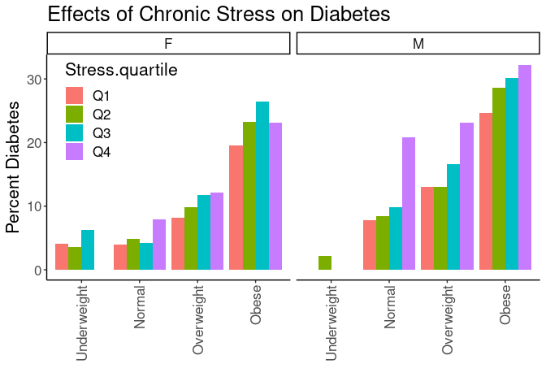

## Purpose

To test the effect modification of obesity on the stress-diabetes relationships.


```r
library(knitr)
#figures made will go to directory called figures, will make them as both png and pdf files 
opts_chunk$set(fig.path='figures/',
               echo=TRUE, warning=FALSE, message=FALSE,dev=c('png','pdf'))
options(scipen = 2, digits = 3)

library(readr)
library(dplyr)
```

```
## 
## Attaching package: 'dplyr'
```

```
## The following objects are masked from 'package:stats':
## 
##     filter, lag
```

```
## The following objects are masked from 'package:base':
## 
##     intersect, setdiff, setequal, union
```

```r
library(tidyr)

input.file <- 'data-combined.csv'
combined.data <- read_csv(input.file)
```

```
## Rows: 62010 Columns: 39
```

```
## ── Column specification ────────────────────────────────────────────────────────
## Delimiter: ","
## chr (17): DeID_PatientID, Gender, DeID_EncounterID, BMI_cat, BMI_cat.obese, ...
## dbl (22): age, Stress_d1, CardiacArrhythmias, ChronicPulmonaryDisease, Conge...
## 
## ℹ Use `spec()` to retrieve the full column specification for this data.
## ℹ Specify the column types or set `show_col_types = FALSE` to quiet this message.
```

Loaded in the cleaned data from data-combined.csv. This script can be found in /nfs/turbo/precision-health/DataDirect/HUM00219435 - Obesity as a modifier of chronic psy/2023-03-14/2150 - Obesity and Stress - Cohort - DeID - 2023-03-14 and was most recently run on Tue May 30 21:52:14 2023. This dataset has 62010 values.


```r
library(forcats)
combined.data <- 
  combined.data %>%
  mutate(BMI_cat= factor(BMI_cat, 
                         levels=c("Underweight",
                                  "Normal",
                                  "Overweight",
                                  'Class I Obese',
                                  'Class II Obese',
                                  'Class III Obese'))) %>%
  mutate(BMI_cat.obese= factor(BMI_cat.obese, 
                               levels=c("Underweight",
                                        "Normal",
                                        "Overweight",
                                        'Obese'))) %>%
  mutate(BMI_cat.Ob.NonOb= factor(BMI_cat.Ob.NonOb, 
                                  levels=c("Non-Obese",
                                           'Obese'))) %>%
  mutate(Stress=relevel(as.factor(High.Stress),ref="Low")) %>% #set low as reference value
    mutate(Race.Ethnicity=relevel(as.factor(Race.Ethnicity),ref="White")) %>% #set white as reference value
  mutate(Stress.quartile=fct_recode(as.factor(Stress.quartile),
                                    "Q1"="(-0.016,4]",
                                    "Q2"="(4,8]",
                                    "Q3"="(8,12]",
                                    "Q4"="(12,16]")) %>%
    mutate(Stress.quartile= factor(Stress.quartile, 
                                  levels=c("Q1","Q2","Q3","Q4"))) 
  
# need to clean race data
```

# Diabetes Rates by BMI

Stratified diagnoses by various BMI categories

## Diabetes by BMI Category


```r
#calculating diabetes rates by bmi category
with(combined.data, table(Type2Diabetes,BMI_cat)) %>% 
  data.frame %>%
  pivot_wider(names_from=Type2Diabetes,
              values_from = Freq) %>%
  rename(Diabetes=`1`,
         NonDiabetes=`0`) %>%
  mutate(Total=Diabetes+NonDiabetes) %>%
  mutate(Percent=Diabetes/Total*100) -> diabetes.bmi.counts

kable(diabetes.bmi.counts, caption="Diabetes rates by BMI category not including gender")
```


Table: Diabetes rates by BMI category not including gender

|BMI_cat         | NonDiabetes| Diabetes| Total| Percent|
|:---------------|-----------:|--------:|-----:|-------:|
|Underweight     |         473|       17|   490|    3.47|
|Normal          |       14207|     1007| 15214|    6.62|
|Overweight      |       17574|     2535| 20109|   12.61|
|Class I Obese   |       10908|     2868| 13776|   20.82|
|Class II Obese  |        5056|     1911|  6967|   27.43|
|Class III Obese |        3414|     1823|  5237|   34.81|

```r
library(ggplot2)

ggplot(diabetes.bmi.counts,
       aes(y=Percent,
           x=BMI_cat)) +
  geom_bar(stat='identity',position='dodge') +
  labs(y="Percent Diabetes",
       title="Effects of Chronic Stress on Diabetes Rates",
       x="") +
  theme_classic() +
  scale_fill_grey() +
  theme(text=element_text(size=16),
        axis.text.x=element_text(angle=90,vjust=0.5,hjust=1),
        legend.position = c(0.1,0.85))
```

<!-- -->

```r
#calculating diabetes rates by bmi category by gender
with(combined.data, table(Type2Diabetes,BMI_cat,Gender)) %>% 
  data.frame %>%
  pivot_wider(names_from=Type2Diabetes,
              values_from = Freq) %>%
  rename(Diabetes=`1`,
         NonDiabetes=`0`) %>%
  mutate(Total=Diabetes+NonDiabetes) %>%
  mutate(Percent=Diabetes/Total*100) -> diabetes.bmi.counts

kable(diabetes.bmi.counts, caption="Diabetes rates by BMI category")
```


Table: Diabetes rates by BMI category

|BMI_cat         |Gender | NonDiabetes| Diabetes| Total| Percent|
|:---------------|:------|-----------:|--------:|-----:|-------:|
|Underweight     |F      |         326|       13|   339|    3.83|
|Normal          |F      |        8827|      460|  9287|    4.95|
|Overweight      |F      |        8113|      953|  9066|   10.51|
|Class I Obese   |F      |        5343|     1157|  6500|   17.80|
|Class II Obese  |F      |        2955|      951|  3906|   24.35|
|Class III Obese |F      |        2400|     1163|  3563|   32.64|
|Underweight     |M      |         147|        4|   151|    2.65|
|Normal          |M      |        5380|      547|  5927|    9.23|
|Overweight      |M      |        9461|     1582| 11043|   14.33|
|Class I Obese   |M      |        5565|     1711|  7276|   23.52|
|Class II Obese  |M      |        2101|      960|  3061|   31.36|
|Class III Obese |M      |        1014|      660|  1674|   39.43|

```r
ggplot(diabetes.bmi.counts,
       aes(y=Percent,
           x=BMI_cat)) +
  geom_bar(stat='identity',position='dodge') +
  labs(y="Percent Diabetes",
       title="Effects of Chronic Stress on Diabetes Rates",
       x="") +
  theme_classic() +
  scale_fill_grey() +
  facet_grid(.~Gender) +
  theme(text=element_text(size=16),
        axis.text.x=element_text(angle=90,vjust=0.5,hjust=1),
        legend.position = c(0.1,0.85))
```

<!-- -->

## Diabetes Rate by BMI and Stress

This analysis uses all the BMI categories


```r
#calculating diabetes rates by bmi category and stress
with(combined.data, table(Type2Diabetes,BMI_cat,Stress)) %>% 
  data.frame %>%
  pivot_wider(names_from=Type2Diabetes,
              values_from = Freq) %>%
  rename(Diabetes=`1`,
         NonDiabetes=`0`) %>%
  mutate(Total=Diabetes+NonDiabetes) %>%
  mutate(Percent=Diabetes/Total*100) -> diabetes.bmi.stress.counts

library(ggplot2)

kable(diabetes.bmi.stress.counts, caption="Diabetes rates by BMI category")
```


Table: Diabetes rates by BMI category

|BMI_cat         |Stress | NonDiabetes| Diabetes| Total| Percent|
|:---------------|:------|-----------:|--------:|-----:|-------:|
|Underweight     |Low    |         129|        3|   132|    2.27|
|Normal          |Low    |        5413|      314|  5727|    5.48|
|Overweight      |Low    |        6877|      860|  7737|   11.12|
|Class I Obese   |Low    |        4128|      917|  5045|   18.18|
|Class II Obese  |Low    |        1834|      601|  2435|   24.68|
|Class III Obese |Low    |        1211|      532|  1743|   30.52|
|Underweight     |High   |         145|        6|   151|    3.97|
|Normal          |High   |        3660|      261|  3921|    6.66|
|Overweight      |High   |        4544|      629|  5173|   12.16|
|Class I Obese   |High   |        2988|      837|  3825|   21.88|
|Class II Obese  |High   |        1444|      592|  2036|   29.08|
|Class III Obese |High   |        1064|      571|  1635|   34.92|

```r
ggplot(diabetes.bmi.stress.counts,
       aes(y=Percent,
           x=BMI_cat,
           fill=Stress)) +
  geom_bar(stat='identity',position='dodge') +
  labs(y="Percent Diabetes",
       title="Effects of Chronic Stress on Diabetes Rates",
       x="") +
  theme_classic() +
  scale_fill_grey() +
  theme(text=element_text(size=16),
        axis.text.x=element_text(angle=90,vjust=0.5,hjust=1),
        legend.position = c(0.1,0.85))
```

<!-- -->


```r
#calculating diabetes rates by bmi category and stress
with(combined.data, table(Type2Diabetes,BMI_cat,Stress,Gender)) %>% 
  data.frame %>%
  pivot_wider(names_from=Type2Diabetes,
              values_from = Freq) %>%
  rename(Diabetes=`1`,
         NonDiabetes=`0`) %>%
  mutate(Total=Diabetes+NonDiabetes) %>%
  mutate(Percent=Diabetes/Total*100) -> diabetes.bmi.stress.counts

library(ggplot2)

kable(diabetes.bmi.stress.counts, caption="Diabetes rates by BMI category")
```


Table: Diabetes rates by BMI category

|BMI_cat         |Stress |Gender | NonDiabetes| Diabetes| Total| Percent|
|:---------------|:------|:------|-----------:|--------:|-----:|-------:|
|Underweight     |Low    |F      |          90|        3|    93|    3.23|
|Normal          |Low    |F      |        3301|      134|  3435|    3.90|
|Overweight      |Low    |F      |        3054|      276|  3330|    8.29|
|Class I Obese   |Low    |F      |        1892|      319|  2211|   14.43|
|Class II Obese  |Low    |F      |        1041|      264|  1305|   20.23|
|Class III Obese |Low    |F      |         822|      338|  1160|   29.14|
|Underweight     |High   |F      |          94|        5|    99|    5.05|
|Normal          |High   |F      |        2281|      120|  2401|    5.00|
|Overweight      |High   |F      |        2204|      262|  2466|   10.62|
|Class I Obese   |High   |F      |        1592|      364|  1956|   18.61|
|Class II Obese  |High   |F      |         867|      315|  1182|   26.65|
|Class III Obese |High   |F      |         767|      367|  1134|   32.36|
|Underweight     |Low    |M      |          39|        0|    39|    0.00|
|Normal          |Low    |M      |        2112|      180|  2292|    7.85|
|Overweight      |Low    |M      |        3823|      584|  4407|   13.25|
|Class I Obese   |Low    |M      |        2236|      598|  2834|   21.10|
|Class II Obese  |Low    |M      |         793|      337|  1130|   29.82|
|Class III Obese |Low    |M      |         389|      194|   583|   33.28|
|Underweight     |High   |M      |          51|        1|    52|    1.92|
|Normal          |High   |M      |        1379|      141|  1520|    9.28|
|Overweight      |High   |M      |        2340|      367|  2707|   13.56|
|Class I Obese   |High   |M      |        1396|      473|  1869|   25.31|
|Class II Obese  |High   |M      |         577|      277|   854|   32.44|
|Class III Obese |High   |M      |         297|      204|   501|   40.72|

```r
ggplot(diabetes.bmi.stress.counts,
       aes(y=Percent,
           x=BMI_cat,
           fill=Stress)) +
  geom_bar(stat='identity',position='dodge') +
  labs(y="Percent Diabetes",
       title="Effects of Chronic Stress on Diabetes Rates",
       x="") +
  theme_classic() +
  scale_fill_grey() +
  facet_grid(.~Gender) +
  theme(text=element_text(size=16),
        axis.text.x=element_text(angle=90,vjust=0.5,hjust=1),
        legend.position = c(0.1,0.85))
```

<!-- -->

## Logistic Regressions for All Obese Categories

Ran a series of stepwise logistic regressions testing for obesity as a modifier of the effects of stress.


```r
library(broom)
glm(Type2Diabetes~BMI_cat, 
    family="binomial",
    data=combined.data) -> obesity.glm1

obesity.glm1 %>%
  tidy() %>%
  kable(caption="Logistic regression of obesity on diabetes", digits =c(0,2,3,2,99))
```


Table: Logistic regression of obesity on diabetes

|term                   | estimate| std.error| statistic|  p.value|
|:----------------------|--------:|---------:|---------:|--------:|
|(Intercept)            |    -3.33|     0.247|    -13.48| 2.01e-41|
|BMI_catNormal          |     0.68|     0.249|      2.73| 6.35e-03|
|BMI_catOverweight      |     1.39|     0.248|      5.61| 2.00e-08|
|BMI_catClass I Obese   |     1.99|     0.248|      8.04| 9.17e-16|
|BMI_catClass II Obese  |     2.35|     0.248|      9.48| 2.50e-21|
|BMI_catClass III Obese |     2.70|     0.248|     10.86| 1.72e-27|

```r
anova(obesity.glm1,test="Chisq") %>% tidy %>%
  kable(caption="Logistic regression of obesity on diabetes, ", digits =c(0,0,0,0,0,99))
```


Table: Logistic regression of obesity on diabetes, 

|term    | df| Deviance| Resid..Df| Resid..Dev| p.value|
|:-------|--:|--------:|---------:|----------:|-------:|
|NULL    | NA|       NA|     61792|      55237|      NA|
|BMI_cat |  5|     3390|     61787|      51847|       0|

```r
#adding in stress as a modifier
glm(Type2Diabetes~BMI_cat+Stress+Stress:BMI_cat, 
    family="binomial",
    data=combined.data) -> obesity.glm2

obesity.glm2 %>%
  tidy() %>%
  kable(caption="Logistic regression of obesity on diabetes, with stress as a modifier", digits =c(0,2,3,2,99))
```


Table: Logistic regression of obesity on diabetes, with stress as a modifier

|term                              | estimate| std.error| statistic|  p.value|
|:---------------------------------|--------:|---------:|---------:|--------:|
|(Intercept)                       |    -3.76|     0.581|     -6.47| 9.72e-11|
|BMI_catNormal                     |     0.91|     0.584|      1.56| 1.18e-01|
|BMI_catOverweight                 |     1.68|     0.582|      2.89| 3.87e-03|
|BMI_catClass I Obese              |     2.26|     0.582|      3.88| 1.07e-04|
|BMI_catClass II Obese             |     2.65|     0.583|      4.54| 5.71e-06|
|BMI_catClass III Obese            |     2.94|     0.584|      5.04| 4.76e-07|
|StressHigh                        |     0.58|     0.715|      0.81| 4.20e-01|
|BMI_catNormal:StressHigh          |    -0.37|     0.720|     -0.51| 6.08e-01|
|BMI_catOverweight:StressHigh      |    -0.47|     0.717|     -0.66| 5.08e-01|
|BMI_catClass I Obese:StressHigh   |    -0.34|     0.717|     -0.48| 6.31e-01|
|BMI_catClass II Obese:StressHigh  |    -0.35|     0.718|     -0.49| 6.24e-01|
|BMI_catClass III Obese:StressHigh |    -0.38|     0.719|     -0.52| 6.01e-01|

```r
anova(obesity.glm2,test="Chisq") %>% tidy %>%
  kable(caption="Logistic regression of obese vs non-obese on diabetes, with stress as a modifier", digits =c(0,0,0,0,0,99))
```


Table: Logistic regression of obese vs non-obese on diabetes, with stress as a modifier

|term           | df| Deviance| Resid..Df| Resid..Dev|  p.value|
|:--------------|--:|--------:|---------:|----------:|--------:|
|NULL           | NA|       NA|     39559|      34093|       NA|
|BMI_cat        |  5|     2148|     39554|      31946| 0.00e+00|
|Stress         |  1|       43|     39553|      31903| 5.50e-11|
|BMI_cat:Stress |  5|        4|     39548|      31899| 5.88e-01|

```r
#adding in age and gender as covariates as a modifier
glm(Type2Diabetes~BMI_cat+Stress+Stress:BMI_cat+Gender+BMI_cat:Gender+age, 
    family="binomial",
    data=combined.data) -> obesity.glm3

obesity.glm3 %>%
  tidy() %>%
  kable(caption="Logistic regression of obesity on diabetes, with stress as a modifier and age and  gender as covariates", digits =c(0,2,3,2,99))
```


Table: Logistic regression of obesity on diabetes, with stress as a modifier and age and  gender as covariates

|term                              | estimate| std.error| statistic|  p.value|
|:---------------------------------|--------:|---------:|---------:|--------:|
|(Intercept)                       |    -5.96|     0.602|     -9.90| 4.08e-23|
|BMI_catNormal                     |     0.39|     0.603|      0.64| 5.19e-01|
|BMI_catOverweight                 |     1.14|     0.601|      1.90| 5.81e-02|
|BMI_catClass I Obese              |     1.76|     0.601|      2.93| 3.44e-03|
|BMI_catClass II Obese             |     2.28|     0.602|      3.79| 1.50e-04|
|BMI_catClass III Obese            |     2.79|     0.602|      4.64| 3.51e-06|
|StressHigh                        |     0.72|     0.727|      1.00| 3.19e-01|
|GenderM                           |    -1.23|     1.072|     -1.14| 2.53e-01|
|age                               |     0.04|     0.001|     39.60| 0.00e+00|
|BMI_catNormal:StressHigh          |    -0.43|     0.732|     -0.59| 5.53e-01|
|BMI_catOverweight:StressHigh      |    -0.52|     0.729|     -0.71| 4.80e-01|
|BMI_catClass I Obese:StressHigh   |    -0.38|     0.729|     -0.52| 6.01e-01|
|BMI_catClass II Obese:StressHigh  |    -0.39|     0.730|     -0.53| 5.94e-01|
|BMI_catClass III Obese:StressHigh |    -0.41|     0.731|     -0.56| 5.75e-01|
|BMI_catNormal:GenderM             |     1.84|     1.076|      1.71| 8.78e-02|
|BMI_catOverweight:GenderM         |     1.49|     1.074|      1.39| 1.64e-01|
|BMI_catClass I Obese:GenderM      |     1.49|     1.074|      1.39| 1.64e-01|
|BMI_catClass II Obese:GenderM     |     1.46|     1.074|      1.36| 1.73e-01|
|BMI_catClass III Obese:GenderM    |     1.39|     1.075|      1.29| 1.97e-01|

```r
anova(obesity.glm3,test="Chisq") %>% tidy %>%
  kable(caption="Logistic regression of obesity on diabetes, with stress as a modifier and age and gender as covariate", digits =c(0,0,0,0,0,99))
```


Table: Logistic regression of obesity on diabetes, with stress as a modifier and age and gender as covariate

|term           | df| Deviance| Resid..Df| Resid..Dev|  p.value|
|:--------------|--:|--------:|---------:|----------:|--------:|
|NULL           | NA|       NA|     39559|      34093|       NA|
|BMI_cat        |  5|     2148|     39554|      31946| 0.00e+00|
|Stress         |  1|       43|     39553|      31903| 5.50e-11|
|Gender         |  1|      214|     39552|      31688| 1.49e-48|
|age            |  1|     1803|     39551|      29885| 0.00e+00|
|BMI_cat:Stress |  5|        4|     39546|      29882| 5.81e-01|
|BMI_cat:Gender |  5|       20|     39541|      29862| 1.54e-03|

```r
#adding in race and ethnicity
glm(Type2Diabetes~BMI_cat+Stress+Stress:BMI_cat+Gender+BMI_cat:Gender+age+Race.Ethnicity, 
    family="binomial",
    data=combined.data) -> obesity.glm4

obesity.glm4 %>%
  tidy() %>%
  kable(caption="Logistic regression of obesity on diabetes, with stress as a modifier and age, gender and race as covariates", digits =c(0,2,3,2,99))
```


Table: Logistic regression of obesity on diabetes, with stress as a modifier and age, gender and race as covariates

|term                              | estimate| std.error| statistic|  p.value|
|:---------------------------------|--------:|---------:|---------:|--------:|
|(Intercept)                       |    -6.12|     0.602|    -10.16| 2.93e-24|
|BMI_catNormal                     |     0.39|     0.603|      0.64| 5.19e-01|
|BMI_catOverweight                 |     1.14|     0.600|      1.90| 5.71e-02|
|BMI_catClass I Obese              |     1.76|     0.600|      2.93| 3.37e-03|
|BMI_catClass II Obese             |     2.29|     0.601|      3.80| 1.42e-04|
|BMI_catClass III Obese            |     2.79|     0.601|      4.64| 3.55e-06|
|StressHigh                        |     0.73|     0.727|      1.01| 3.14e-01|
|GenderM                           |    -1.22|     1.072|     -1.13| 2.57e-01|
|age                               |     0.04|     0.001|     40.49| 0.00e+00|
|Race.EthnicityAsian               |     0.82|     0.138|      5.98| 2.27e-09|
|Race.EthnicityBlack               |     0.63|     0.064|      9.80| 1.16e-22|
|Race.EthnicityHispanic/Latino     |     0.40|     0.108|      3.69| 2.26e-04|
|Race.EthnicityOther               |     0.03|     0.086|      0.37| 7.08e-01|
|BMI_catNormal:StressHigh          |    -0.44|     0.732|     -0.60| 5.47e-01|
|BMI_catOverweight:StressHigh      |    -0.53|     0.729|     -0.72| 4.69e-01|
|BMI_catClass I Obese:StressHigh   |    -0.39|     0.729|     -0.54| 5.89e-01|
|BMI_catClass II Obese:StressHigh  |    -0.40|     0.730|     -0.55| 5.80e-01|
|BMI_catClass III Obese:StressHigh |    -0.42|     0.731|     -0.57| 5.68e-01|
|BMI_catNormal:GenderM             |     1.82|     1.076|      1.69| 9.01e-02|
|BMI_catOverweight:GenderM         |     1.49|     1.074|      1.38| 1.66e-01|
|BMI_catClass I Obese:GenderM      |     1.49|     1.074|      1.39| 1.65e-01|
|BMI_catClass II Obese:GenderM     |     1.46|     1.075|      1.36| 1.73e-01|
|BMI_catClass III Obese:GenderM    |     1.40|     1.075|      1.30| 1.94e-01|

```r
anova(obesity.glm4,test="Chisq") %>% tidy %>%
  kable(caption="Logistic regression of obesity on diabetes, with stress as a modifier and age, gender and race as covariate", digits =c(0,0,0,0,0,99))
```


Table: Logistic regression of obesity on diabetes, with stress as a modifier and age, gender and race as covariate

|term           | df| Deviance| Resid..Df| Resid..Dev|  p.value|
|:--------------|--:|--------:|---------:|----------:|--------:|
|NULL           | NA|       NA|     39559|      34093|       NA|
|BMI_cat        |  5|     2148|     39554|      31946| 0.00e+00|
|Stress         |  1|       43|     39553|      31903| 5.50e-11|
|Gender         |  1|      214|     39552|      31688| 1.49e-48|
|age            |  1|     1803|     39551|      29885| 0.00e+00|
|Race.Ethnicity |  4|      128|     39547|      29758| 1.23e-26|
|BMI_cat:Stress |  5|        4|     39542|      29754| 5.80e-01|
|BMI_cat:Gender |  5|       18|     39537|      29736| 2.83e-03|

```r
#adding in neighborhood
glm(Type2Diabetes~BMI_cat+Stress+Stress:BMI_cat+Gender+BMI_cat:Gender+age+Race.Ethnicity+disadvantage13_17_qrtl, 
    family="binomial",
    data=combined.data) -> obesity.glm5

obesity.glm5 %>%
  tidy() %>%
  kable(caption="Logistic regression of obesity on diabetes, with stress as a modifier and age, gender, race and neighborhood as covariates", digits =c(0,2,3,2,99))
```


Table: Logistic regression of obesity on diabetes, with stress as a modifier and age, gender, race and neighborhood as covariates

|term                              | estimate| std.error| statistic|  p.value|
|:---------------------------------|--------:|---------:|---------:|--------:|
|(Intercept)                       |    -6.38|     0.608|    -10.49| 1.01e-25|
|BMI_catNormal                     |     0.36|     0.608|      0.60| 5.51e-01|
|BMI_catOverweight                 |     1.06|     0.605|      1.75| 8.04e-02|
|BMI_catClass I Obese              |     1.68|     0.605|      2.78| 5.49e-03|
|BMI_catClass II Obese             |     2.18|     0.606|      3.61| 3.10e-04|
|BMI_catClass III Obese            |     2.70|     0.606|      4.46| 8.19e-06|
|StressHigh                        |     0.69|     0.729|      0.95| 3.41e-01|
|GenderM                           |    -1.24|     1.074|     -1.16| 2.48e-01|
|age                               |     0.05|     0.001|     39.42| 0.00e+00|
|Race.EthnicityAsian               |     0.85|     0.143|      5.91| 3.42e-09|
|Race.EthnicityBlack               |     0.47|     0.069|      6.83| 8.39e-12|
|Race.EthnicityHispanic/Latino     |     0.40|     0.112|      3.56| 3.72e-04|
|Race.EthnicityOther               |     0.00|     0.089|      0.00| 9.98e-01|
|disadvantage13_17_qrtl            |     0.15|     0.015|      9.44| 3.74e-21|
|BMI_catNormal:StressHigh          |    -0.43|     0.735|     -0.58| 5.60e-01|
|BMI_catOverweight:StressHigh      |    -0.51|     0.732|     -0.69| 4.89e-01|
|BMI_catClass I Obese:StressHigh   |    -0.37|     0.731|     -0.51| 6.13e-01|
|BMI_catClass II Obese:StressHigh  |    -0.38|     0.733|     -0.52| 6.06e-01|
|BMI_catClass III Obese:StressHigh |    -0.39|     0.733|     -0.53| 5.94e-01|
|BMI_catNormal:GenderM             |     1.80|     1.078|      1.67| 9.44e-02|
|BMI_catOverweight:GenderM         |     1.53|     1.076|      1.43| 1.54e-01|
|BMI_catClass I Obese:GenderM      |     1.53|     1.076|      1.42| 1.54e-01|
|BMI_catClass II Obese:GenderM     |     1.50|     1.077|      1.39| 1.64e-01|
|BMI_catClass III Obese:GenderM    |     1.43|     1.077|      1.33| 1.84e-01|

```r
anova(obesity.glm5,test="Chisq") %>% tidy %>%
  kable(caption="Logistic regression of obesity on diabetes, with stress as a modifier and age, gender, race and neighborhood as covariates", digits =c(0,0,0,0,0,99))
```


Table: Logistic regression of obesity on diabetes, with stress as a modifier and age, gender, race and neighborhood as covariates

|term                   | df| Deviance| Resid..Df| Resid..Dev|  p.value|
|:----------------------|--:|--------:|---------:|----------:|--------:|
|NULL                   | NA|       NA|     36392|      31531|       NA|
|BMI_cat                |  5|     1976|     36387|      29554| 0.00e+00|
|Stress                 |  1|       44|     36386|      29510| 3.11e-11|
|Gender                 |  1|      198|     36385|      29312| 6.26e-45|
|age                    |  1|     1667|     36384|      27645| 0.00e+00|
|Race.Ethnicity         |  4|      123|     36380|      27522| 1.42e-25|
|disadvantage13_17_qrtl |  1|       90|     36379|      27433| 2.99e-21|
|BMI_cat:Stress         |  5|        4|     36374|      27429| 6.00e-01|
|BMI_cat:Gender         |  5|       13|     36369|      27416| 2.17e-02|

### Diabetes Rates by Quartiles


```r
with(combined.data, table(Type2Diabetes,BMI_cat.obese,Stress.quartile,Gender)) %>% 
  data.frame %>%
  pivot_wider(names_from=Type2Diabetes,
              values_from = Freq) %>%
  rename(Diabetes=`1`,
         NonDiabetes=`0`) %>%
  mutate(Total=Diabetes+NonDiabetes) %>%
  mutate(Percent=Diabetes/Total*100) -> diabetes.bmi.stress.quartile.counts

kable(diabetes.bmi.stress.quartile.counts, caption="Diabetes Rates by BMI and Stress Quartile")
```


Table: Diabetes Rates by BMI and Stress Quartile

|BMI_cat.obese |Stress.quartile |Gender | NonDiabetes| Diabetes| Total| Percent|
|:-------------|:---------------|:------|-----------:|--------:|-----:|-------:|
|Underweight   |Q1              |F      |          70|        3|    73|    4.11|
|Normal        |Q1              |F      |        2760|      114|  2874|    3.97|
|Overweight    |Q1              |F      |        2560|      229|  2789|    8.21|
|Obese         |Q1              |F      |        3125|      753|  3878|   19.42|
|Underweight   |Q2              |F      |          81|        3|    84|    3.57|
|Normal        |Q2              |F      |        2120|      107|  2227|    4.80|
|Overweight    |Q2              |F      |        2027|      219|  2246|    9.75|
|Obese         |Q2              |F      |        2781|      838|  3619|   23.16|
|Underweight   |Q3              |F      |          30|        2|    32|    6.25|
|Normal        |Q3              |F      |         632|       27|   659|    4.10|
|Overweight    |Q3              |F      |         599|       80|   679|   11.78|
|Obese         |Q3              |F      |         962|      342|  1304|   26.23|
|Underweight   |Q4              |F      |           3|        0|     3|    0.00|
|Normal        |Q4              |F      |          70|        6|    76|    7.89|
|Overweight    |Q4              |F      |          72|       10|    82|   12.20|
|Obese         |Q4              |F      |         113|       34|   147|   23.13|
|Underweight   |Q1              |M      |          28|        0|    28|    0.00|
|Normal        |Q1              |M      |        1815|      154|  1969|    7.82|
|Overweight    |Q1              |M      |        3298|      493|  3791|   13.00|
|Obese         |Q1              |M      |        2913|      953|  3866|   24.65|
|Underweight   |Q2              |M      |          45|        1|    46|    2.17|
|Normal        |Q2              |M      |        1308|      121|  1429|    8.47|
|Overweight    |Q2              |M      |        2338|      350|  2688|   13.02|
|Obese         |Q2              |M      |        2146|      858|  3004|   28.56|
|Underweight   |Q3              |M      |          15|        0|    15|    0.00|
|Normal        |Q3              |M      |         330|       36|   366|    9.84|
|Overweight    |Q3              |M      |         487|       96|   583|   16.47|
|Obese         |Q3              |M      |         568|      243|   811|   29.96|
|Underweight   |Q4              |M      |           2|        0|     2|    0.00|
|Normal        |Q4              |M      |          38|       10|    48|   20.83|
|Overweight    |Q4              |M      |          40|       12|    52|   23.08|
|Obese         |Q4              |M      |          61|       29|    90|   32.22|

```r
ggplot(diabetes.bmi.stress.quartile.counts,
       aes(y=Percent,
           x=BMI_cat.obese,
           fill=Stress.quartile)) +
  geom_bar(stat='identity',position='dodge') +
  labs(y="Percent Diabetes",
       title="Effects of Chronic Stress on Diabetes",
       x="") +
  theme_classic() +
  facet_grid(.~Gender) +
  theme(text=element_text(size=16),
        axis.text.x=element_text(angle=90,vjust=0.5,hjust=1),
        legend.position = c(0.15,0.75))
```

<!-- -->

## Diabetes Rates by Normal Obesity and Stress


```r
#calculating diabetes rates by bmi category, stress and gender
with(combined.data, table(Type2Diabetes,BMI_cat.obese,Stress,Gender)) %>% 
  data.frame %>%
  pivot_wider(names_from=Type2Diabetes,
              values_from = Freq) %>%
  rename(Diabetes=`1`,
         NonDiabetes=`0`) %>%
  mutate(Total=Diabetes+NonDiabetes) %>%
  mutate(Percent=Diabetes/Total*100) -> diabetes.bmi.stress.gender.counts

kable(diabetes.bmi.stress.gender.counts, caption="Diabetes Rates by BMI and Stress")
```


Table: Diabetes Rates by BMI and Stress

|BMI_cat.obese |Stress |Gender | NonDiabetes| Diabetes| Total| Percent|
|:-------------|:------|:------|-----------:|--------:|-----:|-------:|
|Underweight   |Low    |F      |          90|        3|    93|    3.23|
|Normal        |Low    |F      |        3301|      134|  3435|    3.90|
|Overweight    |Low    |F      |        3054|      276|  3330|    8.29|
|Obese         |Low    |F      |        3755|      921|  4676|   19.70|
|Underweight   |High   |F      |          94|        5|    99|    5.05|
|Normal        |High   |F      |        2281|      120|  2401|    5.00|
|Overweight    |High   |F      |        2204|      262|  2466|   10.62|
|Obese         |High   |F      |        3226|     1046|  4272|   24.48|
|Underweight   |Low    |M      |          39|        0|    39|    0.00|
|Normal        |Low    |M      |        2112|      180|  2292|    7.85|
|Overweight    |Low    |M      |        3823|      584|  4407|   13.25|
|Obese         |Low    |M      |        3418|     1129|  4547|   24.83|
|Underweight   |High   |M      |          51|        1|    52|    1.92|
|Normal        |High   |M      |        1379|      141|  1520|    9.28|
|Overweight    |High   |M      |        2340|      367|  2707|   13.56|
|Obese         |High   |M      |        2270|      954|  3224|   29.59|

```r
ggplot(diabetes.bmi.stress.gender.counts,
       aes(y=Percent,
           x=BMI_cat.obese,
           fill=Stress)) +
  geom_bar(stat='identity',position='dodge') +
  labs(y="Percent Diabetes",
       title="Effects of Chronic Stress on Diabetes",
       x="") +
  facet_grid(.~Gender) +
  theme_classic() +
  scale_fill_grey() +
  theme(text=element_text(size=16),
        axis.text.x=element_text(angle=90,vjust=0.5,hjust=1),
        legend.position = c(0.1,0.75))
```

<!-- -->

## Logistic Regressions for Obesity Categories

Ran a series of logistic regressions using the normal obesity categories not classes as the categorization


```r
glm(Type2Diabetes~BMI_cat.obese, 
    family="binomial",
    data=combined.data) -> obesity.glm1

obesity.glm1 %>%
  tidy() %>%
  kable(caption="Logistic regression of obese vs non-obese on diabetes", digits =c(0,2,3,2,99))
```


Table: Logistic regression of obese vs non-obese on diabetes

|term                    | estimate| std.error| statistic|  p.value|
|:-----------------------|--------:|---------:|---------:|--------:|
|(Intercept)             |    -3.33|     0.247|    -13.48| 2.01e-41|
|BMI_cat.obeseNormal     |     0.68|     0.249|      2.73| 6.35e-03|
|BMI_cat.obeseOverweight |     1.39|     0.248|      5.61| 2.00e-08|
|BMI_cat.obeseObese      |     2.25|     0.247|      9.10| 8.90e-20|

```r
anova(obesity.glm1,test="Chisq") %>% tidy %>%
  kable(caption="Logistic regression of obesity on diabetes, ", digits =c(0,0,0,0,0,99))
```


Table: Logistic regression of obesity on diabetes, 

|term          | df| Deviance| Resid..Df| Resid..Dev| p.value|
|:-------------|--:|--------:|---------:|----------:|-------:|
|NULL          | NA|       NA|     61792|      55237|      NA|
|BMI_cat.obese |  3|     2988|     61789|      52250|       0|

```r
#adding in stress as a modifier
glm(Type2Diabetes~BMI_cat.obese+Stress+Stress:BMI_cat.obese, 
    family="binomial",
    data=combined.data) -> obesity.glm2

obesity.glm2 %>%
  tidy() %>%
  kable(caption="Logistic regression of obesity on diabetes, with stress as a modifier", digits =c(0,2,3,2,99))
```


Table: Logistic regression of obesity on diabetes, with stress as a modifier

|term                               | estimate| std.error| statistic|  p.value|
|:----------------------------------|--------:|---------:|---------:|--------:|
|(Intercept)                        |    -3.76|     0.581|     -6.47| 9.72e-11|
|BMI_cat.obeseNormal                |     0.91|     0.584|      1.56| 1.18e-01|
|BMI_cat.obeseOverweight            |     1.68|     0.582|      2.89| 3.87e-03|
|BMI_cat.obeseObese                 |     2.51|     0.582|      4.31| 1.62e-05|
|StressHigh                         |     0.58|     0.715|      0.81| 4.20e-01|
|BMI_cat.obeseNormal:StressHigh     |    -0.37|     0.720|     -0.51| 6.08e-01|
|BMI_cat.obeseOverweight:StressHigh |    -0.47|     0.717|     -0.66| 5.08e-01|
|BMI_cat.obeseObese:StressHigh      |    -0.33|     0.716|     -0.47| 6.40e-01|

```r
anova(obesity.glm2,test="Chisq") %>% tidy %>%
  kable(caption="Logistic regression of obesity on diabetes, with stress as a modifier", digits =c(0,0,0,0,0,99))
```


Table: Logistic regression of obesity on diabetes, with stress as a modifier

|term                 | df| Deviance| Resid..Df| Resid..Dev|  p.value|
|:--------------------|--:|--------:|---------:|----------:|--------:|
|NULL                 | NA|       NA|     39559|      34093|       NA|
|BMI_cat.obese        |  3|     1911|     39556|      32182| 0.00e+00|
|Stress               |  1|       49|     39555|      32133| 2.03e-12|
|BMI_cat.obese:Stress |  3|        5|     39552|      32128| 1.93e-01|

```r
#adding in age and gender as covariates as a modifier
glm(Type2Diabetes~BMI_cat.obese+Stress+Stress:BMI_cat.obese+Gender+BMI_cat.obese:Gender+age, 
    family="binomial",
    data=combined.data) -> obesity.glm3

obesity.glm3 %>%
  tidy() %>%
  kable(caption="Logistic regression of obesity on diabetes, with stress as a modifier and age and  gender as covariates", digits =c(0,2,3,2,99))
```


Table: Logistic regression of obesity on diabetes, with stress as a modifier and age and  gender as covariates

|term                               | estimate| std.error| statistic|  p.value|
|:----------------------------------|--------:|---------:|---------:|--------:|
|(Intercept)                        |    -5.81|     0.602|     -9.66| 4.50e-22|
|BMI_cat.obeseNormal                |     0.38|     0.603|      0.64| 5.24e-01|
|BMI_cat.obeseOverweight            |     1.14|     0.600|      1.89| 5.84e-02|
|BMI_cat.obeseObese                 |     2.18|     0.599|      3.64| 2.76e-04|
|StressHigh                         |     0.72|     0.726|      0.99| 3.23e-01|
|GenderM                            |    -1.23|     1.072|     -1.15| 2.50e-01|
|age                                |     0.04|     0.001|     38.23| 0.00e+00|
|BMI_cat.obeseNormal:StressHigh     |    -0.43|     0.732|     -0.59| 5.55e-01|
|BMI_cat.obeseOverweight:StressHigh |    -0.51|     0.728|     -0.71| 4.81e-01|
|BMI_cat.obeseObese:StressHigh      |    -0.37|     0.727|     -0.51| 6.09e-01|
|BMI_cat.obeseNormal:GenderM        |     1.85|     1.075|      1.72| 8.55e-02|
|BMI_cat.obeseOverweight:GenderM    |     1.51|     1.073|      1.40| 1.60e-01|
|BMI_cat.obeseObese:GenderM         |     1.34|     1.072|      1.25| 2.11e-01|

```r
anova(obesity.glm3,test="Chisq") %>% tidy %>%
  kable(caption="Logistic regression of obesity on diabetes, with stress as a modifier and age and gender as covariate", digits =c(0,0,0,0,0,99))
```


Table: Logistic regression of obesity on diabetes, with stress as a modifier and age and gender as covariate

|term                 | df| Deviance| Resid..Df| Resid..Dev|  p.value|
|:--------------------|--:|--------:|---------:|----------:|--------:|
|NULL                 | NA|       NA|     39559|      34093|       NA|
|BMI_cat.obese        |  3|     1911|     39556|      32182| 0.00e+00|
|Stress               |  1|       49|     39555|      32133| 2.03e-12|
|Gender               |  1|      156|     39554|      31976| 6.79e-36|
|age                  |  1|     1654|     39553|      30322| 0.00e+00|
|BMI_cat.obese:Stress |  3|        5|     39550|      30317| 1.44e-01|
|BMI_cat.obese:Gender |  3|       33|     39547|      30284| 3.79e-07|

```r
#adding in race and ethnicity
glm(Type2Diabetes~BMI_cat.obese+Stress+Stress:BMI_cat.obese+Gender+BMI_cat.obese:Gender+age+Race.Ethnicity, 
    family="binomial",
    data=combined.data) -> obesity.glm4

obesity.glm4 %>%
  tidy() %>%
  kable(caption="Logistic regression of obesity on diabetes, with stress as a modifier and age, gender and race as covariates", digits =c(0,2,3,2,99))
```


Table: Logistic regression of obesity on diabetes, with stress as a modifier and age, gender and race as covariates

|term                               | estimate| std.error| statistic|  p.value|
|:----------------------------------|--------:|---------:|---------:|--------:|
|(Intercept)                        |    -5.96|     0.601|     -9.91| 3.86e-23|
|BMI_cat.obeseNormal                |     0.38|     0.602|      0.64| 5.25e-01|
|BMI_cat.obeseOverweight            |     1.14|     0.600|      1.89| 5.81e-02|
|BMI_cat.obeseObese                 |     2.17|     0.598|      3.63| 2.80e-04|
|StressHigh                         |     0.72|     0.726|      1.00| 3.19e-01|
|GenderM                            |    -1.23|     1.072|     -1.14| 2.53e-01|
|age                                |     0.04|     0.001|     39.13| 0.00e+00|
|Race.EthnicityAsian                |     0.74|     0.138|      5.37| 8.05e-08|
|Race.EthnicityBlack                |     0.65|     0.063|     10.24| 1.26e-24|
|Race.EthnicityHispanic/Latino      |     0.37|     0.107|      3.48| 5.09e-04|
|Race.EthnicityOther                |     0.04|     0.085|      0.43| 6.66e-01|
|BMI_cat.obeseNormal:StressHigh     |    -0.44|     0.732|     -0.60| 5.50e-01|
|BMI_cat.obeseOverweight:StressHigh |    -0.53|     0.728|     -0.72| 4.70e-01|
|BMI_cat.obeseObese:StressHigh      |    -0.38|     0.727|     -0.53| 5.99e-01|
|BMI_cat.obeseNormal:GenderM        |     1.84|     1.076|      1.71| 8.73e-02|
|BMI_cat.obeseOverweight:GenderM    |     1.50|     1.074|      1.40| 1.61e-01|
|BMI_cat.obeseObese:GenderM         |     1.35|     1.073|      1.25| 2.10e-01|

```r
anova(obesity.glm4,test="Chisq") %>% tidy %>%
  kable(caption="Logistic regression of obesity on diabetes, with stress as a modifier and age, gender and race as covariates", digits =c(0,0,0,0,0,99))
```


Table: Logistic regression of obesity on diabetes, with stress as a modifier and age, gender and race as covariates

|term                 | df| Deviance| Resid..Df| Resid..Dev|  p.value|
|:--------------------|--:|--------:|---------:|----------:|--------:|
|NULL                 | NA|       NA|     39559|      34093|       NA|
|BMI_cat.obese        |  3|     1911|     39556|      32182| 0.00e+00|
|Stress               |  1|       49|     39555|      32133| 2.03e-12|
|Gender               |  1|      156|     39554|      31976| 6.79e-36|
|age                  |  1|     1654|     39553|      30322| 0.00e+00|
|Race.Ethnicity       |  4|      129|     39549|      30193| 5.51e-27|
|BMI_cat.obese:Stress |  3|        5|     39546|      30188| 1.42e-01|
|BMI_cat.obese:Gender |  3|       31|     39543|      30157| 1.02e-06|

```r
glm(Type2Diabetes~BMI_cat.obese+Stress+Stress:BMI_cat.obese+Gender+BMI_cat.obese:Gender+age+Race.Ethnicity+disadvantage13_17_qrtl, 
    family="binomial",
    data=combined.data) -> obesity.glm5

obesity.glm5 %>%
  tidy() %>%
  kable(caption="Logistic regression of obesity on diabetes, with stress as a modifier and age, gender, race and neighborhood as covariates", digits =c(0,2,3,2,99))
```


Table: Logistic regression of obesity on diabetes, with stress as a modifier and age, gender, race and neighborhood as covariates

|term                               | estimate| std.error| statistic|  p.value|
|:----------------------------------|--------:|---------:|---------:|--------:|
|(Intercept)                        |    -6.25|     0.607|    -10.29| 7.72e-25|
|BMI_cat.obeseNormal                |     0.36|     0.607|      0.59| 5.54e-01|
|BMI_cat.obeseOverweight            |     1.05|     0.605|      1.74| 8.12e-02|
|BMI_cat.obeseObese                 |     2.09|     0.603|      3.47| 5.28e-04|
|StressHigh                         |     0.68|     0.728|      0.94| 3.47e-01|
|GenderM                            |    -1.26|     1.074|     -1.17| 2.42e-01|
|age                                |     0.04|     0.001|     38.19| 0.00e+00|
|Race.EthnicityAsian                |     0.76|     0.143|      5.32| 1.03e-07|
|Race.EthnicityBlack                |     0.48|     0.068|      7.00| 2.57e-12|
|Race.EthnicityHispanic/Latino      |     0.37|     0.111|      3.29| 9.95e-04|
|Race.EthnicityOther                |     0.01|     0.089|      0.07| 9.47e-01|
|disadvantage13_17_qrtl             |     0.16|     0.015|     10.41| 2.21e-25|
|BMI_cat.obeseNormal:StressHigh     |    -0.42|     0.734|     -0.58| 5.63e-01|
|BMI_cat.obeseOverweight:StressHigh |    -0.50|     0.731|     -0.69| 4.91e-01|
|BMI_cat.obeseObese:StressHigh      |    -0.36|     0.729|     -0.49| 6.23e-01|
|BMI_cat.obeseNormal:GenderM        |     1.82|     1.078|      1.69| 9.07e-02|
|BMI_cat.obeseOverweight:GenderM    |     1.56|     1.076|      1.45| 1.48e-01|
|BMI_cat.obeseObese:GenderM         |     1.39|     1.075|      1.29| 1.96e-01|

```r
anova(obesity.glm5,test="Chisq") %>% tidy %>%
  kable(caption="Logistic regression of obesity on diabetes, with stress as a modifier and age, gender, race and neighborhood as covariates", digits =c(0,0,0,0,0,99))
```


Table: Logistic regression of obesity on diabetes, with stress as a modifier and age, gender, race and neighborhood as covariates

|term                   | df| Deviance| Resid..Df| Resid..Dev|  p.value|
|:----------------------|--:|--------:|---------:|----------:|--------:|
|NULL                   | NA|       NA|     36392|      31531|       NA|
|BMI_cat.obese          |  3|     1746|     36389|      29784| 0.00e+00|
|Stress                 |  1|       50|     36388|      29734| 1.41e-12|
|Gender                 |  1|      143|     36387|      29591| 5.07e-33|
|age                    |  1|     1529|     36386|      28061| 0.00e+00|
|Race.Ethnicity         |  4|      124|     36382|      27937| 7.42e-26|
|disadvantage13_17_qrtl |  1|      110|     36381|      27827| 1.03e-25|
|BMI_cat.obese:Stress   |  3|        5|     36378|      27822| 1.64e-01|
|BMI_cat.obese:Gender   |  3|       24|     36375|      27799| 2.98e-05|

# Diabetes Rates by Obese/Not Obese and Stress


```r
with(combined.data, table(Type2Diabetes,BMI_cat.Ob.NonOb,Stress)) %>% 
  data.frame %>%
  pivot_wider(names_from=Type2Diabetes,
              values_from = Freq) %>%
  rename(Diabetes=`1`,
         NonDiabetes=`0`) %>%
  mutate(Total=Diabetes+NonDiabetes) %>%
  mutate(Percent=Diabetes/Total*100) -> diabetes.BMI_cat.Ob.NonOb.stress.counts

kable(diabetes.BMI_cat.Ob.NonOb.stress.counts, caption="Diabetes Rates by Obese or not and Stress")
```


Table: Diabetes Rates by Obese or not and Stress

|BMI_cat.Ob.NonOb |Stress | NonDiabetes| Diabetes| Total| Percent|
|:----------------|:------|-----------:|--------:|-----:|-------:|
|Non-Obese        |Low    |       12492|     1178| 13670|    8.62|
|Obese            |Low    |        7173|     2050|  9223|   22.23|
|Non-Obese        |High   |        8406|      899|  9305|    9.66|
|Obese            |High   |        5496|     2000|  7496|   26.68|

```r
ggplot(diabetes.BMI_cat.Ob.NonOb.stress.counts,
       aes(y=Percent,
           x=BMI_cat.Ob.NonOb,
           fill=Stress)) +
  geom_bar(stat='identity',position='dodge') +
  labs(y="Percent Diabetes",
       title="Effects of Chronic Stress on Diabetes",
       x="") +
  theme_classic() +
  scale_fill_grey() +
  theme(text=element_text(size=16),
        axis.text.x=element_text(angle=90,vjust=0.5,hjust=1),
        legend.position = c(0.1,0.75))
```

<!-- -->


```r
with(combined.data, table(Type2Diabetes,BMI_cat.Ob.NonOb,Stress,Gender)) %>% 
  data.frame %>%
  pivot_wider(names_from=Type2Diabetes,
              values_from = Freq) %>%
  rename(Diabetes=`1`,
         NonDiabetes=`0`) %>%
  mutate(Total=Diabetes+NonDiabetes) %>%
  mutate(Percent=Diabetes/Total*100) -> diabetes.BMI_cat.Ob.NonOb.stress.counts

kable(diabetes.BMI_cat.Ob.NonOb.stress.counts, caption="Diabetes Rates by Obese or not and Stress")
```


Table: Diabetes Rates by Obese or not and Stress

|BMI_cat.Ob.NonOb |Stress |Gender | NonDiabetes| Diabetes| Total| Percent|
|:----------------|:------|:------|-----------:|--------:|-----:|-------:|
|Non-Obese        |Low    |F      |        6499|      414|  6913|    5.99|
|Obese            |Low    |F      |        3755|      921|  4676|   19.70|
|Non-Obese        |High   |F      |        4617|      388|  5005|    7.75|
|Obese            |High   |F      |        3226|     1046|  4272|   24.48|
|Non-Obese        |Low    |M      |        5993|      764|  6757|   11.31|
|Obese            |Low    |M      |        3418|     1129|  4547|   24.83|
|Non-Obese        |High   |M      |        3789|      511|  4300|   11.88|
|Obese            |High   |M      |        2270|      954|  3224|   29.59|

```r
ggplot(diabetes.BMI_cat.Ob.NonOb.stress.counts,
       aes(y=Percent,
           x=BMI_cat.Ob.NonOb,
           fill=Stress)) +
  geom_bar(stat='identity',position='dodge') +
  labs(y="Percent Diabetes",
       title="Effects of Chronic Stress on Diabetes",
       x="") +
  facet_grid(.~Gender) +
  theme_classic() +
  scale_fill_grey() +
  theme(text=element_text(size=16),
        axis.text.x=element_text(angle=90,vjust=0.5,hjust=1),
        legend.position = c(0.1,0.75))
```

<!-- -->


```r
with(combined.data, table(Type2Diabetes,BMI_cat.Ob.NonOb,Stress,Race.Ethnicity)) %>% 
  data.frame %>%
  pivot_wider(names_from=Type2Diabetes,
              values_from = Freq) %>%
  rename(Diabetes=`1`,
         NonDiabetes=`0`) %>%
  mutate(Total=Diabetes+NonDiabetes) %>%
  mutate(Percent=Diabetes/Total*100) -> diabetes.BMI_cat.Ob.NonOb.stress.counts

ggplot(diabetes.BMI_cat.Ob.NonOb.stress.counts,
       aes(y=Percent,
           x=BMI_cat.Ob.NonOb,
           fill=Stress)) +
  geom_bar(stat='identity',position='dodge') +
  labs(y="Percent Diabetes",
       title="Effects of Chronic Stress on Diabetes",
       x="") +
  facet_grid(.~Race.Ethnicity) +
  theme_classic() +
  scale_fill_grey() +
  theme(text=element_text(size=16),
        axis.text.x=element_text(angle=90,vjust=0.5,hjust=1),
        legend.position = "none")
```

<!-- -->

# Stratified by Neighborhood Disadvantage


```r
with(combined.data, table(Type2Diabetes,BMI_cat.Ob.NonOb,Stress,disadvantage13_17_qrtl)) %>% 
  data.frame %>%
  pivot_wider(names_from=Type2Diabetes,
              values_from = Freq) %>%
  rename(Diabetes=`1`,
         NonDiabetes=`0`) %>%
  mutate(Total=Diabetes+NonDiabetes) %>%
  mutate(Percent=Diabetes/Total*100) -> diabetes.BMI_cat.Ob.NonOb.stress.counts

ggplot(diabetes.BMI_cat.Ob.NonOb.stress.counts,
       aes(y=Percent,
           x=BMI_cat.Ob.NonOb,
           fill=Stress)) +
  geom_bar(stat='identity',position='dodge') +
  labs(y="Percent Diabetes",
       title="Effects of Chronic Stress on Diabetes",
       x="") +
  facet_grid(.~disadvantage13_17_qrtl) +
  theme_classic() +
  scale_fill_grey() +
  theme(text=element_text(size=16),
        axis.text.x=element_text(angle=90,vjust=0.5,hjust=1),
        legend.position = "none")
```

<!-- -->


## Logistic Regressions for Obese/Non-Obese

Ran a series of logistic regressions using obese/non-obese as the categorization


```r
glm(Type2Diabetes~BMI_cat.Ob.NonOb, 
    family="binomial",
    data=combined.data) -> obesity.glm1

obesity.glm1 %>%
  tidy() %>%
  kable(caption="Logistic regression of obese vs non-obese on diabetes", digits =c(0,2,3,2,99))
```


Table: Logistic regression of obese vs non-obese on diabetes

|term                  | estimate| std.error| statistic| p.value|
|:---------------------|--------:|---------:|---------:|-------:|
|(Intercept)           |    -2.21|     0.018|    -125.2|       0|
|BMI_cat.Ob.NonObObese |     1.13|     0.023|      49.9|       0|

```r
anova(obesity.glm1,test="Chisq") %>% tidy %>%
  kable(caption="Logistic regression of obese vs non-obese on diabetes, ", digits =c(0,0,0,0,0,99))
```


Table: Logistic regression of obese vs non-obese on diabetes, 

|term             | df| Deviance| Resid..Df| Resid..Dev| p.value|
|:----------------|--:|--------:|---------:|----------:|-------:|
|NULL             | NA|       NA|     62009|      55357|      NA|
|BMI_cat.Ob.NonOb |  1|     2617|     62008|      52741|       0|

```r
#adding in stress as a modifier
glm(Type2Diabetes~BMI_cat.Ob.NonOb+Stress+Stress:BMI_cat.Ob.NonOb, 
    family="binomial",
    data=combined.data) -> obesity.glm2

obesity.glm2 %>%
  tidy() %>%
  kable(caption="Logistic regression of obese vs non-obese on diabetes, with stress as a modifier", digits =c(0,2,3,2,99))
```


Table: Logistic regression of obese vs non-obese on diabetes, with stress as a modifier

|term                             | estimate| std.error| statistic| p.value|
|:--------------------------------|--------:|---------:|---------:|-------:|
|(Intercept)                      |    -2.36|     0.030|    -77.47| 0.00000|
|BMI_cat.Ob.NonObObese            |     1.11|     0.039|     28.11| 0.00000|
|StressHigh                       |     0.13|     0.046|      2.71| 0.00677|
|BMI_cat.Ob.NonObObese:StressHigh |     0.12|     0.059|      1.97| 0.04938|

```r
anova(obesity.glm2,test="Chisq") %>% tidy %>%
  kable(caption="Logistic regression of obese vs non-obese on diabetes, with stress as a modifier", digits =c(0,0,0,0,0,99))
```


Table: Logistic regression of obese vs non-obese on diabetes, with stress as a modifier

|term                    | df| Deviance| Resid..Df| Resid..Dev|  p.value|
|:-----------------------|--:|--------:|---------:|----------:|--------:|
|NULL                    | NA|       NA|     39693|      34152|       NA|
|BMI_cat.Ob.NonOb        |  1|     1695|     39692|      32457| 0.00e+00|
|Stress                  |  1|       48|     39691|      32409| 4.32e-12|
|BMI_cat.Ob.NonOb:Stress |  1|        4|     39690|      32405| 4.92e-02|

```r
#adding in age and gender as covariates as a modifier
glm(Type2Diabetes~BMI_cat.Ob.NonOb+Stress+Stress:BMI_cat.Ob.NonOb+Gender+BMI_cat.Ob.NonOb:Gender+age, 
    family="binomial",
    data=combined.data) -> obesity.glm3

obesity.glm3 %>%
  tidy() %>%
  kable(caption="Logistic regression of obese vs non-obese on diabetes, with stress as a modifier and age and  gender as covariates", digits =c(0,2,3,2,99))
```


Table: Logistic regression of obese vs non-obese on diabetes, with stress as a modifier and age and  gender as covariates

|term                             | estimate| std.error| statistic|  p.value|
|:--------------------------------|--------:|---------:|---------:|--------:|
|(Intercept)                      |    -5.01|     0.077|    -64.79| 0.00e+00|
|BMI_cat.Ob.NonObObese            |     1.35|     0.054|     25.07| 0.00e+00|
|StressHigh                       |     0.22|     0.048|      4.72| 2.37e-06|
|GenderM                          |     0.46|     0.048|      9.54| 1.48e-21|
|age                              |     0.04|     0.001|     38.92| 0.00e+00|
|BMI_cat.Ob.NonObObese:StressHigh |     0.12|     0.061|      2.02| 4.34e-02|
|BMI_cat.Ob.NonObObese:GenderM    |    -0.35|     0.061|     -5.81| 6.35e-09|

```r
anova(obesity.glm3,test="Chisq") %>% tidy %>%
  kable(caption="Logistic regression of obese vs non-obese on diabetes, with stress as a modifier and age and gender as covariate", digits =c(0,0,0,0,0,99))
```


Table: Logistic regression of obese vs non-obese on diabetes, with stress as a modifier and age and gender as covariate

|term                    | df| Deviance| Resid..Df| Resid..Dev|  p.value|
|:-----------------------|--:|--------:|---------:|----------:|--------:|
|NULL                    | NA|       NA|     39693|      34152|       NA|
|BMI_cat.Ob.NonOb        |  1|     1695|     39692|      32457| 0.00e+00|
|Stress                  |  1|       48|     39691|      32409| 4.32e-12|
|Gender                  |  1|      194|     39690|      32215| 4.67e-44|
|age                     |  1|     1726|     39689|      30489| 0.00e+00|
|BMI_cat.Ob.NonOb:Stress |  1|        6|     39688|      30484| 1.87e-02|
|BMI_cat.Ob.NonOb:Gender |  1|       34|     39687|      30450| 5.64e-09|

```r
#adding in race and ethnicity
glm(Type2Diabetes~BMI_cat.Ob.NonOb+Stress+Stress:BMI_cat.Ob.NonOb+Gender+BMI_cat.Ob.NonOb:Gender+age+Race.Ethnicity, 
    family="binomial",
    data=combined.data) -> obesity.glm4

obesity.glm4 %>%
  tidy() %>%
  kable(caption="Logistic regression of obese vs non-obese on diabetes, with stress as a modifier and age, gender and race as covariates", digits =c(0,2,3,2,99))
```


Table: Logistic regression of obese vs non-obese on diabetes, with stress as a modifier and age, gender and race as covariates

|term                             | estimate| std.error| statistic|  p.value|
|:--------------------------------|--------:|---------:|---------:|--------:|
|(Intercept)                      |    -5.15|     0.079|    -65.02| 0.00e+00|
|BMI_cat.Ob.NonObObese            |     1.35|     0.054|     24.85| 0.00e+00|
|StressHigh                       |     0.22|     0.048|      4.62| 3.93e-06|
|GenderM                          |     0.46|     0.048|      9.55| 1.31e-21|
|age                              |     0.04|     0.001|     39.79| 0.00e+00|
|Race.EthnicityAsian              |     0.66|     0.137|      4.86| 1.18e-06|
|Race.EthnicityBlack              |     0.66|     0.063|     10.45| 1.48e-25|
|Race.EthnicityHispanic/Latino    |     0.37|     0.107|      3.47| 5.11e-04|
|Race.EthnicityOther              |     0.03|     0.085|      0.40| 6.88e-01|
|BMI_cat.Ob.NonObObese:StressHigh |     0.12|     0.061|      2.01| 4.42e-02|
|BMI_cat.Ob.NonObObese:GenderM    |    -0.34|     0.061|     -5.60| 2.13e-08|

```r
anova(obesity.glm4,test="Chisq") %>% tidy %>%
  kable(caption="Logistic regression of obese vs non-obese on diabetes, with stress as a modifier and age, gender and race as covariate", digits =c(0,0,0,0,0,99))
```


Table: Logistic regression of obese vs non-obese on diabetes, with stress as a modifier and age, gender and race as covariate

|term                    | df| Deviance| Resid..Df| Resid..Dev|  p.value|
|:-----------------------|--:|--------:|---------:|----------:|--------:|
|NULL                    | NA|       NA|     39693|      34152|       NA|
|BMI_cat.Ob.NonOb        |  1|     1695|     39692|      32457| 0.00e+00|
|Stress                  |  1|       48|     39691|      32409| 4.32e-12|
|Gender                  |  1|      194|     39690|      32215| 4.67e-44|
|age                     |  1|     1726|     39689|      30489| 0.00e+00|
|Race.Ethnicity          |  4|      129|     39685|      30360| 5.31e-27|
|BMI_cat.Ob.NonOb:Stress |  1|        5|     39684|      30354| 1.98e-02|
|BMI_cat.Ob.NonOb:Gender |  1|       32|     39683|      30323| 1.91e-08|

```r
#adding in neighborhood disadvantage
glm(Type2Diabetes~BMI_cat.Ob.NonOb+Stress+Stress:BMI_cat.Ob.NonOb+Gender+BMI_cat.Ob.NonOb:Gender+age+Race.Ethnicity+disadvantage13_17_qrtl, 
    family="binomial",
    data=combined.data) -> obesity.glm5

obesity.glm5 %>%
  tidy() %>%
  kable(caption="Logistic regression of obese vs non-obese on diabetes, with stress as a modifier and age, gender, race, neighborhood disadvantage as covariates", digits =c(0,2,3,2,99))
```


Table: Logistic regression of obese vs non-obese on diabetes, with stress as a modifier and age, gender, race, neighborhood disadvantage as covariates

|term                             | estimate| std.error| statistic|  p.value|
|:--------------------------------|--------:|---------:|---------:|--------:|
|(Intercept)                      |    -5.50|     0.090|    -61.05| 0.00e+00|
|BMI_cat.Ob.NonObObese            |     1.32|     0.056|     23.43| 0.00e+00|
|StressHigh                       |     0.20|     0.050|      3.99| 6.50e-05|
|GenderM                          |     0.46|     0.050|      9.07| 1.24e-19|
|age                              |     0.04|     0.001|     38.80| 0.00e+00|
|Race.EthnicityAsian              |     0.69|     0.142|      4.86| 1.20e-06|
|Race.EthnicityBlack              |     0.49|     0.068|      7.16| 7.82e-13|
|Race.EthnicityHispanic/Latino    |     0.37|     0.111|      3.30| 9.67e-04|
|Race.EthnicityOther              |     0.00|     0.088|      0.04| 9.69e-01|
|disadvantage13_17_qrtl           |     0.16|     0.015|     10.40| 2.51e-25|
|BMI_cat.Ob.NonObObese:StressHigh |     0.13|     0.063|      2.02| 4.36e-02|
|BMI_cat.Ob.NonObObese:GenderM    |    -0.32|     0.064|     -5.09| 3.63e-07|

```r
anova(obesity.glm5,test="Chisq") %>% tidy %>%
  kable(caption="Logistic regression of obese vs non-obese on diabetes, with stress as a modifier and age, gender, race, and neighborhood disadvantage as covariates", digits =c(0,0,0,0,0,99))
```


Table: Logistic regression of obese vs non-obese on diabetes, with stress as a modifier and age, gender, race, and neighborhood disadvantage as covariates

|term                    | df| Deviance| Resid..Df| Resid..Dev|  p.value|
|:-----------------------|--:|--------:|---------:|----------:|--------:|
|NULL                    | NA|       NA|     36519|      31587|       NA|
|BMI_cat.Ob.NonOb        |  1|     1561|     36518|      30026| 0.00e+00|
|Stress                  |  1|       49|     36517|      29977| 3.29e-12|
|Gender                  |  1|      176|     36516|      29801| 3.90e-40|
|age                     |  1|     1593|     36515|      28209| 0.00e+00|
|Race.Ethnicity          |  4|      124|     36511|      28085| 8.66e-26|
|disadvantage13_17_qrtl  |  1|      110|     36510|      27975| 1.04e-25|
|BMI_cat.Ob.NonOb:Stress |  1|        5|     36509|      27970| 2.19e-02|
|BMI_cat.Ob.NonOb:Gender |  1|       26|     36508|      27944| 3.35e-07|

### Testing for the Interaction Between Gender and Obesity-BMI

Used the final fully adjusted model to test if gender modifies the relationships between BMI and obesity on diabetes rates.  

First did this by adding in a complete interaction model and comparing to the complete model.


```r
gender.int.model.null <- glm(Type2Diabetes~BMI_cat.Ob.NonOb+Stress+Stress:BMI_cat.Ob.NonOb+Gender+age+Race.Ethnicity, 
    family="binomial",
    data=combined.data) 

gender.int.model <- glm(Type2Diabetes~BMI_cat.Ob.NonOb+Stress+Stress:BMI_cat.Ob.NonOb+Gender+age+Race.Ethnicity+Gender:BMI_cat.Ob.NonOb+Gender:Stress+Gender:Stress:BMI_cat.Ob.NonOb, 
    family="binomial",
    data=combined.data) 


anova(gender.int.model,test="Chisq") %>% tidy %>%
  kable(caption="Logistic regression of obese vs non-obese on diabetes, with gender and stress as a modifier and age, gender and race as covariate")
```


Table: Logistic regression of obese vs non-obese on diabetes, with gender and stress as a modifier and age, gender and race as covariate

|term                           | df| Deviance| Resid..Df| Resid..Dev| p.value|
|:------------------------------|--:|--------:|---------:|----------:|-------:|
|NULL                           | NA|       NA|     39693|      34152|      NA|
|BMI_cat.Ob.NonOb               |  1|  1694.76|     39692|      32457|   0.000|
|Stress                         |  1|    47.97|     39691|      32409|   0.000|
|Gender                         |  1|   193.82|     39690|      32215|   0.000|
|age                            |  1|  1726.24|     39689|      30489|   0.000|
|Race.Ethnicity                 |  4|   129.37|     39685|      30360|   0.000|
|BMI_cat.Ob.NonOb:Stress        |  1|     5.43|     39684|      30354|   0.020|
|BMI_cat.Ob.NonOb:Gender        |  1|    31.58|     39683|      30323|   0.000|
|Stress:Gender                  |  1|     1.93|     39682|      30321|   0.165|
|BMI_cat.Ob.NonOb:Stress:Gender |  1|     2.06|     39681|      30319|   0.152|

```r
gender.int.model %>%
  tidy %>%
  kable(caption="Logistic regression of obese vs non-obese on diabetes, with gender and stress as a modifier and age, gender and race as covariate")
```


Table: Logistic regression of obese vs non-obese on diabetes, with gender and stress as a modifier and age, gender and race as covariate

|term                                     | estimate| std.error| statistic| p.value|
|:----------------------------------------|--------:|---------:|---------:|-------:|
|(Intercept)                              |   -5.206|     0.084|   -61.946|   0.000|
|BMI_cat.Ob.NonObObese                    |    1.397|     0.064|    21.811|   0.000|
|StressHigh                               |    0.334|     0.074|     4.483|   0.000|
|GenderM                                  |    0.545|     0.065|     8.419|   0.000|
|age                                      |    0.043|     0.001|    39.772|   0.000|
|Race.EthnicityAsian                      |    0.666|     0.137|     4.874|   0.000|
|Race.EthnicityBlack                      |    0.661|     0.063|    10.445|   0.000|
|Race.EthnicityHispanic/Latino            |    0.374|     0.107|     3.493|   0.000|
|Race.EthnicityOther                      |    0.035|     0.085|     0.410|   0.682|
|BMI_cat.Ob.NonObObese:StressHigh         |    0.017|     0.091|     0.184|   0.854|
|BMI_cat.Ob.NonObObese:GenderM            |   -0.418|     0.083|    -5.051|   0.000|
|StressHigh:GenderM                       |   -0.193|     0.097|    -1.983|   0.047|
|BMI_cat.Ob.NonObObese:StressHigh:GenderM |    0.176|     0.123|     1.434|   0.152|

```r
anova(gender.int.model.null,gender.int.model,test="Chisq") %>% 
  kable(caption="Chi squared test of model with and without a gender interaction term",
        digits=c(0,0,0,0,99))
```


Table: Chi squared test of model with and without a gender interaction term

| Resid. Df| Resid. Dev| Df| Deviance| Pr(>Chi)|
|---------:|----------:|--:|--------:|--------:|
|     39684|      30354| NA|       NA|       NA|
|     39681|      30319|  3|       36| 9.24e-08|

Then did this asking for gender moderation of the stress effect only in each obese category using a stratification approach


```r
glm(Type2Diabetes~age+Race.Ethnicity+Stress+Gender+Stress:Gender, 
    family="binomial",
    data=combined.data %>% filter(BMI_cat.Ob.NonOb=="Obese"))  %>%
   tidy %>%
  kable(caption="Logistic regression of effects of gender on stress in people with obesity")
```


Table: Logistic regression of effects of gender on stress in people with obesity

|term                          | estimate| std.error| statistic| p.value|
|:-----------------------------|--------:|---------:|---------:|-------:|
|(Intercept)                   |   -3.613|     0.091|   -39.588|   0.000|
|age                           |    0.040|     0.001|    27.536|   0.000|
|Race.EthnicityAsian           |    0.092|     0.304|     0.303|   0.762|
|Race.EthnicityBlack           |    0.545|     0.077|     7.104|   0.000|
|Race.EthnicityHispanic/Latino |    0.414|     0.130|     3.193|   0.001|
|Race.EthnicityOther           |   -0.032|     0.108|    -0.298|   0.766|
|StressHigh                    |    0.344|     0.053|     6.546|   0.000|
|GenderM                       |    0.135|     0.052|     2.607|   0.009|
|StressHigh:GenderM            |   -0.016|     0.075|    -0.217|   0.828|

```r
glm(Type2Diabetes~age+Race.Ethnicity+Stress+Gender+Stress:Gender, 
    family="binomial",
    data=combined.data %>% filter(BMI_cat.Ob.NonOb=="Obese"))  %>%
  tidy %>%
  kable(caption="Logistic regression of effects of gender on stress in people with obesity")
```


Table: Logistic regression of effects of gender on stress in people with obesity

|term                          | estimate| std.error| statistic| p.value|
|:-----------------------------|--------:|---------:|---------:|-------:|
|(Intercept)                   |   -3.613|     0.091|   -39.588|   0.000|
|age                           |    0.040|     0.001|    27.536|   0.000|
|Race.EthnicityAsian           |    0.092|     0.304|     0.303|   0.762|
|Race.EthnicityBlack           |    0.545|     0.077|     7.104|   0.000|
|Race.EthnicityHispanic/Latino |    0.414|     0.130|     3.193|   0.001|
|Race.EthnicityOther           |   -0.032|     0.108|    -0.298|   0.766|
|StressHigh                    |    0.344|     0.053|     6.546|   0.000|
|GenderM                       |    0.135|     0.052|     2.607|   0.009|
|StressHigh:GenderM            |   -0.016|     0.075|    -0.217|   0.828|

```r
glm(Type2Diabetes~age+Race.Ethnicity+Stress+Gender+Stress:Gender, 
    family="binomial",
    data=combined.data %>% filter(BMI_cat.Ob.NonOb=="Non-Obese"))  %>%
  anova(test="Chisq") %>% tidy %>%
  kable(caption="Logistic regression of effects of gender on stress in people without obesity")
```


Table: Logistic regression of effects of gender on stress in people without obesity

|term           | df| Deviance| Resid..Df| Resid..Dev| p.value|
|:--------------|--:|--------:|---------:|----------:|-------:|
|NULL           | NA|       NA|     22974|      13944|      NA|
|age            |  1|  1000.91|     22973|      12943|    0.00|
|Race.Ethnicity |  4|    84.03|     22969|      12859|    0.00|
|Stress         |  1|    19.04|     22968|      12840|    0.00|
|Gender         |  1|    87.78|     22967|      12753|    0.00|
|Stress:Gender  |  1|     3.84|     22966|      12749|    0.05|

```r
glm(Type2Diabetes~age+Race.Ethnicity+Stress+Gender+Stress:Gender, 
    family="binomial",
    data=combined.data %>% filter(BMI_cat.Ob.NonOb=="Non-Obese"))  %>%
  tidy %>%
  kable(caption="Logistic regression of effects of gender on stress in people without obesity")
```


Table: Logistic regression of effects of gender on stress in people without obesity

|term                          | estimate| std.error| statistic| p.value|
|:-----------------------------|--------:|---------:|---------:|-------:|
|(Intercept)                   |   -5.470|     0.115|    -47.74|   0.000|
|age                           |    0.047|     0.002|     28.65|   0.000|
|Race.EthnicityAsian           |    0.883|     0.152|      5.80|   0.000|
|Race.EthnicityBlack           |    0.888|     0.109|      8.14|   0.000|
|Race.EthnicityHispanic/Latino |    0.270|     0.195|      1.39|   0.166|
|Race.EthnicityOther           |    0.150|     0.135|      1.11|   0.266|
|StressHigh                    |    0.338|     0.075|      4.52|   0.000|
|GenderM                       |    0.535|     0.065|      8.21|   0.000|
|StressHigh:GenderM            |   -0.191|     0.097|     -1.96|   0.050|

Based on this added a Gender:BMI term to all models

### Testing for the Interaction Between Black Race and Obesity-BMI

First did this by adding an interaction term to the complete model


```r
race.int.model.null <- glm(Type2Diabetes~BMI_cat.Ob.NonOb+Stress+Stress:BMI_cat.Ob.NonOb+Gender+age+Race.Ethnicity, 
    family="binomial",
    data=combined.data) 

race.int.model <- glm(Type2Diabetes~BMI_cat.Ob.NonOb+Stress+Stress:BMI_cat.Ob.NonOb+Gender+age+Race.Ethnicity+Race.Ethnicity:BMI_cat.Ob.NonOb+Race.Ethnicity:Stress+Race.Ethnicity:Stress:BMI_cat.Ob.NonOb, 
    family="binomial",
    data=combined.data) 

race.int.model %>% tidy %>%
  kable(caption="Logistic regression of obese vs non-obese on diabetes, with gender and race as a modifier and age, gender and race as covariate")
```


Table: Logistic regression of obese vs non-obese on diabetes, with gender and race as a modifier and age, gender and race as covariate

|term                                                           | estimate| std.error| statistic| p.value|
|:--------------------------------------------------------------|--------:|---------:|---------:|-------:|
|(Intercept)                                                    |   -5.026|     0.076|   -66.283|   0.000|
|BMI_cat.Ob.NonObObese                                          |    1.172|     0.043|    27.263|   0.000|
|StressHigh                                                     |    0.183|     0.051|     3.596|   0.000|
|GenderM                                                        |    0.247|     0.030|     8.322|   0.000|
|age                                                            |    0.043|     0.001|    39.725|   0.000|
|Race.EthnicityAsian                                            |    0.747|     0.195|     3.836|   0.000|
|Race.EthnicityBlack                                            |    0.795|     0.154|     5.181|   0.000|
|Race.EthnicityHispanic/Latino                                  |   -0.324|     0.345|    -0.939|   0.348|
|Race.EthnicityOther                                            |    0.101|     0.177|     0.571|   0.568|
|BMI_cat.Ob.NonObObese:StressHigh                               |    0.147|     0.065|     2.265|   0.024|
|BMI_cat.Ob.NonObObese:Race.EthnicityAsian                      |   -0.834|     0.532|    -1.567|   0.117|
|BMI_cat.Ob.NonObObese:Race.EthnicityBlack                      |   -0.296|     0.190|    -1.556|   0.120|
|BMI_cat.Ob.NonObObese:Race.EthnicityHispanic/Latino            |    0.733|     0.392|     1.870|   0.061|
|BMI_cat.Ob.NonObObese:Race.EthnicityOther                      |   -0.286|     0.234|    -1.222|   0.222|
|StressHigh:Race.EthnicityAsian                                 |    0.156|     0.304|     0.513|   0.608|
|StressHigh:Race.EthnicityBlack                                 |    0.120|     0.215|     0.557|   0.578|
|StressHigh:Race.EthnicityHispanic/Latino                       |    0.904|     0.419|     2.156|   0.031|
|StressHigh:Race.EthnicityOther                                 |    0.106|     0.270|     0.393|   0.694|
|BMI_cat.Ob.NonObObese:StressHigh:Race.EthnicityAsian           |    0.221|     0.701|     0.316|   0.752|
|BMI_cat.Ob.NonObObese:StressHigh:Race.EthnicityBlack           |    0.041|     0.264|     0.154|   0.878|
|BMI_cat.Ob.NonObObese:StressHigh:Race.EthnicityHispanic/Latino |   -0.822|     0.493|    -1.666|   0.096|
|BMI_cat.Ob.NonObObese:StressHigh:Race.EthnicityOther           |    0.218|     0.347|     0.629|   0.529|

```r
race.int.model %>% anova %>% tidy %>%
  kable(caption="Logistic regression of obese vs non-obese on diabetes, with gender and race as a modifier and age, gender and race as covariate")
```


Table: Logistic regression of obese vs non-obese on diabetes, with gender and race as a modifier and age, gender and race as covariate

|term                                   | df| Deviance| Resid..Df| Resid..Dev|
|:--------------------------------------|--:|--------:|---------:|----------:|
|NULL                                   | NA|       NA|     39693|      34152|
|BMI_cat.Ob.NonOb                       |  1|  1694.76|     39692|      32457|
|Stress                                 |  1|    47.97|     39691|      32409|
|Gender                                 |  1|   193.82|     39690|      32215|
|age                                    |  1|  1726.24|     39689|      30489|
|Race.Ethnicity                         |  4|   129.37|     39685|      30360|
|BMI_cat.Ob.NonOb:Stress                |  1|     5.43|     39684|      30354|
|BMI_cat.Ob.NonOb:Race.Ethnicity        |  4|    10.28|     39680|      30344|
|Stress:Race.Ethnicity                  |  4|     5.63|     39676|      30338|
|BMI_cat.Ob.NonOb:Stress:Race.Ethnicity |  4|     3.47|     39672|      30335|

```r
anova(race.int.model.null,race.int.model) %>% 
  kable(caption="Chi squared test of model with and without a gender interaction term")
```


Table: Chi squared test of model with and without a gender interaction term

| Resid. Df| Resid. Dev| Df| Deviance|
|---------:|----------:|--:|--------:|
|     39684|      30354| NA|       NA|
|     39672|      30335| 12|     19.4|

Then did this asking about racial moderation of the stress effect only in each obese category using a stratification approach


```r
glm(Type2Diabetes~age+Race.Ethnicity+Stress+Gender+Stress:Race.Ethnicity, 
    family="binomial",
    data=combined.data %>% filter(BMI_cat.Ob.NonOb=="Obese"))  %>%
  anova(test="Chisq") %>% tidy %>%
  kable(caption="Logistic regression of effects of race on stress in people with obesity")
```


Table: Logistic regression of effects of race on stress in people with obesity

|term                  | df| Deviance| Resid..Df| Resid..Dev| p.value|
|:---------------------|--:|--------:|---------:|----------:|-------:|
|NULL                  | NA|       NA|     16718|      18513|      NA|
|age                   |  1|   819.44|     16717|      17693|   0.000|
|Race.Ethnicity        |  4|    56.29|     16713|      17637|   0.000|
|Stress                |  1|    77.62|     16712|      17560|   0.000|
|Gender                |  1|    11.44|     16711|      17548|   0.001|
|Race.Ethnicity:Stress |  4|     3.64|     16707|      17544|   0.457|

```r
glm(Type2Diabetes~age+Race.Ethnicity+Stress+Gender+Stress:Race.Ethnicity, 
    family="binomial",
    data=combined.data %>% filter(BMI_cat.Ob.NonOb=="Obese"))  %>%
  tidy %>%
  kable(caption="Logistic regression of effects of race on stress in people with obesity")
```


Table: Logistic regression of effects of race on stress in people with obesity

|term                                     | estimate| std.error| statistic| p.value|
|:----------------------------------------|--------:|---------:|---------:|-------:|
|(Intercept)                              |   -3.598|     0.090|   -40.150|   0.000|
|age                                      |    0.040|     0.001|    27.538|   0.000|
|Race.EthnicityAsian                      |   -0.135|     0.493|    -0.274|   0.784|
|Race.EthnicityBlack                      |    0.457|     0.112|     4.086|   0.000|
|Race.EthnicityHispanic/Latino            |    0.370|     0.186|     1.993|   0.046|
|Race.EthnicityOther                      |   -0.186|     0.153|    -1.212|   0.225|
|StressHigh                               |    0.313|     0.040|     7.831|   0.000|
|GenderM                                  |    0.127|     0.038|     3.360|   0.001|
|Race.EthnicityAsian:StressHigh           |    0.389|     0.628|     0.619|   0.536|
|Race.EthnicityBlack:StressHigh           |    0.167|     0.153|     1.097|   0.273|
|Race.EthnicityHispanic/Latino:StressHigh |    0.087|     0.258|     0.337|   0.736|
|Race.EthnicityOther:StressHigh           |    0.319|     0.217|     1.471|   0.141|

```r
glm(Type2Diabetes~age+Race.Ethnicity+Stress+Gender+Stress:Race.Ethnicity, 
    family="binomial",
    data=combined.data %>% filter(BMI_cat.Ob.NonOb=="Non-Obese"))  %>%
  anova(test="Chisq") %>% tidy %>%
  kable(caption="Logistic regression of effects of race on stress in people without obesity")
```


Table: Logistic regression of effects of race on stress in people without obesity

|term                  | df| Deviance| Resid..Df| Resid..Dev| p.value|
|:---------------------|--:|--------:|---------:|----------:|-------:|
|NULL                  | NA|       NA|     22974|      13944|      NA|
|age                   |  1|  1000.91|     22973|      12943|   0.000|
|Race.Ethnicity        |  4|    84.03|     22969|      12859|   0.000|
|Stress                |  1|    19.04|     22968|      12840|   0.000|
|Gender                |  1|    87.78|     22967|      12753|   0.000|
|Race.Ethnicity:Stress |  4|     5.04|     22963|      12748|   0.283|

```r
glm(Type2Diabetes~age+Race.Ethnicity+Stress+Gender+Stress:Race.Ethnicity, 
    family="binomial",
    data=combined.data %>% filter(BMI_cat.Ob.NonOb=="Non-Obese"))  %>%
  tidy %>%
  kable(caption="Logistic regression of effects of race on stress in people without obesity")
```


Table: Logistic regression of effects of race on stress in people without obesity

|term                                     | estimate| std.error| statistic| p.value|
|:----------------------------------------|--------:|---------:|---------:|-------:|
|(Intercept)                              |   -5.403|     0.111|   -48.537|   0.000|
|age                                      |    0.047|     0.002|    28.617|   0.000|
|Race.EthnicityAsian                      |    0.818|     0.197|     4.156|   0.000|
|Race.EthnicityBlack                      |    0.824|     0.155|     5.313|   0.000|
|Race.EthnicityHispanic/Latino            |   -0.248|     0.347|    -0.716|   0.474|
|Race.EthnicityOther                      |    0.101|     0.178|     0.566|   0.571|
|StressHigh                               |    0.199|     0.051|     3.876|   0.000|
|GenderM                                  |    0.449|     0.049|     9.248|   0.000|
|Race.EthnicityAsian:StressHigh           |    0.153|     0.307|     0.500|   0.617|
|Race.EthnicityBlack:StressHigh           |    0.133|     0.217|     0.611|   0.541|
|Race.EthnicityHispanic/Latino:StressHigh |    0.858|     0.422|     2.033|   0.042|
|Race.EthnicityOther:StressHigh           |    0.111|     0.272|     0.409|   0.683|

Finally did this using only Black and White as comparator groups to simplify.


```r
race.int.model.null <- glm(Type2Diabetes~BMI_cat.Ob.NonOb+Stress+Stress:BMI_cat.Ob.NonOb+Gender+Gender:BMI_cat.Ob.NonOb+age+Race.Ethnicity, 
    family="binomial",
    data=combined.data %>% filter(Race.Ethnicity %in% c("White","Black"))) 

race.int.model <- glm(Type2Diabetes~BMI_cat.Ob.NonOb+Stress+Stress:BMI_cat.Ob.NonOb+Gender+Gender:BMI_cat.Ob.NonOb+age+Race.Ethnicity+Race.Ethnicity:BMI_cat.Ob.NonOb+Race.Ethnicity:Stress+Race.Ethnicity:Stress:BMI_cat.Ob.NonOb, 
    family="binomial",
    data=combined.data %>% filter(Race.Ethnicity %in% c("White","Black"))) 

race.int.model %>% tidy %>%
  kable(caption="Logistic regression of obese vs non-obese on diabetes, with gender and race as a modifier and age, gender and race as covariate, using white/black race only")
```


Table: Logistic regression of obese vs non-obese on diabetes, with gender and race as a modifier and age, gender and race as covariate, using white/black race only

|term                                                 | estimate| std.error| statistic| p.value|
|:----------------------------------------------------|--------:|---------:|---------:|-------:|
|(Intercept)                                          |   -5.142|     0.082|   -62.412|   0.000|
|BMI_cat.Ob.NonObObese                                |    1.372|     0.057|    23.980|   0.000|
|StressHigh                                           |    0.193|     0.051|     3.780|   0.000|
|GenderM                                              |    0.477|     0.050|     9.513|   0.000|
|age                                                  |    0.042|     0.001|    38.053|   0.000|
|Race.EthnicityBlack                                  |    0.797|     0.154|     5.174|   0.000|
|BMI_cat.Ob.NonObObese:StressHigh                     |    0.127|     0.065|     1.956|   0.050|
|BMI_cat.Ob.NonObObese:GenderM                        |   -0.344|     0.063|    -5.439|   0.000|
|BMI_cat.Ob.NonObObese:Race.EthnicityBlack            |   -0.318|     0.190|    -1.670|   0.095|
|StressHigh:Race.EthnicityBlack                       |    0.124|     0.216|     0.576|   0.565|
|BMI_cat.Ob.NonObObese:StressHigh:Race.EthnicityBlack |    0.043|     0.265|     0.163|   0.871|

```r
anova(race.int.model.null,race.int.model) %>% 
  kable(caption="Chi squared test of model with and without a race interaction term, using white/black race only")
```


Table: Chi squared test of model with and without a race interaction term, using white/black race only

| Resid. Df| Resid. Dev| Df| Deviance|
|---------:|----------:|--:|--------:|
|     37052|      28423| NA|       NA|
|     37049|      28417|  3|      6.3|

# Subgroup Analyses

Stratified these analyses to get moderating estimates by racial group and gender


```r
glm(Type2Diabetes~BMI_cat.Ob.NonOb+Stress+Stress:BMI_cat.Ob.NonOb+Gender+Gender:BMI_cat.Ob.NonOb+age+Race.Ethnicity, 
    family="binomial",
    data=combined.data) -> model.full

glm(Type2Diabetes~BMI_cat.Ob.NonOb+Stress+Stress:BMI_cat.Ob.NonOb+Gender+Gender:BMI_cat.Ob.NonOb+age, 
    family="binomial",
    data=combined.data %>% filter(Race.Ethnicity == "White")) -> model.white

glm(Type2Diabetes~BMI_cat.Ob.NonOb+Stress+Stress:BMI_cat.Ob.NonOb+Gender+Gender:BMI_cat.Ob.NonOb+age, 
    family="binomial",
    data=combined.data %>% filter(Race.Ethnicity == "Black")) -> model.black

glm(Type2Diabetes~BMI_cat.Ob.NonOb+Stress+Stress:BMI_cat.Ob.NonOb+Gender+Gender:BMI_cat.Ob.NonOb+age, 
    family="binomial",
    data=combined.data %>% filter(Race.Ethnicity == "Hispanic/Latino")) -> model.hisp

glm(Type2Diabetes~BMI_cat.Ob.NonOb+Stress+Stress:BMI_cat.Ob.NonOb+Gender+Gender:BMI_cat.Ob.NonOb+age, 
    family="binomial",
    data=combined.data %>% filter(Race.Ethnicity == "Asian")) -> model.asian

glm(Type2Diabetes~BMI_cat.Ob.NonOb+Stress+Stress:BMI_cat.Ob.NonOb+Gender+Gender:BMI_cat.Ob.NonOb+age, 
    family="binomial",
    data=combined.data %>% filter(Race.Ethnicity == "Other")) -> model.other

glm(Type2Diabetes~BMI_cat.Ob.NonOb+Stress+Stress:BMI_cat.Ob.NonOb+Race.Ethnicity+age, 
    family="binomial",
    data=combined.data %>% filter(Gender == "F")) -> model.female

glm(Type2Diabetes~BMI_cat.Ob.NonOb+Stress+Stress:BMI_cat.Ob.NonOb+Race.Ethnicity+age, 
    family="binomial",
    data=combined.data %>% filter(Gender == "M")) -> model.male

bind_rows(model.full %>% tidy %>% mutate(Group="All"),
          model.white %>% tidy %>% mutate(Group="White"),
          model.black  %>% tidy %>% mutate(Group="Black"),
          model.hisp  %>% tidy %>% mutate(Group="Hispanic/Latino"),
          model.asian %>% tidy  %>% mutate(Group="Asian"),
          model.other  %>% tidy %>% mutate(Group="Other"),
          model.male  %>% tidy %>% mutate(Group="Male"),
          model.female  %>% tidy %>% mutate(Group="Female")) %>%
  filter(term=="BMI_cat.Ob.NonObObese:StressHigh") %>%
  mutate(Group = factor(Group, levels=c("All","Female","Male",
                                        "White","Black","Hispanic/Latino","Asian","Other"))) %>%
  select(-term) -> subgroup.analyses

subgroup.analyses %>%
  kable(caption="Stratified BMI:Stress interaction terms by race/ethnicity and gender")
```


Table: Stratified BMI:Stress interaction terms by race/ethnicity and gender

| estimate| std.error| statistic| p.value|Group           |
|--------:|---------:|---------:|-------:|:---------------|
|    0.122|     0.061|     2.012|   0.044|All             |
|    0.124|     0.065|     1.907|   0.057|White           |
|    0.205|     0.258|     0.793|   0.428|Black           |
|   -0.589|     0.503|    -1.171|   0.241|Hispanic/Latino |
|    0.399|     0.721|     0.553|   0.580|Asian           |
|    0.337|     0.338|     0.997|   0.319|Other           |
|    0.192|     0.082|     2.340|   0.019|Male            |
|    0.015|     0.091|     0.164|   0.870|Female          |

```r
ggplot(subgroup.analyses, aes(y=estimate,
                              ymin=estimate-std.error*1.96,
                              ymax=estimate+std.error*1.96,
                              x=Group)) +
  geom_point() +
  geom_errorbar() +
  geom_hline(yintercept=0,lty=2)+
  theme_classic() +
  labs(y="Estimate of Stress:Obesity Interaction",
       x="")+
  theme(text=element_text(size=16),
        axis.text.x = element_text(angle = 90, vjust = 0.5, hjust=1))
```

<!-- -->

# Sensitivity Analyses

Ran a series of sensitivities analyses, for diferent groupings of BMI or stress.

## Logistic Regressions for Obese/Non-Obese - Stress as Linear Covariate

Ran a series of logistic regressions using obese/non-obese as the categorization, but now using stress as a linear covariate


```r
glm(Type2Diabetes~BMI_cat.Ob.NonOb+Stress_d1+Stress_d1:BMI_cat.Ob.NonOb+Gender+Gender:BMI_cat.Ob.NonOb+BMI_cat.Ob.NonOb:Gender+age+Race.Ethnicity+disadvantage13_17_qrtl, 
    family="binomial",
    data=combined.data) -> obesity.glm4

obesity.glm4 %>%
  tidy() %>%
  kable(caption="Logistic regression of obese vs non-obese on diabetes, with continuous stress as a modifier", digits =c(0,2,3,2,99))
```


Table: Logistic regression of obese vs non-obese on diabetes, with continuous stress as a modifier

|term                            | estimate| std.error| statistic|  p.value|
|:-------------------------------|--------:|---------:|---------:|--------:|
|(Intercept)                     |    -5.65|     0.096|    -58.83| 0.00e+00|
|BMI_cat.Ob.NonObObese           |     1.33|     0.069|     19.37| 1.42e-83|
|Stress_d1                       |     0.04|     0.007|      5.68| 1.31e-08|
|GenderM                         |     0.46|     0.050|      9.20| 3.69e-20|
|age                             |     0.04|     0.001|     39.12| 0.00e+00|
|Race.EthnicityAsian             |     0.70|     0.142|      4.91| 9.21e-07|
|Race.EthnicityBlack             |     0.50|     0.068|      7.27| 3.60e-13|
|Race.EthnicityHispanic/Latino   |     0.36|     0.111|      3.25| 1.17e-03|
|Race.EthnicityOther             |     0.01|     0.088|      0.07| 9.46e-01|
|disadvantage13_17_qrtl          |     0.15|     0.015|     10.07| 7.19e-24|
|BMI_cat.Ob.NonObObese:Stress_d1 |     0.01|     0.009|      1.05| 2.94e-01|
|BMI_cat.Ob.NonObObese:GenderM   |    -0.32|     0.064|     -5.10| 3.49e-07|

```r
anova(obesity.glm4,test="Chisq") %>% tidy %>%
  kable(caption="Logistic regression of obese vs non-obese on diabetes, with continuous stress as a modifier", digits =c(0,0,0,0,0,99))
```


Table: Logistic regression of obese vs non-obese on diabetes, with continuous stress as a modifier

|term                       | df| Deviance| Resid..Df| Resid..Dev|  p.value|
|:--------------------------|--:|--------:|---------:|----------:|--------:|
|NULL                       | NA|       NA|     36519|      31587|       NA|
|BMI_cat.Ob.NonOb           |  1|     1561|     36518|      30026| 0.00e+00|
|Stress_d1                  |  1|       44|     36517|      29981| 2.70e-11|
|Gender                     |  1|      179|     36516|      29802| 6.45e-41|
|age                        |  1|     1629|     36515|      28173| 0.00e+00|
|Race.Ethnicity             |  4|      124|     36511|      28048| 6.95e-26|
|disadvantage13_17_qrtl     |  1|      103|     36510|      27945| 3.11e-24|
|BMI_cat.Ob.NonOb:Stress_d1 |  1|        2|     36509|      27943| 1.52e-01|
|BMI_cat.Ob.NonOb:Gender    |  1|       26|     36508|      27917| 3.21e-07|

## Logistic Regressions for Obese/Non-Obese - Stress as Discrete Covariate

Ran a series of logistic regressions using obese/non-obese as the categorization, but now using stress as a non-linear discrete covariate


```r
glm(Type2Diabetes~BMI_cat.Ob.NonOb+as.factor(Stress_d1)+as.factor(Stress_d1):BMI_cat.Ob.NonOb+Gender+BMI_cat.Ob.NonOb:Gender+Gender:BMI_cat.Ob.NonOb+age+Race.Ethnicity+disadvantage13_17_qrtl, 
    family="binomial",
    data=combined.data) -> obesity.glm4

obesity.glm4 %>%
  tidy() %>%
  kable(caption="Logistic regression of obese vs non-obese on diabetes, with discrete stress as a modifier", digits =c(0,2,3,2,99))
```


Table: Logistic regression of obese vs non-obese on diabetes, with discrete stress as a modifier

|term                                         | estimate| std.error| statistic|  p.value|
|:--------------------------------------------|--------:|---------:|---------:|--------:|
|(Intercept)                                  |    -5.54|     0.111|    -50.11| 0.00e+00|
|BMI_cat.Ob.NonObObese                        |     1.28|     0.100|     12.80| 1.60e-37|
|as.factor(Stress_d1)1                        |    -0.14|     0.106|     -1.36| 1.74e-01|
|as.factor(Stress_d1)2                        |     0.01|     0.105|      0.05| 9.61e-01|
|as.factor(Stress_d1)3                        |    -0.07|     0.117|     -0.62| 5.33e-01|
|as.factor(Stress_d1)4                        |     0.05|     0.105|      0.47| 6.36e-01|
|as.factor(Stress_d1)5                        |     0.06|     0.108|      0.59| 5.58e-01|
|as.factor(Stress_d1)6                        |     0.05|     0.110|      0.41| 6.82e-01|
|as.factor(Stress_d1)7                        |     0.14|     0.111|      1.28| 2.01e-01|
|as.factor(Stress_d1)8                        |     0.09|     0.096|      0.92| 3.57e-01|
|as.factor(Stress_d1)9                        |     0.17|     0.134|      1.31| 1.91e-01|
|as.factor(Stress_d1)10                       |     0.46|     0.148|      3.08| 2.08e-03|
|as.factor(Stress_d1)11                       |     0.40|     0.196|      2.04| 4.13e-02|
|as.factor(Stress_d1)12                       |     0.79|     0.226|      3.52| 4.30e-04|
|as.factor(Stress_d1)13                       |     0.91|     0.279|      3.25| 1.17e-03|
|as.factor(Stress_d1)14                       |     1.53|     0.313|      4.89| 9.89e-07|
|as.factor(Stress_d1)15                       |     0.57|     0.625|      0.91| 3.65e-01|
|as.factor(Stress_d1)16                       |     0.57|     0.773|      0.73| 4.64e-01|
|GenderM                                      |     0.47|     0.050|      9.27| 1.83e-20|
|age                                          |     0.04|     0.001|     39.16| 0.00e+00|
|Race.EthnicityAsian                          |     0.71|     0.142|      4.96| 6.96e-07|
|Race.EthnicityBlack                          |     0.50|     0.068|      7.34| 2.08e-13|
|Race.EthnicityHispanic/Latino                |     0.37|     0.111|      3.29| 1.00e-03|
|Race.EthnicityOther                          |     0.01|     0.089|      0.11| 9.09e-01|
|disadvantage13_17_qrtl                       |     0.15|     0.015|      9.95| 2.44e-23|
|BMI_cat.Ob.NonObObese:as.factor(Stress_d1)1  |     0.09|     0.138|      0.66| 5.07e-01|
|BMI_cat.Ob.NonObObese:as.factor(Stress_d1)2  |     0.02|     0.139|      0.17| 8.67e-01|
|BMI_cat.Ob.NonObObese:as.factor(Stress_d1)3  |     0.19|     0.149|      1.27| 2.04e-01|
|BMI_cat.Ob.NonObObese:as.factor(Stress_d1)4  |    -0.05|     0.137|     -0.35| 7.28e-01|
|BMI_cat.Ob.NonObObese:as.factor(Stress_d1)5  |     0.09|     0.140|      0.62| 5.34e-01|
|BMI_cat.Ob.NonObObese:as.factor(Stress_d1)6  |     0.21|     0.141|      1.52| 1.30e-01|
|BMI_cat.Ob.NonObObese:as.factor(Stress_d1)7  |     0.27|     0.142|      1.89| 5.89e-02|
|BMI_cat.Ob.NonObObese:as.factor(Stress_d1)8  |     0.16|     0.125|      1.27| 2.03e-01|
|BMI_cat.Ob.NonObObese:as.factor(Stress_d1)9  |     0.28|     0.166|      1.71| 8.79e-02|
|BMI_cat.Ob.NonObObese:as.factor(Stress_d1)10 |     0.15|     0.188|      0.81| 4.19e-01|
|BMI_cat.Ob.NonObObese:as.factor(Stress_d1)11 |     0.10|     0.241|      0.40| 6.92e-01|
|BMI_cat.Ob.NonObObese:as.factor(Stress_d1)12 |    -0.19|     0.284|     -0.68| 4.96e-01|
|BMI_cat.Ob.NonObObese:as.factor(Stress_d1)13 |    -0.13|     0.363|     -0.37| 7.12e-01|
|BMI_cat.Ob.NonObObese:as.factor(Stress_d1)14 |    -1.24|     0.466|     -2.66| 7.93e-03|
|BMI_cat.Ob.NonObObese:as.factor(Stress_d1)15 |     0.10|     0.717|      0.13| 8.94e-01|
|BMI_cat.Ob.NonObObese:as.factor(Stress_d1)16 |     0.08|     0.921|      0.08| 9.35e-01|
|BMI_cat.Ob.NonObObese:GenderM                |    -0.33|     0.064|     -5.15| 2.67e-07|

```r
anova(obesity.glm4,test="Chisq") %>% tidy %>%
  kable(caption="Logistic regression of obese vs non-obese on diabetes, with discrete stress as a modifier", digits =c(0,0,0,0,0,99))
```


Table: Logistic regression of obese vs non-obese on diabetes, with discrete stress as a modifier

|term                                  | df| Deviance| Resid..Df| Resid..Dev|  p.value|
|:-------------------------------------|--:|--------:|---------:|----------:|--------:|
|NULL                                  | NA|       NA|     36519|      31587|       NA|
|BMI_cat.Ob.NonOb                      |  1|     1561|     36518|      30026| 0.00e+00|
|as.factor(Stress_d1)                  | 16|       68|     36502|      29958| 2.08e-08|
|Gender                                |  1|      179|     36501|      29779| 8.78e-41|
|age                                   |  1|     1634|     36500|      28145| 0.00e+00|
|Race.Ethnicity                        |  4|      125|     36496|      28020| 3.64e-26|
|disadvantage13_17_qrtl                |  1|      101|     36495|      27918| 8.01e-24|
|BMI_cat.Ob.NonOb:as.factor(Stress_d1) | 16|       21|     36479|      27898| 1.83e-01|
|BMI_cat.Ob.NonOb:Gender               |  1|       27|     36478|      27871| 2.45e-07|


## Logistic Regressions for Obese/Non-Obese - Stress as Quartile

Ran a series of logistic regressions using obese/non-obese as the categorization, but now using stress as a quartile.


```r
glm(Type2Diabetes~BMI_cat.Ob.NonOb+as.factor(Stress.quartile)+as.factor(Stress.quartile):BMI_cat.Ob.NonOb+Gender+Gender:BMI_cat.Ob.NonOb+age+Race.Ethnicity+disadvantage13_17_qrtl, 
    family="binomial",
    data=combined.data) -> obesity.glm4

obesity.glm4 %>%
  tidy() %>%
  kable(caption="Logistic regression of obese vs non-obese on diabetes, with discrete stress as a modifier", digits =c(0,2,3,2,99))
```


Table: Logistic regression of obese vs non-obese on diabetes, with discrete stress as a modifier

|term                                               | estimate| std.error| statistic|  p.value|
|:--------------------------------------------------|--------:|---------:|---------:|--------:|
|(Intercept)                                        |    -5.56|     0.092|    -60.50| 0.00e+00|
|BMI_cat.Ob.NonObObese                              |     1.32|     0.060|     22.12| 0.00e+00|
|as.factor(Stress.quartile)Q2                       |     0.11|     0.053|      2.11| 3.46e-02|
|as.factor(Stress.quartile)Q3                       |     0.39|     0.082|      4.72| 2.37e-06|
|as.factor(Stress.quartile)Q4                       |     1.08|     0.189|      5.69| 1.23e-08|
|GenderM                                            |     0.47|     0.050|      9.24| 2.55e-20|
|age                                                |     0.04|     0.001|     39.12| 0.00e+00|
|Race.EthnicityAsian                                |     0.71|     0.142|      5.00| 5.87e-07|
|Race.EthnicityBlack                                |     0.50|     0.068|      7.35| 1.99e-13|
|Race.EthnicityHispanic/Latino                      |     0.36|     0.111|      3.28| 1.03e-03|
|Race.EthnicityOther                                |     0.01|     0.089|      0.10| 9.20e-01|
|disadvantage13_17_qrtl                             |     0.15|     0.015|     10.06| 8.51e-24|
|BMI_cat.Ob.NonObObese:as.factor(Stress.quartile)Q2 |     0.13|     0.068|      1.97| 4.86e-02|
|BMI_cat.Ob.NonObObese:as.factor(Stress.quartile)Q3 |     0.12|     0.101|      1.15| 2.51e-01|
|BMI_cat.Ob.NonObObese:as.factor(Stress.quartile)Q4 |    -0.47|     0.247|     -1.89| 5.85e-02|
|BMI_cat.Ob.NonObObese:GenderM                      |    -0.33|     0.064|     -5.15| 2.67e-07|

```r
anova(obesity.glm4,test="Chisq") %>% tidy %>%
  kable(caption="Logistic regression of obese vs non-obese on diabetes, with discrete stress as a modifier", digits =c(0,0,0,0,0,99))
```


Table: Logistic regression of obese vs non-obese on diabetes, with discrete stress as a modifier

|term                                        | df| Deviance| Resid..Df| Resid..Dev|  p.value|
|:-------------------------------------------|--:|--------:|---------:|----------:|--------:|
|NULL                                        | NA|       NA|     36519|      31587|       NA|
|BMI_cat.Ob.NonOb                            |  1|     1561|     36518|      30026| 0.00e+00|
|as.factor(Stress.quartile)                  |  3|       51|     36515|      29975| 5.04e-11|
|Gender                                      |  1|      180|     36514|      29795| 5.29e-41|
|age                                         |  1|     1629|     36513|      28166| 0.00e+00|
|Race.Ethnicity                              |  4|      127|     36509|      28039| 2.06e-26|
|disadvantage13_17_qrtl                      |  1|      103|     36508|      27936| 3.40e-24|
|BMI_cat.Ob.NonOb:as.factor(Stress.quartile) |  3|        9|     36505|      27927| 2.41e-02|
|BMI_cat.Ob.NonOb:Gender                     |  1|       27|     36504|      27900| 2.45e-07|

## Logistic Regressions for BMI as a Continuous Variable

Ran a series of logistic regressions using BMI as a linear covariate


```r
glm(Type2Diabetes~BMI+Stress+Stress:BMI+Gender+Gender:BMI+age+Race.Ethnicity+disadvantage13_17_qrtl, 
    family="binomial",
    data=combined.data) -> obesity.glm4

obesity.glm4 %>%
  tidy() %>%
  kable(caption="Logistic regression of BMI as a continuous variable on diabetes.", digits =c(0,2,3,2,99))
```


Table: Logistic regression of BMI as a continuous variable on diabetes.

|term                          | estimate| std.error| statistic|  p.value|
|:-----------------------------|--------:|---------:|---------:|--------:|
|(Intercept)                   |    -7.81|     0.145|    -53.75| 0.00e+00|
|BMI                           |     0.09|     0.003|     26.51| 0.00e+00|
|StressHigh                    |     0.15|     0.138|      1.09| 2.77e-01|
|GenderM                       |     0.25|     0.141|      1.77| 7.68e-02|
|age                           |     0.05|     0.001|     40.28| 0.00e+00|
|Race.EthnicityAsian           |     0.80|     0.142|      5.65| 1.62e-08|
|Race.EthnicityBlack           |     0.49|     0.069|      7.00| 2.55e-12|
|Race.EthnicityHispanic/Latino |     0.42|     0.112|      3.71| 2.04e-04|
|Race.EthnicityOther           |    -0.01|     0.090|     -0.07| 9.44e-01|
|disadvantage13_17_qrtl        |     0.14|     0.015|      9.16| 5.18e-20|
|BMI:StressHigh                |     0.00|     0.004|      0.95| 3.42e-01|
|BMI:GenderM                   |     0.00|     0.004|      0.53| 5.97e-01|

```r
anova(obesity.glm4,test="Chisq") %>% tidy %>%
  kable(caption="Logistic regression of BMI as a continuous variable on diabetes.", digits =c(0,0,0,0,0,99))
```


Table: Logistic regression of BMI as a continuous variable on diabetes.

|term                   | df| Deviance| Resid..Df| Resid..Dev|  p.value|
|:----------------------|--:|--------:|---------:|----------:|--------:|
|NULL                   | NA|       NA|     36519|      31587|       NA|
|BMI                    |  1|     1831|     36518|      29757| 0.00e+00|
|Stress                 |  1|       42|     36517|      29714| 7.27e-11|
|Gender                 |  1|      240|     36516|      29474| 4.00e-54|
|age                    |  1|     1767|     36515|      27707| 0.00e+00|
|Race.Ethnicity         |  4|      121|     36511|      27586| 2.95e-25|
|disadvantage13_17_qrtl |  1|       83|     36510|      27503| 7.75e-20|
|BMI:Stress             |  1|        1|     36509|      27502| 3.54e-01|
|BMI:Gender             |  1|        0|     36508|      27502| 5.97e-01|


# Summary of Covariates

Stratified data by stress and obesity status and summarized data


```r
combined.data %>%
  group_by(Stress,BMI_cat.Ob.NonOb) %>%
  count %>%
  knitr::kable(caption="Number of participants by group")
```


Table: Number of participants by group

|Stress |BMI_cat.Ob.NonOb |     n|
|:------|:----------------|-----:|
|Low    |Non-Obese        | 13670|
|Low    |Obese            |  9223|
|High   |Non-Obese        |  9305|
|High   |Obese            |  7496|
|NA     |Non-Obese        | 13055|
|NA     |Obese            |  9261|

```r
combined.data %>%
  group_by(Stress,BMI_cat.Ob.NonOb,Gender) %>%
  count %>%
    filter(!(is.na(Stress))) %>%
  filter(!(is.na(BMI_cat.Ob.NonOb))) %>%
  knitr::kable(caption="Number of participants by group and gender")
```


Table: Number of participants by group and gender

|Stress |BMI_cat.Ob.NonOb |Gender |    n|
|:------|:----------------|:------|----:|
|Low    |Non-Obese        |F      | 6913|
|Low    |Non-Obese        |M      | 6757|
|Low    |Obese            |F      | 4676|
|Low    |Obese            |M      | 4547|
|High   |Non-Obese        |F      | 5005|
|High   |Non-Obese        |M      | 4300|
|High   |Obese            |F      | 4272|
|High   |Obese            |M      | 3224|

```r
combined.data %>%
  group_by(Stress,BMI_cat.Ob.NonOb,Race.Ethnicity) %>%
  count %>%
    filter(!(is.na(Stress))) %>%
  filter(!(is.na(BMI_cat.Ob.NonOb))) %>%
  knitr::kable(caption="Number of participants by group and race/ethnicity")
```


Table: Number of participants by group and race/ethnicity

|Stress |BMI_cat.Ob.NonOb |Race.Ethnicity  |     n|
|:------|:----------------|:---------------|-----:|
|Low    |Non-Obese        |White           | 12279|
|Low    |Non-Obese        |Asian           |   316|
|Low    |Non-Obese        |Black           |   394|
|Low    |Non-Obese        |Hispanic/Latino |   250|
|Low    |Non-Obese        |Other           |   431|
|Low    |Obese            |White           |  8221|
|Low    |Obese            |Asian           |    36|
|Low    |Obese            |Black           |   484|
|Low    |Obese            |Hispanic/Latino |   180|
|Low    |Obese            |Other           |   302|
|High   |Non-Obese        |White           |  8236|
|High   |Non-Obese        |Asian           |   187|
|High   |Non-Obese        |Black           |   386|
|High   |Non-Obese        |Hispanic/Latino |   185|
|High   |Non-Obese        |Other           |   311|
|High   |Obese            |White           |  6585|
|High   |Obese            |Asian           |    41|
|High   |Obese            |Black           |   475|
|High   |Obese            |Hispanic/Latino |   163|
|High   |Obese            |Other           |   232|

```r
combined.data %>%
  group_by(Stress,BMI_cat.Ob.NonOb) %>%
    filter(!(is.na(Stress))) %>%
  filter(!(is.na(BMI_cat.Ob.NonOb))) %>%
  summarize_at(c('BMI','age','Stress_d1'), list(mean=~mean(.x,na.rm=T),
                                    sd=~sd(.x,na.rm=T),
                                    n=~length(.x)))%>%
  knitr::kable(caption="Average BMI, stress and age of participants by group")
```


Table: Average BMI, stress and age of participants by group

|Stress |BMI_cat.Ob.NonOb | BMI_mean| age_mean| Stress_d1_mean| BMI_sd| age_sd| Stress_d1_sd| BMI_n| age_n| Stress_d1_n|
|:------|:----------------|--------:|--------:|--------------:|------:|------:|------------:|-----:|-----:|-----------:|
|Low    |Non-Obese        |     25.3|     53.0|           2.34|   2.98|   17.7|         1.75| 13670| 13670|       13670|
|Low    |Obese            |     36.0|     54.7|           2.43|   5.72|   14.6|         1.75|  9223|  9223|        9223|
|High   |Non-Obese        |     25.2|     51.0|           8.04|   3.13|   17.8|         1.78|  9305|  9305|        9305|
|High   |Obese            |     36.6|     52.6|           8.16|   6.00|   14.6|         1.85|  7496|  7496|        7496|

```r
combined.data %>%
  group_by(Stress,BMI_cat.Ob.NonOb) %>%
  summarize_at(c('BMI','age','Stress_d1'), list(mean=~mean(.x,na.rm=T),
                                    sd=~sd(.x,na.rm=T),
                                    n=~length(.x)))%>%
  filter(!(is.na(Stress))) %>%
  filter(!(is.na(BMI_cat.Ob.NonOb))) %>%
  knitr::kable(caption="Average BMI,stress and age of participants by group,complete cases")
```


Table: Average BMI,stress and age of participants by group,complete cases

|Stress |BMI_cat.Ob.NonOb | BMI_mean| age_mean| Stress_d1_mean| BMI_sd| age_sd| Stress_d1_sd| BMI_n| age_n| Stress_d1_n|
|:------|:----------------|--------:|--------:|--------------:|------:|------:|------------:|-----:|-----:|-----------:|
|Low    |Non-Obese        |     25.3|     53.0|           2.34|   2.98|   17.7|         1.75| 13670| 13670|       13670|
|Low    |Obese            |     36.0|     54.7|           2.43|   5.72|   14.6|         1.75|  9223|  9223|        9223|
|High   |Non-Obese        |     25.2|     51.0|           8.04|   3.13|   17.8|         1.78|  9305|  9305|        9305|
|High   |Obese            |     36.6|     52.6|           8.16|   6.00|   14.6|         1.85|  7496|  7496|        7496|


# Session Information


```r
sessionInfo()
```

```
## R version 4.2.0 (2022-04-22)
## Platform: x86_64-pc-linux-gnu (64-bit)
## Running under: Red Hat Enterprise Linux 8.4 (Ootpa)
## 
## Matrix products: default
## BLAS:   /sw/pkgs/arc/stacks/gcc/10.3.0/R/4.2.0/lib64/R/lib/libRblas.so
## LAPACK: /sw/pkgs/arc/stacks/gcc/10.3.0/R/4.2.0/lib64/R/lib/libRlapack.so
## 
## locale:
##  [1] LC_CTYPE=en_US.UTF-8       LC_NUMERIC=C              
##  [3] LC_TIME=en_US.UTF-8        LC_COLLATE=en_US.UTF-8    
##  [5] LC_MONETARY=en_US.UTF-8    LC_MESSAGES=en_US.UTF-8   
##  [7] LC_PAPER=en_US.UTF-8       LC_NAME=C                 
##  [9] LC_ADDRESS=C               LC_TELEPHONE=C            
## [11] LC_MEASUREMENT=en_US.UTF-8 LC_IDENTIFICATION=C       
## 
## attached base packages:
## [1] stats     graphics  grDevices utils     datasets  methods   base     
## 
## other attached packages:
## [1] broom_1.0.1   ggplot2_3.4.0 forcats_0.5.2 tidyr_1.2.1   dplyr_1.0.10 
## [6] readr_2.1.3   knitr_1.41   
## 
## loaded via a namespace (and not attached):
##  [1] highr_0.9        pillar_1.8.1     bslib_0.4.1      compiler_4.2.0  
##  [5] jquerylib_0.1.4  tools_4.2.0      bit_4.0.5        digest_0.6.30   
##  [9] gtable_0.3.1     jsonlite_1.8.4   evaluate_0.18    lifecycle_1.0.3 
## [13] tibble_3.1.8     pkgconfig_2.0.3  rlang_1.0.6      cli_3.4.1       
## [17] DBI_1.1.3        parallel_4.2.0   yaml_2.3.6       xfun_0.35       
## [21] fastmap_1.1.0    withr_2.5.0      stringr_1.5.0    generics_0.1.3  
## [25] vctrs_0.5.1      sass_0.4.4       hms_1.1.2        grid_4.2.0      
## [29] bit64_4.0.5      tidyselect_1.2.0 glue_1.6.2       R6_2.5.1        
## [33] fansi_1.0.3      vroom_1.6.0      rmarkdown_2.18   farver_2.1.1    
## [37] tzdb_0.3.0       purrr_0.3.5      magrittr_2.0.3   backports_1.4.1 
## [41] scales_1.2.1     ellipsis_0.3.2   htmltools_0.5.4  assertthat_0.2.1
## [45] colorspace_2.0-3 labeling_0.4.2   utf8_1.2.2       stringi_1.7.8   
## [49] munsell_0.5.0    cachem_1.0.6     crayon_1.5.2
```
