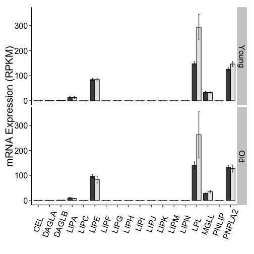

Barplot Analysis of Acromegaly Results
=======================================

Used Analysed DESeq results.


```
## Saving 7 x 7 in image
## Saving 7 x 7 in image
## Saving 7 x 7 in image
## Saving 7 x 7 in image
## Saving 7 x 7 in image
## Saving 7 x 7 in image
## Saving 7 x 7 in image
## Saving 7 x 7 in image
## Saving 7 x 7 in image
## Saving 7 x 7 in image
## Saving 7 x 7 in image
## Saving 7 x 7 in image
## Saving 7 x 7 in image
## Saving 7 x 7 in image
## Saving 7 x 7 in image
## Saving 7 x 7 in image
## Saving 7 x 7 in image
## Saving 7 x 7 in image
## Saving 7 x 7 in image
## Saving 7 x 7 in image
## Saving 7 x 7 in image
## Saving 7 x 7 in image
## Saving 7 x 7 in image
## Saving 7 x 7 in image
## Saving 7 x 7 in image
## Saving 7 x 7 in image
## Saving 7 x 7 in image
## Saving 7 x 7 in image
## Saving 7 x 7 in image
## Saving 7 x 7 in image
## Saving 7 x 7 in image
## Saving 7 x 7 in image
## Saving 7 x 7 in image
## Saving 7 x 7 in image
## Saving 7 x 7 in image
## Saving 7 x 7 in image
## Saving 7 x 7 in image
## Saving 7 x 7 in image
## Saving 7 x 7 in image
## Saving 7 x 7 in image
## Saving 7 x 7 in image
## Saving 7 x 7 in image
## Saving 7 x 7 in image
## Saving 7 x 7 in image
## Saving 7 x 7 in image
## Saving 7 x 7 in image
## Saving 7 x 7 in image
## Saving 7 x 7 in image
## Saving 7 x 7 in image
## Saving 7 x 7 in image
## Saving 7 x 7 in image
## Saving 7 x 7 in image
## Saving 7 x 7 in image
## Saving 7 x 7 in image
## Saving 7 x 7 in image
## Saving 7 x 7 in image
## Saving 7 x 7 in image
## Saving 7 x 7 in image
## Saving 7 x 7 in image
## Saving 7 x 7 in image
## Saving 7 x 7 in image
```


 

```
## Saving 7 x 7 in image
```


```
## Saving 7 x 7 in image
## Saving 7 x 7 in image
## Saving 7 x 7 in image
## Saving 7 x 7 in image
## Saving 7 x 7 in image
## Saving 7 x 7 in image
## Saving 7 x 7 in image
## Saving 7 x 7 in image
## Saving 7 x 7 in image
## Saving 7 x 7 in image
## Saving 7 x 7 in image
## Saving 7 x 7 in image
## Saving 7 x 7 in image
## Saving 7 x 7 in image
## Saving 7 x 7 in image
## Saving 7 x 7 in image
## Saving 7 x 7 in image
## Saving 7 x 7 in image
```


```
## Saving 7 x 7 in image
## Saving 7 x 7 in image
## Saving 7 x 7 in image
## Saving 7 x 7 in image
## Saving 7 x 7 in image
## Saving 7 x 7 in image
## Saving 7 x 7 in image
## Saving 7 x 7 in image
## Saving 7 x 7 in image
## Saving 7 x 7 in image
## Saving 7 x 7 in image
## Saving 7 x 7 in image
## Saving 7 x 7 in image
## Saving 7 x 7 in image
## Loading required package: grid
```

```
## pdf 
##   2
```

```
## pdf 
##   2
```


The data used is in the file **../data/processed/RPKM_counts_Acromegaly_GRCh37.74.csv**.  This file was most recently processed on ``Tue May 13 08:37:04 2014``.


Session Information
---------------------


```r
sessionInfo()
```

```
## R version 3.1.0 (2014-04-10)
## Platform: x86_64-apple-darwin13.1.0 (64-bit)
## 
## locale:
## [1] en_US.UTF-8/en_US.UTF-8/en_US.UTF-8/C/en_US.UTF-8/en_US.UTF-8
## 
## attached base packages:
## [1] grid      stats     graphics  grDevices utils     datasets  methods  
## [8] base     
## 
## other attached packages:
## [1] ggplot2_0.9.3.1 plyr_1.8.1      reshape2_1.4    biomaRt_2.20.0 
## [5] knitr_1.5      
## 
## loaded via a namespace (and not attached):
##  [1] AnnotationDbi_1.26.0 Biobase_2.24.0       BiocGenerics_0.10.0 
##  [4] colorspace_1.2-4     DBI_0.2-7            digest_0.6.4        
##  [7] evaluate_0.5.3       formatR_0.10         GenomeInfoDb_1.0.2  
## [10] gtable_0.1.2         IRanges_1.22.3       labeling_0.2        
## [13] MASS_7.3-31          munsell_0.4.2        parallel_3.1.0      
## [16] proto_0.3-10         Rcpp_0.11.1          RCurl_1.95-4.1      
## [19] RSQLite_0.11.4       scales_0.2.4         stats4_3.1.0        
## [22] stringr_0.6.2        tools_3.1.0          XML_3.98-1.1
```

