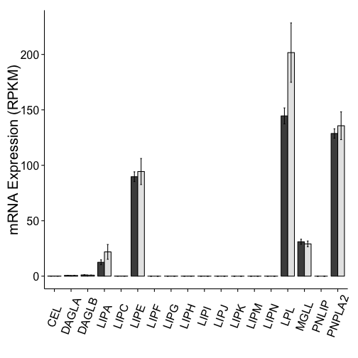

Barplot Analysis of Cushing Results
=======================================

Used Analysed DESeq results.  There was no sequence data for sample 12128 and we removed the control patient id 29 due to his missing the exclusion criteria.


```
## Saving 7 x 7 in image
## Saving 7 x 7 in image
```


 

```
## Saving 7 x 7 in image
```


```
## Saving 7 x 7 in image
## Saving 7 x 7 in image
## Saving 7 x 7 in image
## Saving 7 x 7 in image
## Saving 7 x 7 in image
## Saving 7 x 7 in image
## Saving 7 x 7 in image
## Saving 7 x 7 in image
## Saving 7 x 7 in image
## Saving 7 x 7 in image
## Saving 7 x 7 in image
## Saving 7 x 7 in image
## Saving 7 x 7 in image
## Saving 7 x 7 in image
## Saving 7 x 7 in image
## Saving 7 x 7 in image
## Saving 7 x 7 in image
## Saving 7 x 7 in image
```


```
## Saving 7 x 7 in image
## Saving 7 x 7 in image
## Saving 7 x 7 in image
## Saving 7 x 7 in image
```


The data used is in the file **../data/processed/RPKM_counts_Cushing_GRCh37.74.csv**.  This file was most recently processed on ``Mon May 12 14:06:53 2014``.


Session Information
---------------------


```r
sessionInfo()
```

```
## R version 3.0.2 (2013-09-25)
## Platform: x86_64-apple-darwin10.8.0 (64-bit)
## 
## locale:
## [1] en_US.UTF-8/en_US.UTF-8/en_US.UTF-8/C/en_US.UTF-8/en_US.UTF-8
## 
## attached base packages:
## [1] stats     graphics  grDevices utils     datasets  methods   base     
## 
## other attached packages:
## [1] ggplot2_0.9.3.1 plyr_1.8        reshape2_1.2.2  biomaRt_2.18.0 
## [5] knitr_1.5      
## 
## loaded via a namespace (and not attached):
##  [1] colorspace_1.2-4   dichromat_2.0-0    digest_0.6.3      
##  [4] evaluate_0.5.5     formatR_0.10       grid_3.0.2        
##  [7] gtable_0.1.2       labeling_0.2       MASS_7.3-29       
## [10] munsell_0.4.2      proto_0.3-10       RColorBrewer_1.0-5
## [13] RCurl_1.95-4.1     scales_0.2.3       stringr_0.6.2     
## [16] tools_3.0.2        XML_3.95-0.2
```

