Analysis of Clinical Data for Cushing Patients
=============================================================

This file was last compiled on ``Wed Apr 23 19:16:38 2014``.  Unless otherwise noted this analysis removes subject 29.

Statistics
-------------


This analysis included 11 controls and 8 cushing patients. 


First we checked whether the data was normally distributed using a Shapiro-Wilk test.  If a Shapiro-Wilk Normality test had a p-value <0.05 for a measurement in either the control or the cushing cases, we did a Wilcoxon test. This was appropriate for Cer.C14, Cer.C20, Cer.C22..area., Cer.C24, insulin, HOMA.IR, Creatinine, ALT.

We next tested, for the normally distributed data, whether the data had unequal variance.  This was done using Levene's test in the car package <a href="http://socserv.socsci.mcmaster.ca/jfox/Books/Companion">Fox & Weisberg (2011)</a>.  A Welch's t-test for unequal variance was appropriate for glucose based on p<0.05.  In all other cases, a t-test, presuming equal variance was used.

<!-- html table generated in R 3.1.0 by xtable 1.7-3 package -->
<!-- Wed Apr 23 19:16:40 2014 -->
<TABLE border=1>
<CAPTION ALIGN="bottom"> Summary of statistical tests used </CAPTION>
<TR> <TH>  </TH> <TH> shapiro.control </TH> <TH> shapiro.cushing </TH> <TH> levene.test </TH> <TH> test </TH>  </TR>
  <TR> <TD align="right"> height </TD> <TD align="right"> 0.148 </TD> <TD align="right"> 0.713 </TD> <TD align="right"> 0.859 </TD> <TD> Student's T-Test </TD> </TR>
  <TR> <TD align="right"> weight </TD> <TD align="right"> 0.261 </TD> <TD align="right"> 0.126 </TD> <TD align="right"> 0.878 </TD> <TD> Student's T-Test </TD> </TR>
  <TR> <TD align="right"> BMI </TD> <TD align="right"> 0.556 </TD> <TD align="right"> 0.312 </TD> <TD align="right"> 0.136 </TD> <TD> Student's T-Test </TD> </TR>
  <TR> <TD align="right"> abdominal.circumference </TD> <TD align="right"> 0.690 </TD> <TD align="right"> 0.130 </TD> <TD align="right"> 0.234 </TD> <TD> Student's T-Test </TD> </TR>
  <TR> <TD align="right"> Cer.C14 </TD> <TD align="right"> 0.021 </TD> <TD align="right"> 0.087 </TD> <TD align="right"> 0.298 </TD> <TD> Wilcoxon Test </TD> </TR>
  <TR> <TD align="right"> Cer.C18.1 </TD> <TD align="right"> 0.891 </TD> <TD align="right"> 0.983 </TD> <TD align="right"> 0.276 </TD> <TD> Student's T-Test </TD> </TR>
  <TR> <TD align="right"> Cer.C16 </TD> <TD align="right"> 0.883 </TD> <TD align="right"> 0.389 </TD> <TD align="right"> 0.792 </TD> <TD> Student's T-Test </TD> </TR>
  <TR> <TD align="right"> Cer.C18 </TD> <TD align="right"> 0.916 </TD> <TD align="right"> 0.057 </TD> <TD align="right"> 0.289 </TD> <TD> Student's T-Test </TD> </TR>
  <TR> <TD align="right"> Cer.C20 </TD> <TD align="right"> 0.001 </TD> <TD align="right"> 0.037 </TD> <TD align="right"> 0.302 </TD> <TD> Wilcoxon Test </TD> </TR>
  <TR> <TD align="right"> Cer.C22..area. </TD> <TD align="right"> 0.657 </TD> <TD align="right"> 0.002 </TD> <TD align="right"> 0.313 </TD> <TD> Wilcoxon Test </TD> </TR>
  <TR> <TD align="right"> Cer.C24.1..area. </TD> <TD align="right"> 0.119 </TD> <TD align="right"> 0.332 </TD> <TD align="right"> 0.208 </TD> <TD> Student's T-Test </TD> </TR>
  <TR> <TD align="right"> Cer.C24 </TD> <TD align="right"> 0.752 </TD> <TD align="right"> 0.001 </TD> <TD align="right"> 0.286 </TD> <TD> Wilcoxon Test </TD> </TR>
  <TR> <TD align="right"> Glu.Cer.C16 </TD> <TD align="right"> 0.674 </TD> <TD align="right"> 0.336 </TD> <TD align="right"> 0.942 </TD> <TD> Student's T-Test </TD> </TR>
  <TR> <TD align="right"> Glu.Cer.C18 </TD> <TD align="right"> 0.570 </TD> <TD align="right"> 0.709 </TD> <TD align="right"> 0.553 </TD> <TD> Student's T-Test </TD> </TR>
  <TR> <TD align="right"> Glu.Cer.C18.1 </TD> <TD align="right"> 0.204 </TD> <TD align="right"> 0.104 </TD> <TD align="right"> 0.630 </TD> <TD> Student's T-Test </TD> </TR>
  <TR> <TD align="right"> insulin </TD> <TD align="right"> 0.085 </TD> <TD align="right"> 0.039 </TD> <TD align="right"> 0.012 </TD> <TD> Wilcoxon Test </TD> </TR>
  <TR> <TD align="right"> glucose </TD> <TD align="right"> 0.458 </TD> <TD align="right"> 0.151 </TD> <TD align="right"> 0.043 </TD> <TD> Welch's T-Test </TD> </TR>
  <TR> <TD align="right"> HOMA.IR </TD> <TD align="right"> 0.028 </TD> <TD align="right"> 0.052 </TD> <TD align="right"> 0.037 </TD> <TD> Wilcoxon Test </TD> </TR>
  <TR> <TD align="right"> glycerol.no.tx </TD> <TD align="right"> 0.297 </TD> <TD align="right"> 0.132 </TD> <TD align="right"> 0.064 </TD> <TD> Student's T-Test </TD> </TR>
  <TR> <TD align="right"> glycerol.insulin.2.nM </TD> <TD align="right"> 0.183 </TD> <TD align="right"> 0.237 </TD> <TD align="right"> 0.054 </TD> <TD> Student's T-Test </TD> </TR>
  <TR> <TD align="right"> glycerol.iso.30.nM </TD> <TD align="right"> 0.245 </TD> <TD align="right"> 0.545 </TD> <TD align="right"> 0.605 </TD> <TD> Student's T-Test </TD> </TR>
  <TR> <TD align="right"> glycerol.ins.iso </TD> <TD align="right"> 0.104 </TD> <TD align="right"> 0.256 </TD> <TD align="right"> 0.866 </TD> <TD> Student's T-Test </TD> </TR>
  <TR> <TD align="right"> glycerol.ins.ctrl </TD> <TD align="right"> 0.065 </TD> <TD align="right"> 0.091 </TD> <TD align="right"> 0.513 </TD> <TD> Student's T-Test </TD> </TR>
  <TR> <TD align="right"> glycerol.iso.ctrl </TD> <TD align="right"> 0.513 </TD> <TD align="right"> 0.720 </TD> <TD align="right"> 0.405 </TD> <TD> Student's T-Test </TD> </TR>
  <TR> <TD align="right"> glycerol.ins.iso.iso </TD> <TD align="right"> 0.966 </TD> <TD align="right"> 0.444 </TD> <TD align="right"> 0.483 </TD> <TD> Student's T-Test </TD> </TR>
  <TR> <TD align="right"> age </TD> <TD align="right"> 0.459 </TD> <TD align="right"> 0.748 </TD> <TD align="right"> 0.886 </TD> <TD> Student's T-Test </TD> </TR>
  <TR> <TD align="right"> largest.diameter.of.tumor </TD> <TD align="right"> 0.784 </TD> <TD align="right"> 0.441 </TD> <TD align="right"> 0.655 </TD> <TD> Student's T-Test </TD> </TR>
  <TR> <TD align="right"> Creatinine </TD> <TD align="right"> 0.498 </TD> <TD align="right"> 0.014 </TD> <TD align="right"> 0.539 </TD> <TD> Wilcoxon Test </TD> </TR>
  <TR> <TD align="right"> AST </TD> <TD align="right"> 0.068 </TD> <TD align="right"> 0.194 </TD> <TD align="right"> 0.095 </TD> <TD> Student's T-Test </TD> </TR>
  <TR> <TD align="right"> ALT </TD> <TD align="right"> 0.231 </TD> <TD align="right"> 0.015 </TD> <TD align="right"> 0.035 </TD> <TD> Wilcoxon Test </TD> </TR>
  <TR> <TD align="right"> alk.phos </TD> <TD align="right"> 0.566 </TD> <TD align="right"> 0.668 </TD> <TD align="right"> 0.248 </TD> <TD> Student's T-Test </TD> </TR>
   </TABLE>


```
## Warning: cannot compute exact p-value with ties
## Warning: cannot compute exact p-value with ties
## Warning: cannot compute exact p-value with ties
```


<!-- html table generated in R 3.1.0 by xtable 1.7-3 package -->
<!-- Wed Apr 23 19:16:40 2014 -->
<TABLE border=1>
<TR> <TH>  </TH> <TH> measurement </TH> <TH> Control_mean </TH> <TH> Control_se </TH> <TH> Cushing's_mean </TH> <TH> Cushing's_se </TH> <TH> pval </TH> <TH> padj </TH>  </TR>
  <TR> <TD align="right"> 2 </TD> <TD> age </TD> <TD align="right"> 63.4 </TD> <TD align="right"> 2.7 </TD> <TD align="right"> 38.6 </TD> <TD align="right"> 2.9 </TD> <TD align="right"> 0.00001 </TD> <TD align="right"> 0.00033 </TD> </TR>
  <TR> <TD align="right"> 30 </TD> <TD> largest.diameter.of.tumor </TD> <TD align="right"> 2.0 </TD> <TD align="right"> 0.2 </TD> <TD align="right"> 0.7 </TD> <TD align="right"> 0.2 </TD> <TD align="right"> 0.00050 </TD> <TD align="right"> 0.00771 </TD> </TR>
  <TR> <TD align="right"> 25 </TD> <TD> glycerol.iso.ctrl </TD> <TD align="right"> 1.5 </TD> <TD align="right"> 0.1 </TD> <TD align="right"> 0.6 </TD> <TD align="right"> 0.1 </TD> <TD align="right"> 0.00125 </TD> <TD align="right"> 0.01295 </TD> </TR>
  <TR> <TD align="right"> 4 </TD> <TD> ALT </TD> <TD align="right"> 23.5 </TD> <TD align="right"> 2.0 </TD> <TD align="right"> 57.2 </TD> <TD align="right"> 15.9 </TD> <TD align="right"> 0.02494 </TD> <TD align="right"> 0.19331 </TD> </TR>
  <TR> <TD align="right"> 5 </TD> <TD> AST </TD> <TD align="right"> 23.5 </TD> <TD align="right"> 1.5 </TD> <TD align="right"> 33.2 </TD> <TD align="right"> 4.5 </TD> <TD align="right"> 0.03174 </TD> <TD align="right"> 0.19679 </TD> </TR>
  <TR> <TD align="right"> 26 </TD> <TD> glycerol.no.tx </TD> <TD align="right"> 4.9 </TD> <TD align="right"> 0.8 </TD> <TD align="right"> 15.4 </TD> <TD align="right"> 6.5 </TD> <TD align="right"> 0.04983 </TD> <TD align="right"> 0.25747 </TD> </TR>
  <TR> <TD align="right"> 1 </TD> <TD> abdominal.circumference </TD> <TD align="right"> 100.7 </TD> <TD align="right"> 4.6 </TD> <TD align="right"> 114.6 </TD> <TD align="right"> 6.0 </TD> <TD align="right"> 0.07681 </TD> <TD align="right"> 0.34014 </TD> </TR>
  <TR> <TD align="right"> 15 </TD> <TD> Creatinine </TD> <TD align="right"> 0.9 </TD> <TD align="right"> 0.1 </TD> <TD align="right"> 0.8 </TD> <TD align="right"> 0.1 </TD> <TD align="right"> 0.09257 </TD> <TD align="right"> 0.35708 </TD> </TR>
  <TR> <TD align="right"> 23 </TD> <TD> glycerol.insulin.2.nM </TD> <TD align="right"> 5.7 </TD> <TD align="right"> 1.2 </TD> <TD align="right"> 14.4 </TD> <TD align="right"> 6.5 </TD> <TD align="right"> 0.10367 </TD> <TD align="right"> 0.35708 </TD> </TR>
  <TR> <TD align="right"> 20 </TD> <TD> glycerol.ins.ctrl </TD> <TD align="right"> 1.1 </TD> <TD align="right"> 0.1 </TD> <TD align="right"> 0.9 </TD> <TD align="right"> 0.2 </TD> <TD align="right"> 0.12691 </TD> <TD align="right"> 0.39341 </TD> </TR>
  <TR> <TD align="right"> 22 </TD> <TD> glycerol.ins.iso.iso </TD> <TD align="right"> 0.9 </TD> <TD align="right"> 0.1 </TD> <TD align="right"> 1.2 </TD> <TD align="right"> 0.1 </TD> <TD align="right"> 0.15375 </TD> <TD align="right"> 0.43328 </TD> </TR>
  <TR> <TD align="right"> 9 </TD> <TD> Cer.C18 </TD> <TD align="right"> 0.4 </TD> <TD align="right"> 0.0 </TD> <TD align="right"> 0.5 </TD> <TD align="right"> 0.0 </TD> <TD align="right"> 0.22289 </TD> <TD align="right"> 0.57581 </TD> </TR>
  <TR> <TD align="right"> 6 </TD> <TD> BMI </TD> <TD align="right"> 30.7 </TD> <TD align="right"> 1.8 </TD> <TD align="right"> 34.5 </TD> <TD align="right"> 3.2 </TD> <TD align="right"> 0.27657 </TD> <TD align="right"> 0.65951 </TD> </TR>
  <TR> <TD align="right"> 29 </TD> <TD> insulin </TD> <TD align="right"> 8.7 </TD> <TD align="right"> 0.9 </TD> <TD align="right"> 20.5 </TD> <TD align="right"> 5.7 </TD> <TD align="right"> 0.30402 </TD> <TD align="right"> 0.67319 </TD> </TR>
  <TR> <TD align="right"> 14 </TD> <TD> Cer.C24.1..area. </TD> <TD align="right"> 7723.5 </TD> <TD align="right"> 2072.9 </TD> <TD align="right"> 5122.4 </TD> <TD align="right"> 1276.9 </TD> <TD align="right"> 0.39846 </TD> <TD align="right"> 0.80858 </TD> </TR>
  <TR> <TD align="right"> 18 </TD> <TD> Glu.Cer.C18.1 </TD> <TD align="right"> 0.2 </TD> <TD align="right"> 0.0 </TD> <TD align="right"> 0.2 </TD> <TD align="right"> 0.0 </TD> <TD align="right"> 0.41733 </TD> <TD align="right"> 0.80858 </TD> </TR>
  <TR> <TD align="right"> 31 </TD> <TD> weight </TD> <TD align="right"> 89.4 </TD> <TD align="right"> 6.7 </TD> <TD align="right"> 96.6 </TD> <TD align="right"> 7.3 </TD> <TD align="right"> 0.47881 </TD> <TD align="right"> 0.82289 </TD> </TR>
  <TR> <TD align="right"> 10 </TD> <TD> Cer.C18.1 </TD> <TD align="right"> 0.7 </TD> <TD align="right"> 0.0 </TD> <TD align="right"> 0.7 </TD> <TD align="right"> 0.1 </TD> <TD align="right"> 0.50344 </TD> <TD align="right"> 0.82289 </TD> </TR>
  <TR> <TD align="right"> 17 </TD> <TD> Glu.Cer.C18 </TD> <TD align="right"> 0.4 </TD> <TD align="right"> 0.0 </TD> <TD align="right"> 0.4 </TD> <TD align="right"> 0.0 </TD> <TD align="right"> 0.51901 </TD> <TD align="right"> 0.82289 </TD> </TR>
  <TR> <TD align="right"> 21 </TD> <TD> glycerol.ins.iso </TD> <TD align="right"> 6.8 </TD> <TD align="right"> 1.5 </TD> <TD align="right"> 8.5 </TD> <TD align="right"> 2.3 </TD> <TD align="right"> 0.53090 </TD> <TD align="right"> 0.82289 </TD> </TR>
  <TR> <TD align="right"> 8 </TD> <TD> Cer.C16 </TD> <TD align="right"> 3.4 </TD> <TD align="right"> 0.4 </TD> <TD align="right"> 3.1 </TD> <TD align="right"> 0.4 </TD> <TD align="right"> 0.59434 </TD> <TD align="right"> 0.83932 </TD> </TR>
  <TR> <TD align="right"> 7 </TD> <TD> Cer.C14 </TD> <TD align="right"> 0.3 </TD> <TD align="right"> 0.0 </TD> <TD align="right"> 0.3 </TD> <TD align="right"> 0.0 </TD> <TD align="right"> 0.66047 </TD> <TD align="right"> 0.83932 </TD> </TR>
  <TR> <TD align="right"> 11 </TD> <TD> Cer.C20 </TD> <TD align="right"> 0.6 </TD> <TD align="right"> 0.0 </TD> <TD align="right"> 0.6 </TD> <TD align="right"> 0.0 </TD> <TD align="right"> 0.66047 </TD> <TD align="right"> 0.83932 </TD> </TR>
  <TR> <TD align="right"> 28 </TD> <TD> HOMA.IR </TD> <TD align="right"> 2.0 </TD> <TD align="right"> 0.3 </TD> <TD align="right"> 5.3 </TD> <TD align="right"> 1.9 </TD> <TD align="right"> 0.66907 </TD> <TD align="right"> 0.83932 </TD> </TR>
  <TR> <TD align="right"> 16 </TD> <TD> Glu.Cer.C16 </TD> <TD align="right"> 0.3 </TD> <TD align="right"> 0.0 </TD> <TD align="right"> 0.3 </TD> <TD align="right"> 0.0 </TD> <TD align="right"> 0.72298 </TD> <TD align="right"> 0.83932 </TD> </TR>
  <TR> <TD align="right"> 27 </TD> <TD> height </TD> <TD align="right"> 170.0 </TD> <TD align="right"> 2.4 </TD> <TD align="right"> 168.5 </TD> <TD align="right"> 3.5 </TD> <TD align="right"> 0.72496 </TD> <TD align="right"> 0.83932 </TD> </TR>
  <TR> <TD align="right"> 13 </TD> <TD> Cer.C24 </TD> <TD align="right"> 4.3 </TD> <TD align="right"> 0.6 </TD> <TD align="right"> 6.7 </TD> <TD align="right"> 3.8 </TD> <TD align="right"> 0.73255 </TD> <TD align="right"> 0.83932 </TD> </TR>
  <TR> <TD align="right"> 19 </TD> <TD> glucose </TD> <TD align="right"> 92.5 </TD> <TD align="right"> 2.0 </TD> <TD align="right"> 95.1 </TD> <TD align="right"> 8.1 </TD> <TD align="right"> 0.75809 </TD> <TD align="right"> 0.83932 </TD> </TR>
  <TR> <TD align="right"> 12 </TD> <TD> Cer.C22..area. </TD> <TD align="right"> 7164.8 </TD> <TD align="right"> 1260.3 </TD> <TD align="right"> 7071.6 </TD> <TD align="right"> 1273.5 </TD> <TD align="right"> 0.80753 </TD> <TD align="right"> 0.86322 </TD> </TR>
  <TR> <TD align="right"> 24 </TD> <TD> glycerol.iso.30.nM </TD> <TD align="right"> 7.6 </TD> <TD align="right"> 1.6 </TD> <TD align="right"> 7.2 </TD> <TD align="right"> 1.8 </TD> <TD align="right"> 0.87856 </TD> <TD align="right"> 0.89877 </TD> </TR>
  <TR> <TD align="right"> 3 </TD> <TD> alk.phos </TD> <TD align="right"> 68.3 </TD> <TD align="right"> 5.5 </TD> <TD align="right"> 69.2 </TD> <TD align="right"> 4.4 </TD> <TD align="right"> 0.89877 </TD> <TD align="right"> 0.89877 </TD> </TR>
   </TABLE>


Graphs
------

## Barplots

```
## pdf 
##   2
```

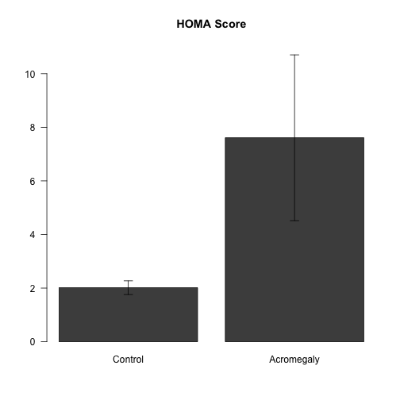 

```
## pdf 
##   2
```

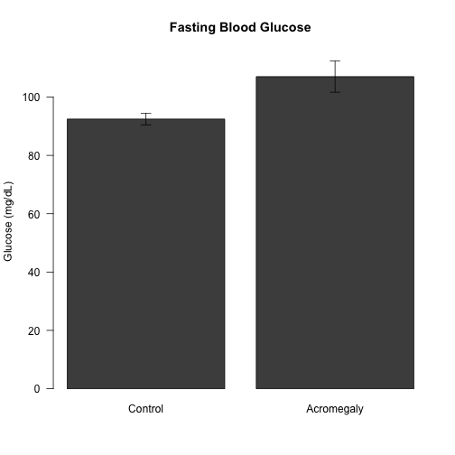 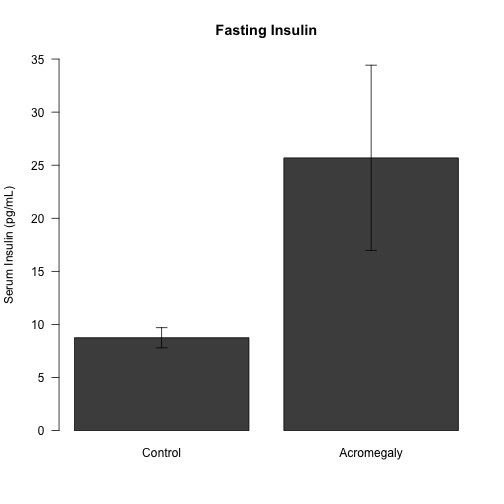 

```
## pdf 
##   2
```

```
## pdf 
##   2
```

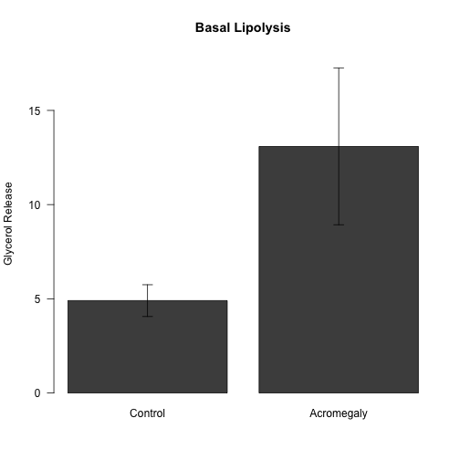 

```
## pdf 
##   2
```

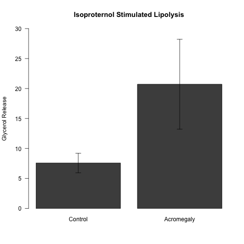 

```
## pdf 
##   2
```

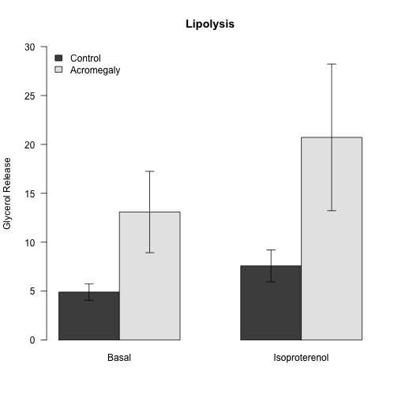 

```
## pdf 
##   2
```

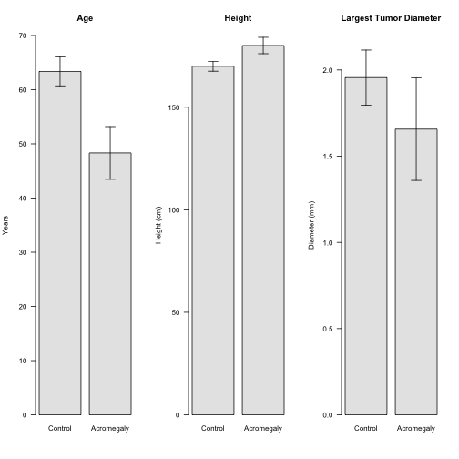 

```
## pdf 
##   2
```

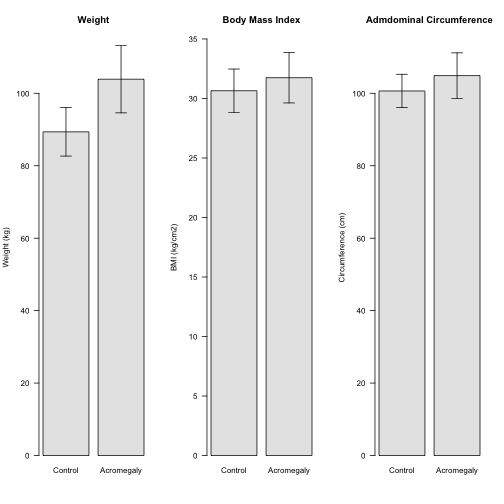 

```
## pdf 
##   2
```

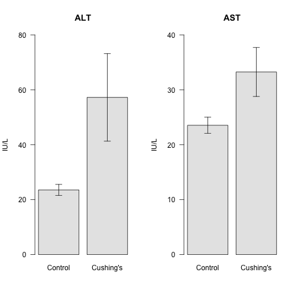 


Correlation with BMI
-----------------------


The HOMA score significantly correlated with the natural logarithm of the BMI (p=0.0052, r=0.6448, R2=0.4157)To correct for the BMI effect on the HOMA-IR score, I generated a linear model comparing the HOMA score to the BMI and the diagnosis.  We tested for an interaction between HOMA-IR and BMI in this model, and did not observe any evidence of an interaction (p=0.8698).

<!-- html table generated in R 3.1.0 by xtable 1.7-3 package -->
<!-- Wed Apr 23 19:16:41 2014 -->
<TABLE border=1>
<TR> <TH>  </TH> <TH> Estimate </TH> <TH> Std. Error </TH> <TH> t value </TH> <TH> Pr(&gt;|t|) </TH>  </TR>
  <TR> <TD align="right"> (Intercept) </TD> <TD align="right"> -1.0493 </TD> <TD align="right"> 0.6059 </TD> <TD align="right"> -1.73 </TD> <TD align="right"> 0.1053 </TD> </TR>
  <TR> <TD align="right"> BMI </TD> <TD align="right"> 0.0545 </TD> <TD align="right"> 0.0187 </TD> <TD align="right"> 2.91 </TD> <TD align="right"> 0.0114 </TD> </TR>
  <TR> <TD align="right"> diagnosisCushing's </TD> <TD align="right"> 0.4083 </TD> <TD align="right"> 0.2866 </TD> <TD align="right"> 1.42 </TD> <TD align="right"> 0.1762 </TD> </TR>
   </TABLE>
<!-- html table generated in R 3.1.0 by xtable 1.7-3 package -->
<!-- Wed Apr 23 19:16:41 2014 -->
<TABLE border=1>
<TR> <TH>  </TH> <TH> 2.5 % </TH> <TH> 97.5 % </TH>  </TR>
  <TR> <TD align="right"> (Intercept) </TD> <TD align="right"> 0.10 </TD> <TD align="right"> 1.28 </TD> </TR>
  <TR> <TD align="right"> BMI </TD> <TD align="right"> 1.01 </TD> <TD align="right"> 1.10 </TD> </TR>
  <TR> <TD align="right"> diagnosisCushing's </TD> <TD align="right"> 0.81 </TD> <TD align="right"> 2.78 </TD> </TR>
   </TABLE>


The results of this linear model are a significant main effect of BMI (p=0.0114) but not the the diagnosis (p=0.1762) with a r-squared value of 0.4168.  This corresponds to an effect size of 1.5042.

### Model Plot


```r
pdf("../figures/Cushing - BMI-HOMA Correlation.pdf")
with(cushing.data, plot(BMI, log(HOMA.IR), pch = 19, las = 1, col = diagnosis, 
    ylab = "Log HOMA-IR Score", xlab = "BMI (mg/kg2)"))
legend("topleft", levels(cushing.data$diagnosis)[c(1, 3)], pch = 19, bty = "n", 
    col = palette()[c(1, 3)], lty = 1)
with(cushing.data[cushing.data$diagnosis == "Control" & cushing.data$id != "29", 
    ], abline(lm(log(HOMA.IR) ~ BMI), col = palette()[1]))
with(cushing.data[cushing.data$diagnosis == "Cushing's" & cushing.data$id != 
    "29", ], abline(lm(log(HOMA.IR) ~ BMI), col = palette()[3]))
dev.off()
```

```
## pdf 
##   2
```

```r

with(cushing.data, plot(BMI, log(HOMA.IR), pch = 19, las = 1, col = diagnosis, 
    ylab = "Log HOMA-IR Score", xlab = "BMI (mg/kg2)"))
legend("topleft", levels(cushing.data$diagnosis)[c(1, 3)], pch = 19, bty = "n", 
    col = palette()[c(1, 3)], lty = 1)
with(cushing.data[cushing.data$diagnosis == "Control" & cushing.data$id != "29", 
    ], abline(lm(log(HOMA.IR) ~ BMI), col = palette()[1]))
with(cushing.data[cushing.data$diagnosis == "Cushing's" & cushing.data$id != 
    "29", ], abline(lm(log(HOMA.IR) ~ BMI), col = palette()[3]))
```

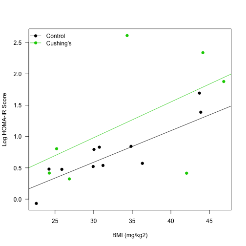 

### Model Diagnostics
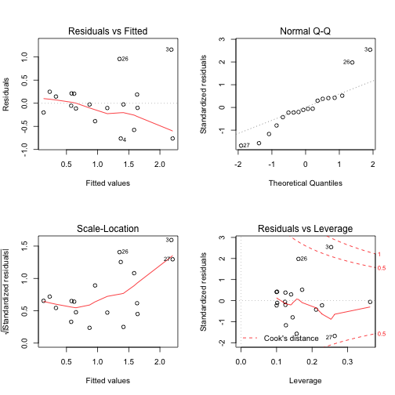 


Separation out of Outlier Data
--------------------------------

One subject was identified as an outlier based on the heatmap.  This was sample 12100, subject #29.


```
## pdf 
##   2
```

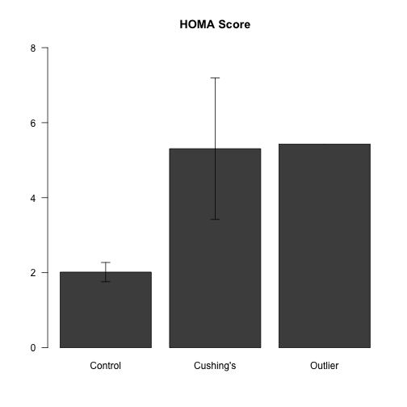 

```
## pdf 
##   2
```

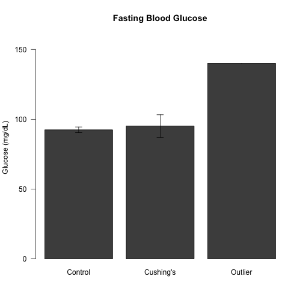 

```
## pdf 
##   2
```

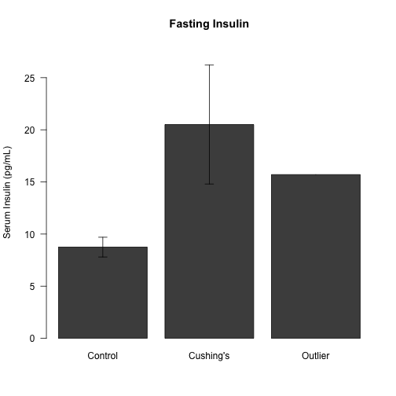 

```
## pdf 
##   2
```

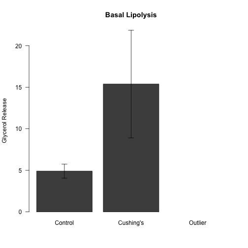 

```
## pdf 
##   2
```

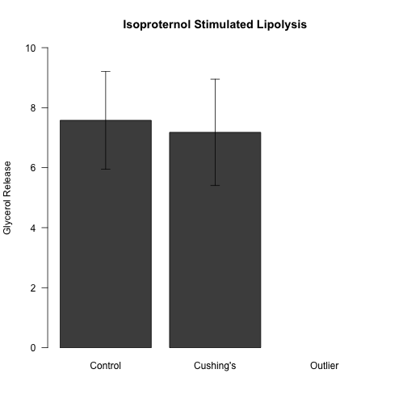 

```
## pdf 
##   2
```

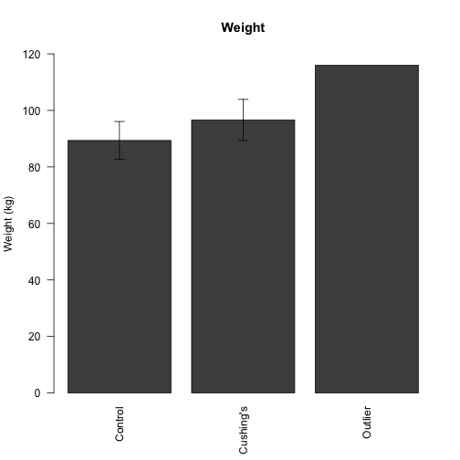 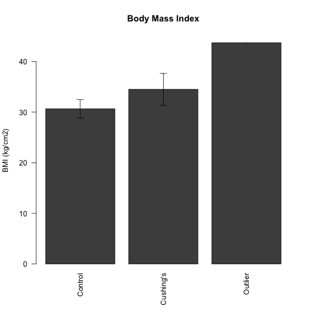 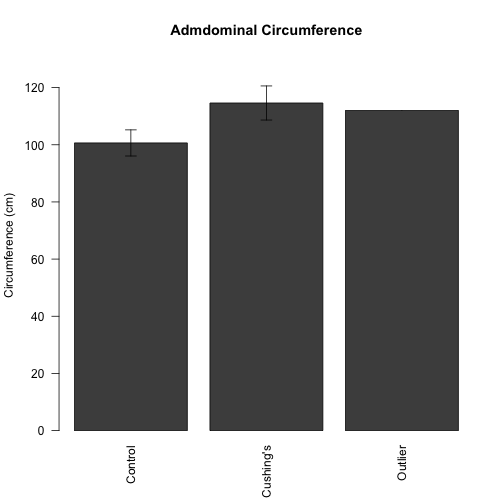 


Ceramides
----------

We tested whether ceramides were elevated in cushing patients.


```
## pdf 
##   2
```

 


<!-- html table generated in R 3.1.0 by xtable 1.7-3 package -->
<!-- Wed Apr 23 19:16:41 2014 -->
<TABLE border=1>
<TR> <TH>  </TH> <TH> measurement </TH> <TH> Control_mean </TH> <TH> Control_se </TH> <TH> Cushing's_mean </TH> <TH> Cushing's_se </TH> <TH> pval </TH> <TH> padj </TH>  </TR>
  <TR> <TD align="right"> 9 </TD> <TD> Cer.C18 </TD> <TD align="right"> 0.4 </TD> <TD align="right"> 0.0 </TD> <TD align="right"> 0.5 </TD> <TD align="right"> 0.0 </TD> <TD align="right"> 0.22289 </TD> <TD align="right"> 0.73255 </TD> </TR>
  <TR> <TD align="right"> 18 </TD> <TD> Glu.Cer.C18.1 </TD> <TD align="right"> 0.2 </TD> <TD align="right"> 0.0 </TD> <TD align="right"> 0.2 </TD> <TD align="right"> 0.0 </TD> <TD align="right"> 0.41733 </TD> <TD align="right"> 0.73255 </TD> </TR>
  <TR> <TD align="right"> 10 </TD> <TD> Cer.C18.1 </TD> <TD align="right"> 0.7 </TD> <TD align="right"> 0.0 </TD> <TD align="right"> 0.7 </TD> <TD align="right"> 0.1 </TD> <TD align="right"> 0.50344 </TD> <TD align="right"> 0.73255 </TD> </TR>
  <TR> <TD align="right"> 17 </TD> <TD> Glu.Cer.C18 </TD> <TD align="right"> 0.4 </TD> <TD align="right"> 0.0 </TD> <TD align="right"> 0.4 </TD> <TD align="right"> 0.0 </TD> <TD align="right"> 0.51901 </TD> <TD align="right"> 0.73255 </TD> </TR>
  <TR> <TD align="right"> 8 </TD> <TD> Cer.C16 </TD> <TD align="right"> 3.4 </TD> <TD align="right"> 0.4 </TD> <TD align="right"> 3.1 </TD> <TD align="right"> 0.4 </TD> <TD align="right"> 0.59434 </TD> <TD align="right"> 0.73255 </TD> </TR>
  <TR> <TD align="right"> 7 </TD> <TD> Cer.C14 </TD> <TD align="right"> 0.3 </TD> <TD align="right"> 0.0 </TD> <TD align="right"> 0.3 </TD> <TD align="right"> 0.0 </TD> <TD align="right"> 0.66047 </TD> <TD align="right"> 0.73255 </TD> </TR>
  <TR> <TD align="right"> 11 </TD> <TD> Cer.C20 </TD> <TD align="right"> 0.6 </TD> <TD align="right"> 0.0 </TD> <TD align="right"> 0.6 </TD> <TD align="right"> 0.0 </TD> <TD align="right"> 0.66047 </TD> <TD align="right"> 0.73255 </TD> </TR>
  <TR> <TD align="right"> 16 </TD> <TD> Glu.Cer.C16 </TD> <TD align="right"> 0.3 </TD> <TD align="right"> 0.0 </TD> <TD align="right"> 0.3 </TD> <TD align="right"> 0.0 </TD> <TD align="right"> 0.72298 </TD> <TD align="right"> 0.73255 </TD> </TR>
  <TR> <TD align="right"> 13 </TD> <TD> Cer.C24 </TD> <TD align="right"> 4.3 </TD> <TD align="right"> 0.6 </TD> <TD align="right"> 6.7 </TD> <TD align="right"> 3.8 </TD> <TD align="right"> 0.73255 </TD> <TD align="right"> 0.73255 </TD> </TR>
   </TABLE>


References
-----------

- John Fox, Sanford Weisberg,   (2011) An {R} Companion to Applied Regression.  <a href="http://socserv.socsci.mcmaster.ca/jfox/Books/Companion">http://socserv.socsci.mcmaster.ca/jfox/Books/Companion</a>


Session Information
-------------------

```r
sessionInfo()
```

```
## R version 3.1.0 (2014-04-10)
## Platform: x86_64-apple-darwin13.1.0 (64-bit)
## 
## locale:
## [1] en_US.UTF-8/en_US.UTF-8/en_US.UTF-8/C/en_US.UTF-8/en_US.UTF-8
## 
## attached base packages:
## [1] stats     graphics  grDevices utils     datasets  methods   base     
## 
## other attached packages:
## [1] xtable_1.7-3        car_2.0-19          knitcitations_0.5-0
## [4] bibtex_0.3-6        plyr_1.8.1          reshape2_1.2.2     
## [7] knitr_1.5          
## 
## loaded via a namespace (and not attached):
##  [1] evaluate_0.5.3 formatR_0.10   httr_0.3       MASS_7.3-31   
##  [5] nnet_7.3-8     Rcpp_0.11.1    RCurl_1.95-4.1 stringr_0.6.2 
##  [9] tools_3.1.0    XML_3.98-1.1
```

