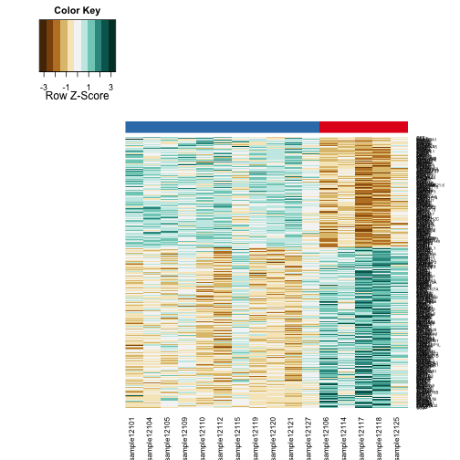

Analysis of Data for Cushings Patients by Heatmaps
=============================================================

Statistics
----------


This file was most recently processed on ``Sun Jun  1 14:58:17 2014``.  This uses the DESeq normalized data found in ../data/processed/RPKM_counts_Cushing_GRCh37.74.csv.


Differentially Expressed Genes
----------------------------------

To test the grouping of differentially expressed transcripts, we only examined genes with significantly different transcripts based on DESeq analysis.

  

```
## pdf 
##   3
```

```
## pdf 
##   2
```


References
-----------


Session Information
-------------------

```r
sessionInfo()
```

```
## R version 3.1.0 (2014-04-10)
## Platform: x86_64-apple-darwin13.1.0 (64-bit)
## 
## locale:
## [1] en_US.UTF-8/en_US.UTF-8/en_US.UTF-8/C/en_US.UTF-8/en_US.UTF-8
## 
## attached base packages:
## [1] stats     graphics  grDevices utils     datasets  methods   base     
## 
## other attached packages:
## [1] RColorBrewer_1.0-5  gplots_2.13.0       knitcitations_0.5-0
## [4] bibtex_0.3-6        knitr_1.5          
## 
## loaded via a namespace (and not attached):
##  [1] bitops_1.0-6       caTools_1.17       evaluate_0.5.5    
##  [4] formatR_0.10       gdata_2.13.3       gtools_3.4.0      
##  [7] httr_0.3           KernSmooth_2.23-12 RCurl_1.95-4.1    
## [10] stringr_0.6.2      tools_3.1.0        XML_3.98-1.1      
## [13] xtable_1.7-3
```

