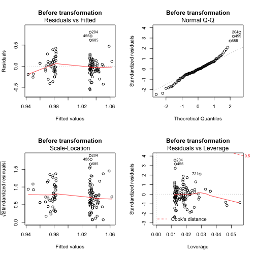
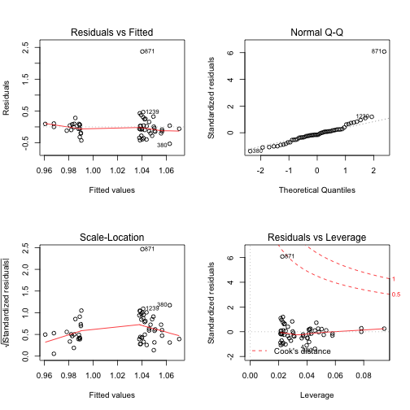
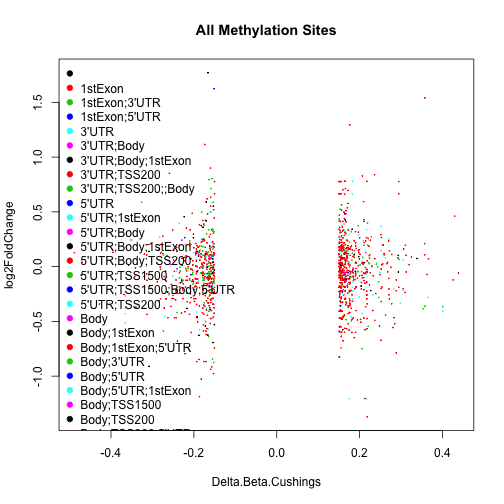

Analysis of Methylation Data from Cushing's Study
=============================================================

This file was last compiled on ``Sat Jun 21 10:38:57 2014``.


```
## Loading required package: rJava
## Loading required package: xlsxjars
```

The methylation is in ../data/raw/Summary Table of Cushings Relative Control Methylation Jan 6 2013.xlsx wherea se we used ../data/processed/htseq_Annotated DESeq2 Results - Cushing.csv for the relative expression.

Statics
---------

Tested the predictive value on the delta-beta value on the fold change.


```
## 
## Call:
## lm(formula = 2^log2FoldChange ~ Delta.Beta.Cushings, data = combined.data[combined.data$UCSC_REFGENE_GROUP == 
##     "TSS1500", ])
## 
## Residuals:
##     Min      1Q  Median      3Q     Max 
## -0.4824 -0.1017 -0.0259  0.1035  0.7167 
## 
## Coefficients:
##                     Estimate Std. Error t value Pr(>|t|)    
## (Intercept)           1.0130     0.0189   53.51   <2e-16 ***
## Delta.Beta.Cushings  -0.0938     0.0962   -0.97     0.33    
## ---
## Signif. codes:  0 '***' 0.001 '**' 0.01 '*' 0.05 '.' 0.1 ' ' 1
## 
## Residual standard error: 0.205 on 119 degrees of freedom
##   (53 observations deleted due to missingness)
## Multiple R-squared:  0.00792,	Adjusted R-squared:  -0.000414 
## F-statistic: 0.95 on 1 and 119 DF,  p-value: 0.332
```

 

```
## 
## Call:
## lm(formula = 2^log2FoldChange ~ Delta.Beta.Cushings, data = combined.data[combined.data$UCSC_REFGENE_GROUP == 
##     "TSS200", ])
## 
## Residuals:
##     Min      1Q  Median      3Q     Max 
## -0.5306 -0.1575 -0.0589  0.0845  2.3696 
## 
## Coefficients:
##                     Estimate Std. Error t value Pr(>|t|)    
## (Intercept)           1.0141     0.0556   18.25   <2e-16 ***
## Delta.Beta.Cushings  -0.1579     0.2704   -0.58     0.56    
## ---
## Signif. codes:  0 '***' 0.001 '**' 0.01 '*' 0.05 '.' 0.1 ' ' 1
## 
## Residual standard error: 0.394 on 54 degrees of freedom
##   (26 observations deleted due to missingness)
## Multiple R-squared:  0.00628,	Adjusted R-squared:  -0.0121 
## F-statistic: 0.341 on 1 and 54 DF,  p-value: 0.562
```

 

Are Differentially Methylated Genes More Likely to Be Differentially Expressed?
---------------------------------------------------------------------------------

To test this, we asked whether the genes with a significantly different methylation pattern had a significantly different expression pattern.  We then compared this to a randomly sampled set of genes from the same expression set.  We then repeated this analysis 1000 times for each of the hypo and hyper expressed genes, and tested how often the chis-quared test led to a significant result.


```
## 
## FALSE  TRUE 
##   709   291
```

```
## 
## FALSE  TRUE 
##   799   201
```

Figures
----------

   

How Many Genes were Differentially Methylated
----------------------------------------------


There was 1035 that had differential methylation including 493 hypomethylated genes and 584 hypermethylated genes.  There was also 43 genes which were hypomethylated in one location and hypermethulated in another.  These genes are written to a files named ../data/processed/Cushings Hypomethylated Genes.txt and ../data/processed/Cushings Hypermethylated Genes.txt.

Only genes in TS1500
---------------------

Session Information
-------------------

```r
sessionInfo()
```

```
## R version 3.1.0 (2014-04-10)
## Platform: x86_64-apple-darwin13.1.0 (64-bit)
## 
## locale:
## [1] en_US.UTF-8/en_US.UTF-8/en_US.UTF-8/C/en_US.UTF-8/en_US.UTF-8
## 
## attached base packages:
## [1] stats     graphics  grDevices utils     datasets  methods   base     
## 
## other attached packages:
## [1] xlsx_0.5.5     xlsxjars_0.6.0 rJava_0.9-6    knitr_1.6     
## 
## loaded via a namespace (and not attached):
## [1] evaluate_0.5.5 formatR_0.10   stringr_0.6.2  tools_3.1.0
```
