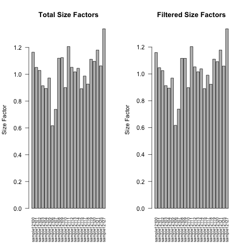
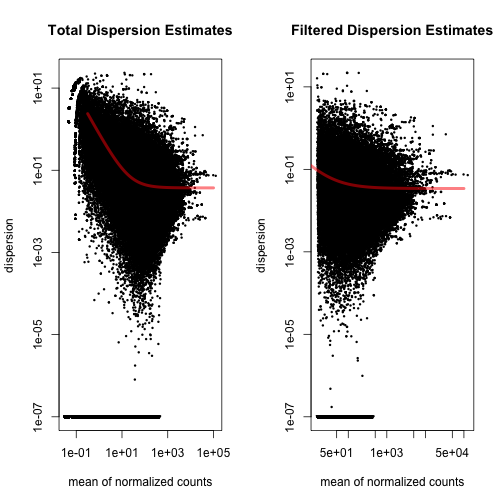
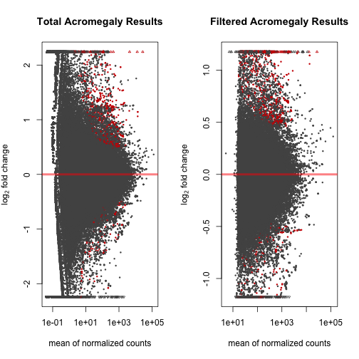
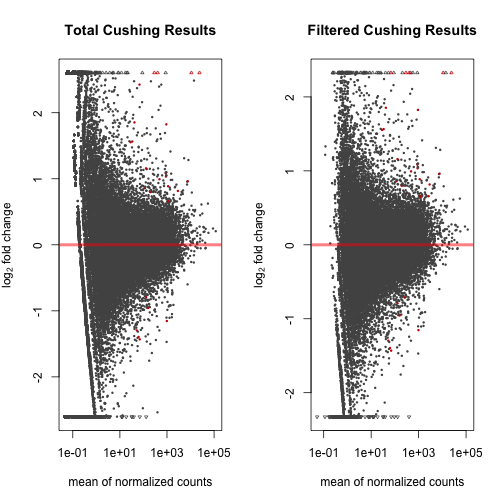

DESeq Analysis of Cushing and Acromegaly Patient Samples with Outlier Removed
===============================================================================


The counts tables were generated previously using the **filtered_counts_table.Rmd** script.  It removes the outlier data point from the analysis, which was patient **29**.
This script requires a transcript counts table.  There is also a sample mapping file called **patient_sample_mapping.csv** which links the diagnosis the the samples.  This file was most recently processed on ``Thu Oct  3 11:24:55 2013``.


```
## Warning: no date field in DESCRIPTION file of package 'BiocGenerics'
```


These data were analysed in two ways by DESeq (<a href="http://dx.doi.org/10.1186/gb-2010-11-10-r106">Anders & Huber, 2010</a>).  The first way was to analyse normally.  The second way was to remove the lowest 40% of transcripts.  The removal of low-expressing, low-reliability transcripts allowed for a smaller penalty for multiple comparasons.


Full Analysis
--------------


Expression Filtered Analysis
-------------------------------
This analysis removes the lowest 40% expressing transcripts.


```r
library(xtable)
print(xtable(as.data.frame(summary(filtered.mapping$group))), type = "html")
```

<!-- html table generated in R 3.0.1 by xtable 1.7-1 package -->
<!-- Thu Oct  3 11:26:47 2013 -->
<TABLE border=1>
<TR> <TH>  </TH> <TH> summary(filtered.mapping$group) </TH>  </TR>
  <TR> <TD align="right"> Control </TD> <TD align="right">  11 </TD> </TR>
  <TR> <TD align="right"> Acromegaly </TD> <TD align="right">   7 </TD> </TR>
  <TR> <TD align="right"> Cushing's </TD> <TD align="right">   6 </TD> </TR>
   </TABLE>


    


Summary Analysis
-------------------
The following tables show the tested number of transcripts and d the number of FDR adjusted significantly different transcripts.


```r
# For Acromegaly, unfiltered
table(acromegaly.results$padj < 0.05)
```

```
## 
## FALSE  TRUE 
## 40242   103
```

```r
# Filtered Acromegaly Data
table(acromegaly.results.filtered$padj < 0.05)
```

```
## 
## FALSE  TRUE 
## 31802   117
```

```r
# For Cushing's, unfiltered
table(cushing.results$padj < 0.05)
```

```
## 
## FALSE  TRUE 
## 39928    16
```

```r
# Filtered Data
table(cushing.results.filtered$padj < 0.05)
```

```
## 
## FALSE  TRUE 
## 31895    24
```


Annotation
-------------

The annotated data is for just the filtered results 


```
## Warning: no date field in DESCRIPTION file of package 'BiocGenerics'
```

```
## Error: object 'annotated.cushing.results.unfiltered' not found
```


The data was annotated from Ensembl data, using the biomaRt package (<a href="">Durinck et al. 2009</a>; <a href="">Durinck et al. 2005</a>).

Differentially Expressed Genes
--------------------------------
  


### Acromegaly

There were **117** differentially expressed transcripts from the acromegaly patients, with **28** transcripts downregulated and **89** transcripts upregulated.

This corresponds to **89** upregulated genes and **28** downregulated genes.

### Cushing's Disease

There were **24** differentially expressed transcripts from the acromegaly patients, with **6** transcripts downregulated and **18** transcripts upregulated.

This corresponds to **18** upregulated genes and **6** downregulated genes.


Bibiography
------------

- Steffen Durinck, Paul Spellman, Ewan Birney, Wolfgang Huber,   (2009) Mapping identifiers for the integration of genomic datasets with the R/Bioconductor package biomaRt.  <em>Nature Protocols</em>  <strong>4</strong>  1184-1191
- Steffen Durinck, Yves Moreau, Arek Kasprzyk, Sean Davis, Bart  De Moor, Alvis Brazma, Wolfgang Huber,   (2005) BioMart and Bioconductor: a powerful link between biological databases and microarray data analysis.  <em>Bioinformatics</em>  <strong>21</strong>  3439-3440
- Simon Anders, Wolfgang Huber,   (2010) Differential expression analysis for sequence count data.  <em>Genome Biology</em>  <strong>11</strong>  R106-NA  <a href="http://dx.doi.org/10.1186/gb-2010-11-10-r106">10.1186/gb-2010-11-10-r106</a>


Session Information
-------------------

For the R session, the package versions were:

```r
sessionInfo()
```

```
## R version 3.0.1 (2013-05-16)
## Platform: x86_64-apple-darwin10.8.0 (64-bit)
## 
## locale:
## [1] en_US.UTF-8/en_US.UTF-8/en_US.UTF-8/C/en_US.UTF-8/en_US.UTF-8
## 
## attached base packages:
## [1] parallel  stats     graphics  grDevices utils     datasets  methods  
## [8] base     
## 
## other attached packages:
##  [1] biomaRt_2.16.0      xtable_1.7-1        knitcitations_0.5-0
##  [4] bibtex_0.3-6        DESeq_1.12.0        lattice_0.20-15    
##  [7] locfit_1.5-9.1      Biobase_2.20.1      BiocGenerics_0.6.0 
## [10] knitr_1.4          
## 
## loaded via a namespace (and not attached):
##  [1] annotate_1.38.0      AnnotationDbi_1.22.6 DBI_0.2-7           
##  [4] digest_0.6.3         evaluate_0.4.7       formatR_0.9         
##  [7] genefilter_1.42.0    geneplotter_1.38.0   grid_3.0.1          
## [10] httr_0.2             IRanges_1.18.2       RColorBrewer_1.0-5  
## [13] RCurl_1.95-4.1       RSQLite_0.11.4       splines_3.0.1       
## [16] stats4_3.0.1         stringr_0.6.2        survival_2.37-4     
## [19] tools_3.0.1          XML_3.95-0.2
```


