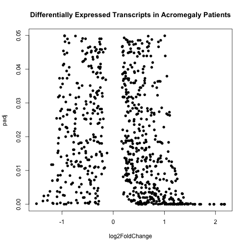
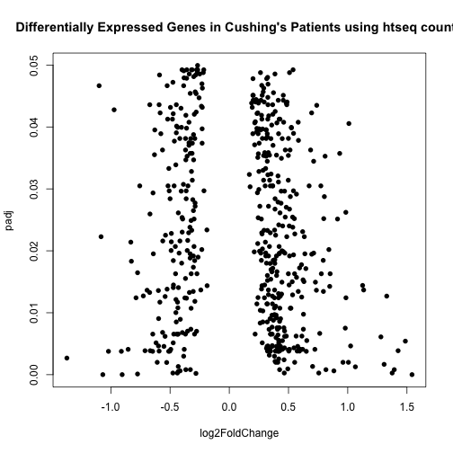

DESeq Analysis of Cushing and Acromegaly Patient Samples with Outlier Removed
===============================================================================


The counts tables were generated previously using the **filtered_counts_table.Rmd** script.  It removes the outlier data point from the analysis, which was patient **29**.
This script requires a transcript counts table.  There is also a sample mapping file called **patient_sample_mapping.csv** which links the diagnosis the the samples.  This file was most recently processed on ``Thu Jan 16 04:04:04 2014``.


```
## Warning: package 'DESeq' was built under R version 3.0.2
## Warning: package 'BiocGenerics' was built under R version 3.0.2
## Warning: package 'Biobase' was built under R version 3.0.2
## Warning: package 'knitcitations' was built under R version 3.0.2
## Warning: no date field in DESCRIPTION file of package 'BiocGenerics'
```


These data were analysed in  by DESeq (<a href="http://dx.doi.org/10.1186/gb-2010-11-10-r106">Anders & Huber, 2010</a>). We did not remove lower expressing transcripts because we pre-filtered the data to examine only one transcript per gene.  

Full Analysis
--------------


Annotation
-------------

This step annotates the data tables with the official gene symbols.


```
## Warning: package 'biomaRt' was built under R version 3.0.2
## Warning: no date field in DESCRIPTION file of package 'BiocGenerics'
```


The data was annotated from Ensembl data, using the biomaRt package (<a href="">Durinck et al. 2009</a>; <a href="">Durinck et al. 2005</a>).

Differentially Expressed Genes
--------------------------------
  


### Acromegaly

There were **62** differentially expressed transcripts from the acromegaly patients, with **10** transcripts downregulated and **52** transcripts upregulated.

This corresponds to **52** upregulated genes and **10** downregulated genes.

### Cushing's Disease

There were **77** differentially expressed transcripts from the acromegaly patients, with **31** transcripts downregulated and **46** transcripts upregulated.

This corresponds to **8** upregulated genes and **3** downregulated genes.


Bibiography
------------

- Steffen Durinck, Paul Spellman, Ewan Birney, Wolfgang Huber,   (2009) Mapping identifiers for the integration of genomic datasets with the R/Bioconductor package biomaRt.  <em>Nature Protocols</em>  <strong>4</strong>  1184-1191
- Steffen Durinck, Yves Moreau, Arek Kasprzyk, Sean Davis, Bart  De Moor, Alvis Brazma, Wolfgang Huber,   (2005) BioMart and Bioconductor: a powerful link between biological databases and microarray data analysis.  <em>Bioinformatics</em>  <strong>21</strong>  3439-3440
- Simon Anders, Wolfgang Huber,   (2010) Differential expression analysis for sequence count data.  <em>Genome Biology</em>  <strong>11</strong>  R106-NA  <a href="http://dx.doi.org/10.1186/gb-2010-11-10-r106">10.1186/gb-2010-11-10-r106</a>


Session Information
-------------------

For the R session, the package versions were:

```r
sessionInfo()
```

```
## R version 3.0.1 (2013-05-16)
## Platform: x86_64-apple-darwin10.8.0 (64-bit)
## 
## locale:
## [1] en_US.UTF-8/en_US.UTF-8/en_US.UTF-8/C/en_US.UTF-8/en_US.UTF-8
## 
## attached base packages:
## [1] parallel  stats     graphics  grDevices utils     datasets  methods  
## [8] base     
## 
## other attached packages:
##  [1] plyr_1.8            biomaRt_2.18.0      knitcitations_0.5-0
##  [4] bibtex_0.3-6        DESeq_1.14.0        lattice_0.20-24    
##  [7] locfit_1.5-9.1      Biobase_2.22.0      BiocGenerics_0.8.0 
## [10] knitr_1.5          
## 
## loaded via a namespace (and not attached):
##  [1] annotate_1.40.0      AnnotationDbi_1.24.0 DBI_0.2-7           
##  [4] digest_0.6.4         evaluate_0.5.1       formatR_0.10        
##  [7] genefilter_1.44.0    geneplotter_1.40.0   grid_3.0.1          
## [10] httr_0.2             IRanges_1.20.6       RColorBrewer_1.0-5  
## [13] RCurl_1.95-4.1       RSQLite_0.11.4       splines_3.0.1       
## [16] stats4_3.0.1         stringr_0.6.2        survival_2.37-4     
## [19] tools_3.0.1          XML_3.95-0.2         xtable_1.7-1
```

