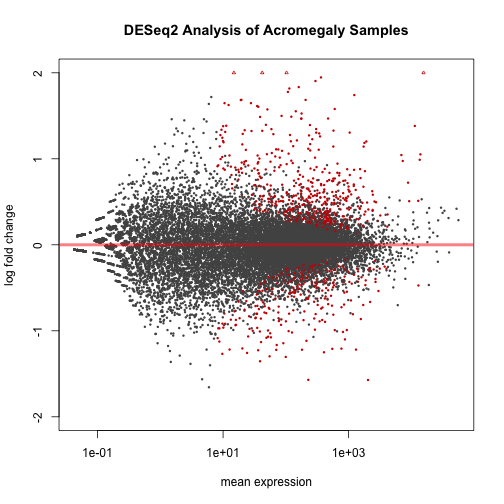
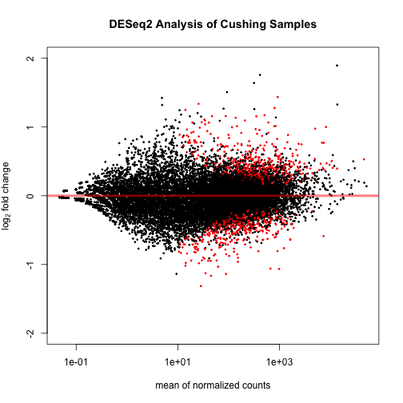

DESeq Analysis of Cushing and Acromegaly Patient Samples with Outlier Removed
===============================================================================


The counts tables were generated previously using  **HTseq.sh** shell script and **merge.command** on Hera.  It removes the outlier data point from the analysis, which was patient **29**.
This script requires a transcript counts table.  There is also a sample mapping file called **patient_sample_mapping.csv** which links the diagnosis the the samples.  This file was most recently processed on ``Mon Mar 10 23:27:35 2014``.


This step gets the protein coding genes only.


```
## Warning: no date field in DESCRIPTION file of package 'GenomicRanges'
## Warning: no date field in DESCRIPTION file of package 'XVector'
## Warning: no date field in DESCRIPTION file of package 'IRanges'
## Warning: no date field in DESCRIPTION file of package 'BiocGenerics'
```


These data were analysed in  by DESeq (<a href="http://dx.doi.org/10.1186/gb-2010-11-10-r106">Anders & Huber, 2010</a>). We did not remove lower expressing genes because we pre-filtered the data to examine only one transcript per gene.  

Full Analysis
--------------

  


Count data transformations for visualization. This will output regularized transformation (RLD) counts and variance stabilized (VSD) counts for Cushing and Acromegaly in the **data/processed/** folder.

Counts transformations
-------------------


Annotation
-------------

This step annotates the data tables with the official gene symbols.


The data was annotated from Ensembl data, using the biomaRt package (<a href="">Durinck et al. 2009</a>; <a href="">Durinck et al. 2005</a>).

Differentially Expressed Genes
--------------------------------
  


### Acromegaly

There were **560** differentially expressed genes from the acromegaly patients, with **189** genes downregulated and **371** genes upregulated.

### Cushing's Disease

There were **475** differentially expressed genes from the acromegaly patients, with **195** genes downregulated and **280** genes upregulated.


Bibiography
------------

- Steffen Durinck, Paul Spellman, Ewan Birney, Wolfgang Huber,   (2009) Mapping identifiers for the integration of genomic datasets with the R/Bioconductor package biomaRt.  <em>Nature Protocols</em>  <strong>4</strong>  1184-1191
- Steffen Durinck, Yves Moreau, Arek Kasprzyk, Sean Davis, Bart  De Moor, Alvis Brazma, Wolfgang Huber,   (2005) BioMart and Bioconductor: a powerful link between biological databases and microarray data analysis.  <em>Bioinformatics</em>  <strong>21</strong>  3439-3440
- Simon Anders, Wolfgang Huber,   (2010) Differential expression analysis for sequence count data.  <em>Genome Biology</em>  <strong>11</strong>  R106-NA  <a href="http://dx.doi.org/10.1186/gb-2010-11-10-r106">10.1186/gb-2010-11-10-r106</a>


Session Information
-------------------

For the R session, the package versions were:

```r
sessionInfo()
```

```
## R version 3.0.2 (2013-09-25)
## Platform: x86_64-apple-darwin10.8.0 (64-bit)
## 
## locale:
## [1] en_US.UTF-8/en_US.UTF-8/en_US.UTF-8/C/en_US.UTF-8/en_US.UTF-8
## 
## attached base packages:
## [1] parallel  stats     graphics  grDevices utils     datasets  methods  
## [8] base     
## 
## other attached packages:
##  [1] biomaRt_2.18.0          knitcitations_0.5-0    
##  [3] bibtex_0.3-6            DESeq2_1.2.10          
##  [5] RcppArmadillo_0.4.000.4 Rcpp_0.11.0            
##  [7] GenomicRanges_1.14.4    XVector_0.2.0          
##  [9] IRanges_1.20.6          BiocGenerics_0.8.0     
## [11] knitr_1.5              
## 
## loaded via a namespace (and not attached):
##  [1] annotate_1.40.1      AnnotationDbi_1.24.0 Biobase_2.22.0      
##  [4] DBI_0.2-7            digest_0.6.4         evaluate_0.5.1      
##  [7] formatR_0.10         genefilter_1.44.0    grid_3.0.2          
## [10] httr_0.2             lattice_0.20-27      locfit_1.5-9.1      
## [13] RColorBrewer_1.0-5   RCurl_1.95-4.1       RSQLite_0.11.4      
## [16] splines_3.0.2        stats4_3.0.2         stringr_0.6.2       
## [19] survival_2.37-7      tools_3.0.2          XML_3.95-0.2        
## [22] xtable_1.7-1
```

