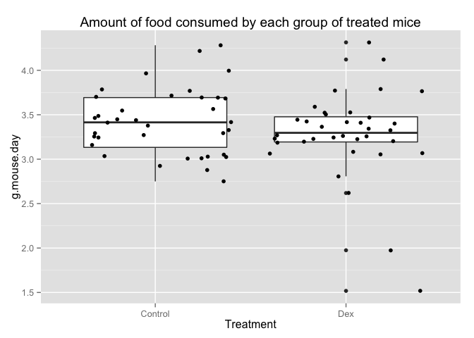
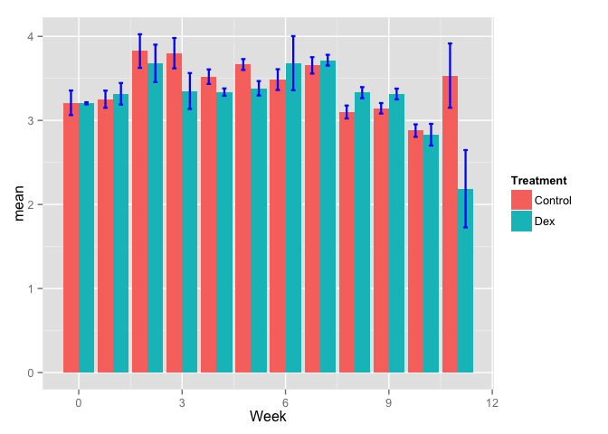
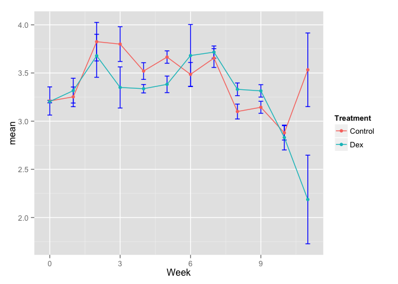
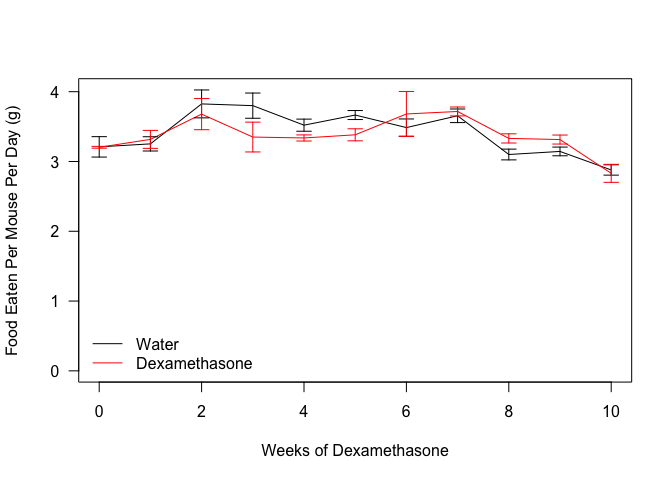

# Food_intake_analysis
Quynh Tran  
February 6, 2015  


This analysis is to check whether the amount of food consumed by control and dexamethasone treated mice were different.


   

 


Statistical Analysis
-------

First we checked whether the data was normally distributed using a Shapiro-Wilk test. Data in each week were normally distributed (p-value > 0.05).
We next tested, for the normally distributed data, whether the data had unequal variance. A Student's t-test for equal variance was appropriate for 0, 1, 2, 3, 4, 5, 6, 7, 8, 9, 10, NA based on p>.05.


% latex table generated in R 3.1.2 by xtable 1.7-4 package
% Mon Feb 23 15:28:44 2015
\begin{table}[ht]
\centering
\begin{tabular}{rlrr}
  \hline
 & Week & pval & padj \\ 
  \hline
1 & 0 & 0.97 & 0.97 \\ 
  2 & 1 & 0.72 & 0.83 \\ 
  3 & 2 & 0.65 & 0.83 \\ 
  4 & 3 & 0.18 & 0.37 \\ 
  5 & 4 & 0.13 & 0.32 \\ 
  6 & 5 & 0.06 & 0.32 \\ 
  7 & 6 & 0.60 & 0.83 \\ 
  8 & 7 & 0.62 & 0.83 \\ 
  9 & 8 & 0.09 & 0.32 \\ 
  10 & 9 & 0.13 & 0.32 \\ 
  11 & 10 & 0.76 & 0.83 \\ 
  12 & 11 & 0.09 & 0.32 \\ 
   \hline
\end{tabular}
\end{table}

 

```
##                Df Sum Sq Mean Sq F value Pr(>F)  
## Treatment       1 0.1264  0.1264   1.084 0.3103  
## Week            1 0.5297  0.5297   4.542 0.0457 *
## Treatment:Week  1 0.0696  0.0696   0.597 0.4487  
## Residuals      20 2.3326  0.1166                 
## ---
## Signif. codes:  0 '***' 0.001 '**' 0.01 '*' 0.05 '.' 0.1 ' ' 1
```

# Session Information

```
## R version 3.1.2 (2014-10-31)
## Platform: x86_64-apple-darwin13.4.0 (64-bit)
## 
## locale:
## [1] en_US.UTF-8/en_US.UTF-8/en_US.UTF-8/C/en_US.UTF-8/en_US.UTF-8
## 
## attached base packages:
## [1] stats     graphics  grDevices utils     datasets  methods   base     
## 
## other attached packages:
## [1] xtable_1.7-4   car_2.0-24     reshape2_1.4.1 plyr_1.8.1    
## [5] ggplot2_1.0.0  knitr_1.9     
## 
## loaded via a namespace (and not attached):
##  [1] colorspace_1.2-4 digest_0.6.8     evaluate_0.5.5   formatR_1.0     
##  [5] grid_3.1.2       gtable_0.1.2     htmltools_0.2.6  labeling_0.3    
##  [9] lattice_0.20-29  lme4_1.1-7       MASS_7.3-37      Matrix_1.1-5    
## [13] mgcv_1.8-4       minqa_1.2.4      munsell_0.4.2    nlme_3.1-119    
## [17] nloptr_1.0.4     nnet_7.3-8       parallel_3.1.2   pbkrtest_0.4-2  
## [21] proto_0.3-10     quantreg_5.11    Rcpp_0.11.4      rmarkdown_0.5.1 
## [25] scales_0.2.4     SparseM_1.6      splines_3.1.2    stringr_0.6.2   
## [29] tools_3.1.2      yaml_2.1.13
```
