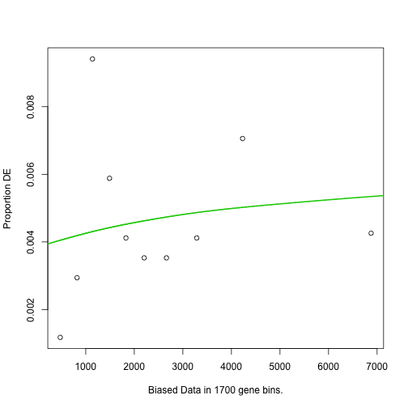
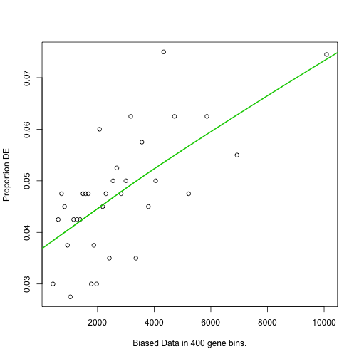

GOSeq of DESeq Data for Acromegaly and Cushing's Patients
=============================================================

This script was most recently run on Sun Jan 19 08:53:20 2014.  This script searches KEGG and GO for enriched categories and pathways.


To analyse these, we used the goseq package (<a href="">Young et al. 2010</a>), using the wallenius approximation to determine
significantly enriched GO (<a href="http://dx.doi.org/10.1038/75556">Botstein et al. 2000</a>) or KEGG (<a href="http://dx.doi.org/10.1093/nar/gkr988">Kanehisa et al. 2011</a>) terms.  

This analysis uses the GO database updated with the datestamp 20130907 downloaded from ftp://ftp.geneontology.org/pub/go/godatabase/archive/latest-lite/.  The KEGG database was downloaded from ftp://ftp.genome.jp/pub/kegg/genomes with a datestamp of 2011-Mar15.

This analysis included the 532 significant cushing transcripts (533 genes) and the 671 significant acromegaly transcripts (672 genes).  We did not separate upregulated genes from downregulated genes in this analysis.

  


Significantly different terms and pathways
----------------------------------------------

### Cushing Significant Processes

For cushing, we found 0 significantly different GO terms for molecular function, 2 significantly different GO terms for biological processes and 1 significantly different KEGG pathways.

<!-- html table generated in R 3.0.2 by xtable 1.7-1 package -->
<!-- Sun Jan 19 08:54:28 2014 -->
<TABLE border=1>
<CAPTION ALIGN="bottom"> Biological Processes Enriched in Acromegaly Patients </CAPTION>
<TR> <TH>  </TH> <TH> category </TH> <TH> numDEInCat </TH> <TH> numInCat </TH> <TH> padj </TH> <TH> Term </TH>  </TR>
  <TR> <TD align="right"> 2201 </TD> <TD> GO:0006007 </TD> <TD align="right"> 13 </TD> <TD align="right"> 53 </TD> <TD align="right"> 0.03691 </TD> <TD> glucose catabolic process </TD> </TR>
  <TR> <TD align="right"> 16423 </TD> <TD> GO:0046365 </TD> <TD align="right"> 14 </TD> <TD align="right"> 59 </TD> <TD align="right"> 0.03691 </TD> <TD> monosaccharide catabolic process </TD> </TR>
   </TABLE>

```
## Warning: data length exceeds size of matrix
```

<!-- html table generated in R 3.0.2 by xtable 1.7-1 package -->
<!-- Sun Jan 19 08:54:28 2014 -->
<TABLE border=1>
<CAPTION ALIGN="bottom"> Molecular Functions Enriched in Acromegaly Patients </CAPTION>
<TR> <TH>  </TH> <TH> category </TH> <TH> numDEInCat </TH> <TH> numInCat </TH> <TH> padj </TH> <TH> Term </TH>  </TR>
  </TABLE>
<!-- html table generated in R 3.0.2 by xtable 1.7-1 package -->
<!-- Sun Jan 19 08:54:28 2014 -->
<TABLE border=1>
<CAPTION ALIGN="bottom"> KEGG Pathways Enriched in Acromegaly Patients </CAPTION>
<TR> <TH>  </TH> <TH> category </TH> <TH> numDEInCat </TH> <TH> numInCat </TH> <TH> padj </TH> <TH> path_name </TH>  </TR>
  <TR> <TD align="right"> 1 </TD> <TD> 00010 </TD> <TD align="right"> 11 </TD> <TD align="right"> 41 </TD> <TD align="right"> 0.00354 </TD> <TD> Glycolysis / Gluconeogenesis </TD> </TR>
   </TABLE>


### Acromegaly Significant Processes

For acromegaly, we found 5 significantly different GO terms for molecular function, 164 significantly different GO terms for biological processes and 0 significantly different KEGG pathways.

<!-- html table generated in R 3.0.2 by xtable 1.7-1 package -->
<!-- Sun Jan 19 08:54:28 2014 -->
<TABLE border=1>
<CAPTION ALIGN="bottom"> Biological Processes Enriched in Acromegaly Patients </CAPTION>
<TR> <TH>  </TH> <TH> category </TH> <TH> numDEInCat </TH> <TH> numInCat </TH> <TH> padj </TH> <TH> Term </TH>  </TR>
  <TR> <TD align="right"> 15382 </TD> <TD> GO:0044699 </TD> <TD align="right"> 450 </TD> <TD align="right"> 7722 </TD> <TD align="right"> 0.00000 </TD> <TD> single-organism process </TD> </TR>
  <TR> <TD align="right"> 15401 </TD> <TD> GO:0044763 </TD> <TD align="right"> 419 </TD> <TD align="right"> 7109 </TD> <TD align="right"> 0.00000 </TD> <TD> single-organism cellular process </TD> </TR>
  <TR> <TD align="right"> 15388 </TD> <TD> GO:0044707 </TD> <TD align="right"> 255 </TD> <TD align="right"> 3720 </TD> <TD align="right"> 0.00000 </TD> <TD> single-multicellular organism process </TD> </TR>
  <TR> <TD align="right"> 10407 </TD> <TD> GO:0032502 </TD> <TD align="right"> 229 </TD> <TD align="right"> 3236 </TD> <TD align="right"> 0.00000 </TD> <TD> developmental process </TD> </TR>
  <TR> <TD align="right"> 10405 </TD> <TD> GO:0032501 </TD> <TD align="right"> 259 </TD> <TD align="right"> 3829 </TD> <TD align="right"> 0.00000 </TD> <TD> multicellular organismal process </TD> </TR>
  <TR> <TD align="right"> 4619 </TD> <TD> GO:0007275 </TD> <TD align="right"> 202 </TD> <TD align="right"> 2832 </TD> <TD align="right"> 0.00000 </TD> <TD> multicellular organismal development </TD> </TR>
  <TR> <TD align="right"> 19114 </TD> <TD> GO:0048731 </TD> <TD align="right"> 175 </TD> <TD align="right"> 2451 </TD> <TD align="right"> 0.00000 </TD> <TD> system development </TD> </TR>
  <TR> <TD align="right"> 15405 </TD> <TD> GO:0044767 </TD> <TD align="right"> 180 </TD> <TD align="right"> 2592 </TD> <TD align="right"> 0.00001 </TD> <TD> single-organism developmental process </TD> </TR>
  <TR> <TD align="right"> 19777 </TD> <TD> GO:0050896 </TD> <TD align="right"> 290 </TD> <TD align="right"> 4812 </TD> <TD align="right"> 0.00001 </TD> <TD> response to stimulus </TD> </TR>
  <TR> <TD align="right"> 4352 </TD> <TD> GO:0007154 </TD> <TD align="right"> 227 </TD> <TD align="right"> 3541 </TD> <TD align="right"> 0.00001 </TD> <TD> cell communication </TD> </TR>
  <TR> <TD align="right"> 4852 </TD> <TD> GO:0008150 </TD> <TD align="right"> 542 </TD> <TD align="right"> 10533 </TD> <TD align="right"> 0.00001 </TD> <TD> biological_process </TD> </TR>
  <TR> <TD align="right"> 8340 </TD> <TD> GO:0023052 </TD> <TD align="right"> 222 </TD> <TD align="right"> 3460 </TD> <TD align="right"> 0.00001 </TD> <TD> signaling </TD> </TR>
  <TR> <TD align="right"> 15383 </TD> <TD> GO:0044700 </TD> <TD align="right"> 222 </TD> <TD align="right"> 3460 </TD> <TD align="right"> 0.00001 </TD> <TD> single organism signaling </TD> </TR>
  <TR> <TD align="right"> 18829 </TD> <TD> GO:0048513 </TD> <TD align="right"> 129 </TD> <TD align="right"> 1714 </TD> <TD align="right"> 0.00001 </TD> <TD> organ development </TD> </TR>
  <TR> <TD align="right"> 21361 </TD> <TD> GO:0051716 </TD> <TD align="right"> 243 </TD> <TD align="right"> 3885 </TD> <TD align="right"> 0.00001 </TD> <TD> cellular response to stimulus </TD> </TR>
  <TR> <TD align="right"> 4898 </TD> <TD> GO:0008283 </TD> <TD align="right"> 94 </TD> <TD align="right"> 1161 </TD> <TD align="right"> 0.00001 </TD> <TD> cell proliferation </TD> </TR>
  <TR> <TD align="right"> 19196 </TD> <TD> GO:0048856 </TD> <TD align="right"> 192 </TD> <TD align="right"> 2870 </TD> <TD align="right"> 0.00001 </TD> <TD> anatomical structure development </TD> </TR>
  <TR> <TD align="right"> 22999 </TD> <TD> GO:0065007 </TD> <TD align="right"> 371 </TD> <TD align="right"> 6562 </TD> <TD align="right"> 0.00001 </TD> <TD> biological regulation </TD> </TR>
  <TR> <TD align="right"> 5984 </TD> <TD> GO:0009987 </TD> <TD align="right"> 503 </TD> <TD align="right"> 9648 </TD> <TD align="right"> 0.00002 </TD> <TD> cellular process </TD> </TR>
  <TR> <TD align="right"> 19205 </TD> <TD> GO:0048869 </TD> <TD align="right"> 148 </TD> <TD align="right"> 2078 </TD> <TD align="right"> 0.00002 </TD> <TD> cellular developmental process </TD> </TR>
  <TR> <TD align="right"> 4373 </TD> <TD> GO:0007165 </TD> <TD align="right"> 204 </TD> <TD align="right"> 3172 </TD> <TD align="right"> 0.00002 </TD> <TD> signal transduction </TD> </TR>
  <TR> <TD align="right"> 8425 </TD> <TD> GO:0030154 </TD> <TD align="right"> 139 </TD> <TD align="right"> 1918 </TD> <TD align="right"> 0.00002 </TD> <TD> cell differentiation </TD> </TR>
  <TR> <TD align="right"> 23000 </TD> <TD> GO:0065008 </TD> <TD align="right"> 146 </TD> <TD align="right"> 2114 </TD> <TD align="right"> 0.00004 </TD> <TD> regulation of biological quality </TD> </TR>
  <TR> <TD align="right"> 11003 </TD> <TD> GO:0032879 </TD> <TD align="right"> 89 </TD> <TD align="right"> 1104 </TD> <TD align="right"> 0.00006 </TD> <TD> regulation of localization </TD> </TR>
  <TR> <TD align="right"> 4381 </TD> <TD> GO:0007167 </TD> <TD align="right"> 66 </TD> <TD align="right"> 723 </TD> <TD align="right"> 0.00006 </TD> <TD> enzyme linked receptor protein signaling pathway </TD> </TR>
  <TR> <TD align="right"> 19534 </TD> <TD> GO:0050789 </TD> <TD align="right"> 347 </TD> <TD align="right"> 6209 </TD> <TD align="right"> 0.00014 </TD> <TD> regulation of biological process </TD> </TR>
  <TR> <TD align="right"> 3126 </TD> <TD> GO:0006468 </TD> <TD align="right"> 76 </TD> <TD align="right"> 920 </TD> <TD align="right"> 0.00019 </TD> <TD> protein phosphorylation </TD> </TR>
  <TR> <TD align="right"> 3879 </TD> <TD> GO:0006796 </TD> <TD align="right"> 134 </TD> <TD align="right"> 1975 </TD> <TD align="right"> 0.00025 </TD> <TD> phosphate-containing compound metabolic process </TD> </TR>
  <TR> <TD align="right"> 3878 </TD> <TD> GO:0006793 </TD> <TD align="right"> 136 </TD> <TD align="right"> 2011 </TD> <TD align="right"> 0.00037 </TD> <TD> phosphorus metabolic process </TD> </TR>
  <TR> <TD align="right"> 19539 </TD> <TD> GO:0050793 </TD> <TD align="right"> 89 </TD> <TD align="right"> 1145 </TD> <TD align="right"> 0.00039 </TD> <TD> regulation of developmental process </TD> </TR>
  <TR> <TD align="right"> 19540 </TD> <TD> GO:0050794 </TD> <TD align="right"> 332 </TD> <TD align="right"> 5926 </TD> <TD align="right"> 0.00044 </TD> <TD> regulation of cellular process </TD> </TR>
  <TR> <TD align="right"> 5820 </TD> <TD> GO:0009719 </TD> <TD align="right"> 70 </TD> <TD align="right"> 848 </TD> <TD align="right"> 0.00062 </TD> <TD> response to endogenous stimulus </TD> </TR>
  <TR> <TD align="right"> 13375 </TD> <TD> GO:0042221 </TD> <TD align="right"> 143 </TD> <TD align="right"> 2161 </TD> <TD align="right"> 0.00071 </TD> <TD> response to chemical stimulus </TD> </TR>
  <TR> <TD align="right"> 20442 </TD> <TD> GO:0051239 </TD> <TD align="right"> 102 </TD> <TD align="right"> 1398 </TD> <TD align="right"> 0.00083 </TD> <TD> regulation of multicellular organismal process </TD> </TR>
  <TR> <TD align="right"> 535 </TD> <TD> GO:0001649 </TD> <TD align="right"> 18 </TD> <TD align="right"> 111 </TD> <TD align="right"> 0.00113 </TD> <TD> osteoblast differentiation </TD> </TR>
  <TR> <TD align="right"> 15182 </TD> <TD> GO:0044057 </TD> <TD align="right"> 33 </TD> <TD align="right"> 298 </TD> <TD align="right"> 0.00113 </TD> <TD> regulation of system process </TD> </TR>
  <TR> <TD align="right"> 5023 </TD> <TD> GO:0008610 </TD> <TD align="right"> 42 </TD> <TD align="right"> 442 </TD> <TD align="right"> 0.00122 </TD> <TD> lipid biosynthetic process </TD> </TR>
  <TR> <TD align="right"> 20452 </TD> <TD> GO:0051246 </TD> <TD align="right"> 92 </TD> <TD align="right"> 1265 </TD> <TD align="right"> 0.00122 </TD> <TD> regulation of protein metabolic process </TD> </TR>
  <TR> <TD align="right"> 27409 </TD> <TD> GO:1901700 </TD> <TD align="right"> 64 </TD> <TD align="right"> 779 </TD> <TD align="right"> 0.00122 </TD> <TD> response to oxygen-containing compound </TD> </TR>
  <TR> <TD align="right"> 3459 </TD> <TD> GO:0006629 </TD> <TD align="right"> 68 </TD> <TD align="right"> 869 </TD> <TD align="right"> 0.00165 </TD> <TD> lipid metabolic process </TD> </TR>
  <TR> <TD align="right"> 7117 </TD> <TD> GO:0016310 </TD> <TD align="right"> 80 </TD> <TD align="right"> 1046 </TD> <TD align="right"> 0.00168 </TD> <TD> phosphorylation </TD> </TR>
  <TR> <TD align="right"> 27407 </TD> <TD> GO:1901698 </TD> <TD align="right"> 46 </TD> <TD align="right"> 497 </TD> <TD align="right"> 0.00188 </TD> <TD> response to nitrogen compound </TD> </TR>
  <TR> <TD align="right"> 28540 </TD> <TD> GO:2000026 </TD> <TD align="right"> 69 </TD> <TD align="right"> 861 </TD> <TD align="right"> 0.00216 </TD> <TD> regulation of multicellular organismal development </TD> </TR>
  <TR> <TD align="right"> 7767 </TD> <TD> GO:0019538 </TD> <TD align="right"> 190 </TD> <TD align="right"> 3157 </TD> <TD align="right"> 0.00231 </TD> <TD> protein metabolic process </TD> </TR>
  <TR> <TD align="right"> 4569 </TD> <TD> GO:0007243 </TD> <TD align="right"> 60 </TD> <TD align="right"> 730 </TD> <TD align="right"> 0.00244 </TD> <TD> intracellular protein kinase cascade </TD> </TR>
  <TR> <TD align="right"> 6405 </TD> <TD> GO:0010876 </TD> <TD align="right"> 23 </TD> <TD align="right"> 179 </TD> <TD align="right"> 0.00251 </TD> <TD> lipid localization </TD> </TR>
  <TR> <TD align="right"> 470 </TD> <TD> GO:0001503 </TD> <TD align="right"> 26 </TD> <TD align="right"> 218 </TD> <TD align="right"> 0.00269 </TD> <TD> ossification </TD> </TR>
  <TR> <TD align="right"> 4378 </TD> <TD> GO:0007166 </TD> <TD align="right"> 121 </TD> <TD align="right"> 1793 </TD> <TD align="right"> 0.00311 </TD> <TD> cell surface receptor signaling pathway </TD> </TR>
  <TR> <TD align="right"> 4676 </TD> <TD> GO:0007399 </TD> <TD align="right"> 92 </TD> <TD align="right"> 1242 </TD> <TD align="right"> 0.00317 </TD> <TD> nervous system development </TD> </TR>
  <TR> <TD align="right"> 13290 </TD> <TD> GO:0042127 </TD> <TD align="right"> 69 </TD> <TD align="right"> 896 </TD> <TD align="right"> 0.00352 </TD> <TD> regulation of cell proliferation </TD> </TR>
  <TR> <TD align="right"> 539 </TD> <TD> GO:0001657 </TD> <TD align="right"> 13 </TD> <TD align="right"> 68 </TD> <TD align="right"> 0.00360 </TD> <TD> ureteric bud development </TD> </TR>
  <TR> <TD align="right"> 6020 </TD> <TD> GO:0010033 </TD> <TD align="right"> 108 </TD> <TD align="right"> 1589 </TD> <TD align="right"> 0.00360 </TD> <TD> response to organic substance </TD> </TR>
  <TR> <TD align="right"> 19330 </TD> <TD> GO:0050673 </TD> <TD align="right"> 24 </TD> <TD align="right"> 196 </TD> <TD align="right"> 0.00364 </TD> <TD> epithelial cell proliferation </TD> </TR>
  <TR> <TD align="right"> 20137 </TD> <TD> GO:0051094 </TD> <TD align="right"> 47 </TD> <TD align="right"> 530 </TD> <TD align="right"> 0.00364 </TD> <TD> positive regulation of developmental process </TD> </TR>
  <TR> <TD align="right"> 7519 </TD> <TD> GO:0019220 </TD> <TD align="right"> 76 </TD> <TD align="right"> 1006 </TD> <TD align="right"> 0.00371 </TD> <TD> regulation of phosphate metabolic process </TD> </TR>
  <TR> <TD align="right"> 23640 </TD> <TD> GO:0070887 </TD> <TD align="right"> 103 </TD> <TD align="right"> 1497 </TD> <TD align="right"> 0.00372 </TD> <TD> cellular response to chemical stimulus </TD> </TR>
  <TR> <TD align="right"> 19215 </TD> <TD> GO:0048878 </TD> <TD align="right"> 43 </TD> <TD align="right"> 475 </TD> <TD align="right"> 0.00372 </TD> <TD> chemical homeostasis </TD> </TR>
  <TR> <TD align="right"> 884 </TD> <TD> GO:0001932 </TD> <TD align="right"> 56 </TD> <TD align="right"> 678 </TD> <TD align="right"> 0.00377 </TD> <TD> regulation of protein phosphorylation </TD> </TR>
  <TR> <TD align="right"> 15308 </TD> <TD> GO:0044281 </TD> <TD align="right"> 128 </TD> <TD align="right"> 2022 </TD> <TD align="right"> 0.00404 </TD> <TD> small molecule metabolic process </TD> </TR>
  <TR> <TD align="right"> 20332 </TD> <TD> GO:0051174 </TD> <TD align="right"> 76 </TD> <TD align="right"> 1018 </TD> <TD align="right"> 0.00502 </TD> <TD> regulation of phosphorus metabolic process </TD> </TR>
  <TR> <TD align="right"> 6082 </TD> <TD> GO:0010243 </TD> <TD align="right"> 42 </TD> <TD align="right"> 464 </TD> <TD align="right"> 0.00539 </TD> <TD> response to organonitrogen compound </TD> </TR>
  <TR> <TD align="right"> 18833 </TD> <TD> GO:0048518 </TD> <TD align="right"> 171 </TD> <TD align="right"> 2795 </TD> <TD align="right"> 0.00539 </TD> <TD> positive regulation of biological process </TD> </TR>
  <TR> <TD align="right"> 18840 </TD> <TD> GO:0048519 </TD> <TD align="right"> 157 </TD> <TD align="right"> 2529 </TD> <TD align="right"> 0.00560 </TD> <TD> negative regulation of biological process </TD> </TR>
  <TR> <TD align="right"> 23984 </TD> <TD> GO:0071495 </TD> <TD align="right"> 52 </TD> <TD align="right"> 612 </TD> <TD align="right"> 0.00560 </TD> <TD> cellular response to endogenous stimulus </TD> </TR>
  <TR> <TD align="right"> 2099 </TD> <TD> GO:0003008 </TD> <TD align="right"> 75 </TD> <TD align="right"> 1003 </TD> <TD align="right"> 0.00572 </TD> <TD> system process </TD> </TR>
  <TR> <TD align="right"> 10045 </TD> <TD> GO:0032268 </TD> <TD align="right"> 81 </TD> <TD align="right"> 1132 </TD> <TD align="right"> 0.00572 </TD> <TD> regulation of cellular protein metabolic process </TD> </TR>
  <TR> <TD align="right"> 27301 </TD> <TD> GO:1901652 </TD> <TD align="right"> 29 </TD> <TD align="right"> 276 </TD> <TD align="right"> 0.00627 </TD> <TD> response to peptide </TD> </TR>
  <TR> <TD align="right"> 2576 </TD> <TD> GO:0006112 </TD> <TD align="right"> 18 </TD> <TD align="right"> 128 </TD> <TD align="right"> 0.00650 </TD> <TD> energy reserve metabolic process </TD> </TR>
  <TR> <TD align="right"> 13083 </TD> <TD> GO:0040007 </TD> <TD align="right"> 49 </TD> <TD align="right"> 581 </TD> <TD align="right"> 0.00650 </TD> <TD> growth </TD> </TR>
  <TR> <TD align="right"> 20184 </TD> <TD> GO:0051128 </TD> <TD align="right"> 79 </TD> <TD align="right"> 1081 </TD> <TD align="right"> 0.00664 </TD> <TD> regulation of cellular component organization </TD> </TR>
  <TR> <TD align="right"> 15390 </TD> <TD> GO:0044710 </TD> <TD align="right"> 147 </TD> <TD align="right"> 2416 </TD> <TD align="right"> 0.00725 </TD> <TD> single-organism metabolic process </TD> </TR>
  <TR> <TD align="right"> 14897 </TD> <TD> GO:0043434 </TD> <TD align="right"> 28 </TD> <TD align="right"> 267 </TD> <TD align="right"> 0.00797 </TD> <TD> response to peptide hormone stimulus </TD> </TR>
  <TR> <TD align="right"> 12296 </TD> <TD> GO:0035295 </TD> <TD align="right"> 33 </TD> <TD align="right"> 333 </TD> <TD align="right"> 0.00974 </TD> <TD> tube development </TD> </TR>
  <TR> <TD align="right"> 18862 </TD> <TD> GO:0048523 </TD> <TD align="right"> 144 </TD> <TD align="right"> 2319 </TD> <TD align="right"> 0.01071 </TD> <TD> negative regulation of cellular process </TD> </TR>
  <TR> <TD align="right"> 6227 </TD> <TD> GO:0010646 </TD> <TD align="right"> 112 </TD> <TD align="right"> 1688 </TD> <TD align="right"> 0.01159 </TD> <TD> regulation of cell communication </TD> </TR>
  <TR> <TD align="right"> 6943 </TD> <TD> GO:0016049 </TD> <TD align="right"> 29 </TD> <TD align="right"> 290 </TD> <TD align="right"> 0.01159 </TD> <TD> cell growth </TD> </TR>
  <TR> <TD align="right"> 16238 </TD> <TD> GO:0045597 </TD> <TD align="right"> 36 </TD> <TD align="right"> 390 </TD> <TD align="right"> 0.01159 </TD> <TD> positive regulation of cell differentiation </TD> </TR>
  <TR> <TD align="right"> 3960 </TD> <TD> GO:0006869 </TD> <TD align="right"> 19 </TD> <TD align="right"> 151 </TD> <TD align="right"> 0.01232 </TD> <TD> lipid transport </TD> </TR>
  <TR> <TD align="right"> 6921 </TD> <TD> GO:0016043 </TD> <TD align="right"> 205 </TD> <TD align="right"> 3500 </TD> <TD align="right"> 0.01243 </TD> <TD> cellular component organization </TD> </TR>
  <TR> <TD align="right"> 16233 </TD> <TD> GO:0045595 </TD> <TD align="right"> 62 </TD> <TD align="right"> 806 </TD> <TD align="right"> 0.01265 </TD> <TD> regulation of cell differentiation </TD> </TR>
  <TR> <TD align="right"> 23832 </TD> <TD> GO:0071310 </TD> <TD align="right"> 85 </TD> <TD align="right"> 1219 </TD> <TD align="right"> 0.01265 </TD> <TD> cellular response to organic substance </TD> </TR>
  <TR> <TD align="right"> 2506 </TD> <TD> GO:0006066 </TD> <TD align="right"> 27 </TD> <TD align="right"> 267 </TD> <TD align="right"> 0.01273 </TD> <TD> alcohol metabolic process </TD> </TR>
  <TR> <TD align="right"> 13086 </TD> <TD> GO:0040008 </TD> <TD align="right"> 36 </TD> <TD align="right"> 400 </TD> <TD align="right"> 0.01422 </TD> <TD> regulation of growth </TD> </TR>
  <TR> <TD align="right"> 15261 </TD> <TD> GO:0044255 </TD> <TD align="right"> 52 </TD> <TD align="right"> 671 </TD> <TD align="right"> 0.01422 </TD> <TD> cellular lipid metabolic process </TD> </TR>
  <TR> <TD align="right"> 23942 </TD> <TD> GO:0071462 </TD> <TD align="right"> 3 </TD> <TD align="right"> 3 </TD> <TD align="right"> 0.01422 </TD> <TD> cellular response to water stimulus </TD> </TR>
  <TR> <TD align="right"> 3592 </TD> <TD> GO:0006694 </TD> <TD align="right"> 14 </TD> <TD align="right"> 98 </TD> <TD align="right"> 0.01482 </TD> <TD> steroid biosynthetic process </TD> </TR>
  <TR> <TD align="right"> 4413 </TD> <TD> GO:0007178 </TD> <TD align="right"> 23 </TD> <TD align="right"> 205 </TD> <TD align="right"> 0.01501 </TD> <TD> transmembrane receptor protein serine/threonine kinase signaling pathway </TD> </TR>
  <TR> <TD align="right"> 13506 </TD> <TD> GO:0042325 </TD> <TD align="right"> 56 </TD> <TD align="right"> 723 </TD> <TD align="right"> 0.01512 </TD> <TD> regulation of phosphorylation </TD> </TR>
  <TR> <TD align="right"> 14044 </TD> <TD> GO:0042692 </TD> <TD align="right"> 27 </TD> <TD align="right"> 258 </TD> <TD align="right"> 0.01544 </TD> <TD> muscle cell differentiation </TD> </TR>
  <TR> <TD align="right"> 22361 </TD> <TD> GO:0060341 </TD> <TD align="right"> 45 </TD> <TD align="right"> 547 </TD> <TD align="right"> 0.01554 </TD> <TD> regulation of cellular localization </TD> </TR>
  <TR> <TD align="right"> 4866 </TD> <TD> GO:0008202 </TD> <TD align="right"> 20 </TD> <TD align="right"> 176 </TD> <TD align="right"> 0.01576 </TD> <TD> steroid metabolic process </TD> </TR>
  <TR> <TD align="right"> 3122 </TD> <TD> GO:0006464 </TD> <TD align="right"> 131 </TD> <TD align="right"> 2088 </TD> <TD align="right"> 0.01576 </TD> <TD> cellular protein modification process </TD> </TR>
  <TR> <TD align="right"> 12831 </TD> <TD> GO:0036211 </TD> <TD align="right"> 131 </TD> <TD align="right"> 2088 </TD> <TD align="right"> 0.01576 </TD> <TD> protein modification process </TD> </TR>
  <TR> <TD align="right"> 5923 </TD> <TD> GO:0009893 </TD> <TD align="right"> 106 </TD> <TD align="right"> 1620 </TD> <TD align="right"> 0.01618 </TD> <TD> positive regulation of metabolic process </TD> </TR>
  <TR> <TD align="right"> 12268 </TD> <TD> GO:0035239 </TD> <TD align="right"> 25 </TD> <TD align="right"> 231 </TD> <TD align="right"> 0.01675 </TD> <TD> tube morphogenesis </TD> </TR>
  <TR> <TD align="right"> 490 </TD> <TD> GO:0001523 </TD> <TD align="right"> 8 </TD> <TD align="right"> 36 </TD> <TD align="right"> 0.01698 </TD> <TD> retinoid metabolic process </TD> </TR>
  <TR> <TD align="right"> 4383 </TD> <TD> GO:0007169 </TD> <TD align="right"> 45 </TD> <TD align="right"> 535 </TD> <TD align="right"> 0.01698 </TD> <TD> transmembrane receptor protein tyrosine kinase signaling pathway </TD> </TR>
  <TR> <TD align="right"> 5809 </TD> <TD> GO:0009653 </TD> <TD align="right"> 104 </TD> <TD align="right"> 1544 </TD> <TD align="right"> 0.01698 </TD> <TD> anatomical structure morphogenesis </TD> </TR>
  <TR> <TD align="right"> 6165 </TD> <TD> GO:0010562 </TD> <TD align="right"> 44 </TD> <TD align="right"> 531 </TD> <TD align="right"> 0.01698 </TD> <TD> positive regulation of phosphorus metabolic process </TD> </TR>
  <TR> <TD align="right"> 7526 </TD> <TD> GO:0019229 </TD> <TD align="right"> 8 </TD> <TD align="right"> 35 </TD> <TD align="right"> 0.01698 </TD> <TD> regulation of vasoconstriction </TD> </TR>
  <TR> <TD align="right"> 13992 </TD> <TD> GO:0042592 </TD> <TD align="right"> 59 </TD> <TD align="right"> 787 </TD> <TD align="right"> 0.01698 </TD> <TD> homeostatic process </TD> </TR>
  <TR> <TD align="right"> 17216 </TD> <TD> GO:0045937 </TD> <TD align="right"> 44 </TD> <TD align="right"> 531 </TD> <TD align="right"> 0.01698 </TD> <TD> positive regulation of phosphate metabolic process </TD> </TR>
  <TR> <TD align="right"> 15310 </TD> <TD> GO:0044283 </TD> <TD align="right"> 31 </TD> <TD align="right"> 344 </TD> <TD align="right"> 0.01700 </TD> <TD> small molecule biosynthetic process </TD> </TR>
  <TR> <TD align="right"> 22851 </TD> <TD> GO:0061061 </TD> <TD align="right"> 35 </TD> <TD align="right"> 381 </TD> <TD align="right"> 0.01734 </TD> <TD> muscle structure development </TD> </TR>
  <TR> <TD align="right"> 24530 </TD> <TD> GO:0072358 </TD> <TD align="right"> 52 </TD> <TD align="right"> 645 </TD> <TD align="right"> 0.01734 </TD> <TD> cardiovascular system development </TD> </TR>
  <TR> <TD align="right"> 24531 </TD> <TD> GO:0072359 </TD> <TD align="right"> 52 </TD> <TD align="right"> 645 </TD> <TD align="right"> 0.01734 </TD> <TD> circulatory system development </TD> </TR>
  <TR> <TD align="right"> 5895 </TD> <TD> GO:0009888 </TD> <TD align="right"> 71 </TD> <TD align="right"> 973 </TD> <TD align="right"> 0.01735 </TD> <TD> tissue development </TD> </TR>
  <TR> <TD align="right"> 8338 </TD> <TD> GO:0023051 </TD> <TD align="right"> 110 </TD> <TD align="right"> 1684 </TD> <TD align="right"> 0.01779 </TD> <TD> regulation of signaling </TD> </TR>
  <TR> <TD align="right"> 22546 </TD> <TD> GO:0060562 </TD> <TD align="right"> 24 </TD> <TD align="right"> 220 </TD> <TD align="right"> 0.01779 </TD> <TD> epithelial tube morphogenesis </TD> </TR>
  <TR> <TD align="right"> 20443 </TD> <TD> GO:0051240 </TD> <TD align="right"> 36 </TD> <TD align="right"> 410 </TD> <TD align="right"> 0.01831 </TD> <TD> positive regulation of multicellular organismal process </TD> </TR>
  <TR> <TD align="right"> 6228 </TD> <TD> GO:0010647 </TD> <TD align="right"> 54 </TD> <TD align="right"> 702 </TD> <TD align="right"> 0.01856 </TD> <TD> positive regulation of cell communication </TD> </TR>
  <TR> <TD align="right"> 14872 </TD> <TD> GO:0043412 </TD> <TD align="right"> 135 </TD> <TD align="right"> 2186 </TD> <TD align="right"> 0.01856 </TD> <TD> macromolecule modification </TD> </TR>
  <TR> <TD align="right"> 15285 </TD> <TD> GO:0044267 </TD> <TD align="right"> 163 </TD> <TD align="right"> 2769 </TD> <TD align="right"> 0.01856 </TD> <TD> cellular protein metabolic process </TD> </TR>
  <TR> <TD align="right"> 15391 </TD> <TD> GO:0044711 </TD> <TD align="right"> 31 </TD> <TD align="right"> 348 </TD> <TD align="right"> 0.01891 </TD> <TD> single-organism biosynthetic process </TD> </TR>
  <TR> <TD align="right"> 27410 </TD> <TD> GO:1901701 </TD> <TD align="right"> 43 </TD> <TD align="right"> 521 </TD> <TD align="right"> 0.01891 </TD> <TD> cellular response to oxygen-containing compound </TD> </TR>
  <TR> <TD align="right"> 8265 </TD> <TD> GO:0022010 </TD> <TD align="right"> 4 </TD> <TD align="right"> 7 </TD> <TD align="right"> 0.01927 </TD> <TD> central nervous system myelination </TD> </TR>
  <TR> <TD align="right"> 10086 </TD> <TD> GO:0032291 </TD> <TD align="right"> 4 </TD> <TD align="right"> 7 </TD> <TD align="right"> 0.01927 </TD> <TD> axon ensheathment in central nervous system </TD> </TR>
  <TR> <TD align="right"> 3904 </TD> <TD> GO:0006813 </TD> <TD align="right"> 11 </TD> <TD align="right"> 64 </TD> <TD align="right"> 0.01934 </TD> <TD> potassium ion transport </TD> </TR>
  <TR> <TD align="right"> 24210 </TD> <TD> GO:0071840 </TD> <TD align="right"> 207 </TD> <TD align="right"> 3597 </TD> <TD align="right"> 0.01964 </TD> <TD> cellular component organization or biogenesis </TD> </TR>
  <TR> <TD align="right"> 9338 </TD> <TD> GO:0031214 </TD> <TD align="right"> 12 </TD> <TD align="right"> 77 </TD> <TD align="right"> 0.02032 </TD> <TD> biomineral tissue development </TD> </TR>
  <TR> <TD align="right"> 7015 </TD> <TD> GO:0016101 </TD> <TD align="right"> 8 </TD> <TD align="right"> 38 </TD> <TD align="right"> 0.02076 </TD> <TD> diterpenoid metabolic process </TD> </TR>
  <TR> <TD align="right"> 18855 </TD> <TD> GO:0048522 </TD> <TD align="right"> 150 </TD> <TD align="right"> 2490 </TD> <TD align="right"> 0.02111 </TD> <TD> positive regulation of cellular process </TD> </TR>
  <TR> <TD align="right"> 17456 </TD> <TD> GO:0046058 </TD> <TD align="right"> 12 </TD> <TD align="right"> 76 </TD> <TD align="right"> 0.02130 </TD> <TD> cAMP metabolic process </TD> </TR>
  <TR> <TD align="right"> 4904 </TD> <TD> GO:0008285 </TD> <TD align="right"> 36 </TD> <TD align="right"> 417 </TD> <TD align="right"> 0.02179 </TD> <TD> negative regulation of cell proliferation </TD> </TR>
  <TR> <TD align="right"> 8303 </TD> <TD> GO:0022603 </TD> <TD align="right"> 42 </TD> <TD align="right"> 500 </TD> <TD align="right"> 0.02209 </TD> <TD> regulation of anatomical structure morphogenesis </TD> </TR>
  <TR> <TD align="right"> 19761 </TD> <TD> GO:0050877 </TD> <TD align="right"> 52 </TD> <TD align="right"> 671 </TD> <TD align="right"> 0.02320 </TD> <TD> neurological system process </TD> </TR>
  <TR> <TD align="right"> 23602 </TD> <TD> GO:0070848 </TD> <TD align="right"> 42 </TD> <TD align="right"> 503 </TD> <TD align="right"> 0.02320 </TD> <TD> response to growth factor stimulus </TD> </TR>
  <TR> <TD align="right"> 27250 </TD> <TD> GO:1901615 </TD> <TD align="right"> 29 </TD> <TD align="right"> 314 </TD> <TD align="right"> 0.02374 </TD> <TD> organic hydroxy compound metabolic process </TD> </TR>
  <TR> <TD align="right"> 8345 </TD> <TD> GO:0023056 </TD> <TD align="right"> 53 </TD> <TD align="right"> 698 </TD> <TD align="right"> 0.02601 </TD> <TD> positive regulation of signaling </TD> </TR>
  <TR> <TD align="right"> 5773 </TD> <TD> GO:0009605 </TD> <TD align="right"> 67 </TD> <TD align="right"> 940 </TD> <TD align="right"> 0.02640 </TD> <TD> response to external stimulus </TD> </TR>
  <TR> <TD align="right"> 13738 </TD> <TD> GO:0042445 </TD> <TD align="right"> 13 </TD> <TD align="right"> 94 </TD> <TD align="right"> 0.02833 </TD> <TD> hormone metabolic process </TD> </TR>
  <TR> <TD align="right"> 24154 </TD> <TD> GO:0071704 </TD> <TD align="right"> 362 </TD> <TD align="right"> 6995 </TD> <TD align="right"> 0.02886 </TD> <TD> organic substance metabolic process </TD> </TR>
  <TR> <TD align="right"> 910 </TD> <TD> GO:0001944 </TD> <TD align="right"> 38 </TD> <TD align="right"> 443 </TD> <TD align="right"> 0.02887 </TD> <TD> vasculature development </TD> </TR>
  <TR> <TD align="right"> 1136 </TD> <TD> GO:0002118 </TD> <TD align="right"> 3 </TD> <TD align="right"> 4 </TD> <TD align="right"> 0.02887 </TD> <TD> aggressive behavior </TD> </TR>
  <TR> <TD align="right"> 5826 </TD> <TD> GO:0009743 </TD> <TD align="right"> 14 </TD> <TD align="right"> 106 </TD> <TD align="right"> 0.02979 </TD> <TD> response to carbohydrate stimulus </TD> </TR>
  <TR> <TD align="right"> 24411 </TD> <TD> GO:0072163 </TD> <TD align="right"> 4 </TD> <TD align="right"> 8 </TD> <TD align="right"> 0.02997 </TD> <TD> mesonephric epithelium development </TD> </TR>
  <TR> <TD align="right"> 5679 </TD> <TD> GO:0009415 </TD> <TD align="right"> 3 </TD> <TD align="right"> 4 </TD> <TD align="right"> 0.03016 </TD> <TD> response to water stimulus </TD> </TR>
  <TR> <TD align="right"> 6210 </TD> <TD> GO:0010628 </TD> <TD align="right"> 61 </TD> <TD align="right"> 836 </TD> <TD align="right"> 0.03022 </TD> <TD> positive regulation of gene expression </TD> </TR>
  <TR> <TD align="right"> 22032 </TD> <TD> GO:0055082 </TD> <TD align="right"> 29 </TD> <TD align="right"> 319 </TD> <TD align="right"> 0.03022 </TD> <TD> cellular chemical homeostasis </TD> </TR>
  <TR> <TD align="right"> 23883 </TD> <TD> GO:0071363 </TD> <TD align="right"> 41 </TD> <TD align="right"> 495 </TD> <TD align="right"> 0.03022 </TD> <TD> cellular response to growth factor stimulus </TD> </TR>
  <TR> <TD align="right"> 19338 </TD> <TD> GO:0050678 </TD> <TD align="right"> 19 </TD> <TD align="right"> 168 </TD> <TD align="right"> 0.03056 </TD> <TD> regulation of epithelial cell proliferation </TD> </TR>
  <TR> <TD align="right"> 7513 </TD> <TD> GO:0019216 </TD> <TD align="right"> 19 </TD> <TD align="right"> 173 </TD> <TD align="right"> 0.03096 </TD> <TD> regulation of lipid metabolic process </TD> </TR>
  <TR> <TD align="right"> 9270 </TD> <TD> GO:0031102 </TD> <TD align="right"> 6 </TD> <TD align="right"> 22 </TD> <TD align="right"> 0.03102 </TD> <TD> neuron projection regeneration </TD> </TR>
  <TR> <TD align="right"> 7807 </TD> <TD> GO:0019637 </TD> <TD align="right"> 66 </TD> <TD align="right"> 955 </TD> <TD align="right"> 0.03138 </TD> <TD> organophosphate metabolic process </TD> </TR>
  <TR> <TD align="right"> 20062 </TD> <TD> GO:0051049 </TD> <TD align="right"> 57 </TD> <TD align="right"> 778 </TD> <TD align="right"> 0.03138 </TD> <TD> regulation of transport </TD> </TR>
  <TR> <TD align="right"> 4767 </TD> <TD> GO:0007603 </TD> <TD align="right"> 8 </TD> <TD align="right"> 41 </TD> <TD align="right"> 0.03171 </TD> <TD> phototransduction, visible light </TD> </TR>
  <TR> <TD align="right"> 11228 </TD> <TD> GO:0033002 </TD> <TD align="right"> 12 </TD> <TD align="right"> 84 </TD> <TD align="right"> 0.03171 </TD> <TD> muscle cell proliferation </TD> </TR>
  <TR> <TD align="right"> 22618 </TD> <TD> GO:0060675 </TD> <TD align="right"> 8 </TD> <TD align="right"> 39 </TD> <TD align="right"> 0.03171 </TD> <TD> ureteric bud morphogenesis </TD> </TR>
  <TR> <TD align="right"> 502 </TD> <TD> GO:0001558 </TD> <TD align="right"> 23 </TD> <TD align="right"> 231 </TD> <TD align="right"> 0.03198 </TD> <TD> regulation of cell growth </TD> </TR>
  <TR> <TD align="right"> 17602 </TD> <TD> GO:0046165 </TD> <TD align="right"> 14 </TD> <TD align="right"> 110 </TD> <TD align="right"> 0.03225 </TD> <TD> alcohol biosynthetic process </TD> </TR>
  <TR> <TD align="right"> 6362 </TD> <TD> GO:0010817 </TD> <TD align="right"> 23 </TD> <TD align="right"> 231 </TD> <TD align="right"> 0.03533 </TD> <TD> regulation of hormone levels </TD> </TR>
  <TR> <TD align="right"> 7522 </TD> <TD> GO:0019222 </TD> <TD align="right"> 218 </TD> <TD align="right"> 3887 </TD> <TD align="right"> 0.03533 </TD> <TD> regulation of metabolic process </TD> </TR>
  <TR> <TD align="right"> 21000 </TD> <TD> GO:0051481 </TD> <TD align="right"> 3 </TD> <TD align="right"> 4 </TD> <TD align="right"> 0.03602 </TD> <TD> reduction of cytosolic calcium ion concentration </TD> </TR>
  <TR> <TD align="right"> 517 </TD> <TD> GO:0001568 </TD> <TD align="right"> 36 </TD> <TD align="right"> 422 </TD> <TD align="right"> 0.04087 </TD> <TD> blood vessel development </TD> </TR>
  <TR> <TD align="right"> 8636 </TD> <TD> GO:0030334 </TD> <TD align="right"> 31 </TD> <TD align="right"> 348 </TD> <TD align="right"> 0.04087 </TD> <TD> regulation of cell migration </TD> </TR>
  <TR> <TD align="right"> 9535 </TD> <TD> GO:0031399 </TD> <TD align="right"> 62 </TD> <TD align="right"> 884 </TD> <TD align="right"> 0.04187 </TD> <TD> regulation of protein modification process </TD> </TR>
  <TR> <TD align="right"> 20342 </TD> <TD> GO:0051179 </TD> <TD align="right"> 187 </TD> <TD align="right"> 3268 </TD> <TD align="right"> 0.04218 </TD> <TD> localization </TD> </TR>
  <TR> <TD align="right"> 15387 </TD> <TD> GO:0044706 </TD> <TD align="right"> 15 </TD> <TD align="right"> 125 </TD> <TD align="right"> 0.04281 </TD> <TD> multi-multicellular organism process </TD> </TR>
  <TR> <TD align="right"> 22526 </TD> <TD> GO:0060537 </TD> <TD align="right"> 26 </TD> <TD align="right"> 270 </TD> <TD align="right"> 0.04371 </TD> <TD> muscle tissue development </TD> </TR>
  <TR> <TD align="right"> 4857 </TD> <TD> GO:0008152 </TD> <TD align="right"> 375 </TD> <TD align="right"> 7339 </TD> <TD align="right"> 0.04416 </TD> <TD> metabolic process </TD> </TR>
  <TR> <TD align="right"> 5760 </TD> <TD> GO:0009584 </TD> <TD align="right"> 8 </TD> <TD align="right"> 44 </TD> <TD align="right"> 0.04708 </TD> <TD> detection of visible light </TD> </TR>
  <TR> <TD align="right"> 19014 </TD> <TD> GO:0048660 </TD> <TD align="right"> 9 </TD> <TD align="right"> 56 </TD> <TD align="right"> 0.04708 </TD> <TD> regulation of smooth muscle cell proliferation </TD> </TR>
  <TR> <TD align="right"> 10963 </TD> <TD> GO:0032870 </TD> <TD align="right"> 27 </TD> <TD align="right"> 294 </TD> <TD align="right"> 0.04910 </TD> <TD> cellular response to hormone stimulus </TD> </TR>
  <TR> <TD align="right"> 3654 </TD> <TD> GO:0006721 </TD> <TD align="right"> 8 </TD> <TD align="right"> 45 </TD> <TD align="right"> 0.04954 </TD> <TD> terpenoid metabolic process </TD> </TR>
   </TABLE>
<!-- html table generated in R 3.0.2 by xtable 1.7-1 package -->
<!-- Sun Jan 19 08:54:28 2014 -->
<TABLE border=1>
<CAPTION ALIGN="bottom"> Molecular Functions Enriched in Acromegaly Patients </CAPTION>
<TR> <TH>  </TH> <TH> category </TH> <TH> numDEInCat </TH> <TH> numInCat </TH> <TH> padj </TH> <TH> Term </TH>  </TR>
  <TR> <TD align="right"> 6334 </TD> <TD> GO:0005515 </TD> <TD align="right"> 334 </TD> <TD align="right"> 5840 </TD> <TD align="right"> 0.00018 </TD> <TD> protein binding </TD> </TR>
  <TR> <TD align="right"> 5596 </TD> <TD> GO:0004871 </TD> <TD align="right"> 59 </TD> <TD align="right"> 729 </TD> <TD align="right"> 0.03035 </TD> <TD> signal transducer activity </TD> </TR>
  <TR> <TD align="right"> 9010 </TD> <TD> GO:0019899 </TD> <TD align="right"> 73 </TD> <TD align="right"> 971 </TD> <TD align="right"> 0.03035 </TD> <TD> enzyme binding </TD> </TR>
  <TR> <TD align="right"> 12264 </TD> <TD> GO:0060089 </TD> <TD align="right"> 59 </TD> <TD align="right"> 729 </TD> <TD align="right"> 0.03035 </TD> <TD> molecular transducer activity </TD> </TR>
  <TR> <TD align="right"> 8477 </TD> <TD> GO:0016717 </TD> <TD align="right"> 4 </TD> <TD align="right"> 6 </TD> <TD align="right"> 0.04539 </TD> <TD> oxidoreductase activity, acting on paired donors, with oxidation of a pair of donors resulting in the reduction of molecular oxygen to two molecules of water </TD> </TR>
   </TABLE>

```
## Warning: data length exceeds size of matrix
```

<!-- html table generated in R 3.0.2 by xtable 1.7-1 package -->
<!-- Sun Jan 19 08:54:28 2014 -->
<TABLE border=1>
<CAPTION ALIGN="bottom"> KEGG Pathways Enriched in Acromegaly Patients </CAPTION>
<TR> <TH>  </TH> <TH> category </TH> <TH> numDEInCat </TH> <TH> numInCat </TH> <TH> padj </TH> <TH> path_name </TH>  </TR>
  </TABLE>


Bibiography
------------

- David Botstein, J. Michael Cherry, Michael Ashburner, Catherine A. Ball, Judith A. Blake, Heather Butler, Allan P. Davis, Kara Dolinski, Selina S. Dwight, Janan T. Eppig, Midori A. Harris, David P. Hill, Laurie Issel-Tarver, Andrew Kasarskis, Suzanna Lewis, John C. Matese, Joel E. Richardson, Martin Ringwald, Gerald M. Rubin, Gavin Sherlock,   (2000) Unknown.  <em>Nature Genetics</em>  <strong>25</strong>  25-29  <a href="http://dx.doi.org/10.1038/75556">10.1038/75556</a>
- Matthew Young, Matthew Wakefield, Gordon Smyth, Alicia Oshlack,   (2010) Gene ontology analysis for RNA-seq: accounting for selection bias.  <em>Genome Biology</em>  <strong>11</strong>  R14-NA
- M. Kanehisa, S. Goto, Y. Sato, M. Furumichi, M. Tanabe,   (2011) Kegg For Integration And Interpretation of Large-Scale Molecular Data Sets.  <em>Nucleic Acids Research</em>  <strong>40</strong>  D109-D114  <a href="http://dx.doi.org/10.1093/nar/gkr988">10.1093/nar/gkr988</a>


Session Information
-------------------

For the R session, the package versions were:

```r
sessionInfo()
```

```
## R version 3.0.2 (2013-09-25)
## Platform: x86_64-apple-darwin10.8.0 (64-bit)
## 
## locale:
## [1] en_US.UTF-8/en_US.UTF-8/en_US.UTF-8/C/en_US.UTF-8/en_US.UTF-8
## 
## attached base packages:
## [1] parallel  stats     graphics  grDevices utils     datasets  methods  
## [8] base     
## 
## other attached packages:
##  [1] xtable_1.7-1            org.Hs.eg.db_2.10.1    
##  [3] KEGG.db_2.10.1          GO.db_2.10.1           
##  [5] RSQLite_0.11.4          DBI_0.2-7              
##  [7] AnnotationDbi_1.24.0    Biobase_2.22.0         
##  [9] BiocGenerics_0.8.0      goseq_1.14.0           
## [11] geneLenDataBase_0.99.12 BiasedUrn_1.06.1       
## [13] knitcitations_0.5-0     bibtex_0.3-6           
## [15] knitr_1.5              
## 
## loaded via a namespace (and not attached):
##  [1] biomaRt_2.18.0         Biostrings_2.30.1      bitops_1.0-6          
##  [4] BSgenome_1.30.0        digest_0.6.4           evaluate_0.5.1        
##  [7] formatR_0.10           GenomicFeatures_1.14.2 GenomicRanges_1.14.4  
## [10] grid_3.0.2             httr_0.2               IRanges_1.20.6        
## [13] lattice_0.20-24        Matrix_1.1-1.1         mgcv_1.7-27           
## [16] nlme_3.1-113           RCurl_1.95-4.1         Rsamtools_1.14.2      
## [19] rtracklayer_1.22.0     stats4_3.0.2           stringr_0.6.2         
## [22] tools_3.0.2            XML_3.95-0.2           XVector_0.2.0         
## [25] zlibbioc_1.8.0
```

