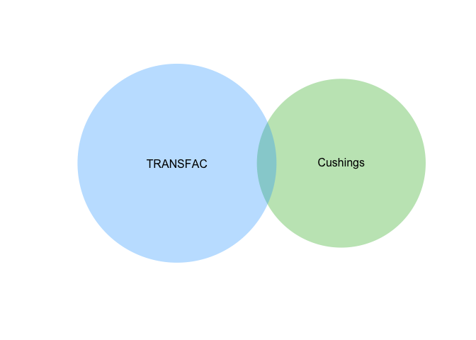
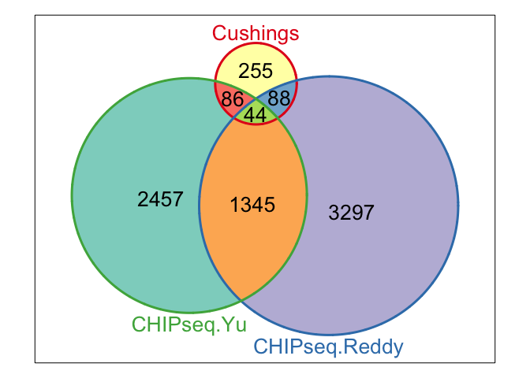

# Co-ordination Between Differentially Expressed Cushing's Genes and GRE Containing Genes
Innocence Harvey and Dave Bridges  
February 23, 2015  


There are datasets for genes which contain GRE's and datasets for genes which are associated with our Cushing's dataset.  We want to know which ones overlap, to get a sense of hich ones are direct targets.

# Data#


We used the data from our Cushing's patients found in the ../data/processed/Annotated Results GRCh37.74 - Cushing.csv file for our significant genes.  The data is obtained from the MSigDB collection for the following gene sets on Wed Mar 11 10:37:13 2015.  These data are saved in:

* **Predicted TFBS** from the TRANSFAC database.  ../data/raw/c3.tft.v4.0.symbols.gmt.
* **Experimental TFBS**  from the Reddy *et al.*.  ../data/processed/Annotated GR Peaks - Significantly Changed.csv.  See *gre_annotation.Rmd* to see how this file was generated from the raw data.


This is shown in the following venn diagram.  

 

There were 473 genes differentially expressed in our Cushing's patients adipose tissue, 664 genes with GRE's and 18 which overlapped. This much overlap is not significantly more than is expected (Fisher's Exact Test; p=0.5128475) based on the contingency table shown below:

<!-- html table generated in R 3.1.2 by xtable 1.7-4 package -->
<!-- Wed Mar 11 10:37:15 2015 -->
<table border=1>
<caption align="bottom"> Contingency table for overlap between GRE's and Cushing's Dependent Differentially Expressed Genes </caption>
<tr> <th>  </th> <th> GRE </th> <th> Total </th> <th> Percent </th>  </tr>
  <tr> <td align="right"> Cushings </td> <td align="right"> 18 </td> <td align="right"> 473 </td> <td align="right"> 3.81 </td> </tr>
  <tr> <td align="right"> Total </td> <td align="right"> 664 </td> <td align="right"> 20389 </td> <td align="right"> 3.26 </td> </tr>
   <a name=tab:overlap-contingency></a>
</table>

The differentially expressed genes which contain TRANSFAC GREs are YARS, LUC7L3, GBE1, RBM23, PDE2A, KCND2, TSSK3, SCARB2, LTBP3, EFNA1, DHX29, SEMA4C, ME1, HOXB3, PCBP4, GEN1, CPEB4, CPB1.

# Experimental Data
Based on the data in Reddy *et al.*, we identified 2976 genes associated with GR CHIP peaks in A549 cells.  We found that 86 of these genes overlapped with the Cushings's differentially expressed genes.  These genes are shown in the Tableand in Figure below. 

<!-- html table generated in R 3.1.2 by xtable 1.7-4 package -->
<!-- Wed Mar 11 10:37:15 2015 -->
<table border=1>
<caption align="bottom"> Table showing experimentally and computationally described GREs </caption>
<tr> <th>  </th> <th> CHIPseq </th> <th> TRANSFAC </th>  </tr>
  <tr> <td align="right"> 59 </td> <td> ACSL1 </td> <td> FALSE </td> </tr>
  <tr> <td align="right"> 60 </td> <td> ACSS1 </td> <td> FALSE </td> </tr>
  <tr> <td align="right"> 51 </td> <td> ACTR2 </td> <td> FALSE </td> </tr>
  <tr> <td align="right"> 68 </td> <td> ADAM9 </td> <td> FALSE </td> </tr>
  <tr> <td align="right"> 57 </td> <td> AGTR1 </td> <td> FALSE </td> </tr>
  <tr> <td align="right"> 25 </td> <td> AKAP10 </td> <td> FALSE </td> </tr>
  <tr> <td align="right"> 72 </td> <td> ALCAM </td> <td> FALSE </td> </tr>
  <tr> <td align="right"> 48 </td> <td> ANXA1 </td> <td> FALSE </td> </tr>
  <tr> <td align="right"> 53 </td> <td> AOX1 </td> <td> FALSE </td> </tr>
  <tr> <td align="right"> 4 </td> <td> AP2S1 </td> <td> FALSE </td> </tr>
  <tr> <td align="right"> 10 </td> <td> APBB1IP </td> <td> FALSE </td> </tr>
  <tr> <td align="right"> 69 </td> <td> AR </td> <td> FALSE </td> </tr>
  <tr> <td align="right"> 41 </td> <td> ARFGEF2 </td> <td> FALSE </td> </tr>
  <tr> <td align="right"> 50 </td> <td> ARHGEF4 </td> <td> FALSE </td> </tr>
  <tr> <td align="right"> 56 </td> <td> CAPN10 </td> <td> FALSE </td> </tr>
  <tr> <td align="right"> 26 </td> <td> CCND1 </td> <td> FALSE </td> </tr>
  <tr> <td align="right"> 24 </td> <td> CDK5RAP3 </td> <td> FALSE </td> </tr>
  <tr> <td align="right"> 83 </td> <td> CFD </td> <td> FALSE </td> </tr>
  <tr> <td align="right"> 74 </td> <td> CIDEA </td> <td> FALSE </td> </tr>
  <tr> <td align="right"> 66 </td> <td> CLMN </td> <td> FALSE </td> </tr>
  <tr> <td align="right"> 6 </td> <td> CLPTM1L </td> <td> FALSE </td> </tr>
  <tr> <td align="right"> 31 </td> <td> CPEB4 </td> <td> TRUE </td> </tr>
  <tr> <td align="right"> 18 </td> <td> CPPED1 </td> <td> FALSE </td> </tr>
  <tr> <td align="right"> 30 </td> <td> CSNK1A1 </td> <td> FALSE </td> </tr>
  <tr> <td align="right"> 1 </td> <td> CYTH3 </td> <td> FALSE </td> </tr>
  <tr> <td align="right"> 37 </td> <td> DHCR24 </td> <td> FALSE </td> </tr>
  <tr> <td align="right"> 16 </td> <td> E2F1 </td> <td> FALSE </td> </tr>
  <tr> <td align="right"> 44 </td> <td> EFR3A </td> <td> FALSE </td> </tr>
  <tr> <td align="right"> 85 </td> <td> F5 </td> <td> FALSE </td> </tr>
  <tr> <td align="right"> 70 </td> <td> FASN </td> <td> FALSE </td> </tr>
  <tr> <td align="right"> 78 </td> <td> GAS6 </td> <td> FALSE </td> </tr>
  <tr> <td align="right"> 22 </td> <td> GLTSCR2 </td> <td> FALSE </td> </tr>
  <tr> <td align="right"> 34 </td> <td> GNLY </td> <td> FALSE </td> </tr>
  <tr> <td align="right"> 62 </td> <td> GOLGA7B </td> <td> FALSE </td> </tr>
  <tr> <td align="right"> 8 </td> <td> GPC1 </td> <td> FALSE </td> </tr>
  <tr> <td align="right"> 77 </td> <td> GPIHBP1 </td> <td> FALSE </td> </tr>
  <tr> <td align="right"> 21 </td> <td> GSDMD </td> <td> FALSE </td> </tr>
  <tr> <td align="right"> 61 </td> <td> GTF3C6 </td> <td> FALSE </td> </tr>
  <tr> <td align="right"> 17 </td> <td> HAS3 </td> <td> FALSE </td> </tr>
  <tr> <td align="right"> 7 </td> <td> HDAC7 </td> <td> FALSE </td> </tr>
  <tr> <td align="right"> 40 </td> <td> ID3 </td> <td> FALSE </td> </tr>
  <tr> <td align="right"> 9 </td> <td> IDI1 </td> <td> FALSE </td> </tr>
  <tr> <td align="right"> 2 </td> <td> IL32 </td> <td> FALSE </td> </tr>
  <tr> <td align="right"> 49 </td> <td> ITM2C </td> <td> FALSE </td> </tr>
  <tr> <td align="right"> 75 </td> <td> KCMF1 </td> <td> FALSE </td> </tr>
  <tr> <td align="right"> 81 </td> <td> KPNA4 </td> <td> FALSE </td> </tr>
  <tr> <td align="right"> 20 </td> <td> LACTB </td> <td> FALSE </td> </tr>
  <tr> <td align="right"> 47 </td> <td> LDHA </td> <td> FALSE </td> </tr>
  <tr> <td align="right"> 27 </td> <td> LDHB </td> <td> FALSE </td> </tr>
  <tr> <td align="right"> 13 </td> <td> LEPREL1 </td> <td> FALSE </td> </tr>
  <tr> <td align="right"> 23 </td> <td> MEGF9 </td> <td> FALSE </td> </tr>
  <tr> <td align="right"> 67 </td> <td> MFAP4 </td> <td> FALSE </td> </tr>
  <tr> <td align="right"> 55 </td> <td> MFGE8 </td> <td> FALSE </td> </tr>
  <tr> <td align="right"> 82 </td> <td> MME </td> <td> FALSE </td> </tr>
  <tr> <td align="right"> 5 </td> <td> MRPS10 </td> <td> FALSE </td> </tr>
  <tr> <td align="right"> 14 </td> <td> NRCAM </td> <td> FALSE </td> </tr>
  <tr> <td align="right"> 65 </td> <td> NUDT5 </td> <td> FALSE </td> </tr>
  <tr> <td align="right"> 52 </td> <td> PLCE1 </td> <td> FALSE </td> </tr>
  <tr> <td align="right"> 15 </td> <td> PNPLA3 </td> <td> FALSE </td> </tr>
  <tr> <td align="right"> 3 </td> <td> PTBP1 </td> <td> FALSE </td> </tr>
  <tr> <td align="right"> 80 </td> <td> PTP4A3 </td> <td> FALSE </td> </tr>
  <tr> <td align="right"> 38 </td> <td> QSOX1 </td> <td> FALSE </td> </tr>
  <tr> <td align="right"> 11 </td> <td> RAPGEF3 </td> <td> FALSE </td> </tr>
  <tr> <td align="right"> 54 </td> <td> RASGEF1B </td> <td> FALSE </td> </tr>
  <tr> <td align="right"> 76 </td> <td> RGMA </td> <td> FALSE </td> </tr>
  <tr> <td align="right"> 39 </td> <td> RHOU </td> <td> FALSE </td> </tr>
  <tr> <td align="right"> 58 </td> <td> RSPO3 </td> <td> FALSE </td> </tr>
  <tr> <td align="right"> 79 </td> <td> SERHL2 </td> <td> FALSE </td> </tr>
  <tr> <td align="right"> 29 </td> <td> SLC12A7 </td> <td> FALSE </td> </tr>
  <tr> <td align="right"> 46 </td> <td> SLC39A11 </td> <td> FALSE </td> </tr>
  <tr> <td align="right"> 32 </td> <td> SLC41A3 </td> <td> FALSE </td> </tr>
  <tr> <td align="right"> 36 </td> <td> SOS1 </td> <td> FALSE </td> </tr>
  <tr> <td align="right"> 84 </td> <td> STK39 </td> <td> FALSE </td> </tr>
  <tr> <td align="right"> 19 </td> <td> SYT7 </td> <td> FALSE </td> </tr>
  <tr> <td align="right"> 33 </td> <td> TFCP2L1 </td> <td> FALSE </td> </tr>
  <tr> <td align="right"> 43 </td> <td> TMEM204 </td> <td> FALSE </td> </tr>
  <tr> <td align="right"> 28 </td> <td> TMEM30A </td> <td> FALSE </td> </tr>
  <tr> <td align="right"> 12 </td> <td> TNPO1 </td> <td> FALSE </td> </tr>
  <tr> <td align="right"> 64 </td> <td> TPCN2 </td> <td> FALSE </td> </tr>
  <tr> <td align="right"> 35 </td> <td> TPO </td> <td> FALSE </td> </tr>
  <tr> <td align="right"> 42 </td> <td> TUBGCP6 </td> <td> FALSE </td> </tr>
  <tr> <td align="right"> 71 </td> <td> UGP2 </td> <td> FALSE </td> </tr>
  <tr> <td align="right"> 73 </td> <td> USP47 </td> <td> FALSE </td> </tr>
  <tr> <td align="right"> 86 </td> <td> VDAC1 </td> <td> FALSE </td> </tr>
  <tr> <td align="right"> 45 </td> <td> ZBED3 </td> <td> FALSE </td> </tr>
  <tr> <td align="right"> 63 </td> <td> ZBTB7B </td> <td> FALSE </td> </tr>
   </table>


There were 473 genes differentially expressed in our Cushing's patients adipose tissue, 2976 genes with CHIPseq peaks and 86 which overlapped. This much overlap is not significantly more than is expected (Fisher's Exact Test; p=0.0724935) based on the contingency table shown below:

<!-- html table generated in R 3.1.2 by xtable 1.7-4 package -->
<!-- Wed Mar 11 10:37:15 2015 -->
<table border=1>
<caption align="bottom"> Contingency table for overlap between CHIPseq peaks and Cushing's Dependent Differentially Expressed Genes </caption>
<tr> <th>  </th> <th> GRE </th> <th> Total </th> <th> Percent </th>  </tr>
  <tr> <td align="right"> Cushings </td> <td align="right"> 86 </td> <td align="right"> 473 </td> <td align="right"> 18.18 </td> </tr>
  <tr> <td align="right"> Total </td> <td align="right"> 2976 </td> <td align="right"> 20389 </td> <td align="right"> 14.60 </td> </tr>
   <a name=tab:overlap-contingency></a>
</table>

 


# Session Information

```
## R version 3.1.2 (2014-10-31)
## Platform: x86_64-apple-darwin13.4.0 (64-bit)
## 
## locale:
## [1] en_US.UTF-8/en_US.UTF-8/en_US.UTF-8/C/en_US.UTF-8/en_US.UTF-8
## 
## attached base packages:
## [1] grid      stats     graphics  grDevices utils     datasets  methods  
## [8] base     
## 
## other attached packages:
##  [1] Vennerable_3.0     gtools_3.4.1       reshape_0.8.5     
##  [4] RColorBrewer_1.1-2 lattice_0.20-29    RBGL_1.40.1       
##  [7] graph_1.42.0       xtable_1.7-4       venneuler_1.1-0   
## [10] rJava_0.9-6        stringr_0.6.2      knitr_1.9         
## 
## loaded via a namespace (and not attached):
##  [1] BiocGenerics_0.10.0 digest_0.6.8        evaluate_0.5.5     
##  [4] formatR_1.0         htmltools_0.2.6     parallel_3.1.2     
##  [7] plyr_1.8.1          Rcpp_0.11.4         rmarkdown_0.5.1    
## [10] stats4_3.1.2        tools_3.1.2         yaml_2.1.13
```
