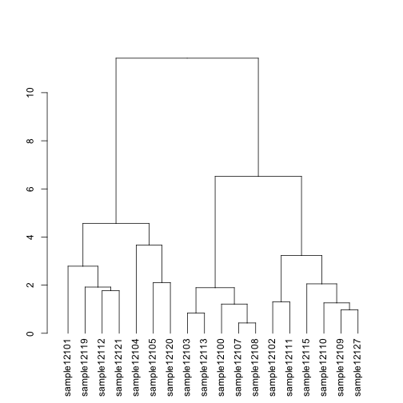

Analysis of Data for Acromegaly Patients by Heatmaps
=============================================================

Statistics
----------


```
## Loading required package: knitcitations
## Loading required package: bibtex
## 
## Attaching package: 'knitcitations'
## 
## The following object is masked from 'package:utils':
## 
##     cite
```

This file was most recently processed on ``Sun Jan 19 10:13:37 2014``.  This uses the DESeq normalized data.


Differentially Expressed Genes
----------------------------------

To test the grouping of differentially expressed transcripts, we only examined genes with significantly different transcripts based on DESeq analysis.


```
## KernSmooth 2.23 loaded
## Copyright M. P. Wand 1997-2009
## 
## Attaching package: 'gplots'
## 
## The following object is masked from 'package:stats':
## 
##     lowess
```

  

```
## pdf 
##   2
```


References
-----------


Session Information
-------------------

```r
sessionInfo()
```

```
## R version 3.0.2 (2013-09-25)
## Platform: x86_64-apple-darwin10.8.0 (64-bit)
## 
## locale:
## [1] en_US.UTF-8/en_US.UTF-8/en_US.UTF-8/C/en_US.UTF-8/en_US.UTF-8
## 
## attached base packages:
## [1] stats     graphics  grDevices utils     datasets  methods   base     
## 
## other attached packages:
## [1] RColorBrewer_1.0-5  gplots_2.12.1       knitcitations_0.5-0
## [4] bibtex_0.3-6        knitr_1.5          
## 
## loaded via a namespace (and not attached):
##  [1] bitops_1.0-6       caTools_1.16       digest_0.6.4      
##  [4] evaluate_0.5.1     formatR_0.10       gdata_2.13.2      
##  [7] gtools_3.1.1       httr_0.2           KernSmooth_2.23-10
## [10] RCurl_1.95-4.1     stringr_0.6.2      tools_3.0.2       
## [13] XML_3.95-0.2       xtable_1.7-1
```

