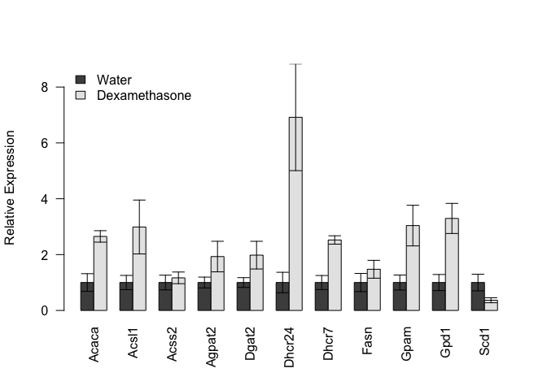
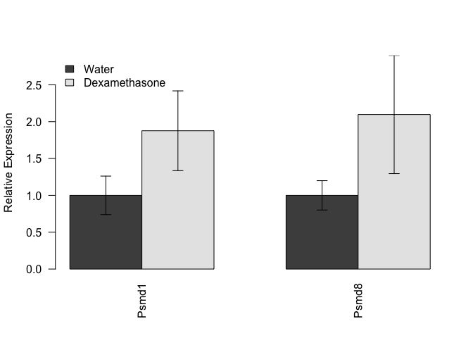
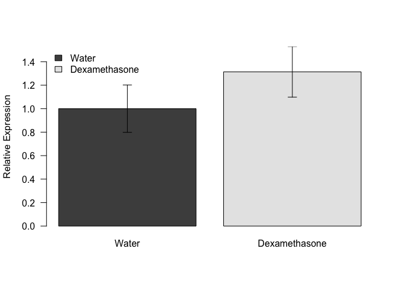

# Analysis of iWAT mRNA Transcripts
Innocence Harvey and Dave Bridges  
February 25, 2015  


# Data Entry


Data was read from the file ../data/raw/iWAT qPCR Summary.csv.  These data were most recently updated on Wed Feb 25 18:05:48 2015.

#Analysis


## Lipogenic Genes

 

# Proteasome Genes

 

# TCA Cycle Genes
 

# Glucocorticoid Receptor
 

# Session Information

```
## R version 3.1.2 (2014-10-31)
## Platform: x86_64-apple-darwin13.4.0 (64-bit)
## 
## locale:
## [1] en_US.UTF-8/en_US.UTF-8/en_US.UTF-8/C/en_US.UTF-8/en_US.UTF-8
## 
## attached base packages:
## [1] stats     graphics  grDevices utils     datasets  methods   base     
## 
## other attached packages:
## [1] reshape2_1.4.1 dplyr_0.4.1    knitr_1.9     
## 
## loaded via a namespace (and not attached):
##  [1] assertthat_0.1  DBI_0.3.1       digest_0.6.8    evaluate_0.5.5 
##  [5] formatR_1.0     htmltools_0.2.6 lazyeval_0.1.10 magrittr_1.5   
##  [9] parallel_3.1.2  plyr_1.8.1      Rcpp_0.11.4     rmarkdown_0.5.1
## [13] stringr_0.6.2   tools_3.1.2     yaml_2.1.13
```
