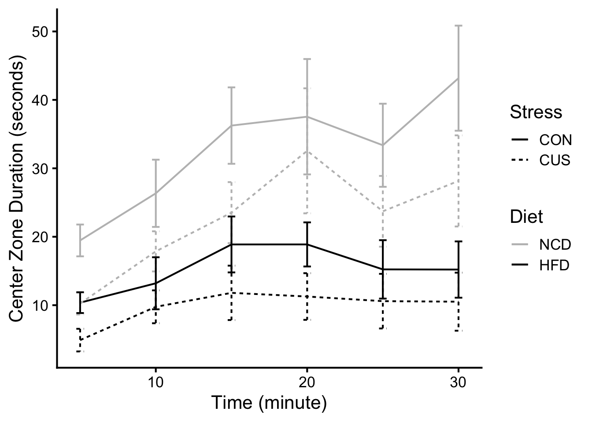
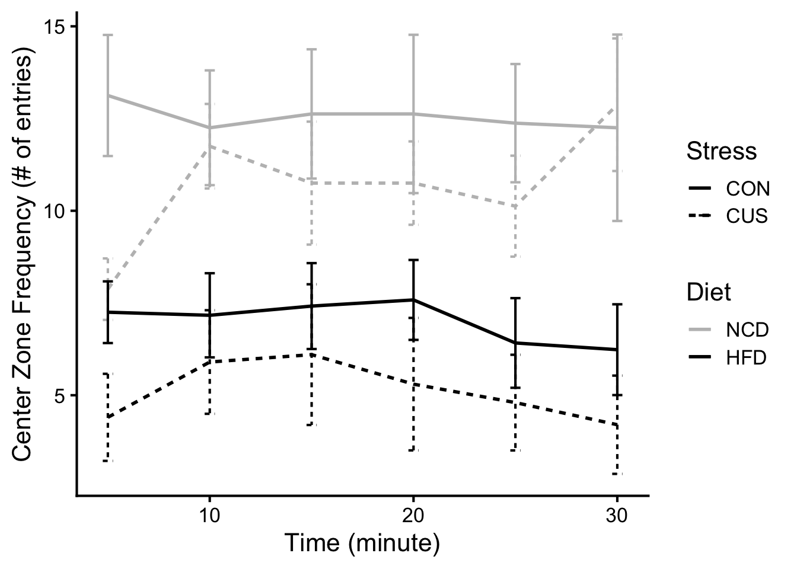
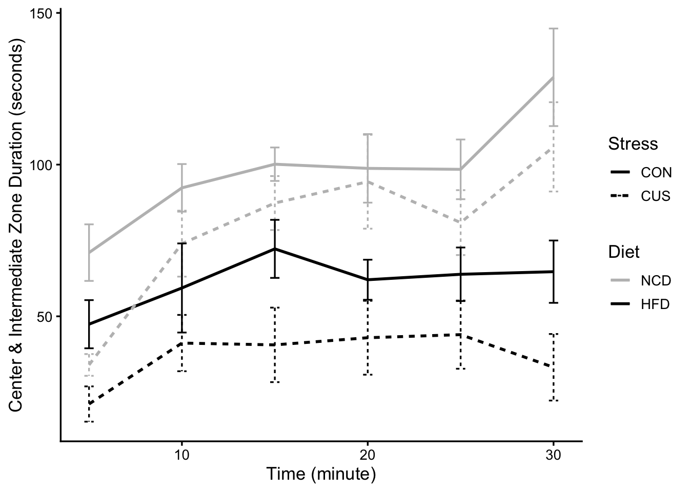
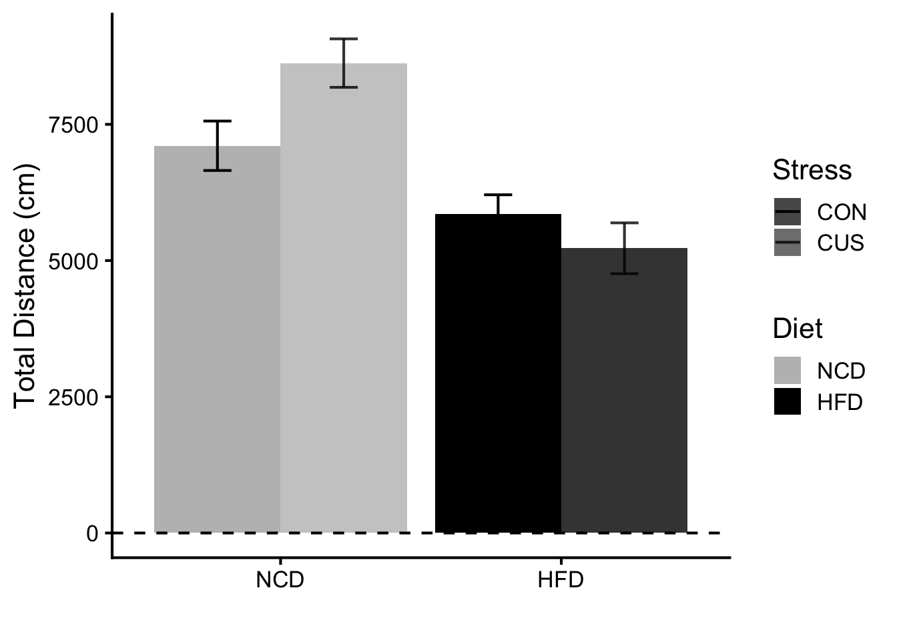
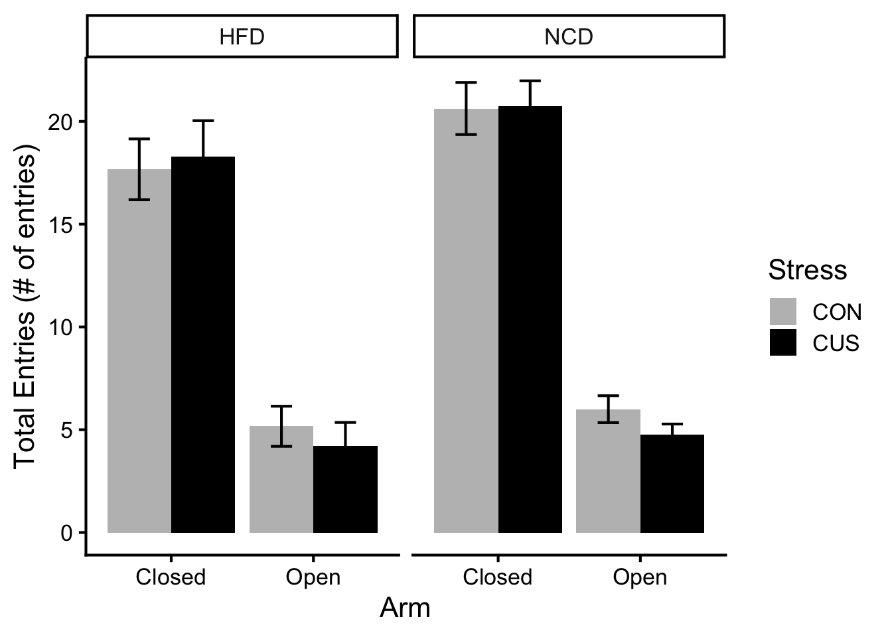
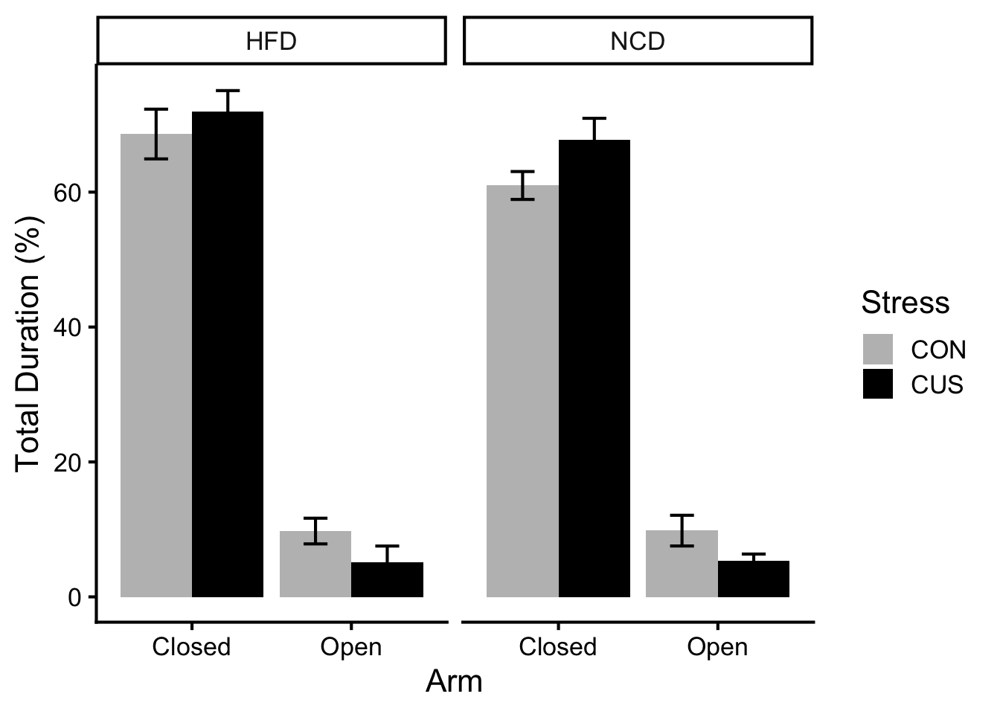
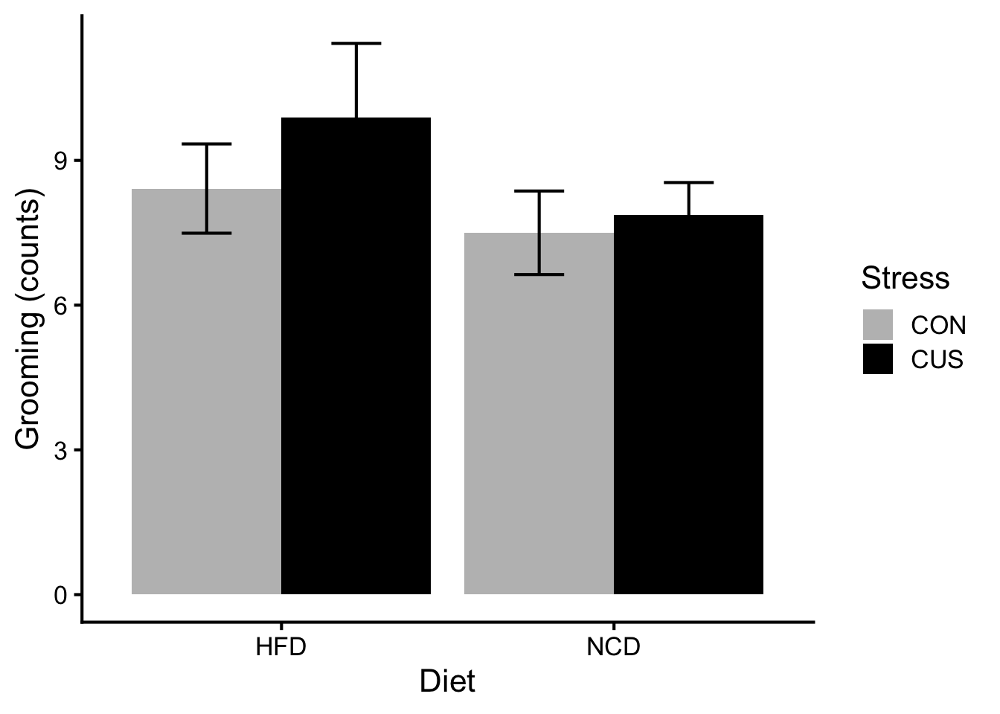
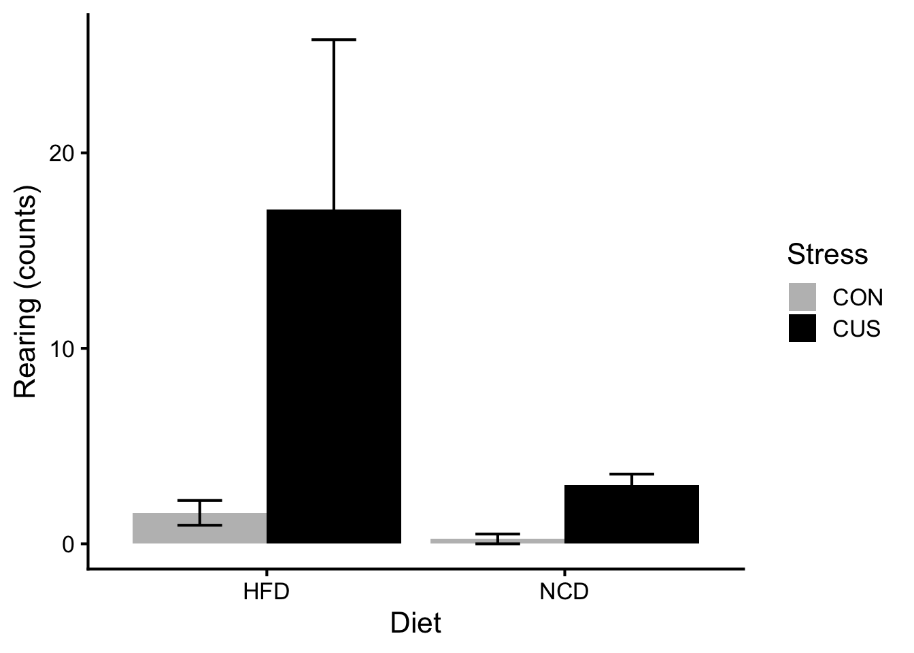

::: {.cell}

```{.r .cell-code}
# hide this code chunk
#| echo: false
#| message: false

# defines the se function
se <- function(x) {
  sd(x, na.rm = TRUE) / sqrt(length(x))
}

#load these packages, nearly always needed
library(tidyverse)
```
:::


## Purpose

The purpose of this experiment is to quantify the differences of physiological, metabolic, and psychological responses in lean and obese mice, under stressed and unstressed conditions.

## Experimental Details

\[Link to the protocol used (permalink preferred) for the experiment and include any notes relevant to your analysis. This might include specifics not in the general protocol such as cell lines, treatment doses etc.\]

High-fat diet (D12492) formula: https://researchdiets.com/formulas/d12492

## Raw Data

\[Describe your raw data files, including what the columns mean (and what units they are in).\]


::: {.cell}

```{.r .cell-code}
library(readxl) #loads the readr package
filename <- "raw data/Data Collection Sheet.xlsx" #input file(s)

#this loads whatever the file is into a dataframe called exp.data if it exists

property <- read_excel(filename, sheet = "Property") |>
  mutate(Diet = factor(Diet, levels = c("NCD", "HFD")), #relevel diet so NCD is the reference
         Stress = factor(Stress, levels = c("CON", "CUS"))) #relevel stress so CON is the reference

hfd_oft_file <- "raw data/Behavioral Tests/2025-06-25 Dave Bridges_Tiange Bu_16 HFD Mice Open Field Test_ssf.xlsx" 
hfd_epm_file <- "raw data/Behavioral Tests/2025-06-26 Dave Bridges_Tiange Bu_16 HFD _Mice EPM Test_ssf.xlsx"

hfd.oft.center <- read_excel(hfd_oft_file, sheet = "Center Zone", skip = 21) |>
  rename(Group = `...1`, Animal = `...2`, SexDOB = `...3`, Code = `...4`, T1_Duration = `Duration...5`, T1_Frequency = `Frequency...6`, T2_Duration = `Duration...7`, T2_Frequency = `Frequency...8`, T3_Duration = `Duration...9`, T3_Frequency = `Frequency...10`, T4_Duration = `Duration...11`, T4_Frequency = `Frequency...12`, T5_Duration = `Duration...13`, T5_Frequency = `Frequency...14`, T6_Duration = `Duration...15`, T6_Frequency = `Frequency...16`, Total_Duration = `Duration...17`, Total_Frequency = `Frequency...18`) |>
  filter(Code != "ID") |> #removes the repeated header rows
  filter(!is.na(Animal)) |> #removes the rows with no animal ID
  mutate(`Mouse Groups` = case_when(Group == "Group 1" ~ "HFD CON", Group == "Group 2" ~ "HFD CUS")) |>
  fill(`Mouse Groups`, .direction = "down") |>
  separate(`Mouse Groups`, into = c("Diet", "Stress"), sep = " ") 

hfd.oft.intermediate <- read_excel(hfd_oft_file, sheet = "Intermediate Zone") |>
  rename(Group = `...1`, Animal = `...2`, SexDOB = `...3`, Code = `...4`, T1_Duration = `00:00-05:00`, T1_Frequency = `...6`, T2_Duration = `05:01-10:00`, T2_Frequency = `...8`, T3_Duration = `10:01-15:00`, T3_Frequency = `...10`, T4_Duration = `15:01-20:00`, T4_Frequency = `...12`, T5_Duration = `20:01-25:00`, T5_Frequency = `...14`, T6_Duration = `25:01-30:00`, T6_Frequency = `...16`, Total_Duration = `Total`, Total_Frequency = `...18`) |>
  filter(Code != "ID") |>
  filter(!is.na(Animal)) |>
  mutate(`Mouse Groups` = case_when(Group == "Group 1" ~ "HFD CON", Group == "Group 2" ~ "HFD CUS")) |>
  fill(`Mouse Groups`, .direction = "down") |>
  separate(`Mouse Groups`, into = c("Diet", "Stress"), sep = " ")

hfd.oft.outer <- read_excel(hfd_oft_file, sheet = "Outer Zone") |>
  rename(Group = `...1`, Animal = `...2`, SexDOB = `...3`, Code = `...4`, T1_Duration = `00:00-05:00`, T1_Frequency = `...6`, T2_Duration = `05:01-10:00`, T2_Frequency = `...8`, T3_Duration = `10:01-15:00`, T3_Frequency = `...10`, T4_Duration = `15:01-20:00`, T4_Frequency = `...12`, T5_Duration = `20:01-25:00`, T5_Frequency = `...14`, T6_Duration = `25:01-30:00`, T6_Frequency = `...16`, Total_Duration = `Total`, Total_Frequency = `...18`) |>
  filter(Code != "ID") |>
  filter(!is.na(Animal)) |>
  mutate(`Mouse Groups` = case_when(Group == "Group 1" ~ "HFD CON", Group == "Group 2" ~ "HFD CUS")) |>
  fill(`Mouse Groups`, .direction = "down") |>
  separate(`Mouse Groups`, into = c("Diet", "Stress"), sep = " ")

hfd.oft.movement <- read_excel(hfd_oft_file, sheet = "Movement") |>
  rename(Group = `...1`, Animal = `...2`, SexDOB = `...3`, Code = `...4`, T1_Moving = `00:00-05:00`, T1_Not = `...6`, T2_Moving = `05:01-10:00`, T2_Not = `...8`, T3_Moving = `10:01-15:00`, T3_Not = `...10`, T4_Moving = `15:01-20:00`, T4_Not = `...12`, T5_Moving = `20:01-25:00`, T5_Not = `...14`, T6_Moving = `25:01-30:00`, T6_Not = `...16`, Total_Moving = `Total (Average)`, Total_Not = `...18`) |>
  filter(Code != "ID") |>
  filter(!is.na(Animal)) |>
  mutate(`Mouse Groups` = case_when(Group == "Group 1" ~ "HFD CON", Group == "Group 2" ~ "HFD CUS")) |>
  fill(`Mouse Groups`, .direction = "down") |>
  separate(`Mouse Groups`, into = c("Diet", "Stress"), sep = " ")

hfd.oft.dis.vel <- read_excel(hfd_oft_file, sheet = "Distance & Velocity") |>
  rename(Group = `...1`, Animal = `...2`, SexDOB = `...3`, Code = `...4`, T1_Distance = `00:00-05:00`, T1_Velocity = `...6`, T2_Distance = `05:01-10:00`, T2_Velocity = `...8`, T3_Distance = `10:01-15:00`, T3_Velocity = `...10`, T4_Distance = `15:01-20:00`, T4_Velocity = `...12`, T5_Distance = `20:01-25:00`, T5_Velocity = `...14`, T6_Distance = `25:01-30:00`, T6_Velocity = `...16`, Total_Distance = `Total`, Total_Velocity = `...18`) |>
  filter(Code != "ID") |>
  filter(!is.na(Animal)) |>
  mutate(`Mouse Groups` = case_when(Group == "Group 1" ~ "HFD CON", Group == "Group 2" ~ "HFD CUS")) |>
  fill(`Mouse Groups`, .direction = "down") |>
  separate(`Mouse Groups`, into = c("Diet", "Stress"), sep = " ")

hfd.epm <- read_excel(hfd_epm_file, sheet = "EPM data", skip = 34) |>
  rename(Group = `Elevated Plus Maze:`, Animal = `...2`, SexDOB = `...3`, Code = `2025-06-26 ~09-11, 10:00AM`, Weight = `...5`, Distance = `...6`, Entries_Open_East = `...7`, Duration_Open_East = `...8`, Entries_Open_West = `...9`, Duration_Open_West = `...10`, Entries_Closed_South = `...11`, Duration_Closed_South = `...12`, Entries_Closed_North = `...13`, Duration_Closed_North = `...14`, Entries_Center_Total = `...15`, Entries_Open_Total = `...16`, Entries_Closed_Total = `...17`, Duration_Center_Total = `...18`, Duration_Open_Total = `...19`, Duration_Closed_Total = `...20`, Fecal_Center = `...21`, Fecal_Closed = `...22`, Fecal_Open = `...23`, Grooming = `...24`, Rearing = `...25`) |>
  filter(Code != "ID") |>
  filter(!is.na(Animal)) |>
  mutate(`Mouse Groups` = case_when(Group == "Group 1" ~ "HFD CON", Group == "Group 2" ~ "HFD CUS")) |>
  fill(`Mouse Groups`, .direction = "down") |>
  separate(`Mouse Groups`, into = c("Diet", "Stress"), sep = " ")

ncd_oft_file <- "raw data/Behavioral Tests/2025-08-13 Dave Bridges_Tiange Bu_16 NCD Mice Open Field Test_ssf .xlsx"
ncd_epm_file <- "raw data/Behavioral Tests/2025-08-14 Dave Bridges_Tiange Bu_16 NCD_Mice EPM Test_ssf.xlsx"

ncd.oft.center <- read_excel(ncd_oft_file, sheet = "Center Zone", skip = 21) |>
  rename(Group = `...1`, Animal = `...2`, SexDOB = `...3`, Code = `...4`, T1_Duration = `Duration...5`, T1_Frequency = `Frequency...6`, T2_Duration = `Duration...7`, T2_Frequency = `Frequency...8`, T3_Duration = `Duration...9`, T3_Frequency = `Frequency...10`, T4_Duration = `Duration...11`, T4_Frequency = `Frequency...12`, T5_Duration = `Duration...13`, T5_Frequency = `Frequency...14`, T6_Duration = `Duration...15`, T6_Frequency = `Frequency...16`, Total_Duration = `Duration...17`, Total_Frequency = `Frequency...18`) |> 
  filter(Code != "ID") |> #removes the repeated header rows
  filter(!is.na(Animal)) |> #removes the rows with no animal ID
  mutate(`Mouse Groups` = case_when(Group == "Group 1" ~ "NCD CON", Group == "Group 2" ~ "NCD CUS")) |>
  fill(`Mouse Groups`, .direction = "down") |>
  separate(`Mouse Groups`, into = c("Diet", "Stress"), sep = " ") 

ncd.oft.intermediate <- read_excel(ncd_oft_file, sheet = "Intermediate Zone") |>
  rename(Group = `...1`, Animal = `...2`, SexDOB = `...3`, Code = `...4`, T1_Duration = `00:00-05:00`, T1_Frequency = `...6`, T2_Duration = `05:01-10:00`, T2_Frequency = `...8`, T3_Duration = `10:01-15:00`, T3_Frequency = `...10`, T4_Duration = `15:01-20:00`, T4_Frequency = `...12`, T5_Duration = `20:01-25:00`, T5_Frequency = `...14`, T6_Duration = `25:01-30:00`, T6_Frequency = `...16`, Total_Duration = `Total`, Total_Frequency = `...18`) |>
  filter(Code != "ID") |>
  filter(!is.na(Animal)) |>
  mutate(`Mouse Groups` = case_when(Group == "Group 1" ~ "NCD CON", Group == "Group 2" ~ "NCD CUS")) |>
  fill(`Mouse Groups`, .direction = "down") |>
  separate(`Mouse Groups`, into = c("Diet", "Stress"), sep = " ")

ncd.oft.outer <- read_excel(ncd_oft_file, sheet = "Outer Zone") |>
  rename(Group = `...1`, Animal = `...2`, SexDOB = `...3`, Code = `...4`, T1_Duration = `00:00-05:00`, T1_Frequency = `...6`, T2_Duration = `05:01-10:00`, T2_Frequency = `...8`, T3_Duration = `10:01-15:00`, T3_Frequency = `...10`, T4_Duration = `15:01-20:00`, T4_Frequency = `...12`, T5_Duration = `20:01-25:00`, T5_Frequency = `...14`, T6_Duration = `25:01-30:00`, T6_Frequency = `...16`, Total_Duration = `Total`, Total_Frequency = `...18`) |>
  filter(Code != "ID") |>
  filter(!is.na(Animal)) |>
  mutate(`Mouse Groups` = case_when(Group == "Group 1" ~ "NCD CON", Group == "Group 2" ~ "NCD CUS")) |>
  fill(`Mouse Groups`, .direction = "down") |>
  separate(`Mouse Groups`, into = c("Diet", "Stress"), sep = " ")

ncd.oft.movement <- read_excel(ncd_oft_file, sheet = "Movement") |>
  rename(Group = `...1`, Animal = `...2`, SexDOB = `...3`, Code = `...4`, T1_Moving = `00:00-05:00`, T1_Not = `...6`, T2_Moving = `05:01-10:00`, T2_Not = `...8`, T3_Moving = `10:01-15:00`, T3_Not = `...10`, T4_Moving = `15:01-20:00`, T4_Not = `...12`, T5_Moving = `20:01-25:00`, T5_Not = `...14`, T6_Moving = `25:01-30:00`, T6_Not = `...16`, Total_Moving = `Total (Average)`, Total_Not = `...18`) |>
  filter(Code != "ID") |>
  filter(!is.na(Animal)) |>
  mutate(`Mouse Groups` = case_when(Group == "Group 1" ~ "NCD CON", Group == "Group 2" ~ "NCD CUS")) |>
  fill(`Mouse Groups`, .direction = "down") |>
  separate(`Mouse Groups`, into = c("Diet", "Stress"), sep = " ")

ncd.oft.dis.vel <- read_excel(ncd_oft_file, sheet = "Distance & Velocity") |>
  rename(Group = `...1`, Animal = `...2`, SexDOB = `...3`, Code = `...4`, T1_Distance = `00:00-05:00`, T1_Velocity = `...6`, T2_Distance = `05:01-10:00`, T2_Velocity = `...8`, T3_Distance = `10:01-15:00`, T3_Velocity = `...10`, T4_Distance = `15:01-20:00`, T4_Velocity = `...12`, T5_Distance = `20:01-25:00`, T5_Velocity = `...14`, T6_Distance = `25:01-30:00`, T6_Velocity = `...16`, Total_Distance = `Total`, Total_Velocity = `...18`) |>
  filter(Code != "ID") |>
  filter(!is.na(Animal)) |>
  mutate(`Mouse Groups` = case_when(Group == "Group 1" ~ "NCD CON", Group == "Group 2" ~ "NCD CUS")) |>
  fill(`Mouse Groups`, .direction = "down") |>
  separate(`Mouse Groups`, into = c("Diet", "Stress"), sep = " ")

ncd.epm <- read_excel(ncd_epm_file, sheet = "EPM data", skip = 34) |>
  rename(Group = `Elevated Plus Maze:`, Animal = `...2`, SexDOB = `...3`, Code = `2025-06-26 ~09-11, 10:00AM`, Weight = `...5`, Distance = `...6`, Entries_Open_East = `...7`, Duration_Open_East = `...8`, Entries_Open_West = `...9`, Duration_Open_West = `...10`, Entries_Closed_South = `...11`, Duration_Closed_South = `...12`, Entries_Closed_North = `...13`, Duration_Closed_North = `...14`, Entries_Center_Total = `...15`, Entries_Open_Total = `...16`, Entries_Closed_Total = `...17`, Duration_Center_Total = `...18`, Duration_Open_Total = `...19`, Duration_Closed_Total = `...20`, Fecal_Center = `...21`, Fecal_Closed = `...22`, Fecal_Open = `...23`, Grooming = `...24`, Rearing = `...25`) |>
  filter(Code != "ID") |>
  filter(!is.na(Animal)) |>
  mutate(`Mouse Groups` = case_when(Group == "Group 1" ~ "NCD CON", Group == "Group 2" ~ "NCD CUS")) |>
  fill(`Mouse Groups`, .direction = "down") |>
  separate(`Mouse Groups`, into = c("Diet", "Stress"), sep = " ")

hfd_oft_file_mu <- "raw data/Behavioral Tests/2025-10-22 Dave Bridges_Tiange Bu_16 HFD Mice Open Field Test_ssf.xlsx" 
hfd_epm_file_mu <- "raw data/Behavioral Tests/2025-10-23 Dave Bridges_Tiange Bu_16 HFD _Mice EPM Test_ssf.xlsx"

hfd.oft.center.mu <- read_excel(hfd_oft_file_mu, sheet = "Center Zone", skip = 21) |>
  rename(Group = `...1`, Animal = `...2`, SexDOB = `...3`, Code = `...4`, T1_Duration = `Duration...5`, T1_Frequency = `Frequency...6`, T2_Duration = `Duration...7`, T2_Frequency = `Frequency...8`, T3_Duration = `Duration...9`, T3_Frequency = `Frequency...10`, T4_Duration = `Duration...11`, T4_Frequency = `Frequency...12`, T5_Duration = `Duration...13`, T5_Frequency = `Frequency...14`, T6_Duration = `Duration...15`, T6_Frequency = `Frequency...16`, Total_Duration = `Duration...17`, Total_Frequency = `Frequency...18`) |> 
  filter(Code != "ID") |> #removes the repeated header rows
  filter(!is.na(Animal)) |> #removes the rows with no animal ID
  mutate(`Mouse Groups` = case_when(Group == "Group 1" ~ "HFD CON", Group == "Group 2" ~ "HFD CUS")) |>
  fill(`Mouse Groups`, .direction = "down") |>
  separate(`Mouse Groups`, into = c("Diet", "Stress"), sep = " ") 

hfd.oft.intermediate.mu <- read_excel(hfd_oft_file_mu, sheet = "Intermediate Zone") |>
  rename(Group = `...1`, Animal = `...2`, SexDOB = `...3`, Code = `...4`, T1_Duration = `00:00-05:00`, T1_Frequency = `...6`, T2_Duration = `05:01-10:00`, T2_Frequency = `...8`, T3_Duration = `10:01-15:00`, T3_Frequency = `...10`, T4_Duration = `15:01-20:00`, T4_Frequency = `...12`, T5_Duration = `20:01-25:00`, T5_Frequency = `...14`, T6_Duration = `25:01-30:00`, T6_Frequency = `...16`, Total_Duration = `Total`, Total_Frequency = `...18`) |>
  filter(Code != "ID") |>
  filter(!is.na(Animal)) |>
  mutate(`Mouse Groups` = case_when(Group == "Group 1" ~ "HFD CON", Group == "Group 2" ~ "HFD CUS")) |>
  fill(`Mouse Groups`, .direction = "down") |>
  separate(`Mouse Groups`, into = c("Diet", "Stress"), sep = " ")

hfd.oft.outer.mu <- read_excel(hfd_oft_file_mu, sheet = "Outer Zone") |>
  rename(Group = `...1`, Animal = `...2`, SexDOB = `...3`, Code = `...4`, T1_Duration = `00:00-05:00`, T1_Frequency = `...6`, T2_Duration = `05:01-10:00`, T2_Frequency = `...8`, T3_Duration = `10:01-15:00`, T3_Frequency = `...10`, T4_Duration = `15:01-20:00`, T4_Frequency = `...12`, T5_Duration = `20:01-25:00`, T5_Frequency = `...14`, T6_Duration = `25:01-30:00`, T6_Frequency = `...16`, Total_Duration = `Total`, Total_Frequency = `...18`) |>
  filter(Code != "ID") |>
  filter(!is.na(Animal)) |>
  mutate(`Mouse Groups` = case_when(Group == "Group 1" ~ "HFD CON", Group == "Group 2" ~ "HFD CUS")) |>
  fill(`Mouse Groups`, .direction = "down") |>
  separate(`Mouse Groups`, into = c("Diet", "Stress"), sep = " ")

hfd.oft.movement.mu <- read_excel(hfd_oft_file_mu, sheet = "Movement") |>
  rename(Group = `...1`, Animal = `...2`, SexDOB = `...3`, Code = `...4`, T1_Moving = `00:00-05:00`, T1_Not = `...6`, T2_Moving = `05:01-10:00`, T2_Not = `...8`, T3_Moving = `10:01-15:00`, T3_Not = `...10`, T4_Moving = `15:01-20:00`, T4_Not = `...12`, T5_Moving = `20:01-25:00`, T5_Not = `...14`, T6_Moving = `25:01-30:00`, T6_Not = `...16`, Total_Moving = `Total (Average)`, Total_Not = `...18`) |>
  filter(Code != "ID") |>
  filter(!is.na(Animal)) |>
  mutate(`Mouse Groups` = case_when(Group == "Group 1" ~ "HFD CON", Group == "Group 2" ~ "HFD CUS")) |>
  fill(`Mouse Groups`, .direction = "down") |>
  separate(`Mouse Groups`, into = c("Diet", "Stress"), sep = " ")

hfd.oft.dis.vel.mu <- read_excel(hfd_oft_file_mu, sheet = "Distance & Velocity") |>
  rename(Group = `...1`, Animal = `...2`, SexDOB = `...3`, Code = `...4`, T1_Distance = `00:00-05:00`, T1_Velocity = `...6`, T2_Distance = `05:01-10:00`, T2_Velocity = `...8`, T3_Distance = `10:01-15:00`, T3_Velocity = `...10`, T4_Distance = `15:01-20:00`, T4_Velocity = `...12`, T5_Distance = `20:01-25:00`, T5_Velocity = `...14`, T6_Distance = `25:01-30:00`, T6_Velocity = `...16`, Total_Distance = `Total`, Total_Velocity = `...18`) |>
  filter(Code != "ID") |>
  filter(!is.na(Animal)) |>
  mutate(`Mouse Groups` = case_when(Group == "Group 1" ~ "HFD CON", Group == "Group 2" ~ "HFD CUS")) |>
  fill(`Mouse Groups`, .direction = "down") |>
  separate(`Mouse Groups`, into = c("Diet", "Stress"), sep = " ")

hfd.epm.mu <- read_excel(hfd_epm_file_mu, sheet = "EPM data", skip = 34) |> 
  rename(Group = `Elevated Plus Maze:`, Animal = `...2`, SexDOB = `...3`, Code = `2025-10-22 ~11-6, 10:00AM`, Weight = `...5`, Distance = `...6`, Entries_Open_East = `...7`, Duration_Open_East = `...8`, Entries_Open_West = `...9`, Duration_Open_West = `...10`, Entries_Closed_South = `...11`, Duration_Closed_South = `...12`, Entries_Closed_North = `...13`, Duration_Closed_North = `...14`, Entries_Center_Total = `...15`, Entries_Open_Total = `...16`, Entries_Closed_Total = `...17`, Duration_Center_Total = `...18`, Duration_Open_Total = `...19`, Duration_Closed_Total = `...20`, Fecal_Center = `...21`, Fecal_Closed = `...22`, Fecal_Open = `...23`, Grooming = `...24`, Rearing = `...25`) |>
  filter(Code != "ID") |>
  filter(!is.na(Animal)) |>
  mutate(`Mouse Groups` = case_when(Group == "Group 1" ~ "HFD CON", Group == "Group 2" ~ "HFD CUS")) |>
  fill(`Mouse Groups`, .direction = "down") |>
  separate(`Mouse Groups`, into = c("Diet", "Stress"), sep = " ")

oft.center <- bind_rows(hfd.oft.center, ncd.oft.center, hfd.oft.center.mu)
oft.intermediate <- bind_rows(hfd.oft.intermediate, ncd.oft.intermediate, hfd.oft.intermediate.mu)
oft.outer <- bind_rows(hfd.oft.outer, ncd.oft.outer, hfd.oft.outer.mu)
oft.movement <- bind_rows(hfd.oft.movement, ncd.oft.movement, hfd.oft.movement.mu)
oft.dis.vel <- bind_rows(hfd.oft.dis.vel, ncd.oft.dis.vel, hfd.oft.dis.vel.mu)
epm <- bind_rows(hfd.epm, ncd.epm, hfd.epm.mu)

library(lme4)
library(lmerTest)
library(knitr)
library(broom)
library(broom.mixed)
library(performance)
library(see)
library(emmeans)
```
:::


## Analysis

\[Describe the analysis as you intersperse code chunks\]

### Open Field Test (OFT)

#### Center Zone


::: {.cell}

```{.r .cell-code}
oft.center.filtered <- oft.center |>
  dplyr::select(-Group, -Animal) |>
  group_by(SexDOB, Code, Diet, Stress) |>
  pivot_longer(cols = starts_with("T"), names_to = c("Time", "Measurement"), names_sep = "_") |>
  mutate(value = as.numeric(`value`)) |> 
  mutate(value = ifelse(Measurement == "Duration", value * 0.01 * 5 * 60, value)) |> #Convert Duration to seconds
  mutate(time = case_when(Time == "T1" ~ 5,
                          Time == "T2" ~ 10,
                          Time == "T3" ~ 15,
                          Time == "T4" ~ 20,
                          Time == "T5" ~ 25,
                          Time == "T6" ~ 30,
                          Time == "Total" ~ NA)) |>
  mutate(Diet = factor(Diet, levels = c("NCD", "HFD")))

oft.center.average.dur <- oft.center.filtered |>
  group_by(Diet, Stress, time, Measurement) |> 
  filter(time != "Total") |>
  filter(Measurement == "Duration") |>
  summarise(Average = mean(`value`, na.rm = TRUE),
            SE = se(`value`))

ggplot(oft.center.average.dur, aes(x = time, 
                               y = Average, 
                               ymin = Average - SE, 
                               ymax = Average + SE, 
                               lty = Stress, 
                               color = Diet, 
                               group = interaction(Diet, Stress))) +
  geom_line() +
  geom_errorbar(width = 0.5) +
  labs(y = "Center Zone Duration (seconds)",
       x = "Time (minute)") +
  scale_color_manual(values = c("grey", "black")) +
  theme_classic(base_size = 16)
```

::: {.cell-output-display}
{width=672}
:::

```{.r .cell-code}
oft.center.average.freq <- oft.center.filtered |>
  group_by(Diet, Stress, time, Measurement) |> 
  filter(time != "Total") |>
  filter(Measurement == "Frequency") |>
  summarise(Average = mean(`value`, na.rm = TRUE),
            SE = se(`value`))

ggplot(oft.center.average.freq, aes(x = time, 
                               y = Average, 
                               ymin = Average - SE, 
                               ymax = Average + SE, 
                               lty = Stress, 
                               color = Diet, 
                               group = interaction(Diet, Stress))) +
  geom_line(size = 1) +
  geom_errorbar(width = 0.5) +
  labs(y = "Center Zone Frequency (# of entries)",
       x = "Time (minute)") +
  scale_color_manual(values = c("grey", "black")) +
  theme_classic(base_size = 16)
```

::: {.cell-output-display}
{width=672}
:::
:::


##### Statistics About Center Zone


::: {.cell}

```{.r .cell-code}
oft.center.filtered <- oft.center.filtered |> 
  mutate(Diet = factor(Diet, levels = c("NCD", "HFD")))

#Duration
oft.center.duration.mlm <- lmer(value ~ Diet + Stress + time + (1 + time||Code), data = filter(oft.center.filtered, Measurement == "Duration" & Time != "Total"))
oft.center.duration.mlm |>
  tidy(effects = 'fixed') |>
  kable(caption = 'Effects of Diet, Stress, and Time on Duration in Center Zone')
```

::: {.cell-output-display}


Table: Effects of Diet, Stress, and Time on Duration in Center Zone

|effect |term        |    estimate| std.error| statistic|       df|   p.value|
|:------|:-----------|-----------:|---------:|---------:|--------:|---------:|
|fixed  |(Intercept) |  21.4048096| 2.7036424|  7.917027| 48.71229| 0.0000000|
|fixed  |DietHFD     | -10.7391580| 2.7368371| -3.923930| 34.75962| 0.0003920|
|fixed  |StressCUS   |  -6.9213352| 2.7062570| -2.557531| 34.75962| 0.0150644|
|fixed  |time        |   0.4090285| 0.1121553|  3.646982| 72.35671| 0.0004970|


:::

```{.r .cell-code}
oft.center.duration.mlm.int <- lmer(value ~ Diet * Stress * time + (1 + time||Code), data = filter(oft.center.filtered, Measurement == "Duration" & Time != "Total")) 
oft.center.duration.mlm.int |>
  tidy(effects = 'fixed') |>
  kable(caption = 'FINAL MODEL: Effects of Diet, Stress, Time, and all the Interactions on Duration in Center Zone')
```

::: {.cell-output-display}


Table: FINAL MODEL: Effects of Diet, Stress, Time, and all the Interactions on Duration in Center Zone

|effect |term                   |   estimate| std.error|  statistic|       df|   p.value|
|:------|:----------------------|----------:|---------:|----------:|--------:|---------:|
|fixed  |(Intercept)            | 18.5994888| 3.7964523|  4.8991762| 70.85481| 0.0000059|
|fixed  |DietHFD                | -6.3320154| 4.9011989| -1.2919320| 70.85481| 0.2005788|
|fixed  |StressCUS              | -7.5373793| 5.3689943| -1.4038717| 70.85481| 0.1647250|
|fixed  |time                   |  0.8051913| 0.2382932|  3.3789937| 70.85302| 0.0011858|
|fixed  |DietHFD:StressCUS      |  2.0733847| 7.0686095|  0.2933229| 70.85481| 0.7701328|
|fixed  |DietHFD:time           | -0.6322138| 0.3076352| -2.0550760| 70.85302| 0.0435597|
|fixed  |StressCUS:time         | -0.1413909| 0.3369975| -0.4195607| 70.85302| 0.6760759|
|fixed  |DietHFD:StressCUS:time |  0.1399552| 0.4436779|  0.3154433| 70.85302| 0.7533523|


:::

```{.r .cell-code}
#Frequency
oft.center.frequency.mlm <- lmer(value ~ Diet + Stress + time + (1 + time||Code), data = filter(oft.center.filtered, Measurement == "Frequency" & Time != "Total")) 
oft.center.frequency.mlm |>
  tidy(effects = 'fixed') |>
  kable(caption = 'Effects of Diet, Stress, and Time on Frequency in Center Zone')
```

::: {.cell-output-display}


Table: Effects of Diet, Stress, and Time on Frequency in Center Zone

|effect |term        |   estimate| std.error|  statistic|       df|   p.value|
|:------|:-----------|----------:|---------:|----------:|--------:|---------:|
|fixed  |(Intercept) | 12.4806563| 1.0690256| 11.6747968| 42.49492| 0.0000000|
|fixed  |DietHFD     | -5.0491265| 1.1221773| -4.4994017| 34.33260| 0.0000745|
|fixed  |StressCUS   | -2.2919178| 1.1096386| -2.0654632| 34.33260| 0.0464936|
|fixed  |time        | -0.0011947| 0.0294292| -0.0405947| 61.35982| 0.9677508|


:::

```{.r .cell-code}
oft.center.frequency.mlm.int <- lmer(value ~ Diet * Stress * time + (1 + time||Code), data = filter(oft.center.filtered, Measurement == "Frequency" & Time != "Total"))
oft.center.frequency.mlm.int |>
  tidy(effects = 'fixed') |>
  kable(caption = 'FINAL MODEL: Effects of Diet, Stress, Time, and all the Interactions on Frequency in Center Zone')
```

::: {.cell-output-display}


Table: FINAL MODEL: Effects of Diet, Stress, Time, and all the Interactions on Frequency in Center Zone

|effect |term                   |   estimate| std.error|  statistic|       df|   p.value|
|:------|:----------------------|----------:|---------:|----------:|--------:|---------:|
|fixed  |(Intercept)            | 12.9416667| 1.4151832|  9.1448702| 57.56718| 0.0000000|
|fixed  |DietHFD                | -5.2141969| 1.8269936| -2.8539765| 57.56718| 0.0059911|
|fixed  |StressCUS              | -4.2666667| 2.0013713| -2.1318716| 57.56718| 0.0372970|
|fixed  |time                   | -0.0228571| 0.0637418| -0.3585898| 57.56698| 0.7212138|
|fixed  |DietHFD:StressCUS      |  2.1658636| 2.6349277|  0.8219822| 57.56718| 0.4144786|
|fixed  |DietHFD:time           | -0.0180688| 0.0822903| -0.2195744| 57.56698| 0.8269794|
|fixed  |StressCUS:time         |  0.1378571| 0.0901445|  1.5292913| 57.56698| 0.1316690|
|fixed  |DietHFD:StressCUS:time | -0.1260740| 0.1186807| -1.0622959| 57.56698| 0.2925376|


:::
:::


#### Center + Intermediate Zone

::: {.cell}

```{.r .cell-code}
oft.center.intermediate <- bind_rows(oft.center, oft.intermediate)

oft.center.intermediate.filtered <- oft.center.intermediate |>
  dplyr::select(-Group, -Animal) |>
  group_by(SexDOB, Code, Diet, Stress) |>
  pivot_longer(cols = starts_with("T"), names_to = c("Time", "Measurement"), names_sep = "_") |>
  mutate(value = as.numeric(`value`)) |>
  mutate(value = ifelse(Measurement == "Duration", value * 0.01 * 5 * 60, value)) |> #Convert Duration to seconds
  mutate(time = case_when(Time == "T1" ~ 5,
                          Time == "T2" ~ 10,
                          Time == "T3" ~ 15,
                          Time == "T4" ~ 20,
                          Time == "T5" ~ 25,
                          Time == "T6" ~ 30,
                          Time == "Total" ~ NA)) |>
  group_by(SexDOB, Code, Diet, Stress, Time, time, Measurement) |> 
  summarize(total_value = sum(value), .groups = 'drop') |>
  mutate(Diet = factor(Diet, levels = c("NCD", "HFD")))

#Don't use Frequency data for plotting

oft.center.intermediate.average <- oft.center.intermediate.filtered |>
  group_by(Diet, Stress, time, Measurement) |> 
  filter(time != "Total") |>
  filter(Measurement == "Duration") |>
  summarise(Average = mean(`total_value`, na.rm = TRUE),
            SE = se(`total_value`))

ggplot(oft.center.intermediate.average, aes(x = time, 
                               y = Average, 
                               ymin = Average - SE, 
                               ymax = Average + SE, 
                               lty = Stress, 
                               color = Diet, 
                               group = interaction(Diet, Stress))) +
  geom_line(size = 1) +
  geom_errorbar(width = 0.5) +
  labs(y = "Center & Intermediate Zone Duration (seconds)", 
       x = "Time (minute)") +
  scale_color_manual(values = c("grey", "black")) +
  theme_classic(base_size = 13)
```

::: {.cell-output-display}
{width=672}
:::
:::


##### Statistics About Center + Intermediate Zone MLM

::: {.cell}

```{.r .cell-code}
oft.center.intermediate.filtered <- oft.center.intermediate.filtered |> 
  mutate(Diet = factor(Diet, levels = c("NCD", "HFD")))

oft.center.intermediate.duration.mlm <- lmer(total_value ~ Diet + Stress + time + (1 + time||Code), data = filter(oft.center.intermediate.filtered, Measurement == "Duration" & Time != "Total"))
oft.center.intermediate.duration.mlm |>
  tidy(effects = 'fixed') |>
  kable(caption = 'Effects of Diet, Stress, and Time on Duration in Center + Intermediate Zone')
```

::: {.cell-output-display}


Table: Effects of Diet, Stress, and Time on Duration in Center + Intermediate Zone

|effect |term        |   estimate| std.error| statistic|       df|   p.value|
|:------|:-----------|----------:|---------:|---------:|--------:|---------:|
|fixed  |(Intercept) |  74.847239| 7.8541810|  9.529604| 39.96467| 0.0000000|
|fixed  |DietHFD     | -28.704069| 8.1603766| -3.517493| 28.72256| 0.0014694|
|fixed  |StressCUS   | -23.024952| 8.0691963| -2.853438| 28.72256| 0.0079388|
|fixed  |time        |   1.103153| 0.2518194|  4.380732| 66.12147| 0.0000432|


:::

```{.r .cell-code}
oft.center.intermediate.duration.mlm.int <- lmer(total_value ~ Diet + Stress + time + Diet:Stress + Diet:time + Stress:time + Diet:Stress:time + (1 + time||Code), data = filter(oft.center.intermediate.filtered, Measurement == "Duration" & Time != "Total"))
oft.center.intermediate.duration.mlm.int |>
  tidy(effects = 'fixed') |>
  kable(caption = 'FINAL MODEL: Effects of Diet, Stress, Time, and all interactions on Duration in Center + Intermediate Zone')
```

::: {.cell-output-display}


Table: FINAL MODEL: Effects of Diet, Stress, Time, and all interactions on Duration in Center + Intermediate Zone

|effect |term                   |    estimate|  std.error|  statistic|       df|   p.value|
|:------|:----------------------|-----------:|----------:|----------:|--------:|---------:|
|fixed  |(Intercept)            |  67.6547650| 10.5392249|  6.4193302| 69.93852| 0.0000000|
|fixed  |DietHFD                | -15.0475597| 13.6060808| -1.1059437| 69.93852| 0.2725407|
|fixed  |StressCUS              | -26.9840230| 14.9047148| -1.8104354| 69.93852| 0.0745237|
|fixed  |time                   |   1.7477934|  0.5242247|  3.3340540| 69.95516| 0.0013714|
|fixed  |DietHFD:StressCUS      |   4.4134095| 19.6229688|  0.2249104| 69.93852| 0.8227048|
|fixed  |DietHFD:time           |  -1.2340021|  0.6767711| -1.8233669| 69.95516| 0.0725201|
|fixed  |StressCUS:time         |   0.4648508|  0.7413656|  0.6270196| 69.95516| 0.5326875|
|fixed  |DietHFD:StressCUS:time |  -0.5715597|  0.9760532| -0.5855825| 69.95516| 0.5600405|


:::
:::


#### Total Distance


::: {.cell}

```{.r .cell-code}
oft.center.distance <- oft.dis.vel |>
  dplyr::select(-Group, -Animal) |>
  group_by(SexDOB, Code, Diet, Stress) |>
  pivot_longer(cols = starts_with("T"), names_to = c("Time", "Measurement"), names_sep = "_") |>
  mutate(value = as.numeric(`value`)) |>
  mutate(Diet = factor(Diet, levels = c("NCD", "HFD")))

oft.center.distance.adjusted <- oft.center.distance |>
  mutate(value = ifelse(Measurement == "Distance" & Diet == "NCD" & Stress == "CUS" & value > 10000, value / 10, value)) 

oft.center.distance.adjusted.average <- oft.center.distance.adjusted |>
  group_by(Diet, Stress, Time, Measurement) |>
  filter(Time == "Total") |>
  filter(Measurement == "Distance") |>
  summarise(Average = mean(`value`, na.rm = TRUE),
            SE = se(`value`))

ggplot(oft.center.distance.adjusted.average, aes(x = Diet, 
                                        y = Average, 
                                        ymin = Average - SE, 
                                        ymax = Average + SE, 
                                        fill = Diet, 
                                        alpha = Stress)) +
  geom_col(position = position_dodge(width = 0.9)) +
  geom_errorbar(width = 0.2, 
                position = position_dodge(width = 0.9)) +
  labs(y = "Total Distance (cm)",
       x = "") +
  geom_hline(yintercept = 0,
             lty = 2) +
  scale_fill_manual(values = c("grey", "black")) +
  scale_alpha_manual(values = c("CON" = 1, "CUS" = 0.8)) +
  theme_classic(base_size = 16)
```

::: {.cell-output-display}
{width=672}
:::
:::

##### Statistics About Total Distance

::: {.cell}

```{.r .cell-code}
oft.center.distance.adjusted <- oft.center.distance.adjusted |> 
  mutate(Code = as.numeric(Code))

oft.total.distance.lm <- lm(value ~ Diet + Stress + (1 | Code), data = oft.center.distance.adjusted |>
                              filter(Time == "Total") |>
                              filter(Measurement == "Distance"))
oft.total.distance.lm |>
  tidy(effects = 'fixed') |>
  kable(caption = 'Effects of Diet and Stress on Total Distance in Open Field Test')
```

::: {.cell-output-display}


Table: Effects of Diet and Stress on Total Distance in Open Field Test

|term              |  estimate| std.error|  statistic|   p.value|
|:-----------------|---------:|---------:|----------:|---------:|
|(Intercept)       |  7727.254|  430.2900| 17.9582447| 0.0000000|
|DietHFD           | -2282.331|  474.5333| -4.8096335| 0.0000285|
|StressCUS         |   276.691|  469.2311|  0.5896689| 0.5592003|
|1 &#124; CodeTRUE |        NA|        NA|         NA|        NA|


:::
:::


### Elevated Plus Maze (EPM)


::: {.cell}

```{.r .cell-code}
epm.filtered <- epm |>
  dplyr::select(-Group, -Animal) |>
  group_by(SexDOB, Code, Diet, Stress) 
```
:::


#### Total Entries and Duration


::: {.cell}

```{.r .cell-code}
epm.total.entries <- epm.filtered |>
  dplyr::select(Code, Diet, Stress, SexDOB, starts_with("Entries")) |>
  pivot_longer(cols = starts_with("E"), names_to = c("Entries", "Arm", "Position"), names_sep = "_") |>
  mutate(value = as.numeric(`value`))

epm.total.entries.average <- epm.total.entries |>
  filter(Position == "Total") |>
  filter(Arm != "Center") |>
  group_by(Diet, Stress, Arm) |>
  summarise(Average = mean(`value`, na.rm = TRUE),
            SE = se(`value`))

ggplot(epm.total.entries.average, aes(x = Arm, 
                                      y = Average, 
                                      ymin = Average - SE, 
                                      ymax = Average + SE, 
                                      fill = Stress)) +
  geom_bar(stat = "identity",
           position = position_dodge()) +
  geom_errorbar(position = position_dodge(width = 0.9),
                width = 0.3) +
  facet_grid(.~Diet) +
  labs(y = "Total Entries (# of entries)",
       x = "Arm") +
  scale_fill_manual(values = c("grey", "black")) +
  theme_classic(base_size = 16)
```

::: {.cell-output-display}
{width=672}
:::

```{.r .cell-code}
epm.total.duration <- epm.filtered |>
  dplyr::select(Code, Diet, Stress, SexDOB, starts_with("Duration")) |>
  pivot_longer(cols = starts_with("Duration"), names_to = c("Duration", "Arm", "Position"), names_sep = "_") |>
  mutate(value = as.numeric(`value`))

epm.total.duration.average <- epm.total.duration |>
  filter(Position == "Total") |>
  filter(Arm != "Center") |>
  group_by(Diet, Stress, Arm) |>
  summarise(Average = mean(`value`, na.rm = TRUE),
            SE = se(`value`))

ggplot(epm.total.duration.average, aes(x = Arm, 
                                       y = Average, 
                                       ymin = Average - SE, 
                                       ymax = Average + SE, 
                                       fill = Stress)) +
  geom_bar(stat = "identity",
           position = position_dodge()) +
  geom_errorbar(position = position_dodge(width = 0.9),
                width = 0.3) +
  facet_grid(.~Diet) +
  labs(y = "Total Duration (%)",
       x = "Arm") +
  scale_fill_manual(values = c("grey", "black")) +
  theme_classic(base_size = 16)
```

::: {.cell-output-display}
{width=672}
:::
:::


#### Behavior


::: {.cell}

```{.r .cell-code}
epm.behavior <- epm.filtered |>
  dplyr::select(Code, Diet, Stress, SexDOB, Grooming, Rearing) |>
  mutate(across(c(Grooming, Rearing), as.numeric)) 

epm.grooming.average <- epm.behavior |>
  group_by(Diet, Stress) |>
  summarise(Average_Groom = mean(`Grooming`, na.rm = TRUE),
            SE = se(`Grooming`))

ggplot() +
  geom_bar(data = epm.grooming.average, aes(x = Diet, 
                               y = Average_Groom, 
                               ymin = Average_Groom - SE, 
                               ymax = Average_Groom + SE, 
                               fill = Stress), 
           stat = "identity",
           position = position_dodge()) +
  geom_errorbar(data = epm.grooming.average, aes(x = Diet, 
                               y = Average_Groom, 
                               ymin = Average_Groom - SE, 
                               ymax = Average_Groom + SE, 
                               fill = Stress), 
                position = position_dodge(width = 0.9),
                width = 0.3) +
  labs(y = "Grooming (counts)",
       x = "Diet") +
  scale_fill_manual(values = c("grey", "black")) +
  theme_classic(base_size = 16)
```

::: {.cell-output-display}
{width=672}
:::

```{.r .cell-code}
epm.rearing.average <- epm.behavior |>
  group_by(Diet, Stress) |>
  summarise(Average_Rear = mean(`Rearing`, na.rm = TRUE),
            SE = se(`Rearing`))

ggplot() +
  geom_bar(data = epm.rearing.average, aes(x = Diet, 
                                  y = Average_Rear, 
                                  ymin = Average_Rear - SE, 
                                  ymax = Average_Rear + SE, 
                                  fill = Stress), 
           stat = "identity",
           position = position_dodge()) +
  geom_errorbar(data = epm.rearing.average, aes(x = Diet, 
                                  y = Average_Rear, 
                                  ymin = Average_Rear - SE, 
                                  ymax = Average_Rear + SE, 
                                  fill = Stress), 
                position = position_dodge(width = 0.9),
                width = 0.3) +
  labs(y = "Rearing (counts)",
       x = "Diet") +
  scale_fill_manual(values = c("grey", "black")) +
  theme_classic(base_size = 16)
```

::: {.cell-output-display}
{width=672}
:::
:::


These data can be found in /Users/macbook/Documents/GitHub/CushingAcromegalyStudy/scripts/scripts-corticosterone in a file named no file found. This input file was most recently updated on unknown. This script was most recently updated on Sat Jun 13 23:32:54 2026.

## Session Information


::: {.cell}

```{.r .cell-code}
sessionInfo()
```

::: {.cell-output .cell-output-stdout}

```
R version 4.6.0 (2026-04-24)
Platform: aarch64-apple-darwin23
Running under: macOS Tahoe 26.5.1

Matrix products: default
BLAS:   /Library/Frameworks/R.framework/Versions/4.6/Resources/lib/libRblas.0.dylib 
LAPACK: /Library/Frameworks/R.framework/Versions/4.6/Resources/lib/libRlapack.dylib;  LAPACK version 3.12.1

locale:
[1] en_US.UTF-8/en_US.UTF-8/en_US.UTF-8/C/en_US.UTF-8/en_US.UTF-8

time zone: America/Detroit
tzcode source: internal

attached base packages:
[1] stats     graphics  grDevices utils     datasets  methods   base     

other attached packages:
 [1] emmeans_2.0.3       see_0.13.0          performance_0.16.0 
 [4] broom.mixed_0.2.9.7 broom_1.0.13        knitr_1.51         
 [7] lmerTest_3.2-1      lme4_2.0-1          Matrix_1.7-5       
[10] readxl_1.5.0        lubridate_1.9.5     forcats_1.0.1      
[13] stringr_1.6.0       dplyr_1.2.1         purrr_1.2.2        
[16] readr_2.2.0         tidyr_1.3.2         tibble_3.3.1       
[19] ggplot2_4.0.3       tidyverse_2.0.0    

loaded via a namespace (and not attached):
 [1] tidyselect_1.2.1    farver_2.1.2        S7_0.2.2           
 [4] fastmap_1.2.0       TH.data_1.1-5       digest_0.6.39      
 [7] timechange_0.4.0    estimability_1.5.1  lifecycle_1.0.5    
[10] survival_3.8-6      magrittr_2.0.5      compiler_4.6.0     
[13] rlang_1.2.0         tools_4.6.0         yaml_2.3.12        
[16] labeling_0.4.3      htmlwidgets_1.6.4   RColorBrewer_1.1-3 
[19] multcomp_1.4-30     withr_3.0.2         numDeriv_2016.8-1.1
[22] grid_4.6.0          xtable_1.8-8        future_1.70.0      
[25] globals_0.19.1      scales_1.4.0        MASS_7.3-65        
[28] insight_1.5.0       cli_3.6.6           mvtnorm_1.4-1      
[31] rmarkdown_2.31      reformulas_0.4.4    generics_0.1.4     
[34] otel_0.2.0          rstudioapi_0.19.0   tzdb_0.5.0         
[37] minqa_1.2.8         splines_4.6.0       parallel_4.6.0     
[40] cellranger_1.1.0    vctrs_0.7.3         boot_1.3-32        
[43] sandwich_3.1-1      jsonlite_2.0.0      hms_1.1.4          
[46] listenv_0.10.1      glue_1.8.1          parallelly_1.47.0  
[49] nloptr_2.2.1        codetools_0.2-20    stringi_1.8.7      
[52] gtable_0.3.6        furrr_0.4.0         pillar_1.11.1      
[55] htmltools_0.5.9     R6_2.6.1            Rdpack_2.6.6       
[58] evaluate_1.0.5      lattice_0.22-9      rbibutils_2.4.1    
[61] backports_1.5.1     Rcpp_1.1.1-1.1      coda_0.19-4.1      
[64] nlme_3.1-169        xfun_0.57           zoo_1.8-15         
[67] pkgconfig_2.0.3    
```


:::
:::

