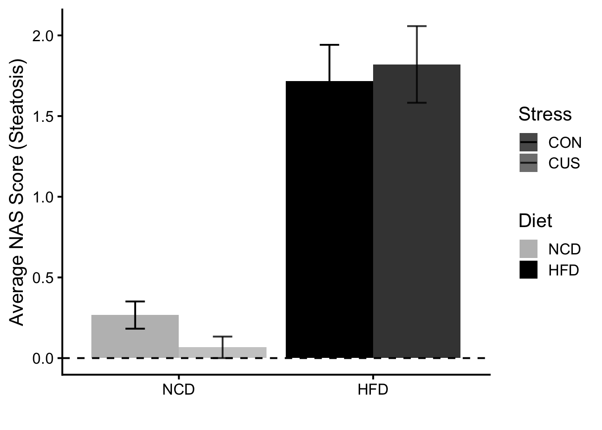
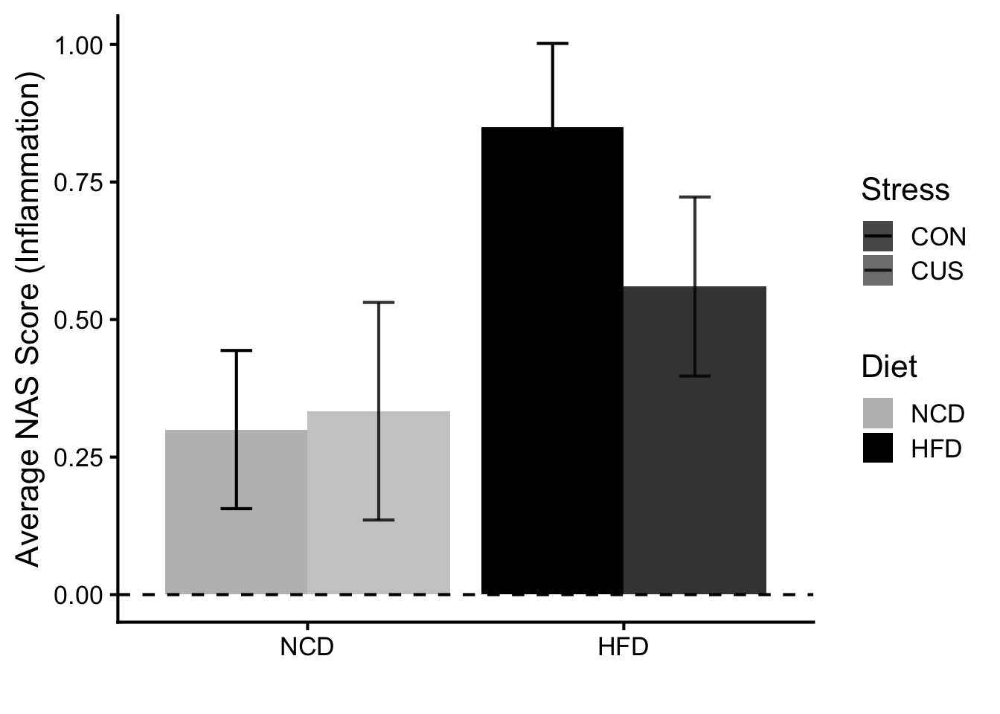
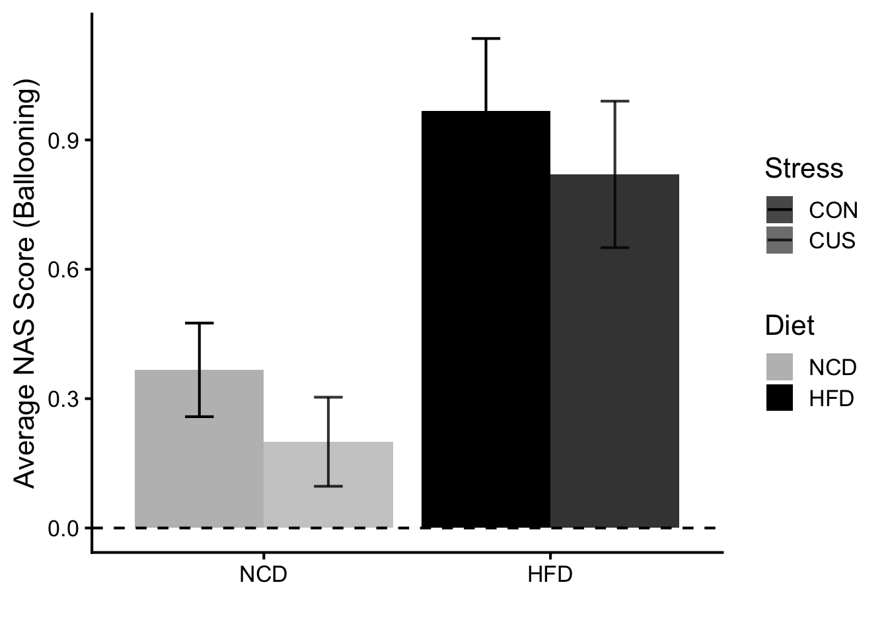
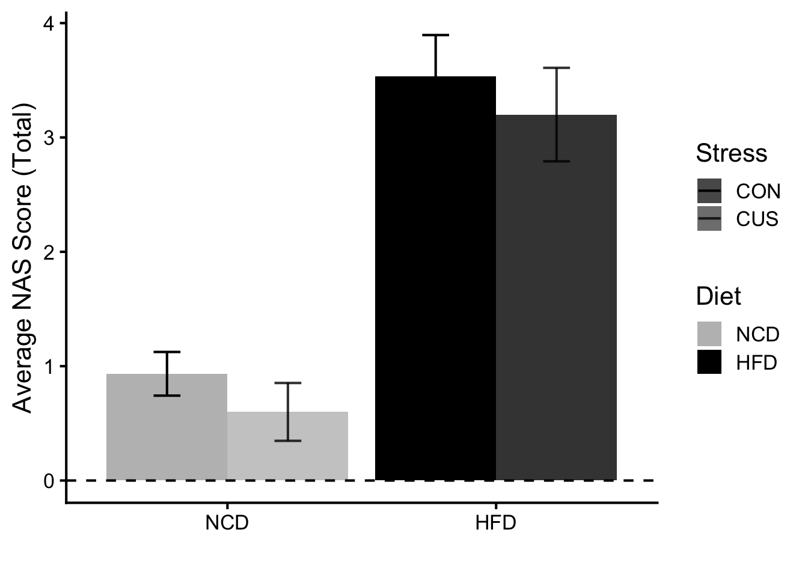
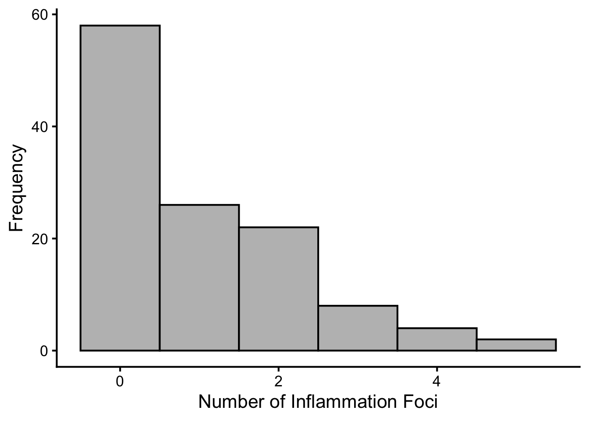
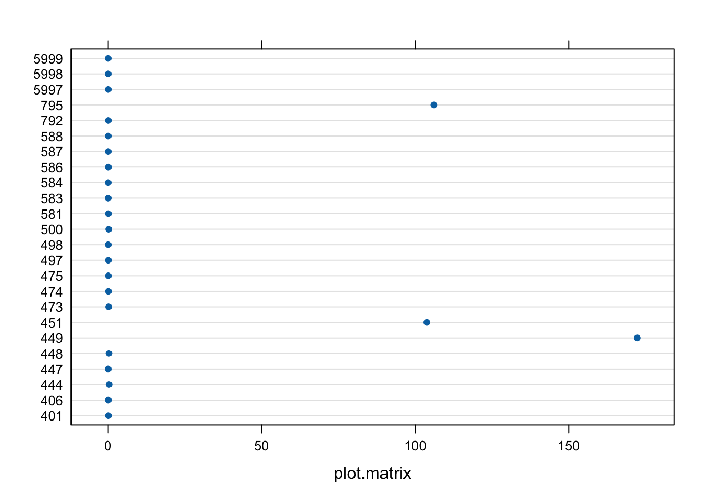
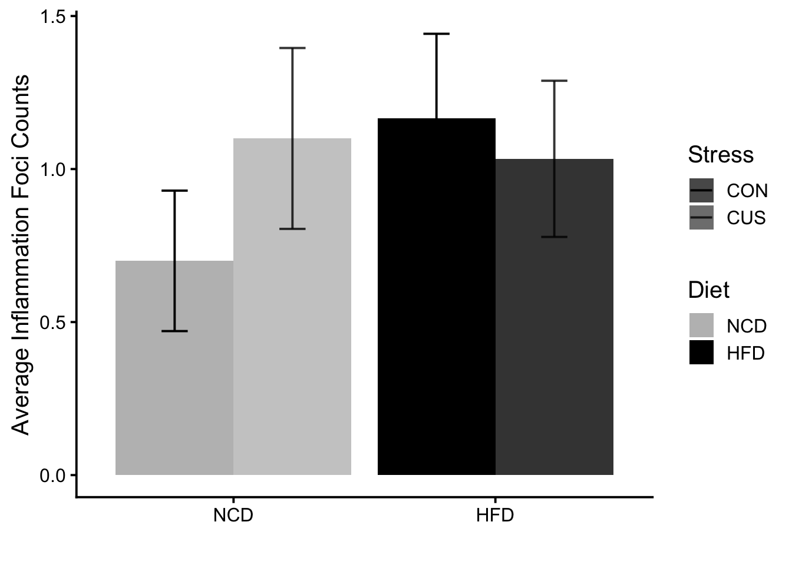

::: {.cell}

```{.r .cell-code}
# hide this code chunk
#| echo: false
#| message: false

# defines the se function
se <- function(x) {
  sd(x, na.rm = TRUE) / sqrt(length(x))
}

#load these packages, nearly always needed
library(tidyverse)
```
:::


## Purpose

The purpose of this experiment is to quantify the differences of physiological, metabolic, and psychological responses in lean and obese mice, under stressed and unstressed conditions.

## Experimental Details

\[Link to the protocol used (permalink preferred) for the experiment and include any notes relevant to your analysis. This might include specifics not in the general protocol such as cell lines, treatment doses etc.\]

High-fat diet (D12492) formula: https://researchdiets.com/formulas/d12492

## Raw Data

\[Describe your raw data files, including what the columns mean (and what units they are in).\]


::: {.cell}

```{.r .cell-code}
library(readxl) #loads the readr package
filename <- "raw data/Data Collection Sheet.xlsx" #input file(s)

#this loads whatever the file is into a dataframe called exp.data if it exists

property <- read_excel(filename, sheet = "Property") |>
  mutate(Diet = factor(Diet, levels = c("NCD", "HFD")), #relevel diet so NCD is the reference
         Stress = factor(Stress, levels = c("CON", "CUS"))) #relevel stress so CON is the reference

liver_histology <- "raw data/histo_db_liver NAS copy.xlsx"

liver <- read_excel(liver_histology, skip = 5) |>
  rename(Code = `ID`, Steatosis_1 = `Steatosis`, Steatosis_2 = `...4`, Steatosis_3 = `...5`, Steatosis_4 = `...6`, Steatosis_5 = `...7`, Steatosis_average = `Average...8`, Inflammation_1 = `Lobular inflammation`, Inflammation_2 = `...10`, Inflammation_3 = `...11`, Inflammation_4 = `...12`, Inflammation_5 = `...13`, Inflammation_average = `Average...14`, Ballooning_1 = `Hepatocellular balooning`, Ballooning_2 = `...16`, Ballooning_3 = `...17`, Ballooning_4 = `...18`, Ballooning_5 = `...19`, Ballooning_average = `Average...20`) |>
  left_join(property)

inflammation_foci <- "raw data/Inflammation foci count.xlsx"

foci_raw <- read_excel(inflammation_foci) 

#load packages
library(lme4)
library(lmerTest)
library(knitr)
library(broom)
library(broom.mixed)
library(performance)
library(see)
library(ggpattern)
library(mediation)
library(influence.ME)
library(emmeans)
library(pbkrtest)
library(DHARMa)
library(drc)
library(fitdistrplus)
library(AER)
library(car)
```
:::


These data can be found in /Users/macbook/Documents/GitHub/CushingAcromegalyStudy/scripts/scripts-corticosterone in a file named no file found. This input file was most recently updated on unknown. This script was most recently updated on Sat Jun 13 23:26:52 2026.

## Analysis

\[Describe the analysis as you intersperse code chunks\]

### Liver Histology


::: {.cell}

```{.r .cell-code}
#Steatosis
liver |>
  group_by(Diet, Stress) |>
  summarize(mean_stea = mean(`Steatosis_average`, na.rm = TRUE), 
            se_stea = sd(`Steatosis_average`, na.rm = TRUE)/sqrt(n()),
            .groups = "drop") |>

ggplot(
       aes(x = Diet,
           y = mean_stea,
           ymin = mean_stea - se_stea,
           ymax = mean_stea + se_stea,
           fill = Diet, 
           alpha = Stress)) + 
  geom_col(position = position_dodge(width = 0.9)) +
  geom_errorbar(width = 0.2, 
                position = position_dodge(width = 0.9)) +
  labs(y = "Average NAS Score (Steatosis)",
       x = "") +
  geom_hline(yintercept = 0,
             lty = 2) +
  scale_fill_manual(values = c("grey", "black")) +
  scale_alpha_manual(values = c("CON" = 1, "CUS" = 0.8)) +
  theme_classic(base_size = 16)
```

::: {.cell-output-display}
{width=672}
:::

```{.r .cell-code}
#Inflammation
liver |>
  group_by(Diet, Stress) |>
  summarize(mean_infl = mean(`Inflammation_average`, na.rm = TRUE), 
            se_infl = sd(`Inflammation_average`, na.rm = TRUE)/sqrt(n()),
            .groups = "drop") |>

ggplot(
       aes(x = Diet,
           y = mean_infl,
           ymin = mean_infl - se_infl,
           ymax = mean_infl + se_infl,
           fill = Diet, 
           alpha = Stress)) + 
  geom_col(position = position_dodge(width = 0.9)) +
  geom_errorbar(width = 0.2, 
                position = position_dodge(width = 0.9)) +
  labs(y = "Average NAS Score (Inflammation)",
       x = "") +
  geom_hline(yintercept = 0,
             lty = 2) +
  scale_fill_manual(values = c("grey", "black")) +
  scale_alpha_manual(values = c("CON" = 1, "CUS" = 0.8)) +
  theme_classic(base_size = 16)
```

::: {.cell-output-display}
{width=672}
:::

```{.r .cell-code}
#Ballooning
liver |>
  group_by(Diet, Stress) |>
  summarize(mean_ball = mean(`Ballooning_average`, na.rm = TRUE), 
            se_ball = sd(`Ballooning_average`, na.rm = TRUE)/sqrt(n()),
            .groups = "drop") |>

ggplot(
       aes(x = Diet,
           y = mean_ball,
           ymin = mean_ball - se_ball,
           ymax = mean_ball + se_ball,
           fill = Diet, 
           alpha = Stress)) + 
  geom_col(position = position_dodge(width = 0.9)) +
  geom_errorbar(width = 0.2, 
                position = position_dodge(width = 0.9)) +
  labs(y = "Average NAS Score (Ballooning)",
       x = "") +
  geom_hline(yintercept = 0,
             lty = 2) +
  scale_fill_manual(values = c("grey", "black")) +
  scale_alpha_manual(values = c("CON" = 1, "CUS" = 0.8)) +
  theme_classic(base_size = 16)
```

::: {.cell-output-display}
{width=672}
:::

```{.r .cell-code}
#Total score
liver |>
  group_by(Diet, Stress) |>
  summarize(mean_liver = mean(`Total score`, na.rm = TRUE), 
            se_liver = sd(`Total score`, na.rm = TRUE)/sqrt(n()),
            .groups = "drop") |>

ggplot(
       aes(x = Diet,
           y = mean_liver,
           ymin = mean_liver - se_liver,
           ymax = mean_liver + se_liver,
           fill = Diet, 
           alpha = Stress)) + 
  geom_col(position = position_dodge(width = 0.9)) +
  geom_errorbar(width = 0.2, 
                position = position_dodge(width = 0.9)) +
  labs(y = "Average NAS Score (Total)",
       x = "") +
  geom_hline(yintercept = 0,
             lty = 2) +
  scale_fill_manual(values = c("grey", "black")) +
  scale_alpha_manual(values = c("CON" = 1, "CUS" = 0.8)) +
  theme_classic(base_size = 16)
```

::: {.cell-output-display}
{width=672}
:::
:::

#### Statistics About Liver Histology

::: {.cell}

```{.r .cell-code}
liver.lm.total <- lm(`Total score` ~ Diet * Stress + (1|Code), data = liver)
liver.lm.total |>
  tidy(effects = 'fixed') |>
  kable(caption = 'FINAL MODEL: Effect of Diet, Stress, and Diet:Stress Interaction on Total NAS Score (LM)')
```

::: {.cell-output-display}


Table: FINAL MODEL: Effect of Diet, Stress, and Diet:Stress Interaction on Total NAS Score (LM)

|term              |   estimate| std.error|  statistic|   p.value|
|:-----------------|----------:|---------:|----------:|---------:|
|(Intercept)       |  0.9333333| 0.4432205|  2.1057989| 0.0436979|
|DietHFD           |  2.6000000| 0.5428321|  4.7896948| 0.0000422|
|StressCUS         | -0.3333333| 0.6268085| -0.5317945| 0.5987847|
|1 &#124; CodeTRUE |         NA|        NA|         NA|        NA|
|DietHFD:StressCUS |  0.0000000| 0.7803703|  0.0000000| 1.0000000|


:::

```{.r .cell-code}
liver.mlm.data <- liver |>
  fill(Group, .direction = c("down")) |>
  dplyr::select(-ends_with("average"), -`Total score`, -`Start Date`, -`End Date`, -`glucose`) |>
  group_by(Group, Diet, Stress) |>
  pivot_longer(`Steatosis_1`:`Ballooning_3`, 
               names_sep = "_", 
               names_to = c("Feature", "Image"), 
               values_to = "Score") |>
  pivot_wider(names_from = Feature, values_from = Score) 

liver.mlm.stea <- lmer(Steatosis ~ Diet * Stress + (1|Code), data = liver.mlm.data)
liver.mlm.stea |>
  tidy(effects = 'fixed') |>
  kable(caption = 'FINAL MODEL: Effect of Diet, Stress, and Diet:Stress Interaction on Steatosis Score')
```

::: {.cell-output-display}


Table: FINAL MODEL: Effect of Diet, Stress, and Diet:Stress Interaction on Steatosis Score

|effect |term              |   estimate| std.error|  statistic| df|   p.value|
|:------|:-----------------|----------:|---------:|----------:|--:|---------:|
|fixed  |(Intercept)       |  0.2666667| 0.2592654|  1.0285473| 30| 0.3119143|
|fixed  |DietHFD           |  1.4500000| 0.3175339|  4.5664414| 30| 0.0000790|
|fixed  |StressCUS         | -0.2000000| 0.3666566| -0.5454696| 30| 0.5894637|
|fixed  |DietHFD:StressCUS |  0.3033333| 0.4564838|  0.6644997| 30| 0.5114463|


:::

```{.r .cell-code}
liver.mlm.infl <- lmer(Inflammation ~ Diet * Stress + (1|Code), data = liver.mlm.data)
liver.mlm.infl |>
  tidy(effects = 'fixed') |>
  kable(caption = 'FINAL MODEL: Effect of Diet, Stress, and Diet:Stress Interaction on Inflammation Score')
```

::: {.cell-output-display}


Table: FINAL MODEL: Effect of Diet, Stress, and Diet:Stress Interaction on Inflammation Score

|effect |term              |   estimate| std.error|  statistic| df|   p.value|
|:------|:-----------------|----------:|---------:|----------:|--:|---------:|
|fixed  |(Intercept)       |  0.3000000| 0.2003793|  1.4971609| 30| 0.1447997|
|fixed  |DietHFD           |  0.5500000| 0.2454135|  2.2411157| 30| 0.0325719|
|fixed  |StressCUS         |  0.0333333| 0.2833791|  0.1176281| 30| 0.9071464|
|fixed  |DietHFD:StressCUS | -0.3233333| 0.3528041| -0.9164670| 30| 0.3667309|


:::

```{.r .cell-code}
liver.mlm.ball <- lmer(Ballooning ~ Diet * Stress + (1|Code), data = liver.mlm.data)
liver.mlm.ball |>
  tidy(effects = 'fixed') |>
  kable(caption = 'FINAL MODEL: Effect of Diet, Stress, and Diet:Stress Interaction on Ballooning Score')
```

::: {.cell-output-display}


Table: FINAL MODEL: Effect of Diet, Stress, and Diet:Stress Interaction on Ballooning Score

|effect |term              |   estimate| std.error|  statistic| df|   p.value|
|:------|:-----------------|----------:|---------:|----------:|--:|---------:|
|fixed  |(Intercept)       |  0.4444444| 0.2036195|  2.1827203| 30| 0.0370174|
|fixed  |DietHFD           |  0.5555556| 0.2493820|  2.2277295| 30| 0.0335463|
|fixed  |StressCUS         | -0.2222222| 0.2879615| -0.7717082| 30| 0.4463239|
|fixed  |DietHFD:StressCUS |  0.0555556| 0.3585092|  0.1549627| 30| 0.8778886|


:::
:::


#### Inflammation Foci

::: {.cell}

```{.r .cell-code}
foci <- foci_raw |>
  separate(`Image #`, into = c("Code", "Image #"), sep = "-", convert = TRUE) |>
  left_join(property, by = "Code")

ggplot(foci, mapping = aes(x = `Inflammation Foci`)) +
         geom_histogram(binwidth = 1, fill = "grey", color = "black") +
         labs(x = "Number of Inflammation Foci",
              y = "Frequency") +
         theme_classic(base_size = 16)
```

::: {.cell-output-display}
{width=672}
:::

```{.r .cell-code}
foci_mlm <- lmer(`Inflammation Foci` ~ Diet * Stress + (1|Code), data = foci)
foci_mlm |>
  tidy(effects = 'fixed') |>
  kable(caption = 'Effect of Diet, Stress, and Diet:Stress Interaction on Inflammation Foci')
```

::: {.cell-output-display}


Table: Effect of Diet, Stress, and Diet:Stress Interaction on Inflammation Foci

|effect |term              |   estimate| std.error| statistic| df|   p.value|
|:------|:-----------------|----------:|---------:|---------:|--:|---------:|
|fixed  |(Intercept)       |  0.7000000| 0.2649948|  2.641562| 20| 0.0156509|
|fixed  |DietHFD           |  0.4666667| 0.3747592|  1.245244| 20| 0.2274349|
|fixed  |StressCUS         |  0.4000000| 0.3747592|  1.067352| 20| 0.2985279|
|fixed  |DietHFD:StressCUS | -0.5333333| 0.5299895| -1.006309| 20| 0.3262874|


:::

```{.r .cell-code}
foci_gmlm <- glmer(`Inflammation Foci` ~ Diet * Stress + (1 | Code), data = foci, family = poisson)
fit_pois <- fitdist(foci$`Inflammation Foci`, "pois")
fit_nb <- fitdist(foci$`Inflammation Foci`, "nbinom")
fit_normal <- fitdist(foci$`Inflammation Foci`, "norm")

gofstat(list(fit_pois, fit_nb, fit_normal), 
        fitnames = c("Poisson", "Negative Binomial", "Normal"))
```

::: {.cell-output .cell-output-stdout}

```
Chi-squared statistic:  13.783 3.450441 56.24665 
Degree of freedom of the Chi-squared distribution:  2 1 1 
Chi-squared p-value:  0.001016389 0.06323491 6.392681e-14 
Chi-squared table:
     obscounts theo Poisson theo Negative Binomial theo Normal
<= 0        58    44.145532               55.46754    24.85297
<= 1        26    44.145533               33.71997    35.14703
<= 2        22    22.072767               16.85968    35.14703
> 2         14     9.636168               13.95281    24.85297

Goodness-of-fit criteria
                                Poisson Negative Binomial   Normal
Akaike's Information Criterion 345.7410          335.3457 393.2011
Bayesian Information Criterion 348.5285          340.9207 398.7760
```


:::

```{.r .cell-code}
foci_gmlm |>
  tidy(effects = 'fixed') |>
  kable(caption = 'Effect of Diet, Stress, and Diet:Stress Interaction on Inflammation Foci (Poisson GLMM)')
```

::: {.cell-output-display}


Table: Effect of Diet, Stress, and Diet:Stress Interaction on Inflammation Foci (Poisson GLMM)

|effect |term              |   estimate| std.error| statistic|   p.value|
|:------|:-----------------|----------:|---------:|---------:|---------:|
|fixed  |(Intercept)       | -0.4565316| 0.2913057| -1.567191| 0.1170701|
|fixed  |DietHFD           |  0.5247267| 0.3788325|  1.385115| 0.1660173|
|fixed  |StressCUS         |  0.4567828| 0.3813684|  1.197747| 0.2310156|
|fixed  |DietHFD:StressCUS | -0.5796112| 0.5224382| -1.109435| 0.2672426|


:::

```{.r .cell-code}
# count data; number of error = mean

infl.inf <- influence(foci_gmlm, group = "Code")
plot(infl.inf, which = "cook")
```

::: {.cell-output-display}
{width=672}
:::

```{.r .cell-code}
foci |>
  group_by(Code, Diet, Stress) |>
  summarize(mean_animal_foci = mean(`Inflammation Foci`, na.rm = TRUE)) |>
  ungroup() |>
  group_by(Diet, Stress) |>
  summarize(mean_foci = mean(mean_animal_foci, na.rm = TRUE),
            se_foci = sd(mean_animal_foci, na.rm = TRUE)/sqrt(n()),
            .groups = "drop") |>
  ggplot(
       aes(x = Diet,
           y = mean_foci,
           ymin = mean_foci - se_foci,
           ymax = mean_foci + se_foci,
           fill = Diet,
           alpha = Stress)) +
  geom_col(position = position_dodge(width = 0.9)) +
  geom_errorbar(width = 0.2,
                position = position_dodge(width = 0.9)) +
  labs(y = "Average Inflammation Foci Counts",
       x = "") +
  scale_fill_manual(values = c("grey", "black")) +
  scale_alpha_manual(values = c("CON" = 1, "CUS" = 0.8)) +
  theme_classic(base_size = 15)
```

::: {.cell-output-display}
{width=672}
:::

```{.r .cell-code}
foci_gmlm <- glmer(`Inflammation Foci` > 0 ~ Diet * Stress + (1 | Code), data = foci, family = binomial)
foci_gmlm |>
  tidy(effects = 'fixed', exponentiate = TRUE) |>
  kable(caption = 'Effect of Diet, Stress, and Diet:Stress Interaction on Presence of Inflammation Foci (Binomial GLMM)')
```

::: {.cell-output-display}


Table: Effect of Diet, Stress, and Diet:Stress Interaction on Presence of Inflammation Foci (Binomial GLMM)

|effect |term              |  estimate| std.error| statistic|   p.value|
|:------|:-----------------|---------:|---------:|---------:|---------:|
|fixed  |(Intercept)       | 0.5386759| 0.2882636| -1.156050| 0.2476608|
|fixed  |DietHFD           | 2.9872900| 2.2760234|  1.436361| 0.1508998|
|fixed  |StressCUS         | 2.5629798| 1.9440977|  1.240782| 0.2146863|
|fixed  |DietHFD:StressCUS | 0.2804028| 0.3009633| -1.184663| 0.2361507|


:::
:::


## Session Information


::: {.cell}

```{.r .cell-code}
sessionInfo()
```

::: {.cell-output .cell-output-stdout}

```
R version 4.6.0 (2026-04-24)
Platform: aarch64-apple-darwin23
Running under: macOS Tahoe 26.5.1

Matrix products: default
BLAS:   /Library/Frameworks/R.framework/Versions/4.6/Resources/lib/libRblas.0.dylib 
LAPACK: /Library/Frameworks/R.framework/Versions/4.6/Resources/lib/libRlapack.dylib;  LAPACK version 3.12.1

locale:
[1] en_US.UTF-8/en_US.UTF-8/en_US.UTF-8/C/en_US.UTF-8/en_US.UTF-8

time zone: America/Detroit
tzcode source: internal

attached base packages:
[1] stats     graphics  grDevices utils     datasets  methods   base     

other attached packages:
 [1] AER_1.2-16          lmtest_0.9-40       zoo_1.8-15         
 [4] car_3.1-5           carData_3.0-6       fitdistrplus_1.2-6 
 [7] survival_3.8-6      drc_3.0-1           DHARMa_0.5.0       
[10] pbkrtest_0.5.5      emmeans_2.0.3       influence.ME_0.9-10
[13] mediation_4.5.1     sandwich_3.1-1      mvtnorm_1.4-1      
[16] MASS_7.3-65         ggpattern_1.3.1     see_0.13.0         
[19] performance_0.16.0  broom.mixed_0.2.9.7 broom_1.0.13       
[22] knitr_1.51          lmerTest_3.2-1      lme4_2.0-1         
[25] Matrix_1.7-5        readxl_1.5.0        lubridate_1.9.5    
[28] forcats_1.0.1       stringr_1.6.0       dplyr_1.2.1        
[31] purrr_1.2.2         readr_2.2.0         tidyr_1.3.2        
[34] tibble_3.3.1        ggplot2_4.0.3       tidyverse_2.0.0    

loaded via a namespace (and not attached):
 [1] Rdpack_2.6.6        gridExtra_2.3       rlang_1.2.0        
 [4] magrittr_2.0.5      multcomp_1.4-30     furrr_0.4.0        
 [7] otel_0.2.0          compiler_4.6.0      vctrs_0.7.3        
[10] pkgconfig_2.0.3     fastmap_1.2.0       backports_1.5.1    
[13] labeling_0.4.3      rmarkdown_2.31      tzdb_0.5.0         
[16] nloptr_2.2.1        xfun_0.57           jsonlite_2.0.0     
[19] parallel_4.6.0      cluster_2.1.8.2     R6_2.6.1           
[22] stringi_1.8.7       RColorBrewer_1.1-3  parallelly_1.47.0  
[25] boot_1.3-32         rpart_4.1.27        cellranger_1.1.0   
[28] numDeriv_2016.8-1.1 estimability_1.5.1  Rcpp_1.1.1-1.1     
[31] base64enc_0.1-6     splines_4.6.0       nnet_7.3-20        
[34] timechange_0.4.0    tidyselect_1.2.1    abind_1.4-8        
[37] rstudioapi_0.19.0   yaml_2.3.12         codetools_0.2-20   
[40] listenv_0.10.1      lattice_0.22-9      withr_3.0.2        
[43] S7_0.2.2            coda_0.19-4.1       evaluate_1.0.5     
[46] foreign_0.8-91      future_1.70.0       lpSolve_5.6.23     
[49] pillar_1.11.1       checkmate_2.3.4     reformulas_0.4.4   
[52] insight_1.5.0       generics_0.1.4      hms_1.1.4          
[55] scales_1.4.0        minqa_1.2.8         gtools_3.9.5       
[58] globals_0.19.1      xtable_1.8-8        glue_1.8.1         
[61] Hmisc_5.2-5         tools_4.6.0         data.table_1.18.4  
[64] grid_4.6.0          plotrix_3.8-14      rbibutils_2.4.1    
[67] colorspace_2.1-2    nlme_3.1-169        htmlTable_2.5.0    
[70] Formula_1.2-5       cli_3.6.6           gtable_0.3.6       
[73] digest_0.6.39       TH.data_1.1-5       htmlwidgets_1.6.4  
[76] farver_2.1.2        htmltools_0.5.9     lifecycle_1.0.5    
```


:::
:::

