::: {.cell}

```{.r .cell-code}
# hide this code chunk
#| echo: false
#| message: false

# defines the se function
se <- function(x) {
  sd(x, na.rm = TRUE) / sqrt(length(x))
}

#load these packages, nearly always needed
library(tidyverse)
```
:::


## Purpose

The purpose of this experiment is to quantify the differences of physiological, metabolic, and psychological responses in lean and obese mice, under stressed and unstressed conditions.

## Experimental Details

\[Link to the protocol used (permalink preferred) for the experiment and include any notes relevant to your analysis. This might include specifics not in the general protocol such as cell lines, treatment doses etc.\]

High-fat diet (D12492) formula: https://researchdiets.com/formulas/d12492

## Raw Data

\[Describe your raw data files, including what the columns mean (and what units they are in).\]


::: {.cell}

```{.r .cell-code}
library(readxl) #loads the readr package
filename <- "raw data/Data Collection Sheet.xlsx" #input file(s)

#this loads whatever the file is into a dataframe called exp.data if it exists

property <- read_excel(filename, sheet = "Property") |>
  mutate(Diet = factor(Diet, levels = c("NCD", "HFD")), #relevel diet so NCD is the reference
         Stress = factor(Stress, levels = c("CON", "CUS"))) #relevel stress so CON is the reference

weight <- read_excel(filename, sheet = "Weight") |>
  left_join(property) |>
  mutate(Date = ymd(Date),
         `Start Date`=ymd(`Start Date`)) |> #converted date
  mutate(`Weighted Date` = Date - `Start Date`)

food <- read_excel(filename, sheet = "Food") |>
  left_join(property) |>
  mutate(Date = ymd(Date),
         `Start Date`=ymd(`Start Date`)) |> #converted dates
  mutate(`Weighted Date` = Date - `Start Date`) |>
  mutate(`Left (g)` = as.numeric(`Left (g)`)) 

NMR <- read_excel(filename, sheet = "NMR") |>
  left_join(property) |>
    mutate(Date = ymd(Date),
         `Start Date`=ymd(`Start Date`)) |> #converted dates
  mutate(`Weighted Date` = as.numeric(Date - `Start Date`))

#load packages
library(lme4)
library(lmerTest)
library(knitr)
library(broom)
library(broom.mixed)
library(performance)
library(see)
library(ggpattern)
library(mediation)
library(influence.ME)
library(emmeans)
library(pbkrtest)
library(DHARMa)
library(drc)
library(fitdistrplus)
library(AER)
library(car)
```
:::


These data can be found in /Users/macbook/Documents/GitHub/CushingAcromegalyStudy/scripts/scripts-corticosterone in a file named no file found. This input file was most recently updated on unknown. This script was most recently updated on Sat Jun 13 23:45:59 2026.

## Analysis

\[Describe the analysis as you intersperse code chunks\]

### Body Weight


::: {.cell}

```{.r .cell-code}
weight |>
  group_by(Stress, Diet, `Weighted Date`) |>
  summarize(Average = mean(`Weight (g)`), 
            SE = se(`Weight (g)`)) |>
  
ggplot( 
       aes(x = `Weighted Date`, 
           y = `Average`, 
           ymin = Average - SE, 
           ymax = Average + SE, 
           lty = Stress, 
           color = Diet)) + 
  geom_line() +
  geom_errorbar(width = 2.3) +
  labs(y = "Weight (g)", 
       x = "Time (day)") +
  scale_color_manual(values = c("grey", "black")) +
  theme_classic(base_size = 16)
```

::: {.cell-output-display}
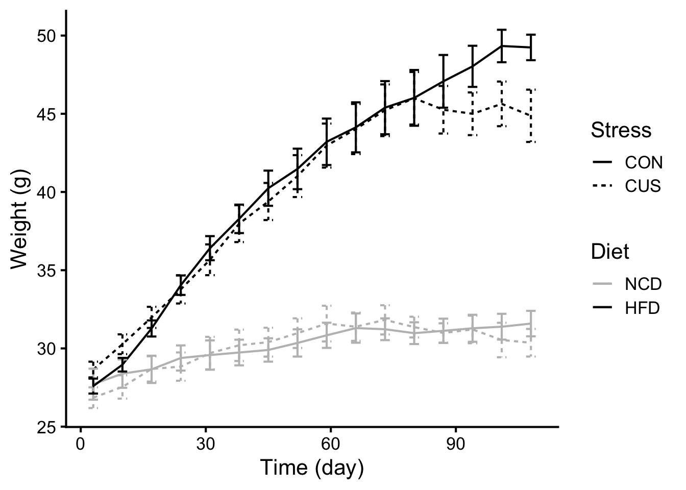{width=672}
:::
:::


#### Weight Change Since Stress Initiation


::: {.cell}

```{.r .cell-code}
stress.start <- 12*7
weight.stress <- filter(weight, `Weighted Date` >= stress.start) |> #filter for only data since stress start
  arrange(Date) |> #sort by date
  group_by(Code) |> #group by the code 
  mutate(Date.Stress = as.numeric(ymd(Date)-first(ymd(Date)))) |> #set date to be after stress start
  mutate(Weight.Stress = `Weight (g)`-first(`Weight (g)`)) #set weight to be after stress start

weight.stress |>
  group_by(Stress, Diet, `Weighted Date`) |>
  summarize(Average = mean(Weight.Stress), 
            SE = se(Weight.Stress)) |>
ggplot( 
       aes(x = `Weighted Date`, 
           y = `Average`, 
           ymin = Average - SE, 
           ymax = Average + SE, 
           lty = Stress, 
           color = Diet)) + 
  geom_line() +
  geom_errorbar(width = 0.5) +
  labs(y = "Weight (g)", 
       x = "Time (day)") +
  scale_color_manual(values = c("grey", "black")) +
  theme_classic(base_size = 16)
```

::: {.cell-output-display}
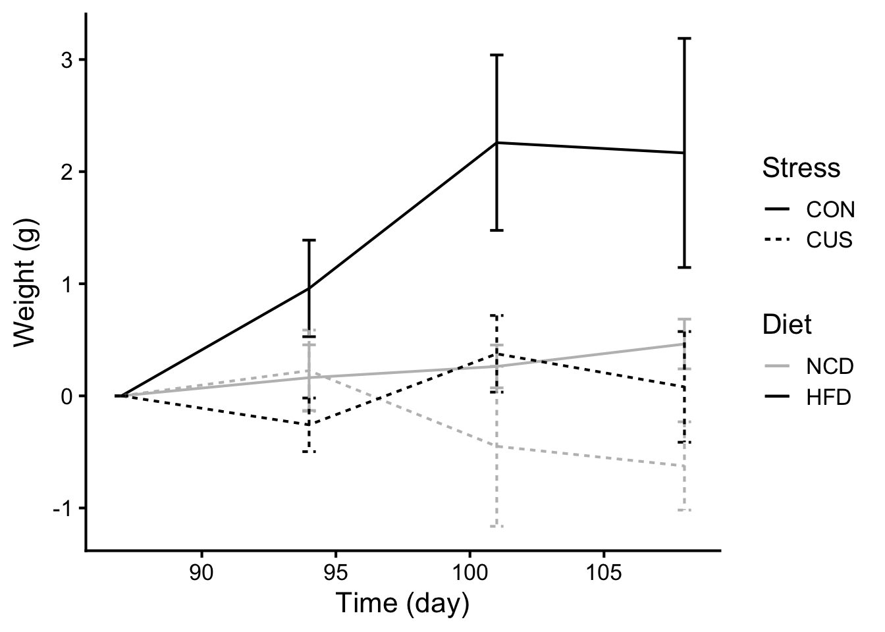{width=672}
:::
:::


##### Statistics About Weight Change Since Stress Initiation


::: {.cell}

```{.r .cell-code}
weight.post.stress <- filter(weight, `Weighted Date` >= 12*7) |> #filter for only data after stress
  mutate(Diet = relevel(as.factor(Diet), ref = "NCD")) #re-level diet so NCD is the reference

weight.post.stress.mlm <- lmer(`Weight (g)` ~ `Weighted Date` + Diet + Stress + (1 + `Weighted Date`||Code), data = weight.post.stress)
weight.post.stress.mlm |>
  tidy(effects = 'fixed') |>
  kable(caption = 'Diet, Stress, Time effect on Weights after stress')
```

::: {.cell-output-display}


Table: Diet, Stress, Time effect on Weights after stress

|effect |term            |   estimate| std.error| statistic|        df|   p.value|
|:------|:---------------|----------:|---------:|---------:|---------:|---------:|
|fixed  |(Intercept)     | 28.7217966| 1.6286643| 17.635185| 115.17677| 0.0000000|
|fixed  |`Weighted Date` |  0.0347094| 0.0119299|  2.909457| 117.06870| 0.0043341|
|fixed  |DietHFD         | 15.8088069| 1.2416241| 12.732362|  37.00789| 0.0000000|
|fixed  |StressCUS       | -2.0900567| 1.2166173| -1.717925|  37.01744| 0.0941660|


:::

```{.r .cell-code}
#HFD only
weight.post.stress.mlm.hfd <- lmer(`Weight (g)` ~ `Weighted Date` + Stress + Stress:`Weighted Date` + (1 + `Weighted Date`||Code), data = weight.post.stress |> 
                                     filter(Diet == 'HFD'))
weight.post.stress.mlm.hfd |>
  tidy(effects = 'fixed') |>
  kable(caption = 'Stress, Time, Stress:Time effect on HFD Weights after stress')
```

::: {.cell-output-display}


Table: Stress, Time, Stress:Time effect on HFD Weights after stress

|effect |term                      |   estimate| std.error| statistic|       df|   p.value|
|:------|:-------------------------|----------:|---------:|---------:|--------:|---------:|
|fixed  |(Intercept)               | 37.5565476| 2.6010585| 14.438948| 89.94617| 0.0000000|
|fixed  |`Weighted Date`           |  0.1114286| 0.0230290|  4.838622| 68.01651| 0.0000078|
|fixed  |StressCUS                 |  6.5672109| 3.7447684|  1.753703| 89.99847| 0.0828859|
|fixed  |`Weighted Date`:StressCUS | -0.0993090| 0.0334553| -2.968412| 68.05767| 0.0041296|


:::

```{.r .cell-code}
#NCD only
weight.post.stress.mlm.ncd <- lmer(`Weight (g)` ~ `Weighted Date` + Stress + Stress:`Weighted Date` + (1 + `Weighted Date`||Code), data = weight.post.stress |> 
                                     filter(Diet == 'NCD'))
weight.post.stress.mlm.ncd |>
  tidy(effects = 'fixed') |>
  kable(caption = 'Stress, Time, Stress:Time effect on NCD Weights after stress')
```

::: {.cell-output-display}


Table: Stress, Time, Stress:Time effect on NCD Weights after stress

|effect |term                      |   estimate| std.error| statistic|       df|   p.value|
|:------|:-------------------------|----------:|---------:|---------:|--------:|---------:|
|fixed  |(Intercept)               | 29.2750000| 1.5068584| 19.427837| 45.99931| 0.0000000|
|fixed  |`Weighted Date`           |  0.0212500| 0.0175333|  1.211980| 59.99813| 0.2302715|
|fixed  |StressCUS                 |  5.0517857| 2.1310196|  2.370596| 45.99932| 0.0220061|
|fixed  |`Weighted Date`:StressCUS | -0.0576786| 0.0247958| -2.326140| 59.99811| 0.0234076|


:::

```{.r .cell-code}
weight.post.stress <- weight.post.stress |>
  mutate(time = as.numeric(`Weighted Date`)) #convert to numeric for 3-way interaction

weight.post.stress.mlm.int <- lmer(`Weight (g)` ~ time * Diet * Stress + (1 + time||Code), data = weight.post.stress)
weight.post.stress.mlm.int |>
  tidy(effects = 'fixed') |>
  kable(caption = 'FINAL MODEL: Diet, Stress, Time, and interaction effects on Weights after stress')
```

::: {.cell-output-display}


Table: FINAL MODEL: Diet, Stress, Time, and interaction effects on Weights after stress

|effect |term                   |   estimate| std.error|  statistic|       df|   p.value|
|:------|:----------------------|----------:|---------:|----------:|--------:|---------:|
|fixed  |(Intercept)            | 29.2750000| 2.7115479| 10.7964162| 149.8995| 0.0000000|
|fixed  |time                   |  0.0212500| 0.0240697|  0.8828527| 114.0164| 0.3791735|
|fixed  |DietHFD                |  8.2815476| 3.5005933|  2.3657554| 149.8995| 0.0192727|
|fixed  |StressCUS              |  5.0517857| 3.8347078|  1.3173848| 149.8995| 0.1897198|
|fixed  |time:DietHFD           |  0.0901786| 0.0310739|  2.9020727| 114.0164| 0.0044507|
|fixed  |time:StressCUS         | -0.0576786| 0.0340397| -1.6944502| 114.0164| 0.0929096|
|fixed  |DietHFD:StressCUS      |  1.5162701| 4.9866605|  0.3040652| 149.9534| 0.7614997|
|fixed  |time:DietHFD:StressCUS | -0.0416396| 0.0444278| -0.9372422| 114.0455| 0.3506146|


:::

```{.r .cell-code}
emmeans(weight.post.stress.mlm.int, pairwise ~ Diet) #comparing at endpoint of the data
```

::: {.cell-output .cell-output-stdout}

```
$emmeans
 Diet emmean    SE df lower.CL upper.CL
 NCD    31.1 0.960 36     29.1     33.0
 HFD    46.9 0.784 36     45.3     48.4

Results are averaged over the levels of: Stress 
Degrees-of-freedom method: kenward-roger 
Confidence level used: 0.95 

$contrasts
 contrast  estimate   SE df t.ratio p.value
 NCD - HFD    -15.8 1.24 36 -12.735 <0.0001

Results are averaged over the levels of: Stress 
Degrees-of-freedom method: kenward-roger 
```


:::

```{.r .cell-code}
emtrends(weight.post.stress.mlm.int, ~ Diet * Stress, var = "time") #compare slopes over time
```

::: {.cell-output .cell-output-stdout}

```
 Diet Stress time.trend     SE   df lower.CL upper.CL
 NCD  CON        0.0213 0.0241 92.1  -0.0266   0.0691
 HFD  CON        0.1114 0.0197 92.1   0.0724   0.1505
 NCD  CUS       -0.0364 0.0241 92.1  -0.0842   0.0114
 HFD  CUS        0.0121 0.0207 93.5  -0.0291   0.0533

Degrees-of-freedom method: kenward-roger 
Confidence level used: 0.95 
```


:::

```{.r .cell-code}
emtrends(weight.post.stress.mlm.int, ~ Diet * Stress, var = "time") -> slopes
pairs(slopes, by = 'Diet') #or by Stress
```

::: {.cell-output .cell-output-stdout}

```
Diet = NCD:
 contrast  estimate     SE   df t.ratio p.value
 CON - CUS   0.0577 0.0340 92.1   1.694  0.0936

Diet = HFD:
 contrast  estimate     SE   df t.ratio p.value
 CON - CUS   0.0993 0.0286 92.8   3.476  0.0008

Degrees-of-freedom method: kenward-roger 
```


:::

```{.r .cell-code}
# Define interaction contrast HFD(control-stress) - NCD(control-stress)
interaction_contrast <- contrast(slopes, method = list(HFD_control_minus_stress_minus_NCD = c(1, -1, -1, 1)), by = NULL)
summary(interaction_contrast)
```

::: {.cell-output .cell-output-stdout}

```
 contrast                           estimate     SE   df t.ratio p.value
 HFD_control_minus_stress_minus_NCD  -0.0416 0.0444 92.4  -0.937  0.3513

Degrees-of-freedom method: kenward-roger 
```


:::

```{.r .cell-code}
#slope differences
pairs(slopes, by = 'Diet') |>
  summary() |>
  as.data.frame() |>
  ggplot(aes(x = Diet, 
             y = -estimate, 
             ymin = -estimate - SE, 
             ymax = -estimate + SE, 
             fill = Diet)) +
  geom_bar(stat = "identity", 
           position = "dodge") +
  geom_errorbar(position = position_dodge(width = 0.9), 
                width = 0.2) +
    labs(y = "Weight Difference due to Stress (g/day)",
       x = "Diet") +
  theme_classic(base_size = 16) +
  scale_fill_manual(values = c("HFD" = "black", "NCD" = "grey"))
```

::: {.cell-output-display}
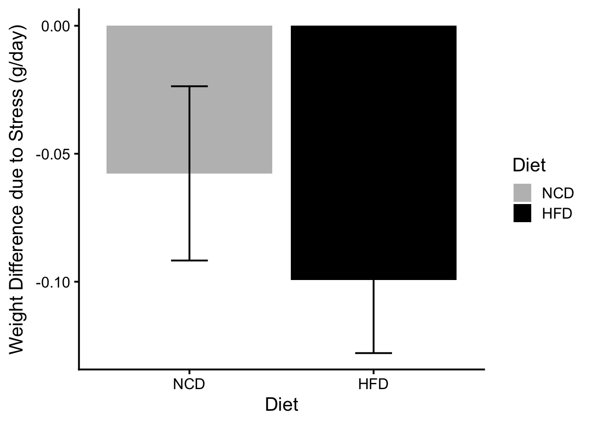{width=672}
:::
:::


### Food


::: {.cell}

```{.r .cell-code}
grouped_food <- food |>
  filter(!(is.na(Date))) |>
  #create a new column called 'Net (g)' by subtracting the previous rows 'Fill (g)' from the current rows 'Left (g)'
  group_by(Code) |> 
  filter(!(Date == '2025-05-02' & Code == '473')) |> 
  arrange(Code, Date) |> 
  mutate(`Net (g)` = -(lead(`Left (g)`, default = 0) - `Fill (g)`)) |> 
  mutate(`Net (g)` = case_when(Date == '2025-05-02' & Code == '473' ~ 0,
                               Date == '2025-07-22' & Code == '473' ~ NA, 
                               Date == '2025-07-22' & Code == '474' ~ NA, 
                               Date == '2025-07-25' & Code == '474' ~ NA,
                               Date == '2025-07-01' & Code == '444' ~ NA,
                               Date == '2025-08-01' & Code == '496' ~ NA, #removed because of suspected ULAM adding food
                               Date == '2025-09-10' & Code == '792' ~ NA,
                               Date == '2025-09-10' & Code == '793' ~ NA, #removed because of data correction
                               Date == '2025-09-10' & Code == '794' ~ NA,
                               Date == '2025-09-10' & Code == '795' ~ NA, #removed because of suspected crumbs
                               Date == '2025-10-03' & Code == '792' ~ NA, #removed because of suspected ULAM adding food
                               Date == '2025-10-03' & Code == '793' ~ NA, #removed because of suspected ULAM adding food
                               Date == '2025-10-03' & Code == '794' ~ NA, #removed because of suspected ULAM adding food
                               Date == '2025-10-03' & Code == '795' ~ NA, #removed because of suspected ULAM adding food
                               Date == '2025-09-12' & Code == '792' ~ 110.4/4 + 6.4, #adjusted because of separation (110.4 grams for 4 mice prior to separation, 6.4 grams afterwards)
                               Date == '2025-09-12' & Code == '793' ~ 110.4/4 + 11.4,
                               Date == '2025-09-12' & Code == '794' ~ 110.4/4 + 57,
                               Date == '2025-09-12' & Code == '795' ~ 110.4/4 + 45.1,
                               TRUE ~ `Net (g)`)) |> 
  mutate(`Difference` = lead(Date) - Date) |> 
  mutate(Day_in_interval = as.integer(time_length(Difference, "days"))) |> 
  mutate(per_mouse_per_day = `Net (g)` / `Number of Mice` / Day_in_interval)  #variable

grouped_food <- grouped_food |> 
  mutate(`per_mouse_per_day` = case_when(Code == '793' & Date == '2025-10-03' ~ mean(filter(grouped_food, Code == '793' & `Weighted Date` < 73) $per_mouse_per_day, na.rm = TRUE), 
                                         Code == '793' & Date == '2025-10-10' ~ mean(filter(grouped_food, Code == '793' & `Weighted Date` < 73) $per_mouse_per_day, na.rm = TRUE), 
                                         Code == '794' & Date == '2025-10-03' ~ mean(filter(grouped_food, Code == '794' & `Weighted Date` < 73) $per_mouse_per_day, na.rm = TRUE),
                                         Code == '794' & Date == '2025-10-10' ~ mean(filter(grouped_food, Code == '794' & `Weighted Date` < 73) $per_mouse_per_day, na.rm = TRUE),
                                         Code == '795' & Date == '2025-10-03' ~ mean(filter(grouped_food, Code == '795' & `Weighted Date` < 73) $per_mouse_per_day, na.rm = TRUE),
                                         Code == '795' & Date == '2025-10-10' ~ mean(filter(grouped_food, Code == '795' & `Weighted Date` < 73) $per_mouse_per_day, na.rm = TRUE), 
                                         TRUE ~ `per_mouse_per_day`)) |>
  mutate(kcal_per_day = case_when(`Diet` == 'HFD' ~ per_mouse_per_day * 5.24, 
                                  `Diet` == 'NCD' ~ per_mouse_per_day * 2.91)) |> 
  filter(!(Date == '2025-07-01' & Code == '444')) |> 
  mutate(cumulative_kcal = cumsum(kcal_per_day)) 

#calculate cumulative food intake per cage for each original cage
cumulative.cage.444 <- filter(grouped_food, Code == '444', `Weighted Date` == 80) |> 
  pull(cumulative_kcal) #pull cumulative_kcal for 444 on day 87
cumulative.cage.405 <- filter(grouped_food, Code == '405', `Weighted Date` == 80) |> 
  pull(cumulative_kcal) 
cumulative.cage.473 <- filter(grouped_food, Code == '473', `Weighted Date` == 45) |> 
  pull(cumulative_kcal) 
cumulative.cage.475 <- filter(grouped_food, Code == '475', `Weighted Date` == 52) |> 
  pull(cumulative_kcal) 
cumulative.cage.473.2 <- filter(grouped_food, Code == '473', `Weighted Date` == 80) |> 
  pull(cumulative_kcal) 
cumulative.cage.448 <- filter(grouped_food, Code == '448', `Weighted Date` == 80) |> 
  pull(cumulative_kcal) 
cumulative.cage.497 <- filter(grouped_food, Code == '497', `Weighted Date` == 59) |> 
  pull(cumulative_kcal) 
cumulative.cage.581 <- filter(grouped_food, Code == '581', `Weighted Date` == 80) |> 
  pull(cumulative_kcal) 
cumulative.cage.792 <- filter(grouped_food, Code == '792', `Weighted Date` == 45) |> 
  pull(cumulative_kcal) 

#add the prior cage's cumulative_kcal (e.g. cumulative.cage.444) to the new cage's cumulative_kcal for every date after separation
grouped_food_cage <-
  grouped_food |>
  mutate(cumulative_kcal_cage = 
           case_when(
             #repeat for every separation using prior cage's cumulative value, and the date of separation
             Code == '446' & `Weighted Date` >= 80 ~ cumulative_kcal + cumulative.cage.444,
             Code == '445' & `Weighted Date` >= 80 ~ cumulative_kcal + cumulative.cage.444,
             Code == '406' & `Weighted Date` >= 80 ~ cumulative_kcal + cumulative.cage.405,
             Code == '407' & `Weighted Date` >= 80 ~ cumulative_kcal + cumulative.cage.405,
             Code == '408' & `Weighted Date` >= 80 ~ cumulative_kcal + cumulative.cage.405, 
             Code == '475' & `Weighted Date` >= 45 ~ cumulative_kcal + cumulative.cage.473,
             Code == '496' & `Weighted Date` >= 52 ~ cumulative_kcal + cumulative.cage.475,
             Code == '474' & `Weighted Date` >= 80 ~ cumulative_kcal + cumulative.cage.473.2, 
             Code == '449' & `Weighted Date` >= 80 ~ cumulative_kcal + cumulative.cage.448, 
             Code == '451' & `Weighted Date` >= 80 ~ cumulative_kcal + cumulative.cage.448, 
             Code == '452' & `Weighted Date` >= 80 ~ cumulative_kcal + cumulative.cage.448, 
             Code == '499' & `Weighted Date` >= 59 ~ cumulative_kcal + cumulative.cage.497,
             Code == '582' & `Weighted Date` >= 80 ~ cumulative_kcal + cumulative.cage.581,
             Code == '583' & `Weighted Date` >= 80 ~ cumulative_kcal + cumulative.cage.581,
             Code == '584' & `Weighted Date` >= 80 ~ cumulative_kcal + cumulative.cage.581,
             Code == '793' & `Weighted Date` >= 45 ~ cumulative_kcal + cumulative.cage.792,
             Code == '794' & `Weighted Date` >= 45 ~ cumulative_kcal + cumulative.cage.792,
             Code == '795' & `Weighted Date` >= 45 ~ cumulative_kcal + cumulative.cage.792,
             TRUE ~ cumulative_kcal))  #if no separations then keep the same value

grouped_food |> 
    #filter(Diet == 'HFD', Stress == 'CUS', `Weighted Date` == 24) |> 
  group_by(Stress, Diet, `Weighted Date`) |> 
  summarize(Average = mean(kcal_per_day, na.rm = TRUE), 
            n = length(kcal_per_day),
            SE = se(kcal_per_day)) |> 
  filter(!is.na(Average)) |>

ggplot( 
       aes(x = `Weighted Date`, 
           y = `Average`, 
           ymin = Average - SE, 
           ymax = Average + SE, 
           lty = Stress, 
           color = Diet)) +  
  geom_line() +
  geom_errorbar(width = 2.5) +
  labs(y = "Daily Calorie Intake (kcal)", 
       x = "Time (day)") +
  scale_color_manual(values = c("grey", "black")) +
  theme_classic(base_size = 16)
```

::: {.cell-output-display}
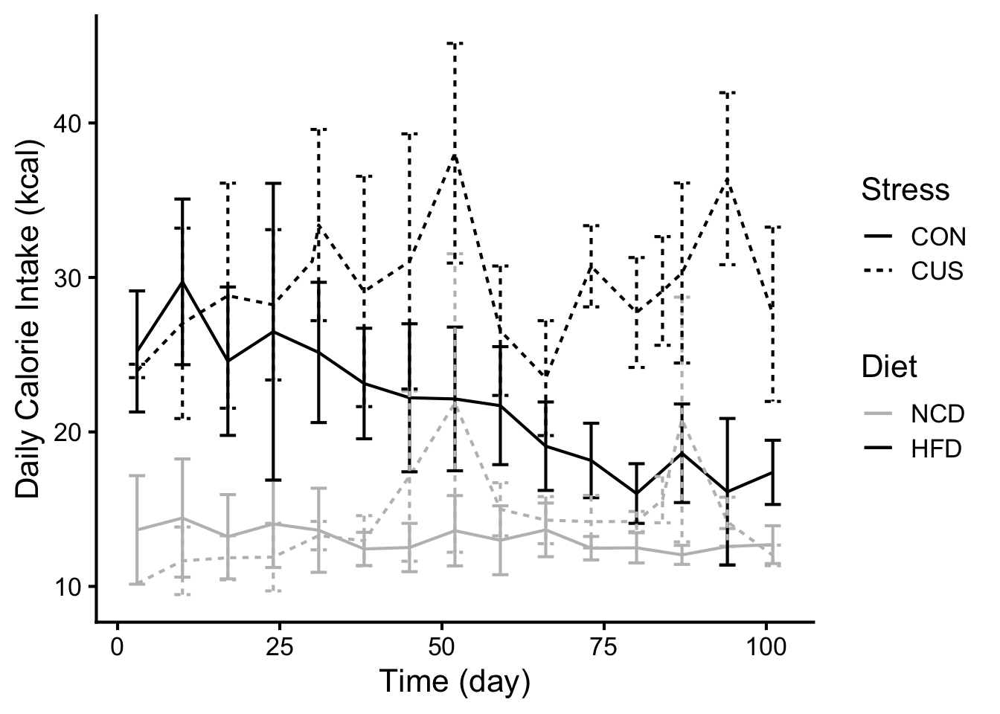{width=672}
:::
:::


#### Food Intake Change Since Stress Initiation


::: {.cell}

```{.r .cell-code}
stress.start <- 12*7
food.stress <- filter(grouped_food, `Weighted Date` >= stress.start) |> #filter for only data after start
  arrange(Date) |> #sort by date
  group_by(Code) |> #group by the code
  mutate(Date.Stress = as.numeric(ymd(Date)-first(ymd(Date)))) |> #set date to be after stress start
  mutate(Food.Stress = `kcal_per_day`-first(`kcal_per_day`))

grouped_food |>
  group_by(Stress, Diet, `Weighted Date`) |>
  summarize(Average = mean(kcal_per_day, na.rm = TRUE), 
            SE = se(kcal_per_day)) |> 
  filter(!is.na(Average)) |> 
  mutate(kcal.stress = case_when(`Weighted Date` >= 80 ~ Average - first(Average[`Weighted Date` == 80]), 
                                   TRUE ~ Average)) |> 
  filter(`Weighted Date` >= 80) |> 

  ggplot( 
       aes(x = `Weighted Date` - 80, 
           y = kcal.stress, 
           ymin = kcal.stress - SE, 
           ymax = kcal.stress + SE, 
           lty = Stress, 
           color = Diet)) +  
  geom_line() +
  geom_errorbar(width = 0.5) +
  labs(y = "Change in Daily Calorie Intake (kcal)", 
       x = "Time (day)") +
  scale_color_manual(values = c("grey", "black")) +
  theme_classic(base_size = 16)
```

::: {.cell-output-display}
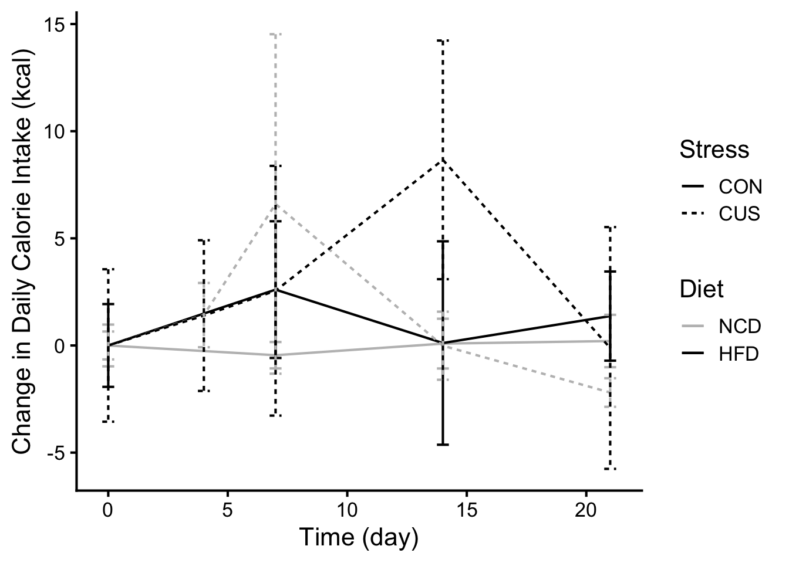{width=672}
:::

```{.r .cell-code}
food.stress |>
  group_by(Stress, Diet) |>
  summarize(Average = mean(kcal_per_day, na.rm = TRUE), 
            SE = se(kcal_per_day)) |>

  ggplot( 
       aes(x = Diet, 
           y = `Average`, 
           ymin = Average - SE, 
           ymax = Average + SE, 
           fill = Diet, 
           alpha = Stress)) + 
  geom_col(position = position_dodge(width = 0.9)) +
  geom_errorbar(width = 0.2, 
                position = position_dodge(width = 0.9)) +
  labs(y = "Average Daily Calorie Intake (kcal/day)", 
       x = "") +
  scale_fill_manual(values = c("grey", "black")) +
  scale_alpha_manual(values = c("CON" = 1, "CUS" = 0.85)) +
  theme_classic(base_size = 16)
```

::: {.cell-output-display}
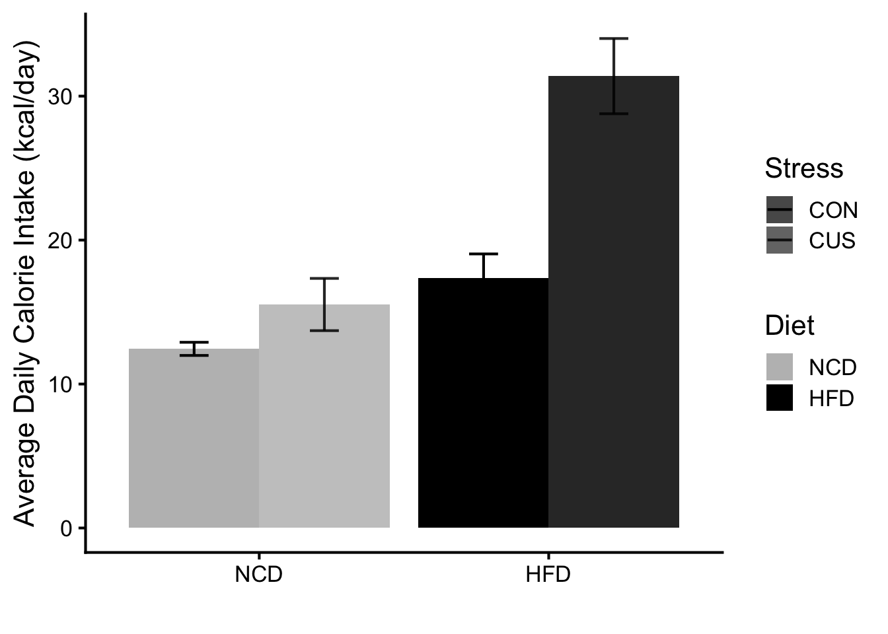{width=672}
:::
:::


##### Statistics About Food Intake Since Stress Initiation


::: {.cell}

```{.r .cell-code}
food.stress <- food.stress |>
  mutate(Diet = factor(Diet, levels = c("NCD", "HFD"))) #relevel diet so NCD is the reference

food.post.stress.mlm <- lmer(kcal_per_day ~ Stress + Date.Stress + Diet + (1 + Date.Stress||Code), data = filter(food.stress)) 
food.post.stress.mlm |>
  tidy(effects = 'fixed') |>
  kable(caption = 'FINAL MODEL: Effect of Stress, Time, and Diet on Food Intake after Stress')
```

::: {.cell-output-display}


Table: FINAL MODEL: Effect of Stress, Time, and Diet on Food Intake after Stress

|effect |term        |   estimate| std.error| statistic|       df|   p.value|
|:------|:-----------|----------:|---------:|---------:|--------:|---------:|
|fixed  |(Intercept) |  9.2578062| 4.7496385|  1.949160| 29.16472| 0.0609521|
|fixed  |StressCUS   | 10.2605900| 4.3219335|  2.374074| 22.61758| 0.0264786|
|fixed  |Date.Stress | -0.2257518| 0.2089037| -1.080650| 53.69596| 0.2846826|
|fixed  |DietHFD     | 11.9269178| 4.1044196|  2.905872| 21.57604| 0.0082999|


:::

```{.r .cell-code}
food.post.stress.mlm.hfd <- lmer(kcal_per_day ~ Stress * Date.Stress + (1 + Date.Stress||Code), data = filter(food.stress, Diet == 'HFD'))
food.post.stress.mlm.hfd |>
  tidy(effects = 'fixed') |>
  kable(caption = "Effect of Stress, Time on Food Intake in HFD mice after Stress")
```

::: {.cell-output-display}


Table: Effect of Stress, Time on Food Intake in HFD mice after Stress

|effect |term                  |   estimate| std.error|  statistic|       df|   p.value|
|:------|:---------------------|----------:|---------:|----------:|--------:|---------:|
|fixed  |(Intercept)           | 17.9927460| 6.0836720|  2.9575470| 26.98735| 0.0063760|
|fixed  |StressCUS             | 14.3442282| 7.3833339|  1.9427847| 26.12604| 0.0628923|
|fixed  |Date.Stress           | -0.0882245| 0.5671267| -0.1555640| 30.72519| 0.8773943|
|fixed  |StressCUS:Date.Stress | -0.1098622| 0.6923551| -0.1586789| 29.96040| 0.8749866|


:::

```{.r .cell-code}
food.post.stress.mlm.ncd <- lmer(kcal_per_day ~ Stress * Date.Stress + (1 + Date.Stress||Code), data = filter(food.stress, Diet == 'NCD'))
food.post.stress.mlm.ncd |>
  tidy(effects = 'fixed') |>
  kable(caption = "Effect of Stress, Time on Food Intake in NCD mice after Stress")
```

::: {.cell-output-display}


Table: Effect of Stress, Time on Food Intake in NCD mice after Stress

|effect |term                  |   estimate| std.error|  statistic|       df|   p.value|
|:------|:---------------------|----------:|---------:|----------:|--------:|---------:|
|fixed  |(Intercept)           | 12.1119127| 5.3993975|  2.2431971| 29.65509| 0.0325133|
|fixed  |StressCUS             |  6.6742558| 6.2234124|  1.0724431| 28.15166| 0.2926288|
|fixed  |Date.Stress           |  0.0473452| 0.5761733|  0.0821719| 22.29706| 0.9352432|
|fixed  |StressCUS:Date.Stress | -0.4406958| 0.6416514| -0.6868150| 22.74927| 0.4991412|


:::

```{.r .cell-code}
food.post.stress.mlm.int <- lmer(kcal_per_day ~ Stress * Date.Stress * Diet + (1 + Date.Stress||Code), data = filter(food.stress))
food.post.stress.mlm.int |>
  tidy(effects = 'fixed') |>
  kable(caption = 'Effect of Stress, Time, Diet, and all the interactions on Food Intake after Stress')
```

::: {.cell-output-display}


Table: Effect of Stress, Time, Diet, and all the interactions on Food Intake after Stress

|effect |term                          |   estimate|  std.error|  statistic|       df|   p.value|
|:------|:-----------------------------|----------:|----------:|----------:|--------:|---------:|
|fixed  |(Intercept)                   | 12.1119127|  7.7215301|  1.5685897| 52.39016| 0.1227643|
|fixed  |StressCUS                     |  7.3502737|  8.9843908|  0.8181160| 50.69794| 0.4171197|
|fixed  |Date.Stress                   |  0.0473452|  0.7061950|  0.0670427| 56.88180| 0.9467828|
|fixed  |DietHFD                       |  5.8808333|  9.4569044|  0.6218561| 52.39016| 0.5367334|
|fixed  |StressCUS:Date.Stress         | -0.4973165|  0.7913879| -0.6284106| 54.82675| 0.5323443|
|fixed  |StressCUS:DietHFD             |  6.6003418| 11.1543431|  0.5917284| 50.78999| 0.5566573|
|fixed  |Date.Stress:DietHFD           | -0.1355697|  0.8649087| -0.1567446| 56.88180| 0.8760012|
|fixed  |StressCUS:Date.Stress:DietHFD |  0.4655985|  0.9972048|  0.4669036| 55.19351| 0.6424068|


:::

```{.r .cell-code}
check_model(food.post.stress.mlm.int, base_size = 6)
```

::: {.cell-output-display}
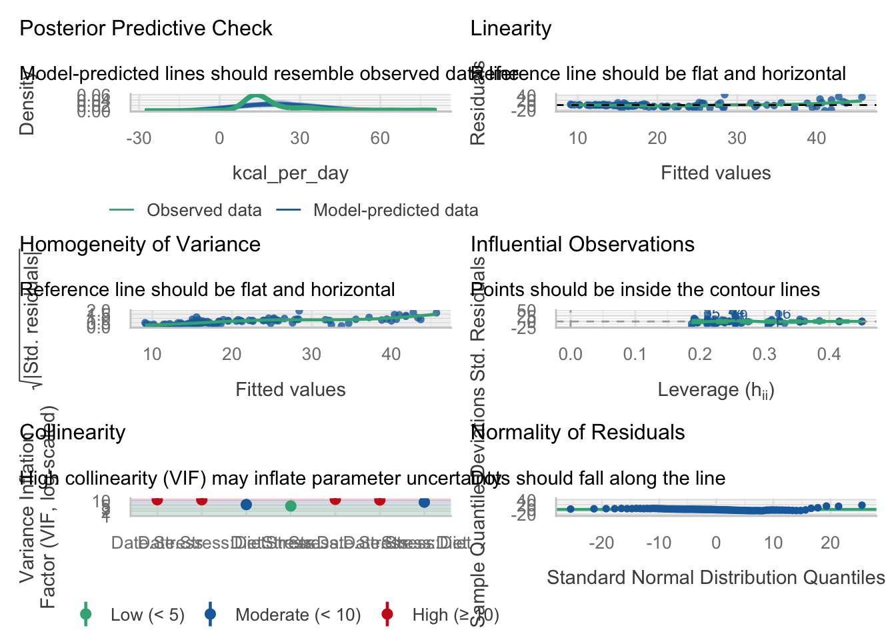{width=672}
:::

```{.r .cell-code}
emmeans(food.post.stress.mlm.int, pairwise ~ Diet * Stress) #comparing at endpoint of the data
```

::: {.cell-output .cell-output-stdout}

```
$emmeans
 Diet Stress emmean   SE   df lower.CL upper.CL
 NCD  CON      12.5 6.21 26.2   -0.301     25.2
 HFD  CON      17.4 4.39 26.2    8.339     26.4
 NCD  CUS      16.2 3.74 23.6    8.491     23.9
 HFD  CUS      31.1 3.09 25.3   24.729     37.4

Degrees-of-freedom method: kenward-roger 
Confidence level used: 0.95 

$contrasts
 contrast          estimate   SE   df t.ratio p.value
 NCD CON - HFD CON    -4.90 7.60 26.2  -0.645  0.9163
 NCD CON - NCD CUS    -3.77 7.25 25.5  -0.520  0.9535
 NCD CON - HFD CUS   -18.63 6.93 26.0  -2.687  0.0564
 HFD CON - NCD CUS     1.14 5.77 25.1   0.197  0.9972
 HFD CON - HFD CUS   -13.72 5.36 25.9  -2.558  0.0742
 NCD CUS - HFD CUS   -14.86 4.85 24.3  -3.064  0.0254

Degrees-of-freedom method: kenward-roger 
P value adjustment: tukey method for comparing a family of 4 estimates 
```


:::
:::


### NMR


::: {.cell}

```{.r .cell-code}
#Create a new column called Updated Date to correct the dates
NMR <- NMR |>
  mutate(`Updated Date` = case_when(`Weighted Date` == 1 ~ 0, 
                                     `Weighted Date` == 79 ~ 80, 
                                     TRUE ~ `Weighted Date`)) |>
  mutate(`Fat (%)` = `Fat (g)`/`BW (g)` * 100) |>
  mutate(`Lean (%)` = `Lean (g)`/`BW (g)` * 100)

NMR |>
  group_by(Stress, Diet, `Updated Date`) |>
  summarize(Average = mean(`Fat (%)`), 
            SE = se(`Fat (%)`)) |>
ggplot( 
       aes(x = `Updated Date`, 
           y = `Average`, 
           ymin = Average - SE, 
           ymax = Average + SE, 
           lty = Stress, 
           color = Diet)) +  
  geom_line() +
  geom_errorbar(width = 0.5) +
  labs(y = "Fat Mass (%)", 
       x = "Time (day)") +
  scale_color_manual(values = c("grey", "black")) +
  theme_classic(base_size = 16)
```

::: {.cell-output-display}
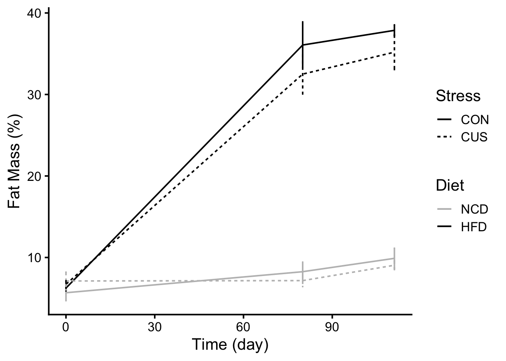{width=672}
:::

```{.r .cell-code}
NMR |>
  group_by(Stress, Diet, `Updated Date`) |>
  summarize(Average = mean(`Lean (%)`), 
            SE = se(`Lean (%)`)) |>
ggplot( 
       aes(x = `Updated Date`, 
           y = `Average`, 
           ymin = Average - SE, 
           ymax = Average + SE, 
           lty = Stress, 
           color = Diet)) +  
  geom_line() +
  geom_errorbar(width = 0.5) +
  labs(y = "Lean Mass (%)", 
       x = "Time (day)") +
  scale_color_manual(values = c("grey", "black")) +
  theme_classic(base_size = 16)
```

::: {.cell-output-display}
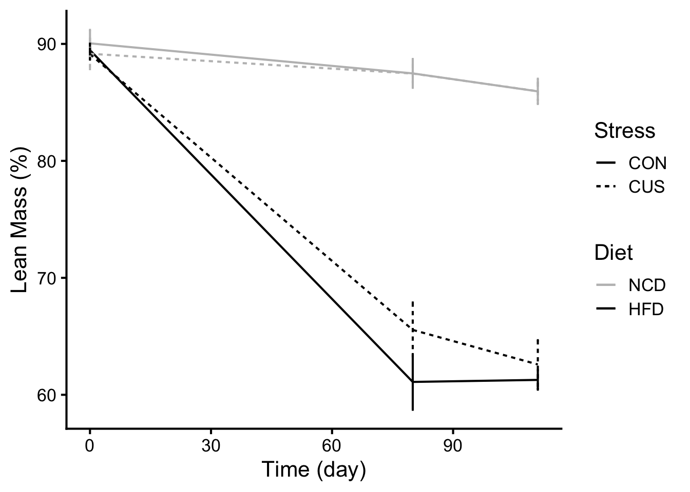{width=672}
:::

```{.r .cell-code}
NMR |>
  group_by(Stress, Diet, `Updated Date`) |>
  summarize(Average = mean(`Fat (g)`), 
            SE = se(`Fat (g)`)) |>
ggplot( 
       aes(x = `Updated Date`, 
           y = `Average`, 
           ymin = Average - SE, 
           ymax = Average + SE, 
           lty = Stress, 
           color = Diet)) +  
  geom_line() +
  geom_errorbar(width = 2.5) +
  labs(y = "Fat Mass (g)", 
       x = "Time (day)") +
  scale_color_manual(values = c("grey", "black")) +
  theme_classic(base_size = 16)
```

::: {.cell-output-display}
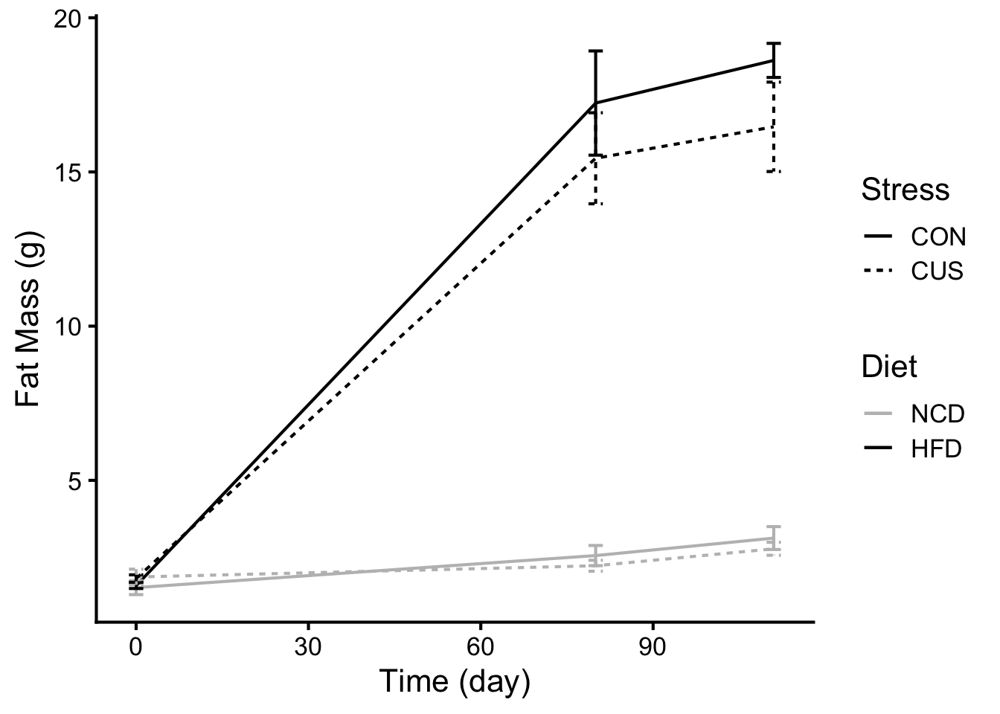{width=672}
:::

```{.r .cell-code}
NMR |>
  group_by(Stress, Diet, `Updated Date`) |>
  summarize(Average = mean(`Lean (g)`), 
            SE = se(`Lean (g)`)) |>
ggplot( 
       aes(x = `Updated Date`, 
           y = `Average`, 
           ymin = Average - SE, 
           ymax = Average + SE, 
           lty = Stress, 
           color = Diet)) +  
  geom_line() +
  geom_errorbar(width = 2.5) +
  labs(y = "Lean Mass (g)", 
       x = "Time (day)") +
  scale_color_manual(values = c("grey", "black")) +
  theme_classic(base_size = 16)
```

::: {.cell-output-display}
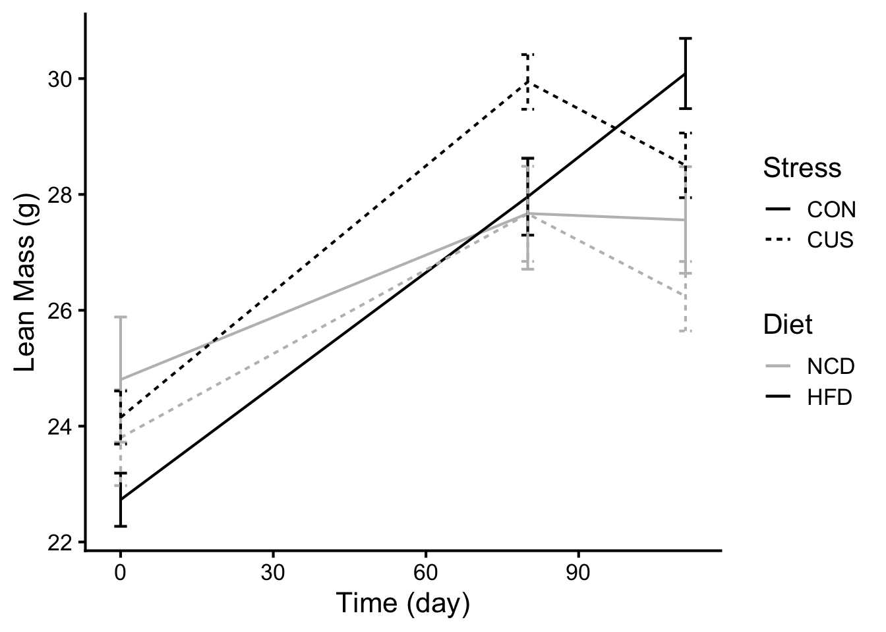{width=672}
:::
:::


#### Body Composition Change Since Stress Initiation


::: {.cell}

```{.r .cell-code}
NMR.stress <- NMR |>
  filter(`Updated Date` >= 12*7-4) |> #filter for only data after start (NMR is 4 days before wk 12)
  arrange(Date) |> #sort by date
  group_by(Code) |> #group by the code
  mutate(Fat.Change = `Fat (g)`-first(`Fat (g)`)) |> 
  mutate(Lean.Change = `Lean (g)`-first(`Lean (g)`)) |>
  mutate(Fat.Change.Percent = `Fat (%)`-first(`Fat (%)`)) |>
  mutate(Lean.Change.Percent = `Lean (%)`-first(`Lean (%)`))

NMR.stress |>
  group_by(Stress, Diet, `Updated Date`) |>
  summarize(Average = mean(`Fat.Change`), 
            SE = se(`Fat.Change`)) |>
ggplot( 
       aes(x = `Updated Date`, 
           y = `Average`, 
           ymin = Average - SE, 
           ymax = Average + SE, 
           lty = Stress, 
           color = Diet)) +  
  geom_line() +
  geom_errorbar(width = 0.8) +
  labs(y = "Change in Fat Mass (g)", 
       x = "Time (day)") +
  scale_color_manual(values = c("grey", "black")) +
  theme_classic(base_size = 16)
```

::: {.cell-output-display}
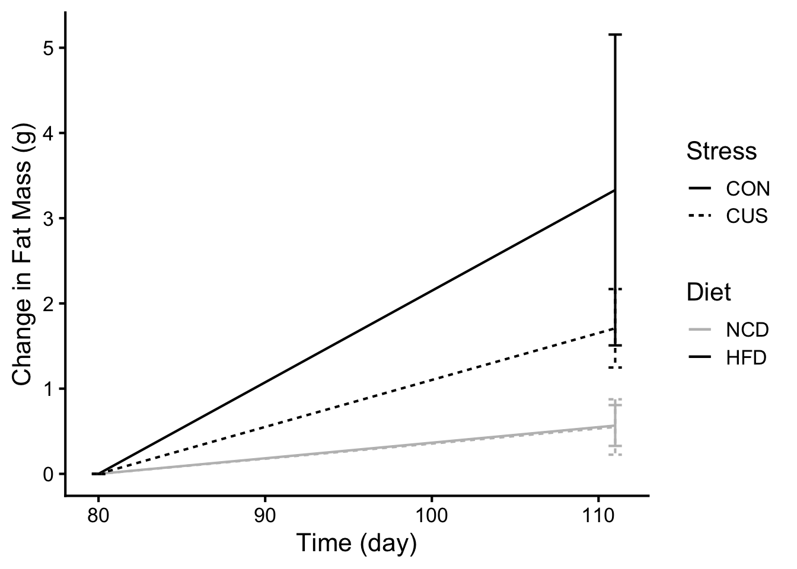{width=672}
:::

```{.r .cell-code}
NMR.stress |>
  group_by(Stress, Diet, `Updated Date`) |>
  summarize(Average = mean(`Lean.Change`), 
            SE = se(`Lean.Change`)) |>
ggplot( 
       aes(x = `Updated Date`, 
           y = `Average`, 
           ymin = Average - SE, 
           ymax = Average + SE, 
           lty = Stress, 
           color = Diet)) +  
  geom_line() +
  geom_errorbar(width = 0.8) +
  labs(y = "Change in Lean Mass (g)", 
       x = "Time (day)") +
  scale_color_manual(values = c("grey", "black")) +
  theme_classic(base_size = 16)
```

::: {.cell-output-display}
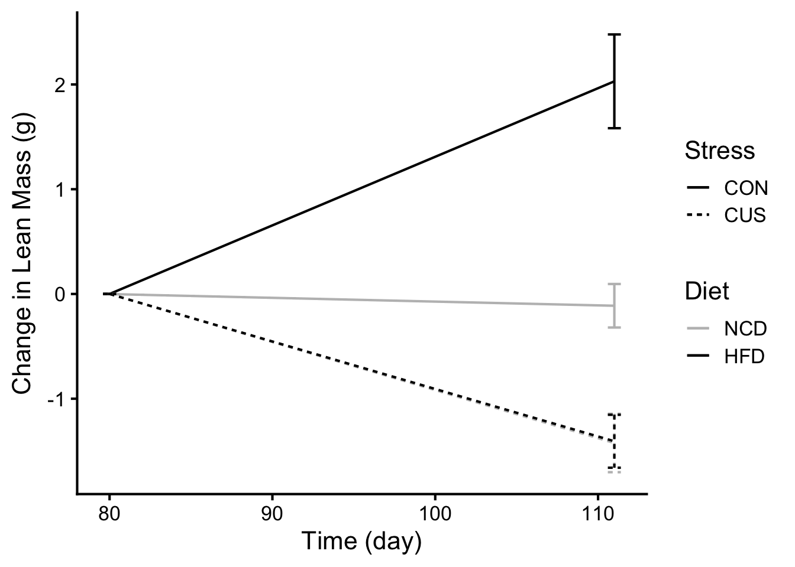{width=672}
:::

```{.r .cell-code}
NMR.stress |>
  group_by(Stress, Diet, `Updated Date`) |>
  summarize(Average = mean(`Fat.Change.Percent`), 
            SE = se(`Fat.Change.Percent`)) |>
ggplot( 
       aes(x = `Updated Date`, 
           y = `Average`, 
           ymin = Average - SE, 
           ymax = Average + SE, 
           lty = Stress, 
           color = Diet)) +  
  geom_line() +
  geom_errorbar(width = 0.8) +
  labs(y = "Change in Fat Mass (%)", 
       x = "Time (day)") +
  scale_color_manual(values = c("grey", "black")) +
  theme_classic(base_size = 16)
```

::: {.cell-output-display}
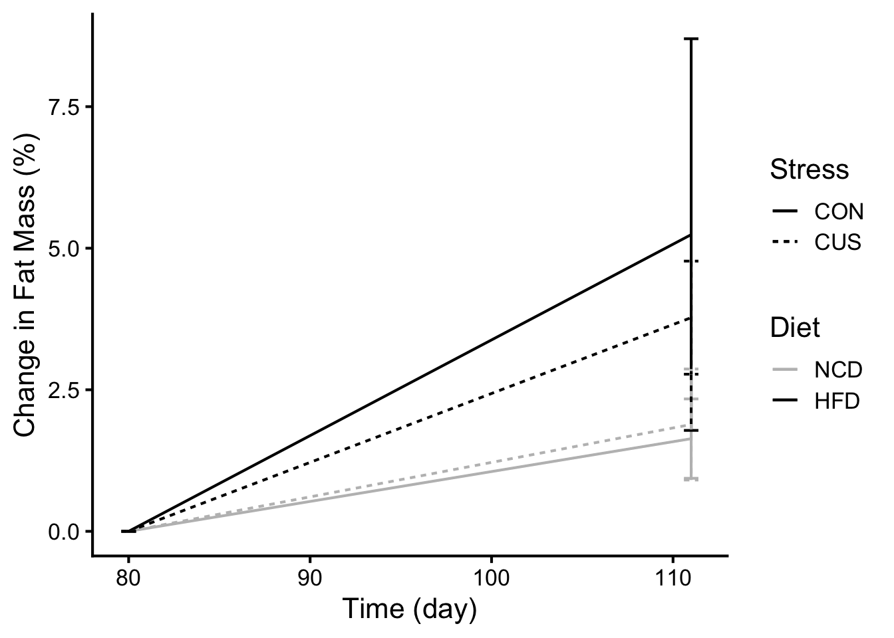{width=672}
:::

```{.r .cell-code}
NMR.stress |>
  group_by(Stress, Diet, `Updated Date`) |>
  summarize(Average = mean(`Lean.Change.Percent`), 
            SE = se(`Lean.Change.Percent`)) |>
ggplot( 
       aes(x = `Updated Date`, 
           y = `Average`, 
           ymin = Average - SE, 
           ymax = Average + SE, 
           lty = Stress, 
           color = Diet)) +  
  geom_line() +
  geom_errorbar(width = 0.8) +
  labs(y = "Change in Lean Mass (%)", 
       x = "Time (day)") +
  scale_color_manual(values = c("grey", "black")) +
  theme_classic(base_size = 16)
```

::: {.cell-output-display}
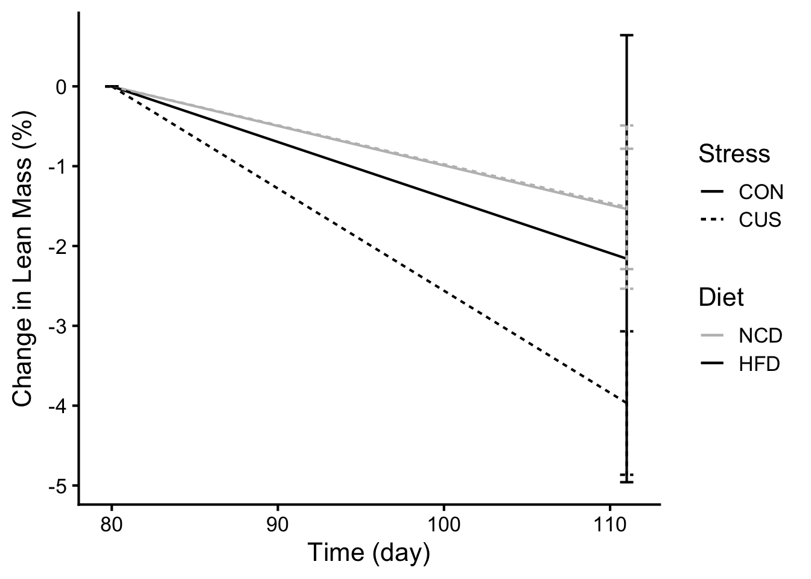{width=672}
:::
:::


##### Statistics About Body Composition Change Since Stress Initiation


::: {.cell}

```{.r .cell-code}
#fat mass change
fat.post.stress <- filter(NMR, `Updated Date` >= 80) |> 
  mutate(Diet = relevel(as.factor(Diet), ref = "NCD")) 

fat.post.stress.mlm <- lmer(`Fat (g)` ~ `Updated Date` + Diet + Stress + (1 + `Updated Date`||Code), data = fat.post.stress)
fat.post.stress.mlm |>
  tidy(effects = 'fixed') |>
  kable(caption = 'Effect of Diet, Stress, Time on Fat Mass after Stress')
```

::: {.cell-output-display}


Table: Effect of Diet, Stress, Time on Fat Mass after Stress

|effect |term           |   estimate| std.error| statistic|       df|   p.value|
|:------|:--------------|----------:|---------:|---------:|--------:|---------:|
|fixed  |(Intercept)    | -0.8088137| 1.7606599| -0.459381| 61.05632| 0.6475920|
|fixed  |`Updated Date` |  0.0440766| 0.0152912|  2.882484| 33.95094| 0.0067973|
|fixed  |DietHFD        | 14.6151033| 1.0963822| 13.330300| 36.18529| 0.0000000|
|fixed  |StressCUS      | -1.4497496| 1.0770694| -1.346013| 36.52982| 0.1865926|


:::

```{.r .cell-code}
fat.post.stress.mlm.int.hfd <- lmer(`Fat (g)` ~ `Updated Date` + Stress + Stress:`Updated Date` + (1 + `Updated Date`||Code), data = fat.post.stress |>
                                      filter(Diet == 'HFD'))
fat.post.stress.mlm.int.hfd |>
  tidy(effects = 'fixed') |>
  kable(caption = 'Effect of Diet, Stress, Time, Stress:Time on HFD mice Fat Mass after Stress')
```

::: {.cell-output-display}


Table: Effect of Diet, Stress, Time, Stress:Time on HFD mice Fat Mass after Stress

|effect |term                     |   estimate| std.error|  statistic|       df|   p.value|
|:------|:------------------------|----------:|---------:|----------:|--------:|---------:|
|fixed  |(Intercept)              | 10.0482540| 3.8425919|  2.6149678| 21.67692| 0.0159257|
|fixed  |`Updated Date`           |  0.0898135| 0.0397787|  2.2578300| 17.72795| 0.0368184|
|fixed  |StressCUS                |  1.4860799| 5.2635053|  0.2823365| 21.67345| 0.7803641|
|fixed  |`Updated Date`:StressCUS | -0.0409510| 0.0536590| -0.7631709| 17.37404| 0.4556000|


:::

```{.r .cell-code}
fat.post.stress.mlm.int.ncd <- lmer(`Fat (g)` ~ `Updated Date` + Stress + Stress:`Updated Date` + (1 + `Updated Date`||Code), data = fat.post.stress |>
                                      filter(Diet == 'NCD'))
fat.post.stress.mlm.int.ncd |>
  tidy(effects = 'fixed') |>
  kable(caption = 'Effect of Diet, Stress, Time, Stress:Time on NCD mice Fat Mass after Stress')
```

::: {.cell-output-display}


Table: Effect of Diet, Stress, Time, Stress:Time on NCD mice Fat Mass after Stress

|effect |term                     |   estimate| std.error|  statistic|       df|   p.value|
|:------|:------------------------|----------:|---------:|----------:|--------:|---------:|
|fixed  |(Intercept)              |  1.0967339| 0.8746083|  1.2539715| 14.12832| 0.2302043|
|fixed  |`Updated Date`           |  0.0183065| 0.0088814|  2.0612176| 14.68778| 0.0574469|
|fixed  |StressCUS                | -0.2848387| 1.2368829| -0.2302875| 14.12832| 0.8211694|
|fixed  |`Updated Date`:StressCUS | -0.0005645| 0.0125602| -0.0449450| 14.68778| 0.9647565|


:::

```{.r .cell-code}
#slope differences
fat.post.stress <- fat.post.stress |>
  mutate(time_fat = as.numeric(`Updated Date`)) #convert to numeric for 3-way interaction

fat.post.stress.mlm.int <- lmer(`Fat (g)` ~ time_fat * Diet * Stress + (1 + time_fat||Code), data = fat.post.stress)
fat.post.stress.mlm.int |>
  tidy(effects = 'fixed') |>
  kable(caption = 'FINAL MODEL: Diet, Stress, Time, and all interaction effects on Fat Mass after stress')
```

::: {.cell-output-display}


Table: FINAL MODEL: Diet, Stress, Time, and all interaction effects on Fat Mass after stress

|effect |term                       |   estimate| std.error|  statistic|       df|   p.value|
|:------|:--------------------------|----------:|---------:|----------:|--------:|---------:|
|fixed  |(Intercept)                |  1.0967339| 3.1756406|  0.3453583| 40.03697| 0.7316330|
|fixed  |time_fat                   |  0.0183065| 0.0306837|  0.5966185| 29.39201| 0.5553301|
|fixed  |DietHFD                    |  8.8589712| 4.3073022|  2.0567331| 39.90345| 0.0462908|
|fixed  |StressCUS                  | -0.2848387| 4.4910341| -0.0634239| 40.03697| 0.9497446|
|fixed  |time_fat:DietHFD           |  0.0726639| 0.0429163|  1.6931542| 30.60536| 0.1005827|
|fixed  |time_fat:StressCUS         | -0.0005645| 0.0433933| -0.0130093| 29.39201| 0.9897083|
|fixed  |DietHFD:StressCUS          |  1.8307706| 6.0048886|  0.3048800| 39.94076| 0.7620406|
|fixed  |time_fat:DietHFD:StressCUS | -0.0411346| 0.0593298| -0.6933221| 30.27562| 0.4933925|


:::

```{.r .cell-code}
emtrends(fat.post.stress.mlm.int, ~ Diet * Stress, var = "time_fat") -> slopes_fat
pairs(slopes_fat, by = 'Diet') |>
  summary() |>
  as.data.frame() |>
  ggplot(aes(x = Diet, 
             y = -estimate, 
             ymin = -estimate - SE, 
             ymax = -estimate + SE, 
             fill = Diet)) +
  geom_bar(stat = "identity", 
           position = "dodge") +
  geom_errorbar(position = position_dodge(width = 0.9), 
                width = 0.1) +
    labs(y = "Fat Mass Difference due to Stress (g/day)",
       x = "Diet") +
  theme_classic(base_size = 15) +
  scale_fill_manual(values = c("HFD" = "black", "NCD" = "grey"))
```

::: {.cell-output-display}
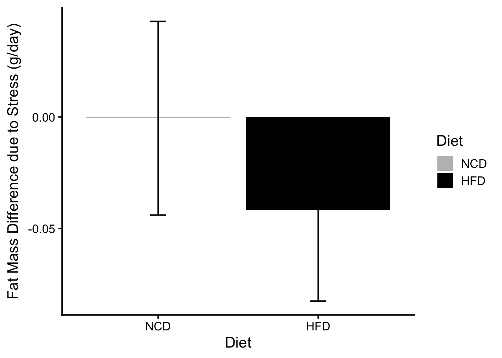{width=672}
:::

```{.r .cell-code}
#lean mass change
lean.post.stress <- filter(NMR, `Updated Date` >= 80) |> 
  mutate(Diet = relevel(as.factor(Diet), ref = "NCD"))

lean.post.stress.mlm <- lmer(`Lean (g)` ~ `Updated Date` + Diet + Stress + (1 + `Updated Date`||Code), data = lean.post.stress)
lean.post.stress.mlm |>
  tidy(effects = 'fixed') |>
  kable(caption = 'Effect of Diet, Stress, Time on Lean Mass after Stress')
```

::: {.cell-output-display}


Table: Effect of Diet, Stress, Time on Lean Mass after Stress

|effect |term           |   estimate| std.error|  statistic|       df|   p.value|
|:------|:--------------|----------:|---------:|----------:|--------:|---------:|
|fixed  |(Intercept)    | 28.0508326| 1.0452123| 26.8374485| 62.50491| 0.0000000|
|fixed  |`Updated Date` | -0.0087189| 0.0089853| -0.9703506| 34.92414| 0.3385445|
|fixed  |DietHFD        |  1.6974703| 0.6644335|  2.5547632| 37.25524| 0.0148424|
|fixed  |StressCUS      |  0.1323930| 0.6526362|  0.2028587| 37.58255| 0.8403397|


:::

```{.r .cell-code}
lean.post.stress.mlm.int.hfd <- lmer(`Lean (g)` ~ `Updated Date` + Stress + Stress:`Updated Date` + (1 + `Updated Date`||Code), data = lean.post.stress |>
                                      filter(Diet == 'HFD'))
lean.post.stress.mlm.int.hfd |>
  tidy(effects = 'fixed') |>
  kable(caption = 'Effect of Diet, Stress, Time, Stress:Time on HFD mice Lean Mass after Stress')
```

::: {.cell-output-display}


Table: Effect of Diet, Stress, Time, Stress:Time on HFD mice Lean Mass after Stress

|effect |term                     |   estimate| std.error| statistic|       df|  p.value|
|:------|:------------------------|----------:|---------:|---------:|--------:|--------:|
|fixed  |(Intercept)              | 22.6818536| 1.1578134| 19.590249| 24.98619| 0.00e+00|
|fixed  |`Updated Date`           |  0.0659768| 0.0114662|  5.754052| 17.50311| 2.09e-05|
|fixed  |StressCUS                | 10.9029880| 1.5880198|  6.865776| 25.36706| 3.00e-07|
|fixed  |`Updated Date`:StressCUS | -0.1115061| 0.0154292| -7.226936| 17.30887| 1.30e-06|


:::

```{.r .cell-code}
lean.post.stress.mlm.int.ncd <- lmer(`Lean (g)` ~ `Updated Date` + Stress + Stress:`Updated Date` + (1 + `Updated Date`||Code), data = lean.post.stress |>
                                      filter(Diet == 'NCD'))
lean.post.stress.mlm.int.ncd |>
  tidy(effects = 'fixed') |>
  kable(caption = 'Effect of Diet, Stress, Time, Stress:Time on NCD mice Lean Mass after Stress')
```

::: {.cell-output-display}


Table: Effect of Diet, Stress, Time, Stress:Time on NCD mice Lean Mass after Stress

|effect |term                     |   estimate| std.error|  statistic|       df|   p.value|
|:------|:------------------------|----------:|---------:|----------:|--------:|---------:|
|fixed  |(Intercept)              | 27.9615726| 1.1226824| 24.9060393| 27.77987| 0.0000000|
|fixed  |`Updated Date`           | -0.0036290| 0.0079340| -0.4574012| 14.00000| 0.6544003|
|fixed  |StressCUS                |  3.3743952| 1.5877127|  2.1253185| 27.77987| 0.0425909|
|fixed  |`Updated Date`:StressCUS | -0.0422581| 0.0112204| -3.7661798| 14.00000| 0.0020856|


:::

```{.r .cell-code}
#slope differences
lean.post.stress <- lean.post.stress |>
  mutate(time_lean = as.numeric(`Updated Date`)) #convert to numeric for 3-way interaction

lean.post.stress.mlm.int <- lmer(`Lean (g)` ~ time_lean * Diet * Stress + (1 + time_lean||Code), data = lean.post.stress)
lean.post.stress.mlm.int |>
  tidy(effects = 'fixed') |>
  kable(caption = 'FINAL MODEL: Diet, Stress, Time, and all interaction effects on Lean Mass after stress')
```

::: {.cell-output-display}


Table: FINAL MODEL: Diet, Stress, Time, and all interaction effects on Lean Mass after stress

|effect |term                        |   estimate| std.error|  statistic|       df|   p.value|
|:------|:---------------------------|----------:|---------:|----------:|--------:|---------:|
|fixed  |(Intercept)                 | 27.9615726| 1.1965682| 23.3681401| 57.53922| 0.0000000|
|fixed  |time_lean                   | -0.0036290| 0.0101075| -0.3590423| 30.43196| 0.7220427|
|fixed  |DietHFD                     | -5.2638278| 1.6106026| -3.2682349| 55.62610| 0.0018582|
|fixed  |StressCUS                   |  3.3743952| 1.6922029|  1.9940842| 57.53922| 0.0508893|
|fixed  |time_lean:DietHFD           |  0.0694072| 0.0142384|  4.8746615| 30.88965| 0.0000310|
|fixed  |time_lean:StressCUS         | -0.0422581| 0.0142942| -2.9563061| 30.43196| 0.0059666|
|fixed  |DietHFD:StressCUS           |  7.5070787| 2.2502072|  3.3361721| 56.17674| 0.0015105|
|fixed  |time_lean:DietHFD:StressCUS | -0.0689791| 0.0196465| -3.5110087| 30.76780| 0.0014010|


:::

```{.r .cell-code}
emtrends(lean.post.stress.mlm.int, ~ Diet * Stress, var = "time_lean") -> slopes_lean
pairs(slopes_lean, by = 'Diet') |>
  summary() |>
  as.data.frame() |>
  ggplot(aes(x = Diet, 
             y = -estimate, 
             ymin = -estimate - SE, 
             ymax = -estimate + SE, 
             fill = Diet)) +
  geom_bar(stat = "identity", 
           position = "dodge") +
  geom_errorbar(position = position_dodge(width = 0.9), 
                width = 0.1) +
    labs(y = "Lean Mass Difference due to Stress (g/day)",
       x = "Diet") +
  theme_classic(base_size = 15) +
  scale_fill_manual(values = c("HFD" = "black", "NCD" = "grey"))
```

::: {.cell-output-display}
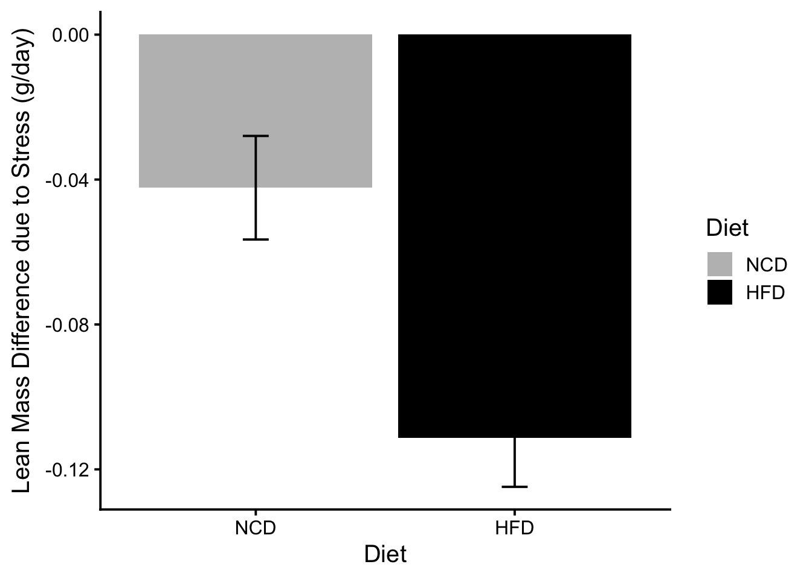{width=672}
:::
:::


### Energy Expenditure

::: {.cell}

```{.r .cell-code}
#per mouse change in fat and lean mass
energy.NMR.post.stress <- NMR.stress |>
  group_by(Code) |>
  summarize(Diet = first(Diet), 
            Stress = first(Stress), 
            Fat.Change = last(`Fat (g)`) - first(`Fat (g)`),
            Lean.Change = last(`Lean (g)`) - first(`Lean (g)`),
            .groups = "drop") |>
  mutate(Fat.kcal = Fat.Change * 9.1) |>
  mutate(Lean.kcal = Lean.Change * 4.2) |>
  mutate(Total.kcal = Fat.kcal + Lean.kcal) |>
  mutate(kcal.day = Total.kcal/21) |>
  filter(kcal.day != 0)

#per mouse cumulative calorie intake
stress.start <- 12*7
energy.food.post.stress <- grouped_food_cage |>
  filter(`Weighted Date` > stress.start) |>
  group_by(Code, Diet, Stress) |>
  summarize(FI.kcal = mean(kcal_per_day, na.rm = TRUE)) #total kcal prior to stress

energy.expenditure.post.stress <- left_join(energy.NMR.post.stress, 
                                  energy.food.post.stress, 
                                  by = c("Code", "Diet", "Stress")) |>
  fill(FI.kcal, .direction = c("down")) |>
  mutate(kcal.balance.day = FI.kcal - kcal.day) 

energy.expenditure.post.stress |>
  group_by(Diet, Stress) |>
  summarize(Average.kcal.balance.day = mean(kcal.balance.day, na.rm = TRUE),
            SE.kcal.balance.day = sd(kcal.balance.day, na.rm = TRUE)/sqrt(n()),
            .groups = "drop") |>
ggplot(
       aes(x = Diet,
           y = Average.kcal.balance.day,
           ymin = Average.kcal.balance.day - SE.kcal.balance.day,
           ymax = Average.kcal.balance.day + SE.kcal.balance.day,
           fill = Diet, 
           alpha = Stress)) +  
  geom_col(position = position_dodge(width = 0.9)) +
  geom_errorbar(width = 0.2, 
                position = position_dodge(width = 0.9)) +
  labs(y = "Estimated Energy Expenditure (kcal/day)",
       x = "") +
  geom_hline(yintercept = 0,
             lty = 2) +
  scale_fill_manual(values = c("grey", "black")) +
  scale_alpha_manual(values = c("CON" = 1, "CUS" = 0.8)) +
  theme_classic(base_size = 15)
```

::: {.cell-output-display}
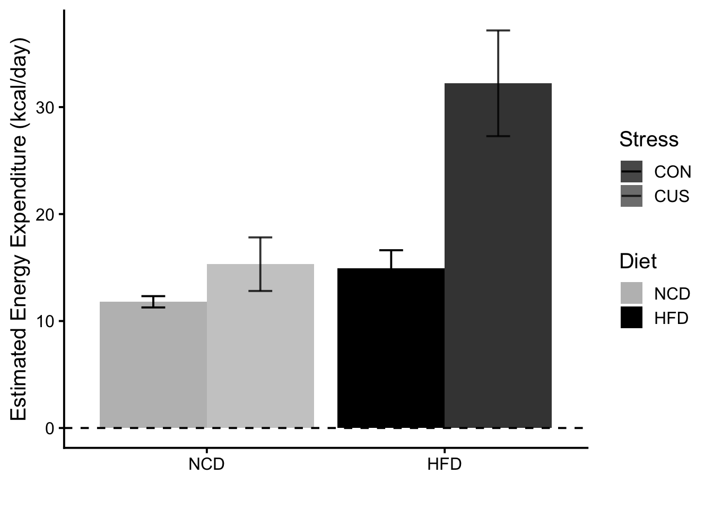{width=672}
:::
:::


##### Statistics About Energy Expenditure Post-Stress

::: {.cell}

```{.r .cell-code}
energy.expenditure.post.stress.lm <- lm(kcal.balance.day ~ Diet * Stress, data = energy.expenditure.post.stress)
energy.expenditure.post.stress.lm |>
  tidy() |>
  kable(caption = 'FINAL MODEL: Effect of Diet, Stress, and interaction effects on Estimated Energy Expenditure after Stress')
```

::: {.cell-output-display}


Table: FINAL MODEL: Effect of Diet, Stress, and interaction effects on Estimated Energy Expenditure after Stress

|term              |  estimate| std.error| statistic|   p.value|
|:-----------------|---------:|---------:|---------:|---------:|
|(Intercept)       | 11.798232|  3.367965| 3.5030743| 0.0014648|
|DietHFD           |  3.138940|  4.763022| 0.6590229| 0.5149081|
|StressCUS         |  3.516774|  4.763022| 0.7383493| 0.4660395|
|DietHFD:StressCUS | 13.769749|  6.565373| 2.0973293| 0.0444953|


:::

```{.r .cell-code}
energy.expenditure.post.stress.lm.hfd <- lm(kcal.balance.day ~ Stress, data = energy.expenditure.post.stress |>
                                              filter(Diet == 'HFD'))
energy.expenditure.post.stress.lm.hfd |>
  tidy() |>
  kable(caption = 'Effect of Diet and Stress on Daily Estimated Energy Expenditure in HFD mice after Stress')
```

::: {.cell-output-display}


Table: Effect of Diet and Stress on Daily Estimated Energy Expenditure in HFD mice after Stress

|term        | estimate| std.error| statistic|   p.value|
|:-----------|--------:|---------:|---------:|---------:|
|(Intercept) | 14.93717|  4.289779|  3.482038| 0.0030781|
|StressCUS   | 17.28652|  5.755343|  3.003561| 0.0084167|


:::

```{.r .cell-code}
energy.expenditure.post.stress.lm.ncd <- lm(kcal.balance.day ~ Stress, data = energy.expenditure.post.stress |>
                                              filter(Diet == 'NCD'))
energy.expenditure.post.stress.lm.ncd |>
  tidy() |>
  kable(caption = 'Effect of Diet and Stress on Daily Estimated Energy Expenditure in NCD mice after Stress')
```

::: {.cell-output-display}


Table: Effect of Diet and Stress on Daily Estimated Energy Expenditure in NCD mice after Stress

|term        |  estimate| std.error| statistic|   p.value|
|:-----------|---------:|---------:|---------:|---------:|
|(Intercept) | 11.798232|  1.809902|  6.518715| 0.0000136|
|StressCUS   |  3.516774|  2.559587|  1.373961| 0.1910531|


:::
:::


## Session Information


::: {.cell}

```{.r .cell-code}
sessionInfo()
```

::: {.cell-output .cell-output-stdout}

```
R version 4.6.0 (2026-04-24)
Platform: aarch64-apple-darwin23
Running under: macOS Tahoe 26.5.1

Matrix products: default
BLAS:   /Library/Frameworks/R.framework/Versions/4.6/Resources/lib/libRblas.0.dylib 
LAPACK: /Library/Frameworks/R.framework/Versions/4.6/Resources/lib/libRlapack.dylib;  LAPACK version 3.12.1

locale:
[1] en_US.UTF-8/en_US.UTF-8/en_US.UTF-8/C/en_US.UTF-8/en_US.UTF-8

time zone: America/Detroit
tzcode source: internal

attached base packages:
[1] stats     graphics  grDevices utils     datasets  methods   base     

other attached packages:
 [1] AER_1.2-16          lmtest_0.9-40       zoo_1.8-15         
 [4] car_3.1-5           carData_3.0-6       fitdistrplus_1.2-6 
 [7] survival_3.8-6      drc_3.0-1           DHARMa_0.5.0       
[10] pbkrtest_0.5.5      emmeans_2.0.3       influence.ME_0.9-10
[13] mediation_4.5.1     sandwich_3.1-1      mvtnorm_1.4-1      
[16] MASS_7.3-65         ggpattern_1.3.1     see_0.13.0         
[19] performance_0.16.0  broom.mixed_0.2.9.7 broom_1.0.13       
[22] knitr_1.51          lmerTest_3.2-1      lme4_2.0-1         
[25] Matrix_1.7-5        readxl_1.5.0        lubridate_1.9.5    
[28] forcats_1.0.1       stringr_1.6.0       dplyr_1.2.1        
[31] purrr_1.2.2         readr_2.2.0         tidyr_1.3.2        
[34] tibble_3.3.1        ggplot2_4.0.3       tidyverse_2.0.0    

loaded via a namespace (and not attached):
 [1] Rdpack_2.6.6        gridExtra_2.3       rlang_1.2.0        
 [4] magrittr_2.0.5      multcomp_1.4-30     furrr_0.4.0        
 [7] otel_0.2.0          compiler_4.6.0      mgcv_1.9-4         
[10] vctrs_0.7.3         pkgconfig_2.0.3     fastmap_1.2.0      
[13] backports_1.5.1     labeling_0.4.3      rmarkdown_2.31     
[16] tzdb_0.5.0          nloptr_2.2.1        xfun_0.57          
[19] jsonlite_2.0.0      parallel_4.6.0      cluster_2.1.8.2    
[22] R6_2.6.1            stringi_1.8.7       RColorBrewer_1.1-3 
[25] parallelly_1.47.0   boot_1.3-32         rpart_4.1.27       
[28] cellranger_1.1.0    numDeriv_2016.8-1.1 estimability_1.5.1 
[31] Rcpp_1.1.1-1.1      parameters_0.29.0   base64enc_0.1-6    
[34] splines_4.6.0       nnet_7.3-20         timechange_0.4.0   
[37] tidyselect_1.2.1    abind_1.4-8         rstudioapi_0.19.0  
[40] yaml_2.3.12         codetools_0.2-20    listenv_0.10.1     
[43] lattice_0.22-9      bayestestR_0.17.0   withr_3.0.2        
[46] S7_0.2.2            coda_0.19-4.1       evaluate_1.0.5     
[49] foreign_0.8-91      future_1.70.0       lpSolve_5.6.23     
[52] pillar_1.11.1       checkmate_2.3.4     reformulas_0.4.4   
[55] insight_1.5.0       generics_0.1.4      hms_1.1.4          
[58] scales_1.4.0        minqa_1.2.8         gtools_3.9.5       
[61] globals_0.19.1      xtable_1.8-8        glue_1.8.1         
[64] Hmisc_5.2-5         tools_4.6.0         data.table_1.18.4  
[67] grid_4.6.0          plotrix_3.8-14      rbibutils_2.4.1    
[70] datawizard_1.3.1    colorspace_2.1-2    patchwork_1.3.2    
[73] nlme_3.1-169        htmlTable_2.5.0     Formula_1.2-5      
[76] cli_3.6.6           gtable_0.3.6        digest_0.6.39      
[79] TH.data_1.1-5       htmlwidgets_1.6.4   farver_2.1.2       
[82] htmltools_0.5.9     lifecycle_1.0.5    
```


:::
:::

