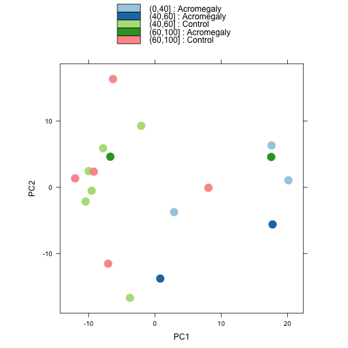

This is to check if age is a confouding factor for expression, methylation, and the relation


The counts tables were generated previously using  **HTseq.sh** shell script and **merge.command** on Hera.  It removes the outlier data point from the analysis, which was patient **29**.
This script requires a transcript counts table.  There is also a sample mapping file called **patient_sample_mapping.csv** which links the diagnosis the the samples.  This file was most recently processed on ``Tue Sep 23 08:35:33 2014``.


 

```
## pdf 
##   2
```

 


```
## Loading required package: plyr
## 
## Attaching package: 'plyr'
## 
## The following objects are masked from 'package:IRanges':
## 
##     desc, rename
## 
## Loading required package: grid
```

 

```
## pdf 
##   2
```

 

```
## pdf 
##   2
```


This step gets the protein coding genes only.


 

```
## pdf 
##   2
```

Full Analysis
--------------


```
## [1] 0
```

```
## [1] 75
```

```
## [1] 87
```

```
## [1] 94
```

  

Annotation
-------------

This step annotates the data tables with the official gene symbols.


Adjusting for age
----------------
Acromegaly: The number of significant genes affected by disease controlling for all age groups is 75. Number of genes significantly changed between Acromegaly and Control in the age group (40,60] is 87. Number of genes significantly changed between Acromegaly and Control in the age group (60,100] is 4.


Session Information
-------------------

For the R session, the package versions were:

```r
sessionInfo()
```

```
## R version 3.1.0 (2014-04-10)
## Platform: x86_64-apple-darwin13.1.0 (64-bit)
## 
## locale:
## [1] en_US.UTF-8/en_US.UTF-8/en_US.UTF-8/C/en_US.UTF-8/en_US.UTF-8
## 
## attached base packages:
## [1] grid      parallel  stats     graphics  grDevices utils     datasets 
## [8] methods   base     
## 
## other attached packages:
##  [1] biomaRt_2.20.0          plyr_1.8.1             
##  [3] ggplot2_1.0.0           reshape2_1.4           
##  [5] DESeq2_1.4.5            RcppArmadillo_0.4.400.0
##  [7] Rcpp_0.11.2             GenomicRanges_1.16.4   
##  [9] GenomeInfoDb_1.0.2      IRanges_1.22.10        
## [11] BiocGenerics_0.10.0     knitr_1.6              
## 
## loaded via a namespace (and not attached):
##  [1] annotate_1.42.1      AnnotationDbi_1.26.0 Biobase_2.24.0      
##  [4] colorspace_1.2-4     DBI_0.3.0            digest_0.6.4        
##  [7] evaluate_0.5.5       formatR_1.0          genefilter_1.46.1   
## [10] geneplotter_1.42.0   gtable_0.1.2         labeling_0.3        
## [13] lattice_0.20-29      locfit_1.5-9.1       MASS_7.3-34         
## [16] munsell_0.4.2        proto_0.3-10         RColorBrewer_1.0-5  
## [19] RCurl_1.95-4.3       RSQLite_0.11.4       scales_0.2.4        
## [22] splines_3.1.0        stats4_3.1.0         stringr_0.6.2       
## [25] survival_2.37-7      tools_3.1.0          XML_3.98-1.1        
## [28] xtable_1.7-4         XVector_0.4.0
```
