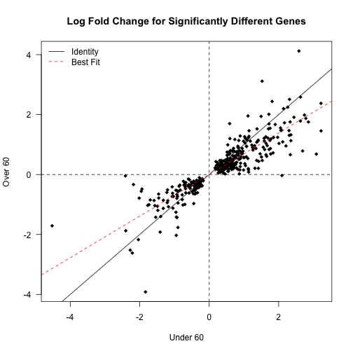

Summary of Age-Corrected Effects
========================================================


This analysis uses as an input the age-adjusted analysis, found in ../data/processed/Annotated_Results_GRCh37.74_Acromegaly_age.csv.  This script was most recently run on Sun Oct  5 10:50:38 2014.  

Number of Significantly Different Genes
----------------------------------------

After adjusting for age there were 418 significantly different genes.  This includes 290 upregulated genes and 128 downregulated genes.


There were also 254 significantly different genes in the 40-60 year old cohort and 3 genes in the 60+ cohort.  All together this includes 466.  

Age-Dependent Effects
-----------------------


Amongst the significantly different genes, the absolute value of the fold change of the under 60 patients was 2.1163 +/- 0.0788 wheras for the older patients it was 1.7583 +/- 0.0653.  This means that in general the younger cohort gene expression changes were 1.252 +/- 0.0285 fold larger.

 

These data were not normally distributed by Shapiro-Wilk test (4.5273 &times; 10<sup>-32</sup> and 2.2997 &times; 10<sup>-34</sup>), so we did a Wilcoxon test between these groups and found that they were significantly different 1.4287 &times; 10<sup>-11</sup>.


Session Information
-------------------

```
## R version 3.1.0 (2014-04-10)
## Platform: x86_64-apple-darwin13.1.0 (64-bit)
## 
## locale:
## [1] en_US.UTF-8/en_US.UTF-8/en_US.UTF-8/C/en_US.UTF-8/en_US.UTF-8
## 
## attached base packages:
## [1] stats     graphics  grDevices utils     datasets  methods   base     
## 
## other attached packages:
## [1] knitr_1.6
## 
## loaded via a namespace (and not attached):
## [1] evaluate_0.5.5 formatR_1.0    stringr_0.6.2  tools_3.1.0
```

