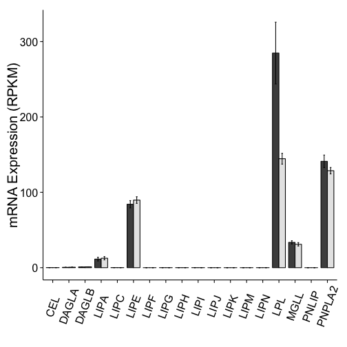

Barplot Analysis of Acromegaly Results
=======================================

Used Analysed DESeq results.


```
## [1] "IGF1"
```

```
## Saving 7 x 7 in image
```

```
## [1] "IGFBP3"
```

```
## Saving 7 x 7 in image
```

```
## [1] "IGFBP5"
```

```
## Saving 7 x 7 in image
```

```
## [1] "IGFALS"
```

```
## Saving 7 x 7 in image
```

```
## [1] "CISH"
```

```
## Saving 7 x 7 in image
```

```
## [1] "SOCS2"
```

```
## Saving 7 x 7 in image
```

```
## [1] "ADRB3"
```

```
## Saving 7 x 7 in image
```

```
## [1] "TSHR"
```

```
## Saving 7 x 7 in image
```

```
## [1] "TCF7L2"
```

```
## Saving 7 x 7 in image
```

```
## [1] "PYGM"
```

```
## Saving 7 x 7 in image
```

```
## [1] "HSD11B1"
```

```
## Saving 7 x 7 in image
```

```
## [1] "LPL"
```

```
## Saving 7 x 7 in image
```

```
## [1] "PGM3"
```

```
## Saving 7 x 7 in image
```

```
## [1] "NR3C1"
```

```
## Saving 7 x 7 in image
```

```
## [1] "MVP"
```

```
## Saving 7 x 7 in image
```

```
## [1] "SCD"
```

```
## Saving 7 x 7 in image
```

```
## [1] "APOL4"
```

```
## Saving 7 x 7 in image
```

```
## [1] "PTPN3"
```

```
## Saving 7 x 7 in image
```

```
## [1] "PTPN4"
```

```
## Saving 7 x 7 in image
```

```
## [1] "CCNE1"
```

```
## Saving 7 x 7 in image
```

```
## [1] "CCNG1"
```

```
## Saving 7 x 7 in image
```

```
## [1] "CDKN2B"
```

```
## Saving 7 x 7 in image
```

```
## [1] "CDKN2B-AS1"
```

```
## Saving 7 x 7 in image
```

```
## [1] "NAP1L1"
```

```
## Saving 7 x 7 in image
```

```
## [1] "ORC2"
```

```
## Saving 7 x 7 in image
```

```
## [1] "PDGFD"
```

```
## Saving 7 x 7 in image
```

```
## [1] "RARB"
```

```
## Saving 7 x 7 in image
```

```
## [1] "PGRMC1"
```

```
## Saving 7 x 7 in image
```

```
## [1] "SCDP1"
```

```
## Saving 7 x 7 in image
```

```
## [1] "SCP2"
```

```
## Saving 7 x 7 in image
```

```
## [1] "MAP3K5"
```

```
## Saving 7 x 7 in image
```

```
## [1] "MAPK13"
```

```
## Saving 7 x 7 in image
```

```
## [1] "MAPKAPK3"
```

```
## Saving 7 x 7 in image
```

```
## [1] "MATN2"
```

```
## Saving 7 x 7 in image
```

```
## [1] "MFAP4"
```

```
## Saving 7 x 7 in image
```

```
## [1] "MMRN2"
```

```
## Saving 7 x 7 in image
```

```
## [1] "NRIP1"
```

```
## Saving 7 x 7 in image
```

```
## [1] "MMD"
```

```
## Saving 7 x 7 in image
```

```
## [1] "ABHD5"
```

```
## Saving 7 x 7 in image
```

```
## [1] "LEPR"
```

```
## Saving 7 x 7 in image
```

```
## [1] "ACVR1C"
```

```
## Saving 7 x 7 in image
```

```
## [1] "GFPT1"
```

```
## Saving 7 x 7 in image
```

```
## [1] "CYB5A"
```

```
## Saving 7 x 7 in image
```

```
## [1] "AVPR1A"
```

```
## Saving 7 x 7 in image
```

```
## [1] "PTGER3"
```

```
## Saving 7 x 7 in image
```

```
## [1] "FADS2"
```

```
## Saving 7 x 7 in image
```

```
## [1] "LIPE"
```

```
## Saving 7 x 7 in image
```

```
## [1] "PNPLA2"
```

```
## Saving 7 x 7 in image
```

```
## [1] "MGLL"
```

```
## Saving 7 x 7 in image
```

```
## [1] "AKT1"
```

```
## Saving 7 x 7 in image
```

```
## [1] "AKT2"
```

```
## Saving 7 x 7 in image
```

```
## [1] "AKT3"
```

```
## Saving 7 x 7 in image
```

```
## [1] "INSR"
```

```
## Saving 7 x 7 in image
```

```
## [1] "IRS1"
```

```
## Saving 7 x 7 in image
```

```
## [1] "IRS2"
```

```
## Saving 7 x 7 in image
```

```
## [1] "IRS4"
```

```
## Saving 7 x 7 in image
```

```
## [1] "SLC2A4"
```

```
## Saving 7 x 7 in image
```

```
## [1] "PIK3R1"
```

```
## Saving 7 x 7 in image
```

```
## [1] "BAG4"
```

```
## Saving 7 x 7 in image
```

```
## [1] "CAPN6"
```

```
## Saving 7 x 7 in image
```

```
## [1] "G0S2"
```

```
## Saving 7 x 7 in image
```

```
## [1] "PPARG"
```

```
## Saving 7 x 7 in image
```

```
## [1] "PPARA"
```

```
## Saving 7 x 7 in image
```

```
## [1] "SERPINA6"
```

```
## Saving 7 x 7 in image
```

```
## [1] "LEPR"
```

```
## Saving 7 x 7 in image
```

```
## [1] "LEP"
```

```
## Saving 7 x 7 in image
```

```
## [1] "ENPP5"
```

```
## Saving 7 x 7 in image
```

```
## [1] "GPR64"
```

```
## Saving 7 x 7 in image
```

```
## [1] "SLC29A1"
```

```
## Saving 7 x 7 in image
```

```
## [1] "SLC2A13"
```

```
## Saving 7 x 7 in image
```

```
## [1] "MAP1LC3C"
```

```
## Saving 7 x 7 in image
```

```
## [1] "PNPLA3"
```

```
## Saving 7 x 7 in image
```

```
## [1] "APOL4"
```

```
## Saving 7 x 7 in image
```

```
## [1] "ARHGAP32"
```

```
## Saving 7 x 7 in image
```

```
## [1] "ZNF217"
```

```
## Saving 7 x 7 in image
```

```
## [1] "CXCL13"
```

```
## Saving 7 x 7 in image
```

```
## [1] "FGF17"
```

```
## Saving 7 x 7 in image
```

```
## [1] "SLC4A1"
```

```
## Saving 7 x 7 in image
```

```
## [1] "SERPINI2"
```

```
## Saving 7 x 7 in image
```

```
## [1] "HLA-DPB1"
```

```
## Saving 7 x 7 in image
```

```
## [1] "HLA-DPB1"
```

```
## Saving 7 x 7 in image
```

```
## [1] "JUN"
```

```
## Saving 7 x 7 in image
```

```
## [1] "JUNB"
```

```
## Saving 7 x 7 in image
```

```
## [1] "JUND"
```

```
## Saving 7 x 7 in image
```

```
## [1] "FOS"
```

```
## Saving 7 x 7 in image
```

```
## [1] "FOSB"
```

```
## Saving 7 x 7 in image
```

```
## [1] "MAPK1"
```

```
## Saving 7 x 7 in image
```

```
## [1] "MAPK3"
```

```
## Saving 7 x 7 in image
```

```
## [1] "PDE3B"
```

```
## Saving 7 x 7 in image
```

```
## [1] "for (gene in young.sig.genes) {\n  #pdf(sprintf(\"../figures/%s-barplot.pdf\"\", gene))\n  #print(gene)\n  if((gene!=\"FLJ27365\"\") & (gene!=\"RP11-407P15.2\"\") & (gene!=\"RP11-644F5.10\"))\n  {\n    gene.data <- young.long.cal[young.long.cal$hgnc_symbol==gene,]\n    ggplot(gene.data, aes(x=Age,y=mean_Expression,fill=Disease)) + \n      geom_bar(stat=\"identity\", position=\"dodge\", colour=\"black\") + \n      geom_errorbar(aes(ymin=mean_Expression-se, ymax=mean_Expression+se), position=position_dodge(0.9), width=.2) + \n      xlab(\"\") + ylab(\"mRNA Expression (RPKM)\")+ \n      theme_bw() + ggtitle(gene) + \n      theme(panel.grid.minor = element_blank()) + \n      theme(panel.grid.major = element_blank()) + \n      theme(panel.border=element_blank()) + \n      theme(axis.line = element_line(color = \"black\")) +\n      scale_colour_grey(start = 0.5, end = .9)\n      \n    ggsave(filename=paste(\"../Figures/Acro_Age/Acro-Young-\",gene,\"-barplot.pdf\",sep=\"\"))\n    \n  }\n}"
```

```
## Saving 7 x 7 in image
## Saving 7 x 7 in image
## Saving 7 x 7 in image
```

 

```
## Saving 7 x 7 in image
```


```
## Saving 7 x 7 in image
## Saving 7 x 7 in image
## Saving 7 x 7 in image
## Saving 7 x 7 in image
## Saving 7 x 7 in image
## Saving 7 x 7 in image
## Saving 7 x 7 in image
## Saving 7 x 7 in image
## Saving 7 x 7 in image
## Saving 7 x 7 in image
## Saving 7 x 7 in image
## Saving 7 x 7 in image
## Saving 7 x 7 in image
## Saving 7 x 7 in image
## Saving 7 x 7 in image
## Saving 7 x 7 in image
## Saving 7 x 7 in image
## Saving 7 x 7 in image
```


```
## Saving 7 x 7 in image
## Saving 7 x 7 in image
## Saving 7 x 7 in image
## Saving 7 x 7 in image
## Saving 7 x 7 in image
## Saving 7 x 7 in image
## Saving 7 x 7 in image
## Saving 7 x 7 in image
## Saving 7 x 7 in image
## Saving 7 x 7 in image
## Saving 7 x 7 in image
## Saving 7 x 7 in image
## Saving 7 x 7 in image
## Saving 7 x 7 in image
## Saving 7 x 7 in image
## Saving 7 x 7 in image
## Saving 7 x 7 in image
## Saving 7 x 7 in image
## Saving 7 x 7 in image
## Loading required package: grid
```

```
## pdf 
##   2
```

```
## pdf 
##   2
```


The data used is in the file **../data/processed/RPKM_counts_Acromegaly_GRCh37.74.csv**.  This file was most recently processed on ``Wed Oct 15 08:36:09 2014``.


Session Information
---------------------


```r
sessionInfo()
```

```
## R version 3.1.0 (2014-04-10)
## Platform: x86_64-apple-darwin13.1.0 (64-bit)
## 
## locale:
## [1] en_US.UTF-8/en_US.UTF-8/en_US.UTF-8/C/en_US.UTF-8/en_US.UTF-8
## 
## attached base packages:
## [1] grid      stats     graphics  grDevices utils     datasets  methods  
## [8] base     
## 
## other attached packages:
## [1] ggplot2_1.0.0  plyr_1.8.1     reshape2_1.4   biomaRt_2.20.0
## [5] knitr_1.6     
## 
## loaded via a namespace (and not attached):
##  [1] AnnotationDbi_1.26.0 Biobase_2.24.0       BiocGenerics_0.10.0 
##  [4] colorspace_1.2-4     DBI_0.3.0            digest_0.6.4        
##  [7] evaluate_0.5.5       formatR_1.0          GenomeInfoDb_1.0.2  
## [10] gtable_0.1.2         IRanges_1.22.10      labeling_0.3        
## [13] MASS_7.3-34          munsell_0.4.2        parallel_3.1.0      
## [16] proto_0.3-10         Rcpp_0.11.2          RCurl_1.95-4.3      
## [19] RSQLite_0.11.4       scales_0.2.4         stats4_3.1.0        
## [22] stringr_0.6.2        tools_3.1.0          XML_3.98-1.1
```
