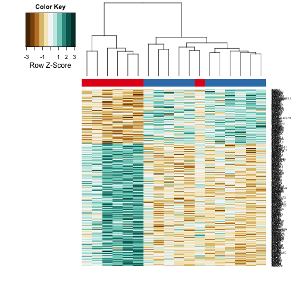

Analysis of Data for Acromegaly Patients by Heatmaps
=============================================================

Statistics
----------


```
## Warning: package 'knitcitations' was built under R version 3.1.1
```
This file was most recently processed on ``Sun Oct  5 08:14:52 2014``.  This uses the DESeq normalized data found in ../data/processed/RPKM_VSD_counts_table_Acromegaly.csv.


Differentially Expressed Genes
----------------------------------

To test the grouping of differentially expressed transcripts, we only examined genes with significantly different transcripts based on DESeq analysis.

  

```
## pdf 
##   3
```

```
## pdf 
##   2
```

References
-----------


Session Information
-------------------

```r
sessionInfo()
```

```
## R version 3.1.0 (2014-04-10)
## Platform: x86_64-apple-darwin13.1.0 (64-bit)
## 
## locale:
## [1] en_US.UTF-8/en_US.UTF-8/en_US.UTF-8/C/en_US.UTF-8/en_US.UTF-8
## 
## attached base packages:
## [1] stats     graphics  grDevices utils     datasets  methods   base     
## 
## other attached packages:
## [1] RColorBrewer_1.0-5  gplots_2.14.1       knitcitations_1.0-1
## [4] knitr_1.6          
## 
## loaded via a namespace (and not attached):
##  [1] bibtex_0.3-6       bitops_1.0-6       caTools_1.17.1    
##  [4] digest_0.6.4       evaluate_0.5.5     formatR_1.0       
##  [7] gdata_2.13.3       gtools_3.4.1       httr_0.5          
## [10] KernSmooth_2.23-13 lubridate_1.3.3    memoise_0.2.1     
## [13] plyr_1.8.1         Rcpp_0.11.2        RCurl_1.95-4.3    
## [16] RefManageR_0.8.34  RJSONIO_1.3-0      stringr_0.6.2     
## [19] tools_3.1.0        XML_3.98-1.1
```
