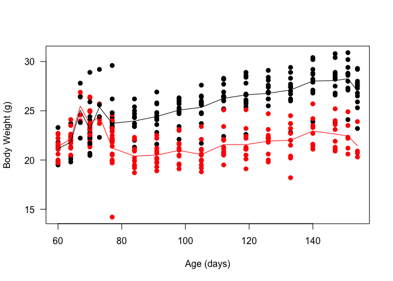
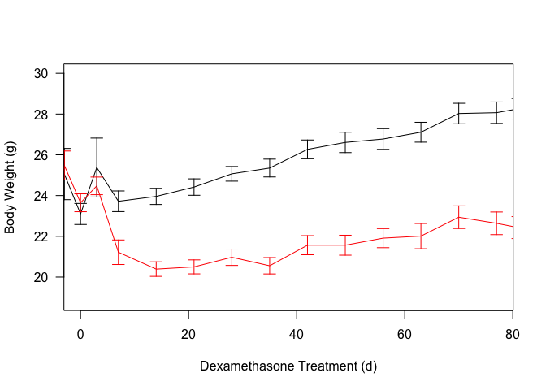
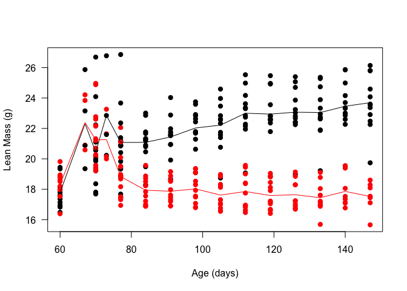
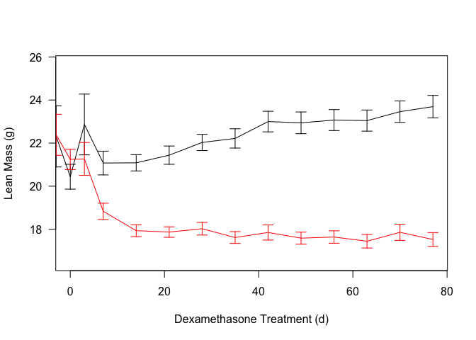
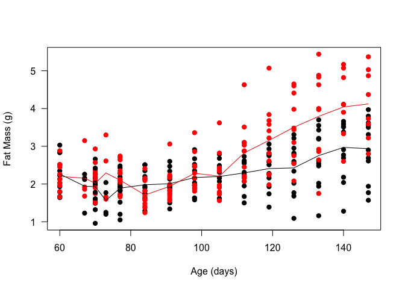
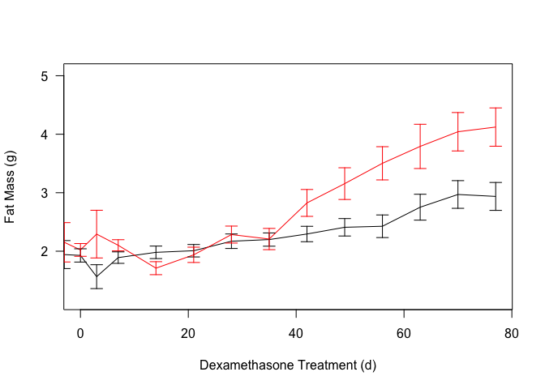
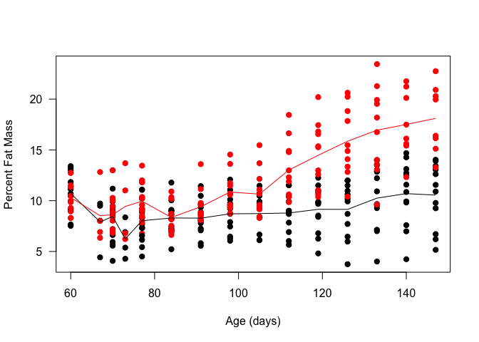
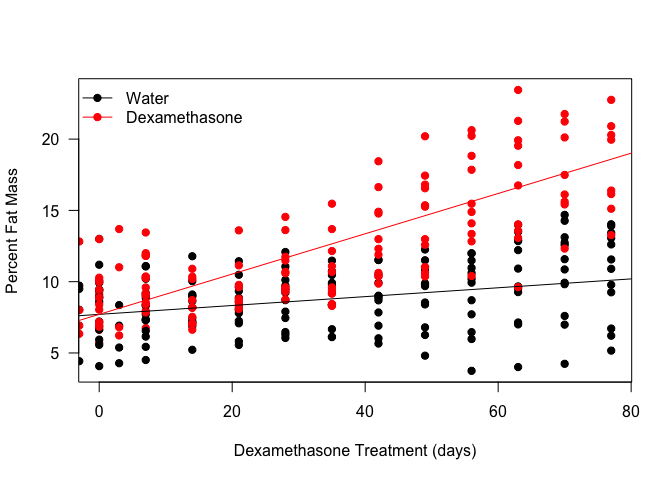

# Data Entry
This was from combined weights over several measurements of C57BL/6J Mice on treated with dexamethasone.  Some animals may appear multiple times in this analysis.  Data is downloaded in csv format from the mousedb website.  This includes only fed weights.  These mice were treated with 10 mg/kg/day starting at 70 days of age.


Data was downloaded from MouseDB then aand the data is saved as ../../data/raw/Body Composition Data.csv.  These data  was most recently updated on Sat Aug 18 15:33:06 2018.

# Body Weights

<!-- --><!-- -->

# Lean Mass

<!-- --><!-- -->

# Fat Mass

<!-- --><!-- -->

<!-- --><!-- -->

<!-- -->

Based on a linear mixed effects model, the p-value for an effect of Dexamethasone on the rate of change in percent fat mass was 1.4727383\times 10^{-31} (Chi-squared=136.6029851) with an increase of 0.7717172\% per week.  To test for normality in this model we did a Shapiro-Wilk test and found that the did not meet this assumption 7.0586952\times 10^{-4}.

# Session Information

```
## R version 3.5.0 (2018-04-23)
## Platform: x86_64-apple-darwin15.6.0 (64-bit)
## Running under: macOS High Sierra 10.13.6
## 
## Matrix products: default
## BLAS: /Library/Frameworks/R.framework/Versions/3.5/Resources/lib/libRblas.0.dylib
## LAPACK: /Library/Frameworks/R.framework/Versions/3.5/Resources/lib/libRlapack.dylib
## 
## locale:
## [1] en_US.UTF-8/en_US.UTF-8/en_US.UTF-8/C/en_US.UTF-8/en_US.UTF-8
## 
## attached base packages:
## [1] stats     graphics  grDevices utils     datasets  methods   base     
## 
## other attached packages:
## [1] lme4_1.1-18-1  Matrix_1.2-14  bindrcpp_0.2.2 dplyr_0.7.6   
## [5] knitr_1.20    
## 
## loaded via a namespace (and not attached):
##  [1] Rcpp_0.12.18     bindr_0.1.1      magrittr_1.5     MASS_7.3-50     
##  [5] splines_3.5.0    tidyselect_0.2.4 lattice_0.20-35  R6_2.2.2        
##  [9] rlang_0.2.2      minqa_1.2.4      stringr_1.3.1    tools_3.5.0     
## [13] grid_3.5.0       nlme_3.1-137     htmltools_0.3.6  yaml_2.2.0      
## [17] assertthat_0.2.0 rprojroot_1.3-2  digest_0.6.15    tibble_1.4.2    
## [21] crayon_1.3.4     nloptr_1.0.4     purrr_0.2.5      glue_1.3.0      
## [25] evaluate_0.11    rmarkdown_1.10   stringi_1.2.4    compiler_3.5.0  
## [29] pillar_1.3.0     backports_1.1.2  pkgconfig_2.0.2
```
