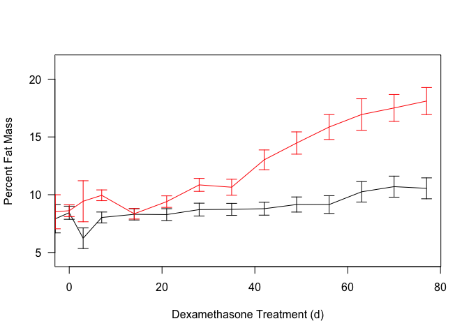

# Data Entry
This was from combined weights over several measurements of C57BL/6J Mice on treated with dexamethasone.  Some animals may appear multiple times in this analysis.  Data is downloaded in csv format from the mousedb website.  This includes only fed weights.  These mice were treated with 10 mg/kg/day starting at 70 days of age.


Data was downloaded from MouseDB then aand the data is saved as ../../data/raw/Body Composition Data.csv.  These data  was most recently updated on Sun Sep 23 07:52:47 2018.

# Body Weights

<!-- --><!-- -->

## Body Weight Statistics

<!-- -->


Table: Summary statistics for body weight at endpoint

 age   age.from.start  Treatment        average     sd      se    n   shapiro.p
----  ---------------  --------------  --------  -----  ------  ---  ----------
 147               77  Water               28.1   1.82   0.527   12       0.295
 147               77  Dexamethasone       22.6   1.57   0.555    8       0.439

At the end of the study, there was a 19.344 % decrease in body weight **(p=1.977&times; 10^-6^)** from a Student's *t*-test.  A levene's test has a p-value of 0.793.

Based on a linear mixed effects model, the p-value for an effect of Dexamethasone on the rate of change in body weight was 7.093&times; 10^-17^ (Chi-squared=69.647) with an increase of -0.32\% per week.  To test for normality in this model we did a Shapiro-Wilk test and found that the did not meet this assumption 7.613&times; 10^-15^.

# Lean Mass

<!-- --><!-- -->


Table: Summary statistics for lean mass at endpoint

 age   age.from.start  Treatment        average      sd     se    n   shapiro.p
----  ---------------  --------------  --------  ------  -----  ---  ----------
 147               77  Water               23.7   1.802   0.52   12       0.499
 147               77  Dexamethasone       17.5   0.904   0.32    8       0.287

At the end of the study, there was a 26.034 % decrease in fat-free mass **(p=5.142&times; 10^-8^)** from a Student's *t*-test.  A levene's test has a p-value of 0.142.

# Fat Mass

<!-- --><!-- -->


Table: Summary statistics for fat mass at endpoint

 age   age.from.start  Treatment        average      sd      se    n   shapiro.p
----  ---------------  --------------  --------  ------  ------  ---  ----------
 147               77  Water               2.94   0.827   0.239   12       0.241
 147               77  Dexamethasone       4.12   0.926   0.327    8       0.712

At the end of the study, there was a 40.38 % increase in fat mass **(p=0.008)** from a Student's *t*-test.  A levene's test has a p-value of 0.62


<!-- --><!-- -->

<!-- -->

Based on a linear mixed effects model, the p-value for an effect of Dexamethasone on the rate of change in percent fat mass was 1.473&times; 10^-31^ (Chi-squared=136.603) with an increase of 0.772\% per week.  To test for normality in this model we did a Shapiro-Wilk test and found that the did not meet this assumption 0.001.  


Table: Summary statistics for percent fat mass at endpoint

 age   age.from.start  Treatment        average     sd      se    n   shapiro.p
----  ---------------  --------------  --------  -----  ------  ---  ----------
 147               77  Water               10.6   3.14   0.905   12       0.164
 147               77  Dexamethasone       18.1   3.31   1.171    8       0.617

At the end of the study, there was a 71.585 % increase in fat mass **(p=0)** from a Student's *t*-test.  A levene's test has a p-value of 0.662

# Session Information

```
## R version 3.5.0 (2018-04-23)
## Platform: x86_64-apple-darwin15.6.0 (64-bit)
## Running under: macOS High Sierra 10.13.6
## 
## Matrix products: default
## BLAS: /Library/Frameworks/R.framework/Versions/3.5/Resources/lib/libRblas.0.dylib
## LAPACK: /Library/Frameworks/R.framework/Versions/3.5/Resources/lib/libRlapack.dylib
## 
## locale:
## [1] en_US.UTF-8/en_US.UTF-8/en_US.UTF-8/C/en_US.UTF-8/en_US.UTF-8
## 
## attached base packages:
## [1] stats     graphics  grDevices utils     datasets  methods   base     
## 
## other attached packages:
## [1] lme4_1.1-18-1  Matrix_1.2-14  ggplot2_3.0.0  bindrcpp_0.2.2
## [5] car_3.0-2      carData_3.0-1  dplyr_0.7.6    tidyr_0.8.1   
## [9] knitr_1.20    
## 
## loaded via a namespace (and not attached):
##  [1] tidyselect_0.2.4  purrr_0.2.5       splines_3.5.0    
##  [4] haven_1.1.2       lattice_0.20-35   colorspace_1.3-2 
##  [7] htmltools_0.3.6   yaml_2.2.0        rlang_0.2.2      
## [10] nloptr_1.0.4      pillar_1.3.0      foreign_0.8-71   
## [13] glue_1.3.0        withr_2.1.2       readxl_1.1.0     
## [16] bindr_0.1.1       plyr_1.8.4        stringr_1.3.1    
## [19] munsell_0.5.0     gtable_0.2.0      cellranger_1.1.0 
## [22] zip_1.0.0         evaluate_0.11     labeling_0.3     
## [25] rio_0.5.10        forcats_0.3.0     curl_3.2         
## [28] highr_0.7         Rcpp_0.12.18      backports_1.1.2  
## [31] scales_1.0.0      abind_1.4-5       hms_0.4.2        
## [34] digest_0.6.16     stringi_1.2.4     openxlsx_4.1.0   
## [37] rprojroot_1.3-2   grid_3.5.0        tools_3.5.0      
## [40] magrittr_1.5      lazyeval_0.2.1    tibble_1.4.2     
## [43] crayon_1.3.4      pkgconfig_2.0.2   MASS_7.3-50      
## [46] data.table_1.11.4 assertthat_0.2.0  minqa_1.2.4      
## [49] rmarkdown_1.10    R6_2.2.2          nlme_3.1-137     
## [52] compiler_3.5.0
```
